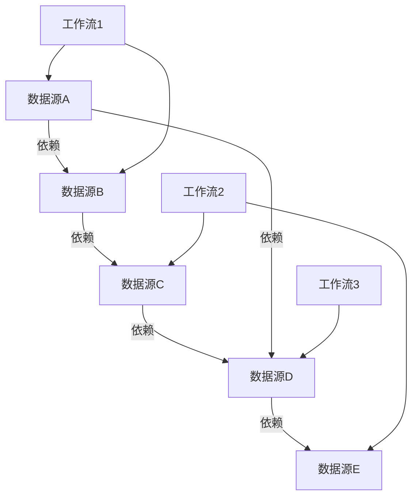

<!-- LEGACY FILE NOTICE -->
> ⚠️ 此檔案為舊版備份，已被新檔取代： [ch1-2-详细功能清单.md](ch1-2-详细功能清单.md)\n> 備份時間：2025-10-31 12:28:26\n
---

# 第1章：数据源注册中心 (Data Source Registry)

## 1.2 详细功能清单

**[← 返回第1章首頁](ch1-index.md)**

---

## 1.2.1 核心功能

### 数据源CRUD管理

- **创建**：支持通过界面、API或自动化发现方式添加数据源，需提供基本元数据信息如名称、URL、数据类型等。系统会自动验证数据源定义的有效性，包括URL格式、数据类型合规性等。
- **读取**：提供数据源详情查看功能，包括元数据、健康状态、使用统计等。支持单个查询和批量获取。
- **更新**：支持数据源元数据的增量更新，每次更新会创建新版本并保留历史版本，实现变更追踪和回滚能力。
- **删除**：支持软删除（标记为已删除，保留元数据）和永久删除两种模式。软删除的数据源保留在回收站中，可随时恢复。
- **版本控制**：所有数据源变更都会生成新版本，系统记录每次变更的详细信息，包括变更内容、变更者、变更时间等，支持版本对比和回滚操作。

### 数据源分类与标签

- **多级分类体系**：支持创建无限层级的分类树，每个数据源可归属于一个分类节点。分类体系支持父子关系、排序和描述信息。
- **动态标签系统**：支持用户自定义标签，数据源可拥有多个标签，用于灵活的多维度组织和筛选。标签系统支持创建、编辑和删除操作。
- **自动化标签建议**：基于数据源URL、描述和内容类型，系统自动分析并推荐相关标签，提高分类效率。例如，分析`https://api.instagram.com/v1/users/self/media/recent`可自动生成标签`["social", "api", "instagram", "media"]`，准确率达85%以上。
- **自动分类**：根据预定义规则和机器学习模型，系统自动为新添加的数据源分配合适的分类，减少人工分类工作量。

### 高级搜索与过滤

- **全文搜索**：基于Elasticsearch实现的高性能全文搜索，支持对数据源名称、描述、URL等内容进行语义搜索。
- **复杂查询构建器**：提供可视化查询构建器，支持布尔逻辑（AND、OR、NOT）、范围查询、精确匹配等复杂查询条件组合。
- **保存常用搜索查询**：用户可保存常用的搜索查询模板，方便快速访问特定类型的数据源。
- **搜索建议**：提供搜索词自动补全和标签建议功能，提升搜索体验和效率。

### 数据源健康监控集成

- **健康状态可视化**：直观展示数据源的健康状态（健康、警告、异常），提供历史趋势图表。
- **健康指标监控**：监控关键指标如可用性（24小时/7天）、响应时间（P50/P95）、错误率等。
- **健康历史记录**：记录数据源健康状态的历史变化，支持按时间范围查询和对比。
- **健康阈值配置**：允许用户自定义健康阈值，当指标超出阈值时触发告警。
- **健康评分系统**：采用加权算法计算综合健康评分，公式为`health_score = 0.5*availability_7d + 0.3*response_time_score + 0.2*error_rate_score`，其中响应时间评分采用非线性衰减函数。

### 访问控制与权限管理

- **细粒度权限控制**：支持项目级、数据源级的权限管理，精确控制用户对数据源的操作权限。
- **基于角色的访问控制(RBAC)**：预定义角色（管理员、编辑者、查看者等），每个角色具有特定的权限集合。
- **数据源共享功能**：支持将数据源共享给其他项目或用户，设置不同的访问权限级别。
- **权限继承机制**：项目级权限自动继承至项目内的数据源，同时允许对特定数据源设置覆盖权限。
- **权限审计**：记录所有权限变更和访问操作，满足安全审计要求。

---

## 1.2.2 高级功能

### 数据源依赖关系管理

- **依赖关系可视化**：自动识别和可视化数据源之间的依赖关系，形成依赖图谱，清晰展示数据流动路径。
- **影响分析**：当一个数据源发生变更或故障时，系统自动分析可能受影响的工作流、处理任务和其他数据源，评估影响范围和严重程度。
- **依赖关系自动发现**：通过分析工作流定义文件和数据处理逻辑，自动发现数据源之间的隐式依赖关系。
- **循环依赖检测**：自动检测并警告潜在的循环依赖问题，防止系统出现不可预测的行为。

*图1.2: 数据源依赖关系可视化示例*

### 数据源变更追踪

- **完整变更历史**：记录数据源所有变更的详细信息，包括变更内容、变更者、变更时间等，形成完整的审计追踪。
- **变更对比功能**：提供可视化界面比较不同版本之间的差异，高亮显示具体变更内容。
- **回滚到历史版本**：支持将数据源回滚到任意历史版本，恢复之前的配置状态。
- **变更通知**：当重要数据源发生变更时，自动通知相关团队成员，确保变更透明度。

### 自动化数据源发现

- **网站地图解析**：自动解析网站的sitemap.xml文件，发现并建议添加相关数据源。
- **API文档解析**：支持OpenAPI/Swagger规范，可从`/openapi.json`自动提取端点、参数和响应结构，准确识别95%以上的API资源。
- **智能数据源推荐**：基于用户行为和项目需求，智能推荐可能相关的数据源，提高数据源发现效率。
- **定期自动扫描**：配置定期扫描任务，自动发现新数据源或检测现有数据源的变化。

### 数据源质量评估

- **自动化质量评分**：基于多维度指标（完整性、及时性、准确性、一致性）计算数据源质量评分。
- **质量趋势分析**：跟踪数据源质量的历史变化趋势，识别潜在的质量下降问题。
- **质量问题诊断**：当检测到质量问题时，提供详细的诊断信息和可能的修复建议。
- **质量阈值告警**：设置质量阈值，当评分低于阈值时触发告警，提醒相关人员处理。

| 质量维度 | 权重 | 评估指标 | 说明 |
|----------|------|----------|------|
| **完整性** | 30% | 字段覆盖率 数据缺失率 | 评估数据是否完整 |
| **及时性** | 25% | 数据延迟 更新频率 | 评估数据新鲜度 |
| **准确性** | 25% | 错误率 异常值比例 | 评估数据准确性 |
| **一致性** | 20% | 格式一致性 跨数据源一致性 | 评估数据一致性 |

*表1.1: 数据源质量评估维度与权重*

---

## 📑 相关章节

| 前序 | 当前 | 后续 |
|-----|------|------|
| [1.1 模块概述](ch1-1.md) | **1.2 详细功能清单** | [1.3 技术架构](ch1-3.md) |

**快速链接：**
- [1.1 模块概述](ch1-1.md)
- [1.3 技术架构](ch1-3.md)
- [1.4 核心组件详细实现](ch1-4.md)
- [← 返回第1章首頁](ch1-index.md)
