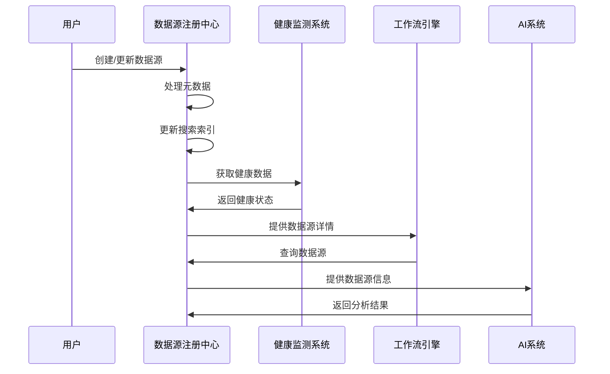

<!-- LEGACY FILE NOTICE -->
> ⚠️ 此檔案為舊版備份，已被新檔取代： [ch1-3-技术架构.md](ch1-3-技术架构.md)\n> 備份時間：2025-10-31 12:28:26\n
---

# 第1章：数据源注册中心 (Data Source Registry)

## 1.3 技术架构

**[← 返回第1章首頁](ch1-index.md)**

---

## 1.3.1 架构图

```
┌─────────────────────────────────────────────────────────────────────────────────────────────┐
│                                 数据源注册中心 (DSR)                                          │
├───────────────────────┬───────────────────────┬───────────────────────────────────────────────┤
│  核心服务层           │  集成层              │  支持服务层                                 │
├───────────────────────┼───────────────────────┼───────────────────────────────────────────────┤
│ • 元数据管理服务      │ • 数据源发现适配器    │ • 搜索索引服务                             │
│ • 分类管理服务        │ • 健康监测集成        │ • 缓存服务                                 │
│ • 标签管理服务        │ • API网关             │ • 通知服务                                 │
│ • 搜索服务            │ • Webhook支持         │ • 审计日志服务                             │
│ • 权限管理服务        │ • SDK支持             │ • 指标收集服务                             │
└───────────────────────┴───────────────────────┴─────────────────────────────────────────────┘
```

*图1.3: 数据源注册中心三层架构图*

---

## 1.3.2 服务边界与交互

### 输入

- **用户操作**：通过Web界面、命令行工具(CLI)或API进行的数据源管理操作
- **健康监测系统更新**：定期接收来自健康监测系统的数据源健康状态更新
- **数据源发现服务**：自动发现新数据源的事件和建议
- **外部系统Webhook**：接收来自其他系统的事件通知，如数据源变更、工作流完成等

### 输出

- **数据源元数据**：向工作流引擎提供数据源详细信息，支持数据处理任务配置
- **健康状态**：向监控系统提供数据源健康指标，用于平台级健康监控
- **分类信息**：向推荐引擎提供数据源分类信息，支持个性化推荐
- **变更事件**：向事件总线发布数据源变更事件，触发相关系统更新

### 关键服务交互序列



*图1.4: 数据源注册中心关键服务交互序列图*

---

## 📑 相关章节

| 前序 | 当前 | 后续 |
|-----|------|------|
| [1.2 详细功能清单](ch1-2.md) | **1.3 技术架构** | [1.4 核心组件详细实现](ch1-4.md) |

**快速链接：**
- [1.2 详细功能清单](ch1-2.md)
- [1.4 核心组件详细实现](ch1-4.md)
- [1.5 数据模型详细定义](ch1-5.md)
- [← 返回第1章首頁](ch1-index.md)
