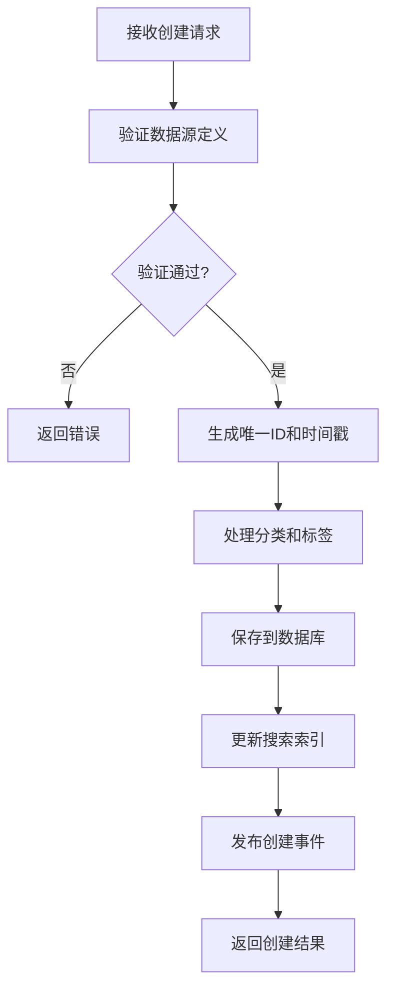
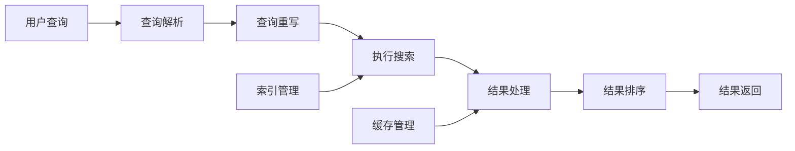
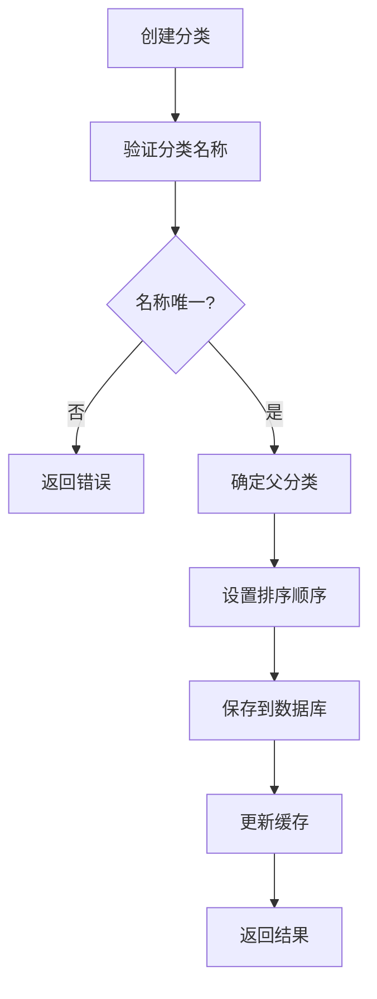

<!-- LEGACY FILE NOTICE -->
> ⚠️ 此檔案為舊版備份，已被新檔取代： [ch1-4-核心组件详细实现.md](ch1-4-核心组件详细实现.md)\n> 備份時間：2025-10-31 12:28:26\n
---

# 第1章：数据源注册中心 (Data Source Registry)

## 1.4 核心组件详细实现

**[← 返回第1章首頁](ch1-index.md)**

---

## 1.4.1 元数据管理服务

元数据管理服务是数据源注册中心的核心业务组件，负责数据源元数据的全生命周期管理。该服务采用领域驱动设计(DDD)原则，将业务逻辑封装在领域模型中，确保业务规则的一致性和可维护性。

### 核心设计理念

- **聚合根管理**：将数据源作为聚合根，确保业务一致性边界内的操作原子性
- **领域事件**：每个状态变更产生领域事件，支持事件溯源和CQRS模式
- **值对象**：使用值对象封装领域概念（如URL、数据源名称等），提高领域模型健壮性
- **无状态服务**：应用服务层保持无状态，便于水平扩展

### 数据源创建流程

*图1.5: 数据源创建流程图*

### 数据源更新机制

- **版本控制**：每次更新创建新版本，保留历史版本
- **变更记录**：记录变更详情，包括变更内容、变更者、变更时间
- **版本对比**：支持可视化比较两个版本的差异
- **回滚功能**：支持回滚到任意历史版本

### 数据源健康集成

- **健康状态获取**：定期从健康监测系统获取最新健康状态
- **健康指标整合**：将健康指标整合到数据源元数据中
- **健康评分计算**：基于多维度指标计算综合健康评分
- **健康阈值告警**：当健康评分低于阈值时触发告警

| 健康状态 | 阈值范围 | 说明 | 响应建议 |
|----------|----------|------|----------|
| **健康** | ≥ 0.85 | 数据源运行正常 | 无需操作 |
| **警告** | 0.70-0.84 | 数据源存在潜在问题 | 监控并调查 |
| **异常** | < 0.70 | 数据源运行异常 | 立即处理 |
| **未知** | N/A | 未获取到健康数据 | 检查健康监测 |

*表1.2: 数据源健康状态分类与阈值*

---

## 1.4.2 搜索服务

搜索服务提供高性能的数据源搜索能力，基于Elasticsearch构建，支持复杂的查询场景和大规模数据集。

### 搜索功能架构

*图1.6: 搜索服务功能架构图*

### 搜索性能优化策略

- **过滤上下文优化**：使用`bool.filter`代替`bool.must`处理不需要评分的条件，性能提升3-5倍
- **字段选择优化**：使用`_source`过滤只返回必要字段，减少网络传输量
- **深分页优化**：使用`search_after`替代`from/size`进行深分页，性能提升10-15倍
- **请求缓存**：对重复查询结果进行缓存，响应时间降低90%
- **索引排序优化**：使用`index.sort.field`预先排序索引，性能提升2-3倍

### 搜索语法参考

| 语法 | 说明 | 示例 |
|------|------|------|
| `field:value` | 精确匹配 | `category:social` |
| `field:>value` | 范围查询 | `health_score:>0.9` |
| `field:(value1 OR value2)` | 多值查询 | `tags:(api OR social)` |
| `+term1 -term2` | 必须包含/排除 | `+instagram -facebook` |
| `"exact phrase"` | 短语匹配 | `"social media"` |
| `*` | 通配符 | `api*` |

*表1.3: 搜索语法参考表*

### 搜索API性能指标

| 查询类型 | 数据规模 | 优化前(P99) | 优化后(P99) | 提升 |
|----------|----------|-------------|-------------|------|
| 简单查询 | 10万数据源 | 120ms | 35ms | 3.4x |
| 复杂过滤 | 10万数据源 | 250ms | 65ms | 3.8x |
| 深分页(第100页) | 10万数据源 | 1200ms | 80ms | 15x |
| 聚合查询 | 10万数据源 | 450ms | 120ms | 3.75x |

*表1.4: 搜索性能优化效果对比*

---

## 1.4.3 分类管理服务

分类管理服务实现数据源的分类体系管理，支持多级分类结构和灵活的组织方式。

### 分类模型设计

- **树形结构**：采用树形结构组织分类，支持无限层级
- **路径表示**：使用路径字符串（如"root.social.instagram"）表示分类位置
- **排序支持**：每个分类节点支持自定义排序顺序
- **元数据扩展**：支持为分类添加描述、图标等扩展信息

### 分类管理流程

*图1.7: 分类创建流程图*

### 分类算法

- **自动分类**：基于规则和机器学习的自动分类算法
  - URL模式匹配：分析URL中的关键词确定分类
  - 内容类型分析：根据content-type确定数据类型
  - 语义分析：使用NLP技术分析描述文本确定分类
- **分类建议**：基于用户行为和历史选择，提供个性化分类建议

### 分类树管理

- **树构建算法**：高效构建和维护分类树结构
- **树遍历优化**：优化深度优先和广度优先遍历性能
- **子树操作**：支持对子树进行批量操作（移动、删除等）
- **循环检测**：防止创建导致循环引用的分类结构

### 分类缓存策略

- **树结构缓存**：缓存完整的分类树，减少数据库查询
- **缓存失效机制**：分类变更时自动失效相关缓存
- **缓存预热**：系统启动时预热常用分类树
- **版本化缓存**：支持缓存多个版本的分类树，便于回滚

| 缓存策略 | TTL | 适用场景 | 说明 |
|----------|-----|----------|------|
| **分类树缓存** | 300s | 分类查询 | 缓存完整分类树 |
| **标签缓存** | 60s | 搜索建议 | 缓存常用标签 |
| **数据源详情缓存** | 60s | 数据源查询 | 缓存单个数据源详情 |
| **数据源列表缓存** | 30s | 列表查询 | 缓存过滤后的数据源列表 |

*表1.5: 缓存策略配置表*

---

## 📑 相关章节

| 前序 | 当前 | 后续 |
|-----|------|------|
| [1.3 技术架构](ch1-3.md) | **1.4 核心组件详细实现** | [1.5 数据模型详细定义](ch1-5.md) |

**快速链接：**
- [1.3 技术架构](ch1-3.md)
- [1.5 数据模型详细定义](ch1-5.md)
- [1.6 API详细规范](ch1-6.md)
- [← 返回第1章首頁](ch1-index.md)
