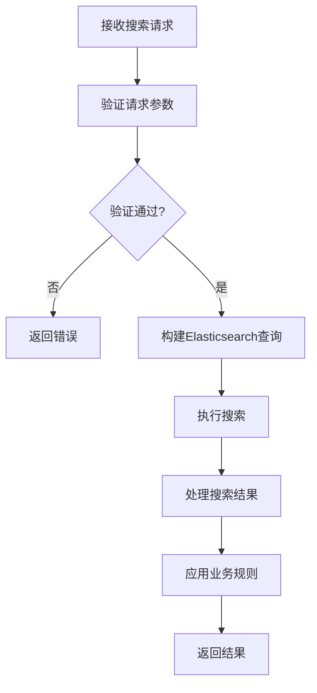

<!-- LEGACY FILE NOTICE -->
> ⚠️ 此檔案為舊版備份，已被新檔取代： [ch1-6-API详细规范.md](ch1-6-API详细规范.md)\n> 備份時間：2025-10-31 12:28:26\n
---

# 第1章：数据源注册中心 (Data Source Registry)

## 1.6 API详细规范

**[← 返回第1章首頁](ch1-index.md)**

---

## 1.6.1 数据源管理API

数据源管理API提供对数据源的完整CRUD操作，遵循RESTful设计原则，同时考虑实际业务需求进行适当扩展。

### API设计原则

| 原则 | 说明 | 实现方式 |
|------|------|----------|
| **资源导向** | 以数据源为核心资源 | /api/v1/data-sources/{id} |
| **版本控制** | API路径包含版本号 | /api/v1/... |
| **标准HTTP方法** | 正确使用GET、POST等方法 | POST创建，GET查询等 |
| **状态码规范** | 使用标准HTTP状态码 | 200成功，400请求错误等 |
| **分页支持** | 列表查询提供分页参数 | page, page_size |
| **ETag支持** | 实现条件更新 | If-Match头 |

*表1.12: API设计原则与实现*

### 核心API端点

**创建数据源 (POST /api/v1/data-sources)**
- **功能**：创建新的数据源
- **请求体**：包含数据源元数据（名称、URL、分类等）
- **响应**：201 Created，包含创建的数据源详情
- **错误处理**：
  - 400 Bad Request：请求格式错误
  - 403 Forbidden：权限不足
  - 409 Conflict：名称冲突

**获取数据源列表 (GET /api/v1/data-sources)**
- **功能**：获取数据源列表，支持过滤、排序和分页
- **查询参数**：
  - `category`：按分类过滤
  - `status`：按状态过滤
  - `tags`：按标签过滤（可多值）
  - `page`：页码
  - `page_size`：每页数量
- **响应**：200 OK，包含数据源列表和分页信息
- **性能考虑**：限制最大页码，避免深分页问题

### API错误码规范

| 错误码 | HTTP状态 | 说明 | 建议操作 |
|--------|----------|------|----------|
| `invalid_request` | 400 | 请求格式错误 | 检查请求体格式 |
| `invalid_url` | 400 | URL格式无效 | 验证URL格式 |
| `duplicate_data_source` | 409 | 数据源已存在 | 使用不同名称或URL |
| `permission_denied` | 403 | 权限不足 | 检查用户角色和权限 |
| `not_found` | 404 | 资源不存在 | 验证资源ID |
| `version_conflict` | 409 | 版本冲突 | 获取最新版本后重试 |
| `rate_limit_exceeded` | 429 | 请求过多 | 降低请求频率 |

*表1.13: API错误码规范*

---

## 1.6.2 搜索API

搜索API提供高级搜索能力，支持复杂查询条件和灵活的结果定制。

### API设计特点

- **专用搜索端点**：使用POST方法，支持复杂查询体
- **结构化查询**：查询条件以JSON格式提供，结构清晰
- **结果定制**：支持字段选择、排序和分页
- **性能优化**：限制最大返回结果数，避免性能问题

### 搜索API请求流程

*图1.8: 搜索API请求处理流程图*

### 搜索API性能指标

| 查询类型 | P50 (ms) | P95 (ms) | P99 (ms) | QPS |
|----------|----------|----------|----------|-----|
| 简单查询 | 15 | 35 | 50 | 1200 |
| 复杂过滤 | 25 | 60 | 85 | 800 |
| 深分页(第100页) | 40 | 75 | 100 | 600 |
| 聚合查询 | 50 | 100 | 150 | 400 |
| 空查询(仅过滤) | 10 | 25 | 40 | 1500 |

*表1.14: 搜索API性能指标*

---

## 📑 相关章节

| 前序 | 当前 | 后续 |
|-----|------|------|
| [1.5 数据模型详细定义](ch1-5.md) | **1.6 API详细规范** | [1.7 性能优化策略](ch1-7.md) |

**快速链接：**
- [1.5 数据模型详细定义](ch1-5.md)
- [1.7 性能优化策略](ch1-7.md)
- [1.8 安全考虑](ch1-8.md)
- [← 返回第1章首頁](ch1-index.md)
