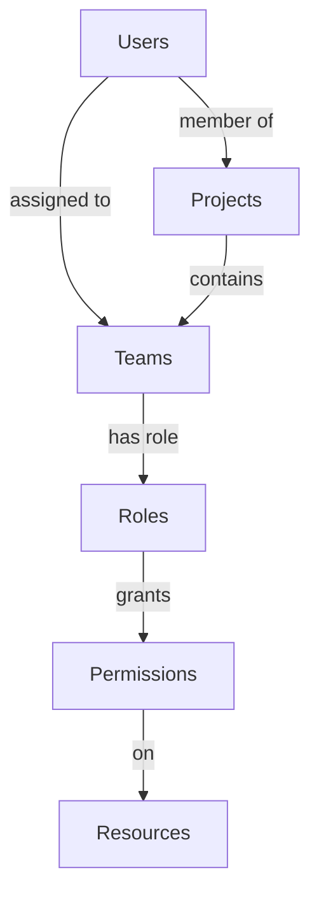

<!-- LEGACY FILE NOTICE -->
> ⚠️ 此檔案為舊版備份，已被新檔取代： [ch1-8-安全考虑.md](ch1-8-安全考虑.md)\n> 備份時間：2025-10-31 12:28:26\n
---

# 第1章：数据源注册中心 (Data Source Registry)

## 1.8 安全考虑

**[← 返回第1章首頁](ch1-index.md)**

---

## 1.8.1 访问控制

### 基于角色的访问控制(RBAC)模型

*图1.10: RBAC模型关系图*

### 权限级别定义

| 权限级别 | 数据源操作 | 说明 |
|----------|------------|------|
| **查看者** | 读取 | 只能查看数据源详情和使用数据源 |
| **编辑者** | 读取、更新 | 可以编辑数据源定义和配置 |
| **管理员** | 读取、更新、删除 | 完全控制数据源，包括删除和权限管理 |
| **所有者** | 读取、更新、删除、共享 | 创建者权限，可共享数据源 |

*表1.21: 权限级别定义*

---

## 1.8.2 数据安全

### 数据安全控制矩阵

| 数据类型 | 加密方式 | 存储方式 | 访问控制 | 审计要求 |
|----------|----------|----------|----------|----------|
| **API密钥** | KMS加密 | 密文存储 | 字段级控制 | 完整审计 |
| **用户凭证** | KMS加密 | 密文存储 | 严格控制 | 完整审计 |
| **业务数据** | 透明加密 | 密文存储 | 项目级控制 | 操作审计 |
| **元数据** | 无 | 明文存储 | 基于角色 | 关键操作审计 |
| **日志数据** | 部分加密 | 密文/明文 | 只读访问 | 无 |

*表1.22: 数据安全控制矩阵*

### 加密性能指标

| 操作 | 数据大小 | 平均时间 | P99时间 | 说明 |
|------|----------|----------|---------|------|
| 加密 | 100字节 | 0.5ms | 1.2ms | API密钥加密 |
| 加密 | 1KB | 0.8ms | 1.5ms | 配置数据加密 |
| 加密 | 10KB | 2.3ms | 4.0ms | 大文档加密 |
| 解密 | 100字节 | 0.4ms | 1.0ms | API密钥解密 |
| 解密 | 1KB | 0.7ms | 1.3ms | 配置数据解密 |
| 解密 | 10KB | 2.0ms | 3.5ms | 大文档解密 |

*表1.23: 加密性能指标*

---

## 📑 相关章节

| 前序 | 当前 | 后续 |
|-----|------|------|
| [1.7 性能优化策略](ch1-7.md) | **1.8 安全考虑** | [1.9 与其他模块的交互](ch1-9.md) |

**快速链接：**
- [1.7 性能优化策略](ch1-7.md)
- [1.9 与其他模块的交互](ch1-9.md)
- [← 返回第1章首頁](ch1-index.md)
