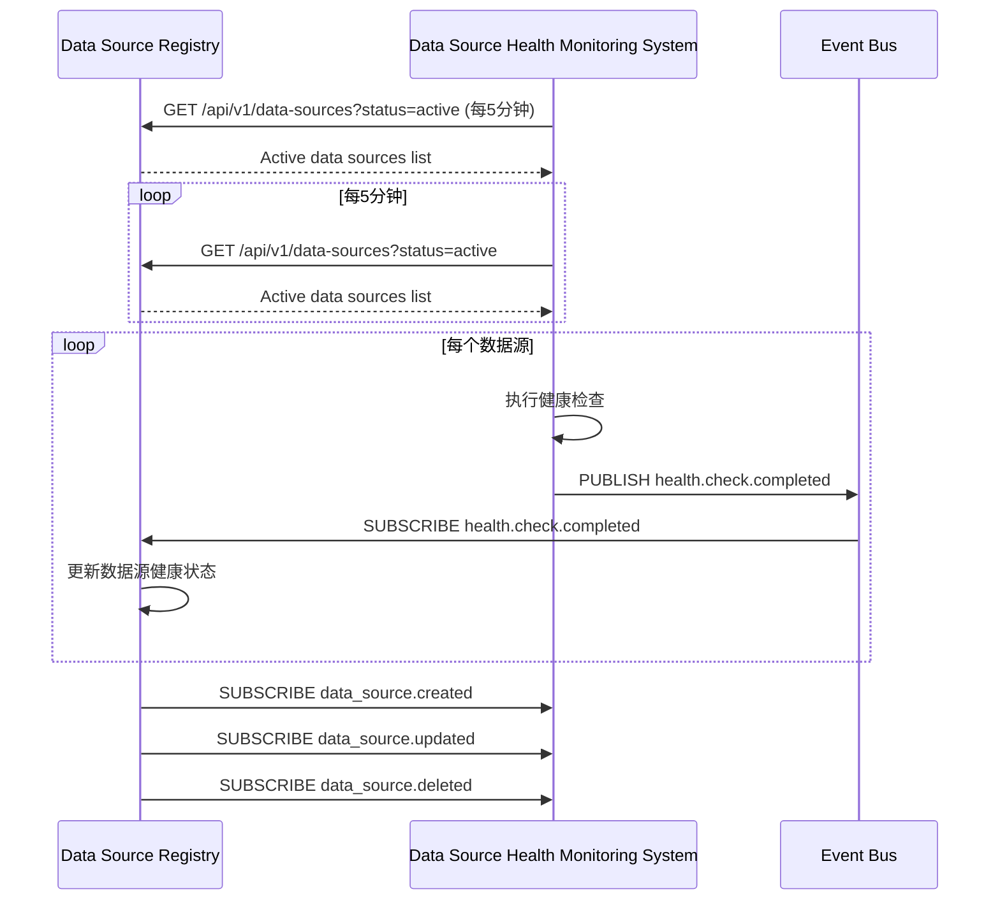
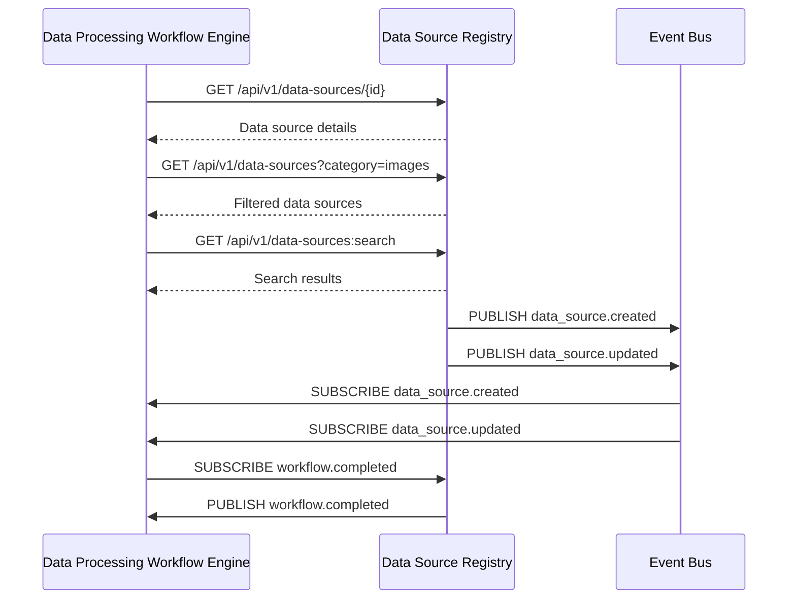
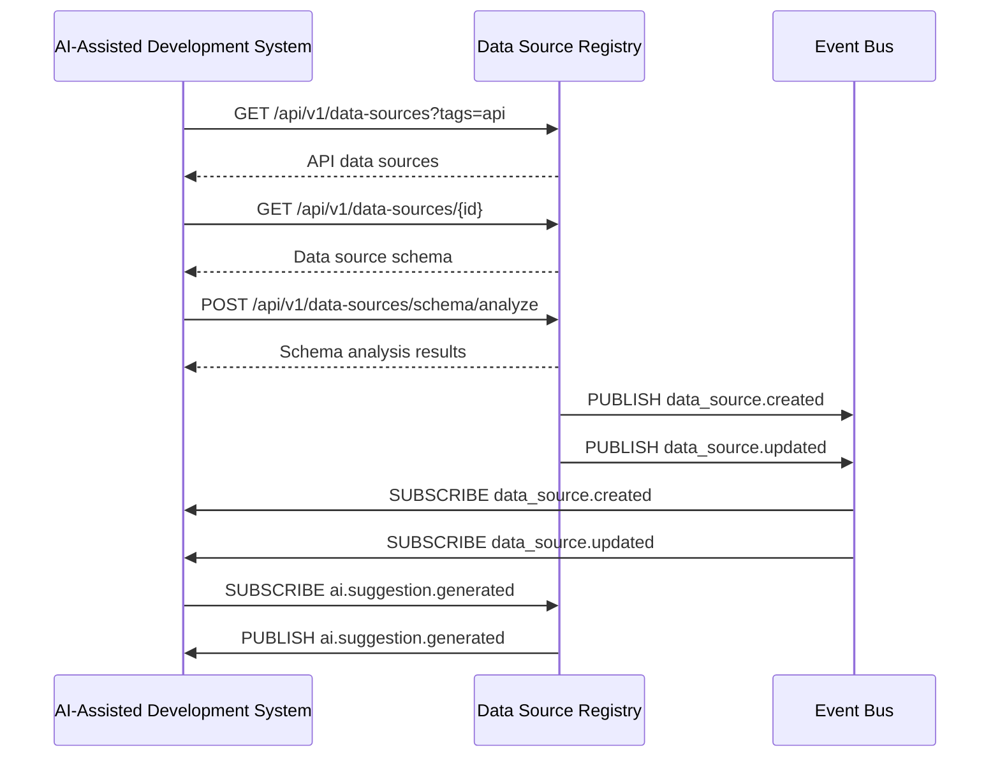

<!-- LEGACY FILE NOTICE -->
> ⚠️ 此檔案為舊版備份，已被新檔取代： [ch1-9-与其他模块的交互.md](ch1-9-与其他模块的交互.md)\n> 備份時間：2025-10-31 12:28:26\n
---

# 第1章：数据源注册中心 (Data Source Registry)

## 1.9 与其他模块的交互

**[← 返回第1章首頁](ch1-index.md)**

---

## 1.9.1 与数据源健康监测系统交互

*图1.11: 与数据源健康监测系统交互序列图*

### 交互协议关键参数

| 参数 | 类型 | 必填 | 说明 | 示例 |
|------|------|------|------|------|
| `status` | string | 否 | 数据源状态过滤 | "active" |
| `last_updated_after` | timestamp | 否 | 仅获取更新时间之后的数据 | "2023-06-15T10:00:00Z" |
| `limit` | integer | 否 | 返回结果数量限制 | 100 |
| `offset` | integer | 否 | 分页偏移量 | 0 |
| `include_health` | boolean | 否 | 是否包含健康信息 | true |

*表1.24: 健康监测系统交互协议参数*

---

## 1.9.2 与数据处理工作流引擎交互

*图1.12: 与数据处理工作流引擎交互序列图*

### 工作流引擎查询优化对比

| 查询方式 | 请求量 | 响应时间 | 数据传输量 | 说明 |
|----------|--------|----------|------------|------|
| **REST API (全量)** | 1000/分钟 | 120ms | 5MB/分钟 | 每次获取完整数据 |
| **REST API (字段选择)** | 1000/分钟 | 80ms | 2MB/分钟 | 仅获取必要字段 |
| **GraphQL** | 1000/分钟 | 60ms | 1.5MB/分钟 | 精确字段选择 |
| **事件驱动** | 50/分钟 | 10ms | 0.1MB/分钟 | 仅获取变更数据 |

*表1.25: 工作流引擎查询方式对比*

---

## 1.9.3 与AI辅助开发系统交互

*图1.13: 与AI辅助开发系统交互序列图*

### AI辅助开发系统交互协议

| 端点 | 方法 | 请求 | 响应 | 说明 |
|------|------|------|------|------|
| `/api/v1/data-sources/schema/analyze` | POST | `{"data_source_id": "ds-7a8b9c0d"}` | `{"fields": [{"name": "id", "type": "string", "confidence": 0.98}, ...]}` | 分析数据源schema |
| `/api/v1/data-sources/{id}/ai/suggestions` | GET | - | `{"suggestions": [{"type": "field_mapping", "source": "id", "target": "user_id", "confidence": 0.95}, ...]}` | 获取AI建议 |
| `/api/v1/data-sources/ai/feedback` | POST | `{"suggestion_id": "sug-123", "accepted": true}` | 204 No Content | 提供反馈 |

*表1.26: AI辅助开发系统交互协议*

---

## 📑 相关章节

| 前序 | 当前 | 后续 |
|-----|------|------|
| [1.8 安全考虑](ch1-8.md) | **1.9 与其他模块的交互** | - |

**快速链接：**
- [1.8 安全考虑](ch1-8.md)
- [← 返回第1章首頁](ch1-index.md)
- [← 返回到原始 ch1.md](ch1.md)
