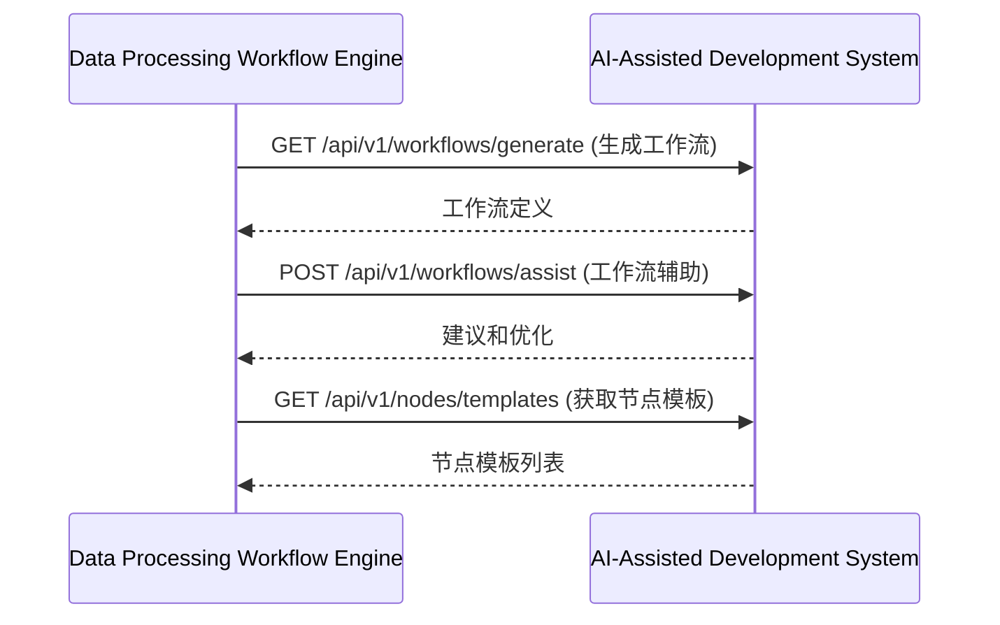
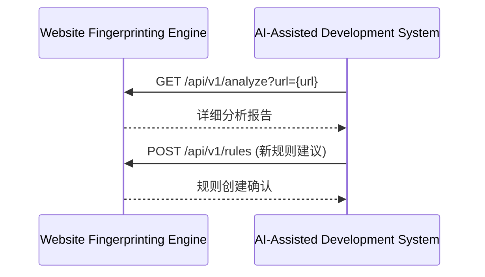
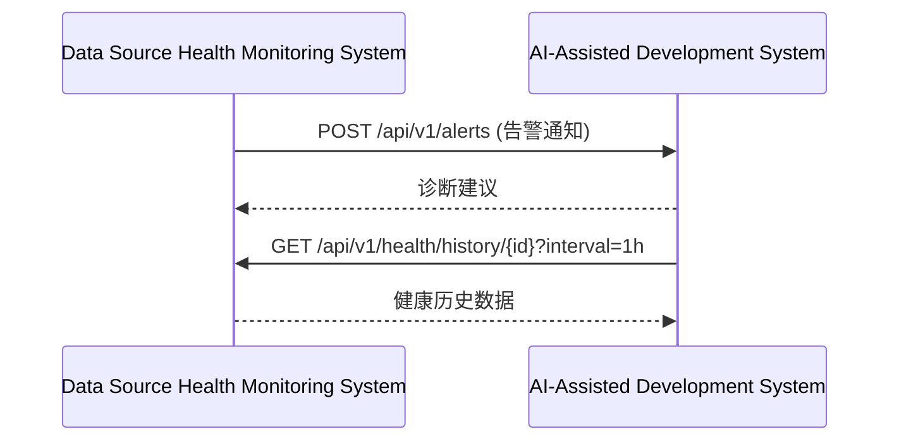
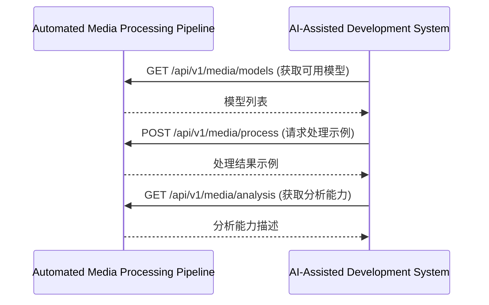

<!-- LEGACY FILE NOTICE -->
> ⚠️ 此檔案為舊版備份，已被新檔取代： [ch6-9-与其他模块的交互.md](ch6-9-与其他模块的交互.md)\n> 備份時間：2025-10-31 12:28:26\n
---

**[← 返回第6章首頁](ch6-index.md)**

---

### 6.9 与其他模块的交互

#### 6.9.1 与数据处理工作流引擎交互

#### 6.9.2 与网站指纹分析引擎交互

#### 6.9.3 与数据源健康监测系统交互

#### 6.9.4 与自动化媒体处理管道交互

---

## 📑 相关章节

| 前序 | 当前 | 后续 |
|-----|------|------|
| [6.8](ch6-8.md) | **6.9** | - |

**快速链接：**
- [← 返回第6章首頁](ch6-index.md)
