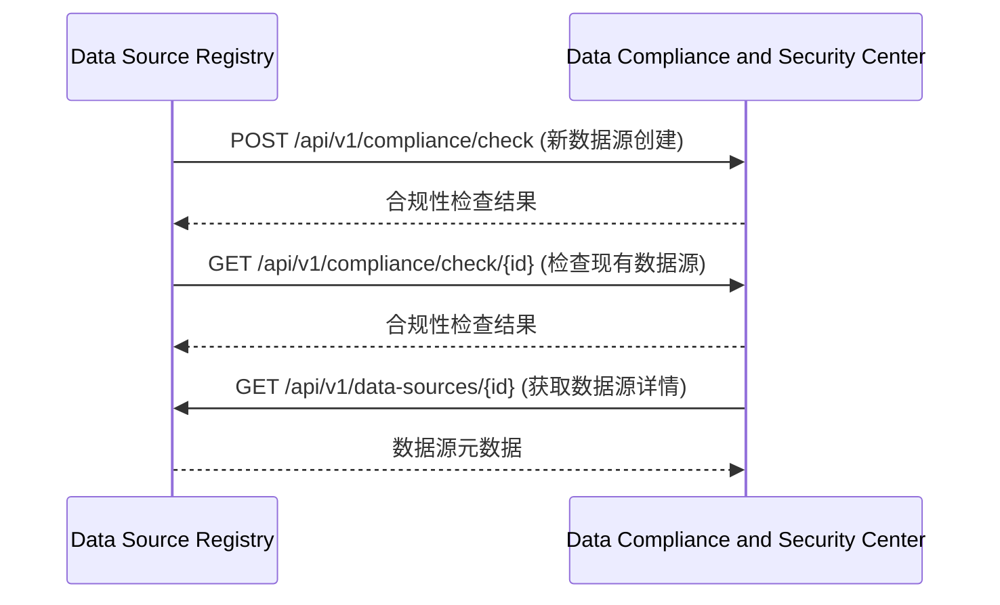
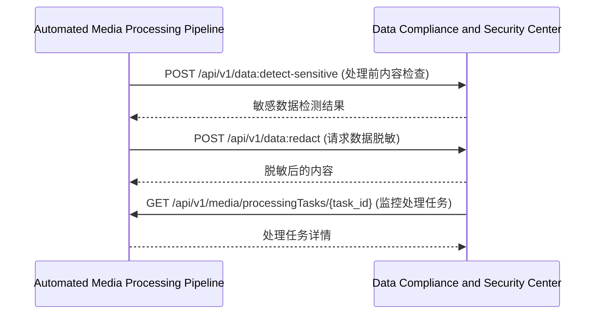
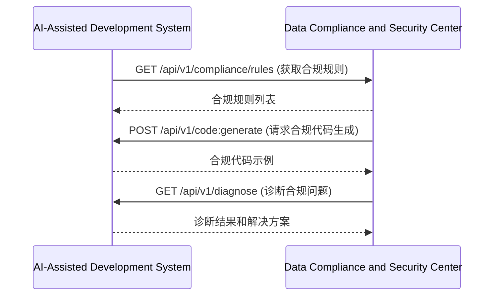
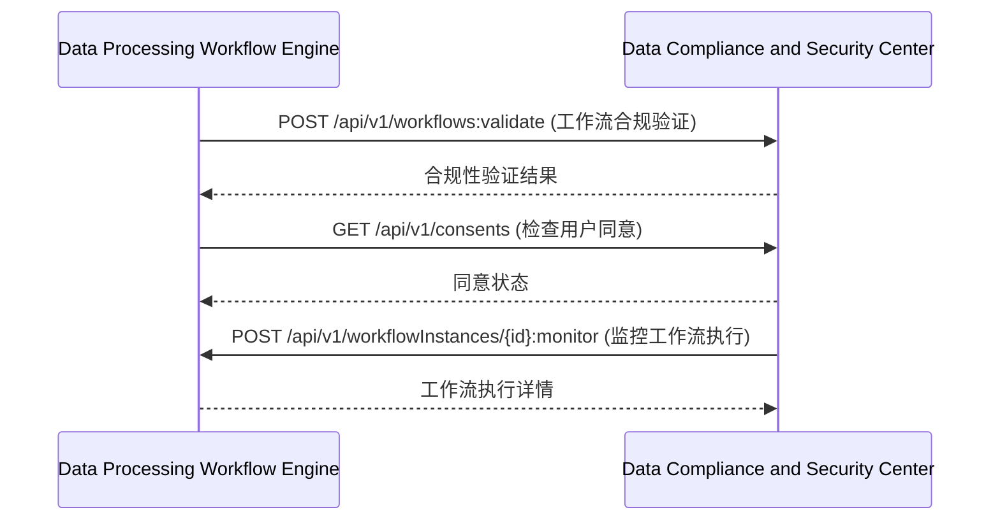

<!-- LEGACY FILE NOTICE -->
> ⚠️ 此檔案為舊版備份，已被新檔取代： [ch7-9-与其他模块的交互.md](ch7-9-与其他模块的交互.md)\n> 備份時間：2025-10-31 12:28:26\n
---

**[← 返回第7章首頁](ch7-index.md)**

---

### 7.9 与其他模块的交互

#### 7.9.1 与数据源注册中心交互

#### 7.9.2 与自动化媒体处理管道交互

#### 7.9.3 与AI辅助开发系统交互

#### 7.9.4 与数据处理工作流引擎交互

---

## 📑 相关章节

| 前序 | 当前 | 后续 |
|-----|------|------|
| [7.8](ch7-8.md) | **7.9** | - |

**快速链接：**
- [← 返回第7章首頁](ch7-index.md)
