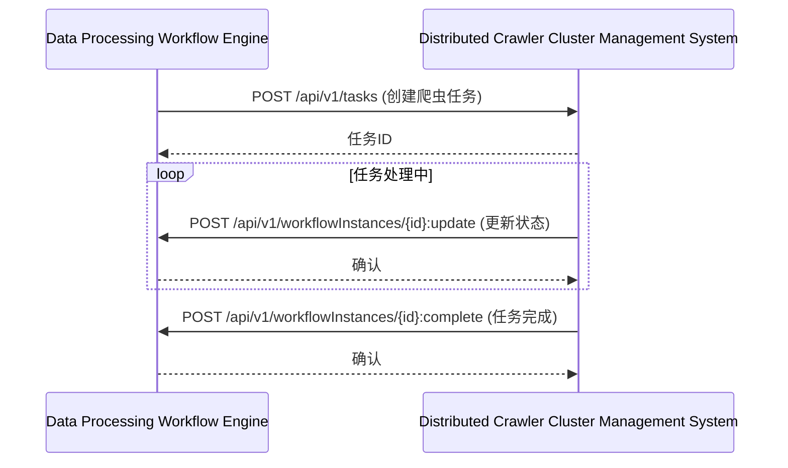
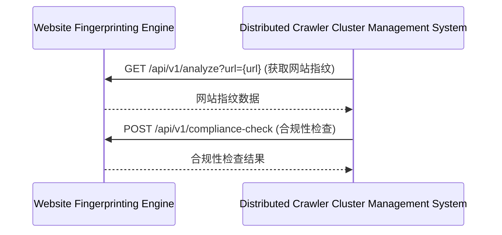
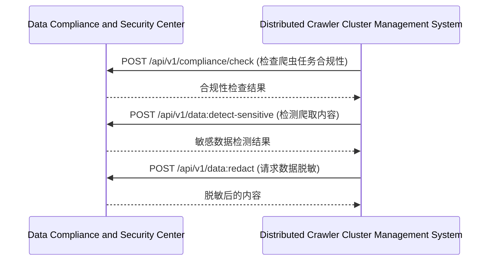
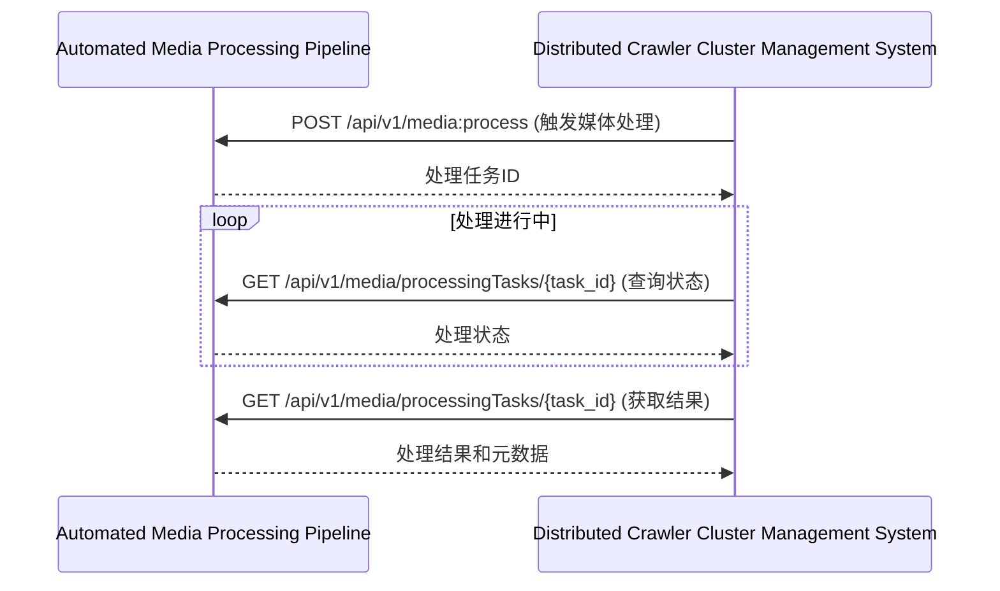

<!-- LEGACY FILE NOTICE -->
> ⚠️ 此檔案為舊版備份，已被新檔取代： [ch8-9-与其他模块的交互.md](ch8-9-与其他模块的交互.md)\n> 備份時間：2025-10-31 12:28:27\n
---

**[← 返回第8章首頁](ch8-index.md)**

---

### 8.9 与其他模块的交互

#### 8.9.1 与数据处理工作流引擎交互

#### 8.9.2 与网站指纹分析引擎交互

#### 8.9.3 与数据合规与安全中心交互

#### 8.9.4 与自动化媒体处理管道交互

---

## 📑 相关章节

| 前序 | 当前 | 后续 |
|-----|------|------|
| [8.8](ch8-8.md) | **8.9** | - |

**快速链接：**
- [← 返回第8章首頁](ch8-index.md)
