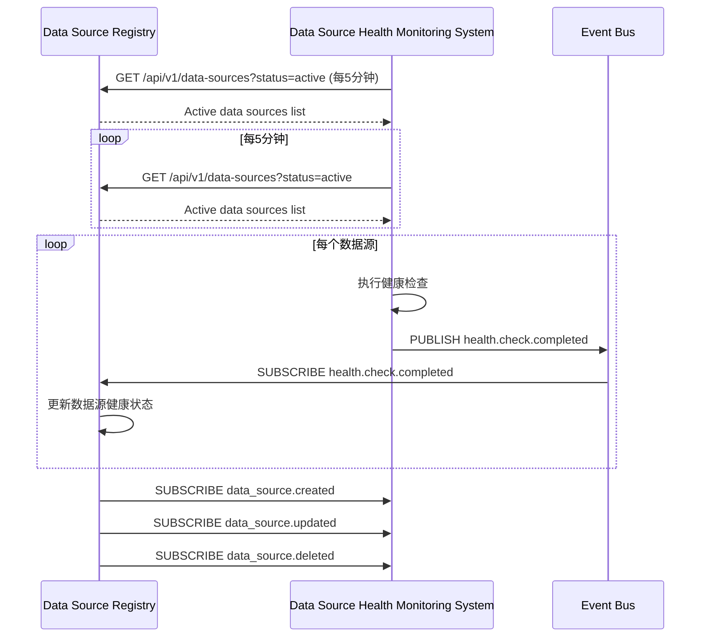
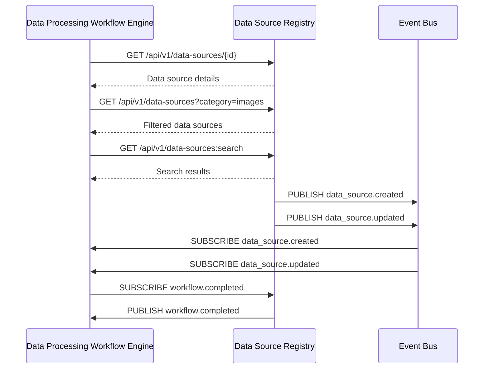
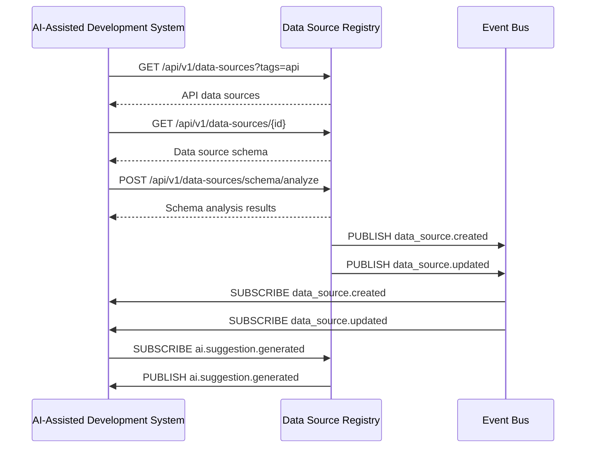
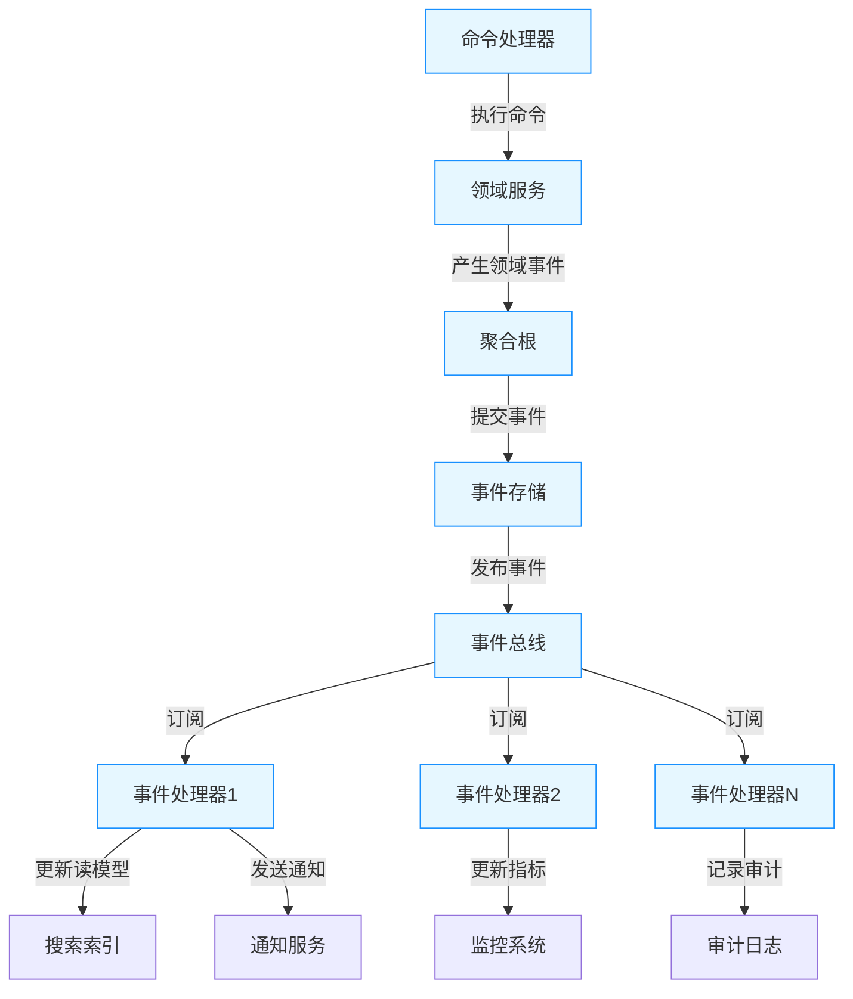

# 镜界平台终极技术规格说明书（模块级深度实现） - 第1章
### 1. 数据源注册中心 (Data Source Registry)
- [1.1 模块概述](#11-模块概述)
- [1.2 详细功能清单](#12-详细功能清单)
  - [1.2.1 核心功能](#121-核心功能)
  - [1.2.2 高级功能](#122-高级功能)
- [1.3 技术架构](#13-技术架构)
  - [1.3.1 架构图](#131-架构图)
  - [1.3.2 服务边界与交互](#132-服务边界与交互)
  - [1.3.3 事件驱动架构](#133-事件驱动架构)
- [1.4 核心组件详细实现](#14-核心组件详细实现)
  - [1.4.1 领域服务](#141-领域服务)
  - [1.4.2 仓储层实现](#142-仓储层实现)
  - [1.4.3 应用服务](#143-应用服务)
  - [1.4.4 搜索服务](#144-搜索服务)
  - [1.4.5 分类管理服务](#145-分类管理服务)
- [1.5 数据模型详细定义](#15-数据模型详细定义)
  - [1.5.1 数据源核心表](#151-数据源核心表)
  - [1.5.2 数据源审计表](#152-数据源审计表)
  - [1.5.3 分类表](#153-分类表)
  - [1.5.4 事件溯源表](#154-事件溯源表)
- [1.6 API详细规范](#16-api详细规范)
  - [1.6.1 数据源管理API](#161-数据源管理api)
  - [1.6.2 搜索API](#162-搜索api)
- [1.7 性能优化策略](#17-性能优化策略)
  - [1.7.1 数据库优化](#171-数据库优化)
  - [1.7.2 多级缓存策略](#172-多级缓存策略)
  - [1.7.3 搜索性能优化](#173-搜索性能优化)
- [1.8 安全考虑](#18-安全考虑)
  - [1.8.1 基于属性的访问控制](#181-基于属性的访问控制)
  - [1.8.2 API安全防护](#182-api安全防护)
  - [1.8.3 数据安全](#183-数据安全)
- [1.9 可观测性](#19-可观测性)
  - [1.9.1 监控指标](#191-监控指标)
  - [1.9.2 结构化日志](#192-结构化日志)
- [1.10 与其他模块的交互](#110-与其他模块的交互)
  - [1.10.1 与数据源健康监测系统交互](#1101-与数据源健康监测系统交互)
  - [1.10.2 与数据处理工作流引擎交互](#1102-与数据处理工作流引擎交互)
  - [1.10.3 与AI辅助开发系统交互](#1103-与ai辅助开发系统交互)
  - [1.10.4 与事件总线交互](#1104-与事件总线交互)

## 1. 数据源注册中心 (Data Source Registry)

### 1.1 模块概述

数据源注册中心是镜界平台的核心元数据管理组件，采用领域驱动设计(DDD)和事件驱动架构，负责存储、管理和检索所有数据源的元信息。它为其他模块提供统一的数据源发现、分类和管理能力，支持从简单网页到复杂API的各种数据源类型。本版本特别强化了服务边界划分、审计追踪和系统可观测性，确保系统具备高可维护性和扩展性。

### 1.2 详细功能清单

#### 1.2.1 核心功能

- **数据源CRUD管理**
  - 创建、读取、更新、删除数据源元数据
  - 支持版本控制的数据源定义
  - 支持软删除与回收站功能
  - 完整的变更历史记录和回滚能力
- **数据源分类与标签**
  - 多级分类体系管理（支持任意层级）
  - 动态标签系统（支持用户自定义标签）
  - 基于AI的自动化标签建议
- **高级搜索与过滤**
  - 全文搜索（基于Elasticsearch）
  - 复杂查询构建器（支持布尔逻辑）
  - 保存常用搜索查询
- **数据源健康监控集成**
  - 与健康监测系统集成
  - 健康状态可视化
  - 健康历史记录查询
- **细粒度访问控制**
  - 基于属性的访问控制(ABAC)
  - 项目级、数据源级权限管理
  - 数据源共享功能

#### 1.2.2 高级功能

- **数据源依赖关系管理**
  - 识别和可视化数据源之间的依赖关系
  - 影响分析（当一个数据源变更时影响范围分析）
  - 依赖关系自动发现
- **事件驱动架构**
  - 事件溯源实现
  - 事件重放机制
  - 死信队列处理
  - 事件版本管理
- **自动化数据源发现**
  - 网站地图解析
  - API文档解析（OpenAPI/Swagger）
  - 智能数据源推荐
- **数据源质量评估**
  - 自动化质量评分
  - 质量趋势分析
  - 质量问题诊断
- **配置管理与特性开关**
  - 集中式配置管理
  - 特性开关支持渐进式发布
  - 运行时配置更新

### 1.3 技术架构

#### 1.3.1 架构图

```
┌─────────────────────────────────────────────────────────────────────────────────────────────┐
│                                 数据源注册中心 (DSR)                                          │
├───────────────────────┬───────────────────────┬───────────────────────────────────────────────┤
│  领域层               │  应用层               │  基础设施层                                 │
├───────────────────────┼───────────────────────┼───────────────────────────────────────────────┤
│ • 领域模型            │ • 应用服务            │ • 仓储实现                                 │
│ • 领域服务            │ • API控制器           │ • 事件总线                                 │
│ • 聚合根              │ • 事件处理器          │ • 搜索索引                                 │
│                       │ • 领域事件处理器      │ • 缓存服务                                 │
└───────────────────────┴───────────────────────┴─────────────────────────────────────────────┘
```

#### 1.3.2 服务边界与交互

- **领域层**：
  - 包含核心业务逻辑和领域模型
  - 不依赖外部系统和框架
  - 仅通过领域服务和领域事件与其他层交互
  
- **应用层**：
  - 协调领域对象完成业务用例
  - 处理事务边界
  - 将领域事件转换为应用级事件
  - 实现API接口
  
- **基础设施层**：
  - 实现仓储接口
  - 与外部系统集成
  - 提供技术性服务（缓存、搜索、事件总线等）

- **输入**：
  - 用户操作（Web界面、CLI、API）
  - 健康监测系统更新
  - 数据源发现服务
  - 外部系统Webhook
  
- **输出**：
  - 数据源元数据给工作流引擎
  - 健康状态给监控系统
  - 分类信息给推荐引擎
  - 领域事件给事件总线

#### 1.3.3 事件驱动架构

```
┌─────────────┐     ┌─────────────┐     ┌─────────────┐     ┌─────────────┐
│  命令处理   │────▶│  领域服务   │────▶│  领域事件   │────▶│  事件总线   │
└─────────────┘     └─────────────┘     └─────────────┘     └──────┬──────┘
                                                                  │
                                                                  ▼
┌─────────────┐     ┌─────────────┐     ┌─────────────┐     ┌─────────────┐
│  事件处理   │◀────│  事件处理器 │◀────│  事件存储   │◀────│  事件发布   │
└─────────────┘     └─────────────┘     └─────────────┘     └─────────────┘
```

- **事件溯源流程**：
  1. 命令处理器接收命令
  2. 调用领域服务执行业务逻辑
  3. 领域服务产生领域事件
  4. 事件存储持久化事件
  5. 事件总线发布事件
  6. 事件处理器处理事件并更新读模型

- **关键组件**：
  - 事件存储：持久化所有领域事件
  - 事件总线：负责事件的发布和订阅
  - 事件处理器：处理事件并更新读模型
  - 快照服务：定期创建聚合根快照，提高重建效率

### 1.4 核心组件详细实现

#### 1.4.1 领域服务

**技术实现：**

```python
class DataSourceDomainService:
    """数据源领域服务 - 纯业务逻辑"""
    def __init__(self, category_repository: CategoryRepository):
        self.category_repository = category_repository
        self.logger = logging.getLogger(__name__)
    
    def create_data_source(
        self,
        command: CreateDataSourceCommand
    ) -> Tuple[DataSource, List[DomainEvent]]:
        """
        创建数据源领域逻辑
        :param command: 创建命令
        :return: (数据源对象, 产生的领域事件)
        """
        # 1. 验证数据源
        self._validate_data_source(command)
        
        # 2. 创建数据源
        data_source = DataSource.create(
            id=DataSourceId(f"ds-{uuid.uuid4().hex[:8]}"),
            project_id=ProjectId(command.project_id),
            name=DataSourceName(command.name),
            display_name=DisplayName(command.display_name),
            description=Description(command.description),
            url=Url(command.url),
            data_type=DataType(command.data_type),
            content_type=command.content_type,
            schema=command.schema,
            owner_id=UserId(command.user_id)
        )
        
        # 3. 处理分类和标签
        self._process_categories_and_tags(data_source, command)
        
        # 4. 生成领域事件
        events = [
            DataSourceCreated(
                data_source_id=data_source.id.value,
                project_id=data_source.project_id.value,
                user_id=command.user_id,
                timestamp=datetime.utcnow()
            )
        ]
        
        return data_source, events
    
    def _validate_data_source(self, command: CreateDataSourceCommand):
        """验证数据源定义的有效性"""
        # 必填字段检查
        if not command.name:
            raise DomainValidationError("Missing required field: name")
        if not command.url:
            raise DomainValidationError("Missing required field: url")
        
        # URL格式验证
        try:
            Url(command.url)
        except ValueError as e:
            raise DomainValidationError(f"Invalid URL format: {str(e)}")
        
        # 数据类型验证
        try:
            DataType(command.data_type)
        except ValueError as e:
            raise DomainValidationError(f"Invalid data type: {str(e)}")
    
    def _process_categories_and_tags(self, data_source: DataSource, command: CreateDataSourceCommand):
        """处理分类和标签的领域逻辑"""
        # 处理分类
        if command.category_id:
            category = self.category_repository.find_by_id(CategoryId(command.category_id))
            if not category:
                raise DomainValidationError(f"Category {command.category_id} not found")
            data_source.set_category(category.id)
        else:
            # 自动分类
            category = self._auto_categorize(data_source)
            data_source.set_category(category.id)
        
        # 处理标签
        if command.tags:
            data_source.set_tags(command.tags)
        elif self.config.auto_tagging_enabled:
            auto_tags = self._generate_auto_tags(data_source)
            data_source.add_tags(auto_tags)
    
    def _auto_categorize(self, data_source: DataSource) -> Category:
        """自动分类领域逻辑"""
        # 基于URL模式的分类
        url = data_source.url.value.lower()
        if "social" in url or any(kw in url for kw in ["facebook", "twitter", "instagram"]):
            return self.category_repository.find_by_name("social-media")
        elif "news" in url or any(kw in url for kw in ["bbc", "cnn", "reuters"]):
            return self.category_repository.find_by_name("news")
        # ... 其他分类逻辑
        
        # 默认分类
        return self.category_repository.find_by_name("general")
    
    def _generate_auto_tags(self, data_source: DataSource) -> List[str]:
        """生成自动标签的领域逻辑"""
        tags = []
        # 基于URL的标签
        url = data_source.url.value.lower()
        if "api" in url:
            tags.append("api")
        # ... 其他标签逻辑
        return tags

class DataSource:
    """数据源聚合根"""
    def __init__(
        self,
        id: DataSourceId,
        project_id: ProjectId,
        name: DataSourceName,
        display_name: DisplayName,
        description: Description,
        url: Url,
        data_type: DataType,
        version: int = 1,
        status: DataSourceStatus = DataSourceStatus.ACTIVE,
        created_at: datetime = None,
        updated_at: datetime = None,
        owner_id: UserId = None,
        category_id: Optional[CategoryId] = None,
        tags: List[str] = None,
        content_type: Optional[str] = None,
        schema: Optional[Dict] = None,
        metadata: Dict = None
    ):
        self.id = id
        self.project_id = project_id
        self.name = name
        self.display_name = display_name
        self.description = description
        self.url = url
        self.data_type = data_type
        self.version = version
        self.status = status
        self.created_at = created_at or datetime.utcnow()
        self.updated_at = updated_at or self.created_at
        self.owner_id = owner_id
        self.category_id = category_id
        self.tags = tags or []
        self.content_type = content_type
        self.schema = schema
        self.metadata = metadata or {}
        self._pending_events = []
    
    @classmethod
    def create(
        cls,
        id: DataSourceId,
        project_id: ProjectId,
        name: DataSourceName,
        display_name: DisplayName,
        description: Description,
        url: Url,
        data_type: DataType,
        content_type: Optional[str] = None,
        schema: Optional[Dict] = None,
        owner_id: UserId = None
    ) -> 'DataSource':
        """创建新的数据源"""
        return cls(
            id=id,
            project_id=project_id,
            name=name,
            display_name=display_name,
            description=description,
            url=url,
            data_type=data_type,
            content_type=content_type,
            schema=schema,
            owner_id=owner_id
        )
    
    def set_category(self, category_id: CategoryId):
        """设置分类"""
        if self.category_id != category_id:
            self.category_id = category_id
            self._record_event(DataSourceCategoryChanged(
                data_source_id=self.id.value,
                old_category_id=self.category_id.value if self.category_id else None,
                new_category_id=category_id.value,
                timestamp=datetime.utcnow()
            ))
    
    def set_tags(self, tags: List[str]):
        """设置标签"""
        old_tags = self.tags.copy()
        self.tags = tags
        self._record_event(DataSourceTagsChanged(
            data_source_id=self.id.value,
            old_tags=old_tags,
            new_tags=tags,
            timestamp=datetime.utcnow()
        ))
    
    def add_tags(self, tags: List[str]):
        """添加标签"""
        old_tags = self.tags.copy()
        for tag in tags:
            if tag not in self.tags:
                self.tags.append(tag)
        if old_tags != self.tags:
            self._record_event(DataSourceTagsChanged(
                data_source_id=self.id.value,
                old_tags=old_tags,
                new_tags=self.tags.copy(),
                timestamp=datetime.utcnow()
            ))
    
    def soft_delete(self, user_id: UserId):
        """软删除数据源"""
        if self.status != DataSourceStatus.DELETED:
            old_status = self.status
            self.status = DataSourceStatus.DELETED
            self._record_event(DataSourceStatusChanged(
                data_source_id=self.id.value,
                old_status=old_status.value,
                new_status=self.status.value,
                user_id=user_id.value,
                timestamp=datetime.utcnow()
            ))
    
    def _record_event(self, event: DomainEvent):
        """记录领域事件"""
        self._pending_events.append(event)
    
    def get_pending_events(self) -> List[DomainEvent]:
        """获取待处理的领域事件"""
        return self._pending_events.copy()
    
    def clear_pending_events(self):
        """清除待处理的领域事件"""
        self._pending_events = []
```

#### 1.4.2 仓储层实现

**技术实现：**

```python
class DataSourceRepository:
    """数据源仓储接口"""
    def save(self, data_source: DataSource):
        """保存数据源聚合根"""
        raise NotImplementedError
    
    def find_by_id(self, data_source_id: DataSourceId) -> Optional[DataSource]:
        """通过ID查找数据源"""
        raise NotImplementedError
    
    def find_by_url(self, url: Url, project_id: ProjectId) -> Optional[DataSource]:
        """通过URL和项目ID查找数据源"""
        raise NotImplementedError
    
    def find_all(self, project_id: ProjectId, filters: Optional[Dict] = None) -> List[DataSource]:
        """查找项目中的所有数据源"""
        raise NotImplementedError

class PostgresDataSourceRepository(DataSourceRepository):
    """基于PostgreSQL的数据源仓储实现"""
    def __init__(self, db_manager: DatabaseManager, event_store: EventStore):
        self.db_manager = db_manager
        self.event_store = event_store
    
    async def save(self, data_source: DataSource):
        """保存数据源聚合根"""
        async with self.db_manager.get_write_connection() as conn:
            async with conn.transaction():
                # 1. 保存聚合根状态
                if not await self._exists(conn, data_source.id):
                    await self._insert(conn, data_source)
                else:
                    await self._update(conn, data_source)
                
                # 2. 保存领域事件
                events = data_source.get_pending_events()
                if events:
                    await self.event_store.save_events(
                        aggregate_id=data_source.id.value,
                        aggregate_type="DataSource",
                        events=events,
                        version=data_source.version
                    )
                
                # 3. 清除待处理事件
                data_source.clear_pending_events()
    
    async def _exists(self, conn, data_source_id: DataSourceId) -> bool:
        """检查数据源是否存在"""
        row = await conn.fetchrow(
            "SELECT 1 FROM data_sources WHERE id = $1",
            data_source_id.value
        )
        return row is not None
    
    async def _insert(self, conn, data_source: DataSource):
        """插入新数据源"""
        await conn.execute(
            """
            INSERT INTO data_sources (
                id, project_id, name, display_name, description, url, 
                category_id, data_type, content_type, schema, status, 
                created_at, updated_at, owner_id, tags, metadata, version
            ) VALUES (
                $1, $2, $3, $4, $5, $6, $7, $8, $9, $10, $11, $12, $13, $14, $15, $16, $17
            )
            """,
            data_source.id.value,
            data_source.project_id.value,
            data_source.name.value,
            data_source.display_name.value,
            data_source.description.value,
            data_source.url.value,
            data_source.category_id.value if data_source.category_id else None,
            data_source.data_type.value,
            data_source.content_type,
            json.dumps(data_source.schema) if data_source.schema else None,
            data_source.status.value,
            data_source.created_at,
            data_source.updated_at,
            data_source.owner_id.value,
            data_source.tags,
            data_source.metadata,
            data_source.version
        )
    
    async def _update(self, conn, data_source: DataSource):
        """更新现有数据源"""
        await conn.execute(
            """
            UPDATE data_sources
            SET 
                name = $2, display_name = $3, description = $4, url = $5,
                category_id = $6, data_type = $7, content_type = $8, schema = $9,
                status = $10, updated_at = $11, tags = $12, metadata = $13,
                version = $14
            WHERE id = $1 AND version = $15
            """,
            data_source.id.value,
            data_source.name.value,
            data_source.display_name.value,
            data_source.description.value,
            data_source.url.value,
            data_source.category_id.value if data_source.category_id else None,
            data_source.data_type.value,
            data_source.content_type,
            json.dumps(data_source.schema) if data_source.schema else None,
            data_source.status.value,
            data_source.updated_at,
            data_source.tags,
            data_source.metadata,
            data_source.version,
            data_source.version - 1  # 乐观锁检查
        )
    
    async def find_by_id(self, data_source_id: DataSourceId) -> Optional[DataSource]:
        """通过ID查找数据源"""
        async with self.db_manager.get_read_connection() as conn:
            row = await conn.fetchrow(
                """
                SELECT * FROM data_sources 
                WHERE id = $1
                """,
                data_source_id.value
            )
            if not row:
                return None
            return self._row_to_data_source(row)
    
    async def find_by_url(self, url: Url, project_id: ProjectId) -> Optional[DataSource]:
        """通过URL和项目ID查找数据源"""
        async with self.db_manager.get_read_connection() as conn:
            row = await conn.fetchrow(
                """
                SELECT * FROM data_sources 
                WHERE url = $1 AND project_id = $2
                """,
                url.value,
                project_id.value
            )
            if not row:
                return None
            return self._row_to_data_source(row)
    
    def _row_to_data_source(self, row: Dict) -> DataSource:
        """将数据库行转换为DataSource对象"""
        return DataSource(
            id=DataSourceId(row["id"]),
            project_id=ProjectId(row["project_id"]),
            name=DataSourceName(row["name"]),
            display_name=DisplayName(row["display_name"]),
            description=Description(row["description"]),
            url=Url(row["url"]),
            data_type=DataType(row["data_type"]),
            category_id=CategoryId(row["category_id"]) if row["category_id"] else None,
            content_type=row["content_type"],
            schema=json.loads(row["schema"]) if row["schema"] else None,
            status=DataSourceStatus(row["status"]),
            created_at=row["created_at"],
            updated_at=row["updated_at"],
            owner_id=UserId(row["owner_id"]),
            tags=row["tags"],
            version=row["version"],
            metadata=row["metadata"]
        )

class EventStore:
    """事件存储接口"""
    async def save_events(
        self,
        aggregate_id: str,
        aggregate_type: str,
        events: List[DomainEvent],
        version: int
    ):
        """保存领域事件"""
        raise NotImplementedError
    
    async def load_events(
        self,
        aggregate_id: str,
        aggregate_type: str
    ) -> Tuple[List[DomainEvent], int]:
        """加载领域事件"""
        raise NotImplementedError

class PostgresEventStore(EventStore):
    """基于PostgreSQL的事件存储实现"""
    def __init__(self, db_manager: DatabaseManager):
        self.db_manager = db_manager
    
    async def save_events(
        self,
        aggregate_id: str,
        aggregate_type: str,
        events: List[DomainEvent],
        version: int
    ):
        """保存领域事件"""
        async with self.db_manager.get_write_connection() as conn:
            async with conn.transaction():
                # 检查版本
                current_version = await conn.fetchval(
                    "SELECT MAX(version) FROM event_store WHERE aggregate_id = $1",
                    aggregate_id
                )
                if current_version is not None and current_version != version - 1:
                    raise ConcurrencyException("Event version mismatch")
                
                # 保存事件
                for i, event in enumerate(events):
                    event_version = version + i
                    await conn.execute(
                        """
                        INSERT INTO event_store (
                            id, aggregate_id, aggregate_type, 
                            event_type, event_data, version, occurred_at
                        ) VALUES (
                            $1, $2, $3, $4, $5, $6, $7
                        )
                        """,
                        str(uuid.uuid4()),
                        aggregate_id,
                        aggregate_type,
                        event.event_type,
                        json.dumps(event.to_dict()),
                        event_version,
                        event.timestamp
                    )
    
    async def load_events(
        self,
        aggregate_id: str,
        aggregate_type: str
    ) -> Tuple[List[DomainEvent], int]:
        """加载领域事件"""
        async with self.db_manager.get_read_connection() as conn:
            rows = await conn.fetch(
                """
                SELECT * FROM event_store 
                WHERE aggregate_id = $1 AND aggregate_type = $2
                ORDER BY version
                """,
                aggregate_id,
                aggregate_type
            )
            
            events = []
            for row in rows:
                event_class = EVENT_TYPES.get(row["event_type"])
                if event_class:
                    events.append(event_class.from_dict(json.loads(row["event_data"])))
            
            current_version = rows[-1]["version"] if rows else 0
            return events, current_version

class DatabaseManager:
    """数据库连接管理器 - 支持读写分离"""
    def __init__(self, config: DatabaseConfig):
        self.read_pool = create_pool(config.read_replicas)
        self.write_pool = create_pool(config.primary)
        self.connection_timeout = config.get('connection_timeout', 30)
        self.logger = logging.getLogger(__name__)
    
    async def get_read_connection(self):
        """获取读连接"""
        try:
            return await self.read_pool.acquire(timeout=self.connection_timeout)
        except Exception as e:
            self.logger.error("db.read_connection_failed", error=str(e))
            raise DatabaseException("Failed to acquire read connection")
    
    async def get_write_connection(self):
        """获取写连接"""
        try:
            return await self.write_pool.acquire(timeout=self.connection_timeout)
        except Exception as e:
            self.logger.error("db.write_connection_failed", error=str(e))
            raise DatabaseException("Failed to acquire write connection")
    
    async def release_connection(self, conn):
        """释放连接"""
        try:
            await conn.close()
        except Exception as e:
            self.logger.warning("db.connection_close_failed", error=str(e))
```

#### 1.4.3 应用服务

**技术实现：**

```python
class DataSourceApplicationService:
    """数据源应用服务 - 协调领域对象完成业务用例"""
    def __init__(
        self,
        data_source_repository: DataSourceRepository,
        category_repository: CategoryRepository,
        search_service: SearchService,
        policy_engine: PolicyEngine,
        event_bus: EventBus,
        config: Config
    ):
        self.data_source_repository = data_source_repository
        self.category_repository = category_repository
        self.search_service = search_service
        self.policy_engine = policy_engine
        self.event_bus = event_bus
        self.config = config
        self.logger = structlog.get_logger()
        self.metrics = {
            'created': Counter('data_source_created_total', 'Total data sources created', ['project_id', 'category']),
            'updated': Counter('data_source_updated_total', 'Total data sources updated', ['project_id']),
            'deleted': Counter('data_source_deleted_total', 'Total data sources deleted', ['project_id'])
        }
    
    async def create_data_source(
        self,
        command: CreateDataSourceCommand
    ) -> DataSourceDTO:
        """
        创建新的数据源
        :param command: 创建命令
        :return: 创建后的数据源DTO
        """
        start_time = time.time()
        request_id = command.request_id or f"req-{uuid.uuid4().hex[:8]}"
        
        try:
            # 1. 检查权限
            if not await self._check_permission(command.user_id, command.project_id, "create"):
                raise PermissionError("User does not have permission to create data sources")
            
            # 2. 创建领域服务
            domain_service = DataSourceDomainService(self.category_repository)
            
            # 3. 执行领域逻辑
            data_source, domain_events = domain_service.create_data_source(command)
            
            # 4. 保存聚合根
            await self.data_source_repository.save(data_source)
            
            # 5. 更新搜索索引
            await self.search_service.index_data_source(data_source)
            
            # 6. 发布应用事件
            for event in domain_events:
                await self.event_bus.publish(event.event_type, event.to_dict())
            
            # 7. 记录指标
            self.metrics['created'].labels(
                project_id=command.project_id, 
                category=data_source.category_id.value if data_source.category_id else "uncategorized"
            ).inc()
            
            # 8. 记录日志
            duration = time.time() - start_time
            self.logger.info(
                "data_source.created",
                request_id=request_id,
                data_source_id=data_source.id.value,
                project_id=command.project_id,
                duration=duration,
                user_id=command.user_id
            )
            
            # 9. 返回DTO
            return DataSourceDTO.from_entity(data_source)
        
        except Exception as e:
            duration = time.time() - start_time
            self.logger.error(
                "data_source.creation_failed",
                request_id=request_id,
                project_id=command.project_id,
                error=str(e),
                duration=duration
            )
            raise
    
    async def update_data_source(
        self,
        command: UpdateDataSourceCommand
    ) -> DataSourceDTO:
        """
        更新数据源
        :param command: 更新命令
        :return: 更新后的数据源DTO
        """
        start_time = time.time()
        request_id = command.request_id or f"req-{uuid.uuid4().hex[:8]}"
        
        try:
            # 1. 检查权限
            if not await self._check_permission(command.user_id, command.project_id, "update"):
                raise PermissionError("User does not have permission to update data sources")
            
            # 2. 获取现有数据源
            data_source = await self.data_source_repository.find_by_id(DataSourceId(command.data_source_id))
            if not data_source:
                raise NotFoundError(f"Data source {command.data_source_id} not found")
            
            # 3. 检查项目匹配
            if data_source.project_id.value != command.project_id:
                raise PermissionError("Data source does not belong to the specified project")
            
            # 4. 创建领域服务
            domain_service = DataSourceDomainService(self.category_repository)
            
            # 5. 执行领域逻辑
            # 这里应该有具体的更新逻辑，根据command中的字段更新data_source
            # 例如：data_source.set_category(command.category_id)
            
            # 6. 保存聚合根
            await self.data_source_repository.save(data_source)
            
            # 7. 更新搜索索引
            await self.search_service.update_data_source(data_source)
            
            # 8. 发布应用事件
            for event in data_source.get_pending_events():
                await self.event_bus.publish(event.event_type, event.to_dict())
            
            # 9. 记录指标
            self.metrics['updated'].labels(
                project_id=command.project_id
            ).inc()
            
            # 10. 记录日志
            duration = time.time() - start_time
            self.logger.info(
                "data_source.updated",
                request_id=request_id,
                data_source_id=data_source.id.value,
                project_id=command.project_id,
                duration=duration,
                user_id=command.user_id,
                changes=command.updates
            )
            
            # 11. 返回DTO
            return DataSourceDTO.from_entity(data_source)
        
        except Exception as e:
            duration = time.time() - start_time
            self.logger.error(
                "data_source.update_failed",
                request_id=request_id,
                data_source_id=command.data_source_id,
                project_id=command.project_id,
                error=str(e),
                duration=duration
            )
            raise
    
    async def delete_data_source(
        self,
        command: DeleteDataSourceCommand
    ):
        """
        删除数据源
        :param command: 删除命令
        """
        start_time = time.time()
        request_id = command.request_id or f"req-{uuid.uuid4().hex[:8]}"
        
        try:
            # 1. 检查权限
            if not await self._check_permission(command.user_id, command.project_id, "delete"):
                raise PermissionError("User does not have permission to delete data sources")
            
            # 2. 获取现有数据源
            data_source = await self.data_source_repository.find_by_id(DataSourceId(command.data_source_id))
            if not data_source:
                raise NotFoundError(f"Data source {command.data_source_id} not found")
            
            # 3. 检查项目匹配
            if data_source.project_id.value != command.project_id:
                raise PermissionError("Data source does not belong to the specified project")
            
            # 4. 执行软删除
            data_source.soft_delete(UserId(command.user_id))
            
            # 5. 保存聚合根
            await self.data_source_repository.save(data_source)
            
            # 6. 更新搜索索引
            await self.search_service.delete_data_source(data_source.id.value, data_source.project_id.value)
            
            # 7. 发布应用事件
            for event in data_source.get_pending_events():
                await self.event_bus.publish(event.event_type, event.to_dict())
            
            # 8. 记录指标
            self.metrics['deleted'].labels(
                project_id=command.project_id
            ).inc()
            
            # 9. 记录日志
            duration = time.time() - start_time
            self.logger.info(
                "data_source.deleted",
                request_id=request_id,
                data_source_id=data_source.id.value,
                project_id=command.project_id,
                duration=duration,
                user_id=command.user_id
            )
        
        except Exception as e:
            duration = time.time() - start_time
            self.logger.error(
                "data_source.deletion_failed",
                request_id=request_id,
                data_source_id=command.data_source_id,
                project_id=command.project_id,
                error=str(e),
                duration=duration
            )
            raise
    
    async def _check_permission(
        self,
        user_id: str,
        project_id: str,
        action: str
    ) -> bool:
        """检查用户权限"""
        request = AccessRequest(
            user=User(user_id),
            resource=Resource("data_source", ""),
            action=action,
            context={
                "project_id": project_id,
                "ip": get_remote_ip(),
                "user_agent": get_user_agent()
            }
        )
        return await self.policy_engine.evaluate(request)
    
    async def list_data_sources(
        self,
        query: ListDataSourcesQuery
    ) -> DataSourceListDTO:
        """
        列出数据源
        :param query: 列表查询
        :return: 数据源列表DTO
        """
        start_time = time.time()
        request_id = query.request_id or f"req-{uuid.uuid4().hex[:8]}"
        
        try:
            # 1. 检查权限
            if not await self._check_permission(query.user_id, query.project_id, "read"):
                raise PermissionError("User does not have permission to list data sources")
            
            # 2. 从搜索服务获取数据
            search_result = await self.search_service.search(
                project_id=query.project_id,
                query=query.search_query,
                filters=query.filters,
                sort=query.sort,
                page=query.page,
                page_size=query.page_size
            )
            
            # 3. 转换为DTO
            items = [DataSourceDTO.from_search_hit(hit) for hit in search_result.items]
            
            # 4. 记录日志
            duration = time.time() - start_time
            self.logger.info(
                "data_source.listed",
                request_id=request_id,
                project_id=query.project_id,
                count=len(items),
                duration=duration,
                user_id=query.user_id
            )
            
            return DataSourceListDTO(
                items=items,
                total=search_result.total,
                page=query.page,
                page_size=query.page_size
            )
        
        except Exception as e:
            duration = time.time() - start_time
            self.logger.error(
                "data_source.list_failed",
                request_id=request_id,
                project_id=query.project_id,
                error=str(e),
                duration=duration
            )
            raise

class PolicyEngine:
    """基于属性的访问控制(ABAC)引擎"""
    def __init__(self, policy_repository: PolicyRepository):
        self.policy_repository = policy_repository
        self.logger = structlog.get_logger()
    
    async def evaluate(self, request: AccessRequest) -> bool:
        """
        评估访问请求
        :param request: 访问请求
        :return: 是否允许访问
        """
        try:
            # 1. 获取相关策略
            policies = await self.policy_repository.get_policies(
                resource_type=request.resource.resource_type,
                action=request.action
            )
            
            # 2. 评估策略
            for policy in policies:
                if self._evaluate_policy(policy, request):
                    return policy.effect == "allow"
            
            # 3. 默认拒绝
            return False
        
        except Exception as e:
            self.logger.error(
                "policy.evaluation_failed",
                error=str(e),
                user_id=request.user.user_id,
                resource=request.resource.resource_id,
                action=request.action
            )
            # 安全默认：失败关闭
            return False
    
    def _evaluate_policy(self, policy: Policy, request: AccessRequest) -> bool:
        """评估单个策略"""
        # 1. 检查条件
        for condition in policy.conditions:
            if not self._evaluate_condition(condition, request):
                return False
        
        # 2. 所有条件满足
        return True
    
    def _evaluate_condition(self, condition: str, request: AccessRequest) -> bool:
        """评估条件表达式"""
        # 使用安全的表达式评估器
        context = {
            "user": request.user,
            "resource": request.resource,
            "context": request.context,
            "time": datetime.utcnow()
        }
        try:
            return safe_eval(condition, context)
        except Exception as e:
            self.logger.error(
                "policy.condition_evaluation_failed",
                condition=condition,
                error=str(e)
            )
            return False

class MultiLevelCache:
    """多级缓存实现"""
    def __init__(self, config: CacheConfig):
        self.l1_cache = LRUCache(maxsize=config.l1_maxsize)
        self.l2_cache = RedisCache(
            host=config.redis_host,
            port=config.redis_port,
            db=config.redis_db,
            max_connections=config.redis_max_connections
        )
        self.cache_config = config.profiles
        self.logger = structlog.get_logger()
    
    async def get(self, key: str, loader: Callable = None, cache_profile: str = None) -> Any:
        """
        获取缓存值
        :param key: 缓存键
        :param loader: 加载函数（如果缓存未命中）
        :param cache_profile: 缓存配置名称
        :return: 缓存值
        """
        # 获取缓存配置
        config = self._get_cache_config(cache_profile)
        
        # 1. 检查L1缓存
        value = self.l1_cache.get(key)
        if value is not None:
            self.logger.debug("cache.hit.l1", key=key)
            return value
        
        # 2. 检查L2缓存
        value = await self.l2_cache.get(key)
        if value is not None:
            self.logger.debug("cache.hit.l2", key=key)
            # 更新L1缓存
            self.l1_cache.set(key, value, ttl=config["ttl"])
            return value
        
        # 3. 缓存未命中
        if loader is None:
            self.logger.debug("cache.miss", key=key)
            return None
        
        # 4. 加载数据
        try:
            value = await loader()
            self.logger.debug("cache.loader.executed", key=key)
            
            # 5. 设置缓存
            await self.set(key, value, cache_profile=cache_profile)
            return value
        except Exception as e:
            self.logger.error("cache.loader.failed", key=key, error=str(e))
            raise
    
    async def set(self, key: str, value: Any, cache_profile: str = None):
        """
        设置缓存值
        :param key: 缓存键
        :param value: 缓存值
        :param cache_profile: 缓存配置名称
        """
        config = self._get_cache_config(cache_profile)
        strategy = config.get("strategy", "write_through")
        
        if strategy == "write_through":
            # 同时写入L1和L2
            self.l1_cache.set(key, value, ttl=config["ttl"])
            await self.l2_cache.set(key, value, ttl=config["ttl"])
        elif strategy == "write_around":
            # 只写入L2
            await self.l2_cache.set(key, value, ttl=config["ttl"])
        elif strategy == "write_back":
            # 只写入L1，稍后异步写入L2
            self.l1_cache.set(key, value, ttl=config["ttl"])
            asyncio.create_task(self._write_back_to_l2(key, value, config["ttl"]))
    
    def _get_cache_config(self, profile_name: str = None) -> Dict:
        """获取缓存配置"""
        if not profile_name:
            return self.cache_config["default"]
        return self.cache_config.get(profile_name, self.cache_config["default"])
    
    async def _write_back_to_l2(self, key: str, value: Any, ttl: int):
        """异步将L1缓存写入L2"""
        try:
            await asyncio.sleep(random.uniform(0.1, 0.5))  # 随机延迟
            await self.l2_cache.set(key, value, ttl=ttl)
        except Exception as e:
            self.logger.error("cache.write_back_failed", key=key, error=str(e))
```

#### 1.4.4 搜索服务

**技术实现：**

```python
class SearchService:
    """数据源搜索服务，基于Elasticsearch实现"""
    def __init__(
        self,
        es_client: AsyncElasticsearch,
        config: SearchConfig,
        cache: MultiLevelCache
    ):
        self.es_client = es_client
        self.config = config
        self.cache = cache
        self.index_name = config.index_name
        self.logger = structlog.get_logger()
        self.metrics = {
            'search': Histogram('search_request_duration_seconds', 'Search request duration', ['query_type'])
        }
    
    async def ensure_index(self):
        """确保Elasticsearch索引存在"""
        if not await self.es_client.indices.exists(index=self.index_name):
            self.logger.info("search.index.creating", index=self.index_name)
            # 定义索引设置
            settings = {
                "settings": {
                    "number_of_shards": self.config.shards,
                    "number_of_replicas": self.config.replicas,
                    "refresh_interval": self.config.refresh_interval,
                    "analysis": {
                        "analyzer": {
                            "standard_analyzer": {
                                "type": "custom",
                                "tokenizer": "standard",
                                "filter": ["lowercase", "stop"]
                            },
                            "ngram_analyzer": {
                                "type": "custom",
                                "tokenizer": "ngram_tokenizer",
                                "filter": ["lowercase"]
                            }
                        },
                        "tokenizer": {
                            "ngram_tokenizer": {
                                "type": "ngram",
                                "min_gram": 3,
                                "max_gram": 10,
                                "token_chars": ["letter", "digit"]
                            }
                        }
                    }
                },
                "mappings": {
                    "properties": {
                        "id": {"type": "keyword"},
                        "project_id": {"type": "keyword"},
                        "name": {
                            "type": "text",
                            "analyzer": "standard_analyzer",
                            "fields": {
                                "ngram": {
                                    "type": "text",
                                    "analyzer": "ngram_analyzer"
                                }
                            }
                        },
                        "display_name": {
                            "type": "text",
                            "analyzer": "standard_analyzer",
                            "fields": {
                                "ngram": {
                                    "type": "text",
                                    "analyzer": "ngram_analyzer"
                                }
                            }
                        },
                        "description": {"type": "text", "analyzer": "standard_analyzer"},
                        "url": {"type": "keyword"},
                        "category_id": {"type": "keyword"},
                        "data_type": {"type": "keyword"},
                        "content_type": {"type": "keyword"},
                        "status": {"type": "keyword"},
                        "tags": {"type": "keyword"},
                        "created_at": {"type": "date"},
                        "updated_at": {"type": "date"},
                        "deleted_at": {"type": "date"},
                        "health_score": {"type": "float"},
                        "availability_7d": {"type": "float"},
                        "version": {"type": "integer"}
                    }
                }
            }
            # 创建索引
            await self.es_client.indices.create(
                index=self.index_name,
                body=settings
            )
            self.logger.info("search.index.created", index=self.index_name)
    
    async def index_data_source(self, data_source: DataSource):
        """添加或更新数据源到搜索索引"""
        start_time = time.time()
        doc = self._to_document(data_source)
        
        try:
            await self.es_client.index(
                index=self.index_name,
                id=data_source.id.value,
                body=doc
            )
            duration = time.time() - start_time
            self.metrics['search'].labels(query_type='index').observe(duration)
            self.logger.debug(
                "search.indexed",
                data_source_id=data_source.id.value,
                duration=duration
            )
        except Exception as e:
            duration = time.time() - start_time
            self.logger.error(
                "search.index_failed",
                data_source_id=data_source.id.value,
                error=str(e),
                duration=duration
            )
            raise
    
    async def update_data_source(self, data_source: DataSource):
        """更新搜索索引中的数据源"""
        await self.index_data_source(data_source)
    
    async def delete_data_source(self, data_source_id: str, project_id: str):
        """从搜索索引中删除数据源"""
        start_time = time.time()
        
        try:
            await self.es_client.delete(
                index=self.index_name,
                id=data_source_id
            )
            duration = time.time() - start_time
            self.metrics['search'].labels(query_type='delete').observe(duration)
            self.logger.debug(
                "search.deleted",
                data_source_id=data_source_id,
                duration=duration
            )
        except Exception as e:
            duration = time.time() - start_time
            self.logger.error(
                "search.delete_failed",
                data_source_id=data_source_id,
                error=str(e),
                duration=duration
            )
            raise
    
    def _to_document(self, data_source: DataSource) -> Dict:
        """将数据源转换为Elasticsearch文档"""
        # 计算健康分数（如果可用）
        health_score = 0.0
        if data_source.health and "availability_7d" in data_source.health.metrics:
            health_score = data_source.health.metrics["availability_7d"]
        
        return {
            "id": data_source.id.value,
            "project_id": data_source.project_id.value,
            "name": data_source.name.value,
            "display_name": data_source.display_name.value,
            "description": data_source.description.value,
            "url": data_source.url.value,
            "category_id": data_source.category_id.value if data_source.category_id else None,
            "data_type": data_source.data_type.value,
            "content_type": data_source.content_type,
            "status": data_source.status.value,
            "tags": data_source.tags,
            "created_at": data_source.created_at,
            "updated_at": data_source.updated_at,
            "deleted_at": data_source.deleted_at,
            "health_score": health_score,
            "availability_7d": data_source.health.metrics.get("availability_7d", 0.0) if data_source.health else 0.0,
            "version": data_source.version
        }
    
    async def search(
        self,
        project_id: str,
        query: Optional[str] = None,
        filters: Optional[Dict] = None,
        sort: Optional[str] = None,
        page: int = 1,
        page_size: int = 20
    ) -> SearchResult:
        """
        搜索数据源
        :param project_id: 项目ID
        :param query: 搜索查询
        :param filters: 过滤条件
        :param sort: 排序字段
        :param page: 页码
        :param page_size: 每页数量
        :return: 搜索结果
        """
        start_time = time.time()
        cache_key = self._build_cache_key(project_id, query, filters, sort, page, page_size)
        
        # 尝试从缓存获取
        if self.config.use_cache:
            result = await self.cache.get(
                cache_key,
                loader=lambda: self._execute_search(
                    project_id, query, filters, sort, page, page_size
                ),
                cache_profile="search"
            )
            duration = time.time() - start_time
            self.logger.debug(
                "search.completed",
                project_id=project_id,
                query=query,
                duration=duration,
                cache_hit=(result is not None)
            )
            return result
        
        # 直接执行搜索
        result = await self._execute_search(
            project_id, query, filters, sort, page, page_size
        )
        duration = time.time() - start_time
        self.logger.debug(
            "search.completed",
            project_id=project_id,
            query=query,
            duration=duration,
            cache_hit=False
        )
        return result
    
    async def _execute_search(
        self,
        project_id: str,
        query: Optional[str] = None,
        filters: Optional[Dict] = None,
        sort: Optional[str] = None,
        page: int = 1,
        page_size: int = 20
    ) -> SearchResult:
        """执行实际的搜索操作"""
        # 构建查询体
        body = self._build_search_query(project_id, query, filters, sort, page, page_size)
        
        try:
            # 执行搜索
            es_result = await self.es_client.search(
                index=self.index_name,
                body=body,
                _source=True
            )
            
            # 处理结果
            hits = es_result["hits"]["hits"]
            total = es_result["hits"]["total"]["value"]
            
            items = []
            for hit in hits:
                source = hit["_source"]
                # 转换为搜索结果项
                items.append(SearchResultItem(
                    id=source["id"],
                    name=source["name"],
                    display_name=source["display_name"],
                    url=source["url"],
                    category_id=source["category_id"],
                    data_type=source["data_type"],
                    status=source["status"],
                    tags=source["tags"],
                    created_at=source["created_at"],
                    updated_at=source["updated_at"],
                    health_score=source["health_score"],
                    version=source["version"]
                ))
            
            return SearchResult(
                items=items,
                total=total,
                page=page,
                page_size=page_size
            )
        
        except Exception as e:
            self.logger.error(
                "search.query_failed",
                project_id=project_id,
                query=query,
                error=str(e)
            )
            raise
    
    def _build_search_query(
        self,
        project_id: str,
        query: Optional[str] = None,
        filters: Optional[Dict] = None,
        sort: Optional[str] = None,
        page: int = 1,
        page_size: int = 20
    ) -> Dict:
        """构建Elasticsearch查询体"""
        # 基础查询 - 仅限当前项目和非删除状态
        base_query = {
            "bool": {
                "must": [
                    {"term": {"project_id": project_id}},
                    {"term": {"status": "active"}}
                ]
            }
        }
        
        # 添加全文搜索
        if query and query.strip():
            base_query["bool"]["must"].append({
                "multi_match": {
                    "query": query,
                    "fields": [
                        "name^3", 
                        "name.ngram^1.5",
                        "display_name^2", 
                        "display_name.ngram^1.2",
                        "description",
                        "url"
                    ],
                    "fuzziness": "AUTO",
                    "prefix_length": 2
                }
            })
        
        # 添加过滤条件
        if filters:
            if "status" in filters and filters["status"]:
                base_query["bool"]["must"].append({
                    "term": {"status": filters["status"]}
                })
            if "category_id" in filters and filters["category_id"]:
                base_query["bool"]["must"].append({
                    "term": {"category_id": filters["category_id"]}
                })
            if "tags" in filters and filters["tags"]:
                tags = filters["tags"]
                if isinstance(tags, str):
                    tags = [tags]
                # 必须包含所有指定标签
                for tag in tags:
                    base_query["bool"]["must"].append({
                        "term": {"tags": tag}
                    })
            if "min_health" in filters:
                base_query["bool"]["must"].append({
                    "range": {
                        "health_score": {
                            "gte": filters["min_health"]
                        }
                    }
                })
            if "data_type" in filters and filters["data_type"]:
                base_query["bool"]["must"].append({
                    "term": {"data_type": filters["data_type"]}
                })
        
        # 构建排序
        sort_spec = []
        if sort:
            # 验证排序字段
            valid_sort_fields = [
                "name", "display_name", "created_at", 
                "updated_at", "health_score", "version"
            ]
            if sort.lstrip("-") in valid_sort_fields:
                direction = "desc" if sort.startswith("-") else "asc"
                field = sort.lstrip("-")
                sort_spec.append({field: {"order": direction}})
        
        # 默认排序
        if not sort_spec:
            sort_spec.append({"_score": {"order": "desc"}})
            sort_spec.append({"updated_at": {"order": "desc"}})
        
        # 计算分页
        from_val = (page - 1) * page_size
        
        return {
            "query": base_query,
            "sort": sort_spec,
            "from": from_val,
            "size": page_size,
            "_source": [
                "id", "name", "display_name", "url", "category_id", 
                "data_type", "status", "tags", "created_at", 
                "updated_at", "health_score", "version"
            ]
        }
    
    def _build_cache_key(
        self,
        project_id: str,
        query: Optional[str],
        filters: Optional[Dict],
        sort: Optional[str],
        page: int,
        page_size: int
    ) -> str:
        """构建缓存键"""
        key_parts = [
            "search",
            project_id,
            query or "empty",
            json.dumps(filters, sort_keys=True) if filters else "empty",
            sort or "default",
            str(page),
            str(page_size)
        ]
        return ":".join(key_parts)
    
    async def suggest_tags(self, project_id: str, prefix: str) -> List[str]:
        """建议标签（基于现有标签）"""
        start_time = time.time()
        
        try:
            # 使用terms aggregation获取匹配的标签
            body = {
                "size": 0,
                "query": {
                    "bool": {
                        "must": [
                            {"term": {"project_id": project_id}},
                            {"term": {"status": "active"}}
                        ]
                    }
                },
                "aggs": {
                    "suggested_tags": {
                        "terms": {
                            "field": "tags",
                            "include": f".*{re.escape(prefix)}.*",
                            "size": 10
                        }
                    }
                }
            }
            
            result = await self.es_client.search(
                index=self.index_name,
                body=body
            )
            
            # 提取建议的标签
            buckets = result["aggregations"]["suggested_tags"]["buckets"]
            tags = [bucket["key"] for bucket in buckets]
            
            duration = time.time() - start_time
            self.logger.debug(
                "search.tag_suggestions",
                project_id=project_id,
                prefix=prefix,
                count=len(tags),
                duration=duration
            )
            
            return tags
        
        except Exception as e:
            duration = time.time() - start_time
            self.logger.error(
                "search.tag_suggestions_failed",
                project_id=project_id,
                prefix=prefix,
                error=str(e),
                duration=duration
            )
            return []
```

#### 1.4.5 分类管理服务

**技术实现：**

```python
class CategoryService:
    """数据源分类服务"""
    def __init__(
        self,
        category_repository: CategoryRepository,
        policy_engine: PolicyEngine,
        cache: MultiLevelCache
    ):
        self.category_repository = category_repository
        self.policy_engine = policy_engine
        self.cache = cache
        self.logger = structlog.get_logger()
    
    async def get_category_tree(
        self,
        project_id: str,
        user_id: str
    ) -> List[CategoryNodeDTO]:
        """
        获取分类树
        :param project_id: 项目ID
        :param user_id: 用户ID
        :return: 分类树
        """
        # 1. 检查权限
        if not await self._check_permission(user_id, project_id, "read"):
            raise PermissionError("User does not have permission to view categories")
        
        # 2. 尝试从缓存获取
        cache_key = f"category:tree:{project_id}"
        tree = await self.cache.get(
            cache_key,
            loader=lambda: self._load_and_build_tree(project_id),
            cache_profile="category_tree"
        )
        
        return tree
    
    async def _load_and_build_tree(self, project_id: str) -> List[CategoryNodeDTO]:
        """加载并构建分类树"""
        # 1. 从仓储获取所有分类
        categories = await self.category_repository.find_by_project(ProjectId(project_id))
        
        # 2. 构建树结构
        return self._build_category_tree(categories)
    
    def _build_category_tree(self, categories: List[Category]) -> List[CategoryNodeDTO]:
        """构建分类树结构"""
        # 创建ID到分类的映射
        category_map = {str(cat.id): cat for cat in categories}
        
        # 创建节点映射
        node_map = {}
        for cat in categories:
            node_map[str(cat.id)] = CategoryNodeDTO(
                id=str(cat.id),
                name=cat.name,
                description=cat.description,
                path=cat.path,
                properties=cat.properties,
                is_leaf=cat.is_leaf,
                children=[]
            )
        
        # 构建树结构
        root_nodes = []
        for cat in categories:
            node = node_map[str(cat.id)]
            if cat.parent_id is None:
                # 根节点
                root_nodes.append(node)
            else:
                # 子节点
                parent_node = node_map.get(str(cat.parent_id))
                if parent_node:
                    parent_node.children.append(node)
                    parent_node.is_leaf = False
        
        # 按路径排序
        def sort_nodes(nodes):
            return sorted(nodes, key=lambda n: n.path)
        
        # 递归排序
        def sort_tree(node):
            node.children = sort_nodes(node.children)
            for child in node.children:
                sort_tree(child)
        
        for node in root_nodes:
            sort_tree(node)
        
        return sort_nodes(root_nodes)
    
    async def create_category(
        self,
        command: CreateCategoryCommand
    ) -> CategoryDTO:
        """
        创建新分类
        :param command: 创建命令
        :return: 创建后的分类DTO
        """
        # 1. 检查权限
        if not await self._check_permission(command.user_id, command.project_id, "create"):
            raise PermissionError("User does not have permission to create categories")
        
        # 2. 创建分类
        category = Category.create(
            id=CategoryId(f"cat-{uuid.uuid4().hex[:8]}"),
            project_id=ProjectId(command.project_id),
            name=command.name,
            description=command.description,
            parent_id=CategoryId(command.parent_id) if command.parent_id else None,
            properties=command.properties or {}
        )
        
        # 3. 保存分类
        await self.category_repository.save(category)
        
        # 4. 清除缓存
        await self._clear_category_cache(command.project_id)
        
        # 5. 记录日志
        self.logger.info(
            "category.created",
            category_id=str(category.id),
            project_id=command.project_id,
            user_id=command.user_id
        )
        
        # 6. 返回DTO
        return CategoryDTO.from_entity(category)
    
    async def update_category(
        self,
        command: UpdateCategoryCommand
    ) -> CategoryDTO:
        """
        更新分类
        :param command: 更新命令
        :return: 更新后的分类DTO
        """
        # 1. 检查权限
        if not await self._check_permission(command.user_id, command.project_id, "update"):
            raise PermissionError("User does not have permission to update categories")
        
        # 2. 获取现有分类
        category = await self.category_repository.find_by_id(CategoryId(command.category_id))
        if not category:
            raise NotFoundError(f"Category {command.category_id} not found")
        
        # 3. 检查项目匹配
        if str(category.project_id) != command.project_id:
            raise PermissionError("Category does not belong to the specified project")
        
        # 4. 更新分类
        category.update(
            name=command.name,
            description=command.description,
            properties=command.properties
        )
        
        # 5. 保存分类
        await self.category_repository.save(category)
        
        # 6. 清除缓存
        await self._clear_category_cache(command.project_id)
        
        # 7. 记录日志
        self.logger.info(
            "category.updated",
            category_id=command.category_id,
            project_id=command.project_id,
            user_id=command.user_id,
            changes=command.updates
        )
        
        # 8. 返回DTO
        return CategoryDTO.from_entity(category)
    
    async def _clear_category_cache(self, project_id: str):
        """清除分类缓存"""
        cache_key = f"category:tree:{project_id}"
        await self.cache.delete(cache_key)
        self.logger.debug("category.cache_cleared", project_id=project_id)
    
    async def _check_permission(
        self,
        user_id: str,
        project_id: str,
        action: str
    ) -> bool:
        """检查用户权限"""
        request = AccessRequest(
            user=User(user_id),
            resource=Resource("category", ""),
            action=action,
            context={
                "project_id": project_id,
                "ip": get_remote_ip(),
                "user_agent": get_user_agent()
            }
        )
        return await self.policy_engine.evaluate(request)

class CategoryRepository:
    """分类仓储接口"""
    async def save(self, category: Category):
        """保存分类"""
        raise NotImplementedError
    
    async def find_by_id(self, category_id: CategoryId) -> Optional[Category]:
        """通过ID查找分类"""
        raise NotImplementedError
    
    async def find_by_project(self, project_id: ProjectId) -> List[Category]:
        """查找项目中的所有分类"""
        raise NotImplementedError
    
    async def find_by_name(
        self,
        project_id: ProjectId,
        name: str,
        parent_id: Optional[CategoryId] = None
    ) -> Optional[Category]:
        """通过名称查找分类"""
        raise NotImplementedError

class PostgresCategoryRepository(CategoryRepository):
    """基于PostgreSQL的分类仓储实现"""
    def __init__(self, db_manager: DatabaseManager):
        self.db_manager = db_manager
    
    async def save(self, category: Category):
        """保存分类"""
        async with self.db_manager.get_write_connection() as conn:
            async with conn.transaction():
                if category.is_new:
                    await self._insert(conn, category)
                else:
                    await self._update(conn, category)
    
    async def _insert(self, conn, category: Category):
        """插入新分类"""
        # 计算路径
        path = category.path
        if not path:
            if category.parent_id:
                parent = await self.find_by_id(category.parent_id)
                if parent:
                    path = f"{parent.path}.{category.id}"
                else:
                    path = str(category.id)
            else:
                path = str(category.id)
        
        await conn.execute(
            """
            INSERT INTO data_source_categories (
                id, project_id, name, description, parent_id, 
                path, properties, is_leaf, created_at, updated_at
            ) VALUES (
                $1, $2, $3, $4, $5, $6, $7, $8, $9, $10
            )
            """,
            str(category.id),
            str(category.project_id),
            category.name,
            category.description,
            str(category.parent_id) if category.parent_id else None,
            path,
            json.dumps(category.properties),
            category.is_leaf,
            category.created_at,
            category.updated_at
        )
    
    async def _update(self, conn, category: Category):
        """更新现有分类"""
        await conn.execute(
            """
            UPDATE data_source_categories
            SET 
                name = $2, description = $3, properties = $4,
                updated_at = $5
            WHERE id = $1
            """,
            str(category.id),
            category.name,
            category.description,
            json.dumps(category.properties),
            category.updated_at
        )
    
    async def find_by_id(self, category_id: CategoryId) -> Optional[Category]:
        """通过ID查找分类"""
        async with self.db_manager.get_read_connection() as conn:
            row = await conn.fetchrow(
                """
                SELECT * FROM data_source_categories 
                WHERE id = $1
                """,
                str(category_id)
            )
            if not row:
                return None
            return self._row_to_category(row)
    
    async def find_by_project(self, project_id: ProjectId) -> List[Category]:
        """查找项目中的所有分类"""
        async with self.db_manager.get_read_connection() as conn:
            rows = await conn.fetch(
                """
                SELECT * FROM data_source_categories 
                WHERE project_id = $1
                ORDER BY path
                """,
                str(project_id)
            )
            return [self._row_to_category(row) for row in rows]
    
    async def find_by_name(
        self,
        project_id: ProjectId,
        name: str,
        parent_id: Optional[CategoryId] = None
    ) -> Optional[Category]:
        """通过名称查找分类"""
        async with self.db_manager.get_read_connection() as conn:
            query = """
                SELECT * FROM data_source_categories 
                WHERE project_id = $1 AND name = $2
            """
            params = [str(project_id), name]
            
            if parent_id:
                query += " AND parent_id = $3"
                params.append(str(parent_id))
            else:
                query += " AND parent_id IS NULL"
            
            row = await conn.fetchrow(query, *params)
            if not row:
                return None
            return self._row_to_category(row)
    
    def _row_to_category(self, row: Dict) -> Category:
        """将数据库行转换为Category对象"""
        return Category(
            id=CategoryId(row["id"]),
            project_id=ProjectId(row["project_id"]),
            name=row["name"],
            description=row["description"],
            parent_id=CategoryId(row["parent_id"]) if row["parent_id"] else None,
            path=row["path"],
            properties=row["properties"],
            is_leaf=row["is_leaf"],
            created_at=row["created_at"],
            updated_at=row["updated_at"]
        )

class Category:
    """分类聚合根"""
    def __init__(
        self,
        id: CategoryId,
        project_id: ProjectId,
        name: str,
        description: Optional[str] = None,
        parent_id: Optional[CategoryId] = None,
        path: Optional[str] = None,
        properties: Dict = None,
        is_leaf: bool = True,
        created_at: datetime = None,
        updated_at: datetime = None
    ):
        self.id = id
        self.project_id = project_id
        self.name = name
        self.description = description
        self.parent_id = parent_id
        self.path = path
        self.properties = properties or {}
        self.is_leaf = is_leaf
        self.created_at = created_at or datetime.utcnow()
        self.updated_at = updated_at or self.created_at
        self._is_new = True
    
    @classmethod
    def create(
        cls,
        id: CategoryId,
        project_id: ProjectId,
        name: str,
        description: Optional[str] = None,
        parent_id: Optional[CategoryId] = None,
        properties: Dict = None
    ) -> 'Category':
        """创建新的分类"""
        return cls(
            id=id,
            project_id=project_id,
            name=name,
            description=description,
            parent_id=parent_id,
            properties=properties
        )
    
    def update(
        self,
        name: Optional[str] = None,
        description: Optional[str] = None,
        properties: Optional[Dict] = None
    ):
        """更新分类"""
        if name is not None:
            self.name = name
        if description is not None:
            self.description = description
        if properties is not None:
            self.properties = properties
        self.updated_at = datetime.utcnow()
    
    @property
    def is_new(self) -> bool:
        """是否是新创建的分类"""
        return self._is_new
```

### 1.5 数据模型详细定义

#### 1.5.1 数据源核心表

```sql
-- 数据源主表
CREATE TABLE data_sources (
    id UUID PRIMARY KEY DEFAULT gen_random_uuid(),
    project_id UUID NOT NULL REFERENCES projects(id) ON DELETE CASCADE,
    name VARCHAR(255) NOT NULL,
    display_name VARCHAR(255) NOT NULL,
    description TEXT,
    url TEXT NOT NULL,
    category_id UUID REFERENCES data_source_categories(id) ON DELETE SET NULL,
    data_type VARCHAR(30) NOT NULL CHECK (data_type IN ('image', 'video', 'document', 'api', 'html', 'json', 'xml')),
    content_type VARCHAR(100),
    schema JSONB,
    status VARCHAR(20) NOT NULL DEFAULT 'active' CHECK (status IN ('active', 'inactive', 'deprecated', 'suspended', 'deleted')),
    created_at TIMESTAMPTZ NOT NULL DEFAULT NOW(),
    created_by UUID NOT NULL REFERENCES users(id) ON DELETE CASCADE,
    updated_at TIMESTAMPTZ NOT NULL DEFAULT NOW(),
    updated_by UUID NOT NULL REFERENCES users(id) ON DELETE CASCADE,
    deleted_at TIMESTAMPTZ,
    deleted_by UUID REFERENCES users(id) ON DELETE SET NULL,
    last_health_check TIMESTAMPTZ,
    health_score NUMERIC(4,2) DEFAULT 0.0,
    availability_24h NUMERIC(4,2) DEFAULT 1.0,
    availability_7d NUMERIC(4,2) DEFAULT 1.0,
    last_crawler_run TIMESTAMPTZ,
    crawler_id UUID REFERENCES crawler_instances(id),
    crawler_config JSONB,
    tags JSONB DEFAULT '[]'::jsonb,
    metadata JSONB DEFAULT '{}'::jsonb,
    version INTEGER NOT NULL DEFAULT 1,  -- 乐观锁版本
    is_deleted BOOLEAN NOT NULL DEFAULT FALSE,
    -- 索引
    UNIQUE (project_id, name),
    INDEX idx_data_sources_project ON data_sources(project_id),
    INDEX idx_data_sources_category ON data_sources(category_id),
    INDEX idx_data_sources_status ON data_sources(status),
    INDEX idx_data_sources_health ON data_sources(health_score DESC),
    INDEX idx_data_sources_updated ON data_sources(updated_at DESC),
    -- 全文搜索
    ts_vector TSVECTOR GENERATED ALWAYS AS (
        to_tsvector('english', coalesce(display_name, '') || ' ' || coalesce(description, '') || ' ' || url)
    ) STORED
);

-- 自动更新updated_at触发器
CREATE OR REPLACE FUNCTION update_modified_column()
RETURNS TRIGGER AS $$
BEGIN
    NEW.updated_at = NOW();
    RETURN NEW;
END;
$$ LANGUAGE plpgsql;

CREATE TRIGGER update_data_sources_modtime
BEFORE UPDATE ON data_sources
FOR EACH ROW
EXECUTE FUNCTION update_modified_column();

-- 全文搜索索引
CREATE INDEX idx_data_sources_search ON data_sources USING GIN (ts_vector);

-- 项目ID索引（用于分区）
CREATE INDEX idx_data_sources_project_id ON data_sources(project_id);
```

#### 1.5.2 数据源审计表

```sql
-- 数据源审计表（完整变更历史）
CREATE TABLE data_source_audit_trail (
    id UUID PRIMARY KEY DEFAULT gen_random_uuid(),
    data_source_id UUID NOT NULL REFERENCES data_sources(id) ON DELETE CASCADE,
    operation VARCHAR(20) NOT NULL CHECK (operation IN ('CREATE', 'UPDATE', 'DELETE')),
    old_values JSONB,
    new_values JSONB,
    changed_by UUID NOT NULL REFERENCES users(id) ON DELETE CASCADE,
    changed_at TIMESTAMPTZ NOT NULL DEFAULT NOW(),
    reason TEXT,  -- 变更原因
    request_id VARCHAR(50),  -- 请求ID，用于追踪
    ip_address INET,  -- 客户端IP
    user_agent TEXT,  -- 客户端User Agent
    -- 索引
    INDEX idx_audit_trail_data_source ON data_source_audit_trail(data_source_id),
    INDEX idx_audit_trail_changed_at ON data_source_audit_trail(changed_at DESC),
    INDEX idx_audit_trail_operation ON data_source_audit_trail(operation),
    INDEX idx_audit_trail_user ON data_source_audit_trail(changed_by)
);

-- 创建触发器自动记录审计日志
CREATE OR REPLACE FUNCTION log_data_source_change()
RETURNS TRIGGER AS $$
DECLARE
    old_data JSONB;
    new_data JSONB;
BEGIN
    -- 获取旧值和新值
    IF (TG_OP = 'DELETE') THEN
        old_data = row_to_json(OLD)::JSONB;
        new_data = NULL;
        INSERT INTO data_source_audit_trail (
            data_source_id, operation, old_values, new_values, 
            changed_by, reason, request_id, ip_address, user_agent
        ) VALUES (
            OLD.id, 'DELETE', old_data, new_data, 
            current_setting('audit.user_id')::UUID, 
            current_setting('audit.reason', true),
            current_setting('audit.request_id', true),
            current_setting('audit.ip_address', true)::INET,
            current_setting('audit.user_agent', true)
        );
        RETURN OLD;
    ELSIF (TG_OP = 'UPDATE') THEN
        old_data = row_to_json(OLD)::JSONB;
        new_data = row_to_json(NEW)::JSONB;
        INSERT INTO data_source_audit_trail (
            data_source_id, operation, old_values, new_values, 
            changed_by, reason, request_id, ip_address, user_agent
        ) VALUES (
            NEW.id, 'UPDATE', old_data, new_data, 
            current_setting('audit.user_id')::UUID, 
            current_setting('audit.reason', true),
            current_setting('audit.request_id', true),
            current_setting('audit.ip_address', true)::INET,
            current_setting('audit.user_agent', true)
        );
        RETURN NEW;
    ELSIF (TG_OP = 'INSERT') THEN
        old_data = NULL;
        new_data = row_to_json(NEW)::JSONB;
        INSERT INTO data_source_audit_trail (
            data_source_id, operation, old_values, new_values, 
            changed_by, reason, request_id, ip_address, user_agent
        ) VALUES (
            NEW.id, 'CREATE', old_data, new_data, 
            current_setting('audit.user_id')::UUID, 
            current_setting('audit.reason', true),
            current_setting('audit.request_id', true),
            current_setting('audit.ip_address', true)::INET,
            current_setting('audit.user_agent', true)
        );
        RETURN NEW;
    END IF;
    RETURN NULL;
END;
$$ LANGUAGE plpgsql;

CREATE TRIGGER data_source_audit_trigger
AFTER INSERT OR UPDATE OR DELETE ON data_sources
FOR EACH ROW EXECUTE FUNCTION log_data_source_change();
```

#### 1.5.3 分类表

```sql
-- 数据源分类表（使用ltree支持高效路径查询）
CREATE EXTENSION IF NOT EXISTS ltree;

CREATE TABLE data_source_categories (
    id UUID PRIMARY KEY DEFAULT gen_random_uuid(),
    project_id UUID NOT NULL REFERENCES projects(id) ON DELETE CASCADE,
    name VARCHAR(100) NOT NULL,
    description TEXT,
    parent_id UUID REFERENCES data_source_categories(id) ON DELETE CASCADE,
    path LTREE NOT NULL,  -- 使用ltree扩展支持高效路径查询
    properties JSONB,  -- 扩展属性
    is_leaf BOOLEAN NOT NULL DEFAULT TRUE,
    created_at TIMESTAMPTZ NOT NULL DEFAULT NOW(),
    created_by UUID NOT NULL REFERENCES users(id) ON DELETE CASCADE,
    updated_at TIMESTAMPTZ NOT NULL DEFAULT NOW(),
    updated_by UUID NOT NULL REFERENCES users(id) ON DELETE CASCADE,
    -- 索引
    UNIQUE (project_id, name, parent_id),
    INDEX idx_categories_project ON data_source_categories(project_id),
    INDEX idx_categories_path ON data_source_categories USING GIST (path),
    INDEX idx_categories_project_path ON data_source_categories(project_id, path)
);

-- 自动更新updated_at触发器
CREATE TRIGGER update_categories_modtime
BEFORE UPDATE ON data_source_categories
FOR EACH ROW
EXECUTE FUNCTION update_modified_column();

-- 创建分类路径的唯一约束（确保路径唯一）
CREATE UNIQUE INDEX idx_categories_path_unique ON data_source_categories(path);
```

#### 1.5.4 事件溯源表

```sql
-- 事件存储表
CREATE TABLE event_store (
    id UUID PRIMARY KEY DEFAULT gen_random_uuid(),
    aggregate_id VARCHAR(100) NOT NULL,
    aggregate_type VARCHAR(50) NOT NULL,
    event_type VARCHAR(100) NOT NULL,
    event_data JSONB NOT NULL,
    version INTEGER NOT NULL,
    occurred_at TIMESTAMPTZ NOT NULL DEFAULT NOW(),
    metadata JSONB,
    
    -- 唯一约束：确保聚合根的版本顺序
    UNIQUE (aggregate_id, version),
    
    -- 索引
    INDEX idx_event_store_aggregate ON event_store(aggregate_id, aggregate_type),
    INDEX idx_event_store_type ON event_store(aggregate_type),
    INDEX idx_event_store_time ON event_store(occurred_at DESC)
);

-- 事件快照表
CREATE TABLE event_snapshots (
    id UUID PRIMARY KEY DEFAULT gen_random_uuid(),
    aggregate_id VARCHAR(100) NOT NULL,
    aggregate_type VARCHAR(50) NOT NULL,
    version INTEGER NOT NULL,
    snapshot_data JSONB NOT NULL,
    created_at TIMESTAMPTZ NOT NULL DEFAULT NOW(),
    
    -- 唯一约束
    UNIQUE (aggregate_id, aggregate_type, version),
    
    -- 索引
    INDEX idx_snapshots_aggregate ON event_snapshots(aggregate_id, aggregate_type)
);
```

### 1.6 API详细规范

#### 1.6.1 数据源管理API

**API版本控制策略：**

- 使用URL路径版本控制：`/api/v<version>/data-sources`
- 支持语义化版本：v1.0, v1.1, v2.0
- 弃用策略：标记弃用API，提供迁移期限
- 兼容性保证：向后兼容的变更（新增字段、可选参数）不升级主版本

**创建数据源 (POST /api/v1/data-sources)**

*请求示例:*
```http
POST /api/v1/data-sources HTTP/1.1
Host: dsr.mirror-realm.com
Authorization: Bearer <access_token>
Content-Type: application/json
X-Request-ID: req-123456
X-Client-Version: 1.2.0
{
  "name": "instagram-api",
  "display_name": "Instagram API",
  "description": "Official Instagram API for fetching user posts",
  "url": "https://api.instagram.com/v1/users/self/media/recent",
  "category_id": "cat-social-media",
  "data_type": "json",
  "content_type": "application/json",
  "schema": {
    "type": "object",
    "properties": {
      "data": {
        "type": "array",
        "items": {
          "type": "object",
          "properties": {
            "id": {"type": "string"},
            "images": {
              "type": "object",
              "properties": {
                "standard_resolution": {
                  "type": "object",
                  "properties": {
                    "url": {"type": "string"},
                    "width": {"type": "integer"},
                    "height": {"type": "integer"}
                  }
                }
              }
            }
          }
        }
      }
    }
  },
  "tags": ["social", "api", "instagram"],
  "metadata": {
    "api_version": "v1"
  }
}
```

*成功响应示例:*
```http
HTTP/1.1 201 Created
Content-Type: application/json
Location: /api/v1/data-sources/ds-7a8b9c0d
X-Request-ID: req-123456
ETag: "d41d8cd98f00b204e9800998ecf8427e"
X-API-Version: 1.0
{
  "id": "ds-7a8b9c0d",
  "project_id": "proj-123",
  "name": "instagram-api",
  "display_name": "Instagram API",
  "description": "Official Instagram API for fetching user posts",
  "url": "https://api.instagram.com/v1/users/self/media/recent",
  "category_id": "cat-social-media",
  "data_type": "json",
  "content_type": "application/json",
  "schema": {
    "type": "object",
    "properties": {
      "data": {
        "type": "array",
        "items": {
          "type": "object",
          "properties": {
            "id": {"type": "string"},
            "images": {
              "type": "object",
              "properties": {
                "standard_resolution": {
                  "type": "object",
                  "properties": {
                    "url": {"type": "string"},
                    "width": {"type": "integer"},
                    "height": {"type": "integer"}
                  }
                }
              }
            }
          }
        }
      }
    }
  },
  "status": "active",
  "created_at": "2023-06-15T10:30:45Z",
  "created_by": "user-123",
  "updated_at": "2023-06-15T10:30:45Z",
  "updated_by": "user-123",
  "health": {
    "status": "unknown",
    "last_check": null,
    "metrics": {}
  },
  "tags": ["social", "api", "instagram"],
  "metadata": {
    "api_version": "v1"
  },
  "version": 1
}
```

*错误响应示例:*
```http
HTTP/1.1 400 Bad Request
Content-Type: application/json
X-Request-ID: req-123456
X-API-Version: 1.0
{
  "error": {
    "code": "invalid_url",
    "message": "Invalid URL format",
    "details": {
      "field": "url",
      "value": "invalid-url"
    },
    "request_id": "req-123456"
  }
}
```

**获取数据源列表 (GET /api/v1/data-sources)**

*请求示例:*
```http
GET /api/v1/data-sources?category_id=cat-social-media&status=active&page=1&page_size=20 HTTP/1.1
Host: dsr.mirror-realm.com
Authorization: Bearer <access_token>
Accept: application/json
X-Request-ID: req-789012
```

*成功响应示例:*
```http
HTTP/1.1 200 OK
Content-Type: application/json
X-Request-ID: req-789012
X-API-Version: 1.0
{
  "items": [
    {
      "id": "ds-7a8b9c0d",
      "name": "instagram-api",
      "display_name": "Instagram API",
      "url": "https://api.instagram.com/v1/users/self/media/recent",
      "category_id": "cat-social-media",
      "data_type": "json",
      "status": "active",
      "created_at": "2023-06-15T10:30:45Z",
      "created_by": "user-123",
      "updated_at": "2023-06-15T10:30:45Z",
      "updated_by": "user-123",
      "health": {
        "status": "healthy",
        "last_check": "2023-06-15T10:35:20Z",
        "metrics": {
          "availability_24h": 0.98,
          "availability_7d": 0.95,
          "response_time_p50": 0.35,
          "response_time_p95": 1.2
        }
      },
      "tags": ["social", "api", "instagram"],
      "version": 1
    },
    {
      "id": "ds-1b2c3d4e",
      "name": "twitter-api",
      "display_name": "Twitter API",
      "url": "https://api.twitter.com/2/users/me/tweets",
      "category_id": "cat-social-media",
      "data_type": "json",
      "status": "active",
      "created_at": "2023-06-10T08:15:30Z",
      "created_by": "user-456",
      "updated_at": "2023-06-10T08:15:30Z",
      "updated_by": "user-456",
      "health": {
        "status": "degraded",
        "last_check": "2023-06-15T10:34:15Z",
        "metrics": {
          "availability_24h": 0.85,
          "availability_7d": 0.92,
          "response_time_p50": 0.8,
          "response_time_p95": 3.5
        }
      },
      "tags": ["social", "api", "twitter"],
      "version": 1
    }
  ],
  "total": 15,
  "page": 1,
  "page_size": 20,
  "links": {
    "self": "/api/v1/data-sources?category_id=cat-social-media&status=active&page=1&page_size=20",
    "next": "/api/v1/data-sources?category_id=cat-social-media&status=active&page=2&page_size=20",
    "prev": null
  }
}
```

#### 1.6.2 搜索API

**搜索数据源 (POST /api/v1/data-sources:search)**

*请求示例:*
```http
POST /api/v1/data-sources:search HTTP/1.1
Host: dsr.mirror-realm.com
Authorization: Bearer <access_token>
Content-Type: application/json
X-Request-ID: req-345678
{
  "query": "instagram",
  "filters": {
    "category_id": "cat-social-media",
    "tags": ["api"],
    "min_health": 0.9
  },
  "sort": "-health_score",
  "page": 1,
  "page_size": 10
}
```

*成功响应示例:*
```http
HTTP/1.1 200 OK
Content-Type: application/json
X-Request-ID: req-345678
X-API-Version: 1.0
{
  "items": [
    {
      "id": "ds-7a8b9c0d",
      "name": "instagram-api",
      "display_name": "Instagram API",
      "url": "https://api.instagram.com/v1/users/self/media/recent",
      "category_id": "cat-social-media",
      "data_type": "json",
      "status": "active",
      "health_score": 0.95,
      "created_at": "2023-06-15T10:30:45Z",
      "updated_at": "2023-06-15T10:30:45Z",
      "version": 1
    }
  ],
  "total": 1,
  "page": 1,
  "page_size": 10,
  "took_ms": 15,
  "timed_out": false
}
```

**建议标签 (GET /api/v1/data-sources:tag-suggestions?prefix=api)**

*请求示例:*
```http
GET /api/v1/data-sources:tag-suggestions?prefix=api HTTP/1.1
Host: dsr.mirror-realm.com
Authorization: Bearer <access_token>
X-Request-ID: req-901234
```

*成功响应示例:*
```http
HTTP/1.1 200 OK
Content-Type: application/json
X-Request-ID: req-901234
X-API-Version: 1.0
{
  "suggestions": ["api", "api-key", "api-gateway", "api-docs"]
}
```

### 1.7 性能优化策略

#### 1.7.1 数据库优化

1. **读写分离架构**
   ```python
   class DatabaseConfig:
       """数据库配置"""
       def __init__(self):
           self.primary = {
               "host": "db-primary.mirror-realm.com",
               "port": 5432,
               "user": "app_user",
               "password": "secure_password",
               "database": "dsr_prod"
           }
           self.read_replicas = [
               {"host": "db-replica-1.mirror-realm.com", "port": 5432},
               {"host": "db-replica-2.mirror-realm.com", "port": 5432}
           ]
           self.connection_timeout = 30
           self.max_pool_size = 20
           self.max_overflow = 10
           self.pool_recycle = 3600
   ```

2. **分区策略**
   ```sql
   -- 按项目ID哈希分区
   CREATE TABLE data_sources (
       -- 字段定义
   ) PARTITION BY HASH (project_id);
   
   -- 创建分区
   CREATE TABLE data_sources_p0 PARTITION OF data_sources
   FOR VALUES WITH (MODULUS 4, REMAINDER 0);
   
   CREATE TABLE data_sources_p1 PARTITION OF data_sources
   FOR VALUES WITH (MODULUS 4, REMAINDER 1);
   
   CREATE TABLE data_sources_p2 PARTITION OF data_sources
   FOR VALUES WITH (MODULUS 4, REMAINDER 2);
   
   CREATE TABLE data_sources_p3 PARTITION OF data_sources
   FOR VALUES WITH (MODULUS 4, REMAINDER 3);
   ```

3. **索引优化**
   ```sql
   -- 复合索引优化常用查询
   CREATE INDEX idx_data_sources_project_category ON data_sources(project_id, category_id);
   CREATE INDEX idx_data_sources_project_status ON data_sources(project_id, status);
   CREATE INDEX idx_data_sources_project_health ON data_sources(project_id, health_score DESC);
   
   -- 部分索引优化软删除查询
   CREATE INDEX idx_data_sources_active ON data_sources(project_id) 
   WHERE status = 'active' AND is_deleted = false;
   ```

#### 1.7.2 多级缓存策略

```
┌───────────────────────────────────────────────────────────────────────────────┐
│                                   缓存层                                      │
├───────────────────┬───────────────────┬───────────────────┬───────────────────┤
│  客户端缓存       │  CDN缓存          │  应用层缓存      │  数据库缓存       │
├───────────────────┼───────────────────┼───────────────────┼───────────────────┤
│ • ETag/Last-Modified│ • 静态资源缓存   │ • L1: 内存缓存   │ • 查询结果缓存   │
│ • 浏览器本地存储   │ • API响应缓存    │ • L2: Redis缓存  │ • 连接池         │
│ • 请求级缓存       │ • 地域性缓存     │ • 缓存策略配置   │ • 查询计划缓存   │
└───────────────────┴───────────────────┴───────────────────┴───────────────────┘
```

**缓存配置示例:**
```yaml
cache:
  profiles:
    default:
      ttl: 300  # 5分钟
      strategy: "write_through"
    data_source:detail:
      ttl: 300
      strategy: "write_through"
    data_source:list:
      ttl: 60
      strategy: "write_around"
    category:tree:
      ttl: 600
      strategy: "write_through"
    search:
      ttl: 30
      strategy: "write_around"
  l1_maxsize: 1000  # L1缓存大小
  redis:
    host: "redis.mirror-realm.com"
    port: 6379
    db: 0
    max_connections: 50
```

#### 1.7.3 搜索性能优化

1. **Elasticsearch优化配置**
   ```yaml
   search:
     index_name: "data_sources_v2"
     shards: 5
     replicas: 2
     refresh_interval: "30s"
     use_cache: true
   ```

2. **查询优化策略**
   ```python
   def optimized_search(project_id, query, filters, sort, page, page_size):
       """优化的搜索查询实现"""
       # 1. 使用过滤上下文代替查询上下文（当不需要相关性评分时）
       # 2. 限制返回字段
       # 3. 使用search_after代替from/size进行深分页
       # 4. 实现结果缓存
       # 5. 查询超时设置
       # 6. 分片请求限制
       
       # 示例：使用search_after进行深分页
       if page > 5:
           # 获取上一页的最后一个排序值
           last_sort_value = get_last_sort_value(project_id, sort, page - 1)
           body["search_after"] = last_sort_value
           body["from"] = 0  # 重置from
       
       # 执行查询
       result = es_client.search(
           index=index_name,
           body=body,
           timeout="2s",  # 查询超时
           request_cache=True  # 启用请求缓存
       )
       return result
   ```

3. **索引维护策略**
   ```sql
   -- 定期优化索引
   POST /data_sources_v2/_forcemerge?max_num_segments=1
   
   -- 设置索引只读（维护期间）
   PUT /data_sources_v2/_settings
   {
     "index.blocks.write": true
   }
   ```

### 1.8 安全考虑

#### 1.8.1 基于属性的访问控制

**策略定义示例:**
```yaml
policies:
  data_source:read:
    effect: "allow"
    conditions:
      - "user.role in ['admin', 'viewer', 'editor']"
      - "resource.project_id == user.project_id"
      - "resource.status != 'deleted'"
      - "context.time.hour >= 8 and context.time.hour < 18"  # 仅限工作时间
    
  data_source:write:
    effect: "allow"
    conditions:
      - "user.role in ['admin', 'editor']"
      - "resource.project_id == user.project_id"
      - "resource.owner_id == user.id or user.role == 'admin'"
      - "not resource.is_locked"
    
  data_source:delete:
    effect: "allow"
    conditions:
      - "user.role == 'admin'"
      - "resource.project_id == user.project_id"
      - "resource.created_at < now() - 30d"  # 创建超过30天的才能删除
```

**访问请求上下文:**
```json
{
  "user": {
    "id": "user-123",
    "role": "editor",
    "project_id": "proj-123",
    "department": "marketing"
  },
  "resource": {
    "id": "ds-7a8b9c0d",
    "project_id": "proj-123",
    "status": "active",
    "owner_id": "user-456"
  },
  "context": {
    "ip": "192.168.1.100",
    "user_agent": "Mozilla/5.0...",
    "time": "2023-06-15T10:30:45Z",
    "location": "US"
  }
}
```

#### 1.8.2 API安全防护

**API限流配置:**
```python
# 使用Redis实现分布式限流
class RateLimiter:
    def __init__(self, redis_client, config):
        self.redis = redis_client
        self.config = config
    
    async def check_limit(self, key: str, limit: int, window: int) -> bool:
        """检查是否超过限流"""
        now = time.time()
        window_start = now - window
        
        # 获取当前计数
        count = await self.redis.zcount(key, window_start, now)
        
        if count >= limit:
            return False
        
        # 添加新请求
        await self.redis.zadd(key, {str(now): now})
        # 设置过期时间
        await self.redis.expire(key, window)
        
        return True

# 限流中间件
@app.middleware("http")
async def rate_limit_middleware(request, call_next):
    # 获取客户端标识
    client_key = get_client_identifier(request)
    # 获取API端点
    endpoint = get_api_endpoint(request)
    
    # 获取限流配置
    limit_config = get_rate_limit_config(endpoint)
    
    # 检查限流
    if not await rate_limiter.check_limit(
        f"rate_limit:{client_key}:{endpoint}",
        limit_config["limit"],
        limit_config["window"]
    ):
        return JSONResponse(
            status_code=429,
            content={"error": "Too many requests"}
        )
    
    response = await call_next(request)
    return response
```

**DDoS防护策略:**
```python
# 基于行为的异常检测
class DdosProtection:
    def __init__(self, config):
        self.request_threshold = config.get("request_threshold", 100)
        self.time_window = config.get("time_window", 60)
        self.block_duration = config.get("block_duration", 300)
        self.redis = redis.Redis()
    
    def is_suspicious(self, client_ip: str, user_agent: str) -> bool:
        """检查请求是否可疑"""
        # 1. 检查请求频率
        if self._check_request_frequency(client_ip):
            return True
        
        # 2. 检查User Agent异常
        if self._check_user_agent(user_agent):
            return True
        
        # 3. 检查请求模式
        if self._check_request_pattern(client_ip):
            return True
        
        return False
    
    def _check_request_frequency(self, client_ip: str) -> bool:
        """检查请求频率是否异常"""
        key = f"ddos:ip:{client_ip}"
        now = time.time()
        window_start = now - self.time_window
        
        # 获取当前计数
        count = self.redis.zcount(key, window_start, now)
        
        # 如果超过阈值，标记为可疑
        if count > self.request_threshold:
            # 记录阻塞
            self.redis.setex(f"ddos:blocked:{client_ip}", self.block_duration, "1")
            return True
        
        # 添加新请求
        self.redis.zadd(key, {str(now): now})
        self.redis.expire(key, self.time_window)
        
        return False
    
    def _check_user_agent(self, user_agent: str) -> bool:
        """检查User Agent是否可疑"""
        # 检查是否为空User Agent
        if not user_agent:
            return True
        
        # 检查是否为已知爬虫
        known_crawlers = ["Googlebot", "Baiduspider", "YandexBot"]
        if any(crawler in user_agent for crawler in known_crawlers):
            return False  # 允许已知爬虫
        
        # 检查是否为可疑模式
        suspicious_patterns = ["bot", "crawler", "spider"]
        if any(pattern in user_agent.lower() for pattern in suspicious_patterns):
            return True
        
        return False
```

#### 1.8.3 数据安全

1. **敏感数据加密**
   ```python
   class SecureStorage:
       """安全存储服务"""
       def __init__(self, kms_client, encryption_key_id):
           self.kms = kms_client
           self.key_id = encryption_key_id
       
       async def encrypt(self, plaintext: str) -> str:
           """加密数据"""
           response = await self.kms.encrypt(
               KeyId=self.key_id,
               Plaintext=plaintext.encode()
           )
           return base64.b64encode(response['CiphertextBlob']).decode()
       
       async def decrypt(self, ciphertext: str) -> str:
           """解密数据"""
           response = await self.kms.decrypt(
               CiphertextBlob=base64.b64decode(ciphertext)
           )
           return response['Plaintext'].decode()
   
   # 使用示例
   secure_storage = SecureStorage(kms_client, "alias/dsr-encryption-key")
   encrypted_key = await secure_storage.encrypt("api-secret-key-123")
   ```

2. **字段级访问控制**
   ```python
   def mask_sensitive_fields(data: Dict, user: User) -> Dict:
       """根据用户权限屏蔽敏感字段"""
       # 管理员可以看到所有字段
       if user.role == "admin":
           return data
       
       # 编辑者可以看到部分字段
       if user.role == "editor":
           return {
               **data,
               "api_key": "****" if "api_key" in data else None
           }
       
       # 查看者只能看到公开字段
       if user.role == "viewer":
           return {
               k: v for k, v in data.items() 
               if k not in ["api_key", "credentials", "internal_notes"]
           }
       
       return {}
   ```

### 1.9 可观测性

#### 1.9.1 监控指标

**Prometheus指标定义:**
```python
# 数据源指标
DATA_SOURCE_CREATED = Counter(
    'data_source_created_total', 
    'Total data sources created', 
    ['project_id', 'category_id']
)
DATA_SOURCE_UPDATED = Counter(
    'data_source_updated_total', 
    'Total data sources updated', 
    ['project_id']
)
DATA_SOURCE_DELETED = Counter(
    'data_source_deleted_total', 
    'Total data sources deleted', 
    ['project_id']
)
ACTIVE_DATA_SOURCES = Gauge(
    'active_data_sources', 
    'Number of active data sources', 
    ['project_id']
)
DATA_SOURCE_HEALTH_SCORE = Gauge(
    'data_source_health_score', 
    'Health score of data sources', 
    ['data_source_id', 'project_id']
)

# 请求指标
REQUEST_DURATION = Histogram(
    'http_request_duration_seconds',
    'HTTP request duration',
    ['method', 'endpoint', 'status']
)
REQUEST_ERRORS = Counter(
    'http_request_errors_total',
    'Total HTTP request errors',
    ['method', 'endpoint', 'error_type']
)

# 数据库指标
DB_CONNECTIONS_USED = Gauge(
    'db_connections_used',
    'Database connections in use',
    ['pool']
)
DB_QUERY_DURATION = Histogram(
    'db_query_duration_seconds',
    'Database query duration',
    ['query_type']
)

# 缓存指标
CACHE_HITS = Counter(
    'cache_hits_total',
    'Total cache hits',
    ['cache_level', 'cache_profile']
)
CACHE_MISSES = Counter(
    'cache_misses_total',
    'Total cache misses',
    ['cache_level', 'cache_profile']
)
```

**Grafana监控面板设计:**
```
┌───────────────────────────────────────────────────────────────────────────────┐
│                            数据源注册中心监控面板                              │
├───────────┬───────────┬───────────┬───────────┬───────────┬───────────┬─────────┤
│ 概览      │ API性能   │ 数据库    │ 缓存      │ 搜索      │ 健康检查  │ 审计日志│
├───────────┼───────────┼───────────┼───────────┼───────────┼───────────┼─────────┤
│ • 活跃数据源│ • 请求延迟分布│ • 连接池使用率│ • 缓存命中率│ • 搜索延迟 │ • 健康状态│ • 操作统计│
│ • 每分钟创建│ • 错误率    │ • 慢查询数量│ • L1/L2命中│ • 搜索错误率│ • 健康趋势│ • 用户分布│
│ • 健康分布 │ • API调用量 │ • 查询延迟  │ • 缓存大小  │ • 索引状态  │ • 健康分布│ • 敏感操作│
└───────────┴───────────┴───────────┴───────────┴───────────┴───────────┴─────────┘
```

#### 1.9.2 结构化日志

**日志记录示例:**
```python
import structlog

# 配置结构化日志
structlog.configure(
    processors=[
        structlog.stdlib.add_log_level,
        structlog.stdlib.add_logger_name,
        structlog.processors.TimeStamper(fmt="iso"),
        structlog.processors.StackInfoRenderer(),
        structlog.processors.format_exc_info,
        structlog.processors.JSONRenderer()
    ],
    context_class=dict,
    logger_factory=structlog.stdlib.LoggerFactory(),
    wrapper_class=structlog.stdlib.BoundLogger,
    cache_logger_on_first_use=True
)

logger = structlog.get_logger()

# 使用示例
def create_data_source(user_id, project_id, data):
    try:
        logger.info(
            "data_source.create.start",
            user_id=user_id,
            project_id=project_id,
            data_source_name=data.get("name"),
            request_id="req-123456"
        )
        
        # 业务逻辑...
        
        logger.info(
            "data_source.create.success",
            user_id=user_id,
            project_id=project_id,
            data_source_id="ds-7a8b9c0d",
            duration=0.15,
            request_id="req-123456"
        )
        return result
    
    except Exception as e:
        logger.error(
            "data_source.create.failed",
            user_id=user_id,
            project_id=project_id,
            error_type=type(e).__name__,
            error_message=str(e),
            traceback=traceback.format_exc(),
            request_id="req-123456"
        )
        raise
```

**日志输出示例:**
```json
{
  "event": "data_source.create.success",
  "timestamp": "2023-06-15T10:30:45.123Z",
  "level": "info",
  "logger": "data_source_service",
  "user_id": "user-123",
  "project_id": "proj-123",
  "data_source_id": "ds-7a8b9c0d",
  "duration": 0.15,
  "request_id": "req-123456",
  "service": "data-source-registry",
  "environment": "production"
}
```

### 1.10 与其他模块的交互

#### 1.10.1 与数据源健康监测系统交互



#### 1.10.2 与数据处理工作流引擎交互



#### 1.10.3 与AI辅助开发系统交互



#### 1.10.4 与事件总线交互



**事件总线交互协议:**
```json
// 领域事件示例
{
  "event_id": "evt-123456",
  "event_type": "data_source.created",
  "aggregate_id": "ds-7a8b9c0d",
  "aggregate_type": "DataSource",
  "version": 1,
  "occurred_at": "2023-06-15T10:30:45.123Z",
  "data": {
    "data_source_id": "ds-7a8b9c0d",
    "project_id": "proj-123",
    "user_id": "user-123"
  },
  "metadata": {
    "request_id": "req-123456",
    "ip_address": "192.168.1.100",
    "user_agent": "Mozilla/5.0...",
    "trace_id": "trace-789012"
  }
}

// 事件订阅示例
{
  "subscription_id": "sub-123456",
  "event_types": ["data_source.created", "data_source.updated"],
  "consumer": "search-index-service",
  "endpoint": "http://search-index.mirror-realm.com/events",
  "retry_policy": {
    "max_retries": 3,
    "backoff_factor": 2,
    "max_delay": 30
  },
  "dead_letter_queue": "dlq-search-index"
}
```