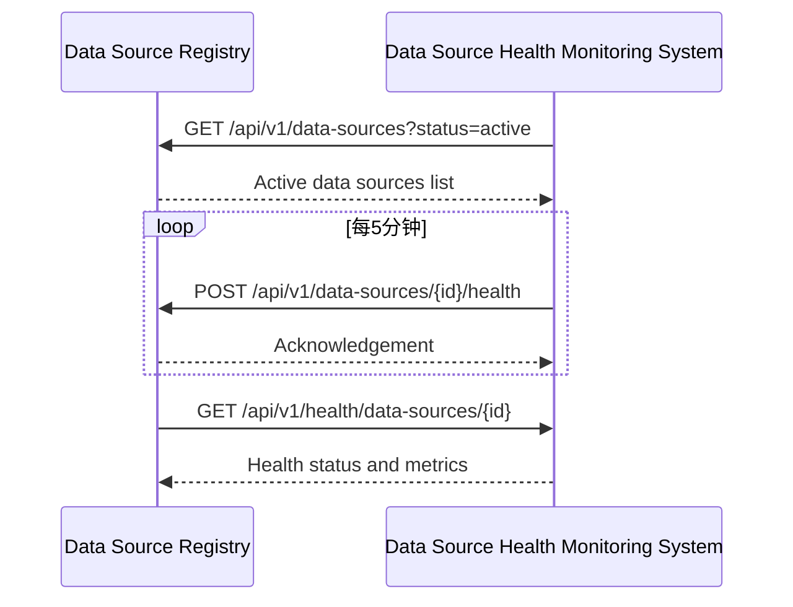
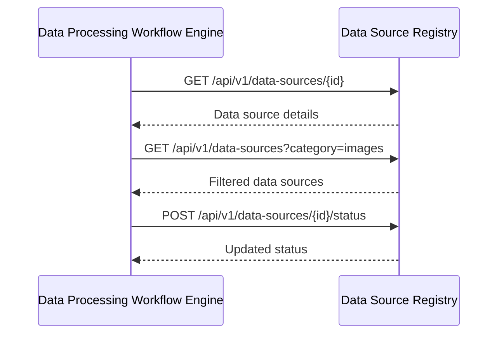
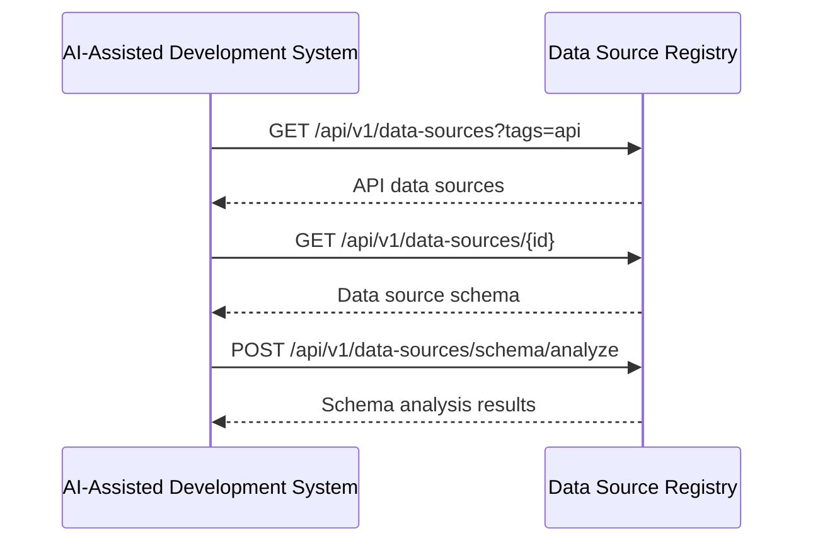

# 镜界平台终极技术规格说明书（模块级深度实现） - 第1章


### 1. 数据源注册中心 (Data Source Registry)
- [1.1 模块概述](#11-模块概述)
- [1.2 详细功能清单](#12-详细功能清单)
  - [1.2.1 核心功能](#121-核心功能)
  - [1.2.2 高级功能](#122-高级功能)
- [1.3 技术架构](#13-技术架构)
  - [1.3.1 架构图](#131-架构图)
  - [1.3.2 服务边界与交互](#132-服务边界与交互)
- [1.4 核心组件详细实现](#14-核心组件详细实现)
  - [1.4.1 元数据管理服务](#141-元数据管理服务)
  - [1.4.2 搜索服务](#142-搜索服务)
  - [1.4.3 分类管理服务](#143-分类管理服务)
- [1.5 数据模型详细定义](#15-数据模型详细定义)
  - [1.5.1 数据源核心表](#151-数据源核心表)
  - [1.5.2 数据源版本表](#152-数据源版本表)
  - [1.5.3 分类表](#153-分类表)
- [1.6 API详细规范](#16-api详细规范)
  - [1.6.1 数据源管理API](#161-数据源管理api)
  - [1.6.2 搜索API](#162-搜索api)
- [1.7 性能优化策略](#17-性能优化策略)
  - [1.7.1 数据库优化](#171-数据库优化)
  - [1.7.2 缓存策略](#172-缓存策略)
  - [1.7.3 搜索性能优化](#173-搜索性能优化)
- [1.8 安全考虑](#18-安全考虑)
  - [1.8.1 访问控制](#181-访问控制)
  - [1.8.2 数据安全](#182-数据安全)
- [1.9 与其他模块的交互](#19-与其他模块的交互)
  - [1.9.1 与数据源健康监测系统交互](#191-与数据源健康监测系统交互)
  - [1.9.2 与数据处理工作流引擎交互](#192-与数据处理工作流引擎交互)
  - [1.9.3 与AI辅助开发系统交互](#193-与ai辅助开发系统交互)


## 1. 数据源注册中心 (Data Source Registry)

### 1.1 模块概述
数据源注册中心是镜界平台的核心元数据管理组件，负责存储、管理和检索所有数据源的元信息。它为其他模块提供统一的数据源发现、分类和管理能力，支持从简单网页到复杂API的各种数据源类型。

### 1.2 详细功能清单

#### 1.2.1 核心功能
- **数据源CRUD管理**
  - 创建、读取、更新、删除数据源元数据
  - 支持版本控制的数据源定义
  - 支持软删除与回收站功能
- **数据源分类与标签**
  - 多级分类体系管理
  - 动态标签系统（支持用户自定义标签）
  - 自动化标签建议（基于内容分析）
- **高级搜索与过滤**
  - 全文搜索（基于Elasticsearch）
  - 复杂查询构建器（支持布尔逻辑）
  - 保存常用搜索查询
- **数据源健康监控集成**
  - 与健康监测系统集成
  - 健康状态可视化
  - 健康历史记录查询
- **访问控制与权限管理**
  - 细粒度权限控制（项目级、数据源级）
  - 基于角色的访问控制(RBAC)
  - 数据源共享功能

#### 1.2.2 高级功能
- **数据源依赖关系管理**
  - 识别和可视化数据源之间的依赖关系
  - 影响分析（当一个数据源变更时影响范围分析）
- **数据源变更追踪**
  - 完整的变更历史记录
  - 变更对比功能
  - 回滚到历史版本
- **自动化数据源发现**
  - 网站地图解析
  - API文档解析（OpenAPI/Swagger）
  - 智能数据源推荐
- **数据源质量评估**
  - 自动化质量评分
  - 质量趋势分析
  - 质量问题诊断

### 1.3 技术架构

#### 1.3.1 架构图
```
┌─────────────────────────────────────────────────────────────────────────────────────────────┐
│                                 数据源注册中心 (DSR)                                          │
├───────────────────────┬───────────────────────┬───────────────────────────────────────────────┤
│  核心服务层           │  集成层              │  支持服务层                                 │
├───────────────────────┼───────────────────────┼───────────────────────────────────────────────┤
│ • 元数据管理服务      │ • 数据源发现适配器    │ • 搜索索引服务                             │
│ • 分类管理服务        │ • 健康监测集成        │ • 缓存服务                                 │
│ • 标签管理服务        │ • API网关             │ • 通知服务                                 │
│ • 搜索服务            │ • Webhook支持         │ • 审计日志服务                             │
│ • 权限管理服务        │ • SDK支持             │ • 指标收集服务                             │
└───────────────────────┴───────────────────────┴─────────────────────────────────────────────┘
```

#### 1.3.2 服务边界与交互
- **输入**：
  - 用户操作（Web界面、CLI、API）
  - 健康监测系统更新
  - 数据源发现服务
  - 外部系统Webhook
- **输出**：
  - 数据源元数据给工作流引擎
  - 健康状态给监控系统
  - 分类信息给推荐引擎
  - 变更事件给事件总线

### 1.4 核心组件详细实现

#### 1.4.1 元数据管理服务

**技术实现：**
```python
class DataSourceService:
    """数据源元数据管理核心服务"""
    
    def __init__(
        self,
        db: Database,
        search_index: SearchIndex,
        event_bus: EventBus,
        config: Config
    ):
        self.db = db
        self.search_index = search_index
        self.event_bus = event_bus
        self.config = config
        self.logger = logging.getLogger(__name__)
    
    def create_data_source(
        self,
        project_id: str,
        data_source: DataSource,
        user_id: str
    ) -> DataSource:
        """
        创建新的数据源
        
        :param project_id: 所属项目ID
        :param data_source: 数据源对象
        :param user_id: 创建者ID
        :return: 创建后的数据源对象
        """
        # 1. 验证数据源
        self._validate_data_source(data_source)
        
        # 2. 生成唯一ID
        data_source.id = f"ds-{uuid.uuid4().hex[:8]}"
        data_source.project_id = project_id
        data_source.created_at = datetime.utcnow()
        data_source.updated_at = data_source.created_at
        data_source.owner_id = user_id
        data_source.status = "active"
        
        # 3. 处理分类和标签
        self._process_categories_and_tags(data_source)
        
        # 4. 保存到数据库
        self._save_to_db(data_source)
        
        # 5. 更新搜索索引
        self.search_index.add(data_source)
        
        # 6. 发布创建事件
        self.event_bus.publish("data_source.created", {
            "data_source_id": data_source.id,
            "project_id": project_id,
            "user_id": user_id
        })
        
        return data_source
    
    def _validate_data_source(self, data_source: DataSource):
        """验证数据源定义的有效性"""
        # 必填字段检查
        required_fields = ["name", "url", "category", "data_type"]
        for field in required_fields:
            if not getattr(data_source, field):
                raise ValidationError(f"Missing required field: {field}")
        
        # URL格式验证
        if not self._is_valid_url(data_source.url):
            raise ValidationError("Invalid URL format")
        
        # 数据类型验证
        valid_data_types = ["image", "video", "document", "api", "html", "json", "xml"]
        if data_source.data_type not in valid_data_types:
            raise ValidationError(f"Invalid data type. Must be one of: {', '.join(valid_data_types)}")
        
        # 架构验证（如果是API）
        if data_source.data_type == "api" and data_source.schema:
            try:
                # 使用JSON Schema验证
                validate(instance=data_source.schema, schema=API_SCHEMA)
            except Exception as e:
                raise ValidationError(f"Invalid API schema: {str(e)}")
    
    def _is_valid_url(self, url: str) -> bool:
        """验证URL格式"""
        try:
            result = urlparse(url)
            return all([result.scheme, result.netloc])
        except:
            return False
    
    def _process_categories_and_tags(self, data_source: DataSource):
        """处理分类和标签"""
        # 自动分类（如果未指定）
        if not data_source.category:
            data_source.category = self._auto_categorize(data_source)
        
        # 自动标签建议
        if self.config.auto_tagging_enabled:
            auto_tags = self._generate_auto_tags(data_source)
            data_source.tags = list(set(data_source.tags + auto_tags))
    
    def _auto_categorize(self, data_source: DataSource) -> str:
        """自动分类算法"""
        # 基于URL模式的分类
        url = data_source.url.lower()
        
        if "social" in url or any(kw in url for kw in ["facebook", "twitter", "instagram"]):
            return "social-media"
        elif "news" in url or any(kw in url for kw in ["bbc", "cnn", "reuters"]):
            return "news"
        elif "ecommerce" in url or any(kw in url for kw in ["amazon", "ebay", "aliexpress"]):
            return "ecommerce"
        elif "image" in url or data_source.data_type == "image":
            return "image"
        elif "video" in url or data_source.data_type == "video":
            return "video"
        
        # 默认分类
        return "general"
    
    def _generate_auto_tags(self, data_source: DataSource) -> List[str]:
        """生成自动标签"""
        tags = []
        
        # 基于URL的标签
        url = data_source.url.lower()
        if "api" in url:
            tags.append("api")
        if "mobile" in url:
            tags.append("mobile")
        if "desktop" in url:
            tags.append("desktop")
        
        # 基于内容类型的标签
        if data_source.content_type:
            if "json" in data_source.content_type:
                tags.append("json")
            elif "xml" in data_source.content_type:
                tags.append("xml")
            elif "html" in data_source.content_type:
                tags.append("html")
        
        # 基于数据类型的标签
        if data_source.data_type == "image":
            tags.append("image-source")
        elif data_source.data_type == "video":
            tags.append("video-source")
        
        return tags
    
    def _save_to_db(self, data_source: DataSource):
        """保存到数据库"""
        # 准备SQL
        sql = """
        INSERT INTO data_sources (
            id, project_id, name, display_name, description, url, 
            category, data_type, content_type, schema, status, 
            created_at, updated_at, owner_id, tags, metadata
        ) VALUES (
            %(id)s, %(project_id)s, %(name)s, %(display_name)s, %(description)s, %(url)s,
            %(category)s, %(data_type)s, %(content_type)s, %(schema)s, %(status)s,
            %(created_at)s, %(updated_at)s, %(owner_id)s, %(tags)s, %(metadata)s
        )
        """
        
        # 执行插入
        self.db.execute(sql, {
            "id": data_source.id,
            "project_id": data_source.project_id,
            "name": data_source.name,
            "display_name": data_source.display_name,
            "description": data_source.description,
            "url": data_source.url,
            "category": data_source.category,
            "data_type": data_source.data_type,
            "content_type": data_source.content_type,
            "schema": json.dumps(data_source.schema) if data_source.schema else None,
            "status": data_source.status,
            "created_at": data_source.created_at,
            "updated_at": data_source.updated_at,
            "owner_id": data_source.owner_id,
            "tags": json.dumps(data_source.tags),
            "metadata": json.dumps(data_source.metadata)
        })
    
    def get_data_source(
        self,
        data_source_id: str,
        project_id: str,
        user_id: str
    ) -> DataSource:
        """
        获取数据源详情
        
        :param data_source_id: 数据源ID
        :param project_id: 项目ID
        :param user_id: 请求用户ID
        :return: 数据源对象
        """
        # 1. 检查权限
        if not self._has_permission(user_id, project_id, "read"):
            raise PermissionError("User does not have permission to read this data source")
        
        # 2. 从数据库获取
        data_source = self._get_from_db(data_source_id, project_id)
        if not data_source:
            raise NotFoundError(f"Data source {data_source_id} not found")
        
        # 3. 获取健康状态
        data_source.health = self._get_health_status(data_source_id)
        
        return data_source
    
    def _get_from_db(self, data_source_id: str, project_id: str) -> Optional[DataSource]:
        """从数据库获取数据源"""
        sql = """
        SELECT * FROM data_sources 
        WHERE id = %(id)s AND project_id = %(project_id)s
        """
        
        row = self.db.fetchone(sql, {
            "id": data_source_id,
            "project_id": project_id
        })
        
        if not row:
            return None
        
        return self._row_to_data_source(row)
    
    def _row_to_data_source(self, row: Dict) -> DataSource:
        """将数据库行转换为DataSource对象"""
        return DataSource(
            id=row["id"],
            project_id=row["project_id"],
            name=row["name"],
            display_name=row["display_name"],
            description=row["description"],
            url=row["url"],
            category=row["category"],
            data_type=row["data_type"],
            content_type=row["content_type"],
            schema=json.loads(row["schema"]) if row["schema"] else None,
            status=row["status"],
            created_at=row["created_at"],
            updated_at=row["updated_at"],
            owner_id=row["owner_id"],
            tags=json.loads(row["tags"]),
            metadata=json.loads(row["metadata"])
        )
    
    def _get_health_status(self, data_source_id: str) -> DataSourceHealth:
        """获取数据源健康状态"""
        # 从健康监测系统获取最新状态
        health_data = self.health_monitor.get_latest_health(data_source_id)
        
        if not health_data:
            return DataSourceHealth(
                status="unknown",
                last_check=None,
                metrics={}
            )
        
        return DataSourceHealth(
            status=health_data["status"],
            last_check=health_data["timestamp"],
            metrics=health_data["metrics"]
        )
    
    def update_data_source(
        self,
        data_source_id: str,
        project_id: str,
        updates: Dict,
        user_id: str
    ) -> DataSource:
        """
        更新数据源
        
        :param data_source_id: 数据源ID
        :param project_id: 项目ID
        :param updates: 更新字段
        :param user_id: 更新者ID
        :return: 更新后的数据源
        """
        # 1. 获取当前数据源
        current = self.get_data_source(data_source_id, project_id, user_id)
        
        # 2. 检查权限
        if not self._has_permission(user_id, project_id, "write"):
            raise PermissionError("User does not have permission to update this data source")
        
        # 3. 验证更新
        self._validate_updates(updates, current)
        
        # 4. 创建新版本
        new_version = self._create_version(current, updates, user_id)
        
        # 5. 保存更新
        self._save_update(data_source_id, project_id, updates)
        
        # 6. 更新搜索索引
        updated_source = self._get_from_db(data_source_id, project_id)
        self.search_index.update(updated_source)
        
        # 7. 发布更新事件
        self.event_bus.publish("data_source.updated", {
            "data_source_id": data_source_id,
            "project_id": project_id,
            "user_id": user_id,
            "changes": updates
        })
        
        return updated_source
    
    def _validate_updates(self, updates: Dict, current: DataSource):
        """验证更新是否有效"""
        # 不能修改ID和项目ID
        if "id" in updates or "project_id" in updates:
            raise ValidationError("Cannot update data source ID or project ID")
        
        # 验证URL变更
        if "url" in updates and updates["url"] != current.url:
            # 检查URL格式
            if not self._is_valid_url(updates["url"]):
                raise ValidationError("Invalid URL format")
            
            # 检查重复URL
            if self._url_exists(updates["url"], current.project_id, current.id):
                raise ValidationError("URL already exists in this project")
    
    def _url_exists(self, url: str, project_id: str, exclude_id: str = None) -> bool:
        """检查URL是否已存在"""
        sql = """
        SELECT COUNT(*) FROM data_sources 
        WHERE url = %(url)s AND project_id = %(project_id)s
        """
        params = {"url": url, "project_id": project_id}
        
        if exclude_id:
            sql += " AND id != %(exclude_id)s"
            params["exclude_id"] = exclude_id
        
        count = self.db.fetchone(sql, params)["count"]
        return count > 0
    
    def _create_version(self, current: DataSource, updates: Dict, user_id: str) -> str:
        """创建数据源新版本"""
        # 生成新版本ID
        version_id = f"ver-{uuid.uuid4().hex[:8]}"
        
        # 准备版本数据
        version_data = {
            "data_source_id": current.id,
            "version_id": version_id,
            "changes": json.dumps(updates),
            "created_at": datetime.utcnow(),
            "created_by": user_id,
            "previous_version": current.current_version
        }
        
        # 保存版本
        self.db.execute("""
        INSERT INTO data_source_versions (
            data_source_id, version_id, changes, created_at, created_by, previous_version
        ) VALUES (
            %(data_source_id)s, %(version_id)s, %(changes)s, %(created_at)s, %(created_by)s, %(previous_version)s
        )
        """, version_data)
        
        return version_id
    
    def _save_update(self, data_source_id: str, project_id: str, updates: Dict):
        """保存数据源更新"""
        # 准备更新字段
        update_fields = []
        params = {"id": data_source_id, "project_id": project_id, "updated_at": datetime.utcnow()}
        
        for field, value in updates.items():
            if field in ["tags", "metadata", "schema"]:
                # 处理JSON字段
                update_fields.append(f"{field} = %(field)s::jsonb")
                params[field] = json.dumps(value)
            else:
                update_fields.append(f"{field} = %({field})s")
                params[field] = value
        
        # 添加更新时间
        update_fields.append("updated_at = %(updated_at)s")
        
        # 执行更新
        sql = f"""
        UPDATE data_sources 
        SET {', '.join(update_fields)}
        WHERE id = %(id)s AND project_id = %(project_id)s
        """
        
        self.db.execute(sql, params)
    
    def delete_data_source(
        self,
        data_source_id: str,
        project_id: str,
        user_id: str,
        permanent: bool = False
    ):
        """
        删除数据源
        
        :param data_source_id: 数据源ID
        :param project_id: 项目ID
        :param user_id: 删除者ID
        :param permanent: 是否永久删除
        """
        # 1. 检查权限
        if not self._has_permission(user_id, project_id, "delete"):
            raise PermissionError("User does not have permission to delete this data source")
        
        if permanent:
            # 2. 永久删除
            self._permanent_delete(data_source_id, project_id)
        else:
            # 2. 软删除
            self._soft_delete(data_source_id, project_id, user_id)
        
        # 3. 从搜索索引中移除
        self.search_index.delete(data_source_id, project_id)
        
        # 4. 发布删除事件
        self.event_bus.publish("data_source.deleted", {
            "data_source_id": data_source_id,
            "project_id": project_id,
            "user_id": user_id,
            "permanent": permanent
        })
    
    def _soft_delete(self, data_source_id: str, project_id: str, user_id: str):
        """软删除数据源"""
        self.db.execute("""
        UPDATE data_sources 
        SET status = 'deleted', deleted_at = NOW(), deleted_by = %(user_id)s
        WHERE id = %(id)s AND project_id = %(project_id)s
        """, {
            "id": data_source_id,
            "project_id": project_id,
            "user_id": user_id
        })
    
    def _permanent_delete(self, data_source_id: str, project_id: str):
        """永久删除数据源"""
        # 先删除相关记录
        self.db.execute("""
        DELETE FROM data_source_versions 
        WHERE data_source_id = %(id)s AND project_id = %(project_id)s
        """, {
            "id": data_source_id,
            "project_id": project_id
        })
        
        # 再删除主记录
        self.db.execute("""
        DELETE FROM data_sources 
        WHERE id = %(id)s AND project_id = %(project_id)s
        """, {
            "id": data_source_id,
            "project_id": project_id
        })
    
    def list_data_sources(
        self,
        project_id: str,
        user_id: str,
        filters: Optional[Dict] = None,
        sort: Optional[str] = None,
        page: int = 1,
        page_size: int = 20
    ) -> DataSourceList:
        """
        列出数据源
        
        :param project_id: 项目ID
        :param user_id: 请求用户ID
        :param filters: 过滤条件
        :param sort: 排序字段
        :param page: 页码
        :param page_size: 每页数量
        :return: 数据源列表
        """
        # 1. 检查权限
        if not self._has_permission(user_id, project_id, "read"):
            raise PermissionError("User does not have permission to list data sources")
        
        # 2. 构建查询
        query = self._build_list_query(project_id, filters, sort, page, page_size)
        
        # 3. 执行查询
        rows = self.db.fetchall(query["sql"], query["params"])
        total = self.db.fetchone(query["count_sql"], query["params"])["count"]
        
        # 4. 转换结果
        data_sources = [self._row_to_data_source(row) for row in rows]
        
        # 5. 获取健康状态（批量）
        data_source_ids = [ds.id for ds in data_sources]
        health_statuses = self.health_monitor.get_health_statuses(data_source_ids)
        
        for ds in data_sources:
            ds.health = health_statuses.get(ds.id, DataSourceHealth(
                status="unknown",
                last_check=None,
                metrics={}
            ))
        
        return DataSourceList(
            items=data_sources,
            total=total,
            page=page,
            page_size=page_size
        )
    
    def _build_list_query(
        self,
        project_id: str,
        filters: Optional[Dict],
        sort: Optional[str],
        page: int,
        page_size: int
    ) -> Dict:
        """构建列表查询SQL"""
        # 基础查询
        base_sql = """
        SELECT * FROM data_sources 
        WHERE project_id = %(project_id)s
        """
        params = {"project_id": project_id}
        
        # 添加过滤条件
        if filters:
            if "status" in filters and filters["status"]:
                base_sql += " AND status = %(status)s"
                params["status"] = filters["status"]
            
            if "category" in filters and filters["category"]:
                base_sql += " AND category = %(category)s"
                params["category"] = filters["category"]
            
            if "tags" in filters and filters["tags"]:
                # 处理标签过滤（包含所有指定标签）
                tags = filters["tags"]
                if isinstance(tags, str):
                    tags = [tags]
                
                for i, tag in enumerate(tags):
                    param_name = f"tag_{i}"
                    base_sql += f" AND %(tags)s @> ARRAY[%(param_name)s]::varchar[]"
                    params[param_name] = tag
                
                params["tags"] = tags
        
        # 添加排序
        order_by = "updated_at DESC"
        if sort:
            # 验证排序字段
            valid_sort_fields = ["name", "created_at", "updated_at", "health_score"]
            if sort.lstrip("-") in valid_sort_fields:
                direction = "DESC" if sort.startswith("-") else "ASC"
                field = sort.lstrip("-")
                order_by = f"{field} {direction}"
        
        base_sql += f" ORDER BY {order_by}"
        
        # 添加分页
        offset = (page - 1) * page_size
        paginated_sql = f"{base_sql} LIMIT %(page_size)s OFFSET %(offset)s"
        
        params.update({
            "page_size": page_size,
            "offset": offset
        })
        
        # 计数查询
        count_sql = f"SELECT COUNT(*) FROM ({base_sql}) AS count_source"
        
        return {
            "sql": paginated_sql,
            "count_sql": count_sql,
            "params": params
        }
    
    def _has_permission(self, user_id: str, project_id: str, permission: str) -> bool:
        """检查用户是否有权限"""
        # 实现权限检查逻辑
        # 这里简化为检查用户是否是项目成员
        return self.project_service.is_member(user_id, project_id)
```

#### 1.4.2 搜索服务

**技术实现：**
```python
class SearchService:
    """数据源搜索服务，基于Elasticsearch实现"""
    
    def __init__(
        self,
        es_client: Elasticsearch,
        config: Config
    ):
        self.es_client = es_client
        self.config = config
        self.index_name = config.get("index_name", "data_sources")
        self.logger = logging.getLogger(__name__)
        
        # 确保索引存在
        self._ensure_index()
    
    def _ensure_index(self):
        """确保Elasticsearch索引存在"""
        if not self.es_client.indices.exists(index=self.index_name):
            self.logger.info(f"Creating Elasticsearch index: {self.index_name}")
            
            # 定义索引设置
            settings = {
                "settings": {
                    "number_of_shards": 3,
                    "number_of_replicas": 1,
                    "analysis": {
                        "analyzer": {
                            "standard_analyzer": {
                                "type": "custom",
                                "tokenizer": "standard",
                                "filter": ["lowercase", "stop"]
                            }
                        }
                    }
                },
                "mappings": {
                    "properties": {
                        "id": {"type": "keyword"},
                        "project_id": {"type": "keyword"},
                        "name": {"type": "text", "analyzer": "standard_analyzer"},
                        "display_name": {"type": "text", "analyzer": "standard_analyzer"},
                        "description": {"type": "text", "analyzer": "standard_analyzer"},
                        "url": {"type": "keyword"},
                        "category": {"type": "keyword"},
                        "data_type": {"type": "keyword"},
                        "content_type": {"type": "keyword"},
                        "status": {"type": "keyword"},
                        "tags": {"type": "keyword"},
                        "created_at": {"type": "date"},
                        "updated_at": {"type": "date"},
                        "health_score": {"type": "float"},
                        "availability_7d": {"type": "float"}
                    }
                }
            }
            
            # 创建索引
            self.es_client.indices.create(
                index=self.index_name,
                body=settings
            )
    
    def add(self, data_source: DataSource):
        """添加数据源到搜索索引"""
        doc = self._to_document(data_source)
        self.es_client.index(
            index=self.index_name,
            id=data_source.id,
            body=doc
        )
    
    def _to_document(self, data_source: DataSource) -> Dict:
        """将数据源转换为Elasticsearch文档"""
        # 计算健康分数（如果可用）
        health_score = 0.0
        if data_source.health and "availability_7d" in data_source.health.metrics:
            health_score = data_source.health.metrics["availability_7d"]
        
        return {
            "id": data_source.id,
            "project_id": data_source.project_id,
            "name": data_source.name,
            "display_name": data_source.display_name,
            "description": data_source.description,
            "url": data_source.url,
            "category": data_source.category,
            "data_type": data_source.data_type,
            "content_type": data_source.content_type,
            "status": data_source.status,
            "tags": data_source.tags,
            "created_at": data_source.created_at,
            "updated_at": data_source.updated_at,
            "health_score": health_score,
            "availability_7d": data_source.health.metrics.get("availability_7d", 0.0) if data_source.health else 0.0
        }
    
    def update(self, data_source: DataSource):
        """更新搜索索引中的数据源"""
        doc = self._to_document(data_source)
        self.es_client.update(
            index=self.index_name,
            id=data_source.id,
            body={"doc": doc}
        )
    
    def delete(self, data_source_id: str, project_id: str):
        """从搜索索引中删除数据源"""
        self.es_client.delete(
            index=self.index_name,
            id=data_source_id
        )
    
    def search(
        self,
        project_id: str,
        query: str,
        filters: Optional[Dict] = None,
        sort: Optional[str] = None,
        page: int = 1,
        page_size: int = 20
    ) -> SearchResult:
        """
        搜索数据源
        
        :param project_id: 项目ID
        :param query: 搜索查询
        :param filters: 过滤条件
        :param sort: 排序字段
        :param page: 页码
        :param page_size: 每页数量
        :return: 搜索结果
        """
        # 构建查询体
        body = self._build_search_query(project_id, query, filters, sort, page, page_size)
        
        # 执行搜索
        result = self.es_client.search(
            index=self.index_name,
            body=body
        )
        
        # 处理结果
        hits = result["hits"]["hits"]
        total = result["hits"]["total"]["value"]
        
        data_sources = []
        for hit in hits:
            source = hit["_source"]
            # 这里应该转换为DataSource对象，但为了示例简化
            data_sources.append(source)
        
        return SearchResult(
            items=data_sources,
            total=total,
            page=page,
            page_size=page_size
        )
    
    def _build_search_query(
        self,
        project_id: str,
        query: str,
        filters: Optional[Dict],
        sort: Optional[str],
        page: int,
        page_size: int
    ) -> Dict:
        """构建Elasticsearch查询体"""
        # 基础查询 - 仅限当前项目
        base_query = {
            "bool": {
                "must": [
                    {"term": {"project_id": project_id}}
                ]
            }
        }
        
        # 添加全文搜索
        if query and query.strip():
            base_query["bool"]["must"].append({
                "multi_match": {
                    "query": query,
                    "fields": ["name^3", "display_name^2", "description", "url"],
                    "fuzziness": "AUTO"
                }
            })
        
        # 添加过滤条件
        if filters:
            if "status" in filters and filters["status"]:
                base_query["bool"]["must"].append({
                    "term": {"status": filters["status"]}
                })
            
            if "category" in filters and filters["category"]:
                base_query["bool"]["must"].append({
                    "term": {"category": filters["category"]}
                })
            
            if "tags" in filters and filters["tags"]:
                tags = filters["tags"]
                if isinstance(tags, str):
                    tags = [tags]
                
                # 必须包含所有指定标签
                for tag in tags:
                    base_query["bool"]["must"].append({
                        "term": {"tags": tag}
                    })
            
            if "min_health" in filters:
                base_query["bool"]["must"].append({
                    "range": {
                        "health_score": {
                            "gte": filters["min_health"]
                        }
                    }
                })
        
        # 构建排序
        sort_spec = []
        if sort:
            # 验证排序字段
            valid_sort_fields = ["name", "created_at", "updated_at", "health_score"]
            if sort.lstrip("-") in valid_sort_fields:
                direction = "desc" if sort.startswith("-") else "asc"
                field = sort.lstrip("-")
                sort_spec.append({field: {"order": direction}})
        
        # 默认排序
        if not sort_spec:
            sort_spec.append({"_score": {"order": "desc"}})
            sort_spec.append({"updated_at": {"order": "desc"}})
        
        # 计算分页
        from_val = (page - 1) * page_size
        
        return {
            "query": base_query,
            "sort": sort_spec,
            "from": from_val,
            "size": page_size,
            "_source": True
        }
    
    def suggest_tags(self, project_id: str, prefix: str) -> List[str]:
        """建议标签（基于现有标签）"""
        # 使用terms aggregation获取匹配的标签
        body = {
            "size": 0,
            "query": {
                "bool": {
                    "must": [
                        {"term": {"project_id": project_id}}
                    ]
                }
            },
            "aggs": {
                "suggested_tags": {
                    "terms": {
                        "field": "tags",
                        "include": f".*{prefix}.*",
                        "size": 10
                    }
                }
            }
        }
        
        result = self.es_client.search(
            index=self.index_name,
            body=body
        )
        
        # 提取建议的标签
        buckets = result["aggregations"]["suggested_tags"]["buckets"]
        return [bucket["key"] for bucket in buckets]
```

#### 1.4.3 分类管理服务

**技术实现：**
```python
class CategoryService:
    """数据源分类管理服务"""
    
    def __init__(
        self,
        db: Database,
        config: Config
    ):
        self.db = db
        self.config = config
        self.logger = logging.getLogger(__name__)
        self.cache = TTLCache(maxsize=1000, ttl=300)  # 5分钟缓存
    
    def get_category_tree(
        self,
        project_id: str,
        user_id: str
    ) -> List[CategoryNode]:
        """
        获取分类树
        
        :param project_id: 项目ID
        :param user_id: 用户ID
        :return: 分类树
        """
        # 1. 检查权限
        if not self._has_permission(user_id, project_id, "read"):
            raise PermissionError("User does not have permission to view categories")
        
        # 2. 尝试从缓存获取
        cache_key = f"{project_id}:tree"
        if cache_key in self.cache:
            return self.cache[cache_key]
        
        # 3. 从数据库获取
        categories = self._get_all_categories(project_id)
        
        # 4. 构建树结构
        tree = self._build_category_tree(categories)
        
        # 5. 缓存结果
        self.cache[cache_key] = tree
        
        return tree
    
    def _get_all_categories(self, project_id: str) -> List[Category]:
        """从数据库获取所有分类"""
        sql = """
        SELECT * FROM data_source_categories 
        WHERE project_id = %(project_id)s 
        ORDER BY parent_id NULLS FIRST, sort_order
        """
        
        rows = self.db.fetchall(sql, {"project_id": project_id})
        return [self._row_to_category(row) for row in rows]
    
    def _row_to_category(self, row: Dict) -> Category:
        """将数据库行转换为Category对象"""
        return Category(
            id=row["id"],
            project_id=row["project_id"],
            name=row["name"],
            description=row["description"],
            parent_id=row["parent_id"],
            sort_order=row["sort_order"],
            created_at=row["created_at"],
            updated_at=row["updated_at"]
        )
    
    def _build_category_tree(self, categories: List[Category]) -> List[CategoryNode]:
        """构建分类树结构"""
        # 创建ID到分类的映射
        category_map = {cat.id: cat for cat in categories}
        
        # 创建节点映射
        node_map = {}
        for cat in categories:
            node_map[cat.id] = CategoryNode(
                category=cat,
                children=[]
            )
        
        # 构建树结构
        root_nodes = []
        for cat in categories:
            node = node_map[cat.id]
            
            if cat.parent_id is None:
                # 根节点
                root_nodes.append(node)
            else:
                # 子节点
                parent_node = node_map.get(cat.parent_id)
                if parent_node:
                    parent_node.children.append(node)
        
        # 按排序顺序
        def sort_nodes(nodes):
            return sorted(nodes, key=lambda n: (n.category.sort_order, n.category.name))
        
        # 递归排序
        def sort_tree(node):
            node.children = sort_nodes(node.children)
            for child in node.children:
                sort_tree(child)
        
        for node in root_nodes:
            sort_tree(node)
        
        return sort_nodes(root_nodes)
    
    def create_category(
        self,
        project_id: str,
        category: Category,
        user_id: str
    ) -> Category:
        """
        创建新分类
        
        :param project_id: 项目ID
        :param category: 分类对象
        :param user_id: 创建者ID
        :return: 创建后的分类
        """
        # 1. 检查权限
        if not self._has_permission(user_id, project_id, "write"):
            raise PermissionError("User does not have permission to create categories")
        
        # 2. 验证分类
        self._validate_category(category, project_id)
        
        # 3. 生成唯一ID
        category.id = f"cat-{uuid.uuid4().hex[:8]}"
        category.project_id = project_id
        category.created_at = datetime.utcnow()
        category.updated_at = category.created_at
        
        # 4. 保存到数据库
        self._save_category(category)
        
        # 5. 清除缓存
        self._clear_cache(project_id)
        
        return category
    
    def _validate_category(self, category: Category, project_id: str):
        """验证分类是否有效"""
        # 必填字段
        if not category.name:
            raise ValidationError("Category name is required")
        
        # 检查名称是否重复
        if self._category_name_exists(category.name, project_id, category.parent_id, exclude_id=None):
            raise ValidationError("Category name already exists in this parent")
    
    def _category_name_exists(
        self,
        name: str,
        project_id: str,
        parent_id: Optional[str],
        exclude_id: Optional[str]
    ) -> bool:
        """检查分类名称是否已存在"""
        sql = """
        SELECT COUNT(*) FROM data_source_categories 
        WHERE project_id = %(project_id)s 
        AND name = %(name)s
        AND parent_id IS NOT DISTINCT FROM %(parent_id)s
        """
        params = {
            "project_id": project_id,
            "name": name,
            "parent_id": parent_id
        }
        
        if exclude_id:
            sql += " AND id != %(exclude_id)s"
            params["exclude_id"] = exclude_id
        
        count = self.db.fetchone(sql, params)["count"]
        return count > 0
    
    def _save_category(self, category: Category):
        """保存分类到数据库"""
        sql = """
        INSERT INTO data_source_categories (
            id, project_id, name, description, parent_id, sort_order, created_at, updated_at
        ) VALUES (
            %(id)s, %(project_id)s, %(name)s, %(description)s, %(parent_id)s, %(sort_order)s, 
            %(created_at)s, %(updated_at)s
        )
        """
        
        self.db.execute(sql, {
            "id": category.id,
            "project_id": category.project_id,
            "name": category.name,
            "description": category.description,
            "parent_id": category.parent_id,
            "sort_order": category.sort_order or 0,
            "created_at": category.created_at,
            "updated_at": category.updated_at
        })
    
    def update_category(
        self,
        category_id: str,
        project_id: str,
        updates: Dict,
        user_id: str
    ) -> Category:
        """
        更新分类
        
        :param category_id: 分类ID
        :param project_id: 项目ID
        :param updates: 更新字段
        :param user_id: 更新者ID
        :return: 更新后的分类
        """
        # 1. 获取当前分类
        current = self.get_category(category_id, project_id, user_id)
        
        # 2. 验证更新
        self._validate_category_update(updates, current, project_id)
### 1.5 数据模型详细定义

#### 1.5.1 数据源核心表

```sql
-- 数据源主表
CREATE TABLE data_sources (
    id UUID PRIMARY KEY DEFAULT gen_random_uuid(),
    project_id UUID NOT NULL REFERENCES projects(id) ON DELETE CASCADE,
    name VARCHAR(255) NOT NULL,
    display_name VARCHAR(255) NOT NULL,
    description TEXT,
    url TEXT NOT NULL,
    category VARCHAR(50) NOT NULL,
    data_type VARCHAR(30) NOT NULL CHECK (data_type IN ('image', 'video', 'document', 'api', 'html', 'json', 'xml')),
    content_type VARCHAR(100),
    schema JSONB,
    status VARCHAR(20) NOT NULL DEFAULT 'active' CHECK (status IN ('active', 'inactive', 'deprecated', 'suspended', 'deleted')),
    created_at TIMESTAMPTZ NOT NULL DEFAULT NOW(),
    updated_at TIMESTAMPTZ NOT NULL DEFAULT NOW(),
    owner_id UUID NOT NULL REFERENCES users(id) ON DELETE CASCADE,
    deleted_at TIMESTAMPTZ,
    deleted_by UUID REFERENCES users(id) ON DELETE SET NULL,
    last_health_check TIMESTAMPTZ,
    health_score NUMERIC(4,2) DEFAULT 0.0,
    availability_24h NUMERIC(4,2) DEFAULT 1.0,
    availability_7d NUMERIC(4,2) DEFAULT 1.0,
    last_crawler_run TIMESTAMPTZ,
    crawler_id UUID REFERENCES crawler_instances(id),
    crawler_config JSONB,
    tags JSONB DEFAULT '[]'::jsonb,
    metadata JSONB DEFAULT '{}'::jsonb,
    
    -- 索引
    UNIQUE (project_id, name),
    INDEX idx_data_sources_project ON data_sources(project_id),
    INDEX idx_data_sources_category ON data_sources(category),
    INDEX idx_data_sources_status ON data_sources(status),
    INDEX idx_data_sources_health ON data_sources(health_score DESC),
    INDEX idx_data_sources_updated ON data_sources(updated_at DESC),
    
    -- 全文搜索
    ts_vector TSVECTOR GENERATED ALWAYS AS (
        to_tsvector('english', coalesce(display_name, '') || ' ' || coalesce(description, '') || ' ' || url)
    ) STORED
);

-- 自动更新updated_at触发器
CREATE OR REPLACE FUNCTION update_modified_column()
RETURNS TRIGGER AS $$
BEGIN
    NEW.updated_at = NOW();
    RETURN NEW;
END;
$$ LANGUAGE plpgsql;

CREATE TRIGGER update_data_sources_modtime
BEFORE UPDATE ON data_sources
FOR EACH ROW
EXECUTE FUNCTION update_modified_column();

-- 全文搜索索引
CREATE INDEX idx_data_sources_search ON data_sources USING GIN (ts_vector);
```

#### 1.5.2 数据源版本表

```sql
-- 数据源版本表
CREATE TABLE data_source_versions (
    id UUID PRIMARY KEY DEFAULT gen_random_uuid(),
    data_source_id UUID NOT NULL REFERENCES data_sources(id) ON DELETE CASCADE,
    version_id VARCHAR(50) NOT NULL,
    changes JSONB NOT NULL,
    created_at TIMESTAMPTZ NOT NULL DEFAULT NOW(),
    created_by UUID NOT NULL REFERENCES users(id) ON DELETE CASCADE,
    previous_version VARCHAR(50),
    
    -- 索引
    UNIQUE (data_source_id, version_id),
    INDEX idx_versions_data_source ON data_source_versions(data_source_id),
    INDEX idx_versions_created ON data_source_versions(created_at DESC)
);
```

#### 1.5.3 分类表

```sql
-- 数据源分类表
CREATE TABLE data_source_categories (
    id UUID PRIMARY KEY DEFAULT gen_random_uuid(),
    project_id UUID NOT NULL REFERENCES projects(id) ON DELETE CASCADE,
    name VARCHAR(100) NOT NULL,
    description TEXT,
    parent_id UUID REFERENCES data_source_categories(id) ON DELETE CASCADE,
    sort_order INT NOT NULL DEFAULT 0,
    created_at TIMESTAMPTZ NOT NULL DEFAULT NOW(),
    updated_at TIMESTAMPTZ NOT NULL DEFAULT NOW(),
    
    -- 索引
    UNIQUE (project_id, name, parent_id),
    INDEX idx_categories_project ON data_source_categories(project_id),
    INDEX idx_categories_parent ON data_source_categories(parent_id)
);
```

### 1.6 API详细规范

#### 1.6.1 数据源管理API

**创建数据源 (POST /api/v1/data-sources)**

*请求示例:*
```http
POST /api/v1/data-sources HTTP/1.1
Host: dsr.mirror-realm.com
Authorization: Bearer <access_token>
Content-Type: application/json
X-Request-ID: req-123456

{
  "name": "instagram-api",
  "display_name": "Instagram API",
  "description": "Official Instagram API for fetching user posts",
  "url": "https://api.instagram.com/v1/users/self/media/recent",
  "category": "social-media",
  "data_type": "json",
  "content_type": "application/json",
  "schema": {
    "type": "object",
    "properties": {
      "data": {
        "type": "array",
        "items": {
          "type": "object",
          "properties": {
            "id": {"type": "string"},
            "images": {
              "type": "object",
              "properties": {
                "standard_resolution": {
                  "type": "object",
                  "properties": {
                    "url": {"type": "string"},
                    "width": {"type": "integer"},
                    "height": {"type": "integer"}
                  }
                }
              }
            }
          }
        }
      }
    }
  },
  "tags": ["social", "api", "instagram"],
  "metadata": {
    "api_version": "v1"
  }
}
```

*成功响应示例:*
```http
HTTP/1.1 201 Created
Content-Type: application/json
Location: /api/v1/data-sources/instagram-api
X-Request-ID: req-123456
ETag: "d41d8cd98f00b204e9800998ecf8427e"

{
  "id": "ds-7a8b9c0d",
  "project_id": "proj-123",
  "name": "instagram-api",
  "display_name": "Instagram API",
  "description": "Official Instagram API for fetching user posts",
  "url": "https://api.instagram.com/v1/users/self/media/recent",
  "category": "social-media",
  "data_type": "json",
  "content_type": "application/json",
  "schema": {
    "type": "object",
    "properties": {
      "data": {
        "type": "array",
        "items": {
          "type": "object",
          "properties": {
            "id": {"type": "string"},
            "images": {
              "type": "object",
              "properties": {
                "standard_resolution": {
                  "type": "object",
                  "properties": {
                    "url": {"type": "string"},
                    "width": {"type": "integer"},
                    "height": {"type": "integer"}
                  }
                }
              }
            }
          }
        }
      }
    }
  },
  "status": "active",
  "created_at": "2023-06-15T10:30:45Z",
  "updated_at": "2023-06-15T10:30:45Z",
  "owner_id": "user-123",
  "health": {
    "status": "unknown",
    "last_check": null,
    "metrics": {}
  },
  "tags": ["social", "api", "instagram"],
  "metadata": {
    "api_version": "v1"
  }
}
```

**获取数据源列表 (GET /api/v1/data-sources)**

*请求示例:*
```http
GET /api/v1/data-sources?category=social-media&status=active&page=1&page_size=20 HTTP/1.1
Host: dsr.mirror-realm.com
Authorization: Bearer <access_token>
Accept: application/json
```

*成功响应示例:*
```http
HTTP/1.1 200 OK
Content-Type: application/json

{
  "items": [
    {
      "id": "ds-7a8b9c0d",
      "name": "instagram-api",
      "display_name": "Instagram API",
      "url": "https://api.instagram.com/v1/users/self/media/recent",
      "category": "social-media",
      "data_type": "json",
      "status": "active",
      "created_at": "2023-06-15T10:30:45Z",
      "updated_at": "2023-06-15T10:30:45Z",
      "health": {
        "status": "healthy",
        "last_check": "2023-06-15T10:35:20Z",
        "metrics": {
          "availability_24h": 0.98,
          "availability_7d": 0.95,
          "response_time_p50": 0.35,
          "response_time_p95": 1.2
        }
      },
      "tags": ["social", "api", "instagram"]
    },
    {
      "id": "ds-1b2c3d4e",
      "name": "twitter-api",
      "display_name": "Twitter API",
      "url": "https://api.twitter.com/2/users/me/tweets",
      "category": "social-media",
      "data_type": "json",
      "status": "active",
      "created_at": "2023-06-10T08:15:30Z",
      "updated_at": "2023-06-10T08:15:30Z",
      "health": {
        "status": "degraded",
        "last_check": "2023-06-15T10:34:15Z",
        "metrics": {
          "availability_24h": 0.85,
          "availability_7d": 0.92,
          "response_time_p50": 0.8,
          "response_time_p95": 3.5
        }
      },
      "tags": ["social", "api", "twitter"]
    }
  ],
  "total": 15,
  "page": 1,
  "page_size": 20
}
```

#### 1.6.2 搜索API

**搜索数据源 (POST /api/v1/data-sources:search)**

*请求示例:*
```http
POST /api/v1/data-sources:search HTTP/1.1
Host: dsr.mirror-realm.com
Authorization: Bearer <access_token>
Content-Type: application/json

{
  "query": "instagram",
  "filters": {
    "category": "social-media",
    "tags": ["api"],
    "min_health": 0.9
  },
  "sort": "-health_score",
  "page": 1,
  "page_size": 10
}
```

*成功响应示例:*
```http
HTTP/1.1 200 OK
Content-Type: application/json

{
  "items": [
    {
      "id": "ds-7a8b9c0d",
      "name": "instagram-api",
      "display_name": "Instagram API",
      "url": "https://api.instagram.com/v1/users/self/media/recent",
      "category": "social-media",
      "data_type": "json",
      "status": "active",
      "health_score": 0.95,
      "created_at": "2023-06-15T10:30:45Z",
      "updated_at": "2023-06-15T10:30:45Z"
    }
  ],
  "total": 1,
  "page": 1,
  "page_size": 10
}
```

### 1.7 性能优化策略

#### 1.7.1 数据库优化

1. **分区策略**
   ```sql
   -- 按项目ID分区
   CREATE TABLE data_sources PARTITION OF data_sources_master
   FOR VALUES IN ('proj-123');
   
   CREATE TABLE data_sources PARTITION OF data_sources_master
   FOR VALUES IN ('proj-456');
   ```

2. **索引优化**
   ```sql
   -- 为常用查询模式创建复合索引
   CREATE INDEX idx_data_sources_project_category ON data_sources(project_id, category);
   CREATE INDEX idx_data_sources_project_status ON data_sources(project_id, status);
   CREATE INDEX idx_data_sources_project_health ON data_sources(project_id, health_score DESC);
   ```

3. **查询优化**
   - 使用覆盖索引减少IO
   - 避免SELECT *
   - 使用批量操作减少往返
   - 适当使用CTE提高可读性

#### 1.7.2 缓存策略

1. **多级缓存架构**
   ```
   ┌───────────────────────────────────────────────────────────────────────────────┐
   │                                   缓存层                                      │
   ├───────────────────┬───────────────────┬───────────────────┬───────────────────┤
   │  客户端缓存       │  CDN缓存          │  应用层缓存      │  数据库缓存       │
   ├───────────────────┼───────────────────┼───────────────────┼───────────────────┤
   │ • ETag/Last-Modified│ • 静态资源缓存   │ • Redis缓存      │ • 查询结果缓存   │
   │ • 浏览器本地存储   │ • API响应缓存    │ • 分类树缓存     │ • 连接池         │
   └───────────────────┴───────────────────┴───────────────────┴───────────────────┘
   ```

2. **缓存失效策略**
   - 写操作后立即失效相关缓存
   - 设置合理的TTL（分类树：5分钟，数据源详情：1分钟）
   - 使用缓存版本控制避免陈旧数据

#### 1.7.3 搜索性能优化

1. **Elasticsearch优化**
   - 调整分片和副本数量
   - 优化索引刷新间隔
   - 使用字段数据类型优化存储
   - 实现搜索结果分页缓存

2. **查询优化**
   ```python
   def optimized_search(project_id, query, filters, sort, page, page_size):
       # 1. 使用过滤上下文代替查询上下文（当不需要相关性评分时）
       # 2. 限制返回字段
       # 3. 使用search_after代替from/size进行深分页
       # 4. 实现结果缓存
       pass
   ```

### 1.8 安全考虑

#### 1.8.1 访问控制

1. **基于角色的访问控制(RBAC)模型**
   ```
   ┌─────────────┐      ┌─────────────┐      ┌─────────────┐
   │    Users    │─────▶│    Roles    │─────▶│  Permissions│
   └─────────────┘      └─────────────┘      └─────────────┘
          │                   ▲
          │                   │
          ▼                   │
   ┌─────────────┐      ┌─────────────┐
   │  Projects   │─────▶│    Teams    │
   └─────────────┘      └─────────────┘
   ```

2. **细粒度权限检查**
   ```python
   def check_permission(user_id, project_id, resource, action):
       """
       检查用户是否有权限执行特定操作
       
       :param user_id: 用户ID
       :param project_id: 项目ID
       :param resource: 资源类型 (data_source, category等)
       :param action: 操作 (read, write, delete等)
       :return: 是否有权限
       """
       # 1. 检查项目成员资格
       if not project_service.is_member(user_id, project_id):
           return False
       
       # 2. 检查角色权限
       user_role = project_service.get_user_role(user_id, project_id)
       return permission_service.has_permission(user_role, resource, action)
   ```

#### 1.8.2 数据安全

1. **敏感数据处理**
   - 对API密钥等敏感信息进行加密存储
   - 实现字段级访问控制
   - 记录敏感数据访问日志

2. **审计日志**
   ```sql
   CREATE TABLE data_source_audit_logs (
       id UUID PRIMARY KEY DEFAULT gen_random_uuid(),
       data_source_id UUID NOT NULL REFERENCES data_sources(id) ON DELETE CASCADE,
       user_id UUID NOT NULL REFERENCES users(id) ON DELETE CASCADE,
       project_id UUID NOT NULL REFERENCES projects(id) ON DELETE CASCADE,
       action VARCHAR(20) NOT NULL, -- create, update, delete, read
       old_value JSONB,
       new_value JSONB,
       timestamp TIMESTAMPTZ NOT NULL DEFAULT NOW(),
       ip_address INET,
       user_agent TEXT
   );
   
   CREATE INDEX idx_audit_logs_data_source ON data_source_audit_logs(data_source_id);
   CREATE INDEX idx_audit_logs_timestamp ON data_source_audit_logs(timestamp DESC);
   ```

### 1.9 与其他模块的交互

#### 1.9.1 与数据源健康监测系统交互



#### 1.9.2 与数据处理工作流引擎交互



#### 1.9.3 与AI辅助开发系统交互


