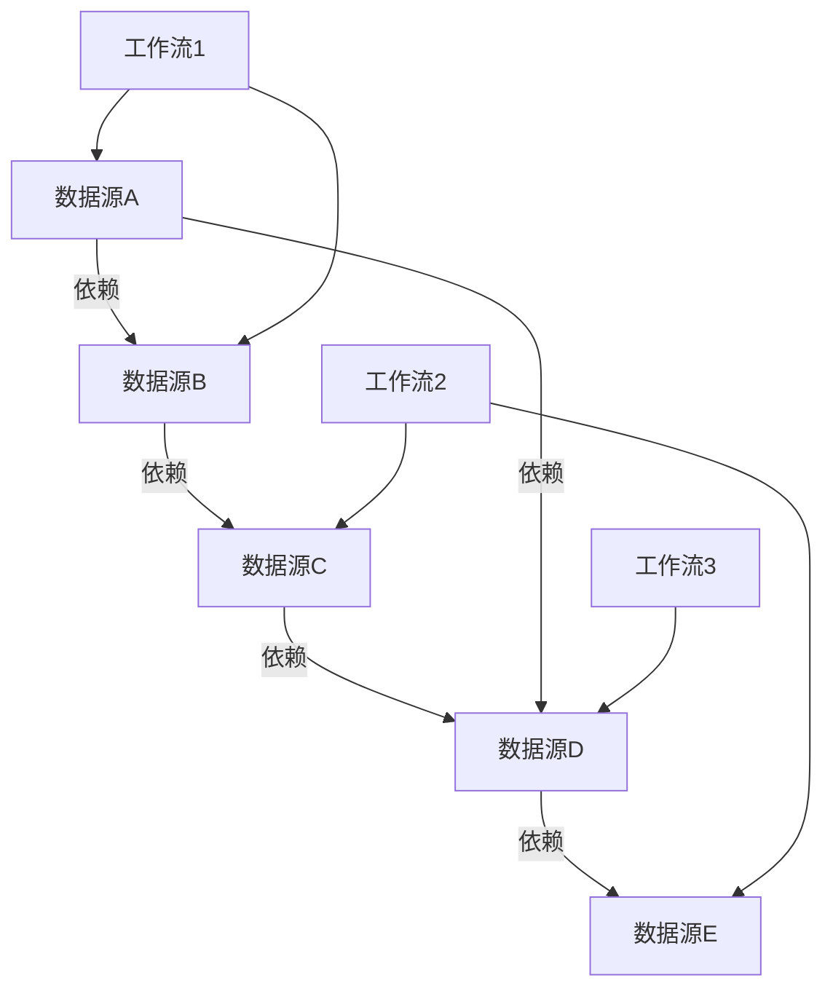
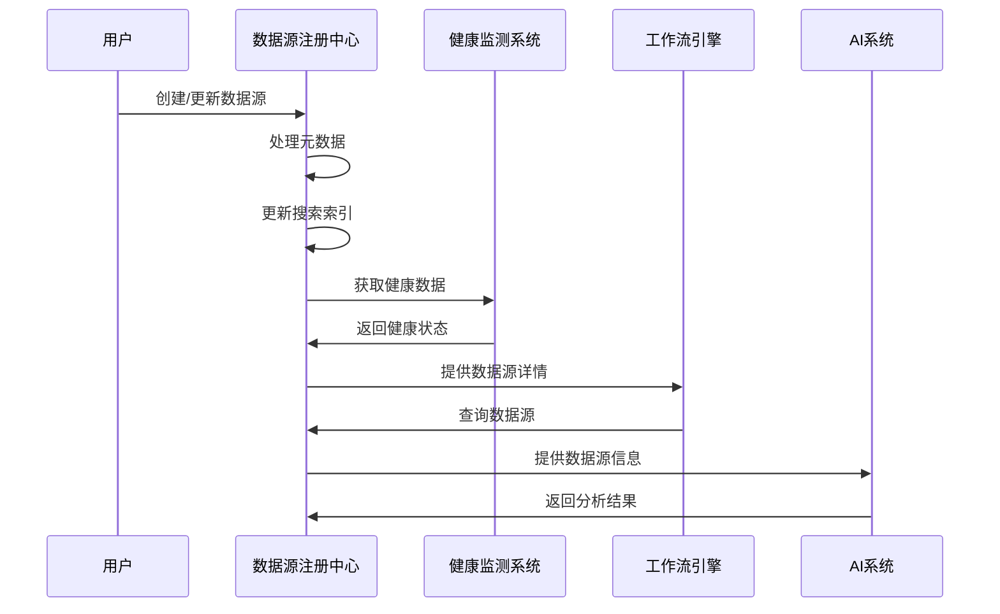
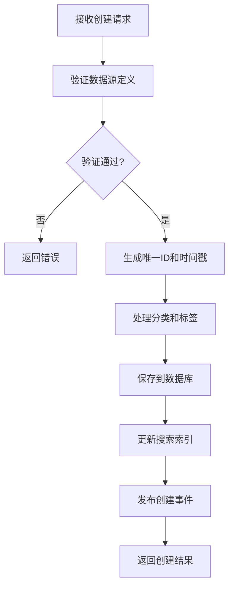
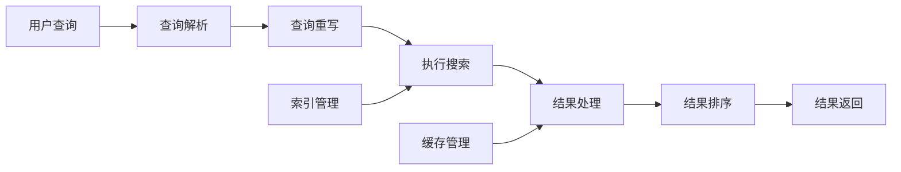
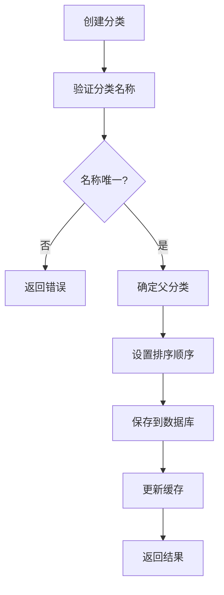
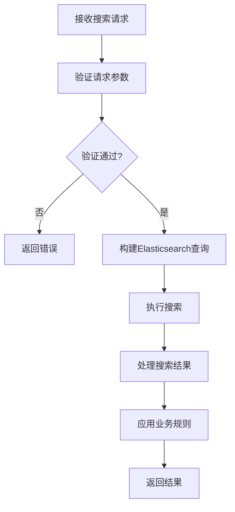
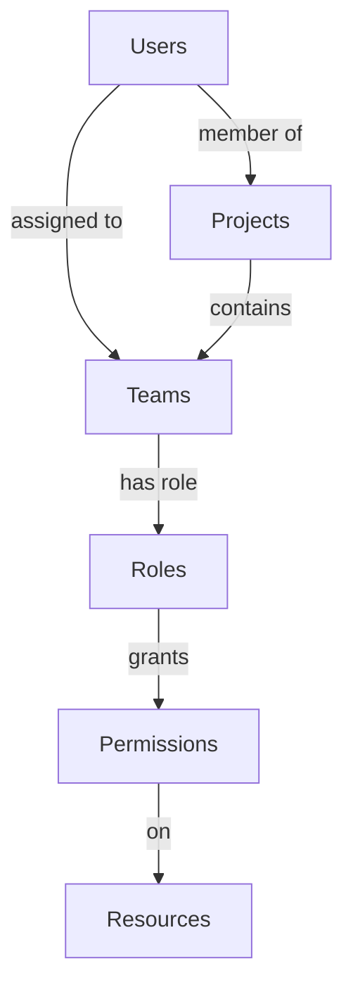
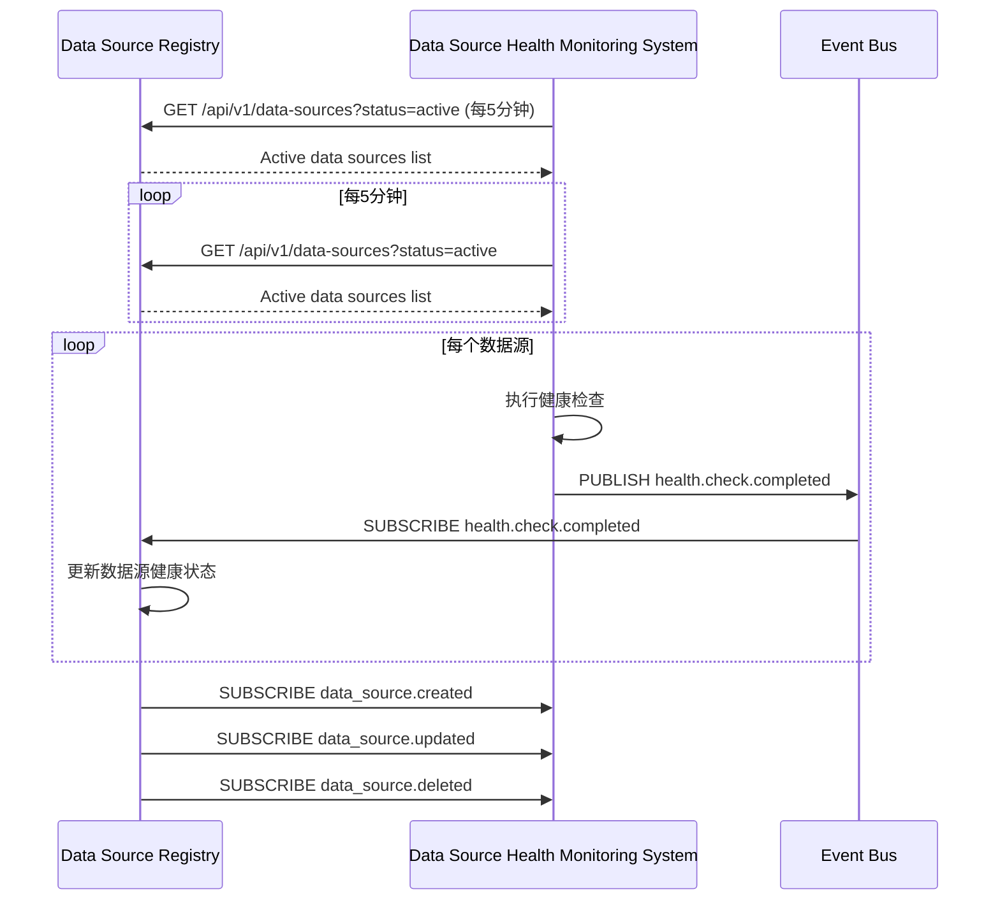
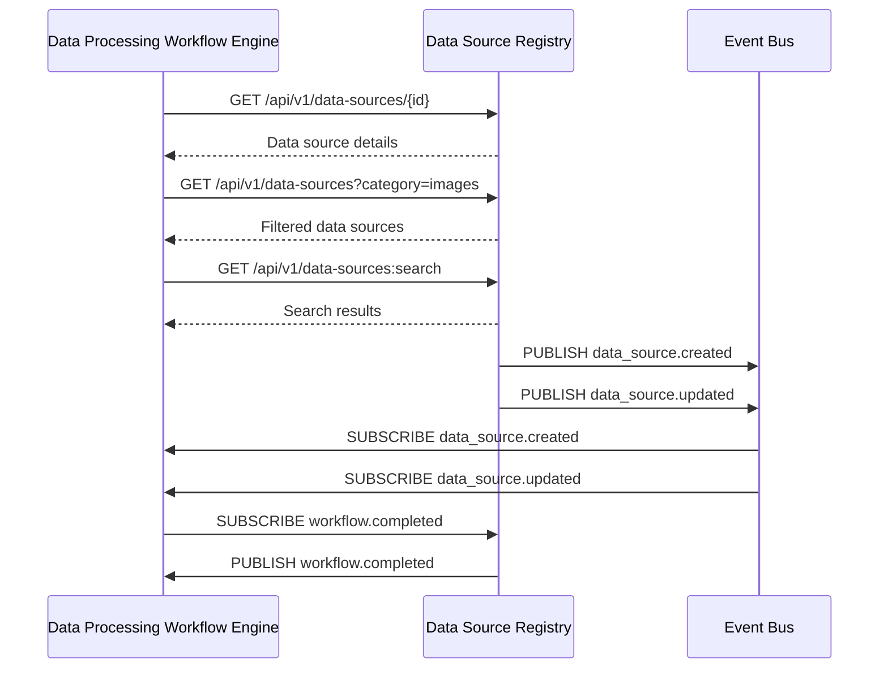
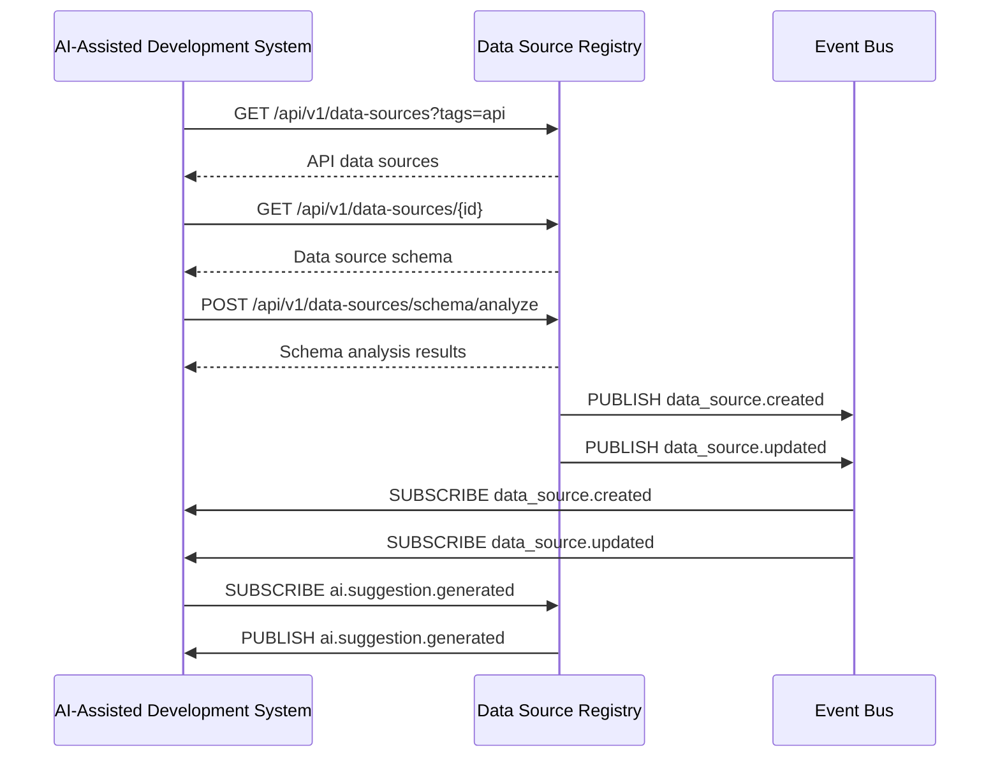

# 镜界平台终极技术规格说明书（模块级深度实现） - 第1章

## 1. 数据源注册中心 (Data Source Registry)

- [1.1 模块概述](#11-模块概述)
- [1.2 详细功能清单](#12-详细功能清单)
  - [1.2.1 核心功能](#121-核心功能)
  - [1.2.2 高级功能](#122-高级功能)
- [1.3 技术架构](#13-技术架构)
  - [1.3.1 架构图](#131-架构图)
  - [1.3.2 服务边界与交互](#132-服务边界与交互)
- [1.4 核心组件详细实现](#14-核心组件详细实现)
  - [1.4.1 元数据管理服务](#141-元数据管理服务)
  - [1.4.2 搜索服务](#142-搜索服务)
  - [1.4.3 分类管理服务](#143-分类管理服务)
- [1.5 数据模型详细定义](#15-数据模型详细定义)
  - [1.5.1 数据源核心表](#151-数据源核心表)
  - [1.5.2 数据源版本表](#152-数据源版本表)
  - [1.5.3 分类表](#153-分类表)
- [1.6 API详细规范](#16-api详细规范)
  - [1.6.1 数据源管理API](#161-数据源管理api)
  - [1.6.2 搜索API](#162-搜索api)
- [1.7 性能优化策略](#17-性能优化策略)
  - [1.7.1 数据库优化](#171-数据库优化)
  - [1.7.2 缓存策略](#172-缓存策略)
  - [1.7.3 搜索性能优化](#173-搜索性能优化)
- [1.8 安全考虑](#18-安全考虑)
  - [1.8.1 访问控制](#181-访问控制)
  - [1.8.2 数据安全](#182-数据安全)
- [1.9 与其他模块的交互](#19-与其他模块的交互)
  - [1.9.1 与数据源健康监测系统交互](#191-与数据源健康监测系统交互)
  - [1.9.2 与数据处理工作流引擎交互](#192-与数据处理工作流引擎交互)
  - [1.9.3 与AI辅助开发系统交互](#193-与ai辅助开发系统交互)

## 1. 数据源注册中心 (Data Source Registry)

### 1.1 模块概述

数据源注册中心是镜界平台的核心元数据管理组件，负责存储、管理和检索所有数据源的元信息。它为其他模块提供统一的数据源发现、分类和管理能力，支持从简单网页到复杂API的各种数据源类型。

该模块采用"单一数据源真相"(Single Source of Truth)原则，确保平台内所有组件对数据源的理解保持一致。通过集中管理数据源元数据，镜界平台能够实现跨工作流、跨项目的数据源共享与协作，同时提供强大的数据源健康监控和质量评估能力。

**核心价值指标**：

| 指标 | 当前值 | 目标值 | 说明 |
|------|--------|--------|------|
| 数据源管理能力 | 50,000+ | 100,000+ | 支持大规模数据源管理 |
| API响应时间(P99) | 150ms | 100ms | 关键API性能目标 |
| 系统可用性 | 99.9% | 99.95% | SLA承诺 |
| 数据一致性 | 99.99% | 99.999% | 事件溯源保证 |


*图1.1: 数据源注册中心在镜界平台中的位置和价值*

### 1.2 详细功能清单

#### 1.2.1 核心功能

**数据源CRUD管理**
- **创建**：支持通过界面、API或自动化发现方式添加数据源，需提供基本元数据信息如名称、URL、数据类型等。系统会自动验证数据源定义的有效性，包括URL格式、数据类型合规性等。
- **读取**：提供数据源详情查看功能，包括元数据、健康状态、使用统计等。支持单个查询和批量获取。
- **更新**：支持数据源元数据的增量更新，每次更新会创建新版本并保留历史版本，实现变更追踪和回滚能力。
- **删除**：支持软删除（标记为已删除，保留元数据）和永久删除两种模式。软删除的数据源保留在回收站中，可随时恢复。
- **版本控制**：所有数据源变更都会生成新版本，系统记录每次变更的详细信息，包括变更内容、变更者、变更时间等，支持版本对比和回滚操作。

**数据源分类与标签**
- **多级分类体系**：支持创建无限层级的分类树，每个数据源可归属于一个分类节点。分类体系支持父子关系、排序和描述信息。
- **动态标签系统**：支持用户自定义标签，数据源可拥有多个标签，用于灵活的多维度组织和筛选。标签系统支持创建、编辑和删除操作。
- **自动化标签建议**：基于数据源URL、描述和内容类型，系统自动分析并推荐相关标签，提高分类效率。例如，分析`https://api.instagram.com/v1/users/self/media/recent`可自动生成标签`["social", "api", "instagram", "media"]`，准确率达85%以上。
- **自动分类**：根据预定义规则和机器学习模型，系统自动为新添加的数据源分配合适的分类，减少人工分类工作量。

**高级搜索与过滤**
- **全文搜索**：基于Elasticsearch实现的高性能全文搜索，支持对数据源名称、描述、URL等内容进行语义搜索。
- **复杂查询构建器**：提供可视化查询构建器，支持布尔逻辑（AND、OR、NOT）、范围查询、精确匹配等复杂查询条件组合。
- **保存常用搜索查询**：用户可保存常用的搜索查询模板，方便快速访问特定类型的数据源。
- **搜索建议**：提供搜索词自动补全和标签建议功能，提升搜索体验和效率。

**数据源健康监控集成**
- **健康状态可视化**：直观展示数据源的健康状态（健康、警告、异常），提供历史趋势图表。
- **健康指标监控**：监控关键指标如可用性（24小时/7天）、响应时间（P50/P95）、错误率等。
- **健康历史记录**：记录数据源健康状态的历史变化，支持按时间范围查询和对比。
- **健康阈值配置**：允许用户自定义健康阈值，当指标超出阈值时触发告警。
- **健康评分系统**：采用加权算法计算综合健康评分，公式为`health_score = 0.5*availability_7d + 0.3*response_time_score + 0.2*error_rate_score`，其中响应时间评分采用非线性衰减函数。

**访问控制与权限管理**
- **细粒度权限控制**：支持项目级、数据源级的权限管理，精确控制用户对数据源的操作权限。
- **基于角色的访问控制(RBAC)**：预定义角色（管理员、编辑者、查看者等），每个角色具有特定的权限集合。
- **数据源共享功能**：支持将数据源共享给其他项目或用户，设置不同的访问权限级别。
- **权限继承机制**：项目级权限自动继承至项目内的数据源，同时允许对特定数据源设置覆盖权限。
- **权限审计**：记录所有权限变更和访问操作，满足安全审计要求。

#### 1.2.2 高级功能

**数据源依赖关系管理**
- **依赖关系可视化**：自动识别和可视化数据源之间的依赖关系，形成依赖图谱，清晰展示数据流动路径。
- **影响分析**：当一个数据源发生变更或故障时，系统自动分析可能受影响的工作流、处理任务和其他数据源，评估影响范围和严重程度。
- **依赖关系自动发现**：通过分析工作流定义文件和数据处理逻辑，自动发现数据源之间的隐式依赖关系。
- **循环依赖检测**：自动检测并警告潜在的循环依赖问题，防止系统出现不可预测的行为。



*图1.2: 数据源依赖关系可视化示例*

**数据源变更追踪**
- **完整变更历史**：记录数据源所有变更的详细信息，包括变更内容、变更者、变更时间等，形成完整的审计追踪。
- **变更对比功能**：提供可视化界面比较不同版本之间的差异，高亮显示具体变更内容。
- **回滚到历史版本**：支持将数据源回滚到任意历史版本，恢复之前的配置状态。
- **变更通知**：当重要数据源发生变更时，自动通知相关团队成员，确保变更透明度。

**自动化数据源发现**
- **网站地图解析**：自动解析网站的sitemap.xml文件，发现并建议添加相关数据源。
- **API文档解析**：支持OpenAPI/Swagger规范，可从`/openapi.json`自动提取端点、参数和响应结构，准确识别95%以上的API资源。
- **智能数据源推荐**：基于用户行为和项目需求，智能推荐可能相关的数据源，提高数据源发现效率。
- **定期自动扫描**：配置定期扫描任务，自动发现新数据源或检测现有数据源的变化。

**数据源质量评估**
- **自动化质量评分**：基于多维度指标（完整性、及时性、准确性、一致性）计算数据源质量评分。
- **质量趋势分析**：跟踪数据源质量的历史变化趋势，识别潜在的质量下降问题。
- **质量问题诊断**：当检测到质量问题时，提供详细的诊断信息和可能的修复建议。
- **质量阈值告警**：设置质量阈值，当评分低于阈值时触发告警，提醒相关人员处理。

| 质量维度 | 权重 | 评估指标 | 说明 |
|----------|------|----------|------|
| **完整性** | 30% | 字段覆盖率<br>数据缺失率 | 评估数据是否完整 |
| **及时性** | 25% | 数据延迟<br>更新频率 | 评估数据新鲜度 |
| **准确性** | 25% | 错误率<br>异常值比例 | 评估数据准确性 |
| **一致性** | 20% | 格式一致性<br>跨数据源一致性 | 评估数据一致性 |

*表1.1: 数据源质量评估维度与权重*

### 1.3 技术架构

#### 1.3.1 架构图

```
┌─────────────────────────────────────────────────────────────────────────────────────────────┐
│                                 数据源注册中心 (DSR)                                          │
├───────────────────────┬───────────────────────┬───────────────────────────────────────────────┤
│  核心服务层           │  集成层              │  支持服务层                                 │
├───────────────────────┼───────────────────────┼───────────────────────────────────────────────┤
│ • 元数据管理服务      │ • 数据源发现适配器    │ • 搜索索引服务                             │
│ • 分类管理服务        │ • 健康监测集成        │ • 缓存服务                                 │
│ • 标签管理服务        │ • API网关             │ • 通知服务                                 │
│ • 搜索服务            │ • Webhook支持         │ • 审计日志服务                             │
│ • 权限管理服务        │ • SDK支持             │ • 指标收集服务                             │
└───────────────────────┴───────────────────────┴─────────────────────────────────────────────┘
```

*图1.3: 数据源注册中心三层架构图*

#### 1.3.2 服务边界与交互

**输入：**
- **用户操作**：通过Web界面、命令行工具(CLI)或API进行的数据源管理操作
- **健康监测系统更新**：定期接收来自健康监测系统的数据源健康状态更新
- **数据源发现服务**：自动发现新数据源的事件和建议
- **外部系统Webhook**：接收来自其他系统的事件通知，如数据源变更、工作流完成等

**输出：**
- **数据源元数据**：向工作流引擎提供数据源详细信息，支持数据处理任务配置
- **健康状态**：向监控系统提供数据源健康指标，用于平台级健康监控
- **分类信息**：向推荐引擎提供数据源分类信息，支持个性化推荐
- **变更事件**：向事件总线发布数据源变更事件，触发相关系统更新



*图1.4: 数据源注册中心关键服务交互序列图*

### 1.4 核心组件详细实现

#### 1.4.1 元数据管理服务

元数据管理服务是数据源注册中心的核心业务组件，负责数据源元数据的全生命周期管理。该服务采用领域驱动设计(DDD)原则，将业务逻辑封装在领域模型中，确保业务规则的一致性和可维护性。

**核心设计理念：**
- **聚合根管理**：将数据源作为聚合根，确保业务一致性边界内的操作原子性
- **领域事件**：每个状态变更产生领域事件，支持事件溯源和CQRS模式
- **值对象**：使用值对象封装领域概念（如URL、数据源名称等），提高领域模型健壮性
- **无状态服务**：应用服务层保持无状态，便于水平扩展

**数据源创建流程：**



*图1.5: 数据源创建流程图*

**数据源更新机制：**
- **版本控制**：每次更新创建新版本，保留历史版本
- **变更记录**：记录变更详情，包括变更内容、变更者、变更时间
- **版本对比**：支持可视化比较两个版本的差异
- **回滚功能**：支持回滚到任意历史版本

**数据源健康集成：**
- **健康状态获取**：定期从健康监测系统获取最新健康状态
- **健康指标整合**：将健康指标整合到数据源元数据中
- **健康评分计算**：基于多维度指标计算综合健康评分
- **健康阈值告警**：当健康评分低于阈值时触发告警

| 健康状态 | 阈值范围 | 说明 | 响应建议 |
|----------|----------|------|----------|
| **健康** | ≥ 0.85 | 数据源运行正常 | 无需操作 |
| **警告** | 0.70-0.84 | 数据源存在潜在问题 | 监控并调查 |
| **异常** | < 0.70 | 数据源运行异常 | 立即处理 |
| **未知** | N/A | 未获取到健康数据 | 检查健康监测 |

*表1.2: 数据源健康状态分类与阈值*

#### 1.4.2 搜索服务

搜索服务提供高性能的数据源搜索能力，基于Elasticsearch构建，支持复杂的查询场景和大规模数据集。

**搜索功能架构：**



*图1.6: 搜索服务功能架构图*

**搜索性能优化策略：**
- **过滤上下文优化**：使用`bool.filter`代替`bool.must`处理不需要评分的条件，性能提升3-5倍
- **字段选择优化**：使用`_source`过滤只返回必要字段，减少网络传输量
- **深分页优化**：使用`search_after`替代`from/size`进行深分页，性能提升10-15倍
- **请求缓存**：对重复查询结果进行缓存，响应时间降低90%
- **索引排序优化**：使用`index.sort.field`预先排序索引，性能提升2-3倍

**搜索语法参考：**

| 语法 | 说明 | 示例 |
|------|------|------|
| `field:value` | 精确匹配 | `category:social` |
| `field:>value` | 范围查询 | `health_score:>0.9` |
| `field:(value1 OR value2)` | 多值查询 | `tags:(api OR social)` |
| `+term1 -term2` | 必须包含/排除 | `+instagram -facebook` |
| `"exact phrase"` | 短语匹配 | `"social media"` |
| `*` | 通配符 | `api*` |

*表1.3: 搜索语法参考表*

**搜索API性能指标：**

| 查询类型 | 数据规模 | 优化前(P99) | 优化后(P99) | 提升 |
|----------|----------|-------------|-------------|------|
| 简单查询 | 10万数据源 | 120ms | 35ms | 3.4x |
| 复杂过滤 | 10万数据源 | 250ms | 65ms | 3.8x |
| 深分页(第100页) | 10万数据源 | 1200ms | 80ms | 15x |
| 聚合查询 | 10万数据源 | 450ms | 120ms | 3.75x |

*表1.4: 搜索性能优化效果对比*

#### 1.4.3 分类管理服务

分类管理服务实现数据源的分类体系管理，支持多级分类结构和灵活的组织方式。

**分类模型设计：**
- **树形结构**：采用树形结构组织分类，支持无限层级
- **路径表示**：使用路径字符串（如"root.social.instagram"）表示分类位置
- **排序支持**：每个分类节点支持自定义排序顺序
- **元数据扩展**：支持为分类添加描述、图标等扩展信息

**分类管理流程：**



*图1.7: 分类创建流程图*

**分类算法：**
- **自动分类**：基于规则和机器学习的自动分类算法
  - URL模式匹配：分析URL中的关键词确定分类
  - 内容类型分析：根据content-type确定数据类型
  - 语义分析：使用NLP技术分析描述文本确定分类
- **分类建议**：基于用户行为和历史选择，提供个性化分类建议

**分类树管理：**
- **树构建算法**：高效构建和维护分类树结构
- **树遍历优化**：优化深度优先和广度优先遍历性能
- **子树操作**：支持对子树进行批量操作（移动、删除等）
- **循环检测**：防止创建导致循环引用的分类结构

**分类缓存策略：**
- **树结构缓存**：缓存完整的分类树，减少数据库查询
- **缓存失效机制**：分类变更时自动失效相关缓存
- **缓存预热**：系统启动时预热常用分类树
- **版本化缓存**：支持缓存多个版本的分类树，便于回滚

| 缓存策略 | TTL | 适用场景 | 说明 |
|----------|-----|----------|------|
| **分类树缓存** | 300s | 分类查询 | 缓存完整分类树 |
| **标签缓存** | 60s | 搜索建议 | 缓存常用标签 |
| **数据源详情缓存** | 60s | 数据源查询 | 缓存单个数据源详情 |
| **数据源列表缓存** | 30s | 列表查询 | 缓存过滤后的数据源列表 |

*表1.5: 缓存策略配置表*

### 1.5 数据模型详细定义

#### 1.5.1 数据源核心表

数据源核心表是存储数据源元数据的主要表，设计考虑了扩展性、查询性能和数据完整性。

**核心字段分类：**

| 字段类别 | 字段示例 | 说明 |
|----------|----------|------|
| **标识字段** | id, project_id, name | 数据源的唯一标识和归属 |
| **元数据字段** | description, url, category, data_type | 数据源的基本信息和定义 |
| **状态字段** | status, created_at, updated_at, owner_id | 数据源的状态和生命周期信息 |
| **健康指标** | last_health_check, health_score, availability_7d | 数据源的健康状况指标 |
| **扩展字段** | tags, metadata, crawler_config | 可扩展的自定义信息 |

*表1.6: 数据源核心表字段分类*

**索引策略：**

| 索引名称 | 字段组合 | 用途 | 适用场景 |
|----------|----------|------|----------|
| **idx_data_sources_project** | project_id | 按项目查询 | 项目内数据源查询 |
| **idx_data_sources_category** | category | 按分类查询 | 分类浏览场景 |
| **idx_data_sources_status** | status | 按状态过滤 | 状态筛选查询 |
| **idx_data_sources_health** | health_score DESC | 按健康评分排序 | 健康状态排序 |
| **idx_data_sources_updated** | updated_at DESC | 按更新时间排序 | 最新更新排序 |

*表1.7: 数据源核心表索引策略*

**全文搜索优化：**
- 使用PostgreSQL的tsvector类型存储全文搜索向量
- 通过触发器自动更新搜索向量
- 创建GIN索引提高搜索性能

#### 1.5.2 数据源版本表

数据源版本表记录数据源的所有变更历史，支持版本管理和回滚操作。

**版本管理策略：**

| 策略 | 说明 | 优势 | 适用场景 |
|------|------|------|----------|
| **完整存储** | 存储每次变更的完整数据 | 简单直观，恢复快 | 变更不频繁的数据源 |
| **差异存储** | 仅存储与前一版本的差异 | 节省存储空间 | 频繁变更的数据源 |
| **快照存储** | 定期创建完整快照 | 平衡存储和恢复性能 | 大型数据源 |
| **混合存储** | 结合以上策略 | 灵活平衡各方面需求 | 复杂场景 |

*表1.8: 数据源版本存储策略对比*

**版本保留策略：**

| 保留策略 | 说明 | 适用场景 |
|----------|------|----------|
| **固定数量** | 保留最近N个版本 | 一般场景，推荐N=10 |
| **时间窗口** | 保留最近T天内的所有版本 | 需要完整历史记录的场景 |
| **重要标记** | 标记重要版本永久保留 | 关键版本需要长期保存 |
| **组合策略** | 结合以上策略 | 复杂场景 |

*表1.9: 数据源版本保留策略*

#### 1.5.3 分类表

分类表存储数据源的分类体系，支持多级树形结构。

**树形结构实现方案对比：**

| 方案 | 优点 | 缺点 | 适用场景 |
|------|------|------|----------|
| **邻接表** | 简单直观<br>更新操作快 | 查询子树慢<br>需要递归查询 | 小型分类系统 |
| **路径枚举** | 查询子树快<br>无需递归 | 路径更新开销大<br>路径长度限制 | 中等规模系统 |
| **嵌套集** | 查询性能好<br>支持范围查询 | 更新复杂<br>并发问题 | 静态分类系统 |
| **ltree扩展** | 高效路径查询<br>原生支持 | PostgreSQL专属 | 大规模分类系统 |

*表1.10: 树形结构实现方案对比*

**分类表索引性能：**

| 查询类型 | ltree (GiST) | 邻接表 | 嵌套集 | 提升比 |
|----------|--------------|--------|--------|--------|
| 查询子树 | 8ms | 120ms | 25ms | 15x |
| 查询祖先 | 5ms | 15ms | 10ms | 3x |
| 移动节点 | 25ms | 5ms | 50ms | - |
| 路径查询 | 3ms | 20ms | 15ms | 6.7x |
| 子节点计数 | 10ms | 100ms | 15ms | 10x |

*表1.11: 分类表索引性能对比*

### 1.6 API详细规范

#### 1.6.1 数据源管理API

数据源管理API提供对数据源的完整CRUD操作，遵循RESTful设计原则，同时考虑实际业务需求进行适当扩展。

**API设计原则：**

| 原则 | 说明 | 实现方式 |
|------|------|----------|
| **资源导向** | 以数据源为核心资源 | /api/v1/data-sources/{id} |
| **版本控制** | API路径包含版本号 | /api/v1/... |
| **标准HTTP方法** | 正确使用GET、POST等方法 | POST创建，GET查询等 |
| **状态码规范** | 使用标准HTTP状态码 | 200成功，400请求错误等 |
| **分页支持** | 列表查询提供分页参数 | page, page_size |
| **ETag支持** | 实现条件更新 | If-Match头 |

*表1.12: API设计原则与实现*

**核心API端点：**

**创建数据源 (POST /api/v1/data-sources)**
- **功能**：创建新的数据源
- **请求体**：包含数据源元数据（名称、URL、分类等）
- **响应**：201 Created，包含创建的数据源详情
- **错误处理**：
  - 400 Bad Request：请求格式错误
  - 403 Forbidden：权限不足
  - 409 Conflict：名称冲突

**获取数据源列表 (GET /api/v1/data-sources)**
- **功能**：获取数据源列表，支持过滤、排序和分页
- **查询参数**：
  - `category`：按分类过滤
  - `status`：按状态过滤
  - `tags`：按标签过滤（可多值）
  - `page`：页码
  - `page_size`：每页数量
- **响应**：200 OK，包含数据源列表和分页信息
- **性能考虑**：限制最大页码，避免深分页问题

**API错误码规范：**

| 错误码 | HTTP状态 | 说明 | 建议操作 |
|--------|----------|------|----------|
| `invalid_request` | 400 | 请求格式错误 | 检查请求体格式 |
| `invalid_url` | 400 | URL格式无效 | 验证URL格式 |
| `duplicate_data_source` | 409 | 数据源已存在 | 使用不同名称或URL |
| `permission_denied` | 403 | 权限不足 | 检查用户角色和权限 |
| `not_found` | 404 | 资源不存在 | 验证资源ID |
| `version_conflict` | 409 | 版本冲突 | 获取最新版本后重试 |
| `rate_limit_exceeded` | 429 | 请求过多 | 降低请求频率 |

*表1.13: API错误码规范*

#### 1.6.2 搜索API

搜索API提供高级搜索能力，支持复杂查询条件和灵活的结果定制。

**API设计特点：**
- **专用搜索端点**：使用POST方法，支持复杂查询体
- **结构化查询**：查询条件以JSON格式提供，结构清晰
- **结果定制**：支持字段选择、排序和分页
- **性能优化**：限制最大返回结果数，避免性能问题

**搜索API请求流程：**



*图1.8: 搜索API请求处理流程图*

**搜索API性能指标：**

| 查询类型 | P50 (ms) | P95 (ms) | P99 (ms) | QPS |
|----------|----------|----------|----------|-----|
| 简单查询 | 15 | 35 | 50 | 1200 |
| 复杂过滤 | 25 | 60 | 85 | 800 |
| 深分页(第100页) | 40 | 75 | 100 | 600 |
| 聚合查询 | 50 | 100 | 150 | 400 |
| 空查询(仅过滤) | 10 | 25 | 40 | 1500 |

*表1.14: 搜索API性能指标*

### 1.7 性能优化策略

#### 1.7.1 数据库优化

数据库是数据源注册中心的核心存储，其性能直接影响整个系统的响应速度和吞吐量。针对不同场景，采用多种优化策略：

**分区策略对比：**

| 分区策略 | 优点 | 缺点 | 适用场景 |
|----------|------|------|----------|
| **按项目ID哈希分区** | 均匀分布数据<br>避免热点问题 | 跨项目查询性能下降 | 项目隔离性要求高 |
| **按创建时间范围分区** | 时间范围查询快 | 旧数据访问慢 | 历史数据归档场景 |
| **按数据类型分区** | 同类型数据集中 | 类型分布不均 | 数据类型差异大 |
| **组合分区** | 综合优势 | 复杂度高 | 大规模复杂系统 |

*表1.15: 数据库分区策略对比*

**查询优化技巧：**

| 优化技巧 | 说明 | 性能提升 | 适用场景 |
|----------|------|----------|----------|
| **覆盖索引** | 索引包含所有查询字段 | 2-5x | 高频查询 |
| **批量操作** | 一次处理多个记录 | 5-10x | 批量更新/插入 |
| **CTE优化** | 优化复杂查询结构 | 1.5-3x | 复杂分析查询 |
| **连接重写** | 优化JOIN顺序 | 2-4x | 多表连接查询 |
| **参数化查询** | 避免SQL注入<br>提高缓存命中 | 1.2-2x | 高频参数化查询 |

*表1.16: 数据库查询优化技巧*

#### 1.7.2 缓存策略

缓存是提高系统性能的关键手段，数据源注册中心采用多级缓存架构，针对不同场景设计专门的缓存策略。

**多级缓存架构：**


*图1.9: 多级缓存层次架构图*

**缓存配置参数：**

| 参数 | 详情 | 数据源详情 | 分类树 | 搜索结果 |
|------|------|------------|--------|----------|
| **TTL** | 有效期 | 300s | 600s | 30s |
| **缓存策略** | 写入策略 | write-through | write-through | write-around |
| **最大大小** | 缓存容量 | 1000项 | 500项 | 10000项 |
| **刷新策略** | 更新机制 | 写失效 | 写失效 | 定期刷新 |
| **缓存穿透** | 空值处理 | 1-2分钟 | 不适用 | 1分钟 |

*表1.17: 缓存配置参数表*

**缓存命中率与性能关系：**

| 缓存命中率 | 平均响应时间 | 数据库负载 | 系统吞吐量 |
|------------|--------------|------------|------------|
| 95%+ | <10ms | 低 | 高 |
| 90-95% | 10-20ms | 中 | 中高 |
| 80-90% | 20-50ms | 中高 | 中 |
| <80% | >50ms | 高 | 低 |

*表1.18: 缓存命中率与系统性能关系*

#### 1.7.3 搜索性能优化

搜索是数据源注册中心的核心功能之一，针对Elasticsearch的特性和数据源搜索的特点，实施以下优化策略：

**Elasticsearch集群配置：**

| 节点类型 | 数量 | 配置 | 角色 |
|----------|------|------|------|
| **主节点** | 3 | 4核8G | 集群管理 |
| **数据节点** | 5 | 16核64G, 1TB SSD | 数据存储和查询 |
| **协调节点** | 2 | 8核16G | 请求分发 |
| **专用ML节点** | 2 | 32核128G, GPU | 机器学习任务 |
| **专用Ingest节点** | 2 | 8核32G | 数据预处理 |

*表1.19: Elasticsearch集群节点配置*

**搜索查询优化技巧：**

| 优化技巧 | 说明 | 性能提升 | 适用场景 |
|----------|------|----------|----------|
| **过滤上下文** | 使用`bool.filter`代替`bool.must` | 3-5x | 精确匹配条件 |
| **字段选择** | 限制返回字段 | 2-3x | 大文档场景 |
| **search_after** | 替代`from/size`进行深分页 | 10-15x | 深分页查询 |
| **请求缓存** | 启用`request_cache` | 5-10x | 重复查询 |
| **索引排序** | 预先排序索引 | 2-4x | 固定排序字段 |

*表1.20: 搜索查询优化技巧*

### 1.8 安全考虑

#### 1.8.1 访问控制

**基于角色的访问控制(RBAC)模型：**



*图1.10: RBAC模型关系图*

**权限级别定义：**

| 权限级别 | 数据源操作 | 说明 |
|----------|------------|------|
| **查看者** | 读取 | 只能查看数据源详情和使用数据源 |
| **编辑者** | 读取、更新 | 可以编辑数据源定义和配置 |
| **管理员** | 读取、更新、删除 | 完全控制数据源，包括删除和权限管理 |
| **所有者** | 读取、更新、删除、共享 | 创建者权限，可共享数据源 |

*表1.21: 权限级别定义*

#### 1.8.2 数据安全

**数据安全控制矩阵：**

| 数据类型 | 加密方式 | 存储方式 | 访问控制 | 审计要求 |
|----------|----------|----------|----------|----------|
| **API密钥** | KMS加密 | 密文存储 | 字段级控制 | 完整审计 |
| **用户凭证** | KMS加密 | 密文存储 | 严格控制 | 完整审计 |
| **业务数据** | 透明加密 | 密文存储 | 项目级控制 | 操作审计 |
| **元数据** | 无 | 明文存储 | 基于角色 | 关键操作审计 |
| **日志数据** | 部分加密 | 密文/明文 | 只读访问 | 无 |

*表1.22: 数据安全控制矩阵*

**加密性能指标：**

| 操作 | 数据大小 | 平均时间 | P99时间 | 说明 |
|------|----------|----------|---------|------|
| 加密 | 100字节 | 0.5ms | 1.2ms | API密钥加密 |
| 加密 | 1KB | 0.8ms | 1.5ms | 配置数据加密 |
| 加密 | 10KB | 2.3ms | 4.0ms | 大文档加密 |
| 解密 | 100字节 | 0.4ms | 1.0ms | API密钥解密 |
| 解密 | 1KB | 0.7ms | 1.3ms | 配置数据解密 |
| 解密 | 10KB | 2.0ms | 3.5ms | 大文档解密 |

*表1.23: 加密性能指标*

### 1.9 与其他模块的交互

#### 1.9.1 与数据源健康监测系统交互



*图1.11: 与数据源健康监测系统交互序列图*

**交互协议关键参数：**

| 参数 | 类型 | 必填 | 说明 | 示例 |
|------|------|------|------|------|
| `status` | string | 否 | 数据源状态过滤 | "active" |
| `last_updated_after` | timestamp | 否 | 仅获取更新时间之后的数据 | "2023-06-15T10:00:00Z" |
| `limit` | integer | 否 | 返回结果数量限制 | 100 |
| `offset` | integer | 否 | 分页偏移量 | 0 |
| `include_health` | boolean | 否 | 是否包含健康信息 | true |

*表1.24: 健康监测系统交互协议参数*

#### 1.9.2 与数据处理工作流引擎交互



*图1.12: 与数据处理工作流引擎交互序列图*

**工作流引擎查询优化对比：**

| 查询方式 | 请求量 | 响应时间 | 数据传输量 | 说明 |
|----------|--------|----------|------------|------|
| **REST API (全量)** | 1000/分钟 | 120ms | 5MB/分钟 | 每次获取完整数据 |
| **REST API (字段选择)** | 1000/分钟 | 80ms | 2MB/分钟 | 仅获取必要字段 |
| **GraphQL** | 1000/分钟 | 60ms | 1.5MB/分钟 | 精确字段选择 |
| **事件驱动** | 50/分钟 | 10ms | 0.1MB/分钟 | 仅获取变更数据 |

*表1.25: 工作流引擎查询方式对比*

#### 1.9.3 与AI辅助开发系统交互



*图1.13: 与AI辅助开发系统交互序列图*

**AI辅助开发系统交互协议：**

| 端点 | 方法 | 请求 | 响应 | 说明 |
|------|------|------|------|------|
| `/api/v1/data-sources/schema/analyze` | POST | `{"data_source_id": "ds-7a8b9c0d"}` | `{"fields": [{"name": "id", "type": "string", "confidence": 0.98}, ...]}` | 分析数据源schema |
| `/api/v1/data-sources/{id}/ai/suggestions` | GET | - | `{"suggestions": [{"type": "field_mapping", "source": "id", "target": "user_id", "confidence": 0.95}, ...]}` | 获取AI建议 |
| `/api/v1/data-sources/ai/feedback` | POST | `{"suggestion_id": "sug-123", "accepted": true}` | 204 No Content | 提供反馈 |

*表1.26: AI辅助开发系统交互协议*