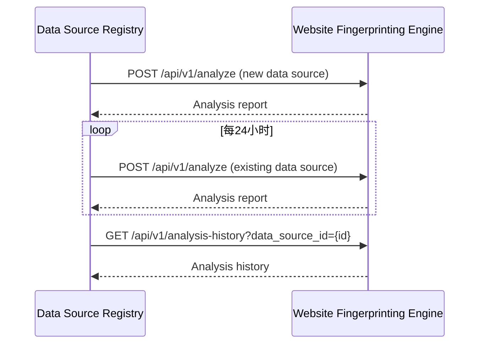
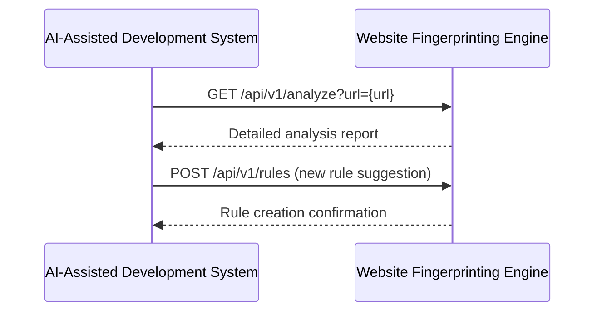
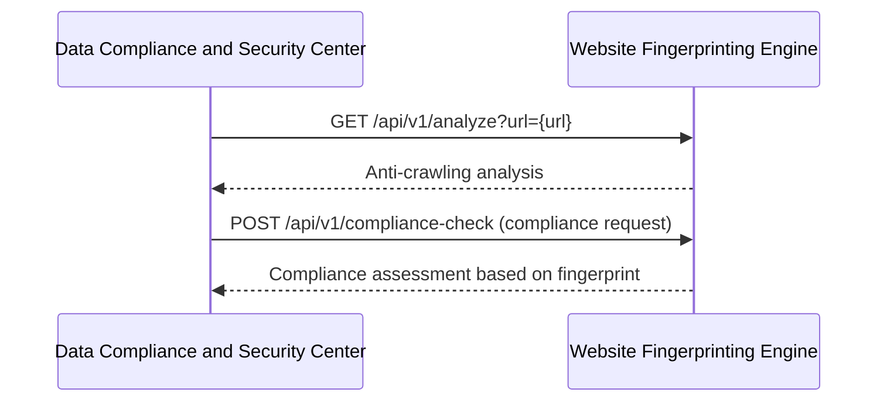

# 镜界平台终极技术规格说明书（模块级深度实现）

### 2. 网站指纹分析引擎 (Website Fingerprinting Engine)
- [镜界平台终极技术规格说明书（模块级深度实现）](#镜界平台终极技术规格说明书模块级深度实现)
    - [2. 网站指纹分析引擎 (Website Fingerprinting Engine)](#2-网站指纹分析引擎-website-fingerprinting-engine)
  - [2. 网站指纹分析引擎 (Website Fingerprinting Engine)](#2-网站指纹分析引擎-website-fingerprinting-engine-1)
    - [2.1 模块概述](#21-模块概述)
    - [2.2 详细功能清单](#22-详细功能清单)
      - [2.2.1 核心功能](#221-核心功能)
      - [2.2.2 高级功能](#222-高级功能)
    - [2.3 技术架构](#23-技术架构)
      - [2.3.1 架构图](#231-架构图)
      - [2.3.2 服务边界与交互](#232-服务边界与交互)
    - [2.4 核心组件详细实现](#24-核心组件详细实现)
      - [2.4.1 技术栈识别服务](#241-技术栈识别服务)
      - [2.4.2 反爬机制检测服务](#242-反爬机制检测服务)
      - [2.4.3 规则引擎服务](#243-规则引擎服务)
    - [2.5 数据模型详细定义](#25-数据模型详细定义)
      - [2.5.1 指纹规则表](#251-指纹规则表)
      - [2.5.2 分析结果表](#252-分析结果表)
    - [2.6 API详细规范](#26-api详细规范)
      - [2.6.1 网站分析API](#261-网站分析api)
    - [2.7 性能优化策略](#27-性能优化策略)
      - [2.7.1 分析性能优化](#271-分析性能优化)
      - [2.7.2 规则匹配优化](#272-规则匹配优化)
    - [2.8 安全考虑](#28-安全考虑)
      - [2.8.1 分析安全](#281-分析安全)
      - [2.8.2 数据安全](#282-数据安全)
    - [2.9 与其他模块的交互](#29-与其他模块的交互)
      - [2.9.1 与数据源注册中心交互](#291-与数据源注册中心交互)
      - [2.9.2 与AI辅助开发系统交互](#292-与ai辅助开发系统交互)
      - [2.9.3 与数据合规与安全中心交互](#293-与数据合规与安全中心交互)


## 2. 网站指纹分析引擎 (Website Fingerprinting Engine)

### 2.1 模块概述
网站指纹分析引擎负责分析目标网站的技术栈、反爬机制和内容特征，为爬虫配置提供智能建议。它通过主动探测和被动分析相结合的方式，构建全面的网站指纹数据库。

### 2.2 详细功能清单

#### 2.2.1 核心功能
- **技术栈识别**
  - 服务器软件识别（Apache, Nginx, IIS等）
  - 编程语言识别（PHP, Ruby, Python, Node.js等）
  - 前端框架识别（React, Angular, Vue等）
  - CMS识别（WordPress, Drupal, Joomla等）
  - 数据库识别
  - CDN识别
- **反爬机制检测**
  - User-Agent检测
  - IP限制检测
  - 请求频率限制
  - 行为验证（鼠标移动、点击模式）
  - 挑战响应机制（JS挑战、CAPTCHA）
  - 指纹检测（Canvas, WebGL, AudioContext等）
- **内容特征分析**
  - 页面结构分析（DOM树复杂度）
  - 动态内容检测（AJAX加载内容）
  - 内容编码分析
  - 响应时间分析
- **指纹数据库管理**
  - 指纹规则存储与管理
  - 指纹版本控制
  - 指纹质量评估

#### 2.2.2 高级功能
- **智能爬虫配置建议**
  - 基于指纹的爬虫参数推荐
  - 反爬绕过策略建议
  - 最佳爬取时间建议
- **网站变更监测**
  - 技术栈变更检测
  - 反爬机制更新预警
  - 内容结构变更分析
- **指纹学习系统**
  - 自动学习新的网站特征
  - 指纹规则优化
  - 误报/漏报分析

### 2.3 技术架构

#### 2.3.1 架构图
```
┌───────────────────────────────────────────────────────────────────────────────────────────────┐
│                              网站指纹分析引擎 (WFE)                                           │
├───────────────────────┬───────────────────────┬───────────────────────────────────────────────┤
│  分析执行层           │  规则引擎层           │  数据管理层                                 │
├───────────────────────┼───────────────────────┼───────────────────────────────────────────────┤
│ • 主动探测服务        │ • 规则加载器          │ • 指纹数据库                               │
│ • 被动分析服务        │ • 规则执行器          │ • 规则版本控制                             │
│ • 指纹生成服务        │ • 规则优化器          │ • 分析结果存储                             │
│ • 变更监测服务        │ • 机器学习模型        │ • 性能指标存储                             │
└───────────────────────┴───────────────────────┴───────────────────────────────────────────────┘
```

#### 2.3.2 服务边界与交互
- **输入**：
  - 目标URL列表（来自数据源注册中心）
  - 手动触发的分析请求
  - 网站变更监测事件
- **输出**：
  - 技术栈分析报告
  - 反爬机制检测结果
  - 智能爬虫配置建议
  - 网站变更预警

### 2.4 核心组件详细实现

#### 2.4.1 技术栈识别服务

**技术实现：**
```python
class TechStackAnalyzer:
    """网站技术栈识别服务"""
    
    def __init__(
        self,
        rule_engine: RuleEngine,
        http_client: HttpClient,
        config: Config
    ):
        self.rule_engine = rule_engine
        self.http_client = http_client
        self.config = config
        self.logger = logging.getLogger(__name__)
    
    def analyze(
        self,
        url: str,
        options: Optional[AnalysisOptions] = None
    ) -> TechStackReport:
        """
        分析网站技术栈
        
        :param url: 目标URL
        :param options: 分析选项
        :return: 技术栈分析报告
        """
        # 1. 准备分析选项
        opts = options or AnalysisOptions()
        
        # 2. 获取页面内容
        response = self._fetch_page(url, opts)
        
        # 3. 执行技术栈分析
        tech_stack = self._analyze_tech_stack(url, response, opts)
        
        # 4. 生成报告
        return self._generate_report(url, response, tech_stack, opts)
    
    def _fetch_page(
        self,
        url: str,
        options: AnalysisOptions
    ) -> HttpResponse:
        """获取页面内容"""
        # 准备请求头
        headers = {
            "User-Agent": options.user_agent or self.config.default_user_agent,
            "Accept": "text/html,application/xhtml+xml,application/xml;q=0.9,*/*;q=0.8",
            "Accept-Language": "en-US,en;q=0.5",
            "Connection": "keep-alive"
        }
        
        # 添加自定义请求头
        if options.headers:
            headers.update(options.headers)
        
        # 执行HTTP请求
        try:
            start_time = time.time()
            response = self.http_client.get(
                url,
                headers=headers,
                timeout=options.timeout or self.config.default_timeout,
                follow_redirects=options.follow_redirects
            )
            duration = time.time() - start_time
            
            return HttpResponse(
                url=response.url,
                status_code=response.status_code,
                headers=dict(response.headers),
                content=response.content,
                duration=duration,
                redirect_chain=[r.url for r in response.redirects]
            )
            
        except Exception as e:
            self.logger.error("Error fetching %s: %s", url, str(e))
            raise AnalysisError(f"Failed to fetch page: {str(e)}")
    
    def _analyze_tech_stack(
        self,
        url: str,
        response: HttpResponse,
        options: AnalysisOptions
    ) -> Dict[str, List[Technology]]:
        """分析技术栈"""
        results = {
            "server": [],
            "framework": [],
            "cms": [],
            "javascript": [],
            "database": [],
            "cdn": [],
            "os": []
        }
        
        # 1. 从响应头分析
        self._analyze_from_headers(response, results)
        
        # 2. 从HTML内容分析
        if response.content:
            self._analyze_from_html(response.content, results)
        
        # 3. 从URL结构分析
        self._analyze_from_url(url, results)
        
        # 4. 从JavaScript文件分析
        if options.analyze_js and response.content:
            self._analyze_from_js(response.content, results)
        
        # 5. 执行高级分析（如果启用）
        if options.advanced_analysis:
            self._perform_advanced_analysis(url, response, results)
        
        return results
    
    def _analyze_from_headers(
        self,
        response: HttpResponse,
        results: Dict[str, List[Technology]]
    ):
        """从HTTP响应头分析技术栈"""
        headers = {k.lower(): v for k, v in response.headers.items()}
        
        # 服务器软件
        if "server" in headers:
            server_header = headers["server"]
            server_match = self.rule_engine.match(
                "server", 
                server_header, 
                RuleCategory.HEADER
            )
            if server_match:
                results["server"].extend(server_match.technologies)
        
        # X-Powered-By
        if "x-powered-by" in headers:
            powered_by = headers["x-powered-by"]
            powered_by_match = self.rule_engine.match(
                "powered-by", 
                powered_by, 
                RuleCategory.HEADER
            )
            if powered_by_match:
                results["server"].extend(powered_by_match.technologies)
        
        # Set-Cookie分析
        if "set-cookie" in headers:
            cookies = headers["set-cookie"]
            cookie_match = self.rule_engine.match(
                "cookies", 
                cookies, 
                RuleCategory.HEADER
            )
            if cookie_match:
                results["server"].extend(cookie_match.technologies)
    
    def _analyze_from_html(
        self,
        content: bytes,
        results: Dict[str, List[Technology]]
    ):
        """从HTML内容分析技术栈"""
        try:
            # 解析HTML
            soup = BeautifulSoup(content, 'html.parser')
            
            # Meta标签分析
            self._analyze_meta_tags(soup, results)
            
            # 脚本标签分析
            self._analyze_script_tags(soup, results)
            
            # 链接标签分析
            self._analyze_link_tags(soup, results)
            
            # HTML属性分析
            self._analyze_html_attributes(soup, results)
            
        except Exception as e:
            self.logger.warning("Error parsing HTML: %s", str(e))
    
    def _analyze_meta_tags(
        self,
        soup: BeautifulSoup,
        results: Dict[str, List[Technology]]
    ):
        """分析meta标签"""
        for meta in soup.find_all('meta'):
            name = meta.get('name', '').lower()
            content = meta.get('content', '')
            
            if not content:
                continue
            
            # Generator meta标签
            if name == 'generator':
                generator_match = self.rule_engine.match(
                    "generator", 
                    content, 
                    RuleCategory.META
                )
                if generator_match:
                    results["cms"].extend(generator_match.technologies)
            
            # 特定CMS meta标签
            elif "wordpress" in name or "wp" in name:
                results["cms"].append(Technology(
                    name="WordPress",
                    version=self._extract_version(content),
                    confidence=0.9,
                    category="cms"
                ))
    
    def _analyze_script_tags(
        self,
        soup: BeautifulSoup,
        results: Dict[str, List[Technology]]
    ):
        """分析script标签"""
        for script in soup.find_all('script', src=True):
            src = script['src']
            
            # 分析脚本路径
            script_match = self.rule_engine.match(
                "scripts", 
                src, 
                RuleCategory.SCRIPT
            )
            if script_match:
                results["javascript"].extend(script_match.technologies)
        
        # 分析内联脚本
        inline_scripts = [s.string for s in soup.find_all('script') if s.string]
        if inline_scripts:
            inline_match = self.rule_engine.match(
                "inline-scripts", 
                "\n".join(inline_scripts), 
                RuleCategory.INLINE_SCRIPT
            )
            if inline_match:
                results["javascript"].extend(inline_match.technologies)
    
    def _analyze_link_tags(
        self,
        soup: BeautifulSoup,
        results: Dict[str, List[Technology]]
    ):
        """分析link标签"""
        for link in soup.find_all('link', href=True):
            href = link['href']
            
            # 分析CSS路径
            css_match = self.rule_engine.match(
                "css", 
                href, 
                RuleCategory.CSS
            )
            if css_match:
                results["framework"].extend(css_match.technologies)
    
    def _analyze_html_attributes(
        self,
        soup: BeautifulSoup,
        results: Dict[str, List[Technology]]
    ):
        """分析HTML属性"""
        # 检查data-*属性
        for tag in soup.find_all(True):
            for attr, value in tag.attrs.items():
                if attr.startswith('data-'):
                    data_attr_match = self.rule_engine.match(
                        "data-attributes", 
                        f"{attr}={value}", 
                        RuleCategory.ATTRIBUTE
                    )
                    if data_attr_match:
                        results["framework"].extend(data_attr_match.technologies)
        
        # 检查class属性
        classes = set()
        for tag in soup.find_all(class_=True):
            if isinstance(tag['class'], list):
                classes.update(tag['class'])
            else:
                classes.update(tag['class'].split())
        
        if classes:
            class_match = self.rule_engine.match(
                "classes", 
                " ".join(classes), 
                RuleCategory.CLASS
            )
            if class_match:
                results["framework"].extend(class_match.technologies)
    
    def _analyze_from_url(
        self,
        url: str,
        results: Dict[str, List[Technology]]
    ):
        """从URL结构分析技术栈"""
        # 分析路径
        path_match = self.rule_engine.match(
            "paths", 
            urlparse(url).path, 
            RuleCategory.PATH
        )
        if path_match:
            results["server"].extend(path_match.technologies)
        
        # 分析查询参数
        query_match = self.rule_engine.match(
            "query-params", 
            urlparse(url).query, 
            RuleCategory.QUERY
        )
        if query_match:
            results["server"].extend(query_match.technologies)
    
    def _analyze_from_js(
        self,
        content: bytes,
        results: Dict[str, List[Technology]]
    ):
        """从JavaScript文件分析技术栈"""
        try:
            # 提取所有JS文件
            soup = BeautifulSoup(content, 'html.parser')
            js_files = [script['src'] for script in soup.find_all('script', src=True)]
            
            # 下载并分析JS文件
            for js_url in js_files:
                try:
                    js_response = self.http_client.get(
                        js_url,
                        timeout=self.config.js_analysis_timeout
                    )
                    
                    # 分析JS内容
                    js_match = self.rule_engine.match(
                        "javascript", 
                        js_response.text, 
                        RuleCategory.JAVASCRIPT
                    )
                    if js_match:
                        results["javascript"].extend(js_match.technologies)
                        
                except Exception as e:
                    self.logger.debug("Error analyzing JS file %s: %s", js_url, str(e))
                    
        except Exception as e:
            self.logger.warning("Error extracting JS files: %s", str(e))
    
    def _perform_advanced_analysis(
        self,
        url: str,
        response: HttpResponse,
        results: Dict[str, List[Technology]]
    ):
        """执行高级分析"""
        # 1. 分析HTTP方法支持
        self._analyze_http_methods(url, results)
        
        # 2. 分析API端点
        self._analyze_api_endpoints(url, response, results)
        
        # 3. 分析资源加载模式
        self._analyze_resource_loading(url, response, results)
    
    def _analyze_http_methods(
        self,
        url: str,
        results: Dict[str, List[Technology]]
    ):
        """分析HTTP方法支持"""
        methods = ["OPTIONS", "GET", "HEAD", "POST", "PUT", "DELETE", "PATCH"]
        supported_methods = []
        
        for method in methods:
            try:
                response = self.http_client.request(
                    method,
                    url,
                    timeout=self.config.advanced_analysis_timeout
                )
                if response.status_code not in [405, 501]:
                    supported_methods.append(method)
            except:
                pass
        
        # 分析结果
        if "OPTIONS" in supported_methods:
            options_match = self.rule_engine.match(
                "http-methods", 
                ",".join(supported_methods), 
                RuleCategory.OPTIONS
            )
            if options_match:
                results["server"].extend(options_match.technologies)
    
    def _analyze_api_endpoints(
        self,
        url: str,
        response: HttpResponse,
        results: Dict[str, List[Technology]]
    ):
        """分析API端点"""
        # 检查常见API路径
        api_paths = [
            "/api/", "/v1/", "/v2/", "/graphql", "/rest/", 
            "/json/", "/odata/", "/services/"
        ]
        
        for path in api_paths:
            api_url = url.rstrip('/') + path
            try:
                api_response = self.http_client.get(
                    api_url,
                    timeout=self.config.advanced_analysis_timeout
                )
                if api_response.status_code == 200:
                    # 检查响应内容类型
                    content_type = api_response.headers.get('Content-Type', '').lower()
                    
                    if 'json' in content_type:
                        results["server"].append(Technology(
                            name="REST API",
                            version="",
                            confidence=0.8,
                            category="server"
                        ))
                    elif 'graphql' in content_type:
                        results["server"].append(Technology(
                            name="GraphQL",
                            version="",
                            confidence=0.8,
                            category="server"
                        ))
            except:
                pass
    
    def _analyze_resource_loading(
        self,
        url: str,
        response: HttpResponse,
        results: Dict[str, List[Technology]]
    ):
        """分析资源加载模式"""
        # 检查是否使用懒加载
        if "loading" in response.content.decode('utf-8', errors='ignore'):
            lazy_load_match = self.rule_engine.match(
                "lazy-loading", 
                response.content.decode('utf-8', errors='ignore'), 
                RuleCategory.RESOURCE_LOADING
            )
            if lazy_load_match:
                results["framework"].extend(lazy_load_match.technologies)
    
    def _generate_report(
        self,
        url: str,
        response: HttpResponse,
        tech_stack: Dict[str, List[Technology]],
        options: AnalysisOptions
    ) -> TechStackReport:
        """生成技术栈分析报告"""
        # 合并技术栈结果
        all_technologies = []
        for category, technologies in tech_stack.items():
            all_technologies.extend(technologies)
        
        # 去重并排序
        unique_technologies = self._deduplicate_technologies(all_technologies)
        sorted_technologies = sorted(
            unique_technologies, 
            key=lambda t: t.confidence, 
            reverse=True
        )
        
        # 生成详细报告
        return TechStackReport(
            url=url,
            status_code=response.status_code,
            response_time=response.duration,
            technologies=sorted_technologies,
            detected_categories=list(set(t.category for t in sorted_technologies)),
            confidence=self._calculate_overall_confidence(sorted_technologies),
            timestamp=datetime.utcnow()
        )
    
    def _deduplicate_technologies(
        self, 
        technologies: List[Technology]
    ) -> List[Technology]:
        """去重技术栈结果"""
        seen = {}
        result = []
        
        for tech in technologies:
            key = f"{tech.name.lower()}:{tech.category}"
            
            if key not in seen or tech.confidence > seen[key].confidence:
                seen[key] = tech
        
        return list(seen.values())
    
    def _calculate_overall_confidence(
        self, 
        technologies: List[Technology]
    ) -> float:
        """计算整体置信度"""
        if not technologies:
            return 0.0
        
        # 加权平均置信度
        total_weight = 0
        weighted_sum = 0
        
        for tech in technologies:
            # 根据技术类别分配权重
            weight = 1.0
            if tech.category == "server":
                weight = 1.2
            elif tech.category == "framework":
                weight = 1.1
            
            weighted_sum += tech.confidence * weight
            total_weight += weight
        
        return min(1.0, weighted_sum / total_weight)
    
    def _extract_version(self, text: str) -> str:
        """从文本中提取版本号"""
        version_patterns = [
            r'version\s*[:=]?\s*v?(\d+\.\d+(?:\.\d+)?)',
            r'v(\d+\.\d+(?:\.\d+)?)',
            r'(\d+\.\d+(?:\.\d+)?)\s+release'
        ]
        
        for pattern in version_patterns:
            match = re.search(pattern, text, re.IGNORECASE)
            if match:
                return match.group(1)
        
        return ""
```

#### 2.4.2 反爬机制检测服务

**技术实现：**
```python
class AntiCrawlingDetector:
    """反爬机制检测服务"""
    
    def __init__(
        self,
        http_client: HttpClient,
        rule_engine: RuleEngine,
        config: Config
    ):
        self.http_client = http_client
        self.rule_engine = rule_engine
        self.config = config
        self.logger = logging.getLogger(__name__)
    
    def detect(
        self,
        url: str,
        options: Optional[AnalysisOptions] = None
    ) -> AntiCrawlingReport:
        """
        检测网站的反爬机制
        
        :param url: 目标URL
        :param options: 分析选项
        :return: 反爬机制检测报告
        """
        # 1. 准备分析选项
        opts = options or AnalysisOptions()
        
        # 2. 执行基础检测
        basic_detection = self._basic_detection(url, opts)
        
        # 3. 执行深度检测（如果启用）
        advanced_detection = {}
        if opts.advanced_analysis:
            advanced_detection = self._advanced_detection(url, opts)
        
        # 4. 合并结果
        all_detections = {**basic_detection, **advanced_detection}
        
        # 5. 生成报告
        return self._generate_report(url, all_detections, opts)
    
    def _basic_detection(
        self,
        url: str,
        options: AnalysisOptions
    ) -> Dict[str, DetectionResult]:
        """基础反爬机制检测"""
        results = {}
        
        # 1. 获取正常响应
        normal_response = self._fetch_page(url, options)
        
        # 2. 检测User-Agent过滤
        ua_detection = self._detect_user_agent_filtering(url, options)
        if ua_detection.confidence > 0:
            results["user_agent"] = ua_detection
        
        # 3. 检测IP限制
        ip_detection = self._detect_ip_limiting(url, options)
        if ip_detection.confidence > 0:
            results["ip_limiting"] = ip_detection
        
        # 4. 检测请求频率限制
        rate_limit_detection = self._detect_rate_limiting(url, options)
        if rate_limit_detection.confidence > 0:
            results["rate_limiting"] = rate_limit_detection
        
        # 5. 检测Cookie要求
        cookie_detection = self._detect_cookie_requirement(url, options, normal_response)
        if cookie_detection.confidence > 0:
            results["cookie_requirement"] = cookie_detection
        
        return results
    
    def _fetch_page(
        self,
        url: str,
        options: AnalysisOptions
    ) -> HttpResponse:
        """获取页面内容（与TechStackAnalyzer共用）"""
        # 与技术栈分析相同的实现
        pass
    
    def _detect_user_agent_filtering(
        self,
        url: str,
        options: AnalysisOptions
    ) -> DetectionResult:
        """检测User-Agent过滤"""
        # 测试标准User-Agent
        normal_response = self._fetch_page(url, options)
        
        # 测试爬虫User-Agent
        crawler_options = copy.copy(options)
        crawler_options.user_agent = self.config.crawler_user_agent
        crawler_response = self._fetch_page(url, crawler_options)
        
        # 比较响应
        if normal_response.status_code != crawler_response.status_code:
            return DetectionResult(
                name="User-Agent Filtering",
                description="Website blocks requests with crawler User-Agent",
                confidence=0.9,
                evidence={
                    "normal_status": normal_response.status_code,
                    "crawler_status": crawler_response.status_code
                },
                severity="high",
                bypass_suggestions=[
                    "Use random User-Agent rotation",
                    "Use browser-like User-Agent"
                ]
            )
        
        # 检查响应内容差异
        normal_hash = self._hash_content(normal_response.content)
        crawler_hash = self._hash_content(crawler_response.content)
        
        if normal_hash != crawler_hash:
            return DetectionResult(
                name="User-Agent Filtering",
                description="Website serves different content based on User-Agent",
                confidence=0.8,
                evidence={
                    "normal_hash": normal_hash,
                    "crawler_hash": crawler_hash
                },
                severity="medium",
                bypass_suggestions=[
                    "Use realistic User-Agent strings",
                    "Rotate User-Agents frequently"
                ]
            )
        
        return DetectionResult(
            name="User-Agent Filtering",
            confidence=0.0
        )
    
    def _hash_content(self, content: bytes) -> str:
        """计算内容哈希"""
        return hashlib.md5(content).hexdigest() if content else ""
    
    def _detect_ip_limiting(
        self,
        url: str,
        options: AnalysisOptions
    ) -> DetectionResult:
        """检测IP限制"""
        # 使用不同IP（通过代理）发送请求
        ip_results = []
        
        for proxy in self.config.test_proxies[:3]:  # 测试前3个代理
            try:
                proxy_options = copy.copy(options)
                proxy_options.proxy = proxy
                response = self._fetch_page(url, proxy_options)
                ip_results.append((proxy, response.status_code, response.headers))
            except Exception as e:
                self.logger.debug("Proxy %s failed: %s", proxy, str(e))
        
        # 分析结果
        if len(ip_results) < 2:
            return DetectionResult(
                name="IP Limiting",
                confidence=0.0
            )
        
        # 检查状态码差异
        status_codes = [res[1] for res in ip_results]
        if len(set(status_codes)) > 1:
            return DetectionResult(
                name="IP Limiting",
                description="Different responses from different IPs suggest IP-based filtering",
                confidence=0.85,
                evidence={
                    "status_codes": status_codes,
                    "proxies": [res[0] for res in ip_results]
                },
                severity="high",
                bypass_suggestions=[
                    "Use proxy rotation",
                    "Use residential proxies",
                    "Limit request rate per IP"
                ]
            )
        
        # 检查响应内容差异
        content_hashes = [self._hash_content(self._fetch_page(url, options).content) for _ in range(3)]
        if len(set(content_hashes)) > 1:
            return DetectionResult(
                name="IP Limiting",
                description="Inconsistent responses suggest IP-based filtering",
                confidence=0.75,
                evidence={
                    "content_hashes": content_hashes
                },
                severity="medium",
                bypass_suggestions=[
                    "Use proxy rotation",
                    "Increase delay between requests"
                ]
            )
        
        return DetectionResult(
            name="IP Limiting",
            confidence=0.0
        )
    
    def _detect_rate_limiting(
        self,
        url: str,
        options: AnalysisOptions
    ) -> DetectionResult:
        """检测请求频率限制"""
        # 快速发送多个请求
        timestamps = []
        status_codes = []
        
        for _ in range(10):
            start = time.time()
            try:
                response = self._fetch_page(url, options)
                timestamps.append(time.time() - start)
                status_codes.append(response.status_code)
            except:
                timestamps.append(None)
                status_codes.append(500)
            time.sleep(0.1)  # 100ms间隔
        
        # 分析响应时间
        valid_timestamps = [t for t in timestamps if t is not None]
        if valid_timestamps:
            avg_time = sum(valid_timestamps) / len(valid_timestamps)
            if max(valid_timestamps) > avg_time * 3:
                # 检测到响应时间显著增加
                slow_index = valid_timestamps.index(max(valid_timestamps))
                return DetectionResult(
                    name="Rate Limiting",
                    description="Response time increased significantly after multiple requests",
                    confidence=0.8,
                    evidence={
                        "request_times": timestamps,
                        "slow_request_index": slow_index
                    },
                    severity="medium",
                    bypass_suggestions=[
                        f"Limit request rate to less than {slow_index} requests per second",
                        "Implement exponential backoff for retries"
                    ]
                )
        
        # 分析状态码
        if 429 in status_codes or 403 in status_codes:
            error_index = status_codes.index(429) if 429 in status_codes else status_codes.index(403)
            return DetectionResult(
                name="Rate Limiting",
                description=f"Received {status_codes[error_index]} status code after {error_index} requests",
                confidence=0.9,
                evidence={
                    "status_codes": status_codes,
                    "error_index": error_index
                },
                severity="high",
                bypass_suggestions=[
                    f"Limit request rate to less than {error_index} requests per second",
                    "Implement retry with backoff"
                ]
            )
        
        return DetectionResult(
            name="Rate Limiting",
            confidence=0.0
        )
    
    def _detect_cookie_requirement(
        self,
        url: str,
        options: AnalysisOptions,
        normal_response: HttpResponse
    ) -> DetectionResult:
        """检测Cookie要求"""
        # 检查Set-Cookie头
        if "set-cookie" in normal_response.headers:
            cookies = normal_response.headers["set-cookie"]
            if cookies:
                return DetectionResult(
                    name="Cookie Requirement",
                    description="Website sets cookies on first request",
                    confidence=0.7,
                    evidence={
                        "cookies": cookies
                    },
                    severity="medium",
                    bypass_suggestions=[
                        "Enable cookie handling in crawler",
                        "Store and send cookies with subsequent requests"
                    ]
                )
        
        # 检查响应中的cookie相关脚本
        if normal_response.content:
            content = normal_response.content.decode('utf-8', errors='ignore')
            if "cookie" in content.lower():
                return DetectionResult(
                    name="Cookie Requirement",
                    description="Website references cookies in JavaScript",
                    confidence=0.6,
                    evidence={
                        "cookie_references": self._find_cookie_references(content)
                    },
                    severity="low",
                    bypass_suggestions=[
                        "Enable cookie handling in crawler"
                    ]
                )
        
        return DetectionResult(
            name="Cookie Requirement",
            confidence=0.0
        )
    
    def _find_cookie_references(self, content: str) -> List[str]:
        """查找内容中的cookie引用"""
        patterns = [
            r'cookie',
            r'document\.cookie',
            r'getCookie',
            r'setCookie'
        ]
        
        references = []
        for pattern in patterns:
            matches = re.findall(pattern, content, re.IGNORECASE)
            if matches:
                references.extend(matches[:3])  # 只取前3个匹配
        
        return references
    
    def _advanced_detection(
        self,
        url: str,
        options: AnalysisOptions
    ) -> Dict[str, DetectionResult]:
        """高级反爬机制检测"""
        results = {}
        
        # 1. 检测JavaScript挑战
        js_challenge_detection = self._detect_js_challenge(url, options)
        if js_challenge_detection.confidence > 0:
            results["js_challenge"] = js_challenge_detection
        
        # 2. 检测行为验证
        behavior_detection = self._detect_behavior_verification(url, options)
        if behavior_detection.confidence > 0:
            results["behavior_verification"] = behavior_detection
        
        # 3. 检测指纹检测
        fingerprint_detection = self._detect_fingerprint_detection(url, options)
        if fingerprint_detection.confidence > 0:
            results["fingerprint_detection"] = fingerprint_detection
        
        # 4. 检测CAPTCHA
        captcha_detection = self._detect_captcha(url, options)
        if captcha_detection.confidence > 0:
            results["captcha"] = captcha_detection
        
        return results
    
    def _detect_js_challenge(
        self,
        url: str,
        options: AnalysisOptions
    ) -> DetectionResult:
        """检测JavaScript挑战"""
        # 获取正常响应
        normal_response = self._fetch_page(url, options)
        
        # 获取禁用JS的响应
        no_js_options = copy.copy(options)
        no_js_options.headers = {"Accept": "text/plain"}
        no_js_response = self._fetch_page(url, no_js_options)
        
        # 比较响应
        normal_hash = self._hash_content(normal_response.content)
        no_js_hash = self._hash_content(no_js_response.content)
        
        if normal_hash != no_js_hash:
            return DetectionResult(
                name="JavaScript Challenge",
                description="Website serves different content when JavaScript is disabled",
                confidence=0.85,
                evidence={
                    "normal_hash": normal_hash,
                    "no_js_hash": no_js_hash
                },
                severity="high",
                bypass_suggestions=[
                    "Use headless browser for rendering",
                    "Solve JavaScript challenges programmatically"
                ]
            )
        
        # 检查是否存在JS挑战脚本
        if normal_response.content:
            content = normal_response.content.decode('utf-8', errors='ignore')
            challenge_patterns = [
                r'function\s+challenge\s*\(',
                r'function\s+solve\s*\(',
                r'window\.__cf_chl_jschl_t',
                r'cf-challenge'
            ]
            
            for pattern in challenge_patterns:
                if re.search(pattern, content, re.IGNORECASE):
                    return DetectionResult(
                        name="JavaScript Challenge",
                        description="JavaScript challenge detected in page content",
                        confidence=0.9,
                        evidence={
                            "challenge_pattern": pattern
                        },
                        severity="high",
                        bypass_suggestions=[
                            "Use headless browser for rendering",
                            "Implement challenge solving logic"
                        ]
                    )
        
        return DetectionResult(
            name="JavaScript Challenge",
            confidence=0.0
        )
    
    def _detect_behavior_verification(
        self,
        url: str,
        options: AnalysisOptions
    ) -> DetectionResult:
        """检测行为验证"""
        # 获取初始页面
        initial_response = self._fetch_page(url, options)
        
        # 检查是否存在行为跟踪脚本
        if initial_response.content:
            content = initial_response.content.decode('utf-8', errors='ignore')
            behavior_patterns = [
                r'mousemove',
                r'click',
                r'keypress',
                r'behavior tracking',
                r'human interaction'
            ]
            
            for pattern in behavior_patterns:
                if re.search(pattern, content, re.IGNORECASE):
                    return DetectionResult(
                        name="Behavior Verification",
                        description="Behavior tracking scripts detected",
                        confidence=0.75,
                        evidence={
                            "pattern": pattern
                        },
                        severity="medium",
                        bypass_suggestions=[
                            "Simulate human-like mouse movements",
                            "Implement random delays between actions",
                            "Mimic typical user interaction patterns"
                        ]
                    )
        
        # 检查是否存在鼠标移动事件监听
        if initial_response.content:
            content = initial_response.content.decode('utf-8', errors='ignore')
            if re.search(r'addEventListener\(["\']mousemove', content, re.IGNORECASE):
                return DetectionResult(
                    name="Behavior Verification",
                    description="Mouse move event listener detected",
                    confidence=0.7,
                    evidence={
                        "event_listener": "mousemove"
                    },
                    severity="medium",
                    bypass_suggestions=[
                        "Simulate realistic mouse movements",
                        "Implement mouse trajectory algorithms"
                    ]
                )
        
        return DetectionResult(
            name="Behavior Verification",
            confidence=0.0
        )
    
    def _detect_fingerprint_detection(
        self,
        url: str,
        options: AnalysisOptions
    ) -> DetectionResult:
        """检测指纹检测"""
        # 获取页面内容
        response = self._fetch_page(url, options)
        
        if not response.content:
            return DetectionResult(
                name="Fingerprint Detection",
                confidence=0.0
            )
        
        content = response.content.decode('utf-8', errors='ignore')
        
        # 检查Canvas指纹检测
        if re.search(r'CanvasRenderingContext2D', content) or \
           re.search(r'toDataURL', content) or \
           re.search(r'getImageData', content):
            return DetectionResult(
                name="Fingerprint Detection",
                description="Canvas fingerprinting detected",
                confidence=0.8,
                evidence={
                    "technique": "canvas"
                },
                severity="high",
                bypass_suggestions=[
                    "Use canvas noise injection",
                    "Override Canvas API methods",
                    "Use headless browser with fingerprint protection"
                ]
            )
        
        # 检查WebGL指纹检测
        if re.search(r'WebGLRenderingContext', content) or \
           re.search(r'getParameter', content):
            return DetectionResult(
                name="Fingerprint Detection",
                description="WebGL fingerprinting detected",
                confidence=0.75,
                evidence={
                    "technique": "webgl"
                },
                severity="high",
                bypass_suggestions=[
                    "Override WebGL API methods",
                    "Use consistent WebGL rendering"
                ]
            )
        
        # 检查AudioContext指纹检测
        if re.search(r'AudioContext', content) or \
           re.search(r'createOscillator', content):
            return DetectionResult(
                name="Fingerprint Detection",
                description="AudioContext fingerprinting detected",
                confidence=0.7,
                evidence={
                    "technique": "audio"
                },
                severity="medium",
                bypass_suggestions=[
                    "Override AudioContext API",
                    "Use consistent audio rendering"
                ]
            )
        
        return DetectionResult(
            name="Fingerprint Detection",
            confidence=0.0
        )
    
    def _detect_captcha(
        self,
        url: str,
        options: AnalysisOptions
    ) -> DetectionResult:
        """检测CAPTCHA"""
        # 获取页面内容
        response = self._fetch_page(url, options)
        
        if not response.content:
            return DetectionResult(
                name="CAPTCHA",
                confidence=0.0
            )
        
        content = response.content.decode('utf-8', errors='ignore').lower()
        
        # 检查常见CAPTCHA服务
        captcha_patterns = [
            ("recaptcha", "Google reCAPTCHA detected"),
            ("hcaptcha", "hCaptcha detected"),
            ("turnstile", "Cloudflare Turnstile detected"),
            ("solvemedia", "Solve Media CAPTCHA detected"),
            ("captcha", "Generic CAPTCHA detected")
        ]
        
        for pattern, description in captcha_patterns:
            if pattern in content:
                return DetectionResult(
                    name="CAPTCHA",
                    description=description,
                    confidence=0.9 if pattern != "captcha" else 0.7,
                    evidence={
                        "pattern": pattern
                    },
                    severity="critical",
                    bypass_suggestions=[
                        "Use CAPTCHA solving service",
                        "Implement automated CAPTCHA solving"
                    ]
                )
        
        return DetectionResult(
            name="CAPTCHA",
            confidence=0.0
        )
    
    def _generate_report(
        self,
        url: str,
        detections: Dict[str, DetectionResult],
        options: AnalysisOptions
    ) -> AntiCrawlingReport:
        """生成反爬机制检测报告"""
        # 过滤低置信度检测
        significant_detections = [
            detection for detection in detections.values()
            if detection.confidence > 0.5
        ]
        
        # 计算整体风险级别
        risk_level = self._calculate_risk_level(significant_detections)
        
        # 生成绕过建议
        bypass_suggestions = self._generate_bypass_suggestions(significant_detections)
        
        return AntiCrawlingReport(
            url=url,
            detections=significant_detections,
            risk_level=risk_level,
            bypass_suggestions=bypass_suggestions,
            timestamp=datetime.utcnow()
        )
    
    def _calculate_risk_level(
        self,
        detections: List[DetectionResult]
    ) -> str:
        """计算整体风险级别"""
        if not detections:
            return "low"
        
        # 检查是否存在高风险检测
        high_risk = any(d.severity == "critical" for d in detections)
        if high_risk:
            return "critical"
        
        medium_risk = any(d.severity == "high" for d in detections)
        if medium_risk:
            return "high"
        
        return "medium"
    
    def _generate_bypass_suggestions(
        self,
        detections: List[DetectionResult]
    ) -> List[str]:
        """生成绕过建议"""
        suggestions = set()
        
        for detection in detections:
            if detection.bypass_suggestions:
                suggestions.update(detection.bypass_suggestions)
        
        return list(suggestions)
```

#### 2.4.3 规则引擎服务

**技术实现：**
```python
class RuleEngine:
    """规则引擎，用于匹配网站特征"""
    
    def __init__(
        self,
        rule_repository: RuleRepository,
        ml_model: Optional[MLModel] = None
    ):
        self.rule_repository = rule_repository
        self.ml_model = ml_model
        self.logger = logging.getLogger(__name__)
        self.cache = TTLCache(maxsize=10000, ttl=300)  # 5分钟缓存
    
    def match(
        self,
        rule_set: str,
        content: str,
        category: RuleCategory
    ) -> RuleMatch:
        """
        匹配内容与规则
        
        :param rule_set: 规则集名称
        :param content: 要匹配的内容
        :param category: 规则类别
        :return: 规则匹配结果
        """
        # 1. 检查缓存
        cache_key = f"{rule_set}:{category.value}:{content[:100]}"
        if cache_key in self.cache:
            return self.cache[cache_key]
        
        # 2. 获取规则
        rules = self.rule_repository.get_rules(rule_set, category)
        
        # 3. 执行匹配
        match_result = self._execute_match(rules, content, category)
        
        # 4. 缓存结果
        self.cache[cache_key] = match_result
        
        return match_result
    
    def _execute_match(
        self,
        rules: List[Rule],
        content: str,
        category: RuleCategory
    ) -> RuleMatch:
        """执行规则匹配"""
        matched_technologies = []
        matched_rules = []
        
        # 1. 执行基于规则的匹配
        for rule in rules:
            if self._rule_matches(rule, content):
                matched_rules.append(rule)
                matched_technologies.extend(rule.technologies)
        
        # 2. 如果有ML模型且匹配结果不足，使用ML模型
        if self.ml_model and len(matched_technologies) < 2:
            ml_match = self.ml_model.predict(content, category)
            if ml_match:
                matched_technologies.extend(ml_match.technologies)
                # 标记为ML匹配
                for tech in ml_match.technologies:
                    tech.source = "ml"
        
        # 3. 去重并计算置信度
        unique_technologies = self._deduplicate_technologies(matched_technologies)
        
        return RuleMatch(
            rules=matched_rules,
            technologies=unique_technologies,
            confidence=self._calculate_confidence(unique_technologies)
        )
    
    def _rule_matches(self, rule: Rule, content: str) -> bool:
        """检查规则是否匹配内容"""
        if rule.pattern_type == PatternType.REGEX:
            return bool(re.search(rule.pattern, content, re.IGNORECASE))
        
        elif rule.pattern_type == PatternType.GLOB:
            # 简单实现glob匹配
            regex = glob2regex(rule.pattern)
            return bool(re.match(regex, content, re.IGNORECASE))
        
        elif rule.pattern_type == PatternType.STRING:
            return rule.pattern.lower() in content.lower()
        
        return False
    
    def _deduplicate_technologies(
        self, 
        technologies: List[Technology]
    ) -> List[Technology]:
        """去重技术结果"""
        seen = {}
        result = []
        
        for tech in technologies:
            key = f"{tech.name.lower()}:{tech.category}"
            
            if key not in seen or tech.confidence > seen[key].confidence:
                seen[key] = tech
        
        return list(seen.values())
    
    def _calculate_confidence(
        self, 
        technologies: List[Technology]
    ) -> float:
        """计算整体置信度"""
        if not technologies:
            return 0.0
        
        # 加权平均置信度
        total_weight = 0
        weighted_sum = 0
        
        for tech in technologies:
            # 根据技术类别分配权重
            weight = 1.0
            if tech.category == "server":
                weight = 1.2
            elif tech.category == "framework":
                weight = 1.1
            
            weighted_sum += tech.confidence * weight
            total_weight += weight
        
        return min(1.0, weighted_sum / total_weight)
    
    def update_rules(
        self,
        rule_set: str,
        category: RuleCategory,
        new_rules: List[Rule]
    ):
        """更新规则"""
        self.rule_repository.update_rules(rule_set, category, new_rules)
        # 清除相关缓存
        self._clear_cache()
    
    def _clear_cache(self):
        """清除缓存"""
        self.cache.clear()

class RuleRepository:
    """规则存储库"""
    
    def __init__(self, db: Database):
        self.db = db
        self.logger = logging.getLogger(__name__)
    
    def get_rules(
        self,
        rule_set: str,
        category: RuleCategory
    ) -> List[Rule]:
        """获取规则"""
        sql = """
        SELECT * FROM fingerprint_rules 
        WHERE rule_set = %(rule_set)s 
        AND category = %(category)s
        ORDER BY priority DESC
        """
        
        rows = self.db.fetchall(sql, {
            "rule_set": rule_set,
            "category": category.value
        })
        
        return [self._row_to_rule(row) for row in rows]
    
    def _row_to_rule(self, row: Dict) -> Rule:
        """将数据库行转换为Rule对象"""
        return Rule(
            id=row["id"],
            rule_set=row["rule_set"],
            category=RuleCategory(row["category"]),
            pattern=row["pattern"],
            pattern_type=PatternType(row["pattern_type"]),
            technologies=self._decode_technologies(row["technologies"]),
            description=row["description"],
            priority=row["priority"],
            created_at=row["created_at"],
            updated_at=row["updated_at"]
        )
    
    def _decode_technologies(self, json_data: str) -> List[Technology]:
        """解码技术列表"""
        if not json_data:
            return []
        
        tech_data = json.loads(json_data)
        return [
            Technology(
                name=t["name"],
                version=t.get("version", ""),
                confidence=t.get("confidence", 0.8),
                category=t["category"],
                source="rule"
            ) for t in tech_data
        ]
    
    def update_rules(
        self,
        rule_set: str,
        category: RuleCategory,
        rules: List[Rule]
    ):
        """更新规则"""
        # 开始事务
        with self.db.transaction():
            # 删除现有规则
            self.db.execute(
                "DELETE FROM fingerprint_rules WHERE rule_set = %(rule_set)s AND category = %(category)s",
                {"rule_set": rule_set, "category": category.value}
            )
            
            # 插入新规则
            for rule in rules:
                self._save_rule(rule)
    
    def _save_rule(self, rule: Rule):
        """保存规则到数据库"""
        sql = """
        INSERT INTO fingerprint_rules (
            rule_set, category, pattern, pattern_type, 
            technologies, description, priority, 
            created_at, updated_at
        ) VALUES (
            %(rule_set)s, %(category)s, %(pattern)s, %(pattern_type)s,
            %(technologies)s, %(description)s, %(priority)s,
            %(created_at)s, %(updated_at)s
        )
        """
        
        self.db.execute(sql, {
            "rule_set": rule.rule_set,
            "category": rule.category.value,
            "pattern": rule.pattern,
            "pattern_type": rule.pattern_type.value,
            "technologies": json.dumps([
                {
                    "name": t.name,
                    "version": t.version,
                    "confidence": t.confidence,
                    "category": t.category
                } for t in rule.technologies
            ]),
            "description": rule.description,
            "priority": rule.priority,
            "created_at": rule.created_at or datetime.utcnow(),
            "updated_at": rule.updated_at or datetime.utcnow()
        })

# 辅助函数
def glob2regex(pattern: str) -> str:
    """将glob模式转换为正则表达式"""
    regex = ''
    i = 0
    while i < len(pattern):
        c = pattern[i]
        if c == '*':
            regex += '.*'
        elif c == '?':
            regex += '.'
        elif c == '[':
            j = i
            if pattern[j + 1] == '!':
                j += 1
            j += 1
            while j < len(pattern) and pattern[j] != ']':
                j += 1
            if j >= len(pattern):
                regex += '\\['
            else:
                if pattern[i + 1] == '!':
                    regex += '[^'
                else:
                    regex += '['
                regex += pattern[i + 1:j].replace('\\', '\\\\')
                regex += ']'
                i = j
        elif c in '\\.^$+{}()|':
            regex += '\\' + c
        else:
            regex += c
        i += 1
    
    return regex
```

### 2.5 数据模型详细定义

#### 2.5.1 指纹规则表

```sql
-- 指纹规则表
CREATE TABLE fingerprint_rules (
    id UUID PRIMARY KEY DEFAULT gen_random_uuid(),
    rule_set VARCHAR(50) NOT NULL,
    category VARCHAR(30) NOT NULL CHECK (category IN ('header', 'meta', 'script', 'css', 'attribute', 'class', 'path', 'query', 'options', 'javascript', 'resource_loading')),
    pattern TEXT NOT NULL,
    pattern_type VARCHAR(20) NOT NULL CHECK (pattern_type IN ('regex', 'glob', 'string')),
    technologies JSONB NOT NULL,
    description TEXT,
    priority INT NOT NULL DEFAULT 100,
    created_at TIMESTAMPTZ NOT NULL DEFAULT NOW(),
    updated_at TIMESTAMPTZ NOT NULL DEFAULT NOW(),
    
    -- 索引
    INDEX idx_rules_set ON fingerprint_rules(rule_set),
    INDEX idx_rules_category ON fingerprint_rules(category),
    INDEX idx_rules_priority ON fingerprint_rules(priority)
);

-- 自动更新updated_at触发器
CREATE OR REPLACE FUNCTION update_fingerprint_rules_modtime()
RETURNS TRIGGER AS $$
BEGIN
    NEW.updated_at = NOW();
    RETURN NEW;
END;
$$ LANGUAGE plpgsql;

CREATE TRIGGER update_fingerprint_rules_modtime
BEFORE UPDATE ON fingerprint_rules
FOR EACH ROW
EXECUTE FUNCTION update_fingerprint_rules_modtime();
```

#### 2.5.2 分析结果表

```sql
-- 技术栈分析结果表
CREATE TABLE tech_stack_analysis (
    id UUID PRIMARY KEY DEFAULT gen_random_uuid(),
    url VARCHAR(2048) NOT NULL,
    project_id UUID NOT NULL REFERENCES projects(id) ON DELETE CASCADE,
    user_id UUID NOT NULL REFERENCES users(id) ON DELETE CASCADE,
    status_code INT NOT NULL,
    response_time INTERVAL NOT NULL,
    technologies JSONB NOT NULL,
    detected_categories JSONB NOT NULL,
    confidence NUMERIC(3,2) NOT NULL,
    timestamp TIMESTAMPTZ NOT NULL DEFAULT NOW(),
    
    -- 索引
    INDEX idx_analysis_url ON tech_stack_analysis(url),
    INDEX idx_analysis_project ON tech_stack_analysis(project_id),
    INDEX idx_analysis_timestamp ON tech_stack_analysis(timestamp DESC)
);

-- 反爬机制检测结果表
CREATE TABLE anti_crawling_analysis (
    id UUID PRIMARY KEY DEFAULT gen_random_uuid(),
    url VARCHAR(2048) NOT NULL,
    project_id UUID NOT NULL REFERENCES projects(id) ON DELETE CASCADE,
    user_id UUID NOT NULL REFERENCES users(id) ON DELETE CASCADE,
    detections JSONB NOT NULL,
    risk_level VARCHAR(20) NOT NULL CHECK (risk_level IN ('low', 'medium', 'high', 'critical')),
    bypass_suggestions JSONB NOT NULL,
    timestamp TIMESTAMPTZ NOT NULL DEFAULT NOW(),
    
    -- 索引
    INDEX idx_anti_crawling_url ON anti_crawling_analysis(url),
    INDEX idx_anti_crawling_project ON anti_crawling_analysis(project_id),
    INDEX idx_anti_crawling_risk ON anti_crawling_analysis(risk_level),
    INDEX idx_anti_crawling_timestamp ON anti_crawling_analysis(timestamp DESC)
);
```

### 2.6 API详细规范

#### 2.6.1 网站分析API

**分析网站 (POST /api/v1/analyze)**

*请求示例:*
```http
POST /api/v1/analyze HTTP/1.1
Host: wfe.mirror-realm.com
Authorization: Bearer <access_token>
Content-Type: application/json

{
  "url": "https://example.com",
  "options": {
    "follow_redirects": true,
    "advanced_analysis": true,
    "timeout": 30,
    "user_agent": "Mozilla/5.0 (Windows NT 10.0; Win64; x64) AppleWebKit/537.36 (KHTML, like Gecko) Chrome/91.0.4472.124 Safari/537.36"
  }
}
```

*成功响应示例:*
```http
HTTP/1.1 200 OK
Content-Type: application/json

{
  "url": "https://example.com",
  "tech_stack": {
    "server": [
      {
        "name": "Nginx",
        "version": "1.18.0",
        "confidence": 0.95,
        "category": "server"
      }
    ],
    "framework": [
      {
        "name": "React",
        "version": "17.0.2",
        "confidence": 0.85,
        "category": "framework"
      }
    ],
    "cms": [],
    "javascript": [
      {
        "name": "jQuery",
        "version": "3.6.0",
        "confidence": 0.8,
        "category": "javascript"
      }
    ],
    "database": [],
    "cdn": [
      {
        "name": "Cloudflare",
        "version": "",
        "confidence": 0.9,
        "category": "cdn"
      }
    ],
    "os": []
  },
  "anti_crawling": {
    "user_agent": {
      "name": "User-Agent Filtering",
      "description": "Website blocks requests with crawler User-Agent",
      "confidence": 0.9,
      "evidence": {
        "normal_status": 200,
        "crawler_status": 403
      },
      "severity": "high",
      "bypass_suggestions": [
        "Use random User-Agent rotation",
        "Use browser-like User-Agent"
      ]
    },
    "rate_limiting": {
      "name": "Rate Limiting",
      "description": "Received 429 status code after 5 requests",
      "confidence": 0.9,
      "evidence": {
        "status_codes": [200, 200, 200, 200, 200, 429],
        "error_index": 5
      },
      "severity": "high",
      "bypass_suggestions": [
        "Limit request rate to less than 5 requests per second",
        "Implement retry with backoff"
      ]
    }
  },
  "status_code": 200,
  "response_time": 0.45,
  "detected_categories": ["server", "framework", "javascript", "cdn"],
  "tech_stack_confidence": 0.88,
  "anti_crawling_risk_level": "high",
  "timestamp": "2023-06-15T10:30:45Z"
}
```

**获取分析历史 (GET /api/v1/analysis-history)**

*请求示例:*
```http
GET /api/v1/analysis-history?url=example.com&page=1&page_size=10 HTTP/1.1
Host: wfe.mirror-realm.com
Authorization: Bearer <access_token>
```

*成功响应示例:*
```http
HTTP/1.1 200 OK
Content-Type: application/json

{
  "items": [
    {
      "id": "ana-1a2b3c4d",
      "url": "https://example.com",
      "timestamp": "2023-06-15T10:30:45Z",
      "tech_stack_confidence": 0.88,
      "anti_crawling_risk_level": "high",
      "status_code": 200
    },
    {
      "id": "ana-5e6f7g8h",
      "url": "https://example.com",
      "timestamp": "2023-06-14T15:20:30Z",
      "tech_stack_confidence": 0.85,
      "anti_crawling_risk_level": "medium",
      "status_code": 200
    }
  ],
  "total": 15,
  "page": 1,
  "page_size": 10
}
```

### 2.7 性能优化策略

#### 2.7.1 分析性能优化

1. **并行分析**
   ```python
   def analyze_multiple_urls(urls, options):
       with ThreadPoolExecutor(max_workers=10) as executor:
           futures = {
               executor.submit(analyze_url, url, options): url
               for url in urls
           }
           
           results = {}
           for future in as_completed(futures):
               url = futures[future]
               try:
                   results[url] = future.result()
               except Exception as e:
                   results[url] = {"error": str(e)}
           
           return results
   ```

2. **缓存策略**
   - 对相同URL的分析结果缓存24小时
   - 使用URL哈希作为缓存键
   - 支持强制刷新分析

3. **资源限制**
   - 限制每个分析任务的最大资源使用
   - 实现超时机制
   - 限制并发分析任务数量

#### 2.7.2 规则匹配优化

1. **规则索引优化**
   ```sql
   -- 为常用规则集创建索引
   CREATE INDEX idx_rules_set_category ON fingerprint_rules(rule_set, category);
   CREATE INDEX idx_rules_priority ON fingerprint_rules(priority);
   ```

2. **规则匹配算法优化**
   - 对正则表达式规则进行编译缓存
   - 使用Aho-Corasick算法进行多模式匹配
   - 对高频规则进行优先级排序

### 2.8 安全考虑

#### 2.8.1 分析安全

1. **沙箱环境**
   - 在隔离环境中执行JavaScript分析
   - 限制网络访问
   - 限制系统资源使用

2. **安全分析策略**
   - 限制分析深度
   - 避免敏感操作
   - 监控异常行为

#### 2.8.2 数据安全

1. **分析结果保护**
   - 仅授权用户可访问分析结果
   - 敏感信息脱敏
   - 完整的访问审计

2. **隐私保护**
   - 不存储完整的页面内容
   - 自动清理临时数据
   - 符合GDPR要求

### 2.9 与其他模块的交互

#### 2.9.1 与数据源注册中心交互



#### 2.9.2 与AI辅助开发系统交互



#### 2.9.3 与数据合规与安全中心交互


