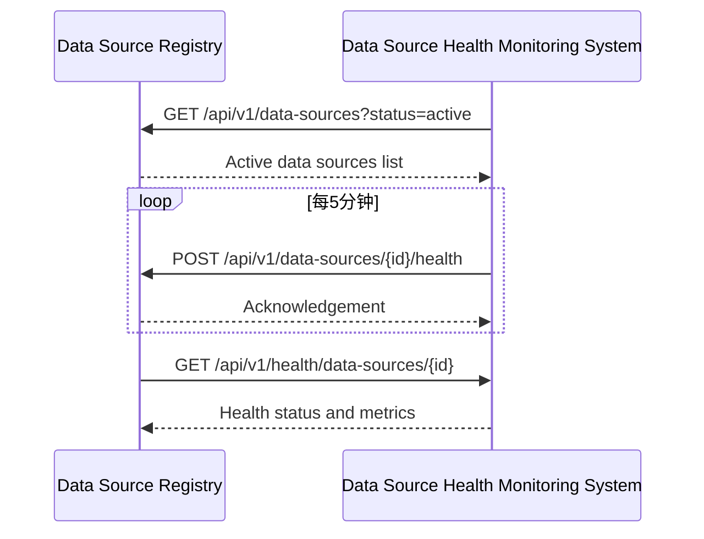
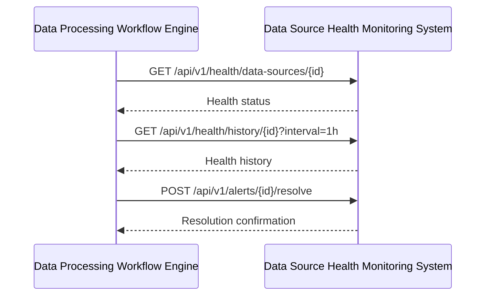
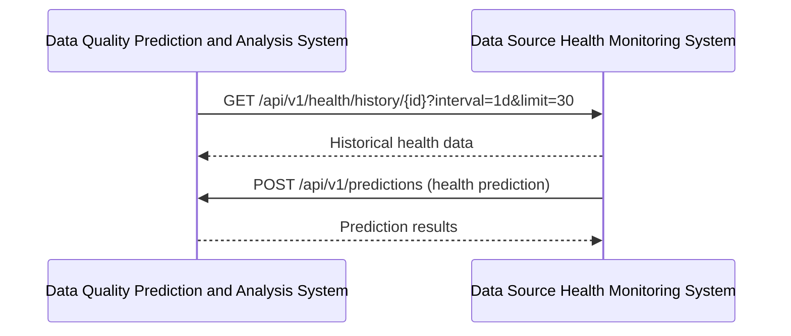

# 镜界平台终极技术规格说明书（模块级深度实现）

## 目录

### 3. 数据源健康监测系统 (Data Source Health Monitoring System)
- [3.1 模块概述](#31-模块概述)
- [3.2 详细功能清单](#32-详细功能清单)
  - [3.2.1 核心功能](#321-核心功能)
  - [3.2.2 高级功能](#322-高级功能)
- [3.3 技术架构](#33-技术架构)
  - [3.3.1 架构图](#331-架构图)
  - [3.3.2 服务边界与交互](#332-服务边界与交互)
- [3.4 核心组件详细实现](#34-核心组件详细实现)
  - [3.4.1 探测调度器](#341-探测调度器)
  - [3.4.2 探测执行器](#342-探测执行器)
  - [3.4.3 结果处理器](#343-结果处理器)
- [3.5 数据模型详细定义](#35-数据模型详细定义)
  - [3.5.1 健康指标表](#351-健康指标表)
  - [3.5.2 告警表](#352-告警表)
- [3.6 API详细规范](#36-api详细规范)
  - [3.6.1 健康监测API](#361-健康监测api)
  - [3.6.2 告警API](#362-告警api)
- [3.7 性能优化策略](#37-性能优化策略)
  - [3.7.1 时序数据存储优化](#371-时序数据存储优化)
  - [3.7.2 告警处理优化](#372-告警处理优化)
- [3.8 安全考虑](#38-安全考虑)
  - [3.8.1 探测安全](#381-探测安全)
  - [3.8.2 数据安全](#382-数据安全)
- [3.9 与其他模块的交互](#39-与其他模块的交互)
  - [3.9.1 与数据源注册中心交互](#391-与数据源注册中心交互)
  - [3.9.2 与数据处理工作流引擎交互](#392-与数据处理工作流引擎交互)
  - [3.9.3 与数据质量预测分析系统交互](#393-与数据质量预测分析系统交互)


## 3. 数据源健康监测系统 (Data Source Health Monitoring System)

### 3.1 模块概述
数据源健康监测系统负责持续监控所有数据源的可用性、性能和数据质量，及时发现和预警数据源问题。它通过定期探测和智能分析，提供全面的数据源健康状态视图。

### 3.2 详细功能清单

#### 3.2.1 核心功能
- **可用性监控**
  - HTTP状态码监控
  - 响应时间监控
  - 内容验证（关键字/正则匹配）
  - SSL证书有效期监控
- **性能监控**
  - 响应时间分布
  - 首字节时间(TTFB)
  - 内容下载时间
  - 资源加载性能
- **数据质量监控**
  - 数据完整性验证
  - 数据格式验证
  - 数据量波动检测
  - 异常值检测
- **健康评分系统**
  - 综合健康评分计算
  - 历史趋势分析
  - 健康状态预测
- **告警系统**
  - 多级告警阈值配置
  - 智能告警抑制
  - 多通道通知（邮件、Slack、Webhook）

#### 3.2.2 高级功能
- **根因分析**
  - 自动分析故障原因
  - 影响范围评估
  - 修复建议
- **预测性维护**
  - 基于历史数据的趋势预测
  - 异常模式检测
  - 预防性告警
- **SLA合规监控**
  - SLA指标跟踪
  - 合规报告生成
  - 服务信用计算
- **变更影响分析**
  - 网站变更检测
  - 变更对爬虫的影响评估
  - 自动化配置建议

### 3.3 技术架构

#### 3.3.1 架构图
```
┌───────────────────────────────────────────────────────────────────────────────────────────────┐
│                            数据源健康监测系统 (DSHMS)                                         │
├───────────────────────┬───────────────────────┬───────────────────────────────────────────────┤
│  监控执行层           │  分析处理层           │  数据存储层                                │
├───────────────────────┼───────────────────────┼───────────────────────────────────────────────┤
│ • 探测调度器           │ • 健康评分计算器      │ • 时序数据库 (InfluxDB)                    │
│ • HTTP探测器          │ • 异常检测引擎        │ • 分析结果存储 (PostgreSQL)                │
│ • 内容验证器           │ • 根因分析器          │ • 告警状态存储 (Redis)                     │
│ • 性能分析器           │ • 预测模型            │ • 配置存储 (PostgreSQL)                    │
└───────────────────────┴───────────────────────┴───────────────────────────────────────────────┘
```

#### 3.3.2 服务边界与交互
- **输入**：
  - 数据源列表（来自数据源注册中心）
  - 监控配置（探测频率、验证规则等）
  - 告警通知配置
- **输出**：
  - 健康状态指标
  - 告警事件
  - 健康报告
  - 根因分析结果

### 3.4 核心组件详细实现

#### 3.4.1 探测调度器

**技术实现：**
```python
class ProbeScheduler:
    """探测调度器，负责安排和执行探测任务"""
    
    def __init__(
        self,
        data_source_service: DataSourceService,
        probe_executor: ProbeExecutor,
        config: Config
    ):
        self.data_source_service = data_source_service
        self.probe_executor = probe_executor
        self.config = config
        self.logger = logging.getLogger(__name__)
        self.running = False
        self.scheduler = BackgroundScheduler()
        self.probe_queue = Queue(maxsize=self.config.max_queued_probes)
    
    def start(self):
        """启动探测调度器"""
        if self.running:
            return
        
        self.running = True
        self.logger.info("Starting probe scheduler")
        
        # 启动探测执行器
        self._start_probe_executor()
        
        # 添加定期任务
        self.scheduler.add_job(
            self._schedule_probes,
            'interval',
            seconds=self.config.schedule_interval,
            id='schedule_probes'
        )
        
        # 启动调度器
        self.scheduler.start()
        self.logger.info("Probe scheduler started")
    
    def _start_probe_executor(self):
        """启动探测执行器"""
        def executor_loop():
            while self.running:
                try:
                    # 从队列获取探测任务
                    probe_task = self.probe_queue.get(timeout=1)
                    
                    # 执行探测
                    self.probe_executor.execute(probe_task)
                    
                    # 标记任务完成
                    self.probe_queue.task_done()
                    
                except Empty:
                    continue
                except Exception as e:
                    self.logger.error("Error executing probe: %s", str(e))
                    time.sleep(1)
        
        # 启动执行线程
        self.executor_thread = Thread(target=executor_loop, daemon=True)
        self.executor_thread.start()
    
    def _schedule_probes(self):
        """安排探测任务"""
        try:
            # 获取需要探测的数据源
            data_sources = self._get_data_sources_to_probe()
            
            # 为每个数据源创建探测任务
            for data_source in data_sources:
                probe_task = self._create_probe_task(data_source)
                self._enqueue_probe_task(probe_task)
            
            self.logger.info("Scheduled %d probes", len(data_sources))
            
        except Exception as e:
            self.logger.error("Error scheduling probes: %s", str(e))
    
    def _get_data_sources_to_probe(self) -> List[DataSource]:
        """获取需要探测的数据源"""
        # 获取所有active状态的数据源
        data_sources = self.data_source_service.list_data_sources(
            project_id="all",
            user_id="system",
            filters={"status": "active"},
            page=1,
            page_size=1000
        ).items
        
        # 过滤需要探测的数据源
        now = datetime.utcnow()
        probes_to_schedule = []
        
        for ds in data_sources:
            # 检查上次探测时间
            last_probe = ds.metadata.get("last_probe_time")
            probe_interval = ds.metadata.get("probe_interval", self.config.default_probe_interval)
            
            if not last_probe or (now - datetime.fromisoformat(last_probe)) >= timedelta(seconds=probe_interval):
                probes_to_schedule.append(ds)
        
        return probes_to_schedule
    
    def _create_probe_task(self, data_source: DataSource) -> ProbeTask:
        """创建探测任务"""
        # 获取探测配置
        probe_config = self._get_probe_config(data_source)
        
        return ProbeTask(
            data_source_id=data_source.id,
            project_id=data_source.project_id,
            url=data_source.url,
            config=probe_config,
            scheduled_time=datetime.utcnow()
        )
    
    def _get_probe_config(self, data_source: DataSource) -> ProbeConfig:
        """获取探测配置"""
        # 从元数据获取配置，如果没有则使用默认值
        metadata = data_source.metadata
        
        return ProbeConfig(
            interval=metadata.get("probe_interval", self.config.default_probe_interval),
            timeout=metadata.get("probe_timeout", self.config.default_timeout),
            verification_rules=metadata.get("verification_rules", []),
            performance_thresholds=metadata.get("performance_thresholds", {}),
            data_validation=metadata.get("data_validation", {})
        )
    
    def _enqueue_probe_task(self, probe_task: ProbeTask):
        """将探测任务加入队列"""
        try:
            self.probe_queue.put_nowait(probe_task)
        except QueueFull:
            self.logger.warning("Probe queue is full. Dropping probe for %s", probe_task.url)
    
    def stop(self):
        """停止探测调度器"""
        if not self.running:
            return
        
        self.running = False
        self.scheduler.shutdown()
        self.logger.info("Probe scheduler stopped")
```

#### 3.4.2 探测执行器

**技术实现：**
```python
class ProbeExecutor:
    """探测执行器，负责实际执行探测任务"""
    
    def __init__(
        self,
        http_client: HttpClient,
        result_processor: ResultProcessor,
        config: Config
    ):
        self.http_client = http_client
        self.result_processor = result_processor
        self.config = config
        self.logger = logging.getLogger(__name__)
    
    def execute(self, probe_task: ProbeTask):
        """执行探测任务"""
        try:
            start_time = time.time()
            
            # 1. 执行HTTP探测
            http_result = self._execute_http_probe(probe_task)
            
            # 2. 执行内容验证
            validation_result = self._execute_content_validation(probe_task, http_result)
            
            # 3. 执行性能分析
            performance_result = self._execute_performance_analysis(probe_task, http_result)
            
            # 4. 执行数据验证（如果适用）
            data_validation_result = self._execute_data_validation(probe_task, http_result)
            
            # 5. 处理结果
            total_time = time.time() - start_time
            self.result_processor.process(
                probe_task,
                http_result,
                validation_result,
                performance_result,
                data_validation_result,
                total_time
            )
            
        except Exception as e:
            self.logger.error("Error executing probe for %s: %s", probe_task.url, str(e))
            self.result_processor.process_error(probe_task, str(e))
    
    def _execute_http_probe(self, probe_task: ProbeTask) -> HttpProbeResult:
        """执行HTTP探测"""
        start_time = time.time()
        
        try:
            # 准备请求
            headers = self._build_headers(probe_task)
            
            # 执行HTTP请求
            response = self.http_client.get(
                probe_task.url,
                headers=headers,
                timeout=probe_task.config.timeout,
                follow_redirects=True
            )
            
            # 计算时间指标
            dns_time = response.timings.get('dns', 0)
            connect_time = response.timings.get('connect', 0)
            tls_time = response.timings.get('tls', 0)
            ttfb = response.timings.get('first_byte', 0)
            download_time = response.timings.get('download', 0)
            total_time = time.time() - start_time
            
            return HttpProbeResult(
                status_code=response.status_code,
                headers=dict(response.headers),
                content=response.content,
                timings={
                    "dns": dns_time,
                    "connect": connect_time,
                    "tls": tls_time,
                    "ttfb": ttfb,
                    "download": download_time,
                    "total": total_time
                },
                redirect_chain=[r.url for r in response.redirects],
                certificate_info=self._extract_certificate_info(response)
            )
            
        except Exception as e:
            total_time = time.time() - start_time
            return HttpProbeResult(
                status_code=0,
                error=str(e),
                timings={"total": total_time}
            )
    
    def _build_headers(self, probe_task: ProbeTask) -> Dict[str, str]:
        """构建请求头"""
        headers = {
            "User-Agent": self.config.default_user_agent,
            "Accept": "text/html,application/xhtml+xml,application/xml;q=0.9,*/*;q=0.8",
            "Accept-Language": "en-US,en;q=0.5",
            "Connection": "keep-alive"
        }
        
        # 添加自定义请求头
        if probe_task.config.headers:
            headers.update(probe_task.config.headers)
        
        return headers
    
    def _extract_certificate_info(self, response: HttpResponse) -> Dict:
        """提取证书信息"""
        if not response.certificate:
            return {}
        
        return {
            "issuer": response.certificate.issuer,
            "subject": response.certificate.subject,
            "valid_from": response.certificate.valid_from.isoformat(),
            "valid_to": response.certificate.valid_to.isoformat(),
            "serial_number": response.certificate.serial_number,
            "signature_algorithm": response.certificate.signature_algorithm
        }
    
    def _execute_content_validation(
        self,
        probe_task: ProbeTask,
        http_result: HttpProbeResult
    ) -> ContentValidationResult:
        """执行内容验证"""
        if not probe_task.config.verification_rules or http_result.status_code != 200:
            return ContentValidationResult(
                passed=True,  # 没有规则或非200响应，视为通过
                errors=[],
                verified_rules=[]
            )
        
        passed = True
        errors = []
        verified_rules = []
        
        # 检查每个验证规则
        for rule in probe_task.config.verification_rules:
            result = self._validate_content_rule(rule, http_result)
            if not result["passed"]:
                passed = False
                errors.append({
                    "rule": rule,
                    "message": result["message"]
                })
            verified_rules.append({
                "rule": rule,
                "passed": result["passed"]
            })
        
        return ContentValidationResult(
            passed=passed,
            errors=errors,
            verified_rules=verified_rules
        )
    
    def _validate_content_rule(
        self,
        rule: Dict,
        http_result: HttpProbeResult
    ) -> Dict:
        """验证单个内容规则"""
        content = http_result.content
        if not content:
            return {"passed": False, "message": "No content to validate"}
        
        try:
            # 解码内容
            content_str = content.decode('utf-8', errors='replace')
            
            # 根据规则类型进行验证
            if rule["type"] == "keyword":
                if rule["keyword"] not in content_str:
                    return {
                        "passed": False,
                        "message": f"Keyword '{rule['keyword']}' not found"
                    }
            
            elif rule["type"] == "regex":
                if not re.search(rule["pattern"], content_str):
                    return {
                        "passed": False,
                        "message": f"Regex pattern '{rule['pattern']}' not matched"
                    }
            
            elif rule["type"] == "xpath":
                # 使用lxml进行XPath验证
                tree = etree.fromstring(content, etree.HTMLParser())
                results = tree.xpath(rule["expression"])
                if not results:
                    return {
                        "passed": False,
                        "message": f"XPath expression '{rule['expression']}' returned no results"
                    }
            
            return {"passed": True}
            
        except Exception as e:
            return {
                "passed": False,
                "message": f"Error validating rule: {str(e)}"
            }
    
    def _execute_performance_analysis(
        self,
        probe_task: ProbeTask,
        http_result: HttpProbeResult
    ) -> PerformanceAnalysisResult:
        """执行性能分析"""
        timings = http_result.timings
        total_time = timings.get("total", 0)
        
        # 检查性能阈值
        thresholds = probe_task.config.performance_thresholds
        performance_issues = []
        
        # 检查总响应时间
        if "total" in thresholds and total_time > thresholds["total"]:
            performance_issues.append({
                "metric": "total_time",
                "value": total_time,
                "threshold": thresholds["total"],
                "severity": "high" if total_time > thresholds["total"] * 2 else "medium"
            })
        
        # 检查TTFB
        ttfb = timings.get("ttfb", 0)
        if "ttfb" in thresholds and ttfb > thresholds["ttfb"]:
            performance_issues.append({
                "metric": "ttfb",
                "value": ttfb,
                "threshold": thresholds["ttfb"],
                "severity": "high" if ttfb > thresholds["ttfb"] * 2 else "medium"
            })
        
        # 检查下载时间
        download_time = timings.get("download", 0)
        if "download" in thresholds and download_time > thresholds["download"]:
            performance_issues.append({
                "metric": "download_time",
                "value": download_time,
                "threshold": thresholds["download"],
                "severity": "medium"
            })
        
        return PerformanceAnalysisResult(
            timings=timings,
            issues=performance_issues,
            passed=len(performance_issues) == 0
        )
    
    def _execute_data_validation(
        self,
        probe_task: ProbeTask,
        http_result: HttpProbeResult
    ) -> DataValidationResult:
        """执行数据验证"""
        if not probe_task.config.data_validation or http_result.status_code != 200:
            return DataValidationResult(
                passed=True,
                issues=[],
                metrics={}
            )
        
        data_validation = probe_task.config.data_validation
        content = http_result.content
        
        if not content:
            return DataValidationResult(
                passed=False,
                issues=[{"type": "empty_content", "message": "No content to validate"}],
                metrics={}
            )
        
        try:
            # 根据内容类型进行验证
            content_type = http_result.headers.get("Content-Type", "")
            
            if "json" in content_type:
                return self._validate_json_data(data_validation, content)
            elif "xml" in content_type:
                return self._validate_xml_data(data_validation, content)
            elif "html" in content_type:
                return self._validate_html_data(data_validation, content)
            else:
                return DataValidationResult(
                    passed=True,
                    issues=[{"type": "unsupported_type", "message": f"Unsupported content type: {content_type}"}],
                    metrics={}
                )
                
        except Exception as e:
            return DataValidationResult(
                passed=False,
                issues=[{"type": "validation_error", "message": str(e)}],
                metrics={}
            )
    
    def _validate_json_data(
        self,
        data_validation: Dict,
        content: bytes
    ) -> DataValidationResult:
        """验证JSON数据"""
        try:
            data = json.loads(content)
            issues = []
            metrics = {}
            
            # 检查数据结构
            if "schema" in data_validation:
                # 使用JSON Schema验证
                try:
                    validate(instance=data, schema=data_validation["schema"])
                except Exception as e:
                    issues.append({
                        "type": "schema_validation",
                        "message": str(e)
                    })
            
            # 检查数据量
            if "min_items" in data_validation:
                if isinstance(data, list) and len(data) < data_validation["min_items"]:
                    issues.append({
                        "type": "data_volume",
                        "message": f"Data volume ({len(data)} items) below minimum ({data_validation['min_items']})"
                    })
                elif isinstance(data, dict) and len(data) < data_validation["min_items"]:
                    issues.append({
                        "type": "data_volume",
                        "message": f"Data volume ({len(data)} items) below minimum ({data_validation['min_items']})"
                    })
            
            # 计算指标
            if isinstance(data, list):
                metrics["item_count"] = len(data)
            elif isinstance(data, dict):
                metrics["field_count"] = len(data)
            
            return DataValidationResult(
                passed=len(issues) == 0,
                issues=issues,
                metrics=metrics
            )
            
        except json.JSONDecodeError as e:
            return DataValidationResult(
                passed=False,
                issues=[{"type": "json_error", "message": str(e)}],
                metrics={}
            )
    
    def _validate_xml_data(
        self,
        data_validation: Dict,
        content: bytes
    ) -> DataValidationResult:
        """验证XML数据"""
        # XML验证实现（简化）
        try:
            tree = etree.fromstring(content)
            issues = []
            metrics = {}
            
            # 检查元素数量
            if "min_elements" in data_validation:
                element_count = len(tree.xpath("//node()"))
                if element_count < data_validation["min_elements"]:
                    issues.append({
                        "type": "data_volume",
                        "message": f"Element count ({element_count}) below minimum ({data_validation['min_elements']})"
                    })
                metrics["element_count"] = element_count
            
            return DataValidationResult(
                passed=len(issues) == 0,
                issues=issues,
                metrics=metrics
            )
            
        except etree.XMLSyntaxError as e:
            return DataValidationResult(
                passed=False,
                issues=[{"type": "xml_error", "message": str(e)}],
                metrics={}
            )
    
    def _validate_html_data(
        self,
        data_validation: Dict,
        content: bytes
    ) -> DataValidationResult:
        """验证HTML数据"""
        # HTML验证实现（简化）
        try:
            soup = BeautifulSoup(content, 'html.parser')
            issues = []
            metrics = {}
            
            # 检查特定元素
            if "required_elements" in data_validation:
                for selector in data_validation["required_elements"]:
                    if not soup.select(selector):
                        issues.append({
                            "type": "missing_element",
                            "message": f"Required element '{selector}' not found"
                        })
            
            # 计算指标
            metrics["link_count"] = len(soup.find_all('a'))
            metrics["image_count"] = len(soup.find_all('img'))
            
            return DataValidationResult(
                passed=len(issues) == 0,
                issues=issues,
                metrics=metrics
            )
            
        except Exception as e:
            return DataValidationResult(
                passed=False,
                issues=[{"type": "html_error", "message": str(e)}],
                metrics={}
            )
```

#### 3.4.3 结果处理器

**技术实现：**
```python
class ResultProcessor:
    """结果处理器，负责处理探测结果并更新健康状态"""
    
    def __init__(
        self,
        data_source_service: DataSourceService,
        alert_service: AlertService,
        metrics_service: MetricsService,
        config: Config
    ):
        self.data_source_service = data_source_service
        self.alert_service = alert_service
        self.metrics_service = metrics_service
        self.config = config
        self.logger = logging.getLogger(__name__)
    
    def process(
        self,
        probe_task: ProbeTask,
        http_result: HttpProbeResult,
        validation_result: ContentValidationResult,
        performance_result: PerformanceAnalysisResult,
        data_validation_result: DataValidationResult,
        total_time: float
    ):
        """处理探测结果"""
        # 1. 计算健康评分
        health_score = self._calculate_health_score(
            http_result,
            validation_result,
            performance_result,
            data_validation_result
        )
        
        # 2. 更新数据源健康状态
        self._update_data_source_health(
            probe_task,
            http_result,
            health_score,
            total_time
        )
        
        # 3. 处理告警
        self._process_alerts(
            probe_task,
            http_result,
            health_score,
            validation_result,
            performance_result,
            data_validation_result
        )
        
        # 4. 存储指标
        self._store_metrics(
            probe_task,
            http_result,
            validation_result,
            performance_result,
            data_validation_result,
            health_score
        )
    
    def _calculate_health_score(
        self,
        http_result: HttpProbeResult,
        validation_result: ContentValidationResult,
        performance_result: PerformanceAnalysisResult,
        data_validation_result: DataValidationResult
    ) -> float:
        """计算健康评分"""
        # 基础分（基于HTTP状态码）
        base_score = self._calculate_base_score(http_result)
        
        # 验证分
        validation_score = self._calculate_validation_score(validation_result)
        
        # 性能分
        performance_score = self._calculate_performance_score(performance_result)
        
        # 数据质量分
        data_score = self._calculate_data_score(data_validation_result)
        
        # 加权计算
        weights = self.config.health_score_weights
        total_score = (
            base_score * weights["base"] +
            validation_score * weights["validation"] +
            performance_score * weights["performance"] +
            data_score * weights["data"]
        ) / sum(weights.values())
        
        return max(0.0, min(1.0, total_score))
    
    def _calculate_base_score(self, http_result: HttpProbeResult) -> float:
        """计算基础分（基于HTTP状态码）"""
        if http_result.status_code == 0:
            return 0.0  # 连接错误
        
        if 200 <= http_result.status_code < 300:
            return 1.0
        
        if 300 <= http_result.status_code < 400:
            return 0.8  # 重定向
        
        if 400 <= http_result.status_code < 500:
            return 0.3  # 客户端错误
        
        return 0.1  # 服务端错误
    
    def _calculate_validation_score(self, validation_result: ContentValidationResult) -> float:
        """计算验证分"""
        if not validation_result.verified_rules:
            return 1.0  # 没有验证规则
        
        passed_count = sum(1 for r in validation_result.verified_rules if r["passed"])
        return passed_count / len(validation_result.verified_rules)
    
    def _calculate_performance_score(self, performance_result: PerformanceAnalysisResult) -> float:
        """计算性能分"""
        if not performance_result.issues:
            return 1.0
        
        # 根据问题严重程度计算
        severity_weights = {"low": 0.1, "medium": 0.3, "high": 0.7}
        total_deduction = 0
        
        for issue in performance_result.issues:
            total_deduction += severity_weights.get(issue["severity"], 0.2)
        
        return max(0.0, 1.0 - total_deduction)
    
    def _calculate_data_score(self, data_validation_result: DataValidationResult) -> float:
        """计算数据质量分"""
        if not data_validation_result.issues:
            return 1.0
        
        # 简单实现：根据问题数量计算
        return max(0.0, 1.0 - (len(data_validation_result.issues) * 0.2))
    
    def _update_data_source_health(
        self,
        probe_task: ProbeTask,
        http_result: HttpProbeResult,
        health_score: float,
        total_time: float
    ):
        """更新数据源健康状态"""
        # 准备更新数据
        update_data = {
            "last_health_check": datetime.utcnow().isoformat(),
            "health_score": health_score,
            "availability_24h": self._calculate_24h_availability(probe_task.data_source_id, health_score),
            "availability_7d": self._calculate_7d_availability(probe_task.data_source_id, health_score),
            "response_time_p50": self._calculate_p50_response_time(probe_task.data_source_id, total_time),
            "response_time_p95": self._calculate_p95_response_time(probe_task.data_source_id, total_time),
            "status": self._determine_status(health_score)
        }
        
        # 更新数据源
        self.data_source_service.update_data_source(
            data_source_id=probe_task.data_source_id,
            project_id=probe_task.project_id,
            updates=update_data,
            user_id="system"
        )
    
    def _calculate_24h_availability(
        self,
        data_source_id: str,
        current_score: float
    ) -> float:
        """计算24小时可用性"""
        # 获取过去24小时的历史记录
        history = self.metrics_service.get_health_history(
            data_source_id,
            start_time=datetime.utcnow() - timedelta(hours=24),
            end_time=datetime.utcnow(),
            limit=1000
        )
        
        # 添加当前分数
        scores = [h["score"] for h in history] + [current_score]
        
        # 计算平均值
        return sum(scores) / len(scores) if scores else 1.0
    
    def _calculate_7d_availability(
        self,
        data_source_id: str,
        current_score: float
    ) -> float:
        """计算7天可用性"""
        # 获取过去7天的历史记录（每天一个样本）
        history = self.metrics_service.get_health_history(
            data_source_id,
            start_time=datetime.utcnow() - timedelta(days=7),
            end_time=datetime.utcnow(),
            interval="1d",
            limit=7
        )
        
        # 添加当前分数
        scores = [h["score"] for h in history] + [current_score]
        
        # 计算平均值
        return sum(scores) / len(scores) if scores else 1.0
    
    def _calculate_p50_response_time(
        self,
        data_source_id: str,
        current_time: float
    ) -> float:
        """计算P50响应时间"""
        # 获取过去1小时的响应时间
        history = self.metrics_service.get_response_times(
            data_source_id,
            start_time=datetime.utcnow() - timedelta(hours=1),
            limit=100
        )
        
        # 添加当前时间
        times = [h["time"] for h in history] + [current_time]
        
        # 计算P50
        return np.percentile(times, 50) if times else current_time
    
    def _calculate_p95_response_time(
        self,
        data_source_id: str,
        current_time: float
    ) -> float:
        """计算P95响应时间"""
        # 获取过去1小时的响应时间
        history = self.metrics_service.get_response_times(
            data_source_id,
            start_time=datetime.utcnow() - timedelta(hours=1),
            limit=100
        )
        
        # 添加当前时间
        times = [h["time"] for h in history] + [current_time]
        
        # 计算P95
        return np.percentile(times, 95) if times else current_time
    
    def _determine_status(self, health_score: float) -> str:
        """确定健康状态"""
        if health_score >= self.config.status_thresholds["healthy"]:
            return "healthy"
        elif health_score >= self.config.status_thresholds["degraded"]:
            return "degraded"
        else:
            return "unhealthy"
    
    def _process_alerts(
        self,
        probe_task: ProbeTask,
        http_result: HttpProbeResult,
        health_score: float,
        validation_result: ContentValidationResult,
        performance_result: PerformanceAnalysisResult,
        data_validation_result: DataValidationResult
    ):
        """处理告警"""
        # 1. 检查是否需要触发告警
        alert_needed = self._should_trigger_alert(
            probe_task.data_source_id,
            health_score,
            http_result
        )
        
        if not alert_needed:
            # 2. 检查是否需要解决告警
            self._check_alert_resolution(probe_task.data_source_id, health_score)
            return
        
        # 3. 创建告警
        alert = self._create_alert(
            probe_task,
            http_result,
            health_score,
            validation_result,
            performance_result,
            data_validation_result
        )
        
        # 4. 触发告警
        self.alert_service.trigger_alert(alert)
    
    def _should_trigger_alert(
        self,
        data_source_id: str,
        health_score: float,
        http_result: HttpProbeResult
    ) -> bool:
        """检查是否需要触发告警"""
        # 获取当前告警状态
        current_alert = self.alert_service.get_current_alert(data_source_id)
        
        # 如果已经有活跃告警，不需要新告警
        if current_alert and current_alert["status"] == "active":
            return False
        
        # 检查健康分数是否低于阈值
        if health_score >= self.config.alert_thresholds["health_score"]:
            return False
        
        # 检查HTTP状态码
        if http_result.status_code == 0 or http_result.status_code >= 500:
            return True
        
        # 检查连续失败次数
        failure_count = self._get_consecutive_failures(data_source_id)
        return failure_count >= self.config.alert_thresholds["consecutive_failures"]
    
    def _get_consecutive_failures(self, data_source_id: str) -> int:
        """获取连续失败次数"""
        history = self.metrics_service.get_health_history(
            data_source_id,
            start_time=datetime.utcnow() - timedelta(hours=1),
            limit=10
        )
        
        consecutive_failures = 0
        for record in reversed(history):
            if record["score"] < self.config.status_thresholds["degraded"]:
                consecutive_failures += 1
            else:
                break
        
        return consecutive_failures
    
    def _check_alert_resolution(
        self,
        data_source_id: str,
        health_score: float
    ):
        """检查告警是否已解决"""
        current_alert = self.alert_service.get_current_alert(data_source_id)
        
        # 没有活跃告警，无需处理
        if not current_alert or current_alert["status"] != "active":
            return
        
        # 检查健康分数是否恢复
        if health_score < self.config.alert_resolution_threshold:
            return
        
        # 检查连续成功次数
        success_count = self._get_consecutive_successes(data_source_id)
        if success_count < self.config.alert_resolution_min_success:
            return
        
        # 解决告警
        self.alert_service.resolve_alert(
            alert_id=current_alert["id"],
            resolution_details={
                "health_score": health_score,
                "consecutive_successes": success_count
            }
        )
    
    def _get_consecutive_successes(self, data_source_id: str) -> int:
        """获取连续成功次数"""
        history = self.metrics_service.get_health_history(
            data_source_id,
            start_time=datetime.utcnow() - timedelta(hours=1),
            limit=10
        )
        
        consecutive_successes = 0
        for record in reversed(history):
            if record["score"] >= self.config.status_thresholds["degraded"]:
                consecutive_successes += 1
            else:
                break
        
        return consecutive_successes
    
    def _create_alert(
        self,
        probe_task: ProbeTask,
        http_result: HttpProbeResult,
        health_score: float,
        validation_result: ContentValidationResult,
        performance_result: PerformanceAnalysisResult,
        data_validation_result: DataValidationResult
    ) -> Alert:
        """创建告警"""
        # 确定告警级别
        severity = self._determine_alert_severity(
            health_score,
            http_result,
            validation_result,
            performance_result
        )
        
        # 生成告警消息
        message = self._generate_alert_message(
            probe_task,
            http_result,
            health_score,
            severity
        )
        
        return Alert(
            data_source_id=probe_task.data_source_id,
            project_id=probe_task.project_id,
            url=probe_task.url,
            severity=severity,
            message=message,
            details={
                "health_score": health_score,
                "status_code": http_result.status_code,
                "validation_issues": validation_result.errors,
                "performance_issues": performance_result.issues,
                "data_issues": data_validation_result.issues
            },
            timestamp=datetime.utcnow()
        )
    
    def _determine_alert_severity(
        self,
        health_score: float,
        http_result: HttpProbeResult,
        validation_result: ContentValidationResult,
        performance_result: PerformanceAnalysisResult
    ) -> str:
        """确定告警级别"""
        # 基于HTTP状态码
        if http_result.status_code == 0:
            return "critical"
        if http_result.status_code >= 500:
            return "critical"
        if http_result.status_code >= 400:
            return "high"
        
        # 基于健康分数
        if health_score < self.config.severity_thresholds["critical"]:
            return "critical"
        if health_score < self.config.severity_thresholds["high"]:
            return "high"
        if health_score < self.config.severity_thresholds["medium"]:
            return "medium"
        
        # 基于验证问题
        if validation_result.errors:
            return "medium"
        
        # 基于性能问题
        if any(issue["severity"] == "high" for issue in performance_result.issues):
            return "high"
        if any(issue["severity"] == "medium" for issue in performance_result.issues):
            return "medium"
        
        return "low"
    
    def _generate_alert_message(
        self,
        probe_task: ProbeTask,
        http_result: HttpProbeResult,
        health_score: float,
        severity: str
    ) -> str:
        """生成告警消息"""
        if http_result.status_code == 0:
            return f"Connection failed to {probe_task.url}"
        if http_result.status_code >= 500:
            return f"Server error ({http_result.status_code}) for {probe_task.url}"
        if http_result.status_code >= 400:
            return f"Client error ({http_result.status_code}) for {probe_task.url}"
        
        if health_score < self.config.severity_thresholds["critical"]:
            return f"Critical health issue for {probe_task.url} (score: {health_score:.2f})"
        if health_score < self.config.severity_thresholds["high"]:
            return f"High severity issue for {probe_task.url} (score: {health_score:.2f})"
        
        return f"Health issue for {probe_task.url} (score: {health_score:.2f})"
    
    def _store_metrics(
        self,
        probe_task: ProbeTask,
        http_result: HttpProbeResult,
        validation_result: ContentValidationResult,
        performance_result: PerformanceAnalysisResult,
        data_validation_result: DataValidationResult,
        health_score: float
    ):
        """存储指标"""
        timestamp = datetime.utcnow()
        
        # 存储健康指标
        self.metrics_service.store_health_metric(
            data_source_id=probe_task.data_source_id,
            score=health_score,
            timestamp=timestamp
        )
        
        # 存储响应时间指标
        if "total" in http_result.timings:
            self.metrics_service.store_response_time(
                data_source_id=probe_task.data_source_id,
                response_time=http_result.timings["total"],
                timestamp=timestamp
            )
        
        # 存储可用性指标
        is_available = 1 if (200 <= http_result.status_code < 400) else 0
        self.metrics_service.store_availability(
            data_source_id=probe_task.data_source_id,
            is_available=is_available,
            timestamp=timestamp
        )
        
        # 存储验证指标
        self.metrics_service.store_validation_metrics(
            data_source_id=probe_task.data_source_id,
            passed=validation_result.passed,
            issue_count=len(validation_result.errors),
            timestamp=timestamp
        )
        
        # 存储性能指标
        self.metrics_service.store_performance_metrics(
            data_source_id=probe_task.data_source_id,
            metrics=performance_result.timings,
            issue_count=len(performance_result.issues),
            timestamp=timestamp
        )
        
        # 存储数据质量指标
        self.metrics_service.store_data_metrics(
            data_source_id=probe_task.data_source_id,
            passed=data_validation_result.passed,
            issue_count=len(data_validation_result.issues),
            metrics=data_validation_result.metrics,
            timestamp=timestamp
        )
    
    def process_error(self, probe_task: ProbeTask, error: str):
        """处理探测错误"""
        self.logger.error("Probe error for %s: %s", probe_task.url, error)
        
        # 更新数据源状态
        update_data = {
            "last_health_check": datetime.utcnow().isoformat(),
            "health_score": 0.0,
            "status": "unhealthy"
        }
        
        try:
            self.data_source_service.update_data_source(
                data_source_id=probe_task.data_source_id,
                project_id=probe_task.project_id,
                updates=update_data,
                user_id="system"
            )
        except Exception as e:
            self.logger.error("Error updating data source health: %s", str(e))
        
        # 触发告警
        alert = Alert(
            data_source_id=probe_task.data_source_id,
            project_id=probe_task.project_id,
            url=probe_task.url,
            severity="critical",
            message=f"Probe failed: {error}",
            details={"error": error},
            timestamp=datetime.utcnow()
        )
        self.alert_service.trigger_alert(alert)
        
        # 存储错误指标
        self.metrics_service.store_health_metric(
            data_source_id=probe_task.data_source_id,
            score=0.0,
            timestamp=datetime.utcnow()
        )
```

### 3.5 数据模型详细定义

#### 3.5.1 健康指标表

```sql
-- 健康指标表（时序数据）
CREATE TABLE health_metrics (
    time TIMESTAMPTZ NOT NULL,
    data_source_id UUID NOT NULL REFERENCES data_sources(id) ON DELETE CASCADE,
    health_score DOUBLE PRECISION NOT NULL,
    response_time DOUBLE PRECISION,
    is_available BOOLEAN NOT NULL,
    
    -- 索引
    INDEX idx_health_metrics_ds ON health_metrics(data_source_id),
    INDEX idx_health_metrics_time ON health_metrics(time DESC)
);

-- 创建分区（按月）
SELECT create_hypertable('health_metrics', 'time', partitioning_column => 'data_source_id', number_partitions => 4);

-- 健康历史表（汇总数据）
CREATE TABLE health_history (
    id UUID PRIMARY KEY DEFAULT gen_random_uuid(),
    data_source_id UUID NOT NULL REFERENCES data_sources(id) ON DELETE CASCADE,
    period_start TIMESTAMPTZ NOT NULL,
    period_end TIMESTAMPTZ NOT NULL,
    health_score DOUBLE PRECISION NOT NULL,
    availability DOUBLE PRECISION NOT NULL,
    avg_response_time DOUBLE PRECISION,
    min_response_time DOUBLE PRECISION,
    max_response_time DOUBLE PRECISION,
    validation_pass_rate DOUBLE PRECISION,
    performance_issues INT NOT NULL DEFAULT 0,
    data_issues INT NOT NULL DEFAULT 0,
    
    -- 索引
    UNIQUE (data_source_id, period_start, period_end),
    INDEX idx_health_history_ds ON health_history(data_source_id),
    INDEX idx_health_history_period ON health_history(period_start DESC)
);
```

#### 3.5.2 告警表

```sql
-- 告警表
CREATE TABLE alerts (
    id UUID PRIMARY KEY DEFAULT gen_random_uuid(),
    data_source_id UUID NOT NULL REFERENCES data_sources(id) ON DELETE CASCADE,
    project_id UUID NOT NULL REFERENCES projects(id) ON DELETE CASCADE,
    url VARCHAR(2048) NOT NULL,
    severity VARCHAR(20) NOT NULL CHECK (severity IN ('low', 'medium', 'high', 'critical')),
    message TEXT NOT NULL,
    details JSONB,
    status VARCHAR(20) NOT NULL CHECK (status IN ('active', 'resolved', 'suppressed')) DEFAULT 'active',
    created_at TIMESTAMPTZ NOT NULL DEFAULT NOW(),
    resolved_at TIMESTAMPTZ,
    resolved_by UUID REFERENCES users(id) ON DELETE SET NULL,
    resolution_details JSONB,
    
    -- 索引
    INDEX idx_alerts_data_source ON alerts(data_source_id),
    INDEX idx_alerts_status ON alerts(status),
    INDEX idx_alerts_created ON alerts(created_at DESC),
    INDEX idx_alerts_resolved ON alerts(resolved_at DESC)
);

-- 告警通知表
CREATE TABLE alert_notifications (
    id UUID PRIMARY KEY DEFAULT gen_random_uuid(),
    alert_id UUID NOT NULL REFERENCES alerts(id) ON DELETE CASCADE,
    channel VARCHAR(50) NOT NULL,
    sent_at TIMESTAMPTZ NOT NULL DEFAULT NOW(),
    status VARCHAR(20) NOT NULL CHECK (status IN ('pending', 'sent', 'failed')),
    status_message TEXT,
    
    -- 索引
    INDEX idx_notifications_alert ON alert_notifications(alert_id),
    INDEX idx_notifications_channel ON alert_notifications(channel),
    INDEX idx_notifications_sent ON alert_notifications(sent_at DESC)
);
```

### 3.6 API详细规范

#### 3.6.1 健康监测API

**获取数据源健康状态 (GET /api/v1/health/data-sources/{id})**

*请求示例:*
```http
GET /api/v1/health/data-sources/ds-7a8b9c0d HTTP/1.1
Host: dshms.mirror-realm.com
Authorization: Bearer <access_token>
```

*成功响应示例:*
```http
HTTP/1.1 200 OK
Content-Type: application/json

{
  "data_source_id": "ds-7a8b9c0d",
  "url": "https://api.instagram.com/v1/users/self/media/recent",
  "status": "healthy",
  "health_score": 0.95,
  "availability_24h": 0.98,
  "availability_7d": 0.95,
  "response_time_p50": 0.35,
  "response_time_p95": 1.2,
  "last_check": "2023-06-15T10:35:20Z",
  "metrics": {
    "http_status": 200,
    "content_validation": {
      "passed": true,
      "issues": []
    },
    "performance": {
      "timings": {
        "dns": 0.02,
        "connect": 0.05,
        "tls": 0.1,
        "ttfb": 0.25,
        "download": 0.1,
        "total": 0.45
      },
      "issues": []
    },
    "data_validation": {
      "passed": true,
      "issues": [],
      "metrics": {
        "item_count": 20
      }
    }
  }
}
```

**获取健康历史 (GET /api/v1/health/history/{id})**

*请求示例:*
```http
GET /api/v1/health/history/ds-7a8b9c0d?start=2023-06-01T00:00:00Z&end=2023-06-15T23:59:59Z&interval=1d HTTP/1.1
Host: dshms.mirror-realm.com
Authorization: Bearer <access_token>
```

*成功响应示例:*
```http
HTTP/1.1 200 OK
Content-Type: application/json

{
  "data_source_id": "ds-7a8b9c0d",
  "interval": "1d",
  "start": "2023-06-01T00:00:00Z",
  "end": "2023-06-15T23:59:59Z",
  "history": [
    {
      "timestamp": "2023-06-01T00:00:00Z",
      "health_score": 0.92,
      "availability": 0.95,
      "response_time_avg": 0.42,
      "response_time_p95": 1.5
    },
    {
      "timestamp": "2023-06-02T00:00:00Z",
      "health_score": 0.94,
      "availability": 0.97,
      "response_time_avg": 0.38,
      "response_time_p95": 1.3
    },
    // ... 更多数据点
  ]
}
```

#### 3.6.2 告警API

**获取活跃告警 (GET /api/v1/alerts/active)**

*请求示例:*
```http
GET /api/v1/alerts/active?project_id=proj-123 HTTP/1.1
Host: dshms.mirror-realm.com
Authorization: Bearer <access_token>
```

*成功响应示例:*
```http
HTTP/1.1 200 OK
Content-Type: application/json

{
  "items": [
    {
      "id": "alert-1a2b3c4d",
      "data_source_id": "ds-1b2c3d4e",
      "url": "https://api.twitter.com/2/users/me/tweets",
      "severity": "high",
      "message": "High severity issue for https://api.twitter.com/2/users/me/tweets (score: 0.65)",
      "details": {
        "health_score": 0.65,
        "status_code": 429,
        "validation_issues": [],
        "performance_issues": [
          {
            "metric": "total_time",
            "value": 3.5,
            "threshold": 2.0,
            "severity": "high"
          }
        ],
        "data_issues": []
      },
      "status": "active",
      "created_at": "2023-06-15T10:30:45Z"
    }
  ],
  "total": 1
}
```

**解决告警 (POST /api/v1/alerts/{id}/resolve)**

*请求示例:*
```http
POST /api/v1/alerts/alert-1a2b3c4d/resolve HTTP/1.1
Host: dshms.mirror-realm.com
Authorization: Bearer <access_token>
Content-Type: application/json

{
  "resolution_notes": "Issue resolved by increasing rate limit"
}
```

*成功响应示例:*
```http
HTTP/1.1 200 OK
Content-Type: application/json

{
  "id": "alert-1a2b3c4d",
  "status": "resolved",
  "resolved_at": "2023-06-15T10:45:30Z",
  "resolved_by": "user-123",
  "resolution_details": {
    "resolution_notes": "Issue resolved by increasing rate limit",
    "health_score": 0.92,
    "consecutive_successes": 10
  }
}
```

### 3.7 性能优化策略

#### 3.7.1 时序数据存储优化

1. **Hypertable分区**
   ```sql
   -- 创建按数据源ID分区的Hypertable
   SELECT create_hypertable('health_metrics', 'time', partitioning_column => 'data_source_id', number_partitions => 4);
   
   -- 添加压缩策略
   ALTER TABLE health_metrics SET (timescaledb.compress, timescaledb.compress_segmentby = 'data_source_id');
   SELECT add_compression_policy('health_metrics', INTERVAL '7 days');
   ```

2. **数据保留策略**
   ```sql
   -- 保留原始数据7天
   SELECT add_retention_policy('health_metrics', INTERVAL '7 days');
   
   -- 为更长期数据创建连续聚合
   CREATE MATERIALIZED VIEW health_daily
   WITH (timescaledb.continuous) AS
   SELECT
       time_bucket('1 day', time) AS bucket,
       data_source_id,
       AVG(health_score) AS avg_health,
       AVG(response_time) AS avg_response_time,
       AVG(is_available::int) AS availability
   FROM health_metrics
   GROUP BY bucket, data_source_id
   WITH DATA;
   ```

#### 3.7.2 告警处理优化

1. **告警抑制策略**
   ```python
   def should_suppress_alert(alert: Alert) -> bool:
       """检查是否应该抑制告警"""
       # 相同数据源的重复告警抑制
       recent_alerts = get_recent_alerts(
           data_source_id=alert.data_source_id,
           since=datetime.utcnow() - timedelta(minutes=5)
       )
       if len(recent_alerts) > 2:
           return True
       
       # 维护窗口抑制
       if is_in_maintenance_window(alert.data_source_id):
           return True
       
       # 已知问题抑制
       if is_known_issue(alert):
           return True
       
       return False
   ```

2. **告警聚合**
   ```python
   def aggregate_similar_alerts(alerts: List[Alert]) -> List[AlertGroup]:
       """聚合相似告警"""
       # 按数据源和严重程度分组
       groups = defaultdict(list)
       for alert in alerts:
           key = (alert.data_source_id, alert.severity)
           groups[key].append(alert)
       
       # 创建聚合组
       alert_groups = []
       for (ds_id, severity), group_alerts in groups.items():
           first_alert = min(group_alerts, key=lambda a: a.created_at)
           last_alert = max(group_alerts, key=lambda a: a.created_at)
           
           alert_groups.append(AlertGroup(
               data_source_id=ds_id,
               severity=severity,
               count=len(group_alerts),
               first_occurrence=first_alert.created_at,
               last_occurrence=last_alert.created_at,
               sample_alert=first_alert
           ))
       
       return alert_groups
   ```

### 3.8 安全考虑

#### 3.8.1 探测安全

1. **探测限制**
   - 限制探测频率，避免被目标网站封禁
   - 实现随机化探测间隔
   - 支持自定义User-Agent轮换

2. **目标网站保护**
   - 尊重robots.txt
   - 实现Crawl-Delay遵守
   - 避免高负载探测

#### 3.8.2 数据安全

1. **敏感数据处理**
   - 不存储响应内容（除非必要）
   - 对存储的内容进行脱敏
   - 限制敏感数据访问

2. **隐私合规**
   - 符合GDPR要求
   - 提供数据删除选项
   - 限制数据保留时间

### 3.9 与其他模块的交互

#### 3.9.1 与数据源注册中心交互



#### 3.9.2 与数据处理工作流引擎交互



#### 3.9.3 与数据质量预测分析系统交互


