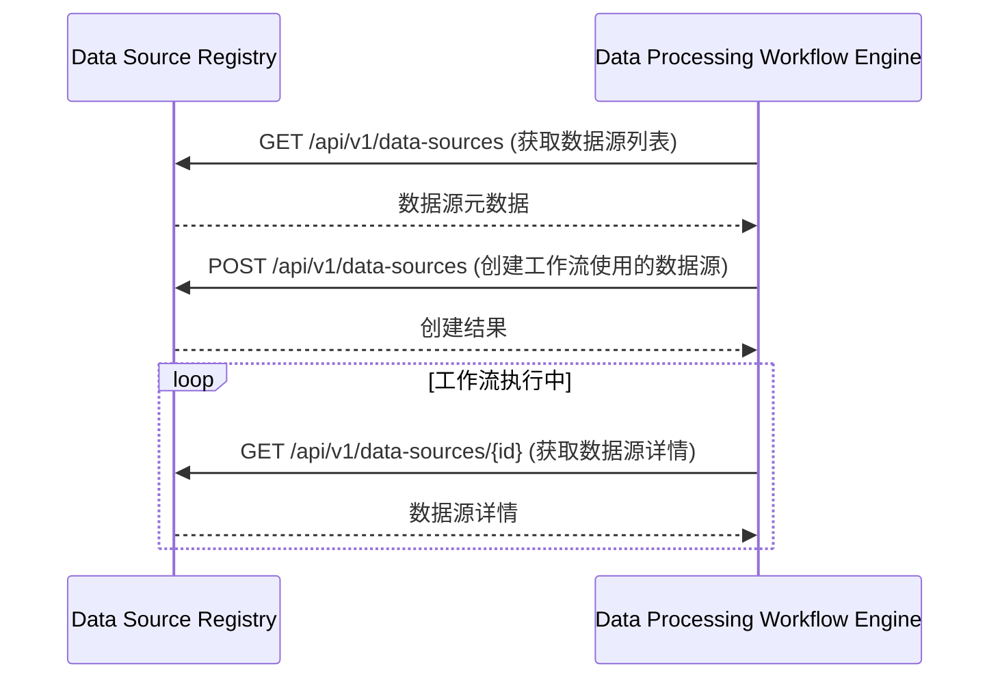
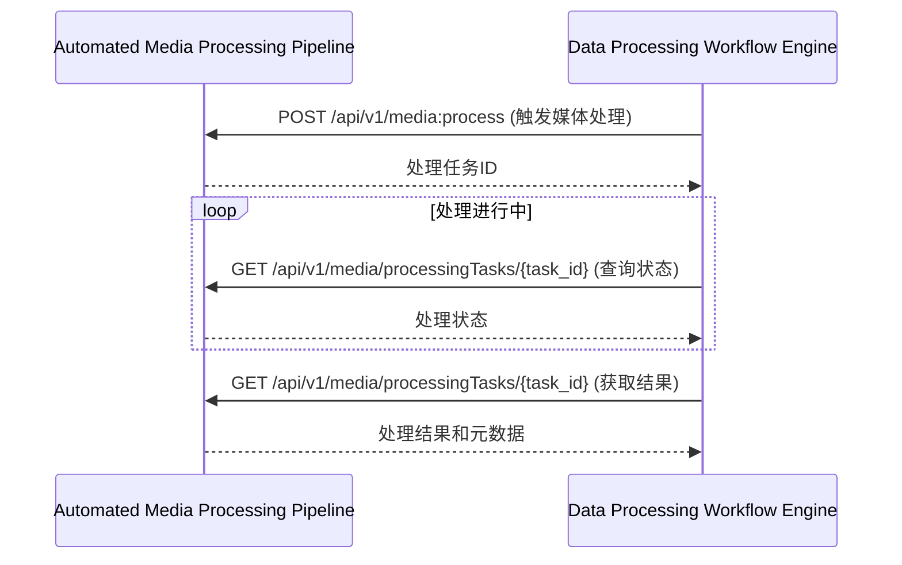
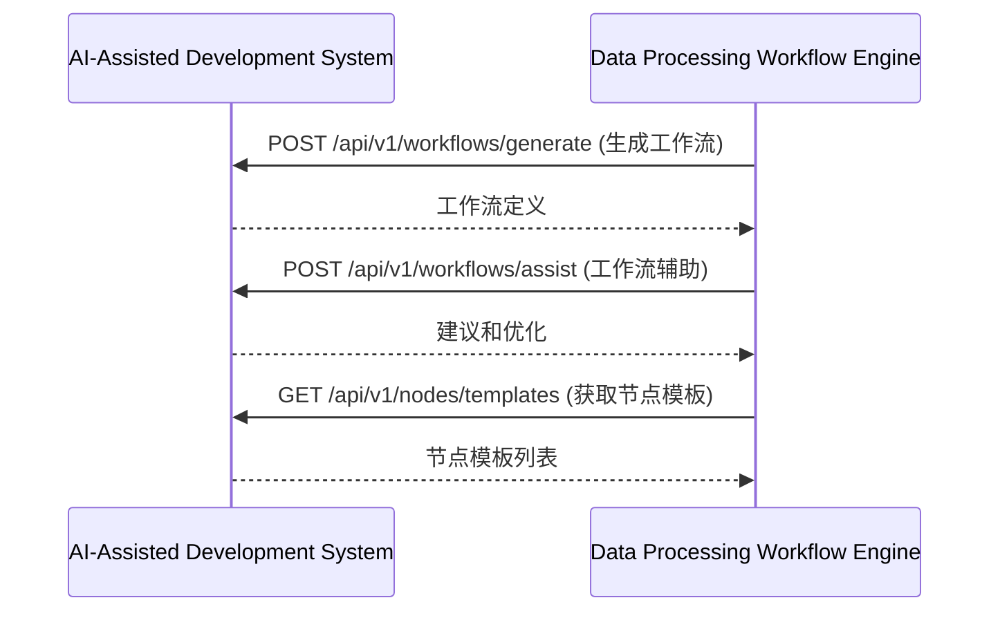

# 镜界平台终极技术规格说明书（模块级深度实现）

## 目录

### 4. 数据处理工作流引擎 (Data Processing Workflow Engine)
- [4.1 模块概述](#41-模块概述)
- [4.2 详细功能清单](#42-详细功能清单)
  - [4.2.1 核心功能](#421-核心功能)
  - [4.2.2 高级功能](#422-高级功能)
- [4.3 技术架构](#43-技术架构)
  - [4.3.1 架构图](#431-架构图)
  - [4.3.2 服务边界与交互](#432-服务边界与交互)
- [4.4 核心组件详细实现](#44-核心组件详细实现)
  - [4.4.1 工作流定义服务](#441-工作流定义服务)
  - [4.4.2 工作流执行服务](#442-工作流执行服务)
  - [4.4.3 工作流调度器](#443-工作流调度器)
  - [4.4.4 工作流执行器](#444-工作流执行器)
  - [4.4.5 节点执行器](#445-节点执行器)
- [4.5 数据模型详细定义](#45-数据模型详细定义)
  - [4.5.1 工作流定义表](#451-工作流定义表)
  - [4.5.2 工作流实例表](#452-工作流实例表)
  - [4.5.3 节点执行表](#453-节点执行表)
- [4.6 API详细规范](#46-api详细规范)
  - [4.6.1 工作流定义API](#461-工作流定义api)
  - [4.6.2 工作流执行API](#462-工作流执行api)
- [4.7 性能优化策略](#47-性能优化策略)
  - [4.7.1 工作流执行优化](#471-工作流执行优化)
  - [4.7.2 资源管理优化](#472-资源管理优化)
- [4.8 安全考虑](#48-安全考虑)
  - [4.8.1 工作流安全](#481-工作流安全)
  - [4.8.2 数据安全](#482-数据安全)
- [4.9 与其他模块的交互](#49-与其他模块的交互)
  - [4.9.1 与数据源注册中心交互](#491-与数据源注册中心交互)
  - [4.9.2 与自动化媒体处理管道交互](#492-与自动化媒体处理管道交互)
  - [4.9.3 与AI辅助开发系统交互](#493-与ai辅助开发系统交互)


## 4. 数据处理工作流引擎 (Data Processing Workflow Engine)

### 4.1 模块概述
数据处理工作流引擎是镜界平台的核心自动化组件，提供可视化工作流设计和执行能力。它支持从简单触发到复杂数据处理流水线的完整工作流管理，是实现数据采集、处理和分析自动化的关键。

### 4.2 详细功能清单

#### 4.2.1 核心功能
- **工作流定义管理**
  - 可视化工作流设计器
  - 工作流版本控制
  - 工作流模板库
  - 工作流导入/导出
- **触发器管理**
  - 定时触发器
  - 文件系统触发器（监控NAS）
  - API触发器（Webhook）
  - 条件触发器
- **节点类型支持**
  - 数据源节点（获取数据）
  - 处理节点（数据转换、清洗）
  - AI节点（调用AI服务）
  - 存储节点（保存结果）
  - 条件节点（分支逻辑）
  - 循环节点
- **工作流执行**
  - 同步/异步执行
  - 执行状态跟踪
  - 执行日志记录
  - 执行结果查看
- **错误处理**
  - 自动重试机制
  - 错误分类与处理
  - 失败通知
  - 手动重试

#### 4.2.2 高级功能
- **工作流调试**
  - 单步执行
  - 断点设置
  - 变量检查
  - 执行回放
- **资源管理**
  - 资源需求定义
  - 资源配额管理
  - 动态资源分配
  - 资源使用监控
- **工作流分析**
  - 执行性能分析
  - 瓶颈识别
  - 优化建议
  - 成本分析
- **工作流共享与协作**
  - 工作流分享
  - 协作编辑
  - 评论与反馈
  - 权限管理

### 4.3 技术架构

#### 4.3.1 架构图
```
┌───────────────────────────────────────────────────────────────────────────────────────────────┐
│                             数据处理工作流引擎 (DPWE)                                         │
├───────────────────────┬───────────────────────┬───────────────────────────────────────────────┤
│  前端交互层           │  服务层               │  执行层                                    │
├───────────────────────┼───────────────────────┼───────────────────────────────────────────────┤
│ • 工作流设计器         │ • 工作流管理服务      │ • 调度器                                  │
│ • 执行监控界面        │ • 触发器服务          │ • 节点执行器                              │
│ • 调试工具            │ • 执行服务            │ • 资源管理器                              │
│ • 分析仪表盘          │ • 错误处理服务        │ • 日志收集器                              │
└───────────────────────┴───────────────────────┴───────────────────────────────────────────────┘
```

#### 4.3.2 服务边界与交互
- **输入**：
  - 工作流定义（来自用户或API）
  - 触发事件（定时、文件系统、Webhook等）
  - 节点执行请求
- **输出**：
  - 工作流执行状态
  - 执行结果
  - 日志和指标
  - 错误通知

### 4.4 核心组件详细实现

#### 4.4.1 工作流定义服务

**技术实现：**
```python
class WorkflowDefinitionService:
    """工作流定义管理服务"""
    
    def __init__(
        self,
        db: Database,
        storage: StorageService,
        config: Config
    ):
        self.db = db
        self.storage = storage
        self.config = config
        self.logger = logging.getLogger(__name__)
        self.cache = TTLCache(maxsize=1000, ttl=300)  # 5分钟缓存
    
    def create_workflow(
        self,
        project_id: str,
        workflow: WorkflowDefinition,
        user_id: str
    ) -> WorkflowDefinition:
        """
        创建新工作流
        
        :param project_id: 项目ID
        :param workflow: 工作流定义
        :param user_id: 创建者ID
        :return: 创建后的工作流
        """
        # 1. 验证工作流
        self._validate_workflow(workflow)
        
        # 2. 生成唯一ID
        workflow.id = f"wf-{uuid.uuid4().hex[:8]}"
        workflow.project_id = project_id
        workflow.version = "1.0.0"
        workflow.created_at = datetime.utcnow()
        workflow.updated_at = workflow.created_at
        workflow.created_by = user_id
        workflow.updated_by = user_id
        workflow.status = "active"
        
        # 3. 保存工作流定义
        self._save_workflow(workflow)
        
        # 4. 保存到存储（用于版本控制）
        self._save_to_storage(workflow)
        
        # 5. 清除缓存
        self._clear_cache(project_id)
        
        return workflow
    
    def _validate_workflow(self, workflow: WorkflowDefinition):
        """验证工作流定义的有效性"""
        # 必填字段检查
        required_fields = ["name", "triggers", "nodes"]
        for field in required_fields:
            if not getattr(workflow, field):
                raise ValidationError(f"Missing required field: {field}")
        
        # 验证触发器
        if not workflow.triggers:
            raise ValidationError("At least one trigger is required")
        
        for trigger in workflow.triggers:
            if not trigger.type:
                raise ValidationError("Trigger type is required")
            if not trigger.config:
                raise ValidationError("Trigger config is required")
        
        # 验证节点
        if not workflow.nodes:
            raise ValidationError("At least one node is required")
        
        node_ids = set()
        for node in workflow.nodes:
            if not node.id:
                raise ValidationError("Node ID is required")
            if node.id in node_ids:
                raise ValidationError(f"Duplicate node ID: {node.id}")
            node_ids.add(node.id)
            
            if not node.type:
                raise ValidationError(f"Node type is required for node {node.id}")
        
        # 验证连接
        if workflow.edges:
            for edge in workflow.edges:
                if edge.source not in node_ids:
                    raise ValidationError(f"Edge source {edge.source} does not exist")
                if edge.target not in node_ids:
                    raise ValidationError(f"Edge target {edge.target} does not exist")
        
        # 验证入口节点（至少有一个没有入边的节点）
        entry_nodes = self._find_entry_nodes(workflow)
        if not entry_nodes:
            raise ValidationError("No entry nodes found (nodes with no incoming edges)")
    
    def _find_entry_nodes(self, workflow: WorkflowDefinition) -> Set[str]:
        """查找入口节点（没有入边的节点）"""
        all_nodes = {node.id for node in workflow.nodes}
        target_nodes = {edge.target for edge in workflow.edges}
        return all_nodes - target_nodes
    
    def _save_workflow(self, workflow: WorkflowDefinition):
        """保存工作流定义到数据库"""
        # 准备SQL
        sql = """
        INSERT INTO workflows (
            id, project_id, name, display_name, description, version, 
            definition, status, created_at, updated_at, created_by, updated_by, tags, metadata
        ) VALUES (
            %(id)s, %(project_id)s, %(name)s, %(display_name)s, %(description)s, %(version)s,
            %(definition)s, %(status)s, %(created_at)s, %(updated_at)s, %(created_by)s, %(updated_by)s,
            %(tags)s, %(metadata)s
        )
        """
        
        # 执行插入
        self.db.execute(sql, {
            "id": workflow.id,
            "project_id": workflow.project_id,
            "name": workflow.name,
            "display_name": workflow.display_name,
            "description": workflow.description,
            "version": workflow.version,
            "definition": json.dumps(workflow.definition),
            "status": workflow.status,
            "created_at": workflow.created_at,
            "updated_at": workflow.updated_at,
            "created_by": workflow.created_by,
            "updated_by": workflow.updated_by,
            "tags": json.dumps(workflow.tags),
            "metadata": json.dumps(workflow.metadata)
        })
    
    def _save_to_storage(self, workflow: WorkflowDefinition):
        """保存工作流到存储（用于版本控制）"""
        # 生成存储路径
        storage_path = f"workflows/{workflow.project_id}/{workflow.id}/{workflow.version}"
        
        # 保存定义
        self.storage.save(
            f"{storage_path}/definition.json",
            json.dumps(workflow.definition).encode('utf-8')
        )
        
        # 保存元数据
        self.storage.save(
            f"{storage_path}/metadata.json",
            json.dumps({
                "version": workflow.version,
                "created_at": workflow.created_at.isoformat(),
                "created_by": workflow.created_by,
                "description": workflow.description
            }).encode('utf-8')
        )
    
    def get_workflow(
        self,
        workflow_id: str,
        project_id: str,
        user_id: str,
        version: Optional[str] = None
    ) -> WorkflowDefinition:
        """
        获取工作流详情
        
        :param workflow_id: 工作流ID
        :param project_id: 项目ID
        :param user_id: 请求用户ID
        :param version: 版本号（可选）
        :return: 工作流定义
        """
        # 1. 检查权限
        if not self._has_permission(user_id, project_id, "read"):
            raise PermissionError("User does not have permission to read this workflow")
        
        # 2. 从缓存获取
        cache_key = f"{workflow_id}:{version or 'latest'}"
        if cache_key in self.cache:
            return self.cache[cache_key]
        
        # 3. 从数据库获取
        workflow = self._get_from_db(workflow_id, project_id, version)
        if not workflow:
            raise NotFoundError(f"Workflow {workflow_id} not found")
        
        # 4. 从存储加载定义（如果是特定版本）
        if version and version != workflow.version:
            self._load_definition_from_storage(workflow, version)
        
        # 5. 缓存结果
        self.cache[cache_key] = workflow
        
        return workflow
    
    def _get_from_db(
        self,
        workflow_id: str,
        project_id: str,
        version: Optional[str] = None
    ) -> Optional[WorkflowDefinition]:
        """从数据库获取工作流"""
        if version:
            # 获取特定版本
            sql = """
            SELECT * FROM workflows 
            WHERE id = %(id)s AND project_id = %(project_id)s AND version = %(version)s
            """
            params = {
                "id": workflow_id,
                "project_id": project_id,
                "version": version
            }
        else:
            # 获取最新版本
            sql = """
            SELECT * FROM workflows 
            WHERE id = %(id)s AND project_id = %(project_id)s
            ORDER BY version DESC
            LIMIT 1
            """
            params = {
                "id": workflow_id,
                "project_id": project_id
            }
        
        row = self.db.fetchone(sql, params)
        if not row:
            return None
        
        return self._row_to_workflow(row)
    
    def _row_to_workflow(self, row: Dict) -> WorkflowDefinition:
        """将数据库行转换为WorkflowDefinition对象"""
        return WorkflowDefinition(
            id=row["id"],
            project_id=row["project_id"],
            name=row["name"],
            display_name=row["display_name"],
            description=row["description"],
            version=row["version"],
            definition=json.loads(row["definition"]),
            status=row["status"],
            created_at=row["created_at"],
            updated_at=row["updated_at"],
            created_by=row["created_by"],
            updated_by=row["updated_by"],
            tags=json.loads(row["tags"]),
            metadata=json.loads(row["metadata"])
        )
    
    def _load_definition_from_storage(
        self,
        workflow: WorkflowDefinition,
        version: str
    ):
        """从存储加载特定版本的定义"""
        storage_path = f"workflows/{workflow.project_id}/{workflow.id}/{version}/definition.json"
        
        try:
            definition_data = self.storage.load(storage_path)
            workflow.definition = json.loads(definition_data.decode('utf-8'))
            workflow.version = version
        except Exception as e:
            self.logger.error("Error loading workflow version %s: %s", version, str(e))
            raise NotFoundError(f"Workflow version {version} not found")
    
    def update_workflow(
        self,
        workflow_id: str,
        project_id: str,
        updates: Dict,
        user_id: str
    ) -> WorkflowDefinition:
        """
        更新工作流
        
        :param workflow_id: 工作流ID
        :param project_id: 项目ID
        :param updates: 更新字段
        :param user_id: 更新者ID
        :return: 更新后的工作流
        """
        # 1. 获取当前工作流
        current = self.get_workflow(workflow_id, project_id, user_id)
        
        # 2. 检查权限
        if not self._has_permission(user_id, project_id, "write"):
            raise PermissionError("User does not have permission to update this workflow")
        
        # 3. 验证更新
        self._validate_updates(updates, current)
        
        # 4. 创建新版本
        new_version = self._create_new_version(current, updates, user_id)
        
        # 5. 保存更新
        updated_workflow = self._save_update(workflow_id, project_id, new_version, updates, user_id)
        
        # 6. 清除缓存
        self._clear_cache(project_id)
        
        return updated_workflow
    
    def _validate_updates(self, updates: Dict, current: WorkflowDefinition):
        """验证更新是否有效"""
        # 不能修改ID和项目ID
        if "id" in updates or "project_id" in updates:
            raise ValidationError("Cannot update workflow ID or project ID")
        
        # 验证定义更新
        if "definition" in updates:
            # 创建临时工作流进行验证
            temp_workflow = copy.deepcopy(current)
            temp_workflow.definition = updates["definition"]
            self._validate_workflow(temp_workflow)
    
    def _create_new_version(self, current: WorkflowDefinition, updates: Dict, user_id: str) -> str:
        """创建工作流新版本"""
        # 解析当前版本
        major, minor, patch = map(int, current.version.split('.'))
        
        # 确定新版本号
        if "breaking_change" in updates and updates["breaking_change"]:
            # 重大变更
            new_version = f"{major + 1}.0.0"
        elif "feature" in updates and updates["feature"]:
            # 新功能
            new_version = f"{major}.{minor + 1}.0"
        else:
            # 修复
            new_version = f"{major}.{minor}.{patch + 1}"
        
        return new_version
    
    def _save_update(
        self,
        workflow_id: str,
        project_id: str,
        new_version: str,
        updates: Dict,
        user_id: str
    ) -> WorkflowDefinition:
        """保存工作流更新"""
        # 准备更新字段
        update_fields = []
        params = {
            "id": workflow_id,
            "project_id": project_id,
            "version": new_version,
            "updated_at": datetime.utcnow(),
            "updated_by": user_id
        }
        
        if "definition" in updates:
            update_fields.append("definition = %(definition)s")
            params["definition"] = json.dumps(updates["definition"])
        
        if "display_name" in updates:
            update_fields.append("display_name = %(display_name)s")
            params["display_name"] = updates["display_name"]
        
        if "description" in updates:
            update_fields.append("description = %(description)s")
            params["description"] = updates["description"]
        
        if "tags" in updates:
            update_fields.append("tags = %(tags)s")
            params["tags"] = json.dumps(updates["tags"])
        
        if "metadata" in updates:
            update_fields.append("metadata = %(metadata)s")
            params["metadata"] = json.dumps(updates["metadata"])
        
        # 添加版本和更新时间
        update_fields.append("version = %(version)s")
        update_fields.append("updated_at = %(updated_at)s")
        update_fields.append("updated_by = %(updated_by)s")
        
        # 执行更新
        sql = f"""
        UPDATE workflows 
        SET {', '.join(update_fields)}
        WHERE id = %(id)s AND project_id = %(project_id)s
        """
        
        self.db.execute(sql, params)
        
        # 保存到存储
        workflow = self._get_from_db(workflow_id, project_id, new_version)
        self._save_to_storage(workflow)
        
        return workflow
    
    def delete_workflow(
        self,
        workflow_id: str,
        project_id: str,
        user_id: str,
        permanent: bool = False
    ):
        """
        删除工作流
        
        :param workflow_id: 工作流ID
        :param project_id: 项目ID
        :param user_id: 删除者ID
        :param permanent: 是否永久删除
        """
        # 1. 检查权限
        if not self._has_permission(user_id, project_id, "delete"):
            raise PermissionError("User does not have permission to delete this workflow")
        
        if permanent:
            # 2. 永久删除
            self._permanent_delete(workflow_id, project_id)
        else:
            # 2. 软删除
            self._soft_delete(workflow_id, project_id, user_id)
        
        # 3. 清除缓存
        self._clear_cache(project_id)
    
    def _soft_delete(self, workflow_id: str, project_id: str, user_id: str):
        """软删除工作流"""
        self.db.execute("""
        UPDATE workflows 
        SET status = 'deleted', deleted_at = NOW(), deleted_by = %(user_id)s
        WHERE id = %(id)s AND project_id = %(project_id)s
        """, {
            "id": workflow_id,
            "project_id": project_id,
            "user_id": user_id
        })
    
    def _permanent_delete(self, workflow_id: str, project_id: str):
        """永久删除工作流"""
        # 先删除所有版本
        self.db.execute("""
        DELETE FROM workflows 
        WHERE id = %(id)s AND project_id = %(project_id)s
        """, {
            "id": workflow_id,
            "project_id": project_id
        })
        
        # 从存储中删除
        try:
            self.storage.delete_prefix(f"workflows/{project_id}/{workflow_id}/")
        except Exception as e:
            self.logger.error("Error deleting workflow storage: %s", str(e))
            raise
    
    def list_workflows(
        self,
        project_id: str,
        user_id: str,
        filters: Optional[Dict] = None,
        sort: Optional[str] = None,
        page: int = 1,
        page_size: int = 20
    ) -> WorkflowList:
        """
        列出工作流
        
        :param project_id: 项目ID
        :param user_id: 请求用户ID
        :param filters: 过滤条件
        :param sort: 排序字段
        :param page: 页码
        :param page_size: 每页数量
        :return: 工作流列表
        """
        # 1. 检查权限
        if not self._has_permission(user_id, project_id, "read"):
            raise PermissionError("User does not have permission to list workflows")
        
        # 2. 构建查询
        query = self._build_list_query(project_id, filters, sort, page, page_size)
        
        # 3. 执行查询
        rows = self.db.fetchall(query["sql"], query["params"])
        total = self.db.fetchone(query["count_sql"], query["params"])["count"]
        
        # 4. 转换结果
        workflows = [self._row_to_workflow(row) for row in rows]
        
        return WorkflowList(
            items=workflows,
            total=total,
            page=page,
            page_size=page_size
        )
    
    def _build_list_query(
        self,
        project_id: str,
        filters: Optional[Dict],
        sort: Optional[str],
        page: int,
        page_size: int
    ) -> Dict:
        """构建列表查询SQL"""
        # 基础查询
        base_sql = """
        SELECT * FROM workflows 
        WHERE project_id = %(project_id)s
        """
        params = {"project_id": project_id}
        
        # 添加过滤条件
        if filters:
            if "status" in filters and filters["status"]:
                base_sql += " AND status = %(status)s"
                params["status"] = filters["status"]
            
            if "tags" in filters and filters["tags"]:
                # 处理标签过滤（包含所有指定标签）
                tags = filters["tags"]
                if isinstance(tags, str):
                    tags = [tags]
                
                for i, tag in enumerate(tags):
                    param_name = f"tag_{i}"
                    base_sql += f" AND %(tags)s @> ARRAY[%(param_name)s]::varchar[]"
                    params[param_name] = tag
                
                params["tags"] = tags
            
            if "search" in filters and filters["search"]:
                # 全文搜索
                base_sql += " AND to_tsvector('english', coalesce(display_name, '') || ' ' || coalesce(description, '')) @@ to_tsquery('english', %(search)s)"
                params["search"] = filters["search"].replace(' ', ' & ')
        
        # 添加排序
        order_by = "updated_at DESC"
        if sort:
            # 验证排序字段
            valid_sort_fields = ["name", "created_at", "updated_at", "status"]
            if sort.lstrip("-") in valid_sort_fields:
                direction = "DESC" if sort.startswith("-") else "ASC"
                field = sort.lstrip("-")
                order_by = f"{field} {direction}"
        
        base_sql += f" ORDER BY {order_by}"
        
        # 添加分页
        offset = (page - 1) * page_size
        paginated_sql = f"{base_sql} LIMIT %(page_size)s OFFSET %(offset)s"
        
        params.update({
            "page_size": page_size,
            "offset": offset
        })
        
        # 计数查询
        count_sql = f"SELECT COUNT(*) FROM ({base_sql}) AS count_source"
        
        return {
            "sql": paginated_sql,
            "count_sql": count_sql,
            "params": params
        }
    
    def get_workflow_versions(
        self,
        workflow_id: str,
        project_id: str,
        user_id: str,
        page: int = 1,
        page_size: int = 10
    ) -> WorkflowVersionList:
        """
        获取工作流版本
        
        :param workflow_id: 工作流ID
        :param project_id: 项目ID
        :param user_id: 用户ID
        :param page: 页码
        :param page_size: 每页数量
        :return: 工作流版本列表
        """
        # 1. 检查权限
        if not self._has_permission(user_id, project_id, "read"):
            raise PermissionError("User does not have permission to view workflow versions")
        
        # 2. 获取版本列表（从数据库）
        sql = """
        SELECT version, created_at, created_by, description
        FROM workflows 
        WHERE id = %(id)s AND project_id = %(project_id)s
        ORDER BY version DESC
        LIMIT %(page_size)s OFFSET %(offset)s
        """
        
        params = {
            "id": workflow_id,
            "project_id": project_id,
            "page_size": page_size,
            "offset": (page - 1) * page_size
        }
        
        rows = self.db.fetchall(sql, params)
        
        # 3. 获取总数量
        count_sql = """
        SELECT COUNT(*) FROM workflows 
        WHERE id = %(id)s AND project_id = %(project_id)s
        """
        
        total = self.db.fetchone(count_sql, {
            "id": workflow_id,
            "project_id": project_id
        })["count"]
        
        # 4. 转换结果
        versions = [{
            "version": row["version"],
            "created_at": row["created_at"],
            "created_by": row["created_by"],
            "description": row["description"]
        } for row in rows]
        
        return WorkflowVersionList(
            items=versions,
            total=total,
            page=page,
            page_size=page_size
        )
    
    def _has_permission(self, user_id: str, project_id: str, permission: str) -> bool:
        """检查用户是否有权限"""
        # 实现权限检查逻辑
        return True  # 简化实现
    
    def _clear_cache(self, project_id: str):
        """清除项目缓存"""
        # 清除所有以project_id开头的缓存键
        keys_to_clear = [k for k in self.cache if k.startswith(project_id)]
        for key in keys_to_clear:
            del self.cache[key]
```

#### 4.4.2 工作流执行服务

**技术实现：**
```python
class WorkflowExecutionService:
    """工作流执行服务，负责工作流实例的创建和管理"""
    
    def __init__(
        self,
        db: Database,
        scheduler: WorkflowScheduler,
        event_bus: EventBus,
        config: Config
    ):
        self.db = db
        self.scheduler = scheduler
        self.event_bus = event_bus
        self.config = config
        self.logger = logging.getLogger(__name__)
    
    def create_instance(
        self,
        workflow_id: str,
        project_id: str,
        user_id: str,
        input_data: Dict,
        options: Optional[ExecutionOptions] = None
    ) -> WorkflowInstance:
        """
        创建工作流实例
        
        :param workflow_id: 工作流ID
        :param project_id: 项目ID
        :param user_id: 创建者ID
        :param input_data: 输入数据
        :param options: 执行选项
        :return: 工作流实例
        """
        # 1. 获取工作流定义
        workflow = self._get_workflow(workflow_id, project_id, user_id)
        
        # 2. 验证输入数据
        self._validate_input(input_data, workflow)
        
        # 3. 创建实例
        instance = self._create_instance_record(
            workflow_id, 
            project_id, 
            user_id, 
            input_data,
            options
        )
        
        # 4. 调度执行
        self.scheduler.schedule(instance)
        
        # 5. 发布事件
        self.event_bus.publish("workflow.instance.created", {
            "instance_id": instance.id,
            "workflow_id": workflow_id,
            "project_id": project_id,
            "user_id": user_id
        })
        
        return instance
    
    def _get_workflow(self, workflow_id: str, project_id: str, user_id: str):
        """获取工作流定义"""
        # 这里应该调用WorkflowDefinitionService，为简化直接查询
        workflow = self.db.fetchone(
            "SELECT * FROM workflows WHERE id = %(id)s AND project_id = %(project_id)s ORDER BY version DESC LIMIT 1",
            {"id": workflow_id, "project_id": project_id}
        )
        
        if not workflow:
            raise NotFoundError(f"Workflow {workflow_id} not found")
        
        return workflow
    
    def _validate_input(self, input_data: Dict, workflow: Dict):
        """验证输入数据"""
        # 检查必填字段
        if "trigger" not in input_data:
            raise ValidationError("Input must contain 'trigger' field")
        
        # 验证触发器类型
        trigger_type = input_data["trigger"].get("type")
        if not trigger_type:
            raise ValidationError("Trigger type is required")
        
        # 验证触发器配置
        trigger_config = input_data["trigger"].get("config", {})
        workflow_triggers = json.loads(workflow["definition"]).get("triggers", [])
        
        trigger_def = next((t for t in workflow_triggers if t["type"] == trigger_type), None)
        if not trigger_def:
            raise ValidationError(f"Invalid trigger type: {trigger_type}")
        
        # 验证必填配置项
        for field in trigger_def.get("required_fields", []):
            if field not in trigger_config:
                raise ValidationError(f"Trigger config missing required field: {field}")
    
    def _create_instance_record(
        self,
        workflow_id: str,
        project_id: str,
        user_id: str,
        input_data: Dict,
        options: Optional[ExecutionOptions]
    ) -> WorkflowInstance:
        """创建工作流实例记录"""
        # 生成唯一ID
        instance_id = f"inst-{uuid.uuid4().hex[:12]}"
        
        # 准备实例数据
        instance = WorkflowInstance(
            id=instance_id,
            workflow_id=workflow_id,
            project_id=project_id,
            trigger_type=input_data["trigger"]["type"],
            trigger_payload=input_data["trigger"].get("payload", {}),
            input=input_data,
            status="pending",
            priority=options.priority if options else 5,
            timeout=options.timeout if options else self.config.default_timeout,
            created_at=datetime.utcnow(),
            created_by=user_id
        )
        
        # 保存到数据库
        self._save_instance(instance)
        
        return instance
    
    def _save_instance(self, instance: WorkflowInstance):
        """保存工作流实例到数据库"""
        sql = """
        INSERT INTO workflow_instances (
            id, workflow_id, project_id, trigger_type, trigger_payload, input, 
            status, priority, timeout, created_at, created_by
        ) VALUES (
            %(id)s, %(workflow_id)s, %(project_id)s, %(trigger_type)s, %(trigger_payload)s,
            %(input)s, %(status)s, %(priority)s, %(timeout)s, %(created_at)s, %(created_by)s
        )
        """
        
        self.db.execute(sql, {
            "id": instance.id,
            "workflow_id": instance.workflow_id,
            "project_id": instance.project_id,
            "trigger_type": instance.trigger_type,
            "trigger_payload": json.dumps(instance.trigger_payload),
            "input": json.dumps(instance.input),
            "status": instance.status,
            "priority": instance.priority,
            "timeout": instance.timeout,
            "created_at": instance.created_at,
            "created_by": instance.created_by
        })
    
    def get_instance(
        self,
        instance_id: str,
        project_id: str,
        user_id: str
    ) -> WorkflowInstance:
        """
        获取工作流实例详情
        
        :param instance_id: 实例ID
        :param project_id: 项目ID
        :param user_id: 请求用户ID
        :return: 工作流实例
        """
        # 1. 检查权限
        if not self._has_permission(user_id, project_id, "read"):
            raise PermissionError("User does not have permission to read this instance")
        
        # 2. 从数据库获取
        instance = self._get_from_db(instance_id, project_id)
        if not instance:
            raise NotFoundError(f"Workflow instance {instance_id} not found")
        
        # 3. 获取节点执行状态
        instance.node_executions = self._get_node_executions(instance_id)
        
        return instance
    
    def _get_from_db(self, instance_id: str, project_id: str) -> Optional[WorkflowInstance]:
        """从数据库获取工作流实例"""
        sql = """
        SELECT * FROM workflow_instances 
        WHERE id = %(id)s AND project_id = %(project_id)s
        """
        
        row = self.db.fetchone(sql, {
            "id": instance_id,
            "project_id": project_id
        })
        
        if not row:
            return None
        
        return self._row_to_instance(row)
    
    def _row_to_instance(self, row: Dict) -> WorkflowInstance:
        """将数据库行转换为WorkflowInstance对象"""
        return WorkflowInstance(
            id=row["id"],
            workflow_id=row["workflow_id"],
            project_id=row["project_id"],
            trigger_type=row["trigger_type"],
            trigger_payload=json.loads(row["trigger_payload"]) if row["trigger_payload"] else {},
            input=json.loads(row["input"]) if row["input"] else {},
            status=row["status"],
            priority=row["priority"],
            timeout=row["timeout"],
            created_at=row["created_at"],
            created_by=row["created_by"],
            started_at=row["started_at"],
            completed_at=row["completed_at"],
            duration=row["duration"],
            output=json.loads(row["output"]) if row["output"] else None,
            error=json.loads(row["error"]) if row["error"] else None,
            node_executions=[]
        )
    
    def _get_node_executions(self, instance_id: str) -> List[NodeExecution]:
        """获取节点执行状态"""
        sql = """
        SELECT * FROM node_executions 
        WHERE instance_id = %(instance_id)s 
        ORDER BY started_at
        """
        
        rows = self.db.fetchall(sql, {"instance_id": instance_id})
        return [self._row_to_node_execution(row) for row in rows]
    
    def _row_to_node_execution(self, row: Dict) -> NodeExecution:
        """将数据库行转换为NodeExecution对象"""
        return NodeExecution(
            id=row["id"],
            instance_id=row["instance_id"],
            node_id=row["node_id"],
            node_type=row["node_type"],
            status=row["status"],
            started_at=row["started_at"],
            completed_at=row["completed_at"],
            duration=row["duration"],
            input=json.loads(row["input"]) if row["input"] else {},
            output=json.loads(row["output"]) if row["output"] else None,
            error=json.loads(row["error"]) if row["error"] else None,
            retry_count=row["retry_count"],
            max_retries=row["max_retries"],
            resource_usage=json.loads(row["resource_usage"]) if row["resource_usage"] else {}
        )
    
    def cancel_instance(
        self,
        instance_id: str,
        project_id: str,
        user_id: str
    ):
        """
        取消工作流实例
        
        :param instance_id: 实例ID
        :param project_id: 项目ID
        :param user_id: 取消者ID
        """
        # 1. 检查权限
        if not self._has_permission(user_id, project_id, "cancel"):
            raise PermissionError("User does not have permission to cancel this instance")
        
        # 2. 获取实例
        instance = self.get_instance(instance_id, project_id, user_id)
        if not instance:
            raise NotFoundError(f"Workflow instance {instance_id} not found")
        
        # 3. 检查状态
        if instance.status not in ["pending", "running"]:
            raise ValidationError(f"Cannot cancel instance in {instance.status} state")
        
        # 4. 更新状态
        self._update_instance_status(
            instance_id,
            project_id,
            "canceled",
            canceled_by=user_id
        )
        
        # 5. 通知调度器
        self.scheduler.cancel(instance_id)
        
        # 6. 发布事件
        self.event_bus.publish("workflow.instance.canceled", {
            "instance_id": instance_id,
            "project_id": project_id,
            "user_id": user_id
        })
    
    def _update_instance_status(
        self,
        instance_id: str,
        project_id: str,
        status: str,
        **kwargs
    ):
        """更新工作流实例状态"""
        update_fields = ["status = %(status)s"]
        params = {
            "id": instance_id,
            "project_id": project_id,
            "status": status
        }
        
        if status == "completed":
            update_fields.append("completed_at = NOW()")
            update_fields.append("duration = EXTRACT(EPOCH FROM (NOW() - started_at))")
        elif status == "running" and "started_at" not in kwargs:
            update_fields.append("started_at = NOW()")
        
        # 添加其他字段
        for field, value in kwargs.items():
            update_fields.append(f"{field} = %({field})s")
            params[field] = value
        
        sql = f"""
        UPDATE workflow_instances 
        SET {', '.join(update_fields)}
        WHERE id = %(id)s AND project_id = %(project_id)s
        """
        
        self.db.execute(sql, params)
    
    def list_instances(
        self,
        project_id: str,
        user_id: str,
        filters: Optional[Dict] = None,
        sort: Optional[str] = None,
        page: int = 1,
        page_size: int = 20
    ) -> WorkflowInstanceList:
        """
        列出工作流实例
        
        :param project_id: 项目ID
        :param user_id: 请求用户ID
        :param filters: 过滤条件
        :param sort: 排序字段
        :param page: 页码
        :param page_size: 每页数量
        :return: 工作流实例列表
        """
        # 1. 检查权限
        if not self._has_permission(user_id, project_id, "read"):
            raise PermissionError("User does not have permission to list workflow instances")
        
        # 2. 构建查询
        query = self._build_list_query(project_id, filters, sort, page, page_size)
        
        # 3. 执行查询
        rows = self.db.fetchall(query["sql"], query["params"])
        total = self.db.fetchone(query["count_sql"], query["params"])["count"]
        
        # 4. 转换结果
        instances = [self._row_to_instance(row) for row in rows]
        
        # 5. 获取节点执行状态（批量）
        instance_ids = [inst.id for inst in instances]
        node_executions = self._get_node_executions_batch(instance_ids)
        
        for instance in instances:
            instance.node_executions = node_executions.get(instance.id, [])
        
        return WorkflowInstanceList(
            items=instances,
            total=total,
            page=page,
            page_size=page_size
        )
    
    def _build_list_query(
        self,
        project_id: str,
        filters: Optional[Dict],
        sort: Optional[str],
        page: int,
        page_size: int
    ) -> Dict:
        """构建列表查询SQL"""
        # 基础查询
        base_sql = """
        SELECT * FROM workflow_instances 
        WHERE project_id = %(project_id)s
        """
        params = {"project_id": project_id}
        
        # 添加过滤条件
        if filters:
            if "status" in filters and filters["status"]:
                base_sql += " AND status = %(status)s"
                params["status"] = filters["status"]
            
            if "workflow_id" in filters and filters["workflow_id"]:
                base_sql += " AND workflow_id = %(workflow_id)s"
                params["workflow_id"] = filters["workflow_id"]
            
            if "trigger_type" in filters and filters["trigger_type"]:
                base_sql += " AND trigger_type = %(trigger_type)s"
                params["trigger_type"] = filters["trigger_type"]
            
            if "time_range" in filters:
                if "start" in filters["time_range"]:
                    base_sql += " AND created_at >= %(start_time)s"
                    params["start_time"] = filters["time_range"]["start"]
                if "end" in filters["time_range"]:
                    base_sql += " AND created_at <= %(end_time)s"
                    params["end_time"] = filters["time_range"]["end"]
        
        # 添加排序
        order_by = "created_at DESC"
        if sort:
            # 验证排序字段
            valid_sort_fields = ["created_at", "started_at", "completed_at", "status", "duration"]
            if sort.lstrip("-") in valid_sort_fields:
                direction = "DESC" if sort.startswith("-") else "ASC"
                field = sort.lstrip("-")
                order_by = f"{field} {direction}"
        
        base_sql += f" ORDER BY {order_by}"
        
        # 添加分页
        offset = (page - 1) * page_size
        paginated_sql = f"{base_sql} LIMIT %(page_size)s OFFSET %(offset)s"
        
        params.update({
            "page_size": page_size,
            "offset": offset
        })
        
        # 计数查询
        count_sql = f"SELECT COUNT(*) FROM ({base_sql}) AS count_source"
        
        return {
            "sql": paginated_sql,
            "count_sql": count_sql,
            "params": params
        }
    
    def _get_node_executions_batch(self, instance_ids: List[str]) -> Dict[str, List[NodeExecution]]:
        """批量获取节点执行状态"""
        if not instance_ids:
            return {}
        
        sql = """
        SELECT * FROM node_executions 
        WHERE instance_id = ANY(%(instance_ids)s)
        ORDER BY instance_id, started_at
        """
        
        rows = self.db.fetchall(sql, {"instance_ids": instance_ids})
        
        # 按实例ID分组
        executions_by_instance = defaultdict(list)
        for row in rows:
            executions_by_instance[row["instance_id"]].append(self._row_to_node_execution(row))
        
        return dict(executions_by_instance)
    
    def _has_permission(self, user_id: str, project_id: str, permission: str) -> bool:
        """检查用户是否有权限"""
        # 实现权限检查逻辑
        return True  # 简化实现
```

#### 4.4.3 工作流调度器

**技术实现：**
```python
class WorkflowScheduler:
    """工作流调度器，负责工作流实例的调度和执行"""
    
    def __init__(
        self,
        db: Database,
        executor: WorkflowExecutor,
        event_bus: EventBus,
        config: Config
    ):
        self.db = db
        self.executor = executor
        self.event_bus = event_bus
        self.config = config
        self.logger = logging.getLogger(__name__)
        self.running = False
        self.scheduler = BackgroundScheduler()
        self.task_queue = PriorityQueue()
        self.active_instances = set()
        self.lock = threading.Lock()
    
    def start(self):
        """启动调度器"""
        if self.running:
            return
        
        self.running = True
        self.logger.info("Starting workflow scheduler")
        
        # 添加定期任务
        self.scheduler.add_job(
            self._process_queue,
            'interval',
            seconds=self.config.process_interval,
            id='process_queue'
        )
        
        self.scheduler.add_job(
            self._check_timeouts,
            'interval',
            seconds=self.config.timeout_check_interval,
            id='check_timeouts'
        )
        
        # 恢复未完成的实例
        self._recover_incomplete_instances()
        
        # 启动调度器
        self.scheduler.start()
        self.logger.info("Workflow scheduler started")
    
    def _recover_incomplete_instances(self):
        """恢复未完成的工作流实例"""
        # 获取所有未完成的实例
        sql = """
        SELECT id, project_id FROM workflow_instances 
        WHERE status IN ('pending', 'running') 
        AND created_at > NOW() - INTERVAL '%(recovery_days)s days'
        """
        
        instances = self.db.fetchall(sql, {"recovery_days": self.config.recovery_days})
        
        for instance in instances:
            try:
                # 重新调度
                self.schedule(WorkflowInstanceRef(
                    id=instance["id"],
                    project_id=instance["project_id"]
                ))
                self.logger.info("Recovered incomplete instance %s", instance["id"])
            except Exception as e:
                self.logger.error("Error recovering instance %s: %s", instance["id"], str(e))
    
    def schedule(self, instance: WorkflowInstanceRef):
        """
        调度工作流实例
        
        :param instance: 工作流实例引用
        """
        with self.lock:
            # 检查是否已在调度中
            if instance.id in self.active_instances:
                self.logger.debug("Instance %s already in scheduler", instance.id)
                return
            
            # 获取实例优先级
            priority = self._get_instance_priority(instance)
            
            # 添加到队列
            self.task_queue.put((priority, time.time(), instance))
            self.active_instances.add(instance.id)
            
            self.logger.debug("Scheduled instance %s with priority %d", instance.id, priority)
    
    def _get_instance_priority(self, instance: WorkflowInstanceRef) -> int:
        """获取实例优先级"""
        # 从数据库获取优先级
        sql = "SELECT priority FROM workflow_instances WHERE id = %(id)s"
        result = self.db.fetchone(sql, {"id": instance.id})
        
        if result and result["priority"] is not None:
            return result["priority"]
        
        # 默认优先级
        return self.config.default_priority
    
    def _process_queue(self):
        """处理任务队列"""
        if self.task_queue.empty():
            return
        
        try:
            # 获取下一个任务
            _, _, instance = self.task_queue.get_nowait()
            
            # 从活动实例中移除
            with self.lock:
                self.active_instances.discard(instance.id)
            
            # 执行工作流
            self.executor.execute(instance)
            
        except Empty:
            pass
        except Exception as e:
            self.logger.error("Error processing workflow instance: %s", str(e))
    
    def _check_timeouts(self):
        """检查超时实例"""
        # 获取可能超时的运行中实例
        sql = """
        SELECT id, project_id, started_at, timeout 
        FROM workflow_instances 
        WHERE status = 'running' 
        AND timeout IS NOT NULL
        """
        
        instances = self.db.fetchall(sql)
        
        now = datetime.utcnow()
        for instance in instances:
            started_at = instance["started_at"]
            timeout = instance["timeout"]
            
            if started_at and (now - started_at) > timedelta(seconds=timeout):
                self.logger.warning("Instance %s timed out", instance["id"])
                
                # 更新状态
                self._update_instance_status(
                    instance["id"],
                    instance["project_id"],
                    "failed",
                    error={
                        "code": "EXECUTION_TIMEOUT",
                        "message": f"Workflow execution exceeded timeout of {timeout} seconds"
                    }
                )
                
                # 发布事件
                self.event_bus.publish("workflow.instance.timeout", {
                    "instance_id": instance["id"],
                    "project_id": instance["project_id"],
                    "timeout": timeout
                })
    
    def _update_instance_status(
        self,
        instance_id: str,
        project_id: str,
        status: str,
        **kwargs
    ):
        """更新工作流实例状态"""
        # 这里应该调用WorkflowExecutionService，为简化直接更新
        update_fields = ["status = %(status)s"]
        params = {
            "id": instance_id,
            "project_id": project_id,
            "status": status
        }
        
        if status == "completed":
            update_fields.append("completed_at = NOW()")
            update_fields.append("duration = EXTRACT(EPOCH FROM (NOW() - started_at))")
        
        # 添加其他字段
        for field, value in kwargs.items():
            if field == "error" and isinstance(value, dict):
                update_fields.append(f"{field} = %({field})s::jsonb")
                params[field] = json.dumps(value)
            else:
                update_fields.append(f"{field} = %({field})s")
                params[field] = value
        
        sql = f"""
        UPDATE workflow_instances 
        SET {', '.join(update_fields)}
        WHERE id = %(id)s AND project_id = %(project_id)s
        """
        
        self.db.execute(sql, params)
    
    def cancel(self, instance_id: str):
        """
        取消工作流实例
        
        :param instance_id: 实例ID
        """
        # 从队列中移除
        with self.lock:
            # 创建临时队列
            temp_queue = PriorityQueue()
            canceled = False
            
            while not self.task_queue.empty():
                priority, timestamp, instance = self.task_queue.get()
                if instance.id == instance_id:
                    canceled = True
                else:
                    temp_queue.put((priority, timestamp, instance))
            
            # 替换队列
            self.task_queue = temp_queue
            
            # 从活动实例中移除
            if instance_id in self.active_instances:
                self.active_instances.remove(instance_id)
                canceled = True
            
            if canceled:
                self.logger.info("Canceled instance %s from scheduler", instance_id)
    
    def stop(self):
        """停止调度器"""
        if not self.running:
            return
        
        self.running = False
        self.scheduler.shutdown()
        self.logger.info("Workflow scheduler stopped")
```

#### 4.4.4 工作流执行器

**技术实现：**
```python
class WorkflowExecutor:
    """工作流执行器，负责执行工作流实例"""
    
    def __init__(
        self,
        db: Database,
        node_executor: NodeExecutor,
        event_bus: EventBus,
        config: Config
    ):
        self.db = db
        self.node_executor = node_executor
        self.event_bus = event_bus
        self.config = config
        self.logger = logging.getLogger(__name__)
    
    def execute(self, instance: WorkflowInstanceRef):
        """
        执行工作流实例
        
        :param instance: 工作流实例引用
        """
        try:
            # 1. 获取工作流定义
            workflow = self._get_workflow_definition(instance)
            
            # 2. 更新实例状态为运行中
            self._update_instance_status(
                instance.id,
                instance.project_id,
                "running"
            )
            
            # 3. 获取入口节点
            entry_nodes = self._find_entry_nodes(workflow)
            
            # 4. 执行入口节点
            for node_id in entry_nodes:
                self._execute_node(instance, workflow, node_id)
                
        except Exception as e:
            self.logger.error("Error executing workflow %s: %s", instance.id, str(e))
            self._handle_execution_error(instance, str(e))
    
    def _get_workflow_definition(self, instance: WorkflowInstanceRef) -> Dict:
        """获取工作流定义"""
        sql = """
        SELECT w.definition, i.input 
        FROM workflows w
        JOIN workflow_instances i ON w.id = i.workflow_id
        WHERE i.id = %(instance_id)s
        """
        
        result = self.db.fetchone(sql, {"instance_id": instance.id})
        if not result:
            raise NotFoundError(f"Workflow instance {instance.id} not found")
        
        return {
            "definition": json.loads(result["definition"]),
            "input": json.loads(result["input"])
        }
    
    def _find_entry_nodes(self, workflow: Dict) -> Set[str]:
        """查找入口节点（没有入边的节点）"""
        all_nodes = {node["node_id"] for node in workflow["definition"]["nodes"]}
        target_nodes = {edge["to"] for edge in workflow["definition"].get("edges", [])}
        return all_nodes - target_nodes
    
    def _update_instance_status(
        self,
        instance_id: str,
        project_id: str,
        status: str,
        **kwargs
    ):
        """更新工作流实例状态"""
        # 这里应该调用WorkflowExecutionService，为简化直接更新
        update_fields = ["status = %(status)s"]
        params = {
            "id": instance_id,
            "project_id": project_id,
            "status": status
        }
        
        if status == "completed":
            update_fields.append("completed_at = NOW()")
            update_fields.append("duration = EXTRACT(EPOCH FROM (NOW() - started_at))")
        
        # 添加其他字段
        for field, value in kwargs.items():
            if field == "error" and isinstance(value, dict):
                update_fields.append(f"{field} = %({field})s::jsonb")
                params[field] = json.dumps(value)
            else:
                update_fields.append(f"{field} = %({field})s")
                params[field] = value
        
        sql = f"""
        UPDATE workflow_instances 
        SET {', '.join(update_fields)}
        WHERE id = %(id)s AND project_id = %(project_id)s
        """
        
        self.db.execute(sql, params)
    
    def _execute_node(
        self,
        instance: WorkflowInstanceRef,
        workflow: Dict,
        node_id: str
    ):
        """执行节点"""
        # 1. 获取节点定义
        node_def = self._get_node_definition(workflow, node_id)
        if not node_def:
            self._handle_node_error(instance, node_id, f"Node {node_id} not found")
            return
        
        # 2. 获取输入数据
        input_data = self._get_node_input(instance, workflow, node_id)
        
        # 3. 创建节点执行记录
        execution_id = self._create_node_execution(
            instance, 
            node_id, 
            node_def["node_type"],
            input_data
        )
        
        # 4. 执行节点
        try:
            self.node_executor.execute(
                execution_id=execution_id,
                node_id=node_id,
                node_type=node_def["node_type"],
                parameters=node_def.get("parameters", {}),
                input=input_data,
                max_retries=node_def.get("max_retries", 3),
                deadline=self._calculate_deadline(node_def)
            )
        except Exception as e:
            self._handle_node_error(instance, node_id, str(e))
    
    def _get_node_definition(self, workflow: Dict, node_id: str) -> Optional[Dict]:
        """获取节点定义"""
        for node in workflow["definition"]["nodes"]:
            if node["node_id"] == node_id:
                return node
        return None
    
    def _get_node_input(
        self,
        instance: WorkflowInstanceRef,
        workflow: Dict,
        node_id: str
    ) -> Dict:
        """获取节点输入数据"""
        input_data = {}
        
        # 如果是入口节点，使用工作流输入
        if node_id in self._find_entry_nodes(workflow):
            return workflow["input"]
        
        # 否则，从前置节点获取输出
        for edge in workflow["definition"].get("edges", []):
            if edge["to"] == node_id:
                source_node_id = edge["from"]
                
                # 获取源节点输出
                source_output = self._get_node_output(instance, source_node_id)
                if source_output:
                    # 应用数据映射
                    if "mapping" in edge:
                        mapped_output = self._apply_data_mapping(
                            source_output,
                            edge["mapping"]
                        )
                        input_data.update(mapped_output)
                    else:
                        input_data.update(source_output)
        
        return input_data
    
    def _apply_data_mapping(self, source_data: Dict, mapping_rules: Dict) -> Dict:
        """应用数据映射规则"""
        result = {}
        
        for target_path, source_expr in mapping_rules.items():
            # 解析源表达式（支持简单的JMESPath）
            if source_expr.startswith("$."):
                # 简单JMESPath解析
                value = jmespath.search(source_expr[2:], source_data)
            else:
                # 直接值
                value = source_expr
            
            # 设置目标路径
            self._set_nested_value(result, target_path, value)
        
        return result
    
    def _set_nested_value(self, obj: Dict, path: str, value: Any):
        """设置嵌套对象的值"""
        parts = path.split('.')
        for part in parts[:-1]:
            if part not in obj:
                obj[part] = {}
            obj = obj[part]
        obj[parts[-1]] = value
    
    def _get_node_output(
        self,
        instance: WorkflowInstanceRef,
        node_id: str
    ) -> Optional[Dict]:
        """获取节点输出"""
        sql = """
        SELECT output FROM node_executions 
        WHERE instance_id = %(instance_id)s AND node_id = %(node_id)s 
        ORDER BY completed_at DESC LIMIT 1
        """
        
        result = self.db.fetchone(sql, {
            "instance_id": instance.id,
            "node_id": node_id
        })
        
        return json.loads(result["output"]) if result and result["output"] else None
    
    def _create_node_execution(
        self,
        instance: WorkflowInstanceRef,
        node_id: str,
        node_type: str,
        input_data: Dict
    ) -> str:
        """创建节点执行记录"""
        execution_id = f"node-{uuid.uuid4().hex[:8]}"
        
        sql = """
        INSERT INTO node_executions (
            id, instance_id, node_id, node_type, status, input, started_at
        ) VALUES (
            %(id)s, %(instance_id)s, %(node_id)s, %(node_type)s, 'pending', %(input)s, NOW()
        )
        """
        
        self.db.execute(sql, {
            "id": execution_id,
            "instance_id": instance.id,
            "node_id": node_id,
            "node_type": node_type,
            "input": json.dumps(input_data)
        })
        
        return execution_id
    
    def _calculate_deadline(self, node_def: Dict) -> datetime:
        """计算节点执行截止时间"""
        timeout = node_def.get("timeout", self.config.default_node_timeout)
        return datetime.utcnow() + timedelta(seconds=timeout)
    
    def _handle_node_error(
        self,
        instance: WorkflowInstanceRef,
        node_id: str,
        error: str
    ):
        """处理节点错误"""
        # 更新节点状态
        self._update_node_status(
            instance.id,
            node_id,
            "failed",
            error={
                "message": error,
                "timestamp": datetime.utcnow().isoformat()
            }
        )
        
        # 检查是否需要失败整个工作流
        workflow = self._get_workflow_definition(instance)
        node_def = self._get_node_definition(workflow, node_id)
        
        if node_def and node_def.get("fail_on_error", True):
            self._update_instance_status(
                instance.id,
                instance.project_id,
                "failed",
                error={
                    "node_id": node_id,
                    "message": error
                }
            )
    
    def _update_node_status(
        self,
        instance_id: str,
        node_id: str,
        status: str,
        **kwargs
    ):
        """更新节点执行状态"""
        update_fields = ["status = %(status)s"]
        params = {
            "instance_id": instance_id,
            "node_id": node_id,
            "status": status
        }
        
        if status == "completed":
            update_fields.append("completed_at = NOW()")
            update_fields.append("duration = EXTRACT(EPOCH FROM (NOW() - started_at))")
        
        # 添加其他字段
        for field, value in kwargs.items():
            if field == "error" and isinstance(value, dict):
                update_fields.append(f"{field} = %({field})s::jsonb")
                params[field] = json.dumps(value)
            else:
                update_fields.append(f"{field} = %({field})s")
                params[field] = value
        
        sql = f"""
        UPDATE node_executions 
        SET {', '.join(update_fields)}
        WHERE instance_id = %(instance_id)s AND node_id = %(node_id)s
        """
        
        self.db.execute(sql, params)
    
    def handle_node_completion(
        self,
        execution_id: str,
        node_id: str,
        instance_id: str,
        output: Dict
    ):
        """
        处理节点完成事件
        
        :param execution_id: 节点执行ID
        :param node_id: 节点ID
        :param instance_id: 实例ID
        :param output: 节点输出
        """
        # 1. 更新节点状态
        self._update_node_status(
            instance_id,
            node_id,
            "completed",
            output=output
        )
        
        # 2. 获取工作流定义
        workflow = self._get_workflow_definition(WorkflowInstanceRef(
            id=instance_id,
            project_id="unknown"  # 实际实现中应该获取project_id
        ))
        
        # 3. 查找后续节点
        next_nodes = self._find_next_nodes(workflow, node_id)
        
        # 4. 执行后续节点
        for next_node_id in next_nodes:
            self._execute_node(
                WorkflowInstanceRef(id=instance_id, project_id="unknown"),
                workflow,
                next_node_id
            )
        
        # 5. 检查工作流是否完成
        if not next_nodes:
            self._mark_workflow_completed(instance_id)
    
    def _find_next_nodes(self, workflow: Dict, node_id: str) -> List[str]:
        """查找后续节点"""
        return [
            edge["to"] for edge in workflow["definition"].get("edges", [])
            if edge["from"] == node_id
        ]
    
    def _mark_workflow_completed(self, instance_id: str):
        """标记工作流完成"""
        # 获取所有节点状态
        sql = """
        SELECT COUNT(*) FROM node_executions 
        WHERE instance_id = %(instance_id)s AND status != 'completed'
        """
        
        incomplete_count = self.db.fetchone(sql, {"instance_id": instance_id})["count"]
        
        if incomplete_count == 0:
            self._update_instance_status(
                instance_id,
                "unknown",  # 实际实现中应该获取project_id
                "completed"
            )
    
    def handle_node_failure(
        self,
        execution_id: str,
        node_id: str,
        instance_id: str,
        error: Dict,
        retry_count: int,
        max_retries: int
    ):
        """
        处理节点失败事件
        
        :param execution_id: 节点执行ID
        :param node_id: 节点ID
        :param instance_id: 实例ID
        :param error: 错误信息
        :param retry_count: 重试次数
        :param max_retries: 最大重试次数
        """
        # 1. 更新节点状态
        self._update_node_status(
            instance_id,
            node_id,
            "failed",
            error=error,
            retry_count=retry_count
        )
        
        # 2. 检查是否可以重试
        if retry_count < max_retries:
            # 计算重试延迟
            retry_delay = self._calculate_retry_delay(retry_count)
            
            # 计划重试
            self._schedule_retry(
                execution_id,
                node_id,
                instance_id,
                retry_count + 1,
                retry_delay
            )
        else:
            # 最终失败
            self._handle_node_error(
                WorkflowInstanceRef(id=instance_id, project_id="unknown"),
                node_id,
                error.get("message", "Node execution failed after maximum retries")
            )
    
    def _calculate_retry_delay(self, retry_count: int) -> float:
        """计算重试延迟（指数退避）"""
        base = self.config.retry_base_delay
        factor = self.config.retry_backoff_factor
        return base * (factor ** retry_count)
    
    def _schedule_retry(
        self,
        execution_id: str,
        node_id: str,
        instance_id: str,
        retry_count: int,
        delay: float
    ):
        """计划节点重试"""
        # 这里应该使用定时任务系统，为简化使用线程
        def retry_task():
            time.sleep(delay)
            self._retry_node(execution_id, node_id, instance_id, retry_count)
        
        threading.Thread(target=retry_task, daemon=True).start()
    
    def _retry_node(
        self,
        execution_id: str,
        node_id: str,
        instance_id: str,
        retry_count: int
    ):
        """重试节点"""
        # 1. 获取工作流定义
        workflow = self._get_workflow_definition(WorkflowInstanceRef(
            id=instance_id,
            project_id="unknown"
        ))
        
        # 2. 获取节点定义
        node_def = self._get_node_definition(workflow, node_id)
        if not node_def:
            return
        
        # 3. 获取输入数据
        input_data = self._get_node_input(
            WorkflowInstanceRef(id=instance_id, project_id="unknown"),
            workflow,
            node_id
        )
        
        # 4. 更新节点状态为重试中
        self._update_node_status(
            instance_id,
            node_id,
            "retrying",
            retry_count=retry_count
        )
        
        # 5. 重新执行节点
        try:
            self.node_executor.execute(
                execution_id=execution_id,
                node_id=node_id,
                node_type=node_def["node_type"],
                parameters=node_def.get("parameters", {}),
                input=input_data,
                max_retries=node_def.get("max_retries", 3),
                deadline=self._calculate_deadline(node_def)
            )
        except Exception as e:
            self._handle_node_error(
                WorkflowInstanceRef(id=instance_id, project_id="unknown"),
                node_id,
                str(e)
            )
```

#### 4.4.5 节点执行器

**技术实现：**
```python
class NodeExecutor:
    """节点执行器，负责执行单个节点"""
    
    def __init__(
        self,
        node_registry: NodeRegistry,
        event_bus: EventBus,
        config: Config
    ):
        self.node_registry = node_registry
        self.event_bus = event_bus
        self.config = config
        self.logger = logging.getLogger(__name__)
    
    def execute(
        self,
        execution_id: str,
        node_id: str,
        node_type: str,
        parameters: Dict,
        input: Dict,
        max_retries: int = 3,
        deadline: Optional[datetime] = None
    ):
        """
        执行节点
        
        :param execution_id: 节点执行ID
        :param node_id: 节点ID
        :param node_type: 节点类型
        :param parameters: 节点参数
        :param input: 输入数据
        :param max_retries: 最大重试次数
        :param deadline: 截止时间
        """
        try:
            # 1. 获取节点处理器
            node_handler = self.node_registry.get_handler(node_type)
            if not node_handler:
                raise NodeExecutionError(f"Node type {node_type} not registered")
            
            # 2. 执行节点
            start_time = time.time()
            output = node_handler.execute(
                execution_id=execution_id,
                node_id=node_id,
                parameters=parameters,
                input=input
            )
            duration = time.time() - start_time
            
            # 3. 处理成功
            self._handle_success(
                execution_id,
                node_id,
                output,
                duration
            )
            
        except Exception as e:
            # 4. 处理失败
            self._handle_failure(
                execution_id,
                node_id,
                e,
                max_retries,
                0  # 初始重试次数为0
            )
    
    def _handle_success(
        self,
        execution_id: str,
        node_id: str,
        output: Dict,
        duration: float
    ):
        """处理节点成功"""
        # 发布完成事件
        self.event_bus.publish("node.execution.completed", {
            "execution_id": execution_id,
            "node_id": node_id,
            "output": output,
            "duration": duration
        })
    
    def _handle_failure(
        self,
        execution_id: str,
        node_id: str,
        error: Exception,
        max_retries: int,
        retry_count: int
    ):
        """处理节点失败"""
        # 准备错误信息
        error_info = {
            "code": type(error).__name__,
            "message": str(error),
            "traceback": traceback.format_exc() if self.config.include_traceback else None
        }
        
        # 发布失败事件
        self.event_bus.publish("node.execution.failed", {
            "execution_id": execution_id,
            "node_id": node_id,
            "error": error_info,
            "retry_count": retry_count,
            "max_retries": max_retries
        })
        
        # 如果还有重试机会，计划重试
        if retry_count < max_retries:
            # 计算重试延迟
            retry_delay = self._calculate_retry_delay(retry_count)
            
            # 计划重试
            self._schedule_retry(
                execution_id,
                node_id,
                error_info,
                retry_count,
                max_retries,
                retry_delay
            )
    
    def _calculate_retry_delay(self, retry_count: int) -> float:
        """计算重试延迟（指数退避）"""
        base = self.config.retry_base_delay
        factor = self.config.retry_backoff_factor
        return base * (factor ** retry_count)
    
    def _schedule_retry(
        self,
        execution_id: str,
        node_id: str,
        error: Dict,
        retry_count: int,
        max_retries: int,
        delay: float
    ):
        """计划节点重试"""
        # 这里应该使用定时任务系统，为简化使用线程
        def retry_task():
            time.sleep(delay)
            self._retry_node(
                execution_id,
                node_id,
                error,
                retry_count,
                max_retries
            )
        
        threading.Thread(target=retry_task, daemon=True).start()
    
    def _retry_node(
        self,
        execution_id: str,
        node_id: str,
        error: Dict,
        retry_count: int,
        max_retries: int
    ):
        """重试节点"""
        # 获取节点信息（实际实现中应该从存储获取）
        # 这里简化为假设我们知道node_type和参数
        node_type = "unknown"  # 实际实现中应该获取
        parameters = {}  # 实际实现中应该获取
        input_data = {}  # 实际实现中应该获取
        
        try:
            # 获取节点处理器
            node_handler = self.node_registry.get_handler(node_type)
            if not node_handler:
                raise NodeExecutionError(f"Node type {node_type} not registered")
            
            # 执行节点
            start_time = time.time()
            output = node_handler.execute(
                execution_id=execution_id,
                node_id=node_id,
                parameters=parameters,
                input=input_data
            )
            duration = time.time() - start_time
            
            # 处理成功
            self._handle_success(
                execution_id,
                node_id,
                output,
                duration
            )
            
        except Exception as e:
            # 递归处理失败
            self._handle_failure(
                execution_id,
                node_id,
                e,
                max_retries,
                retry_count + 1
            )

class NodeRegistry:
    """节点处理器注册表"""
    
    def __init__(self):
        self.handlers = {}
        self.logger = logging.getLogger(__name__)
    
    def register(self, node_type: str, handler: NodeHandler):
        """注册节点处理器"""
        self.handlers[node_type] = handler
        self.logger.info("Registered node handler for %s", node_type)
    
    def get_handler(self, node_type: str) -> Optional[NodeHandler]:
        """获取节点处理器"""
        return self.handlers.get(node_type)

class NodeHandler(ABC):
    """节点处理器基类"""
    
    @abstractmethod
    def execute(
        self,
        execution_id: str,
        node_id: str,
        parameters: Dict,
        input: Dict
    ) -> Dict:
        """
        执行节点
        
        :param execution_id: 执行ID
        :param node_id: 节点ID
        :param parameters: 节点参数
        :param input: 输入数据
        :return: 节点输出
        """
        pass

# 示例节点处理器
class HttpNodeHandler(NodeHandler):
    """HTTP节点处理器"""
    
    def __init__(self, http_client: HttpClient, config: Config):
        self.http_client = http_client
        self.config = config
    
    def execute(
        self,
        execution_id: str,
        node_id: str,
        parameters: Dict,
        input: Dict
    ) -> Dict:
        # 1. 验证参数
        self._validate_parameters(parameters)
        
        # 2. 准备请求
        url = self._resolve_url(parameters["url"], input)
        method = parameters.get("method", "GET").upper()
        headers = self._resolve_headers(parameters.get("headers", {}), input)
        body = self._resolve_body(parameters.get("body", {}), input)
        
        # 3. 执行HTTP请求
        response = self.http_client.request(
            method,
            url,
            headers=headers,
            json=body,
            timeout=parameters.get("timeout", self.config.default_timeout)
        )
        
        # 4. 处理响应
        return self._process_response(response, parameters)
    
    def _validate_parameters(self, parameters: Dict):
        """验证参数"""
        if "url" not in parameters:
            raise NodeExecutionError("URL is required for HTTP node")
        
        valid_methods = ["GET", "POST", "PUT", "DELETE", "PATCH"]
        if "method" in parameters and parameters["method"].upper() not in valid_methods:
            raise NodeExecutionError(f"Invalid HTTP method. Must be one of: {', '.join(valid_methods)}")
    
    def _resolve_url(self, url_template: str, input: Dict) -> str:
        """解析URL模板"""
        # 简单实现：替换{{var}}为input中的值
        def replace_match(match):
            var_name = match.group(1)
            return str(input.get(var_name, match.group(0)))
        
        return re.sub(r'{{\s*(\w+)\s*}}', replace_match, url_template)
    
    def _resolve_headers(self, headers: Dict, input: Dict) -> Dict:
        """解析请求头"""
        resolved = {}
        for key, value in headers.items():
            if isinstance(value, str):
                resolved[key] = self._resolve_template(value, input)
            else:
                resolved[key] = value
        return resolved
    
    def _resolve_body(self, body: Dict, input: Dict) -> Dict:
        """解析请求体"""
        return self._resolve_template_recursive(body, input)
    
    def _resolve_template(self, template: str, input: Dict) -> str:
        """解析模板字符串"""
        def replace_match(match):
            var_name = match.group(1)
            return str(input.get(var_name, match.group(0)))
        
        return re.sub(r'{{\s*(\w+)\s*}}', replace_match, template)
    
    def _resolve_template_recursive(self, obj: Any, input: Dict) -> Any:
        """递归解析模板"""
        if isinstance(obj, str):
            return self._resolve_template(obj, input)
        elif isinstance(obj, dict):
            return {k: self._resolve_template_recursive(v, input) for k, v in obj.items()}
        elif isinstance(obj, list):
            return [self._resolve_template_recursive(item, input) for item in obj]
        else:
            return obj
    
    def _process_response(self, response: HttpResponse, parameters: Dict) -> Dict:
        """处理HTTP响应"""
        result = {
            "status_code": response.status_code,
            "headers": dict(response.headers),
            "url": response.url
        }
        
        # 处理响应体
        if response.content:
            content_type = response.headers.get("Content-Type", "")
            
            if "json" in content_type:
                try:
                    result["body"] = response.json()
                except:
                    result["body"] = response.text
            elif "xml" in content_type:
                result["body"] = self._parse_xml(response.content)
            else:
                result["body"] = response.text
        
        # 提取特定字段（如果配置了）
        if "output_mapping" in parameters:
            result = self._apply_output_mapping(result, parameters["output_mapping"])
        
        return result
    
    def _parse_xml(self, content: bytes) -> Dict:
        """解析XML内容"""
        # 简单实现
        try:
            import xmltodict
            return xmltodict.parse(content)
        except:
            return {"raw": content.decode('utf-8', errors='replace')}
    
    def _apply_output_mapping(self, response: Dict, mapping: Dict) -> Dict:
        """应用输出映射"""
        result = {}
        
        for target, source in mapping.items():
            # 支持简单的JMESPath
            if source.startswith("$."):
                value = jmespath.search(source[2:], response)
            else:
                value = response.get(source)
            
            # 设置目标路径
            self._set_nested_value(result, target, value)
        
        return result
    
    def _set_nested_value(self, obj: Dict, path: str, value: Any):
        """设置嵌套对象的值"""
        parts = path.split('.')
        for part in parts[:-1]:
            if part not in obj:
                obj[part] = {}
            obj = obj[part]
        obj[parts[-1]] = value

# 注册示例节点处理器
node_registry = NodeRegistry()
node_registry.register("http/request", HttpNodeHandler(http_client, config))
```

### 4.5 数据模型详细定义

#### 4.5.1 工作流定义表

```sql
-- 工作流定义表
CREATE TABLE workflows (
    id UUID PRIMARY KEY DEFAULT gen_random_uuid(),
    project_id UUID NOT NULL REFERENCES projects(id) ON DELETE CASCADE,
    name VARCHAR(255) NOT NULL,
    display_name VARCHAR(255) NOT NULL,
    description TEXT,
    version VARCHAR(20) NOT NULL DEFAULT '1.0.0',
    definition JSONB NOT NULL,
    status VARCHAR(20) NOT NULL DEFAULT 'active' CHECK (status IN ('active', 'inactive', 'archived', 'deleted')),
    created_at TIMESTAMPTZ NOT NULL DEFAULT NOW(),
    updated_at TIMESTAMPTZ NOT NULL DEFAULT NOW(),
    created_by UUID NOT NULL REFERENCES users(id) ON DELETE CASCADE,
    updated_by UUID NOT NULL REFERENCES users(id) ON DELETE CASCADE,
    deleted_at TIMESTAMPTZ,
    deleted_by UUID REFERENCES users(id) ON DELETE SET NULL,
    tags JSONB DEFAULT '[]'::jsonb,
    metadata JSONB DEFAULT '{}'::jsonb,
    
    -- 索引
    UNIQUE (project_id, name, version),
    INDEX idx_workflows_project ON workflows(project_id),
    INDEX idx_workflows_status ON workflows(status),
    INDEX idx_workflows_updated ON workflows(updated_at DESC),
    
    -- 全文搜索
    ts_vector TSVECTOR GENERATED ALWAYS AS (
        to_tsvector('english', coalesce(display_name, '') || ' ' || coalesce(description, ''))
    ) STORED
);

-- 自动更新updated_at触发器
CREATE OR REPLACE FUNCTION update_workflows_modtime()
RETURNS TRIGGER AS $$
BEGIN
    NEW.updated_at = NOW();
    RETURN NEW;
END;
$$ LANGUAGE plpgsql;

CREATE TRIGGER update_workflows_modtime
BEFORE UPDATE ON workflows
FOR EACH ROW
EXECUTE FUNCTION update_workflows_modtime();

-- 全文搜索索引
CREATE INDEX idx_workflows_search ON workflows USING GIN (ts_vector);
```

#### 4.5.2 工作流实例表

```sql
-- 工作流实例表
CREATE TABLE workflow_instances (
    id UUID PRIMARY KEY DEFAULT gen_random_uuid(),
    workflow_id UUID NOT NULL REFERENCES workflows(id) ON DELETE CASCADE,
    project_id UUID NOT NULL REFERENCES projects(id) ON DELETE CASCADE,
    trigger_type VARCHAR(50) NOT NULL,
    trigger_payload JSONB,
    input JSONB NOT NULL,
    status VARCHAR(20) NOT NULL DEFAULT 'pending' CHECK (status IN ('pending', 'running', 'completed', 'failed', 'canceled')),
    priority INT NOT NULL DEFAULT 5,
    timeout INTERVAL,
    created_at TIMESTAMPTZ NOT NULL DEFAULT NOW(),
    created_by UUID NOT NULL REFERENCES users(id) ON DELETE CASCADE,
    started_at TIMESTAMPTZ,
    completed_at TIMESTAMPTZ,
    duration INTERVAL,
    output JSONB,
    error JSONB,
    parent_instance_id UUID REFERENCES workflow_instances(id) ON DELETE CASCADE,
    
    -- 索引
    INDEX idx_workflow_instances_workflow ON workflow_instances(workflow_id),
    INDEX idx_workflow_instances_status ON workflow_instances(status),
    INDEX idx_workflow_instances_started ON workflow_instances(started_at DESC),
    INDEX idx_workflow_instances_parent ON workflow_instances(parent_instance_id)
);
```

#### 4.5.3 节点执行表

```sql
-- 节点执行表
CREATE TABLE node_executions (
    id UUID PRIMARY KEY DEFAULT gen_random_uuid(),
    instance_id UUID NOT NULL REFERENCES workflow_instances(id) ON DELETE CASCADE,
    node_id VARCHAR(255) NOT NULL,
    node_type VARCHAR(255) NOT NULL,
    status VARCHAR(20) NOT NULL DEFAULT 'pending' CHECK (status IN ('pending', 'running', 'completed', 'failed', 'retrying', 'skipped')),
    started_at TIMESTAMPTZ NOT NULL DEFAULT NOW(),
    completed_at TIMESTAMPTZ,
    duration INTERVAL,
    input JSONB NOT NULL,
    output JSONB,
    error JSONB,
    retry_count INT NOT NULL DEFAULT 0,
    max_retries INT NOT NULL DEFAULT 3,
    resource_usage JSONB DEFAULT '{}'::jsonb,
    
    -- 索引
    INDEX idx_node_executions_instance ON node_executions(instance_id),
    INDEX idx_node_executions_status ON node_executions(status),
    INDEX idx_node_executions_node ON node_executions(node_id),
    INDEX idx_node_executions_started ON node_executions(started_at DESC)
);
```

### 4.6 API详细规范

#### 4.6.1 工作流定义API

**创建工作流 (POST /api/v1/workflows)**

*请求示例:*
```http
POST /api/v1/workflows HTTP/1.1
Host: dpwe.mirror-realm.com
Authorization: Bearer <access_token>
Content-Type: application/json
X-Request-ID: req-123456

{
  "name": "nas-photo-processing",
  "display_name": "NAS照片智能处理流水线",
  "description": "监控NAS目录并自动处理新照片",
  "triggers": [
    {
      "type": "filesystem",
      "config": {
        "path": "/nas/photos/raw",
        "events": ["create"],
        "recursive": true
      }
    }
  ],
  "nodes": [
    {
      "node_id": "preprocess-01",
      "type": "image/preprocess",
      "parameters": {
        "format": "jpeg",
        "max_size": "4096x4096",
        "auto_rotate": true
      }
    },
    {
      "node_id": "enhance-01",
      "type": "ai/image-enhance",
      "parameters": {
        "model": "realesrgan-x4plus",
        "scale_factor": 2,
        "denoise_strength": 0.3,
        "face_enhance": true
      }
    },
    {
      "node_id": "analyze-01",
      "type": "ai/image-analyze",
      "parameters": {
        "tasks": ["classification", "face-detection", "quality-assessment"]
      }
    },
    {
      "node_id": "archive-01",
      "type": "storage/minio",
      "parameters": {
        "bucket": "processed-photos",
        "path_template": "year={year}/month={month}/{filename}",
        "metadata": {
          "processed_by": "mirror-realm-amp"
        }
      }
    }
  ],
  "edges": [
    {
      "source": "preprocess-01",
      "target": "enhance-01"
    },
    {
      "source": "enhance-01",
      "target": "analyze-01"
    },
    {
      "source": "analyze-01",
      "target": "archive-01"
    }
  ],
  "tags": ["photos", "automation", "ai-processing"],
  "metadata": {
    "created_by": "user-123",
    "project_id": "proj-456"
  }
}
```

*成功响应示例:*
```http
HTTP/1.1 201 Created
Content-Type: application/json
Location: /api/v1/workflows/nas-photo-processing/1.0.0
X-Request-ID: req-123456
ETag: "d41d8cd98f00b204e9800998ecf8427e"

{
  "id": "wf-7a8b9c0d",
  "project_id": "proj-456",
  "name": "nas-photo-processing",
  "display_name": "NAS照片智能处理流水线",
  "description": "监控NAS目录并自动处理新照片",
  "version": "1.0.0",
  "triggers": [
    {
      "type": "filesystem",
      "config": {
        "path": "/nas/photos/raw",
        "events": ["create"],
        "recursive": true
      }
    }
  ],
  "nodes": [
    {
      "node_id": "preprocess-01",
      "type": "image/preprocess",
      "parameters": {
        "format": "jpeg",
        "max_size": "4096x4096",
        "auto_rotate": true
      }
    },
    {
      "node_id": "enhance-01",
      "type": "ai/image-enhance",
      "parameters": {
        "model": "realesrgan-x4plus",
        "scale_factor": 2,
        "denoise_strength": 0.3,
        "face_enhance": true
      }
    },
    {
      "node_id": "analyze-01",
      "type": "ai/image-analyze",
      "parameters": {
        "tasks": ["classification", "face-detection", "quality-assessment"]
      }
    },
    {
      "node_id": "archive-01",
      "type": "storage/minio",
      "parameters": {
        "bucket": "processed-photos",
        "path_template": "year={year}/month={month}/{filename}",
        "metadata": {
          "processed_by": "mirror-realm-amp"
        }
      }
    }
  ],
  "edges": [
    {
      "source": "preprocess-01",
      "target": "enhance-01"
    },
    {
      "source": "enhance-01",
      "target": "analyze-01"
    },
    {
      "source": "analyze-01",
      "target": "archive-01"
    }
  ],
  "status": "active",
  "tags": ["photos", "automation", "ai-processing"],
  "metadata": {
    "created_by": "user-123",
    "project_id": "proj-456",
    "created_at": "2023-06-15T10:30:45Z",
    "updated_at": "2023-06-15T10:30:45Z"
  }
}
```

#### 4.6.2 工作流执行API

**创建工作流实例 (POST /api/v1/workflows/{workflow_name}:run)**

*请求示例:*
```http
POST /api/v1/workflows/nas-photo-processing:run HTTP/1.1
Host: dpwe.mirror-realm.com
Authorization: Bearer <access_token>
Content-Type: application/json
X-Request-ID: req-789012

{
  "input": {
    "trigger": {
      "type": "filesystem",
      "payload": {
        "file_path": "/nas/photos/raw/vacation/IMG_20230615_103045.jpg",
        "event_type": "create",
        "timestamp": "2023-06-15T10:30:45Z"
      }
    }
  },
  "priority": 5,
  "timeout": "3600s"
}
```

*成功响应示例:*
```http
HTTP/1.1 202 Accepted
Content-Type: application/json
Location: /api/v1/workflowInstances/wf-nas-photo-processing-1686825045-1234
X-Request-ID: req-789012

{
  "id": "inst-1a2b3c4d5e6f",
  "workflow_id": "wf-7a8b9c0d",
  "project_id": "proj-456",
  "trigger_type": "filesystem",
  "trigger_payload": {
    "file_path": "/nas/photos/raw/vacation/IMG_20230615_103045.jpg",
    "event_type": "create",
    "timestamp": "2023-06-15T10:30:45Z"
  },
  "status": "pending",
  "input": {
    "trigger": {
      "type": "filesystem",
      "payload": {
        "file_path": "/nas/photos/raw/vacation/IMG_20230615_103045.jpg",
        "event_type": "create",
        "timestamp": "2023-06-15T10:30:45Z"
      }
    }
  },
  "priority": 5,
  "timeout": "3600s",
  "created_at": "2023-06-15T10:30:45Z",
  "created_by": "user-123"
}
```

**获取工作流实例状态 (GET /api/v1/workflowInstances/{instance_id})**

*请求示例:*
```http
GET /api/v1/workflowInstances/inst-1a2b3c4d5e6f HTTP/1.1
Host: dpwe.mirror-realm.com
Authorization: Bearer <access_token>
Accept: application/json
```

*成功响应示例:*
```http
HTTP/1.1 200 OK
Content-Type: application/json

{
  "id": "inst-1a2b3c4d5e6f",
  "workflow_id": "wf-7a8b9c0d",
  "project_id": "proj-456",
  "trigger_type": "filesystem",
  "trigger_payload": {
    "file_path": "/nas/photos/raw/vacation/IMG_20230615_103045.jpg",
    "event_type": "create",
    "timestamp": "2023-06-15T10:30:45Z"
  },
  "status": "running",
  "input": {
    "trigger": {
      "type": "filesystem",
      "payload": {
        "file_path": "/nas/photos/raw/vacation/IMG_20230615_103045.jpg",
        "event_type": "create",
        "timestamp": "2023-06-15T10:30:45Z"
      }
    }
  },
  "output": null,
  "error": null,
  "started_at": "2023-06-15T10:30:45Z",
  "completed_at": null,
  "duration": "PT4m35s",
  "priority": 5,
  "timeout": "3600s",
  "created_at": "2023-06-15T10:30:45Z",
  "created_by": "user-123",
  "node_executions": [
    {
      "id": "node-112233",
      "node_id": "preprocess-01",
      "node_type": "image/preprocess",
      "status": "completed",
      "started_at": "2023-06-15T10:30:45Z",
      "completed_at": "2023-06-15T10:31:10Z",
      "duration": "PT25s",
      "input": {
        "file_path": "/nas/photos/raw/vacation/IMG_20230615_103045.jpg"
      },
      "output": {
        "processed_path": "/tmp/processed/IMG_20230615_103045.jpg",
        "width": 4096,
        "height": 2304,
        "format": "jpeg"
      },
      "error": null,
      "retry_count": 0,
      "max_retries": 3,
      "resource_usage": {}
    },
    {
      "id": "node-445566",
      "node_id": "enhance-01",
      "node_type": "ai/image-enhance",
      "status": "running",
      "started_at": "2023-06-15T10:31:10Z",
      "completed_at": null,
      "duration": "PT3m25s",
      "input": {
        "file_path": "/tmp/processed/IMG_20230615_103045.jpg"
      },
      "output": null,
      "error": null,
      "retry_count": 0,
      "max_retries": 3,
      "resource_usage": {
        "cpu_seconds": 120.5,
        "memory_mb_seconds": 785000,
        "gpu_utilization": 0.75
      }
    }
  ]
}
```

### 4.7 性能优化策略

#### 4.7.1 工作流执行优化

1. **并行执行**
   ```python
   def execute_parallel_nodes(instance, workflow, node_ids):
       """并行执行多个节点"""
       with ThreadPoolExecutor(max_workers=5) as executor:
           futures = {
               executor.submit(execute_node, instance, workflow, node_id): node_id
               for node_id in node_ids
           }
           
           for future in as_completed(futures):
               node_id = futures[future]
               try:
                   future.result()
               except Exception as e:
                   logger.error("Error executing node %s: %s", node_id, str(e))
                   handle_node_failure(instance, node_id, str(e))
   ```

2. **执行计划优化**
   ```python
   def optimize_execution_plan(workflow):
       """优化工作流执行计划"""
       # 1. 识别可以并行执行的节点
       parallel_groups = find_parallelizable_nodes(workflow)
       
       # 2. 识别计算密集型节点，提前调度
       compute_intensive = identify_compute_intensive_nodes(workflow)
       
       # 3. 生成优化后的执行计划
       return generate_optimized_plan(parallel_groups, compute_intensive)
   ```

3. **缓存优化**
   ```python
   class NodeExecutionCache:
       """节点执行结果缓存"""
       
       def __init__(self, ttl=3600):
           self.cache = TTLCache(maxsize=10000, ttl=ttl)
       
       def get(self, node_id, input_hash):
           """获取缓存结果"""
           key = f"{node_id}:{input_hash}"
           return self.cache.get(key)
       
       def set(self, node_id, input_hash, result):
           """设置缓存结果"""
           key = f"{node_id}:{input_hash}"
           self.cache[key] = result
   ```

#### 4.7.2 资源管理优化

1. **动态资源分配**
   ```python
   def allocate_resources(node_type, parameters):
       """根据节点类型和参数分配资源"""
       # 基础资源需求
       resources = {
           "cpu": 1000,  # 1000 millicores
           "memory": 512,  # 512 MB
           "gpu": False
       }
       
       # 根据节点类型调整
       if node_type.startswith("ai/"):
           resources["gpu"] = True
           resources["memory"] = 2048
           
           # 根据模型大小调整
           if "model" in parameters:
               if "large" in parameters["model"]:
                   resources["memory"] = 4096
       
       # 根据输入大小调整
       if "input_size" in parameters:
           size_mb = parameters["input_size"]
           resources["memory"] = max(512, int(512 * (size_mb / 10)))
       
       return resources
   ```

2. **资源配额管理**
   ```python
   class ResourceQuotaManager:
       """资源配额管理器"""
       
       def __init__(self, db):
           self.db = db
       
       def check_quota(self, project_id, resources):
           """检查资源配额"""
           # 获取项目配额
           quota = self._get_project_quota(project_id)
           
           # 获取已用资源
           used = self._get_used_resources(project_id)
           
           # 检查是否超出配额
           if used["cpu"] + resources["cpu"] > quota["cpu"]:
               return False, "CPU quota exceeded"
           if used["memory"] + resources["memory"] > quota["memory"]:
               return False, "Memory quota exceeded"
           if resources["gpu"] and used["gpu"] >= quota["gpu"]:
               return False, "GPU quota exceeded"
           
           return True, ""
       
       def _get_project_quota(self, project_id):
           """获取项目配额"""
           # 从数据库获取
           return {
               "cpu": 10000,  # 10 cores
               "memory": 10240,  # 10 GB
               "gpu": 2
           }
       
       def _get_used_resources(self, project_id):
           """获取已用资源"""
           # 计算运行中实例的资源使用
           return {
               "cpu": 3000,
               "memory": 3072,
               "gpu": 1
           }
   ```

### 4.8 安全考虑

#### 4.8.1 工作流安全

1. **沙箱执行**
   ```python
   def execute_in_sandbox(node_type, parameters, input_data):
       """在沙箱中执行节点"""
       # 1. 创建隔离环境
       sandbox = create_sandbox()
       
       # 2. 限制资源
       sandbox.set_resource_limits(
           cpu=parameters.get("cpu_limit", 1000),
           memory=parameters.get("memory_limit", 512)
       )
       
       # 3. 限制网络访问
       if node_type.startswith("http/"):
           sandbox.allow_network("api.mirror-realm.com")
       else:
           sandbox.deny_network()
       
       # 4. 执行节点
       try:
           return sandbox.execute(node_type, parameters, input_data)
       finally:
           sandbox.cleanup()
   ```

2. **输入验证**
   ```python
   def validate_node_input(node_type, input_data):
       """验证节点输入"""
       # 定义各节点类型的输入模式
       schemas = {
           "http/request": {
               "type": "object",
               "properties": {
                   "url": {"type": "string", "format": "uri"},
                   "method": {"type": "string", "enum": ["GET", "POST", "PUT", "DELETE"]},
                   "headers": {"type": "object"},
                   "body": {"type": "object"}
               },
               "required": ["url"]
           },
           "ai/image-enhance": {
               "type": "object",
               "properties": {
                   "image_path": {"type": "string"},
                   "model": {"type": "string"},
                   "scale_factor": {"type": "number", "minimum": 1, "maximum": 4}
               },
               "required": ["image_path"]
           }
           # 其他节点类型...
       }
       
       # 验证输入
       if node_type in schemas:
           validate(instance=input_data, schema=schemas[node_type])
   ```

#### 4.8.2 数据安全

1. **敏感数据处理**
   ```python
   def sanitize_workflow_data(data):
       """清洗工作流数据中的敏感信息"""
       # 定义敏感字段
       sensitive_fields = ["api_key", "password", "secret", "token"]
       
       # 递归处理
       if isinstance(data, dict):
           return {
               k: "****" if k.lower() in sensitive_fields else sanitize_workflow_data(v)
               for k, v in data.items()
           }
       elif isinstance(data, list):
           return [sanitize_workflow_data(item) for item in data]
       else:
           return data
   ```

2. **审计日志**
   ```sql
   CREATE TABLE workflow_audit_logs (
       id UUID PRIMARY KEY DEFAULT gen_random_uuid(),
       workflow_id UUID NOT NULL REFERENCES workflows(id) ON DELETE CASCADE,
       instance_id UUID REFERENCES workflow_instances(id) ON DELETE CASCADE,
       user_id UUID NOT NULL REFERENCES users(id) ON DELETE CASCADE,
       project_id UUID NOT NULL REFERENCES projects(id) ON DELETE CASCADE,
       action VARCHAR(20) NOT NULL, -- create, update, delete, execute, cancel
       details JSONB,
       timestamp TIMESTAMPTZ NOT NULL DEFAULT NOW(),
       ip_address INET,
       user_agent TEXT
   );
   
   CREATE INDEX idx_audit_logs_workflow ON workflow_audit_logs(workflow_id);
   CREATE INDEX idx_audit_logs_instance ON workflow_audit_logs(instance_id);
   CREATE INDEX idx_audit_logs_timestamp ON workflow_audit_logs(timestamp DESC);
   ```

### 4.9 与其他模块的交互

#### 4.9.1 与数据源注册中心交互



#### 4.9.2 与自动化媒体处理管道交互



#### 4.9.3 与AI辅助开发系统交互


