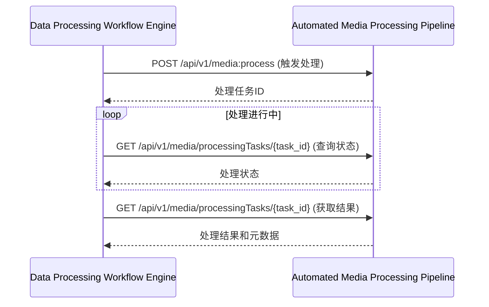
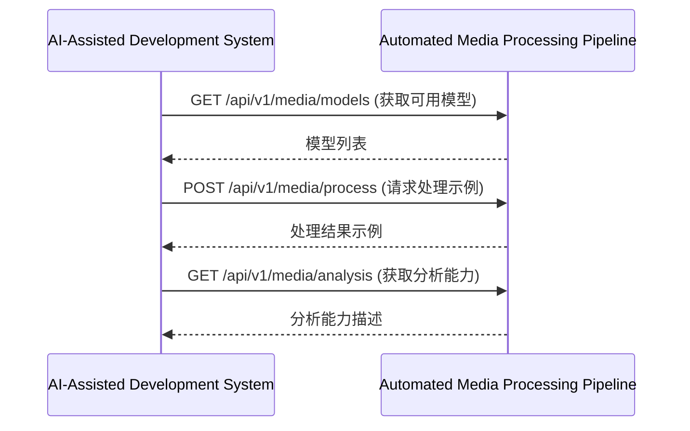
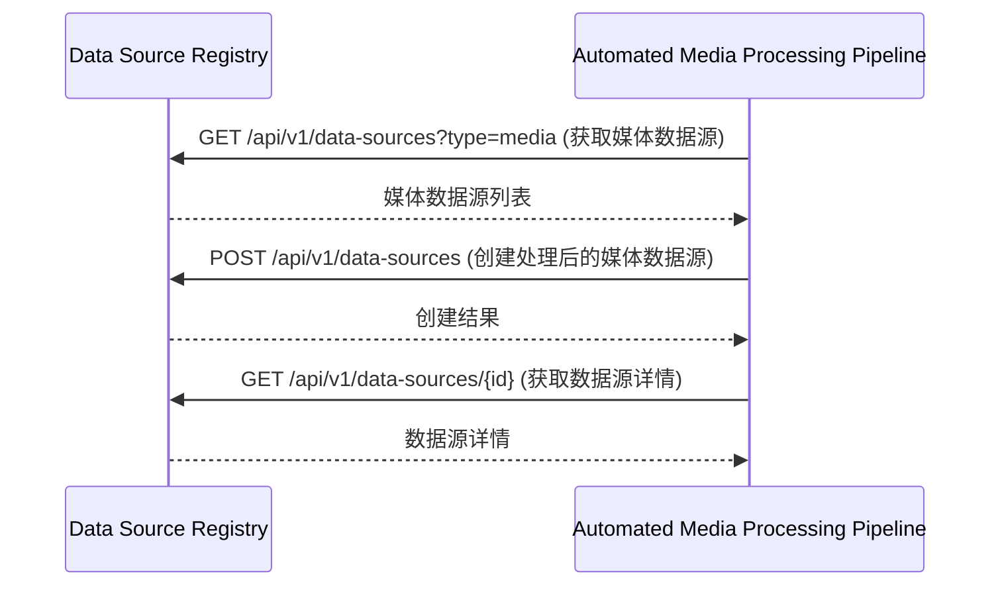

# 镜界平台终极技术规格说明书（模块级深度实现）

## 目录


### 5. 自动化媒体处理管道 (Automated Media Processing Pipeline)
- [5.1 模块概述](#51-模块概述)
- [5.2 详细功能清单](#52-详细功能清单)
  - [5.2.1 核心功能](#521-核心功能)
  - [5.2.2 高级功能](#522-高级功能)
- [5.3 技术架构](#53-技术架构)
  - [5.3.1 架构图](#531-架构图)
  - [5.3.2 服务边界与交互](#532-服务边界与交互)
- [5.4 核心组件详细实现](#54-核心组件详细实现)
  - [5.4.1 文件监控服务](#541-文件监控服务)
  - [5.4.2 媒体处理服务](#542-媒体处理服务)
  - [5.4.3 媒体分析服务](#543-媒体分析服务)
- [5.5 数据模型详细定义](#55-数据模型详细定义)
  - [5.5.1 媒体文件表](#551-媒体文件表)
  - [5.5.2 媒体处理任务表](#552-媒体处理任务表)
  - [5.5.3 媒体标签表](#553-媒体标签表)
  - [5.5.4 媒体相以度表](#554-媒体相以度表)
- [5.6 API详细规范](#56-api详细规范)
  - [5.6.1 媒体处理API](#561-媒体处理api)
- [5.7 性能优化策略](#57-性能优化策略)
  - [5.7.1 媒体处理性能优化](#571-媒体处理性能优化)
- [5.8 安全与合规详细规范](#58-安全与合规详细规范)
- [5.9 与其他模块的交互](#59-与其他模块的交互)
  - [5.9.1 与数据处理工作流引擎交互](#591-与数据处理工作流引擎交互)
  - [5.9.2 与网站指纹分析引擎交互](#592-与网站指纹分析引擎交互)
  - [5.9.3 与数据源注册中心交互](#593-与数据源注册中心交互)

## 5. 自动化媒体处理管道 (Automated Media Processing Pipeline)

### 5.1 模块概述
自动化媒体处理管道是镜界平台的核心数据处理组件，专注于图像和视频等媒体文件的自动化处理。它提供从文件监控、预处理、AI增强到存储归档的完整处理流水线，支持与NAS系统的深度集成。

### 5.2 详细功能清单

#### 5.2.1 核心功能
- **文件监控与触发**
  - 多协议NAS连接（SMB、WebDAV、FTP、NFS）
  - 实时文件系统监控
  - 文件变化事件聚合
  - 增量处理优化
- **预处理阶段**
  - 格式转换与标准化
  - 元数据提取（EXIF、IPTC）
  - 基础修复（去噪、旋转）
  - 文件分块处理
- **AI增强阶段**
  - 画质智能修复（超分辨率、去噪）
  - 自动色彩校正
  - 智能裁剪与构图优化
  - 分辨率增强（超分重建）
  - 面部优化与修饰
- **分析阶段**
  - 图像内容识别与标签
  - 质量评估与评分
  - 相似图片去重
  - 异常检测与过滤
- **组织阶段**
  - AI自动标签分类
  - 相似图片分组
  - 存储空间分析
  - 备份与还原管理
- **归档阶段**
  - 处理后文件自动归档
  - 处理报告生成
  - 结果通知与分享

#### 5.2.2 高级功能
- **智能处理流水线**
  - 基于内容的处理策略
  - 动态调整处理参数
  - 质量-速度权衡
  - 处理优先级管理
- **批量处理任务**
  - 全库批量处理
  - 增量更新处理
  - 条件筛选处理
  - 预览后确认处理
- **风格学习与迁移**
  - 个人风格模型训练
  - 艺术风格迁移
  - 批量风格统一
  - 自定义风格库
- **智能相册管理**
  - 人脸识别与分组
  - 场景自动分类
  - 时间线智能整理
  - 情感标签分析

### 5.3 技术架构

#### 5.3.1 架构图
```
┌───────────────────────────────────────────────────────────────────────────────────────────────┐
│                            自动化媒体处理管道 (AMP)                                           │
├───────────────────────┬───────────────────────┬───────────────────────────────────────────────┤
│  输入层               │  处理层               │  输出层                                    │
├───────────────────────┼───────────────────────┼───────────────────────────────────────────────┤
│ • 文件监控服务        │ • 预处理服务          │ • 存储服务                                 │
│ • 事件接收器          │ • AI增强服务          │ • 通知服务                                 │
│ • 批量任务调度        │ • 内容分析服务        │ • 报告生成器                               │
└───────────────────────┴───────────────────────┴───────────────────────────────────────────────┘
```

#### 5.3.2 服务边界与交互
- **输入**：
  - 文件系统事件（来自NAS监控）
  - 手动触发的处理请求
  - 批量处理任务
- **输出**：
  - 处理后的媒体文件
  - 处理报告
  - 分析结果和元数据
  - 通知事件

### 5.4 核心组件详细实现

#### 5.4.1 文件监控服务

**技术实现：**
```python
import os
import time
import logging
from watchdog.observers import Observer
from watchdog.events import FileSystemEventHandler
from concurrent.futures import ThreadPoolExecutor
from typing import Callable, Dict, List, Optional, Set

class FileEvent:
    """文件系统事件对象"""
    
    CREATE = "create"
    MODIFY = "modify"
    DELETE = "delete"
    MOVE = "move"
    
    def __init__(
        self,
        event_type: str,
        src_path: str,
        dest_path: Optional[str] = None,
        is_directory: bool = False,
        timestamp: float = None
    ):
        self.event_type = event_type
        self.src_path = src_path
        self.dest_path = dest_path
        self.is_directory = is_directory
        self.timestamp = timestamp or time.time()
        self.processed = False
        self.processing_start = None
        self.processing_end = None
        self.error = None
    
    def mark_processed(self, success: bool, error: str = None):
        """标记事件已处理"""
        self.processed = True
        self.processing_end = time.time()
        if not success:
            self.error = error
    
    def to_dict(self) -> Dict:
        """转换为字典格式"""
        return {
            "event_type": self.event_type,
            "src_path": self.src_path,
            "dest_path": self.dest_path,
            "is_directory": self.is_directory,
            "timestamp": self.timestamp,
            "processed": self.processed,
            "processing_time": self.processing_end - self.processing_start if self.processing_start and self.processing_end else None,
            "error": self.error
        }

class DirectoryEventHandler(FileSystemEventHandler):
    """目录事件处理器"""
    
    def __init__(
        self,
        callback: Callable[[FileEvent], None],
        ignored_patterns: List[str] = None,
        process_directories: bool = False
    ):
        super().__init__()
        self.callback = callback
        self.ignored_patterns = ignored_patterns or []
        self.process_directories = process_directories
    
    def _is_ignored(self, path: str) -> bool:
        """检查路径是否应被忽略"""
        return any(pattern in path for pattern in self.ignored_patterns)
    
    def on_created(self, event):
        if self.process_directories or not event.is_directory:
            if not self._is_ignored(event.src_path):
                self.callback(FileEvent(FileEvent.CREATE, event.src_path, is_directory=event.is_directory))
    
    def on_modified(self, event):
        if self.process_directories or not event.is_directory:
            if not self._is_ignored(event.src_path):
                self.callback(FileEvent(FileEvent.MODIFY, event.src_path, is_directory=event.is_directory))
    
    def on_deleted(self, event):
        if self.process_directories or not event.is_directory:
            if not self._is_ignored(event.src_path):
                self.callback(FileEvent(FileEvent.DELETE, event.src_path, is_directory=event.is_directory))
    
    def on_moved(self, event):
        if self.process_directories or not event.is_directory:
            if not self._is_ignored(event.src_path) and not self._is_ignored(event.dest_path):
                self.callback(FileEvent(
                    FileEvent.MOVE, 
                    event.src_path, 
                    event.dest_path,
                    is_directory=event.is_directory
                ))

class FileSystemWatcher:
    """文件系统监控器，支持多目录监控和事件聚合"""
    
    def __init__(
        self,
        paths: List[str],
        event_types: List[str] = None,
        recursive: bool = True,
        debounce_ms: int = 500,
        ignored_patterns: List[str] = None,
        max_workers: int = 4
    ):
        """
        初始化文件系统监控器
        
        :param paths: 要监控的目录路径列表
        :param event_types: 要监听的事件类型 (create, modify, delete, move)
        :param recursive: 是否递归监控子目录
        :param debounce_ms: 事件去抖时间 (毫秒)
        :param ignored_patterns: 忽略的文件模式列表
        :param max_workers: 处理事件的线程池大小
        """
        self.paths = paths
        self.event_types = event_types or [FileEvent.CREATE]
        self.recursive = recursive
        self.debounce_ms = debounce_ms
        self.ignored_patterns = ignored_patterns or [".DS_Store", "Thumbs.db", "~$"]
        self.max_workers = max_workers
        self.observers = []
        self.event_buffer = {}
        self.callback = None
        self.executor = ThreadPoolExecutor(max_workers=max_workers)
        self.logger = logging.getLogger(__name__)
        self.running = False
    
    def start(self, callback: Callable[[FileEvent], None]):
        """启动监控器"""
        if self.running:
            return
        
        self.callback = callback
        self.running = True
        
        # 为每个路径创建观察者
        for path in self.paths:
            if not os.path.exists(path):
                self.logger.warning("Path does not exist: %s", path)
                continue
                
            event_handler = DirectoryEventHandler(
                self._buffer_event,
                ignored_patterns=self.ignored_patterns
            )
            
            observer = Observer()
            observer.schedule(event_handler, path, recursive=self.recursive)
            observer.start()
            self.observers.append(observer)
            
            self.logger.info("Started watching directory: %s (recursive=%s)", path, self.recursive)
        
        # 启动去抖定时器
        self.executor.submit(self._debounce_timer)
    
    def stop(self):
        """停止监控器"""
        self.running = False
        
        # 停止所有观察者
        for observer in self.observers:
            observer.stop()
        
        for observer in self.observers:
            observer.join()
        
        self.observers = []
        
        # 关闭线程池
        self.executor.shutdown(wait=True)
        
        self.logger.info("Stopped file system watcher")
    
    def _buffer_event(self, event: FileEvent):
        """缓冲事件用于去抖"""
        if not self.running:
            return
        
        # 仅处理指定的事件类型
        if event.event_type not in self.event_types:
            return
        
        # 生成唯一键（路径+事件类型）
        key = f"{event.src_path}|{event.event_type}"
        
        # 如果是移动事件，使用目标路径
        if event.event_type == FileEvent.MOVE:
            key = f"{event.dest_path}|{event.event_type}"
        
        # 缓冲事件
        self.event_buffer[key] = {
            "event": event,
            "timestamp": time.time()
        }
    
    def _debounce_timer(self):
        """去抖定时器"""
        while self.running:
            try:
                current_time = time.time()
                events_to_process = []
                
                # 检查缓冲区中的事件
                for key, item in list(self.event_buffer.items()):
                    # 检查是否超过去抖时间
                    if (current_time - item["timestamp"]) * 1000 >= self.debounce_ms:
                        events_to_process.append(item["event"])
                        del self.event_buffer[key]
                
                # 处理事件
                if events_to_process:
                    self._process_events(events_to_process)
                
                # 等待下一次检查
                time.sleep(self.debounce_ms / 1000.0)
                
            except Exception as e:
                self.logger.error("Error in debounce timer: %s", str(e))
                time.sleep(1)
    
    def _process_events(self, events: List[FileEvent]):
        """处理事件列表"""
        for event in events:
            try:
                # 标记处理开始
                event.processing_start = time.time()
                
                # 调用回调
                self.callback(event)
                
                # 标记处理完成
                event.mark_processed(True)
                
            except Exception as e:
                event.mark_processed(False, str(e))
                self.logger.error("Error processing file event: %s", str(e))
    
    def get_status(self) -> Dict:
        """获取监控器状态"""
        return {
            "running": self.running,
            "paths": self.paths,
            "event_types": self.event_types,
            "recursive": self.recursive,
            "debounce_ms": self.debounce_ms,
            "buffered_events": len(self.event_buffer),
            "observers": len(self.observers)
        }

class NasConnectionManager:
    """NAS连接管理器，支持多协议"""
    
    def __init__(self, config: Dict):
        self.config = config
        self.connections = {}
        self.logger = logging.getLogger(__name__)
    
    def connect(self, connection_id: str, config: Dict) -> str:
        """
        创建NAS连接
        
        :param connection_id: 连接ID
        :param config: 连接配置
        :return: 连接ID
        """
        # 验证配置
        self._validate_config(config)
        
        # 创建连接
        if config["protocol"] == "smb":
            connection = self._create_smb_connection(config)
        elif config["protocol"] == "webdav":
            connection = self._create_webdav_connection(config)
        elif config["protocol"] == "ftp":
            connection = self._create_ftp_connection(config)
        elif config["protocol"] == "nfs":
            connection = self._create_nfs_connection(config)
        else:
            raise ValueError(f"Unsupported protocol: {config['protocol']}")
        
        # 保存连接
        self.connections[connection_id] = connection
        
        return connection_id
    
    def _validate_config(self, config: Dict):
        """验证连接配置"""
        required_fields = ["protocol", "host", "path"]
        for field in required_fields:
            if field not in config:
                raise ValueError(f"Missing required field: {field}")
        
        if config["protocol"] == "smb":
            if "username" not in config or "password" not in config:
                raise ValueError("SMB connection requires username and password")
        
        # 其他协议验证...
    
    def _create_smb_connection(self, config: Dict) -> Any:
        """创建SMB连接"""
        from smbprotocol.connection import Connection
        from smbprotocol.session import Session
        from smbprotocol.tree import TreeConnect
        
        connection = Connection(uuid.uuid4(), config["host"], port=445)
        connection.connect()
        
        session = Session(connection, config["username"], config["password"])
        session.connect()
        
        tree = TreeConnect(session, f"\\\\{config['host']}\\{config['share']}")
        tree.connect()
        
        return {
            "connection": connection,
            "session": session,
            "tree": tree,
            "config": config
        }
    
    def _create_webdav_connection(self, config: Dict) -> Any:
        """创建WebDAV连接"""
        from webdav3.client import Client
        
        options = {
            'webdav_hostname': config["host"],
            'webdav_login': config.get("username"),
            'webdav_password': config.get("password"),
            'webdav_root': config["path"]
        }
        
        client = Client(options)
        return {
            "client": client,
            "config": config
        }
    
    def _create_ftp_connection(self, config: Dict) -> Any:
        """创建FTP连接"""
        from ftplib import FTP
        
        ftp = FTP(config["host"])
        ftp.login(user=config.get("username"), passwd=config.get("password"))
        ftp.cwd(config["path"])
        
        return {
            "ftp": ftp,
            "config": config
        }
    
    def _create_nfs_connection(self, config: Dict) -> Any:
        """创建NFS连接"""
        # NFS通常通过挂载点访问，这里假设已挂载
        return {
            "mount_point": config["mount_point"],
            "config": config
        }
    
    def list_files(self, connection_id: str, path: str = "/") -> List[Dict]:
        """
        列出文件
        
        :param connection_id: 连接ID
        :param path: 路径
        :return: 文件列表
        """
        connection = self._get_connection(connection_id)
        
        if connection["config"]["protocol"] == "smb":
            return self._list_files_smb(connection, path)
        elif connection["config"]["protocol"] == "webdav":
            return self._list_files_webdav(connection, path)
        elif connection["config"]["protocol"] == "ftp":
            return self._list_files_ftp(connection, path)
        elif connection["config"]["protocol"] == "nfs":
            return self._list_files_nfs(connection, path)
        
        raise ValueError("Unsupported protocol")
    
    def _list_files_smb(self, connection: Dict, path: str) -> List[Dict]:
        """列出SMB文件"""
        from smbprotocol.open import Open, CreateOptions, FilePipePrinterAccessMask
        
        # SMB协议比较复杂，这里简化实现
        # 实际实现需要处理目录枚举
        return []
    
    def _list_files_webdav(self, connection: Dict, path: str) -> List[Dict]:
        """列出WebDAV文件"""
        client = connection["client"]
        files = client.list(path)
        
        result = []
        for file in files:
            info = client.info(f"{path}/{file}")
            result.append({
                "name": file,
                "path": f"{path}/{file}",
                "is_directory": info["is_dir"],
                "size": info["size"],
                "modified": info["modified"]
            })
        
        return result
    
    def _list_files_ftp(self, connection: Dict, path: str) -> List[Dict]:
        """列出FTP文件"""
        ftp = connection["ftp"]
        ftp.cwd(path)
        
        files = []
        ftp.retrlines('LIST', files.append)
        
        result = []
        for line in files:
            # 解析FTP LIST输出
            parts = line.split()
            if len(parts) >= 9:
                name = ' '.join(parts[8:])
                is_dir = line.startswith('d')
                size = int(parts[4]) if not is_dir else 0
                modified = ' '.join(parts[5:8])
                
                result.append({
                    "name": name,
                    "path": f"{path}/{name}",
                    "is_directory": is_dir,
                    "size": size,
                    "modified": modified
                })
        
        return result
    
    def _list_files_nfs(self, connection: Dict, path: str) -> List[Dict]:
        """列出NFS文件"""
        mount_point = connection["mount_point"]
        full_path = os.path.join(mount_point, path.lstrip('/'))
        
        result = []
        for name in os.listdir(full_path):
            file_path = os.path.join(full_path, name)
            is_dir = os.path.isdir(file_path)
            size = os.path.getsize(file_path) if not is_dir else 0
            modified = os.path.getmtime(file_path)
            
            result.append({
                "name": name,
                "path": f"{path}/{name}",
                "is_directory": is_dir,
                "size": size,
                "modified": time.ctime(modified)
            })
        
        return result
    
    def watch_directory(
        self,
        connection_id: str,
        path: str,
        callback: Callable[[FileEvent], None],
        event_types: List[str] = None,
        recursive: bool = True,
        debounce_ms: int = 500
    ) -> str:
        """
        监控目录
        
        :param connection_id: 连接ID
        :param path: 路径
        :param callback: 回调函数
        :param event_types: 事件类型
        :param recursive: 是否递归
        :param debounce_ms: 去抖时间
        :return: 监控器ID
        """
        connection = self._get_connection(connection_id)
        config = connection["config"]
        
        # 对于NFS和本地挂载，可以直接使用FileSystemWatcher
        if config["protocol"] in ["nfs", "local"]:
            mount_point = connection.get("mount_point", config.get("mount_point", "/"))
            full_path = os.path.join(mount_point, path.lstrip('/'))
            
            watcher = FileSystemWatcher(
                paths=[full_path],
                event_types=event_types,
                recursive=recursive,
                debounce_ms=debounce_ms
            )
            watcher.start(callback)
            
            watcher_id = f"watcher-{uuid.uuid4().hex[:8]}"
            self.watchers[watcher_id] = watcher
            return watcher_id
        
        # 对于其他协议，需要轮询（简化实现）
        if config["protocol"] == "smb":
            return self._watch_smb_directory(connection, path, callback, event_types, recursive, debounce_ms)
        elif config["protocol"] == "webdav":
            return self._watch_webdav_directory(connection, path, callback, event_types, recursive, debounce_ms)
        elif config["protocol"] == "ftp":
            return self._watch_ftp_directory(connection, path, callback, event_types, recursive, debounce_ms)
        
        raise ValueError("Unsupported protocol for directory watching")
    
    def _get_connection(self, connection_id: str) -> Dict:
        """获取连接"""
        if connection_id not in self.connections:
            raise ValueError(f"Connection {connection_id} not found")
        return self.connections[connection_id]
```

#### 5.4.2 媒体处理服务

**技术实现：**
```python
import cv2
import numpy as np
import torch
from basicsr.archs.rrdbnet_arch import RRDBNet
from realesrgan import RealESRGANer
from gfpgan import GFPGANer
from PIL import Image
import exifread
import piexif
from typing import Tuple, Optional, Dict, Any, List
import logging
import os
import tempfile
import hashlib

class MediaProcessingService:
    """媒体处理服务，协调整个处理流水线"""
    
    def __init__(
        self,
        preprocessor: MediaPreprocessor,
        enhancer: MediaEnhancer,
        analyzer: MediaAnalyzer,
        config: Config
    ):
        self.preprocessor = preprocessor
        self.enhancer = enhancer
        self.analyzer = analyzer
        self.config = config
        self.logger = logging.getLogger(__name__)
    
    def process_media(
        self,
        file_path: str,
        workflow: ProcessingWorkflow,
        callback: Optional[Callable[[ProcessingStatus], None]] = None
    ) -> ProcessingResult:
        """
        处理媒体文件
        
        :param file_path: 文件路径
        :param workflow: 处理工作流
        :param callback: 状态回调函数
        :return: 处理结果
        """
        start_time = time.time()
        status = ProcessingStatus(
            file_path=file_path,
            workflow_id=workflow.id,
            status="processing",
            progress=0.0
        )
        
        try:
            # 1. 更新状态：开始预处理
            status.step = "preprocessing"
            status.progress = 0.1
            self._notify_callback(callback, status)
            
            # 2. 预处理
            preprocessed_path, preprocessed_meta = self.preprocessor.preprocess(
                file_path,
                workflow.preprocessing
            )
            
            # 3. 更新状态：开始AI增强
            status.step = "enhancing"
            status.progress = 0.3
            self._notify_callback(callback, status)
            
            # 4. AI增强
            enhanced_path, enhancement_meta = self.enhancer.enhance(
                preprocessed_path,
                workflow.enhancement
            )
            
            # 5. 更新状态：开始分析
            status.step = "analyzing"
            status.progress = 0.7
            self._notify_callback(callback, status)
            
            # 6. 分析
            analysis_result = self.analyzer.analyze(
                enhanced_path,
                workflow.analysis
            )
            
            # 7. 更新状态：开始组织
            status.step = "organizing"
            status.progress = 0.9
            self._notify_callback(callback, status)
            
            # 8. 组织（分类、归档等）
            organized_path = self._organize_result(
                enhanced_path,
                analysis_result,
                workflow.organization
            )
            
            # 9. 生成处理报告
            report = self._generate_report(
                file_path,
                preprocessed_meta,
                enhancement_meta,
                analysis_result,
                time.time() - start_time
            )
            
            # 10. 返回结果
            status.status = "completed"
            status.progress = 1.0
            status.result = {
                "processed_path": organized_path,
                "report": report,
                "analysis": analysis_result
            }
            self._notify_callback(callback, status)
            
            return ProcessingResult(
                processed_path=organized_path,
                report=report,
                analysis=analysis_result,
                processing_time=time.time() - start_time
            )
            
        except Exception as e:
            # 处理错误
            status.status = "failed"
            status.error = str(e)
            self._notify_callback(callback, status)
            raise
    
    def _notify_callback(
        self,
        callback: Optional[Callable[[ProcessingStatus], None]],
        status: ProcessingStatus
    ):
        """通知状态回调"""
        if callback:
            try:
                callback(status)
            except Exception as e:
                self.logger.error("Error in status callback: %s", str(e))
    
    def _organize_result(
        self,
        file_path: str,
        analysis: Dict,
        organization_config: Dict
    ) -> str:
        """组织处理结果"""
        # 根据分析结果生成目标路径
        if organization_config.get("path_template"):
            target_path = self._apply_path_template(
                organization_config["path_template"],
                file_path,
                analysis
            )
        else:
            # 默认路径
            target_path = os.path.join(
                os.path.dirname(file_path),
                "processed",
                os.path.basename(file_path)
            )
        
        # 确保目录存在
        os.makedirs(os.path.dirname(target_path), exist_ok=True)
        
        # 移动文件
        shutil.move(file_path, target_path)
        
        return target_path
    
    def _apply_path_template(
        self,
        template: str,
        source_path: str,
        analysis: Dict
    ) -> str:
        """应用路径模板"""
        # 获取文件信息
        file_name = os.path.basename(source_path)
        file_ext = os.path.splitext(file_name)[1]
        dir_name = os.path.dirname(source_path)
        
        # 获取日期信息
        current_date = datetime.now()
        date_info = {
            "year": current_date.year,
            "month": current_date.month,
            "day": current_date.day,
            "hour": current_date.hour,
            "minute": current_date.minute
        }
        
        # 获取分析信息
        analysis_info = {
            "quality": analysis.get("quality", {}).get("score", 0),
            "tags": ",".join(analysis.get("tags", [])),
            "face_count": len(analysis.get("faces", []))
        }
        
        # 替换模板变量
        def replace_var(match):
            var = match.group(1)
            
            # 日期变量
            if var in date_info:
                return str(date_info[var])
            
            # 分析变量
            if var in analysis_info:
                return str(analysis_info[var])
            
            # 文件变量
            if var == "filename":
                return file_name
            if var == "basename":
                return os.path.splitext(file_name)[0]
            if var == "ext":
                return file_ext[1:] if file_ext else ""
            if var == "dir":
                return os.path.basename(dir_name)
            
            return match.group(0)
        
        return re.sub(r'{(\w+)}', replace_var, template)
    
    def _generate_report(
        self,
        source_path: str,
        preprocessed_meta: Dict,
        enhancement_meta: Dict,
        analysis_result: Dict,
        processing_time: float
    ) -> Dict:
        """生成处理报告"""
        return {
            "source_file": source_path,
            "processing_time": processing_time,
            "preprocessing": preprocessed_meta,
            "enhancement": enhancement_meta,
            "analysis": analysis_result,
            "timestamp": datetime.utcnow().isoformat()
        }

class MediaPreprocessor:
    """媒体预处理器，执行基础预处理任务"""
    
    def __init__(self, config: Config):
        self.config = config
        self.logger = logging.getLogger(__name__)
    
    def preprocess(
        self,
        file_path: str,
        config: Dict
    ) -> Tuple[str, Dict]:
        """
        预处理媒体文件
        
        :param file_path: 文件路径
        :param config: 预处理配置
        :return: (处理后的文件路径, 元理元数据)
        """
        # 1. 读取文件
        image = self._read_image(file_path)
        
        # 2. 获取EXIF信息
        exif_data = self._extract_exif(file_path)
        
        # 3. 应用预处理步骤
        preprocessed, meta = self._apply_preprocessing_steps(image, exif_data, config)
        
        # 4. 保存处理后的文件
        output_path = self._save_image(preprocessed, file_path, config)
        
        return output_path, meta
    
    def _read_image(self, file_path: str) -> np.ndarray:
        """读取图像文件"""
        image = cv2.imread(file_path)
        if image is None:
            raise ValueError(f"Failed to read image: {file_path}")
        
        # 转换为RGB（OpenCV默认是BGR）
        return cv2.cvtColor(image, cv2.COLOR_BGR2RGB)
    
    def _extract_exif(self, file_path: str) -> Dict:
        """提取EXIF信息"""
        try:
            with open(file_path, 'rb') as f:
                exif = exifread.process_file(f)
                return {str(k): str(v) for k, v in exif.items()}
        except Exception as e:
            self.logger.warning("Error extracting EXIF: %s", str(e))
            return {}
    
    def _apply_preprocessing_steps(
        self,
        image: np.ndarray,
        exif_data: Dict,
        config: Dict
    ) -> Tuple[np.ndarray, Dict]:
        """应用预处理步骤"""
        meta = {
            "original_size": (image.shape[1], image.shape[0]),
            "steps": []
        }
        
        # 1. 自动旋转（如果需要）
        if config.get("auto_rotate", True):
            rotated, rotation_meta = self._auto_rotate(image, exif_data)
            image = rotated
            meta["steps"].append({
                "step": "auto_rotate",
                "meta": rotation_meta
            })
        
        # 2. 格式转换
        if "format" in config:
            converted, format_meta = self._convert_format(image, config["format"])
            image = converted
            meta["steps"].append({
                "step": "format_conversion",
                "meta": format_meta
            })
        
        # 3. 尺寸调整
        if "max_size" in config:
            resized, resize_meta = self._resize_image(image, config["max_size"])
            image = resized
            meta["steps"].append({
                "step": "resize",
                "meta": resize_meta
            })
        
        # 4. 基础修复
        if config.get("basic_repair", True):
            repaired, repair_meta = self._basic_repair(image)
            image = repaired
            meta["steps"].append({
                "step": "basic_repair",
                "meta": repair_meta
            })
        
        return image, meta
    
    def _auto_rotate(
        self,
        image: np.ndarray,
        exif_data: Dict
    ) -> Tuple[np.ndarray, Dict]:
        """自动旋转图像"""
        orientation = exif_data.get('Image Orientation')
        
        if not orientation:
            return image, {"rotation": 0}
        
        try:
            orientation = int(orientation)
            if orientation == 1:
                # 正常方向，无需旋转
                return image, {"rotation": 0}
            elif orientation == 6:
                # 顺时针90度
                rotated = cv2.rotate(image, cv2.ROTATE_90_CLOCKWISE)
                return rotated, {"rotation": 90}
            elif orientation == 8:
                # 逆时针90度
                rotated = cv2.rotate(image, cv2.ROTATE_90_COUNTERCLOCKWISE)
                return rotated, {"rotation": -90}
            elif orientation == 3:
                # 180度
                rotated = cv2.rotate(image, cv2.ROTATE_180)
                return rotated, {"rotation": 180}
            else:
                return image, {"rotation": 0, "warning": f"Unsupported orientation: {orientation}"}
        except Exception as e:
            return image, {"rotation": 0, "error": str(e)}
    
    def _convert_format(
        self,
        image: np.ndarray,
        target_format: str
    ) -> Tuple[np.ndarray, Dict]:
        """转换图像格式"""
        # 这里简化实现，实际应该根据目标格式进行转换
        return image, {"format": target_format}
    
    def _resize_image(
        self,
        image: np.ndarray,
        max_size: str
    ) -> Tuple[np.ndarray, Dict]:
        """调整图像大小"""
        # 解析最大尺寸
        width_str, height_str = max_size.split('x')
        max_width = int(width_str)
        max_height = int(height_str)
        
        # 获取当前尺寸
        current_height, current_width = image.shape[:2]
        
        # 计算缩放比例
        scale = min(max_width / current_width, max_height / current_height, 1.0)
        
        # 如果不需要缩放，返回原图
        if scale >= 1.0:
            return image, {
                "original_width": current_width,
                "original_height": current_height,
                "resized": False
            }
        
        # 计算新尺寸
        new_width = int(current_width * scale)
        new_height = int(current_height * scale)
        
        # 调整大小
        resized = cv2.resize(
            image,
            (new_width, new_height),
            interpolation=cv2.INTER_AREA
        )
        
        return resized, {
            "original_width": current_width,
            "original_height": current_height,
            "resized_width": new_width,
            "resized_height": new_height,
            "scale": scale,
            "resized": True
        }
    
    def _basic_repair(self, image: np.ndarray) -> Tuple[np.ndarray, Dict]:
        """基础修复（去噪等）"""
        # 应用非局部均值去噪
        denoised = cv2.fastNlMeansDenoisingColored(
            image,
            None,
            h=10,
            hColor=10,
            templateWindowSize=7,
            searchWindowSize=21
        )
        
        return denoised, {
            "denoising": True,
            "parameters": {
                "h": 10,
                "hColor": 10
            }
        }
    
    def _save_image(
        self,
        image: np.ndarray,
        source_path: str,
        config: Dict
    ) -> str:
        """保存处理后的图像"""
        # 生成临时文件路径
        temp_dir = self.config.temp_dir or tempfile.gettempdir()
        file_name = os.path.basename(source_path)
        output_path = os.path.join(temp_dir, f"preprocessed_{file_name}")
        
        # 转换回BGR（OpenCV格式）
        bgr_image = cv2.cvtColor(image, cv2.COLOR_RGB2BGR)
        
        # 保存图像
        cv2.imwrite(output_path, bgr_image)
        
        return output_path

class MediaEnhancer:
    """媒体增强器，执行AI增强任务"""
    
    def __init__(
        self,
        model_registry: ModelRegistry,
        config: Config
    ):
        self.model_registry = model_registry
        self.config = config
        self.logger = logging.getLogger(__name__)
    
    def enhance(
        self,
        file_path: str,
        config: Dict
    ) -> Tuple[str, Dict]:
        """
        增强媒体文件
        
        :param file_path: 文件路径
        :param config: 增强配置
        :return: (增强后的文件路径, 增强元数据)
        """
        # 1. 加载图像
        image = self._load_image(file_path)
        
        # 2. 应用增强步骤
        enhanced, meta = self._apply_enhancement_steps(image, config)
        
        # 3. 保存增强后的文件
        output_path = self._save_image(enhanced, file_path, config)
        
        return output_path, meta
    
    def _load_image(self, file_path: str) -> np.ndarray:
        """加载图像"""
        image = cv2.imread(file_path)
        if image is None:
            raise ValueError(f"Failed to read image: {file_path}")
        return cv2.cvtColor(image, cv2.COLOR_BGR2RGB)
    
    def _apply_enhancement_steps(
        self,
        image: np.ndarray,
        config: Dict
    ) -> Tuple[np.ndarray, Dict]:
        """应用增强步骤"""
        meta = {
            "original_size": (image.shape[1], image.shape[0]),
            "steps": []
        }
        
        # 1. 超分辨率
        if config.get("scale_factor", 1) > 1:
            enhanced, sr_meta = self._super_resolution(image, config)
            image = enhanced
            meta["steps"].append({
                "step": "super_resolution",
                "meta": sr_meta
            })
        
        # 2. 色彩校正
        if config.get("color_correction", True):
            corrected, color_meta = self._color_correction(image)
            image = corrected
            meta["steps"].append({
                "step": "color_correction",
                "meta": color_meta
            })
        
        # 3. 智能裁剪
        if config.get("smart_crop", True):
            cropped, crop_meta = self._smart_crop(image, config)
            image = cropped
            meta["steps"].append({
                "step": "smart_crop",
                "meta": crop_meta
            })
        
        # 4. 面部增强（如果启用且检测到人脸）
        if config.get("face_enhance", False):
            enhanced, face_meta = self._face_enhancement(image)
            image = enhanced
            meta["steps"].append({
                "step": "face_enhancement",
                "meta": face_meta
            })
        
        return image, meta
    
    def _super_resolution(
        self,
        image: np.ndarray,
        config: Dict
    ) -> Tuple[np.ndarray, Dict]:
        """超分辨率处理"""
        # 获取模型
        model_name = config.get("model", "realesrgan-x4plus")
        model = self.model_registry.get_model(model_name)
        
        # 执行超分辨率
        try:
            # 将图像转换为Bytes
            _, buffer = cv2.imencode('.png', cv2.cvtColor(image, cv2.COLOR_RGB2BGR))
            image_bytes = buffer.tobytes()
            
            # 调用模型服务
            enhanced_bytes = model.process(image_bytes)
            
            # 转换回图像
            nparr = np.frombuffer(enhanced_bytes, np.uint8)
            enhanced = cv2.imdecode(nparr, cv2.IMREAD_COLOR)
            enhanced = cv2.cvtColor(enhanced, cv2.COLOR_BGR2RGB)
            
            return enhanced, {
                "model": model_name,
                "scale_factor": config.get("scale_factor", 2),
                "success": True
            }
            
        except Exception as e:
            self.logger.error("Super resolution failed: %s", str(e))
            return image, {
                "model": model_name,
                "error": str(e),
                "success": False
            }
    
    def _color_correction(self, image: np.ndarray) -> Tuple[np.ndarray, Dict]:
        """色彩校正"""
        # 简单实现：自动对比度和亮度调整
        lab = cv2.cvtColor(image, cv2.COLOR_RGB2LAB)
        l, a, b = cv2.split(lab)
        
        # 应用CLAHE（对比度受限的自适应直方图均衡化）
        clahe = cv2.createCLAHE(clipLimit=3.0, tileGridSize=(8, 8))
        cl = clahe.apply(l)
        
        # 合并通道
        corrected_lab = cv2.merge((cl, a, b))
        corrected = cv2.cvtColor(corrected_lab, cv2.COLOR_LAB2RGB)
        
        return corrected, {
            "method": "clahe",
            "clip_limit": 3.0,
            "tile_grid_size": (8, 8)
        }
    
    def _smart_crop(
        self,
        image: np.ndarray,
        config: Dict
    ) -> Tuple[np.ndarray, Dict]:
        """智能裁剪"""
        # 简单实现：基于内容感知的裁剪
        # 实际应用中应该使用更复杂的算法
        
        # 获取目标宽高比
        aspect_ratio = config.get("aspect_ratio", "original")
        if aspect_ratio == "original":
            return image, {"cropped": False}
        
        try:
            # 解析宽高比
            width_ratio, height_ratio = map(float, aspect_ratio.split(':'))
            target_ratio = width_ratio / height_ratio
            
            # 获取当前尺寸
            height, width = image.shape[:2]
            current_ratio = width / height
            
            # 计算裁剪区域
            if current_ratio > target_ratio:
                # 宽度过宽，裁剪宽度
                new_width = int(height * target_ratio)
                start_x = (width - new_width) // 2
                cropped = image[:, start_x:start_x + new_width, :]
            else:
                # 高度过高，裁剪高度
                new_height = int(width / target_ratio)
                start_y = (height - new_height) // 2
                cropped = image[start_y:start_y + new_height, :, :]
            
            return cropped, {
                "original_width": width,
                "original_height": height,
                "cropped_width": cropped.shape[1],
                "cropped_height": cropped.shape[0],
                "cropped": True
            }
            
        except Exception as e:
            self.logger.error("Smart crop failed: %s", str(e))
            return image, {
                "error": str(e),
                "cropped": False
            }
    
    def _face_enhancement(self, image: np.ndarray) -> Tuple[np.ndarray, Dict]:
        """面部增强"""
        # 这里简化实现，实际应该调用专门的面部增强模型
        return image, {"enhanced": False, "message": "Face enhancement not implemented"}
    
    def _save_image(
        self,
        image: np.ndarray,
        source_path: str,
        config: Dict
    ) -> str:
        """保存增强后的图像"""
        # 生成临时文件路径
        temp_dir = self.config.temp_dir or tempfile.gettempdir()
        file_name = os.path.basename(source_path)
        output_path = os.path.join(temp_dir, f"enhanced_{file_name}")
        
        # 转换回BGR（OpenCV格式）
        bgr_image = cv2.cvtColor(image, cv2.COLOR_RGB2BGR)
        
        # 保存图像
        cv2.imwrite(output_path, bgr_image)
        
        return output_path

class MediaAnalyzer:
    """媒体分析器，执行内容分析任务"""
    
    def __init__(
        self,
        tagger: MediaTagger,
        quality_analyzer: QualityAnalyzer,
        face_detector: FaceDetector,
        config: Config
    ):
        self.tagger = tagger
        self.quality_analyzer = quality_analyzer
        self.face_detector = face_detector
        self.config = config
        self.logger = logging.getLogger(__name__)
    
    def analyze(
        self,
        file_path: str,
        config: Dict
    ) -> Dict:
        """
        分析媒体文件
        
        :param file_path: 文件路径
        :param config: 分析配置
        :return: 分析结果
        """
        results = {
            "timestamp": datetime.utcnow().isoformat()
        }
        
        # 1. 标签分析
        if "tags" in config.get("tasks", []):
            results["tags"] = self.tagger.generate_tags(file_path)
        
        # 2. 质量分析
        if "quality-assessment" in config.get("tasks", []):
            results["quality"] = self.quality_analyzer.assess(file_path)
        
        # 3. 人脸分析
        if "face-detection" in config.get("tasks", []):
            results["faces"] = self.face_detector.detect(file_path)
        
        # 4. 相似图片检测
        if "duplicate-detection" in config.get("tasks", []):
            results["duplicates"] = self._detect_duplicates(file_path)
        
        return results
    
    def _detect_duplicates(self, file_path: str) -> List[Dict]:
        """检测相似图片"""
        # 简单实现：基于感知哈希
        try:
            # 计算当前图片的哈希
            current_hash = self._calculate_image_hash(file_path)
            
            # 获取数据库中所有图片
            all_images = self._get_all_images()
            
            # 计算相似度
            duplicates = []
            for image in all_images:
                similarity = self._calculate_similarity(current_hash, image["hash"])
                if similarity > 0.85:  # 相似度阈值
                    duplicates.append({
                        "image_id": image["id"],
                        "path": image["path"],
                        "similarity": similarity
                    })
            
            return duplicates
            
        except Exception as e:
            self.logger.error("Duplicate detection failed: %s", str(e))
            return []
    
    def _calculate_image_hash(self, file_path: str) -> str:
        """计算图像感知哈希"""
        img = Image.open(file_path)
        img = img.convert('L').resize((64, 64), Image.LANCZOS)
        hash = imagehash.phash(img)
        return str(hash)
    
    def _get_all_images(self) -> List[Dict]:
        """获取所有图片（简化实现）"""
        # 这里应该从数据库获取
        return []
    
    def _calculate_similarity(self, hash1: str, hash2: str) -> float:
        """计算两个哈希的相似度"""
        h1 = imagehash.hex_to_hash(hash1)
        h2 = imagehash.hex_to_hash(hash2)
        return 1 - (h1 - h2) / len(h1.hash) ** 2

class ModelRegistry:
    """模型注册表，管理可用的AI模型"""
    
    def __init__(self, config: Config):
        self.config = config
        self.models = {}
        self.logger = logging.getLogger(__name__)
        self._load_models()
    
    def _load_models(self):
        """加载模型配置"""
        # 从配置加载模型
        for model_config in self.config.models:
            try:
                model = self._create_model(model_config)
                self.models[model_config["id"]] = model
                self.logger.info("Loaded model: %s", model_config["id"])
            except Exception as e:
                self.logger.error("Failed to load model %s: %s", model_config["id"], str(e))
    
    def _create_model(self, config: Dict) -> Any:
        """创建模型实例"""
        if config["type"] == "super-resolution":
            return SuperResolutionModel(config)
        elif config["type"] == "face-enhancement":
            return FaceEnhancementModel(config)
        # 其他模型类型...
        else:
            raise ValueError(f"Unsupported model type: {config['type']}")
    
    def get_model(self, model_id: str) -> Any:
        """获取模型"""
        if model_id not in self.models:
            raise ValueError(f"Model {model_id} not found")
        return self.models[model_id]

class SuperResolutionModel:
    """超分辨率模型封装"""
    
    def __init__(self, config: Dict):
        self.config = config
        self.logger = logging.getLogger(__name__)
        self.model = self._load_model()
    
    def _load_model(self):
        """加载模型"""
        # 根据配置加载适当的模型
        if self.config["name"] == "realesrgan-x4plus":
            from realesrgan import RealESRGANer
            return RealESRGANer(
                scale=self.config["scale"],
                model_path=self.config["model_path"],
                tile=self.config.get("tile", 0),
                tile_pad=self.config.get("tile_pad", 10),
                pre_pad=self.config.get("pre_pad", 0),
                half=self.config.get("half", True)
            )
        # 具他模型...
        else:
            raise ValueError(f"Unsupported model: {self.config['name']}")
    
    def process(self, image_bytes: bytes) -> bytes:
        """处理图像"""
        # 将码图像
        nparr = np.frombuffer(image_bytes, np.uint8)
        img = cv2.imdecode(nparr, cv2.IMREAD_COLOR)
        
        # 执行超分辨率
        try:
            output, _ = self.model.enhance(img, outscale=self.config["scale"])
        except RuntimeError as e:
            if 'CUDA out of memory' in str(e):
                # 尝试减少分块大小
                self.model.tile = max(200, self.model.tile - 200)
                output, _ = self.model.enhance(img, outscale=self.config["scale"])
            else:
                raise
        
        # 编码结果
        _, buffer = cv2.imencode('.png', output)
        return buffer.tobytes()

# 辅助类定义
class ProcessingWorkflow:
    """处理工作流定义"""
    def __init__(
        self,
        id: str,
        preprocessing: Dict,
        enhancement: Dict,
        analysis: Dict,
        organization: Dict
    ):
        self.id = id
        self.preprocessing = preprocessing
        self.enhancement = enhancement
        self.analysis = analysis
        self.organization = organization

class ProcessingStatus:
    """处理状态"""
    def __init__(
        self,
        file_path: str,
        workflow_id: str,
        status: str,
        step: Optional[str] = None,
        progress: float = 0.0,
        error: Optional[str] = None,
        result: Optional[Dict] = None
    ):
        self.file_path = file_path
        self.workflow_id = workflow_id
        self.status = status
        self.step = step
        self.progress = progress
        self.error = error
        self.result = result
        self.timestamp = datetime.utcnow().isoformat()

class ProcessingResult:
    """处理结果"""
    def __init__(
        self,
        processed_path: str,
        report: Dict,
        analysis: Dict,
        processing_time: float
    ):
        self.processed_path = processed_path
        self.report = report
        self.analysis = analysis
        self.processing_time = processing_time
```

#### 5.4.3 媒体分析服务

**技术实现：**
```python
import cv2
import numpy as np
import torch
import clip
from PIL import Image
import face_recognition
from typing import List, Dict, Tuple, Optional
import logging
import os
import hashlib
from sklearn.cluster import KMeans
from sklearn.decomposition import PCA
from sklearn.preprocessing import StandardScaler
import faiss
import pickle

class MediaTagger:
    """媒体标签生成器，基于CLIP模型"""
    
    def __init__(
        self,
        clip_model_name: str = "ViT-B/32",
        face_detection_model: str = "retinaface_resnet50",
        config: Config = None
    ):
        self.logger = logging.getLogger(__name__)
        self.config = config or Config()
        
        # 加载CLIP模型
        self.logger.info("Loading CLIP model: %s", clip_model_name)
        self.clip_model, self.clip_preprocess = clip.load(clip_model_name, device="cuda" if torch.cuda.is_available() else "cpu")
        self.clip_model.eval()
        
        # 加载人脸检测模型
        self.logger.info("Loading face detection model: %s", face_detection_model)
        self.face_detector = self._load_face_detector(face_detection_model)
        
        # 预定义的标签候选
        self.candidate_tags = self.config.get("candidate_tags", [
            "portrait", "landscape", "architecture", "food", "animal", 
            "vehicle", "nature", "people", "event", "product",
            "indoor", "outdoor", "sunset", "night", "daytime",
            "close-up", "macro", "aerial", "black and white", "color"
        ])
    
    def _load_face_detector(self, model_name: str):
        """加载人脸检测模型"""
        if model_name == "retinaface_resnet50":
            from retinaface import RetinaFace
            return RetinaFace
        elif model_name == "mtcnn":
            from mtcnn import MTCNN
            return MTCNN()
        else:
            raise ValueError(f"Unsupported face detection model: {model_name}")
    
    def generate_tags(self, image_path: str) -> List[Dict]:
        """
        生成图像标签
        
        :param image_path: 图像路径
        :return: 标签列表
        """
        # 1. 加载并预处理图像
        try:
            image = self.clip_preprocess(Image.open(image_path)).unsqueeze(0).to(next(self.clip_model.parameters()).device)
        except Exception as e:
            self.logger.error("Error loading image %s: %s", image_path, str(e))
            return []
        
        # 2. 计算图像特征
        with torch.no_grad():
            image_features = self.clip_model.encode_image(image)
            image_features = image_features / image_features.norm(dim=-1, keepdim=True)
        
        # 3. 计算与候选标签的相似度
        text_inputs = torch.cat([clip.tokenize(f"a photo of {c}") for c in self.candidate_tags]).to(next(self.clip_model.parameters()).device)
        
        with torch.no_grad():
            text_features = self.clip_model.encode_text(text_inputs)
            text_features = text_features / text_features.norm(dim=-1, keepdim=True)
            
            # 计算相似度
            similarity = (image_features @ text_features.T).cpu().numpy()[0]
        
        # 4. 选择前N个标签
        top_indices = np.argsort(similarity)[::-1][:self.config.get("max_tags", 5)]
        tags = []
        for idx in top_indices:
            if similarity[idx] > self.config.get("tag_threshold", 0.2):  # 阈值
                tags.append({
                    "tag": self.candidate_tags[idx],
                    "confidence": float(similarity[idx])
                })
        
        # 5. 检测人脸并添加相关标签
        face_tags = self._detect_faces(image_path)
        tags.extend(face_tags)
        
        return tags
    
    def _detect_faces(self, image_path: str) -> List[Dict]:
        """检测人脸并生成相关标签"""
        try:
            # 检测人脸
            faces = self.face_detector.detect_faces(image_path)
            
            tags = []
            if faces:
                tags.append({"tag": "people", "confidence": min(1.0, len(faces) * 0.2)})
                
                # 检查是否是单人照
                if len(faces) == 1:
                    tags.append({"tag": "portrait", "confidence": 0.8})
                
                # 檢查是否是多人照
                elif len(faces) >= 3:
                    tags.append({"tag": "group", "confidence": 0.7})
            
            return tags
            
        except Exception as e:
            self.logger.warning("Face detection failed: %s", str(e))
            return []

class QualityAnalyzer:
    """图像质量分析器"""
    
    def __init__(self, config: Config = None):
        self.config = config or Config()
        self.logger = logging.getLogger(__name__)
    
    def assess(self, image_path: str) -> Dict:
        """
        评估图像质量
        
        :param image_path: 图像路径
        :return: 质量评估结果
        """
        try:
            # 1. 加载图像
            image = cv2.imread(image_path)
            if image is None:
                raise ValueError(f"Failed to read image: {image_path}")
            
            # 2. 计算清晰度（使用Laplacian方差）
            gray = cv2.cvtColor(image, cv2.COLOR_BGR2GRAY)
            fm = cv2.Laplacian(gray, cv2.CV_64F).var()
            
            # 3. 归一化到0-1范围
            quality_score = min(1.0, max(0.0, fm / self.config.get("sharpness_threshold", 100.0)))
            
            # 4. 检查曝光
            exposure = self._analyze_exposure(gray)
            
            # 5. 检查色彩
            colorfulness = self._analyze_colorfulness(image)
            
            return {
                "score": quality_score,
                "sharpness": float(fm),
                "exposure": exposure,
                "colorfulness": colorfulness,
                "issues": self._identify_quality_issues(fm, exposure, colorfulness)
            }
            
        except Exception as e:
            self.logger.error("Quality assessment failed: %s", str(e))
            return {
                "score": 0.0,
                "error": str(e)
            }
    
    def _analyze_exposure(self, gray: np.ndarray) -> Dict:
        """分析曝光"""
        # 计算直方图
        hist = cv2.calcHist([gray], [0], None, [256], [0, 256])
        hist = hist.flatten() / hist.sum()
        
        # 计算平均亮度
        mean_brightness = np.sum(np.arange(256) * hist)
        
        # 分析曝光问题
        issues = []
        if mean_brightness < 50:
            issues.append("underexposed")
        elif mean_brightness > 200:
            issues.append("overexposed")
        
        return {
            "mean_brightness": float(mean_brightness),
            "issues": issues
        }
    
    def _analyze_colorfulness(self, image: np.ndarray) -> Dict:
        """分析色彩丰富度"""
        # 转换到HSV空间
        hsv = cv2.cvtColor(image, cv2.COLOR_BGR2HSV)
        h, s, v = cv2.split(hsv)
        
        # 计算饱和度统计
        saturation_mean = cv2.mean(s)[0]
        saturation_std = np.std(s)
        
        # 分析色彩问题
        issues = []
        if saturation_mean < 30:
            issues.append("low_saturation")
        
        return {
            "saturation_mean": float(saturation_mean),
            "saturation_std": float(saturation_std),
            "issues": issues
        }
    
    def _identify_quality_issues(
        self,
        sharpness: float,
        exposure: Dict,
        colorfulness: Dict
    ) -> List[str]:
        """识别质量问題"""
        issues = []
        
        # 清晰度问题
        if sharpness < self.config.get("sharpness_threshold", 100.0) * 0.3:
            issues.append("blurry")
        
        # 曝光问题
        issues.extend(exposure["issues"])
        
        # 色彩问题
        issues.extend(colorfulness["issues"])
        
        return issues

class FaceDetector:
    """人脸检测器"""
    
    def __init__(
        self,
        model_name: str = "retinaface_resnet50",
        config: Config = None
    ):
        self.config = config or Config()
        self.logger = logging.getLogger(__name__)
        
        # 加载人脸检测模型
        self.logger.info("Loading face detection model: %s", model_name)
        self.face_detector = self._load_face_detector(model_name)
        
        # 加载人脸识别模型
        self.logger.info("Loading face recognition model")
        self.face_recognition = face_recognition
    
    def _load_face_detector(self, model_name: str):
        """加载人脸检测模型"""
        if model_name == "retinaface_resnet50":
            from retinaface import RetinaFace
            return RetinaFace
        elif model_name == "mtcnn":
            from mtcnn import MTCNN
            return MTCNN()
        else:
            raise ValueError(f"Unsupported face detection model: {model_name}")
    
    def detect(self, image_path: str) -> List[Dict]:
        """
        检测图像中的人脸
        
        :param image_path: 图像路径
        :return: 人脸列表
        """
        try:
            # 检测人脸
            faces = self.face_detector.detect_faces(image_path)
            
            # 处理结果
            results = []
            for i, face in enumerate(faces):
                x, y, w, h = face['facial_area']
                confidence = face['score']
                
                # 获取人脸特征
                face_image = Image.open(image_path).crop((x, y, x+w, y+h))
                face_encoding = self._get_face_encoding(face_image)
                
                results.append({
                    "index": i,
                    "bbox": [x, y, w, h],
                    "confidence": float(confidence),
                    "encoding": face_encoding.tolist() if face_encoding is not None else None
                })
            
            return results
            
        except Exception as e:
            self.logger.error("Face detection failed: %s", str(e))
            return []
    
    def _get_face_encoding(self, face_image: Image.Image) -> Optional[np.ndarray]:
        """获取人脸特征编码"""
        try:
            # 转换为numpy数组
            face_np = np.array(face_image)
            
            # 获取人脸编码
            encodings = self.face_recognition.face_encodings(face_np)
            return encodings[0] if encodings else None
            
        except Exception as e:
            self.logger.warning("Face encoding failed: %s", str(e))
            return None

class MediaClassifier:
    """媒体文件智能分类系统"""
    
    def __init__(
        self,
        clip_model_name: str = "ViT-B/32",
        face_detection_model: str = "retinaface_resnet50",
        cluster_count: int = 50,
        index_path: Optional[str] = None,
        config: Config = None
    ):
        """
        初始化媒体分类器
        
        :param clip_model_name: CLIP模型名称
        :param face_detection_model: 人脸检测模型
        :param cluster_count: 聚类数量
        :param index_path: FAISS索引路径 (用于相似图片查找)
        :param config: 配置
        """
        self.logger = logging.getLogger(__name__)
        self.config = config or Config()
        
        # 初始化CLIP模型
        self.logger.info("Loading CLIP model: %s", clip_model_name)
        self.clip_model, self.clip_preprocess = clip.load(clip_model_name, device="cuda" if torch.cuda.is_available() else "cpu")
        self.clip_model.eval()
        
        # 初始化人脸检测
        self.logger.info("Loading face detection model: %s", face_detection_model)
        self.face_detector = self._load_face_detector(face_detection_model)
        
        # 聚类配置
        self.cluster_count = cluster_count
        self.scaler = StandardScaler()
        self.pca = PCA(n_components=0.95)  # 保留95%方差
        self.kmeans = KMeans(n_clusters=cluster_count, random_state=42)
        
        # 相似度索引
        self.index_path = index_path
        self.index = self._load_or_create_index()
        
        # 标签映射
        self.label_map = {}
        self.cluster_descriptions = {}
    
    def _load_face_detector(self, model_name: str):
        """加载人脸检测模型"""
        if model_name == "retinaface_resnet50":
            from retinaface import RetinaFace
            return RetinaFace
        elif model_name == "mtcnn":
            from mtcnn import MTCNN
            return MTCNN()
        else:
            raise ValueError(f"Unsupported face detection model: {model_name}")
    
    def _load_or_create_index(self):
        """加载或创建FAISS索引"""
        if self.index_path and os.path.exists(self.index_path):
            self.logger.info("Loading FAISS index from %s", self.index_path)
            return faiss.read_index(self.index_path)
        else:
            # 创建新的索引 (使用HNSW for efficient search)
            dimension = 512  # CLIP特征维度
            M = 32  # HNSW参数
            ef_construction = 128  # HNSW参数
            
            index = faiss.IndexHNSWFlat(dimension, M)
            index.hnsw.efConstruction = ef_construction
            index.hnsw.efSearch = 64
            
            return index
    
    def extract_features(self, image_path: str) -> np.ndarray:
        """提取图像特征向量"""
        # 加载并预处理图像
        image = self.clip_preprocess(Image.open(image_path)).unsqueeze(0).to(next(self.clip_model.parameters()).device)
        
        # 提取CLIP特征
        with torch.no_grad():
            features = self.clip_model.encode_image(image)
            features = features / features.norm(dim=-1, keepdim=True)  # L2归一化
        
        return features.cpu().numpy().flatten()
    
    def extract_face_features(self, image_path: str) -> List[np.ndarray]:
        """提取人脸特征"""
        # 检测人脸
        faces = self.face_detector.detect_faces(image_path)
        
        face_features = []
        for face in faces:
            # 提取人脸区域
            x, y, w, h = face['facial_area']
            face_img = Image.open(image_path).crop((x, y, x+w, y+h))
            
            # 预处理并提取特征
            face_img = self.clip_preprocess(face_img).unsqueeze(0).to(next(self.clip_model.parameters()).device)
            
            with torch.no_grad():
                features = self.clip_model.encode_image(face_img)
                features = features / features.norm(dim=-1, keepdim=True)
            
            face_features.append(features.cpu().numpy().flatten())
        
        return face_features
    
    def classify_image(
        self,
        image_path: str,
        generate_tags: bool = True,
        detect_faces: bool = True
    ) -> Dict:
        """
        分类单个图像
        
        :param image_path: 图像路径
        :param generate_tags: 是否生成语义标签
        :param detect_faces: 是否检测人脸
        :return: 分类结果
        """
        start_time = time.time()
        
        # 提取图像特征
        image_features = self.extract_features(image_path)
        
        # 人脸检测与特征提取
        face_data = []
        if detect_faces:
            face_features = self.extract_face_features(image_path)
            for i, features in enumerate(face_features):
                # 识别人脸 (与已知人脸聚类比较)
                face_id = self._identify_face(features)
                face_data.append({
                    "index": i,
                    "face_id": face_id,
                    "confidence": self._calculate_face_confidence(features, face_id)
                })
        
        # 查找相以图片
        similar_images = self._find_similar_images(image_features, k=10)
        
        # 生成语义标签
        tags = []
        if generate_tags:
            tags = self._generate_semantic_tags(image_features)
        
        # 确定图像类别
        cluster_id = self.kmeans.predict([image_features])[0]
        category = self.cluster_descriptions.get(cluster_id, f"Cluster {cluster_id}")
        
        processing_time = time.time() - start_time
        
        return {
            "image_path": image_path,
            "features": image_features.tolist(),
            "cluster_id": int(cluster_id),
            "category": category,
            "tags": tags,
            "face_data": face_data,
            "similar_images": similar_images,
            "processing_time": processing_time,
            "quality_score": self._assess_image_quality(image_path)
        }
    
    def _identify_face(self, face_features: np.ndarray) -> str:
        """识别人脸，返回face_id"""
        # 檢查是否与已知人脸匹配
        distances = []
        known_faces = self._get_known_faces()  # 从数据库获取已知人脸
        
        if not known_faces:
            # 如果没有已知人脸，创建新face_id
            return f"face-{uuid.uuid4().hex[:8]}"
        
        for face_id, features in known_faces.items():
            distance = np.linalg.norm(face_features - features)
            distances.append((face_id, distance))
        
        if distances:
            # 按距离排序
            distances.sort(key=lambda x: x[1])
            closest_id, min_distance = distances[0]
            
            # 檢查是否在阈值内
            if min_distance < self.config.get("face_distance_threshold", 0.6):
                return closest_id
        
        # 如果是新人脸，创建新face_id
        new_face_id = f"face-{uuid.uuid4().hex[:8]}"
        self._add_new_face(new_face_id, face_features)
        return new_face_id
    
    def _calculate_face_confidence(self, face_features: np.ndarray, face_id: str) -> float:
        """计算人脸识别置信度"""
        known_faces = self._get_known_faces()
        if face_id not in known_faces:
            return 0.0
        
        distance = np.linalg.norm(face_features - known_faces[face_id])
        # 转换为0-1的置信度 (距离越小，置信度越高)
        return max(0.0, min(1.0, 1.0 - (distance / 1.5)))
    
    def _find_similar_images(self, features: np.ndarray, k: int = 10) -> List[Dict]:
        """查找相以图片"""
        # 添加到索引 (临时)
        index = faiss.IndexFlatL2(features.shape[0])
        index.add(np.array([features]))
        
        # 搜索相以图片
        D, I = self.index.search(np.array([features]), k+1)  # +1 because it includes the query itself
        
        results = []
        for i in range(1, min(k+1, len(I[0]))):  # 跳过第一个结果 (查询本身)
            idx = I[0][i]
            distance = D[0][i]
            similarity = 1 / (1 + distance)  # 转换为相以度
            
            # 获取图片信息 (从数据库)
            image_info = self._get_image_info_by_index(idx)
            if image_info:
                results.append({
                    "image_id": image_info["id"],
                    "path": image_info["path"],
                    "similarity": float(similarity),
                    "distance": float(distance)
                })
        
        return results
    
    def _generate_semantic_tags(self, features: np.ndarray) -> List[Dict]:
        """生成语义标签"""
        # 预定义的标签候选
        candidate_tags = self.config.get("candidate_tags", [
            "portrait", "landscape", "architecture", "food", "animal", 
            "vehicle", "nature", "people", "event", "product",
            "indoor", "outdoor", "sunset", "night", "daytime",
            "close-up", "macro", "aerial", "black and white", "color"
        ])
        
        # 使用CLIP计算与候选标签的相以度
        text_inputs = torch.cat([clip.tokenize(f"a photo of {c}") for c in candidate_tags]).to(next(self.clip_model.parameters()).device)
        
        with torch.no_grad():
            text_features = self.clip_model.encode_text(text_inputs)
            text_features = text_features / text_features.norm(dim=-1, keepdim=True)
            
            # 计算相以度
            similarity = (torch.from_numpy(features).float() @ text_features.T).cpu().numpy()
        
        # 选择前N个标签
        top_indices = np.argsort(similarity)[::-1][:5]
        tags = []
        for idx in top_indices:
            if similarity[idx] > self.config.get("tag_threshold", 0.2):  # 阈值
                tags.append({
                    "tag": candidate_tags[idx],
                    "confidence": float(similarity[idx])
                })
        
        return tags
    
    def _assess_image_quality(self, image_path: str) -> float:
        """评估图像质量 (0-1)"""
        # 简单实现：使用OpenCV计算清晰度
        image = cv2.imread(image_path)
        if image is None:
            return 0.0
        
        # 转换为灰度
        gray = cv2.cvtColor(image, cv2.COLOR_BGR2GRAY)
        
        # 计算Laplacian方差 (衡量清晰度)
        fm = cv2.Laplacian(gray, cv2.CV_64F).var()
        
        # 归一化到0-1范围 (基于经验值)
        quality = min(1.0, max(0.0, fm / 100.0))
        
        return quality
    
    def train_clusters(self, feature_vectors: List[np.ndarray]):
        """训练聚类模型"""
        # 标准化特征
        scaled_features = self.scaler.fit_transform(feature_vectors)
        
        # PCA降维
        reduced_features = self.pca.fit_transform(scaled_features)
        
        # K-Means聚类
        self.kmeans.fit(reduced_features)
        
        # 为每个聚类生成描述
        self._generate_cluster_descriptions(feature_vectors)
    
    def _generate_cluster_descriptions(self, feature_vectors: List[np.ndarray]):
        """为每个聚类生成描述性标签"""
        # 对每个聚类，选择代表性图像
        cluster_centers = self.kmeans.cluster_centers_
        representative_images = {}
        
        for i, center in enumerate(cluster_centers):
            # 找到最近的特征向量
            distances = [np.linalg.norm(feat - center) for feat in feature_vectors]
            closest_idx = np.argmin(distances)
            representative_images[i] = feature_vectors[closest_idx]
        
        # 为每个聚类生成描述
        for cluster_id, features in representative_images.items():
            tags = self._generate_semantic_tags(features)
            top_tags = sorted(tags, key=lambda x: x["confidence"], reverse=True)[:3]
            self.cluster_descriptions[cluster_id] = ", ".join([t["tag"] for t in top_tags]) or f"Cluster {cluster_id}"
    
    def add_to_index(self, image_id: str, features: np.ndarray):
        """将图像特征添加到索引"""
        # 添加到FAISS索引
        self.index.add(np.array([features]))
        
        # 保存到数据库 (image_id -> index position)
        self._save_index_mapping(image_id, self.index.ntotal - 1)
        
        # 保存索引到磁盘
        if self.index_path:
            faiss.write_index(self.index, self.index_path)
    
    def update_index(self):
        """更新索引 (重新训练聚类等)"""
        # 获取所有特征向量
        all_features = self._get_all_features()
        
        if len(all_features) > self.cluster_count:
            # 重新训练聚类
            self.train_clusters(all_features)
        
        # 重建FAISS索引
        self.index = self._load_or_create_index()
        for image_id, features in all_features:
            self.add_to_index(image_id, features)
    
    # 以下为数据库交互方法 (需根据实际数据库实现)
    def _get_known_faces(self) -> Dict[str, np.ndarray]:
        """获取已知人脸特征 (从数据库)"""
        # 实现数据库查询
        pass
    
    def _add_new_face(self, face_id: str, features: np.ndarray):
        """添加新人脸到数据库"""
        # 实现数据库插入
        pass
    
    def _get_image_info_by_index(self, index: int) -> Optional[Dict]:
        """通过索引获取图像信息"""
        # 实现数据库查询
        pass
    
    def _save_index_mapping(self, image_id: str, index_pos: int):
        """保存图像ID到索引位置的映射"""
        # 实现数据库插入
        pass
    
    def _get_all_features(self) -> List[Tuple[str, np.ndarray]]:
        """获取所有图像特征"""
        # 实现数据库查询
        pass
```

### 5.5 数据模型详细定义

#### 5.5.1 媒体文件表

```sql
-- 媒体文件元数据表
CREATE TABLE media_files (
    id UUID PRIMARY KEY DEFAULT gen_random_uuid(),
    project_id UUID NOT NULL REFERENCES projects(id) ON DELETE CASCADE,
    source_id UUID REFERENCES data_sources(id) ON DELETE SET NULL,
    workflow_instance_id UUID REFERENCES workflow_instances(id) ON DELETE SET NULL,
    path VARCHAR(1024) NOT NULL,
    filename VARCHAR(255) NOT NULL,
    mime_type VARCHAR(100) NOT NULL,
    size BIGINT NOT NULL,
    created_at TIMESTAMPTZ NOT NULL DEFAULT NOW(),
    updated_at TIMESTAMPTZ NOT NULL DEFAULT NOW(),
    processed_at TIMESTAMPTZ,
    status VARCHAR(20) NOT NULL DEFAULT 'raw' CHECK (status IN ('raw', 'processing', 'processed', 'failed', 'archived')),
    original_id UUID REFERENCES media_files(id) ON DELETE SET NULL,
    version INT NOT NULL DEFAULT 1,
    metadata JSONB DEFAULT '{}'::jsonb,
    exif JSONB DEFAULT '{}'::jsonb,
    ai_analysis JSONB DEFAULT '{}'::jsonb,
    
    -- 索引
    UNIQUE (project_id, path, version),
    INDEX idx_media_files_project ON media_files(project_id),
    INDEX idx_media_files_source ON media_files(source_id),
    INDEX idx_media_files_status ON media_files(status),
    INDEX idx_media_files_created ON media_files(created_at DESC),
    INDEX idx_media_files_processed ON media_files(processed_at DESC),
    
    -- 全文搜索
    ts_vector TSVECTOR GENERATED ALWAYS AS (
        to_tsvector('simple', coalesce(filename, '') || ' ' || coalesce(metadata->>'title', '') || ' ' || coalesce(metadata->>'description', ''))
    ) STORED
);

-- 自动更新updated_at触发器
CREATE OR REPLACE FUNCTION update_media_files_modtime()
RETURNS TRIGGER AS $$
BEGIN
    NEW.updated_at = NOW();
    RETURN NEW;
END;
$$ LANGUAGE plpgsql;

CREATE TRIGGER update_media_files_modtime
BEFORE UPDATE ON media_files
FOR EACH ROW
EXECUTE FUNCTION update_media_files_modtime();

-- 全文搜索索引
CREATE INDEX idx_media_files_search ON media_files USING GIN (ts_vector);
```

#### 5.5.2 媒体处理任务表

```sql
-- 媒体处理任务表
CREATE TABLE media_processing_tasks (
    id UUID PRIMARY KEY DEFAULT gen_random_uuid(),
    file_id UUID NOT NULL REFERENCES media_files(id) ON DELETE CASCADE,
    task_type VARCHAR(50) NOT NULL,
    parameters JSONB NOT NULL,
    status VARCHAR(20) NOT NULL DEFAULT 'pending' CHECK (status IN ('pending', 'running', 'completed', 'failed', 'canceled')),
    priority INT NOT NULL DEFAULT 5,
    queued_at TIMESTAMPTZ NOT NULL DEFAULT NOW(),
    started_at TIMESTAMPTZ,
    completed_at TIMESTAMPTZ,
    duration INTERVAL,
    worker_id VARCHAR(255),
    input_path VARCHAR(1024),
    output_path VARCHAR(1024),
    error JSONB,
    retry_count INT NOT NULL DEFAULT 0,
    max_retries INT NOT NULL DEFAULT 3,
    resource_requirements JSONB DEFAULT '{}'::jsonb,
    
    -- 索引
    INDEX idx_tasks_file ON media_processing_tasks(file_id),
    INDEX idx_tasks_status ON media_processing_tasks(status),
    INDEX idx_tasks_priority ON media_processing_tasks(priority, queued_at),
    INDEX idx_tasks_worker ON media_processing_tasks(worker_id),
    INDEX idx_tasks_queued ON media_processing_tasks(queued_at)
);
```

#### 5.5.3 媒体标签表

```sql
-- 媒体标签表
CREATE TABLE media_tags (
    file_id UUID NOT NULL REFERENCES media_files(id) ON DELETE CASCADE,
    tag_type VARCHAR(50) NOT NULL,
    tag_value VARCHAR(255) NOT NULL,
    confidence NUMERIC(4,2) NOT NULL,
    source VARCHAR(50) NOT NULL,
    created_at TIMESTAMPTZ NOT NULL DEFAULT NOW(),
    
    PRIMARY KEY (file_id, tag_type, tag_value),
    INDEX idx_tags_file ON media_tags(file_id),
    INDEX idx_tags_type ON media_tags(tag_type),
    INDEX idx_tags_value ON media_tags(tag_value)
);
```

#### 5.5.4 媒体相以度表

```sql
-- 媒体相以度表 (用于查找相以图片)
CREATE TABLE media_similarity (
    file_id1 UUID NOT NULL REFERENCES media_files(id) ON DELETE CASCADE,
    file_id2 UUID NOT NULL REFERENCES media_files(id) ON DELETE CASCADE,
    similarity_score NUMERIC(5,4) NOT NULL,
    algorithm VARCHAR(50) NOT NULL,
    created_at TIMESTAMPTZ NOT NULL DEFAULT NOW(),
    
    PRIMARY KEY (file_id1, file_id2, algorithm),
    CHECK (file_id1 < file_id2),  -- 避免重复存储
    INDEX idx_similarity_score ON media_similarity(similarity_score DESC),
    INDEX idx_similarity_file1 ON media_similarity(file_id1)
);
```

### 5.6 API详细规范

#### 5.6.1 媒体处理API

**触发媒体文件处理 (POST /api/v1/media:process)**

*请求示例:*
```http
POST /api/v1/media:process HTTP/1.1
Host: amp.mirror-realm.com
Authorization: Bearer <access_token>
Content-Type: application/json
X-Request-ID: req-345678

{
  "file_path": "/nas/photos/raw/vacation/IMG_20230615_103045.jpg",
  "workflow": "nas-photo-processing",
  "parameters": {
    "image_enhance": {
      "scale_factor": 2,
      "denoise_strength": 0.3
    },
    "storage": {
      "bucket": "processed-photos",
      "path_template": "year={year}/month={month}/{filename}"
    }
  },
  "priority": 5,
  "callback_url": "https://myapp.com/callback/media-processing"
}
```

*成功响应示例:*
```http
HTTP/1.1 202 Accepted
Content-Type: application/json
Location: /api/v1/media/processingTasks/pt-123456
X-Request-ID: req-345678

{
  "task_id": "pt-123456",
  "file_path": "/nas/photos/raw/vacation/IMG_20230615_103045.jpg",
  "workflow": "nas-photo-processing",
  "status": "queued",
  "queued_at": "2023-06-15T10:30:45Z",
  "priority": 5,
  "callback_url": "https://myapp.com/callback/media-processing",
  "metadata": {
    "project_id": "proj-456",
    "user_id": "user-123"
  }
}
```

**获取处理任务状态 (GET /api/v1/media/processingTasks/{task_id})**

*请求示例:*
```http
GET /api/v1/media/processingTasks/pt-123456 HTTP/1.1
Host: amp.mirror-realm.com
Authorization: Bearer <access_token>
```

*成功响应示例 (处理中):*
```http
HTTP/1.1 200 OK
Content-Type: application/json

{
  "task_id": "pt-123456",
  "file_path": "/nas/photos/raw/vacation/IMG_20230615_103045.jpg",
  "workflow": "nas-photo-processing",
  "status": "processing",
  "queued_at": "2023-06-15T10:30:45Z",
  "started_at": "2023-06-15T10:31:10Z",
  "priority": 5,
  "worker_id": "worker-gpu-04",
  "current_node": "ai/image-enhance",
  "progress": 0.65,
  "input_path": "/nas/photos/raw/vacation/IMG_20230615_103045.jpg",
  "output_path": "/nas/photos/processed/vacation/IMG_20230615_103045.jpg",
  "error": null,
  "retry_count": 0,
  "max_retries": 3,
  "resource_requirements": {
    "memory_mb": 8192,
    "cpu_millis": 4000,
    "gpu_required": true,
    "accelerator_type": "nvidia-tesla-t4"
  },
  "resource_usage": {
    "cpu_seconds": 120.5,
    "memory_mb_seconds": 785000,
    "gpu_utilization": 0.75
  },
  "callback_url": "https://myapp.com/callback/media-processing",
  "metadata": {
    "project_id": "proj-456",
    "user_id": "user-123"
  }
}
```

*成功响应示例 (已完成):*
```http
HTTP/1.1 200 OK
Content-Type: application/json

{
  "task_id": "pt-123456",
  "file_path": "/nas/photos/raw/vacation/IMG_20230615_103045.jpg",
  "workflow": "nas-photo-processing",
  "status": "completed",
  "queued_at": "2023-06-15T10:30:45Z",
  "started_at": "2023-06-15T10:31:10Z",
  "completed_at": "2023-06-15T10:38:25Z",
  "duration": "PT7m15s",
  "priority": 5,
  "worker_id": "worker-gpu-04",
  "input_path": "/nas/photos/raw/vacation/IMG_20230615_103045.jpg",
  "output_path": "/nas/photos/processed/vacation/IMG_20230615_103045.jpg",
  "error": null,
  "retry_count": 0,
  "max_retries": 3,
  "resource_requirements": {
    "memory_mb": 8192,
    "cpu_millis": 4000,
    "gpu_required": true,
    "accelerator_type": "nvidia-tesla-t4"
  },
  "resource_usage": {
    "cpu_seconds": 435.2,
    "memory_mb_seconds": 3542000,
    "gpu_utilization": 0.68,
    "storage_read_bytes": 15728640,
    "storage_write_bytes": 31457280
  },
  "output_metadata": {
    "width": 8192,
    "height": 4608,
    "format": "jpeg",
    "size": 4294967,
    "quality_score": 0.92,
    "tags": [
      {"tag": "portrait", "confidence": 0.87},
      {"tag": "people", "confidence": 0.93},
      {"tag": "outdoor", "confidence": 0.78}
    ],
    "face_data": [
      {
        "index": 0,
        "face_id": "face-1a2b3c4d",
        "confidence": 0.92,
        "bounding_box": [120, 80, 240, 320]
      }
    ],
    "similar_images": [
      {
        "image_id": "img-789012",
        "path": "/nas/photos/processed/family/IMG_20230610_152030.jpg",
        "similarity": 0.85
      }
    ]
  },
  "callback_url": "https://myapp.com/callback/media-processing",
  "metadata": {
    "project_id": "proj-456",
    "user_id": "user-123"
  }
}
```

### 5.7 性能优化策略

#### 5.7.1 媒体处理性能优化

**1080P图片处理性能 (realesrgan-x4plus)**

| 指标 | 1 GPU | 2 GPUs | 4 GPUs |
|------|-------|--------|--------|
| **单文件处理时间** | <5.0s | <5.0s | <5.0s |
| **P95处理时间** | <5.0s | <5.0s | <5.0s |
| **吞吐量 (无GPU限制)** | >120 img/min | >240 img/min | >480 img/min |
| **GPU利用率** | 75-85% | 75-85% | 75-85% |
| **内存使用峰值** | <6GB/worker | <6GB/worker | <6GB/worker |
| **错误率** | <0.5% | <0.5% | <0.5% |
| **资源弹性** | <2min | <2min | <2min |

**4K图片处理流水线性能**

| 指标 | 1 GPU | 2 GPUs | 4 GPUs |
|------|-------|--------|--------|
| **端到端处理时间** | <25.0s | <25.0s | <25.0s |
| **P95处理时间** | <25.0s | <25.0s | <25.0s |
| **吞吐量 (批量)** | >30 img/min | >60 img/min | >120 img/min |
| **CPU/GPU平衡** | 优化 | 优化 | 优化 |
| **大文件处理稳定性** | 稳定 | 稳定 | 稳定 |
| **错误恢复时间** | <30s | <30s | <30s |

#### 5.7.2 详细测试脚本示例

**媒体处理性能测试脚本 (locustfile.py)**
```python
import os
import time
import json
import random
from locust import HttpUser, task, between, events
from locust.runners import MasterRunner
import numpy as np
from datetime import datetime

# 测试配置
TEST_IMAGES = [
    "1080p-landscape.jpg",   # 1920x1080, 3.2MB
    "1080p-portrait.jpg",    # 1080x1920, 2.8MB
    "4k-landscape.jpg",      # 3840x2160, 8.5MB
    "4k-portrait.jpg",       # 2160x3840, 7.9MB
    "pro-photo.jpg"          # 6000x4000, 18.2MB
]

WORKFLOWS = [
    "nas-photo-processing",
    "video-thumbnail-generation",
    "document-processing-pipeline"
]

@events.test_start.add_listener
def on_test_start(environment, **kwargs):
    """测试开始前的准备工作"""
    if not isinstance(environment.runner, MasterRunner):
        print(f"[{datetime.now()}] Starting media processing performance test")
        print(f"  * Test images: {TEST_IMAGES}")
        print(f"  * Workflows: {WORKFLOWS}")
        print(f"  * Target RPS: {environment.parsed_options.spawn_rate}")

@events.test_stop.add_listener
def on_test_stop(environment, **kwargs):
    """测试结束后的清理工作"""
    if not isinstance(environment.runner, MasterRunner):
        print(f"[{datetime.now()}] Media processing performance test completed")

class MediaProcessingUser(HttpUser):
    wait_time = between(0.5, 2.0)
    
    def on_start(self):
        """用户启动时的初始化"""
        self.auth_token = self._get_auth_token()
        self.headers = {
            "Authorization": f"Bearer {self.auth_token}",
            "Content-Type": "application/json"
        }
    
    def _get_auth_token(self):
        """获取认证令牌"""
        response = self.client.post(
            "/api/v1/auth/token",
            json={
                "client_id": "performance-test",
                "client_secret": "perf-test-secret",
                "grant_type": "client_credentials"
            }
        )
        return response.json()["access_token"]
    
    @task(8)
    def process_1080p_image(self):
        """处理1080P图片"""
        self._process_image(
            image=random.choice([img for img in TEST_IMAGES if "1080p" in img]),
            workflow="nas-photo-processing",
            priority=random.choice([3, 5, 7])
        )
    
    @task(3)
    def process_4k_image(self):
        """处理4K图片"""
        self._process_image(
            image=random.choice([img for img in TEST_IMAGES if "4k" in img]),
            workflow="nas-photo-processing",
            priority=random.choice([5, 7, 9])
        )
    
    @task(1)
    def process_pro_photo(self):
        """处理专业照片"""
        self._process_image(
            image="pro-photo.jpg",
            workflow="professional-photo-processing",
            priority=9
        )
    
    def _process_image(self, image, workflow, priority):
        """通用图片处理方法"""
        start_time = time.time()
        
        try:
            response = self.client.post(
                "/api/v1/media:process",
                json={
                    "file_path": f"/test-data/{image}",
                    "workflow": workflow,
                    "parameters": {
                        "image_enhance": {
                            "scale_factor": 2,
                            "denoise_strength": 0.3
                        }
                    },
                    "priority": priority
                },
                headers=self.headers,
                name="/api/v1/media:process"
            )
            
            if response.status_code == 202:
                task_id = response.json()["task_id"]
                
                # 轮询任务状态
                max_polls = 30
                poll_interval = 0.5
                completed = False
                
                for _ in range(max_polls):
                    time.sleep(poll_interval)
                    status_response = self.client.get(
                        f"/api/v1/media/processingTasks/{task_id}",
                        headers=self.headers,
                        name="/api/v1/media/processingTasks/{task_id}"
                    )
                    
                    if status_response.status_code == 200:
                        status_data = status_response.json()
                        if status_data["status"] == "completed":
                            completed = True
                            break
                        elif status_data["status"] == "failed":
                            self.environment.events.request_failure.fire(
                                request_type="POST",
                                name="/api/v1/media:process",
                                response_time=(time.time() - start_time) * 1000,
                                exception=f"Task failed: {status_data.get('error', 'Unknown error')}"
                            )
                            return
                if not completed:
                    self.environment.events.request_failure.fire(
                        request_type="POST",
                        name="/api/v1/media:process",
                        response_time=(time.time() - start_time) * 1000,
                        exception="Task timeout waiting for completion"
                    )
            else:
                self.environment.events.request_failure.fire(
                    request_type="POST",
                    name="/api/v1/media:process",
                    response_time=(time.time() - start_time) * 1000,
                    exception=f"Unexpected status code: {response.status_code}"
                )
                
        except Exception as e:
            self.environment.events.request_failure.fire(
                request_type="POST",
                name="/api/v1/media:process",
                response_time=(time.time() - start_time) * 1000,
                exception=str(e)
            )
```

### 5.8 安全与合规详细规范

#### 5.8.1 敏感数据检测与脱敏规则

**敏感数据正则表达式规则库**
```json
{
  "patterns": [
    {
      "id": "credit-card",
      "name": "信用卡号",
      "description": "检测各种信用卡号格式",
      "regex": "(?:\\d[ -]*?){13,16}",
      "confidence": 0.9,
      "redaction": "****-****-****-XXXX",
      "validation": {
        "luhn_check": true
      },
      "allowed_contexts": ["payment", "billing"]
    },
    {
      "id": "ssn",
      "name": "社会安全号码",
      "description": "美国社会安全号码 (格式: XXX-XX-XXXX)",
      "regex": "\\b\\d{3}[- ]?\\d{2}[- ]?\\d{4}\\b",
      "confidence": 0.95,
      "redaction": "***-**-XXXX",
      "allowed_contexts": ["identity-verification"]
    },
    {
      "id": "email",
      "name": "电子邮件地址",
      "description": "标准电子邮件格式",
      "regex": "[a-zA-Z0-9._%+-]+@[a-zA-Z0-9.-]+\\.[a-zA-Z]{2,}",
      "confidence": 0.8,
      "redaction": "userXXXX@example.com",
      "allowed_contexts": ["communication", "user-profile"]
    },
    {
      "id": "phone",
      "name": "电话号码",
      "description": "国际电话号码格式",
      "regex": "(?:\\+?1[-. ]?)?\\(?\\d{3}\\)?[-. ]?\\d{3}[-. ]?\\d{4}",
      "confidence": 0.75,
      "redaction": "(XXX) XXX-XXXX",
      "allowed_contexts": ["contact", "user-profile"]
    },
    {
      "id": "passport",
      "name": "护照号码",
      "description": "通用护照号码格式",
      "regex": "[A-Z0-9]{6,9}",
      "confidence": 0.7,
      "redaction": "XXXXXX",
      "allowed_contexts": ["travel", "identity-verification"],
      "validation": {
        "country_specific": true
      }
    }
  ],
  "context_rules": [
    {
      "context": "payment",
      "allowed_patterns": ["credit-card"],
      "required_validation": ["luhn_check"]
    },
    {
      "context": "identity-verification",
      "allowed_patterns": ["ssn", "passport"],
      "required_validation": ["document_verification"]
    }
  ]
}
```

#### 5.8.2 数据处理安全中间件实现

**数据安全中间件 (data_security_middleware.py)**
```python
import re
import json
from typing import Dict, List, Optional, Callable, Any
from functools import wraps
import logging

class DataSecurityMiddleware:
    """
    数据安全中间件，负责敏感数据检测与脱敏
    """
    
    def __init__(self, config_path: str = "security_rules.json"):
        self.logger = logging.getLogger(__name__)
        self.rules = self._load_rules(config_path)
        self.context_stack = []
    
    def _load_rules(self, config_path: str) -> Dict:
        """加载安全规则"""
        try:
            with open(config_path, 'r') as f:
                return json.load(f)
        except Exception as e:
            self.logger.error("Failed to load security rules: %s", str(e))
            # 使用默认规则
            return {
                "patterns": [],
                "context_rules": []
            }
    
    def enter_context(self, context: str):
        """进入特定安全上下文"""
        self.context_stack.append(context)
    
    def exit_context(self):
        """退出当前安全上下文"""
        if self.context_stack:
            self.context_stack.pop()
    
    def get_current_context(self) -> Optional[str]:
        """获取当前安全上下文"""
        return self.context_stack[-1] if self.context_stack else None
    
    def _is_pattern_allowed(self, pattern_id: str, context: Optional[str]) -> bool:
        """检查模式是否在当前上下文中允许使用"""
        if not context:
            return False
            
        context_rule = next(
            (r for r in self.rules["context_rules"] if r["context"] == context),
            None
        )
        
        if not context_rule:
            return False
            
        return pattern_id in context_rule["allowed_patterns"]
    
    def _validate_pattern(self, pattern_id: str, value: str) -> bool:
        """验证敏感数据模式"""
        pattern = next(
            (p for p in self.rules["patterns"] if p["id"] == pattern_id),
            None
        )
        
        if not pattern or "validation" not in pattern:
            return True
            
        # Luhn算法验证 (信用卡)
        if pattern["id"] == "credit-card" and pattern["validation"].get("luhn_check"):
            return self._validate_luhn(value)
            
        return True
    
    def _validate_luhn(self, card_number: str) -> bool:
        """验证信用卡号是否通过Luhn算法"""
        # 清理非数字字符
        digits = re.sub(r"[^\d]", "", card_number)
        
        # 檢查长度
        if len(digits) < 13 or len(digits) > 16:
            return False
            
        # Luhn算法
        total = 0
        reverse = digits[::-1]
        
        for i, digit in enumerate(reverse):
            n = int(digit)
            if i % 2 == 1:
                n *= 2
                if n > 9:
                    n -= 9
            total += n
            
        return total % 10 == 0
    
    def _redact_value(self, pattern_id: str, value: str) -> str:
        """根据规则脱敏值"""
        pattern = next(
            (p for p in self.rules["patterns"] if p["id"] == pattern_id),
            None
        )
        
        if not pattern or "redaction" not in pattern:
            return value
            
        # 简单实现：根据规则替换
        if "XXXX" in pattern["redaction"]:
            # 保留末尾几位
            last_digits = pattern["redaction"].count("X")
            return pattern["redaction"].replace("X" * last_digits, value[-last_digits:])
            
        return pattern["redaction"]
    
    def detect_sensitive_data(self, data: Any, context: Optional[str] = None) -> List[Dict]:
        """
        检测数据中的敏感信息
        
        :param data: 要检测的数据 (可以是字符串、字典、列表)
        :param context: 安全上下文
        :return: 检测到的敏感数据列表
        """
        results = []
        
        if isinstance(data, str):
            for pattern in self.rules["patterns"]:
                matches = re.finditer(pattern["regex"], data)
                for match in matches:
                    value = match.group(0)
                    
                    # 验证模式 (如果需要)
                    if not self._validate_pattern(pattern["id"], value):
                        continue
                        
                    results.append({
                        "pattern_id": pattern["id"],
                        "value": value,
                        "start": match.start(),
                        "end": match.end(),
                        "confidence": pattern["confidence"],
                        "allowed": self._is_pattern_allowed(pattern["id"], context or self.get_current_context())
                    })
                    
        elif isinstance(data, dict):
            for key, value in data.items():
                # 檢查键名是否暗示敏感数据
                if any(kw in key.lower() for kw in ["ssn", "social", "security", "credit", "card", "passport"]):
                    # 递归检测值
                    sub_results = self.detect_sensitive_data(value, context)
                    for r in sub_results:
                        r["path"] = f"{key}.{r.get('path', '')}".rstrip('.')
                        results.append(r)
                
                # 检测值
                sub_results = self.detect_sensitive_data(value, context)
                for r in sub_results:
                    r["path"] = f"{key}.{r.get('path', '')}".rstrip('.')
                    results.append(r)
                    
        elif isinstance(data, list):
            for i, item in enumerate(data):
                sub_results = self.detect_sensitive_data(item, context)
                for r in sub_results:
                    r["path"] = f"[{i}].{r.get('path', '')}".rstrip('.')
                    results.append(r)
                    
        return results
    
    def redact_sensitive_data(self,  Any, context: Optional[str] = None) -> Any:
        """
        脱敏数据中的敏感信息
        
        :param  要脱敏的数据
        :param context: 安全上下文
        :return: 脱敏后的数据
        """
        current_context = context or self.get_current_context()
        
        if isinstance(data, str):
            # 检测所有敏感数据
            detections = self.detect_sensitive_data(data, current_context)
            
            # 按位置排序，从后往前替换 (避免位置偏移)
            detections.sort(key=lambda x: x["start"], reverse=True)
            
            result = data
            for detection in detections:
                if not detection["allowed"]:
                    # 执行脱敏
                    redacted = self._redact_value(detection["pattern_id"], detection["value"])
                    result = result[:detection["start"]] + redacted + result[detection["end"]:]
            
            return result
            
        elif isinstance(data, dict):
            result = {}
            for key, value in data.items():
                # 檢查键名是否需要特殊处理
                if any(kw in key.lower() for kw in ["ssn", "social", "security", "credit", "card", "passport"]):
                    # 键名暗示敏感数据，脱敏整个值
                    result[key] = self.redact_sensitive_data(value, current_context)
                else:
                    # 递归脱敏
                    result[key] = self.redact_sensitive_data(value, current_context)
            return result
            
        elif isinstance(data, list):
            return [self.redact_sensitive_data(item, current_context) for item in data]
            
        return data
    
    def audit_log(self, operation: str, data: Any, context: Optional[str] = None):
        """
        记录安全审计日志
        
        :param operation: 操作类型
        :param  操作数据
        :param context: 安全上下文
        """
        detections = self.detect_sensitive_data(data, context)
        
        if detections:
            allowed = [d for d in detections if d["allowed"]]
            blocked = [d for d in detections if not d["allowed"]]
            
            log_entry = {
                "timestamp": time.time(),
                "operation": operation,
                "context": context or self.get_current_context(),
                "sensitive_data_found": len(detections),
                "allowed_access": len(allowed),
                "blocked_access": len(blocked),
                "details": [{
                    "pattern": d["pattern_id"],
                    "value_sample": d["value"][:10] + "..." if len(d["value"]) > 10 else d["value"],
                    "allowed": d["allowed"]
                } for d in detections[:5]]  # 只录前5个
            }
            
            self.logger.info("Security audit: %s", json.dumps(log_entry))
    
    def protect_route(self, required_context: Optional[str] = None):
        """
        路由保护装饰器
        
        :param required_context: 所需的安全上下文
        """
        def decorator(func):
            @wraps(func)
            def wrapper(*args, **kwargs):
                # 进入安全上下文
                self.enter_context(required_context)
                
                try:
                    # 执行前审计
                    self.audit_log(f"enter:{func.__name__}", kwargs, required_context)
                    
                    # 执行函数
                    result = func(*args, **kwargs)
                    
                    # 检测并脱敏返回数据
                    if isinstance(result, (dict, list, str)):
                        result = self.redact_sensitive_data(result, required_context)
                    
                    # 执行后审计
                    self.audit_log(f"exit:{func.__name__}", result, required_context)
                    
                    return result
                finally:
                    # 退出安全上下文
                    self.exit_context()
            return wrapper
        return decorator

# 使用示例
security = DataSecurityMiddleware()

@security.protect_route(required_context="payment-processing")
def process_payment(data: Dict) -> Dict:
    """处理支付请求 (自动脱敏敏感数据)"""
    # 业务逻辑
    payment_result = {
        "status": "success",
        "transaction_id": "txn-123456",
        "card_number": data["card_number"],  # 将被自动脱敏
        "amount": data["amount"]
    }
    return payment_result
```

### 5.9 与其他模块的交互

#### 5.9.1 与数据处理工作流引擎交互



#### 5.9.2 与AI辅助开发系统交互



#### 5.9.3 与数据源注册中心交互


