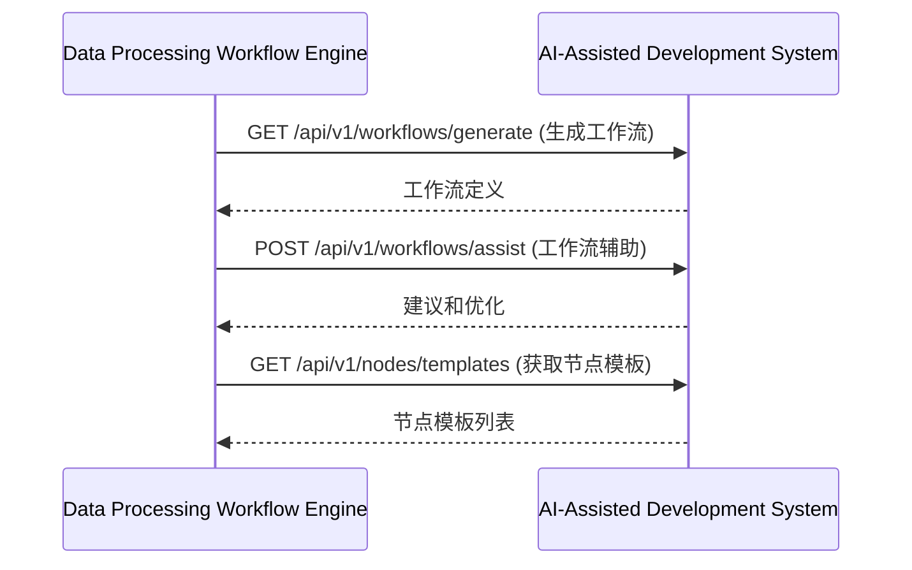
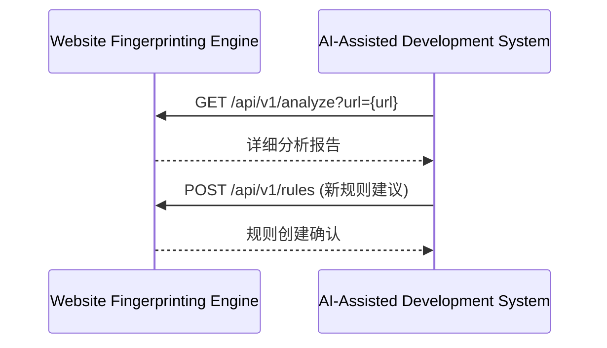
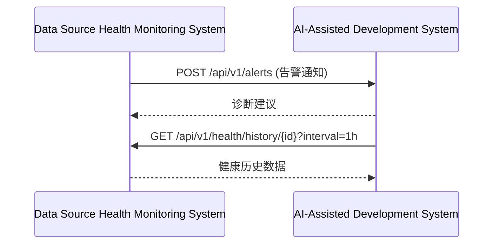
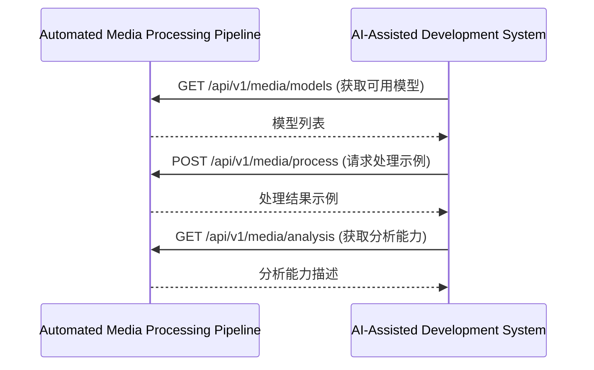

# 镜界平台终极技术规格说明书（模块级深度实现）

## 目录

### 6. AI辅助开发系统 (AI-Assisted Development System)
- [6.1 模块概述](#61-模块概述)
- [6.2 详细功能清单](#62-详细功能清单)
  - [6.2.1 核心功能](#621-核心功能)
  - [6.2.2 高级功能](#622-高级功能)
- [6.3 技术架构](#63-技术架构)
  - [6.3.1 架构图](#631-架构图)
  - [6.3.2 服务边界与交互](#632-服务边界与交互)
- [6.4 核心组件详细实现](#64-核心组件详细实现)
  - [6.4.1 需求解析服务](#641-需求解析服务)
  - [6.4.2 代码生成服务](#642-代码生成服务)
  - [6.4.3 问题诊断服务](#643-问题诊断服务)
  - [6.4.4 学习推荐服务](#644-学习推荐服务)
- [6.5 数据模型详细定义](#65-数据模型详细定义)
  - [6.5.1 用户画像表](#651-用户画像表)
  - [6.5.2 学习内容表](#652-学习内容表)
  - [6.5.3 技能评估表](#653-技能评估表)
  - [6.5.4 用户学习进度表](#654-用户学习进度表)
  - [6.5.5 用户代码提交记录表](#655-用户代码提交记录表)
- [6.6 API详细规范](#66-api详细规范)
  - [6.6.1 代码生成API](#661-代码生成api)
  - [6.6.2 问题诊断API](#662-问题诊断api)
  - [6.6.3 学习推荐API](#663-学习推荐api)
- [6.7 性能优化策略](#67-性能优化策略)
  - [6.7.1 LLM调用优化](#671-llm调用优化)
  - [6.7.2 上下文管理优化](#672-上下文管理优化)
  - [6.7.3 资源管理策略](#673-资源管理策略)
- [6.8 安全考虑](#68-安全考虑)
  - [6.8.1 LLM输出安全](#681-llm输出安全)
  - [6.8.2 数据隐私保护](#682-数据隐私保护)
- [6.9 与其他模块的交互](#69-与其他模块的交互)
  - [6.9.1 与数据处理工作流引擎交互](#691-与数据处理工作流引擎交互)
  - [6.9.2 与网站指纹分析引擎交互](#692-与网站指纹分析引擎交互)
  - [6.9.3 与数据合规与安全中心交互](#693-与数据合规与安全中心交互)

## 6. AI辅助开发系统 (AI-Assisted Development System)

### 6.1 模块概述
AI辅助开发系统是镜界平台的智能助手，利用大型语言模型和领域知识库，为爬虫工程师和数据科学家提供代码生成、问题诊断和学习推荐等辅助功能。它通过自然语言交互，降低数据采集的技术门槛，提高开发效率。

### 6.2 详细功能清单

#### 6.2.1 核心功能
- **自然语言需求解析**
  - 需求意图识别
  - 关键参数提取
  - 需求验证与澄清
  - 需求分解与任务规划
- **智能代码生成**
  - 爬虫代码生成（Python、JavaScript）
  - 数据处理代码生成
  - 工作流定义生成
  - 测试用例生成
- **问题诊断与修复建议**
  - 错误日志分析
  - 反爬问题诊断
  - 性能瓶颈分析
  - 修复建议生成
- **学习路径个性化推荐**
  - 技能评估与差距分析
  - 个性化学习路径规划
  - 实战项目推荐
  - 进阶学习资源推荐

#### 6.2.2 高级功能
- **领域知识库**
  - 爬虫技术栈知识库
  - 反爬策略数据库
  - 网站技术栈指纹库
  - HTTP状态码知识库
- **多轮对话记忆**
  - 上下文理解与跟踪
  - 对话状态管理
  - 记忆长期化
  - 个性化偏好学习
- **代码理解与优化**
  - 代码静态分析
  - 代码质量评估
  - 性能优化建议
  - 安全漏洞检测
- **集成开发环境支持**
  - VS Code插件
  - Jupyter Notebook集成
  - 命令行工具
  - 工作流内嵌调用

### 6.3 技术架构

#### 6.3.1 架构图
```
┌───────────────────────────────────────────────────────────────────────────────────────────────┐
│                                AI辅助开发系统 (AIDS)                                          │
├───────────────────────┬───────────────────────┬───────────────────────────────────────────────┤
│  交互层               │  服务层               │  数据层                                    │
├───────────────────────┼───────────────────────┼───────────────────────────────────────────────┤
│ • Web聊天界面         │ • 需求解析服务        │ • 领域知识库                               │
│ • IDE插件             │ • 代码生成服务        │ • 代码片段库                               │
│ • CLI工具             │ • 问题诊断服务        │ • 错误模式库                               │
│ • 工作流内嵌调用       │ • 学习推荐服务        │ • 用户画像库                               │
└───────────────────────┴───────────────────────┴───────────────────────────────────────────────┘
```

#### 6.3.2 服务边界与交互
- **输入**：
  - 自然语言查询（用户输入）
  - 代码片段（用于分析或生成）
  - 错误日志（用于诊断）
  - 工作流定义（用于辅助）
- **输出**：
  - 生成的代码
  - 问题诊断结果
  - 学习资源推荐
  - 需求澄清问题

### 6.4 核心组件详细实现

#### 6.4.1 需求解析服务

**技术实现：**
```python
import re
import json
from typing import Dict, List, Optional, Tuple
import logging
import spacy
from spacy.tokens import Doc
from sklearn.feature_extraction.text import TfidfVectorizer
from sklearn.metrics.pairwise import cosine_similarity

class RequirementParser:
    """需求解析服务，将自然语言需求转换为结构化任务"""
    
    def __init__(
        self,
        nlp: spacy.Language,
        knowledge_base: KnowledgeBase,
        config: Config
    ):
        self.nlp = nlp
        self.knowledge_base = knowledge_base
        self.config = config
        self.logger = logging.getLogger(__name__)
    
    def parse(
        self,
        user_query: str,
        context: Optional[Dict] = None
    ) -> ParsedRequirement:
        """
        解析用户需求
        
        :param user_query: 用户自然语言查询
        :param context: 对话上下文
        :return: 解析后的需求对象
        """
        # 1. 预处理用户查询
        cleaned_query = self._clean_query(user_query)
        
        # 2. 识别需求类型
        requirement_type = self._identify_requirement_type(cleaned_query)
        
        # 3. 提取关键参数
        parameters = self._extract_parameters(cleaned_query, requirement_type)
        
        # 4. 验证参数完整性
        missing_params = self._validate_parameters(requirement_type, parameters)
        
        # 5. 生成结构化需求
        return ParsedRequirement(
            original_query=user_query,
            cleaned_query=cleaned_query,
            requirement_type=requirement_type,
            parameters=parameters,
            missing_parameters=missing_params,
            confidence=self._calculate_confidence(requirement_type, parameters),
            context=context
        )
    
    def _clean_query(self, query: str) -> str:
        """清理用户查询"""
        # 移除特殊字符
        query = re.sub(r'[^\w\s]', ' ', query)
        
        # 转换为小写
        query = query.lower()
        
        # 移除多余空格
        query = re.sub(r'\s+', ' ', query).strip()
        
        return query
    
    def _identify_requirement_type(self, query: str) -> str:
        """识别需求类型"""
        # 基于关键词匹配
        if any(word in query for word in ["generate", "create", "make"]):
            if any(word in query for word in ["code", "script", "crawler"]):
                return "code_generation"
            elif any(word in query for word in ["workflow", "pipeline"]):
                return "workflow_generation"
        
        if any(word in query for word in ["why", "error", "problem", "fix", "debug"]):
            return "problem_diagnosis"
        
        if any(word in query for word in ["learn", "study", "tutorial", "how to"]):
            return "learning_request"
        
        # 默认类型
        return "general_query"
    
    def _extract_parameters(
        self,
        query: str,
        requirement_type: str
    ) -> Dict:
        """提取需求参数"""
        doc = self.nlp(query)
        parameters = {}
        
        if requirement_type == "code_generation":
            parameters.update(self._extract_code_generation_params(doc))
        elif requirement_type == "workflow_generation":
            parameters.update(self._extract_workflow_params(doc))
        elif requirement_type == "problem_diagnosis":
            parameters.update(self._extract_problem_diagnosis_params(doc))
        
        return parameters
    
    def _extract_code_generation_params(self, doc: Doc) -> Dict:
        """提取代码生成参数"""
        params = {}
        
        # 提取目标网站
        for ent in doc.ents:
            if ent.label_ in ["WEBSITE", "URL", "ORG"]:
                params["target_website"] = ent.text
        
        # 提取数据类型
        data_types = ["image", "video", "text", "html", "json", "xml"]
        for token in doc:
            if token.text in data_types:
                params["data_type"] = token.text
                break
        
        # 提取编程语言
        languages = ["python", "javascript", "java", "go"]
        for token in doc:
            if token.text in languages:
                params["language"] = token.text
                break
        
        # 提取特殊要求
        special_requirements = []
        if "login" in doc.text or "authentication" in doc.text:
            special_requirements.append("login_required")
        if "pagination" in doc.text or "page" in doc.text:
            special_requirements.append("pagination")
        if "infinite scroll" in doc.text:
            special_requirements.append("infinite_scroll")
        
        if special_requirements:
            params["special_requirements"] = special_requirements
        
        return params
    
    def _extract_workflow_params(self, doc: Doc) -> Dict:
        """提取工作流参数"""
        params = {}
        
        # 提取触发条件
        if "schedule" in doc.text or "定时" in doc.text:
            params["trigger"] = "schedule"
        elif "filesystem" in doc.text or "文件系统" in doc.text:
            params["trigger"] = "filesystem"
        elif "webhook" in doc.text or "回调" in doc.text:
            params["trigger"] = "webhook"
        
        # 提取处理步骤
        processing_steps = []
        if "download" in doc.text or "下载" in doc.text:
            processing_steps.append("download")
        if "extract" in doc.text or "提取" in doc.text:
            processing_steps.append("extract")
        if "transform" in doc.text or "转换" in doc.text:
            processing_steps.append("transform")
        if "analyze" in doc.text or "分析" in doc.text:
            processing_steps.append("analyze")
        if "store" in doc.text or "存储" in doc.text:
            processing_steps.append("store")
        
        if processing_steps:
            params["processing_steps"] = processing_steps
        
        return params
    
    def _extract_problem_diagnosis_params(self, doc: Doc) -> Dict:
        """提取问题诊断参数"""
        params = {}
        
        # 提取错误信息
        error_keywords = ["error", "exception", "failed", "not working"]
        for sent in doc.sents:
            if any(keyword in sent.text for keyword in error_keywords):
                params["error_message"] = sent.text
                break
        
        # 提取网站信息
        for ent in doc.ents:
            if ent.label_ in ["WEBSITE", "URL", "ORG"]:
                params["target_website"] = ent.text
                break
        
        # 提取技术栈
        tech_keywords = ["javascript", "react", "angular", "vue", "angular", "wordpress"]
        for token in doc:
            if token.text in tech_keywords:
                params["technology"] = token.text
                break
        
        return params
    
    def _validate_parameters(
        self,
        requirement_type: str,
        parameters: Dict
    ) -> List[str]:
        """验证参数完整性"""
        missing_params = []
        
        if requirement_type == "code_generation":
            if "target_website" not in parameters:
                missing_params.append("target_website")
            if "data_type" not in parameters:
                missing_params.append("data_type")
        
        elif requirement_type == "workflow_generation":
            if "trigger" not in parameters:
                missing_params.append("trigger")
            if "processing_steps" not in parameters or not parameters["processing_steps"]:
                missing_params.append("processing_steps")
        
        elif requirement_type == "problem_diagnosis":
            if "error_message" not in parameters:
                missing_params.append("error_message")
        
        return missing_params
    
    def _calculate_confidence(
        self,
        requirement_type: str,
        parameters: Dict
    ) -> float:
        """计算解析置信度"""
        # 基于参数完整性
        if requirement_type == "general_query":
            return 0.5
        
        required_params = []
        if requirement_type == "code_generation":
            required_params = ["target_website", "data_type"]
        elif requirement_type == "workflow_generation":
            required_params = ["trigger", "processing_steps"]
        elif requirement_type == "problem_diagnosis":
            required_params = ["error_message"]
        
        if not required_params:
            return 0.8  # 一般查询，置信度中等
        
        filled_params = [param for param in required_params if param in parameters]
        return len(filled_params) / len(required_params)

class KnowledgeBase:
    """领域知识库，存储爬虫相关知识"""
    
    def __init__(self, config: Config):
        self.config = config
        self.logger = logging.getLogger(__name__)
        self._load_knowledge()
    
    def _load_knowledge(self):
        """加载知识库"""
        # 从配置或数据库加载知识
        self.anti_crawling_strategies = self._load_anti_crawling_strategies()
        self.technology_fingerprints = self._load_technology_fingerprints()
        self.error_patterns = self._load_error_patterns()
    
    def _load_anti_crawling_strategies(self) -> List[Dict]:
        """加载反爬策略知识"""
        return [
            {
                "id": "user-agent-check",
                "name": "User-Agent检测",
                "description": "网站通过User-Agent检测爬虫",
                "indicators": [
                    "403 Forbidden响应",
                    "需要特定User-Agent才能访问"
                ],
                "solutions": [
                    {
                        "title": "轮换User-Agent",
                        "description": "使用随机User-Agent池",
                        "code_example": "from fake_useragent import UserAgent\nua = UserAgent()\nheaders = {'User-Agent': ua.random}",
                        "effectiveness": 0.85,
                        "complexity": 0.3
                    },
                    {
                        "title": "模拟浏览器特征",
                        "description": "添加浏览器特有的请求头",
                        "code_example": "headers = {\n    'User-Agent': 'Mozilla/5.0...',\n    'Accept-Language': 'en-US,en;q=0.9',\n    'Sec-Ch-Ua': '\"Chromium\";v=\"112\", \"Google Chrome\";v=\"112\", \"Not_A Brand\";v=\"24\"'\n}",
                        "effectiveness": 0.92,
                        "complexity": 0.6
                    }
                ]
            },
            {
                "id": "rate-limiting",
                "name": "请求频率限制",
                "description": "网站限制单位时间内的请求数量",
                "indicators": [
                    "429 Too Many Requests响应",
                    "请求间隔过短导致失败"
                ],
                "solutions": [
                    {
                        "title": "添加请求间隔",
                        "description": "在请求之间添加随机延迟",
                        "code_example": "import time\nimport random\ntime.sleep(random.uniform(1, 3))",
                        "effectiveness": 0.75,
                        "complexity": 0.2
                    },
                    {
                        "title": "使用代理IP轮换",
                        "description": "通过轮换不同IP地址分散请求",
                        "code_example": "proxies = {\n    'http': 'http://10.10.1.10:3128',\n    'https': 'http://10.10.1.10:1080',\n}\nresponse = requests.get(url, proxies=proxies)",
                        "effectiveness": 0.85,
                        "complexity": 0.7
                    }
                ]
            }
        ]
    
    def _load_technology_fingerprints(self) -> List[Dict]:
        """加载技术栈指纹知识"""
        return [
            {
                "id": "react",
                "name": "React",
                "detection_rules": [
                    {
                        "type": "html",
                        "pattern": "<div id=\"root\">",
                        "confidence": 0.9
                    },
                    {
                        "type": "js",
                        "pattern": "webpackJsonp",
                        "confidence": 0.8
                    }
                ],
                "crawl_implications": [
                    "需要处理客户端渲染内容",
                    "可能使用React Router进行导航"
                ]
            },
            {
                "id": "wordpress",
                "name": "WordPress",
                "detection_rules": [
                    {
                        "type": "meta",
                        "pattern": "generator",
                        "value": "WordPress",
                        "confidence": 0.95
                    },
                    {
                        "type": "path",
                        "pattern": "/wp-content/",
                        "confidence": 0.85
                    }
                ],
                "crawl_implications": [
                    "可能使用REST API",
                    "需要注意主题和插件的自定义结构"
                ]
            }
        ]
    
    def _load_error_patterns(self) -> List[Dict]:
        """加载错误模式知识"""
        return [
            {
                "id": "403-forbidden",
                "pattern": "403 Forbidden",
                "description": "访问被拒绝",
                "causes": [
                    "IP被封禁",
                    "User-Agent被识别为爬虫",
                    "缺少必要的请求头"
                ],
                "solutions": [
                    "使用代理IP",
                    "轮换User-Agent",
                    "添加Referer头"
                ],
                "examples": [
                    {
                        "code": "requests.get(url, headers={'User-Agent': 'Mozilla/5.0'})",
                        "description": "设置User-Agent解决403错误"
                    }
                ]
            },
            {
                "id": "429-too-many-requests",
                "pattern": "429 Too Many Requests",
                "description": "请求过于频繁",
                "causes": [
                    "请求频率超过网站限制",
                    "未使用请求间隔"
                ],
                "solutions": [
                    "添加随机请求间隔",
                    "减少并发请求数",
                    "使用代理IP轮换"
                ],
                "examples": [
                    {
                        "code": "import time\ntime.sleep(2)  # 2秒间隔",
                        "description": "添加请求间隔解决429错误"
                    }
                ]
            }
        ]
    
    def get_anti_crawling_strategy(self, strategy_id: str) -> Optional[Dict]:
        """获取反爬策略"""
        return next(
            (s for s in self.anti_crawling_strategies if s["id"] == strategy_id),
            None
        )
    
    def get_technology_fingerprint(self, tech_id: str) -> Optional[Dict]:
        """获取技术栈指纹"""
        return next(
            (t for t in self.technology_fingerprints if t["id"] == tech_id),
            None
        )
    
    def match_error_pattern(self, error_message: str) -> List[Dict]:
        """匹配错误模式"""
        matches = []
        
        for pattern in self.error_patterns:
            # 简单实现：关键词匹配
            if any(keyword in error_message.lower() for keyword in pattern["pattern"].lower().split()):
                matches.append(pattern)
        
        return matches

# 辅助类定义
class ParsedRequirement:
    """解析后的需求对象"""
    def __init__(
        self,
        original_query: str,
        cleaned_query: str,
        requirement_type: str,
        parameters: Dict,
        missing_parameters: List[str],
        confidence: float,
        context: Optional[Dict] = None
    ):
        self.original_query = original_query
        self.cleaned_query = cleaned_query
        self.requirement_type = requirement_type
        self.parameters = parameters
        self.missing_parameters = missing_parameters
        self.confidence = confidence
        self.context = context or {}
```

#### 6.4.2 代码生成服务

**技术实现：**
```python
import os
import time
import json
from typing import Dict, List, Optional
import logging
import openai
from jinja2 import Template

class CodeGenerationService:
    """
    AI代码生成服务，支持多种爬虫场景
    """
    
    def __init__(
        self,
        llm_client: LLMClient,
        template_repo: TemplateRepository,
        scene_classifier: SceneClassifier,
        code_validator: CodeValidator,
        config: Config
    ):
        self.llm_client = llm_client
        self.template_repo = template_repo
        self.scene_classifier = scene_classifier
        self.code_validator = code_validator
        self.config = config
        self.logger = logging.getLogger(__name__)
    
    def generate_code(
        self,
        user_request: str,
        context: dict = None
    ) -> CodeGenerationResult:
        """
        根据用户需求生成爬虫代码
        
        :param user_request: 用户自然语言描述
        :param context: 上下文信息（可选）
        :return: 代码生成结果
        """
        start_time = time.time()
        
        try:
            # 1. 场景分类
            scene_type = self.scene_classifier.classify(user_request)
            
            # 2. 获取相关模板
            templates = self.template_repo.get_templates(
                scene_type=scene_type,
                language=context.get("language", "python") if context else "python"
            )
            
            # 3. 构建提示词
            prompt = self._build_prompt(user_request, templates, context)
            
            # 4. 调用LLM生成代码
            raw_code = self.llm_client.generate(prompt)
            
            # 5. 代码后处理与验证
            processed_code = self._post_process_code(raw_code, scene_type)
            validation_result = self.code_validator.validate(processed_code)
            
            # 6. 构建结果
            return CodeGenerationResult(
                code=processed_code,
                scene_type=scene_type,
                templates_used=[t.id for t in templates],
                validation=validation_result,
                confidence=self._calculate_confidence(validation_result),
                processing_time=time.time() - start_time
            )
            
        except Exception as e:
            self.logger.error("Code generation failed: %s", str(e))
            raise CodeGenerationError(f"Failed to generate code: {str(e)}")
    
    def _build_prompt(
        self,
        user_request: str,
        templates: List[CodeTemplate],
        context: dict
    ) -> str:
        """构建LLM提示词"""
        # 加载提示词模板
        template_path = self.config.get("prompt_template_path", "prompts/code_generation.j2")
        with open(template_path, 'r') as f:
            template_content = f.read()
        
        # 准备模板变量
        template_vars = {
            "user_request": user_request,
            "templates": [
                {
                    "id": t.id,
                    "name": t.name,
                    "description": t.description,
                    "content": t.content,
                    "parameters": t.parameters
                } for t in templates
            ],
            "context": context or {},
            "current_date": datetime.now().strftime("%Y-%m-%d"),
            "programming_language": context.get("language", "Python") if context else "Python"
        }
        
        # 渲染提示词
        jinja_template = Template(template_content)
        return jinja_template.render(**template_vars)
    
    def _post_process_code(self, raw_code: str, scene_type: str) -> str:
        """代码后处理：清理、格式化、添加注释"""
        # 1. 移除多余内容
        code = self._remove_extra_content(raw_code)
        
        # 2. 根据场景类型进行特定后处理
        if scene_type == "static-html":
            code = self._process_static_html_code(code)
        elif scene_type == "dynamic-rendering":
            code = self._process_dynamic_rendering_code(code)
        elif scene_type == "api-endpoint":
            code = self._process_api_code(code)
        
        # 3. 格式化代码
        code = self._format_code(code)
        
        # 4. 添加必要的导入
        code = self._add_required_imports(code)
        
        return code
    
    def _remove_extra_content(self, code: str) -> str:
        """移除LLM生成的多余内容"""
        # 移除Markdown代码块标记
        code = re.sub(r'```python\n', '', code)
        code = re.sub(r'\n```', '', code)
        
        # 移除解释性文本
        if "```" in code:
            code = code.split("```")[0]
        
        return code.strip()
    
    def _process_static_html_code(self, code: str) -> str:
        """处理静态HTML爬虫代码"""
        # 确保使用了requests和BeautifulSoup
        if "import requests" not in code:
            code = "import requests\n" + code
        if "from bs4 import BeautifulSoup" not in code and "BeautifulSoup" in code:
            code = "from bs4 import BeautifulSoup\n" + code
        
        # 添加基本错误处理
        if "try:" not in code:
            code = self._add_basic_error_handling(code)
        
        return code
    
    def _process_dynamic_rendering_code(self, code: str) -> str:
        """处理动态渲染页面爬虫代码"""
        # 确保使用了selenium
        if "from selenium import webdriver" not in code:
            code = "from selenium import webdriver\n" + code
        
        # 添加等待机制
        if "WebDriverWait" not in code and "wait" in code.lower():
            code = self._add_wait_mechanism(code)
        
        return code
    
    def _process_api_code(self, code: str) -> str:
        """处理API爬虫代码"""
        # 确保处理了分页
        if "page" in code.lower() and "while" not in code and "for" not in code:
            code = self._add_pagination_handling(code)
        
        # 添加速率限制
        if "time.sleep" not in code and "rate limit" in code.lower():
            code = self._add_rate_limiting(code)
        
        return code
    
    def _add_basic_error_handling(self, code: str) -> str:
        """添加基本错误处理"""
        error_handling = """
try:
    # 原有代码
    {}
except Exception as e:
    print(f"Error: {str(e)}")
    # 可以添加更多错误处理逻辑
"""
        return error_handling.format(code)
    
    def _add_wait_mechanism(self, code: str) -> str:
        """添加等待机制"""
        wait_code = """
from selenium.webdriver.support.ui import WebDriverWait
from selenium.webdriver.support import expected_conditions as EC
from selenium.webdriver.common.by import By

# 等待元素加载
wait = WebDriverWait(driver, 10)
element = wait.until(EC.presence_of_element_located((By.ID, "target-element")))
"""
        return wait_code + "\n\n" + code
    
    def _add_pagination_handling(self, code: str) -> str:
        """添加分页处理"""
        pagination_code = """
# 处理分页
page = 1
all_data = []

while True:
    # 构建URL
    url = f"https://api.example.com/data?page={page}"
    
    # 发送请求
    response = requests.get(url)
    data = response.json()
    
    # 检查是否还有数据
    if not data["items"]:
        break
    
    # 添加到结果
    all_data.extend(data["items"])
    
    # 下一页
    page += 1
"""
        return pagination_code + "\n\n" + code
    
    def _add_rate_limiting(self, code: str) -> str:
        """添加速率限制"""
        rate_limiting_code = """
import time

# 添加请求间隔
def make_request(url):
    response = requests.get(url)
    time.sleep(1)  # 1秒间隔
    return response
"""
        return rate_limiting_code + "\n\n" + code
    
    def _format_code(self, code: str) -> str:
        """格式化代码"""
        # 这里简化实现，实际应该使用black等格式化工具
        return code
    
    def _add_required_imports(self, code: str) -> str:
        """添加必要的导入"""
        imports = []
        
        if "requests" in code and "import requests" not in code:
            imports.append("import requests")
        if "BeautifulSoup" in code and "from bs4 import BeautifulSoup" not in code:
            imports.append("from bs4 import BeautifulSoup")
        if "selenium" in code and "from selenium import webdriver" not in code:
            imports.append("from selenium import webdriver")
        
        if imports:
            return "\n".join(imports) + "\n\n" + code
        
        return code
    
    def _calculate_confidence(self, validation_result: ValidationResult) -> float:
        """计算生成代码的置信度"""
        # 根据验证结果计算置信度
        if validation_result.is_valid:
            return 0.9
        elif validation_result.errors:
            # 根据错误严重程度调整
            severity_weights = {
                "syntax": 0.3,
                "import": 0.2,
                "logic": 0.5
            }
            
            total_deduction = 0
            for error in validation_result.errors:
                weight = severity_weights.get(error["type"], 0.2)
                total_deduction += weight * error.get("severity", 1.0)
            
            return max(0.1, 1.0 - total_deduction)
        
        return 0.5

class SceneClassifier:
    """爬虫场景分类器"""
    
    SCENE_CATEGORIES = [
        "static-html", 
        "dynamic-rendering", 
        "api-endpoint", 
        "image-crawling",
        "video-crawling",
        "login-required",
        "pagination",
        "infinite-scroll"
    ]
    
    def __init__(self):
        # 加载预训练分类模型
        self.model = load_model("scene-classification-v1")
    
    def classify(self, user_request: str) -> str:
        """将用户请求分类到最匹配的场景"""
        # 实现分类逻辑
        return self.model.predict(user_request)

class TemplateRepository:
    """代码模板仓库"""
    
    def __init__(self, db: Database):
        self.db = db
        self.logger = logging.getLogger(__name__)
    
    def get_templates(
        self,
        scene_type: str,
        language: str = "python"
    ) -> List[CodeTemplate]:
        """获取相关代码模板"""
        # 从数据库获取模板
        sql = """
        SELECT * FROM code_templates 
        WHERE scene_type = %(scene_type)s 
        AND language = %(language)s
        ORDER BY priority DESC
        """
        
        rows = self.db.fetchall(sql, {
            "scene_type": scene_type,
            "language": language
        })
        
        return [self._row_to_template(row) for row in rows]
    
    def _row_to_template(self, row: Dict) -> CodeTemplate:
        """将数据库行转换为CodeTemplate对象"""
        return CodeTemplate(
            id=row["id"],
            name=row["name"],
            description=row["description"],
            language=row["language"],
            scene_type=row["scene_type"],
            content=row["content"],
            parameters=self._decode_parameters(row["parameters"]),
            examples=self._decode_examples(row["examples"]),
            priority=row["priority"],
            created_at=row["created_at"],
            updated_at=row["updated_at"]
        )
    
    def _decode_parameters(self, json_data: str) -> List[TemplateParameter]:
        """解码参数定义"""
        if not json_data:
            return []
        
        params_data = json.loads(json_data)
        return [
            TemplateParameter(
                name=p["name"],
                type=p["type"],
                description=p.get("description", ""),
                default=p.get("default"),
                required=p.get("required", True)
            ) for p in params_data
        ]
    
    def _decode_examples(self, json_data: str) -> List[CodeExample]:
        """解码示例代码"""
        if not json_data:
            return []
        
        examples_data = json.loads(json_data)
        return [
            CodeExample(
                title=e["title"],
                description=e.get("description", ""),
                code=e["code"],
                parameters=e.get("parameters", {})
            ) for e in examples_data
        ]

class CodeValidator:
    """代码验证器"""
    
    def validate(self, code: str) -> ValidationResult:
        """
        验证生成的代码
        
        :param code: 生成的代码
        :return: 验证结果
        """
        errors = []
        
        # 1. 语法验证
        syntax_errors = self._validate_syntax(code)
        errors.extend(syntax_errors)
        
        # 2. 导入验证
        import_errors = self._validate_imports(code)
        errors.extend(import_errors)
        
        # 3. 逻辑验证
        logic_errors = self._validate_logic(code)
        errors.extend(logic_errors)
        
        return ValidationResult(
            is_valid=len(errors) == 0,
            errors=errors
        )
    
    def _validate_syntax(self, code: str) -> List[Dict]:
        """验证代码语法"""
        try:
            ast.parse(code)
            return []
        except SyntaxError as e:
            return [{
                "type": "syntax",
                "message": str(e),
                "line": e.lineno,
                "severity": 1.0
            }]
        except Exception as e:
            return [{
                "type": "syntax",
                "message": f"Syntax validation error: {str(e)}",
                "severity": 0.8
            }]
    
    def _validate_imports(self, code: str) -> List[Dict]:
        """验证导入语句"""
        errors = []
        
        # 检查requests库
        if ("requests" in code or "get(" in code) and "import requests" not in code:
            errors.append({
                "type": "import",
                "message": "Missing import for requests library",
                "severity": 0.7
            })
        
        # 检查BeautifulSoup
        if "BeautifulSoup" in code and "from bs4 import BeautifulSoup" not in code:
            errors.append({
                "type": "import",
                "message": "Missing import for BeautifulSoup",
                "severity": 0.6
            })
        
        # 检查selenium
        if "webdriver" in code and "from selenium import webdriver" not in code:
            errors.append({
                "type": "import",
                "message": "Missing import for selenium",
                "severity": 0.6
            })
        
        return errors
    
    def _validate_logic(self, code: str) -> List[Dict]:
        """验证代码逻辑（简化实现）"""
        errors = []
        
        # 检查分页处理
        if "page" in code.lower() and "while" not in code and "for" not in code:
            errors.append({
                "type": "logic",
                "message": "Pagination logic appears incomplete",
                "severity": 0.5
            })
        
        # 检查速率限制
        if ("api" in code.lower() or "request" in code.lower()) and "time.sleep" not in code:
            errors.append({
                "type": "logic",
                "message": "Missing rate limiting",
                "severity": 0.4
            })
        
        # 检查错误处理
        if "try" not in code and ("requests.get" in code or "selenium" in code):
            errors.append({
                "type": "logic",
                "message": "Missing error handling for network requests",
                "severity": 0.6
            })
        
        # 检查User-Agent设置（针对爬虫）
        if "requests.get" in code and "User-Agent" not in code:
            errors.append({
                "type": "logic",
                "message": "Missing User-Agent header (may trigger anti-crawling)",
                "severity": 0.7
            })
        
        return errors

class ValidationResult:
    """代码验证结果"""
    def __init__(
        self,
        is_valid: bool,
        errors: List[Dict]
    ):
        self.is_valid = is_valid
        self.errors = errors
```

#### 6.4.3 问题诊断服务

**技术实现：**
```python
class ProblemDiagnosisService:
    """问题诊断服务，分析错误并提供解决方案"""
    
    def __init__(
        self,
        llm_client: LLMClient,
        knowledge_base: KnowledgeBase,
        error_analyzer: ErrorAnalyzer,
        config: Config
    ):
        self.llm_client = llm_client
        self.knowledge_base = knowledge_base
        self.error_analyzer = error_analyzer
        self.config = config
        self.logger = logging.getLogger(__name__)
    
    def diagnose(
        self,
        error_log: str,
        context: dict = None
    ) -> DiagnosisResult:
        """
        诊断错误问题并提供解决方案
        
        :param error_log: 错误日志
        :param context: 上下文信息（可选）
        :return: 诊断结果
        """
        start_time = time.time()
        
        try:
            # 1. 分析错误类型
            error_analysis = self.error_analyzer.analyze(error_log)
            
            # 2. 获取相关知识
            relevant_knowledge = self._get_relevant_knowledge(error_analysis)
            
            # 3. 构建诊断提示
            prompt = self._build_diagnosis_prompt(error_log, error_analysis, relevant_knowledge, context)
            
            # 4. 调用LLM生成诊断
            diagnosis = self.llm_client.generate(prompt)
            
            # 5. 解析诊断结果
            parsed_diagnosis = self._parse_diagnosis(diagnosis, error_analysis)
            
            # 6. 构建结果
            return DiagnosisResult(
                error_log=error_log,
                analysis=error_analysis,
                diagnosis=parsed_diagnosis,
                solutions=self._extract_solutions(parsed_diagnosis),
                confidence=self._calculate_confidence(parsed_diagnosis, error_analysis),
                processing_time=time.time() - start_time
            )
            
        except Exception as e:
            self.logger.error("Problem diagnosis failed: %s", str(e))
            raise DiagnosisError(f"Failed to diagnose problem: {str(e)}")
    
    def _get_relevant_knowledge(self, error_analysis: ErrorAnalysis) -> Dict:
        """获取相关知识库内容"""
        knowledge = {
            "error_patterns": [],
            "anti_crawling_strategies": [],
            "technology_fingerprints": []
        }
        
        # 匹配错误模式
        if error_analysis.error_type:
            patterns = self.knowledge_base.match_error_pattern(error_analysis.error_message)
            knowledge["error_patterns"] = patterns
        
        # 获取相关反爬策略
        if error_analysis.anti_crawling_indicators:
            for indicator in error_analysis.anti_crawling_indicators:
                strategy = self.knowledge_base.get_anti_crawling_strategy(indicator)
                if strategy:
                    knowledge["anti_crawling_strategies"].append(strategy)
        
        # 获取技术栈指纹
        if error_analysis.technology:
            fingerprint = self.knowledge_base.get_technology_fingerprint(error_analysis.technology)
            if fingerprint:
                knowledge["technology_fingerprints"].append(fingerprint)
        
        return knowledge
    
    def _build_diagnosis_prompt(
        self,
        error_log: str,
        error_analysis: ErrorAnalysis,
        knowledge: Dict,
        context: dict
    ) -> str:
        """构建诊断提示词"""
        # 加载提示词模板
        template_path = self.config.get("diagnosis_prompt_template", "prompts/diagnosis.j2")
        with open(template_path, 'r') as f:
            template_content = f.read()
        
        # 准备模板变量
        template_vars = {
            "error_log": error_log,
            "error_analysis": {
                "error_type": error_analysis.error_type,
                "error_message": error_analysis.error_message,
                "status_code": error_analysis.status_code,
                "anti_crawling_indicators": error_analysis.anti_crawling_indicators,
                "technology": error_analysis.technology,
                "url": error_analysis.url
            },
            "knowledge": knowledge,
            "context": context or {},
            "current_date": datetime.now().strftime("%Y-%m-%d")
        }
        
        # 渲染提示词
        jinja_template = Template(template_content)
        return jinja_template.render(**template_vars)
    
    def _parse_diagnosis(self, diagnosis_text: str, error_analysis: ErrorAnalysis) -> Dict:
        """解析诊断结果"""
        # 简单实现：提取关键信息
        result = {
            "root_cause": "",
            "impact": "",
            "suggested_solutions": []
        }
        
        # 提取根本原因
        cause_match = re.search(r'根本原因[:：]\s*(.*?)(?=\n\s*[A-Z]|$)', diagnosis_text, re.IGNORECASE)
        if cause_match:
            result["root_cause"] = cause_match.group(1).strip()
        
        # 提取影响
        impact_match = re.search(r'影响[:：]\s*(.*?)(?=\n\s*[A-Z]|$)', diagnosis_text, re.IGNORECASE)
        if impact_match:
            result["impact"] = impact_match.group(1).strip()
        
        # 提取解决方案
        solutions_match = re.findall(r'解决方案\s*\d*[:：]\s*(.*?)(?=\n\s*(?:解决方案|$))', diagnosis_text, re.IGNORECASE)
        for solution in solutions_match:
            result["suggested_solutions"].append(solution.strip())
        
        # 如果没有提取到，使用整个文本作为原因
        if not result["root_cause"]:
            result["root_cause"] = diagnosis_text.split('\n')[0]
        
        return result
    
    def _extract_solutions(self, parsed_diagnosis: Dict) -> List[Dict]:
        """从诊断结果中提取解决方案"""
        solutions = []
        
        # 从知识库获取标准解决方案
        if parsed_diagnosis.get("root_cause"):
            # 这里可以添加更复杂的逻辑来匹配知识库中的解决方案
            pass
        
        # 从解析结果中提取
        for i, solution_text in enumerate(parsed_diagnosis.get("suggested_solutions", [])):
            solutions.append({
                "id": f"sol-{i+1}",
                "description": solution_text,
                "confidence": 0.8,  # 简化实现
                "implementation": self._generate_implementation(solution_text)
            })
        
        return solutions
    
    def _generate_implementation(self, solution_description: str) -> str:
        """为解决方案生成实现代码"""
        # 简单实现：基于描述生成代码示例
        if "User-Agent" in solution_description:
            return """headers = {
    'User-Agent': 'Mozilla/5.0 (Windows NT 10.0; Win64; x64) AppleWebKit/537.36 (KHTML, like Gecko) Chrome/91.0.4472.124 Safari/537.36'
}
response = requests.get(url, headers=headers)"""
        
        if "proxy" in solution_description.lower():
            return """proxies = {
    'http': 'http://10.10.1.10:3128',
    'https': 'http://10.10.1.10:1080',
}
response = requests.get(url, proxies=proxies)"""
        
        # 默认实现
        return f"# {solution_description}\n# 实现代码示例\npass"
    
    def _calculate_confidence(self, parsed_diagnosis: Dict, error_analysis: ErrorAnalysis) -> float:
        """计算诊断置信度"""
        base_confidence = 0.7
        
        # 根据分析的完整性调整
        if error_analysis.error_type:
            base_confidence += 0.1
        if error_analysis.anti_crawling_indicators:
            base_confidence += 0.1
        if error_analysis.technology:
            base_confidence += 0.05
        
        # 根据诊断结果的详细程度调整
        if parsed_diagnosis.get("root_cause") and len(parsed_diagnosis["root_cause"]) > 20:
            base_confidence += 0.05
        if parsed_diagnosis.get("suggested_solutions") and len(parsed_diagnosis["suggested_solutions"]) >= 2:
            base_confidence += 0.05
        
        return min(1.0, base_confidence)

class ErrorAnalyzer:
    """错误分析器，提取错误关键信息"""
    
    def analyze(self, error_log: str) -> ErrorAnalysis:
        """
        分析错误日志
        
        :param error_log: 错误日志
        :return: 错误分析结果
        """
        # 1. 提取HTTP状态码
        status_code = self._extract_status_code(error_log)
        
        # 2. 识别错误类型
        error_type = self._identify_error_type(error_log, status_code)
        
        # 3. 检测反爬迹象
        anti_crawling_indicators = self._detect_anti_crawling_indicators(error_log)
        
        # 4. 识别技术栈
        technology = self._identify_technology(error_log)
        
        # 5. 提取URL
        url = self._extract_url(error_log)
        
        return ErrorAnalysis(
            error_message=error_log,
            error_type=error_type,
            status_code=status_code,
            anti_crawling_indicators=anti_crawling_indicators,
            technology=technology,
            url=url
        )
    
    def _extract_status_code(self, error_log: str) -> Optional[int]:
        """提取HTTP状态码"""
        # 匹配常见的HTTP状态码
        pattern = r'HTTP\s*(\d{3})|status\s*code\s*(\d{3})'
        match = re.search(pattern, error_log, re.IGNORECASE)
        if match:
            return int(match.group(1) or match.group(2))
        return None
    
    def _identify_error_type(self, error_log: str, status_code: Optional[int]) -> str:
        """识别错误类型"""
        # 基于状态码
        if status_code:
            if 400 <= status_code < 500:
                return "client_error"
            if 500 <= status_code < 600:
                return "server_error"
        
        # 基于错误消息
        if "timeout" in error_log.lower():
            return "timeout"
        if "connection" in error_log.lower() and "refused" in error_log.lower():
            return "connection_refused"
        if "ssl" in error_log.lower() or "certificate" in error_log.lower():
            return "ssl_error"
        if "forbidden" in error_log.lower() or "403" in error_log:
            return "forbidden"
        if "not found" in error_log.lower() or "404" in error_log:
            return "not_found"
        
        return "unknown"
    
    def _detect_anti_crawling_indicators(self, error_log: str) -> List[str]:
        """检测反爬迹象"""
        indicators = []
        
        # 检查常见的反爬特征
        if re.search(r'captcha|验证|challenge', error_log, re.IGNORECASE):
            indicators.append("captcha")
        if "403" in error_log and "User-Agent" in error_log:
            indicators.append("user-agent-check")
        if "429" in error_log or "too many requests" in error_log.lower():
            indicators.append("rate-limiting")
        if "Access Denied" in error_log:
            indicators.append("access-denied")
        if "bot" in error_log.lower() or "crawler" in error_log.lower():
            indicators.append("bot-detection")
        
        return indicators
    
    def _identify_technology(self, error_log: str) -> Optional[str]:
        """识别网站技术栈"""
        # 简单实现：基于错误消息中的关键词
        tech_indicators = {
            "cloudflare": ["cloudflare", "cf-ray", "challenge"],
            "akamai": ["akamai", "akam"], 
            "sucuri": ["sucuri"],
            "incapsula": ["incapsula"]
        }
        
        for tech, keywords in tech_indicators.items():
            if any(keyword in error_log.lower() for keyword in keywords):
                return tech
        
        return None
    
    def _extract_url(self, error_log: str) -> Optional[str]:
        """提取URL"""
        url_pattern = r'https?://(?:[-\w.]|(?:%[\da-fA-F]{2}))+[/\w\.-]*(?:\?[\w=&]*)?'
        match = re.search(url_pattern, error_log)
        return match.group(0) if match else None

# 辅助类定义
class ErrorAnalysis:
    """错误分析结果"""
    def __init__(
        self,
        error_message: str,
        error_type: str,
        status_code: Optional[int] = None,
        anti_crawling_indicators: List[str] = None,
        technology: Optional[str] = None,
        url: Optional[str] = None
    ):
        self.error_message = error_message
        self.error_type = error_type
        self.status_code = status_code
        self.anti_crawling_indicators = anti_crawling_indicators or []
        self.technology = technology
        self.url = url

class DiagnosisResult:
    """诊断结果"""
    def __init__(
        self,
        error_log: str,
        analysis: ErrorAnalysis,
        diagnosis: Dict,
        solutions: List[Dict],
        confidence: float,
        processing_time: float
    ):
        self.error_log = error_log
        self.analysis = analysis
        self.diagnosis = diagnosis
        self.solutions = solutions
        self.confidence = confidence
        self.processing_time = processing_time
```

#### 6.4.4 学习推荐服务

**技术实现：**
```python
class LearningRecommendationService:
    """学习推荐服务，提供个性化学习路径"""
    
    def __init__(
        self,
        user_profile_service: UserProfileService,
        content_repository: ContentRepository,
        skill_assessment: SkillAssessment,
        config: Config
    ):
        self.user_profile_service = user_profile_service
        self.content_repository = content_repository
        self.skill_assessment = skill_assessment
        self.config = config
        self.logger = logging.getLogger(__name__)
    
    def recommend(
        self,
        user_id: str,
        context: dict = None
    ) -> LearningRecommendation:
        """
        为用户生成学习推荐
        
        :param user_id: 用户ID
        :param context: 上下文信息（可选）
        :return: 学习推荐
        """
        start_time = time.time()
        
        try:
            # 1. 获取用户画像
            user_profile = self.user_profile_service.get_profile(user_id)
            
            # 2. 评估用户技能
            skill_assessment = self.skill_assessment.evaluate(user_id, context)
            
            # 3. 识别技能差距
            skill_gaps = self._identify_skill_gaps(skill_assessment)
            
            # 4. 获取相关学习内容
            relevant_content = self._get_relevant_content(skill_gaps, user_profile)
            
            # 5. 生成个性化学习路径
            learning_path = self._generate_learning_path(
                user_profile,
                skill_assessment,
                skill_gaps,
                relevant_content
            )
            
            # 6. 构建结果
            return LearningRecommendation(
                user_id=user_id,
                profile_snapshot=user_profile,
                skill_assessment=skill_assessment,
                skill_gaps=skill_gaps,
                recommended_content=learning_path,
                confidence=self._calculate_confidence(skill_assessment, skill_gaps),
                generated_at=datetime.utcnow(),
                processing_time=time.time() - start_time
            )
            
        except Exception as e:
            self.logger.error("Learning recommendation failed: %s", str(e))
            raise RecommendationError(f"Failed to generate learning recommendation: {str(e)}")
    
    def _identify_skill_gaps(
        self,
        skill_assessment: SkillAssessmentResult
    ) -> List[SkillGap]:
        """识别技能差距"""
        gaps = []
        
        # 检查关键技能领域
        for domain, assessment in skill_assessment.domain_assessments.items():
            # 定义关键技能
            key_skills = self.config.get(f"key_skills.{domain}", [])
            
            for skill in key_skills:
                current_level = assessment.get("skills", {}).get(skill, 0)
                target_level = self.config.get(f"target_level.{domain}.{skill}", 3)
                
                if current_level < target_level:
                    gaps.append(SkillGap(
                        domain=domain,
                        skill=skill,
                        current_level=current_level,
                        target_level=target_level,
                        gap_size=target_level - current_level
                    ))
        
        # 按差距大小排序
        gaps.sort(key=lambda x: x.gap_size, reverse=True)
        
        # 只返回top N
        return gaps[:self.config.get("max_recommendations", 5)]
    
    def _get_relevant_content(
        self,
        skill_gaps: List[SkillGap],
        user_profile: UserProfile
    ) -> List[LearningContent]:
        """获取相关学习内容"""
        all_content = []
        
        # 为每个技能差距获取内容
        for gap in skill_gaps:
            domain_content = self.content_repository.get_content(
                domain=gap.domain,
                skill=gap.skill,
                min_difficulty=gap.current_level + 1,
                max_difficulty=min(5, gap.target_level + 1),
                language=user_profile.preferred_language
            )
            
            # 按相关性排序
            sorted_content = self._rank_content(domain_content, gap, user_profile)
            all_content.extend(sorted_content)
        
        # 去重并限制数量
        unique_content = self._deduplicate_content(all_content)
        return unique_content[:self.config.get("max_content_per_recommendation", 10)]
    
    def _rank_content(
        self,
        content_list: List[LearningContent],
        skill_gap: SkillGap,
        user_profile: UserProfile
    ) -> List[LearningContent]:
        """对学习内容进行排序"""
        ranked = []
        
        for content in content_list:
            # 计算相关性分数
            relevance = self._calculate_relevance(content, skill_gap, user_profile)
            ranked.append((content, relevance))
        
        # 按相关性排序
        ranked.sort(key=lambda x: x[1], reverse=True)
        
        return [item[0] for item in ranked]
    
    def _calculate_relevance(
        self,
        content: LearningContent,
        skill_gap: SkillGap,
        user_profile: UserProfile
    ) -> float:
        """计算内容相关性"""
        score = 0.0
        
        # 技能匹配度
        if content.skill == skill_gap.skill:
            score += 0.4
        
        # 难度匹配度
        difficulty_match = 1.0 - abs(content.difficulty - (skill_gap.current_level + 0.5)) / 5.0
        score += difficulty_match * 0.3
        
        # 格式偏好
        if content.format in user_profile.content_preferences:
            score += 0.2
        
        # 语言匹配
        if content.language == user_profile.preferred_language:
            score += 0.1
        
        return min(1.0, score)
    
    def _deduplicate_content(self, content_list: List[LearningContent]) -> List[LearningContent]:
        """去重学习内容"""
        seen = set()
        unique_content = []
        
        for content in content_list:
            if content.id not in seen:
                seen.add(content.id)
                unique_content.append(content)
        
        return unique_content
    
    def _generate_learning_path(
        self,
        user_profile: UserProfile,
        skill_assessment: SkillAssessmentResult,
        skill_gaps: List[SkillGap],
        relevant_content: List[LearningContent]
    ) -> LearningPath:
        """生成学习路径"""
        # 按领域分组内容
        content_by_domain = defaultdict(list)
        for content in relevant_content:
            content_by_domain[content.domain].append(content)
        
        # 为每个领域生成路径
        domain_paths = []
        for domain, contents in content_by_domain.items():
            domain_path = self._generate_domain_path(domain, contents, skill_gaps)
            domain_paths.append(domain_path)
        
        # 整合为完整学习路径
        return LearningPath(
            title="个性化爬虫技能提升路径",
            description="根据您的技能评估生成的个性化学习路径",
            domains=domain_paths,
            estimated_duration=self._calculate_estimated_duration(relevant_content),
            difficulty_level=self._determine_difficulty_level(skill_assessment)
        )
    
    def _generate_domain_path(
        self,
        domain: str,
        contents: List[LearningContent],
        skill_gaps: List[SkillGap]
    ) -> DomainPath:
        """生成特定领域的学习路径"""
        # 按技能分组
        contents_by_skill = defaultdict(list)
        for content in contents:
            contents_by_skill[content.skill].append(content)
        
        # 为每个技能生成路径
        skill_paths = []
        for skill, skill_contents in contents_by_skill.items():
            # 按难度排序
            sorted_contents = sorted(skill_contents, key=lambda x: x.difficulty)
            
            # 创建技能路径
            skill_paths.append(SkillPath(
                skill=skill,
                description=f"{skill}技能提升路径",
                contents=sorted_contents,
                estimated_time=sum(c.estimated_duration for c in sorted_contents)
            ))
        
        return DomainPath(
            domain=domain,
            paths=skill_paths,
            estimated_time=sum(p.estimated_time for p in skill_paths)
        )
    
    def _calculate_estimated_duration(self, contents: List[LearningContent]) -> timedelta:
        """计算预计学习时间"""
        total_minutes = sum(content.estimated_duration for content in contents)
        return timedelta(minutes=total_minutes)
    
    def _determine_difficulty_level(self, skill_assessment: SkillAssessmentResult) -> str:
        """确定整体难度级别"""
        # 计算平均技能水平
        total_skills = 0
        sum_levels = 0
        
        for domain, assessment in skill_assessment.domain_assessments.items():
            for level in assessment.get("skills", {}).values():
                sum_levels += level
                total_skills += 1
        
        if total_skills == 0:
            return "beginner"
        
        avg_level = sum_levels / total_skills
        
        if avg_level < 2:
            return "beginner"
        elif avg_level < 3.5:
            return "intermediate"
        else:
            return "advanced"
    
    def _calculate_confidence(
        self,
        skill_assessment: SkillAssessmentResult,
        skill_gaps: List[SkillGap]
    ) -> float:
        """计算推荐置信度"""
        # 基于评估的完整性
        confidence = 0.7
        
        # 如果有明确的技能差距
        if skill_gaps:
            confidence += 0.2
        
        # 如果评估包含详细数据
        if any(assessment.get("detailed", False) for assessment in skill_assessment.domain_assessments.values()):
            confidence += 0.1
        
        return min(1.0, confidence)

class UserProfileService:
    """用户画像服务"""
    
    def __init__(self, db: Database):
        self.db = db
        self.logger = logging.getLogger(__name__)
    
    def get_profile(self, user_id: str) -> UserProfile:
        """获取用户画像"""
        # 从数据库获取
        sql = "SELECT * FROM user_profiles WHERE user_id = %(user_id)s"
        row = self.db.fetchone(sql, {"user_id": user_id})
        
        if not row:
            # 创建默认画像
            return self._create_default_profile(user_id)
        
        return self._row_to_profile(row)
    
    def _create_default_profile(self, user_id: str) -> UserProfile:
        """创建默认用户画像"""
        profile = UserProfile(
            user_id=user_id,
            experience_level="beginner",
            preferred_language="en",
            content_preferences=["video", "interactive"],
            learning_goals=["web_scraping", "data_processing"],
            areas_of_interest=["python", "automation"],
            skill_levels={},
            last_updated=datetime.utcnow()
        )
        
        # 保存到数据库
        self._save_profile(profile)
        
        return profile
    
    def _save_profile(self, profile: UserProfile):
        """保存用户画像"""
        sql = """
        INSERT INTO user_profiles (
            user_id, experience_level, preferred_language,
            content_preferences, learning_goals, areas_of_interest,
            skill_levels, last_updated
        ) VALUES (
            %(user_id)s, %(experience_level)s, %(preferred_language)s,
            %(content_preferences)s, %(learning_goals)s, %(areas_of_interest)s,
            %(skill_levels)s, %(last_updated)s
        )
        ON CONFLICT (user_id) DO UPDATE SET
            experience_level = EXCLUDED.experience_level,
            preferred_language = EXCLUDED.preferred_language,
            content_preferences = EXCLUDED.content_preferences,
            learning_goals = EXCLUDED.learning_goals,
            areas_of_interest = EXCLUDED.areas_of_interest,
            skill_levels = EXCLUDED.skill_levels,
            last_updated = EXCLUDED.last_updated
        """
        
        self.db.execute(sql, {
            "user_id": profile.user_id,
            "experience_level": profile.experience_level,
            "preferred_language": profile.preferred_language,
            "content_preferences": json.dumps(profile.content_preferences),
            "learning_goals": json.dumps(profile.learning_goals),
            "areas_of_interest": json.dumps(profile.areas_of_interest),
            "skill_levels": json.dumps(profile.skill_levels),
            "last_updated": profile.last_updated
        })
    
    def _row_to_profile(self, row: Dict) -> UserProfile:
        """将数据库行转换为UserProfile对象"""
        return UserProfile(
            user_id=row["user_id"],
            experience_level=row["experience_level"],
            preferred_language=row["preferred_language"],
            content_preferences=json.loads(row["content_preferences"]),
            learning_goals=json.loads(row["learning_goals"]),
            areas_of_interest=json.loads(row["areas_of_interest"]),
            skill_levels=json.loads(row["skill_levels"]),
            last_updated=row["last_updated"]
        )

class ContentRepository:
    """学习内容仓库"""
    
    def __init__(self, db: Database):
        self.db = db
        self.logger = logging.getLogger(__name__)
    
    def get_content(
        self,
        domain: str = None,
        skill: str = None,
        min_difficulty: int = 1,
        max_difficulty: int = 5,
        language: str = "en",
        limit: int = 20
    ) -> List[LearningContent]:
        """获取学习内容"""
        # 构建查询
        conditions = []
        params = {
            "min_difficulty": min_difficulty,
            "max_difficulty": max_difficulty,
            "language": language,
            "limit": limit
        }
        
        if domain:
            conditions.append("domain = %(domain)s")
            params["domain"] = domain
        if skill:
            conditions.append("skill = %(skill)s")
            params["skill"] = skill
        
        where_clause = "WHERE " + " AND ".join(conditions) if conditions else ""
        
        sql = f"""
        SELECT * FROM learning_content
        {where_clause}
        AND difficulty BETWEEN %(min_difficulty)s AND %(max_difficulty)s
        AND language = %(language)s
        ORDER BY relevance_score DESC
        LIMIT %(limit)s
        """
        
        rows = self.db.fetchall(sql, params)
        return [self._row_to_content(row) for row in rows]
    
    def _row_to_content(self, row: Dict) -> LearningContent:
        """将数据库行转换为LearningContent对象"""
        return LearningContent(
            id=row["id"],
            title=row["title"],
            description=row["description"],
            domain=row["domain"],
            skill=row["skill"],
            format=row["format"],
            difficulty=row["difficulty"],
            estimated_duration=row["estimated_duration"],
            content_url=row["content_url"],
            language=row["language"],
            prerequisites=json.loads(row["prerequisites"]) if row["prerequisites"] else [],
            tags=json.loads(row["tags"]) if row["tags"] else [],
            relevance_score=row["relevance_score"],
            created_at=row["created_at"]
        )

class SkillAssessment:
    """技能评估器"""
    
    def __init__(self, db: Database, config: Config):
        self.db = db
        self.config = config
        self.logger = logging.getLogger(__name__)
    
    def evaluate(
        self,
        user_id: str,
        context: dict = None
    ) -> SkillAssessmentResult:
        """
        评估用户技能水平
        
        :param user_id: 用户ID
        :param context: 上下文信息
        :return: 技能评估结果
        """
        # 1. 获取用户历史数据
        user_history = self._get_user_history(user_id)
        
        # 2. 分析用户行为
        behavioral_analysis = self._analyze_behavior(user_history, context)
        
        # 3. 评估各领域技能
        domain_assessments = self._assess_domains(user_id, user_history, behavioral_analysis)
        
        # 4. 生成综合评估
        return SkillAssessmentResult(
            user_id=user_id,
            domain_assessments=domain_assessments,
            behavioral_analysis=behavioral_analysis,
            assessment_date=datetime.utcnow(),
            detailed=True  # 是否包含详细评估
        )
    
    def _get_user_history(self, user_id: str) -> UserHistory:
        """获取用户历史数据"""
        # 从数据库获取
        # 这里简化实现
        return UserHistory(
            user_id=user_id,
            completed_tasks=[],
            code_submissions=[],
            error_logs=[],
            learning_progress={}
        )
    
    def _analyze_behavior(
        self,
        user_history: UserHistory,
        context: dict
    ) -> Dict:
        """分析用户行为"""
        analysis = {
            "activity_level": "medium",
            "learning_style": "visual",
            "problem_solving_pattern": "step_by_step",
            "common_challenges": []
        }
        
        # 分析代码提交
        if user_history.code_submissions:
            # 简单分析
            avg_code_length = sum(len(submission.code) for submission in user_history.code_submissions) / len(user_history.code_submissions)
            if avg_code_length > 100:
                analysis["coding_style"] = "detailed"
            else:
                analysis["coding_style"] = "concise"
        
        # 分析错误日志
        if user_history.error_logs:
            error_types = [self._categorize_error(log) for log in user_history.error_logs]
            error_counter = Counter(error_types)
            analysis["common_challenges"] = [err for err, count in error_counter.most_common(3)]
        
        return analysis
    
    def _categorize_error(self, error_log: str) -> str:
        """分类错误类型"""
        if "403" in error_log or "forbidden" in error_log.lower():
            return "access_denied"
        if "429" in error_log or "too many requests" in error_log.lower():
            return "rate_limiting"
        if "timeout" in error_log.lower():
            return "timeout"
        if "not found" in error_log.lower() or "404" in error_log:
            return "resource_not_found"
        return "other"
    
    def _assess_domains(
        self,
        user_id: str,
        user_history: UserHistory,
        behavioral_analysis: Dict
    ) -> Dict[str, Dict]:
        """评估各领域技能"""
        domains = self.config.get("assessment_domains", ["web_scraping", "data_processing", "api_integration"])
        assessments = {}
        
        for domain in domains:
            # 获取领域配置
            domain_config = self.config.get(f"domain.{domain}", {})
            
            # 评估技能水平
            skill_level = self._assess_skill_level(
                domain,
                user_history,
                behavioral_analysis,
                domain_config
            )
            
            # 识别技能点
            skills = self._assess_skills(
                domain,
                user_history,
                skill_level,
                domain_config
            )
            
            assessments[domain] = {
                "overall_level": skill_level,
                "skills": skills,
                "strengths": self._identify_strengths(domain, skills),
                "weaknesses": self._identify_weaknesses(domain, skills)
            }
        
        return assessments
    
    def _assess_skill_level(
        self,
        domain: str,
        user_history: UserHistory,
        behavioral_analysis: Dict,
        domain_config: Dict
    ) -> float:
        """评估领域整体技能水平"""
        # 基于完成的任务
        completed_tasks = [t for t in user_history.completed_tasks if t.domain == domain]
        task_score = min(1.0, len(completed_tasks) / 5)  # 假设5个任务达到最高水平
        
        # 基于代码质量
        code_submissions = [s for s in user_history.code_submissions if s.domain == domain]
        code_score = self._calculate_code_score(code_submissions)
        
        # 基于错误率
        error_rate = self._calculate_error_rate(user_history.error_logs, domain)
        error_score = max(0.0, 1.0 - error_rate * 2)
        
        # 加权计算
        weights = domain_config.get("weights", {
            "tasks": 0.4,
            "code": 0.3,
            "errors": 0.3
        })
        
        total_score = (
            task_score * weights["tasks"] +
            code_score * weights["code"] +
            error_score * weights["errors"]
        )
        
        # 转换为1-5的等级
        return min(5.0, max(1.0, total_score * 4 + 1))
    
    def _calculate_code_score(self, submissions: List[CodeSubmission]) -> float:
        """计算代码质量分数"""
        if not submissions:
            return 0.5
        
        # 简单实现：基于代码长度和错误
        total_score = 0
        for sub in submissions:
            # 基本分数
            score = 0.5
            
            # 代码长度加分
            if len(sub.code) > 50:
                score += 0.2
            
            # 错误数量扣分
            error_penalty = min(0.3, sub.error_count * 0.1)
            score -= error_penalty
            
            total_score += max(0.0, score)
        
        return total_score / len(submissions)
    
    def _calculate_error_rate(self, error_logs: List[str], domain: str) -> float:
        """计算错误率"""
        if not error_logs:
            return 0.0
        
        # 计算与领域相关的错误
        domain_errors = [log for log in error_logs if self._is_domain_error(log, domain)]
        return len(domain_errors) / len(error_logs)
    
    def _is_domain_error(self, error_log: str, domain: str) -> bool:
        """检查错误是否与领域相关"""
        if domain == "web_scraping":
            return any(keyword in error_log.lower() 
                      for keyword in ["scrape", "crawl", "parser", "selector", "403", "429"])
        elif domain == "data_processing":
            return any(keyword in error_log.lower() 
                      for keyword in ["process", "transform", "clean", "format", "parse"])
        elif domain == "api_integration":
            return any(keyword in error_log.lower() 
                      for keyword in ["api", "endpoint", "token", "auth", "rate limit"])
        return False
    
    def _assess_skills(
        self,
        domain: str,
        user_history: UserHistory,
        overall_level: float,
        domain_config: Dict
    ) -> Dict[str, float]:
        """评估具体技能点"""
        skills = domain_config.get("skills", {})
        assessed_skills = {}
        
        for skill, config in skills.items():
            # 基础分数基于整体水平
            base_score = overall_level * config.get("weight", 1.0)
            
            # 根据特定指标调整
            if domain == "web_scraping":
                if skill == "static_html":
                    base_score = self._assess_static_html_skill(user_history)
                elif skill == "dynamic_rendering":
                    base_score = self._assess_dynamic_rendering_skill(user_history)
                # 其他技能...
            
            # 限制在1-5范围
            assessed_skills[skill] = max(1.0, min(5.0, base_score))
        
        return assessed_skills
    
    def _assess_static_html_skill(self, user_history: UserHistory) -> float:
        """评估静态HTML爬取技能"""
        # 检查是否使用过requests和BeautifulSoup
        has_requests = any("import requests" in sub.code for sub in user_history.code_submissions)
        has_bs4 = any("from bs4 import BeautifulSoup" in sub.code for sub in user_history.code_submissions)
        
        score = 1.0
        if has_requests:
            score += 1.5
        if has_bs4:
            score += 1.5
        
        # 检查是否处理过常见问题
        if any("403" in log for log in user_history.error_logs):
            score += 1.0  # 处理了访问被拒绝问题
        if any("pagination" in sub.code for sub in user_history.code_submissions):
            score += 1.0  # 处理过分页
        
        return score
    
    def _assess_dynamic_rendering_skill(self, user_history: UserHistory) -> float:
        """评估动态渲染页面爬取技能"""
        # 检查是否使用过selenium或类似工具
        has_selenium = any("from selenium import webdriver" in sub.code for sub in user_history.code_submissions)
        has_playwright = any("from playwright import sync_playwright" in sub.code for sub in user_history.code_submissions)
        
        score = 1.0
        if has_selenium or has_playwright:
            score += 2.0
        
        # 检查是否处理过等待问题
        if any("WebDriverWait" in sub.code or "time.sleep" in sub.code for sub in user_history.code_submissions):
            score += 1.0
        
        # 检查是否处理过反爬问题
        if any("proxy" in sub.code for sub in user_history.code_submissions):
            score += 1.0
        
        return score
    
    def _identify_strengths(self, domain: str, skills: Dict[str, float]) -> List[str]:
        """识别优势技能"""
        # 找出高于平均的技能
        avg = sum(skills.values()) / len(skills) if skills else 3.0
        return [skill for skill, level in skills.items() if level >= avg + 0.5]
    
    def _identify_weaknesses(self, domain: str, skills: Dict[str, float]) -> List[str]:
        """识别薄弱技能"""
        # 找出低于平均的技能
        avg = sum(skills.values()) / len(skills) if skills else 3.0
        return [skill for skill, level in skills.items() if level <= avg - 0.5]

# 辅助类定义
class UserProfile:
    """用户画像"""
    def __init__(
        self,
        user_id: str,
        experience_level: str,
        preferred_language: str,
        content_preferences: List[str],
        learning_goals: List[str],
        areas_of_interest: List[str],
        skill_levels: Dict[str, float],
        last_updated: datetime
    ):
        self.user_id = user_id
        self.experience_level = experience_level
        self.preferred_language = preferred_language
        self.content_preferences = content_preferences
        self.learning_goals = learning_goals
        self.areas_of_interest = areas_of_interest
        self.skill_levels = skill_levels
        self.last_updated = last_updated

class UserHistory:
    """用户历史数据"""
    def __init__(
        self,
        user_id: str,
        completed_tasks: List,
        code_submissions: List,
        error_logs: List[str],
        learning_progress: Dict
    ):
        self.user_id = user_id
        self.completed_tasks = completed_tasks
        self.code_submissions = code_submissions
        self.error_logs = error_logs
        self.learning_progress = learning_progress

class CodeSubmission:
    """代码提交记录"""
    def __init__(
        self,
        id: str,
        user_id: str,
        domain: str,
        code: str,
        error_count: int,
        timestamp: datetime
    ):
        self.id = id
        self.user_id = user_id
        self.domain = domain
        self.code = code
        self.error_count = error_count
        self.timestamp = timestamp

class SkillGap:
    """技能差距"""
    def __init__(
        self,
        domain: str,
        skill: str,
        current_level: float,
        target_level: float,
        gap_size: float
    ):
        self.domain = domain
        self.skill = skill
        self.current_level = current_level
        self.target_level = target_level
        self.gap_size = gap_size

class LearningContent:
    """学习内容"""
    def __init__(
        self,
        id: str,
        title: str,
        description: str,
        domain: str,
        skill: str,
        format: str,
        difficulty: int,
        estimated_duration: int,
        content_url: str,
        language: str,
        prerequisites: List[str],
        tags: List[str],
        relevance_score: float,
        created_at: datetime
    ):
        self.id = id
        self.title = title
        self.description = description
        self.domain = domain
        self.skill = skill
        self.format = format
        self.difficulty = difficulty
        self.estimated_duration = estimated_duration  # 分钟
        self.content_url = content_url
        self.language = language
        self.prerequisites = prerequisites
        self.tags = tags
        self.relevance_score = relevance_score
        self.created_at = created_at

class DomainPath:
    """领域学习路径"""
    def __init__(
        self,
        domain: str,
        paths: List,
        estimated_time: timedelta
    ):
        self.domain = domain
        self.paths = paths
        self.estimated_time = estimated_time

class SkillPath:
    """技能学习路径"""
    def __init__(
        self,
        skill: str,
        description: str,
        contents: List[LearningContent],
        estimated_time: timedelta
    ):
        self.skill = skill
        self.description = description
        self.contents = contents
        self.estimated_time = estimated_time

class LearningPath:
    """学习路径"""
    def __init__(
        self,
        title: str,
        description: str,
        domains: List[DomainPath],
        estimated_duration: timedelta,
        difficulty_level: str
    ):
        self.title = title
        self.description = description
        self.domains = domains
        self.estimated_duration = estimated_duration
        self.difficulty_level = difficulty_level

class LearningRecommendation:
    """学习推荐"""
    def __init__(
        self,
        user_id: str,
        profile_snapshot: UserProfile,
        skill_assessment: SkillAssessmentResult,
        skill_gaps: List[SkillGap],
        recommended_content: LearningPath,
        confidence: float,
        generated_at: datetime,
        processing_time: float
    ):
        self.user_id = user_id
        self.profile_snapshot = profile_snapshot
        self.skill_assessment = skill_assessment
        self.skill_gaps = skill_gaps
        self.recommended_content = recommended_content
        self.confidence = confidence
        self.generated_at = generated_at
        self.processing_time = processing_time

class SkillAssessmentResult:
    """技能评估结果"""
    def __init__(
        self,
        user_id: str,
        domain_assessments: Dict[str, Dict],
        behavioral_analysis: Dict,
        assessment_date: datetime,
        detailed: bool
    ):
        self.user_id = user_id
        self.domain_assessments = domain_assessments
        self.behavioral_analysis = behavioral_analysis
        self.assessment_date = assessment_date
        self.detailed = detailed
```

### 6.5 数据模型详细定义

#### 6.5.1 用户画像表

```sql
-- 用户画像表
CREATE TABLE user_profiles (
    user_id UUID PRIMARY KEY REFERENCES users(id) ON DELETE CASCADE,
    experience_level VARCHAR(20) NOT NULL DEFAULT 'beginner' CHECK (experience_level IN ('beginner', 'intermediate', 'advanced')),
    preferred_language VARCHAR(10) NOT NULL DEFAULT 'en',
    content_preferences JSONB DEFAULT '["video", "interactive"]'::jsonb,
    learning_goals JSONB DEFAULT '["web_scraping", "data_processing"]'::jsonb,
    areas_of_interest JSONB DEFAULT '["python", "automation"]'::jsonb,
    skill_levels JSONB DEFAULT '{}'::jsonb,
    last_updated TIMESTAMPTZ NOT NULL DEFAULT NOW(),
    
    -- 索引
    INDEX idx_profiles_language ON user_profiles(preferred_language),
    INDEX idx_profiles_experience ON user_profiles(experience_level)
);
```

#### 6.5.2 学习内容表

```sql
-- 学习内容表
CREATE TABLE learning_content (
    id UUID PRIMARY KEY DEFAULT gen_random_uuid(),
    title VARCHAR(255) NOT NULL,
    description TEXT NOT NULL,
    domain VARCHAR(50) NOT NULL,
    skill VARCHAR(50) NOT NULL,
    format VARCHAR(20) NOT NULL CHECK (format IN ('video', 'article', 'tutorial', 'interactive', 'code_example')),
    difficulty INT NOT NULL CHECK (difficulty BETWEEN 1 AND 5),
    estimated_duration INT NOT NULL,  -- 分钟
    content_url VARCHAR(1024) NOT NULL,
    language VARCHAR(10) NOT NULL DEFAULT 'en',
    prerequisites JSONB DEFAULT '[]'::jsonb,
    tags JSONB DEFAULT '[]'::jsonb,
    relevance_score NUMERIC(4,2) NOT NULL DEFAULT 0.5,
    created_at TIMESTAMPTZ NOT NULL DEFAULT NOW(),
    
    -- 索引
    INDEX idx_content_domain ON learning_content(domain),
    INDEX idx_content_skill ON learning_content(skill),
    INDEX idx_content_difficulty ON learning_content(difficulty),
    INDEX idx_content_language ON learning_content(language),
    INDEX idx_content_relevance ON learning_content(relevance_score DESC)
);
```

#### 6.5.3 技能评估表

```sql
-- 技能评估表
CREATE TABLE skill_assessments (
    id UUID PRIMARY KEY DEFAULT gen_random_uuid(),
    user_id UUID NOT NULL REFERENCES users(id) ON DELETE CASCADE,
    assessment_date TIMESTAMPTZ NOT NULL DEFAULT NOW(),
    domain_assessments JSONB NOT NULL,
    behavioral_analysis JSONB NOT NULL,
    detailed BOOLEAN NOT NULL DEFAULT true,
    
    -- 索引
    INDEX idx_assessments_user ON skill_assessments(user_id),
    INDEX idx_assessments_date ON skill_assessments(assessment_date DESC)
);
```

#### 6.5.4 用户学习进度表

```sql
-- 用户学习进度表
CREATE TABLE user_learning_progress (
    user_id UUID NOT NULL REFERENCES users(id) ON DELETE CASCADE,
    content_id UUID NOT NULL REFERENCES learning_content(id) ON DELETE CASCADE,
    progress NUMERIC(4,2) NOT NULL DEFAULT 0.0 CHECK (progress BETWEEN 0.0 AND 1.0),
    started_at TIMESTAMPTZ NOT NULL DEFAULT NOW(),
    completed_at TIMESTAMPTZ,
    last_accessed TIMESTAMPTZ NOT NULL DEFAULT NOW(),
    
    PRIMARY KEY (user_id, content_id),
    
    -- 索引
    INDEX idx_progress_user ON user_learning_progress(user_id),
    INDEX idx_progress_content ON user_learning_progress(content_id),
    INDEX idx_progress_completion ON user_learning_progress(completed_at DESC)
);
```

#### 6.5.5 用户代码提交记录表

```sql
-- 用户代码提交记录表
CREATE TABLE user_code_submissions (
    id UUID PRIMARY KEY DEFAULT gen_random_uuid(),
    user_id UUID NOT NULL REFERENCES users(id) ON DELETE CASCADE,
    domain VARCHAR(50) NOT NULL,
    code TEXT NOT NULL,
    error_count INT NOT NULL DEFAULT 0,
    created_at TIMESTAMPTZ NOT NULL DEFAULT NOW(),
    
    -- 索引
    INDEX idx_submissions_user ON user_code_submissions(user_id),
    INDEX idx_submissions_domain ON user_code_submissions(domain),
    INDEX idx_submissions_date ON user_code_submissions(created_at DESC)
);
```

### 6.6 API详细规范

#### 6.6.1 代码生成API

**生成爬虫代码 (POST /api/v1/code:generate)**

*请求示例:*
```http
POST /api/v1/code:generate HTTP/1.1
Host: aids.mirror-realm.com
Authorization: Bearer <access_token>
Content-Type: application/json

{
  "request": "请生成一个爬取https://example.com/products的Python爬虫，需要处理分页和User-Agent轮换",
  "context": {
    "language": "python",
    "preferred_style": "functional",
    "avoid_selenium": true
  }
}
```

*成功响应示例:*
```http
HTTP/1.1 200 OK
Content-Type: application/json

{
  "code": "import requests\nfrom fake_useragent import UserAgent\n\nua = UserAgent()\n\nfor page in range(1, 11):\n    url = f'https://example.com/products?page={page}'\n    headers = {'User-Agent': ua.random}\n    response = requests.get(url, headers=headers)\n    # 处理响应...\n    print(f'Page {page} status: {response.status_code}')",
  "scene_type": "pagination",
  "templates_used": ["pagination-python", "user-agent-rotation"],
  "validation": {
    "is_valid": true,
    "errors": []
  },
  "confidence": 0.92,
  "processing_time": 1.45
}
```

#### 6.6.2 问题诊断API

**诊断错误问题 (POST /api/v1/diagnose)**

*请求示例:*
```http
POST /api/v1/diagnose HTTP/1.1
Host: aids.mirror-realm.com
Authorization: Bearer <access_token>
Content-Type: application/json

{
  "error_log": "requests.exceptions.HTTPError: 403 Client Error: Forbidden for url: https://example.com/api/data?page=5",
  "context": {
    "url": "https://example.com/api/data",
    "user_agent": "Mozilla/5.0 (Windows NT 10.0; Win64; x64) AppleWebKit/537.36 (KHTML, like Gecko) Chrome/91.0.4472.124 Safari/537.36"
  }
}
```

*成功响应示例:*
```http
HTTP/1.1 200 OK
Content-Type: application/json

{
  "error_log": "requests.exceptions.HTTPError: 403 Client Error: Forbidden for url: https://example.com/api/data?page=5",
  "analysis": {
    "error_message": "requests.exceptions.HTTPError: 403 Client Error: Forbidden for url: https://example.com/api/data?page=5",
    "error_type": "client_error",
    "status_code": 403,
    "anti_crawling_indicators": ["user-agent-check"],
    "technology": "cloudflare",
    "url": "https://example.com/api/data?page=5"
  },
  "diagnosis": {
    "root_cause": "网站通过User-Agent检测识别出爬虫请求",
    "impact": "请求被服务器拒绝，无法获取数据",
    "suggested_solutions": [
      "使用更真实的User-Agent轮换策略",
      "添加必要的请求头模拟浏览器行为",
      "考虑使用代理IP轮换"
    ]
  },
  "solutions": [
    {
      "id": "sol-1",
      "description": "使用更真实的User-Agent轮换策略",
      "confidence": 0.85,
      "implementation": "from fake_useragent import UserAgent\nua = UserAgent()\nheaders = {'User-Agent': ua.random}"
    },
    {
      "id": "sol-2",
      "description": "添加必要的请求头模拟浏览器行为",
      "confidence": 0.78,
      "implementation": "headers = {\n    'User-Agent': 'Mozilla/5.0...',\n    'Accept-Language': 'en-US,en;q=0.9',\n    'Sec-Ch-Ua': '\"Chromium\";v=\"112\", \"Google Chrome\";v=\"112\", \"Not_A Brand\";v=\"24\"'\n}"
    }
  ],
  "confidence": 0.82,
  "processing_time": 0.87
}
```

#### 6.6.3 学习推荐API

**获取学习推荐 (GET /api/v1/learning/recommendations)**

*请求示例:*
```http
GET /api/v1/learning/recommendations HTTP/1.1
Host: aids.mirror-realm.com
Authorization: Bearer <access_token>
```

*成功响应示例:*
```http
HTTP/1.1 200 OK
Content-Type: application/json

{
  "user_id": "user-123",
  "profile_snapshot": {
    "user_id": "user-123",
    "experience_level": "intermediate",
    "preferred_language": "en",
    "content_preferences": ["video", "interactive"],
    "learning_goals": ["web_scraping", "data_processing"],
    "areas_of_interest": ["python", "automation"],
    "skill_levels": {
      "static_html": 3.5,
      "dynamic_rendering": 2.0,
      "api_integration": 2.5
    },
    "last_updated": "2023-06-15T10:30:45Z"
  },
  "skill_assessment": {
    "user_id": "user-123",
    "domain_assessments": {
      "web_scraping": {
        "overall_level": 2.8,
        "skills": {
          "static_html": 3.5,
          "dynamic_rendering": 2.0,
          "pagination": 3.0,
          "anti_crawling": 2.5
        },
        "strengths": ["static_html", "pagination"],
        "weaknesses": ["dynamic_rendering", "anti_crawling"]
      },
      "data_processing": {
        "overall_level": 3.2,
        "skills": {
          "data_cleaning": 3.5,
          "data_transformation": 3.0,
          "data_storage": 3.0
        },
        "strengths": ["data_cleaning"],
        "weaknesses": []
      }
    },
    "behavioral_analysis": {
      "activity_level": "medium",
      "learning_style": "visual",
      "problem_solving_pattern": "step_by_step",
      "coding_style": "concise",
      "common_challenges": ["access_denied", "rate_limiting"]
    },
    "assessment_date": "2023-06-15T10:30:45Z",
    "detailed": true
  },
  "skill_gaps": [
    {
      "domain": "web_scraping",
      "skill": "dynamic_rendering",
      "current_level": 2.0,
      "target_level": 3.5,
      "gap_size": 1.5
    },
    {
      "domain": "web_scraping",
      "skill": "anti_crawling",
      "current_level": 2.5,
      "target_level": 4.0,
      "gap_size": 1.5
    }
  ],
  "recommended_content": {
    "title": "个性化爬虫技能提升路径",
    "description": "根据您的技能评估生成的个性化学习路径",
    "domains": [
      {
        "domain": "web_scraping",
        "paths": [
          {
            "skill": "dynamic_rendering",
            "description": "dynamic_rendering技能提升路径",
            "contents": [
              {
                "id": "content-1",
                "title": "使用Selenium处理JavaScript渲染页面",
                "description": "学习如何使用Selenium处理动态渲染的网页内容",
                "domain": "web_scraping",
                "skill": "dynamic_rendering",
                "format": "video",
                "difficulty": 3,
                "estimated_duration": 30,
                "content_url": "https://learning.example.com/selenium-basics",
                "language": "en",
                "prerequisites": ["static_html"],
                "tags": ["selenium", "javascript"],
                "relevance_score": 0.92,
                "created_at": "2023-06-10T08:15:30Z"
              },
              {
                "id": "content-2",
                "title": "Playwright高级应用：处理单页应用",
                "description": "深入学习Playwright处理复杂的单页应用",
                "domain": "web_scraping",
                "skill": "dynamic_rendering",
                "format": "tutorial",
                "difficulty": 4,
                "estimated_duration": 45,
                "content_url": "https://learning.example.com/playwright-spa",
                "language": "en",
                "prerequisites": ["dynamic_rendering"],
                "tags": ["playwright", "spa"],
                "relevance_score": 0.88,
                "created_at": "2023-06-12T14:20:15Z"
              }
            ],
            "estimated_time": "PT1H15M"
          },
          {
            "skill": "anti_crawling",
            "description": "anti_crawling技能提升路径",
            "contents": [
              {
                "id": "content-3",
                "title": "绕过常见反爬机制：理论与实践",
                "description": "全面了解并学习绕过各种反爬机制的方法",
                "domain": "web_scraping",
                "skill": "anti_crawling",
                "format": "article",
                "difficulty": 3,
                "estimated_duration": 25,
                "content_url": "https://learning.example.com/anti-crawling-basics",
                "language": "en",
                "prerequisites": ["web_scraping"],
                "tags": ["anti-crawling", "bypass"],
                "relevance_score": 0.95,
                "created_at": "2023-06-08T09:30:45Z"
              }
            ],
            "estimated_time": "PT25M"
          }
        ],
        "estimated_time": "PT1H40M"
      }
    ],
    "estimated_duration": "PT1H40M",
    "difficulty_level": "intermediate"
  },
  "confidence": 0.85,
  "generated_at": "2023-06-15T10:35:20Z",
  "processing_time": 0.65
}
```

### 6.7 性能优化策略

#### 6.7.1 LLM调用优化

1. **缓存机制**
   ```python
   class LLMCachingClient:
       """带缓存的LLM客户端"""
       
       def __init__(self, llm_client, cache_ttl=3600):
           self.llm_client = llm_client
           self.cache = TTLCache(maxsize=1000, ttl=cache_ttl)
           self.logger = logging.getLogger(__name__)
       
       def generate(self, prompt: str) -> str:
           """生成文本，使用缓存"""
           # 生成缓存键（提示词的哈希）
           cache_key = self._generate_cache_key(prompt)
           
           # 检查缓存
           if cache_key in self.cache:
               self.logger.info("LLM response from cache")
               return self.cache[cache_key]
           
           # 调用LLM
           start_time = time.time()
           response = self.llm_client.generate(prompt)
           duration = time.time() - start_time
           
           # 记录指标
           self.logger.info("LLM call completed in %.2f seconds", duration)
           
           # 缓存结果
           self.cache[cache_key] = response
           
           return response
       
       def _generate_cache_key(self, prompt: str) -> str:
           """生成缓存键"""
           return hashlib.md5(prompt.encode('utf-8')).hexdigest()
   ```

2. **提示词优化**
   ```python
   class PromptOptimizer:
       """提示词优化器，减少token使用"""
       
       def optimize(self, prompt: str) -> str:
           """优化提示词"""
           # 1. 移除冗余空格和换行
           optimized = re.sub(r'\s+', ' ', prompt).strip()
           
           # 2. 缩短常见短语
           replacements = {
               "please": "plz",
               "information": "info",
               "approximately": "approx",
               "example": "ex",
               "solution": "sol"
           }
           
           for old, new in replacements.items():
               optimized = re.sub(r'\b' + old + r'\b', new, optimized, flags=re.IGNORECASE)
           
           # 3. 截断过长的部分
           if len(optimized) > 2000:
               # 保留开头和结尾
               optimized = optimized[:1000] + "...[TRUNCATED]..." + optimized[-1000:]
           
           return optimized
   ```

3. **批处理请求**
   ```python
   class BatchLLMClient:
       """批处理LLM客户端"""
       
       def __init__(self, llm_client, batch_size=5, max_wait=2.0):
           self.llm_client = llm_client
           self.batch_size = batch_size
           self.max_wait = max_wait
           self.request_queue = []
           self.lock = threading.Lock()
           self.thread = threading.Thread(target=self._process_queue, daemon=True)
           self.thread.start()
       
       def _process_queue(self):
           """处理请求队列"""
           while True:
               with self.lock:
                   if len(self.request_queue) >= self.batch_size or (self.request_queue and time.time() - self.request_queue[0][2] > self.max_wait):
                       batch = self.request_queue[:self.batch_size]
                       self.request_queue = self.request_queue[self.batch_size:]
                   else:
                       batch = None
               
               if batch:
                   self._process_batch(batch)
               
               time.sleep(0.1)
       
       def _process_batch(self, batch):
           """处理一批请求"""
           prompts = [item[0] for item in batch]
           callbacks = [item[1] for item in batch]
           
           try:
               # 调用LLM处理批量请求
               responses = self.llm_client.generate_batch(prompts)
               
               # 调用回调
               for callback, response in zip(callbacks, responses):
                   callback(response)
           except Exception as e:
               for callback in callbacks:
                   callback(None, str(e))
       
       def generate(self, prompt: str, callback: Callable):
           """异步生成文本"""
           with self.lock:
               self.request_queue.append((prompt, callback, time.time()))
   ```

#### 6.7.2 上下文管理优化

1. **上下文压缩**
   ```python
   class ContextCompressor:
       """上下文压缩器，减少上下文token数量"""
       
       def compress(self, context: Dict, max_tokens: int = 2000) -> Dict:
           """
           压缩上下文到指定token限制
           
           :param context: 原始上下文
           :param max_tokens: 最大token数
           :return: 压缩后的上下文
           """
           # 1. 计算当前token数
           current_tokens = self._estimate_tokens(context)
           
           # 2. 如果不需要压缩，直接返回
           if current_tokens <= max_tokens:
               return context
           
           # 3. 按重要性排序
           important_keys = ["error_log", "user_request", "recent_messages"]
           less_important_keys = [k for k in context.keys() if k not in important_keys]
           
           # 4. 优先保留重要信息
           compressed = {k: context[k] for k in important_keys if k in context}
           
           # 5. 逐步添加次要信息直到达到token限制
           remaining_tokens = max_tokens - self._estimate_tokens(compressed)
           
           for key in less_important_keys:
               if remaining_tokens <= 0:
                   break
               
               # 压缩单个字段
               compressed_value = self._compress_field(context[key], remaining_tokens)
               compressed[key] = compressed_value
               
               # 更新剩余token
               remaining_tokens -= self._estimate_tokens({key: compressed_value})
           
           return compressed
       
       def _compress_field(self, value: Any, max_tokens: int) -> Any:
           """压缩单个字段"""
           if isinstance(value, str):
               # 简单实现：截断字符串
               tokens = self._estimate_tokens(value)
               if tokens > max_tokens:
                   # 保留开头和结尾
                   return value[:max_tokens//2] + "...[TRUNCATED]..." + value[-max_tokens//2:]
               return value
           
           elif isinstance(value, list):
               # 保留前N个元素
               if len(value) > 5:
                   return value[:5]
               return value
           
           elif isinstance(value, dict):
               # 保留最重要的字段
               important_fields = ["root_cause", "solutions", "error_message"]
               return {k: v for k, v in value.items() if k in important_fields}
           
           return value
       
       def _estimate_tokens(self, obj: Any) -> int:
           """估计对象的token数量"""
           if isinstance(obj, str):
               # 简单估计：每个字符约0.25个token
               return max(1, len(obj) // 4)
           elif isinstance(obj, list):
               return sum(self._estimate_tokens(item) for item in obj)
           elif isinstance(obj, dict):
               return sum(self._estimate_tokens(v) for v in obj.values())
           return 1
   ```

2. **上下文摘要**
   ```python
   class ContextSummarizer:
       """上下文摘要生成器"""
       
       def __init__(self, llm_client):
           self.llm_client = llm_client
       
       def summarize(self, context: Dict) -> str:
           """
           生成上下文摘要
           
           :param context: 原始上下文
           :return: 上下文摘要
           """
           # 构建摘要提示词
           prompt = f"""
           请将以下对话上下文总结为简洁的摘要，保留关键信息，不超过100个词：

           {json.dumps(context, indent=2)}

           摘要:
           """
           
           # 生成摘要
           summary = self.llm_client.generate(prompt)
           
           # 清理结果
           return summary.strip()
   ```

#### 6.7.3 资源管理策略

1. **资源配额管理**
   ```python
   class ResourceQuotaManager:
       """资源配额管理器"""
       
       def __init__(self, db: Database, config: Config):
           self.db = db
           self.config = config
           self.logger = logging.getLogger(__name__)
           self.quota_cache = TTLCache(maxsize=1000, ttl=300)  # 5分钟缓存
       
       def check_quota(
           self,
           user_id: str,
           resource_type: str,
           amount: int
       ) -> Tuple[bool, str]:
           """
           检查资源配额
           
           :param user_id: 用户ID
           :param resource_type: 资源类型 (llm_calls, processing_time等)
           :param amount: 请求的资源量
           :return: (是否允许, 消息)
           """
           # 1. 获取用户配额
           quota = self._get_user_quota(user_id)
           
           # 2. 获取已用资源
           used = self._get_used_resources(user_id, resource_type)
           
           # 3. 检查是否超出配额
           if used + amount > quota[resource_type]:
               return False, f"超出{resource_type}配额 ({used}/{quota[resource_type]})"
           
           # 4. 预扣资源
           self._reserve_resources(user_id, resource_type, amount)
           
           return True, f"已预留{amount}单位{resource_type}"
       
       def _get_user_quota(self, user_id: str) -> Dict:
           """获取用户配额"""
           # 从缓存获取
           cache_key = f"{user_id}:quota"
           if cache_key in self.quota_cache:
               return self.quota_cache[cache_key]
           
           # 从数据库获取
           sql = """
           SELECT llm_calls, processing_time, storage 
           FROM user_quotas 
           WHERE user_id = %(user_id)s
           """
           row = self.db.fetchone(sql, {"user_id": user_id})
           
           if not row:
               # 默认配额
               quota = {
                   "llm_calls": self.config.default_llm_calls,
                   "processing_time": self.config.default_processing_time,
                   "storage": self.config.default_storage
               }
           else:
               quota = {
                   "llm_calls": row["llm_calls"],
                   "processing_time": row["processing_time"],
                   "storage": row["storage"]
               }
           
           # 缓存结果
           self.quota_cache[cache_key] = quota
           return quota
       
       def _get_used_resources(self, user_id: str, resource_type: str) -> int:
           """获取已用资源"""
           # 实现资源使用统计
           # 这里简化为返回0
           return 0
       
       def _reserve_resources(
           self,
           user_id: str,
           resource_type: str,
           amount: int
       ):
           """预扣资源"""
           # 实现资源预留
           pass
   ```

### 6.8 安全考虑

#### 6.8.1 LLM输出安全

1. **输出过滤器**
   ```python
   class SafetyFilter:
       """安全过滤器，防止LLM输出有害内容"""
       
       def __init__(self, config: Config):
           self.config = config
           self.logger = logging.getLogger(__name__)
           self.blocked_keywords = self._load_blocked_keywords()
       
       def _load_blocked_keywords(self) -> List[str]:
           """加载屏蔽关键词"""
           # 从配置或数据库加载
           return [
               "rm -rf /",
               "sudo",
               "os.system",
               "subprocess.",
               "eval(",
               "exec(",
               "import os",
               "import sys",
               "import subprocess",
               "import ctypes",
               "shutil.rmtree",
               "format C:\\",
               "delete all",
               "malicious code"
           ]
       
       def filter(self, output: str) -> Tuple[bool, str, List[str]]:
           """
           过滤LLM输出
           
           :param output: LLM生成的输出
           :return: (是否安全, 安全输出, 检测到的风险)
           """
           risks = []
           
           # 1. 检查关键词
           for keyword in self.blocked_keywords:
               if keyword.lower() in output.lower():
                   risks.append(f"潜在危险关键词: {keyword}")
           
           # 2. 检查代码执行命令
           if re.search(r'os\.(system|popen|exec)', output):
               risks.append("检测到潜在危险的系统命令调用")
           
           # 3. 检查文件删除操作
           if re.search(r'(shutil\.rmtree|os\.remove|os\.unlink)', output):
               risks.append("检测到潜在危险的文件删除操作")
           
           # 4. 检查敏感信息
           if re.search(r'password|secret|token|api_key', output, re.IGNORECASE):
               risks.append("检测到潜在的敏感信息暴露")
           
           # 5. 如果有风险，返回过滤后的输出
           if risks:
               # 移除潜在危险内容
               safe_output = self._sanitize_output(output)
               return False, safe_output, risks
           
           return True, output, []
       
       def _sanitize_output(self, output: str) -> str:
           """清理输出中的危险内容"""
           # 替换危险命令
           sanitized = re.sub(r'rm\s+-rf\s+/', 'SAFE_rm -rf /', output)
           sanitized = re.sub(r'os\.system\((.*?)\)', 'os.system(SAFE_COMMAND)', sanitized)
           
           # 移除敏感信息
           sanitized = re.sub(r'password\s*=\s*["\'].*?["\']', 'password = "***"', sanitized)
           sanitized = re.sub(r'api_key\s*=\s*["\'].*?["\']', 'api_key = "***"', sanitized)
           
           return sanitized
   ```

2. **沙箱代码执行**
   ```python
   class CodeSandbox:
       """代码沙箱，安全执行代码"""
       
       def __init__(self, config: Config):
           self.config = config
           self.logger = logging.getLogger(__name__)
       
       def execute(self, code: str, timeout: int = 5) -> Dict:
           """
           在沙箱中执行代码
           
           :param code: 要执行的代码
           :param timeout: 超时时间(秒)
           :return: 执行结果
           """
           # 1. 创建隔离环境
           sandbox_dir = self._create_sandbox()
           
           try:
               # 2. 写入代码到文件
               code_path = os.path.join(sandbox_dir, "code.py")
               with open(code_path, "w") as f:
                   f.write(code)
               
               # 3. 限制资源
               resource_limits = {
                   "cpu_time": self.config.sandbox_cpu_time,
                   "memory": self.config.sandbox_memory,
                   "disk_space": self.config.sandbox_disk_space
               }
               
               # 4. 执行代码
               result = self._run_with_limits(
                   ["python", code_path],
                   cwd=sandbox_dir,
                   timeout=timeout,
                   resource_limits=resource_limits
               )
               
               # 5. 收集结果
               return {
                   "stdout": result.stdout,
                   "stderr": result.stderr,
                   "returncode": result.returncode,
                   "duration": result.duration,
                   "error": result.error
               }
               
           finally:
               # 6. 清理沙箱
               self._cleanup_sandbox(sandbox_dir)
       
       def _create_sandbox(self) -> str:
           """创建沙箱环境"""
           sandbox_dir = tempfile.mkdtemp(prefix="sandbox_")
           
           # 创建必要的目录结构
           os.makedirs(os.path.join(sandbox_dir, "output"), exist_ok=True)
           
           # 复制必要的库（如果需要）
           # ...
           
           return sandbox_dir
       
       def _run_with_limits(
           self,
           command: List[str],
           cwd: str,
           timeout: int,
           resource_limits: Dict
       ) -> ExecutionResult:
           """在资源限制下运行命令"""
           start_time = time.time()
           
           try:
               # 使用subprocess运行，带超时
               process = subprocess.Popen(
                   command,
                   cwd=cwd,
                   stdout=subprocess.PIPE,
                   stderr=subprocess.PIPE,
                   text=True
               )
               
               try:
                   stdout, stderr = process.communicate(timeout=timeout)
                   duration = time.time() - start_time
                   
                   return ExecutionResult(
                       stdout=stdout,
                       stderr=stderr,
                       returncode=process.returncode,
                       duration=duration,
                       error=None
                   )
               except subprocess.TimeoutExpired:
                   process.kill()
                   return ExecutionResult(
                       stdout="",
                       stderr="Execution timed out",
                       returncode=-1,
                       duration=timeout,
                       error="Timeout"
                   )
                   
           except Exception as e:
               return ExecutionResult(
                   stdout="",
                   stderr=str(e),
                   returncode=-1,
                   duration=time.time() - start_time,
                   error=str(e)
               )
       
       def _cleanup_sandbox(self, sandbox_dir: str):
           """清理沙箱环境"""
           try:
               shutil.rmtree(sandbox_dir)
           except Exception as e:
               self.logger.error("Error cleaning up sandbox: %s", str(e))
   ```

#### 6.8.2 数据隐私保护

1. **数据脱敏中间件**
   ```python
   class DataAnonymizer:
       """数据脱敏中间件"""
       
       def __init__(self, config: Config):
           self.config = config
           self.logger = logging.getLogger(__name__)
           self.patterns = self._load_patterns()
       
       def _load_patterns(self) -> List[Dict]:
           """加载脱敏模式"""
           return [
               {
                   "name": "email",
                   "pattern": r'\b[A-Za-z0-9._%+-]+@[A-Za-z0-9.-]+\.[A-Z|a-z]{2,}\b',
                   "replacement": "userXXXX@example.com",
                   "enabled": True
               },
               {
                   "name": "phone",
                   "pattern": r'\b(?:\+?(\d{1,3}))?[-. (]*(\d{3})[-. )]*(\d{3})[-. ]*(\d{4})\b',
                   "replacement": "(XXX) XXX-XXXX",
                   "enabled": True
               },
               {
                   "name": "credit_card",
                   "pattern": r'\b(?:\d[ -]*?){13,16}\b',
                   "replacement": "XXXX-XXXX-XXXX-XXXX",
                   "enabled": True
               }
           ]
       
       def anonymize(self, data: Any) -> Any:
           """
           脱敏数据
           
           :param data: 要脱敏的数据
           :return: 脱敏后的数据
           """
           if isinstance(data, str):
               return self._anonymize_string(data)
           
           elif isinstance(data, dict):
               return {k: self.anonymize(v) for k, v in data.items()}
           
           elif isinstance(data, list):
               return [self.anonymize(item) for item in data]
           
           return data
       
       def _anonymize_string(self, text: str) -> str:
           """脱敏字符串"""
           result = text
           
           for pattern in self.patterns:
               if pattern["enabled"]:
                   result = re.sub(
                       pattern["pattern"], 
                       pattern["replacement"], 
                       result
                   )
           
           return result
   ```

### 6.9 与其他模块的交互

#### 6.9.1 与数据处理工作流引擎交互



#### 6.9.2 与网站指纹分析引擎交互



#### 6.9.3 与数据源健康监测系统交互



#### 6.9.4 与自动化媒体处理管道交互


