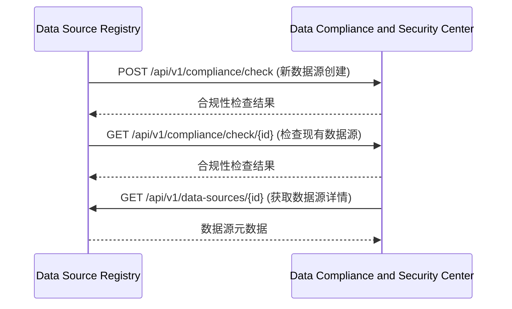
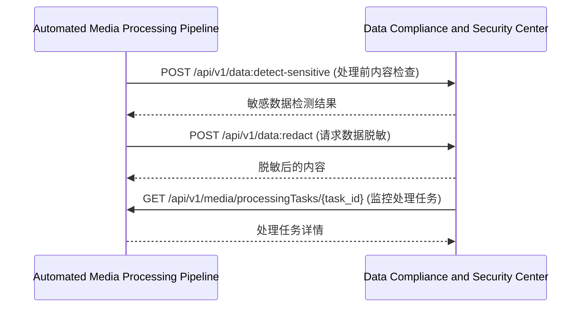
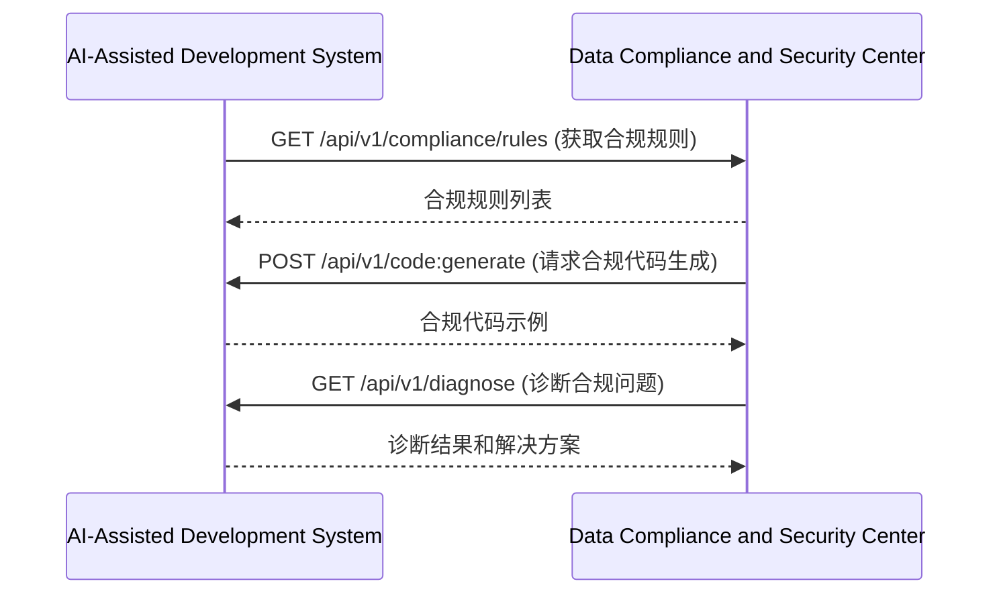
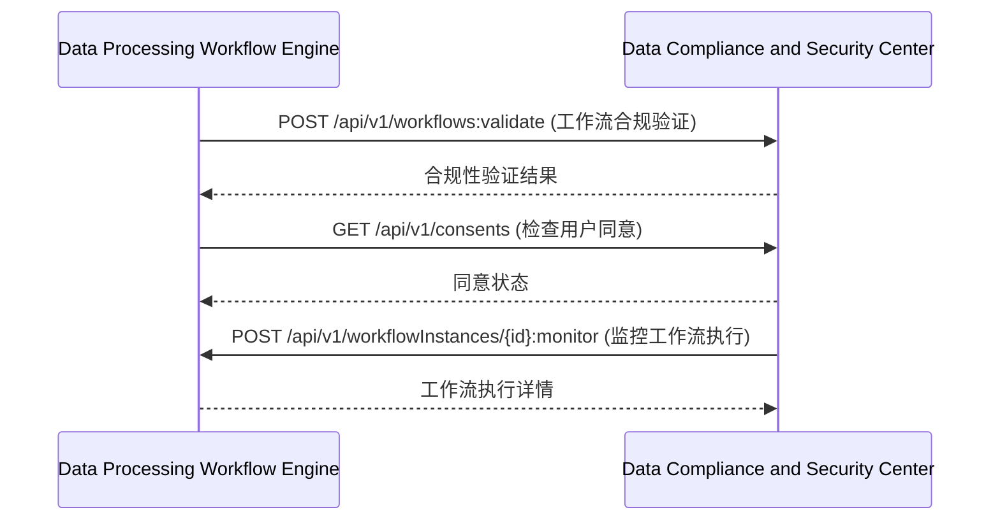

# 镜界平台终极技术规格说明书（模块级深度实现）

## 目录

### 7. 数据合规与安全中心 (Data Compliance and Security Center)
- [7.1 模块概述](#71-模块概述)
- [7.2 详细功能清单](#72-详细功能清单)
  - [7.2.1 核心功能](#721-核心功能)
  - [7.2.2 高级功能](#722-高级功能)
- [7.3 技术架构](#73-技术架构)
  - [7.3.1 架构图](#731-架构图)
  - [7.3.2 服务边界与交互](#732-服务边界与交互)
- [7.4 核心组件详细实现](#74-核心组件详细实现)
  - [7.4.1 合规规则引擎](#741-合规规则引擎)
  - [7.4.2 敏感数据检测器](#742-敏感数据检测器)
- [7.5 数据模型详细定义](#75-数据模型详细定义)
  - [7.5.1 合规规则表](#751-合规规则表)
  - [7.5.2 敏感数据模式表](#752-敏感数据模式表)
  - [7.5.3 合规性检查结果表](#753-合规性检查结果表)
  - [7.5.4 敏感数据检测结果表](#754-敏感数据检测结果表)
  - [7.5.5 用户同意记录表](#755-用户同意记录表)
- [7.6 API详细规范](#76-api详细规范)
  - [7.6.1 合规性检查API](#761-合规性检查api)
  - [7.6.2 敏感数据检测API](#762-敏感数据检测api)
  - [7.6.3 用户同意管理API](#763-用户同意管理api)
- [7.7 性能优化策略](#77-性能优化策略)
  - [7.7.1 敏感数据检测优化](#771-敏感数据检测优化)
  - [7.7.2 合规性检查优化](#772-合规性检查优化)
- [7.8 安全考虑](#78-安全考虑)
  - [7.8.1 数据安全策略](#781-数据安全策略)
  - [7.8.2 合规性审计](#782-合规性审计)
- [7.9 与其他模块的交互](#79-与其他模块的交互)
  - [7.9.1 与数据源注册中心交互](#791-与数据源注册中心交互)
  - [7.9.2 与自动化媒体处理管道交互](#792-与自动化媒体处理管道交互)
  - [7.9.3 与数据处理工作流引擎交互](#793-与数据处理工作流引擎交互)

## 7. 数据合规与安全中心 (Data Compliance and Security Center)

### 7.1 模块概述
数据合规与安全中心是镜界平台的数据安全与合规性管理组件，负责确保所有数据采集、处理和存储活动符合法律法规要求。它提供全面的数据安全策略管理、隐私保护机制和合规性审计功能。

### 7.2 详细功能清单

#### 7.2.1 核心功能
- **合规性检查**
  - GDPR合规性检查
  - CCPA合规性检查
  - 本地化数据法规检查
  - 行业特定法规检查（如HIPAA、PCI DSS）
- **数据安全策略管理**
  - 敏感数据检测规则
  - 数据脱敏策略
  - 数据保留策略
  - 数据访问控制策略
- **隐私保护机制**
  - 个人身份信息(PII)检测
  - 数据最小化实施
  - 用户同意管理
  - 数据主体权利处理
- **安全审计与监控**
  - 数据访问审计
  - 安全事件监控
  - 合规性报告生成
  - 风险评估与管理

#### 7.2.2 高级功能
- **自动化合规工作流**
  - 合规性任务自动化
  - 合规性检查计划
  - 合规性问题跟踪
  - 合规性状态看板
- **数据地图与血缘**
  - 数据流可视化
  - 数据血缘追踪
  - 数据存储位置映射
  - 数据使用情况分析
- **跨境数据传输管理**
  - 数据传输影响评估
  - 传输加密策略
  - 数据驻留管理
  - 传输日志审计
- **第三方数据处理商管理**
  - 供应商合规性评估
  - 数据处理协议管理
  - 供应商风险监控
  - 供应商审计跟踪

### 7.3 技术架构

#### 7.3.1 架构图
```
┌───────────────────────────────────────────────────────────────────────────────────────────────┐
│                           数据合规与安全中心 (DCSC)                                           │
├───────────────────────┬───────────────────────┬───────────────────────────────────────────────┤
│  合规控制层           │  策略执行层           │  数据分析层                                │
├───────────────────────┼───────────────────────┼───────────────────────────────────────────────┤
│ • 合规规则引擎        │ • 敏感数据检测器      │ • 数据血缘分析器                           │
│ • 同意管理系统        │ • 数据脱敏处理器      │ • 风险评估引擎                            │
│ • 数据主体请求处理    │ • 访问控制执行器      │ • 合规性报告生成器                         │
│ • 合规状态监控        │ • 传输加密处理器      │ • 审计日志分析器                           │
└───────────────────────┴───────────────────────┴───────────────────────────────────────────────┘
```

#### 7.3.2 服务边界与交互
- **输入**：
  - 数据源元数据（来自数据源注册中心）
  - 数据处理日志（来自数据处理工作流引擎）
  - 数据内容（来自自动化媒体处理管道）
  - 用户操作（来自各模块）
- **输出**：
  - 合规性检查结果
  - 安全告警
  - 合规性报告
  - 数据处理建议

### 7.4 核心组件详细实现

#### 7.4.1 合规规则引擎

**技术实现：**
```python
import re
from typing import Dict, List, Optional, Tuple
import logging

class ComplianceRuleEngine:
    """合规规则引擎，执行合规性检查"""
    
    def __init__(
        self,
        rule_repository: ComplianceRuleRepository,
        config: Config
    ):
        self.rule_repository = rule_repository
        self.config = config
        self.logger = logging.getLogger(__name__)
    
    def check_compliance(
        self,
        data_source: DataSource,
        data_content: Optional[bytes] = None
    ) -> ComplianceCheckResult:
        """
        检查数据源的合规性
        
        :param data_source: 数据源对象
        :param data_content: 数据内容（可选）
        :return: 合规性检查结果
        """
        # 1. 获取适用的合规规则
        applicable_rules = self._get_applicable_rules(data_source)
        
        # 2. 执行规则检查
        results = []
        for rule in applicable_rules:
            result = self._check_rule(rule, data_source, data_content)
            results.append(result)
        
        # 3. 生成汇总结果
        return self._generate_summary(data_source, results)
    
    def _get_applicable_rules(self, data_source: DataSource) -> List[ComplianceRule]:
        """获取适用于数据源的合规规则"""
        # 1. 获取数据源所在地区
        region = self._determine_region(data_source)
        
        # 2. 获取数据类型
        data_type = self._determine_data_type(data_source)
        
        # 3. 获取适用规则
        return self.rule_repository.get_rules(
            regions=[region],
            data_types=[data_type],
            active=True
        )
    
    def _determine_region(self, data_source: DataSource) -> str:
        """确定数据源所在地区"""
        # 1. 检查URL中的国家代码
        url = data_source.url.lower()
        
        # 常见国家代码顶级域
        country_tlds = {
            ".uk": "gb",
            ".de": "de",
            ".fr": "fr",
            ".es": "es",
            ".it": "it",
            ".jp": "jp",
            ".cn": "cn",
            ".us": "us",
            ".ca": "ca",
            ".au": "au"
        }
        
        for tld, region in country_tlds.items():
            if tld in url:
                return region
        
        # 2. 检查IP地理位置（如果实现）
        # ...
        
        # 3. 默认为国际
        return "international"
    
    def _determine_data_type(self, data_source: DataSource) -> str:
        """确定数据类型"""
        # 1. 检查数据源类型
        if data_source.data_type == "user-generated":
            return "personal"
        
        # 2. 检查内容类型
        content_type = data_source.content_type or ""
        if "json" in content_type or "xml" in content_type:
            return "structured"
        
        # 3. 默认类型
        return "general"
    
    def _check_rule(
        self,
        rule: ComplianceRule,
        data_source: DataSource,
        data_content: Optional[bytes]
    ) -> RuleCheckResult:
        """检查单个规则"""
        # 1. 检查规则是否适用
        if not self._is_rule_applicable(rule, data_source):
            return RuleCheckResult(
                rule_id=rule.id,
                rule_name=rule.name,
                applicable=False,
                passed=None,
                message="规则不适用"
            )
        
        # 2. 执行规则检查
        try:
            if rule.check_type == "metadata":
                result = self._check_metadata_rule(rule, data_source)
            elif rule.check_type == "content":
                if data_content is None:
                    result = RuleCheckResult(
                        rule_id=rule.id,
                        rule_name=rule.name,
                        applicable=True,
                        passed=False,
                        message="需要内容检查，但未提供内容"
                    )
                else:
                    result = self._check_content_rule(rule, data_content)
            else:
                result = RuleCheckResult(
                    rule_id=rule.id,
                    rule_name=rule.name,
                    applicable=True,
                    passed=False,
                    message=f"不支持的规则类型: {rule.check_type}"
                )
            
            return result
            
        except Exception as e:
            return RuleCheckResult(
                rule_id=rule.id,
                rule_name=rule.name,
                applicable=True,
                passed=False,
                message=f"规则检查失败: {str(e)}"
            )
    
    def _is_rule_applicable(
        self,
        rule: ComplianceRule,
        data_source: DataSource
    ) -> bool:
        """检查规则是否适用于数据源"""
        # 1. 检查地区适用性
        if rule.regions and self._determine_region(data_source) not in rule.regions:
            return False
        
        # 2. 检查数据类型适用性
        if rule.data_types and self._determine_data_type(data_source) not in rule.data_types:
            return False
        
        # 3. 检查数据源分类适用性
        if rule.categories and data_source.category not in rule.categories:
            return False
        
        return True
    
    def _check_metadata_rule(
        self,
        rule: ComplianceRule,
        data_source: DataSource
    ) -> RuleCheckResult:
        """检查元数据规则"""
        # 1. 提取检查参数
        field = rule.parameters.get("field")
        operator = rule.parameters.get("operator")
        value = rule.parameters.get("value")
        
        if not field or not operator:
            return RuleCheckResult(
                rule_id=rule.id,
                rule_name=rule.name,
                applicable=True,
                passed=False,
                message="规则配置不完整"
            )
        
        # 2. 获取字段值
        field_value = self._get_metadata_field(data_source, field)
        if field_value is None:
            return RuleCheckResult(
                rule_id=rule.id,
                rule_name=rule.name,
                applicable=True,
                passed=False,
                message=f"元数据字段 '{field}' 不存在"
            )
        
        # 3. 执行检查
        passed = self._evaluate_condition(field_value, operator, value)
        
        # 4. 生成结果
        return RuleCheckResult(
            rule_id=rule.id,
            rule_name=rule.name,
            applicable=True,
            passed=passed,
            message=self._generate_message(rule, field_value, passed)
        )
    
    def _get_metadata_field(
        self,
        data_source: DataSource,
        field: str
    ) -> Optional[Any]:
        """获取元数据字段值"""
        if field == "url":
            return data_source.url
        elif field == "category":
            return data_source.category
        elif field == "data_type":
            return data_source.data_type
        elif field == "content_type":
            return data_source.content_type
        elif field.startswith("metadata."):
            key = field.split(".", 1)[1]
            return data_source.metadata.get(key)
        
        return None
    
    def _evaluate_condition(
        self,
        actual: Any,
        operator: str,
        expected: Any
    ) -> bool:
        """评估条件表达式"""
        if operator == "eq":
            return actual == expected
        elif operator == "neq":
            return actual != expected
        elif operator == "contains":
            return expected in str(actual)
        elif operator == "regex":
            return bool(re.search(expected, str(actual)))
        elif operator == "in":
            return actual in expected.split(",")
        elif operator == "not_in":
            return actual not in expected.split(",")
        
        return False
    
    def _generate_message(
        self,
        rule: ComplianceRule,
        field_value: Any,
        passed: bool
    ) -> str:
        """生成检查结果消息"""
        if passed:
            return f"规则通过: {rule.description}"
        
        return f"规则失败: {rule.description} (检测到: {field_value})"
    
    def _check_content_rule(
        self,
        rule: ComplianceRule,
        data_content: bytes
    ) -> RuleCheckResult:
        """检查内容规则"""
        # 1. 检查内容类型
        if rule.content_type not in ["text", "json", "xml", "html"]:
            return RuleCheckResult(
                rule_id=rule.id,
                rule_name=rule.name,
                applicable=True,
                passed=False,
                message=f"不支持的内容类型: {rule.content_type}"
            )
        
        # 2. 解析内容
        try:
            content = self._parse_content(data_content, rule.content_type)
        except Exception as e:
            return RuleCheckResult(
                rule_id=rule.id,
                rule_name=rule.name,
                applicable=True,
                passed=False,
                message=f"内容解析失败: {str(e)}"
            )
        
        # 3. 执行检查
        findings = []
        for pattern in rule.patterns:
            matches = self._find_pattern_matches(pattern, content)
            if matches:
                findings.extend(matches)
        
        # 4. 生成结果
        passed = len(findings) == 0
        message = self._generate_content_message(rule, findings)
        
        return RuleCheckResult(
            rule_id=rule.id,
            rule_name=rule.name,
            applicable=True,
            passed=passed,
            message=message,
            details={"findings": findings}
        )
    
    def _parse_content(
        self,
        content: bytes,
        content_type: str
    ) -> Any:
        """解析内容"""
        # 尝试解码为UTF-8
        try:
            text = content.decode('utf-8')
        except UnicodeDecodeError:
            text = content.decode('latin-1')
        
        # 根据内容类型进一步处理
        if content_type == "json":
            try:
                return json.loads(text)
            except json.JSONDecodeError:
                return text
        elif content_type in ["xml", "html"]:
            # 返回原始文本，由模式匹配处理
            return text
        else:
            return text
    
    def _find_pattern_matches(
        self,
        pattern: CompliancePattern,
        content: Any
    ) -> List[Dict]:
        """查找模式匹配"""
        matches = []
        
        if isinstance(content, str):
            # 在文本中搜索
            for match in re.finditer(pattern.regex, content):
                matches.append({
                    "pattern_id": pattern.id,
                    "start": match.start(),
                    "end": match.end(),
                    "value": match.group(0),
                    "context": self._get_context(content, match.start(), match.end())
                })
        
        elif isinstance(content, dict):
            # 递归搜索字典
            self._search_dict(content, pattern, "", matches)
        
        elif isinstance(content, list):
            # 递归搜索列表
            self._search_list(content, pattern, "", matches)
        
        return matches
    
    def _get_context(
        self,
        text: str,
        start: int,
        end: int,
        context_size: int = 20
    ) -> str:
        """获取匹配上下文"""
        context_start = max(0, start - context_size)
        context_end = min(len(text), end + context_size)
        return text[context_start:context_start] + "[...]" + text[end:context_end]
    
    def _search_dict(
        self,
        obj: Dict,
        pattern: CompliancePattern,
        path: str,
        matches: List[Dict]
    ):
        """在字典中搜索模式"""
        for key, value in obj.items():
            current_path = f"{path}.{key}" if path else key
            
            # 检查键
            if re.search(pattern.regex, key):
                matches.append({
                    "pattern_id": pattern.id,
                    "path": current_path,
                    "value": key,
                    "type": "key"
                })
            
            # 检查值
            if isinstance(value, (str, int, float)):
                value_str = str(value)
                for match in re.finditer(pattern.regex, value_str):
                    matches.append({
                        "pattern_id": pattern.id,
                        "path": current_path,
                        "value": value_str[match.start():match.end()],
                        "start": match.start(),
                        "end": match.end(),
                        "type": "value"
                    })
            
            # 递归搜索
            elif isinstance(value, dict):
                self._search_dict(value, pattern, current_path, matches)
            elif isinstance(value, list):
                self._search_list(value, pattern, current_path, matches)
    
    def _search_list(
        self,
        obj: List,
        pattern: CompliancePattern,
        path: str,
        matches: List[Dict]
    ):
        """在列表中搜索模式"""
        for i, item in enumerate(obj):
            current_path = f"{path}[{i}]"
            
            # 检查值
            if isinstance(item, (str, int, float)):
                value_str = str(item)
                for match in re.finditer(pattern.regex, value_str):
                    matches.append({
                        "pattern_id": pattern.id,
                        "path": current_path,
                        "value": value_str[match.start():match.end()],
                        "start": match.start(),
                        "end": match.end(),
                        "type": "value"
                    })
            
            # 递归搜索
            elif isinstance(item, dict):
                self._search_dict(item, pattern, current_path, matches)
            elif isinstance(item, list):
                self._search_list(item, pattern, current_path, matches)
    
    def _generate_content_message(
        self,
        rule: ComplianceRule,
        findings: List[Dict]
    ) -> str:
        """生成内容检查消息"""
        if not findings:
            return f"规则通过: {rule.description}"
        
        return f"规则失败: {rule.description} (检测到 {len(findings)} 处敏感数据)"
    
    def _generate_summary(
        self,
        data_source: DataSource,
        results: List[RuleCheckResult]
    ) -> ComplianceCheckResult:
        """生成合规性检查汇总"""
        # 统计结果
        total = len(results)
        passed = sum(1 for r in results if r.passed)
        failed = sum(1 for r in results if not r.passed and r.applicable)
        not_applicable = sum(1 for r in results if not r.applicable)
        
        # 生成状态
        if failed == 0:
            status = "compliant"
        elif failed <= self.config.warning_threshold:
            status = "warning"
        else:
            status = "non_compliant"
        
        # 生成关键问题
        critical_issues = [
            r for r in results 
            if not r.passed and r.applicable and r.rule_severity == "critical"
        ]
        
        # 生成建议
        suggestions = self._generate_suggestions(results)
        
        return ComplianceCheckResult(
            data_source_id=data_source.id,
            project_id=data_source.project_id,
            status=status,
            total_rules=total,
            passed_rules=passed,
            failed_rules=failed,
            not_applicable_rules=not_applicable,
            critical_issues=len(critical_issues),
            results=results,
            suggestions=suggestions,
            timestamp=datetime.utcnow()
        )
    
    def _generate_suggestions(self, results: List[RuleCheckResult]) -> List[str]:
        """生成合规性建议"""
        suggestions = []
        
        # 1. 针对失败的关键规则
        critical_failures = [
            r for r in results 
            if not r.passed and r.applicable and r.rule_severity == "critical"
        ]
        for result in critical_failures[:3]:  # 只取前3个
            suggestions.append(f"必须解决: {result.rule_name} - {result.message}")
        
        # 2. 针对警告级别的规则
        warning_failures = [
            r for r in results 
            if not r.passed and r.applicable and r.rule_severity == "warning"
        ]
        if warning_failures:
            suggestions.append(f"建议改进: 检测到 {len(warning_failures)} 个可优化的合规性问题")
        
        # 3. 一般建议
        if not suggestions:
            suggestions.append("数据源符合所有关键合规性要求")
        
        return suggestions

class ComplianceRuleRepository:
    """合规规则仓库"""
    
    def __init__(self, db: Database):
        self.db = db
        self.logger = logging.getLogger(__name__)
    
    def get_rules(
        self,
        regions: List[str] = None,
        data_types: List[str] = None,
        categories: List[str] = None,
        active: bool = True
    ) -> List[ComplianceRule]:
        """获取合规规则"""
        # 构建查询
        conditions = []
        params = {"active": active}
        
        if regions:
            conditions.append("regions && %(regions)s::varchar[]")
            params["regions"] = regions
        if data_types:
            conditions.append("data_types && %(data_types)s::varchar[]")
            params["data_types"] = data_types
        if categories:
            conditions.append("categories && %(categories)s::varchar[]")
            params["categories"] = categories
        
        where_clause = "WHERE active = %(active)s"
        if conditions:
            where_clause += " AND " + " AND ".join(conditions)
        
        sql = f"""
        SELECT * FROM compliance_rules 
        {where_clause}
        ORDER BY severity DESC, priority
        """
        
        rows = self.db.fetchall(sql, params)
        return [self._row_to_rule(row) for row in rows]
    
    def get_rule(self, rule_id: str) -> Optional[ComplianceRule]:
        """获取单个合规规则"""
        sql = "SELECT * FROM compliance_rules WHERE id = %(id)s"
        row = self.db.fetchone(sql, {"id": rule_id})
        return self._row_to_rule(row) if row else None
    
    def _row_to_rule(self, row: Dict) -> ComplianceRule:
        """将数据库行转换为ComplianceRule对象"""
        return ComplianceRule(
            id=row["id"],
            name=row["name"],
            description=row["description"],
            regulation=row["regulation"],
            severity=row["severity"],
            check_type=row["check_type"],
            content_type=row["content_type"],
            regions=json.loads(row["regions"]) if row["regions"] else [],
            data_types=json.loads(row["data_types"]) if row["data_types"] else [],
            categories=json.loads(row["categories"]) if row["categories"] else [],
            parameters=json.loads(row["parameters"]) if row["parameters"] else {},
            patterns=self._decode_patterns(row["patterns"]),
            priority=row["priority"],
            active=row["active"],
            created_at=row["created_at"],
            updated_at=row["updated_at"]
        )
    
    def _decode_patterns(self, json_data: str) -> List[CompliancePattern]:
        """解码模式定义"""
        if not json_data:
            return []
        
        patterns_data = json.loads(json_data)
        return [
            CompliancePattern(
                id=p["id"],
                name=p["name"],
                description=p.get("description", ""),
                regex=p["regex"],
                data_category=p["data_category"],
                severity=p["severity"]
            ) for p in patterns_data
        ]

# 辅助类定义
class ComplianceRule:
    """合规规则"""
    def __init__(
        self,
        id: str,
        name: str,
        description: str,
        regulation: str,
        severity: str,
        check_type: str,
        content_type: str,
        regions: List[str],
        data_types: List[str],
        categories: List[str],
        parameters: Dict,
        patterns: List,
        priority: int,
        active: bool,
        created_at: datetime,
        updated_at: datetime
    ):
        self.id = id
        self.name = name
        self.description = description
        self.regulation = regulation
        self.severity = severity
        self.check_type = check_type
        self.content_type = content_type
        self.regions = regions
        self.data_types = data_types
        self.categories = categories
        self.parameters = parameters
        self.patterns = patterns
        self.priority = priority
        self.active = active
        self.created_at = created_at
        self.updated_at = updated_at

class CompliancePattern:
    """合规模式"""
    def __init__(
        self,
        id: str,
        name: str,
        description: str,
        regex: str,
        data_category: str,
        severity: str
    ):
        self.id = id
        self.name = name
        self.description = description
        self.regex = regex
        self.data_category = data_category
        self.severity = severity

class RuleCheckResult:
    """规则检查结果"""
    def __init__(
        self,
        rule_id: str,
        rule_name: str,
        applicable: bool,
        passed: Optional[bool],
        message: str,
        details: Optional[Dict] = None
    ):
        self.rule_id = rule_id
        self.rule_name = rule_name
        self.applicable = applicable
        self.passed = passed
        self.message = message
        self.details = details or {}
        self.rule_severity = "warning"  # 可以从规则中获取

class ComplianceCheckResult:
    """合规性检查结果"""
    def __init__(
        self,
        data_source_id: str,
        project_id: str,
        status: str,
        total_rules: int,
        passed_rules: int,
        failed_rules: int,
        not_applicable_rules: int,
        critical_issues: int,
        results: List[RuleCheckResult],
        suggestions: List[str],
        timestamp: datetime
    ):
        self.data_source_id = data_source_id
        self.project_id = project_id
        self.status = status
        self.total_rules = total_rules
        self.passed_rules = passed_rules
        self.failed_rules = failed_rules
        self.not_applicable_rules = not_applicable_rules
        self.critical_issues = critical_issues
        self.results = results
        self.suggestions = suggestions
        self.timestamp = timestamp
```

#### 7.4.2 敏感数据检测器

**技术实现：**
```python
import re
import json
from typing import Dict, List, Optional, Tuple
import logging
import hashlib

class SensitiveDataDetector:
    """敏感数据检测器，检测数据中的敏感信息"""
    
    def __init__(
        self,
        pattern_repository: PatternRepository,
        config: Config
    ):
        self.pattern_repository = pattern_repository
        self.config = config
        self.logger = logging.getLogger(__name__)
    
    def detect(
        self,
        data: Any,
        context: Optional[Dict] = None
    ) -> SensitiveDataDetectionResult:
        """
        检测数据中的敏感信息
        
        :param data: 要检测的数据
        :param context: 上下文信息
        :return: 检测结果
        """
        # 1. 获取敏感数据模式
        patterns = self.pattern_repository.get_patterns(
            categories=context.get("categories") if context else None,
            regions=context.get("regions") if context else None
        )
        
        # 2. 执行检测
        findings = self._scan_data(data, patterns)
        
        # 3. 生成结果
        return SensitiveDataDetectionResult(
            data_hash=self._calculate_data_hash(data),
            total_patterns=len(patterns),
            findings=findings,
            context=context or {},
            timestamp=datetime.utcnow()
        )
    
    def _calculate_data_hash(self, data: Any) -> str:
        """计算数据哈希"""
        # 简单实现：转换为JSON并计算哈希
        try:
            data_str = json.dumps(data, sort_keys=True)
            return hashlib.sha256(data_str.encode('utf-8')).hexdigest()
        except:
            return "unknown"
    
    def _scan_data(
        self,
        data: Any,
        patterns: List[DataPattern]
    ) -> List[DataFinding]:
        """扫描数据中的敏感信息"""
        findings = []
        
        if isinstance(data, str):
            # 扫描字符串
            for pattern in patterns:
                for match in re.finditer(pattern.regex, data):
                    findings.append(DataFinding(
                        pattern_id=pattern.id,
                        pattern_name=pattern.name,
                        data_category=pattern.data_category,
                        start=match.start(),
                        end=match.end(),
                        value=match.group(0),
                        context=self._get_context(data, match.start(), match.end())
                    ))
        
        elif isinstance(data, dict):
            # 递归扫描字典
            for key, value in data.items():
                # 检查键
                for pattern in patterns:
                    if re.search(pattern.regex, key):
                        findings.append(DataFinding(
                            pattern_id=pattern.id,
                            pattern_name=pattern.name,
                            data_category=pattern.data_category,
                            path=key,
                            value=key,
                            type="key",
                            context=f"Key: {key}"
                        ))
                
                # 检查值
                sub_findings = self._scan_data(value, patterns)
                for finding in sub_findings:
                    finding.path = f"{key}.{finding.path}" if finding.path else key
                    findings.append(finding)
        
        elif isinstance(data, list):
            # 递归扫描列表
            for i, item in enumerate(data):
                sub_findings = self._scan_data(item, patterns)
                for finding in sub_findings:
                    finding.path = f"[{i}]{finding.path}"
                    findings.append(finding)
        
        return findings
    
    def _get_context(
        self,
        text: str,
        start: int,
        end: int,
        context_size: int = 20
    ) -> str:
        """获取匹配上下文"""
        context_start = max(0, start - context_size)
        context_end = min(len(text), end + context_size)
        return text[context_start:start] + "[...]" + text[end:context_end]

class PatternRepository:
    """敏感数据模式仓库"""
    
    def __init__(self, db: Database):
        self.db = db
        self.logger = logging.getLogger(__name__)
    
    def get_patterns(
        self,
        categories: List[str] = None,
        regions: List[str] = None
    ) -> List[DataPattern]:
        """获取敏感数据模式"""
        # 构建查询
        conditions = []
        params = {}
        
        if categories:
            conditions.append("categories && %(categories)s::varchar[]")
            params["categories"] = categories
        if regions:
            conditions.append("regions && %(regions)s::varchar[]")
            params["regions"] = regions
        
        where_clause = "WHERE active = true"
        if conditions:
            where_clause += " AND " + " AND ".join(conditions)
        
        sql = f"""
        SELECT * FROM sensitive_data_patterns 
        {where_clause}
        ORDER BY severity DESC, priority
        """
        
        rows = self.db.fetchall(sql, params)
        return [self._row_to_pattern(row) for row in rows]
    
    def get_pattern(self, pattern_id: str) -> Optional[DataPattern]:
        """获取单个敏感数据模式"""
        sql = "SELECT * FROM sensitive_data_patterns WHERE id = %(id)s"
        row = self.db.fetchone(sql, {"id": pattern_id})
        return self._row_to_pattern(row) if row else None
    
    def _row_to_pattern(self, row: Dict) -> DataPattern:
        """将数据库行转换为DataPattern对象"""
        return DataPattern(
            id=row["id"],
            name=row["name"],
            description=row["description"],
            regex=row["regex"],
            data_category=row["data_category"],
            severity=row["severity"],
            categories=json.loads(row["categories"]) if row["categories"] else [],
            regions=json.loads(row["regions"]) if row["regions"] else [],
            validation_rules=json.loads(row["validation_rules"]) if row["validation_rules"] else [],
            redaction_template=row["redaction_template"],
            priority=row["priority"],
            active=row["active"],
            created_at=row["created_at"],
            updated_at=row["updated_at"]
        )

# 辅助类定义
class DataPattern:
    """敏感数据模式"""
    def __init__(
        self,
        id: str,
        name: str,
        description: str,
        regex: str,
        data_category: str,
        severity: str,
        categories: List[str],
        regions: List[str],
        validation_rules: List[Dict],
        redaction_template: str,
        priority: int,
        active: bool,
        created_at: datetime,
        updated_at: datetime
    ):
        self.id = id
        self.name = name
        self.description = description
        self.regex = regex
        self.data_category = data_category
        self.severity = severity
        self.categories = categories
        self.regions = regions
        self.validation_rules = validation_rules
        self.redaction_template = redaction_template
        self.priority = priority
        self.active = active
        self.created_at = created_at
        self.updated_at = updated_at

class DataFinding:
    """数据发现"""
    def __init__(
        self,
        pattern_id: str,
        pattern_name: str,
        data_category: str,
        start: Optional[int] = None,
        end: Optional[int] = None,
        value: str = "",
        context: str = "",
        path: str = "",
        type: str = "value"
    ):
        self.pattern_id = pattern_id
        self.pattern_name = pattern_name
        self.data_category = data_category
        self.start = start
        self.end = end
        self.value = value
        self.context = context
        self.path = path
        self.type = type

class SensitiveDataDetectionResult:
    """敏感数据检测结果"""
    def __init__(
        self,
        data_hash: str,
        total_patterns: int,
        findings: List[DataFinding],
        context: Dict,
        timestamp: datetime
    ):
        self.data_hash = data_hash
        self.total_patterns = total_patterns
        self.findings = findings
        self.context = context
        self.timestamp = timestamp
        self.severity = self._calculate_severity()
    
    def _calculate_severity(self) -> str:
        """计算检测结果严重程度"""
        if not self.findings:
            return "none"
        
        # 检查是否有关键发现
        has_critical = any(f.data_category == "critical" for f in self.findings)
        if has_critical:
            return "critical"
        
        # 检查发现数量
        if len(self.findings) > 5:
            return "high"
        elif len(self.findings) > 2:
            return "medium"
        
        return "low"
```

### 7.5 数据模型详细定义

#### 7.5.1 合规规则表

```sql
-- 合规规则表
CREATE TABLE compliance_rules (
    id UUID PRIMARY KEY DEFAULT gen_random_uuid(),
    name VARCHAR(255) NOT NULL,
    description TEXT NOT NULL,
    regulation VARCHAR(50) NOT NULL CHECK (regulation IN ('gdpr', 'ccpa', 'hipaa', 'pci_dss', 'local')),
    severity VARCHAR(20) NOT NULL CHECK (severity IN ('critical', 'warning', 'info')),
    check_type VARCHAR(20) NOT NULL CHECK (check_type IN ('metadata', 'content')),
    content_type VARCHAR(20) CHECK (content_type IN ('text', 'json', 'xml', 'html')),
    regions VARCHAR(10)[] DEFAULT '{}'::varchar[],
    data_types VARCHAR(50)[] DEFAULT '{}'::varchar[],
    categories VARCHAR(50)[] DEFAULT '{}'::varchar[],
    parameters JSONB DEFAULT '{}'::jsonb,
    patterns JSONB DEFAULT '[]'::jsonb,
    priority INT NOT NULL DEFAULT 50,
    active BOOLEAN NOT NULL DEFAULT true,
    created_at TIMESTAMPTZ NOT NULL DEFAULT NOW(),
    updated_at TIMESTAMPTZ NOT NULL DEFAULT NOW(),
    
    -- 索引
    INDEX idx_rules_regulation ON compliance_rules(regulation),
    INDEX idx_rules_severity ON compliance_rules(severity),
    INDEX idx_rules_active ON compliance_rules(active),
    INDEX idx_rules_priority ON compliance_rules(priority)
);

-- 自动更新updated_at触发器
CREATE OR REPLACE FUNCTION update_compliance_rules_modtime()
RETURNS TRIGGER AS $$
BEGIN
    NEW.updated_at = NOW();
    RETURN NEW;
END;
$$ LANGUAGE plpgsql;

CREATE TRIGGER update_compliance_rules_modtime
BEFORE UPDATE ON compliance_rules
FOR EACH ROW
EXECUTE FUNCTION update_compliance_rules_modtime();
```

#### 7.5.2 敏感数据模式表

```sql
-- 敏感数据模式表
CREATE TABLE sensitive_data_patterns (
    id UUID PRIMARY KEY DEFAULT gen_random_uuid(),
    name VARCHAR(255) NOT NULL,
    description TEXT NOT NULL,
    regex TEXT NOT NULL,
    data_category VARCHAR(50) NOT NULL,
    severity VARCHAR(20) NOT NULL CHECK (severity IN ('critical', 'high', 'medium', 'low')),
    categories VARCHAR(50)[] DEFAULT '{}'::varchar[],
    regions VARCHAR(10)[] DEFAULT '{}'::varchar[],
    validation_rules JSONB DEFAULT '[]'::jsonb,
    redaction_template VARCHAR(255) NOT NULL,
    priority INT NOT NULL DEFAULT 50,
    active BOOLEAN NOT NULL DEFAULT true,
    created_at TIMESTAMPTZ NOT NULL DEFAULT NOW(),
    updated_at TIMESTAMPTZ NOT NULL DEFAULT NOW(),
    
    -- 索引
    INDEX idx_patterns_category ON sensitive_data_patterns(data_category),
    INDEX idx_patterns_severity ON sensitive_data_patterns(severity),
    INDEX idx_patterns_active ON sensitive_data_patterns(active),
    INDEX idx_patterns_priority ON sensitive_data_patterns(priority)
);

-- 自动更新updated_at触发器
CREATE OR REPLACE FUNCTION update_sensitive_data_patterns_modtime()
RETURNS TRIGGER AS $$
BEGIN
    NEW.updated_at = NOW();
    RETURN NEW;
END;
$$ LANGUAGE plpgsql;

CREATE TRIGGER update_sensitive_data_patterns_modtime
BEFORE UPDATE ON sensitive_data_patterns
FOR EACH ROW
EXECUTE FUNCTION update_sensitive_data_patterns_modtime();
```

#### 7.5.3 合规性检查结果表

```sql
-- 合规性检查结果表
CREATE TABLE compliance_checks (
    id UUID PRIMARY KEY DEFAULT gen_random_uuid(),
    data_source_id UUID NOT NULL REFERENCES data_sources(id) ON DELETE CASCADE,
    project_id UUID NOT NULL REFERENCES projects(id) ON DELETE CASCADE,
    status VARCHAR(20) NOT NULL CHECK (status IN ('compliant', 'warning', 'non_compliant')),
    total_rules INT NOT NULL,
    passed_rules INT NOT NULL,
    failed_rules INT NOT NULL,
    not_applicable_rules INT NOT NULL,
    critical_issues INT NOT NULL,
    results JSONB NOT NULL,
    suggestions JSONB NOT NULL,
    timestamp TIMESTAMPTZ NOT NULL DEFAULT NOW(),
    
    -- 索引
    INDEX idx_checks_data_source ON compliance_checks(data_source_id),
    INDEX idx_checks_project ON compliance_checks(project_id),
    INDEX idx_checks_status ON compliance_checks(status),
    INDEX idx_checks_timestamp ON compliance_checks(timestamp DESC)
);
```

#### 7.5.4 敏感数据检测结果表

```sql
-- 敏感数据检测结果表
CREATE TABLE sensitive_data_detections (
    id UUID PRIMARY KEY DEFAULT gen_random_uuid(),
    data_hash VARCHAR(64) NOT NULL,
    data_source_id UUID NOT NULL REFERENCES data_sources(id) ON DELETE CASCADE,
    project_id UUID NOT NULL REFERENCES projects(id) ON DELETE CASCADE,
    total_patterns INT NOT NULL,
    severity VARCHAR(20) NOT NULL CHECK (severity IN ('none', 'low', 'medium', 'high', 'critical')),
    findings JSONB NOT NULL,
    context JSONB NOT NULL,
    timestamp TIMESTAMPTZ NOT NULL DEFAULT NOW(),
    
    -- 索引
    INDEX idx_detections_data_hash ON sensitive_data_detections(data_hash),
    INDEX idx_detections_data_source ON sensitive_data_detections(data_source_id),
    INDEX idx_detections_project ON sensitive_data_detections(project_id),
    INDEX idx_detections_severity ON sensitive_data_detections(severity),
    INDEX idx_detections_timestamp ON sensitive_data_detections(timestamp DESC)
);
```

#### 7.5.5 用户同意记录表

```sql
-- 用户同意记录表
CREATE TABLE user_consents (
    id UUID PRIMARY KEY DEFAULT gen_random_uuid(),
    user_id UUID NOT NULL REFERENCES users(id) ON DELETE CASCADE,
    data_source_id UUID NOT NULL REFERENCES data_sources(id) ON DELETE CASCADE,
    project_id UUID NOT NULL REFERENCES projects(id) ON DELETE CASCADE,
    consent_type VARCHAR(50) NOT NULL,
    consent_value BOOLEAN NOT NULL,
    consent_details JSONB DEFAULT '{}'::jsonb,
    consent_timestamp TIMESTAMPTZ NOT NULL DEFAULT NOW(),
    revoked BOOLEAN NOT NULL DEFAULT false,
    revoked_at TIMESTAMPTZ,
    
    -- 索引
    INDEX idx_consents_user ON user_consents(user_id),
    INDEX idx_consents_data_source ON user_consents(data_source_id),
    INDEX idx_consents_project ON user_consents(project_id),
    INDEX idx_consents_type ON user_consents(consent_type),
    INDEX idx_consents_timestamp ON user_consents(consent_timestamp DESC)
);
```

### 7.6 API详细规范

#### 7.6.1 合规性检查API

**检查数据源合规性 (POST /api/v1/compliance/check)**

*请求示例:*
```http
POST /api/v1/compliance/check HTTP/1.1
Host: dcsc.mirror-realm.com
Authorization: Bearer <access_token>
Content-Type: application/json

{
  "data_source_id": "ds-7a8b9c0d",
  "include_content": true
}
```

*成功响应示例:*
```http
HTTP/1.1 200 OK
Content-Type: application/json

{
  "data_source_id": "ds-7a8b9c0d",
  "project_id": "proj-123",
  "status": "warning",
  "total_rules": 15,
  "passed_rules": 12,
  "failed_rules": 2,
  "not_applicable_rules": 1,
  "critical_issues": 0,
  "results": [
    {
      "rule_id": "rule-gdpr-001",
      "rule_name": "个人数据标识检查",
      "applicable": true,
      "passed": false,
      "message": "检测到潜在的个人身份信息",
      "details": {
        "findings": [
          {
            "pattern_id": "pattern-email",
            "pattern_name": "电子邮件地址",
            "data_category": "personal",
            "start": 125,
            "end": 150,
            "value": "user@example.com",
            "context": "联系信息: user@example.com"
          }
        ]
      }
    },
    {
      "rule_id": "rule-gdpr-002",
      "rule_name": "数据最小化检查",
      "applicable": true,
      "passed": true,
      "message": "规则通过: 数据最小化要求已满足"
    }
  ],
  "suggestions": [
    "必须解决: 个人数据标识检查 - 检测到潜在的个人身份信息",
    "建议改进: 检测到 2 个可优化的合规性问题"
  ],
  "timestamp": "2023-06-15T10:30:45Z"
}
```

#### 7.6.2 敏感数据检测API

**检测敏感数据 (POST /api/v1/data:detect-sensitive)**

*请求示例:*
```http
POST /api/v1/data:detect-sensitive HTTP/1.1
Host: dcsc.mirror-realm.com
Authorization: Bearer <access_token>
Content-Type: application/json

{
  "data": {
    "name": "John Doe",
    "email": "john.doe@example.com",
    "phone": "+1-555-123-4567",
    "address": "123 Main St, Anytown, USA"
  },
  "context": {
    "categories": ["contact", "personal"],
    "regions": ["us"]
  }
}
```

*成功响应示例:*
```http
HTTP/1.1 200 OK
Content-Type: application/json

{
  "data_hash": "d41d8cd98f00b204e9800998ecf8427e",
  "total_patterns": 8,
  "findings": [
    {
      "pattern_id": "pattern-name",
      "pattern_name": "个人姓名",
      "data_category": "personal",
      "value": "John Doe",
      "context": "name: John Doe",
      "path": "name",
      "type": "value"
    },
    {
      "pattern_id": "pattern-email",
      "pattern_name": "电子邮件地址",
      "data_category": "personal",
      "value": "john.doe@example.com",
      "context": "email: john.doe@example.com",
      "path": "email",
      "type": "value"
    },
    {
      "pattern_id": "pattern-phone",
      "pattern_name": "电话号码",
      "data_category": "personal",
      "value": "+1-555-123-4567",
      "context": "phone: +1-555-123-4567",
      "path": "phone",
      "type": "value"
    }
  ],
  "context": {
    "categories": ["contact", "personal"],
    "regions": ["us"]
  },
  "severity": "high",
  "timestamp": "2023-06-15T10:35:20Z"
}
```

#### 7.6.3 用户同意管理API

**记录用户同意 (POST /api/v1/consents)**

*请求示例:*
```http
POST /api/v1/consents HTTP/1.1
Host: dcsc.mirror-realm.com
Authorization: Bearer <access_token>
Content-Type: application/json

{
  "user_id": "user-123",
  "data_source_id": "ds-7a8b9c0d",
  "consent_type": "data_processing",
  "consent_value": true,
  "consent_details": {
    "purpose": "数据采集与处理",
    "data_types": ["personal", "contact"],
    "retention_period": "2 years"
  }
}
```

*成功响应示例:*
```http
HTTP/1.1 201 Created
Content-Type: application/json
Location: /api/v1/consents/consent-1a2b3c4d

{
  "id": "consent-1a2b3c4d",
  "user_id": "user-123",
  "data_source_id": "ds-7a8b9c0d",
  "project_id": "proj-123",
  "consent_type": "data_processing",
  "consent_value": true,
  "consent_details": {
    "purpose": "数据采集与处理",
    "data_types": ["personal", "contact"],
    "retention_period": "2 years"
  },
  "consent_timestamp": "2023-06-15T10:30:45Z",
  "revoked": false
}
```

**获取用户同意记录 (GET /api/v1/consents/{user_id})**

*请求示例:*
```http
GET /api/v1/consents/user-123?data_source_id=ds-7a8b9c0d HTTP/1.1
Host: dcsc.mirror-realm.com
Authorization: Bearer <access_token>
```

*成功响应示例:*
```http
HTTP/1.1 200 OK
Content-Type: application/json

{
  "items": [
    {
      "id": "consent-1a2b3c4d",
      "user_id": "user-123",
      "data_source_id": "ds-7a8b9c0d",
      "project_id": "proj-123",
      "consent_type": "data_processing",
      "consent_value": true,
      "consent_details": {
        "purpose": "数据采集与处理",
        "data_types": ["personal", "contact"],
        "retention_period": "2 years"
      },
      "consent_timestamp": "2023-06-15T10:30:45Z",
      "revoked": false
    },
    {
      "id": "consent-5e6f7g8h",
      "user_id": "user-123",
      "data_source_id": "ds-7a8b9c0d",
      "project_id": "proj-123",
      "consent_type": "data_sharing",
      "consent_value": false,
      "consent_details": {
        "purpose": "与第三方共享数据",
        "data_types": ["personal"],
        "retention_period": "1 year"
      },
      "consent_timestamp": "2023-06-10T08:15:30Z",
      "revoked": true,
      "revoked_at": "2023-06-12T14:20:15Z"
    }
  ],
  "total": 2
}
```

### 7.7 性能优化策略

#### 7.7.1 敏感数据检测优化

1. **多阶段检测流水线**
   ```python
   class MultiStageDetector:
       """多阶段敏感数据检测器"""
       
       def __init__(self, detectors: List[Detector]):
           self.detectors = detectors
           self.logger = logging.getLogger(__name__)
       
       def detect(self, data: Any, context: Dict) -> DetectionResult:
           """执行多阶段检测"""
           findings = []
           stage_times = []
           
           for i, detector in enumerate(self.detectors):
               start_time = time.time()
               
               # 执行阶段检测
               stage_findings = detector.detect(data, context)
               findings.extend(stage_findings)
               
               # 记录时间
               stage_time = time.time() - start_time
               stage_times.append((detector.__class__.__name__, stage_time))
               
               # 檢查是否需要继续
               if self._should_terminate(i, stage_findings, context):
                   break
           
           # 生成结果
           return DetectionResult(
               findings=findings,
               stage_times=stage_times,
               total_time=sum(t[1] for t in stage_times)
           )
       
       def _should_terminate(
           self,
           stage_index: int,
           findings: List[DataFinding],
           context: Dict
       ) -> bool:
           """检查是否应该终止检测"""
           # 如果检测到关键敏感数据，提前终止
           if any(f.data_category == "critical" for f in findings):
               return True
           
           # 如果达到最大阶段数
           if stage_index >= self.config.max_detection_stages - 1:
               return True
           
           return False
   ```

2. **Aho-Corasick算法优化**
   ```python
   class AhoCorasickDetector:
       """使用Aho-Corasick算法的敏感数据检测器"""
       
       def __init__(self, patterns: List[str]):
           self.automaton = ahocorasick.Automaton()
           
           # 添加模式
           for idx, pattern in enumerate(patterns):
               self.automaton.add_word(pattern, (idx, pattern))
           
           # 构建自动机
           self.automaton.make_automaton()
       
       def detect(self, text: str) -> List[Match]:
           """检测文本中的模式"""
           matches = []
           
           # 执行匹配
           for end_index, (insert_order, original_value) in self.automaton.iter(text):
               start_index = end_index - len(original_value) + 1
               matches.append(Match(
                   start=start_index,
                   end=end_index + 1,
                   pattern=original_value
               ))
           
           return matches
   ```

#### 7.7.2 合规性检查优化

1. **规则优先级调度**
   ```python
   class RuleScheduler:
       """规则调度器，优化规则执行顺序"""
       
       def __init__(self, rules: List[ComplianceRule]):
           self.rules = rules
           self.logger = logging.getLogger(__name__)
       
       def schedule(self) -> List[ComplianceRule]:
           """调度规则执行顺序"""
           # 1. 按优先级排序
           sorted_rules = sorted(
               self.rules,
               key=lambda r: (r.severity_rank, -r.priority),
               reverse=True
           )
           
           # 2. 应用优化策略
           optimized_rules = self._apply_optimization(sorted_rules)
           
           return optimized_rules
       
       @property
       def severity_rank(self) -> int:
           """将严重程度转换为数值排名"""
           severity_ranks = {
               "critical": 4,
               "high": 3,
               "medium": 2,
               "low": 1
           }
           return severity_ranks.get(self.severity, 1)
       
       def _apply_optimization(self, rules: List[ComplianceRule]) -> List[ComplianceRule]:
           """应用优化策略"""
           # 1. 将元数据规则放在内容规则之前
           metadata_rules = [r for r in rules if r.check_type == "metadata"]
           content_rules = [r for r in rules if r.check_type == "content"]
           
           # 2. 在内容规则中，将简单规则放在复杂规则之前
           simple_content_rules = [r for r in content_rules if self._is_simple_rule(r)]
           complex_content_rules = [r for r in content_rules if not self._is_simple_rule(r)]
           
           return metadata_rules + simple_content_rules + complex_content_rules
       
       def _is_simple_rule(self, rule: ComplianceRule) -> bool:
           """检查规则是否简单"""
           # 简单规则：没有复杂的正则表达式
           if ".*" in rule.regex or ".+" in rule.regex:
               return False
           if len(rule.regex) > 50:
               return False
           return True
   ```

2. **规则结果缓存**
   ```python
   class RuleResultCache:
       """规则结果缓存"""
       
       def __init__(self, ttl=3600):
           self.cache = TTLCache(maxsize=10000, ttl=ttl)
           self.logger = logging.getLogger(__name__)
       
       def get(self, rule_id: str, data_hash: str) -> Optional[RuleCheckResult]:
           """获取缓存的规则结果"""
           key = f"{rule_id}:{data_hash}"
           return self.cache.get(key)
       
       def set(
           self,
           rule_id: str,
           data_hash: str,
           result: RuleCheckResult,
           timestamp: datetime
       ):
           """设置规则结果"""
           key = f"{rule_id}:{data_hash}"
           self.cache[key] = {
               "result": result,
               "timestamp": timestamp
           }
       
       def should_refresh(
           self,
           rule_id: str,
           data_hash: str,
           last_check: datetime
       ) -> bool:
           """检查是否应该刷新结果"""
           # 如果规则最近被修改
           rule_last_modified = self._get_rule_last_modified(rule_id)
           if rule_last_modified and rule_last_modified > last_check:
               return True
           
           # 如果数据最近被修改
           data_last_modified = self._get_data_last_modified(data_hash)
           if data_last_modified and data_last_modified > last_check:
               return True
           
           return False
       
       def _get_rule_last_modified(self, rule_id: str) -> Optional[datetime]:
           """获取规则最后修改时间"""
           # 实现规则元数据查询
           pass
       
       def _get_data_last_modified(self, data_hash: str) -> Optional[datetime]:
           """获取数据最后修改时间"""
           # 实现数据元数据查询
           pass
   ```

### 7.8 安全考虑

#### 7.8.1 数据安全策略

1. **基于属性的访问控制(PABC)**
   ```python
   class AttributeBasedAccessControl:
       """基于属性的访问控制"""
       
       def __init__(self, policy_engine: PolicyEngine):
           self.policy_engine = policy_engine
           self.logger = logging.getLogger(__name__)
       
       def check_access(
           self,
           user: User,
           resource: Resource,
           action: str
       ) -> bool:
           """
           检查用户是否有权限访问资源
           
           :param user: 用户对象
           :param resource: 资源对象
           :param action: 操作类型
           :return: 是否有权限
           """
           # 1. 构建请求上下文
           context = {
               "user": self._extract_user_attributes(user),
               "resource": self._extract_resource_attributes(resource),
               "action": action,
               "environment": self._get_environment_attributes()
           }
           
           # 2. 评估策略
           decision = self.policy_engine.evaluate(context)
           
           # 3. 记录审计日志
           self._log_audit(user, resource, action, decision)
           
           return decision == "permit"
       
       def _extract_user_attributes(self, user: User) -> Dict:
           """提取用户属性"""
           return {
               "id": user.id,
               "roles": user.roles,
               "department": user.department,
               "clearance_level": user.clearance_level,
               "region": user.region
           }
       
       def _extract_resource_attributes(self, resource: Resource) -> Dict:
           """提取资源属性"""
           if isinstance(resource, DataSource):
               return {
                   "type": "data_source",
                   "category": resource.category,
                   "data_type": resource.data_type,
                   "region": self._determine_region(resource),
                   "sensitivity": self._determine_sensitivity(resource)
               }
           # 其他资源类型...
           return {}
       
       def _determine_region(self, data_source: DataSource) -> str:
           """确定数据源所在地区"""
           # 实现地区检测逻辑
           pass
       
       def _determine_sensitivity(self, data_source: DataSource) -> str:
           """确定数据敏感度"""
           # 实现敏感度评估
           pass
       
       def _get_environment_attributes(self) -> Dict:
           """获取环境属性"""
           return {
               "time": datetime.utcnow(),
               "ip_address": get_current_ip(),
               "device_type": get_device_type()
           }
       
       def _log_audit(
           self,
           user: User,
           resource: Resource,
           action: str,
           decision: str
       ):
           """记录审计日志"""
           # 实现审计日志记录
           pass
   ```

2. **数据脱敏策略引擎**
   ```python
   class DataRedactionEngine:
       """数据脱敏策略引擎"""
       
       def __init__(
           self,
           policy_repository: RedactionPolicyRepository,
           config: Config
       ):
           self.policy_repository = policy_repository
           self.config = config
           self.logger = logging.getLogger(__name__)
       
       def redact(
           self,
           data: Any,
           context: Dict
       ) -> Any:
           """
           脱敏数据
           
           :param data: 要脱敏的数据
           :param context: 上下文信息
           :return: 脱敏后的数据
           """
           # 1. 获取适用的脱敏策略
           policies = self._get_applicable_policies(context)
           
           # 2. 应用脱敏策略
           return self._apply_policies(data, policies)
       
       def _get_applicable_policies(self, context: Dict) -> List[RedactionPolicy]:
           """获取适用的脱敏策略"""
           return self.policy_repository.get_policies(
               data_types=context.get("data_types", []),
               regions=context.get("regions", []),
               sensitivity=context.get("sensitivity", "medium"),
               purpose=context.get("purpose", "processing")
           )
       
       def _apply_policies(
           self,
           data: Any,
           policies: List[RedactionPolicy]
       ) -> Any:
           """应用脱敏策略"""
           if isinstance(data, str):
               return self._redact_string(data, policies)
           
           elif isinstance(data, dict):
               return {k: self._apply_policies(v, policies) for k, v in data.items()}
           
           elif isinstance(data, list):
               return [self._apply_policies(item, policies) for item in data]
           
           return data
       
       def _redact_string(self, text: str, policies: List[RedactionPolicy]) -> str:
           """脱敏字符串"""
           result = text
           
           for policy in policies:
               for rule in policy.rules:
                   if rule.enabled:
                       result = re.sub(
                           rule.pattern,
                           self._get_replacement(rule, result),
                           result
                       )
           
           return result
       
       def _get_replacement(self, rule: RedactionRule, text: str) -> str:
           """获取替换字符串"""
           if rule.replacement_template == "hash":
               return hashlib.sha256(text.encode('utf-8')).hexdigest()[:8] + "..."
           elif rule.replacement_template == "mask":
               return "X" * len(text)
           elif rule.replacement_template.startswith("fixed:"):
               return rule.replacement_template.split(":", 1)[1]
           
           return rule.replacement_template
   ```

#### 7.8.2 合规性审计

1. **审计日志管理**
   ```sql
   -- 合规性审计日志表
   CREATE TABLE compliance_audit_logs (
       id UUID PRIMARY KEY DEFAULT gen_random_uuid(),
       user_id UUID REFERENCES users(id) ON DELETE SET NULL,
       project_id UUID NOT NULL REFERENCES projects(id) ON DELETE CASCADE,
       action VARCHAR(50) NOT NULL,
       target_type VARCHAR(50) NOT NULL,
       target_id VARCHAR(255) NOT NULL,
       details JSONB,
       ip_address INET,
       user_agent TEXT,
       timestamp TIMESTAMPTZ NOT NULL DEFAULT NOW(),
       
       -- 索引
       INDEX idx_audit_user ON compliance_audit_logs(user_id),
       INDEX idx_audit_project ON compliance_audit_logs(project_id),
       INDEX idx_audit_action ON compliance_audit_logs(action),
       INDEX idx_audit_target ON compliance_audit_logs(target_type, target_id),
       INDEX idx_audit_timestamp ON compliance_audit_logs(timestamp DESC)
   );
   
   -- 数据访问审计日志表
   CREATE TABLE data_access_audit_logs (
       id UUID PRIMARY KEY DEFAULT gen_random_uuid(),
       user_id UUID NOT NULL REFERENCES users(id) ON DELETE CASCADE,
       project_id UUID NOT NULL REFERENCES projects(id) ON DELETE CASCADE,
       data_source_id UUID REFERENCES data_sources(id) ON DELETE SET NULL,
       access_type VARCHAR(20) NOT NULL,
       access_pattern VARCHAR(50) NOT NULL,
       data_categories JSONB NOT NULL,
       rows_accessed BIGINT NOT NULL,
       columns_accessed INT NOT NULL,
       sensitive_data_accessed BOOLEAN NOT NULL,
       ip_address INET NOT NULL,
       user_agent TEXT NOT NULL,
       timestamp TIMESTAMPTZ NOT NULL DEFAULT NOW(),
       
       -- 索引
       INDEX idx_data_access_user ON data_access_audit_logs(user_id),
       INDEX idx_data_access_data_source ON data_access_audit_logs(data_source_id),
       INDEX idx_data_access_timestamp ON data_access_audit_logs(timestamp DESC),
       INDEX idx_data_access_sensitive ON data_access_audit_logs(sensitive_data_accessed)
   );
   ```

2. **审计分析服务**
   ```python
   class AuditAnalysisService:
       """审计分析服务，检测异常访问模式"""
       
       def __init__(
           self,
           db: Database,
           config: Config
       ):
           self.db = db
           self.config = config
           self.logger = logging.getLogger(__name__)
       
       def analyze_access_patterns(
           self,
           user_id: str,
           time_window: timedelta = timedelta(days=7)
       ) -> AccessPatternAnalysis:
           """
           分析用户访问模式
           
           :param user_id: 用户ID
           :param time_window: 分析时间窗口
           :return: 访问模式分析结果
           """
           # 1. 获取访问日志
           start_time = datetime.utcnow() - time_window
           access_logs = self._get_access_logs(user_id, start_time)
           
           # 2. 分析访问模式
           pattern_analysis = self._analyze_patterns(access_logs)
           anomaly_detection = self._detect_anomalies(access_logs)
           
           # 3. 生成风险评估
           risk_score = self._calculate_risk_score(pattern_analysis, anomaly_detection)
           
           return AccessPatternAnalysis(
               user_id=user_id,
               time_window=time_window,
               total_accesses=len(access_logs),
               pattern_analysis=pattern_analysis,
               anomaly_detection=anomaly_detection,
               risk_score=risk_score,
               timestamp=datetime.utcnow()
           )
       
       def _get_access_logs(
           self,
           user_id: str,
           start_time: datetime
       ) -> List[DataAccessLog]:
           """获取访问日志"""
           sql = """
           SELECT * FROM data_access_audit_logs 
           WHERE user_id = %(user_id)s AND timestamp >= %(start_time)s
           ORDER BY timestamp
           """
           
           rows = self.db.fetchall(sql, {
               "user_id": user_id,
               "start_time": start_time
           })
           
           return [self._row_to_log(row) for row in rows]
       
       def _analyze_patterns(self, access_logs: List[DataAccessLog]) -> Dict:
           """分析访问模式"""
           # 1. 按数据源分析
           by_data_source = defaultdict(list)
           for log in access_logs:
               by_data_source[log.data_source_id].append(log)
           
           # 2. 计算每个数据源的访问频率
           frequency = {}
           for ds_id, logs in by_data_source.items():
               time_diffs = [
                   (logs[i].timestamp - logs[i-1].timestamp).total_seconds()
                   for i in range(1, len(logs))
               ]
               
               frequency[ds_id] = {
                   "count": len(logs),
                   "avg_interval": sum(time_diffs) / len(time_diffs) if time_diffs else 0,
                   "sensitive_data_ratio": sum(1 for log in logs if log.sensitive_data_accessed) / len(logs)
               }
           
           # 3. 识别常用访问模式
           common_patterns = self._identify_common_patterns(access_logs)
           
           return {
               "by_data_source": frequency,
               "common_patterns": common_patterns,
               "time_of_day": self._analyze_time_patterns(access_logs)
           }
       
       def _identify_common_patterns(self, access_logs: List[DataAccessLog]) -> List[AccessPattern]:
           """识别常用访问模式"""
           # 简单实现：基于访问序列
           sequences = []
           current_sequence = []
           
           for i, log in enumerate(access_logs):
               current_sequence.append(log.data_source_id)
               
               # 如果是序列结束或达到最大长度
               if i == len(access_logs) - 1 or len(current_sequence) >= 5:
                   sequences.append(tuple(current_sequence))
                   current_sequence = []
           
           # 统计序列频率
           counter = Counter(sequences)
           return [
               AccessPattern(pattern=list(pattern), frequency=count)
               for pattern, count in counter.most_common(5)
           ]
       
       def _analyze_time_patterns(self, access_logs: List[DataAccessLog]) -> Dict:
           """分析时间模式"""
           hour_counts = [0] * 24
           day_counts = [0] * 7  # 0=Monday, 6=Sunday
           
           for log in access_logs:
               hour_counts[log.timestamp.hour] += 1
               day_counts[log.timestamp.weekday()] += 1
           
           return {
               "by_hour": hour_counts,
               "by_day": day_counts
           }
       
       def _detect_anomalies(self, access_logs: List[DataAccessLog]) -> List[Anomaly]:
           """检测异常访问"""
           anomalies = []
           
           # 1. 检测非常规时间访问
           off_hours = self._detect_off_hours_access(access_logs)
           if off_hours:
               anomalies.append(Anomaly(
                   type="off_hours",
                   description="检测到非常规时间访问",
                   severity="medium",
                   details={"count": len(off_hours), "times": [str(log.timestamp) for log in off_hours]}
               ))
           
           # 2. 检测敏感数据异常访问
           sensitive_access = self._detect_sensitive_data_access(access_logs)
           if sensitive_access:
               anomalies.append(Anomaly(
                   type="sensitive_data",
                   description="检测到异常的敏感数据访问",
                   severity="high",
                   details=sensitive_access
               ))
           
           # 3. 检测访问频率突增
           frequency_spike = self._detect_frequency_spike(access_logs)
           if frequency_spike:
               anomalies.append(Anomaly(
                   type="frequency_spike",
                   description="检测到访问频率突增",
                   severity="medium",
                   details=frequency_spike
               ))
           
           return anomalies
       
       def _detect_off_hours_access(self, access_logs: List[DataAccessLog]) -> List[DataAccessLog]:
           """检测非常规时间访问"""
           off_hours = []
           for log in access_logs:
               hour = log.timestamp.hour
               # 檢查是否在正常工作时间外 (假设工作时间为9AM-6PM)
               if hour < 9 or hour > 18:
                   off_hours.append(log)
           return off_hours
       
       def _detect_sensitive_data_access(self, access_logs: List[DataAccessLog]) -> Optional[Dict]:
           """检测敏感数据异常访问"""
           sensitive_logs = [log for log in access_logs if log.sensitive_data_accessed]
           if not sensitive_logs:
               return None
           
           # 檢查敏感数据访问比例是否异常高
           total = len(access_logs)
           sensitive_count = len(sensitive_logs)
           ratio = sensitive_count / total
           
           if ratio > self.config.sensitive_data_threshold:
               return {
                   "sensitive_count": sensitive_count,
                   "total": total,
                   "ratio": ratio,
                   "threshold": self.config.sensitive_data_threshold
               }
           
           return None
       
       def _detect_frequency_spike(self, access_logs: List[DataAccessLog]) -> Optional[Dict]:
           """检测访问频率突增"""
           if len(access_logs) < 2:
               return None
           
           # 计算时间间隔
           time_diffs = [
               (access_logs[i].timestamp - access_logs[i-1].timestamp).total_seconds()
               for i in range(1, len(access_logs))
           ]
           
           # 计算平均间隔和标准差
           avg_interval = sum(time_diffs) / len(time_diffs)
           std_dev = (sum((x - avg_interval) ** 2 for x in time_diffs) / len(time_diffs)) ** 0.5
           
           # 檢查是否有明显突增（间隔远小于平均）
           spike_threshold = max(1.0, avg_interval - 2 * std_dev)
           spikes = [diff for diff in time_diffs if diff < spike_threshold]
           
           if len(spikes) > self.config.spike_count_threshold:
               return {
                   "spike_count": len(spikes),
                   "threshold": spike_threshold,
                   "spike_count_threshold": self.config.spike_count_threshold
               }
           
           return None
       
       def _calculate_risk_score(
           self,
           pattern_analysis: Dict,
           anomaly_detection: List[Anomaly]
       ) -> float:
           """计算风险评分"""
           score = 0.0
           
           # 基于异常
           for anomaly in anomaly_detection:
               weight = 0.3 if anomaly.severity == "high" else 0.1
               score += weight
           
           # 基于敏感数据访问比例
           sensitive_ratio = pattern_analysis["by_data_source"].get("sensitive_data_ratio", 0)
           score += sensitive_ratio * 0.4
           
           # 限制在0-1范围
           return min(1.0, max(0.0, score))
       
       def _row_to_log(self, row: Dict) -> DataAccessLog:
           """将数据库行转换为DataAccessLog对象"""
           return DataAccessLog(
               id=row["id"],
               user_id=row["user_id"],
               project_id=row["project_id"],
               data_source_id=row["data_source_id"],
               access_type=row["access_type"],
               access_pattern=row["access_pattern"],
               data_categories=json.loads(row["data_categories"]),
               rows_accessed=row["rows_accessed"],
               columns_accessed=row["columns_accessed"],
               sensitive_data_accessed=row["sensitive_data_accessed"],
               ip_address=row["ip_address"],
               user_agent=row["user_agent"],
               timestamp=row["timestamp"]
           )

   # 辅助类定义
   class DataAccessLog:
       """数据访问日志"""
       def __init__(
           self,
           id: str,
           user_id: str,
           project_id: str,
           data_source_id: Optional[str],
           access_type: str,
           access_pattern: str,
           data_categories: List[str],
           rows_accessed: int,
           columns_accessed: int,
           sensitive_data_accessed: bool,
           ip_address: str,
           user_agent: str,
           timestamp: datetime
       ):
           self.id = id
           self.user_id = user_id
           self.project_id = project_id
           self.data_source_id = data_source_id
           self.access_type = access_type
           self.access_pattern = access_pattern
           self.data_categories = data_categories
           self.rows_accessed = rows_accessed
           self.columns_accessed = columns_accessed
           self.sensitive_data_accessed = sensitive_data_accessed
           self.ip_address = ip_address
           self.user_agent = user_agent
           self.timestamp = timestamp

   class AccessPattern:
       """访问模式"""
       def __init__(
           self,
           pattern: List[str],
           frequency: int
       ):
           self.pattern = pattern
           self.frequency = frequency

   class Anomaly:
       """异常检测结果"""
       def __init__(
           self,
           type: str,
           description: str,
           severity: str,
           details: Dict
       ):
           self.type = type
           self.description = description
           self.severity = severity
           self.details = details

   class AccessPatternAnalysis:
       """访问模式分析结果"""
       def __init__(
           self,
           user_id: str,
           time_window: timedelta,
           total_accesses: int,
           pattern_analysis: Dict,
           anomaly_detection: List[Anomaly],
           risk_score: float,
           timestamp: datetime
       ):
           self.user_id = user_id
           self.time_window = time_window
           self.total_accesses = total_accesses
           self.pattern_analysis = pattern_analysis
           self.anomaly_detection = anomaly_detection
           self.risk_score = risk_score
           self.timestamp = timestamp
   ```

### 7.9 与其他模块的交互

#### 7.9.1 与数据源注册中心交互



#### 7.9.2 与自动化媒体处理管道交互



#### 7.9.3 与AI辅助开发系统交互



#### 7.9.4 与数据处理工作流引擎交互



