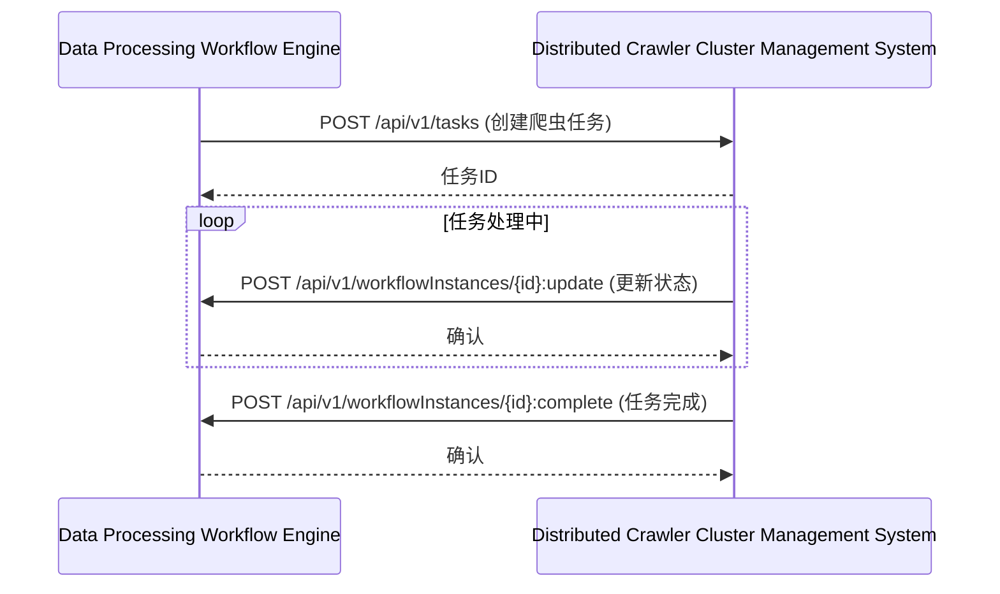
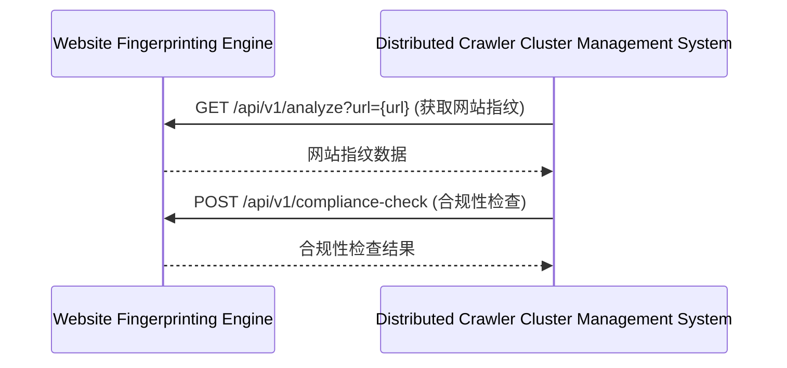
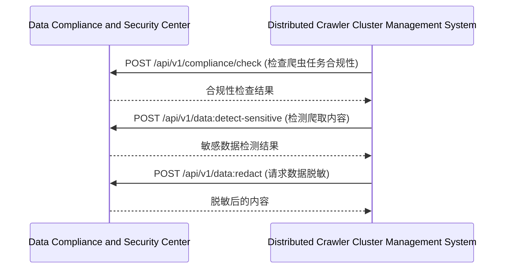
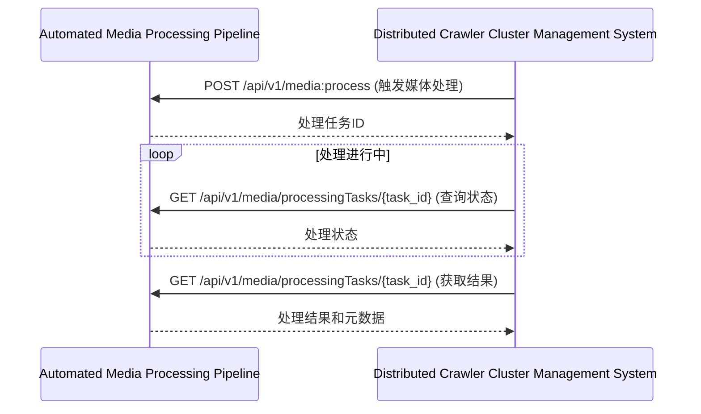

# 镜界平台终极技术规格说明书（模块级深度实现）

## 目录

### 8. 分布式爬虫集群管理系统 (Distributed Crawler Cluster Management System)
- [8.1 模块概述](#81-模块概述)
- [8.2 详细功能清单](#82-详细功能清单)
  - [8.2.1 核心功能](#821-核心功能)
  - [8.2.2 高级功能](#822-高级功能)
- [8.3 技术架构](#83-技术架构)
  - [8.3.1 架构图](#831-架构图)
  - [8.3.2 服务边界与交互](#832-服务边界与交互)
- [8.4 核心组件详细实现](#84-核心组件详细实现)
  - [8.4.1 爬虫节点管理服务](#841-爬虫节点管理服务)
  - [8.4.2 任务调度器](#842-任务调度器)
- [8.5 数据模型详细定义](#85-数据模型详细定义)
  - [8.5.1 爬虫节点表](#851-爬虫节点表)
  - [8.5.2 爬虫任务表](#852-爬虫任务表)
  - [8.5.3 爬虫任务执行表](#853-爬虫任务执行表)
  - [8.5.4 爬虫集群表](#854-爬虫集群表)
- [8.6 API详细规范](#86-api详细规范)
  - [8.6.1 节点管理API](#861-节点管理api)
  - [8.6.2 任务管理API](#862-任务管理api)
- [8.7 性能优化策略](#87-性能优化策略)
  - [8.7.1 任务调度优化](#871-任务调度优化)
  - [8.7.2 资源优化](#872-资源优化)
- [8.8 安全考虑](#88-安全考虑)
  - [8.8.1 节点安全](#881-节点安全)
  - [8.8.2 节点沙箱环境](#882-节点沙箱环境)
- [8.9 与其他模块的交互](#89-与其他模块的交互)
  - [8.9.1 与数据处理工作流引擎交互](#891-与数据处理工作流引擎交互)
  - [8.9.2 与网站指纹分析引擎交互](#892-与网站指纹分析引擎交互)
  - [8.9.3 与数据合规与安全中心交互](#893-与数据合规与安全中心交互)

## 8. 分布式爬虫集群管理系统 (Distributed Crawler Cluster Management System)

### 8.1 模块概述
分布式爬虫集群管理系统是镜界平台的爬虫执行引擎，负责管理和调度分布式爬虫节点，实现高效、可靠的数据采集。它提供爬虫任务调度、资源管理、状态监控和动态扩展能力，支持大规模分布式爬取任务。

### 8.2 详细功能清单

#### 8.2.1 核心功能
- **爬虫节点管理**
  - 节点自动发现与注册
  - 节点状态监控
  - 节点资源监控（CPU、内存、网络）
  - 节点健康检查
- **任务调度与分配**
  - 爬虫任务队列管理
  - 动态任务分配算法
  - 任务优先级管理
  - 任务分片与合并
- **爬虫执行管理**
  - 爬虫启动与停止
  - 爬虫参数配置
  - 爬虫执行状态监控
  - 执行结果收集
- **资源管理**
  - 资源配额管理
  - 动态资源分配
  - 资源使用监控
  - 资源限制策略

#### 8.2.2 高级功能
- **智能调度策略**
  - 基于内容的调度
  - 基于地理位置的调度
  - 基于反爬特征的调度
  - 负载均衡策略
- **弹性扩展**
  - 自动扩缩容
  - 预热机制
  - 优雅下线
  - 容量规划
- **爬虫隔离与沙箱**
  - 爬虫运行沙箱
  - 资源隔离
  - 网络隔离
  - 安全策略执行
- **任务依赖管理**
  - 任务依赖关系
  - 任务编排
  - 条件触发
  - 错误重试策略

### 8.3 技术架构

#### 8.3.1 架构图
```
┌───────────────────────────────────────────────────────────────────────────────────────────────┐
│                      分布式爬虫集群管理系统 (DCCMS)                                           │
├───────────────────────┬───────────────────────┬───────────────────────────────────────────────┤
│  控制层               │  调度层               │  执行层                                    │
├───────────────────────┼───────────────────────┼───────────────────────────────────────────────┤
│ • 集群管理服务        │ • 任务调度器          │ • 爬虫执行器                               │
│ • API网关             │ • 资源分配器          │ • 状态报告器                              │
│ • 节点注册服务        │ • 优先级管理器        │ • 心跳监控器                              │
│ • 配置管理服务        │ • 依赖解析器          │ • 资源监控器                              │
└───────────────────────┴───────────────────────┴───────────────────────────────────────────────┘
```

#### 8.3.2 服务边界与交互
- **输入**：
  - 爬虫任务定义（来自数据处理工作流引擎）
  - 爬虫节点注册
  - 节点状态报告
  - 资源使用指标
- **输出**：
  - 爬虫任务执行状态
  - 爬虫结果数据
  - 集群健康状态
  - 资源使用报告

### 8.4 核心组件详细实现

#### 8.4.1 爬虫节点管理服务

**技术实现：**
```python
import uuid
import time
import logging
from typing import Dict, List, Optional, Set
from concurrent.futures import ThreadPoolExecutor
import threading

class CrawlerNodeManager:
    """爬虫节点管理服务，负责节点注册、状态监控和健康检查"""
    
    def __init__(
        self,
        config: Config,
        node_registry: NodeRegistry,
        health_checker: NodeHealthChecker,
        event_bus: EventBus
    ):
        self.config = config
        self.node_registry = node_registry
        self.health_checker = health_checker
        self.event_bus = event_bus
        self.logger = logging.getLogger(__name__)
        self.running = False
        self.heartbeat_thread = None
        self.health_check_thread = None
        self.lock = threading.Lock()
    
    def start(self):
        """启动节点管理服务"""
        if self.running:
            return
        
        self.running = True
        self.logger.info("Starting crawler node manager")
        
        # 启动心跳处理线程
        self.heartbeat_thread = threading.Thread(
            target=self._process_heartbeats,
            daemon=True
        )
        self.heartbeat_thread.start()
        
        # 启动健康检查线程
        self.health_check_thread = threading.Thread(
            target=self._perform_health_checks,
            daemon=True
        )
        self.health_check_thread.start()
        
        self.logger.info("Crawler node manager started")
    
    def stop(self):
        """停止节点管理服务"""
        if not self.running:
            return
        
        self.running = False
        self.logger.info("Stopping crawler node manager")
        
        # 等待线程结束
        if self.heartbeat_thread:
            self.heartbeat_thread.join(timeout=5.0)
        if self.health_check_thread:
            self.health_check_thread.join(timeout=5.0)
        
        self.logger.info("Crawler node manager stopped")
    
    def register_node(
        self,
        node_info: NodeInfo
    ) -> NodeRegistrationResult:
        """
        注册爬虫节点
        
        :param node_info: 节点信息
        :return: 注册结果
        """
        with self.lock:
            # 生成节点ID
            node_id = f"node-{uuid.uuid4().hex[:8]}"
            node_info.id = node_id
            
            # 设置默认状态
            node_info.status = "online"
            node_info.last_heartbeat = time.time()
            
            # 保存节点信息
            self.node_registry.register_node(node_info)
            
            # 发布事件
            self.event_bus.publish("node.registered", {
                "node_id": node_id,
                "node_info": node_info.to_dict()
            })
            
            self.logger.info("Node registered: %s", node_id)
            
            return NodeRegistrationResult(
                node_id=node_id,
                registration_time=time.time(),
                initial_status="online"
            )
    
    def unregister_node(self, node_id: str):
        """
        注销爬虫节点
        
        :param node_id: 节点ID
        """
        with self.lock:
            # 获取节点信息
            node_info = self.node_registry.get_node(node_id)
            if not node_info:
                self.logger.warning("Node %s not found for unregistration", node_id)
                return
            
            # 更新状态
            node_info.status = "offline"
            node_info.last_heartbeat = 0
            self.node_registry.update_node(node_info)
            
            # 发布事件
            self.event_bus.publish("node.unregistered", {
                "node_id": node_id
            })
            
            self.logger.info("Node unregistered: %s", node_id)
    
    def handle_heartbeat(self, node_id: str, heartbeat: NodeHeartbeat):
        """
        处理节点心跳
        
        :param node_id: 节点ID
        :param heartbeat: 心跳数据
        """
        with self.lock:
            # 获取节点信息
            node_info = self.node_registry.get_node(node_id)
            if not node_info:
                self.logger.warning("Received heartbeat from unknown node: %s", node_id)
                return
            
            # 更新节点信息
            node_info.last_heartbeat = time.time()
            node_info.status = "online"
            node_info.resources = heartbeat.resources
            node_info.load = heartbeat.load
            node_info.task_count = len(heartbeat.active_tasks)
            
            # 保存更新
            self.node_registry.update_node(node_info)
            
            # 发布事件
            self.event_bus.publish("node.heartbeat", {
                "node_id": node_id,
                "heartbeat": heartbeat.to_dict()
            })
    
    def _process_heartbeats(self):
        """处理心跳超时"""
        while self.running:
            try:
                current_time = time.time()
                timeout_threshold = current_time - self.config.heartbeat_timeout
                
                # 检查所有节点
                nodes = self.node_registry.get_all_nodes()
                for node in nodes:
                    if node.last_heartbeat < timeout_threshold:
                        self._handle_heartbeat_timeout(node.id)
                
                # 等待下一次检查
                time.sleep(self.config.heartbeat_check_interval)
                
            except Exception as e:
                self.logger.error("Error in heartbeat processing: %s", str(e))
                time.sleep(1)
    
    def _handle_heartbeat_timeout(self, node_id: str):
        """处理心跳超时"""
        with self.lock:
            node_info = self.node_registry.get_node(node_id)
            if not node_info or node_info.status == "offline":
                return
            
            # 更新状态
            node_info.status = "unresponsive"
            self.node_registry.update_node(node_info)
            
            # 发布事件
            self.event_bus.publish("node.timeout", {
                "node_id": node_id,
                "last_heartbeat": node_info.last_heartbeat
            })
            
            self.logger.warning("Node heartbeat timeout: %s", node_id)
    
    def _perform_health_checks(self):
        """执行健康检查"""
        while self.running:
            try:
                # 获取需要检查的节点
                nodes = self.node_registry.get_nodes_by_status("online")
                
                # 并行执行健康检查
                with ThreadPoolExecutor(max_workers=self.config.health_check_workers) as executor:
                    futures = {
                        executor.submit(self._check_node_health, node.id): node.id
                        for node in nodes
                    }
                    
                    for future in futures:
                        node_id = futures[future]
                        try:
                            future.result()
                        except Exception as e:
                            self.logger.error("Health check failed for node %s: %s", node_id, str(e))
                
                # 等待下一次检查
                time.sleep(self.config.health_check_interval)
                
            except Exception as e:
                self.logger.error("Error in health check processing: %s", str(e))
                time.sleep(1)
    
    def _check_node_health(self, node_id: str):
        """检查节点健康状态"""
        # 1. 执行健康检查
        health_status = self.health_checker.check(node_id)
        
        # 2. 更新节点状态
        with self.lock:
            node_info = self.node_registry.get_node(node_id)
            if not node_info:
                return
            
            # 更新健康状态
            node_info.health = health_status
            self.node_registry.update_node(node_info)
            
            # 处理健康状态变化
            self._handle_health_status_change(node_id, node_info, health_status)
    
    def _handle_health_status_change(
        self,
        node_id: str,
        node_info: NodeInfo,
        new_health: NodeHealthStatus
    ):
        """处理健康状态变化"""
        # 檢查状态是否发生变化
        if node_info.health.status == new_health.status:
            return
        
        # 更新状态
        node_info.health = new_health
        self.node_registry.update_node(node_info)
        
        # 发布事件
        self.event_bus.publish("node.health_changed", {
            "node_id": node_id,
            "old_status": node_info.health.status,
            "new_status": new_health.status,
            "details": new_health.details
        })
        
        # 根据健康状态采取行动
        if new_health.status == "unhealthy":
            self._handle_unhealthy_node(node_id)
    
    def _handle_unhealthy_node(self, node_id: str):
        """处理不健康节点"""
        # 1. 从调度中移除节点
        self.event_bus.publish("scheduler.node_unavailable", {
            "node_id": node_id
        })
        
        # 2. 重新分配任务
        self.event_bus.publish("task.reassign", {
            "node_id": node_id
        })
        
        self.logger.warning("Node marked as unhealthy: %s", node_id)

class NodeRegistry:
    """节点注册表，存储节点信息"""
    
    def __init__(self, db: Database):
        self.db = db
        self.logger = logging.getLogger(__name__)
    
    def register_node(self, node_info: NodeInfo):
        """注册节点"""
        sql = """
        INSERT INTO crawler_nodes (
            id, cluster_id, name, description, 
            ip_address, port, node_type, 
            capabilities, resources, 
            status, last_heartbeat, 
            created_at, updated_at
        ) VALUES (
            %(id)s, %(cluster_id)s, %(name)s, %(description)s,
            %(ip_address)s, %(port)s, %(node_type)s,
            %(capabilities)s, %(resources)s,
            %(status)s, %(last_heartbeat)s,
            %(created_at)s, %(updated_at)s
        )
        """
        
        self.db.execute(sql, {
            "id": node_info.id,
            "cluster_id": node_info.cluster_id,
            "name": node_info.name,
            "description": node_info.description,
            "ip_address": node_info.ip_address,
            "port": node_info.port,
            "node_type": node_info.node_type,
            "capabilities": json.dumps(node_info.capabilities),
            "resources": json.dumps(node_info.resources),
            "status": node_info.status,
            "last_heartbeat": datetime.fromtimestamp(node_info.last_heartbeat),
            "created_at": datetime.utcnow(),
            "updated_at": datetime.utcnow()
        })
    
    def update_node(self, node_info: NodeInfo):
        """更新节点信息"""
        sql = """
        UPDATE crawler_nodes SET
            name = %(name)s,
            description = %(description)s,
            capabilities = %(capabilities)s,
            resources = %(resources)s,
            status = %(status)s,
            last_heartbeat = %(last_heartbeat)s,
            updated_at = %(updated_at)s
        WHERE id = %(id)s
        """
        
        self.db.execute(sql, {
            "id": node_info.id,
            "name": node_info.name,
            "description": node_info.description,
            "capabilities": json.dumps(node_info.capabilities),
            "resources": json.dumps(node_info.resources),
            "status": node_info.status,
            "last_heartbeat": datetime.fromtimestamp(node_info.last_heartbeat),
            "updated_at": datetime.utcnow()
        })
    
    def get_node(self, node_id: str) -> Optional[NodeInfo]:
        """获取节点信息"""
        sql = "SELECT * FROM crawler_nodes WHERE id = %(id)s"
        row = self.db.fetchone(sql, {"id": node_id})
        return self._row_to_node(row) if row else None
    
    def get_all_nodes(self) -> List[NodeInfo]:
        """获取所有节点"""
        sql = "SELECT * FROM crawler_nodes"
        rows = self.db.fetchall(sql)
        return [self._row_to_node(row) for row in rows]
    
    def get_nodes_by_status(self, status: str) -> List[NodeInfo]:
        """获取特定状态的节点"""
        sql = "SELECT * FROM crawler_nodes WHERE status = %(status)s"
        rows = self.db.fetchall(sql, {"status": status})
        return [self._row_to_node(row) for row in rows]
    
    def _row_to_node(self, row: Dict) -> NodeInfo:
        """将数据库行转换为NodeInfo对象"""
        return NodeInfo(
            id=row["id"],
            cluster_id=row["cluster_id"],
            name=row["name"],
            description=row["description"],
            ip_address=row["ip_address"],
            port=row["port"],
            node_type=row["node_type"],
            capabilities=json.loads(row["capabilities"]),
            resources=json.loads(row["resources"]),
            status=row["status"],
            last_heartbeat=row["last_heartbeat"].timestamp(),
            health=NodeHealthStatus(
                status=row["health_status"],
                details=json.loads(row["health_details"]) if row["health_details"] else {},
                timestamp=row["health_timestamp"]
            ) if row["health_status"] else NodeHealthStatus(status="unknown"),
            created_at=row["created_at"],
            updated_at=row["updated_at"]
        )

class NodeHealthChecker:
    """节点健康检查器"""
    
    def __init__(self, config: Config):
        self.config = config
        self.logger = logging.getLogger(__name__)
    
    def check(self, node_id: str) -> NodeHealthStatus:
        """
        检查节点健康状态
        
        :param node_id: 节点ID
        :return: 健康状态
        """
        # 1. 检查基础连通性
        if not self._check_connectivity(node_id):
            return NodeHealthStatus(
                status="unreachable",
                details={"error": "Node is unreachable"},
                timestamp=datetime.utcnow()
            )
        
        # 2. 检查资源使用
        resource_status = self._check_resources(node_id)
        
        # 3. 检查任务执行
        task_status = self._check_tasks(node_id)
        
        # 4. 综合健康状态
        return self._determine_overall_status(resource_status, task_status)
    
    def _check_connectivity(self, node_id: str) -> bool:
        """检查节点连通性"""
        # 实现节点连通性检查
        # 这里简化为返回True
        return True
    
    def _check_resources(self, node_id: str) -> Dict:
        """检查资源使用"""
        # 实现资源检查
        # 这里简化为返回示例数据
        return {
            "cpu_usage": 0.65,
            "memory_usage": 0.75,
            "network_io": 120.5,
            "disk_io": 45.2
        }
    
    def _check_tasks(self, node_id: str) -> Dict:
        """检查任务执行"""
        # 实现任务检查
        # 这里简化为返回示例数据
        return {
            "task_count": 5,
            "task_errors": 0,
            "task_latency": 1.2
        }
    
    def _determine_overall_status(
        self,
        resource_status: Dict,
        task_status: Dict
    ) -> NodeHealthStatus:
        """确定整体健康状态"""
        # 1. 檢查资源使用是否超标
        if resource_status["cpu_usage"] > 0.9 or resource_status["memory_usage"] > 0.95:
            return NodeHealthStatus(
                status="unhealthy",
                details={
                    "reason": "High resource usage",
                    "cpu": resource_status["cpu_usage"],
                    "memory": resource_status["memory_usage"]
                },
                timestamp=datetime.utcnow()
            )
        
        # 2. 檢查任务错误率
        if task_status["task_errors"] > 0:
            return NodeHealthStatus(
                status="degraded",
                details={
                    "reason": "Task errors detected",
                    "error_count": task_status["task_errors"]
                },
                timestamp=datetime.utcnow()
            )
        
        # 3. 檢查任务延迟
        if task_status["task_latency"] > 5.0:
            return NodeHealthStatus(
                status="degraded",
                details={
                    "reason": "High task latency",
                    "latency": task_status["task_latency"]
                },
                timestamp=datetime.utcnow()
            )
        
        # 4. 健康状态
        return NodeHealthStatus(
            status="healthy",
            details={
                "cpu_usage": resource_status["cpu_usage"],
                "memory_usage": resource_status["memory_usage"],
                "task_count": task_status["task_count"]
            },
            timestamp=datetime.utcnow()
        )

# 辅助类定义
class NodeInfo:
    """节点信息"""
    def __init__(
        self,
        id: str,
        cluster_id: str,
        name: str,
        description: str,
        ip_address: str,
        port: int,
        node_type: str,
        capabilities: Dict,
        resources: Dict,
        status: str,
        last_heartbeat: float,
        health: NodeHealthStatus,
        created_at: datetime,
        updated_at: datetime
    ):
        self.id = id
        self.cluster_id = cluster_id
        self.name = name
        self.description = description
        self.ip_address = ip_address
        self.port = port
        self.node_type = node_type
        self.capabilities = capabilities
        self.resources = resources
        self.status = status
        self.last_heartbeat = last_heartbeat
        self.health = health
        self.created_at = created_at
        self.updated_at = updated_at
    
    def to_dict(self) -> Dict:
        """转换为字典格式"""
        return {
            "id": self.id,
            "cluster_id": self.cluster_id,
            "name": self.name,
            "description": self.description,
            "ip_address": self.ip_address,
            "port": self.port,
            "node_type": self.node_type,
            "capabilities": self.capabilities,
            "resources": self.resources,
            "status": self.status,
            "last_heartbeat": self.last_heartbeat,
            "health": self.health.to_dict(),
            "created_at": self.created_at.isoformat() if self.created_at else None,
            "updated_at": self.updated_at.isoformat() if self.updated_at else None
        }

class NodeHealthStatus:
    """节点健康状态"""
    def __init__(
        self,
        status: str,
        details: Dict = None,
        timestamp: datetime = None
    ):
        self.status = status
        self.details = details or {}
        self.timestamp = timestamp or datetime.utcnow()
    
    def to_dict(self) -> Dict:
        """转换为字典格式"""
        return {
            "status": self.status,
            "details": self.details,
            "timestamp": self.timestamp.isoformat()
        }

class NodeHeartbeat:
    """节点心跳"""
    def __init__(
        self,
        node_id: str,
        timestamp: float,
        resources: Dict,
        load: float,
        active_tasks: List[str]
    ):
        self.node_id = node_id
        self.timestamp = timestamp
        self.resources = resources
        self.load = load
        self.active_tasks = active_tasks
    
    def to_dict(self) -> Dict:
        """转换为字典格式"""
        return {
            "node_id": self.node_id,
            "timestamp": self.timestamp,
            "resources": self.resources,
            "load": self.load,
            "active_tasks": self.active_tasks
        }

class NodeRegistrationResult:
    """节点注册结果"""
    def __init__(
        self,
        node_id: str,
        registration_time: float,
        initial_status: str
    ):
        self.node_id = node_id
        self.registration_time = registration_time
        self.initial_status = initial_status
```

#### 8.4.2 任务调度器

**技术实现：**
```python
import heapq
import time
import logging
from typing import Dict, List, Optional, Set
import threading

class TaskScheduler:
    """任务调度器，负责爬虫任务的分配和调度"""
    
    def __init__(
        self,
        config: Config,
        node_manager: CrawlerNodeManager,
        task_queue: TaskQueue,
        event_bus: EventBus
    ):
        self.config = config
        self.node_manager = node_manager
        self.task_queue = task_queue
        self.event_bus = event_bus
        self.logger = logging.getLogger(__name__)
        self.running = False
        self.scheduler_thread = None
        self.lock = threading.Lock()
        self.assigned_tasks = {}  # task_id -> node_id
    
    def start(self):
        """启动调度器"""
        if self.running:
            return
        
        self.running = True
        self.logger.info("Starting task scheduler")
        
        # 启动调度线程
        self.scheduler_thread = threading.Thread(
            target=self._schedule_loop,
            daemon=True
        )
        self.scheduler_thread.start()
        
        self.logger.info("Task scheduler started")
    
    def stop(self):
        """停止调度器"""
        if not self.running:
            return
        
        self.running = False
        self.logger.info("Stopping task scheduler")
        
        # 等待线程结束
        if self.scheduler_thread:
            self.scheduler_thread.join(timeout=5.0)
        
        self.logger.info("Task scheduler stopped")
    
    def _schedule_loop(self):
        """调度循环"""
        while self.running:
            try:
                # 1. 获取可用节点
                online_nodes = self.node_manager.get_nodes_by_status("online")
                if not online_nodes:
                    time.sleep(self.config.schedule_interval)
                    continue
                
                # 2. 获取待调度任务
                tasks = self.task_queue.get_pending_tasks(
                    limit=self.config.max_tasks_per_schedule
                )
                if not tasks:
                    time.sleep(self.config.schedule_interval)
                    continue
                
                # 3. 为每个任务选择合适的节点
                for task in tasks:
                    node_id = self._select_node(task, online_nodes)
                    if node_id:
                        # 分配任务
                        self._assign_task(task, node_id)
                    else:
                        # 没有合适的节点，稍后重试
                        self.logger.debug(
                            "No suitable node for task %s, will retry later", 
                            task.id
                        )
                
                # 4. 等待下一次调度
                time.sleep(self.config.schedule_interval)
                
            except Exception as e:
                self.logger.error("Error in scheduling loop: %s", str(e))
                time.sleep(1)
    
    def _select_node(
        self,
        task: CrawlerTask,
        online_nodes: List[NodeInfo]
    ) -> Optional[str]:
        """选择最适合的节点"""
        # 1. 过滤不支持任务类型的节点
        compatible_nodes = [
            node for node in online_nodes
            if self._is_node_compatible(node, task)
        ]
        if not compatible_nodes:
            return None
        
        # 2. 应用调度策略
        strategy = task.schedule_strategy or self.config.default_schedule_strategy
        if strategy == "least_loaded":
            return self._select_least_loaded_node(compatible_nodes)
        elif strategy == "geo_location":
            return self._select_geo_location_node(compatible_nodes, task)
        elif strategy == "content_based":
            return self._select_content_based_node(compatible_nodes, task)
        
        # 默认策略：最小负载
        return self._select_least_loaded_node(compatible_nodes)
    
    def _is_node_compatible(
        self,
        node: NodeInfo,
        task: CrawlerTask
    ) -> bool:
        """检查节点是否支持任务"""
        # 1. 檢查节点类型
        if task.node_type and node.node_type != task.node_type:
            return False
        
        # 2. 檢查能力要求
        for capability, required in task.capabilities.items():
            if capability not in node.capabilities or node.capabilities[capability] < required:
                return False
        
        # 3. 檢查资源要求
        if task.min_resources:
            for resource, required in task.min_resources.items():
                if resource not in node.resources or node.resources[resource] < required:
                    return False
        
        return True
    
    def _select_least_loaded_node(
        self,
        nodes: List[NodeInfo]
    ) -> Optional[str]:
        """选择负载最小的节点"""
        if not nodes:
            return None
        
        # 按负载排序（升序）
        sorted_nodes = sorted(nodes, key=lambda n: n.load)
        return sorted_nodes[0].id
    
    def _select_geo_location_node(
        self,
        nodes: List[NodeInfo],
        task: CrawlerTask
    ) -> Optional[str]:
        """选择地理位置最近的节点"""
        if not task.target_region or not nodes:
            return self._select_least_loaded_node(nodes)
        
        # 计算每个节点与目标区域的距离
        node_distances = []
        for node in nodes:
            distance = self._calculate_geo_distance(node.region, task.target_region)
            node_distances.append((distance, node))
        
        # 按距离排序
        sorted_nodes = sorted(node_distances, key=lambda x: x[0])
        return sorted_nodes[0][1].id
    
    def _calculate_geo_distance(
        self,
        node_region: str,
        target_region: str
    ) -> float:
        """计算地理位置距离"""
        # 简单实现：基于区域代码的匹配
        if node_region == target_region:
            return 0.0
        elif node_region[:2] == target_region[:2]:  # 同一国家
            return 1.0
        else:
            return 2.0
    
    def _select_content_based_node(
        self,
        nodes: List[NodeInfo],
        task: CrawlerTask
    ) -> Optional[str]:
        """选择基于内容特性的节点"""
        if not task.content_features or not nodes:
            return self._select_least_loaded_node(nodes)
        
        # 计算每个节点与内容特征的匹配度
        node_matches = []
        for node in nodes:
            match_score = self._calculate_content_match(node, task.content_features)
            node_matches.append((match_score, node))
        
        # 按匹配度排序（降序）
        sorted_nodes = sorted(node_matches, key=lambda x: x[0], reverse=True)
        return sorted_nodes[0][1].id
    
    def _calculate_content_match(
        self,
        node: NodeInfo,
        content_features: Dict
    ) -> float:
        """计算内容匹配度"""
        score = 0.0
        
        # 检查节点是否支持内容类型
        if "content_type" in content_features:
            if content_features["content_type"] in node.capabilities.get("content_types", []):
                score += 0.4
        
        # 检查节点是否支持特定技术
        if "technology" in content_features:
            if content_features["technology"] in node.capabilities.get("technologies", []):
                score += 0.3
        
        # 检查节点是否处理过类似内容
        if "similarity" in content_features:
            score += content_features["similarity"] * 0.3
        
        return score
    
    def _assign_task(
        self,
        task: CrawlerTask,
        node_id: str
    ):
        """分配任务到节点"""
        with self.lock:
            # 1. 更新任务状态
            task.status = "assigned"
            task.assigned_node = node_id
            task.assigned_at = time.time()
            self.task_queue.update_task(task)
            
            # 2. 记录分配
            self.assigned_tasks[task.id] = node_id
            
            # 3. 发布事件
            self.event_bus.publish("task.assigned", {
                "task_id": task.id,
                "node_id": node_id,
                "task_info": task.to_dict()
            })
            
            self.logger.info("Task %s assigned to node %s", task.id, node_id)
    
    def handle_task_completion(
        self,
        task_id: str,
        node_id: str,
        result: TaskResult
    ):
        """
        处理任务完成
        
        :param task_id: 任务ID
        :param node_id: 节点ID
        :param result: 任务结果
        """
        with self.lock:
            # 1. 移除分配记录
            if task_id in self.assigned_tasks:
                del self.assigned_tasks[task_id]
            
            # 2. 更新任务状态
            task = self.task_queue.get_task(task_id)
            if not task:
                self.logger.warning("Task %s not found for completion", task_id)
                return
            
            task.status = "completed" if result.success else "failed"
            task.completed_at = time.time()
            task.result = result.to_dict()
            self.task_queue.update_task(task)
            
            # 3. 发布事件
            event_type = "task.completed" if result.success else "task.failed"
            self.event_bus.publish(event_type, {
                "task_id": task_id,
                "node_id": node_id,
                "result": result.to_dict()
            })
            
            self.logger.info(
                "Task %s %s by node %s", 
                task_id, 
                "completed" if result.success else "failed",
                node_id
            )
    
    def handle_task_timeout(
        self,
        task_id: str,
        node_id: str
    ):
        """
        处理任务超时
        
        :param task_id: 任务ID
        :param node_id: 节点ID
        """
        with self.lock:
            # 1. 移除分配记录
            if task_id in self.assigned_tasks:
                del self.assigned_tasks[task_id]
            
            # 2. 更新任务状态
            task = self.task_queue.get_task(task_id)
            if not task:
                self.logger.warning("Task %s not found for timeout", task_id)
                return
            
            task.status = "timeout"
            task.completed_at = time.time()
            self.task_queue.update_task(task)
            
            # 3. 重新入队（如果需要重试）
            if task.retry_count < task.max_retries:
                task.retry_count += 1
                task.status = "pending"
                task.assigned_node = None
                self.task_queue.add_task(task)
                
                self.logger.info(
                    "Task %s timed out, retrying (attempt %d/%d)", 
                    task_id, 
                    task.retry_count,
                    task.max_retries
                )
            else:
                self.logger.warning(
                    "Task %s timed out and exceeded max retries", 
                    task_id
                )
            
            # 4. 发布事件
            self.event_bus.publish("task.timeout", {
                "task_id": task_id,
                "node_id": node_id,
                "retry_count": task.retry_count
            })

class TaskQueue:
    """任务队列，管理待处理任务"""
    
    def __init__(self, db: Database):
        self.db = db
        self.logger = logging.getLogger(__name__)
    
    def add_task(self, task: CrawlerTask):
        """添加任务到队列"""
        sql = """
        INSERT INTO crawler_tasks (
            id, project_id, workflow_id, task_type,
            parameters, priority, 
            min_resources, capabilities,
            schedule_strategy, target_region, content_features,
            status, created_at, updated_at
        ) VALUES (
            %(id)s, %(project_id)s, %(workflow_id)s, %(task_type)s,
            %(parameters)s, %(priority)s,
            %(min_resources)s, %(capabilities)s,
            %(schedule_strategy)s, %(target_region)s, %(content_features)s,
            %(status)s, %(created_at)s, %(updated_at)s
        )
        """
        
        self.db.execute(sql, {
            "id": task.id,
            "project_id": task.project_id,
            "workflow_id": task.workflow_id,
            "task_type": task.task_type,
            "parameters": json.dumps(task.parameters),
            "priority": task.priority,
            "min_resources": json.dumps(task.min_resources) if task.min_resources else None,
            "capabilities": json.dumps(task.capabilities) if task.capabilities else None,
            "schedule_strategy": task.schedule_strategy,
            "target_region": task.target_region,
            "content_features": json.dumps(task.content_features) if task.content_features else None,
            "status": task.status,
            "created_at": task.created_at,
            "updated_at": task.updated_at
        })
    
    def get_pending_tasks(
        self,
        limit: int = 100
    ) -> List[CrawlerTask]:
        """获取待处理任务"""
        sql = """
        SELECT * FROM crawler_tasks 
        WHERE status = 'pending'
        ORDER BY priority DESC, created_at
        LIMIT %(limit)s
        """
        
        rows = self.db.fetchall(sql, {"limit": limit})
        return [self._row_to_task(row) for row in rows]
    
    def get_task(self, task_id: str) -> Optional[CrawlerTask]:
        """获取任务详情"""
        sql = "SELECT * FROM crawler_tasks WHERE id = %(id)s"
        row = self.db.fetchone(sql, {"id": task_id})
        return self._row_to_task(row) if row else None
    
    def update_task(self, task: CrawlerTask):
        """更新任务状态"""
        sql = """
        UPDATE crawler_tasks SET
            status = %(status)s,
            assigned_node = %(assigned_node)s,
            assigned_at = %(assigned_at)s,
            completed_at = %(completed_at)s,
            result = %(result)s,
            retry_count = %(retry_count)s,
            updated_at = %(updated_at)s
        WHERE id = %(id)s
        """
        
        self.db.execute(sql, {
            "id": task.id,
            "status": task.status,
            "assigned_node": task.assigned_node,
            "assigned_at": datetime.fromtimestamp(task.assigned_at) if task.assigned_at else None,
            "completed_at": datetime.fromtimestamp(task.completed_at) if task.completed_at else None,
            "result": json.dumps(task.result) if task.result else None,
            "retry_count": task.retry_count,
            "updated_at": datetime.utcnow()
        })

# 辅助类定义
class CrawlerTask:
    """爬虫任务"""
    def __init__(
        self,
        id: str,
        project_id: str,
        workflow_id: str,
        task_type: str,
        parameters: Dict,
        priority: int = 5,
        min_resources: Optional[Dict] = None,
        capabilities: Optional[Dict] = None,
        schedule_strategy: Optional[str] = None,
        target_region: Optional[str] = None,
        content_features: Optional[Dict] = None,
        status: str = "pending",
        created_at: datetime = None,
        updated_at: datetime = None,
        assigned_node: Optional[str] = None,
        assigned_at: Optional[float] = None,
        completed_at: Optional[float] = None,
        result: Optional[Dict] = None,
        retry_count: int = 0,
        max_retries: int = 3
    ):
        self.id = id
        self.project_id = project_id
        self.workflow_id = workflow_id
        self.task_type = task_type
        self.parameters = parameters
        self.priority = priority
        self.min_resources = min_resources or {}
        self.capabilities = capabilities or {}
        self.schedule_strategy = schedule_strategy
        self.target_region = target_region
        self.content_features = content_features or {}
        self.status = status
        self.created_at = created_at or datetime.utcnow()
        self.updated_at = updated_at or datetime.utcnow()
        self.assigned_node = assigned_node
        self.assigned_at = assigned_at
        self.completed_at = completed_at
        self.result = result
        self.retry_count = retry_count
        self.max_retries = max_retries
    
    def to_dict(self) -> Dict:
        """转换为字典格式"""
        return {
            "id": self.id,
            "project_id": self.project_id,
            "workflow_id": self.workflow_id,
            "task_type": self.task_type,
            "parameters": self.parameters,
            "priority": self.priority,
            "min_resources": self.min_resources,
            "capabilities": self.capabilities,
            "schedule_strategy": self.schedule_strategy,
            "target_region": self.target_region,
            "content_features": self.content_features,
            "status": self.status,
            "created_at": self.created_at.isoformat(),
            "updated_at": self.updated_at.isoformat(),
            "assigned_node": self.assigned_node,
            "assigned_at": self.assigned_at,
            "completed_at": self.completed_at,
            "result": self.result,
            "retry_count": self.retry_count,
            "max_retries": self.max_retries
        }

class TaskResult:
    """任务结果"""
    def __init__(
        self,
        success: bool,
        data: Optional[Dict] = None,
        error: Optional[str] = None,
        metrics: Optional[Dict] = None
    ):
        self.success = success
        self.data = data or {}
        self.error = error
        self.metrics = metrics or {}
        self.timestamp = datetime.utcnow()
    
    def to_dict(self) -> Dict:
        """转换为字典格式"""
        return {
            "success": self.success,
            "data": self.data,
            "error": self.error,
            "metrics": self.metrics,
            "timestamp": self.timestamp.isoformat()
        }
```

### 8.5 数据模型详细定义

#### 8.5.1 爬虫节点表

```sql
-- 爬虫节点表
CREATE TABLE crawler_nodes (
    id UUID PRIMARY KEY DEFAULT gen_random_uuid(),
    cluster_id UUID NOT NULL REFERENCES crawler_clusters(id) ON DELETE CASCADE,
    name VARCHAR(255) NOT NULL,
    description TEXT,
    ip_address INET NOT NULL,
    port INT NOT NULL,
    node_type VARCHAR(50) NOT NULL,
    capabilities JSONB DEFAULT '{}'::jsonb,
    resources JSONB DEFAULT '{}'::jsonb,
    status VARCHAR(20) NOT NULL DEFAULT 'pending' CHECK (status IN ('pending', 'online', 'offline', 'unresponsive', 'maintenance')),
    last_heartbeat TIMESTAMPTZ,
    health_status VARCHAR(20) NOT NULL DEFAULT 'unknown' CHECK (health_status IN ('unknown', 'healthy', 'degraded', 'unhealthy')),
    health_details JSONB DEFAULT '{}'::jsonb,
    health_timestamp TIMESTAMPTZ,
    created_at TIMESTAMPTZ NOT NULL DEFAULT NOW(),
    updated_at TIMESTAMPTZ NOT NULL DEFAULT NOW(),
    
    -- 索引
    INDEX idx_nodes_cluster ON crawler_nodes(cluster_id),
    INDEX idx_nodes_status ON crawler_nodes(status),
    INDEX idx_nodes_health ON crawler_nodes(health_status),
    INDEX idx_nodes_last_heartbeat ON crawler_nodes(last_heartbeat DESC)
);

-- 自动更新updated_at触发器
CREATE OR REPLACE FUNCTION update_crawler_nodes_modtime()
RETURNS TRIGGER AS $$
BEGIN
    NEW.updated_at = NOW();
    RETURN NEW;
END;
$$ LANGUAGE plpgsql;

CREATE TRIGGER update_crawler_nodes_modtime
BEFORE UPDATE ON crawler_nodes
FOR EACH ROW
EXECUTE FUNCTION update_crawler_nodes_modtime();
```

#### 8.5.2 爬虫任务表

```sql
-- 爬虫任务表
CREATE TABLE crawler_tasks (
    id UUID PRIMARY KEY DEFAULT gen_random_uuid(),
    project_id UUID NOT NULL REFERENCES projects(id) ON DELETE CASCADE,
    workflow_id UUID NOT NULL REFERENCES workflow_instances(id) ON DELETE CASCADE,
    task_type VARCHAR(50) NOT NULL,
    parameters JSONB NOT NULL,
    priority INT NOT NULL DEFAULT 5,
    min_resources JSONB DEFAULT '{}'::jsonb,
    capabilities JSONB DEFAULT '{}'::jsonb,
    schedule_strategy VARCHAR(50),
    target_region VARCHAR(10),
    content_features JSONB DEFAULT '{}'::jsonb,
    status VARCHAR(20) NOT NULL DEFAULT 'pending' CHECK (status IN ('pending', 'assigned', 'processing', 'completed', 'failed', 'timeout')),
    created_at TIMESTAMPTZ NOT NULL DEFAULT NOW(),
    updated_at TIMESTAMPTZ NOT NULL DEFAULT NOW(),
    assigned_node UUID REFERENCES crawler_nodes(id) ON DELETE SET NULL,
    assigned_at TIMESTAMPTZ,
    completed_at TIMESTAMPTZ,
    result JSONB,
    retry_count INT NOT NULL DEFAULT 0,
    max_retries INT NOT NULL DEFAULT 3,
    
    -- 索引
    INDEX idx_tasks_project ON crawler_tasks(project_id),
    INDEX idx_tasks_workflow ON crawler_tasks(workflow_id),
    INDEX idx_tasks_status ON crawler_tasks(status),
    INDEX idx_tasks_priority ON crawler_tasks(priority DESC, created_at),
    INDEX idx_tasks_assigned ON crawler_tasks(assigned_node),
    INDEX idx_tasks_created ON crawler_tasks(created_at DESC)
);
```

#### 8.5.3 爬虫任务执行表

```sql
-- 爬虫任务执行表
CREATE TABLE crawler_task_executions (
    id UUID PRIMARY KEY DEFAULT gen_random_uuid(),
    task_id UUID NOT NULL REFERENCES crawler_tasks(id) ON DELETE CASCADE,
    node_id UUID NOT NULL REFERENCES crawler_nodes(id) ON DELETE CASCADE,
    start_time TIMESTAMPTZ NOT NULL DEFAULT NOW(),
    end_time TIMESTAMPTZ,
    status VARCHAR(20) NOT NULL CHECK (status IN ('running', 'completed', 'failed')),
    result JSONB,
    metrics JSONB DEFAULT '{}'::jsonb,
    retry_count INT NOT NULL DEFAULT 0,
    
    -- 索引
    INDEX idx_executions_task ON crawler_task_executions(task_id),
    INDEX idx_executions_node ON crawler_task_executions(node_id),
    INDEX idx_executions_status ON crawler_task_executions(status),
    INDEX idx_executions_time ON crawler_task_executions(start_time DESC)
);
```

#### 8.5.4 爬虫集群表

```sql
-- 爬虫集群表
CREATE TABLE crawler_clusters (
    id UUID PRIMARY KEY DEFAULT gen_random_uuid(),
    project_id UUID NOT NULL REFERENCES projects(id) ON DELETE CASCADE,
    name VARCHAR(255) NOT NULL,
    description TEXT,
    configuration JSONB DEFAULT '{}'::jsonb,
    status VARCHAR(20) NOT NULL DEFAULT 'active' CHECK (status IN ('active', 'inactive', 'maintenance')),
    created_at TIMESTAMPTZ NOT NULL DEFAULT NOW(),
    updated_at TIMESTAMPTZ NOT NULL DEFAULT NOW(),
    
    -- 索引
    INDEX idx_clusters_project ON crawler_clusters(project_id),
    INDEX idx_clusters_status ON crawler_clusters(status),
    UNIQUE (project_id, name)
);

-- 自动更新updated_at触发器
CREATE OR REPLACE FUNCTION update_crawler_clusters_modtime()
RETURNS TRIGGER AS $$
BEGIN
    NEW.updated_at = NOW();
    RETURN NEW;
END;
$$ LANGUAGE plpgsql;

CREATE TRIGGER update_crawler_clusters_modtime
BEFORE UPDATE ON crawler_clusters
FOR EACH ROW
EXECUTE FUNCTION update_crawler_clusters_modtime();
```

### 8.6 API详细规范

#### 8.6.1 节点管理API

**注册爬虫节点 (POST /api/v1/nodes:register)**

*请求示例:*
```http
POST /api/v1/nodes:register HTTP/1.1
Host: dccms.mirror-realm.com
Authorization: Bearer <access_token>
Content-Type: application/json

{
  "name": "crawler-node-01",
  "description": "Main crawler node in US East region",
  "ip_address": "192.168.1.101",
  "port": 8000,
  "node_type": "standard",
  "capabilities": {
    "content_types": ["html", "json", "xml"],
    "technologies": ["react", "angular", "wordpress"],
    "anti_crawling_bypass": ["user-agent", "proxy"]
  },
  "resources": {
    "cpu": 8,
    "memory_mb": 16384,
    "gpu": 1,
    "network_bandwidth_mbps": 1000
  }
}
```

*成功响应示例:*
```http
HTTP/1.1 201 Created
Content-Type: application/json
Location: /api/v1/nodes/node-1a2b3c4d

{
  "node_id": "node-1a2b3c4d",
  "registration_time": 1686825045.123,
  "initial_status": "online"
}
```

**发送节点心跳 (POST /api/v1/nodes/{node_id}:heartbeat)**

*请求示例:*
```http
POST /api/v1/nodes/node-1a2b3c4d:heartbeat HTTP/1.1
Host: dccms.mirror-realm.com
Authorization: Bearer <access_token>
Content-Type: application/json

{
  "resources": {
    "cpu_usage": 0.65,
    "memory_usage": 0.75,
    "gpu_usage": 0.45
  },
  "load": 0.8,
  "active_tasks": ["task-123", "task-456"]
}
```

*成功响应示例:*
```http
HTTP/1.1 200 OK
Content-Type: application/json

{
  "node_id": "node-1a2b3c4d",
  "timestamp": 1686825045.123,
  "status": "online"
}
```

#### 8.6.2 任务管理API

**创建爬虫任务 (POST /api/v1/tasks)**

*请求示例:*
```http
POST /api/v1/tasks HTTP/1.1
Host: dccms.mirror-realm.com
Authorization: Bearer <access_token>
Content-Type: application/json

{
  "project_id": "proj-123",
  "workflow_id": "inst-1a2b3c4d5e6f",
  "task_type": "web_crawl",
  "parameters": {
    "url": "https://example.com/products",
    "depth": 2,
    "selectors": {
      "product": "div.product",
      "title": "h2.title",
      "price": "span.price"
    }
  },
  "priority": 7,
  "min_resources": {
    "memory_mb": 4096,
    "cpu_cores": 2
  },
  "capabilities": {
    "javascript_rendering": 1,
    "proxy_rotation": 1
  },
  "schedule_strategy": "least_loaded",
  "target_region": "us",
  "content_features": {
    "content_type": "html",
    "technology": "react"
  }
}
```

*成功响应示例:*
```http
HTTP/1.1 201 Created
Content-Type: application/json
Location: /api/v1/tasks/task-123

{
  "id": "task-123",
  "status": "pending",
  "created_at": "2023-06-15T10:30:45Z",
  "priority": 7
}
```

**获取任务状态 (GET /api/v1/tasks/{task_id})**

*请求示例:*
```http
GET /api/v1/tasks/task-123 HTTP/1.1
Host: dccms.mirror-realm.com
Authorization: Bearer <access_token>
```

*成功响应示例 (处理中):*
```http
HTTP/1.1 200 OK
Content-Type: application/json

{
  "id": "task-123",
  "project_id": "proj-123",
  "workflow_id": "inst-1a2b3c4d5e6f",
  "task_type": "web_crawl",
  "parameters": {
    "url": "https://example.com/products",
    "depth": 2,
    "selectors": {
      "product": "div.product",
      "title": "h2.title",
      "price": "span.price"
    }
  },
  "priority": 7,
  "min_resources": {
    "memory_mb": 4096,
    "cpu_cores": 2
  },
  "capabilities": {
    "javascript_rendering": 1,
    "proxy_rotation": 1
  },
  "schedule_strategy": "least_loaded",
  "target_region": "us",
  "content_features": {
    "content_type": "html",
    "technology": "react"
  },
  "status": "processing",
  "created_at": "2023-06-15T10:30:45Z",
  "updated_at": "2023-06-15T10:31:10Z",
  "assigned_node": "node-1a2b3c4d",
  "assigned_at": "2023-06-15T10:31:10Z",
  "retry_count": 0,
  "max_retries": 3
}
```

*成功响应示例 (已完成):*
```http
HTTP/1.1 200 OK
Content-Type: application/json

{
  "id": "task-123",
  "project_id": "proj-123",
  "workflow_id": "inst-1a2b3c4d5e6f",
  "task_type": "web_crawl",
  "parameters": {
    "url": "https://example.com/products",
    "depth": 2,
    "selectors": {
      "product": "div.product",
      "title": "h2.title",
      "price": "span.price"
    }
  },
  "priority": 7,
  "min_resources": {
    "memory_mb": 4096,
    "cpu_cores": 2
  },
  "capabilities": {
    "javascript_rendering": 1,
    "proxy_rotation": 1
  },
  "schedule_strategy": "least_loaded",
  "target_region": "us",
  "content_features": {
    "content_type": "html",
    "technology": "react"
  },
  "status": "completed",
  "created_at": "2023-06-15T10:30:45Z",
  "updated_at": "2023-06-15T10:35:20Z",
  "assigned_node": "node-1a2b3c4d",
  "assigned_at": "2023-06-15T10:31:10Z",
  "completed_at": "2023-06-15T10:35:20Z",
  "result": {
    "success": true,
    "data": {
      "products": [
        {
          "title": "Product 1",
          "price": "$19.99",
          "url": "/products/1"
        },
        {
          "title": "Product 2",
          "price": "$29.99",
          "url": "/products/2"
        }
      ]
    },
    "metrics": {
      "pages_crawled": 15,
      "processing_time": 125.4,
      "data_size": 4294967
    },
    "timestamp": "2023-06-15T10:35:20Z"
  },
  "retry_count": 0,
  "max_retries": 3
}
```

### 8.7 性能优化策略

#### 8.7.1 任务调度优化

1. **分层任务队列**
   ```python
   class LayeredTaskQueue:
       """分层任务队列，支持优先级和分类"""
       
       def __init__(self, config: Config):
           self.config = config
           self.logger = logging.getLogger(__name__)
           
           # 创建优先级队列
           self.priority_queues = {
               priority: PriorityQueue()
               for priority in range(1, 11)  # 1-10优先级
           }
           
           # 创建类别队列
           self.category_queues = defaultdict(PriorityQueue)
       
       def add_task(self, task: CrawlerTask):
           """添加任务到队列"""
           # 按优先级添加
           self.priority_queues[task.priority].put((task.created_at, task.id, task))
           
           # 按类别添加
           for category in task.categories:
               self.category_queues[category].put((task.priority, task.created_at, task.id, task))
       
       def get_next_task(
           self,
           max_priority: int = 10,
           categories: Optional[List[str]] = None
       ) -> Optional[CrawlerTask]:
           """获取下一个任务"""
           # 1. 按类别获取任务
           if categories:
               for category in categories:
                   if category in self.category_queues:
                       task = self._get_task_from_category_queue(category)
                       if task and task.priority <= max_priority:
                           return task
           
           # 2. 按优先级获取任务
           for priority in range(1, max_priority + 1):
               if not self.priority_queues[priority].empty():
                   _, _, task = self.priority_queues[priority].get()
                   return task
           
           return None
       
       def _get_task_from_category_queue(self, category: str) -> Optional[CrawlerTask]:
           """从类别队列获取任务"""
           if self.category_queues[category].empty():
               return None
           
           # 获取最高优先级任务
           _, _, _, task = self.category_queues[category].get()
           return task
       
       def task_completed(self, task: CrawlerTask):
           """任务完成处理"""
           # 从队列中移除
           self._remove_from_priority_queue(task)
           self._remove_from_category_queues(task)
       
       def _remove_from_priority_queue(self, task: CrawlerTask):
           """从优先级队列移除"""
           # 简单实现：重建队列
           temp_queue = PriorityQueue()
           while not self.priority_queues[task.priority].empty():
               t = self.priority_queues[task.priority].get()
               if t[2].id != task.id:
                   temp_queue.put(t)
           self.priority_queues[task.priority] = temp_queue
       
       def _remove_from_category_queues(self, task: CrawlerTask):
           """从类别队列移除"""
           for category in task.categories:
               if category in self.category_queues:
                   # 重建类别队列
                   temp_queue = PriorityQueue()
                   while not self.category_queues[category].empty():
                       t = self.category_queues[category].get()
                       if t[3].id != task.id:
                           temp_queue.put(t)
                   self.category_queues[category] = temp_queue
   ```

2. **批量任务分配**
   ```python
   class BatchTaskScheduler:
       """批量任务调度器，提高调度效率"""
       
       def __init__(self, config: Config, node_manager: CrawlerNodeManager):
           self.config = config
           self.node_manager = node_manager
           self.logger = logging.getLogger(__name__)
       
       def schedule_batch(
           self,
           tasks: List[CrawlerTask],
           nodes: List[NodeInfo]
       ) -> Dict[str, List[CrawlerTask]]:
           """
           批量调度任务
           
           :param tasks: 任务列表
           :param nodes: 可用节点列表
           :return: 节点到任务的映射
           """
           # 1. 按策略对任务排序
           sorted_tasks = self._sort_tasks(tasks)
           
           # 2. 按能力对节点排序
           sorted_nodes = self._sort_nodes(nodes)
           
           # 3. 分配任务
           assignment = {node.id: [] for node in sorted_nodes}
           node_index = 0
           
           for task in sorted_tasks:
               # 选择节点（轮询）
               node = sorted_nodes[node_index]
               assignment[node.id].append(task)
               
               # 更新索引
               node_index = (node_index + 1) % len(sorted_nodes)
           
           return assignment
       
       def _sort_tasks(self, tasks: List[CrawlerTask]) -> List[CrawlerTask]:
           """对任务排序"""
           # 按优先级和创建时间排序
           return sorted(
               tasks,
               key=lambda t: (-t.priority, t.created_at)
           )
       
       def _sort_nodes(self, nodes: List[NodeInfo]) -> List[NodeInfo]:
           """对节点排序"""
           # 按负载排序（升序）
           return sorted(
               nodes,
               key=lambda n: n.load
           )
   ```

#### 8.7.2 资源优化

1. **动态资源分配**
   ```python
   class DynamicResourceAllocator:
       """动态资源分配器"""
       
       def __init__(self, config: Config):
           self.config = config
           self.logger = logging.getLogger(__name__)
       
       def allocate_resources(
           self,
           task: CrawlerTask,
           node: NodeInfo
       ) -> Dict[str, Any]:
           """
           分配资源给任务
           
           :param task: 任务
           :param node: 节点
           :return: 资源分配结果
           """
           # 1. 基始分配
           allocation = self._initial_allocation(task, node)
           
           # 2. 根据实时负载调整
           allocation = self._adjust_for_load(allocation, node)
           
           # 3. 根据任务特性调整
           allocation = self._adjust_for_task(allocation, task)
           
           return allocation
       
       def _initial_allocation(
           self,
           task: CrawlerTask,
           node: NodeInfo
       ) -> Dict[str, Any]:
           """初始资源分配"""
           # 基始分配基于任务请求
           allocation = {
               "cpu_cores": min(task.min_resources.get("cpu_cores", 1), node.resources["cpu"]),
               "memory_mb": min(task.min_resources.get("memory_mb", 1024), node.resources["memory_mb"]),
               "gpu": min(task.min_resources.get("gpu", 0), node.resources["gpu"])
           }
           
           # 确保至少分配最小资源
           allocation["cpu_cores"] = max(allocation["cpu_cores"], 0.5)
           allocation["memory_mb"] = max(allocation["memory_mb"], 512)
           
           return allocation
       
       def _adjust_for_load(
           self,
           allocation: Dict[str, Any],
           node: NodeInfo
       ) -> Dict[str, Any]:
           """根据节点负载调整资源分配"""
           # 如果节点负载高，减少资源分配
           if node.load > 0.7:
               allocation["cpu_cores"] *= 0.8
               allocation["memory_mb"] *= 0.9
           
           # 如果节点负载低，增加资源分配
           elif node.load < 0.3:
               allocation["cpu_cores"] = min(allocation["cpu_cores"] * 1.2, node.resources["cpu"])
               allocation["memory_mb"] = min(allocation["memory_mb"] * 1.1, node.resources["memory_mb"])
           
           return allocation
       
       def _adjust_for_task(
           self,
           allocation: Dict[str, Any],
           task: CrawlerTask
       ) -> Dict[str, Any]:
           """根据任务特性调整资源分配"""
           # 如果任务需要JavaScript渲染，增加内存
           if task.capabilities.get("javascript_rendering", 0) > 0:
               allocation["memory_mb"] = min(allocation["memory_mb"] * 1.5, 8192)
           
           # 如果任务需要代理轮换，增加CPU
           if task.capabilities.get("proxy_rotation", 0) > 0:
               allocation["cpu_cores"] = min(allocation["cpu_cores"] * 1.3, 4.0)
           
           return allocation
   ```

### 8.8 安全考虑

#### 8.8.1 节点安全

1. **节点认证与授权**
   ```python
   class NodeAuthenticator:
       """节点认证器"""
       
       def __init__(self, config: Config, db: Database):
           self.config = config
           self.db = db
           self.logger = logging.getLogger(__name__)
       
       def authenticate(
           self,
           node_id: str,
           token: str
       ) -> Tuple[bool, Optional[str]]:
           """
           认证节点
           
           :param node_id: 节点ID
           :param token: 认证令牌
           :return: (是否认证通过, 错误消息)
           """
           # 1. 检查节点是否存在
           node = self._get_node(node_id)
           if not node:
               return False, "Node not registered"
           
           # 2. 检查令牌有效性
           if not self._validate_token(node, token):
               return False, "Invalid token"
           
           # 3. 检查节点状态
           if node["status"] != "online":
               return False, f"Node not online (status: {node['status']})"
           
           return True, None
       
       def _get_node(self, node_id: str) -> Optional[Dict]:
           """获取节点信息"""
           sql = "SELECT * FROM crawler_nodes WHERE id = %(id)s"
           return self.db.fetchone(sql, {"id": node_id})
       
       def _validate_token(self, node: Dict, token: str) -> bool:
           """验证令牌"""
           # 1. 检查令牌格式
           if not re.match(r'^[a-f0-9]{64}$', token):
               return False
           
           # 2. 检查令牌是否匹配
           stored_token = node["auth_token"]
           return hmac.compare_digest(stored_token, token)
       
       def generate_token(self, node_id: str) -> str:
           """生成节点认证令牌"""
           # 1. 生成随机令牌
           token = secrets.token_hex(32)
           
           # 2. 存储令牌（哈希后）
           hashed_token = self._hash_token(token)
           self._store_token(node_id, hashed_token)
           
           return token
       
       def _hash_token(self, token: str) -> str:
           """哈希令牌"""
           return hashlib.sha256(token.encode('utf-8')).hexdigest()
       
       def _store_token(self, node_id: str, hashed_token: str):
           """存储哈希令牌"""
           sql = """
           UPDATE crawler_nodes 
           SET auth_token = %(token)s, auth_token_updated = NOW()
           WHERE id = %(id)s
           """
           self.db.execute(sql, {
               "id": node_id,
               "token": hashed_token
           })
   ```

2. **节点沙箱环境**
   ```python
   class NodeSandbox:
       """节点沙箱环境，限制爬虫执行"""
       
       def __init__(self, config: Config):
           self.config = config
           self.logger = logging.getLogger(__name__)
       
       def create_sandbox(self, node_id: str, task: CrawlerTask) -> str:
           """
           创建沙箱环境
           
           :param node_id: 节点ID
           :param task: 任务
           :return: 沙箱路径
           """
           # 1. 创建临时目录
           sandbox_dir = tempfile.mkdtemp(prefix=f"sandbox_{node_id}_")
           
           # 2. 设置资源限制
           self._apply_resource_limits(sandbox_dir, task)
           
           # 3. 设置网络限制
           self._apply_network_limits(sandbox_dir, task)
           
           # 4. 设置文件系统限制
           self._apply_filesystem_limits(sandbox_dir, task)
           
           return sandbox_dir
       
       def _apply_resource_limits(self, sandbox_dir: str, task: CrawlerTask):
           """应用资源限制"""
           # 使用cgroups限制资源
           cgroup_path = f"/sys/fs/cgroup/crawler/{task.id}"
           os.makedirs(cgroup_path, exist_ok=True)
           
           # CPU限制
           cpu_quota = int(self.config.cpu_quota_base * task.min_resources.get("cpu_cores", 1))
           with open(f"{cgroup_path}/cpu.max", "w") as f:
               f.write(f"{cpu_quota} 100000")
           
           # 内存限制
           mem_limit = task.min_resources.get("memory_mb", 1024) * 1024 * 1024
           with open(f"{cgroup_path}/memory.max", "w") as f:
               f.write(str(mem_limit))
       
       def _apply_network_limits(self, sandbox_dir: str, task: CrawlerTask):
           """应用网络限制"""
           # 使用network namespace隔离
           netns_name = f"crawler_{task.id}"
           subprocess.run(["ip", "netns", "add", netns_name], check=True)
           
           # 设置网络限制
           if task.min_resources.get("network_bandwidth_mbps"):
               bandwidth = task.min_resources["network_bandwidth_mbps"]
               subprocess.run([
                   "tc", "qdisc", "add", "dev", "eth0", "root", "tbf", 
                   "rate", f"{bandwidth}mbit", "burst", "50kb", "latency", "70ms"
               ], check=True)
       
       def _apply_filesystem_limits(self, sandbox_dir: str, task: CrawlerTask):
           """应用文件系统限制"""
           # 使用bind mount限制文件系统访问
           allowed_dirs = self.config.sandbox_allowed_dirs
           for src, dest in allowed_dirs.items():
               os.makedirs(f"{sandbox_dir}{dest}", exist_ok=True)
               subprocess.run([
                   "mount", "-o", "bind", src, f"{sandbox_dir}{dest}"
               ], check=True)
           
           # 只止其他文件系统访问
           subprocess.run([
               "mount", "-o", "remount,ro", "proc", f"{sandbox_dir}/proc"
           ], check=True)
       
       def cleanup_sandbox(self, sandbox_dir: str):
           """清理沙箱环境"""
           # 1. 删除cgroup
           cgroup_path = f"/sys/fs/cgroup/crawler/{os.path.basename(sandbox_dir)}"
           if os.path.exists(cgroup_path):
               shutil.rmtree(cgroup_path)
           
           # 2. 删除network namespace
           netns_name = f"crawler_{os.path.basename(sandbox_dir)}"
           subprocess.run(["ip", "netns", "delete", netns_name], check=False)
           
           # 3. 删除临时目录
           if os.path.exists(sandbox_dir):
               shutil.rmtree(sandbox_dir)
   ```

### 8.9 与其他模块的交互

#### 8.9.1 与数据处理工作流引擎交互



#### 8.9.2 与网站指纹分析引擎交互



#### 8.9.3 与数据合规与安全中心交互



#### 8.9.4 与自动化媒体处理管道交互


