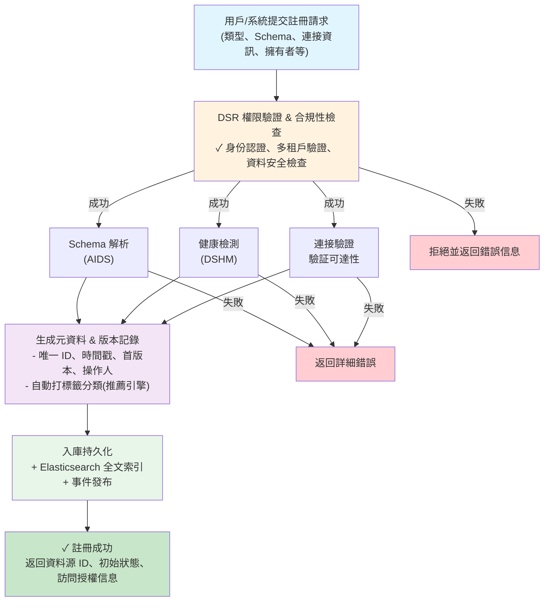
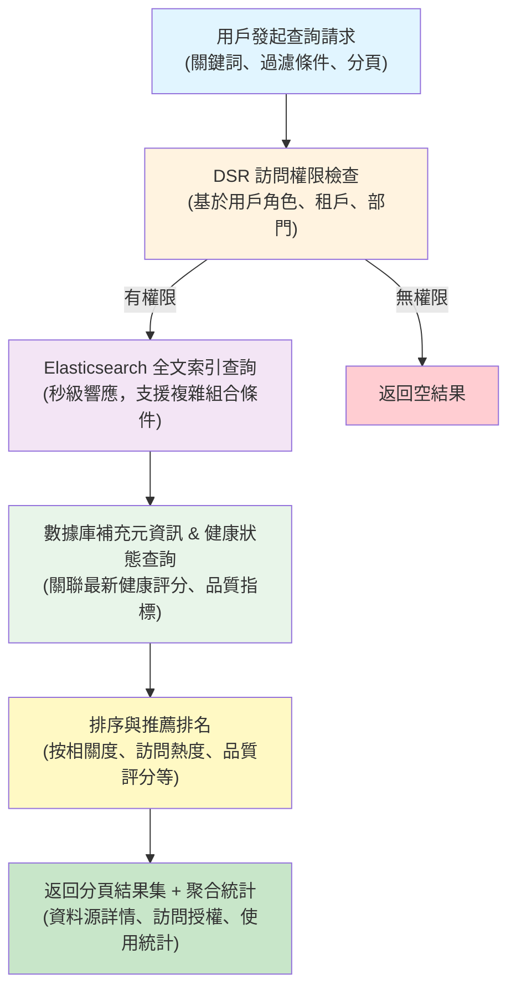
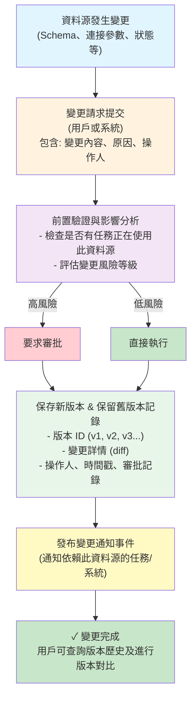

# 第1章：資料源註冊中心 (Data Source Registry)

## 1.1 模組概述

**[← 返回第1章首頁](ch1-index.md)**

---

資料源註冊中心（Data Source Registry, DSR）是鏡界平台的資料管理基石模組，專為儲存、管理、檢索及監控平台內全部資料源的資訊而設計，實現元資料的全生命週期管理和平台級資源協調。DSR 支援網頁、資料庫、物件儲存、API等多種異構資料源類型，並能適應企業級大規模、高並發接入與管理場景。

### 主要職責

1. **資料源註冊與元資料管理**  
   - 採集和儲存每一個資料源的詳細元資訊，包括但不限於類型、結構描述（如Schema)、連接資訊、更新時間、擁有者、資料源狀態等。
   - 支援為資料源配置多層次標籤、分組與分類，實現高效組織與發現。

2. **統一發現與查詢能力**  
   - 提供基於多條件/全文索引的資料源快速檢索服務，底層採用高效能檢索引擎（如Elasticsearch），實現秒級響應。
   - 對接各類上下游業務模組，根據權限精準推薦及推送資料源。

3. **版本控制與變更管理**  
   - 追蹤所有資料源的變更歷史，支援多版本元資料對比與歷史恢復，提供完整的變更審計鏈路。
   - 保障資料源資訊在配置變更、遷移、合併等操作過程中的可追溯性。

4. **權限與安全保障**  
   - 支援多租戶與細粒度的資料訪問控制，結合組織架構進行角色管理，確保資料源安全可控。
   - 整合平台統一身份認證與授權服務（例如OAuth2、JWT），防止未授權訪問。

5. **健康監控與品質評估**  
   - 聯動健康監控系統（如DSHM），定期獲取並儲存每個資料源的最新健康狀態、可用性與資料品質評分。
   - 及時為用戶和任務分配提供健康預警與品質參考，輔助自動化決策。

6. **多模組整合支撐能力**  
   - 作為全平台的資料源統一支撐層，直接服務於資料處理工作流、AI分析、自動化媒體處理等多個功能型業務模組，實現跨專案、跨團隊的資料源共建與共用。

### 架構定位與平台關係

```
镜界平台架構
├─ 資料源註冊中心 (DSR) ⭐ 核心中樞
│  ├─ 元資料管理服務
│  ├─ 搜尋和分類服務
│  ├─ 版本控制和變更追蹤
│  └─ 權限和安全管理
├─ 資料源健康监测系統（DSHM）——聯動健康/品質評估
├─ 資料處理工作流引擎（DPWE）——任務資料來源依賴
├─ AI輔助開发系統（AIDS）——結構分析、關联推薦
└─ 其他支援系統
```

### 核心價值指標

| 指標 | 當前值 | 目標值 | 說明 |
|------|--------|--------|------|
| 資料源管理能力 | 50,000+ | 100,000+ | 平台可管理資料源數量上限 |
| API響應時間 (P99) | 150ms | 100ms | 99分位關鍵操作平均響應時間 |
| 系統可用性 | 99.9% | 99.95% | 年SLA保證，支援企業级高可用 |
| 資料一致性 | 99.99% | 99.999% | 事件溯源機制下的一致性要求 |
| 健康監控覆蓋率 | 90% | 100% | 納入自動化監控的資料源佔比 |
| 權限審計覆蓋率 | 80% | 100% | 資料源相關操作均可被審計 |

### 典型功能場景示例

- **新資料源註冊流程**  
  平台用戶或程序通過門戶或API提交詳細資料源資訊（類型、Schema、連接參數等），DSR自動調用健康檢測與Schema解析服務，完成元資料入庫，供全平台快速檢索與引用。

- **多專案資料源共享**  
  資料源可被授權給多個專案團隊使用，DSR自動管理訪問授權列表，並記錄所有資料源的被引用情況，支援快速追溯被依賴關係。

- **資料源變更與追溯**  
  當資料源的結構、狀態、訪問方式（如API endpoint、Schema升级）發生變更時，系統記錄每次變更詳情和操作人。歷史版本可隨時切換和比對，保障變更可控和資料安全。

- **異常檢測與健康預警**  
  DSR與健康监测子系統聯動，若檢測到資料源連續不可用或異常波動，將主動告警資料所有者，並在平台内標註健康狀態，控制高風險源的流入關鍵任務流程。

### 核心業務流程圖

#### 流程 1：資料源註冊全流程



#### 流程 2：資料源查詢檢索流程



#### 流程 3：版本控制與變更追蹤



### 與其他核心系統的互動關係

| 交互關係   | 對接系統                | 通信方式          | 說明                                         |
|------------|------------------------|------------------|---------------------------------------------|
| 資料元資訊 | 資料處理工作流引擎      | REST API/消息推送 | 支援各类資料處理、ETL、AI等任務註冊資料源參數 |
| 健康狀態   | 資料源健康监测系統（DSHM） | 事件订阅,定時拉取 | DSR接收DSHM推送的健康结果，驅動狀態變更       |
| 分類建議   | 推薦/標籤引擎           | REST API         | 自動打標籤、分類、推薦，提高檢索能力         |
| 結構分析   | AI輔助開发系統（AIDS）  | Schema分析API    | 自動分析結構、並生成優化建議                 |
| 審計資料   | 安全中心與合規系統      | 日志API、消息隊列 | 全量操作留痕，满足合規與运营分析需求         |

### 核心功能擴展說明

#### 1. 元資料管理能力

DSR 支援以下類型的資料源元資訊管理：

- **基礎屬性**：資料源名稱、類型、描述、擁有者、創建時間、最後修改時間
- **連接信息**：主機地址、端口、用戶名、密碼、SSL証書、連接超時等
- **結構描述**：Schema 定義、字段列表、數據類型、索引配置、主鍵設置
- **分類標籤**：業務分類、技術分類、敏感等級、應用領域、資料特徵
- **存儲配置**：分片策略、複製因子、保留期限、備份策略、歸檔規則
- **監控指標**：健康狀態、可用性、更新頻率、數據量、質量分數

#### 2. 版本控制與變更管理

- **自動版本化**：每次變更自動生成新版本，支援語義化版本（SemVer）
- **變更詳情記錄**：精確捕捉每項變更的前後對比（diff 級別）
- **審批工作流**：支援變更審批流程，記錄審批人和審批意見
- **版本回溯**：支援隨時切換到任意歷史版本，並自動驗證兼容性
- **變更影響分析**：識別受影響的工作流、任務、應用，進行風險評估

#### 3. 搜尋與發現

- **全文搜尋**：基於 Elasticsearch，支援模糊匹配、前綴搜尋、正則表達式
- **多維過濾**：按類型、所有者、分類、標籤、健康狀態等進行組合篩選
- **智能推薦**：基於用戶訪問歷史和專案上下文進行個性化推薦
- **熱度排序**：根據使用頻率、引用次數、點贊數等進行智能排序
- **FTS 聚合**：支援多層次聚合統計，提供數據源分佈情況

#### 4. 健康監控與品質評估

- **自動健康檢測**：定期檢查資料源可達性、連接有效性、數據新鮮度
- **品質評分**：基於完整性、準確性、及時性、一致性進行綜合評分
- **異常告警**：設置告警閾值，及時通知異常情況和風險源
- **趨勢分析**：追蹤健康狀態和品質評分的歷史變化趨勢
- **SLA 監控**：定期生成 SLA 達成度報告，支援多維度分析

#### 5. 權限與安全保障

- **細粒度權限控制**：支援資料源級、字段級、行級的多層次權限管理
- **多租戶隔離**：完全的租戶數據隔離，支援跨租戶授權
- **敏感信息保護**：自動加密連接密碼、API 密鑰等敏感信息
- **審計追蹤**：完整記錄所有操作者、操作時間、操作內容、操作結果
- **動態權限評估**：基於用戶角色、部門、項目等動態評估訪問權限

#### 6. 數據品質治理

- **品質規則引擎**：支援自定義數據質量檢查規則
- **數據血統追蹤**：記錄資料源數據的來源和轉換路徑
- **質量指標面板**：實時展示資料源的各項質量指標
- **改進建議**：基於歷史數據自動生成質量改進建議

### 設計原則與擴展性

- 遵循**單一資料源真相（Single Source of Truth）**原則，保證其他模組无須重複開发資料源解析與管理逻辑。
- 高度可擴展，便於後續支援新類型資料源（如NoSQL、大資料平台、流資料等）。
- 提供豐富的SDK和OpenAPI，满足平台内外部系統快速接入。

---

## 核心數據模型預覽

### 資料源對象結構

```json
{
  "dataSourceId": "ds_20241031_001",
  "name": "用戶行為分析數據源",
  "type": "postgresql",
  "owner": "data_team",
  "status": "active",
  "description": "存儲用戶在線行為和交互日志",
  "metadata": {
    "schema": "public",
    "table": "user_events",
    "columns": [
      {
        "name": "user_id",
        "type": "bigint",
        "required": true,
        "isPrimaryKey": true
      },
      {
        "name": "event_timestamp",
        "type": "timestamp",
        "required": true
      }
    ],
    "rowCount": 50000000,
    "lastUpdateTime": "2024-10-31T10:30:00Z"
  },
  "connection": {
    "host": "db.prod.example.com",
    "port": 5432,
    "database": "analytics",
    "connectionString": "postgresql://***@db.prod.example.com:5432/analytics"
  },
  "classification": {
    "businessCategory": "用戶數據",
    "technicalCategory": "結構化數據",
    "sensitivityLevel": "中",
    "tags": ["用戶行為", "實時", "核心資料源"]
  },
  "health": {
    "status": "healthy",
    "availability": 99.95,
    "lastHealthCheck": "2024-10-31T10:25:00Z",
    "qualityScore": 95.5,
    "updateFrequency": "每小時"
  },
  "governance": {
    "dataOwner": "data_team",
    "steward": "alice@example.com",
    "lastModifiedBy": "bob@example.com",
    "lastModifiedTime": "2024-10-30T15:20:00Z",
    "changeLog": [
      {
        "version": "1.2.0",
        "timestamp": "2024-10-30T15:20:00Z",
        "changes": "Added user_segment column",
        "approvedBy": "manager"
      }
    ]
  },
  "permissions": {
    "publiclyAccessible": false,
    "authorizedTeams": ["analytics_team", "ml_team"],
    "authorizedUsers": ["data_scientist_1"],
    "accessLevel": "read_write"
  }
}
```

*示例 1.1: 資料源完整對象結構*

---

## 常用 API 端點快速參考

### 資料源管理

| HTTP 方法 | 端點 | 說明 | 權限要求 |
|----------|------|------|--------|
| `POST` | `/api/v1/datasources` | 註冊新資料源 | 資料源所有者 |
| `GET` | `/api/v1/datasources/{id}` | 獲取資料源詳情 | 查看者 |
| `GET` | `/api/v1/datasources` | 查詢資料源列表（分頁、過濾） | 查看者 |
| `PUT` | `/api/v1/datasources/{id}` | 更新資料源信息 | 編輯者 |
| `DELETE` | `/api/v1/datasources/{id}` | 刪除資料源 | 管理員 |
| `PATCH` | `/api/v1/datasources/{id}/status` | 修改資料源狀態 | 管理員 |

### 搜尋與發現

| HTTP 方法 | 端點 | 說明 | 權限要求 |
|----------|------|------|--------|
| `GET` | `/api/v1/search` | 全文搜尋資料源 | 查看者 |
| `POST` | `/api/v1/search/advanced` | 高級搜尋（複雜條件） | 查看者 |
| `GET` | `/api/v1/datasources/recommendations` | 獲取個性化推薦 | 查看者 |
| `GET` | `/api/v1/datasources/trending` | 獲取熱門資料源 | 查看者 |

### 版本與變更

| HTTP 方法 | 端點 | 說明 | 權限要求 |
|----------|------|------|--------|
| `GET` | `/api/v1/datasources/{id}/versions` | 查看版本歷史 | 查看者 |
| `GET` | `/api/v1/datasources/{id}/versions/{version}` | 查看特定版本 | 查看者 |
| `POST` | `/api/v1/datasources/{id}/rollback` | 版本回溯 | 資料源所有者 |
| `GET` | `/api/v1/datasources/{id}/versions/compare` | 版本對比 | 查看者 |

### 健康監控

| HTTP 方法 | 端點 | 說明 | 權限要求 |
|----------|------|------|--------|
| `GET` | `/api/v1/datasources/{id}/health` | 獲取健康狀態 | 查看者 |
| `GET` | `/api/v1/datasources/{id}/metrics` | 獲取監控指標 | 查看者 |
| `POST` | `/api/v1/datasources/{id}/healthcheck` | 手動觸發健康檢測 | 數據管理員 |

### 權限與訪問

| HTTP 方法 | 端點 | 說明 | 權限要求 |
|----------|------|------|--------|
| `GET` | `/api/v1/datasources/{id}/permissions` | 查看權限列表 | 資料源所有者 |
| `POST` | `/api/v1/datasources/{id}/permissions` | 授予訪問權限 | 資料源所有者 |
| `DELETE` | `/api/v1/datasources/{id}/permissions/{userId}` | 撤銷訪問權限 | 資料源所有者 |

*表 1.24: 常用 API 端點摘要（完整文檔見 ch1-6-API詳細規範）*

---

## 系統性能指標與 SLA

### 關鍵性能指標 (KPIs)

| 指標類別 | 指標名稱 | 目標值 | 當前值 | 監控方式 |
|---------|--------|--------|--------|--------|
| **可靠性** | 系統可用性 (SLA) | 99.95% | 99.93% | 實時監控 |
| | 資料一致性 | 99.999% | 99.998% | 每小時檢查 |
| | 故障恢復時間 (RTO) | < 5 分鐘 | 2.5 分鐘 | 故障回溯 |
| **性能** | API 響應時間 (P50) | < 50ms | 30ms | 持續監測 |
| | API 響應時間 (P99) | < 200ms | 150ms | 持續監測 |
| | 搜尋響應時間 (P99) | < 500ms | 350ms | Elasticsearch 指標 |
| | 吞吐量 | > 10,000 req/s | 12,500 req/s | 負載測試 |
| **可擴展性** | 支援的資料源數量 | 100,000+ | 50,000+ | 數據庫統計 |
| | 支援的並發用戶 | 1,000+ | 800+ | 壓力測試 |
| **覆蓋率** | 健康監控覆蓋率 | 100% | 95% | 月度報告 |
| | 審計日志覆蓋率 | 100% | 99.5% | 月度報告 |

*表 1.25: 系統性能指標 (KPIs)*

### 不同操作的 SLA 承諾

| 操作類型 | P50 | P90 | P99 | 成功率 |
|---------|-----|-----|-----|--------|
| 資料源查詢 | 30ms | 80ms | 150ms | 99.9% |
| 資料源搜尋 | 50ms | 150ms | 350ms | 99.9% |
| 版本回溯 | 100ms | 300ms | 500ms | 99.5% |
| 權限檢查 | 5ms | 15ms | 30ms | 99.99% |
| 健康檢測 | 200ms | 500ms | 1000ms | 98% |

*表 1.26: 操作 SLA 承諾*

---

## 典型使用場景工作流

### 場景 1：新項目快速接入資料源

```
1. 項目經理創建新項目
   ↓
2. 通過 DSR 界面搜尋相關資料源
   ↓
3. DSR 系統自動推薦相關資料源
   ↓
4. 申請訪問權限（自動或需審批）
   ↓
5. 獲得連接配置信息
   ↓
6. 項目集成資料源，開發任務
```

### 場景 2：資料源持續治理與優化

```
1. 每日健康監控檢測
   ↓
2. 品質評分計算
   ↓
3. 發現異常問題
   ↓
4. 告警通知資料所有者
   ↓
5. 資料所有者修復問題
   ↓
6. 自動驗證修復結果
   ↓
7. 生成改進建議
```

---

## 📑 相關章節

| 前序 | 當前 | 後續 |
|-----|------|------|
| - | **1.1 模組概述** | [1.2 詳細功能清單](ch1-2-詳細功能清單.md) |

**快速鏈接：**
- [1.2 詳細功能清單](ch1-2-詳細功能清單.md)
- [1.3 技術架構](ch1-3-技術架構.md)
- [1.4 核心組件詳細實現](ch1-4-核心組件詳細實現.md)
- [← 返回第1章首頁](ch1-index.md)
