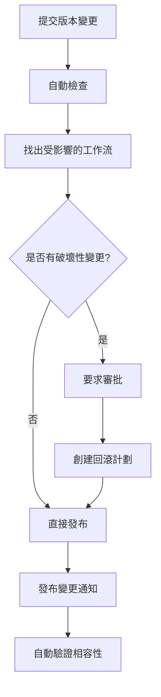

# 第1章：資料源註冊中心 (Data Source Registry)

## 1.10 最佳實踐指南

**[← 返回第1章首頁](ch1-index.md)**

---

## 1.10.1 常見使用場景與解決方案

### 場景 1：企業級多租戶環境配置

**問題**：如何在多租戶環境中隔離不同企業的數據源？

**解決方案**：

1. **租戶隔離設計**
```
資料層隔離：
  ├─ 物理隔離：每個租戶單獨數據庫（推薦用於金融、醫療）
  ├─ 邏輯隔離：共享數據庫，按 tenant_id 分區（推薦用於 SaaS）
  └─ 混合隔離：關鍵數據物理隔離，其他邏輯隔離

應用層隔離：
  ├─ 在每個 API 調用中驗證租戶上下文
  ├─ 使用租戶特定的連接池
  └─ 隔離每租戶的緩存空間
```

2. **最佳實踐**
   - ✅ 在數據庫層面強制執行租戶隔離（行級安全 RLS）
   - ✅ 為每個租戶分配獨立的 KMS 密鑰
   - ✅ 審計日志中始終包含租戶信息
   - ✅ 定期進行租戶隔離滲透測試

3. **配置示例**
```sql
-- PostgreSQL 行級安全策略
CREATE POLICY tenant_isolation ON datasources
  USING (tenant_id = current_setting('app.current_tenant_id')::uuid)
  WITH CHECK (tenant_id = current_setting('app.current_tenant_id')::uuid);

ALTER TABLE datasources ENABLE ROW LEVEL SECURITY;
ALTER TABLE datasources FORCE ROW LEVEL SECURITY;
```

---

### 場景 2：高性能搜尋優化

**問題**：如何優化大規模數據源搜尋性能（超過 100,000 個資料源）？

**解決方案**：

1. **Elasticsearch 優化**
```
索引設計：
  ├─ 分片數量：每個分片 20-40GB，總分片數 = 數據量 / 30GB
  ├─ 副本數量：生產環境最少 2 個副本
  └─ 刷新間隔：搜尋用途設為 1 秒，非實時用途設為 30 秒

查詢優化：
  ├─ 使用 filter 上下文替代 query（節省評分計算）
  ├─ 啟用查詢緩存（適用於頻繁相同查詢）
  └─ 使用搜尋模板預編譯複雜查詢
```

2. **配置示例**
```json
{
  "settings": {
    "number_of_shards": 10,
    "number_of_replicas": 2,
    "refresh_interval": "1s",
    "index.codec": "best_compression",
    "index.queries.cache.enabled": true
  },
  "mappings": {
    "properties": {
      "name": {
        "type": "text",
        "analyzer": "standard",
        "fields": {
          "keyword": {"type": "keyword"}
        }
      },
      "type": {"type": "keyword"},
      "owner": {"type": "keyword"},
      "tags": {"type": "keyword"},
      "created_at": {"type": "date"}
    }
  }
}
```

3. **查詢模板示例**
```json
{
  "query": {
    "bool": {
      "filter": [
        {"term": {"type": "{{query_type}}"}},
        {"term": {"owner": "{{query_owner}}"}}
      ],
      "must": [
        {"multi_match": {
          "query": "{{query_text}}",
          "fields": ["name^2", "description"]
        }}
      ]
    }
  }
}
```

---

### 場景 3：版本管理與變更追蹤

**問題**：如何管理複雜的資料源版本升級與向後兼容性？

**解決方案**：

1. **語義化版本控制**
```
版本格式: MAJOR.MINOR.PATCH[-PRERELEASE][+BUILD]

示例：
  - 1.0.0：首次發布
  - 1.1.0：新增字段（向後兼容）
  - 1.1.1：修復 bug（向後兼容）
  - 2.0.0：破壞性變更（移除字段）
```

2. **變更評估框架**
| 變更類型 | 版本號提升 | 影響評估 | 兼容性 |
|---------|----------|--------|-------|
| 新增字段 | MINOR | 低 | 兼容 |
| 字段類型變更 | MAJOR | 高 | 不兼容 |
| 字段删除 | MAJOR | 高 | 不兼容 |
| 連接參數變更 | MINOR | 中 | 兼容 |
| Schema 重組 | MAJOR | 高 | 不兼容 |

3. **變更工作流**


---

## 1.10.2 配置最佳實踐

### 連接配置模板

#### PostgreSQL/MySQL

```yaml
datasource:
  name: "生產用戶數據庫"
  type: "postgresql"
  
connection:
  host: "db.prod.example.com"
  port: 5432
  database: "production"
  username: "${SECRET_DB_USER}"  # 引用密鑰管理服務
  password: "${SECRET_DB_PASS}"
  
  # 連接池配置
  pool:
    minSize: 10
    maxSize: 100
    idleTimeout: 600
    connectionTimeout: 30
    
  # SSL 配置
  ssl:
    enabled: true
    mode: "require"
    verifyServerCertificate: true
    
  # 查詢配置
  query:
    timeout: 300
    maxRows: 10000
```

#### MongoDB

```yaml
datasource:
  name: "訂單數據集合"
  type: "mongodb"
  
connection:
  connectionString: "${SECRET_MONGO_URI}"
  
  # 連接池配置
  pool:
    minPoolSize: 10
    maxPoolSize: 50
    maxIdleTimeMS: 600000
    
  # 認證
  auth:
    mechanism: "SCRAM-SHA-256"
    authDB: "admin"
```

#### Elasticsearch

```yaml
datasource:
  name: "日志索引集合"
  type: "elasticsearch"
  
connection:
  hosts:
    - "es1.example.com:9200"
    - "es2.example.com:9200"
    - "es3.example.com:9200"
    
  # 安全配置
  security:
    enabled: true
    username: "${SECRET_ES_USER}"
    password: "${SECRET_ES_PASS}"
    sslEnabled: true
    
  # 連接配置
  connection:
    timeout: 10000
    requestTimeout: 30000
    retryOnConflict: 3
```

---

### 性能調優建議

| 場景 | 調優項 | 推薦值 | 說明 |
|------|--------|--------|------|
| **高查詢並發** | 緩存過期 | 1 小時 | 平衡數據新鮮度和性能 |
| | 連接池大小 | 100+ | 避免連接飢荒 |
| | 讀副本 | 3+ | 分散讀負載 |
| **大規模索引** | 分片數 | 核心數 * 3 | 充分利用 CPU |
| | 刷新間隔 | 30 秒 | 降低寫入延遲 |
| **高可用** | RTO | < 5 分鐘 | 自動故障轉移 |
| | RPO | < 1 分鐘 | 最小數據丟失 |

---

## 1.10.3 故障排除指南

### 常見問題與解決方案

#### 問題 1：搜尋響應時間突然變慢

**症狀**：P99 搜尋時間從 300ms 突增到 2000ms+

**診斷步驟**：
```bash
# 1. 檢查 Elasticsearch 集群狀態
curl -X GET "localhost:9200/_cluster/health?pretty"

# 2. 查看慢查詢日志
curl -X GET "localhost:9200/_search?q=*" -H "Content-Type: application/json" \
  -d '{"profile": true}'

# 3. 檢查堆內存使用
curl -X GET "localhost:9200/_nodes/stats/jvm?pretty"

# 4. 查看索引統計信息
curl -X GET "localhost:9200/_stats?pretty"
```

**可能原因與解決**：

| 原因 | 徵兆 | 解決方案 |
|------|------|--------|
| 堆內存不足 | JVM 垃圾回收變長 | 增加堆內存或增加節點 |
| 索引分片不均勻 | 某個分片 cpu 極高 | 重新平衡分片 |
| 查詢複雜度高 | 查詢評分消耗高 | 優化查詢，使用 filter |
| 數據熱點 | 特定分片慢 | 使用 routing 分散熱點 |

---

#### 問題 2：資料源註冊失敗

**症狀**：API 返回 500 Internal Server Error

**排查清單**：
```
□ 檢查連接參數是否正確
  - 主機名/IP 地址
  - 端口號
  - 認證信息
  
□ 驗證 DSR 服務日志
  - tail -f /var/log/dsr/app.log | grep ERROR
  
□ 檢查用戶權限
  - 當前用戶是否有註冊數據源權限
  
□ 驗證配額限制
  - 是否達到租戶的數據源上限
  
□ 檢查依賴服務
  - Schema 分析服務（AIDS）是否可用
  - 健康檢測服務（DSHM）是否可用
```

**恢復步驟**：
```bash
# 1. 查看服務狀態
kubectl get pods -l app=dsr

# 2. 查看 Pod 日志
kubectl logs -f deployment/dsr-api-server -c dsr

# 3. 檢查數據庫連接
kubectl exec -it deployment/dsr-api-server -- \
  pg_isready -h postgres-db -p 5432

# 4. 重啟服務
kubectl rollout restart deployment/dsr-api-server
```

---

#### 問題 3：權限拒絕錯誤

**症狀**：用戶可以看到數據源列表，但無法訪問特定數據源

**排查步驟**：
```bash
# 1. 查看用戶當前角色
curl -X GET "https://dsr-api/api/v1/users/me" \
  -H "Authorization: Bearer ${TOKEN}"

# 2. 查看數據源的訪問控制列表 (ACL)
curl -X GET "https://dsr-api/api/v1/datasources/{id}/permissions" \
  -H "Authorization: Bearer ${TOKEN}"

# 3. 查看相關的審計日志
curl -X GET "https://dsr-api/api/v1/audit/logs?resourceId={id}" \
  -H "Authorization: Bearer ${TOKEN}"
```

**常見原因**：
- 用戶角色未被正確分配
- 團隊/部門不匹配
- 租戶隔離問題
- 會話令牌過期

---

## 1.10.4 監控與告警

### 關鍵監控指標

```yaml
monitoring:
  metrics:
    - name: "dsr_api_latency_p99"
      threshold: 200  # ms
      alert: "critical"
      
    - name: "datasource_health_check_failure_rate"
      threshold: 0.05  # 5%
      alert: "warning"
      
    - name: "elasticsearch_cluster_health"
      threshold: "yellow"  # acceptable values: green, yellow, red
      alert: "warning"
      
    - name: "database_connection_pool_usage"
      threshold: 0.9  # 90%
      alert: "warning"
      
    - name: "audit_log_lag"
      threshold: 60000  # ms
      alert: "critical"

alerts:
  - name: "高 API 延遲"
    condition: "p99_latency > 500ms"
    action: "page_on_call"
    
  - name: "大量權限檢查失敗"
    condition: "error_rate > 10%"
    action: "slack_notification"
    
  - name: "數據源健康評分下降"
    condition: "health_score_trend_down > 20%"
    action: "email_data_owner"
```

---

## 1.10.5 安全加固清單

### 部署前檢查清單

- [ ] 所有密碼通過密鑰管理服務管理，不在代碼中
- [ ] SSL/TLS 已配置，使用 TLS 1.3 或更新
- [ ] 行級安全 (RLS) 已為多租戶環境啟用
- [ ] 審計日志已配置並定期歸檔
- [ ] 備份加密已啟用
- [ ] 日志中去掉了所有敏感信息
- [ ] 定期安全掃描已配置（至少每週一次）
- [ ] DDoS 防護已啟用
- [ ] WAF 規則已配置
- [ ] 應急響應計劃已準備

---

## 📑 相關章節

| 前序 | 當前 | 後續 |
|-----|------|------|
| [1.9 與其他模組的交互](ch1-9-與其他模組的交互.md) | **1.10 最佳實踐指南** | [1.11 快速入門教程](ch1-11-快速入門教程.md) |

**快速鏈接：**
- [1.9 與其他模組的交互](ch1-9-與其他模組的交互.md)
- [1.11 快速入門教程](ch1-11-快速入門教程.md)
- [← 返回第1章首頁](ch1-index.md)
