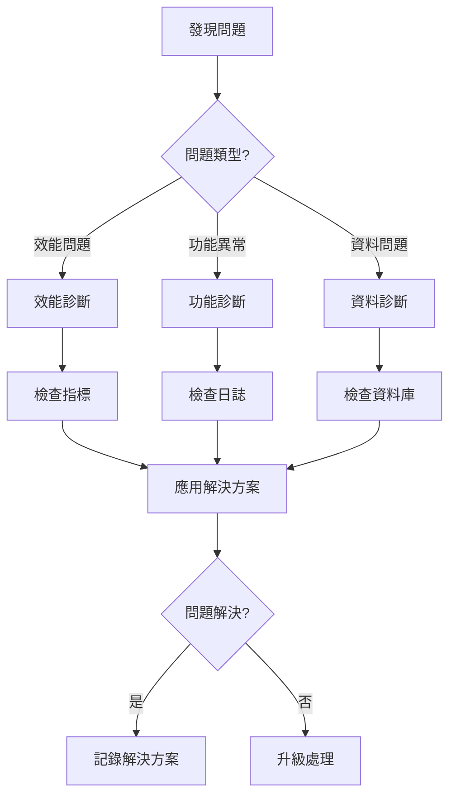

# 第1章：資料源註冊中心 (Data Source Registry)

## 1.11 故障排查指南

**[← 返回第1章首頁](ch1-index.md)**

---

本章節提供資料源註冊中心常見問題的診斷和解決方案，幫助快速定位和修復問題。

## 🔍 問題診斷流程



---

## 🐛 常見問題與解決方案

### 問題 1: 資料源搜尋速度慢

#### 症狀
- 搜尋請求響應時間超過 5 秒
- P99 延遲超過 10 秒
- Elasticsearch 負載過高

#### 可能原因
1. Elasticsearch 索引未優化
2. 查詢條件過於複雜
3. 資料量過大導致全表掃描
4. 分片配置不合理

#### 診斷步驟

```bash
# 1. 檢查 Elasticsearch 集群健康狀態
curl -X GET "localhost:9200/_cluster/health?pretty"

# 2. 查看索引統計資訊
curl -X GET "localhost:9200/data_sources/_stats?pretty"

# 3. 檢查慢查詢日誌
curl -X GET "localhost:9200/_cat/indices/data_sources?v"

# 4. 分析查詢效能
curl -X GET "localhost:9200/data_sources/_search?explain=true" \
  -H 'Content-Type: application/json' \
  -d '{"query": {"match": {"name": "test"}}}'
```

#### 解決方案

**方案 1: 優化索引設置**
```python
# 更新索引設置
from elasticsearch import Elasticsearch

es = Elasticsearch(['localhost:9200'])

# 增加副本數以提升讀取效能
es.indices.put_settings(
    index='data_sources',
    body={
        'number_of_replicas': 2,
        'refresh_interval': '30s'
    }
)

# 優化分片策略
es.indices.put_settings(
    index='data_sources',
    body={
        'routing.allocation.total_shards_per_node': 3
    }
)
```

**方案 2: 添加缺失的索引**
```sql
-- 檢查缺失的索引
SELECT 
    schemaname,
    tablename,
    indexname,
    indexdef
FROM pg_indexes
WHERE tablename = 'data_sources';

-- 添加複合索引
CREATE INDEX CONCURRENTLY idx_data_sources_search 
ON data_sources USING GIN (
    to_tsvector('chinese', name || ' ' || description)
);

-- 添加分類索引
CREATE INDEX CONCURRENTLY idx_data_sources_category 
ON data_sources (category, created_at DESC);
```

**方案 3: 使用查詢緩存**
```python
from functools import lru_cache
from datetime import datetime, timedelta

class SearchCache:
    def __init__(self, ttl_seconds=300):
        self.ttl = ttl_seconds
        self.cache = {}
    
    def get_cache_key(self, query_params):
        """生成緩存鍵"""
        return hash(frozenset(query_params.items()))
    
    def get(self, query_params):
        """獲取緩存結果"""
        key = self.get_cache_key(query_params)
        if key in self.cache:
            result, timestamp = self.cache[key]
            if datetime.now() - timestamp < timedelta(seconds=self.ttl):
                return result
            else:
                del self.cache[key]
        return None
    
    def set(self, query_params, result):
        """設置緩存"""
        key = self.get_cache_key(query_params)
        self.cache[key] = (result, datetime.now())

# 使用緩存
search_cache = SearchCache(ttl_seconds=300)

def search_data_sources(query_params):
    # 先檢查緩存
    cached_result = search_cache.get(query_params)
    if cached_result:
        return cached_result
    
    # 執行搜尋
    result = es.search(index='data_sources', body=query_params)
    
    # 存入緩存
    search_cache.set(query_params, result)
    
    return result
```

#### 預防措施
- ✅ 定期重建索引（每週一次）
- ✅ 監控查詢效能指標
- ✅ 設置合理的緩存策略
- ✅ 限制複雜查詢的使用

---

### 問題 2: 資料源註冊失敗

#### 症狀
- API 返回 500 錯誤
- 資料源創建請求超時
- 日誌中出現資料庫連接錯誤

#### 可能原因
1. 資料庫連接池耗盡
2. 資料驗證失敗
3. 重複的資料源 URL
4. 權限不足

#### 診斷步驟

```python
# 檢查資料庫連接池狀態
import psycopg2
from psycopg2 import pool

def check_connection_pool():
    """檢查連接池狀態"""
    connection_pool = get_connection_pool()
    
    print(f"總連接數: {connection_pool.maxconn}")
    print(f"最小連接數: {connection_pool.minconn}")
    print(f"當前活躍連接: {len(connection_pool._used)}")
    print(f"空閒連接: {len(connection_pool._pool)}")
    
    # 檢查長時間運行的查詢
    conn = connection_pool.getconn()
    cursor = conn.cursor()
    
    cursor.execute("""
        SELECT pid, now() - query_start as duration, query
        FROM pg_stat_activity
        WHERE state = 'active'
        AND now() - query_start > interval '30 seconds'
        ORDER BY duration DESC;
    """)
    
    long_running = cursor.fetchall()
    if long_running:
        print(f"發現 {len(long_running)} 個長時間運行的查詢:")
        for pid, duration, query in long_running:
            print(f"  PID {pid}: {duration} - {query[:100]}")
    
    connection_pool.putconn(conn)
```

#### 解決方案

**方案 1: 增加連接池大小**
```python
# config/database.py
DATABASE_CONFIG = {
    'host': 'localhost',
    'port': 5432,
    'database': 'mirror_realm',
    'user': 'mirror_realm',
    'password': os.getenv('DB_PASSWORD'),
    'minconn': 10,  # 增加最小連接數
    'maxconn': 50,  # 增加最大連接數
    'connect_timeout': 10,
    'options': '-c statement_timeout=30000'  # 30秒超時
}
```

**方案 2: 添加請求重試機制**
```python
import time
from functools import wraps

def retry_on_failure(max_retries=3, delay=1, backoff=2):
    """重試裝飾器"""
    def decorator(func):
        @wraps(func)
        def wrapper(*args, **kwargs):
            retries = 0
            current_delay = delay
            
            while retries < max_retries:
                try:
                    return func(*args, **kwargs)
                except Exception as e:
                    retries += 1
                    if retries >= max_retries:
                        raise
                    
                    print(f"請求失敗，{current_delay}秒後重試 ({retries}/{max_retries})")
                    time.sleep(current_delay)
                    current_delay *= backoff
            
        return wrapper
    return decorator

@retry_on_failure(max_retries=3, delay=1)
def create_data_source(data):
    """創建資料源（帶重試）"""
    return db.session.execute(
        insert(DataSource).values(**data)
    )
```

**方案 3: 添加資料驗證**
```python
from pydantic import BaseModel, validator, HttpUrl

class DataSourceCreate(BaseModel):
    """資料源創建驗證模型"""
    name: str
    url: HttpUrl
    category: str
    data_type: str
    
    @validator('name')
    def name_must_be_unique(cls, v):
        """驗證名稱唯一性"""
        if DataSource.query.filter_by(name=v).first():
            raise ValueError(f'資料源名稱 {v} 已存在')
        return v
    
    @validator('url')
    def url_must_be_unique(cls, v):
        """驗證URL唯一性"""
        if DataSource.query.filter_by(url=str(v)).first():
            raise ValueError(f'資料源URL {v} 已存在')
        return v
    
    @validator('category')
    def category_must_be_valid(cls, v):
        """驗證分類有效性"""
        valid_categories = ['web', 'api', 'database', 'file', 'social']
        if v not in valid_categories:
            raise ValueError(f'無效的分類: {v}')
        return v

# 使用驗證
@app.post('/api/v1/data-sources')
def create_data_source_api(data: DataSourceCreate):
    try:
        # Pydantic 自動驗證
        result = create_data_source(data.dict())
        return {'id': result.id, 'status': 'success'}
    except ValueError as e:
        return {'error': str(e)}, 400
```

#### 預防措施
- ✅ 設置合理的連接池大小
- ✅ 添加請求驗證和重試機制
- ✅ 監控資料庫連接狀態
- ✅ 定期清理無效連接

---

### 問題 3: 資料源版本衝突

#### 症狀
- 更新資料源時返回衝突錯誤
- 資料版本號不一致
- 並發更新導致資料丟失

#### 可能原因
1. 樂觀鎖失效
2. 並發更新未處理
3. 版本號未正確更新

#### 解決方案

**使用樂觀鎖**
```python
from sqlalchemy import Column, Integer, String, DateTime
from sqlalchemy.orm import Session

class DataSource(Base):
    __tablename__ = 'data_sources'
    
    id = Column(String, primary_key=True)
    name = Column(String, nullable=False)
    version = Column(Integer, default=1, nullable=False)  # 版本號
    updated_at = Column(DateTime, default=func.now(), onupdate=func.now())

def update_data_source(session: Session, ds_id: str, updates: dict, current_version: int):
    """使用樂觀鎖更新資料源"""
    result = session.execute(
        update(DataSource)
        .where(DataSource.id == ds_id)
        .where(DataSource.version == current_version)  # 版本檢查
        .values(
            **updates,
            version=DataSource.version + 1,  # 版本遞增
            updated_at=func.now()
        )
    )
    
    if result.rowcount == 0:
        raise ConflictError(f'資料源 {ds_id} 已被其他用戶修改，請重新獲取最新版本')
    
    session.commit()
    return get_data_source(session, ds_id)
```

---

## 📊 監控與告警

### 關鍵指標監控

```yaml
# prometheus 監控規則
groups:
  - name: data_source_registry
    rules:
      # API 響應時間
      - alert: SlowAPIResponse
        expr: histogram_quantile(0.99, rate(http_request_duration_seconds_bucket[5m])) > 1
        for: 5m
        annotations:
          summary: "API 響應過慢"
          description: "P99 延遲超過 1 秒"
      
      # 搜尋失敗率
      - alert: HighSearchErrorRate
        expr: rate(search_errors_total[5m]) / rate(search_requests_total[5m]) > 0.05
        for: 5m
        annotations:
          summary: "搜尋錯誤率過高"
          description: "搜尋失敗率超過 5%"
      
      # 資料庫連接池
      - alert: ConnectionPoolNearlyFull
        expr: db_connection_pool_active / db_connection_pool_max > 0.9
        for: 2m
        annotations:
          summary: "連接池接近飽和"
          description: "連接池使用率超過 90%"
```

---

## 🔧 維護工具

### 資料庫維護腳本

```bash
#!/bin/bash
# db_maintenance.sh - 定期維護腳本

# 1. 重建索引
psql -U mirror_realm -d mirror_realm -c "REINDEX TABLE data_sources;"

# 2. 更新統計資訊
psql -U mirror_realm -d mirror_realm -c "ANALYZE data_sources;"

# 3. 清理舊版本資料
psql -U mirror_realm -d mirror_realm -c "
    DELETE FROM data_source_versions 
    WHERE created_at < NOW() - INTERVAL '90 days'
    AND id NOT IN (
        SELECT MAX(id) FROM data_source_versions GROUP BY data_source_id
    );
"

# 4. 備份資料庫
pg_dump -U mirror_realm mirror_realm > backup_$(date +%Y%m%d).sql

echo "維護完成: $(date)"
```

---

## 📞 獲取幫助

如果以上解決方案無法解決問題，請：

1. 收集詳細的錯誤日誌和系統指標
2. 記錄問題復現步驟
3. 聯繫技術支持團隊
4. 參考 [API 文檔](ch1-6-API詳細規範.md) 和 [最佳實踐](ch1-10-最佳實踐指南.md)

---

**相關章節**:
- [1.7 效能優化策略](ch1-7-效能優化策略.md)
- [1.8 安全考慮](ch1-8-安全考慮.md)
- [1.10 最佳實踐指南](ch1-10-最佳實踐指南.md)
- [← 返回第1章首頁](ch1-index.md)

