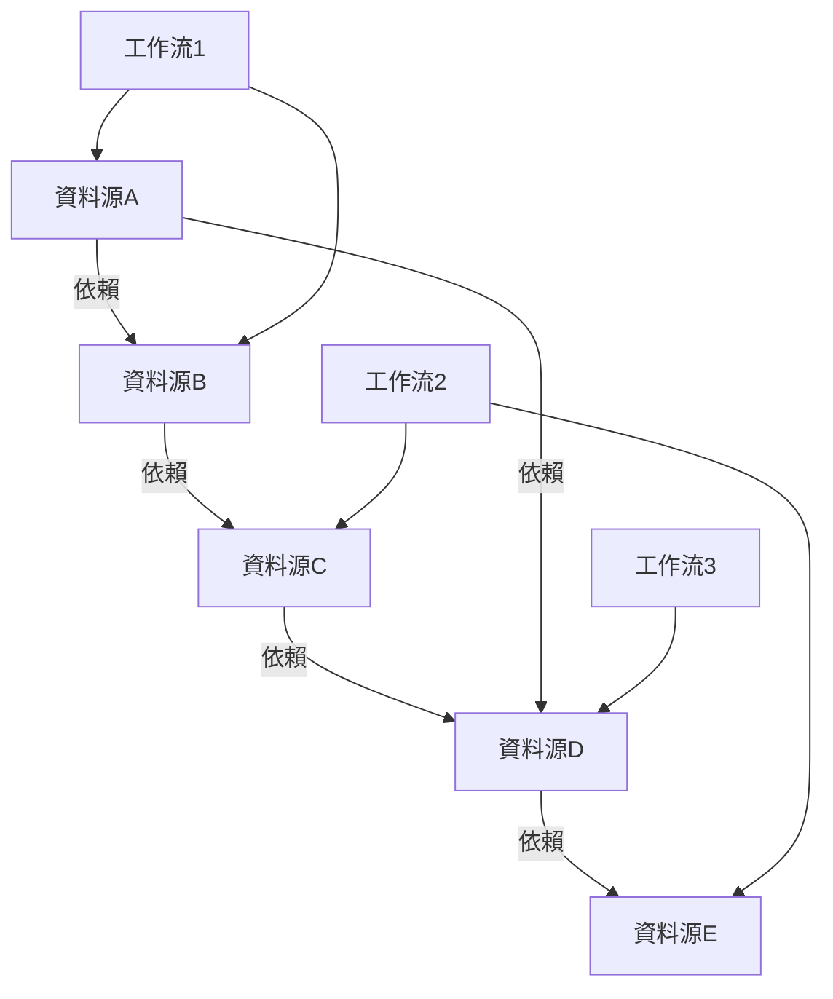

# 第1章：資料源註冊中心 (Data Source Registry)

## 1.2 詳細功能清單

**[← 返回第1章首頁](ch1-index.md)**

---

## 1.2.1 核心功能

### 資料源CRUD管理

- **创建**：支援通過界面、API或自動化發現方式添加資料源，需提供基本元資料資訊如名称、URL、資料類型等。系統會自動验證資料源定義的有效性，包括URL格式、資料類型合規性等。
- **读取**：提供資料源詳情查看功能，包括元資料、健康狀態、使用统计等。支援单個查詢和批量獲取。
- **更新**：支援資料源元資料的增量更新，每次更新會创建新版本並保留歷史版本，實現變更追蹤和回滚能力。
- **删除**：支援软删除（標記為已删除，保留元資料）和永久删除两種模式。软删除的資料源保留在回收站中，可隨時恢復。
- **版本控制**：所有資料源變更都會生成新版本，系統記錄每次變更的詳細資訊，包括變更內容、變更者、變更時間等，支援版本對比和回滚操作。

**代碼實現參考**: [DataSourceService - CRUD 實現](../ch1-code-examples/ch1-code-01-core-functions.md)

### 資料源分類與標籤

- **多级分類體系**：支援创建无限层级的分類树，每個資料源可归属於一個分類節點。分類體系支援父子關係、排序和描述資訊。
- **動态標籤系統**：支援用戶自定義標籤，資料源可拥有多個標籤，用於灵活的多维度組織和筛选。標籤系統支援创建、编辑和删除操作。
- **自動化標籤建議**：基於資料源URL、描述和內容類型，系統自動分析並推薦相關標籤，提高分類效率。例如，分析`https://api.instagram.com/v1/users/self/media/recent`可自動生成標籤`["social", "api", "instagram", "media"]`，准确率达85%以上。
- **自動分類**：根據預定義规则和机器学習模型，系統自動為新添加的資料源分配合适的分類，减少人工分類工作量。

**代碼實現參考**: [CategoryEngine 和 TagEngine - 分類與標籤](../ch1-code-examples/ch1-code-01-core-functions.md)

### 高级搜尋與過滤

- **全文搜尋**：基於Elasticsearch實現的高效能全文搜尋，支援對資料源名称、描述、URL等內容进行语義搜尋。
- **複杂查詢構建器**：提供可视化查詢構建器，支援布尔逻辑（AND、OR、NOT）、范围查詢、精确匹配等複杂查詢條件组合。
- **保存常用搜尋查詢**：用戶可保存常用的搜尋查詢模板，方便快速訪問特定類型的資料源。
- **搜尋建議**：提供搜尋词自動补全和標籤建議功能，提升搜尋體验和效率。

### 資料源健康監控整合

- **健康狀態可视化**：直观展示資料源的健康狀態（健康、警告、異常），提供歷史趋势图表。
- **健康指標監控**：監控關鍵指標如可用性（24小時/7天）、響應時間（P50/P95）、错误率等。
- **健康歷史記錄**：記錄資料源健康狀態的歷史变化，支援按時間范围查詢和對比。
- **健康阈值配置**：允许用戶自定義健康阈值，當指標超出阈值時触发告警。
- **健康評分系統**：采用加权算法计算综合健康評分，公式為`health_score = 0.5*availability_7d + 0.3*response_time_score + 0.2*error_rate_score`，其中響應時間評分采用非线性衰减函數。

### 訪問控制與權限管理

- **细粒度權限控制**：支援專案级、資料源级的權限管理，精确控制用戶對資料源的操作權限。
- **基於角色的訪問控制(RBAC)**：預定義角色（管理员、编辑者、查看者等），每個角色具有特定的權限集合。
- **資料源共享功能**：支援將資料源共享給其他專案或用戶，设置不同的訪問權限级别。
- **權限继承機制**：專案级權限自動继承至專案内的資料源，同時允许對特定資料源设置覆蓋權限。
- **權限審計**：記錄所有權限變更和訪問操作，满足安全審計要求。

---

## 1.2.2 高级功能

### 資料源依賴關係管理

- **依賴關係可视化**：自動识别和可视化資料源之间的依賴關係，形成依賴图谱，清晰展示資料流動路径。
- **影响分析**：當一個資料源發生變更或故障時，系統自動分析可能受影响的工作流、處理任務和其他資料源，評估影响范围和严重程度。
- **依賴關係自動發現**：通過分析工作流定義文件和資料處理逻辑，自動發現資料源之间的隐式依賴關係。
- **循环依賴檢測**：自動檢測並警告潜在的循环依賴问题，防止系統出現不可預测的行為。

*图1.2: 資料源依賴關係可视化示例*

### 資料源變更追蹤

- **完整變更歷史**：記錄資料源所有變更的詳細資訊，包括變更內容、變更者、變更時間等，形成完整的審計追蹤。
- **變更對比功能**：提供可视化界面比较不同版本之间的差异，高亮显示具體變更內容。
- **回滚到歷史版本**：支援將資料源回滚到任意歷史版本，恢復之前的配置狀態。
- **變更通知**：當重要資料源發生變更時，自動通知相關團隊成员，確保變更透明度。

### 自動化資料源發現

- **網站地图解析**：自動解析網站的sitemap.xml文件，發現並建議添加相關資料源。
- **API文档解析**：支援OpenAPI/Swagger規範，可從`/openapi.json`自動提取端点、參數和響應結構，准确识别95%以上的API資源。
- **智能資料源推薦**：基於用戶行為和專案需求，智能推薦可能相關的資料源，提高資料源發現效率。
- **定期自動扫描**：配置定期扫描任務，自動發現新資料源或檢測現有資料源的变化。

### 資料源品質評估

- **自動化品質評分**：基於多维度指標（完整性、及時性、准确性、一致性）计算資料源品質評分。
- **品質趋势分析**：跟踪資料源品質的歷史变化趋势，识别潜在的品質下降问题。
- **品質问题诊断**：當檢測到品質问题時，提供詳細的诊断資訊和可能的修複建議。
- **品質阈值告警**：设置品質阈值，當評分低於阈值時触发告警，提醒相關人员處理。

| 品質维度 | 权重 | 評估指標 | 說明 |
|----------|------|----------|------|
| **完整性** | 30% | 字段覆蓋率 資料缺失率 | 評估資料是否完整 |
| **及時性** | 25% | 資料延遲 更新频率 | 評估資料新鲜度 |
| **准确性** | 25% | 错误率 異常值比例 | 評估資料准确性 |
| **一致性** | 20% | 格式一致性 跨資料源一致性 | 評估資料一致性 |

*表1.1: 資料源品質評估维度與权重*

---

## 📑 相關章節

| 前序 | 當前 | 後續 |
|-----|------|------|
| [1.1 模組概述](ch1-1-模組概述.md) | **1.2 詳細功能清單** | [1.3 技術架構](ch1-3-技術架構.md) |

**快速鏈接：**
- [1.1 模組概述](ch1-1-模組概述.md)
- [1.3 技術架構](ch1-3-技術架構.md)
- [1.4 核心組件詳細實現](ch1-4-核心組件詳細實現.md)
- [← 返回第1章首頁](ch1-index.md)
