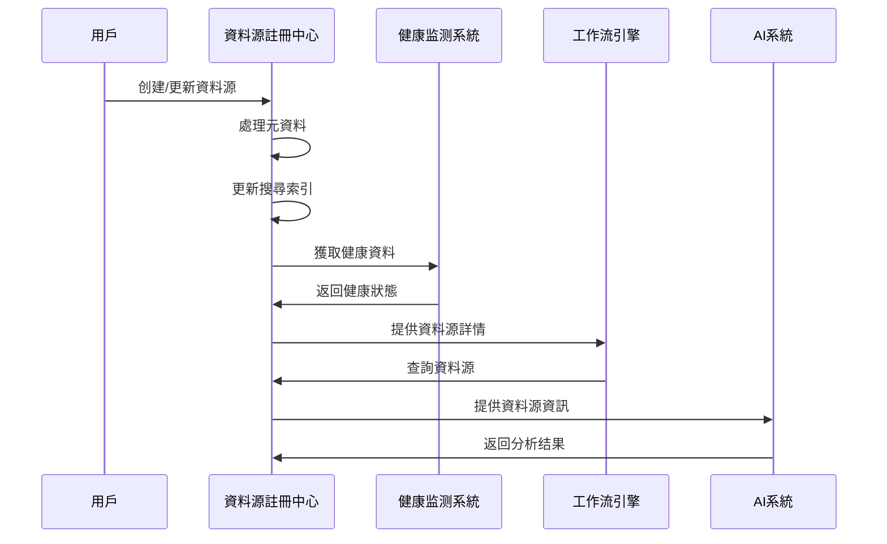

# 第1章：資料源註冊中心 (Data Source Registry)

## 1.3 技術架構

**[← 返回第1章首頁](ch1-index.md)**

---

## 1.3.1 架構图

```
┌─────────────────────────────────────────────────────────────────────────────────────────────┐
│                                 資料源註冊中心 (DSR)                                          │
├───────────────────────┬───────────────────────┬───────────────────────────────────────────────┤
│  核心服務层           │  整合层              │  支援服務层                                 │
├───────────────────────┼───────────────────────┼───────────────────────────────────────────────┤
│ • 元資料管理服務      │ • 資料源發現适配器    │ • 搜尋索引服務                             │
│ • 分類管理服務        │ • 健康监测整合        │ • 缓存服務                                 │
│ • 標籤管理服務        │ • API网關             │ • 通知服務                                 │
│ • 搜尋服務            │ • Webhook支援         │ • 審計日志服務                             │
│ • 權限管理服務        │ • SDK支援             │ • 指標收集服務                             │
└───────────────────────┴───────────────────────┴─────────────────────────────────────────────┘
```

*图1.3: 資料源註冊中心三层架構图*

---

## 1.3.2 服務边界與交互

### 輸入

- **用戶操作**：通過Web界面、命令行工具(CLI)或API进行的資料源管理操作
- **健康监测系統更新**：定期接收來自健康监测系統的資料源健康狀態更新
- **資料源發現服務**：自動發現新資料源的事件和建議
- **外部系統Webhook**：接收來自其他系統的事件通知，如資料源變更、工作流完成等

### 輸出

- **資料源元資料**：向工作流引擎提供資料源詳細資訊，支援資料處理任務配置
- **健康狀態**：向監控系統提供資料源健康指標，用於平台级健康監控
- **分類資訊**：向推薦引擎提供資料源分類資訊，支援個性化推薦
- **變更事件**：向事件总线发布資料源變更事件，触发相關係统更新

### 關鍵服務交互序列



*图1.4: 資料源註冊中心關鍵服務交互序列图*

---

## 📑 相關章節

| 前序 | 當前 | 後續 |
|-----|------|------|
| [1.2 詳細功能清單](ch1-2-詳細功能清單.md) | **1.3 技術架構** | [1.4 核心組件詳細實現](ch1-4-核心組件詳細實現.md) |

**快速鏈接：**
- [1.2 詳細功能清單](ch1-2-詳細功能清單.md)
- [1.4 核心組件詳細實現](ch1-4-核心組件詳細實現.md)
- [1.5 資料模型詳細定義](ch1-5-資料模型詳細定義.md)
- [← 返回第1章首頁](ch1-index.md)
