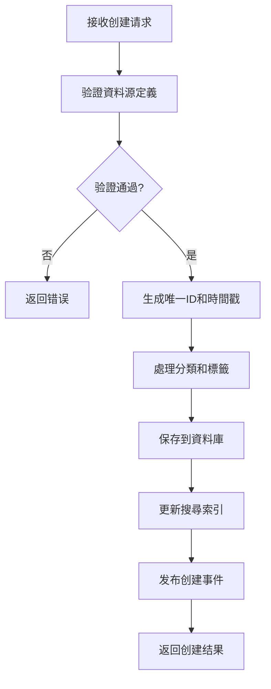
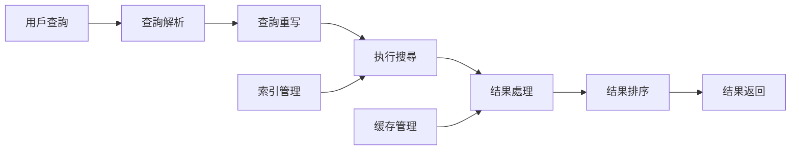
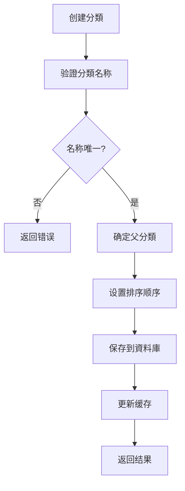

# 第1章：資料源註冊中心 (Data Source Registry)

## 1.4 核心組件詳細實現

**[← 返回第1章首頁](ch1-index.md)**

---

## 1.4.1 元資料管理服務

元資料管理服務是資料源註冊中心的核心業務組件，負責資料源元資料的全生命週期管理。该服務采用领域驅動設計(DDD)原則，將業務逻辑封装在领域模型中，確保業務规则的一致性和可维护性。

### 核心設計理念

- **聚合根管理**：將資料源作為聚合根，確保業務一致性边界内的操作原子性
- **领域事件**：每個狀態變更产生领域事件，支援事件溯源和CQRS模式
- **值物件**：使用值物件封装领域概念（如URL、資料源名称等），提高领域模型健壮性
- **无狀態服務**：应用服務层保持无狀態，便於水平擴展

### 資料源创建流程

*图1.5: 資料源创建流程图*

### 資料源更新機制

- **版本控制**：每次更新创建新版本，保留歷史版本
- **變更記錄**：記錄變更詳情，包括變更內容、變更者、變更時間
- **版本對比**：支援可视化比较两個版本的差异
- **回滚功能**：支援回滚到任意歷史版本

### 資料源健康整合

- **健康狀態獲取**：定期從健康监测系統獲取最新健康狀態
- **健康指標整合**：將健康指標整合到資料源元資料中
- **健康評分计算**：基於多维度指標计算综合健康評分
- **健康阈值告警**：當健康評分低於阈值時触发告警

| 健康狀態 | 阈值范围 | 說明 | 響應建議 |
|----------|----------|------|----------|
| **健康** | ≥ 0.85 | 資料源运行正常 | 无需操作 |
| **警告** | 0.70-0.84 | 資料源存在潜在问题 | 監控並调查 |
| **異常** | < 0.70 | 資料源运行異常 | 立即處理 |
| **未知** | N/A | 未獲取到健康資料 | 检查健康监测 |

*表1.2: 資料源健康狀態分類與阈值*

---

## 1.4.2 搜尋服務

搜尋服務提供高效能的資料源搜尋能力，基於Elasticsearch構建，支援複杂的查詢場景和大規模資料集。

### 搜尋功能架構

*图1.6: 搜尋服務功能架構图*

### 搜尋效能優化策略

- **過滤上下文優化**：使用`bool.filter`代替`bool.must`處理不需要評分的條件，效能提升3-5倍
- **字段选择優化**：使用`_source`過滤只返回必要字段，减少网络傳輸量
- **深分頁優化**：使用`search_after`替代`from/size`进行深分頁，效能提升10-15倍
- **请求缓存**：對重複查詢结果进行缓存，響應時間降低90%
- **索引排序優化**：使用`index.sort.field`預先排序索引，效能提升2-3倍

### 搜尋语法參考

| 语法 | 說明 | 示例 |
|------|------|------|
| `field:value` | 精确匹配 | `category:social` |
| `field:>value` | 范围查詢 | `health_score:>0.9` |
| `field:(value1 OR value2)` | 多值查詢 | `tags:(api OR social)` |
| `+term1 -term2` | 必須包含/排除 | `+instagram -facebook` |
| `"exact phrase"` | 短语匹配 | `"social media"` |
| `*` | 通配符 | `api*` |

*表1.3: 搜尋语法參考表*

### 搜尋API效能指標

| 查詢類型 | 資料规模 | 優化前(P99) | 優化後(P99) | 提升 |
|----------|----------|-------------|-------------|------|
| 简单查詢 | 10万資料源 | 120ms | 35ms | 3.4x |
| 複杂過滤 | 10万資料源 | 250ms | 65ms | 3.8x |
| 深分頁(第100頁) | 10万資料源 | 1200ms | 80ms | 15x |
| 聚合查詢 | 10万資料源 | 450ms | 120ms | 3.75x |

*表1.4: 搜尋效能優化效果對比*

---

## 1.4.3 分類管理服務

分類管理服務實現資料源的分類體系管理，支援多级分類結構和灵活的組織方式。

### 分類模型設計

- **树形結構**：采用树形結構組織分類，支援无限层级
- **路径表示**：使用路径字符串（如"root.social.instagram"）表示分類位置
- **排序支援**：每個分類節点支援自定義排序顺序
- **元資料擴展**：支援為分類添加描述、图標等擴展資訊

### 分類管理流程

*图1.7: 分類创建流程图*

### 分類算法

- **自動分類**：基於规则和机器学习的自動分類算法
  - URL模式匹配：分析URL中的關鍵词确定分類
  - 內容類型分析：根據content-type确定資料類型
  - 语義分析：使用NLP技術分析描述文本确定分類
- **分類建議**：基於用戶行為和歷史选择，提供個性化分類建議

### 分類树管理

- **树構建算法**：高效構建和维护分類树結構
- **树遍历優化**：優化深度优先和广度优先遍历效能
- **子树操作**：支援對子树进行批量操作（移動、删除等）
- **循环檢測**：防止创建导致循环引用的分類結構

### 分類缓存策略

- **树結構缓存**：缓存完整的分類树，减少資料庫查詢
- **缓存失效機制**：分類變更時自動失效相關缓存
- **缓存預热**：系統启動時預热常用分類树
- **版本化缓存**：支援缓存多個版本的分類树，便於回滚

| 缓存策略 | TTL | 适用場景 | 說明 |
|----------|-----|----------|------|
| **分類树缓存** | 300s | 分類查詢 | 缓存完整分類树 |
| **標籤缓存** | 60s | 搜尋建議 | 缓存常用標籤 |
| **資料源詳情缓存** | 60s | 資料源查詢 | 缓存单個資料源詳情 |
| **資料源列表缓存** | 30s | 列表查詢 | 缓存過滤後的資料源列表 |

*表1.5: 缓存策略配置表*

---

## 📑 相關章節

| 前序 | 當前 | 後續 |
|-----|------|------|
| [1.3 技術架構](ch1-3-技術架構.md) | **1.4 核心組件詳細實現** | [1.5 資料模型詳細定義](ch1-5-資料模型詳細定義.md) |

**快速鏈接：**
- [1.3 技術架構](ch1-3-技術架構.md)
- [1.5 資料模型詳細定義](ch1-5-資料模型詳細定義.md)
- [1.6 API詳細規範](ch1-6-API詳細規範.md)
- [← 返回第1章首頁](ch1-index.md)
