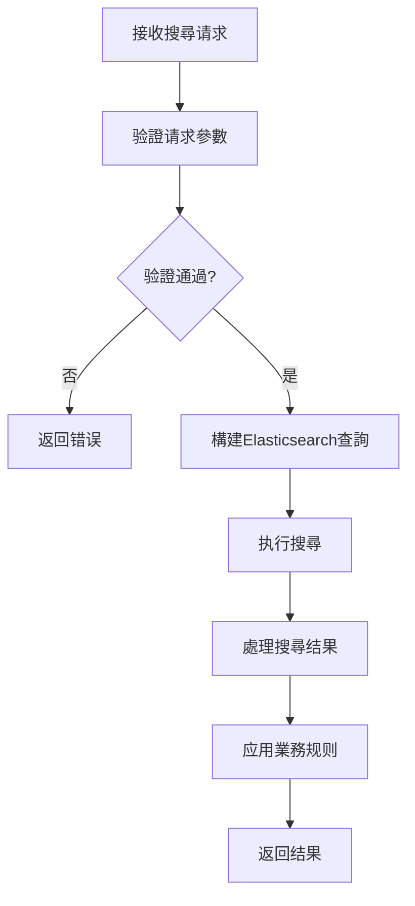

# 第1章：資料源註冊中心 (Data Source Registry)

## 1.6 API詳細規範

**[← 返回第1章首頁](ch1-index.md)**

---

## 1.6.1 資料源管理API

資料源管理API提供對資料源的完整CRUD操作，遵循RESTful設計原則，同時考慮實际業務需求进行适當擴展。

### API設計原則

| 原則 | 說明 | 實現方式 |
|------|------|----------|
| **資源导向** | 以資料源為核心資源 | /api/v1/data-sources/{id} |
| **版本控制** | API路径包含版本號 | /api/v1/... |
| **標准HTTP方法** | 正确使用GET、POST等方法 | POST创建，GET查詢等 |
| **狀態码規範** | 使用標准HTTP狀態码 | 200成功，400请求错误等 |
| **分頁支援** | 列表查詢提供分頁參數 | page, page_size |
| **ETag支援** | 實現條件更新 | If-Match头 |

*表1.12: API設計原則與實現*

### 核心API端点

**创建資料源 (POST /api/v1/data-sources)**
- **功能**：创建新的資料源
- **请求體**：包含資料源元資料（名称、URL、分類等）
- **響應**：201 Created，包含创建的資料源詳情
- **错误處理**：
  - 400 Bad Request：请求格式错误
  - 403 Forbidden：權限不足
  - 409 Conflict：名称冲突

**獲取資料源列表 (GET /api/v1/data-sources)**
- **功能**：獲取資料源列表，支援過滤、排序和分頁
- **查詢參數**：
  - `category`：按分類過滤
  - `status`：按狀態過滤
  - `tags`：按標籤過滤（可多值）
  - `page`：頁码
  - `page_size`：每頁數量
- **響應**：200 OK，包含資料源列表和分頁資訊
- **效能考慮**：限制最大頁码，避免深分頁问题

### API错误码規範

| 错误码 | HTTP狀態 | 說明 | 建議操作 |
|--------|----------|------|----------|
| `invalid_request` | 400 | 请求格式错误 | 检查请求體格式 |
| `invalid_url` | 400 | URL格式无效 | 验證URL格式 |
| `duplicate_data_source` | 409 | 資料源已存在 | 使用不同名称或URL |
| `permission_denied` | 403 | 權限不足 | 检查用戶角色和權限 |
| `not_found` | 404 | 資源不存在 | 验證資源ID |
| `version_conflict` | 409 | 版本冲突 | 獲取最新版本後重试 |
| `rate_limit_exceeded` | 429 | 请求過多 | 降低请求频率 |

*表1.13: API错误码規範*

---

## 1.6.2 搜尋API

搜尋API提供高级搜尋能力，支援複杂查詢條件和灵活的结果定制。

### API設計特点

- **专用搜尋端点**：使用POST方法，支援複杂查詢體
- **結構化查詢**：查詢條件以JSON格式提供，結構清晰
- **结果定制**：支援字段选择、排序和分頁
- **效能優化**：限制最大返回结果數，避免效能问题

### 搜尋API请求流程

*图1.8: 搜尋API请求處理流程图*

### 搜尋API效能指標

| 查詢類型 | P50 (ms) | P95 (ms) | P99 (ms) | QPS |
|----------|----------|----------|----------|-----|
| 简单查詢 | 15 | 35 | 50 | 1200 |
| 複杂過滤 | 25 | 60 | 85 | 800 |
| 深分頁(第100頁) | 40 | 75 | 100 | 600 |
| 聚合查詢 | 50 | 100 | 150 | 400 |
| 空查詢(仅過滤) | 10 | 25 | 40 | 1500 |

*表1.14: 搜尋API效能指標*

---

## 📑 相關章節

| 前序 | 當前 | 後續 |
|-----|------|------|
| [1.5 資料模型詳細定義](ch1-5-資料模型詳細定義.md) | **1.6 API詳細規範** | [1.7 效能優化策略](ch1-7-效能優化策略.md) |

**快速鏈接：**
- [1.5 資料模型詳細定義](ch1-5-資料模型詳細定義.md)
- [1.7 效能優化策略](ch1-7-效能優化策略.md)
- [1.8 安全考慮](ch1-8-安全考慮.md)
- [← 返回第1章首頁](ch1-index.md)
