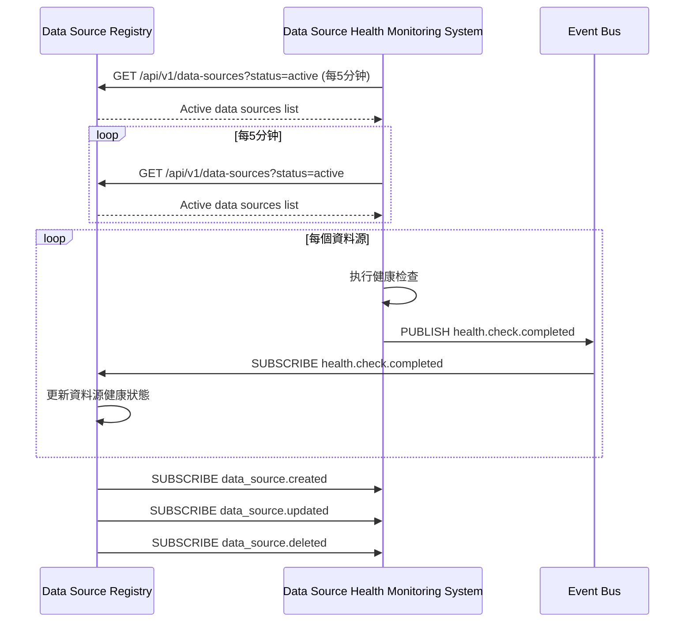
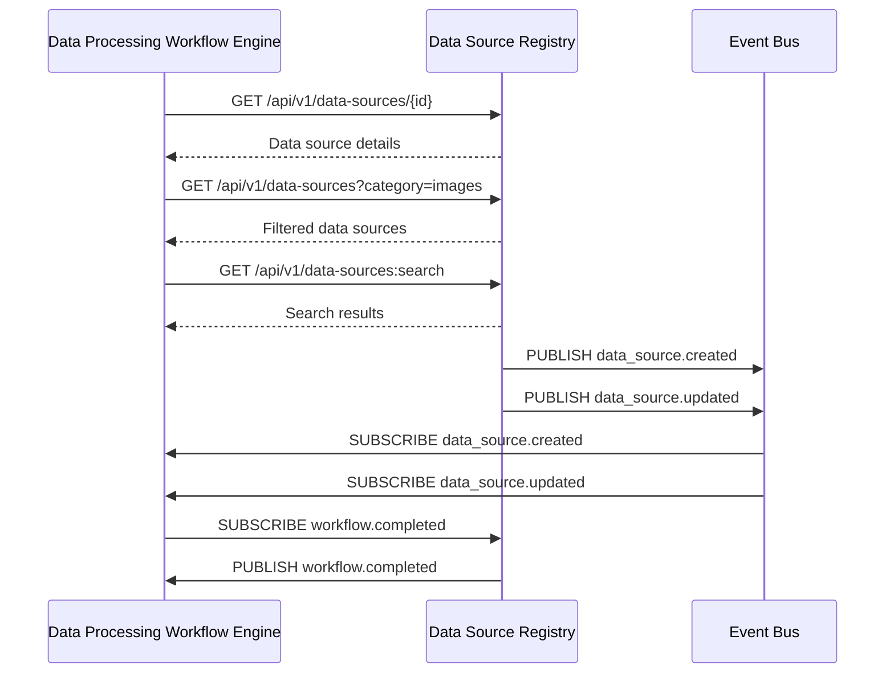
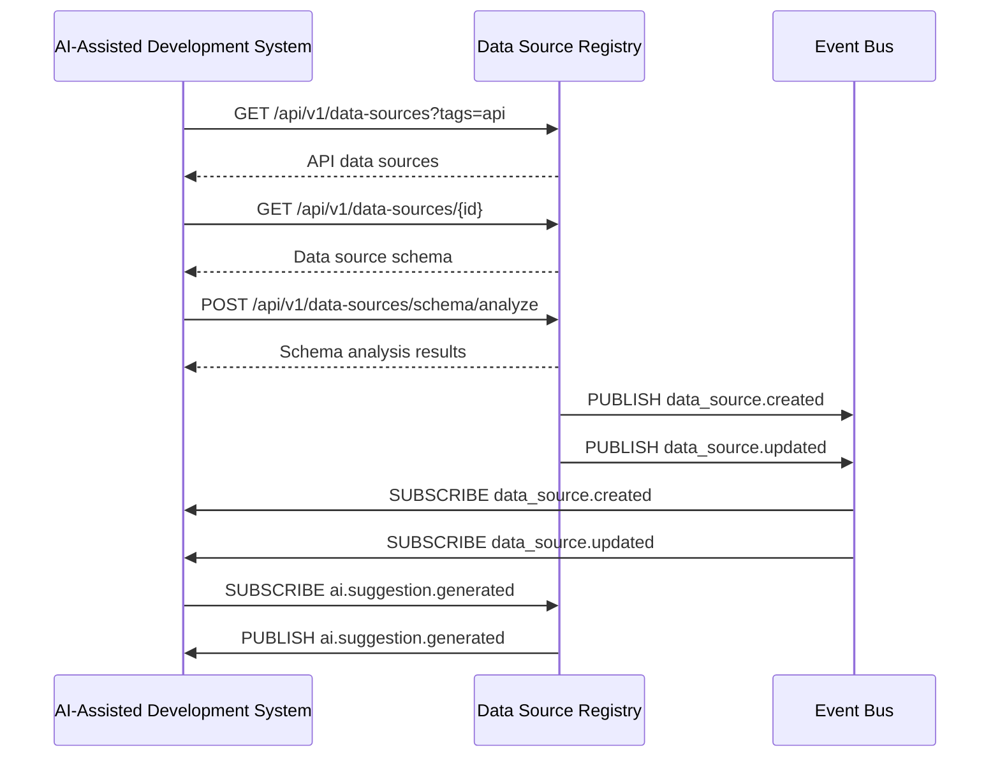

# 第1章：資料源註冊中心 (Data Source Registry)

## 1.9 與其他模組的交互

**[← 返回第1章首頁](ch1-index.md)**

---

## 1.9.1 與資料源健康监测系統交互

*图1.11: 與資料源健康监测系統交互序列图*

### 交互协议關鍵參數

| 參數 | 類型 | 必填 | 說明 | 示例 |
|------|------|------|------|------|
| `status` | string | 否 | 資料源狀態過滤 | "active" |
| `last_updated_after` | timestamp | 否 | 仅獲取更新時間之後的資料 | "2023-06-15T10:00:00Z" |
| `limit` | integer | 否 | 返回结果數量限制 | 100 |
| `offset` | integer | 否 | 分頁偏移量 | 0 |
| `include_health` | boolean | 否 | 是否包含健康資訊 | true |

*表1.24: 健康监测系統交互协议參數*

---

## 1.9.2 與資料處理工作流引擎交互

*图1.12: 與資料處理工作流引擎交互序列图*

### 工作流引擎查詢優化對比

| 查詢方式 | 请求量 | 響應時間 | 資料傳輸量 | 說明 |
|----------|--------|----------|------------|------|
| **REST API (全量)** | 1000/分钟 | 120ms | 5MB/分钟 | 每次獲取完整資料 |
| **REST API (字段选择)** | 1000/分钟 | 80ms | 2MB/分钟 | 仅獲取必要字段 |
| **GraphQL** | 1000/分钟 | 60ms | 1.5MB/分钟 | 精确字段选择 |
| **事件驅動** | 50/分钟 | 10ms | 0.1MB/分钟 | 仅獲取變更資料 |

*表1.25: 工作流引擎查詢方式對比*

---

## 1.9.3 與AI輔助開发系統交互

*图1.13: 與AI輔助開发系統交互序列图*

### AI輔助開发系統交互协议

| 端点 | 方法 | 请求 | 響應 | 說明 |
|------|------|------|------|------|
| `/api/v1/data-sources/schema/analyze` | POST | `{"data_source_id": "ds-7a8b9c0d"}` | `{"fields": [{"name": "id", "type": "string", "confidence": 0.98}, ...]}` | 分析資料源schema |
| `/api/v1/data-sources/{id}/ai/suggestions` | GET | - | `{"suggestions": [{"type": "field_mapping", "source": "id", "target": "user_id", "confidence": 0.95}, ...]}` | 獲取AI建議 |
| `/api/v1/data-sources/ai/feedback` | POST | `{"suggestion_id": "sug-123", "accepted": true}` | 204 No Content | 提供反馈 |

*表1.26: AI輔助開发系統交互协议*

---

## 📑 相關章節

| 前序 | 當前 | 後續 |
|-----|------|------|
| [1.8 安全考慮](ch1-8-安全考慮.md) | **1.9 與其他模組的交互** | - |

**快速鏈接：**
- [1.8 安全考慮](ch1-8-安全考慮.md)
- [← 返回第1章首頁](ch1-index.md)
- [← 返回到原始 ch1.md](ch1.md)
