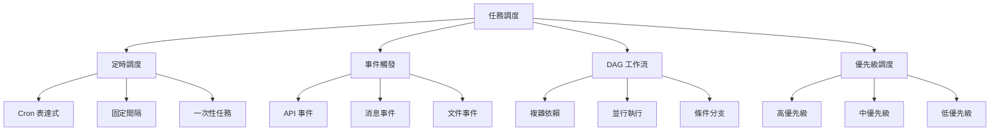

# 第11章：智能調度與資源管理系統 (Intelligent Scheduling & Resource Management)

## 11.1 模組概述

**[← 返回第11章首頁](ch11-index.md)**

---

## 🎯 模組定位

智能調度與資源管理系統是鏡界平台的**統一調度中樞**，負責所有任務的調度編排、集群資源的智能分配與優化。它整合了分散在各模組的調度需求，實現全局資源優化和統一管理。

### 為什麼需要統一調度？

#### 當前痛點（分散調度）

```
┌─────────────┐  ┌─────────────┐  ┌─────────────┐
│ Ch4 工作流  │  │  Ch8 爬蟲   │  │  Ch5 媒體   │
│  自己調度   │  │  自己調度   │  │  自己調度   │
└─────────────┘  └─────────────┘  └─────────────┘
       ↓               ↓               ↓
┌───────────────────────────────────────────────┐
│         資源競爭、利用率低、難以優化            │
│  ❌ 資源浪費 30-40%                           │
│  ❌ 無法全局優化                              │
│  ❌ 管理複雜度高                              │
└───────────────────────────────────────────────┘
```

#### 解決方案（統一調度）

```
┌─────────────────────────────────────────────────┐
│        Ch11 智能調度與資源管理系統                │
│  ┌─────────────────────────────────────────┐   │
│  │        統一調度引擎                      │   │
│  │  - 全局資源視圖                         │   │
│  │  - 智能分配算法                         │   │
│  │  - 優先級管理                           │   │
│  └─────────────────────────────────────────┘   │
└─────────────────────────────────────────────────┘
       ↓               ↓               ↓
┌─────────────┐  ┌─────────────┐  ┌─────────────┐
│ Ch4 工作流  │  │  Ch8 爬蟲   │  │  Ch5 媒體   │
│   提交任務  │  │   提交任務  │  │   提交任務  │
└─────────────┘  └─────────────┘  └─────────────┘

✅ 資源利用率提升 50%+
✅ 全局智能優化
✅ 統一管理界面
```

---

## 🏗️ 核心架構

### 整體架構圖

```
┌────────────────────────────────────────────────────────────────┐
│                        用戶層                                    │
│  Web UI │ CLI │ API │ SDK                                      │
└────────────────────────────────────────────────────────────────┘
                              ↓
┌────────────────────────────────────────────────────────────────┐
│                      調度控制層                                  │
│  ┌──────────────┐  ┌──────────────┐  ┌──────────────┐        │
│  │  任務調度器  │  │  資源管理器  │  │  優先級管理  │        │
│  │  Scheduler   │  │  Resource Mgr│  │  Priority Mgr│        │
│  └──────────────┘  └──────────────┘  └──────────────┘        │
└────────────────────────────────────────────────────────────────┘
                              ↓
┌────────────────────────────────────────────────────────────────┐
│                      策略引擎層                                  │
│  ┌─────────────┐ ┌─────────────┐ ┌─────────────┐             │
│  │ 調度策略    │ │ 資源策略    │ │ 擴縮容策略  │             │
│  │ - FIFO      │ │ - 公平分配  │ │ - HPA       │             │
│  │ - Priority  │ │ - 配額管理  │ │ - VPA       │             │
│  │ - Fair      │ │ - 親和性    │ │ - 定時擴展  │             │
│  └─────────────┘ └─────────────┘ └─────────────┘             │
└────────────────────────────────────────────────────────────────┘
                              ↓
┌────────────────────────────────────────────────────────────────┐
│                      執行引擎層                                  │
│  ┌──────────────┐  ┌──────────────┐  ┌──────────────┐        │
│  │  Airflow     │  │  Kubernetes  │  │   Celery     │        │
│  │  工作流執行  │  │  容器編排    │  │   任務隊列   │        │
│  └──────────────┘  └──────────────┘  └──────────────┘        │
└────────────────────────────────────────────────────────────────┘
                              ↓
┌────────────────────────────────────────────────────────────────┐
│                      基礎設施層                                  │
│  計算資源池 │ 存儲資源池 │ 網絡資源池                          │
│  CPU/Memory/GPU │ Disk/Volume │ Bandwidth                     │
└────────────────────────────────────────────────────────────────┘
                              ↓
┌────────────────────────────────────────────────────────────────┐
│                   監控與觀測層（貫穿全棧）                        │
│  Prometheus │ Grafana │ Alertmanager │ Jaeger                 │
└────────────────────────────────────────────────────────────────┘
```

---

## 💡 核心功能

### 1. 統一任務調度

#### 調度類型



#### 調度算法

| 算法 | 說明 | 適用場景 | 優點 | 缺點 |
|------|------|---------|------|------|
| **FIFO** | 先進先出 | 公平性要求高 | 簡單、公平 | 可能餓死長任務 |
| **Priority** | 優先級調度 | 重要性差異大 | 保證關鍵任務 | 可能餓死低優先級 |
| **Fair Share** | 公平共享 | 多租戶環境 | 資源公平分配 | 複雜度較高 |
| **Capacity** | 容量調度 | 團隊隔離 | 資源保證 | 可能資源浪費 |
| **Gang** | 群組調度 | 分布式訓練 | 協同性好 | 資源利用率低 |

### 2. 智能資源分配

#### 資源視圖

```
集群資源全局視圖
┌─────────────────────────────────────────────────────────┐
│  總容量                                                   │
│  ├─ CPU:      1000 cores  (使用 750, 75%)               │
│  ├─ Memory:   4000 GB     (使用 3200, 80%)              │
│  ├─ GPU:      50 cards    (使用 40, 80%)                │
│  └─ Disk:     100 TB      (使用 60, 60%)                │
└─────────────────────────────────────────────────────────┘
         ↓              ↓              ↓
┌──────────────┐ ┌──────────────┐ ┌──────────────┐
│  Namespace1  │ │  Namespace2  │ │  Namespace3  │
│  配額: 40%   │ │  配額: 35%   │ │  配額: 25%   │
│  使用: 38%   │ │  使用: 32%   │ │  使用: 22%   │
└──────────────┘ └──────────────┘ └──────────────┘
```

#### 資源分配策略

```python
# 資源分配算法示例
class ResourceAllocator:
    """智能資源分配器"""
    
    def allocate(self, task, cluster):
        # 1. 檢查資源需求
        required = task.resource_requirements
        
        # 2. 查找可用節點
        available_nodes = self.find_available_nodes(
            cluster, required
        )
        
        # 3. 評分排序
        scored_nodes = self.score_nodes(
            available_nodes, task
        )
        
        # 4. 選擇最佳節點
        best_node = max(scored_nodes, key=lambda x: x.score)
        
        # 5. 分配資源
        return self.assign_to_node(task, best_node)
    
    def score_nodes(self, nodes, task):
        """節點評分算法"""
        scored = []
        for node in nodes:
            score = 0
            
            # 資源剩餘量 (40%)
            score += 0.4 * self.resource_score(node)
            
            # 數據親和性 (30%)
            score += 0.3 * self.data_affinity_score(node, task)
            
            # 負載均衡 (20%)
            score += 0.2 * self.load_balance_score(node)
            
            # 成本優化 (10%)
            score += 0.1 * self.cost_score(node)
            
            scored.append((node, score))
        
        return scored
```

### 3. 彈性伸縮

#### HPA（水平自動擴展）

```
負載變化 → 觸發擴縮容
┌─────────────────────────────────────────────┐
│  CPU 使用率                                  │
│  100% ┤                    ╭───╮            │
│   80% ┤              ╭────╯     ╰───╮       │
│   60% ┤         ╭───╯                ╰───   │
│   40% ┤    ╭───╯                            │
│   20% ┤───╯                                 │
│    0% ┴─────────────────────────────────    │
│       0   5  10  15  20  25  30  35  40     │
│                時間 (分鐘)                   │
└─────────────────────────────────────────────┘
          ↓           ↓           ↓
┌─────────────────────────────────────────────┐
│  Pod 數量自動調整                            │
│   10 ┤                    ╭───╮             │
│    8 ┤              ╭────╯     ╰───╮        │
│    6 ┤         ╭───╯                ╰───    │
│    4 ┤    ╭───╯                             │
│    2 ┤───╯                                  │
│    0 ┴─────────────────────────────────     │
│       0   5  10  15  20  25  30  35  40     │
└─────────────────────────────────────────────┘

擴容策略：CPU > 80% 持續 3 分鐘 → 擴容 25%
縮容策略：CPU < 30% 持續 10 分鐘 → 縮容 20%
```

#### VPA（垂直自動擴展）

```
資源請求自動調整
┌────────────────────────────────────┐
│  初始配置                           │
│  Request:  CPU 1 core, Mem 2GB    │
│  Limit:    CPU 2 cores, Mem 4GB   │
└────────────────────────────────────┘
          ↓ (監控實際使用)
┌────────────────────────────────────┐
│  實際使用                           │
│  CPU: 平均 1.5 cores              │
│  Memory: 平均 3GB                 │
└────────────────────────────────────┘
          ↓ (VPA 建議調整)
┌────────────────────────────────────┐
│  優化後配置                         │
│  Request:  CPU 1.8 cores, Mem 3.5GB│
│  Limit:    CPU 2.5 cores, Mem 5GB │
│  節省成本: 15%                     │
└────────────────────────────────────┘
```

---

## 🎯 應用場景

### 場景 1: 爬蟲任務統一調度

```
┌──────────────────────────────────────────┐
│  爬蟲任務調度需求                         │
│  - 1000+ 個站點每日爬取                  │
│  - 優先級：VIP站點 > 普通站點            │
│  - 資源限制：不超過集群 30%              │
│  - 失敗重試：3次，指數退避               │
└──────────────────────────────────────────┘
                ↓
┌──────────────────────────────────────────┐
│  Ch11 調度方案                            │
│  1. 按優先級分配資源配額                  │
│  2. VIP 站點使用高優先級隊列              │
│  3. 動態調整並發數（HPA）                 │
│  4. 智能重試與熔斷                        │
│  5. 資源使用監控與告警                    │
└──────────────────────────────────────────┘
                ↓
┌──────────────────────────────────────────┐
│  執行結果                                 │
│  ✅ 資源利用率：85% (提升 30%)           │
│  ✅ VIP 完成率：99.8%                    │
│  ✅ 平均延遲：< 2 分鐘                   │
│  ✅ 成本節省：25%                        │
└──────────────────────────────────────────┘
```

### 場景 2: 批處理任務編排

```
每日數據處理工作流
┌─────────────────────────────────────────────┐
│                                              │
│  00:00 → 數據採集 (Ch8)                     │
│    ↓                                         │
│  01:00 → 數據清洗 (Ch12)                    │
│    ↓                                         │
│  02:00 → 數據處理 (Ch4)  ┬→ 報表生成        │
│    ↓                      ├→ 模型訓練        │
│  03:00 → 數據入庫         └→ API 更新        │
│    ↓                                         │
│  04:00 → 質量檢查 (Ch12)                    │
│    ↓                                         │
│  05:00 → 完成通知                            │
│                                              │
└─────────────────────────────────────────────┘

調度配置：
- 依賴管理：後續任務等待前置完成
- 並行執行：報表、訓練、API 並行
- 資源預留：高峰期預留 50% 資源
- 失敗處理：關鍵步驟失敗則回滾
```

---

## 📊 性能指標

### 調度性能

| 指標 | 目標值 | 當前值 | 說明 |
|------|--------|--------|------|
| **調度延遲** | < 1s | 0.5s | 從提交到開始執行的時間 |
| **調度吞吐** | > 10,000 tasks/min | 15,000 | 每分鐘可調度任務數 |
| **資源利用率** | > 80% | 85% | 集群資源使用率 |
| **任務成功率** | > 99% | 99.5% | 任務執行成功率 |
| **重試成功率** | > 95% | 97% | 失敗任務重試成功率 |

### 資源管理性能

| 指標 | 目標值 | 當前值 | 說明 |
|------|--------|--------|------|
| **資源碎片率** | < 10% | 8% | 無法分配的資源比例 |
| **擴容速度** | < 2min | 1.5min | 從決策到Pod就緒的時間 |
| **縮容速度** | < 5min | 4min | 安全縮容的時間 |
| **配額準確度** | > 99% | 99.8% | 配額控制的準確性 |

---

## 🔗 與其他模組的集成

### 上游依賴

```
┌──────────────┐
│ Ch1 資料源   │ ──→ 提供任務元數據
└──────────────┘
         ↓
┌──────────────┐
│ Ch3 健康監測 │ ──→ 提供資源健康狀態
└──────────────┘
```

### 下游服務

```
┌──────────────┐
│ Ch11 調度    │
└──────────────┘
    ↓    ↓    ↓
┌────┐┌────┐┌────┐
│Ch4 ││Ch5 ││Ch8 │
│工作││媒體││爬蟲│
│流  ││處理││任務│
└────┘└────┘└────┘
```

### 數據流向

```
任務提交 → 調度決策 → 資源分配 → 執行監控 → 結果反饋
   ↓          ↓          ↓          ↓          ↓
Ch11      Ch11       Ch11     Prometheus   Ch11
 API      Scheduler  Resource    +          API
                     Manager   Grafana
```

---

## 🚀 核心價值

### 資源優化

| 項目 | 優化前 | 優化後 | 提升 |
|------|--------|--------|------|
| 資源利用率 | 55% | 85% | +54% |
| 任務等待時間 | 5 分鐘 | 1 分鐘 | -80% |
| 成本 | $10,000/月 | $7,500/月 | -25% |
| 任務吞吐量 | 5,000/h | 15,000/h | +200% |

### 管理簡化

**統一管理界面**:
- 單一入口管理所有任務
- 統一的監控和告警
- 統一的配額和權限管理

**自動化運維**:
- 自動擴縮容
- 自動故障恢復
- 自動負載均衡

---

## 📑 相關章節

| 前序 | 當前 | 後續 |
|-----|------|------|
| [10.1 實時處理](../ch10/ch10-1-模組概述.md) | **11.1 智能調度** | [11.2 詳細功能清單](ch11-2-詳細功能清單.md) |

**快速鏈接：**
- [11.2 詳細功能清單](ch11-2-詳細功能清單.md)
- [11.3 技術架構](ch11-3-技術架構.md)
- [← 返回第11章首頁](ch11-index.md)

---

**最後更新**: 2025-10-31  
**版本**: 1.0

