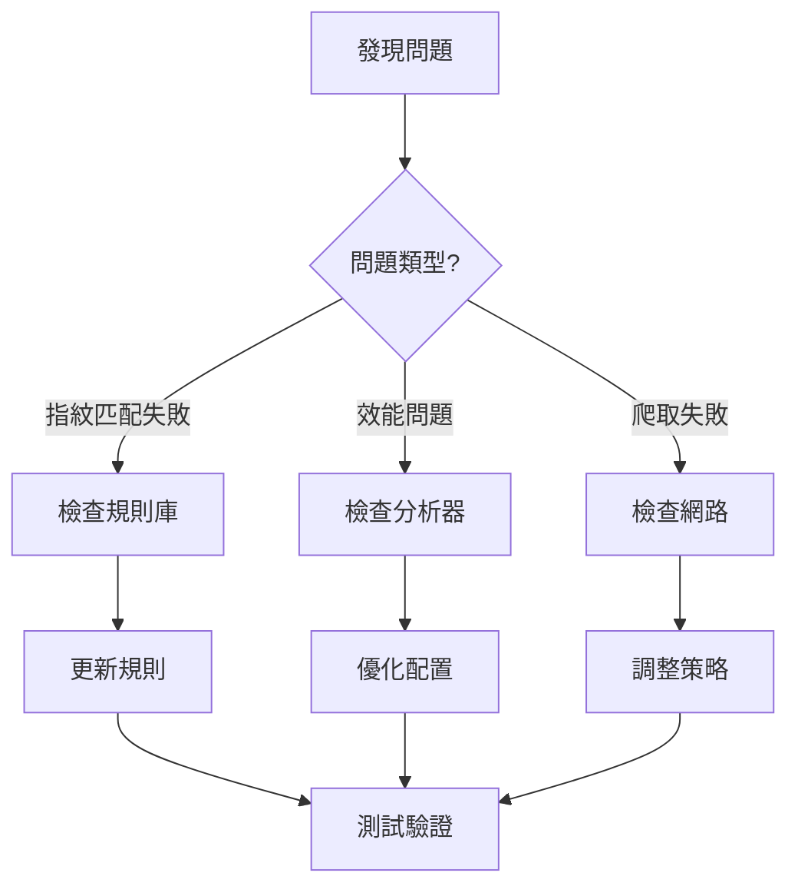

# 第2章：網站指紋分析引擎 (Website Fingerprint Engine)

## 2.11 故障排查指南

**[← 返回第2章首頁](ch2-index.md)**

---

本章節提供網站指紋分析引擎常見問題的診斷和解決方案。

## 🔍 問題診斷流程



---

## 🐛 常見問題與解決方案

### 問題 1: 指紋匹配準確率低

#### 症狀
- 網站識別錯誤率超過 10%
- 相似網站無法區分
- 新網站無法識別

#### 可能原因
1. 指紋規則過時
2. 特徵提取不完整
3. 匹配閾值設置不當
4. 網站結構變化

#### 診斷步驟

```python
# 診斷工具：指紋匹配分析器
class FingerprintDiagnostics:
    """指紋診斷工具"""
    
    def __init__(self, fingerprint_service):
        self.service = fingerprint_service
        self.logger = logging.getLogger(__name__)
    
    def analyze_match_quality(self, url: str) -> Dict:
        """分析匹配質量"""
        result = self.service.analyze_website(url)
        
        analysis = {
            'url': url,
            'matched': result.matched,
            'confidence': result.confidence,
            'matched_features': result.matched_features,
            'missing_features': result.missing_features,
            'false_positives': result.false_positives
        }
        
        # 詳細分析
        if result.confidence < 0.7:
            analysis['issues'] = self._identify_issues(result)
            analysis['suggestions'] = self._generate_suggestions(result)
        
        return analysis
    
    def _identify_issues(self, result) -> List[str]:
        """識別問題"""
        issues = []
        
        if len(result.matched_features) < 3:
            issues.append("匹配特徵過少")
        
        if len(result.missing_features) > 5:
            issues.append("缺失關鍵特徵")
        
        if result.false_positives:
            issues.append(f"存在誤報: {result.false_positives}")
        
        return issues
    
    def _generate_suggestions(self, result) -> List[str]:
        """生成建議"""
        suggestions = []
        
        if len(result.matched_features) < 3:
            suggestions.append("需要添加更多特徵規則")
        
        if result.missing_features:
            suggestions.append(f"建議添加特徵: {', '.join(result.missing_features[:3])}")
        
        if result.confidence < 0.5:
            suggestions.append("建議重新訓練匹配模型")
        
        return suggestions
    
    def batch_analyze(self, urls: List[str]) -> pd.DataFrame:
        """批量分析"""
        results = []
        
        for url in urls:
            try:
                analysis = self.analyze_match_quality(url)
                results.append(analysis)
            except Exception as e:
                self.logger.error(f"分析失敗 {url}: {e}")
        
        return pd.DataFrame(results)

# 使用範例
diagnostics = FingerprintDiagnostics(fingerprint_service)

# 分析單個網站
analysis = diagnostics.analyze_match_quality("https://example.com")
print(f"置信度: {analysis['confidence']}")
print(f"問題: {analysis.get('issues', [])}")
print(f"建議: {analysis.get('suggestions', [])}")

# 批量分析
urls = ["https://site1.com", "https://site2.com", ...]
results_df = diagnostics.batch_analyze(urls)
results_df.to_excel("fingerprint_analysis.xlsx")
```

#### 解決方案

**方案 1: 更新指紋規則庫**

```python
class FingerprintRuleUpdater:
    """指紋規則更新器"""
    
    def __init__(self, rule_repository):
        self.repo = rule_repository
    
    def extract_new_features(self, url: str, response: requests.Response) -> Dict:
        """從網站提取新特徵"""
        soup = BeautifulSoup(response.content, 'html.parser')
        
        features = {
            'title_pattern': self._extract_title_pattern(soup),
            'meta_tags': self._extract_meta_tags(soup),
            'script_sources': self._extract_script_sources(soup),
            'css_selectors': self._extract_css_patterns(soup),
            'cookies': self._extract_cookie_patterns(response),
            'headers': self._extract_header_patterns(response),
            'dom_structure': self._extract_dom_structure(soup)
        }
        
        return features
    
    def _extract_title_pattern(self, soup) -> str:
        """提取標題模式"""
        title = soup.find('title')
        if title:
            # 提取標題的模式（保留關鍵詞，移除變量部分）
            text = title.string
            # 使用正則提取模式
            pattern = re.sub(r'\d+', '{num}', text)
            pattern = re.sub(r'[a-f0-9]{32}', '{hash}', pattern)
            return pattern
        return ""
    
    def _extract_script_sources(self, soup) -> List[str]:
        """提取腳本來源特徵"""
        scripts = soup.find_all('script', src=True)
        sources = []
        
        for script in scripts:
            src = script['src']
            # 標準化 URL
            if src.startswith('//'):
                src = 'https:' + src
            elif src.startswith('/'):
                continue  # 跳過相對路徑
            
            # 提取域名和路徑模式
            parsed = urlparse(src)
            pattern = f"{parsed.netloc}{parsed.path}"
            # 移除版本號
            pattern = re.sub(r'[\d\.]+\.(js|css)$', 'X.\\1', pattern)
            sources.append(pattern)
        
        return sources
    
    def _extract_css_patterns(self, soup) -> List[str]:
        """提取 CSS 模式"""
        # 提取獨特的 class 名稱模式
        elements = soup.find_all(class_=True)
        classes = []
        
        for element in elements[:100]:  # 限制數量
            class_list = element.get('class', [])
            for cls in class_list:
                # 只保留有意義的 class（不是動態生成的）
                if not re.match(r'^[a-z0-9]{20,}$', cls):
                    classes.append(cls)
        
        # 返回最常見的 class
        from collections import Counter
        return [cls for cls, _ in Counter(classes).most_common(10)]
    
    def create_rule(self, website_type: str, features: Dict) -> FingerprintRule:
        """創建指紋規則"""
        rule = FingerprintRule(
            id=generate_id(),
            website_type=website_type,
            features=features,
            weight={
                'title_pattern': 0.2,
                'meta_tags': 0.15,
                'script_sources': 0.25,
                'css_selectors': 0.15,
                'cookies': 0.1,
                'headers': 0.1,
                'dom_structure': 0.05
            },
            threshold=0.7,
            created_at=datetime.now()
        )
        
        return rule
    
    def update_rule_database(self, rules: List[FingerprintRule]):
        """更新規則庫"""
        for rule in rules:
            existing = self.repo.get_by_website_type(rule.website_type)
            
            if existing:
                # 合併特徵
                merged_features = self._merge_features(
                    existing.features,
                    rule.features
                )
                existing.features = merged_features
                existing.updated_at = datetime.now()
                self.repo.update(existing)
            else:
                self.repo.create(rule)
        
        self.repo.commit()
    
    def _merge_features(self, old: Dict, new: Dict) -> Dict:
        """合併特徵"""
        merged = old.copy()
        
        for key, value in new.items():
            if key in merged:
                if isinstance(value, list):
                    # 合併列表，去重
                    merged[key] = list(set(merged[key] + value))
                elif isinstance(value, dict):
                    # 合併字典
                    merged[key].update(value)
            else:
                merged[key] = value
        
        return merged

# 使用範例
updater = FingerprintRuleUpdater(rule_repository)

# 從網站提取特徵
response = requests.get("https://wordpress-site.com")
features = updater.extract_new_features("https://wordpress-site.com", response)

# 創建規則
rule = updater.create_rule("WordPress", features)

# 更新規則庫
updater.update_rule_database([rule])
```

**方案 2: 改進特徵提取算法**

```python
class AdvancedFeatureExtractor:
    """高級特徵提取器"""
    
    def __init__(self):
        self.extractors = [
            self._extract_visual_features,
            self._extract_behavioral_features,
            self._extract_structural_features,
            self._extract_content_features
        ]
    
    def extract_all_features(self, url: str) -> Dict:
        """提取所有特徵"""
        features = {}
        
        # 獲取網頁內容
        response = self._fetch_with_js_rendering(url)
        
        # 應用所有提取器
        for extractor in self.extractors:
            try:
                extracted = extractor(url, response)
                features.update(extracted)
            except Exception as e:
                logging.error(f"特徵提取失敗 {extractor.__name__}: {e}")
        
        return features
    
    def _fetch_with_js_rendering(self, url: str) -> Dict:
        """使用 Selenium 獲取渲染後的內容"""
        from selenium import webdriver
        from selenium.webdriver.chrome.options import Options
        
        options = Options()
        options.add_argument('--headless')
        options.add_argument('--disable-gpu')
        
        driver = webdriver.Chrome(options=options)
        driver.get(url)
        
        # 等待頁面加載
        time.sleep(3)
        
        result = {
            'html': driver.page_source,
            'cookies': driver.get_cookies(),
            'local_storage': driver.execute_script("return window.localStorage;"),
            'console_logs': driver.get_log('browser')
        }
        
        driver.quit()
        return result
    
    def _extract_visual_features(self, url: str, response: Dict) -> Dict:
        """提取視覺特徵"""
        from PIL import Image
        import io
        
        # 截圖
        driver = self._get_driver()
        driver.get(url)
        screenshot = driver.get_screenshot_as_png()
        
        # 分析截圖
        img = Image.open(io.BytesIO(screenshot))
        
        features = {
            'dominant_colors': self._get_dominant_colors(img),
            'layout_structure': self._analyze_layout(img),
            'logo_position': self._detect_logo_position(img)
        }
        
        return {'visual': features}
    
    def _extract_behavioral_features(self, url: str, response: Dict) -> Dict:
        """提取行為特徵"""
        features = {
            'ajax_calls': self._detect_ajax_calls(response),
            'websocket_usage': self._detect_websocket(response),
            'api_endpoints': self._extract_api_endpoints(response),
            'tracking_scripts': self._detect_tracking(response)
        }
        
        return {'behavioral': features}
    
    def _extract_structural_features(self, url: str, response: Dict) -> Dict:
        """提取結構特徵"""
        soup = BeautifulSoup(response['html'], 'html.parser')
        
        features = {
            'dom_depth': self._calculate_dom_depth(soup),
            'element_distribution': self._analyze_element_distribution(soup),
            'semantic_structure': self._analyze_semantic_html(soup)
        }
        
        return {'structural': features}
    
    def _extract_content_features(self, url: str, response: Dict) -> Dict:
        """提取內容特徵"""
        soup = BeautifulSoup(response['html'], 'html.parser')
        
        # 提取文本內容
        text = soup.get_text()
        
        features = {
            'language': self._detect_language(text),
            'content_type': self._classify_content(text),
            'keywords': self._extract_keywords(text),
            'entities': self._extract_entities(text)
        }
        
        return {'content': features}
```

---

### 問題 2: 指紋分析效能緩慢

#### 症狀
- 單個網站分析超過 30 秒
- 高並發時系統響應慢
- CPU 使用率持續高於 80%

#### 解決方案

**方案 1: 實現分析結果緩存**

```python
from functools import lru_cache
import hashlib
from typing import Optional

class FingerprintCache:
    """指紋分析緩存"""
    
    def __init__(self, redis_client, ttl=3600):
        self.redis = redis_client
        self.ttl = ttl
    
    def _generate_key(self, url: str, options: Dict) -> str:
        """生成緩存鍵"""
        content = f"{url}:{json.dumps(options, sort_keys=True)}"
        return f"fingerprint:{hashlib.md5(content.encode()).hexdigest()}"
    
    def get(self, url: str, options: Dict) -> Optional[Dict]:
        """獲取緩存"""
        key = self._generate_key(url, options)
        cached = self.redis.get(key)
        
        if cached:
            return json.loads(cached)
        return None
    
    def set(self, url: str, options: Dict, result: Dict):
        """設置緩存"""
        key = self._generate_key(url, options)
        self.redis.setex(
            key,
            self.ttl,
            json.dumps(result)
        )
    
    def invalidate(self, url: str):
        """清除緩存"""
        pattern = f"fingerprint:*{hashlib.md5(url.encode()).hexdigest()}*"
        keys = self.redis.keys(pattern)
        if keys:
            self.redis.delete(*keys)

# 使用緩存的分析服務
class CachedFingerprintService:
    """帶緩存的指紋服務"""
    
    def __init__(self, fingerprint_service, cache):
        self.service = fingerprint_service
        self.cache = cache
    
    def analyze(self, url: str, options: Dict = None) -> Dict:
        """分析網站（帶緩存）"""
        options = options or {}
        
        # 嘗試從緩存獲取
        cached_result = self.cache.get(url, options)
        if cached_result:
            cached_result['from_cache'] = True
            return cached_result
        
        # 執行分析
        result = self.service.analyze(url, options)
        
        # 存入緩存
        self.cache.set(url, options, result)
        result['from_cache'] = False
        
        return result
```

**方案 2: 並行處理優化**

```python
from concurrent.futures import ThreadPoolExecutor, as_completed
from multiprocessing import Pool

class ParallelFingerprintAnalyzer:
    """並行指紋分析器"""
    
    def __init__(self, max_workers=10):
        self.max_workers = max_workers
    
    def analyze_batch(self, urls: List[str]) -> List[Dict]:
        """批量並行分析"""
        results = []
        
        with ThreadPoolExecutor(max_workers=self.max_workers) as executor:
            # 提交所有任務
            future_to_url = {
                executor.submit(self._analyze_single, url): url 
                for url in urls
            }
            
            # 收集結果
            for future in as_completed(future_to_url):
                url = future_to_url[future]
                try:
                    result = future.result(timeout=30)
                    results.append(result)
                except Exception as e:
                    logging.error(f"分析失敗 {url}: {e}")
                    results.append({
                        'url': url,
                        'error': str(e),
                        'success': False
                    })
        
        return results
    
    def _analyze_single(self, url: str) -> Dict:
        """分析單個URL"""
        try:
            result = fingerprint_service.analyze(url)
            return {
                'url': url,
                'result': result,
                'success': True
            }
        except Exception as e:
            raise
```

---

## 📊 效能監控

```yaml
# Prometheus 監控配置
groups:
  - name: fingerprint_engine
    rules:
      - alert: SlowFingerprintAnalysis
        expr: histogram_quantile(0.95, rate(fingerprint_analysis_duration_seconds_bucket[5m])) > 10
        for: 5m
        annotations:
          summary: "指紋分析過慢"
          description: "P95 延遲超過 10 秒"
      
      - alert: HighFingerprintErrorRate
        expr: rate(fingerprint_analysis_errors_total[5m]) / rate(fingerprint_analysis_total[5m]) > 0.1
        for: 5m
        annotations:
          summary: "指紋分析錯誤率過高"
          description: "錯誤率超過 10%"
```

---

**相關章節**:
- [2.7 效能優化策略](ch2-7-效能優化策略.md)
- [2.10 最佳實踐指南](ch2-10-最佳實踐指南.md)
- [← 返回第2章首頁](ch2-index.md)

