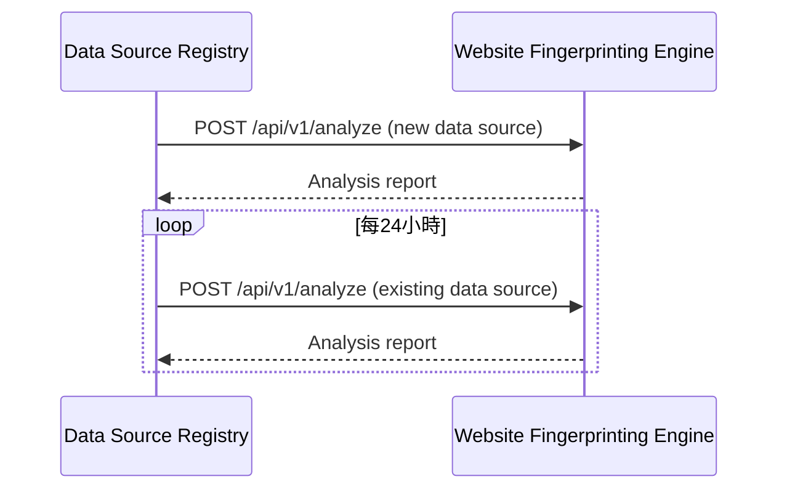
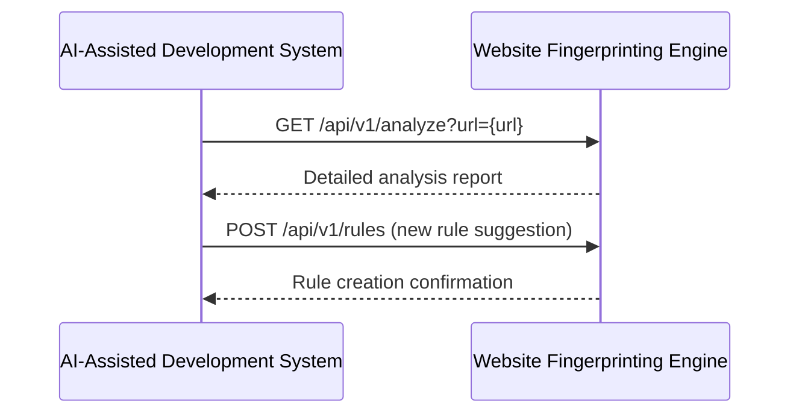
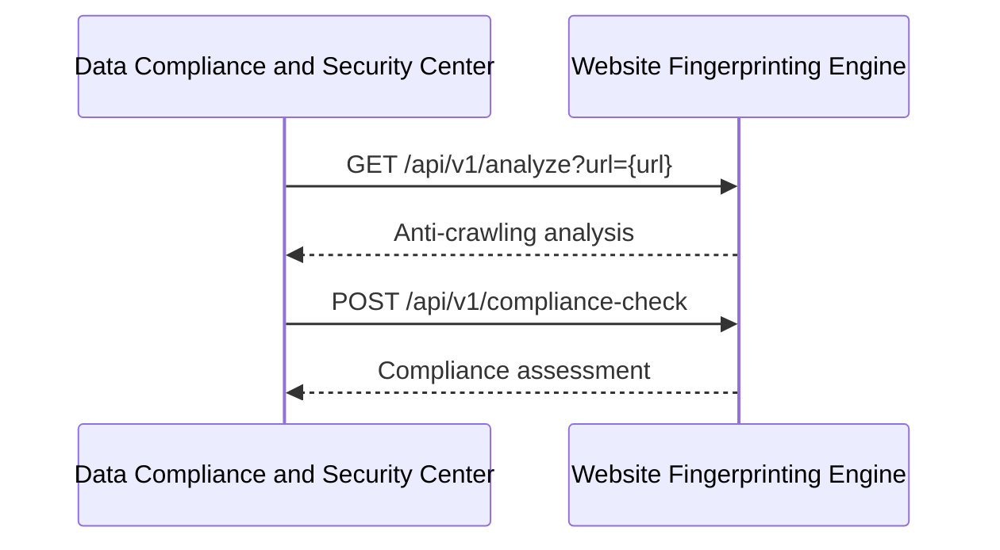

**[← 返回第2章首頁](ch2-index.md)**

---

### 2.9 與其他模組的交互

#### 2.9.1 與資料源註冊中心交互

#### 2.9.2 與AI輔助開发系統交互

#### 2.9.3 與資料合規與安全中心交互

---

## 📑 相關章節

| 前序 | 當前 | 後續 |
|-----|------|------|
| [2.8 安全考慮](ch2-8-安全考慮.md) | **2.9 與其他模組的交互** | - |

**快速鏈接：**
- [← 返回第2章首頁](ch2-index.md)
- [2.8 安全考慮](ch2-8-安全考慮.md)
