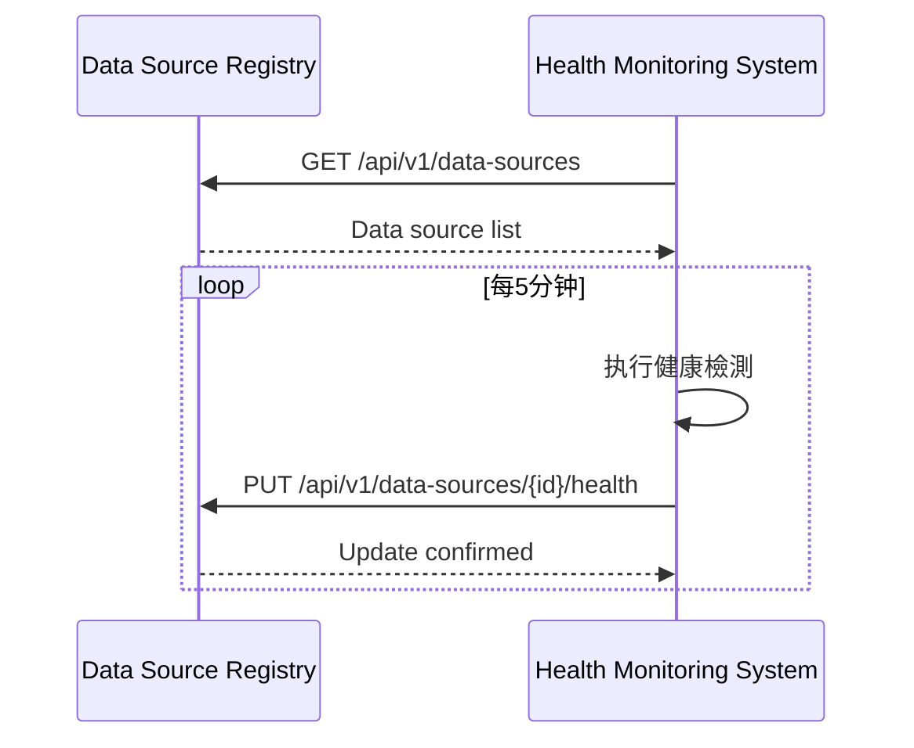

**[← 返回第3章首頁](ch3-index.md)**

---

### 3.9 與其他模組的交互

#### 3.9.1 與資料源註冊中心交互

#### 3.9.2 與告警系統交互

监测系統生成告警事件，发送到中央告警系統进行聚合和分发。

---

## 📑 相關章節

| 前序 | 當前 | 後續 |
|-----|------|------|
| [3.8 安全考慮](ch3-8-安全考慮.md) | **3.9 與其他模組的交互** | - |

**快速鏈接：**
- [← 返回第3章首頁](ch3-index.md)
- [3.8 安全考慮](ch3-8-安全考慮.md)
