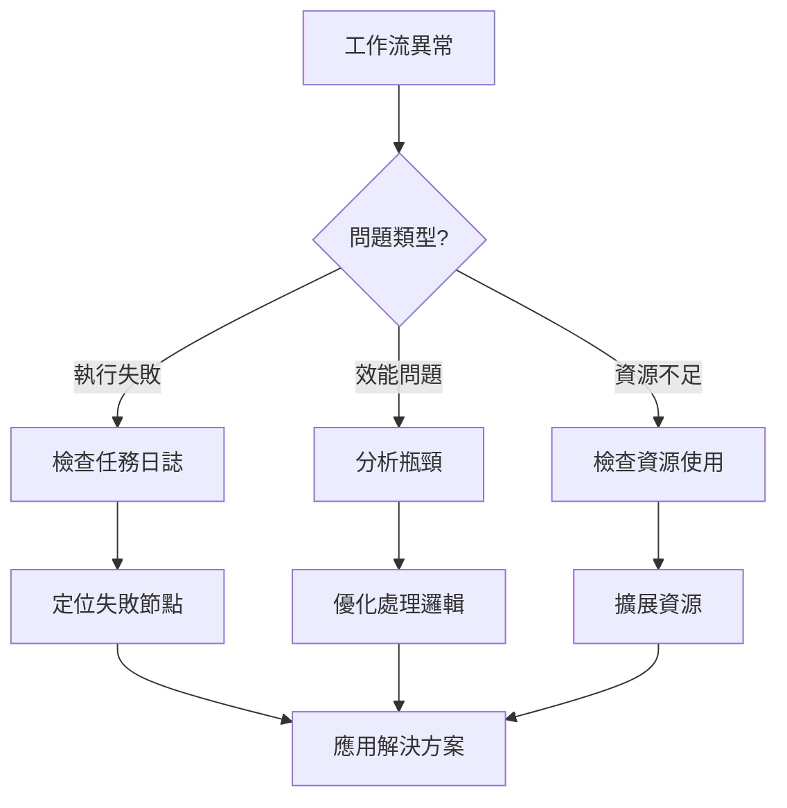

# 第4章：資料處理工作流引擎 (Data Processing Workflow Engine)

## 4.11 故障排查指南

**[← 返回第4章首頁](ch4-index.md)**

---

本章節提供資料處理工作流引擎常見問題的診斷和解決方案。

## 🔍 問題診斷流程



---

## 🐛 常見問題與解決方案

### 問題 1: 工作流執行卡住

#### 症狀
- 工作流長時間處於運行狀態
- 特定節點無響應
- 任務隊列積壓

#### 診斷工具

```python
class WorkflowDiagnostics:
    """工作流診斷工具"""
    
    def __init__(self, workflow_engine):
        self.engine = workflow_engine
        self.logger = logging.getLogger(__name__)
    
    def diagnose_stuck_workflow(self, workflow_id: str) -> Dict:
        """診斷卡住的工作流"""
        workflow = self.engine.get_workflow(workflow_id)
        
        diagnostics = {
            'workflow_id': workflow_id,
            'status': workflow.status,
            'duration': (datetime.now() - workflow.started_at).total_seconds(),
            'stuck_nodes': [],
            'resource_usage': {},
            'suggestions': []
        }
        
        # 檢查每個節點
        for node in workflow.nodes:
            if node.status == 'running':
                duration = (datetime.now() - node.started_at).total_seconds()
                
                # 如果運行時間超過預期
                if duration > node.expected_duration * 2:
                    diagnostics['stuck_nodes'].append({
                        'node_id': node.id,
                        'type': node.type,
                        'duration': duration,
                        'expected': node.expected_duration,
                        'logs': self._get_recent_logs(node)
                    })
        
        # 檢查資源使用
        diagnostics['resource_usage'] = self._check_resource_usage(workflow)
        
        # 生成建議
        diagnostics['suggestions'] = self._generate_suggestions(diagnostics)
        
        return diagnostics
    
    def _get_recent_logs(self, node, lines=50) -> List[str]:
        """獲取最近的日誌"""
        logs = self.engine.get_node_logs(node.id, limit=lines)
        return [log.message for log in logs]
    
    def _check_resource_usage(self, workflow) -> Dict:
        """檢查資源使用"""
        return {
            'cpu_usage': workflow.metrics.cpu_usage,
            'memory_usage': workflow.metrics.memory_usage,
            'io_wait': workflow.metrics.io_wait,
            'network_io': workflow.metrics.network_io
        }
    
    def _generate_suggestions(self, diagnostics: Dict) -> List[str]:
        """生成建議"""
        suggestions = []
        
        # 檢查卡住的節點
        if diagnostics['stuck_nodes']:
            suggestions.append("發現卡住的節點，建議檢查節點日誌")
            suggestions.append("考慮設置節點超時並重試")
        
        # 檢查資源使用
        resources = diagnostics['resource_usage']
        if resources.get('cpu_usage', 0) > 90:
            suggestions.append("CPU使用率過高，考慮優化處理邏輯或增加資源")
        
        if resources.get('io_wait', 0) > 50:
            suggestions.append("IO等待時間過長，檢查磁碟或網路狀況")
        
        return suggestions

# 使用範例
diagnostics = WorkflowDiagnostics(workflow_engine)
result = diagnostics.diagnose_stuck_workflow("workflow-123")

print(f"工作流狀態: {result['status']}")
print(f"運行時間: {result['duration']}秒")
print(f"卡住的節點數: {len(result['stuck_nodes'])}")

for node in result['stuck_nodes']:
    print(f"\n節點 {node['node_id']}:")
    print(f"  類型: {node['type']}")
    print(f"  運行時間: {node['duration']}秒 (預期: {node['expected']}秒)")
    print(f"  最近日誌: {node['logs'][-5:]}")

print(f"\n建議:")
for suggestion in result['suggestions']:
    print(f"  - {suggestion}")
```

#### 解決方案

**方案 1: 實現節點超時機制**

```python
from celery import Task
from celery.exceptions import SoftTimeLimitExceeded
import signal

class TimeoutTask(Task):
    """帶超時的任務"""
    
    def __call__(self, *args, **kwargs):
        # 設置軟超時和硬超時
        soft_timeout = kwargs.pop('soft_timeout', 300)  # 5分鐘
        hard_timeout = kwargs.pop('hard_timeout', 600)  # 10分鐘
        
        try:
            # 設置信號處理
            signal.signal(signal.SIGALRM, self._timeout_handler)
            signal.alarm(hard_timeout)
            
            # 執行任務
            result = self.run(*args, **kwargs)
            
            # 取消超時
            signal.alarm(0)
            
            return result
            
        except SoftTimeLimitExceeded:
            self.logger.warning(f"任務達到軟超時限制: {soft_timeout}秒")
            # 嘗試優雅地停止
            self.cleanup()
            raise
        
        except Exception as e:
            signal.alarm(0)
            self.logger.error(f"任務執行失敗: {str(e)}")
            raise
    
    def _timeout_handler(self, signum, frame):
        """超時處理"""
        raise TimeoutError("任務執行超時")
    
    def cleanup(self):
        """清理資源"""
        pass

# 使用範例
@app.task(base=TimeoutTask, bind=True)
def process_data(self, data, soft_timeout=300, hard_timeout=600):
    """處理資料（帶超時）"""
    try:
        # 處理邏輯
        result = heavy_processing(data)
        return result
    except TimeoutError:
        self.logger.error("處理超時，保存中間結果")
        # 保存進度
        self.update_state(state='TIMEOUT', meta={'progress': self.progress})
        raise
```

**方案 2: 實現斷點續傳**

```python
class ResumableWorkflow:
    """可恢復的工作流"""
    
    def __init__(self, workflow_id: str, checkpoint_interval: int = 60):
        self.workflow_id = workflow_id
        self.checkpoint_interval = checkpoint_interval
        self.last_checkpoint = time.time()
    
    def execute(self):
        """執行工作流"""
        # 檢查是否有檢查點
        checkpoint = self.load_checkpoint()
        
        if checkpoint:
            self.logger.info(f"從檢查點恢復: {checkpoint['node_id']}")
            start_node = checkpoint['node_id']
            context = checkpoint['context']
        else:
            start_node = self.workflow.start_node
            context = {}
        
        # 從指定節點開始執行
        current_node = start_node
        
        while current_node:
            try:
                # 執行節點
                result = self.execute_node(current_node, context)
                context.update(result)
                
                # 定期保存檢查點
                if time.time() - self.last_checkpoint > self.checkpoint_interval:
                    self.save_checkpoint(current_node.id, context)
                    self.last_checkpoint = time.time()
                
                # 移動到下一個節點
                current_node = self.get_next_node(current_node, result)
                
            except Exception as e:
                # 出錯時保存檢查點
                self.save_checkpoint(current_node.id, context)
                raise
        
        # 完成時清理檢查點
        self.clear_checkpoint()
    
    def save_checkpoint(self, node_id: str, context: Dict):
        """保存檢查點"""
        checkpoint = {
            'workflow_id': self.workflow_id,
            'node_id': node_id,
            'context': context,
            'timestamp': datetime.now().isoformat()
        }
        
        # 保存到 Redis
        redis_client.setex(
            f"checkpoint:{self.workflow_id}",
            3600,  # 1小時過期
            json.dumps(checkpoint)
        )
    
    def load_checkpoint(self) -> Optional[Dict]:
        """載入檢查點"""
        checkpoint_data = redis_client.get(f"checkpoint:{self.workflow_id}")
        
        if checkpoint_data:
            return json.loads(checkpoint_data)
        
        return None
    
    def clear_checkpoint(self):
        """清除檢查點"""
        redis_client.delete(f"checkpoint:{self.workflow_id}")
```

---

### 問題 2: 並行節點資源競爭

#### 症狀
- 並行執行的節點互相影響
- 資料庫連接池耗盡
- 資源爭用導致效能下降

#### 解決方案

**方案 1: 實現資源池管理**

```python
from contextlib import contextmanager
from queue import Queue
import threading

class ResourcePool:
    """資源池管理器"""
    
    def __init__(self, resource_factory, pool_size=10):
        self.resource_factory = resource_factory
        self.pool_size = pool_size
        self.pool = Queue(maxsize=pool_size)
        self.lock = threading.Lock()
        self.stats = {
            'total_created': 0,
            'total_acquired': 0,
            'total_released': 0,
            'current_usage': 0
        }
        
        # 初始化資源池
        self._initialize_pool()
    
    def _initialize_pool(self):
        """初始化資源池"""
        for _ in range(self.pool_size):
            resource = self.resource_factory()
            self.pool.put(resource)
            self.stats['total_created'] += 1
    
    @contextmanager
    def acquire(self, timeout=30):
        """獲取資源"""
        resource = None
        try:
            # 從池中獲取資源
            resource = self.pool.get(timeout=timeout)
            
            with self.lock:
                self.stats['total_acquired'] += 1
                self.stats['current_usage'] += 1
            
            yield resource
            
        except Queue.Empty:
            raise TimeoutError(f"無法在 {timeout} 秒內獲取資源")
        
        finally:
            if resource:
                # 返還資源
                self.pool.put(resource)
                
                with self.lock:
                    self.stats['total_released'] += 1
                    self.stats['current_usage'] -= 1
    
    def get_stats(self) -> Dict:
        """獲取統計資訊"""
        with self.lock:
            return self.stats.copy()

# 資料庫連接池
db_pool = ResourcePool(
    resource_factory=lambda: create_db_connection(),
    pool_size=20
)

# 在工作流節點中使用
def process_node_with_db(data):
    """使用資料庫連接的節點處理"""
    with db_pool.acquire(timeout=30) as conn:
        # 執行資料庫操作
        result = conn.execute_query(data)
        return result
```

**方案 2: 實現節點優先級調度**

```python
import heapq
from dataclasses import dataclass, field
from typing import Any

@dataclass(order=True)
class PrioritizedNode:
    """帶優先級的節點"""
    priority: int
    node: Any = field(compare=False)
    timestamp: float = field(default_factory=time.time, compare=False)

class PriorityScheduler:
    """優先級調度器"""
    
    def __init__(self, max_concurrent=10):
        self.max_concurrent = max_concurrent
        self.queue = []
        self.running = {}
        self.lock = threading.Lock()
    
    def submit(self, node, priority=5):
        """提交節點"""
        with self.lock:
            heapq.heappush(
                self.queue,
                PrioritizedNode(priority=priority, node=node)
            )
    
    def schedule(self):
        """調度節點"""
        with self.lock:
            # 如果有空閒槽位
            while len(self.running) < self.max_concurrent and self.queue:
                # 獲取最高優先級的節點
                prioritized = heapq.heappop(self.queue)
                node = prioritized.node
                
                # 執行節點
                future = executor.submit(self._execute_node, node)
                self.running[node.id] = future
                
                # 設置完成回調
                future.add_done_callback(
                    lambda f, nid=node.id: self._on_complete(nid)
                )
    
    def _execute_node(self, node):
        """執行節點"""
        try:
            return node.execute()
        except Exception as e:
            self.logger.error(f"節點執行失敗 {node.id}: {e}")
            raise
    
    def _on_complete(self, node_id: str):
        """節點完成回調"""
        with self.lock:
            if node_id in self.running:
                del self.running[node_id]
        
        # 觸發新一輪調度
        self.schedule()
```

---

### 問題 3: 工作流版本衝突

#### 症狀
- 更新工作流定義後舊版本仍在運行
- 版本混用導致錯誤
- 無法回滾到穩定版本

#### 解決方案

```python
class WorkflowVersionManager:
    """工作流版本管理器"""
    
    def __init__(self, storage):
        self.storage = storage
    
    def create_version(self, workflow_id: str, definition: Dict) -> str:
        """創建新版本"""
        # 生成版本號
        current_version = self.get_latest_version(workflow_id)
        new_version = self._increment_version(current_version)
        
        # 保存版本
        version_data = {
            'workflow_id': workflow_id,
            'version': new_version,
            'definition': definition,
            'created_at': datetime.now(),
            'created_by': self.get_current_user()
        }
        
        self.storage.save_version(version_data)
        
        return new_version
    
    def deploy_version(
        self,
        workflow_id: str,
        version: str,
        strategy: str = 'blue_green'
    ):
        """部署版本"""
        if strategy == 'blue_green':
            self._blue_green_deploy(workflow_id, version)
        elif strategy == 'canary':
            self._canary_deploy(workflow_id, version)
        elif strategy == 'immediate':
            self._immediate_deploy(workflow_id, version)
    
    def _blue_green_deploy(self, workflow_id: str, version: str):
        """藍綠部署"""
        # 1. 部署新版本到綠色環境
        self._deploy_to_environment(workflow_id, version, 'green')
        
        # 2. 驗證綠色環境
        if not self._validate_environment(workflow_id, 'green'):
            raise Exception("綠色環境驗證失敗")
        
        # 3. 切換流量到綠色環境
        self._switch_traffic(workflow_id, 'green')
        
        # 4. 保持藍色環境一段時間以便回滾
        self._schedule_cleanup(workflow_id, 'blue', delay=3600)
    
    def rollback(self, workflow_id: str, target_version: str):
        """回滾到指定版本"""
        # 獲取目標版本定義
        definition = self.storage.get_version(workflow_id, target_version)
        
        # 立即部署
        self._immediate_deploy(workflow_id, target_version)
        
        # 記錄回滾操作
        self._log_rollback(workflow_id, target_version)
```

---

## 📊 效能監控

```yaml
# Prometheus 監控規則
groups:
  - name: workflow_engine
    rules:
      - alert: HighWorkflowFailureRate
        expr: rate(workflow_failures_total[5m]) / rate(workflow_executions_total[5m]) > 0.1
        annotations:
          summary: "工作流失敗率過高"
      
      - alert: WorkflowQueueBacklog
        expr: workflow_queue_size > 1000
        for: 10m
        annotations:
          summary: "工作流隊列積壓"
      
      - alert: LongRunningWorkflow
        expr: workflow_duration_seconds > 3600
        annotations:
          summary: "工作流運行時間過長"
```

---

**相關章節**:
- [4.7 效能優化策略](ch4-7-效能優化策略.md)
- [4.10 最佳實踐指南](ch4-10-最佳實踐指南.md)
- [← 返回第4章首頁](ch4-index.md)

