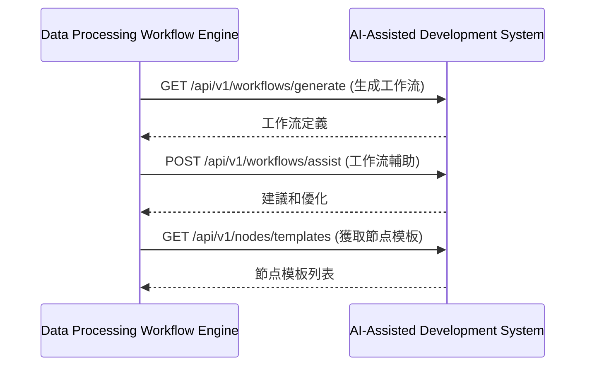
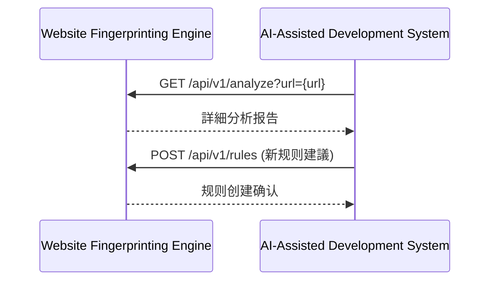
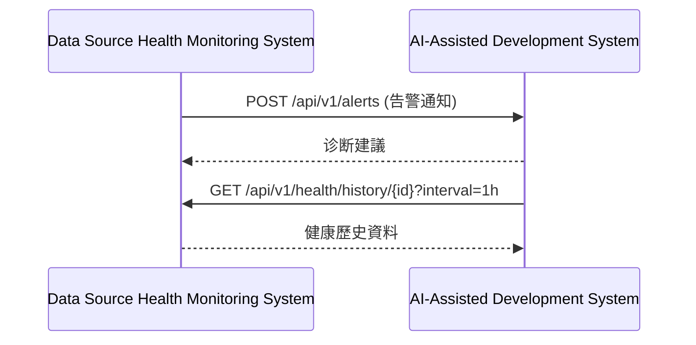
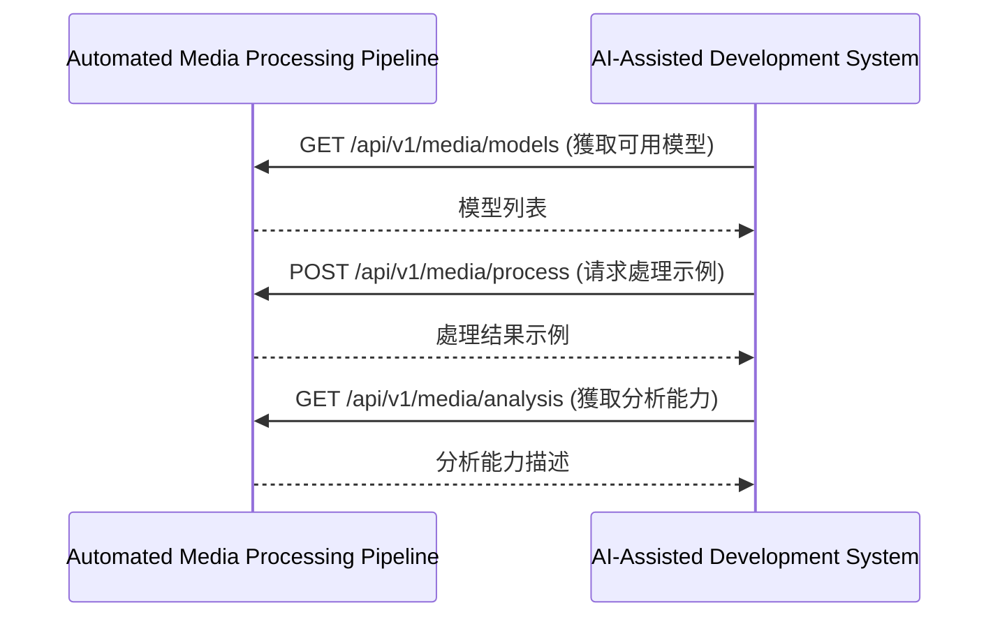

# 第6章：AI輔助開发系統 (AI-Assisted Development System)

## 6.9 與其他模組的交互

**[← 返回第6章首頁](ch6-index.md)**

---

#### 6.9.1 與資料處理工作流引擎交互

#### 6.9.2 與網站指紋分析引擎交互

#### 6.9.3 與資料源健康监测系統交互

#### 6.9.4 與自動化媒體處理管道交互

---

## 📑 相關章節

| 前序 | 當前 | 後續 |
|-----|------|------|
| [6.8 安全考慮](ch6-8-安全考慮.md) | **6.9 與其他模組的交互** | - |

**快速鏈接：**
- [6.8 安全考慮](ch6-8-安全考慮.md)
- [← 返回第6章首頁](ch6-index.md)
