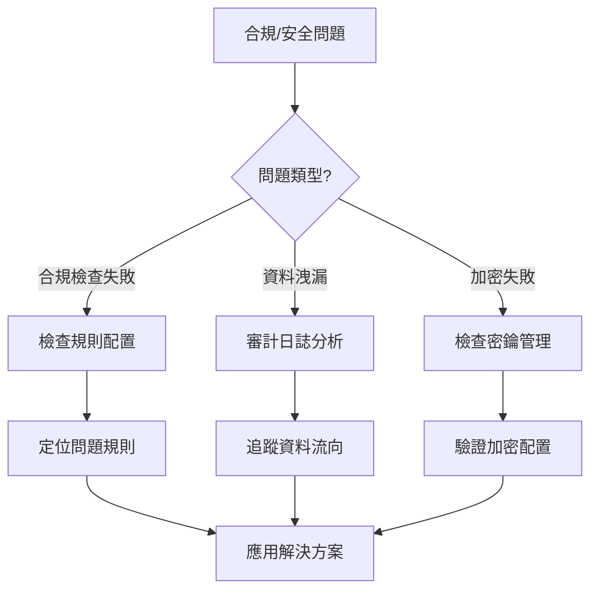

# 第7章：資料合規與安全中心 (Data Compliance and Security Center)

## 7.11 故障排查指南

**[← 返回第7章首頁](ch7-index.md)**

---

本章節提供資料合規與安全中心常見問題的診斷和解決方案。

## 🔍 問題診斷流程



---

## 🐛 常見問題與解決方案

### 問題 1: 合規檢查失敗

#### 症狀
- 資料處理被阻擋
- 合規報告顯示違規
- 大量合規告警

#### 診斷工具

```python
class ComplianceDiagnostics:
    """合規診斷工具"""
    
    def __init__(self, compliance_engine):
        self.engine = compliance_engine
        self.logger = logging.getLogger(__name__)
    
    def diagnose_compliance_failure(
        self,
        data_source: str,
        operation: str
    ) -> Dict:
        """診斷合規檢查失敗"""
        diagnostics = {
            'data_source': data_source,
            'operation': operation,
            'failed_rules': [],
            'recommendations': [],
            'risk_level': 'unknown'
        }
        
        # 獲取適用的合規規則
        rules = self.engine.get_applicable_rules(data_source, operation)
        
        # 檢查每個規則
        for rule in rules:
            try:
                result = self.engine.check_rule(rule, data_source, operation)
                
                if not result['passed']:
                    diagnostics['failed_rules'].append({
                        'rule_id': rule.id,
                        'rule_name': rule.name,
                        'category': rule.category,
                        'reason': result['reason'],
                        'severity': rule.severity
                    })
            except Exception as e:
                self.logger.error(f"規則檢查失敗 {rule.id}: {str(e)}")
        
        # 評估風險等級
        diagnostics['risk_level'] = self._calculate_risk_level(
            diagnostics['failed_rules']
        )
        
        # 生成建議
        diagnostics['recommendations'] = self._generate_recommendations(
            diagnostics['failed_rules']
        )
        
        return diagnostics
    
    def _calculate_risk_level(self, failed_rules: List[Dict]) -> str:
        """計算風險等級"""
        if not failed_rules:
            return 'none'
        
        severities = [rule['severity'] for rule in failed_rules]
        
        if 'critical' in severities:
            return 'critical'
        elif 'high' in severities:
            return 'high'
        elif 'medium' in severities:
            return 'medium'
        else:
            return 'low'
    
    def _generate_recommendations(self, failed_rules: List[Dict]) -> List[str]:
        """生成修復建議"""
        recommendations = []
        
        # 按類別分組
        by_category = {}
        for rule in failed_rules:
            category = rule['category']
            if category not in by_category:
                by_category[category] = []
            by_category[category].append(rule)
        
        # 針對每個類別生成建議
        for category, rules in by_category.items():
            if category == 'data_classification':
                recommendations.append(
                    "檢查資料分類配置，確保敏感資料被正確標記"
                )
            elif category == 'access_control':
                recommendations.append(
                    "審查訪問權限配置，實施最小權限原則"
                )
            elif category == 'encryption':
                recommendations.append(
                    "啟用資料加密，使用符合標準的加密演算法"
                )
            elif category == 'audit':
                recommendations.append(
                    "確保審計日誌完整記錄所有敏感操作"
                )
        
        return recommendations

# 使用範例
diagnostics = ComplianceDiagnostics(compliance_engine)
result = diagnostics.diagnose_compliance_failure(
    data_source="user_database",
    operation="export"
)

print(f"風險等級: {result['risk_level']}")
print(f"失敗的規則數: {len(result['failed_rules'])}")

for rule in result['failed_rules']:
    print(f"\n規則: {rule['rule_name']}")
    print(f"  類別: {rule['category']}")
    print(f"  原因: {rule['reason']}")
    print(f"  嚴重性: {rule['severity']}")

print(f"\n建議:")
for rec in result['recommendations']:
    print(f"  - {rec}")
```

#### 解決方案

**方案 1: 實現分級合規檢查**

```python
class TieredComplianceChecker:
    """分級合規檢查器"""
    
    def __init__(self):
        self.rules_by_tier = {
            'critical': [],  # 必須通過
            'important': [], # 建議通過
            'optional': []   # 可選
        }
    
    def register_rule(self, rule, tier='important'):
        """註冊合規規則"""
        if tier not in self.rules_by_tier:
            raise ValueError(f"無效的層級: {tier}")
        
        self.rules_by_tier[tier].append(rule)
    
    def check_compliance(
        self,
        data_source: str,
        operation: str,
        strict_mode: bool = False
    ) -> Dict:
        """執行合規檢查"""
        results = {
            'passed': True,
            'tier_results': {},
            'failed_rules': [],
            'warnings': []
        }
        
        # 檢查關鍵規則
        critical_result = self._check_tier(
            'critical',
            data_source,
            operation
        )
        results['tier_results']['critical'] = critical_result
        
        if not critical_result['passed']:
            results['passed'] = False
            results['failed_rules'].extend(critical_result['failed'])
            return results  # 關鍵規則失敗，立即返回
        
        # 檢查重要規則
        important_result = self._check_tier(
            'important',
            data_source,
            operation
        )
        results['tier_results']['important'] = important_result
        
        if not important_result['passed']:
            if strict_mode:
                results['passed'] = False
                results['failed_rules'].extend(important_result['failed'])
            else:
                # 非嚴格模式，只記錄警告
                results['warnings'].extend(important_result['failed'])
        
        # 檢查可選規則
        optional_result = self._check_tier(
            'optional',
            data_source,
            operation
        )
        results['tier_results']['optional'] = optional_result
        
        if not optional_result['passed']:
            results['warnings'].extend(optional_result['failed'])
        
        return results
    
    def _check_tier(
        self,
        tier: str,
        data_source: str,
        operation: str
    ) -> Dict:
        """檢查特定層級的規則"""
        result = {
            'passed': True,
            'checked': 0,
            'failed': []
        }
        
        for rule in self.rules_by_tier[tier]:
            result['checked'] += 1
            
            try:
                if not rule.check(data_source, operation):
                    result['passed'] = False
                    result['failed'].append({
                        'rule_id': rule.id,
                        'rule_name': rule.name,
                        'reason': rule.get_failure_reason()
                    })
            except Exception as e:
                self.logger.error(f"規則檢查錯誤: {str(e)}")
                result['passed'] = False
                result['failed'].append({
                    'rule_id': rule.id,
                    'rule_name': rule.name,
                    'reason': f"檢查錯誤: {str(e)}"
                })
        
        return result
```

**方案 2: 實現合規規則快取**

```python
class CachedComplianceChecker:
    """帶快取的合規檢查器"""
    
    def __init__(self, cache_ttl=300):
        self.cache_ttl = cache_ttl
        self.cache = {}
        self.cache_stats = {
            'hits': 0,
            'misses': 0
        }
    
    def check_compliance(
        self,
        data_source: str,
        operation: str,
        use_cache: bool = True
    ) -> Dict:
        """執行合規檢查（帶快取）"""
        cache_key = self._generate_cache_key(data_source, operation)
        
        # 嘗試從快取獲取
        if use_cache:
            cached_result = self._get_from_cache(cache_key)
            if cached_result:
                self.cache_stats['hits'] += 1
                return cached_result
        
        self.cache_stats['misses'] += 1
        
        # 執行實際檢查
        result = self._perform_check(data_source, operation)
        
        # 存入快取
        if use_cache and result['cacheable']:
            self._put_to_cache(cache_key, result)
        
        return result
    
    def _generate_cache_key(self, data_source: str, operation: str) -> str:
        """生成快取鍵"""
        return f"compliance:{data_source}:{operation}"
    
    def _get_from_cache(self, cache_key: str) -> Optional[Dict]:
        """從快取獲取結果"""
        if cache_key not in self.cache:
            return None
        
        cached = self.cache[cache_key]
        
        # 檢查是否過期
        if time.time() - cached['timestamp'] > self.cache_ttl:
            del self.cache[cache_key]
            return None
        
        return cached['result']
    
    def _put_to_cache(self, cache_key: str, result: Dict):
        """將結果存入快取"""
        self.cache[cache_key] = {
            'result': result,
            'timestamp': time.time()
        }
```

---

### 問題 2: 敏感資料洩漏

#### 症狀
- 審計日誌顯示異常訪問
- 敏感資料出現在日誌中
- 未授權的資料導出

#### 診斷工具

```python
class DataLeakageDetector:
    """資料洩漏檢測器"""
    
    def __init__(self):
        self.sensitive_patterns = self._load_sensitive_patterns()
        self.anomaly_detector = AnomalyDetector()
    
    def _load_sensitive_patterns(self) -> List[Pattern]:
        """載入敏感資料模式"""
        return [
            re.compile(r'\b\d{15,19}\b'),  # 信用卡號
            re.compile(r'\b\d{3}-\d{2}-\d{4}\b'),  # SSN
            re.compile(r'\b[A-Za-z0-9._%+-]+@[A-Za-z0-9.-]+\.[A-Z|a-z]{2,}\b'),  # Email
            re.compile(r'\b09\d{8}\b'),  # 台灣手機號碼
        ]
    
    def scan_logs_for_leakage(
        self,
        log_file: str,
        time_range: tuple = None
    ) -> Dict:
        """掃描日誌尋找洩漏"""
        findings = {
            'leaks_found': 0,
            'details': [],
            'severity': 'none'
        }
        
        with open(log_file, 'r', encoding='utf-8') as f:
            for line_num, line in enumerate(f, 1):
                # 檢查每個敏感模式
                for pattern in self.sensitive_patterns:
                    matches = pattern.findall(line)
                    if matches:
                        findings['leaks_found'] += len(matches)
                        findings['details'].append({
                            'line': line_num,
                            'pattern': pattern.pattern,
                            'matches': matches,
                            'context': line[:100]  # 只保留部分上下文
                        })
        
        # 評估嚴重性
        if findings['leaks_found'] > 100:
            findings['severity'] = 'critical'
        elif findings['leaks_found'] > 10:
            findings['severity'] = 'high'
        elif findings['leaks_found'] > 0:
            findings['severity'] = 'medium'
        
        return findings
    
    def detect_anomalous_access(
        self,
        user_id: str,
        access_logs: List[Dict]
    ) -> Dict:
        """檢測異常訪問行為"""
        analysis = {
            'is_anomalous': False,
            'anomalies': [],
            'risk_score': 0
        }
        
        # 分析訪問模式
        access_pattern = self._analyze_access_pattern(access_logs)
        
        # 檢測異常
        # 1. 非工作時間訪問
        off_hours_access = [
            log for log in access_logs
            if self._is_off_hours(log['timestamp'])
        ]
        if len(off_hours_access) > 5:
            analysis['anomalies'].append({
                'type': 'off_hours_access',
                'count': len(off_hours_access),
                'severity': 'medium'
            })
            analysis['risk_score'] += 30
        
        # 2. 大量資料導出
        exports = [
            log for log in access_logs
            if log.get('operation') == 'export'
        ]
        if len(exports) > 10:
            analysis['anomalies'].append({
                'type': 'excessive_exports',
                'count': len(exports),
                'severity': 'high'
            })
            analysis['risk_score'] += 50
        
        # 3. 訪問敏感資料
        sensitive_access = [
            log for log in access_logs
            if log.get('data_classification') == 'sensitive'
        ]
        if len(sensitive_access) > 20:
            analysis['anomalies'].append({
                'type': 'excessive_sensitive_access',
                'count': len(sensitive_access),
                'severity': 'high'
            })
            analysis['risk_score'] += 40
        
        # 判斷是否異常
        analysis['is_anomalous'] = analysis['risk_score'] > 50
        
        return analysis
    
    def _is_off_hours(self, timestamp: datetime) -> bool:
        """判斷是否非工作時間"""
        hour = timestamp.hour
        weekday = timestamp.weekday()
        
        # 週末
        if weekday >= 5:
            return True
        
        # 非工作時間（非9-18點）
        if hour < 9 or hour >= 18:
            return True
        
        return False
```

#### 解決方案

**方案 1: 實現資料遮罩**

```python
class DataMasker:
    """資料遮罩器"""
    
    def __init__(self):
        self.masking_rules = {
            'credit_card': self._mask_credit_card,
            'ssn': self._mask_ssn,
            'email': self._mask_email,
            'phone': self._mask_phone,
            'name': self._mask_name
        }
    
    def mask_sensitive_data(
        self,
        data: Dict,
        masking_level: str = 'partial'
    ) -> Dict:
        """遮罩敏感資料"""
        masked_data = data.copy()
        
        for field, value in masked_data.items():
            # 判斷欄位類型
            field_type = self._detect_field_type(field, value)
            
            if field_type in self.masking_rules:
                masker = self.masking_rules[field_type]
                masked_data[field] = masker(value, masking_level)
        
        return masked_data
    
    def _mask_credit_card(self, value: str, level: str) -> str:
        """遮罩信用卡號"""
        if level == 'full':
            return '****-****-****-****'
        else:  # partial
            return f"****-****-****-{value[-4:]}"
    
    def _mask_email(self, value: str, level: str) -> str:
        """遮罩電子郵件"""
        if level == 'full':
            domain = value.split('@')[1]
            return f"****@{domain}"
        else:  # partial
            local, domain = value.split('@')
            return f"{local[0]}***{local[-1]}@{domain}"
    
    def _mask_phone(self, value: str, level: str) -> str:
        """遮罩電話號碼"""
        if level == 'full':
            return '****-***-***'
        else:  # partial
            return f"****-***-{value[-3:]}"
```

---

### 問題 3: 加密密鑰管理問題

#### 症狀
- 加密操作失敗
- 密鑰輪換錯誤
- 解密失敗

#### 解決方案

```python
class KeyManagementSystem:
    """密鑰管理系統"""
    
    def __init__(self, key_store):
        self.key_store = key_store
        self.key_cache = {}
        self.rotation_policy = {
            'encryption_key': 90,  # 90天
            'signing_key': 180,    # 180天
        }
    
    def get_active_key(self, key_type: str) -> bytes:
        """獲取當前活動密鑰"""
        # 檢查快取
        if key_type in self.key_cache:
            cached_key = self.key_cache[key_type]
            if not self._is_key_expired(cached_key):
                return cached_key['key']
        
        # 從密鑰庫獲取
        active_key = self.key_store.get_active_key(key_type)
        
        # 檢查是否需要輪換
        if self._should_rotate_key(active_key):
            active_key = self.rotate_key(key_type)
        
        # 更新快取
        self.key_cache[key_type] = {
            'key': active_key['key'],
            'created_at': active_key['created_at'],
            'expires_at': active_key['expires_at']
        }
        
        return active_key['key']
    
    def rotate_key(self, key_type: str) -> Dict:
        """輪換密鑰"""
        # 生成新密鑰
        new_key = self._generate_key(key_type)
        
        # 保存新密鑰
        self.key_store.save_key(key_type, new_key, is_active=False)
        
        # 標記舊密鑰為已棄用（但保留用於解密）
        old_key = self.key_store.get_active_key(key_type)
        self.key_store.deprecate_key(old_key['id'])
        
        # 激活新密鑰
        self.key_store.activate_key(new_key['id'])
        
        return new_key
    
    def _should_rotate_key(self, key: Dict) -> bool:
        """判斷是否應該輪換密鑰"""
        key_type = key['type']
        rotation_days = self.rotation_policy.get(key_type, 90)
        
        age_days = (datetime.now() - key['created_at']).days
        
        return age_days >= rotation_days
```

---

## 📊 監控配置

```yaml
# Prometheus 監控規則
groups:
  - name: compliance_security
    rules:
      - alert: ComplianceCheckFailureRate
        expr: rate(compliance_check_failures_total[5m]) / rate(compliance_checks_total[5m]) > 0.1
        annotations:
          summary: "合規檢查失敗率過高"
      
      - alert: SensitiveDataLeakage
        expr: data_leakage_detections_total > 0
        annotations:
          summary: "檢測到敏感資料洩漏"
      
      - alert: AnomalousAccessDetected
        expr: anomalous_access_events_total > 5
        for: 10m
        annotations:
          summary: "檢測到異常訪問行為"
      
      - alert: EncryptionFailure
        expr: rate(encryption_failures_total[5m]) > 10
        annotations:
          summary: "加密操作失敗率過高"
```

---

**相關章節**:
- [7.7 效能優化策略](ch7-7-效能優化策略.md)
- [7.8 安全考慮](ch7-8-安全考慮.md)
- [← 返回第7章首頁](ch7-index.md)

