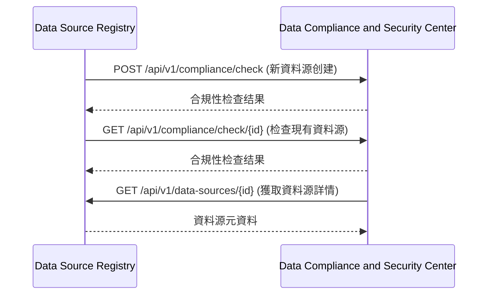
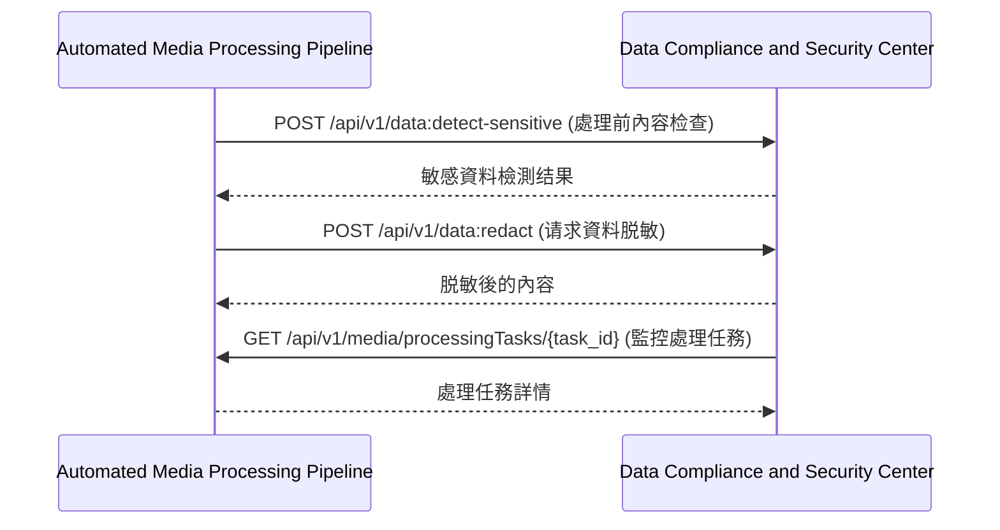
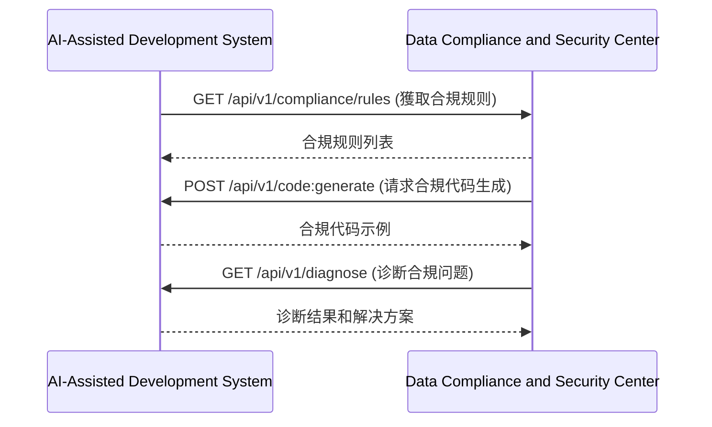
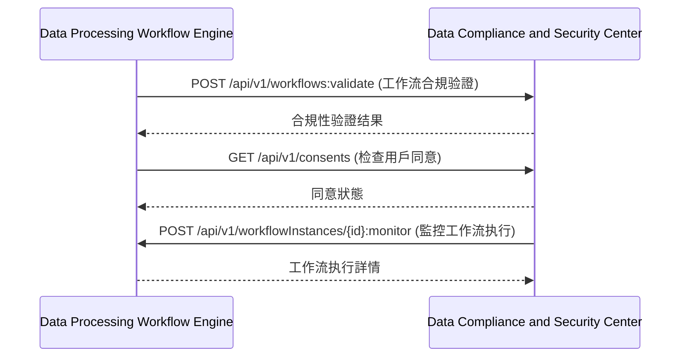

# 第7章：資料合規與安全中心 (Data Compliance and Security Center)

## 7.9 與其他模組的交互

**[← 返回第7章首頁](ch7-index.md)**

---

#### 7.9.1 與資料源註冊中心交互

#### 7.9.2 與自動化媒體處理管道交互

#### 7.9.3 與AI輔助開发系統交互

#### 7.9.4 與資料處理工作流引擎交互

---

## 📑 相關章節

| 前序 | 當前 | 後續 |
|-----|------|------|
| [7.8 安全考慮](ch7-8-安全考慮.md) | **7.9 與其他模組的交互** | - |

**快速鏈接：**
- [7.8 安全考慮](ch7-8-安全考慮.md)
- [← 返回第7章首頁](ch7-index.md)
