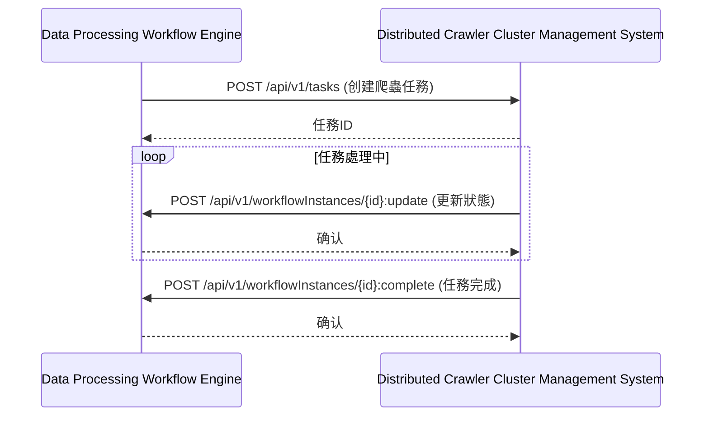
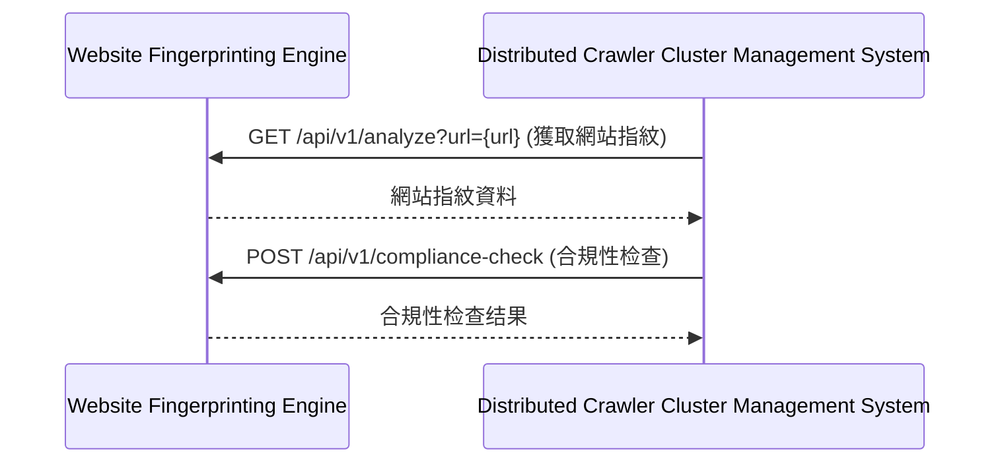
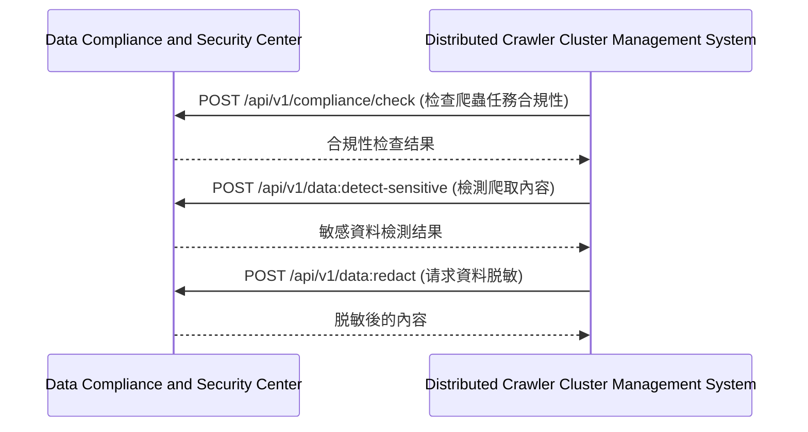
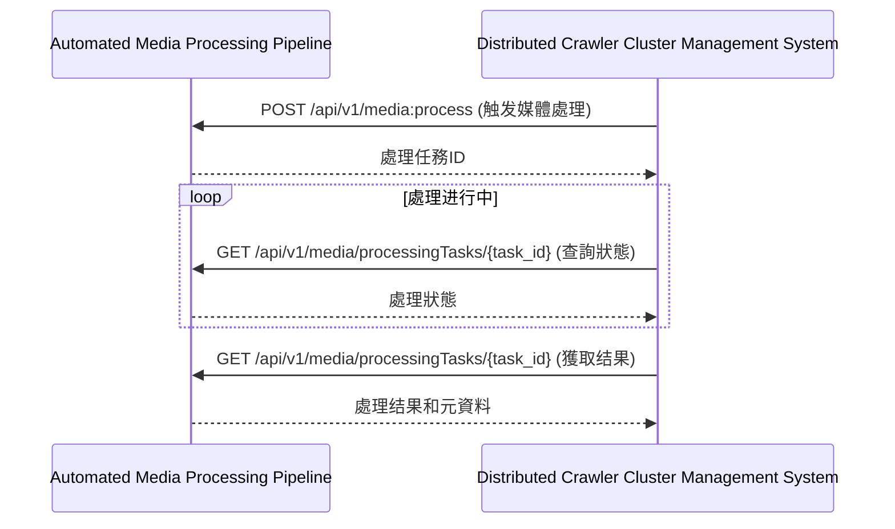

# 第8章：分布式爬蟲集群管理系統 (Distributed Crawler Cluster Management System)

## 8.9 與其他模組的交互

**[← 返回第8章首頁](ch8-index.md)**

---

#### 8.9.1 與資料處理工作流引擎交互

#### 8.9.2 與網站指紋分析引擎交互

#### 8.9.3 與資料合規與安全中心交互

#### 8.9.4 與自動化媒體處理管道交互

---

## 📑 相關章節

| 前序 | 當前 | 後續 |
|-----|------|------|
| [8.8 安全考慮](ch8-8-安全考慮.md) | **8.9 與其他模組的交互** | - |

**快速鏈接：**
- [8.8 安全考慮](ch8-8-安全考慮.md)
- [← 返回第8章首頁](ch8-index.md)
