# 镜界平台终极技術规格說明书（模組级深度實現）

## 目录

### 1. 資料源註冊中心 (Data Source Registry)
- [1.1 模組概述](#11-模組概述)
- [1.2 詳細功能清單](#12-詳細功能清單)
  - [1.2.1 核心功能](#121-核心功能)
  - [1.2.2 高级功能](#122-高级功能)
- [1.3 技術架構](#13-技術架構)
  - [1.3.1 架構图](#131-架構图)
  - [1.3.2 服務边界與交互](#132-服務边界與交互)
- [1.4 核心組件詳細實現](#14-核心組件詳細實現)
  - [1.4.1 元資料管理服務](#141-元資料管理服務)
  - [1.4.2 搜尋服務](#142-搜尋服務)
  - [1.4.3 分類管理服務](#143-分類管理服務)
- [1.5 資料模型詳細定義](#15-資料模型詳細定義)
  - [1.5.1 資料源核心表](#151-資料源核心表)
  - [1.5.2 資料源版本表](#152-資料源版本表)
  - [1.5.3 分類表](#153-分類表)
- [1.6 API詳細規範](#16-api詳細規範)
  - [1.6.1 資料源管理API](#161-資料源管理api)
  - [1.6.2 搜尋API](#162-搜尋api)
- [1.7 效能優化策略](#17-效能優化策略)
  - [1.7.1 資料庫優化](#171-資料庫優化)
  - [1.7.2 缓存策略](#172-缓存策略)
  - [1.7.3 搜尋效能優化](#173-搜尋效能優化)
- [1.8 安全考慮](#18-安全考慮)
  - [1.8.1 訪問控制](#181-訪問控制)
  - [1.8.2 資料安全](#182-資料安全)
- [1.9 與其他模組的交互](#19-與其他模組的交互)
  - [1.9.1 與資料源健康监测系統交互](#191-與資料源健康监测系統交互)
  - [1.9.2 與資料處理工作流引擎交互](#192-與資料處理工作流引擎交互)
  - [1.9.3 與AI輔助開发系統交互](#193-與ai輔助開发系統交互)

### 2. 網站指紋分析引擎 (Website Fingerprinting Engine)
- [2.1 模組概述](#21-模組概述)
- [2.2 詳細功能清單](#22-詳細功能清單)
  - [2.2.1 核心功能](#221-核心功能)
  - [2.2.2 高级功能](#222-高级功能)
- [2.3 技術架構](#23-技術架構)
  - [2.3.1 架構图](#231-架構图)
  - [2.3.2 服務边界與交互](#232-服務边界與交互)
- [2.4 核心組件詳細實現](#24-核心組件詳細實現)
  - [2.4.1 技術棧识别服務](#241-技術棧识别服務)
  - [2.4.2 反爬機制檢測服務](#242-反爬機制檢測服務)
  - [2.4.3 规则引擎服務](#243-规则引擎服務)
- [2.5 資料模型詳細定義](#25-資料模型詳細定義)
  - [2.5.1 指紋规则表](#251-指紋规则表)
  - [2.5.2 分析结果表](#252-分析结果表)
- [2.6 API詳細規範](#26-api詳細規範)
- [2.7 效能優化策略](#27-效能優化策略)
  - [2.7.1 分析效能優化](#271-分析效能優化)
  - [2.7.2 规则匹配優化](#272-规则匹配優化)
- [2.8 安全考慮](#28-安全考慮)
  - [2.8.1 分析安全](#281-分析安全)
  - [2.8.2 資料安全](#282-資料安全)
- [2.9 與其他模組的交互](#29-與其他模組的交互)
  - [2.9.1 與資料源註冊中心交互](#291-與資料源註冊中心交互)
  - [2.9.2 與AI輔助開发系統交互](#292-與ai輔助開发系統交互)
  - [2.9.3 與資料合規與安全中心交互](#293-與資料合規與安全中心交互)

### 3. 資料源健康监测系統 (Data Source Health Monitoring System)
- [3.1 模組概述](#31-模組概述)
- [3.2 詳細功能清單](#32-詳細功能清單)
  - [3.2.1 核心功能](#321-核心功能)
  - [3.2.2 高级功能](#322-高级功能)
- [3.3 技術架構](#33-技術架構)
  - [3.3.1 架構图](#331-架構图)
  - [3.3.2 服務边界與交互](#332-服務边界與交互)
- [3.4 核心組件詳細實現](#34-核心組件詳細實現)
  - [3.4.1 探測调度器](#341-探測调度器)
  - [3.4.2 探測执行器](#342-探測执行器)
  - [3.4.3 结果處理器](#343-结果處理器)
- [3.5 資料模型詳細定義](#35-資料模型詳細定義)
  - [3.5.1 健康指標表](#351-健康指標表)
  - [3.5.2 告警表](#352-告警表)
- [3.6 API詳細規範](#36-api詳細規範)
  - [3.6.1 健康监测API](#361-健康监测api)
  - [3.6.2 告警API](#362-告警api)
- [3.7 效能優化策略](#37-效能優化策略)
  - [3.7.1 時序資料儲存優化](#371-時序資料儲存優化)
  - [3.7.2 告警處理優化](#372-告警處理優化)
- [3.8 安全考慮](#38-安全考慮)
  - [3.8.1 探測安全](#381-探測安全)
  - [3.8.2 資料安全](#382-資料安全)
- [3.9 與其他模組的交互](#39-與其他模組的交互)
  - [3.9.1 與資料源註冊中心交互](#391-與資料源註冊中心交互)
  - [3.9.2 與資料處理工作流引擎交互](#392-與資料處理工作流引擎交互)
  - [3.9.3 與資料品質預测分析系統交互](#393-與資料品質預测分析系統交互)

### 4. 資料處理工作流引擎 (Data Processing Workflow Engine)
- [4.1 模組概述](#41-模組概述)
- [4.2 詳細功能清單](#42-詳細功能清單)
  - [4.2.1 核心功能](#421-核心功能)
  - [4.2.2 高级功能](#422-高级功能)
- [4.3 技術架構](#43-技術架構)
  - [4.3.1 架構图](#431-架構图)
  - [4.3.2 服務边界與交互](#432-服務边界與交互)
- [4.4 核心組件詳細實現](#44-核心組件詳細實現)
  - [4.4.1 工作流定義服務](#441-工作流定義服務)
  - [4.4.2 工作流执行服務](#442-工作流执行服務)
  - [4.4.3 工作流调度器](#443-工作流调度器)
  - [4.4.4 工作流执行器](#444-工作流执行器)
  - [4.4.5 節点执行器](#445-節点执行器)
- [4.5 資料模型詳細定義](#45-資料模型詳細定義)
  - [4.5.1 工作流定義表](#451-工作流定義表)
  - [4.5.2 工作流實例表](#452-工作流實例表)
  - [4.5.3 節点执行表](#453-節点执行表)
- [4.6 API詳細規範](#46-api詳細規範)
  - [4.6.1 工作流定義API](#461-工作流定義api)
  - [4.6.2 工作流执行API](#462-工作流执行api)
- [4.7 效能優化策略](#47-效能優化策略)
  - [4.7.1 工作流执行優化](#471-工作流执行優化)
  - [4.7.2 資源管理優化](#472-資源管理優化)
- [4.8 安全考慮](#48-安全考慮)
  - [4.8.1 工作流安全](#481-工作流安全)
  - [4.8.2 資料安全](#482-資料安全)
- [4.9 與其他模組的交互](#49-與其他模組的交互)
  - [4.9.1 與資料源註冊中心交互](#491-與資料源註冊中心交互)
  - [4.9.2 與自動化媒體處理管道交互](#492-與自動化媒體處理管道交互)
  - [4.9.3 與AI輔助開发系統交互](#493-與ai輔助開发系統交互)

### 5. 自動化媒體處理管道 (Automated Media Processing Pipeline)
- [5.1 模組概述](#51-模組概述)
- [5.2 詳細功能清單](#52-詳細功能清單)
  - [5.2.1 核心功能](#521-核心功能)
  - [5.2.2 高级功能](#522-高级功能)
- [5.3 技術架構](#53-技術架構)
  - [5.3.1 架構图](#531-架構图)
  - [5.3.2 服務边界與交互](#532-服務边界與交互)
- [5.4 核心組件詳細實現](#54-核心組件詳細實現)
  - [5.4.1 文件監控服務](#541-文件監控服務)
  - [5.4.2 媒體處理服務](#542-媒體處理服務)
  - [5.4.3 媒體分析服務](#543-媒體分析服務)
- [5.5 資料模型詳細定義](#55-資料模型詳細定義)
  - [5.5.1 媒體文件表](#551-媒體文件表)
  - [5.5.2 媒體處理任務表](#552-媒體處理任務表)
  - [5.5.3 媒體標籤表](#553-媒體標籤表)
  - [5.5.4 媒體相以度表](#554-媒體相以度表)
- [5.6 API詳細規範](#56-api詳細規範)
  - [5.6.1 媒體處理API](#561-媒體處理api)
- [5.7 效能優化策略](#57-效能優化策略)
  - [5.7.1 媒體處理效能優化](#571-媒體處理效能優化)
- [5.8 安全與合規詳細規範](#58-安全與合規詳細規範)
- [5.9 與其他模組的交互](#59-與其他模組的交互)
  - [5.9.1 與資料處理工作流引擎交互](#591-與資料處理工作流引擎交互)
  - [5.9.2 與網站指紋分析引擎交互](#592-與網站指紋分析引擎交互)
  - [5.9.3 與資料源註冊中心交互](#593-與資料源註冊中心交互)

### 6. AI輔助開发系統 (AI-Assisted Development System)
- [6.1 模組概述](#61-模組概述)
- [6.2 詳細功能清單](#62-詳細功能清單)
  - [6.2.1 核心功能](#621-核心功能)
  - [6.2.2 高级功能](#622-高级功能)
- [6.3 技術架構](#63-技術架構)
  - [6.3.1 架構图](#631-架構图)
  - [6.3.2 服務边界與交互](#632-服務边界與交互)
- [6.4 核心組件詳細實現](#64-核心組件詳細實現)
  - [6.4.1 需求解析服務](#641-需求解析服務)
  - [6.4.2 代码生成服務](#642-代码生成服務)
  - [6.4.3 问题诊断服務](#643-问题诊断服務)
  - [6.4.4 学习推薦服務](#644-学习推薦服務)
- [6.5 資料模型詳細定義](#65-資料模型詳細定義)
  - [6.5.1 用戶画像表](#651-用戶画像表)
  - [6.5.2 学习內容表](#652-学习內容表)
  - [6.5.3 技能評估表](#653-技能評估表)
  - [6.5.4 用戶学习进度表](#654-用戶学习进度表)
  - [6.5.5 用戶代码提交記錄表](#655-用戶代码提交記錄表)
- [6.6 API詳細規範](#66-api詳細規範)
  - [6.6.1 代码生成API](#661-代码生成api)
  - [6.6.2 问题诊断API](#662-问题诊断api)
  - [6.6.3 学习推薦API](#663-学习推薦api)
- [6.7 效能優化策略](#67-效能優化策略)
  - [6.7.1 LLM調用優化](#671-llm調用優化)
  - [6.7.2 上下文管理優化](#672-上下文管理優化)
  - [6.7.3 資源管理策略](#673-資源管理策略)
- [6.8 安全考慮](#68-安全考慮)
  - [6.8.1 LLM輸出安全](#681-llm輸出安全)
  - [6.8.2 資料隐私保护](#682-資料隐私保护)
- [6.9 與其他模組的交互](#69-與其他模組的交互)
  - [6.9.1 與資料處理工作流引擎交互](#691-與資料處理工作流引擎交互)
  - [6.9.2 與網站指紋分析引擎交互](#692-與網站指紋分析引擎交互)
  - [6.9.3 與資料合規與安全中心交互](#693-與資料合規與安全中心交互)

### 7. 資料合規與安全中心 (Data Compliance and Security Center)
- [7.1 模組概述](#71-模組概述)
- [7.2 詳細功能清單](#72-詳細功能清單)
  - [7.2.1 核心功能](#721-核心功能)
  - [7.2.2 高级功能](#722-高级功能)
- [7.3 技術架構](#73-技術架構)
  - [7.3.1 架構图](#731-架構图)
  - [7.3.2 服務边界與交互](#732-服務边界與交互)
- [7.4 核心組件詳細實現](#74-核心組件詳細實現)
  - [7.4.1 合規规则引擎](#741-合規规则引擎)
  - [7.4.2 敏感資料檢測器](#742-敏感資料檢測器)
- [7.5 資料模型詳細定義](#75-資料模型詳細定義)
  - [7.5.1 合規规则表](#751-合規规则表)
  - [7.5.2 敏感資料模式表](#752-敏感資料模式表)
  - [7.5.3 合規性检查结果表](#753-合規性检查结果表)
  - [7.5.4 敏感資料檢測结果表](#754-敏感資料檢測结果表)
  - [7.5.5 用戶同意記錄表](#755-用戶同意記錄表)
- [7.6 API詳細規範](#76-api詳細規範)
  - [7.6.1 合規性检查API](#761-合規性检查api)
  - [7.6.2 敏感資料檢測API](#762-敏感資料檢測api)
  - [7.6.3 用戶同意管理API](#763-用戶同意管理api)
- [7.7 效能優化策略](#77-效能優化策略)
  - [7.7.1 敏感資料檢測優化](#771-敏感資料檢測優化)
  - [7.7.2 合規性检查優化](#772-合規性检查優化)
- [7.8 安全考慮](#78-安全考慮)
  - [7.8.1 資料安全策略](#781-資料安全策略)
  - [7.8.2 合規性審計](#782-合規性審計)
- [7.9 與其他模組的交互](#79-與其他模組的交互)
  - [7.9.1 與資料源註冊中心交互](#791-與資料源註冊中心交互)
  - [7.9.2 與自動化媒體處理管道交互](#792-與自動化媒體處理管道交互)
  - [7.9.3 與資料處理工作流引擎交互](#793-與資料處理工作流引擎交互)

### 8. 分布式爬蟲集群管理系統 (Distributed Crawler Cluster Management System)
- [8.1 模組概述](#81-模組概述)
- [8.2 詳細功能清單](#82-詳細功能清單)
  - [8.2.1 核心功能](#821-核心功能)
  - [8.2.2 高级功能](#822-高级功能)
- [8.3 技術架構](#83-技術架構)
  - [8.3.1 架構图](#831-架構图)
  - [8.3.2 服務边界與交互](#832-服務边界與交互)
- [8.4 核心組件詳細實現](#84-核心組件詳細實現)
  - [8.4.1 爬蟲節点管理服務](#841-爬蟲節点管理服務)
  - [8.4.2 任務调度器](#842-任務调度器)
- [8.5 資料模型詳細定義](#85-資料模型詳細定義)
  - [8.5.1 爬蟲節点表](#851-爬蟲節点表)
  - [8.5.2 爬蟲任務表](#852-爬蟲任務表)
  - [8.5.3 爬蟲任務执行表](#853-爬蟲任務执行表)
  - [8.5.4 爬蟲集群表](#854-爬蟲集群表)
- [8.6 API詳細規範](#86-api詳細規範)
  - [8.6.1 節点管理API](#861-節点管理api)
  - [8.6.2 任務管理API](#862-任務管理api)
- [8.7 效能優化策略](#87-效能優化策略)
  - [8.7.1 任務调度優化](#871-任務调度優化)
  - [8.7.2 資源優化](#872-資源優化)
- [8.8 安全考慮](#88-安全考慮)
  - [8.8.1 節点安全](#881-節点安全)
  - [8.8.2 節点沙箱环境](#882-節点沙箱环境)
- [8.9 與其他模組的交互](#89-與其他模組的交互)
  - [8.9.1 與資料處理工作流引擎交互](#891-與資料處理工作流引擎交互)
  - [8.9.2 與網站指紋分析引擎交互](#892-與網站指紋分析引擎交互)
  - [8.9.3 與資料合規與安全中心交互](#893-與資料合規與安全中心交互)

### 9. 系統整合與部署
- [9.1 部署架構](#91-部署架構)
  - [9.1.1 生产环境部署](#911-生产环境部署)
  - [9.1.2 服務部署拓扑](#912-服務部署拓扑)
- [9.2 部署流程](#92-部署流程)
  - [9.2.1 基礎設施准備](#921-基礎設施准備)
  - [9.2.2 服務部署](#922-服務部署)
  - [9.2.3 配置管理](#923-配置管理)
- [9.3 監控與告警](#93-監控與告警)
  - [9.3.1 監控指標](#931-監控指標)
  - [9.3.2 告警规则](#932-告警规则)
- [9.4 持續整合與持續部署](#94-持續整合與持續部署)
  - [9.4.1 CI/CD流水线](#941-cicd流水线)
  - [9.4.2 流水线配置](#942-流水线配置)
  - [9.4.3 藍度发布策略](#943-藍度发布策略)
- [9.5 安全與合規](#95-安全與合規)
  - [9.5.1 安全策略](#951-安全策略)
  - [9.5.2 安全扫描策略](#952-安全扫描策略)
- [9.6 效能测试方案](#96-效能测试方案)
  - [9.6.1 基準测试場景](#961-基準测试場景)
- [9.7 災難恢復計畫](#97-災難恢復計畫)
  - [9.7.1 備份策略](#971-備份策略)
  - [9.7.2 災难恢復流程](#972-災难恢復流程)

### 10. 附录
- [10.1 术语表](#101-术语表)
- [10.2 參考文献](#102-參考文献)


## 1. 資料源註冊中心 (Data Source Registry)

### 1.1 模組概述
資料源註冊中心是镜界平台的核心元資料管理組件，負責儲存、管理和檢索所有資料源的元資訊。它為其他模組提供統一的資料源發現、分類和管理能力，支援從简单網頁到複杂API的各種資料源類型。

### 1.2 詳細功能清單

#### 1.2.1 核心功能
- **資料源CRUD管理**
  - 创建、读取、更新、删除資料源元資料
  - 支援版本控制的資料源定義
  - 支援软删除與回收站功能
- **資料源分類與標籤**
  - 多级分類體系管理
  - 動态標籤系統（支援用戶自定義標籤）
  - 自動化標籤建議（基於內容分析）
- **高级搜尋與過滤**
  - 全文搜尋（基於Elasticsearch）
  - 複杂查詢構建器（支援布尔逻辑）
  - 保存常用搜尋查詢
- **資料源健康監控整合**
  - 與健康监测系統整合
  - 健康狀態可视化
  - 健康歷史記錄查詢
- **訪問控制與權限管理**
  - 细粒度權限控制（專案级、資料源级）
  - 基於角色的訪問控制(RBAC)
  - 資料源共享功能

#### 1.2.2 高级功能
- **資料源依賴關係管理**
  - 识别和可视化資料源之间的依賴關係
  - 影响分析（當一個資料源變更時影响范围分析）
- **資料源變更追蹤**
  - 完整的變更歷史記錄
  - 變更對比功能
  - 回滚到歷史版本
- **自動化資料源發現**
  - 網站地图解析
  - API文档解析（OpenAPI/Swagger）
  - 智能資料源推薦
- **資料源品質評估**
  - 自動化品質評分
  - 品質趋势分析
  - 品質问题诊断

### 1.3 技術架構

#### 1.3.1 架構图
```
┌───────────────────────────────────────────────────────────────────────────────────────────────┐
│                                 資料源註冊中心 (DSR)                                          │
├───────────────────────┬───────────────────────┬───────────────────────────────────────────────┤
│  核心服務层           │  整合层              │  支援服務层                                 │
├───────────────────────┼───────────────────────┼───────────────────────────────────────────────┤
│ • 元資料管理服務      │ • 資料源發現适配器    │ • 搜尋索引服務                             │
│ • 分類管理服務        │ • 健康监测整合        │ • 缓存服務                                 │
│ • 標籤管理服務        │ • API网關             │ • 通知服務                                 │
│ • 搜尋服務            │ • Webhook支援         │ • 審計日志服務                             │
│ • 權限管理服務        │ • SDK支援             │ • 指標收集服務                             │
└───────────────────────┴───────────────────────┴───────────────────────────────────────────────┘
```

#### 1.3.2 服務边界與交互
- **輸入**：
  - 用戶操作（Web界面、CLI、API）
  - 健康监测系統更新
  - 資料源發現服務
  - 外部系統Webhook
- **輸出**：
  - 資料源元資料給工作流引擎
  - 健康狀態給監控系統
  - 分類資訊給推薦引擎
  - 變更事件給事件总线

### 1.4 核心組件詳細實現

#### 1.4.1 元資料管理服務

**技術實現：**
```python
class DataSourceService:
    """資料源元資料管理核心服務"""
    
    def __init__(
        self,
        db: Database,
        search_index: SearchIndex,
        event_bus: EventBus,
        config: Config
    ):
        self.db = db
        self.search_index = search_index
        self.event_bus = event_bus
        self.config = config
        self.logger = logging.getLogger(__name__)
    
    def create_data_source(
        self,
        project_id: str,
        data_source: DataSource,
        user_id: str
    ) -> DataSource:
        """
        创建新的資料源
        
        :param project_id: 所属專案ID
        :param data_source: 資料源物件
        :param user_id: 创建者ID
        :return: 创建後的資料源物件
        """
        # 1. 验證資料源
        self._validate_data_source(data_source)
        
        # 2. 生成唯一ID
        data_source.id = f"ds-{uuid.uuid4().hex[:8]}"
        data_source.project_id = project_id
        data_source.created_at = datetime.utcnow()
        data_source.updated_at = data_source.created_at
        data_source.owner_id = user_id
        data_source.status = "active"
        
        # 3. 處理分類和標籤
        self._process_categories_and_tags(data_source)
        
        # 4. 保存到資料庫
        self._save_to_db(data_source)
        
        # 5. 更新搜尋索引
        self.search_index.add(data_source)
        
        # 6. 发布创建事件
        self.event_bus.publish("data_source.created", {
            "data_source_id": data_source.id,
            "project_id": project_id,
            "user_id": user_id
        })
        
        return data_source
    
    def _validate_data_source(self, data_source: DataSource):
        """验證資料源定義的有效性"""
        # 必填字段检查
        required_fields = ["name", "url", "category", "data_type"]
        for field in required_fields:
            if not getattr(data_source, field):
                raise ValidationError(f"Missing required field: {field}")
        
        # URL格式验證
        if not self._is_valid_url(data_source.url):
            raise ValidationError("Invalid URL format")
        
        # 資料類型验證
        valid_data_types = ["image", "video", "document", "api", "html", "json", "xml"]
        if data_source.data_type not in valid_data_types:
            raise ValidationError(f"Invalid data type. Must be one of: {', '.join(valid_data_types)}")
        
        # 架構验證（如果是API）
        if data_source.data_type == "api" and data_source.schema:
            try:
                # 使用JSON Schema验證
                validate(instance=data_source.schema, schema=API_SCHEMA)
            except Exception as e:
                raise ValidationError(f"Invalid API schema: {str(e)}")
    
    def _is_valid_url(self, url: str) -> bool:
        """验證URL格式"""
        try:
            result = urlparse(url)
            return all([result.scheme, result.netloc])
        except:
            return False
    
    def _process_categories_and_tags(self, data_source: DataSource):
        """處理分類和標籤"""
        # 自動分類（如果未指定）
        if not data_source.category:
            data_source.category = self._auto_categorize(data_source)
        
        # 自動標籤建議
        if self.config.auto_tagging_enabled:
            auto_tags = self._generate_auto_tags(data_source)
            data_source.tags = list(set(data_source.tags + auto_tags))
    
    def _auto_categorize(self, data_source: DataSource) -> str:
        """自動分類算法"""
        # 基於URL模式的分類
        url = data_source.url.lower()
        
        if "social" in url or any(kw in url for kw in ["facebook", "twitter", "instagram"]):
            return "social-media"
        elif "news" in url or any(kw in url for kw in ["bbc", "cnn", "reuters"]):
            return "news"
        elif "ecommerce" in url or any(kw in url for kw in ["amazon", "ebay", "aliexpress"]):
            return "ecommerce"
        elif "image" in url or data_source.data_type == "image":
            return "image"
        elif "video" in url or data_source.data_type == "video":
            return "video"
        
        # 默认分類
        return "general"
    
    def _generate_auto_tags(self, data_source: DataSource) -> List[str]:
        """生成自動標籤"""
        tags = []
        
        # 基於URL的標籤
        url = data_source.url.lower()
        if "api" in url:
            tags.append("api")
        if "mobile" in url:
            tags.append("mobile")
        if "desktop" in url:
            tags.append("desktop")
        
        # 基於內容類型的標籤
        if data_source.content_type:
            if "json" in data_source.content_type:
                tags.append("json")
            elif "xml" in data_source.content_type:
                tags.append("xml")
            elif "html" in data_source.content_type:
                tags.append("html")
        
        # 基於資料類型的標籤
        if data_source.data_type == "image":
            tags.append("image-source")
        elif data_source.data_type == "video":
            tags.append("video-source")
        
        return tags
    
    def _save_to_db(self, data_source: DataSource):
        """保存到資料庫"""
        # 准備SQL
        sql = """
        INSERT INTO data_sources (
            id, project_id, name, display_name, description, url, 
            category, data_type, content_type, schema, status, 
            created_at, updated_at, owner_id, tags, metadata
        ) VALUES (
            %(id)s, %(project_id)s, %(name)s, %(display_name)s, %(description)s, %(url)s,
            %(category)s, %(data_type)s, %(content_type)s, %(schema)s, %(status)s,
            %(created_at)s, %(updated_at)s, %(owner_id)s, %(tags)s, %(metadata)s
        )
        """
        
        # 执行插入
        self.db.execute(sql, {
            "id": data_source.id,
            "project_id": data_source.project_id,
            "name": data_source.name,
            "display_name": data_source.display_name,
            "description": data_source.description,
            "url": data_source.url,
            "category": data_source.category,
            "data_type": data_source.data_type,
            "content_type": data_source.content_type,
            "schema": json.dumps(data_source.schema) if data_source.schema else None,
            "status": data_source.status,
            "created_at": data_source.created_at,
            "updated_at": data_source.updated_at,
            "owner_id": data_source.owner_id,
            "tags": json.dumps(data_source.tags),
            "metadata": json.dumps(data_source.metadata)
        })
    
    def get_data_source(
        self,
        data_source_id: str,
        project_id: str,
        user_id: str
    ) -> DataSource:
        """
        獲取資料源詳情
        
        :param data_source_id: 資料源ID
        :param project_id: 專案ID
        :param user_id: 请求用戶ID
        :return: 資料源物件
        """
        # 1. 检查權限
        if not self._has_permission(user_id, project_id, "read"):
            raise PermissionError("User does not have permission to read this data source")
        
        # 2. 從資料庫獲取
        data_source = self._get_from_db(data_source_id, project_id)
        if not data_source:
            raise NotFoundError(f"Data source {data_source_id} not found")
        
        # 3. 獲取健康狀態
        data_source.health = self._get_health_status(data_source_id)
        
        return data_source
    
    def _get_from_db(self, data_source_id: str, project_id: str) -> Optional[DataSource]:
        """從資料庫獲取資料源"""
        sql = """
        SELECT * FROM data_sources 
        WHERE id = %(id)s AND project_id = %(project_id)s
        """
        
        row = self.db.fetchone(sql, {
            "id": data_source_id,
            "project_id": project_id
        })
        
        if not row:
            return None
        
        return self._row_to_data_source(row)
    
    def _row_to_data_source(self, row: Dict) -> DataSource:
        """將資料庫行转换為DataSource物件"""
        return DataSource(
            id=row["id"],
            project_id=row["project_id"],
            name=row["name"],
            display_name=row["display_name"],
            description=row["description"],
            url=row["url"],
            category=row["category"],
            data_type=row["data_type"],
            content_type=row["content_type"],
            schema=json.loads(row["schema"]) if row["schema"] else None,
            status=row["status"],
            created_at=row["created_at"],
            updated_at=row["updated_at"],
            owner_id=row["owner_id"],
            tags=json.loads(row["tags"]),
            metadata=json.loads(row["metadata"])
        )
    
    def _get_health_status(self, data_source_id: str) -> DataSourceHealth:
        """獲取資料源健康狀態"""
        # 從健康监测系統獲取最新狀態
        health_data = self.health_monitor.get_latest_health(data_source_id)
        
        if not health_data:
            return DataSourceHealth(
                status="unknown",
                last_check=None,
                metrics={}
            )
        
        return DataSourceHealth(
            status=health_data["status"],
            last_check=health_data["timestamp"],
            metrics=health_data["metrics"]
        )
    
    def update_data_source(
        self,
        data_source_id: str,
        project_id: str,
        updates: Dict,
        user_id: str
    ) -> DataSource:
        """
        更新資料源
        
        :param data_source_id: 資料源ID
        :param project_id: 專案ID
        :param updates: 更新字段
        :param user_id: 更新者ID
        :return: 更新後的資料源
        """
        # 1. 獲取當前資料源
        current = self.get_data_source(data_source_id, project_id, user_id)
        
        # 2. 检查權限
        if not self._has_permission(user_id, project_id, "write"):
            raise PermissionError("User does not have permission to update this data source")
        
        # 3. 验證更新
        self._validate_updates(updates, current)
        
        # 4. 创建新版本
        new_version = self._create_version(current, updates, user_id)
        
        # 5. 保存更新
        self._save_update(data_source_id, project_id, updates)
        
        # 6. 更新搜尋索引
        updated_source = self._get_from_db(data_source_id, project_id)
        self.search_index.update(updated_source)
        
        # 7. 发布更新事件
        self.event_bus.publish("data_source.updated", {
            "data_source_id": data_source_id,
            "project_id": project_id,
            "user_id": user_id,
            "changes": updates
        })
        
        return updated_source
    
    def _validate_updates(self, updates: Dict, current: DataSource):
        """验證更新是否有效"""
        # 不能修改ID和專案ID
        if "id" in updates or "project_id" in updates:
            raise ValidationError("Cannot update data source ID or project ID")
        
        # 验證URL變更
        if "url" in updates and updates["url"] != current.url:
            # 检查URL格式
            if not self._is_valid_url(updates["url"]):
                raise ValidationError("Invalid URL format")
            
            # 检查重複URL
            if self._url_exists(updates["url"], current.project_id, current.id):
                raise ValidationError("URL already exists in this project")
    
    def _url_exists(self, url: str, project_id: str, exclude_id: str = None) -> bool:
        """检查URL是否已存在"""
        sql = """
        SELECT COUNT(*) FROM data_sources 
        WHERE url = %(url)s AND project_id = %(project_id)s
        """
        params = {"url": url, "project_id": project_id}
        
        if exclude_id:
            sql += " AND id != %(exclude_id)s"
            params["exclude_id"] = exclude_id
        
        count = self.db.fetchone(sql, params)["count"]
        return count > 0
    
    def _create_version(self, current: DataSource, updates: Dict, user_id: str) -> str:
        """创建資料源新版本"""
        # 生成新版本ID
        version_id = f"ver-{uuid.uuid4().hex[:8]}"
        
        # 准備版本資料
        version_data = {
            "data_source_id": current.id,
            "version_id": version_id,
            "changes": json.dumps(updates),
            "created_at": datetime.utcnow(),
            "created_by": user_id,
            "previous_version": current.current_version
        }
        
        # 保存版本
        self.db.execute("""
        INSERT INTO data_source_versions (
            data_source_id, version_id, changes, created_at, created_by, previous_version
        ) VALUES (
            %(data_source_id)s, %(version_id)s, %(changes)s, %(created_at)s, %(created_by)s, %(previous_version)s
        )
        """, version_data)
        
        return version_id
    
    def _save_update(self, data_source_id: str, project_id: str, updates: Dict):
        """保存資料源更新"""
        # 准備更新字段
        update_fields = []
        params = {"id": data_source_id, "project_id": project_id, "updated_at": datetime.utcnow()}
        
        for field, value in updates.items():
            if field in ["tags", "metadata", "schema"]:
                # 處理JSON字段
                update_fields.append(f"{field} = %(field)s::jsonb")
                params[field] = json.dumps(value)
            else:
                update_fields.append(f"{field} = %({field})s")
                params[field] = value
        
        # 添加更新時間
        update_fields.append("updated_at = %(updated_at)s")
        
        # 执行更新
        sql = f"""
        UPDATE data_sources 
        SET {', '.join(update_fields)}
        WHERE id = %(id)s AND project_id = %(project_id)s
        """
        
        self.db.execute(sql, params)
    
    def delete_data_source(
        self,
        data_source_id: str,
        project_id: str,
        user_id: str,
        permanent: bool = False
    ):
        """
        删除資料源
        
        :param data_source_id: 資料源ID
        :param project_id: 專案ID
        :param user_id: 删除者ID
        :param permanent: 是否永久删除
        """
        # 1. 检查權限
        if not self._has_permission(user_id, project_id, "delete"):
            raise PermissionError("User does not have permission to delete this data source")
        
        if permanent:
            # 2. 永久删除
            self._permanent_delete(data_source_id, project_id)
        else:
            # 2. 软删除
            self._soft_delete(data_source_id, project_id, user_id)
        
        # 3. 從搜尋索引中移除
        self.search_index.delete(data_source_id, project_id)
        
        # 4. 发布删除事件
        self.event_bus.publish("data_source.deleted", {
            "data_source_id": data_source_id,
            "project_id": project_id,
            "user_id": user_id,
            "permanent": permanent
        })
    
    def _soft_delete(self, data_source_id: str, project_id: str, user_id: str):
        """软删除資料源"""
        self.db.execute("""
        UPDATE data_sources 
        SET status = 'deleted', deleted_at = NOW(), deleted_by = %(user_id)s
        WHERE id = %(id)s AND project_id = %(project_id)s
        """, {
            "id": data_source_id,
            "project_id": project_id,
            "user_id": user_id
        })
    
    def _permanent_delete(self, data_source_id: str, project_id: str):
        """永久删除資料源"""
        # 先删除相關記錄
        self.db.execute("""
        DELETE FROM data_source_versions 
        WHERE data_source_id = %(id)s AND project_id = %(project_id)s
        """, {
            "id": data_source_id,
            "project_id": project_id
        })
        
        # 再删除主記錄
        self.db.execute("""
        DELETE FROM data_sources 
        WHERE id = %(id)s AND project_id = %(project_id)s
        """, {
            "id": data_source_id,
            "project_id": project_id
        })
    
    def list_data_sources(
        self,
        project_id: str,
        user_id: str,
        filters: Optional[Dict] = None,
        sort: Optional[str] = None,
        page: int = 1,
        page_size: int = 20
    ) -> DataSourceList:
        """
        列出資料源
        
        :param project_id: 專案ID
        :param user_id: 请求用戶ID
        :param filters: 過滤條件
        :param sort: 排序字段
        :param page: 頁码
        :param page_size: 每頁數量
        :return: 資料源列表
        """
        # 1. 检查權限
        if not self._has_permission(user_id, project_id, "read"):
            raise PermissionError("User does not have permission to list data sources")
        
        # 2. 構建查詢
        query = self._build_list_query(project_id, filters, sort, page, page_size)
        
        # 3. 执行查詢
        rows = self.db.fetchall(query["sql"], query["params"])
        total = self.db.fetchone(query["count_sql"], query["params"])["count"]
        
        # 4. 转换结果
        data_sources = [self._row_to_data_source(row) for row in rows]
        
        # 5. 獲取健康狀態（批量）
        data_source_ids = [ds.id for ds in data_sources]
        health_statuses = self.health_monitor.get_health_statuses(data_source_ids)
        
        for ds in data_sources:
            ds.health = health_statuses.get(ds.id, DataSourceHealth(
                status="unknown",
                last_check=None,
                metrics={}
            ))
        
        return DataSourceList(
            items=data_sources,
            total=total,
            page=page,
            page_size=page_size
        )
    
    def _build_list_query(
        self,
        project_id: str,
        filters: Optional[Dict],
        sort: Optional[str],
        page: int,
        page_size: int
    ) -> Dict:
        """構建列表查詢SQL"""
        # 基礎查詢
        base_sql = """
        SELECT * FROM data_sources 
        WHERE project_id = %(project_id)s
        """
        params = {"project_id": project_id}
        
        # 添加過滤條件
        if filters:
            if "status" in filters and filters["status"]:
                base_sql += " AND status = %(status)s"
                params["status"] = filters["status"]
            
            if "category" in filters and filters["category"]:
                base_sql += " AND category = %(category)s"
                params["category"] = filters["category"]
            
            if "tags" in filters and filters["tags"]:
                # 處理標籤過滤（包含所有指定標籤）
                tags = filters["tags"]
                if isinstance(tags, str):
                    tags = [tags]
                
                for i, tag in enumerate(tags):
                    param_name = f"tag_{i}"
                    base_sql += f" AND %(tags)s @> ARRAY[%(param_name)s]::varchar[]"
                    params[param_name] = tag
                
                params["tags"] = tags
        
        # 添加排序
        order_by = "updated_at DESC"
        if sort:
            # 验證排序字段
            valid_sort_fields = ["name", "created_at", "updated_at", "health_score"]
            if sort.lstrip("-") in valid_sort_fields:
                direction = "DESC" if sort.startswith("-") else "ASC"
                field = sort.lstrip("-")
                order_by = f"{field} {direction}"
        
        base_sql += f" ORDER BY {order_by}"
        
        # 添加分頁
        offset = (page - 1) * page_size
        paginated_sql = f"{base_sql} LIMIT %(page_size)s OFFSET %(offset)s"
        
        params.update({
            "page_size": page_size,
            "offset": offset
        })
        
        # 计數查詢
        count_sql = f"SELECT COUNT(*) FROM ({base_sql}) AS count_source"
        
        return {
            "sql": paginated_sql,
            "count_sql": count_sql,
            "params": params
        }
    
    def _has_permission(self, user_id: str, project_id: str, permission: str) -> bool:
        """检查用戶是否有權限"""
        # 實現權限检查逻辑
        # 這里简化為检查用戶是否是專案成员
        return self.project_service.is_member(user_id, project_id)
```

#### 1.4.2 搜尋服務

**技術實現：**
```python
class SearchService:
    """資料源搜尋服務，基於Elasticsearch實現"""
    
    def __init__(
        self,
        es_client: Elasticsearch,
        config: Config
    ):
        self.es_client = es_client
        self.config = config
        self.index_name = config.get("index_name", "data_sources")
        self.logger = logging.getLogger(__name__)
        
        # 確保索引存在
        self._ensure_index()
    
    def _ensure_index(self):
        """確保Elasticsearch索引存在"""
        if not self.es_client.indices.exists(index=self.index_name):
            self.logger.info(f"Creating Elasticsearch index: {self.index_name}")
            
            # 定義索引设置
            settings = {
                "settings": {
                    "number_of_shards": 3,
                    "number_of_replicas": 1,
                    "analysis": {
                        "analyzer": {
                            "standard_analyzer": {
                                "type": "custom",
                                "tokenizer": "standard",
                                "filter": ["lowercase", "stop"]
                            }
                        }
                    }
                },
                "mappings": {
                    "properties": {
                        "id": {"type": "keyword"},
                        "project_id": {"type": "keyword"},
                        "name": {"type": "text", "analyzer": "standard_analyzer"},
                        "display_name": {"type": "text", "analyzer": "standard_analyzer"},
                        "description": {"type": "text", "analyzer": "standard_analyzer"},
                        "url": {"type": "keyword"},
                        "category": {"type": "keyword"},
                        "data_type": {"type": "keyword"},
                        "content_type": {"type": "keyword"},
                        "status": {"type": "keyword"},
                        "tags": {"type": "keyword"},
                        "created_at": {"type": "date"},
                        "updated_at": {"type": "date"},
                        "health_score": {"type": "float"},
                        "availability_7d": {"type": "float"}
                    }
                }
            }
            
            # 创建索引
            self.es_client.indices.create(
                index=self.index_name,
                body=settings
            )
    
    def add(self, data_source: DataSource):
        """添加資料源到搜尋索引"""
        doc = self._to_document(data_source)
        self.es_client.index(
            index=self.index_name,
            id=data_source.id,
            body=doc
        )
    
    def _to_document(self, data_source: DataSource) -> Dict:
        """將資料源转换為Elasticsearch文档"""
        # 计算健康分數（如果可用）
        health_score = 0.0
        if data_source.health and "availability_7d" in data_source.health.metrics:
            health_score = data_source.health.metrics["availability_7d"]
        
        return {
            "id": data_source.id,
            "project_id": data_source.project_id,
            "name": data_source.name,
            "display_name": data_source.display_name,
            "description": data_source.description,
            "url": data_source.url,
            "category": data_source.category,
            "data_type": data_source.data_type,
            "content_type": data_source.content_type,
            "status": data_source.status,
            "tags": data_source.tags,
            "created_at": data_source.created_at,
            "updated_at": data_source.updated_at,
            "health_score": health_score,
            "availability_7d": data_source.health.metrics.get("availability_7d", 0.0) if data_source.health else 0.0
        }
    
    def update(self, data_source: DataSource):
        """更新搜尋索引中的資料源"""
        doc = self._to_document(data_source)
        self.es_client.update(
            index=self.index_name,
            id=data_source.id,
            body={"doc": doc}
        )
    
    def delete(self, data_source_id: str, project_id: str):
        """從搜尋索引中删除資料源"""
        self.es_client.delete(
            index=self.index_name,
            id=data_source_id
        )
    
    def search(
        self,
        project_id: str,
        query: str,
        filters: Optional[Dict] = None,
        sort: Optional[str] = None,
        page: int = 1,
        page_size: int = 20
    ) -> SearchResult:
        """
        搜尋資料源
        
        :param project_id: 專案ID
        :param query: 搜尋查詢
        :param filters: 過滤條件
        :param sort: 排序字段
        :param page: 頁码
        :param page_size: 每頁數量
        :return: 搜尋结果
        """
        # 構建查詢體
        body = self._build_search_query(project_id, query, filters, sort, page, page_size)
        
        # 执行搜尋
        result = self.es_client.search(
            index=self.index_name,
            body=body
        )
        
        # 處理结果
        hits = result["hits"]["hits"]
        total = result["hits"]["total"]["value"]
        
        data_sources = []
        for hit in hits:
            source = hit["_source"]
            # 這里应该转换為DataSource物件，但為了示例简化
            data_sources.append(source)
        
        return SearchResult(
            items=data_sources,
            total=total,
            page=page,
            page_size=page_size
        )
    
    def _build_search_query(
        self,
        project_id: str,
        query: str,
        filters: Optional[Dict],
        sort: Optional[str],
        page: int,
        page_size: int
    ) -> Dict:
        """構建Elasticsearch查詢體"""
        # 基礎查詢 - 仅限當前專案
        base_query = {
            "bool": {
                "must": [
                    {"term": {"project_id": project_id}}
                ]
            }
        }
        
        # 添加全文搜尋
        if query and query.strip():
            base_query["bool"]["must"].append({
                "multi_match": {
                    "query": query,
                    "fields": ["name^3", "display_name^2", "description", "url"],
                    "fuzziness": "AUTO"
                }
            })
        
        # 添加過滤條件
        if filters:
            if "status" in filters and filters["status"]:
                base_query["bool"]["must"].append({
                    "term": {"status": filters["status"]}
                })
            
            if "category" in filters and filters["category"]:
                base_query["bool"]["must"].append({
                    "term": {"category": filters["category"]}
                })
            
            if "tags" in filters and filters["tags"]:
                tags = filters["tags"]
                if isinstance(tags, str):
                    tags = [tags]
                
                # 必須包含所有指定標籤
                for tag in tags:
                    base_query["bool"]["must"].append({
                        "term": {"tags": tag}
                    })
            
            if "min_health" in filters:
                base_query["bool"]["must"].append({
                    "range": {
                        "health_score": {
                            "gte": filters["min_health"]
                        }
                    }
                })
        
        # 構建排序
        sort_spec = []
        if sort:
            # 验證排序字段
            valid_sort_fields = ["name", "created_at", "updated_at", "health_score"]
            if sort.lstrip("-") in valid_sort_fields:
                direction = "desc" if sort.startswith("-") else "asc"
                field = sort.lstrip("-")
                sort_spec.append({field: {"order": direction}})
        
        # 默认排序
        if not sort_spec:
            sort_spec.append({"_score": {"order": "desc"}})
            sort_spec.append({"updated_at": {"order": "desc"}})
        
        # 计算分頁
        from_val = (page - 1) * page_size
        
        return {
            "query": base_query,
            "sort": sort_spec,
            "from": from_val,
            "size": page_size,
            "_source": True
        }
    
    def suggest_tags(self, project_id: str, prefix: str) -> List[str]:
        """建議標籤（基於現有標籤）"""
        # 使用terms aggregation獲取匹配的標籤
        body = {
            "size": 0,
            "query": {
                "bool": {
                    "must": [
                        {"term": {"project_id": project_id}}
                    ]
                }
            },
            "aggs": {
                "suggested_tags": {
                    "terms": {
                        "field": "tags",
                        "include": f".*{prefix}.*",
                        "size": 10
                    }
                }
            }
        }
        
        result = self.es_client.search(
            index=self.index_name,
            body=body
        )
        
        # 提取建議的標籤
        buckets = result["aggregations"]["suggested_tags"]["buckets"]
        return [bucket["key"] for bucket in buckets]
```

#### 1.4.3 分類管理服務

**技術實現：**
```python
class CategoryService:
    """資料源分類管理服務"""
    
    def __init__(
        self,
        db: Database,
        config: Config
    ):
        self.db = db
        self.config = config
        self.logger = logging.getLogger(__name__)
        self.cache = TTLCache(maxsize=1000, ttl=300)  # 5分钟缓存
    
    def get_category_tree(
        self,
        project_id: str,
        user_id: str
    ) -> List[CategoryNode]:
        """
        獲取分類树
        
        :param project_id: 專案ID
        :param user_id: 用戶ID
        :return: 分類树
        """
        # 1. 检查權限
        if not self._has_permission(user_id, project_id, "read"):
            raise PermissionError("User does not have permission to view categories")
        
        # 2. 尝试從缓存獲取
        cache_key = f"{project_id}:tree"
        if cache_key in self.cache:
            return self.cache[cache_key]
        
        # 3. 從資料庫獲取
        categories = self._get_all_categories(project_id)
        
        # 4. 構建树結構
        tree = self._build_category_tree(categories)
        
        # 5. 缓存结果
        self.cache[cache_key] = tree
        
        return tree
    
    def _get_all_categories(self, project_id: str) -> List[Category]:
        """從資料庫獲取所有分類"""
        sql = """
        SELECT * FROM data_source_categories 
        WHERE project_id = %(project_id)s 
        ORDER BY parent_id NULLS FIRST, sort_order
        """
        
        rows = self.db.fetchall(sql, {"project_id": project_id})
        return [self._row_to_category(row) for row in rows]
    
    def _row_to_category(self, row: Dict) -> Category:
        """將資料庫行转换為Category物件"""
        return Category(
            id=row["id"],
            project_id=row["project_id"],
            name=row["name"],
            description=row["description"],
            parent_id=row["parent_id"],
            sort_order=row["sort_order"],
            created_at=row["created_at"],
            updated_at=row["updated_at"]
        )
    
    def _build_category_tree(self, categories: List[Category]) -> List[CategoryNode]:
        """構建分類树結構"""
        # 创建ID到分類的映射
        category_map = {cat.id: cat for cat in categories}
        
        # 创建節点映射
        node_map = {}
        for cat in categories:
            node_map[cat.id] = CategoryNode(
                category=cat,
                children=[]
            )
        
        # 構建树結構
        root_nodes = []
        for cat in categories:
            node = node_map[cat.id]
            
            if cat.parent_id is None:
                # 根節点
                root_nodes.append(node)
            else:
                # 子節点
                parent_node = node_map.get(cat.parent_id)
                if parent_node:
                    parent_node.children.append(node)
        
        # 按排序顺序
        def sort_nodes(nodes):
            return sorted(nodes, key=lambda n: (n.category.sort_order, n.category.name))
        
        # 递归排序
        def sort_tree(node):
            node.children = sort_nodes(node.children)
            for child in node.children:
                sort_tree(child)
        
        for node in root_nodes:
            sort_tree(node)
        
        return sort_nodes(root_nodes)
    
    def create_category(
        self,
        project_id: str,
        category: Category,
        user_id: str
    ) -> Category:
        """
        创建新分類
        
        :param project_id: 專案ID
        :param category: 分類物件
        :param user_id: 创建者ID
        :return: 创建後的分類
        """
        # 1. 检查權限
        if not self._has_permission(user_id, project_id, "write"):
            raise PermissionError("User does not have permission to create categories")
        
        # 2. 验證分類
        self._validate_category(category, project_id)
        
        # 3. 生成唯一ID
        category.id = f"cat-{uuid.uuid4().hex[:8]}"
        category.project_id = project_id
        category.created_at = datetime.utcnow()
        category.updated_at = category.created_at
        
        # 4. 保存到資料庫
        self._save_category(category)
        
        # 5. 清除缓存
        self._clear_cache(project_id)
        
        return category
    
    def _validate_category(self, category: Category, project_id: str):
        """验證分類是否有效"""
        # 必填字段
        if not category.name:
            raise ValidationError("Category name is required")
        
        # 检查名称是否重複
        if self._category_name_exists(category.name, project_id, category.parent_id, exclude_id=None):
            raise ValidationError("Category name already exists in this parent")
    
    def _category_name_exists(
        self,
        name: str,
        project_id: str,
        parent_id: Optional[str],
        exclude_id: Optional[str]
    ) -> bool:
        """检查分類名称是否已存在"""
        sql = """
        SELECT COUNT(*) FROM data_source_categories 
        WHERE project_id = %(project_id)s 
        AND name = %(name)s
        AND parent_id IS NOT DISTINCT FROM %(parent_id)s
        """
        params = {
            "project_id": project_id,
            "name": name,
            "parent_id": parent_id
        }
        
        if exclude_id:
            sql += " AND id != %(exclude_id)s"
            params["exclude_id"] = exclude_id
        
        count = self.db.fetchone(sql, params)["count"]
        return count > 0
    
    def _save_category(self, category: Category):
        """保存分類到資料庫"""
        sql = """
        INSERT INTO data_source_categories (
            id, project_id, name, description, parent_id, sort_order, created_at, updated_at
        ) VALUES (
            %(id)s, %(project_id)s, %(name)s, %(description)s, %(parent_id)s, %(sort_order)s, 
            %(created_at)s, %(updated_at)s
        )
        """
        
        self.db.execute(sql, {
            "id": category.id,
            "project_id": category.project_id,
            "name": category.name,
            "description": category.description,
            "parent_id": category.parent_id,
            "sort_order": category.sort_order or 0,
            "created_at": category.created_at,
            "updated_at": category.updated_at
        })
    
    def update_category(
        self,
        category_id: str,
        project_id: str,
        updates: Dict,
        user_id: str
    ) -> Category:
        """
        更新分類
        
        :param category_id: 分類ID
        :param project_id: 專案ID
        :param updates: 更新字段
        :param user_id: 更新者ID
        :return: 更新後的分類
        """
        # 1. 獲取當前分類
        current = self.get_category(category_id, project_id, user_id)
        
        # 2. 验證更新
        self._validate_category_update(updates, current, project_id)
        
        # 3. 更新字段
        updated_category = self._apply_updates(current, updates)
        
        # 4. 保存更新
        self._update_category_in_db(updated_category)
        
        # 5. 清除缓存
        self._clear_cache(project_id)
        
        return updated_category
    
    def _validate_category_update(
        self,
        updates: Dict,
        current: Category,
        project_id: str
    ):
        """验證分類更新是否有效"""
        # 不能修改ID和專案ID
        if "id" in updates or "project_id" in updates:
            raise ValidationError("Cannot update category ID or project ID")
        
        # 验證名称變更
        if "name" in updates:
            if self._category_name_exists(
                updates["name"], 
                project_id, 
                current.parent_id, 
                exclude_id=current.id
            ):
                raise ValidationError("Category name already exists in this parent")
        
        # 验證父级變更
        if "parent_id" in updates:
            new_parent_id = updates["parent_id"]
            
            # 检查是否形成循环
            if self._would_create_cycle(current.id, new_parent_id):
                raise ValidationError("Cannot create circular category hierarchy")
            
            # 检查新父级是否在同一專案
            if new_parent_id and not self._parent_in_same_project(new_parent_id, project_id):
                raise ValidationError("Parent category must be in the same project")
    
    def _would_create_cycle(self, category_id: str, new_parent_id: Optional[str]) -> bool:
        """检查是否會导致循环引用"""
        if not new_parent_id:
            return False
        
        # 检查新父级是否是當前分類的後代
        ancestor_ids = self._get_all_ancestor_ids(new_parent_id)
        return category_id in ancestor_ids
    
    def _get_all_ancestor_ids(self, category_id: str) -> Set[str]:
        """獲取分類的所有祖先ID"""
        ancestor_ids = set()
        current_id = category_id
        
        while current_id:
            ancestor_ids.add(current_id)
            
            # 獲取父级
            parent_id = self.db.fetchone(
                "SELECT parent_id FROM data_source_categories WHERE id = %(id)s",
                {"id": current_id}
            )["parent_id"]
            
            current_id = parent_id
        
        return ancestor_ids
    
    def _parent_in_same_project(self, parent_id: str, project_id: str) -> bool:
        """检查父级是否在同一專案"""
        result = self.db.fetchone(
            "SELECT COUNT(*) FROM data_source_categories "
            "WHERE id = %(id)s AND project_id = %(project_id)s",
            {"id": parent_id, "project_id": project_id}
        )
        return result["count"] > 0
    
    def _apply_updates(self, current: Category, updates: Dict) -> Category:
        """应用更新到分類物件"""
        updated = copy.deepcopy(current)
        
        for field, value in updates.items():
            if hasattr(updated, field):
                setattr(updated, field, value)
        
        updated.updated_at = datetime.utcnow()
        return updated
    
    def _update_category_in_db(self, category: Category):
        """將更新保存到資料庫"""
        update_fields = []
        params = {
            "id": category.id,
            "updated_at": category.updated_at
        }
        
        if "name" in category:
            update_fields.append("name = %(name)s")
            params["name"] = category.name
        if "description" in category:
            update_fields.append("description = %(description)s")
            params["description"] = category.description
        if "parent_id" in category:
            update_fields.append("parent_id = %(parent_id)s")
            params["parent_id"] = category.parent_id
        if "sort_order" in category:
            update_fields.append("sort_order = %(sort_order)s")
            params["sort_order"] = category.sort_order
        
        sql = f"""
        UPDATE data_source_categories 
        SET {', '.join(update_fields)}, updated_at = %(updated_at)s
        WHERE id = %(id)s
        """
        
        self.db.execute(sql, params)
    
    def get_category(
        self,
        category_id: str,
        project_id: str,
        user_id: str
    ) -> Category:
        """
        獲取分類詳情
        
        :param category_id: 分類ID
        :param project_id: 專案ID
        :param user_id: 请求用戶ID
        :return: 分類物件
        """
        # 1. 检查權限
        if not self._has_permission(user_id, project_id, "read"):
            raise PermissionError("User does not have permission to view this category")
        
        # 2. 從資料庫獲取
        sql = """
        SELECT * FROM data_source_categories 
        WHERE id = %(id)s AND project_id = %(project_id)s
        """
        
        row = self.db.fetchone(sql, {
            "id": category_id,
            "project_id": project_id
        })
        
        if not row:
            raise NotFoundError(f"Category {category_id} not found")
        
        return self._row_to_category(row)
    
    def delete_category(
        self,
        category_id: str,
        project_id: str,
        user_id: str,
        reassign_to: Optional[str] = None
    ):
        """
        删除分類
        
        :param category_id: 分類ID
        :param project_id: 專案ID
        :param user_id: 删除者ID
        :param reassign_to: 重新分配到的分類ID（可选）
        """
        # 1. 检查權限
        if not self._has_permission(user_id, project_id, "delete"):
            raise PermissionError("User does not have permission to delete categories")
        
        # 2. 獲取分類
        category = self.get_category(category_id, project_id, user_id)
        
        # 3. 检查是否有子分類
        child_count = self._get_child_count(category_id)
        if child_count > 0:
            raise ValidationError("Cannot delete category with child categories")
        
        # 4. 检查是否有資料源
        source_count = self._get_data_source_count(category_id)
        if source_count > 0:
            if not reassign_to:
                raise ValidationError(
                    f"Category contains {source_count} data sources. "
                    "Please specify a category to reassign to."
                )
            
            # 验證目標分類
            self.get_category(reassign_to, project_id, user_id)
            
            # 重新分配資料源
            self._reassign_data_sources(category_id, reassign_to)
        
        # 5. 删除分類
        self._delete_category(category_id)
        
        # 6. 清除缓存
        self._clear_cache(project_id)
    
    def _get_child_count(self, category_id: str) -> int:
        """獲取子分類數量"""
        result = self.db.fetchone(
            "SELECT COUNT(*) FROM data_source_categories WHERE parent_id = %(id)s",
            {"id": category_id}
        )
        return result["count"]
    
    def _get_data_source_count(self, category_id: str) -> int:
        """獲取分類中的資料源數量"""
        result = self.db.fetchone(
            "SELECT COUNT(*) FROM data_sources WHERE category = %(id)s",
            {"id": category_id}
        )
        return result["count"]
    
    def _reassign_data_sources(self, from_category: str, to_category: str):
        """重新分配資料源到新分類"""
        self.db.execute(
            "UPDATE data_sources SET category = %(to_category)s WHERE category = %(from_category)s",
            {"to_category": to_category, "from_category": from_category}
        )
    
    def _delete_category(self, category_id: str):
        """從資料庫删除分類"""
        self.db.execute(
            "DELETE FROM data_source_categories WHERE id = %(id)s",
            {"id": category_id}
        )
    
    def _clear_cache(self, project_id: str):
        """清除專案缓存"""
        cache_key = f"{project_id}:tree"
        if cache_key in self.cache:
            del self.cache[cache_key]
    
    def _has_permission(self, user_id: str, project_id: str, permission: str) -> bool:
        """检查用戶是否有權限"""
        # 實現權限检查逻辑
        return True  # 简化實現
```

### 1.5 資料模型詳細定義

#### 1.5.1 資料源核心表

```sql
-- 資料源主表
CREATE TABLE data_sources (
    id UUID PRIMARY KEY DEFAULT gen_random_uuid(),
    project_id UUID NOT NULL REFERENCES projects(id) ON DELETE CASCADE,
    name VARCHAR(255) NOT NULL,
    display_name VARCHAR(255) NOT NULL,
    description TEXT,
    url TEXT NOT NULL,
    category VARCHAR(50) NOT NULL,
    data_type VARCHAR(30) NOT NULL CHECK (data_type IN ('image', 'video', 'document', 'api', 'html', 'json', 'xml')),
    content_type VARCHAR(100),
    schema JSONB,
    status VARCHAR(20) NOT NULL DEFAULT 'active' CHECK (status IN ('active', 'inactive', 'deprecated', 'suspended', 'deleted')),
    created_at TIMESTAMPTZ NOT NULL DEFAULT NOW(),
    updated_at TIMESTAMPTZ NOT NULL DEFAULT NOW(),
    owner_id UUID NOT NULL REFERENCES users(id) ON DELETE CASCADE,
    deleted_at TIMESTAMPTZ,
    deleted_by UUID REFERENCES users(id) ON DELETE SET NULL,
    last_health_check TIMESTAMPTZ,
    health_score NUMERIC(4,2) DEFAULT 0.0,
    availability_24h NUMERIC(4,2) DEFAULT 1.0,
    availability_7d NUMERIC(4,2) DEFAULT 1.0,
    last_crawler_run TIMESTAMPTZ,
    crawler_id UUID REFERENCES crawler_instances(id),
    crawler_config JSONB,
    tags JSONB DEFAULT '[]'::jsonb,
    metadata JSONB DEFAULT '{}'::jsonb,
    
    -- 索引
    UNIQUE (project_id, name),
    INDEX idx_data_sources_project ON data_sources(project_id),
    INDEX idx_data_sources_category ON data_sources(category),
    INDEX idx_data_sources_status ON data_sources(status),
    INDEX idx_data_sources_health ON data_sources(health_score DESC),
    INDEX idx_data_sources_updated ON data_sources(updated_at DESC),
    
    -- 全文搜尋
    ts_vector TSVECTOR GENERATED ALWAYS AS (
        to_tsvector('english', coalesce(display_name, '') || ' ' || coalesce(description, '') || ' ' || url)
    ) STORED
);

-- 自動更新updated_at触发器
CREATE OR REPLACE FUNCTION update_modified_column()
RETURNS TRIGGER AS $$
BEGIN
    NEW.updated_at = NOW();
    RETURN NEW;
END;
$$ LANGUAGE plpgsql;

CREATE TRIGGER update_data_sources_modtime
BEFORE UPDATE ON data_sources
FOR EACH ROW
EXECUTE FUNCTION update_modified_column();

-- 全文搜尋索引
CREATE INDEX idx_data_sources_search ON data_sources USING GIN (ts_vector);
```

#### 1.5.2 資料源版本表

```sql
-- 資料源版本表
CREATE TABLE data_source_versions (
    id UUID PRIMARY KEY DEFAULT gen_random_uuid(),
    data_source_id UUID NOT NULL REFERENCES data_sources(id) ON DELETE CASCADE,
    version_id VARCHAR(50) NOT NULL,
    changes JSONB NOT NULL,
    created_at TIMESTAMPTZ NOT NULL DEFAULT NOW(),
    created_by UUID NOT NULL REFERENCES users(id) ON DELETE CASCADE,
    previous_version VARCHAR(50),
    
    -- 索引
    UNIQUE (data_source_id, version_id),
    INDEX idx_versions_data_source ON data_source_versions(data_source_id),
    INDEX idx_versions_created ON data_source_versions(created_at DESC)
);
```

#### 1.5.3 分類表

```sql
-- 資料源分類表
CREATE TABLE data_source_categories (
    id UUID PRIMARY KEY DEFAULT gen_random_uuid(),
    project_id UUID NOT NULL REFERENCES projects(id) ON DELETE CASCADE,
    name VARCHAR(100) NOT NULL,
    description TEXT,
    parent_id UUID REFERENCES data_source_categories(id) ON DELETE CASCADE,
    sort_order INT NOT NULL DEFAULT 0,
    created_at TIMESTAMPTZ NOT NULL DEFAULT NOW(),
    updated_at TIMESTAMPTZ NOT NULL DEFAULT NOW(),
    
    -- 索引
    UNIQUE (project_id, name, parent_id),
    INDEX idx_categories_project ON data_source_categories(project_id),
    INDEX idx_categories_parent ON data_source_categories(parent_id)
);
```

### 1.6 API詳細規範

#### 1.6.1 資料源管理API

**创建資料源 (POST /api/v1/data-sources)**

*请求示例:*
```http
POST /api/v1/data-sources HTTP/1.1
Host: dsr.mirror-realm.com
Authorization: Bearer <access_token>
Content-Type: application/json
X-Request-ID: req-123456

{
  "name": "instagram-api",
  "display_name": "Instagram API",
  "description": "Official Instagram API for fetching user posts",
  "url": "https://api.instagram.com/v1/users/self/media/recent",
  "category": "social-media",
  "data_type": "json",
  "content_type": "application/json",
  "schema": {
    "type": "object",
    "properties": {
      "data": {
        "type": "array",
        "items": {
          "type": "object",
          "properties": {
            "id": {"type": "string"},
            "images": {
              "type": "object",
              "properties": {
                "standard_resolution": {
                  "type": "object",
                  "properties": {
                    "url": {"type": "string"},
                    "width": {"type": "integer"},
                    "height": {"type": "integer"}
                  }
                }
              }
            }
          }
        }
      }
    }
  },
  "tags": ["social", "api", "instagram"],
  "metadata": {
    "api_version": "v1"
  }
}
```

*成功響應示例:*
```http
HTTP/1.1 201 Created
Content-Type: application/json
Location: /api/v1/data-sources/instagram-api
X-Request-ID: req-123456
ETag: "d41d8cd98f00b204e9800998ecf8427e"

{
  "id": "ds-7a8b9c0d",
  "project_id": "proj-123",
  "name": "instagram-api",
  "display_name": "Instagram API",
  "description": "Official Instagram API for fetching user posts",
  "url": "https://api.instagram.com/v1/users/self/media/recent",
  "category": "social-media",
  "data_type": "json",
  "content_type": "application/json",
  "schema": {
    "type": "object",
    "properties": {
      "data": {
        "type": "array",
        "items": {
          "type": "object",
          "properties": {
            "id": {"type": "string"},
            "images": {
              "type": "object",
              "properties": {
                "standard_resolution": {
                  "type": "object",
                  "properties": {
                    "url": {"type": "string"},
                    "width": {"type": "integer"},
                    "height": {"type": "integer"}
                  }
                }
              }
            }
          }
        }
      }
    }
  },
  "status": "active",
  "created_at": "2023-06-15T10:30:45Z",
  "updated_at": "2023-06-15T10:30:45Z",
  "owner_id": "user-123",
  "health": {
    "status": "unknown",
    "last_check": null,
    "metrics": {}
  },
  "tags": ["social", "api", "instagram"],
  "metadata": {
    "api_version": "v1"
  }
}
```

**獲取資料源列表 (GET /api/v1/data-sources)**

*请求示例:*
```http
GET /api/v1/data-sources?category=social-media&status=active&page=1&page_size=20 HTTP/1.1
Host: dsr.mirror-realm.com
Authorization: Bearer <access_token>
Accept: application/json
```

*成功響應示例:*
```http
HTTP/1.1 200 OK
Content-Type: application/json

{
  "items": [
    {
      "id": "ds-7a8b9c0d",
      "name": "instagram-api",
      "display_name": "Instagram API",
      "url": "https://api.instagram.com/v1/users/self/media/recent",
      "category": "social-media",
      "data_type": "json",
      "status": "active",
      "created_at": "2023-06-15T10:30:45Z",
      "updated_at": "2023-06-15T10:30:45Z",
      "health": {
        "status": "healthy",
        "last_check": "2023-06-15T10:35:20Z",
        "metrics": {
          "availability_24h": 0.98,
          "availability_7d": 0.95,
          "response_time_p50": 0.35,
          "response_time_p95": 1.2
        }
      },
      "tags": ["social", "api", "instagram"]
    },
    {
      "id": "ds-1b2c3d4e",
      "name": "twitter-api",
      "display_name": "Twitter API",
      "url": "https://api.twitter.com/2/users/me/tweets",
      "category": "social-media",
      "data_type": "json",
      "status": "active",
      "created_at": "2023-06-10T08:15:30Z",
      "updated_at": "2023-06-10T08:15:30Z",
      "health": {
        "status": "degraded",
        "last_check": "2023-06-15T10:34:15Z",
        "metrics": {
          "availability_24h": 0.85,
          "availability_7d": 0.92,
          "response_time_p50": 0.8,
          "response_time_p95": 3.5
        }
      },
      "tags": ["social", "api", "twitter"]
    }
  ],
  "total": 15,
  "page": 1,
  "page_size": 20
}
```

#### 1.6.2 搜尋API

**搜尋資料源 (POST /api/v1/data-sources:search)**

*请求示例:*
```http
POST /api/v1/data-sources:search HTTP/1.1
Host: dsr.mirror-realm.com
Authorization: Bearer <access_token>
Content-Type: application/json

{
  "query": "instagram",
  "filters": {
    "category": "social-media",
    "tags": ["api"],
    "min_health": 0.9
  },
  "sort": "-health_score",
  "page": 1,
  "page_size": 10
}
```

*成功響應示例:*
```http
HTTP/1.1 200 OK
Content-Type: application/json

{
  "items": [
    {
      "id": "ds-7a8b9c0d",
      "name": "instagram-api",
      "display_name": "Instagram API",
      "url": "https://api.instagram.com/v1/users/self/media/recent",
      "category": "social-media",
      "data_type": "json",
      "status": "active",
      "health_score": 0.95,
      "created_at": "2023-06-15T10:30:45Z",
      "updated_at": "2023-06-15T10:30:45Z"
    }
  ],
  "total": 1,
  "page": 1,
  "page_size": 10
}
```

### 1.7 效能優化策略

#### 1.7.1 資料庫優化

1. **分区策略**
   ```sql
   -- 按專案ID分区
   CREATE TABLE data_sources PARTITION OF data_sources_master
   FOR VALUES IN ('proj-123');
   
   CREATE TABLE data_sources PARTITION OF data_sources_master
   FOR VALUES IN ('proj-456');
   ```

2. **索引優化**
   ```sql
   -- 為常用查詢模式创建複合索引
   CREATE INDEX idx_data_sources_project_category ON data_sources(project_id, category);
   CREATE INDEX idx_data_sources_project_status ON data_sources(project_id, status);
   CREATE INDEX idx_data_sources_project_health ON data_sources(project_id, health_score DESC);
   ```

3. **查詢優化**
   - 使用覆蓋索引减少IO
   - 避免SELECT *
   - 使用批量操作减少往返
   - 适當使用CTE提高可读性

#### 1.7.2 缓存策略

1. **多级缓存架構**
   ```
   ┌───────────────────────────────────────────────────────────────────────────────┐
   │                                   缓存层                                      │
   ├───────────────────┬───────────────────┬───────────────────┬───────────────────┤
   │  客户端缓存       │  CDN缓存          │  应用层缓存      │  資料庫缓存       │
   ├───────────────────┼───────────────────┼───────────────────┼───────────────────┤
   │ • ETag/Last-Modified│ • 静态資源缓存   │ • Redis缓存      │ • 查詢结果缓存   │
   │ • 浏览器本地儲存   │ • API響應缓存    │ • 分類树缓存     │ • 連接池         │
   └───────────────────┴───────────────────┴───────────────────┴───────────────────┘
   ```

2. **缓存失效策略**
   - 写操作後立即失效相關缓存
   - 设置合理的TTL（分類树：5分钟，資料源詳情：1分钟）
   - 使用缓存版本控制避免陈舊資料

#### 1.7.3 搜尋效能優化

1. **Elasticsearch優化**
   - 调整分片和副本數量
   - 優化索引刷新间隔
   - 使用字段資料類型優化儲存
   - 實現搜尋结果分頁缓存

2. **查詢優化**
   ```python
   def optimized_search(project_id, query, filters, sort, page, page_size):
       # 1. 使用過滤上下文代替查詢上下文（當不需要相關性評分時）
       # 2. 限制返回字段
       # 3. 使用search_after代替from/size进行深分頁
       # 4. 實現结果缓存
       pass
   ```

### 1.8 安全考慮

#### 1.8.1 訪問控制

1. **基於角色的訪問控制(RBAC)模型**
   ```
   ┌─────────────┐      ┌─────────────┐      ┌─────────────┐
   │    Users    │─────▶│    Roles    │─────▶│  Permissions│
   └─────────────┘      └─────────────┘      └─────────────┘
          │                   ▲
          │                   │
          ▼                   │
   ┌─────────────┐      ┌─────────────┐
   │  Projects   │─────▶│    Teams    │
   └─────────────┘      └─────────────┘
   ```

2. **细粒度權限检查**
   ```python
   def check_permission(user_id, project_id, resource, action):
       """
       检查用戶是否有權限执行特定操作
       
       :param user_id: 用戶ID
       :param project_id: 專案ID
       :param resource: 資源類型 (data_source, category等)
       :param action: 操作 (read, write, delete等)
       :return: 是否有權限
       """
       # 1. 检查專案成员资格
       if not project_service.is_member(user_id, project_id):
           return False
       
       # 2. 检查角色權限
       user_role = project_service.get_user_role(user_id, project_id)
       return permission_service.has_permission(user_role, resource, action)
   ```

#### 1.8.2 資料安全

1. **敏感資料處理**
   - 對API密钥等敏感資訊进行加密儲存
   - 實現字段级訪問控制
   - 記錄敏感資料訪問日志

2. **審計日志**
   ```sql
   CREATE TABLE data_source_audit_logs (
       id UUID PRIMARY KEY DEFAULT gen_random_uuid(),
       data_source_id UUID NOT NULL REFERENCES data_sources(id) ON DELETE CASCADE,
       user_id UUID NOT NULL REFERENCES users(id) ON DELETE CASCADE,
       project_id UUID NOT NULL REFERENCES projects(id) ON DELETE CASCADE,
       action VARCHAR(20) NOT NULL, -- create, update, delete, read
       old_value JSONB,
       new_value JSONB,
       timestamp TIMESTAMPTZ NOT NULL DEFAULT NOW(),
       ip_address INET,
       user_agent TEXT
   );
   
   CREATE INDEX idx_audit_logs_data_source ON data_source_audit_logs(data_source_id);
   CREATE INDEX idx_audit_logs_timestamp ON data_source_audit_logs(timestamp DESC);
   ```

### 1.9 與其他模組的交互

#### 1.9.1 與資料源健康监测系統交互

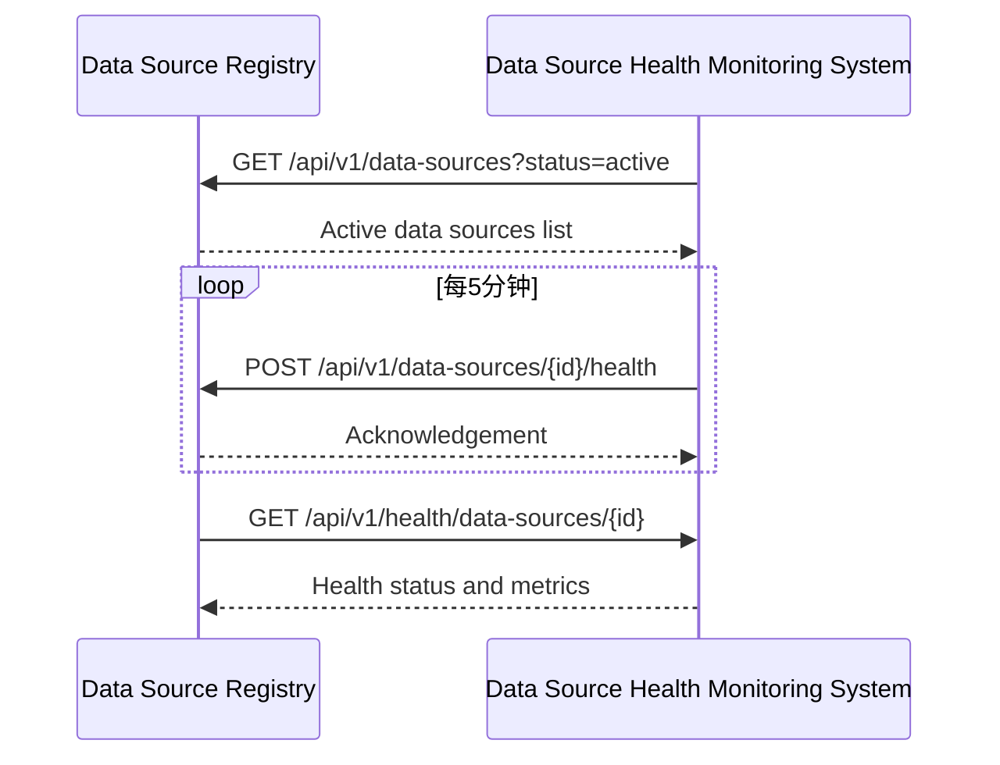
```mermaid
sequenceDiagram
    participant DSR as Data Source Registry
    participant DSHMS as Data Source Health Monitoring System
    
    DSHMS->>DSR: GET /api/v1/data-sources?status=active
    DSR-->>DSHMS: Active data sources list
    
    loop 每5分钟
        DSHMS->>DSR: POST /api/v1/data-sources/{id}/health
        DSR-->>DSHMS: Acknowledgement
    end
    
    DSR->>DSHMS: GET /api/v1/health/data-sources/{id}
    DSHMS-->>DSR: Health status and metrics
```

#### 1.9.2 與資料處理工作流引擎交互

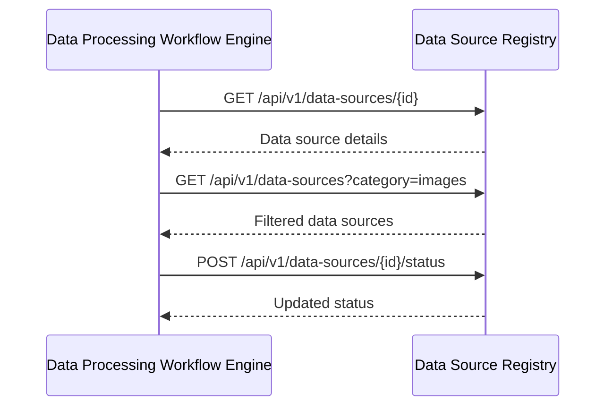
```mermaid
sequenceDiagram
    participant DPWE as Data Processing Workflow Engine
    participant DSR as Data Source Registry
    
    DPWE->>DSR: GET /api/v1/data-sources/{id}
    DSR-->>DPWE: Data source details
    
    DPWE->>DSR: GET /api/v1/data-sources?category=images
    DSR-->>DPWE: Filtered data sources
    
    DPWE->>DSR: POST /api/v1/data-sources/{id}/status
    DSR-->>DPWE: Updated status
```

#### 1.9.3 與AI輔助開发系統交互

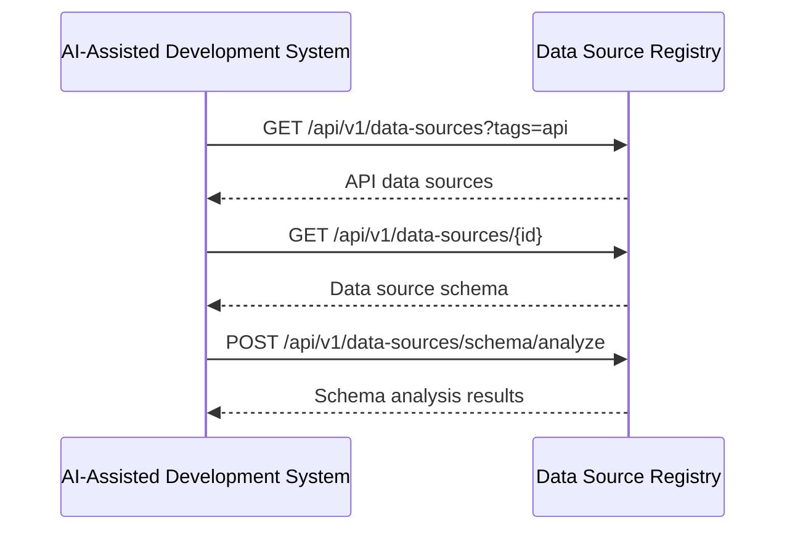
```mermaid
sequenceDiagram
    participant AIDS as AI-Assisted Development System
    participant DSR as Data Source Registry
    
    AIDS->>DSR: GET /api/v1/data-sources?tags=api
    DSR-->>AIDS: API data sources
    
    AIDS->>DSR: GET /api/v1/data-sources/{id}
    DSR-->>AIDS: Data source schema
    
    AIDS->>DSR: POST /api/v1/data-sources/schema/analyze
    DSR-->>AIDS: Schema analysis results
```

## 2. 網站指紋分析引擎 (Website Fingerprinting Engine)

### 2.1 模組概述
網站指紋分析引擎負責分析目標網站的技術棧、反爬機制和內容特徵，為爬蟲配置提供智能建議。它通過主動探測和被動分析相結合的方式，構建全面的網站指紋資料庫。

### 2.2 詳細功能清單

#### 2.2.1 核心功能
- **技術棧识别**
  - 服務器软件识别（Apache, Nginx, IIS等）
  - 编程语言识别（PHP, Ruby, Python, Node.js等）
  - 前端框架识别（React, Angular, Vue等）
  - CMS识别（WordPress, Drupal, Joomla等）
  - 資料庫识别
  - CDN识别
- **反爬機制檢測**
  - User-Agent檢測
  - IP限制檢測
  - 请求频率限制
  - 行為验證（鼠標移動、点击模式）
  - 挑战響應機制（JS挑战、CAPTCHA）
  - 指紋檢測（Canvas, WebGL, AudioContext等）
- **內容特徵分析**
  - 頁面結構分析（DOM树複杂度）
  - 動态內容檢測（AJAX加载內容）
  - 內容编码分析
  - 響應時間分析
- **指紋資料庫管理**
  - 指紋规则儲存與管理
  - 指紋版本控制
  - 指紋品質評估

#### 2.2.2 高级功能
- **智能爬蟲配置建議**
  - 基於指紋的爬蟲參數推薦
  - 反爬绕過策略建議
  - 最佳爬取時間建議
- **網站變更监测**
  - 技術棧變更檢測
  - 反爬機制更新預警
  - 內容結構變更分析
- **指紋学习系統**
  - 自動学习新的網站特徵
  - 指紋规则優化
  - 误报/漏报分析

### 2.3 技術架構

#### 2.3.1 架構图
```
┌───────────────────────────────────────────────────────────────────────────────────────────────┐
│                              網站指紋分析引擎 (WFE)                                           │
├───────────────────────┬───────────────────────┬───────────────────────────────────────────────┤
│  分析执行层           │  规则引擎层           │  資料管理层                                 │
├───────────────────────┼───────────────────────┼───────────────────────────────────────────────┤
│ • 主動探測服務        │ • 规则加载器          │ • 指紋資料庫                               │
│ • 被動分析服務        │ • 规则执行器          │ • 规则版本控制                             │
│ • 指紋生成服務        │ • 规则優化器          │ • 分析结果儲存                             │
│ • 變更监测服務        │ • 机器学习模型        │ • 效能指標儲存                             │
└───────────────────────┴───────────────────────┴───────────────────────────────────────────────┘
```

#### 2.3.2 服務边界與交互
- **輸入**：
  - 目標URL列表（來自資料源註冊中心）
  - 手動触发的分析请求
  - 網站變更监测事件
- **輸出**：
  - 技術棧分析报告
  - 反爬機制檢測结果
  - 智能爬蟲配置建議
  - 網站變更預警

### 2.4 核心組件詳細實現

#### 2.4.1 技術棧识别服務

**技術實現：**
```python
class TechStackAnalyzer:
    """網站技術棧识别服務"""
    
    def __init__(
        self,
        rule_engine: RuleEngine,
        http_client: HttpClient,
        config: Config
    ):
        self.rule_engine = rule_engine
        self.http_client = http_client
        self.config = config
        self.logger = logging.getLogger(__name__)
    
    def analyze(
        self,
        url: str,
        options: Optional[AnalysisOptions] = None
    ) -> TechStackReport:
        """
        分析網站技術棧
        
        :param url: 目標URL
        :param options: 分析选项
        :return: 技術棧分析报告
        """
        # 1. 准備分析选项
        opts = options or AnalysisOptions()
        
        # 2. 獲取頁面內容
        response = self._fetch_page(url, opts)
        
        # 3. 执行技術棧分析
        tech_stack = self._analyze_tech_stack(url, response, opts)
        
        # 4. 生成报告
        return self._generate_report(url, response, tech_stack, opts)
    
    def _fetch_page(
        self,
        url: str,
        options: AnalysisOptions
    ) -> HttpResponse:
        """獲取頁面內容"""
        # 准備请求头
        headers = {
            "User-Agent": options.user_agent or self.config.default_user_agent,
            "Accept": "text/html,application/xhtml+xml,application/xml;q=0.9,*/*;q=0.8",
            "Accept-Language": "en-US,en;q=0.5",
            "Connection": "keep-alive"
        }
        
        # 添加自定義请求头
        if options.headers:
            headers.update(options.headers)
        
        # 执行HTTP请求
        try:
            start_time = time.time()
            response = self.http_client.get(
                url,
                headers=headers,
                timeout=options.timeout or self.config.default_timeout,
                follow_redirects=options.follow_redirects
            )
            duration = time.time() - start_time
            
            return HttpResponse(
                url=response.url,
                status_code=response.status_code,
                headers=dict(response.headers),
                content=response.content,
                duration=duration,
                redirect_chain=[r.url for r in response.redirects]
            )
            
        except Exception as e:
            self.logger.error("Error fetching %s: %s", url, str(e))
            raise AnalysisError(f"Failed to fetch page: {str(e)}")
    
    def _analyze_tech_stack(
        self,
        url: str,
        response: HttpResponse,
        options: AnalysisOptions
    ) -> Dict[str, List[Technology]]:
        """分析技術棧"""
        results = {
            "server": [],
            "framework": [],
            "cms": [],
            "javascript": [],
            "database": [],
            "cdn": [],
            "os": []
        }
        
        # 1. 從響應头分析
        self._analyze_from_headers(response, results)
        
        # 2. 從HTML內容分析
        if response.content:
            self._analyze_from_html(response.content, results)
        
        # 3. 從URL結構分析
        self._analyze_from_url(url, results)
        
        # 4. 從JavaScript文件分析
        if options.analyze_js and response.content:
            self._analyze_from_js(response.content, results)
        
        # 5. 执行高级分析（如果启用）
        if options.advanced_analysis:
            self._perform_advanced_analysis(url, response, results)
        
        return results
    
    def _analyze_from_headers(
        self,
        response: HttpResponse,
        results: Dict[str, List[Technology]]
    ):
        """從HTTP響應头分析技術棧"""
        headers = {k.lower(): v for k, v in response.headers.items()}
        
        # 服務器软件
        if "server" in headers:
            server_header = headers["server"]
            server_match = self.rule_engine.match(
                "server", 
                server_header, 
                RuleCategory.HEADER
            )
            if server_match:
                results["server"].extend(server_match.technologies)
        
        # X-Powered-By
        if "x-powered-by" in headers:
            powered_by = headers["x-powered-by"]
            powered_by_match = self.rule_engine.match(
                "powered-by", 
                powered_by, 
                RuleCategory.HEADER
            )
            if powered_by_match:
                results["server"].extend(powered_by_match.technologies)
        
        # Set-Cookie分析
        if "set-cookie" in headers:
            cookies = headers["set-cookie"]
            cookie_match = self.rule_engine.match(
                "cookies", 
                cookies, 
                RuleCategory.HEADER
            )
            if cookie_match:
                results["server"].extend(cookie_match.technologies)
    
    def _analyze_from_html(
        self,
        content: bytes,
        results: Dict[str, List[Technology]]
    ):
        """從HTML內容分析技術棧"""
        try:
            # 解析HTML
            soup = BeautifulSoup(content, 'html.parser')
            
            # Meta標籤分析
            self._analyze_meta_tags(soup, results)
            
            # 脚本標籤分析
            self._analyze_script_tags(soup, results)
            
            # 鏈接標籤分析
            self._analyze_link_tags(soup, results)
            
            # HTML属性分析
            self._analyze_html_attributes(soup, results)
            
        except Exception as e:
            self.logger.warning("Error parsing HTML: %s", str(e))
    
    def _analyze_meta_tags(
        self,
        soup: BeautifulSoup,
        results: Dict[str, List[Technology]]
    ):
        """分析meta標籤"""
        for meta in soup.find_all('meta'):
            name = meta.get('name', '').lower()
            content = meta.get('content', '')
            
            if not content:
                continue
            
            # Generator meta標籤
            if name == 'generator':
                generator_match = self.rule_engine.match(
                    "generator", 
                    content, 
                    RuleCategory.META
                )
                if generator_match:
                    results["cms"].extend(generator_match.technologies)
            
            # 特定CMS meta標籤
            elif "wordpress" in name or "wp" in name:
                results["cms"].append(Technology(
                    name="WordPress",
                    version=self._extract_version(content),
                    confidence=0.9,
                    category="cms"
                ))
    
    def _analyze_script_tags(
        self,
        soup: BeautifulSoup,
        results: Dict[str, List[Technology]]
    ):
        """分析script標籤"""
        for script in soup.find_all('script', src=True):
            src = script['src']
            
            # 分析脚本路径
            script_match = self.rule_engine.match(
                "scripts", 
                src, 
                RuleCategory.SCRIPT
            )
            if script_match:
                results["javascript"].extend(script_match.technologies)
        
        # 分析内联脚本
        inline_scripts = [s.string for s in soup.find_all('script') if s.string]
        if inline_scripts:
            inline_match = self.rule_engine.match(
                "inline-scripts", 
                "\n".join(inline_scripts), 
                RuleCategory.INLINE_SCRIPT
            )
            if inline_match:
                results["javascript"].extend(inline_match.technologies)
    
    def _analyze_link_tags(
        self,
        soup: BeautifulSoup,
        results: Dict[str, List[Technology]]
    ):
        """分析link標籤"""
        for link in soup.find_all('link', href=True):
            href = link['href']
            
            # 分析CSS路径
            css_match = self.rule_engine.match(
                "css", 
                href, 
                RuleCategory.CSS
            )
            if css_match:
                results["framework"].extend(css_match.technologies)
    
    def _analyze_html_attributes(
        self,
        soup: BeautifulSoup,
        results: Dict[str, List[Technology]]
    ):
        """分析HTML属性"""
        # 检查data-*属性
        for tag in soup.find_all(True):
            for attr, value in tag.attrs.items():
                if attr.startswith('data-'):
                    data_attr_match = self.rule_engine.match(
                        "data-attributes", 
                        f"{attr}={value}", 
                        RuleCategory.ATTRIBUTE
                    )
                    if data_attr_match:
                        results["framework"].extend(data_attr_match.technologies)
        
        # 检查class属性
        classes = set()
        for tag in soup.find_all(class_=True):
            if isinstance(tag['class'], list):
                classes.update(tag['class'])
            else:
                classes.update(tag['class'].split())
        
        if classes:
            class_match = self.rule_engine.match(
                "classes", 
                " ".join(classes), 
                RuleCategory.CLASS
            )
            if class_match:
                results["framework"].extend(class_match.technologies)
    
    def _analyze_from_url(
        self,
        url: str,
        results: Dict[str, List[Technology]]
    ):
        """從URL結構分析技術棧"""
        # 分析路径
        path_match = self.rule_engine.match(
            "paths", 
            urlparse(url).path, 
            RuleCategory.PATH
        )
        if path_match:
            results["server"].extend(path_match.technologies)
        
        # 分析查詢參數
        query_match = self.rule_engine.match(
            "query-params", 
            urlparse(url).query, 
            RuleCategory.QUERY
        )
        if query_match:
            results["server"].extend(query_match.technologies)
    
    def _analyze_from_js(
        self,
        content: bytes,
        results: Dict[str, List[Technology]]
    ):
        """從JavaScript文件分析技術棧"""
        try:
            # 提取所有JS文件
            soup = BeautifulSoup(content, 'html.parser')
            js_files = [script['src'] for script in soup.find_all('script', src=True)]
            
            # 下载並分析JS文件
            for js_url in js_files:
                try:
                    js_response = self.http_client.get(
                        js_url,
                        timeout=self.config.js_analysis_timeout
                    )
                    
                    # 分析JS內容
                    js_match = self.rule_engine.match(
                        "javascript", 
                        js_response.text, 
                        RuleCategory.JAVASCRIPT
                    )
                    if js_match:
                        results["javascript"].extend(js_match.technologies)
                        
                except Exception as e:
                    self.logger.debug("Error analyzing JS file %s: %s", js_url, str(e))
                    
        except Exception as e:
            self.logger.warning("Error extracting JS files: %s", str(e))
    
    def _perform_advanced_analysis(
        self,
        url: str,
        response: HttpResponse,
        results: Dict[str, List[Technology]]
    ):
        """执行高级分析"""
        # 1. 分析HTTP方法支援
        self._analyze_http_methods(url, results)
        
        # 2. 分析API端点
        self._analyze_api_endpoints(url, response, results)
        
        # 3. 分析資源加载模式
        self._analyze_resource_loading(url, response, results)
    
    def _analyze_http_methods(
        self,
        url: str,
        results: Dict[str, List[Technology]]
    ):
        """分析HTTP方法支援"""
        methods = ["OPTIONS", "GET", "HEAD", "POST", "PUT", "DELETE", "PATCH"]
        supported_methods = []
        
        for method in methods:
            try:
                response = self.http_client.request(
                    method,
                    url,
                    timeout=self.config.advanced_analysis_timeout
                )
                if response.status_code not in [405, 501]:
                    supported_methods.append(method)
            except:
                pass
        
        # 分析结果
        if "OPTIONS" in supported_methods:
            options_match = self.rule_engine.match(
                "http-methods", 
                ",".join(supported_methods), 
                RuleCategory.OPTIONS
            )
            if options_match:
                results["server"].extend(options_match.technologies)
    
    def _analyze_api_endpoints(
        self,
        url: str,
        response: HttpResponse,
        results: Dict[str, List[Technology]]
    ):
        """分析API端点"""
        # 检查常见API路径
        api_paths = [
            "/api/", "/v1/", "/v2/", "/graphql", "/rest/", 
            "/json/", "/odata/", "/services/"
        ]
        
        for path in api_paths:
            api_url = url.rstrip('/') + path
            try:
                api_response = self.http_client.get(
                    api_url,
                    timeout=self.config.advanced_analysis_timeout
                )
                if api_response.status_code == 200:
                    # 检查響應內容類型
                    content_type = api_response.headers.get('Content-Type', '').lower()
                    
                    if 'json' in content_type:
                        results["server"].append(Technology(
                            name="REST API",
                            version="",
                            confidence=0.8,
                            category="server"
                        ))
                    elif 'graphql' in content_type:
                        results["server"].append(Technology(
                            name="GraphQL",
                            version="",
                            confidence=0.8,
                            category="server"
                        ))
            except:
                pass
    
    def _analyze_resource_loading(
        self,
        url: str,
        response: HttpResponse,
        results: Dict[str, List[Technology]]
    ):
        """分析資源加载模式"""
        # 检查是否使用懒加载
        if "loading" in response.content.decode('utf-8', errors='ignore'):
            lazy_load_match = self.rule_engine.match(
                "lazy-loading", 
                response.content.decode('utf-8', errors='ignore'), 
                RuleCategory.RESOURCE_LOADING
            )
            if lazy_load_match:
                results["framework"].extend(lazy_load_match.technologies)
    
    def _generate_report(
        self,
        url: str,
        response: HttpResponse,
        tech_stack: Dict[str, List[Technology]],
        options: AnalysisOptions
    ) -> TechStackReport:
        """生成技術棧分析报告"""
        # 合並技術棧结果
        all_technologies = []
        for category, technologies in tech_stack.items():
            all_technologies.extend(technologies)
        
        # 去重並排序
        unique_technologies = self._deduplicate_technologies(all_technologies)
        sorted_technologies = sorted(
            unique_technologies, 
            key=lambda t: t.confidence, 
            reverse=True
        )
        
        # 生成詳細报告
        return TechStackReport(
            url=url,
            status_code=response.status_code,
            response_time=response.duration,
            technologies=sorted_technologies,
            detected_categories=list(set(t.category for t in sorted_technologies)),
            confidence=self._calculate_overall_confidence(sorted_technologies),
            timestamp=datetime.utcnow()
        )
    
    def _deduplicate_technologies(
        self, 
        technologies: List[Technology]
    ) -> List[Technology]:
        """去重技術棧结果"""
        seen = {}
        result = []
        
        for tech in technologies:
            key = f"{tech.name.lower()}:{tech.category}"
            
            if key not in seen or tech.confidence > seen[key].confidence:
                seen[key] = tech
        
        return list(seen.values())
    
    def _calculate_overall_confidence(
        self, 
        technologies: List[Technology]
    ) -> float:
        """计算整體置信度"""
        if not technologies:
            return 0.0
        
        # 加权平均置信度
        total_weight = 0
        weighted_sum = 0
        
        for tech in technologies:
            # 根據技術类别分配权重
            weight = 1.0
            if tech.category == "server":
                weight = 1.2
            elif tech.category == "framework":
                weight = 1.1
            
            weighted_sum += tech.confidence * weight
            total_weight += weight
        
        return min(1.0, weighted_sum / total_weight)
    
    def _extract_version(self, text: str) -> str:
        """從文本中提取版本號"""
        version_patterns = [
            r'version\s*[:=]?\s*v?(\d+\.\d+(?:\.\d+)?)',
            r'v(\d+\.\d+(?:\.\d+)?)',
            r'(\d+\.\d+(?:\.\d+)?)\s+release'
        ]
        
        for pattern in version_patterns:
            match = re.search(pattern, text, re.IGNORECASE)
            if match:
                return match.group(1)
        
        return ""
```

#### 2.4.2 反爬機制檢測服務

**技術實現：**
```python
class AntiCrawlingDetector:
    """反爬機制檢測服務"""
    
    def __init__(
        self,
        http_client: HttpClient,
        rule_engine: RuleEngine,
        config: Config
    ):
        self.http_client = http_client
        self.rule_engine = rule_engine
        self.config = config
        self.logger = logging.getLogger(__name__)
    
    def detect(
        self,
        url: str,
        options: Optional[AnalysisOptions] = None
    ) -> AntiCrawlingReport:
        """
        檢測網站的反爬機制
        
        :param url: 目標URL
        :param options: 分析选项
        :return: 反爬機制檢測报告
        """
        # 1. 准備分析选项
        opts = options or AnalysisOptions()
        
        # 2. 执行基礎檢測
        basic_detection = self._basic_detection(url, opts)
        
        # 3. 执行深度檢測（如果启用）
        advanced_detection = {}
        if opts.advanced_analysis:
            advanced_detection = self._advanced_detection(url, opts)
        
        # 4. 合並结果
        all_detections = {**basic_detection, **advanced_detection}
        
        # 5. 生成报告
        return self._generate_report(url, all_detections, opts)
    
    def _basic_detection(
        self,
        url: str,
        options: AnalysisOptions
    ) -> Dict[str, DetectionResult]:
        """基礎反爬機制檢測"""
        results = {}
        
        # 1. 獲取正常響應
        normal_response = self._fetch_page(url, options)
        
        # 2. 檢測User-Agent過滤
        ua_detection = self._detect_user_agent_filtering(url, options)
        if ua_detection.confidence > 0:
            results["user_agent"] = ua_detection
        
        # 3. 檢測IP限制
        ip_detection = self._detect_ip_limiting(url, options)
        if ip_detection.confidence > 0:
            results["ip_limiting"] = ip_detection
        
        # 4. 檢測请求频率限制
        rate_limit_detection = self._detect_rate_limiting(url, options)
        if rate_limit_detection.confidence > 0:
            results["rate_limiting"] = rate_limit_detection
        
        # 5. 檢測Cookie要求
        cookie_detection = self._detect_cookie_requirement(url, options, normal_response)
        if cookie_detection.confidence > 0:
            results["cookie_requirement"] = cookie_detection
        
        return results
    
    def _fetch_page(
        self,
        url: str,
        options: AnalysisOptions
    ) -> HttpResponse:
        """獲取頁面內容（與TechStackAnalyzer共用）"""
        # 與技術棧分析相同的實現
        pass
    
    def _detect_user_agent_filtering(
        self,
        url: str,
        options: AnalysisOptions
    ) -> DetectionResult:
        """檢測User-Agent過滤"""
        # 测试標准User-Agent
        normal_response = self._fetch_page(url, options)
        
        # 测试爬蟲User-Agent
        crawler_options = copy.copy(options)
        crawler_options.user_agent = self.config.crawler_user_agent
        crawler_response = self._fetch_page(url, crawler_options)
        
        # 比较響應
        if normal_response.status_code != crawler_response.status_code:
            return DetectionResult(
                name="User-Agent Filtering",
                description="Website blocks requests with crawler User-Agent",
                confidence=0.9,
                evidence={
                    "normal_status": normal_response.status_code,
                    "crawler_status": crawler_response.status_code
                },
                severity="high",
                bypass_suggestions=[
                    "Use random User-Agent rotation",
                    "Use browser-like User-Agent"
                ]
            )
        
        # 检查響應內容差异
        normal_hash = self._hash_content(normal_response.content)
        crawler_hash = self._hash_content(crawler_response.content)
        
        if normal_hash != crawler_hash:
            return DetectionResult(
                name="User-Agent Filtering",
                description="Website serves different content based on User-Agent",
                confidence=0.8,
                evidence={
                    "normal_hash": normal_hash,
                    "crawler_hash": crawler_hash
                },
                severity="medium",
                bypass_suggestions=[
                    "Use realistic User-Agent strings",
                    "Rotate User-Agents frequently"
                ]
            )
        
        return DetectionResult(
            name="User-Agent Filtering",
            confidence=0.0
        )
    
    def _hash_content(self, content: bytes) -> str:
        """计算內容哈希"""
        return hashlib.md5(content).hexdigest() if content else ""
    
    def _detect_ip_limiting(
        self,
        url: str,
        options: AnalysisOptions
    ) -> DetectionResult:
        """檢測IP限制"""
        # 使用不同IP（通過代理）发送请求
        ip_results = []
        
        for proxy in self.config.test_proxies[:3]:  # 测试前3個代理
            try:
                proxy_options = copy.copy(options)
                proxy_options.proxy = proxy
                response = self._fetch_page(url, proxy_options)
                ip_results.append((proxy, response.status_code, response.headers))
            except Exception as e:
                self.logger.debug("Proxy %s failed: %s", proxy, str(e))
        
        # 分析结果
        if len(ip_results) < 2:
            return DetectionResult(
                name="IP Limiting",
                confidence=0.0
            )
        
        # 检查狀態码差异
        status_codes = [res[1] for res in ip_results]
        if len(set(status_codes)) > 1:
            return DetectionResult(
                name="IP Limiting",
                description="Different responses from different IPs suggest IP-based filtering",
                confidence=0.85,
                evidence={
                    "status_codes": status_codes,
                    "proxies": [res[0] for res in ip_results]
                },
                severity="high",
                bypass_suggestions=[
                    "Use proxy rotation",
                    "Use residential proxies",
                    "Limit request rate per IP"
                ]
            )
        
        # 检查響應內容差异
        content_hashes = [self._hash_content(self._fetch_page(url, options).content) for _ in range(3)]
        if len(set(content_hashes)) > 1:
            return DetectionResult(
                name="IP Limiting",
                description="Inconsistent responses suggest IP-based filtering",
                confidence=0.75,
                evidence={
                    "content_hashes": content_hashes
                },
                severity="medium",
                bypass_suggestions=[
                    "Use proxy rotation",
                    "Increase delay between requests"
                ]
            )
        
        return DetectionResult(
            name="IP Limiting",
            confidence=0.0
        )
    
    def _detect_rate_limiting(
        self,
        url: str,
        options: AnalysisOptions
    ) -> DetectionResult:
        """檢測请求频率限制"""
        # 快速发送多個请求
        timestamps = []
        status_codes = []
        
        for _ in range(10):
            start = time.time()
            try:
                response = self._fetch_page(url, options)
                timestamps.append(time.time() - start)
                status_codes.append(response.status_code)
            except:
                timestamps.append(None)
                status_codes.append(500)
            time.sleep(0.1)  # 100ms间隔
        
        # 分析響應時間
        valid_timestamps = [t for t in timestamps if t is not None]
        if valid_timestamps:
            avg_time = sum(valid_timestamps) / len(valid_timestamps)
            if max(valid_timestamps) > avg_time * 3:
                # 檢測到響應時間显著增加
                slow_index = valid_timestamps.index(max(valid_timestamps))
                return DetectionResult(
                    name="Rate Limiting",
                    description="Response time increased significantly after multiple requests",
                    confidence=0.8,
                    evidence={
                        "request_times": timestamps,
                        "slow_request_index": slow_index
                    },
                    severity="medium",
                    bypass_suggestions=[
                        f"Limit request rate to less than {slow_index} requests per second",
                        "Implement exponential backoff for retries"
                    ]
                )
        
        # 分析狀態码
        if 429 in status_codes or 403 in status_codes:
            error_index = status_codes.index(429) if 429 in status_codes else status_codes.index(403)
            return DetectionResult(
                name="Rate Limiting",
                description=f"Received {status_codes[error_index]} status code after {error_index} requests",
                confidence=0.9,
                evidence={
                    "status_codes": status_codes,
                    "error_index": error_index
                },
                severity="high",
                bypass_suggestions=[
                    f"Limit request rate to less than {error_index} requests per second",
                    "Implement retry with backoff"
                ]
            )
        
        return DetectionResult(
            name="Rate Limiting",
            confidence=0.0
        )
    
    def _detect_cookie_requirement(
        self,
        url: str,
        options: AnalysisOptions,
        normal_response: HttpResponse
    ) -> DetectionResult:
        """檢測Cookie要求"""
        # 检查Set-Cookie头
        if "set-cookie" in normal_response.headers:
            cookies = normal_response.headers["set-cookie"]
            if cookies:
                return DetectionResult(
                    name="Cookie Requirement",
                    description="Website sets cookies on first request",
                    confidence=0.7,
                    evidence={
                        "cookies": cookies
                    },
                    severity="medium",
                    bypass_suggestions=[
                        "Enable cookie handling in crawler",
                        "Store and send cookies with subsequent requests"
                    ]
                )
        
        # 检查響應中的cookie相關脚本
        if normal_response.content:
            content = normal_response.content.decode('utf-8', errors='ignore')
            if "cookie" in content.lower():
                return DetectionResult(
                    name="Cookie Requirement",
                    description="Website references cookies in JavaScript",
                    confidence=0.6,
                    evidence={
                        "cookie_references": self._find_cookie_references(content)
                    },
                    severity="low",
                    bypass_suggestions=[
                        "Enable cookie handling in crawler"
                    ]
                )
        
        return DetectionResult(
            name="Cookie Requirement",
            confidence=0.0
        )
    
    def _find_cookie_references(self, content: str) -> List[str]:
        """查找內容中的cookie引用"""
        patterns = [
            r'cookie',
            r'document\.cookie',
            r'getCookie',
            r'setCookie'
        ]
        
        references = []
        for pattern in patterns:
            matches = re.findall(pattern, content, re.IGNORECASE)
            if matches:
                references.extend(matches[:3])  # 只取前3個匹配
        
        return references
    
    def _advanced_detection(
        self,
        url: str,
        options: AnalysisOptions
    ) -> Dict[str, DetectionResult]:
        """高级反爬機制檢測"""
        results = {}
        
        # 1. 檢測JavaScript挑战
        js_challenge_detection = self._detect_js_challenge(url, options)
        if js_challenge_detection.confidence > 0:
            results["js_challenge"] = js_challenge_detection
        
        # 2. 檢測行為验證
        behavior_detection = self._detect_behavior_verification(url, options)
        if behavior_detection.confidence > 0:
            results["behavior_verification"] = behavior_detection
        
        # 3. 檢測指紋檢測
        fingerprint_detection = self._detect_fingerprint_detection(url, options)
        if fingerprint_detection.confidence > 0:
            results["fingerprint_detection"] = fingerprint_detection
        
        # 4. 檢測CAPTCHA
        captcha_detection = self._detect_captcha(url, options)
        if captcha_detection.confidence > 0:
            results["captcha"] = captcha_detection
        
        return results
    
    def _detect_js_challenge(
        self,
        url: str,
        options: AnalysisOptions
    ) -> DetectionResult:
        """檢測JavaScript挑战"""
        # 獲取正常響應
        normal_response = self._fetch_page(url, options)
        
        # 獲取禁用JS的響應
        no_js_options = copy.copy(options)
        no_js_options.headers = {"Accept": "text/plain"}
        no_js_response = self._fetch_page(url, no_js_options)
        
        # 比较響應
        normal_hash = self._hash_content(normal_response.content)
        no_js_hash = self._hash_content(no_js_response.content)
        
        if normal_hash != no_js_hash:
            return DetectionResult(
                name="JavaScript Challenge",
                description="Website serves different content when JavaScript is disabled",
                confidence=0.85,
                evidence={
                    "normal_hash": normal_hash,
                    "no_js_hash": no_js_hash
                },
                severity="high",
                bypass_suggestions=[
                    "Use headless browser for rendering",
                    "Solve JavaScript challenges programmatically"
                ]
            )
        
        # 检查是否存在JS挑战脚本
        if normal_response.content:
            content = normal_response.content.decode('utf-8', errors='ignore')
            challenge_patterns = [
                r'function\s+challenge\s*\(',
                r'function\s+solve\s*\(',
                r'window\.__cf_chl_jschl_t',
                r'cf-challenge'
            ]
            
            for pattern in challenge_patterns:
                if re.search(pattern, content, re.IGNORECASE):
                    return DetectionResult(
                        name="JavaScript Challenge",
                        description="JavaScript challenge detected in page content",
                        confidence=0.9,
                        evidence={
                            "challenge_pattern": pattern
                        },
                        severity="high",
                        bypass_suggestions=[
                            "Use headless browser for rendering",
                            "Implement challenge solving logic"
                        ]
                    )
        
        return DetectionResult(
            name="JavaScript Challenge",
            confidence=0.0
        )
    
    def _detect_behavior_verification(
        self,
        url: str,
        options: AnalysisOptions
    ) -> DetectionResult:
        """檢測行為验證"""
        # 獲取初始頁面
        initial_response = self._fetch_page(url, options)
        
        # 检查是否存在行為跟踪脚本
        if initial_response.content:
            content = initial_response.content.decode('utf-8', errors='ignore')
            behavior_patterns = [
                r'mousemove',
                r'click',
                r'keypress',
                r'behavior tracking',
                r'human interaction'
            ]
            
            for pattern in behavior_patterns:
                if re.search(pattern, content, re.IGNORECASE):
                    return DetectionResult(
                        name="Behavior Verification",
                        description="Behavior tracking scripts detected",
                        confidence=0.75,
                        evidence={
                            "pattern": pattern
                        },
                        severity="medium",
                        bypass_suggestions=[
                            "Simulate human-like mouse movements",
                            "Implement random delays between actions",
                            "Mimic typical user interaction patterns"
                        ]
                    )
        
        # 检查是否存在鼠標移動事件监听
        if initial_response.content:
            content = initial_response.content.decode('utf-8', errors='ignore')
            if re.search(r'addEventListener\(["\']mousemove', content, re.IGNORECASE):
                return DetectionResult(
                    name="Behavior Verification",
                    description="Mouse move event listener detected",
                    confidence=0.7,
                    evidence={
                        "event_listener": "mousemove"
                    },
                    severity="medium",
                    bypass_suggestions=[
                        "Simulate realistic mouse movements",
                        "Implement mouse trajectory algorithms"
                    ]
                )
        
        return DetectionResult(
            name="Behavior Verification",
            confidence=0.0
        )
    
    def _detect_fingerprint_detection(
        self,
        url: str,
        options: AnalysisOptions
    ) -> DetectionResult:
        """檢測指紋檢測"""
        # 獲取頁面內容
        response = self._fetch_page(url, options)
        
        if not response.content:
            return DetectionResult(
                name="Fingerprint Detection",
                confidence=0.0
            )
        
        content = response.content.decode('utf-8', errors='ignore')
        
        # 检查Canvas指紋檢測
        if re.search(r'CanvasRenderingContext2D', content) or \
           re.search(r'toDataURL', content) or \
           re.search(r'getImageData', content):
            return DetectionResult(
                name="Fingerprint Detection",
                description="Canvas fingerprinting detected",
                confidence=0.8,
                evidence={
                    "technique": "canvas"
                },
                severity="high",
                bypass_suggestions=[
                    "Use canvas noise injection",
                    "Override Canvas API methods",
                    "Use headless browser with fingerprint protection"
                ]
            )
        
        # 检查WebGL指紋檢測
        if re.search(r'WebGLRenderingContext', content) or \
           re.search(r'getParameter', content):
            return DetectionResult(
                name="Fingerprint Detection",
                description="WebGL fingerprinting detected",
                confidence=0.75,
                evidence={
                    "technique": "webgl"
                },
                severity="high",
                bypass_suggestions=[
                    "Override WebGL API methods",
                    "Use consistent WebGL rendering"
                ]
            )
        
        # 检查AudioContext指紋檢測
        if re.search(r'AudioContext', content) or \
           re.search(r'createOscillator', content):
            return DetectionResult(
                name="Fingerprint Detection",
                description="AudioContext fingerprinting detected",
                confidence=0.7,
                evidence={
                    "technique": "audio"
                },
                severity="medium",
                bypass_suggestions=[
                    "Override AudioContext API",
                    "Use consistent audio rendering"
                ]
            )
        
        return DetectionResult(
            name="Fingerprint Detection",
            confidence=0.0
        )
    
    def _detect_captcha(
        self,
        url: str,
        options: AnalysisOptions
    ) -> DetectionResult:
        """檢測CAPTCHA"""
        # 獲取頁面內容
        response = self._fetch_page(url, options)
        
        if not response.content:
            return DetectionResult(
                name="CAPTCHA",
                confidence=0.0
            )
        
        content = response.content.decode('utf-8', errors='ignore').lower()
        
        # 检查常见CAPTCHA服務
        captcha_patterns = [
            ("recaptcha", "Google reCAPTCHA detected"),
            ("hcaptcha", "hCaptcha detected"),
            ("turnstile", "Cloudflare Turnstile detected"),
            ("solvemedia", "Solve Media CAPTCHA detected"),
            ("captcha", "Generic CAPTCHA detected")
        ]
        
        for pattern, description in captcha_patterns:
            if pattern in content:
                return DetectionResult(
                    name="CAPTCHA",
                    description=description,
                    confidence=0.9 if pattern != "captcha" else 0.7,
                    evidence={
                        "pattern": pattern
                    },
                    severity="critical",
                    bypass_suggestions=[
                        "Use CAPTCHA solving service",
                        "Implement automated CAPTCHA solving"
                    ]
                )
        
        return DetectionResult(
            name="CAPTCHA",
            confidence=0.0
        )
    
    def _generate_report(
        self,
        url: str,
        detections: Dict[str, DetectionResult],
        options: AnalysisOptions
    ) -> AntiCrawlingReport:
        """生成反爬機制檢測报告"""
        # 過滤低置信度檢測
        significant_detections = [
            detection for detection in detections.values()
            if detection.confidence > 0.5
        ]
        
        # 计算整體風險级别
        risk_level = self._calculate_risk_level(significant_detections)
        
        # 生成绕過建議
        bypass_suggestions = self._generate_bypass_suggestions(significant_detections)
        
        return AntiCrawlingReport(
            url=url,
            detections=significant_detections,
            risk_level=risk_level,
            bypass_suggestions=bypass_suggestions,
            timestamp=datetime.utcnow()
        )
    
    def _calculate_risk_level(
        self,
        detections: List[DetectionResult]
    ) -> str:
        """计算整體風險级别"""
        if not detections:
            return "low"
        
        # 检查是否存在高風險檢測
        high_risk = any(d.severity == "critical" for d in detections)
        if high_risk:
            return "critical"
        
        medium_risk = any(d.severity == "high" for d in detections)
        if medium_risk:
            return "high"
        
        return "medium"
    
    def _generate_bypass_suggestions(
        self,
        detections: List[DetectionResult]
    ) -> List[str]:
        """生成绕過建議"""
        suggestions = set()
        
        for detection in detections:
            if detection.bypass_suggestions:
                suggestions.update(detection.bypass_suggestions)
        
        return list(suggestions)
```

#### 2.4.3 规则引擎服務

**技術實現：**
```python
class RuleEngine:
    """规则引擎，用於匹配網站特徵"""
    
    def __init__(
        self,
        rule_repository: RuleRepository,
        ml_model: Optional[MLModel] = None
    ):
        self.rule_repository = rule_repository
        self.ml_model = ml_model
        self.logger = logging.getLogger(__name__)
        self.cache = TTLCache(maxsize=10000, ttl=300)  # 5分钟缓存
    
    def match(
        self,
        rule_set: str,
        content: str,
        category: RuleCategory
    ) -> RuleMatch:
        """
        匹配內容與规则
        
        :param rule_set: 规则集名称
        :param content: 要匹配的內容
        :param category: 规则类别
        :return: 规则匹配结果
        """
        # 1. 检查缓存
        cache_key = f"{rule_set}:{category.value}:{content[:100]}"
        if cache_key in self.cache:
            return self.cache[cache_key]
        
        # 2. 獲取规则
        rules = self.rule_repository.get_rules(rule_set, category)
        
        # 3. 执行匹配
        match_result = self._execute_match(rules, content, category)
        
        # 4. 缓存结果
        self.cache[cache_key] = match_result
        
        return match_result
    
    def _execute_match(
        self,
        rules: List[Rule],
        content: str,
        category: RuleCategory
    ) -> RuleMatch:
        """执行规则匹配"""
        matched_technologies = []
        matched_rules = []
        
        # 1. 执行基於规则的匹配
        for rule in rules:
            if self._rule_matches(rule, content):
                matched_rules.append(rule)
                matched_technologies.extend(rule.technologies)
        
        # 2. 如果有ML模型且匹配结果不足，使用ML模型
        if self.ml_model and len(matched_technologies) < 2:
            ml_match = self.ml_model.predict(content, category)
            if ml_match:
                matched_technologies.extend(ml_match.technologies)
                # 標记為ML匹配
                for tech in ml_match.technologies:
                    tech.source = "ml"
        
        # 3. 去重並计算置信度
        unique_technologies = self._deduplicate_technologies(matched_technologies)
        
        return RuleMatch(
            rules=matched_rules,
            technologies=unique_technologies,
            confidence=self._calculate_confidence(unique_technologies)
        )
    
    def _rule_matches(self, rule: Rule, content: str) -> bool:
        """检查规则是否匹配內容"""
        if rule.pattern_type == PatternType.REGEX:
            return bool(re.search(rule.pattern, content, re.IGNORECASE))
        
        elif rule.pattern_type == PatternType.GLOB:
            # 简单實現glob匹配
            regex = glob2regex(rule.pattern)
            return bool(re.match(regex, content, re.IGNORECASE))
        
        elif rule.pattern_type == PatternType.STRING:
            return rule.pattern.lower() in content.lower()
        
        return False
    
    def _deduplicate_technologies(
        self, 
        technologies: List[Technology]
    ) -> List[Technology]:
        """去重技術结果"""
        seen = {}
        result = []
        
        for tech in technologies:
            key = f"{tech.name.lower()}:{tech.category}"
            
            if key not in seen or tech.confidence > seen[key].confidence:
                seen[key] = tech
        
        return list(seen.values())
    
    def _calculate_confidence(
        self, 
        technologies: List[Technology]
    ) -> float:
        """计算整體置信度"""
        if not technologies:
            return 0.0
        
        # 加权平均置信度
        total_weight = 0
        weighted_sum = 0
        
        for tech in technologies:
            # 根據技術类别分配权重
            weight = 1.0
            if tech.category == "server":
                weight = 1.2
            elif tech.category == "framework":
                weight = 1.1
            
            weighted_sum += tech.confidence * weight
            total_weight += weight
        
        return min(1.0, weighted_sum / total_weight)
    
    def update_rules(
        self,
        rule_set: str,
        category: RuleCategory,
        new_rules: List[Rule]
    ):
        """更新规则"""
        self.rule_repository.update_rules(rule_set, category, new_rules)
        # 清除相關缓存
        self._clear_cache()
    
    def _clear_cache(self):
        """清除缓存"""
        self.cache.clear()

class RuleRepository:
    """规则儲存庫"""
    
    def __init__(self, db: Database):
        self.db = db
        self.logger = logging.getLogger(__name__)
    
    def get_rules(
        self,
        rule_set: str,
        category: RuleCategory
    ) -> List[Rule]:
        """獲取规则"""
        sql = """
        SELECT * FROM fingerprint_rules 
        WHERE rule_set = %(rule_set)s 
        AND category = %(category)s
        ORDER BY priority DESC
        """
        
        rows = self.db.fetchall(sql, {
            "rule_set": rule_set,
            "category": category.value
        })
        
        return [self._row_to_rule(row) for row in rows]
    
    def _row_to_rule(self, row: Dict) -> Rule:
        """將資料庫行转换為Rule物件"""
        return Rule(
            id=row["id"],
            rule_set=row["rule_set"],
            category=RuleCategory(row["category"]),
            pattern=row["pattern"],
            pattern_type=PatternType(row["pattern_type"]),
            technologies=self._decode_technologies(row["technologies"]),
            description=row["description"],
            priority=row["priority"],
            created_at=row["created_at"],
            updated_at=row["updated_at"]
        )
    
    def _decode_technologies(self, json_data: str) -> List[Technology]:
        """解码技術列表"""
        if not json_data:
            return []
        
        tech_data = json.loads(json_data)
        return [
            Technology(
                name=t["name"],
                version=t.get("version", ""),
                confidence=t.get("confidence", 0.8),
                category=t["category"],
                source="rule"
            ) for t in tech_data
        ]
    
    def update_rules(
        self,
        rule_set: str,
        category: RuleCategory,
        rules: List[Rule]
    ):
        """更新规则"""
        # 開始事务
        with self.db.transaction():
            # 删除現有规则
            self.db.execute(
                "DELETE FROM fingerprint_rules WHERE rule_set = %(rule_set)s AND category = %(category)s",
                {"rule_set": rule_set, "category": category.value}
            )
            
            # 插入新规则
            for rule in rules:
                self._save_rule(rule)
    
    def _save_rule(self, rule: Rule):
        """保存规则到資料庫"""
        sql = """
        INSERT INTO fingerprint_rules (
            rule_set, category, pattern, pattern_type, 
            technologies, description, priority, 
            created_at, updated_at
        ) VALUES (
            %(rule_set)s, %(category)s, %(pattern)s, %(pattern_type)s,
            %(technologies)s, %(description)s, %(priority)s,
            %(created_at)s, %(updated_at)s
        )
        """
        
        self.db.execute(sql, {
            "rule_set": rule.rule_set,
            "category": rule.category.value,
            "pattern": rule.pattern,
            "pattern_type": rule.pattern_type.value,
            "technologies": json.dumps([
                {
                    "name": t.name,
                    "version": t.version,
                    "confidence": t.confidence,
                    "category": t.category
                } for t in rule.technologies
            ]),
            "description": rule.description,
            "priority": rule.priority,
            "created_at": rule.created_at or datetime.utcnow(),
            "updated_at": rule.updated_at or datetime.utcnow()
        })

# 輔助函數
def glob2regex(pattern: str) -> str:
    """將glob模式转换為正则表达式"""
    regex = ''
    i = 0
    while i < len(pattern):
        c = pattern[i]
        if c == '*':
            regex += '.*'
        elif c == '?':
            regex += '.'
        elif c == '[':
            j = i
            if pattern[j + 1] == '!':
                j += 1
            j += 1
            while j < len(pattern) and pattern[j] != ']':
                j += 1
            if j >= len(pattern):
                regex += '\\['
            else:
                if pattern[i + 1] == '!':
                    regex += '[^'
                else:
                    regex += '['
                regex += pattern[i + 1:j].replace('\\', '\\\\')
                regex += ']'
                i = j
        elif c in '\\.^$+{}()|':
            regex += '\\' + c
        else:
            regex += c
        i += 1
    
    return regex
```

### 2.5 資料模型詳細定義

#### 2.5.1 指紋规则表

```sql
-- 指紋规则表
CREATE TABLE fingerprint_rules (
    id UUID PRIMARY KEY DEFAULT gen_random_uuid(),
    rule_set VARCHAR(50) NOT NULL,
    category VARCHAR(30) NOT NULL CHECK (category IN ('header', 'meta', 'script', 'css', 'attribute', 'class', 'path', 'query', 'options', 'javascript', 'resource_loading')),
    pattern TEXT NOT NULL,
    pattern_type VARCHAR(20) NOT NULL CHECK (pattern_type IN ('regex', 'glob', 'string')),
    technologies JSONB NOT NULL,
    description TEXT,
    priority INT NOT NULL DEFAULT 100,
    created_at TIMESTAMPTZ NOT NULL DEFAULT NOW(),
    updated_at TIMESTAMPTZ NOT NULL DEFAULT NOW(),
    
    -- 索引
    INDEX idx_rules_set ON fingerprint_rules(rule_set),
    INDEX idx_rules_category ON fingerprint_rules(category),
    INDEX idx_rules_priority ON fingerprint_rules(priority)
);

-- 自動更新updated_at触发器
CREATE OR REPLACE FUNCTION update_fingerprint_rules_modtime()
RETURNS TRIGGER AS $$
BEGIN
    NEW.updated_at = NOW();
    RETURN NEW;
END;
$$ LANGUAGE plpgsql;

CREATE TRIGGER update_fingerprint_rules_modtime
BEFORE UPDATE ON fingerprint_rules
FOR EACH ROW
EXECUTE FUNCTION update_fingerprint_rules_modtime();
```

#### 2.5.2 分析结果表

```sql
-- 技術棧分析结果表
CREATE TABLE tech_stack_analysis (
    id UUID PRIMARY KEY DEFAULT gen_random_uuid(),
    url VARCHAR(2048) NOT NULL,
    project_id UUID NOT NULL REFERENCES projects(id) ON DELETE CASCADE,
    user_id UUID NOT NULL REFERENCES users(id) ON DELETE CASCADE,
    status_code INT NOT NULL,
    response_time INTERVAL NOT NULL,
    technologies JSONB NOT NULL,
    detected_categories JSONB NOT NULL,
    confidence NUMERIC(3,2) NOT NULL,
    timestamp TIMESTAMPTZ NOT NULL DEFAULT NOW(),
    
    -- 索引
    INDEX idx_analysis_url ON tech_stack_analysis(url),
    INDEX idx_analysis_project ON tech_stack_analysis(project_id),
    INDEX idx_analysis_timestamp ON tech_stack_analysis(timestamp DESC)
);

-- 反爬機制檢測结果表
CREATE TABLE anti_crawling_analysis (
    id UUID PRIMARY KEY DEFAULT gen_random_uuid(),
    url VARCHAR(2048) NOT NULL,
    project_id UUID NOT NULL REFERENCES projects(id) ON DELETE CASCADE,
    user_id UUID NOT NULL REFERENCES users(id) ON DELETE CASCADE,
    detections JSONB NOT NULL,
    risk_level VARCHAR(20) NOT NULL CHECK (risk_level IN ('low', 'medium', 'high', 'critical')),
    bypass_suggestions JSONB NOT NULL,
    timestamp TIMESTAMPTZ NOT NULL DEFAULT NOW(),
    
    -- 索引
    INDEX idx_anti_crawling_url ON anti_crawling_analysis(url),
    INDEX idx_anti_crawling_project ON anti_crawling_analysis(project_id),
    INDEX idx_anti_crawling_risk ON anti_crawling_analysis(risk_level),
    INDEX idx_anti_crawling_timestamp ON anti_crawling_analysis(timestamp DESC)
);
```

### 2.6 API詳細規範

#### 2.6.1 網站分析API

**分析網站 (POST /api/v1/analyze)**

*请求示例:*
```http
POST /api/v1/analyze HTTP/1.1
Host: wfe.mirror-realm.com
Authorization: Bearer <access_token>
Content-Type: application/json

{
  "url": "https://example.com",
  "options": {
    "follow_redirects": true,
    "advanced_analysis": true,
    "timeout": 30,
    "user_agent": "Mozilla/5.0 (Windows NT 10.0; Win64; x64) AppleWebKit/537.36 (KHTML, like Gecko) Chrome/91.0.4472.124 Safari/537.36"
  }
}
```

*成功響應示例:*
```http
HTTP/1.1 200 OK
Content-Type: application/json

{
  "url": "https://example.com",
  "tech_stack": {
    "server": [
      {
        "name": "Nginx",
        "version": "1.18.0",
        "confidence": 0.95,
        "category": "server"
      }
    ],
    "framework": [
      {
        "name": "React",
        "version": "17.0.2",
        "confidence": 0.85,
        "category": "framework"
      }
    ],
    "cms": [],
    "javascript": [
      {
        "name": "jQuery",
        "version": "3.6.0",
        "confidence": 0.8,
        "category": "javascript"
      }
    ],
    "database": [],
    "cdn": [
      {
        "name": "Cloudflare",
        "version": "",
        "confidence": 0.9,
        "category": "cdn"
      }
    ],
    "os": []
  },
  "anti_crawling": {
    "user_agent": {
      "name": "User-Agent Filtering",
      "description": "Website blocks requests with crawler User-Agent",
      "confidence": 0.9,
      "evidence": {
        "normal_status": 200,
        "crawler_status": 403
      },
      "severity": "high",
      "bypass_suggestions": [
        "Use random User-Agent rotation",
        "Use browser-like User-Agent"
      ]
    },
    "rate_limiting": {
      "name": "Rate Limiting",
      "description": "Received 429 status code after 5 requests",
      "confidence": 0.9,
      "evidence": {
        "status_codes": [200, 200, 200, 200, 200, 429],
        "error_index": 5
      },
      "severity": "high",
      "bypass_suggestions": [
        "Limit request rate to less than 5 requests per second",
        "Implement retry with backoff"
      ]
    }
  },
  "status_code": 200,
  "response_time": 0.45,
  "detected_categories": ["server", "framework", "javascript", "cdn"],
  "tech_stack_confidence": 0.88,
  "anti_crawling_risk_level": "high",
  "timestamp": "2023-06-15T10:30:45Z"
}
```

**獲取分析歷史 (GET /api/v1/analysis-history)**

*请求示例:*
```http
GET /api/v1/analysis-history?url=example.com&page=1&page_size=10 HTTP/1.1
Host: wfe.mirror-realm.com
Authorization: Bearer <access_token>
```

*成功響應示例:*
```http
HTTP/1.1 200 OK
Content-Type: application/json

{
  "items": [
    {
      "id": "ana-1a2b3c4d",
      "url": "https://example.com",
      "timestamp": "2023-06-15T10:30:45Z",
      "tech_stack_confidence": 0.88,
      "anti_crawling_risk_level": "high",
      "status_code": 200
    },
    {
      "id": "ana-5e6f7g8h",
      "url": "https://example.com",
      "timestamp": "2023-06-14T15:20:30Z",
      "tech_stack_confidence": 0.85,
      "anti_crawling_risk_level": "medium",
      "status_code": 200
    }
  ],
  "total": 15,
  "page": 1,
  "page_size": 10
}
```

### 2.7 效能優化策略

#### 2.7.1 分析效能優化

1. **並行分析**
   ```python
   def analyze_multiple_urls(urls, options):
       with ThreadPoolExecutor(max_workers=10) as executor:
           futures = {
               executor.submit(analyze_url, url, options): url
               for url in urls
           }
           
           results = {}
           for future in as_completed(futures):
               url = futures[future]
               try:
                   results[url] = future.result()
               except Exception as e:
                   results[url] = {"error": str(e)}
           
           return results
   ```

2. **缓存策略**
   - 對相同URL的分析结果缓存24小時
   - 使用URL哈希作為缓存鍵
   - 支援强制刷新分析

3. **資源限制**
   - 限制每個分析任務的最大資源使用
   - 實現超時機制
   - 限制並發分析任務數量

#### 2.7.2 规则匹配優化

1. **规则索引優化**
   ```sql
   -- 為常用规则集创建索引
   CREATE INDEX idx_rules_set_category ON fingerprint_rules(rule_set, category);
   CREATE INDEX idx_rules_priority ON fingerprint_rules(priority);
   ```

2. **规则匹配算法優化**
   - 對正则表达式规则进行编译缓存
   - 使用Aho-Corasick算法进行多模式匹配
   - 對高频规则进行优先级排序

### 2.8 安全考慮

#### 2.8.1 分析安全

1. **沙箱环境**
   - 在隔离环境中执行JavaScript分析
   - 限制网络訪問
   - 限制系統資源使用

2. **安全分析策略**
   - 限制分析深度
   - 避免敏感操作
   - 監控異常行為

#### 2.8.2 資料安全

1. **分析结果保护**
   - 仅授權用戶可訪問分析结果
   - 敏感資訊脱敏
   - 完整的訪問審計

2. **隐私保护**
   - 不儲存完整的頁面內容
   - 自動清理临時資料
   - 符合GDPR要求

### 2.9 與其他模組的交互

#### 2.9.1 與資料源註冊中心交互

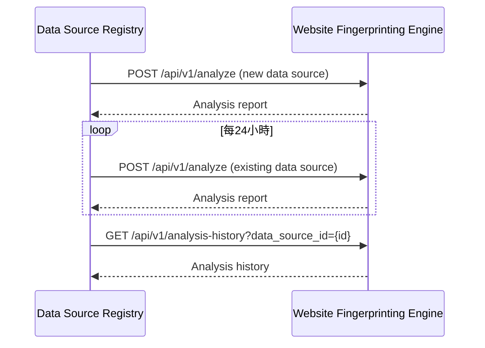
```mermaid
sequenceDiagram
    participant DSR as Data Source Registry
    participant WFE as Website Fingerprinting Engine
    
    DSR->>WFE: POST /api/v1/analyze (new data source)
    WFE-->>DSR: Analysis report
    
    loop 每24小時
        DSR->>WFE: POST /api/v1/analyze (existing data source)
        WFE-->>DSR: Analysis report
    end
    
    DSR->>WFE: GET /api/v1/analysis-history?data_source_id={id}
    WFE-->>DSR: Analysis history
```

#### 2.9.2 與AI輔助開发系統交互

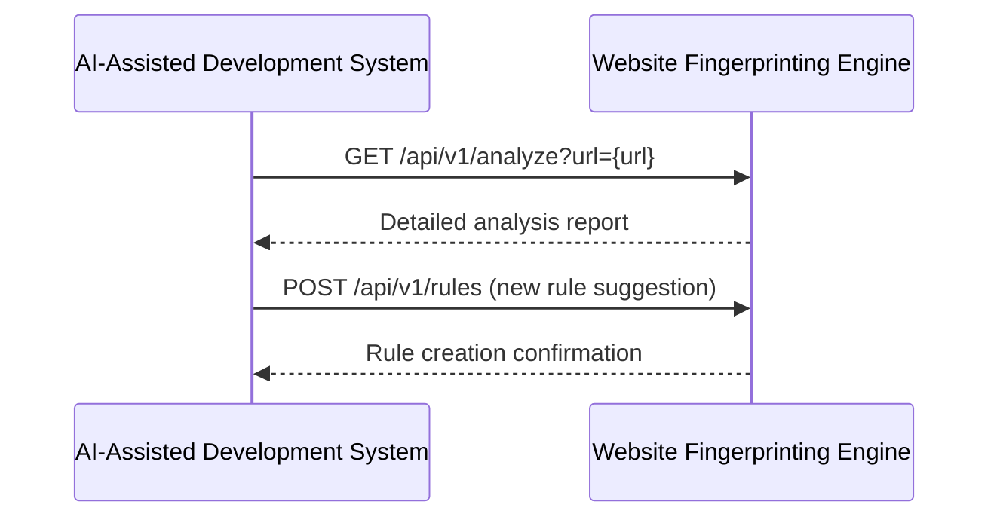
```mermaid
sequenceDiagram
    participant AIDS as AI-Assisted Development System
    participant WFE as Website Fingerprinting Engine
    
    AIDS->>WFE: GET /api/v1/analyze?url={url}
    WFE-->>AIDS: Detailed analysis report
    
    AIDS->>WFE: POST /api/v1/rules (new rule suggestion)
    WFE-->>AIDS: Rule creation confirmation
```

#### 2.9.3 與資料合規與安全中心交互

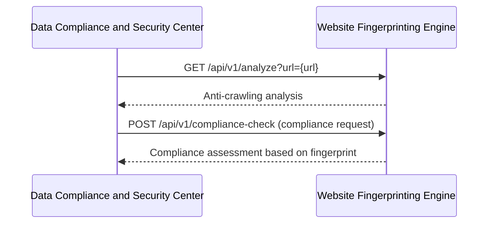
```mermaid
sequenceDiagram
    participant DCS as Data Compliance and Security Center
    participant WFE as Website Fingerprinting Engine
    
    DCS->>WFE: GET /api/v1/analyze?url={url}
    WFE-->>DCS: Anti-crawling analysis
    
    DCS->>WFE: POST /api/v1/compliance-check (compliance request)
    WFE-->>DCS: Compliance assessment based on fingerprint
```

## 3. 資料源健康监测系統 (Data Source Health Monitoring System)

### 3.1 模組概述
資料源健康监测系統負責持續監控所有資料源的可用性、效能和資料品質，及時發現和預警資料源问题。它通過定期探測和智能分析，提供全面的資料源健康狀態视图。

### 3.2 詳細功能清單

#### 3.2.1 核心功能
- **可用性監控**
  - HTTP狀態码監控
  - 響應時間監控
  - 內容验證（關鍵字/正则匹配）
  - SSL證书有效期監控
- **效能監控**
  - 響應時間分布
  - 首字節時間(TTFB)
  - 內容下载時間
  - 資源加载效能
- **資料品質監控**
  - 資料完整性验證
  - 資料格式验證
  - 資料量波動檢測
  - 異常值檢測
- **健康評分系統**
  - 综合健康評分计算
  - 歷史趋势分析
  - 健康狀態預测
- **告警系統**
  - 多级告警阈值配置
  - 智能告警抑制
  - 多通道通知（邮件、Slack、Webhook）

#### 3.2.2 高级功能
- **根因分析**
  - 自動分析故障原因
  - 影响范围評估
  - 修複建議
- **預测性维护**
  - 基於歷史資料的趋势預测
  - 異常模式檢測
  - 預防性告警
- **SLA合規監控**
  - SLA指標跟踪
  - 合規报告生成
  - 服務信用计算
- **變更影响分析**
  - 網站變更檢測
  - 變更對爬蟲的影响評估
  - 自動化配置建議

### 3.3 技術架構

#### 3.3.1 架構图
```
┌───────────────────────────────────────────────────────────────────────────────────────────────┐
│                            資料源健康监测系統 (DSHMS)                                         │
├───────────────────────┬───────────────────────┬───────────────────────────────────────────────┤
│  監控执行层           │  分析處理层           │  資料儲存层                                │
├───────────────────────┼───────────────────────┼───────────────────────────────────────────────┤
│ • 探測调度器           │ • 健康評分计算器      │ • 時序資料庫 (InfluxDB)                    │
│ • HTTP探測器          │ • 異常檢測引擎        │ • 分析结果儲存 (PostgreSQL)                │
│ • 內容验證器           │ • 根因分析器          │ • 告警狀態儲存 (Redis)                     │
│ • 效能分析器           │ • 預测模型            │ • 配置儲存 (PostgreSQL)                    │
└───────────────────────┴───────────────────────┴───────────────────────────────────────────────┘
```

#### 3.3.2 服務边界與交互
- **輸入**：
  - 資料源列表（來自資料源註冊中心）
  - 監控配置（探測频率、验證规则等）
  - 告警通知配置
- **輸出**：
  - 健康狀態指標
  - 告警事件
  - 健康报告
  - 根因分析结果

### 3.4 核心組件詳細實現

#### 3.4.1 探測调度器

**技術實現：**
```python
class ProbeScheduler:
    """探測调度器，負責安排和执行探測任務"""
    
    def __init__(
        self,
        data_source_service: DataSourceService,
        probe_executor: ProbeExecutor,
        config: Config
    ):
        self.data_source_service = data_source_service
        self.probe_executor = probe_executor
        self.config = config
        self.logger = logging.getLogger(__name__)
        self.running = False
        self.scheduler = BackgroundScheduler()
        self.probe_queue = Queue(maxsize=self.config.max_queued_probes)
    
    def start(self):
        """启動探測调度器"""
        if self.running:
            return
        
        self.running = True
        self.logger.info("Starting probe scheduler")
        
        # 启動探測执行器
        self._start_probe_executor()
        
        # 添加定期任務
        self.scheduler.add_job(
            self._schedule_probes,
            'interval',
            seconds=self.config.schedule_interval,
            id='schedule_probes'
        )
        
        # 启動调度器
        self.scheduler.start()
        self.logger.info("Probe scheduler started")
    
    def _start_probe_executor(self):
        """启動探測执行器"""
        def executor_loop():
            while self.running:
                try:
                    # 從隊列獲取探測任務
                    probe_task = self.probe_queue.get(timeout=1)
                    
                    # 执行探測
                    self.probe_executor.execute(probe_task)
                    
                    # 標记任務完成
                    self.probe_queue.task_done()
                    
                except Empty:
                    continue
                except Exception as e:
                    self.logger.error("Error executing probe: %s", str(e))
                    time.sleep(1)
        
        # 启動执行线程
        self.executor_thread = Thread(target=executor_loop, daemon=True)
        self.executor_thread.start()
    
    def _schedule_probes(self):
        """安排探測任務"""
        try:
            # 獲取需要探測的資料源
            data_sources = self._get_data_sources_to_probe()
            
            # 為每個資料源创建探測任務
            for data_source in data_sources:
                probe_task = self._create_probe_task(data_source)
                self._enqueue_probe_task(probe_task)
            
            self.logger.info("Scheduled %d probes", len(data_sources))
            
        except Exception as e:
            self.logger.error("Error scheduling probes: %s", str(e))
    
    def _get_data_sources_to_probe(self) -> List[DataSource]:
        """獲取需要探測的資料源"""
        # 獲取所有active狀態的資料源
        data_sources = self.data_source_service.list_data_sources(
            project_id="all",
            user_id="system",
            filters={"status": "active"},
            page=1,
            page_size=1000
        ).items
        
        # 過滤需要探測的資料源
        now = datetime.utcnow()
        probes_to_schedule = []
        
        for ds in data_sources:
            # 检查上次探測時間
            last_probe = ds.metadata.get("last_probe_time")
            probe_interval = ds.metadata.get("probe_interval", self.config.default_probe_interval)
            
            if not last_probe or (now - datetime.fromisoformat(last_probe)) >= timedelta(seconds=probe_interval):
                probes_to_schedule.append(ds)
        
        return probes_to_schedule
    
    def _create_probe_task(self, data_source: DataSource) -> ProbeTask:
        """创建探測任務"""
        # 獲取探測配置
        probe_config = self._get_probe_config(data_source)
        
        return ProbeTask(
            data_source_id=data_source.id,
            project_id=data_source.project_id,
            url=data_source.url,
            config=probe_config,
            scheduled_time=datetime.utcnow()
        )
    
    def _get_probe_config(self, data_source: DataSource) -> ProbeConfig:
        """獲取探測配置"""
        # 從元資料獲取配置，如果沒有则使用默认值
        metadata = data_source.metadata
        
        return ProbeConfig(
            interval=metadata.get("probe_interval", self.config.default_probe_interval),
            timeout=metadata.get("probe_timeout", self.config.default_timeout),
            verification_rules=metadata.get("verification_rules", []),
            performance_thresholds=metadata.get("performance_thresholds", {}),
            data_validation=metadata.get("data_validation", {})
        )
    
    def _enqueue_probe_task(self, probe_task: ProbeTask):
        """將探測任務加入隊列"""
        try:
            self.probe_queue.put_nowait(probe_task)
        except QueueFull:
            self.logger.warning("Probe queue is full. Dropping probe for %s", probe_task.url)
    
    def stop(self):
        """停止探測调度器"""
        if not self.running:
            return
        
        self.running = False
        self.scheduler.shutdown()
        self.logger.info("Probe scheduler stopped")
```

#### 3.4.2 探測执行器

**技術實現：**
```python
class ProbeExecutor:
    """探測执行器，負責實际执行探測任務"""
    
    def __init__(
        self,
        http_client: HttpClient,
        result_processor: ResultProcessor,
        config: Config
    ):
        self.http_client = http_client
        self.result_processor = result_processor
        self.config = config
        self.logger = logging.getLogger(__name__)
    
    def execute(self, probe_task: ProbeTask):
        """执行探測任務"""
        try:
            start_time = time.time()
            
            # 1. 执行HTTP探測
            http_result = self._execute_http_probe(probe_task)
            
            # 2. 执行內容验證
            validation_result = self._execute_content_validation(probe_task, http_result)
            
            # 3. 执行效能分析
            performance_result = self._execute_performance_analysis(probe_task, http_result)
            
            # 4. 执行資料验證（如果适用）
            data_validation_result = self._execute_data_validation(probe_task, http_result)
            
            # 5. 處理结果
            total_time = time.time() - start_time
            self.result_processor.process(
                probe_task,
                http_result,
                validation_result,
                performance_result,
                data_validation_result,
                total_time
            )
            
        except Exception as e:
            self.logger.error("Error executing probe for %s: %s", probe_task.url, str(e))
            self.result_processor.process_error(probe_task, str(e))
    
    def _execute_http_probe(self, probe_task: ProbeTask) -> HttpProbeResult:
        """执行HTTP探測"""
        start_time = time.time()
        
        try:
            # 准備请求
            headers = self._build_headers(probe_task)
            
            # 执行HTTP请求
            response = self.http_client.get(
                probe_task.url,
                headers=headers,
                timeout=probe_task.config.timeout,
                follow_redirects=True
            )
            
            # 计算時間指標
            dns_time = response.timings.get('dns', 0)
            connect_time = response.timings.get('connect', 0)
            tls_time = response.timings.get('tls', 0)
            ttfb = response.timings.get('first_byte', 0)
            download_time = response.timings.get('download', 0)
            total_time = time.time() - start_time
            
            return HttpProbeResult(
                status_code=response.status_code,
                headers=dict(response.headers),
                content=response.content,
                timings={
                    "dns": dns_time,
                    "connect": connect_time,
                    "tls": tls_time,
                    "ttfb": ttfb,
                    "download": download_time,
                    "total": total_time
                },
                redirect_chain=[r.url for r in response.redirects],
                certificate_info=self._extract_certificate_info(response)
            )
            
        except Exception as e:
            total_time = time.time() - start_time
            return HttpProbeResult(
                status_code=0,
                error=str(e),
                timings={"total": total_time}
            )
    
    def _build_headers(self, probe_task: ProbeTask) -> Dict[str, str]:
        """構建请求头"""
        headers = {
            "User-Agent": self.config.default_user_agent,
            "Accept": "text/html,application/xhtml+xml,application/xml;q=0.9,*/*;q=0.8",
            "Accept-Language": "en-US,en;q=0.5",
            "Connection": "keep-alive"
        }
        
        # 添加自定義请求头
        if probe_task.config.headers:
            headers.update(probe_task.config.headers)
        
        return headers
    
    def _extract_certificate_info(self, response: HttpResponse) -> Dict:
        """提取證书資訊"""
        if not response.certificate:
            return {}
        
        return {
            "issuer": response.certificate.issuer,
            "subject": response.certificate.subject,
            "valid_from": response.certificate.valid_from.isoformat(),
            "valid_to": response.certificate.valid_to.isoformat(),
            "serial_number": response.certificate.serial_number,
            "signature_algorithm": response.certificate.signature_algorithm
        }
    
    def _execute_content_validation(
        self,
        probe_task: ProbeTask,
        http_result: HttpProbeResult
    ) -> ContentValidationResult:
        """执行內容验證"""
        if not probe_task.config.verification_rules or http_result.status_code != 200:
            return ContentValidationResult(
                passed=True,  # 沒有规则或非200響應，视為通過
                errors=[],
                verified_rules=[]
            )
        
        passed = True
        errors = []
        verified_rules = []
        
        # 检查每個验證规则
        for rule in probe_task.config.verification_rules:
            result = self._validate_content_rule(rule, http_result)
            if not result["passed"]:
                passed = False
                errors.append({
                    "rule": rule,
                    "message": result["message"]
                })
            verified_rules.append({
                "rule": rule,
                "passed": result["passed"]
            })
        
        return ContentValidationResult(
            passed=passed,
            errors=errors,
            verified_rules=verified_rules
        )
    
    def _validate_content_rule(
        self,
        rule: Dict,
        http_result: HttpProbeResult
    ) -> Dict:
        """验證单個內容规则"""
        content = http_result.content
        if not content:
            return {"passed": False, "message": "No content to validate"}
        
        try:
            # 解码內容
            content_str = content.decode('utf-8', errors='replace')
            
            # 根據规则類型进行验證
            if rule["type"] == "keyword":
                if rule["keyword"] not in content_str:
                    return {
                        "passed": False,
                        "message": f"Keyword '{rule['keyword']}' not found"
                    }
            
            elif rule["type"] == "regex":
                if not re.search(rule["pattern"], content_str):
                    return {
                        "passed": False,
                        "message": f"Regex pattern '{rule['pattern']}' not matched"
                    }
            
            elif rule["type"] == "xpath":
                # 使用lxml进行XPath验證
                tree = etree.fromstring(content, etree.HTMLParser())
                results = tree.xpath(rule["expression"])
                if not results:
                    return {
                        "passed": False,
                        "message": f"XPath expression '{rule['expression']}' returned no results"
                    }
            
            return {"passed": True}
            
        except Exception as e:
            return {
                "passed": False,
                "message": f"Error validating rule: {str(e)}"
            }
    
    def _execute_performance_analysis(
        self,
        probe_task: ProbeTask,
        http_result: HttpProbeResult
    ) -> PerformanceAnalysisResult:
        """执行效能分析"""
        timings = http_result.timings
        total_time = timings.get("total", 0)
        
        # 检查效能阈值
        thresholds = probe_task.config.performance_thresholds
        performance_issues = []
        
        # 检查总響應時間
        if "total" in thresholds and total_time > thresholds["total"]:
            performance_issues.append({
                "metric": "total_time",
                "value": total_time,
                "threshold": thresholds["total"],
                "severity": "high" if total_time > thresholds["total"] * 2 else "medium"
            })
        
        # 检查TTFB
        ttfb = timings.get("ttfb", 0)
        if "ttfb" in thresholds and ttfb > thresholds["ttfb"]:
            performance_issues.append({
                "metric": "ttfb",
                "value": ttfb,
                "threshold": thresholds["ttfb"],
                "severity": "high" if ttfb > thresholds["ttfb"] * 2 else "medium"
            })
        
        # 检查下载時間
        download_time = timings.get("download", 0)
        if "download" in thresholds and download_time > thresholds["download"]:
            performance_issues.append({
                "metric": "download_time",
                "value": download_time,
                "threshold": thresholds["download"],
                "severity": "medium"
            })
        
        return PerformanceAnalysisResult(
            timings=timings,
            issues=performance_issues,
            passed=len(performance_issues) == 0
        )
    
    def _execute_data_validation(
        self,
        probe_task: ProbeTask,
        http_result: HttpProbeResult
    ) -> DataValidationResult:
        """执行資料验證"""
        if not probe_task.config.data_validation or http_result.status_code != 200:
            return DataValidationResult(
                passed=True,
                issues=[],
                metrics={}
            )
        
        data_validation = probe_task.config.data_validation
        content = http_result.content
        
        if not content:
            return DataValidationResult(
                passed=False,
                issues=[{"type": "empty_content", "message": "No content to validate"}],
                metrics={}
            )
        
        try:
            # 根據內容類型进行验證
            content_type = http_result.headers.get("Content-Type", "")
            
            if "json" in content_type:
                return self._validate_json_data(data_validation, content)
            elif "xml" in content_type:
                return self._validate_xml_data(data_validation, content)
            elif "html" in content_type:
                return self._validate_html_data(data_validation, content)
            else:
                return DataValidationResult(
                    passed=True,
                    issues=[{"type": "unsupported_type", "message": f"Unsupported content type: {content_type}"}],
                    metrics={}
                )
                
        except Exception as e:
            return DataValidationResult(
                passed=False,
                issues=[{"type": "validation_error", "message": str(e)}],
                metrics={}
            )
    
    def _validate_json_data(
        self,
        data_validation: Dict,
        content: bytes
    ) -> DataValidationResult:
        """验證JSON資料"""
        try:
            data = json.loads(content)
            issues = []
            metrics = {}
            
            # 检查資料結構
            if "schema" in data_validation:
                # 使用JSON Schema验證
                try:
                    validate(instance=data, schema=data_validation["schema"])
                except Exception as e:
                    issues.append({
                        "type": "schema_validation",
                        "message": str(e)
                    })
            
            # 检查資料量
            if "min_items" in data_validation:
                if isinstance(data, list) and len(data) < data_validation["min_items"]:
                    issues.append({
                        "type": "data_volume",
                        "message": f"Data volume ({len(data)} items) below minimum ({data_validation['min_items']})"
                    })
                elif isinstance(data, dict) and len(data) < data_validation["min_items"]:
                    issues.append({
                        "type": "data_volume",
                        "message": f"Data volume ({len(data)} items) below minimum ({data_validation['min_items']})"
                    })
            
            # 计算指標
            if isinstance(data, list):
                metrics["item_count"] = len(data)
            elif isinstance(data, dict):
                metrics["field_count"] = len(data)
            
            return DataValidationResult(
                passed=len(issues) == 0,
                issues=issues,
                metrics=metrics
            )
            
        except json.JSONDecodeError as e:
            return DataValidationResult(
                passed=False,
                issues=[{"type": "json_error", "message": str(e)}],
                metrics={}
            )
    
    def _validate_xml_data(
        self,
        data_validation: Dict,
        content: bytes
    ) -> DataValidationResult:
        """验證XML資料"""
        # XML验證實現（简化）
        try:
            tree = etree.fromstring(content)
            issues = []
            metrics = {}
            
            # 检查元素數量
            if "min_elements" in data_validation:
                element_count = len(tree.xpath("//node()"))
                if element_count < data_validation["min_elements"]:
                    issues.append({
                        "type": "data_volume",
                        "message": f"Element count ({element_count}) below minimum ({data_validation['min_elements']})"
                    })
                metrics["element_count"] = element_count
            
            return DataValidationResult(
                passed=len(issues) == 0,
                issues=issues,
                metrics=metrics
            )
            
        except etree.XMLSyntaxError as e:
            return DataValidationResult(
                passed=False,
                issues=[{"type": "xml_error", "message": str(e)}],
                metrics={}
            )
    
    def _validate_html_data(
        self,
        data_validation: Dict,
        content: bytes
    ) -> DataValidationResult:
        """验證HTML資料"""
        # HTML验證實現（简化）
        try:
            soup = BeautifulSoup(content, 'html.parser')
            issues = []
            metrics = {}
            
            # 检查特定元素
            if "required_elements" in data_validation:
                for selector in data_validation["required_elements"]:
                    if not soup.select(selector):
                        issues.append({
                            "type": "missing_element",
                            "message": f"Required element '{selector}' not found"
                        })
            
            # 计算指標
            metrics["link_count"] = len(soup.find_all('a'))
            metrics["image_count"] = len(soup.find_all('img'))
            
            return DataValidationResult(
                passed=len(issues) == 0,
                issues=issues,
                metrics=metrics
            )
            
        except Exception as e:
            return DataValidationResult(
                passed=False,
                issues=[{"type": "html_error", "message": str(e)}],
                metrics={}
            )
```

#### 3.4.3 结果處理器

**技術實現：**
```python
class ResultProcessor:
    """结果處理器，負責處理探測结果並更新健康狀態"""
    
    def __init__(
        self,
        data_source_service: DataSourceService,
        alert_service: AlertService,
        metrics_service: MetricsService,
        config: Config
    ):
        self.data_source_service = data_source_service
        self.alert_service = alert_service
        self.metrics_service = metrics_service
        self.config = config
        self.logger = logging.getLogger(__name__)
    
    def process(
        self,
        probe_task: ProbeTask,
        http_result: HttpProbeResult,
        validation_result: ContentValidationResult,
        performance_result: PerformanceAnalysisResult,
        data_validation_result: DataValidationResult,
        total_time: float
    ):
        """處理探測结果"""
        # 1. 计算健康評分
        health_score = self._calculate_health_score(
            http_result,
            validation_result,
            performance_result,
            data_validation_result
        )
        
        # 2. 更新資料源健康狀態
        self._update_data_source_health(
            probe_task,
            http_result,
            health_score,
            total_time
        )
        
        # 3. 處理告警
        self._process_alerts(
            probe_task,
            http_result,
            health_score,
            validation_result,
            performance_result,
            data_validation_result
        )
        
        # 4. 儲存指標
        self._store_metrics(
            probe_task,
            http_result,
            validation_result,
            performance_result,
            data_validation_result,
            health_score
        )
    
    def _calculate_health_score(
        self,
        http_result: HttpProbeResult,
        validation_result: ContentValidationResult,
        performance_result: PerformanceAnalysisResult,
        data_validation_result: DataValidationResult
    ) -> float:
        """计算健康評分"""
        # 基礎分（基於HTTP狀態码）
        base_score = self._calculate_base_score(http_result)
        
        # 验證分
        validation_score = self._calculate_validation_score(validation_result)
        
        # 效能分
        performance_score = self._calculate_performance_score(performance_result)
        
        # 資料品質分
        data_score = self._calculate_data_score(data_validation_result)
        
        # 加权计算
        weights = self.config.health_score_weights
        total_score = (
            base_score * weights["base"] +
            validation_score * weights["validation"] +
            performance_score * weights["performance"] +
            data_score * weights["data"]
        ) / sum(weights.values())
        
        return max(0.0, min(1.0, total_score))
    
    def _calculate_base_score(self, http_result: HttpProbeResult) -> float:
        """计算基礎分（基於HTTP狀態码）"""
        if http_result.status_code == 0:
            return 0.0  # 連接错误
        
        if 200 <= http_result.status_code < 300:
            return 1.0
        
        if 300 <= http_result.status_code < 400:
            return 0.8  # 重定向
        
        if 400 <= http_result.status_code < 500:
            return 0.3  # 客户端错误
        
        return 0.1  # 服務端错误
    
    def _calculate_validation_score(self, validation_result: ContentValidationResult) -> float:
        """计算验證分"""
        if not validation_result.verified_rules:
            return 1.0  # 沒有验證规则
        
        passed_count = sum(1 for r in validation_result.verified_rules if r["passed"])
        return passed_count / len(validation_result.verified_rules)
    
    def _calculate_performance_score(self, performance_result: PerformanceAnalysisResult) -> float:
        """计算效能分"""
        if not performance_result.issues:
            return 1.0
        
        # 根據问题严重程度计算
        severity_weights = {"low": 0.1, "medium": 0.3, "high": 0.7}
        total_deduction = 0
        
        for issue in performance_result.issues:
            total_deduction += severity_weights.get(issue["severity"], 0.2)
        
        return max(0.0, 1.0 - total_deduction)
    
    def _calculate_data_score(self, data_validation_result: DataValidationResult) -> float:
        """计算資料品質分"""
        if not data_validation_result.issues:
            return 1.0
        
        # 简单實現：根據问题數量计算
        return max(0.0, 1.0 - (len(data_validation_result.issues) * 0.2))
    
    def _update_data_source_health(
        self,
        probe_task: ProbeTask,
        http_result: HttpProbeResult,
        health_score: float,
        total_time: float
    ):
        """更新資料源健康狀態"""
        # 准備更新資料
        update_data = {
            "last_health_check": datetime.utcnow().isoformat(),
            "health_score": health_score,
            "availability_24h": self._calculate_24h_availability(probe_task.data_source_id, health_score),
            "availability_7d": self._calculate_7d_availability(probe_task.data_source_id, health_score),
            "response_time_p50": self._calculate_p50_response_time(probe_task.data_source_id, total_time),
            "response_time_p95": self._calculate_p95_response_time(probe_task.data_source_id, total_time),
            "status": self._determine_status(health_score)
        }
        
        # 更新資料源
        self.data_source_service.update_data_source(
            data_source_id=probe_task.data_source_id,
            project_id=probe_task.project_id,
            updates=update_data,
            user_id="system"
        )
    
    def _calculate_24h_availability(
        self,
        data_source_id: str,
        current_score: float
    ) -> float:
        """计算24小時可用性"""
        # 獲取過去24小時的歷史記錄
        history = self.metrics_service.get_health_history(
            data_source_id,
            start_time=datetime.utcnow() - timedelta(hours=24),
            end_time=datetime.utcnow(),
            limit=1000
        )
        
        # 添加當前分數
        scores = [h["score"] for h in history] + [current_score]
        
        # 计算平均值
        return sum(scores) / len(scores) if scores else 1.0
    
    def _calculate_7d_availability(
        self,
        data_source_id: str,
        current_score: float
    ) -> float:
        """计算7天可用性"""
        # 獲取過去7天的歷史記錄（每天一個样本）
        history = self.metrics_service.get_health_history(
            data_source_id,
            start_time=datetime.utcnow() - timedelta(days=7),
            end_time=datetime.utcnow(),
            interval="1d",
            limit=7
        )
        
        # 添加當前分數
        scores = [h["score"] for h in history] + [current_score]
        
        # 计算平均值
        return sum(scores) / len(scores) if scores else 1.0
    
    def _calculate_p50_response_time(
        self,
        data_source_id: str,
        current_time: float
    ) -> float:
        """计算P50響應時間"""
        # 獲取過去1小時的響應時間
        history = self.metrics_service.get_response_times(
            data_source_id,
            start_time=datetime.utcnow() - timedelta(hours=1),
            limit=100
        )
        
        # 添加當前時間
        times = [h["time"] for h in history] + [current_time]
        
        # 计算P50
        return np.percentile(times, 50) if times else current_time
    
    def _calculate_p95_response_time(
        self,
        data_source_id: str,
        current_time: float
    ) -> float:
        """计算P95響應時間"""
        # 獲取過去1小時的響應時間
        history = self.metrics_service.get_response_times(
            data_source_id,
            start_time=datetime.utcnow() - timedelta(hours=1),
            limit=100
        )
        
        # 添加當前時間
        times = [h["time"] for h in history] + [current_time]
        
        # 计算P95
        return np.percentile(times, 95) if times else current_time
    
    def _determine_status(self, health_score: float) -> str:
        """确定健康狀態"""
        if health_score >= self.config.status_thresholds["healthy"]:
            return "healthy"
        elif health_score >= self.config.status_thresholds["degraded"]:
            return "degraded"
        else:
            return "unhealthy"
    
    def _process_alerts(
        self,
        probe_task: ProbeTask,
        http_result: HttpProbeResult,
        health_score: float,
        validation_result: ContentValidationResult,
        performance_result: PerformanceAnalysisResult,
        data_validation_result: DataValidationResult
    ):
        """處理告警"""
        # 1. 检查是否需要触发告警
        alert_needed = self._should_trigger_alert(
            probe_task.data_source_id,
            health_score,
            http_result
        )
        
        if not alert_needed:
            # 2. 检查是否需要解决告警
            self._check_alert_resolution(probe_task.data_source_id, health_score)
            return
        
        # 3. 创建告警
        alert = self._create_alert(
            probe_task,
            http_result,
            health_score,
            validation_result,
            performance_result,
            data_validation_result
        )
        
        # 4. 触发告警
        self.alert_service.trigger_alert(alert)
    
    def _should_trigger_alert(
        self,
        data_source_id: str,
        health_score: float,
        http_result: HttpProbeResult
    ) -> bool:
        """检查是否需要触发告警"""
        # 獲取當前告警狀態
        current_alert = self.alert_service.get_current_alert(data_source_id)
        
        # 如果已经有活跃告警，不需要新告警
        if current_alert and current_alert["status"] == "active":
            return False
        
        # 检查健康分數是否低於阈值
        if health_score >= self.config.alert_thresholds["health_score"]:
            return False
        
        # 检查HTTP狀態码
        if http_result.status_code == 0 or http_result.status_code >= 500:
            return True
        
        # 检查連續失败次數
        failure_count = self._get_consecutive_failures(data_source_id)
        return failure_count >= self.config.alert_thresholds["consecutive_failures"]
    
    def _get_consecutive_failures(self, data_source_id: str) -> int:
        """獲取連續失败次數"""
        history = self.metrics_service.get_health_history(
            data_source_id,
            start_time=datetime.utcnow() - timedelta(hours=1),
            limit=10
        )
        
        consecutive_failures = 0
        for record in reversed(history):
            if record["score"] < self.config.status_thresholds["degraded"]:
                consecutive_failures += 1
            else:
                break
        
        return consecutive_failures
    
    def _check_alert_resolution(
        self,
        data_source_id: str,
        health_score: float
    ):
        """检查告警是否已解决"""
        current_alert = self.alert_service.get_current_alert(data_source_id)
        
        # 沒有活跃告警，无需處理
        if not current_alert or current_alert["status"] != "active":
            return
        
        # 检查健康分數是否恢復
        if health_score < self.config.alert_resolution_threshold:
            return
        
        # 检查連續成功次數
        success_count = self._get_consecutive_successes(data_source_id)
        if success_count < self.config.alert_resolution_min_success:
            return
        
        # 解决告警
        self.alert_service.resolve_alert(
            alert_id=current_alert["id"],
            resolution_details={
                "health_score": health_score,
                "consecutive_successes": success_count
            }
        )
    
    def _get_consecutive_successes(self, data_source_id: str) -> int:
        """獲取連續成功次數"""
        history = self.metrics_service.get_health_history(
            data_source_id,
            start_time=datetime.utcnow() - timedelta(hours=1),
            limit=10
        )
        
        consecutive_successes = 0
        for record in reversed(history):
            if record["score"] >= self.config.status_thresholds["degraded"]:
                consecutive_successes += 1
            else:
                break
        
        return consecutive_successes
    
    def _create_alert(
        self,
        probe_task: ProbeTask,
        http_result: HttpProbeResult,
        health_score: float,
        validation_result: ContentValidationResult,
        performance_result: PerformanceAnalysisResult,
        data_validation_result: DataValidationResult
    ) -> Alert:
        """创建告警"""
        # 确定告警级别
        severity = self._determine_alert_severity(
            health_score,
            http_result,
            validation_result,
            performance_result
        )
        
        # 生成告警消息
        message = self._generate_alert_message(
            probe_task,
            http_result,
            health_score,
            severity
        )
        
        return Alert(
            data_source_id=probe_task.data_source_id,
            project_id=probe_task.project_id,
            url=probe_task.url,
            severity=severity,
            message=message,
            details={
                "health_score": health_score,
                "status_code": http_result.status_code,
                "validation_issues": validation_result.errors,
                "performance_issues": performance_result.issues,
                "data_issues": data_validation_result.issues
            },
            timestamp=datetime.utcnow()
        )
    
    def _determine_alert_severity(
        self,
        health_score: float,
        http_result: HttpProbeResult,
        validation_result: ContentValidationResult,
        performance_result: PerformanceAnalysisResult
    ) -> str:
        """确定告警级别"""
        # 基於HTTP狀態码
        if http_result.status_code == 0:
            return "critical"
        if http_result.status_code >= 500:
            return "critical"
        if http_result.status_code >= 400:
            return "high"
        
        # 基於健康分數
        if health_score < self.config.severity_thresholds["critical"]:
            return "critical"
        if health_score < self.config.severity_thresholds["high"]:
            return "high"
        if health_score < self.config.severity_thresholds["medium"]:
            return "medium"
        
        # 基於验證问题
        if validation_result.errors:
            return "medium"
        
        # 基於效能问题
        if any(issue["severity"] == "high" for issue in performance_result.issues):
            return "high"
        if any(issue["severity"] == "medium" for issue in performance_result.issues):
            return "medium"
        
        return "low"
    
    def _generate_alert_message(
        self,
        probe_task: ProbeTask,
        http_result: HttpProbeResult,
        health_score: float,
        severity: str
    ) -> str:
        """生成告警消息"""
        if http_result.status_code == 0:
            return f"Connection failed to {probe_task.url}"
        if http_result.status_code >= 500:
            return f"Server error ({http_result.status_code}) for {probe_task.url}"
        if http_result.status_code >= 400:
            return f"Client error ({http_result.status_code}) for {probe_task.url}"
        
        if health_score < self.config.severity_thresholds["critical"]:
            return f"Critical health issue for {probe_task.url} (score: {health_score:.2f})"
        if health_score < self.config.severity_thresholds["high"]:
            return f"High severity issue for {probe_task.url} (score: {health_score:.2f})"
        
        return f"Health issue for {probe_task.url} (score: {health_score:.2f})"
    
    def _store_metrics(
        self,
        probe_task: ProbeTask,
        http_result: HttpProbeResult,
        validation_result: ContentValidationResult,
        performance_result: PerformanceAnalysisResult,
        data_validation_result: DataValidationResult,
        health_score: float
    ):
        """儲存指標"""
        timestamp = datetime.utcnow()
        
        # 儲存健康指標
        self.metrics_service.store_health_metric(
            data_source_id=probe_task.data_source_id,
            score=health_score,
            timestamp=timestamp
        )
        
        # 儲存響應時間指標
        if "total" in http_result.timings:
            self.metrics_service.store_response_time(
                data_source_id=probe_task.data_source_id,
                response_time=http_result.timings["total"],
                timestamp=timestamp
            )
        
        # 儲存可用性指標
        is_available = 1 if (200 <= http_result.status_code < 400) else 0
        self.metrics_service.store_availability(
            data_source_id=probe_task.data_source_id,
            is_available=is_available,
            timestamp=timestamp
        )
        
        # 儲存验證指標
        self.metrics_service.store_validation_metrics(
            data_source_id=probe_task.data_source_id,
            passed=validation_result.passed,
            issue_count=len(validation_result.errors),
            timestamp=timestamp
        )
        
        # 儲存效能指標
        self.metrics_service.store_performance_metrics(
            data_source_id=probe_task.data_source_id,
            metrics=performance_result.timings,
            issue_count=len(performance_result.issues),
            timestamp=timestamp
        )
        
        # 儲存資料品質指標
        self.metrics_service.store_data_metrics(
            data_source_id=probe_task.data_source_id,
            passed=data_validation_result.passed,
            issue_count=len(data_validation_result.issues),
            metrics=data_validation_result.metrics,
            timestamp=timestamp
        )
    
    def process_error(self, probe_task: ProbeTask, error: str):
        """處理探測错误"""
        self.logger.error("Probe error for %s: %s", probe_task.url, error)
        
        # 更新資料源狀態
        update_data = {
            "last_health_check": datetime.utcnow().isoformat(),
            "health_score": 0.0,
            "status": "unhealthy"
        }
        
        try:
            self.data_source_service.update_data_source(
                data_source_id=probe_task.data_source_id,
                project_id=probe_task.project_id,
                updates=update_data,
                user_id="system"
            )
        except Exception as e:
            self.logger.error("Error updating data source health: %s", str(e))
        
        # 触发告警
        alert = Alert(
            data_source_id=probe_task.data_source_id,
            project_id=probe_task.project_id,
            url=probe_task.url,
            severity="critical",
            message=f"Probe failed: {error}",
            details={"error": error},
            timestamp=datetime.utcnow()
        )
        self.alert_service.trigger_alert(alert)
        
        # 儲存错误指標
        self.metrics_service.store_health_metric(
            data_source_id=probe_task.data_source_id,
            score=0.0,
            timestamp=datetime.utcnow()
        )
```

### 3.5 資料模型詳細定義

#### 3.5.1 健康指標表

```sql
-- 健康指標表（時序資料）
CREATE TABLE health_metrics (
    time TIMESTAMPTZ NOT NULL,
    data_source_id UUID NOT NULL REFERENCES data_sources(id) ON DELETE CASCADE,
    health_score DOUBLE PRECISION NOT NULL,
    response_time DOUBLE PRECISION,
    is_available BOOLEAN NOT NULL,
    
    -- 索引
    INDEX idx_health_metrics_ds ON health_metrics(data_source_id),
    INDEX idx_health_metrics_time ON health_metrics(time DESC)
);

-- 创建分区（按月）
SELECT create_hypertable('health_metrics', 'time', partitioning_column => 'data_source_id', number_partitions => 4);

-- 健康歷史表（汇总資料）
CREATE TABLE health_history (
    id UUID PRIMARY KEY DEFAULT gen_random_uuid(),
    data_source_id UUID NOT NULL REFERENCES data_sources(id) ON DELETE CASCADE,
    period_start TIMESTAMPTZ NOT NULL,
    period_end TIMESTAMPTZ NOT NULL,
    health_score DOUBLE PRECISION NOT NULL,
    availability DOUBLE PRECISION NOT NULL,
    avg_response_time DOUBLE PRECISION,
    min_response_time DOUBLE PRECISION,
    max_response_time DOUBLE PRECISION,
    validation_pass_rate DOUBLE PRECISION,
    performance_issues INT NOT NULL DEFAULT 0,
    data_issues INT NOT NULL DEFAULT 0,
    
    -- 索引
    UNIQUE (data_source_id, period_start, period_end),
    INDEX idx_health_history_ds ON health_history(data_source_id),
    INDEX idx_health_history_period ON health_history(period_start DESC)
);
```

#### 3.5.2 告警表

```sql
-- 告警表
CREATE TABLE alerts (
    id UUID PRIMARY KEY DEFAULT gen_random_uuid(),
    data_source_id UUID NOT NULL REFERENCES data_sources(id) ON DELETE CASCADE,
    project_id UUID NOT NULL REFERENCES projects(id) ON DELETE CASCADE,
    url VARCHAR(2048) NOT NULL,
    severity VARCHAR(20) NOT NULL CHECK (severity IN ('low', 'medium', 'high', 'critical')),
    message TEXT NOT NULL,
    details JSONB,
    status VARCHAR(20) NOT NULL CHECK (status IN ('active', 'resolved', 'suppressed')) DEFAULT 'active',
    created_at TIMESTAMPTZ NOT NULL DEFAULT NOW(),
    resolved_at TIMESTAMPTZ,
    resolved_by UUID REFERENCES users(id) ON DELETE SET NULL,
    resolution_details JSONB,
    
    -- 索引
    INDEX idx_alerts_data_source ON alerts(data_source_id),
    INDEX idx_alerts_status ON alerts(status),
    INDEX idx_alerts_created ON alerts(created_at DESC),
    INDEX idx_alerts_resolved ON alerts(resolved_at DESC)
);

-- 告警通知表
CREATE TABLE alert_notifications (
    id UUID PRIMARY KEY DEFAULT gen_random_uuid(),
    alert_id UUID NOT NULL REFERENCES alerts(id) ON DELETE CASCADE,
    channel VARCHAR(50) NOT NULL,
    sent_at TIMESTAMPTZ NOT NULL DEFAULT NOW(),
    status VARCHAR(20) NOT NULL CHECK (status IN ('pending', 'sent', 'failed')),
    status_message TEXT,
    
    -- 索引
    INDEX idx_notifications_alert ON alert_notifications(alert_id),
    INDEX idx_notifications_channel ON alert_notifications(channel),
    INDEX idx_notifications_sent ON alert_notifications(sent_at DESC)
);
```

### 3.6 API詳細規範

#### 3.6.1 健康监测API

**獲取資料源健康狀態 (GET /api/v1/health/data-sources/{id})**

*请求示例:*
```http
GET /api/v1/health/data-sources/ds-7a8b9c0d HTTP/1.1
Host: dshms.mirror-realm.com
Authorization: Bearer <access_token>
```

*成功響應示例:*
```http
HTTP/1.1 200 OK
Content-Type: application/json

{
  "data_source_id": "ds-7a8b9c0d",
  "url": "https://api.instagram.com/v1/users/self/media/recent",
  "status": "healthy",
  "health_score": 0.95,
  "availability_24h": 0.98,
  "availability_7d": 0.95,
  "response_time_p50": 0.35,
  "response_time_p95": 1.2,
  "last_check": "2023-06-15T10:35:20Z",
  "metrics": {
    "http_status": 200,
    "content_validation": {
      "passed": true,
      "issues": []
    },
    "performance": {
      "timings": {
        "dns": 0.02,
        "connect": 0.05,
        "tls": 0.1,
        "ttfb": 0.25,
        "download": 0.1,
        "total": 0.45
      },
      "issues": []
    },
    "data_validation": {
      "passed": true,
      "issues": [],
      "metrics": {
        "item_count": 20
      }
    }
  }
}
```

**獲取健康歷史 (GET /api/v1/health/history/{id})**

*请求示例:*
```http
GET /api/v1/health/history/ds-7a8b9c0d?start=2023-06-01T00:00:00Z&end=2023-06-15T23:59:59Z&interval=1d HTTP/1.1
Host: dshms.mirror-realm.com
Authorization: Bearer <access_token>
```

*成功響應示例:*
```http
HTTP/1.1 200 OK
Content-Type: application/json

{
  "data_source_id": "ds-7a8b9c0d",
  "interval": "1d",
  "start": "2023-06-01T00:00:00Z",
  "end": "2023-06-15T23:59:59Z",
  "history": [
    {
      "timestamp": "2023-06-01T00:00:00Z",
      "health_score": 0.92,
      "availability": 0.95,
      "response_time_avg": 0.42,
      "response_time_p95": 1.5
    },
    {
      "timestamp": "2023-06-02T00:00:00Z",
      "health_score": 0.94,
      "availability": 0.97,
      "response_time_avg": 0.38,
      "response_time_p95": 1.3
    },
    // ... 更多資料点
  ]
}
```

#### 3.6.2 告警API

**獲取活跃告警 (GET /api/v1/alerts/active)**

*请求示例:*
```http
GET /api/v1/alerts/active?project_id=proj-123 HTTP/1.1
Host: dshms.mirror-realm.com
Authorization: Bearer <access_token>
```

*成功響應示例:*
```http
HTTP/1.1 200 OK
Content-Type: application/json

{
  "items": [
    {
      "id": "alert-1a2b3c4d",
      "data_source_id": "ds-1b2c3d4e",
      "url": "https://api.twitter.com/2/users/me/tweets",
      "severity": "high",
      "message": "High severity issue for https://api.twitter.com/2/users/me/tweets (score: 0.65)",
      "details": {
        "health_score": 0.65,
        "status_code": 429,
        "validation_issues": [],
        "performance_issues": [
          {
            "metric": "total_time",
            "value": 3.5,
            "threshold": 2.0,
            "severity": "high"
          }
        ],
        "data_issues": []
      },
      "status": "active",
      "created_at": "2023-06-15T10:30:45Z"
    }
  ],
  "total": 1
}
```

**解决告警 (POST /api/v1/alerts/{id}/resolve)**

*请求示例:*
```http
POST /api/v1/alerts/alert-1a2b3c4d/resolve HTTP/1.1
Host: dshms.mirror-realm.com
Authorization: Bearer <access_token>
Content-Type: application/json

{
  "resolution_notes": "Issue resolved by increasing rate limit"
}
```

*成功響應示例:*
```http
HTTP/1.1 200 OK
Content-Type: application/json

{
  "id": "alert-1a2b3c4d",
  "status": "resolved",
  "resolved_at": "2023-06-15T10:45:30Z",
  "resolved_by": "user-123",
  "resolution_details": {
    "resolution_notes": "Issue resolved by increasing rate limit",
    "health_score": 0.92,
    "consecutive_successes": 10
  }
}
```

### 3.7 效能優化策略

#### 3.7.1 時序資料儲存優化

1. **Hypertable分区**
   ```sql
   -- 创建按資料源ID分区的Hypertable
   SELECT create_hypertable('health_metrics', 'time', partitioning_column => 'data_source_id', number_partitions => 4);
   
   -- 添加压缩策略
   ALTER TABLE health_metrics SET (timescaledb.compress, timescaledb.compress_segmentby = 'data_source_id');
   SELECT add_compression_policy('health_metrics', INTERVAL '7 days');
   ```

2. **資料保留策略**
   ```sql
   -- 保留原始資料7天
   SELECT add_retention_policy('health_metrics', INTERVAL '7 days');
   
   -- 為更長期資料创建連續聚合
   CREATE MATERIALIZED VIEW health_daily
   WITH (timescaledb.continuous) AS
   SELECT
       time_bucket('1 day', time) AS bucket,
       data_source_id,
       AVG(health_score) AS avg_health,
       AVG(response_time) AS avg_response_time,
       AVG(is_available::int) AS availability
   FROM health_metrics
   GROUP BY bucket, data_source_id
   WITH DATA;
   ```

#### 3.7.2 告警處理優化

1. **告警抑制策略**
   ```python
   def should_suppress_alert(alert: Alert) -> bool:
       """检查是否应该抑制告警"""
       # 相同資料源的重複告警抑制
       recent_alerts = get_recent_alerts(
           data_source_id=alert.data_source_id,
           since=datetime.utcnow() - timedelta(minutes=5)
       )
       if len(recent_alerts) > 2:
           return True
       
       # 维护窗口抑制
       if is_in_maintenance_window(alert.data_source_id):
           return True
       
       # 已知问题抑制
       if is_known_issue(alert):
           return True
       
       return False
   ```

2. **告警聚合**
   ```python
   def aggregate_similar_alerts(alerts: List[Alert]) -> List[AlertGroup]:
       """聚合相似告警"""
       # 按資料源和严重程度分組
       groups = defaultdict(list)
       for alert in alerts:
           key = (alert.data_source_id, alert.severity)
           groups[key].append(alert)
       
       # 创建聚合组
       alert_groups = []
       for (ds_id, severity), group_alerts in groups.items():
           first_alert = min(group_alerts, key=lambda a: a.created_at)
           last_alert = max(group_alerts, key=lambda a: a.created_at)
           
           alert_groups.append(AlertGroup(
               data_source_id=ds_id,
               severity=severity,
               count=len(group_alerts),
               first_occurrence=first_alert.created_at,
               last_occurrence=last_alert.created_at,
               sample_alert=first_alert
           ))
       
       return alert_groups
   ```

### 3.8 安全考慮

#### 3.8.1 探測安全

1. **探測限制**
   - 限制探測频率，避免被目標網站封禁
   - 實現隨机化探測间隔
   - 支援自定義User-Agent轮换

2. **目標網站保护**
   - 尊重robots.txt
   - 實現Crawl-Delay遵守
   - 避免高负载探測

#### 3.8.2 資料安全

1. **敏感資料處理**
   - 不儲存響應內容（除非必要）
   - 對儲存的內容进行脱敏
   - 限制敏感資料訪問

2. **隐私合規**
   - 符合GDPR要求
   - 提供資料删除选项
   - 限制資料保留時間

### 3.9 與其他模組的交互

#### 3.9.1 與資料源註冊中心交互


```mermaid
sequenceDiagram
    participant DSR as Data Source Registry
    participant DSHMS as Data Source Health Monitoring System
    
    DSHMS->>DSR: GET /api/v1/data-sources?status=active
    DSR-->>DSHMS: Active data sources list
    
    loop 每5分钟
        DSHMS->>DSR: POST /api/v1/data-sources/{id}/health
        DSR-->>DSHMS: Acknowledgement
    end
    
    DSR->>DSHMS: GET /api/v1/health/data-sources/{id}
    DSHMS-->>DSR: Health status and metrics
```

#### 3.9.2 與資料處理工作流引擎交互

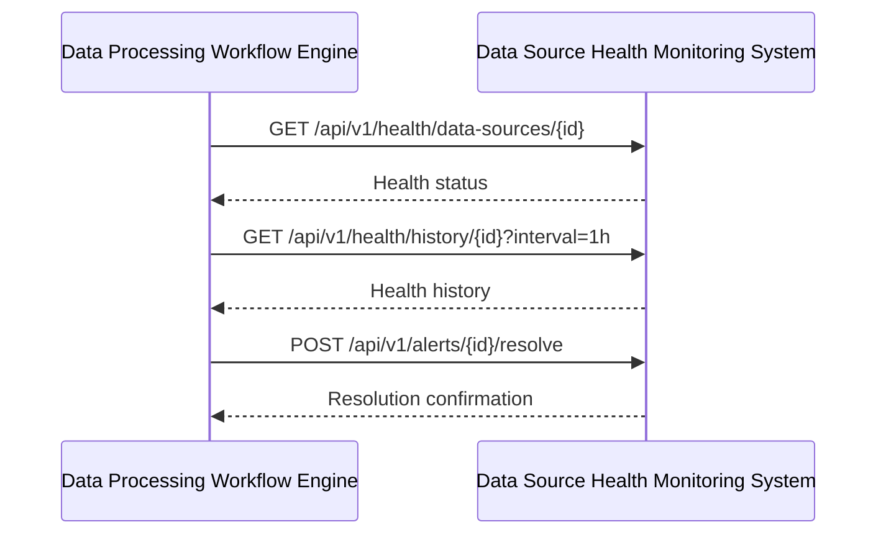
```mermaid
sequenceDiagram
    participant DPWE as Data Processing Workflow Engine
    participant DSHMS as Data Source Health Monitoring System
    
    DPWE->>DSHMS: GET /api/v1/health/data-sources/{id}
    DSHMS-->>DPWE: Health status
    
    DPWE->>DSHMS: GET /api/v1/health/history/{id}?interval=1h
    DSHMS-->>DPWE: Health history
    
    DPWE->>DSHMS: POST /api/v1/alerts/{id}/resolve
    DSHMS-->>DPWE: Resolution confirmation
```

#### 3.9.3 與資料品質預测分析系統交互

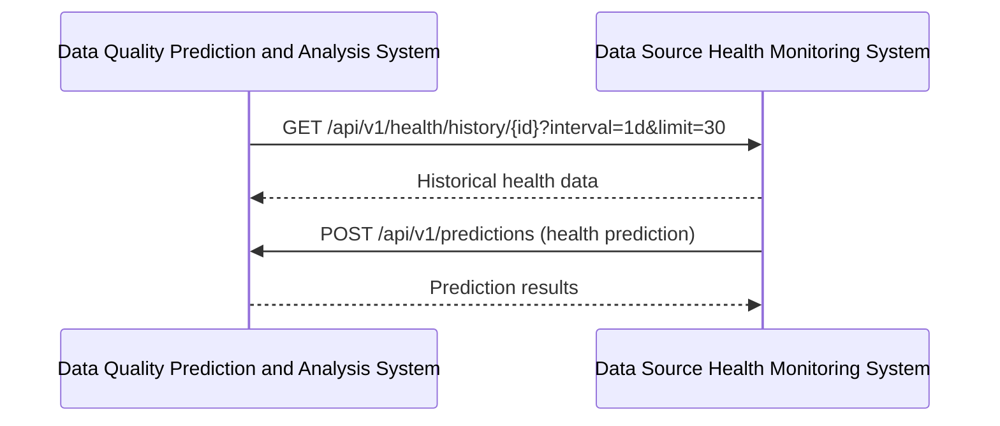
```mermaid
sequenceDiagram
    participant DQPAS as Data Quality Prediction and Analysis System
    participant DSHMS as Data Source Health Monitoring System
    
    DQPAS->>DSHMS: GET /api/v1/health/history/{id}?interval=1d&limit=30
    DSHMS-->>DQPAS: Historical health data
    
    DSHMS->>DQPAS: POST /api/v1/predictions (health prediction)
    DQPAS-->>DSHMS: Prediction results
```

## 4. 資料處理工作流引擎 (Data Processing Workflow Engine)

### 4.1 模組概述
資料處理工作流引擎是镜界平台的核心自動化組件，提供可视化工作流設計和执行能力。它支援從简单触发到複杂資料處理流水线的完整工作流管理，是實現資料採集、處理和分析自動化的關鍵。

### 4.2 詳細功能清單

#### 4.2.1 核心功能
- **工作流定義管理**
  - 可视化工作流設計器
  - 工作流版本控制
  - 工作流模板庫
  - 工作流导入/导出
- **触发器管理**
  - 定時触发器
  - 文件系統触发器（監控NAS）
  - API触发器（Webhook）
  - 條件触发器
- **節点類型支援**
  - 資料源節点（獲取資料）
  - 處理節点（資料转换、清洗）
  - AI節点（調用AI服務）
  - 儲存節点（保存结果）
  - 條件節点（分支逻辑）
  - 循环節点
- **工作流执行**
  - 同步/异步执行
  - 执行狀態跟踪
  - 执行日志記錄
  - 执行结果查看
- **错误處理**
  - 自動重试機制
  - 错误分類與處理
  - 失败通知
  - 手動重试

#### 4.2.2 高级功能
- **工作流调试**
  - 单步执行
  - 断点设置
  - 变量检查
  - 执行回放
- **資源管理**
  - 資源需求定義
  - 資源配额管理
  - 動态資源分配
  - 資源使用監控
- **工作流分析**
  - 执行效能分析
  - 瓶颈识别
  - 優化建議
  - 成本分析
- **工作流共享與协作**
  - 工作流分享
  - 协作编辑
  - 评论與反馈
  - 權限管理

### 4.3 技術架構

#### 4.3.1 架構图
```
┌───────────────────────────────────────────────────────────────────────────────────────────────┐
│                             資料處理工作流引擎 (DPWE)                                         │
├───────────────────────┬───────────────────────┬───────────────────────────────────────────────┤
│  前端交互层           │  服務层               │  执行层                                    │
├───────────────────────┼───────────────────────┼───────────────────────────────────────────────┤
│ • 工作流設計器         │ • 工作流管理服務      │ • 调度器                                  │
│ • 执行監控界面        │ • 触发器服務          │ • 節点执行器                              │
│ • 调试工具            │ • 执行服務            │ • 資源管理器                              │
│ • 分析仪表盘          │ • 错误處理服務        │ • 日志收集器                              │
└───────────────────────┴───────────────────────┴───────────────────────────────────────────────┘
```

#### 4.3.2 服務边界與交互
- **輸入**：
  - 工作流定義（來自用戶或API）
  - 触发事件（定時、文件系統、Webhook等）
  - 節点执行请求
- **輸出**：
  - 工作流执行狀態
  - 执行结果
  - 日志和指標
  - 错误通知

### 4.4 核心組件詳細實現

#### 4.4.1 工作流定義服務

**技術實現：**
```python
class WorkflowDefinitionService:
    """工作流定義管理服務"""
    
    def __init__(
        self,
        db: Database,
        storage: StorageService,
        config: Config
    ):
        self.db = db
        self.storage = storage
        self.config = config
        self.logger = logging.getLogger(__name__)
        self.cache = TTLCache(maxsize=1000, ttl=300)  # 5分钟缓存
    
    def create_workflow(
        self,
        project_id: str,
        workflow: WorkflowDefinition,
        user_id: str
    ) -> WorkflowDefinition:
        """
        创建新工作流
        
        :param project_id: 專案ID
        :param workflow: 工作流定義
        :param user_id: 创建者ID
        :return: 创建後的工作流
        """
        # 1. 验證工作流
        self._validate_workflow(workflow)
        
        # 2. 生成唯一ID
        workflow.id = f"wf-{uuid.uuid4().hex[:8]}"
        workflow.project_id = project_id
        workflow.version = "1.0.0"
        workflow.created_at = datetime.utcnow()
        workflow.updated_at = workflow.created_at
        workflow.created_by = user_id
        workflow.updated_by = user_id
        workflow.status = "active"
        
        # 3. 保存工作流定義
        self._save_workflow(workflow)
        
        # 4. 保存到儲存（用於版本控制）
        self._save_to_storage(workflow)
        
        # 5. 清除缓存
        self._clear_cache(project_id)
        
        return workflow
    
    def _validate_workflow(self, workflow: WorkflowDefinition):
        """验證工作流定義的有效性"""
        # 必填字段检查
        required_fields = ["name", "triggers", "nodes"]
        for field in required_fields:
            if not getattr(workflow, field):
                raise ValidationError(f"Missing required field: {field}")
        
        # 验證触发器
        if not workflow.triggers:
            raise ValidationError("At least one trigger is required")
        
        for trigger in workflow.triggers:
            if not trigger.type:
                raise ValidationError("Trigger type is required")
            if not trigger.config:
                raise ValidationError("Trigger config is required")
        
        # 验證節点
        if not workflow.nodes:
            raise ValidationError("At least one node is required")
        
        node_ids = set()
        for node in workflow.nodes:
            if not node.id:
                raise ValidationError("Node ID is required")
            if node.id in node_ids:
                raise ValidationError(f"Duplicate node ID: {node.id}")
            node_ids.add(node.id)
            
            if not node.type:
                raise ValidationError(f"Node type is required for node {node.id}")
        
        # 验證連接
        if workflow.edges:
            for edge in workflow.edges:
                if edge.source not in node_ids:
                    raise ValidationError(f"Edge source {edge.source} does not exist")
                if edge.target not in node_ids:
                    raise ValidationError(f"Edge target {edge.target} does not exist")
        
        # 验證入口節点（至少有一個沒有入边的節点）
        entry_nodes = self._find_entry_nodes(workflow)
        if not entry_nodes:
            raise ValidationError("No entry nodes found (nodes with no incoming edges)")
    
    def _find_entry_nodes(self, workflow: WorkflowDefinition) -> Set[str]:
        """查找入口節点（沒有入边的節点）"""
        all_nodes = {node.id for node in workflow.nodes}
        target_nodes = {edge.target for edge in workflow.edges}
        return all_nodes - target_nodes
    
    def _save_workflow(self, workflow: WorkflowDefinition):
        """保存工作流定義到資料庫"""
        # 准備SQL
        sql = """
        INSERT INTO workflows (
            id, project_id, name, display_name, description, version, 
            definition, status, created_at, updated_at, created_by, updated_by, tags, metadata
        ) VALUES (
            %(id)s, %(project_id)s, %(name)s, %(display_name)s, %(description)s, %(version)s,
            %(definition)s, %(status)s, %(created_at)s, %(updated_at)s, %(created_by)s, %(updated_by)s,
            %(tags)s, %(metadata)s
        )
        """
        
        # 执行插入
        self.db.execute(sql, {
            "id": workflow.id,
            "project_id": workflow.project_id,
            "name": workflow.name,
            "display_name": workflow.display_name,
            "description": workflow.description,
            "version": workflow.version,
            "definition": json.dumps(workflow.definition),
            "status": workflow.status,
            "created_at": workflow.created_at,
            "updated_at": workflow.updated_at,
            "created_by": workflow.created_by,
            "updated_by": workflow.updated_by,
            "tags": json.dumps(workflow.tags),
            "metadata": json.dumps(workflow.metadata)
        })
    
    def _save_to_storage(self, workflow: WorkflowDefinition):
        """保存工作流到儲存（用於版本控制）"""
        # 生成儲存路径
        storage_path = f"workflows/{workflow.project_id}/{workflow.id}/{workflow.version}"
        
        # 保存定義
        self.storage.save(
            f"{storage_path}/definition.json",
            json.dumps(workflow.definition).encode('utf-8')
        )
        
        # 保存元資料
        self.storage.save(
            f"{storage_path}/metadata.json",
            json.dumps({
                "version": workflow.version,
                "created_at": workflow.created_at.isoformat(),
                "created_by": workflow.created_by,
                "description": workflow.description
            }).encode('utf-8')
        )
    
    def get_workflow(
        self,
        workflow_id: str,
        project_id: str,
        user_id: str,
        version: Optional[str] = None
    ) -> WorkflowDefinition:
        """
        獲取工作流詳情
        
        :param workflow_id: 工作流ID
        :param project_id: 專案ID
        :param user_id: 请求用戶ID
        :param version: 版本號（可选）
        :return: 工作流定義
        """
        # 1. 检查權限
        if not self._has_permission(user_id, project_id, "read"):
            raise PermissionError("User does not have permission to read this workflow")
        
        # 2. 從缓存獲取
        cache_key = f"{workflow_id}:{version or 'latest'}"
        if cache_key in self.cache:
            return self.cache[cache_key]
        
        # 3. 從資料庫獲取
        workflow = self._get_from_db(workflow_id, project_id, version)
        if not workflow:
            raise NotFoundError(f"Workflow {workflow_id} not found")
        
        # 4. 從儲存加载定義（如果是特定版本）
        if version and version != workflow.version:
            self._load_definition_from_storage(workflow, version)
        
        # 5. 缓存结果
        self.cache[cache_key] = workflow
        
        return workflow
    
    def _get_from_db(
        self,
        workflow_id: str,
        project_id: str,
        version: Optional[str] = None
    ) -> Optional[WorkflowDefinition]:
        """從資料庫獲取工作流"""
        if version:
            # 獲取特定版本
            sql = """
            SELECT * FROM workflows 
            WHERE id = %(id)s AND project_id = %(project_id)s AND version = %(version)s
            """
            params = {
                "id": workflow_id,
                "project_id": project_id,
                "version": version
            }
        else:
            # 獲取最新版本
            sql = """
            SELECT * FROM workflows 
            WHERE id = %(id)s AND project_id = %(project_id)s
            ORDER BY version DESC
            LIMIT 1
            """
            params = {
                "id": workflow_id,
                "project_id": project_id
            }
        
        row = self.db.fetchone(sql, params)
        if not row:
            return None
        
        return self._row_to_workflow(row)
    
    def _row_to_workflow(self, row: Dict) -> WorkflowDefinition:
        """將資料庫行转换為WorkflowDefinition物件"""
        return WorkflowDefinition(
            id=row["id"],
            project_id=row["project_id"],
            name=row["name"],
            display_name=row["display_name"],
            description=row["description"],
            version=row["version"],
            definition=json.loads(row["definition"]),
            status=row["status"],
            created_at=row["created_at"],
            updated_at=row["updated_at"],
            created_by=row["created_by"],
            updated_by=row["updated_by"],
            tags=json.loads(row["tags"]),
            metadata=json.loads(row["metadata"])
        )
    
    def _load_definition_from_storage(
        self,
        workflow: WorkflowDefinition,
        version: str
    ):
        """從儲存加载特定版本的定義"""
        storage_path = f"workflows/{workflow.project_id}/{workflow.id}/{version}/definition.json"
        
        try:
            definition_data = self.storage.load(storage_path)
            workflow.definition = json.loads(definition_data.decode('utf-8'))
            workflow.version = version
        except Exception as e:
            self.logger.error("Error loading workflow version %s: %s", version, str(e))
            raise NotFoundError(f"Workflow version {version} not found")
    
    def update_workflow(
        self,
        workflow_id: str,
        project_id: str,
        updates: Dict,
        user_id: str
    ) -> WorkflowDefinition:
        """
        更新工作流
        
        :param workflow_id: 工作流ID
        :param project_id: 專案ID
        :param updates: 更新字段
        :param user_id: 更新者ID
        :return: 更新後的工作流
        """
        # 1. 獲取當前工作流
        current = self.get_workflow(workflow_id, project_id, user_id)
        
        # 2. 检查權限
        if not self._has_permission(user_id, project_id, "write"):
            raise PermissionError("User does not have permission to update this workflow")
        
        # 3. 验證更新
        self._validate_updates(updates, current)
        
        # 4. 创建新版本
        new_version = self._create_new_version(current, updates, user_id)
        
        # 5. 保存更新
        updated_workflow = self._save_update(workflow_id, project_id, new_version, updates, user_id)
        
        # 6. 清除缓存
        self._clear_cache(project_id)
        
        return updated_workflow
    
    def _validate_updates(self, updates: Dict, current: WorkflowDefinition):
        """验證更新是否有效"""
        # 不能修改ID和專案ID
        if "id" in updates or "project_id" in updates:
            raise ValidationError("Cannot update workflow ID or project ID")
        
        # 验證定義更新
        if "definition" in updates:
            # 创建临時工作流进行验證
            temp_workflow = copy.deepcopy(current)
            temp_workflow.definition = updates["definition"]
            self._validate_workflow(temp_workflow)
    
    def _create_new_version(self, current: WorkflowDefinition, updates: Dict, user_id: str) -> str:
        """创建工作流新版本"""
        # 解析當前版本
        major, minor, patch = map(int, current.version.split('.'))
        
        # 确定新版本號
        if "breaking_change" in updates and updates["breaking_change"]:
            # 重大變更
            new_version = f"{major + 1}.0.0"
        elif "feature" in updates and updates["feature"]:
            # 新功能
            new_version = f"{major}.{minor + 1}.0"
        else:
            # 修複
            new_version = f"{major}.{minor}.{patch + 1}"
        
        return new_version
    
    def _save_update(
        self,
        workflow_id: str,
        project_id: str,
        new_version: str,
        updates: Dict,
        user_id: str
    ) -> WorkflowDefinition:
        """保存工作流更新"""
        # 准備更新字段
        update_fields = []
        params = {
            "id": workflow_id,
            "project_id": project_id,
            "version": new_version,
            "updated_at": datetime.utcnow(),
            "updated_by": user_id
        }
        
        if "definition" in updates:
            update_fields.append("definition = %(definition)s")
            params["definition"] = json.dumps(updates["definition"])
        
        if "display_name" in updates:
            update_fields.append("display_name = %(display_name)s")
            params["display_name"] = updates["display_name"]
        
        if "description" in updates:
            update_fields.append("description = %(description)s")
            params["description"] = updates["description"]
        
        if "tags" in updates:
            update_fields.append("tags = %(tags)s")
            params["tags"] = json.dumps(updates["tags"])
        
        if "metadata" in updates:
            update_fields.append("metadata = %(metadata)s")
            params["metadata"] = json.dumps(updates["metadata"])
        
        # 添加版本和更新時間
        update_fields.append("version = %(version)s")
        update_fields.append("updated_at = %(updated_at)s")
        update_fields.append("updated_by = %(updated_by)s")
        
        # 执行更新
        sql = f"""
        UPDATE workflows 
        SET {', '.join(update_fields)}
        WHERE id = %(id)s AND project_id = %(project_id)s
        """
        
        self.db.execute(sql, params)
        
        # 保存到儲存
        workflow = self._get_from_db(workflow_id, project_id, new_version)
        self._save_to_storage(workflow)
        
        return workflow
    
    def delete_workflow(
        self,
        workflow_id: str,
        project_id: str,
        user_id: str,
        permanent: bool = False
    ):
        """
        删除工作流
        
        :param workflow_id: 工作流ID
        :param project_id: 專案ID
        :param user_id: 删除者ID
        :param permanent: 是否永久删除
        """
        # 1. 检查權限
        if not self._has_permission(user_id, project_id, "delete"):
            raise PermissionError("User does not have permission to delete this workflow")
        
        if permanent:
            # 2. 永久删除
            self._permanent_delete(workflow_id, project_id)
        else:
            # 2. 软删除
            self._soft_delete(workflow_id, project_id, user_id)
        
        # 3. 清除缓存
        self._clear_cache(project_id)
    
    def _soft_delete(self, workflow_id: str, project_id: str, user_id: str):
        """软删除工作流"""
        self.db.execute("""
        UPDATE workflows 
        SET status = 'deleted', deleted_at = NOW(), deleted_by = %(user_id)s
        WHERE id = %(id)s AND project_id = %(project_id)s
        """, {
            "id": workflow_id,
            "project_id": project_id,
            "user_id": user_id
        })
    
    def _permanent_delete(self, workflow_id: str, project_id: str):
        """永久删除工作流"""
        # 先删除所有版本
        self.db.execute("""
        DELETE FROM workflows 
        WHERE id = %(id)s AND project_id = %(project_id)s
        """, {
            "id": workflow_id,
            "project_id": project_id
        })
        
        # 從儲存中删除
        try:
            self.storage.delete_prefix(f"workflows/{project_id}/{workflow_id}/")
        except Exception as e:
            self.logger.error("Error deleting workflow storage: %s", str(e))
            raise
    
    def list_workflows(
        self,
        project_id: str,
        user_id: str,
        filters: Optional[Dict] = None,
        sort: Optional[str] = None,
        page: int = 1,
        page_size: int = 20
    ) -> WorkflowList:
        """
        列出工作流
        
        :param project_id: 專案ID
        :param user_id: 请求用戶ID
        :param filters: 過滤條件
        :param sort: 排序字段
        :param page: 頁码
        :param page_size: 每頁數量
        :return: 工作流列表
        """
        # 1. 检查權限
        if not self._has_permission(user_id, project_id, "read"):
            raise PermissionError("User does not have permission to list workflows")
        
        # 2. 構建查詢
        query = self._build_list_query(project_id, filters, sort, page, page_size)
        
        # 3. 执行查詢
        rows = self.db.fetchall(query["sql"], query["params"])
        total = self.db.fetchone(query["count_sql"], query["params"])["count"]
        
        # 4. 转换结果
        workflows = [self._row_to_workflow(row) for row in rows]
        
        return WorkflowList(
            items=workflows,
            total=total,
            page=page,
            page_size=page_size
        )
    
    def _build_list_query(
        self,
        project_id: str,
        filters: Optional[Dict],
        sort: Optional[str],
        page: int,
        page_size: int
    ) -> Dict:
        """構建列表查詢SQL"""
        # 基礎查詢
        base_sql = """
        SELECT * FROM workflows 
        WHERE project_id = %(project_id)s
        """
        params = {"project_id": project_id}
        
        # 添加過滤條件
        if filters:
            if "status" in filters and filters["status"]:
                base_sql += " AND status = %(status)s"
                params["status"] = filters["status"]
            
            if "tags" in filters and filters["tags"]:
                # 處理標籤過滤（包含所有指定標籤）
                tags = filters["tags"]
                if isinstance(tags, str):
                    tags = [tags]
                
                for i, tag in enumerate(tags):
                    param_name = f"tag_{i}"
                    base_sql += f" AND %(tags)s @> ARRAY[%(param_name)s]::varchar[]"
                    params[param_name] = tag
                
                params["tags"] = tags
            
            if "search" in filters and filters["search"]:
                # 全文搜尋
                base_sql += " AND to_tsvector('english', coalesce(display_name, '') || ' ' || coalesce(description, '')) @@ to_tsquery('english', %(search)s)"
                params["search"] = filters["search"].replace(' ', ' & ')
        
        # 添加排序
        order_by = "updated_at DESC"
        if sort:
            # 验證排序字段
            valid_sort_fields = ["name", "created_at", "updated_at", "status"]
            if sort.lstrip("-") in valid_sort_fields:
                direction = "DESC" if sort.startswith("-") else "ASC"
                field = sort.lstrip("-")
                order_by = f"{field} {direction}"
        
        base_sql += f" ORDER BY {order_by}"
        
        # 添加分頁
        offset = (page - 1) * page_size
        paginated_sql = f"{base_sql} LIMIT %(page_size)s OFFSET %(offset)s"
        
        params.update({
            "page_size": page_size,
            "offset": offset
        })
        
        # 计數查詢
        count_sql = f"SELECT COUNT(*) FROM ({base_sql}) AS count_source"
        
        return {
            "sql": paginated_sql,
            "count_sql": count_sql,
            "params": params
        }
    
    def get_workflow_versions(
        self,
        workflow_id: str,
        project_id: str,
        user_id: str,
        page: int = 1,
        page_size: int = 10
    ) -> WorkflowVersionList:
        """
        獲取工作流版本
        
        :param workflow_id: 工作流ID
        :param project_id: 專案ID
        :param user_id: 用戶ID
        :param page: 頁码
        :param page_size: 每頁數量
        :return: 工作流版本列表
        """
        # 1. 检查權限
        if not self._has_permission(user_id, project_id, "read"):
            raise PermissionError("User does not have permission to view workflow versions")
        
        # 2. 獲取版本列表（從資料庫）
        sql = """
        SELECT version, created_at, created_by, description
        FROM workflows 
        WHERE id = %(id)s AND project_id = %(project_id)s
        ORDER BY version DESC
        LIMIT %(page_size)s OFFSET %(offset)s
        """
        
        params = {
            "id": workflow_id,
            "project_id": project_id,
            "page_size": page_size,
            "offset": (page - 1) * page_size
        }
        
        rows = self.db.fetchall(sql, params)
        
        # 3. 獲取总數量
        count_sql = """
        SELECT COUNT(*) FROM workflows 
        WHERE id = %(id)s AND project_id = %(project_id)s
        """
        
        total = self.db.fetchone(count_sql, {
            "id": workflow_id,
            "project_id": project_id
        })["count"]
        
        # 4. 转换结果
        versions = [{
            "version": row["version"],
            "created_at": row["created_at"],
            "created_by": row["created_by"],
            "description": row["description"]
        } for row in rows]
        
        return WorkflowVersionList(
            items=versions,
            total=total,
            page=page,
            page_size=page_size
        )
    
    def _has_permission(self, user_id: str, project_id: str, permission: str) -> bool:
        """检查用戶是否有權限"""
        # 實現權限检查逻辑
        return True  # 简化實現
    
    def _clear_cache(self, project_id: str):
        """清除專案缓存"""
        # 清除所有以project_id開头的缓存鍵
        keys_to_clear = [k for k in self.cache if k.startswith(project_id)]
        for key in keys_to_clear:
            del self.cache[key]
```

#### 4.4.2 工作流执行服務

**技術實現：**
```python
class WorkflowExecutionService:
    """工作流执行服務，負責工作流實例的创建和管理"""
    
    def __init__(
        self,
        db: Database,
        scheduler: WorkflowScheduler,
        event_bus: EventBus,
        config: Config
    ):
        self.db = db
        self.scheduler = scheduler
        self.event_bus = event_bus
        self.config = config
        self.logger = logging.getLogger(__name__)
    
    def create_instance(
        self,
        workflow_id: str,
        project_id: str,
        user_id: str,
        input_data: Dict,
        options: Optional[ExecutionOptions] = None
    ) -> WorkflowInstance:
        """
        创建工作流實例
        
        :param workflow_id: 工作流ID
        :param project_id: 專案ID
        :param user_id: 创建者ID
        :param input_data: 輸入資料
        :param options: 执行选项
        :return: 工作流實例
        """
        # 1. 獲取工作流定義
        workflow = self._get_workflow(workflow_id, project_id, user_id)
        
        # 2. 验證輸入資料
        self._validate_input(input_data, workflow)
        
        # 3. 创建實例
        instance = self._create_instance_record(
            workflow_id, 
            project_id, 
            user_id, 
            input_data,
            options
        )
        
        # 4. 调度执行
        self.scheduler.schedule(instance)
        
        # 5. 发布事件
        self.event_bus.publish("workflow.instance.created", {
            "instance_id": instance.id,
            "workflow_id": workflow_id,
            "project_id": project_id,
            "user_id": user_id
        })
        
        return instance
    
    def _get_workflow(self, workflow_id: str, project_id: str, user_id: str):
        """獲取工作流定義"""
        # 這里应该調用WorkflowDefinitionService，為简化直接查詢
        workflow = self.db.fetchone(
            "SELECT * FROM workflows WHERE id = %(id)s AND project_id = %(project_id)s ORDER BY version DESC LIMIT 1",
            {"id": workflow_id, "project_id": project_id}
        )
        
        if not workflow:
            raise NotFoundError(f"Workflow {workflow_id} not found")
        
        return workflow
    
    def _validate_input(self, input_data: Dict, workflow: Dict):
        """验證輸入資料"""
        # 检查必填字段
        if "trigger" not in input_data:
            raise ValidationError("Input must contain 'trigger' field")
        
        # 验證触发器類型
        trigger_type = input_data["trigger"].get("type")
        if not trigger_type:
            raise ValidationError("Trigger type is required")
        
        # 验證触发器配置
        trigger_config = input_data["trigger"].get("config", {})
        workflow_triggers = json.loads(workflow["definition"]).get("triggers", [])
        
        trigger_def = next((t for t in workflow_triggers if t["type"] == trigger_type), None)
        if not trigger_def:
            raise ValidationError(f"Invalid trigger type: {trigger_type}")
        
        # 验證必填配置项
        for field in trigger_def.get("required_fields", []):
            if field not in trigger_config:
                raise ValidationError(f"Trigger config missing required field: {field}")
    
    def _create_instance_record(
        self,
        workflow_id: str,
        project_id: str,
        user_id: str,
        input_data: Dict,
        options: Optional[ExecutionOptions]
    ) -> WorkflowInstance:
        """创建工作流實例記錄"""
        # 生成唯一ID
        instance_id = f"inst-{uuid.uuid4().hex[:12]}"
        
        # 准備實例資料
        instance = WorkflowInstance(
            id=instance_id,
            workflow_id=workflow_id,
            project_id=project_id,
            trigger_type=input_data["trigger"]["type"],
            trigger_payload=input_data["trigger"].get("payload", {}),
            input=input_data,
            status="pending",
            priority=options.priority if options else 5,
            timeout=options.timeout if options else self.config.default_timeout,
            created_at=datetime.utcnow(),
            created_by=user_id
        )
        
        # 保存到資料庫
        self._save_instance(instance)
        
        return instance
    
    def _save_instance(self, instance: WorkflowInstance):
        """保存工作流實例到資料庫"""
        sql = """
        INSERT INTO workflow_instances (
            id, workflow_id, project_id, trigger_type, trigger_payload, input, 
            status, priority, timeout, created_at, created_by
        ) VALUES (
            %(id)s, %(workflow_id)s, %(project_id)s, %(trigger_type)s, %(trigger_payload)s,
            %(input)s, %(status)s, %(priority)s, %(timeout)s, %(created_at)s, %(created_by)s
        )
        """
        
        self.db.execute(sql, {
            "id": instance.id,
            "workflow_id": instance.workflow_id,
            "project_id": instance.project_id,
            "trigger_type": instance.trigger_type,
            "trigger_payload": json.dumps(instance.trigger_payload),
            "input": json.dumps(instance.input),
            "status": instance.status,
            "priority": instance.priority,
            "timeout": instance.timeout,
            "created_at": instance.created_at,
            "created_by": instance.created_by
        })
    
    def get_instance(
        self,
        instance_id: str,
        project_id: str,
        user_id: str
    ) -> WorkflowInstance:
        """
        獲取工作流實例詳情
        
        :param instance_id: 實例ID
        :param project_id: 專案ID
        :param user_id: 请求用戶ID
        :return: 工作流實例
        """
        # 1. 检查權限
        if not self._has_permission(user_id, project_id, "read"):
            raise PermissionError("User does not have permission to read this instance")
        
        # 2. 從資料庫獲取
        instance = self._get_from_db(instance_id, project_id)
        if not instance:
            raise NotFoundError(f"Workflow instance {instance_id} not found")
        
        # 3. 獲取節点执行狀態
        instance.node_executions = self._get_node_executions(instance_id)
        
        return instance
    
    def _get_from_db(self, instance_id: str, project_id: str) -> Optional[WorkflowInstance]:
        """從資料庫獲取工作流實例"""
        sql = """
        SELECT * FROM workflow_instances 
        WHERE id = %(id)s AND project_id = %(project_id)s
        """
        
        row = self.db.fetchone(sql, {
            "id": instance_id,
            "project_id": project_id
        })
        
        if not row:
            return None
        
        return self._row_to_instance(row)
    
    def _row_to_instance(self, row: Dict) -> WorkflowInstance:
        """將資料庫行转换為WorkflowInstance物件"""
        return WorkflowInstance(
            id=row["id"],
            workflow_id=row["workflow_id"],
            project_id=row["project_id"],
            trigger_type=row["trigger_type"],
            trigger_payload=json.loads(row["trigger_payload"]) if row["trigger_payload"] else {},
            input=json.loads(row["input"]) if row["input"] else {},
            status=row["status"],
            priority=row["priority"],
            timeout=row["timeout"],
            created_at=row["created_at"],
            created_by=row["created_by"],
            started_at=row["started_at"],
            completed_at=row["completed_at"],
            duration=row["duration"],
            output=json.loads(row["output"]) if row["output"] else None,
            error=json.loads(row["error"]) if row["error"] else None,
            node_executions=[]
        )
    
    def _get_node_executions(self, instance_id: str) -> List[NodeExecution]:
        """獲取節点执行狀態"""
        sql = """
        SELECT * FROM node_executions 
        WHERE instance_id = %(instance_id)s 
        ORDER BY started_at
        """
        
        rows = self.db.fetchall(sql, {"instance_id": instance_id})
        return [self._row_to_node_execution(row) for row in rows]
    
    def _row_to_node_execution(self, row: Dict) -> NodeExecution:
        """將資料庫行转换為NodeExecution物件"""
        return NodeExecution(
            id=row["id"],
            instance_id=row["instance_id"],
            node_id=row["node_id"],
            node_type=row["node_type"],
            status=row["status"],
            started_at=row["started_at"],
            completed_at=row["completed_at"],
            duration=row["duration"],
            input=json.loads(row["input"]) if row["input"] else {},
            output=json.loads(row["output"]) if row["output"] else None,
            error=json.loads(row["error"]) if row["error"] else None,
            retry_count=row["retry_count"],
            max_retries=row["max_retries"],
            resource_usage=json.loads(row["resource_usage"]) if row["resource_usage"] else {}
        )
    
    def cancel_instance(
        self,
        instance_id: str,
        project_id: str,
        user_id: str
    ):
        """
        取消工作流實例
        
        :param instance_id: 實例ID
        :param project_id: 專案ID
        :param user_id: 取消者ID
        """
        # 1. 检查權限
        if not self._has_permission(user_id, project_id, "cancel"):
            raise PermissionError("User does not have permission to cancel this instance")
        
        # 2. 獲取實例
        instance = self.get_instance(instance_id, project_id, user_id)
        if not instance:
            raise NotFoundError(f"Workflow instance {instance_id} not found")
        
        # 3. 检查狀態
        if instance.status not in ["pending", "running"]:
            raise ValidationError(f"Cannot cancel instance in {instance.status} state")
        
        # 4. 更新狀態
        self._update_instance_status(
            instance_id,
            project_id,
            "canceled",
            canceled_by=user_id
        )
        
        # 5. 通知调度器
        self.scheduler.cancel(instance_id)
        
        # 6. 发布事件
        self.event_bus.publish("workflow.instance.canceled", {
            "instance_id": instance_id,
            "project_id": project_id,
            "user_id": user_id
        })
    
    def _update_instance_status(
        self,
        instance_id: str,
        project_id: str,
        status: str,
        **kwargs
    ):
        """更新工作流實例狀態"""
        update_fields = ["status = %(status)s"]
        params = {
            "id": instance_id,
            "project_id": project_id,
            "status": status
        }
        
        if status == "completed":
            update_fields.append("completed_at = NOW()")
            update_fields.append("duration = EXTRACT(EPOCH FROM (NOW() - started_at))")
        elif status == "running" and "started_at" not in kwargs:
            update_fields.append("started_at = NOW()")
        
        # 添加其他字段
        for field, value in kwargs.items():
            update_fields.append(f"{field} = %({field})s")
            params[field] = value
        
        sql = f"""
        UPDATE workflow_instances 
        SET {', '.join(update_fields)}
        WHERE id = %(id)s AND project_id = %(project_id)s
        """
        
        self.db.execute(sql, params)
    
    def list_instances(
        self,
        project_id: str,
        user_id: str,
        filters: Optional[Dict] = None,
        sort: Optional[str] = None,
        page: int = 1,
        page_size: int = 20
    ) -> WorkflowInstanceList:
        """
        列出工作流實例
        
        :param project_id: 專案ID
        :param user_id: 请求用戶ID
        :param filters: 過滤條件
        :param sort: 排序字段
        :param page: 頁码
        :param page_size: 每頁數量
        :return: 工作流實例列表
        """
        # 1. 检查權限
        if not self._has_permission(user_id, project_id, "read"):
            raise PermissionError("User does not have permission to list workflow instances")
        
        # 2. 構建查詢
        query = self._build_list_query(project_id, filters, sort, page, page_size)
        
        # 3. 执行查詢
        rows = self.db.fetchall(query["sql"], query["params"])
        total = self.db.fetchone(query["count_sql"], query["params"])["count"]
        
        # 4. 转换结果
        instances = [self._row_to_instance(row) for row in rows]
        
        # 5. 獲取節点执行狀態（批量）
        instance_ids = [inst.id for inst in instances]
        node_executions = self._get_node_executions_batch(instance_ids)
        
        for instance in instances:
            instance.node_executions = node_executions.get(instance.id, [])
        
        return WorkflowInstanceList(
            items=instances,
            total=total,
            page=page,
            page_size=page_size
        )
    
    def _build_list_query(
        self,
        project_id: str,
        filters: Optional[Dict],
        sort: Optional[str],
        page: int,
        page_size: int
    ) -> Dict:
        """構建列表查詢SQL"""
        # 基礎查詢
        base_sql = """
        SELECT * FROM workflow_instances 
        WHERE project_id = %(project_id)s
        """
        params = {"project_id": project_id}
        
        # 添加過滤條件
        if filters:
            if "status" in filters and filters["status"]:
                base_sql += " AND status = %(status)s"
                params["status"] = filters["status"]
            
            if "workflow_id" in filters and filters["workflow_id"]:
                base_sql += " AND workflow_id = %(workflow_id)s"
                params["workflow_id"] = filters["workflow_id"]
            
            if "trigger_type" in filters and filters["trigger_type"]:
                base_sql += " AND trigger_type = %(trigger_type)s"
                params["trigger_type"] = filters["trigger_type"]
            
            if "time_range" in filters:
                if "start" in filters["time_range"]:
                    base_sql += " AND created_at >= %(start_time)s"
                    params["start_time"] = filters["time_range"]["start"]
                if "end" in filters["time_range"]:
                    base_sql += " AND created_at <= %(end_time)s"
                    params["end_time"] = filters["time_range"]["end"]
        
        # 添加排序
        order_by = "created_at DESC"
        if sort:
            # 验證排序字段
            valid_sort_fields = ["created_at", "started_at", "completed_at", "status", "duration"]
            if sort.lstrip("-") in valid_sort_fields:
                direction = "DESC" if sort.startswith("-") else "ASC"
                field = sort.lstrip("-")
                order_by = f"{field} {direction}"
        
        base_sql += f" ORDER BY {order_by}"
        
        # 添加分頁
        offset = (page - 1) * page_size
        paginated_sql = f"{base_sql} LIMIT %(page_size)s OFFSET %(offset)s"
        
        params.update({
            "page_size": page_size,
            "offset": offset
        })
        
        # 计數查詢
        count_sql = f"SELECT COUNT(*) FROM ({base_sql}) AS count_source"
        
        return {
            "sql": paginated_sql,
            "count_sql": count_sql,
            "params": params
        }
    
    def _get_node_executions_batch(self, instance_ids: List[str]) -> Dict[str, List[NodeExecution]]:
        """批量獲取節点执行狀態"""
        if not instance_ids:
            return {}
        
        sql = """
        SELECT * FROM node_executions 
        WHERE instance_id = ANY(%(instance_ids)s)
        ORDER BY instance_id, started_at
        """
        
        rows = self.db.fetchall(sql, {"instance_ids": instance_ids})
        
        # 按實例ID分組
        executions_by_instance = defaultdict(list)
        for row in rows:
            executions_by_instance[row["instance_id"]].append(self._row_to_node_execution(row))
        
        return dict(executions_by_instance)
    
    def _has_permission(self, user_id: str, project_id: str, permission: str) -> bool:
        """检查用戶是否有權限"""
        # 實現權限检查逻辑
        return True  # 简化實現
```

#### 4.4.3 工作流调度器

**技術實現：**
```python
class WorkflowScheduler:
    """工作流调度器，負責工作流實例的调度和执行"""
    
    def __init__(
        self,
        db: Database,
        executor: WorkflowExecutor,
        event_bus: EventBus,
        config: Config
    ):
        self.db = db
        self.executor = executor
        self.event_bus = event_bus
        self.config = config
        self.logger = logging.getLogger(__name__)
        self.running = False
        self.scheduler = BackgroundScheduler()
        self.task_queue = PriorityQueue()
        self.active_instances = set()
        self.lock = threading.Lock()
    
    def start(self):
        """启動调度器"""
        if self.running:
            return
        
        self.running = True
        self.logger.info("Starting workflow scheduler")
        
        # 添加定期任務
        self.scheduler.add_job(
            self._process_queue,
            'interval',
            seconds=self.config.process_interval,
            id='process_queue'
        )
        
        self.scheduler.add_job(
            self._check_timeouts,
            'interval',
            seconds=self.config.timeout_check_interval,
            id='check_timeouts'
        )
        
        # 恢復未完成的實例
        self._recover_incomplete_instances()
        
        # 启動调度器
        self.scheduler.start()
        self.logger.info("Workflow scheduler started")
    
    def _recover_incomplete_instances(self):
        """恢復未完成的工作流實例"""
        # 獲取所有未完成的實例
        sql = """
        SELECT id, project_id FROM workflow_instances 
        WHERE status IN ('pending', 'running') 
        AND created_at > NOW() - INTERVAL '%(recovery_days)s days'
        """
        
        instances = self.db.fetchall(sql, {"recovery_days": self.config.recovery_days})
        
        for instance in instances:
            try:
                # 重新调度
                self.schedule(WorkflowInstanceRef(
                    id=instance["id"],
                    project_id=instance["project_id"]
                ))
                self.logger.info("Recovered incomplete instance %s", instance["id"])
            except Exception as e:
                self.logger.error("Error recovering instance %s: %s", instance["id"], str(e))
    
    def schedule(self, instance: WorkflowInstanceRef):
        """
        调度工作流實例
        
        :param instance: 工作流實例引用
        """
        with self.lock:
            # 检查是否已在调度中
            if instance.id in self.active_instances:
                self.logger.debug("Instance %s already in scheduler", instance.id)
                return
            
            # 獲取實例优先级
            priority = self._get_instance_priority(instance)
            
            # 添加到隊列
            self.task_queue.put((priority, time.time(), instance))
            self.active_instances.add(instance.id)
            
            self.logger.debug("Scheduled instance %s with priority %d", instance.id, priority)
    
    def _get_instance_priority(self, instance: WorkflowInstanceRef) -> int:
        """獲取實例优先级"""
        # 從資料庫獲取优先级
        sql = "SELECT priority FROM workflow_instances WHERE id = %(id)s"
        result = self.db.fetchone(sql, {"id": instance.id})
        
        if result and result["priority"] is not None:
            return result["priority"]
        
        # 默认优先级
        return self.config.default_priority
    
    def _process_queue(self):
        """處理任務隊列"""
        if self.task_queue.empty():
            return
        
        try:
            # 獲取下一個任務
            _, _, instance = self.task_queue.get_nowait()
            
            # 從活動實例中移除
            with self.lock:
                self.active_instances.discard(instance.id)
            
            # 执行工作流
            self.executor.execute(instance)
            
        except Empty:
            pass
        except Exception as e:
            self.logger.error("Error processing workflow instance: %s", str(e))
    
    def _check_timeouts(self):
        """检查超時實例"""
        # 獲取可能超時的运行中實例
        sql = """
        SELECT id, project_id, started_at, timeout 
        FROM workflow_instances 
        WHERE status = 'running' 
        AND timeout IS NOT NULL
        """
        
        instances = self.db.fetchall(sql)
        
        now = datetime.utcnow()
        for instance in instances:
            started_at = instance["started_at"]
            timeout = instance["timeout"]
            
            if started_at and (now - started_at) > timedelta(seconds=timeout):
                self.logger.warning("Instance %s timed out", instance["id"])
                
                # 更新狀態
                self._update_instance_status(
                    instance["id"],
                    instance["project_id"],
                    "failed",
                    error={
                        "code": "EXECUTION_TIMEOUT",
                        "message": f"Workflow execution exceeded timeout of {timeout} seconds"
                    }
                )
                
                # 发布事件
                self.event_bus.publish("workflow.instance.timeout", {
                    "instance_id": instance["id"],
                    "project_id": instance["project_id"],
                    "timeout": timeout
                })
    
    def _update_instance_status(
        self,
        instance_id: str,
        project_id: str,
        status: str,
        **kwargs
    ):
        """更新工作流實例狀態"""
        # 這里应该調用WorkflowExecutionService，為简化直接更新
        update_fields = ["status = %(status)s"]
        params = {
            "id": instance_id,
            "project_id": project_id,
            "status": status
        }
        
        if status == "completed":
            update_fields.append("completed_at = NOW()")
            update_fields.append("duration = EXTRACT(EPOCH FROM (NOW() - started_at))")
        
        # 添加其他字段
        for field, value in kwargs.items():
            if field == "error" and isinstance(value, dict):
                update_fields.append(f"{field} = %({field})s::jsonb")
                params[field] = json.dumps(value)
            else:
                update_fields.append(f"{field} = %({field})s")
                params[field] = value
        
        sql = f"""
        UPDATE workflow_instances 
        SET {', '.join(update_fields)}
        WHERE id = %(id)s AND project_id = %(project_id)s
        """
        
        self.db.execute(sql, params)
    
    def cancel(self, instance_id: str):
        """
        取消工作流實例
        
        :param instance_id: 實例ID
        """
        # 從隊列中移除
        with self.lock:
            # 创建临時隊列
            temp_queue = PriorityQueue()
            canceled = False
            
            while not self.task_queue.empty():
                priority, timestamp, instance = self.task_queue.get()
                if instance.id == instance_id:
                    canceled = True
                else:
                    temp_queue.put((priority, timestamp, instance))
            
            # 替换隊列
            self.task_queue = temp_queue
            
            # 從活動實例中移除
            if instance_id in self.active_instances:
                self.active_instances.remove(instance_id)
                canceled = True
            
            if canceled:
                self.logger.info("Canceled instance %s from scheduler", instance_id)
    
    def stop(self):
        """停止调度器"""
        if not self.running:
            return
        
        self.running = False
        self.scheduler.shutdown()
        self.logger.info("Workflow scheduler stopped")
```

#### 4.4.4 工作流执行器

**技術實現：**
```python
class WorkflowExecutor:
    """工作流执行器，負責执行工作流實例"""
    
    def __init__(
        self,
        db: Database,
        node_executor: NodeExecutor,
        event_bus: EventBus,
        config: Config
    ):
        self.db = db
        self.node_executor = node_executor
        self.event_bus = event_bus
        self.config = config
        self.logger = logging.getLogger(__name__)
    
    def execute(self, instance: WorkflowInstanceRef):
        """
        执行工作流實例
        
        :param instance: 工作流實例引用
        """
        try:
            # 1. 獲取工作流定義
            workflow = self._get_workflow_definition(instance)
            
            # 2. 更新實例狀態為运行中
            self._update_instance_status(
                instance.id,
                instance.project_id,
                "running"
            )
            
            # 3. 獲取入口節点
            entry_nodes = self._find_entry_nodes(workflow)
            
            # 4. 执行入口節点
            for node_id in entry_nodes:
                self._execute_node(instance, workflow, node_id)
                
        except Exception as e:
            self.logger.error("Error executing workflow %s: %s", instance.id, str(e))
            self._handle_execution_error(instance, str(e))
    
    def _get_workflow_definition(self, instance: WorkflowInstanceRef) -> Dict:
        """獲取工作流定義"""
        sql = """
        SELECT w.definition, i.input 
        FROM workflows w
        JOIN workflow_instances i ON w.id = i.workflow_id
        WHERE i.id = %(instance_id)s
        """
        
        result = self.db.fetchone(sql, {"instance_id": instance.id})
        if not result:
            raise NotFoundError(f"Workflow instance {instance.id} not found")
        
        return {
            "definition": json.loads(result["definition"]),
            "input": json.loads(result["input"])
        }
    
    def _find_entry_nodes(self, workflow: Dict) -> Set[str]:
        """查找入口節点（沒有入边的節点）"""
        all_nodes = {node["node_id"] for node in workflow["definition"]["nodes"]}
        target_nodes = {edge["to"] for edge in workflow["definition"].get("edges", [])}
        return all_nodes - target_nodes
    
    def _update_instance_status(
        self,
        instance_id: str,
        project_id: str,
        status: str,
        **kwargs
    ):
        """更新工作流實例狀態"""
        # 這里应该調用WorkflowExecutionService，為简化直接更新
        update_fields = ["status = %(status)s"]
        params = {
            "id": instance_id,
            "project_id": project_id,
            "status": status
        }
        
        if status == "completed":
            update_fields.append("completed_at = NOW()")
            update_fields.append("duration = EXTRACT(EPOCH FROM (NOW() - started_at))")
        
        # 添加其他字段
        for field, value in kwargs.items():
            if field == "error" and isinstance(value, dict):
                update_fields.append(f"{field} = %({field})s::jsonb")
                params[field] = json.dumps(value)
            else:
                update_fields.append(f"{field} = %({field})s")
                params[field] = value
        
        sql = f"""
        UPDATE workflow_instances 
        SET {', '.join(update_fields)}
        WHERE id = %(id)s AND project_id = %(project_id)s
        """
        
        self.db.execute(sql, params)
    
    def _execute_node(
        self,
        instance: WorkflowInstanceRef,
        workflow: Dict,
        node_id: str
    ):
        """执行節点"""
        # 1. 獲取節点定義
        node_def = self._get_node_definition(workflow, node_id)
        if not node_def:
            self._handle_node_error(instance, node_id, f"Node {node_id} not found")
            return
        
        # 2. 獲取輸入資料
        input_data = self._get_node_input(instance, workflow, node_id)
        
        # 3. 创建節点执行記錄
        execution_id = self._create_node_execution(
            instance, 
            node_id, 
            node_def["node_type"],
            input_data
        )
        
        # 4. 执行節点
        try:
            self.node_executor.execute(
                execution_id=execution_id,
                node_id=node_id,
                node_type=node_def["node_type"],
                parameters=node_def.get("parameters", {}),
                input=input_data,
                max_retries=node_def.get("max_retries", 3),
                deadline=self._calculate_deadline(node_def)
            )
        except Exception as e:
            self._handle_node_error(instance, node_id, str(e))
    
    def _get_node_definition(self, workflow: Dict, node_id: str) -> Optional[Dict]:
        """獲取節点定義"""
        for node in workflow["definition"]["nodes"]:
            if node["node_id"] == node_id:
                return node
        return None
    
    def _get_node_input(
        self,
        instance: WorkflowInstanceRef,
        workflow: Dict,
        node_id: str
    ) -> Dict:
        """獲取節点輸入資料"""
        input_data = {}
        
        # 如果是入口節点，使用工作流輸入
        if node_id in self._find_entry_nodes(workflow):
            return workflow["input"]
        
        # 否则，從前置節点獲取輸出
        for edge in workflow["definition"].get("edges", []):
            if edge["to"] == node_id:
                source_node_id = edge["from"]
                
                # 獲取源節点輸出
                source_output = self._get_node_output(instance, source_node_id)
                if source_output:
                    # 应用資料映射
                    if "mapping" in edge:
                        mapped_output = self._apply_data_mapping(
                            source_output,
                            edge["mapping"]
                        )
                        input_data.update(mapped_output)
                    else:
                        input_data.update(source_output)
        
        return input_data
    
    def _apply_data_mapping(self, source_data: Dict, mapping_rules: Dict) -> Dict:
        """应用資料映射规则"""
        result = {}
        
        for target_path, source_expr in mapping_rules.items():
            # 解析源表达式（支援简单的JMESPath）
            if source_expr.startswith("$."):
                # 简单JMESPath解析
                value = jmespath.search(source_expr[2:], source_data)
            else:
                # 直接值
                value = source_expr
            
            # 设置目標路径
            self._set_nested_value(result, target_path, value)
        
        return result
    
    def _set_nested_value(self, obj: Dict, path: str, value: Any):
        """设置嵌套物件的值"""
        parts = path.split('.')
        for part in parts[:-1]:
            if part not in obj:
                obj[part] = {}
            obj = obj[part]
        obj[parts[-1]] = value
    
    def _get_node_output(
        self,
        instance: WorkflowInstanceRef,
        node_id: str
    ) -> Optional[Dict]:
        """獲取節点輸出"""
        sql = """
        SELECT output FROM node_executions 
        WHERE instance_id = %(instance_id)s AND node_id = %(node_id)s 
        ORDER BY completed_at DESC LIMIT 1
        """
        
        result = self.db.fetchone(sql, {
            "instance_id": instance.id,
            "node_id": node_id
        })
        
        return json.loads(result["output"]) if result and result["output"] else None
    
    def _create_node_execution(
        self,
        instance: WorkflowInstanceRef,
        node_id: str,
        node_type: str,
        input_data: Dict
    ) -> str:
        """创建節点执行記錄"""
        execution_id = f"node-{uuid.uuid4().hex[:8]}"
        
        sql = """
        INSERT INTO node_executions (
            id, instance_id, node_id, node_type, status, input, started_at
        ) VALUES (
            %(id)s, %(instance_id)s, %(node_id)s, %(node_type)s, 'pending', %(input)s, NOW()
        )
        """
        
        self.db.execute(sql, {
            "id": execution_id,
            "instance_id": instance.id,
            "node_id": node_id,
            "node_type": node_type,
            "input": json.dumps(input_data)
        })
        
        return execution_id
    
    def _calculate_deadline(self, node_def: Dict) -> datetime:
        """计算節点执行截止時間"""
        timeout = node_def.get("timeout", self.config.default_node_timeout)
        return datetime.utcnow() + timedelta(seconds=timeout)
    
    def _handle_node_error(
        self,
        instance: WorkflowInstanceRef,
        node_id: str,
        error: str
    ):
        """處理節点错误"""
        # 更新節点狀態
        self._update_node_status(
            instance.id,
            node_id,
            "failed",
            error={
                "message": error,
                "timestamp": datetime.utcnow().isoformat()
            }
        )
        
        # 检查是否需要失败整個工作流
        workflow = self._get_workflow_definition(instance)
        node_def = self._get_node_definition(workflow, node_id)
        
        if node_def and node_def.get("fail_on_error", True):
            self._update_instance_status(
                instance.id,
                instance.project_id,
                "failed",
                error={
                    "node_id": node_id,
                    "message": error
                }
            )
    
    def _update_node_status(
        self,
        instance_id: str,
        node_id: str,
        status: str,
        **kwargs
    ):
        """更新節点执行狀態"""
        update_fields = ["status = %(status)s"]
        params = {
            "instance_id": instance_id,
            "node_id": node_id,
            "status": status
        }
        
        if status == "completed":
            update_fields.append("completed_at = NOW()")
            update_fields.append("duration = EXTRACT(EPOCH FROM (NOW() - started_at))")
        
        # 添加其他字段
        for field, value in kwargs.items():
            if field == "error" and isinstance(value, dict):
                update_fields.append(f"{field} = %({field})s::jsonb")
                params[field] = json.dumps(value)
            else:
                update_fields.append(f"{field} = %({field})s")
                params[field] = value
        
        sql = f"""
        UPDATE node_executions 
        SET {', '.join(update_fields)}
        WHERE instance_id = %(instance_id)s AND node_id = %(node_id)s
        """
        
        self.db.execute(sql, params)
    
    def handle_node_completion(
        self,
        execution_id: str,
        node_id: str,
        instance_id: str,
        output: Dict
    ):
        """
        處理節点完成事件
        
        :param execution_id: 節点执行ID
        :param node_id: 節点ID
        :param instance_id: 實例ID
        :param output: 節点輸出
        """
        # 1. 更新節点狀態
        self._update_node_status(
            instance_id,
            node_id,
            "completed",
            output=output
        )
        
        # 2. 獲取工作流定義
        workflow = self._get_workflow_definition(WorkflowInstanceRef(
            id=instance_id,
            project_id="unknown"  # 實际實現中应该獲取project_id
        ))
        
        # 3. 查找後續節点
        next_nodes = self._find_next_nodes(workflow, node_id)
        
        # 4. 执行後續節点
        for next_node_id in next_nodes:
            self._execute_node(
                WorkflowInstanceRef(id=instance_id, project_id="unknown"),
                workflow,
                next_node_id
            )
        
        # 5. 检查工作流是否完成
        if not next_nodes:
            self._mark_workflow_completed(instance_id)
    
    def _find_next_nodes(self, workflow: Dict, node_id: str) -> List[str]:
        """查找後續節点"""
        return [
            edge["to"] for edge in workflow["definition"].get("edges", [])
            if edge["from"] == node_id
        ]
    
    def _mark_workflow_completed(self, instance_id: str):
        """標记工作流完成"""
        # 獲取所有節点狀態
        sql = """
        SELECT COUNT(*) FROM node_executions 
        WHERE instance_id = %(instance_id)s AND status != 'completed'
        """
        
        incomplete_count = self.db.fetchone(sql, {"instance_id": instance_id})["count"]
        
        if incomplete_count == 0:
            self._update_instance_status(
                instance_id,
                "unknown",  # 實际實現中应该獲取project_id
                "completed"
            )
    
    def handle_node_failure(
        self,
        execution_id: str,
        node_id: str,
        instance_id: str,
        error: Dict,
        retry_count: int,
        max_retries: int
    ):
        """
        處理節点失败事件
        
        :param execution_id: 節点执行ID
        :param node_id: 節点ID
        :param instance_id: 實例ID
        :param error: 错误資訊
        :param retry_count: 重试次數
        :param max_retries: 最大重试次數
        """
        # 1. 更新節点狀態
        self._update_node_status(
            instance_id,
            node_id,
            "failed",
            error=error,
            retry_count=retry_count
        )
        
        # 2. 检查是否可以重试
        if retry_count < max_retries:
            # 计算重试延遲
            retry_delay = self._calculate_retry_delay(retry_count)
            
            # 計畫重试
            self._schedule_retry(
                execution_id,
                node_id,
                instance_id,
                retry_count + 1,
                retry_delay
            )
        else:
            # 最终失败
            self._handle_node_error(
                WorkflowInstanceRef(id=instance_id, project_id="unknown"),
                node_id,
                error.get("message", "Node execution failed after maximum retries")
            )
    
    def _calculate_retry_delay(self, retry_count: int) -> float:
        """计算重试延遲（指數退避）"""
        base = self.config.retry_base_delay
        factor = self.config.retry_backoff_factor
        return base * (factor ** retry_count)
    
    def _schedule_retry(
        self,
        execution_id: str,
        node_id: str,
        instance_id: str,
        retry_count: int,
        delay: float
    ):
        """計畫節点重试"""
        # 這里应该使用定時任務系統，為简化使用线程
        def retry_task():
            time.sleep(delay)
            self._retry_node(execution_id, node_id, instance_id, retry_count)
        
        threading.Thread(target=retry_task, daemon=True).start()
    
    def _retry_node(
        self,
        execution_id: str,
        node_id: str,
        instance_id: str,
        retry_count: int
    ):
        """重试節点"""
        # 1. 獲取工作流定義
        workflow = self._get_workflow_definition(WorkflowInstanceRef(
            id=instance_id,
            project_id="unknown"
        ))
        
        # 2. 獲取節点定義
        node_def = self._get_node_definition(workflow, node_id)
        if not node_def:
            return
        
        # 3. 獲取輸入資料
        input_data = self._get_node_input(
            WorkflowInstanceRef(id=instance_id, project_id="unknown"),
            workflow,
            node_id
        )
        
        # 4. 更新節点狀態為重试中
        self._update_node_status(
            instance_id,
            node_id,
            "retrying",
            retry_count=retry_count
        )
        
        # 5. 重新执行節点
        try:
            self.node_executor.execute(
                execution_id=execution_id,
                node_id=node_id,
                node_type=node_def["node_type"],
                parameters=node_def.get("parameters", {}),
                input=input_data,
                max_retries=node_def.get("max_retries", 3),
                deadline=self._calculate_deadline(node_def)
            )
        except Exception as e:
            self._handle_node_error(
                WorkflowInstanceRef(id=instance_id, project_id="unknown"),
                node_id,
                str(e)
            )
```

#### 4.4.5 節点执行器

**技術實現：**
```python
class NodeExecutor:
    """節点执行器，負責执行单個節点"""
    
    def __init__(
        self,
        node_registry: NodeRegistry,
        event_bus: EventBus,
        config: Config
    ):
        self.node_registry = node_registry
        self.event_bus = event_bus
        self.config = config
        self.logger = logging.getLogger(__name__)
    
    def execute(
        self,
        execution_id: str,
        node_id: str,
        node_type: str,
        parameters: Dict,
        input: Dict,
        max_retries: int = 3,
        deadline: Optional[datetime] = None
    ):
        """
        执行節点
        
        :param execution_id: 節点执行ID
        :param node_id: 節点ID
        :param node_type: 節点類型
        :param parameters: 節点參數
        :param input: 輸入資料
        :param max_retries: 最大重试次數
        :param deadline: 截止時間
        """
        try:
            # 1. 獲取節点處理器
            node_handler = self.node_registry.get_handler(node_type)
            if not node_handler:
                raise NodeExecutionError(f"Node type {node_type} not registered")
            
            # 2. 执行節点
            start_time = time.time()
            output = node_handler.execute(
                execution_id=execution_id,
                node_id=node_id,
                parameters=parameters,
                input=input
            )
            duration = time.time() - start_time
            
            # 3. 處理成功
            self._handle_success(
                execution_id,
                node_id,
                output,
                duration
            )
            
        except Exception as e:
            # 4. 處理失败
            self._handle_failure(
                execution_id,
                node_id,
                e,
                max_retries,
                0  # 初始重试次數為0
            )
    
    def _handle_success(
        self,
        execution_id: str,
        node_id: str,
        output: Dict,
        duration: float
    ):
        """處理節点成功"""
        # 发布完成事件
        self.event_bus.publish("node.execution.completed", {
            "execution_id": execution_id,
            "node_id": node_id,
            "output": output,
            "duration": duration
        })
    
    def _handle_failure(
        self,
        execution_id: str,
        node_id: str,
        error: Exception,
        max_retries: int,
        retry_count: int
    ):
        """處理節点失败"""
        # 准備错误資訊
        error_info = {
            "code": type(error).__name__,
            "message": str(error),
            "traceback": traceback.format_exc() if self.config.include_traceback else None
        }
        
        # 发布失败事件
        self.event_bus.publish("node.execution.failed", {
            "execution_id": execution_id,
            "node_id": node_id,
            "error": error_info,
            "retry_count": retry_count,
            "max_retries": max_retries
        })
        
        # 如果还有重试机會，計畫重试
        if retry_count < max_retries:
            # 计算重试延遲
            retry_delay = self._calculate_retry_delay(retry_count)
            
            # 計畫重试
            self._schedule_retry(
                execution_id,
                node_id,
                error_info,
                retry_count,
                max_retries,
                retry_delay
            )
    
    def _calculate_retry_delay(self, retry_count: int) -> float:
        """计算重试延遲（指數退避）"""
        base = self.config.retry_base_delay
        factor = self.config.retry_backoff_factor
        return base * (factor ** retry_count)
    
    def _schedule_retry(
        self,
        execution_id: str,
        node_id: str,
        error: Dict,
        retry_count: int,
        max_retries: int,
        delay: float
    ):
        """計畫節点重试"""
        # 這里应该使用定時任務系統，為简化使用线程
        def retry_task():
            time.sleep(delay)
            self._retry_node(
                execution_id,
                node_id,
                error,
                retry_count,
                max_retries
            )
        
        threading.Thread(target=retry_task, daemon=True).start()
    
    def _retry_node(
        self,
        execution_id: str,
        node_id: str,
        error: Dict,
        retry_count: int,
        max_retries: int
    ):
        """重试節点"""
        # 獲取節点資訊（實际實現中应该從儲存獲取）
        # 這里简化為假设我们知道node_type和參數
        node_type = "unknown"  # 實际實現中应该獲取
        parameters = {}  # 實际實現中应该獲取
        input_data = {}  # 實际實現中应该獲取
        
        try:
            # 獲取節点處理器
            node_handler = self.node_registry.get_handler(node_type)
            if not node_handler:
                raise NodeExecutionError(f"Node type {node_type} not registered")
            
            # 执行節点
            start_time = time.time()
            output = node_handler.execute(
                execution_id=execution_id,
                node_id=node_id,
                parameters=parameters,
                input=input_data
            )
            duration = time.time() - start_time
            
            # 處理成功
            self._handle_success(
                execution_id,
                node_id,
                output,
                duration
            )
            
        except Exception as e:
            # 递归處理失败
            self._handle_failure(
                execution_id,
                node_id,
                e,
                max_retries,
                retry_count + 1
            )

class NodeRegistry:
    """節点處理器註冊表"""
    
    def __init__(self):
        self.handlers = {}
        self.logger = logging.getLogger(__name__)
    
    def register(self, node_type: str, handler: NodeHandler):
        """註冊節点處理器"""
        self.handlers[node_type] = handler
        self.logger.info("Registered node handler for %s", node_type)
    
    def get_handler(self, node_type: str) -> Optional[NodeHandler]:
        """獲取節点處理器"""
        return self.handlers.get(node_type)

class NodeHandler(ABC):
    """節点處理器基类"""
    
    @abstractmethod
    def execute(
        self,
        execution_id: str,
        node_id: str,
        parameters: Dict,
        input: Dict
    ) -> Dict:
        """
        执行節点
        
        :param execution_id: 执行ID
        :param node_id: 節点ID
        :param parameters: 節点參數
        :param input: 輸入資料
        :return: 節点輸出
        """
        pass

# 示例節点處理器
class HttpNodeHandler(NodeHandler):
    """HTTP節点處理器"""
    
    def __init__(self, http_client: HttpClient, config: Config):
        self.http_client = http_client
        self.config = config
    
    def execute(
        self,
        execution_id: str,
        node_id: str,
        parameters: Dict,
        input: Dict
    ) -> Dict:
        # 1. 验證參數
        self._validate_parameters(parameters)
        
        # 2. 准備请求
        url = self._resolve_url(parameters["url"], input)
        method = parameters.get("method", "GET").upper()
        headers = self._resolve_headers(parameters.get("headers", {}), input)
        body = self._resolve_body(parameters.get("body", {}), input)
        
        # 3. 执行HTTP请求
        response = self.http_client.request(
            method,
            url,
            headers=headers,
            json=body,
            timeout=parameters.get("timeout", self.config.default_timeout)
        )
        
        # 4. 處理響應
        return self._process_response(response, parameters)
    
    def _validate_parameters(self, parameters: Dict):
        """验證參數"""
        if "url" not in parameters:
            raise NodeExecutionError("URL is required for HTTP node")
        
        valid_methods = ["GET", "POST", "PUT", "DELETE", "PATCH"]
        if "method" in parameters and parameters["method"].upper() not in valid_methods:
            raise NodeExecutionError(f"Invalid HTTP method. Must be one of: {', '.join(valid_methods)}")
    
    def _resolve_url(self, url_template: str, input: Dict) -> str:
        """解析URL模板"""
        # 简单實現：替换{{var}}為input中的值
        def replace_match(match):
            var_name = match.group(1)
            return str(input.get(var_name, match.group(0)))
        
        return re.sub(r'{{\s*(\w+)\s*}}', replace_match, url_template)
    
    def _resolve_headers(self, headers: Dict, input: Dict) -> Dict:
        """解析请求头"""
        resolved = {}
        for key, value in headers.items():
            if isinstance(value, str):
                resolved[key] = self._resolve_template(value, input)
            else:
                resolved[key] = value
        return resolved
    
    def _resolve_body(self, body: Dict, input: Dict) -> Dict:
        """解析请求體"""
        return self._resolve_template_recursive(body, input)
    
    def _resolve_template(self, template: str, input: Dict) -> str:
        """解析模板字符串"""
        def replace_match(match):
            var_name = match.group(1)
            return str(input.get(var_name, match.group(0)))
        
        return re.sub(r'{{\s*(\w+)\s*}}', replace_match, template)
    
    def _resolve_template_recursive(self, obj: Any, input: Dict) -> Any:
        """递归解析模板"""
        if isinstance(obj, str):
            return self._resolve_template(obj, input)
        elif isinstance(obj, dict):
            return {k: self._resolve_template_recursive(v, input) for k, v in obj.items()}
        elif isinstance(obj, list):
            return [self._resolve_template_recursive(item, input) for item in obj]
        else:
            return obj
    
    def _process_response(self, response: HttpResponse, parameters: Dict) -> Dict:
        """處理HTTP響應"""
        result = {
            "status_code": response.status_code,
            "headers": dict(response.headers),
            "url": response.url
        }
        
        # 處理響應體
        if response.content:
            content_type = response.headers.get("Content-Type", "")
            
            if "json" in content_type:
                try:
                    result["body"] = response.json()
                except:
                    result["body"] = response.text
            elif "xml" in content_type:
                result["body"] = self._parse_xml(response.content)
            else:
                result["body"] = response.text
        
        # 提取特定字段（如果配置了）
        if "output_mapping" in parameters:
            result = self._apply_output_mapping(result, parameters["output_mapping"])
        
        return result
    
    def _parse_xml(self, content: bytes) -> Dict:
        """解析XML內容"""
        # 简单實現
        try:
            import xmltodict
            return xmltodict.parse(content)
        except:
            return {"raw": content.decode('utf-8', errors='replace')}
    
    def _apply_output_mapping(self, response: Dict, mapping: Dict) -> Dict:
        """应用輸出映射"""
        result = {}
        
        for target, source in mapping.items():
            # 支援简单的JMESPath
            if source.startswith("$."):
                value = jmespath.search(source[2:], response)
            else:
                value = response.get(source)
            
            # 设置目標路径
            self._set_nested_value(result, target, value)
        
        return result
    
    def _set_nested_value(self, obj: Dict, path: str, value: Any):
        """设置嵌套物件的值"""
        parts = path.split('.')
        for part in parts[:-1]:
            if part not in obj:
                obj[part] = {}
            obj = obj[part]
        obj[parts[-1]] = value

# 註冊示例節点處理器
node_registry = NodeRegistry()
node_registry.register("http/request", HttpNodeHandler(http_client, config))
```

### 4.5 資料模型詳細定義

#### 4.5.1 工作流定義表

```sql
-- 工作流定義表
CREATE TABLE workflows (
    id UUID PRIMARY KEY DEFAULT gen_random_uuid(),
    project_id UUID NOT NULL REFERENCES projects(id) ON DELETE CASCADE,
    name VARCHAR(255) NOT NULL,
    display_name VARCHAR(255) NOT NULL,
    description TEXT,
    version VARCHAR(20) NOT NULL DEFAULT '1.0.0',
    definition JSONB NOT NULL,
    status VARCHAR(20) NOT NULL DEFAULT 'active' CHECK (status IN ('active', 'inactive', 'archived', 'deleted')),
    created_at TIMESTAMPTZ NOT NULL DEFAULT NOW(),
    updated_at TIMESTAMPTZ NOT NULL DEFAULT NOW(),
    created_by UUID NOT NULL REFERENCES users(id) ON DELETE CASCADE,
    updated_by UUID NOT NULL REFERENCES users(id) ON DELETE CASCADE,
    deleted_at TIMESTAMPTZ,
    deleted_by UUID REFERENCES users(id) ON DELETE SET NULL,
    tags JSONB DEFAULT '[]'::jsonb,
    metadata JSONB DEFAULT '{}'::jsonb,
    
    -- 索引
    UNIQUE (project_id, name, version),
    INDEX idx_workflows_project ON workflows(project_id),
    INDEX idx_workflows_status ON workflows(status),
    INDEX idx_workflows_updated ON workflows(updated_at DESC),
    
    -- 全文搜尋
    ts_vector TSVECTOR GENERATED ALWAYS AS (
        to_tsvector('english', coalesce(display_name, '') || ' ' || coalesce(description, ''))
    ) STORED
);

-- 自動更新updated_at触发器
CREATE OR REPLACE FUNCTION update_workflows_modtime()
RETURNS TRIGGER AS $$
BEGIN
    NEW.updated_at = NOW();
    RETURN NEW;
END;
$$ LANGUAGE plpgsql;

CREATE TRIGGER update_workflows_modtime
BEFORE UPDATE ON workflows
FOR EACH ROW
EXECUTE FUNCTION update_workflows_modtime();

-- 全文搜尋索引
CREATE INDEX idx_workflows_search ON workflows USING GIN (ts_vector);
```

#### 4.5.2 工作流實例表

```sql
-- 工作流實例表
CREATE TABLE workflow_instances (
    id UUID PRIMARY KEY DEFAULT gen_random_uuid(),
    workflow_id UUID NOT NULL REFERENCES workflows(id) ON DELETE CASCADE,
    project_id UUID NOT NULL REFERENCES projects(id) ON DELETE CASCADE,
    trigger_type VARCHAR(50) NOT NULL,
    trigger_payload JSONB,
    input JSONB NOT NULL,
    status VARCHAR(20) NOT NULL DEFAULT 'pending' CHECK (status IN ('pending', 'running', 'completed', 'failed', 'canceled')),
    priority INT NOT NULL DEFAULT 5,
    timeout INTERVAL,
    created_at TIMESTAMPTZ NOT NULL DEFAULT NOW(),
    created_by UUID NOT NULL REFERENCES users(id) ON DELETE CASCADE,
    started_at TIMESTAMPTZ,
    completed_at TIMESTAMPTZ,
    duration INTERVAL,
    output JSONB,
    error JSONB,
    parent_instance_id UUID REFERENCES workflow_instances(id) ON DELETE CASCADE,
    
    -- 索引
    INDEX idx_workflow_instances_workflow ON workflow_instances(workflow_id),
    INDEX idx_workflow_instances_status ON workflow_instances(status),
    INDEX idx_workflow_instances_started ON workflow_instances(started_at DESC),
    INDEX idx_workflow_instances_parent ON workflow_instances(parent_instance_id)
);
```

#### 4.5.3 節点执行表

```sql
-- 節点执行表
CREATE TABLE node_executions (
    id UUID PRIMARY KEY DEFAULT gen_random_uuid(),
    instance_id UUID NOT NULL REFERENCES workflow_instances(id) ON DELETE CASCADE,
    node_id VARCHAR(255) NOT NULL,
    node_type VARCHAR(255) NOT NULL,
    status VARCHAR(20) NOT NULL DEFAULT 'pending' CHECK (status IN ('pending', 'running', 'completed', 'failed', 'retrying', 'skipped')),
    started_at TIMESTAMPTZ NOT NULL DEFAULT NOW(),
    completed_at TIMESTAMPTZ,
    duration INTERVAL,
    input JSONB NOT NULL,
    output JSONB,
    error JSONB,
    retry_count INT NOT NULL DEFAULT 0,
    max_retries INT NOT NULL DEFAULT 3,
    resource_usage JSONB DEFAULT '{}'::jsonb,
    
    -- 索引
    INDEX idx_node_executions_instance ON node_executions(instance_id),
    INDEX idx_node_executions_status ON node_executions(status),
    INDEX idx_node_executions_node ON node_executions(node_id),
    INDEX idx_node_executions_started ON node_executions(started_at DESC)
);
```

### 4.6 API詳細規範

#### 4.6.1 工作流定義API

**创建工作流 (POST /api/v1/workflows)**

*请求示例:*
```http
POST /api/v1/workflows HTTP/1.1
Host: dpwe.mirror-realm.com
Authorization: Bearer <access_token>
Content-Type: application/json
X-Request-ID: req-123456

{
  "name": "nas-photo-processing",
  "display_name": "NAS照片智能處理流水线",
  "description": "監控NAS目录並自動處理新照片",
  "triggers": [
    {
      "type": "filesystem",
      "config": {
        "path": "/nas/photos/raw",
        "events": ["create"],
        "recursive": true
      }
    }
  ],
  "nodes": [
    {
      "node_id": "preprocess-01",
      "type": "image/preprocess",
      "parameters": {
        "format": "jpeg",
        "max_size": "4096x4096",
        "auto_rotate": true
      }
    },
    {
      "node_id": "enhance-01",
      "type": "ai/image-enhance",
      "parameters": {
        "model": "realesrgan-x4plus",
        "scale_factor": 2,
        "denoise_strength": 0.3,
        "face_enhance": true
      }
    },
    {
      "node_id": "analyze-01",
      "type": "ai/image-analyze",
      "parameters": {
        "tasks": ["classification", "face-detection", "quality-assessment"]
      }
    },
    {
      "node_id": "archive-01",
      "type": "storage/minio",
      "parameters": {
        "bucket": "processed-photos",
        "path_template": "year={year}/month={month}/{filename}",
        "metadata": {
          "processed_by": "mirror-realm-amp"
        }
      }
    }
  ],
  "edges": [
    {
      "source": "preprocess-01",
      "target": "enhance-01"
    },
    {
      "source": "enhance-01",
      "target": "analyze-01"
    },
    {
      "source": "analyze-01",
      "target": "archive-01"
    }
  ],
  "tags": ["photos", "automation", "ai-processing"],
  "metadata": {
    "created_by": "user-123",
    "project_id": "proj-456"
  }
}
```

*成功響應示例:*
```http
HTTP/1.1 201 Created
Content-Type: application/json
Location: /api/v1/workflows/nas-photo-processing/1.0.0
X-Request-ID: req-123456
ETag: "d41d8cd98f00b204e9800998ecf8427e"

{
  "id": "wf-7a8b9c0d",
  "project_id": "proj-456",
  "name": "nas-photo-processing",
  "display_name": "NAS照片智能處理流水线",
  "description": "監控NAS目录並自動處理新照片",
  "version": "1.0.0",
  "triggers": [
    {
      "type": "filesystem",
      "config": {
        "path": "/nas/photos/raw",
        "events": ["create"],
        "recursive": true
      }
    }
  ],
  "nodes": [
    {
      "node_id": "preprocess-01",
      "type": "image/preprocess",
      "parameters": {
        "format": "jpeg",
        "max_size": "4096x4096",
        "auto_rotate": true
      }
    },
    {
      "node_id": "enhance-01",
      "type": "ai/image-enhance",
      "parameters": {
        "model": "realesrgan-x4plus",
        "scale_factor": 2,
        "denoise_strength": 0.3,
        "face_enhance": true
      }
    },
    {
      "node_id": "analyze-01",
      "type": "ai/image-analyze",
      "parameters": {
        "tasks": ["classification", "face-detection", "quality-assessment"]
      }
    },
    {
      "node_id": "archive-01",
      "type": "storage/minio",
      "parameters": {
        "bucket": "processed-photos",
        "path_template": "year={year}/month={month}/{filename}",
        "metadata": {
          "processed_by": "mirror-realm-amp"
        }
      }
    }
  ],
  "edges": [
    {
      "source": "preprocess-01",
      "target": "enhance-01"
    },
    {
      "source": "enhance-01",
      "target": "analyze-01"
    },
    {
      "source": "analyze-01",
      "target": "archive-01"
    }
  ],
  "status": "active",
  "tags": ["photos", "automation", "ai-processing"],
  "metadata": {
    "created_by": "user-123",
    "project_id": "proj-456",
    "created_at": "2023-06-15T10:30:45Z",
    "updated_at": "2023-06-15T10:30:45Z"
  }
}
```

#### 4.6.2 工作流执行API

**创建工作流實例 (POST /api/v1/workflows/{workflow_name}:run)**

*请求示例:*
```http
POST /api/v1/workflows/nas-photo-processing:run HTTP/1.1
Host: dpwe.mirror-realm.com
Authorization: Bearer <access_token>
Content-Type: application/json
X-Request-ID: req-789012

{
  "input": {
    "trigger": {
      "type": "filesystem",
      "payload": {
        "file_path": "/nas/photos/raw/vacation/IMG_20230615_103045.jpg",
        "event_type": "create",
        "timestamp": "2023-06-15T10:30:45Z"
      }
    }
  },
  "priority": 5,
  "timeout": "3600s"
}
```

*成功響應示例:*
```http
HTTP/1.1 202 Accepted
Content-Type: application/json
Location: /api/v1/workflowInstances/wf-nas-photo-processing-1686825045-1234
X-Request-ID: req-789012

{
  "id": "inst-1a2b3c4d5e6f",
  "workflow_id": "wf-7a8b9c0d",
  "project_id": "proj-456",
  "trigger_type": "filesystem",
  "trigger_payload": {
    "file_path": "/nas/photos/raw/vacation/IMG_20230615_103045.jpg",
    "event_type": "create",
    "timestamp": "2023-06-15T10:30:45Z"
  },
  "status": "pending",
  "input": {
    "trigger": {
      "type": "filesystem",
      "payload": {
        "file_path": "/nas/photos/raw/vacation/IMG_20230615_103045.jpg",
        "event_type": "create",
        "timestamp": "2023-06-15T10:30:45Z"
      }
    }
  },
  "priority": 5,
  "timeout": "3600s",
  "created_at": "2023-06-15T10:30:45Z",
  "created_by": "user-123"
}
```

**獲取工作流實例狀態 (GET /api/v1/workflowInstances/{instance_id})**

*请求示例:*
```http
GET /api/v1/workflowInstances/inst-1a2b3c4d5e6f HTTP/1.1
Host: dpwe.mirror-realm.com
Authorization: Bearer <access_token>
Accept: application/json
```

*成功響應示例:*
```http
HTTP/1.1 200 OK
Content-Type: application/json

{
  "id": "inst-1a2b3c4d5e6f",
  "workflow_id": "wf-7a8b9c0d",
  "project_id": "proj-456",
  "trigger_type": "filesystem",
  "trigger_payload": {
    "file_path": "/nas/photos/raw/vacation/IMG_20230615_103045.jpg",
    "event_type": "create",
    "timestamp": "2023-06-15T10:30:45Z"
  },
  "status": "running",
  "input": {
    "trigger": {
      "type": "filesystem",
      "payload": {
        "file_path": "/nas/photos/raw/vacation/IMG_20230615_103045.jpg",
        "event_type": "create",
        "timestamp": "2023-06-15T10:30:45Z"
      }
    }
  },
  "output": null,
  "error": null,
  "started_at": "2023-06-15T10:30:45Z",
  "completed_at": null,
  "duration": "PT4m35s",
  "priority": 5,
  "timeout": "3600s",
  "created_at": "2023-06-15T10:30:45Z",
  "created_by": "user-123",
  "node_executions": [
    {
      "id": "node-112233",
      "node_id": "preprocess-01",
      "node_type": "image/preprocess",
      "status": "completed",
      "started_at": "2023-06-15T10:30:45Z",
      "completed_at": "2023-06-15T10:31:10Z",
      "duration": "PT25s",
      "input": {
        "file_path": "/nas/photos/raw/vacation/IMG_20230615_103045.jpg"
      },
      "output": {
        "processed_path": "/tmp/processed/IMG_20230615_103045.jpg",
        "width": 4096,
        "height": 2304,
        "format": "jpeg"
      },
      "error": null,
      "retry_count": 0,
      "max_retries": 3,
      "resource_usage": {}
    },
    {
      "id": "node-445566",
      "node_id": "enhance-01",
      "node_type": "ai/image-enhance",
      "status": "running",
      "started_at": "2023-06-15T10:31:10Z",
      "completed_at": null,
      "duration": "PT3m25s",
      "input": {
        "file_path": "/tmp/processed/IMG_20230615_103045.jpg"
      },
      "output": null,
      "error": null,
      "retry_count": 0,
      "max_retries": 3,
      "resource_usage": {
        "cpu_seconds": 120.5,
        "memory_mb_seconds": 785000,
        "gpu_utilization": 0.75
      }
    }
  ]
}
```

### 4.7 效能優化策略

#### 4.7.1 工作流执行優化

1. **並行执行**
   ```python
   def execute_parallel_nodes(instance, workflow, node_ids):
       """並行执行多個節点"""
       with ThreadPoolExecutor(max_workers=5) as executor:
           futures = {
               executor.submit(execute_node, instance, workflow, node_id): node_id
               for node_id in node_ids
           }
           
           for future in as_completed(futures):
               node_id = futures[future]
               try:
                   future.result()
               except Exception as e:
                   logger.error("Error executing node %s: %s", node_id, str(e))
                   handle_node_failure(instance, node_id, str(e))
   ```

2. **执行計畫優化**
   ```python
   def optimize_execution_plan(workflow):
       """優化工作流执行計畫"""
       # 1. 识别可以並行执行的節点
       parallel_groups = find_parallelizable_nodes(workflow)
       
       # 2. 识别计算密集型節点，提前调度
       compute_intensive = identify_compute_intensive_nodes(workflow)
       
       # 3. 生成優化後的执行計畫
       return generate_optimized_plan(parallel_groups, compute_intensive)
   ```

3. **缓存優化**
   ```python
   class NodeExecutionCache:
       """節点执行结果缓存"""
       
       def __init__(self, ttl=3600):
           self.cache = TTLCache(maxsize=10000, ttl=ttl)
       
       def get(self, node_id, input_hash):
           """獲取缓存结果"""
           key = f"{node_id}:{input_hash}"
           return self.cache.get(key)
       
       def set(self, node_id, input_hash, result):
           """设置缓存结果"""
           key = f"{node_id}:{input_hash}"
           self.cache[key] = result
   ```

#### 4.7.2 資源管理優化

1. **動态資源分配**
   ```python
   def allocate_resources(node_type, parameters):
       """根據節点類型和參數分配資源"""
       # 基礎資源需求
       resources = {
           "cpu": 1000,  # 1000 millicores
           "memory": 512,  # 512 MB
           "gpu": False
       }
       
       # 根據節点類型调整
       if node_type.startswith("ai/"):
           resources["gpu"] = True
           resources["memory"] = 2048
           
           # 根據模型大小调整
           if "model" in parameters:
               if "large" in parameters["model"]:
                   resources["memory"] = 4096
       
       # 根據輸入大小调整
       if "input_size" in parameters:
           size_mb = parameters["input_size"]
           resources["memory"] = max(512, int(512 * (size_mb / 10)))
       
       return resources
   ```

2. **資源配额管理**
   ```python
   class ResourceQuotaManager:
       """資源配额管理器"""
       
       def __init__(self, db):
           self.db = db
       
       def check_quota(self, project_id, resources):
           """检查資源配额"""
           # 獲取專案配额
           quota = self._get_project_quota(project_id)
           
           # 獲取已用資源
           used = self._get_used_resources(project_id)
           
           # 检查是否超出配额
           if used["cpu"] + resources["cpu"] > quota["cpu"]:
               return False, "CPU quota exceeded"
           if used["memory"] + resources["memory"] > quota["memory"]:
               return False, "Memory quota exceeded"
           if resources["gpu"] and used["gpu"] >= quota["gpu"]:
               return False, "GPU quota exceeded"
           
           return True, ""
       
       def _get_project_quota(self, project_id):
           """獲取專案配额"""
           # 從資料庫獲取
           return {
               "cpu": 10000,  # 10 cores
               "memory": 10240,  # 10 GB
               "gpu": 2
           }
       
       def _get_used_resources(self, project_id):
           """獲取已用資源"""
           # 计算运行中實例的資源使用
           return {
               "cpu": 3000,
               "memory": 3072,
               "gpu": 1
           }
   ```

### 4.8 安全考慮

#### 4.8.1 工作流安全

1. **沙箱执行**
   ```python
   def execute_in_sandbox(node_type, parameters, input_data):
       """在沙箱中执行節点"""
       # 1. 创建隔离环境
       sandbox = create_sandbox()
       
       # 2. 限制資源
       sandbox.set_resource_limits(
           cpu=parameters.get("cpu_limit", 1000),
           memory=parameters.get("memory_limit", 512)
       )
       
       # 3. 限制网络訪問
       if node_type.startswith("http/"):
           sandbox.allow_network("api.mirror-realm.com")
       else:
           sandbox.deny_network()
       
       # 4. 执行節点
       try:
           return sandbox.execute(node_type, parameters, input_data)
       finally:
           sandbox.cleanup()
   ```

2. **輸入验證**
   ```python
   def validate_node_input(node_type, input_data):
       """验證節点輸入"""
       # 定義各節点類型的輸入模式
       schemas = {
           "http/request": {
               "type": "object",
               "properties": {
                   "url": {"type": "string", "format": "uri"},
                   "method": {"type": "string", "enum": ["GET", "POST", "PUT", "DELETE"]},
                   "headers": {"type": "object"},
                   "body": {"type": "object"}
               },
               "required": ["url"]
           },
           "ai/image-enhance": {
               "type": "object",
               "properties": {
                   "image_path": {"type": "string"},
                   "model": {"type": "string"},
                   "scale_factor": {"type": "number", "minimum": 1, "maximum": 4}
               },
               "required": ["image_path"]
           }
           # 其他節点類型...
       }
       
       # 验證輸入
       if node_type in schemas:
           validate(instance=input_data, schema=schemas[node_type])
   ```

#### 4.8.2 資料安全

1. **敏感資料處理**
   ```python
   def sanitize_workflow_data(data):
       """清洗工作流資料中的敏感資訊"""
       # 定義敏感字段
       sensitive_fields = ["api_key", "password", "secret", "token"]
       
       # 递归處理
       if isinstance(data, dict):
           return {
               k: "****" if k.lower() in sensitive_fields else sanitize_workflow_data(v)
               for k, v in data.items()
           }
       elif isinstance(data, list):
           return [sanitize_workflow_data(item) for item in data]
       else:
           return data
   ```

2. **審計日志**
   ```sql
   CREATE TABLE workflow_audit_logs (
       id UUID PRIMARY KEY DEFAULT gen_random_uuid(),
       workflow_id UUID NOT NULL REFERENCES workflows(id) ON DELETE CASCADE,
       instance_id UUID REFERENCES workflow_instances(id) ON DELETE CASCADE,
       user_id UUID NOT NULL REFERENCES users(id) ON DELETE CASCADE,
       project_id UUID NOT NULL REFERENCES projects(id) ON DELETE CASCADE,
       action VARCHAR(20) NOT NULL, -- create, update, delete, execute, cancel
       details JSONB,
       timestamp TIMESTAMPTZ NOT NULL DEFAULT NOW(),
       ip_address INET,
       user_agent TEXT
   );
   
   CREATE INDEX idx_audit_logs_workflow ON workflow_audit_logs(workflow_id);
   CREATE INDEX idx_audit_logs_instance ON workflow_audit_logs(instance_id);
   CREATE INDEX idx_audit_logs_timestamp ON workflow_audit_logs(timestamp DESC);
   ```

### 4.9 與其他模組的交互

#### 4.9.1 與資料源註冊中心交互

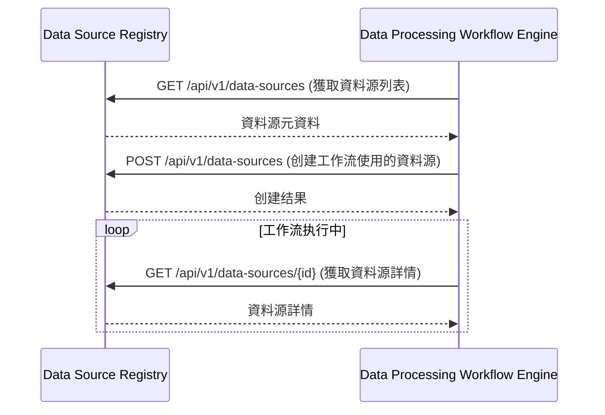
```mermaid
sequenceDiagram
    participant DSR as Data Source Registry
    participant DPWE as Data Processing Workflow Engine
    
    DPWE->>DSR: GET /api/v1/data-sources (獲取資料源列表)
    DSR-->>DPWE: 資料源元資料
    
    DPWE->>DSR: POST /api/v1/data-sources (创建工作流使用的資料源)
    DSR-->>DPWE: 创建结果
    
    loop 工作流执行中
        DPWE->>DSR: GET /api/v1/data-sources/{id} (獲取資料源詳情)
        DSR-->>DPWE: 資料源詳情
    end
```

#### 4.9.2 與自動化媒體處理管道交互

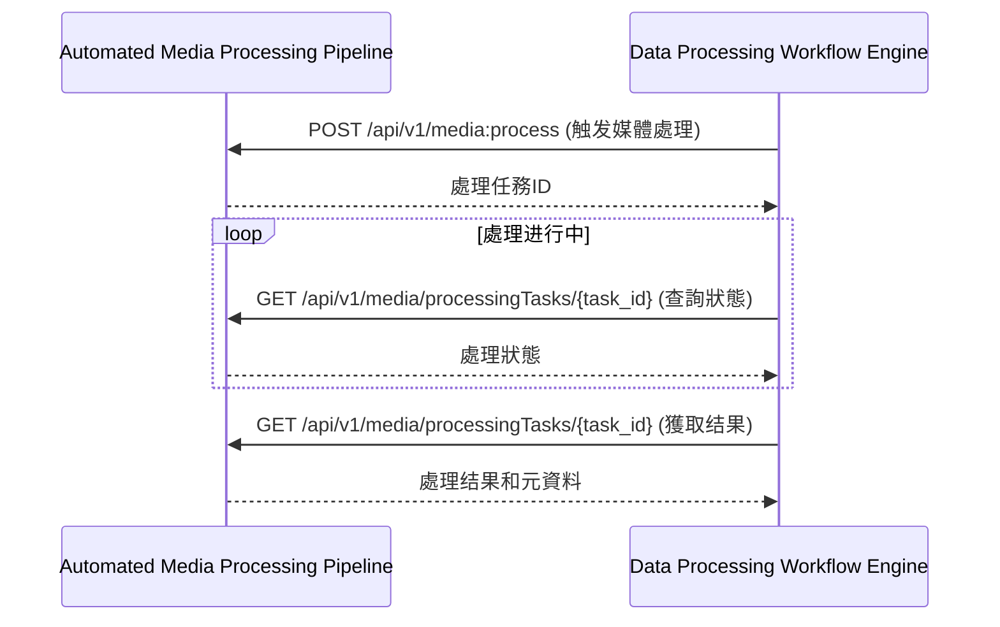
```mermaid
sequenceDiagram
    participant AMP as Automated Media Processing Pipeline
    participant DPWE as Data Processing Workflow Engine
    
    DPWE->>AMP: POST /api/v1/media:process (触发媒體處理)
    AMP-->>DPWE: 處理任務ID
    
    loop 處理进行中
        DPWE->>AMP: GET /api/v1/media/processingTasks/{task_id} (查詢狀態)
        AMP-->>DPWE: 處理狀態
    end
    
    DPWE->>AMP: GET /api/v1/media/processingTasks/{task_id} (獲取结果)
    AMP-->>DPWE: 處理结果和元資料
```

#### 4.9.3 與AI輔助開发系統交互

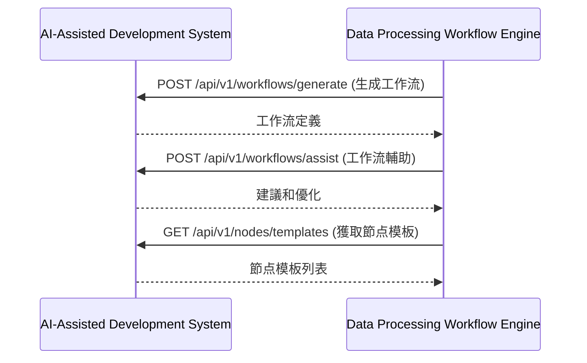
```mermaid
sequenceDiagram
    participant AIDS as AI-Assisted Development System
    participant DPWE as Data Processing Workflow Engine
    
    DPWE->>AIDS: POST /api/v1/workflows/generate (生成工作流)
    AIDS-->>DPWE: 工作流定義
    
    DPWE->>AIDS: POST /api/v1/workflows/assist (工作流輔助)
    AIDS-->>DPWE: 建議和優化
    
    DPWE->>AIDS: GET /api/v1/nodes/templates (獲取節点模板)
    AIDS-->>DPWE: 節点模板列表
```

## 5. 自動化媒體處理管道 (Automated Media Processing Pipeline)

### 5.1 模組概述
自動化媒體處理管道是镜界平台的核心資料處理組件，专註於图像和视频等媒體文件的自動化處理。它提供從文件監控、預處理、AI增强到儲存归档的完整處理流水线，支援與NAS系統的深度整合。

### 5.2 詳細功能清單

#### 5.2.1 核心功能
- **文件監控與触发**
  - 多协议NAS連接（SMB、WebDAV、FTP、NFS）
  - 實時文件系統監控
  - 文件变化事件聚合
  - 增量處理優化
- **預處理阶段**
  - 格式转换與標准化
  - 元資料提取（EXIF、IPTC）
  - 基礎修複（去噪、旋转）
  - 文件分块處理
- **AI增强阶段**
  - 画质智能修複（超分辨率、去噪）
  - 自動色彩校正
  - 智能裁剪與构图優化
  - 分辨率增强（超分重建）
  - 面部優化與修饰
- **分析阶段**
  - 图像內容识别與標籤
  - 品質評估與評分
  - 相似图片去重
  - 異常檢測與過滤
- **組織阶段**
  - AI自動標籤分類
  - 相似图片分組
  - 儲存空间分析
  - 備份與还原管理
- **归档阶段**
  - 處理後文件自動归档
  - 處理报告生成
  - 结果通知與分享

#### 5.2.2 高级功能
- **智能處理流水线**
  - 基於內容的處理策略
  - 動态调整處理參數
  - 品質-速度权衡
  - 處理优先级管理
- **批量處理任務**
  - 全庫批量處理
  - 增量更新處理
  - 條件筛选處理
  - 預览後确认處理
- **風格学习與迁移**
  - 個人風格模型训练
  - 艺术風格迁移
  - 批量風格統一
  - 自定義風格庫
- **智能相册管理**
  - 人脸识别與分組
  - 場景自動分類
  - 時間线智能整理
  - 情感標籤分析

### 5.3 技術架構

#### 5.3.1 架構图
```
┌───────────────────────────────────────────────────────────────────────────────────────────────┐
│                            自動化媒體處理管道 (AMP)                                           │
├───────────────────────┬───────────────────────┬───────────────────────────────────────────────┤
│  輸入层               │  處理层               │  輸出层                                    │
├───────────────────────┼───────────────────────┼───────────────────────────────────────────────┤
│ • 文件監控服務        │ • 預處理服務          │ • 儲存服務                                 │
│ • 事件接收器          │ • AI增强服務          │ • 通知服務                                 │
│ • 批量任務调度        │ • 內容分析服務        │ • 报告生成器                               │
└───────────────────────┴───────────────────────┴───────────────────────────────────────────────┘
```

#### 5.3.2 服務边界與交互
- **輸入**：
  - 文件系統事件（來自NAS監控）
  - 手動触发的處理请求
  - 批量處理任務
- **輸出**：
  - 處理後的媒體文件
  - 處理报告
  - 分析结果和元資料
  - 通知事件

### 5.4 核心組件詳細實現

#### 5.4.1 文件監控服務

**技術實現：**
```python
import os
import time
import logging
from watchdog.observers import Observer
from watchdog.events import FileSystemEventHandler
from concurrent.futures import ThreadPoolExecutor
from typing import Callable, Dict, List, Optional, Set

class FileEvent:
    """文件系統事件物件"""
    
    CREATE = "create"
    MODIFY = "modify"
    DELETE = "delete"
    MOVE = "move"
    
    def __init__(
        self,
        event_type: str,
        src_path: str,
        dest_path: Optional[str] = None,
        is_directory: bool = False,
        timestamp: float = None
    ):
        self.event_type = event_type
        self.src_path = src_path
        self.dest_path = dest_path
        self.is_directory = is_directory
        self.timestamp = timestamp or time.time()
        self.processed = False
        self.processing_start = None
        self.processing_end = None
        self.error = None
    
    def mark_processed(self, success: bool, error: str = None):
        """標记事件已處理"""
        self.processed = True
        self.processing_end = time.time()
        if not success:
            self.error = error
    
    def to_dict(self) -> Dict:
        """转换為字典格式"""
        return {
            "event_type": self.event_type,
            "src_path": self.src_path,
            "dest_path": self.dest_path,
            "is_directory": self.is_directory,
            "timestamp": self.timestamp,
            "processed": self.processed,
            "processing_time": self.processing_end - self.processing_start if self.processing_start and self.processing_end else None,
            "error": self.error
        }

class DirectoryEventHandler(FileSystemEventHandler):
    """目录事件處理器"""
    
    def __init__(
        self,
        callback: Callable[[FileEvent], None],
        ignored_patterns: List[str] = None,
        process_directories: bool = False
    ):
        super().__init__()
        self.callback = callback
        self.ignored_patterns = ignored_patterns or []
        self.process_directories = process_directories
    
    def _is_ignored(self, path: str) -> bool:
        """检查路径是否应被忽略"""
        return any(pattern in path for pattern in self.ignored_patterns)
    
    def on_created(self, event):
        if self.process_directories or not event.is_directory:
            if not self._is_ignored(event.src_path):
                self.callback(FileEvent(FileEvent.CREATE, event.src_path, is_directory=event.is_directory))
    
    def on_modified(self, event):
        if self.process_directories or not event.is_directory:
            if not self._is_ignored(event.src_path):
                self.callback(FileEvent(FileEvent.MODIFY, event.src_path, is_directory=event.is_directory))
    
    def on_deleted(self, event):
        if self.process_directories or not event.is_directory:
            if not self._is_ignored(event.src_path):
                self.callback(FileEvent(FileEvent.DELETE, event.src_path, is_directory=event.is_directory))
    
    def on_moved(self, event):
        if self.process_directories or not event.is_directory:
            if not self._is_ignored(event.src_path) and not self._is_ignored(event.dest_path):
                self.callback(FileEvent(
                    FileEvent.MOVE, 
                    event.src_path, 
                    event.dest_path,
                    is_directory=event.is_directory
                ))

class FileSystemWatcher:
    """文件系統監控器，支援多目录監控和事件聚合"""
    
    def __init__(
        self,
        paths: List[str],
        event_types: List[str] = None,
        recursive: bool = True,
        debounce_ms: int = 500,
        ignored_patterns: List[str] = None,
        max_workers: int = 4
    ):
        """
        初始化文件系統監控器
        
        :param paths: 要監控的目录路径列表
        :param event_types: 要监听的事件類型 (create, modify, delete, move)
        :param recursive: 是否递归監控子目录
        :param debounce_ms: 事件去抖時間 (毫秒)
        :param ignored_patterns: 忽略的文件模式列表
        :param max_workers: 處理事件的线程池大小
        """
        self.paths = paths
        self.event_types = event_types or [FileEvent.CREATE]
        self.recursive = recursive
        self.debounce_ms = debounce_ms
        self.ignored_patterns = ignored_patterns or [".DS_Store", "Thumbs.db", "~$"]
        self.max_workers = max_workers
        self.observers = []
        self.event_buffer = {}
        self.callback = None
        self.executor = ThreadPoolExecutor(max_workers=max_workers)
        self.logger = logging.getLogger(__name__)
        self.running = False
    
    def start(self, callback: Callable[[FileEvent], None]):
        """启動監控器"""
        if self.running:
            return
        
        self.callback = callback
        self.running = True
        
        # 為每個路径创建观察者
        for path in self.paths:
            if not os.path.exists(path):
                self.logger.warning("Path does not exist: %s", path)
                continue
                
            event_handler = DirectoryEventHandler(
                self._buffer_event,
                ignored_patterns=self.ignored_patterns
            )
            
            observer = Observer()
            observer.schedule(event_handler, path, recursive=self.recursive)
            observer.start()
            self.observers.append(observer)
            
            self.logger.info("Started watching directory: %s (recursive=%s)", path, self.recursive)
        
        # 启動去抖定時器
        self.executor.submit(self._debounce_timer)
    
    def stop(self):
        """停止監控器"""
        self.running = False
        
        # 停止所有观察者
        for observer in self.observers:
            observer.stop()
        
        for observer in self.observers:
            observer.join()
        
        self.observers = []
        
        # 關闭线程池
        self.executor.shutdown(wait=True)
        
        self.logger.info("Stopped file system watcher")
    
    def _buffer_event(self, event: FileEvent):
        """缓冲事件用於去抖"""
        if not self.running:
            return
        
        # 仅處理指定的事件類型
        if event.event_type not in self.event_types:
            return
        
        # 生成唯一鍵（路径+事件類型）
        key = f"{event.src_path}|{event.event_type}"
        
        # 如果是移動事件，使用目標路径
        if event.event_type == FileEvent.MOVE:
            key = f"{event.dest_path}|{event.event_type}"
        
        # 缓冲事件
        self.event_buffer[key] = {
            "event": event,
            "timestamp": time.time()
        }
    
    def _debounce_timer(self):
        """去抖定時器"""
        while self.running:
            try:
                current_time = time.time()
                events_to_process = []
                
                # 检查缓冲区中的事件
                for key, item in list(self.event_buffer.items()):
                    # 检查是否超過去抖時間
                    if (current_time - item["timestamp"]) * 1000 >= self.debounce_ms:
                        events_to_process.append(item["event"])
                        del self.event_buffer[key]
                
                # 處理事件
                if events_to_process:
                    self._process_events(events_to_process)
                
                # 等待下一次检查
                time.sleep(self.debounce_ms / 1000.0)
                
            except Exception as e:
                self.logger.error("Error in debounce timer: %s", str(e))
                time.sleep(1)
    
    def _process_events(self, events: List[FileEvent]):
        """處理事件列表"""
        for event in events:
            try:
                # 標记處理開始
                event.processing_start = time.time()
                
                # 調用回调
                self.callback(event)
                
                # 標记處理完成
                event.mark_processed(True)
                
            except Exception as e:
                event.mark_processed(False, str(e))
                self.logger.error("Error processing file event: %s", str(e))
    
    def get_status(self) -> Dict:
        """獲取監控器狀態"""
        return {
            "running": self.running,
            "paths": self.paths,
            "event_types": self.event_types,
            "recursive": self.recursive,
            "debounce_ms": self.debounce_ms,
            "buffered_events": len(self.event_buffer),
            "observers": len(self.observers)
        }

class NasConnectionManager:
    """NAS連接管理器，支援多协议"""
    
    def __init__(self, config: Dict):
        self.config = config
        self.connections = {}
        self.logger = logging.getLogger(__name__)
    
    def connect(self, connection_id: str, config: Dict) -> str:
        """
        创建NAS連接
        
        :param connection_id: 連接ID
        :param config: 連接配置
        :return: 連接ID
        """
        # 验證配置
        self._validate_config(config)
        
        # 创建連接
        if config["protocol"] == "smb":
            connection = self._create_smb_connection(config)
        elif config["protocol"] == "webdav":
            connection = self._create_webdav_connection(config)
        elif config["protocol"] == "ftp":
            connection = self._create_ftp_connection(config)
        elif config["protocol"] == "nfs":
            connection = self._create_nfs_connection(config)
        else:
            raise ValueError(f"Unsupported protocol: {config['protocol']}")
        
        # 保存連接
        self.connections[connection_id] = connection
        
        return connection_id
    
    def _validate_config(self, config: Dict):
        """验證連接配置"""
        required_fields = ["protocol", "host", "path"]
        for field in required_fields:
            if field not in config:
                raise ValueError(f"Missing required field: {field}")
        
        if config["protocol"] == "smb":
            if "username" not in config or "password" not in config:
                raise ValueError("SMB connection requires username and password")
        
        # 其他协议验證...
    
    def _create_smb_connection(self, config: Dict) -> Any:
        """创建SMB連接"""
        from smbprotocol.connection import Connection
        from smbprotocol.session import Session
        from smbprotocol.tree import TreeConnect
        
        connection = Connection(uuid.uuid4(), config["host"], port=445)
        connection.connect()
        
        session = Session(connection, config["username"], config["password"])
        session.connect()
        
        tree = TreeConnect(session, f"\\\\{config['host']}\\{config['share']}")
        tree.connect()
        
        return {
            "connection": connection,
            "session": session,
            "tree": tree,
            "config": config
        }
    
    def _create_webdav_connection(self, config: Dict) -> Any:
        """创建WebDAV連接"""
        from webdav3.client import Client
        
        options = {
            'webdav_hostname': config["host"],
            'webdav_login': config.get("username"),
            'webdav_password': config.get("password"),
            'webdav_root': config["path"]
        }
        
        client = Client(options)
        return {
            "client": client,
            "config": config
        }
    
    def _create_ftp_connection(self, config: Dict) -> Any:
        """创建FTP連接"""
        from ftplib import FTP
        
        ftp = FTP(config["host"])
        ftp.login(user=config.get("username"), passwd=config.get("password"))
        ftp.cwd(config["path"])
        
        return {
            "ftp": ftp,
            "config": config
        }
    
    def _create_nfs_connection(self, config: Dict) -> Any:
        """创建NFS連接"""
        # NFS通常通過挂载点訪問，這里假设已挂载
        return {
            "mount_point": config["mount_point"],
            "config": config
        }
    
    def list_files(self, connection_id: str, path: str = "/") -> List[Dict]:
        """
        列出文件
        
        :param connection_id: 連接ID
        :param path: 路径
        :return: 文件列表
        """
        connection = self._get_connection(connection_id)
        
        if connection["config"]["protocol"] == "smb":
            return self._list_files_smb(connection, path)
        elif connection["config"]["protocol"] == "webdav":
            return self._list_files_webdav(connection, path)
        elif connection["config"]["protocol"] == "ftp":
            return self._list_files_ftp(connection, path)
        elif connection["config"]["protocol"] == "nfs":
            return self._list_files_nfs(connection, path)
        
        raise ValueError("Unsupported protocol")
    
    def _list_files_smb(self, connection: Dict, path: str) -> List[Dict]:
        """列出SMB文件"""
        from smbprotocol.open import Open, CreateOptions, FilePipePrinterAccessMask
        
        # SMB协议比较複杂，這里简化實現
        # 實际實現需要處理目录枚举
        return []
    
    def _list_files_webdav(self, connection: Dict, path: str) -> List[Dict]:
        """列出WebDAV文件"""
        client = connection["client"]
        files = client.list(path)
        
        result = []
        for file in files:
            info = client.info(f"{path}/{file}")
            result.append({
                "name": file,
                "path": f"{path}/{file}",
                "is_directory": info["is_dir"],
                "size": info["size"],
                "modified": info["modified"]
            })
        
        return result
    
    def _list_files_ftp(self, connection: Dict, path: str) -> List[Dict]:
        """列出FTP文件"""
        ftp = connection["ftp"]
        ftp.cwd(path)
        
        files = []
        ftp.retrlines('LIST', files.append)
        
        result = []
        for line in files:
            # 解析FTP LIST輸出
            parts = line.split()
            if len(parts) >= 9:
                name = ' '.join(parts[8:])
                is_dir = line.startswith('d')
                size = int(parts[4]) if not is_dir else 0
                modified = ' '.join(parts[5:8])
                
                result.append({
                    "name": name,
                    "path": f"{path}/{name}",
                    "is_directory": is_dir,
                    "size": size,
                    "modified": modified
                })
        
        return result
    
    def _list_files_nfs(self, connection: Dict, path: str) -> List[Dict]:
        """列出NFS文件"""
        mount_point = connection["mount_point"]
        full_path = os.path.join(mount_point, path.lstrip('/'))
        
        result = []
        for name in os.listdir(full_path):
            file_path = os.path.join(full_path, name)
            is_dir = os.path.isdir(file_path)
            size = os.path.getsize(file_path) if not is_dir else 0
            modified = os.path.getmtime(file_path)
            
            result.append({
                "name": name,
                "path": f"{path}/{name}",
                "is_directory": is_dir,
                "size": size,
                "modified": time.ctime(modified)
            })
        
        return result
    
    def watch_directory(
        self,
        connection_id: str,
        path: str,
        callback: Callable[[FileEvent], None],
        event_types: List[str] = None,
        recursive: bool = True,
        debounce_ms: int = 500
    ) -> str:
        """
        監控目录
        
        :param connection_id: 連接ID
        :param path: 路径
        :param callback: 回调函數
        :param event_types: 事件類型
        :param recursive: 是否递归
        :param debounce_ms: 去抖時間
        :return: 監控器ID
        """
        connection = self._get_connection(connection_id)
        config = connection["config"]
        
        # 對於NFS和本地挂载，可以直接使用FileSystemWatcher
        if config["protocol"] in ["nfs", "local"]:
            mount_point = connection.get("mount_point", config.get("mount_point", "/"))
            full_path = os.path.join(mount_point, path.lstrip('/'))
            
            watcher = FileSystemWatcher(
                paths=[full_path],
                event_types=event_types,
                recursive=recursive,
                debounce_ms=debounce_ms
            )
            watcher.start(callback)
            
            watcher_id = f"watcher-{uuid.uuid4().hex[:8]}"
            self.watchers[watcher_id] = watcher
            return watcher_id
        
        # 對於其他协议，需要轮询（简化實現）
        if config["protocol"] == "smb":
            return self._watch_smb_directory(connection, path, callback, event_types, recursive, debounce_ms)
        elif config["protocol"] == "webdav":
            return self._watch_webdav_directory(connection, path, callback, event_types, recursive, debounce_ms)
        elif config["protocol"] == "ftp":
            return self._watch_ftp_directory(connection, path, callback, event_types, recursive, debounce_ms)
        
        raise ValueError("Unsupported protocol for directory watching")
    
    def _get_connection(self, connection_id: str) -> Dict:
        """獲取連接"""
        if connection_id not in self.connections:
            raise ValueError(f"Connection {connection_id} not found")
        return self.connections[connection_id]
```

#### 5.4.2 媒體處理服務

**技術實現：**
```python
import cv2
import numpy as np
import torch
from basicsr.archs.rrdbnet_arch import RRDBNet
from realesrgan import RealESRGANer
from gfpgan import GFPGANer
from PIL import Image
import exifread
import piexif
from typing import Tuple, Optional, Dict, Any, List
import logging
import os
import tempfile
import hashlib

class MediaProcessingService:
    """媒體處理服務，協調整個處理流水线"""
    
    def __init__(
        self,
        preprocessor: MediaPreprocessor,
        enhancer: MediaEnhancer,
        analyzer: MediaAnalyzer,
        config: Config
    ):
        self.preprocessor = preprocessor
        self.enhancer = enhancer
        self.analyzer = analyzer
        self.config = config
        self.logger = logging.getLogger(__name__)
    
    def process_media(
        self,
        file_path: str,
        workflow: ProcessingWorkflow,
        callback: Optional[Callable[[ProcessingStatus], None]] = None
    ) -> ProcessingResult:
        """
        處理媒體文件
        
        :param file_path: 文件路径
        :param workflow: 處理工作流
        :param callback: 狀態回调函數
        :return: 處理结果
        """
        start_time = time.time()
        status = ProcessingStatus(
            file_path=file_path,
            workflow_id=workflow.id,
            status="processing",
            progress=0.0
        )
        
        try:
            # 1. 更新狀態：開始預處理
            status.step = "preprocessing"
            status.progress = 0.1
            self._notify_callback(callback, status)
            
            # 2. 預處理
            preprocessed_path, preprocessed_meta = self.preprocessor.preprocess(
                file_path,
                workflow.preprocessing
            )
            
            # 3. 更新狀態：開始AI增强
            status.step = "enhancing"
            status.progress = 0.3
            self._notify_callback(callback, status)
            
            # 4. AI增强
            enhanced_path, enhancement_meta = self.enhancer.enhance(
                preprocessed_path,
                workflow.enhancement
            )
            
            # 5. 更新狀態：開始分析
            status.step = "analyzing"
            status.progress = 0.7
            self._notify_callback(callback, status)
            
            # 6. 分析
            analysis_result = self.analyzer.analyze(
                enhanced_path,
                workflow.analysis
            )
            
            # 7. 更新狀態：開始組織
            status.step = "organizing"
            status.progress = 0.9
            self._notify_callback(callback, status)
            
            # 8. 組織（分類、归档等）
            organized_path = self._organize_result(
                enhanced_path,
                analysis_result,
                workflow.organization
            )
            
            # 9. 生成處理报告
            report = self._generate_report(
                file_path,
                preprocessed_meta,
                enhancement_meta,
                analysis_result,
                time.time() - start_time
            )
            
            # 10. 返回结果
            status.status = "completed"
            status.progress = 1.0
            status.result = {
                "processed_path": organized_path,
                "report": report,
                "analysis": analysis_result
            }
            self._notify_callback(callback, status)
            
            return ProcessingResult(
                processed_path=organized_path,
                report=report,
                analysis=analysis_result,
                processing_time=time.time() - start_time
            )
            
        except Exception as e:
            # 處理错误
            status.status = "failed"
            status.error = str(e)
            self._notify_callback(callback, status)
            raise
    
    def _notify_callback(
        self,
        callback: Optional[Callable[[ProcessingStatus], None]],
        status: ProcessingStatus
    ):
        """通知狀態回调"""
        if callback:
            try:
                callback(status)
            except Exception as e:
                self.logger.error("Error in status callback: %s", str(e))
    
    def _organize_result(
        self,
        file_path: str,
        analysis: Dict,
        organization_config: Dict
    ) -> str:
        """組織處理结果"""
        # 根據分析结果生成目標路径
        if organization_config.get("path_template"):
            target_path = self._apply_path_template(
                organization_config["path_template"],
                file_path,
                analysis
            )
        else:
            # 默认路径
            target_path = os.path.join(
                os.path.dirname(file_path),
                "processed",
                os.path.basename(file_path)
            )
        
        # 確保目录存在
        os.makedirs(os.path.dirname(target_path), exist_ok=True)
        
        # 移動文件
        shutil.move(file_path, target_path)
        
        return target_path
    
    def _apply_path_template(
        self,
        template: str,
        source_path: str,
        analysis: Dict
    ) -> str:
        """应用路径模板"""
        # 獲取文件資訊
        file_name = os.path.basename(source_path)
        file_ext = os.path.splitext(file_name)[1]
        dir_name = os.path.dirname(source_path)
        
        # 獲取日期資訊
        current_date = datetime.now()
        date_info = {
            "year": current_date.year,
            "month": current_date.month,
            "day": current_date.day,
            "hour": current_date.hour,
            "minute": current_date.minute
        }
        
        # 獲取分析資訊
        analysis_info = {
            "quality": analysis.get("quality", {}).get("score", 0),
            "tags": ",".join(analysis.get("tags", [])),
            "face_count": len(analysis.get("faces", []))
        }
        
        # 替换模板变量
        def replace_var(match):
            var = match.group(1)
            
            # 日期变量
            if var in date_info:
                return str(date_info[var])
            
            # 分析变量
            if var in analysis_info:
                return str(analysis_info[var])
            
            # 文件变量
            if var == "filename":
                return file_name
            if var == "basename":
                return os.path.splitext(file_name)[0]
            if var == "ext":
                return file_ext[1:] if file_ext else ""
            if var == "dir":
                return os.path.basename(dir_name)
            
            return match.group(0)
        
        return re.sub(r'{(\w+)}', replace_var, template)
    
    def _generate_report(
        self,
        source_path: str,
        preprocessed_meta: Dict,
        enhancement_meta: Dict,
        analysis_result: Dict,
        processing_time: float
    ) -> Dict:
        """生成處理报告"""
        return {
            "source_file": source_path,
            "processing_time": processing_time,
            "preprocessing": preprocessed_meta,
            "enhancement": enhancement_meta,
            "analysis": analysis_result,
            "timestamp": datetime.utcnow().isoformat()
        }

class MediaPreprocessor:
    """媒體預處理器，执行基礎預處理任務"""
    
    def __init__(self, config: Config):
        self.config = config
        self.logger = logging.getLogger(__name__)
    
    def preprocess(
        self,
        file_path: str,
        config: Dict
    ) -> Tuple[str, Dict]:
        """
        預處理媒體文件
        
        :param file_path: 文件路径
        :param config: 預處理配置
        :return: (處理後的文件路径, 元理元資料)
        """
        # 1. 读取文件
        image = self._read_image(file_path)
        
        # 2. 獲取EXIF資訊
        exif_data = self._extract_exif(file_path)
        
        # 3. 应用預處理步骤
        preprocessed, meta = self._apply_preprocessing_steps(image, exif_data, config)
        
        # 4. 保存處理後的文件
        output_path = self._save_image(preprocessed, file_path, config)
        
        return output_path, meta
    
    def _read_image(self, file_path: str) -> np.ndarray:
        """读取图像文件"""
        image = cv2.imread(file_path)
        if image is None:
            raise ValueError(f"Failed to read image: {file_path}")
        
        # 转换為RGB（OpenCV默认是BGR）
        return cv2.cvtColor(image, cv2.COLOR_BGR2RGB)
    
    def _extract_exif(self, file_path: str) -> Dict:
        """提取EXIF資訊"""
        try:
            with open(file_path, 'rb') as f:
                exif = exifread.process_file(f)
                return {str(k): str(v) for k, v in exif.items()}
        except Exception as e:
            self.logger.warning("Error extracting EXIF: %s", str(e))
            return {}
    
    def _apply_preprocessing_steps(
        self,
        image: np.ndarray,
        exif_data: Dict,
        config: Dict
    ) -> Tuple[np.ndarray, Dict]:
        """应用預處理步骤"""
        meta = {
            "original_size": (image.shape[1], image.shape[0]),
            "steps": []
        }
        
        # 1. 自動旋转（如果需要）
        if config.get("auto_rotate", True):
            rotated, rotation_meta = self._auto_rotate(image, exif_data)
            image = rotated
            meta["steps"].append({
                "step": "auto_rotate",
                "meta": rotation_meta
            })
        
        # 2. 格式转换
        if "format" in config:
            converted, format_meta = self._convert_format(image, config["format"])
            image = converted
            meta["steps"].append({
                "step": "format_conversion",
                "meta": format_meta
            })
        
        # 3. 尺寸调整
        if "max_size" in config:
            resized, resize_meta = self._resize_image(image, config["max_size"])
            image = resized
            meta["steps"].append({
                "step": "resize",
                "meta": resize_meta
            })
        
        # 4. 基礎修複
        if config.get("basic_repair", True):
            repaired, repair_meta = self._basic_repair(image)
            image = repaired
            meta["steps"].append({
                "step": "basic_repair",
                "meta": repair_meta
            })
        
        return image, meta
    
    def _auto_rotate(
        self,
        image: np.ndarray,
        exif_data: Dict
    ) -> Tuple[np.ndarray, Dict]:
        """自動旋转图像"""
        orientation = exif_data.get('Image Orientation')
        
        if not orientation:
            return image, {"rotation": 0}
        
        try:
            orientation = int(orientation)
            if orientation == 1:
                # 正常方向，无需旋转
                return image, {"rotation": 0}
            elif orientation == 6:
                # 顺時针90度
                rotated = cv2.rotate(image, cv2.ROTATE_90_CLOCKWISE)
                return rotated, {"rotation": 90}
            elif orientation == 8:
                # 逆時针90度
                rotated = cv2.rotate(image, cv2.ROTATE_90_COUNTERCLOCKWISE)
                return rotated, {"rotation": -90}
            elif orientation == 3:
                # 180度
                rotated = cv2.rotate(image, cv2.ROTATE_180)
                return rotated, {"rotation": 180}
            else:
                return image, {"rotation": 0, "warning": f"Unsupported orientation: {orientation}"}
        except Exception as e:
            return image, {"rotation": 0, "error": str(e)}
    
    def _convert_format(
        self,
        image: np.ndarray,
        target_format: str
    ) -> Tuple[np.ndarray, Dict]:
        """转换图像格式"""
        # 這里简化實現，實际应该根據目標格式进行转换
        return image, {"format": target_format}
    
    def _resize_image(
        self,
        image: np.ndarray,
        max_size: str
    ) -> Tuple[np.ndarray, Dict]:
        """调整图像大小"""
        # 解析最大尺寸
        width_str, height_str = max_size.split('x')
        max_width = int(width_str)
        max_height = int(height_str)
        
        # 獲取當前尺寸
        current_height, current_width = image.shape[:2]
        
        # 计算缩放比例
        scale = min(max_width / current_width, max_height / current_height, 1.0)
        
        # 如果不需要缩放，返回原图
        if scale >= 1.0:
            return image, {
                "original_width": current_width,
                "original_height": current_height,
                "resized": False
            }
        
        # 计算新尺寸
        new_width = int(current_width * scale)
        new_height = int(current_height * scale)
        
        # 调整大小
        resized = cv2.resize(
            image,
            (new_width, new_height),
            interpolation=cv2.INTER_AREA
        )
        
        return resized, {
            "original_width": current_width,
            "original_height": current_height,
            "resized_width": new_width,
            "resized_height": new_height,
            "scale": scale,
            "resized": True
        }
    
    def _basic_repair(self, image: np.ndarray) -> Tuple[np.ndarray, Dict]:
        """基礎修複（去噪等）"""
        # 应用非局部均值去噪
        denoised = cv2.fastNlMeansDenoisingColored(
            image,
            None,
            h=10,
            hColor=10,
            templateWindowSize=7,
            searchWindowSize=21
        )
        
        return denoised, {
            "denoising": True,
            "parameters": {
                "h": 10,
                "hColor": 10
            }
        }
    
    def _save_image(
        self,
        image: np.ndarray,
        source_path: str,
        config: Dict
    ) -> str:
        """保存處理後的图像"""
        # 生成临時文件路径
        temp_dir = self.config.temp_dir or tempfile.gettempdir()
        file_name = os.path.basename(source_path)
        output_path = os.path.join(temp_dir, f"preprocessed_{file_name}")
        
        # 转换回BGR（OpenCV格式）
        bgr_image = cv2.cvtColor(image, cv2.COLOR_RGB2BGR)
        
        # 保存图像
        cv2.imwrite(output_path, bgr_image)
        
        return output_path

class MediaEnhancer:
    """媒體增强器，执行AI增强任務"""
    
    def __init__(
        self,
        model_registry: ModelRegistry,
        config: Config
    ):
        self.model_registry = model_registry
        self.config = config
        self.logger = logging.getLogger(__name__)
    
    def enhance(
        self,
        file_path: str,
        config: Dict
    ) -> Tuple[str, Dict]:
        """
        增强媒體文件
        
        :param file_path: 文件路径
        :param config: 增强配置
        :return: (增强後的文件路径, 增强元資料)
        """
        # 1. 加载图像
        image = self._load_image(file_path)
        
        # 2. 应用增强步骤
        enhanced, meta = self._apply_enhancement_steps(image, config)
        
        # 3. 保存增强後的文件
        output_path = self._save_image(enhanced, file_path, config)
        
        return output_path, meta
    
    def _load_image(self, file_path: str) -> np.ndarray:
        """加载图像"""
        image = cv2.imread(file_path)
        if image is None:
            raise ValueError(f"Failed to read image: {file_path}")
        return cv2.cvtColor(image, cv2.COLOR_BGR2RGB)
    
    def _apply_enhancement_steps(
        self,
        image: np.ndarray,
        config: Dict
    ) -> Tuple[np.ndarray, Dict]:
        """应用增强步骤"""
        meta = {
            "original_size": (image.shape[1], image.shape[0]),
            "steps": []
        }
        
        # 1. 超分辨率
        if config.get("scale_factor", 1) > 1:
            enhanced, sr_meta = self._super_resolution(image, config)
            image = enhanced
            meta["steps"].append({
                "step": "super_resolution",
                "meta": sr_meta
            })
        
        # 2. 色彩校正
        if config.get("color_correction", True):
            corrected, color_meta = self._color_correction(image)
            image = corrected
            meta["steps"].append({
                "step": "color_correction",
                "meta": color_meta
            })
        
        # 3. 智能裁剪
        if config.get("smart_crop", True):
            cropped, crop_meta = self._smart_crop(image, config)
            image = cropped
            meta["steps"].append({
                "step": "smart_crop",
                "meta": crop_meta
            })
        
        # 4. 面部增强（如果启用且檢測到人脸）
        if config.get("face_enhance", False):
            enhanced, face_meta = self._face_enhancement(image)
            image = enhanced
            meta["steps"].append({
                "step": "face_enhancement",
                "meta": face_meta
            })
        
        return image, meta
    
    def _super_resolution(
        self,
        image: np.ndarray,
        config: Dict
    ) -> Tuple[np.ndarray, Dict]:
        """超分辨率處理"""
        # 獲取模型
        model_name = config.get("model", "realesrgan-x4plus")
        model = self.model_registry.get_model(model_name)
        
        # 执行超分辨率
        try:
            # 將图像转换為Bytes
            _, buffer = cv2.imencode('.png', cv2.cvtColor(image, cv2.COLOR_RGB2BGR))
            image_bytes = buffer.tobytes()
            
            # 調用模型服務
            enhanced_bytes = model.process(image_bytes)
            
            # 转换回图像
            nparr = np.frombuffer(enhanced_bytes, np.uint8)
            enhanced = cv2.imdecode(nparr, cv2.IMREAD_COLOR)
            enhanced = cv2.cvtColor(enhanced, cv2.COLOR_BGR2RGB)
            
            return enhanced, {
                "model": model_name,
                "scale_factor": config.get("scale_factor", 2),
                "success": True
            }
            
        except Exception as e:
            self.logger.error("Super resolution failed: %s", str(e))
            return image, {
                "model": model_name,
                "error": str(e),
                "success": False
            }
    
    def _color_correction(self, image: np.ndarray) -> Tuple[np.ndarray, Dict]:
        """色彩校正"""
        # 简单實現：自動對比度和亮度调整
        lab = cv2.cvtColor(image, cv2.COLOR_RGB2LAB)
        l, a, b = cv2.split(lab)
        
        # 应用CLAHE（對比度受限的自適應直方图均衡化）
        clahe = cv2.createCLAHE(clipLimit=3.0, tileGridSize=(8, 8))
        cl = clahe.apply(l)
        
        # 合並通道
        corrected_lab = cv2.merge((cl, a, b))
        corrected = cv2.cvtColor(corrected_lab, cv2.COLOR_LAB2RGB)
        
        return corrected, {
            "method": "clahe",
            "clip_limit": 3.0,
            "tile_grid_size": (8, 8)
        }
    
    def _smart_crop(
        self,
        image: np.ndarray,
        config: Dict
    ) -> Tuple[np.ndarray, Dict]:
        """智能裁剪"""
        # 简单實現：基於內容感知的裁剪
        # 實际应用中应该使用更複杂的算法
        
        # 獲取目標宽高比
        aspect_ratio = config.get("aspect_ratio", "original")
        if aspect_ratio == "original":
            return image, {"cropped": False}
        
        try:
            # 解析宽高比
            width_ratio, height_ratio = map(float, aspect_ratio.split(':'))
            target_ratio = width_ratio / height_ratio
            
            # 獲取當前尺寸
            height, width = image.shape[:2]
            current_ratio = width / height
            
            # 计算裁剪区域
            if current_ratio > target_ratio:
                # 宽度過宽，裁剪宽度
                new_width = int(height * target_ratio)
                start_x = (width - new_width) // 2
                cropped = image[:, start_x:start_x + new_width, :]
            else:
                # 高度過高，裁剪高度
                new_height = int(width / target_ratio)
                start_y = (height - new_height) // 2
                cropped = image[start_y:start_y + new_height, :, :]
            
            return cropped, {
                "original_width": width,
                "original_height": height,
                "cropped_width": cropped.shape[1],
                "cropped_height": cropped.shape[0],
                "cropped": True
            }
            
        except Exception as e:
            self.logger.error("Smart crop failed: %s", str(e))
            return image, {
                "error": str(e),
                "cropped": False
            }
    
    def _face_enhancement(self, image: np.ndarray) -> Tuple[np.ndarray, Dict]:
        """面部增强"""
        # 這里简化實現，實际应该調用专门的面部增强模型
        return image, {"enhanced": False, "message": "Face enhancement not implemented"}
    
    def _save_image(
        self,
        image: np.ndarray,
        source_path: str,
        config: Dict
    ) -> str:
        """保存增强後的图像"""
        # 生成临時文件路径
        temp_dir = self.config.temp_dir or tempfile.gettempdir()
        file_name = os.path.basename(source_path)
        output_path = os.path.join(temp_dir, f"enhanced_{file_name}")
        
        # 转换回BGR（OpenCV格式）
        bgr_image = cv2.cvtColor(image, cv2.COLOR_RGB2BGR)
        
        # 保存图像
        cv2.imwrite(output_path, bgr_image)
        
        return output_path

class MediaAnalyzer:
    """媒體分析器，执行內容分析任務"""
    
    def __init__(
        self,
        tagger: MediaTagger,
        quality_analyzer: QualityAnalyzer,
        face_detector: FaceDetector,
        config: Config
    ):
        self.tagger = tagger
        self.quality_analyzer = quality_analyzer
        self.face_detector = face_detector
        self.config = config
        self.logger = logging.getLogger(__name__)
    
    def analyze(
        self,
        file_path: str,
        config: Dict
    ) -> Dict:
        """
        分析媒體文件
        
        :param file_path: 文件路径
        :param config: 分析配置
        :return: 分析结果
        """
        results = {
            "timestamp": datetime.utcnow().isoformat()
        }
        
        # 1. 標籤分析
        if "tags" in config.get("tasks", []):
            results["tags"] = self.tagger.generate_tags(file_path)
        
        # 2. 品質分析
        if "quality-assessment" in config.get("tasks", []):
            results["quality"] = self.quality_analyzer.assess(file_path)
        
        # 3. 人脸分析
        if "face-detection" in config.get("tasks", []):
            results["faces"] = self.face_detector.detect(file_path)
        
        # 4. 相似图片檢測
        if "duplicate-detection" in config.get("tasks", []):
            results["duplicates"] = self._detect_duplicates(file_path)
        
        return results
    
    def _detect_duplicates(self, file_path: str) -> List[Dict]:
        """檢測相似图片"""
        # 简单實現：基於感知哈希
        try:
            # 计算當前图片的哈希
            current_hash = self._calculate_image_hash(file_path)
            
            # 獲取資料庫中所有图片
            all_images = self._get_all_images()
            
            # 计算相似度
            duplicates = []
            for image in all_images:
                similarity = self._calculate_similarity(current_hash, image["hash"])
                if similarity > 0.85:  # 相似度阈值
                    duplicates.append({
                        "image_id": image["id"],
                        "path": image["path"],
                        "similarity": similarity
                    })
            
            return duplicates
            
        except Exception as e:
            self.logger.error("Duplicate detection failed: %s", str(e))
            return []
    
    def _calculate_image_hash(self, file_path: str) -> str:
        """计算图像感知哈希"""
        img = Image.open(file_path)
        img = img.convert('L').resize((64, 64), Image.LANCZOS)
        hash = imagehash.phash(img)
        return str(hash)
    
    def _get_all_images(self) -> List[Dict]:
        """獲取所有图片（简化實現）"""
        # 這里应该從資料庫獲取
        return []
    
    def _calculate_similarity(self, hash1: str, hash2: str) -> float:
        """计算两個哈希的相似度"""
        h1 = imagehash.hex_to_hash(hash1)
        h2 = imagehash.hex_to_hash(hash2)
        return 1 - (h1 - h2) / len(h1.hash) ** 2

class ModelRegistry:
    """模型註冊表，管理可用的AI模型"""
    
    def __init__(self, config: Config):
        self.config = config
        self.models = {}
        self.logger = logging.getLogger(__name__)
        self._load_models()
    
    def _load_models(self):
        """加载模型配置"""
        # 從配置加载模型
        for model_config in self.config.models:
            try:
                model = self._create_model(model_config)
                self.models[model_config["id"]] = model
                self.logger.info("Loaded model: %s", model_config["id"])
            except Exception as e:
                self.logger.error("Failed to load model %s: %s", model_config["id"], str(e))
    
    def _create_model(self, config: Dict) -> Any:
        """创建模型實例"""
        if config["type"] == "super-resolution":
            return SuperResolutionModel(config)
        elif config["type"] == "face-enhancement":
            return FaceEnhancementModel(config)
        # 其他模型類型...
        else:
            raise ValueError(f"Unsupported model type: {config['type']}")
    
    def get_model(self, model_id: str) -> Any:
        """獲取模型"""
        if model_id not in self.models:
            raise ValueError(f"Model {model_id} not found")
        return self.models[model_id]

class SuperResolutionModel:
    """超分辨率模型封装"""
    
    def __init__(self, config: Dict):
        self.config = config
        self.logger = logging.getLogger(__name__)
        self.model = self._load_model()
    
    def _load_model(self):
        """加载模型"""
        # 根據配置加载适當的模型
        if self.config["name"] == "realesrgan-x4plus":
            from realesrgan import RealESRGANer
            return RealESRGANer(
                scale=self.config["scale"],
                model_path=self.config["model_path"],
                tile=self.config.get("tile", 0),
                tile_pad=self.config.get("tile_pad", 10),
                pre_pad=self.config.get("pre_pad", 0),
                half=self.config.get("half", True)
            )
        # 具他模型...
        else:
            raise ValueError(f"Unsupported model: {self.config['name']}")
    
    def process(self, image_bytes: bytes) -> bytes:
        """處理图像"""
        # 將码图像
        nparr = np.frombuffer(image_bytes, np.uint8)
        img = cv2.imdecode(nparr, cv2.IMREAD_COLOR)
        
        # 执行超分辨率
        try:
            output, _ = self.model.enhance(img, outscale=self.config["scale"])
        except RuntimeError as e:
            if 'CUDA out of memory' in str(e):
                # 尝试减少分块大小
                self.model.tile = max(200, self.model.tile - 200)
                output, _ = self.model.enhance(img, outscale=self.config["scale"])
            else:
                raise
        
        # 编码结果
        _, buffer = cv2.imencode('.png', output)
        return buffer.tobytes()

# 輔助类定義
class ProcessingWorkflow:
    """處理工作流定義"""
    def __init__(
        self,
        id: str,
        preprocessing: Dict,
        enhancement: Dict,
        analysis: Dict,
        organization: Dict
    ):
        self.id = id
        self.preprocessing = preprocessing
        self.enhancement = enhancement
        self.analysis = analysis
        self.organization = organization

class ProcessingStatus:
    """處理狀態"""
    def __init__(
        self,
        file_path: str,
        workflow_id: str,
        status: str,
        step: Optional[str] = None,
        progress: float = 0.0,
        error: Optional[str] = None,
        result: Optional[Dict] = None
    ):
        self.file_path = file_path
        self.workflow_id = workflow_id
        self.status = status
        self.step = step
        self.progress = progress
        self.error = error
        self.result = result
        self.timestamp = datetime.utcnow().isoformat()

class ProcessingResult:
    """處理结果"""
    def __init__(
        self,
        processed_path: str,
        report: Dict,
        analysis: Dict,
        processing_time: float
    ):
        self.processed_path = processed_path
        self.report = report
        self.analysis = analysis
        self.processing_time = processing_time
```

#### 5.4.3 媒體分析服務

**技術實現：**
```python
import cv2
import numpy as np
import torch
import clip
from PIL import Image
import face_recognition
from typing import List, Dict, Tuple, Optional
import logging
import os
import hashlib
from sklearn.cluster import KMeans
from sklearn.decomposition import PCA
from sklearn.preprocessing import StandardScaler
import faiss
import pickle

class MediaTagger:
    """媒體標籤生成器，基於CLIP模型"""
    
    def __init__(
        self,
        clip_model_name: str = "ViT-B/32",
        face_detection_model: str = "retinaface_resnet50",
        config: Config = None
    ):
        self.logger = logging.getLogger(__name__)
        self.config = config or Config()
        
        # 加载CLIP模型
        self.logger.info("Loading CLIP model: %s", clip_model_name)
        self.clip_model, self.clip_preprocess = clip.load(clip_model_name, device="cuda" if torch.cuda.is_available() else "cpu")
        self.clip_model.eval()
        
        # 加载人脸檢測模型
        self.logger.info("Loading face detection model: %s", face_detection_model)
        self.face_detector = self._load_face_detector(face_detection_model)
        
        # 預定義的標籤候选
        self.candidate_tags = self.config.get("candidate_tags", [
            "portrait", "landscape", "architecture", "food", "animal", 
            "vehicle", "nature", "people", "event", "product",
            "indoor", "outdoor", "sunset", "night", "daytime",
            "close-up", "macro", "aerial", "black and white", "color"
        ])
    
    def _load_face_detector(self, model_name: str):
        """加载人脸檢測模型"""
        if model_name == "retinaface_resnet50":
            from retinaface import RetinaFace
            return RetinaFace
        elif model_name == "mtcnn":
            from mtcnn import MTCNN
            return MTCNN()
        else:
            raise ValueError(f"Unsupported face detection model: {model_name}")
    
    def generate_tags(self, image_path: str) -> List[Dict]:
        """
        生成图像標籤
        
        :param image_path: 图像路径
        :return: 標籤列表
        """
        # 1. 加载並預處理图像
        try:
            image = self.clip_preprocess(Image.open(image_path)).unsqueeze(0).to(next(self.clip_model.parameters()).device)
        except Exception as e:
            self.logger.error("Error loading image %s: %s", image_path, str(e))
            return []
        
        # 2. 计算图像特徵
        with torch.no_grad():
            image_features = self.clip_model.encode_image(image)
            image_features = image_features / image_features.norm(dim=-1, keepdim=True)
        
        # 3. 计算與候选標籤的相似度
        text_inputs = torch.cat([clip.tokenize(f"a photo of {c}") for c in self.candidate_tags]).to(next(self.clip_model.parameters()).device)
        
        with torch.no_grad():
            text_features = self.clip_model.encode_text(text_inputs)
            text_features = text_features / text_features.norm(dim=-1, keepdim=True)
            
            # 计算相似度
            similarity = (image_features @ text_features.T).cpu().numpy()[0]
        
        # 4. 选择前N個標籤
        top_indices = np.argsort(similarity)[::-1][:self.config.get("max_tags", 5)]
        tags = []
        for idx in top_indices:
            if similarity[idx] > self.config.get("tag_threshold", 0.2):  # 阈值
                tags.append({
                    "tag": self.candidate_tags[idx],
                    "confidence": float(similarity[idx])
                })
        
        # 5. 檢測人脸並添加相關標籤
        face_tags = self._detect_faces(image_path)
        tags.extend(face_tags)
        
        return tags
    
    def _detect_faces(self, image_path: str) -> List[Dict]:
        """檢測人脸並生成相關標籤"""
        try:
            # 檢測人脸
            faces = self.face_detector.detect_faces(image_path)
            
            tags = []
            if faces:
                tags.append({"tag": "people", "confidence": min(1.0, len(faces) * 0.2)})
                
                # 检查是否是单人照
                if len(faces) == 1:
                    tags.append({"tag": "portrait", "confidence": 0.8})
                
                # 檢查是否是多人照
                elif len(faces) >= 3:
                    tags.append({"tag": "group", "confidence": 0.7})
            
            return tags
            
        except Exception as e:
            self.logger.warning("Face detection failed: %s", str(e))
            return []

class QualityAnalyzer:
    """图像品質分析器"""
    
    def __init__(self, config: Config = None):
        self.config = config or Config()
        self.logger = logging.getLogger(__name__)
    
    def assess(self, image_path: str) -> Dict:
        """
        評估图像品質
        
        :param image_path: 图像路径
        :return: 品質評估结果
        """
        try:
            # 1. 加载图像
            image = cv2.imread(image_path)
            if image is None:
                raise ValueError(f"Failed to read image: {image_path}")
            
            # 2. 计算清晰度（使用Laplacian方差）
            gray = cv2.cvtColor(image, cv2.COLOR_BGR2GRAY)
            fm = cv2.Laplacian(gray, cv2.CV_64F).var()
            
            # 3. 归一化到0-1范围
            quality_score = min(1.0, max(0.0, fm / self.config.get("sharpness_threshold", 100.0)))
            
            # 4. 检查曝光
            exposure = self._analyze_exposure(gray)
            
            # 5. 检查色彩
            colorfulness = self._analyze_colorfulness(image)
            
            return {
                "score": quality_score,
                "sharpness": float(fm),
                "exposure": exposure,
                "colorfulness": colorfulness,
                "issues": self._identify_quality_issues(fm, exposure, colorfulness)
            }
            
        except Exception as e:
            self.logger.error("Quality assessment failed: %s", str(e))
            return {
                "score": 0.0,
                "error": str(e)
            }
    
    def _analyze_exposure(self, gray: np.ndarray) -> Dict:
        """分析曝光"""
        # 计算直方图
        hist = cv2.calcHist([gray], [0], None, [256], [0, 256])
        hist = hist.flatten() / hist.sum()
        
        # 计算平均亮度
        mean_brightness = np.sum(np.arange(256) * hist)
        
        # 分析曝光问题
        issues = []
        if mean_brightness < 50:
            issues.append("underexposed")
        elif mean_brightness > 200:
            issues.append("overexposed")
        
        return {
            "mean_brightness": float(mean_brightness),
            "issues": issues
        }
    
    def _analyze_colorfulness(self, image: np.ndarray) -> Dict:
        """分析色彩豐富度"""
        # 转换到HSV空间
        hsv = cv2.cvtColor(image, cv2.COLOR_BGR2HSV)
        h, s, v = cv2.split(hsv)
        
        # 计算饱和度统计
        saturation_mean = cv2.mean(s)[0]
        saturation_std = np.std(s)
        
        # 分析色彩问题
        issues = []
        if saturation_mean < 30:
            issues.append("low_saturation")
        
        return {
            "saturation_mean": float(saturation_mean),
            "saturation_std": float(saturation_std),
            "issues": issues
        }
    
    def _identify_quality_issues(
        self,
        sharpness: float,
        exposure: Dict,
        colorfulness: Dict
    ) -> List[str]:
        """识别品質问題"""
        issues = []
        
        # 清晰度问题
        if sharpness < self.config.get("sharpness_threshold", 100.0) * 0.3:
            issues.append("blurry")
        
        # 曝光问题
        issues.extend(exposure["issues"])
        
        # 色彩问题
        issues.extend(colorfulness["issues"])
        
        return issues

class FaceDetector:
    """人脸檢測器"""
    
    def __init__(
        self,
        model_name: str = "retinaface_resnet50",
        config: Config = None
    ):
        self.config = config or Config()
        self.logger = logging.getLogger(__name__)
        
        # 加载人脸檢測模型
        self.logger.info("Loading face detection model: %s", model_name)
        self.face_detector = self._load_face_detector(model_name)
        
        # 加载人脸识别模型
        self.logger.info("Loading face recognition model")
        self.face_recognition = face_recognition
    
    def _load_face_detector(self, model_name: str):
        """加载人脸檢測模型"""
        if model_name == "retinaface_resnet50":
            from retinaface import RetinaFace
            return RetinaFace
        elif model_name == "mtcnn":
            from mtcnn import MTCNN
            return MTCNN()
        else:
            raise ValueError(f"Unsupported face detection model: {model_name}")
    
    def detect(self, image_path: str) -> List[Dict]:
        """
        檢測图像中的人脸
        
        :param image_path: 图像路径
        :return: 人脸列表
        """
        try:
            # 檢測人脸
            faces = self.face_detector.detect_faces(image_path)
            
            # 處理结果
            results = []
            for i, face in enumerate(faces):
                x, y, w, h = face['facial_area']
                confidence = face['score']
                
                # 獲取人脸特徵
                face_image = Image.open(image_path).crop((x, y, x+w, y+h))
                face_encoding = self._get_face_encoding(face_image)
                
                results.append({
                    "index": i,
                    "bbox": [x, y, w, h],
                    "confidence": float(confidence),
                    "encoding": face_encoding.tolist() if face_encoding is not None else None
                })
            
            return results
            
        except Exception as e:
            self.logger.error("Face detection failed: %s", str(e))
            return []
    
    def _get_face_encoding(self, face_image: Image.Image) -> Optional[np.ndarray]:
        """獲取人脸特徵编码"""
        try:
            # 转换為numpy數组
            face_np = np.array(face_image)
            
            # 獲取人脸编码
            encodings = self.face_recognition.face_encodings(face_np)
            return encodings[0] if encodings else None
            
        except Exception as e:
            self.logger.warning("Face encoding failed: %s", str(e))
            return None

class MediaClassifier:
    """媒體文件智能分類系統"""
    
    def __init__(
        self,
        clip_model_name: str = "ViT-B/32",
        face_detection_model: str = "retinaface_resnet50",
        cluster_count: int = 50,
        index_path: Optional[str] = None,
        config: Config = None
    ):
        """
        初始化媒體分類器
        
        :param clip_model_name: CLIP模型名称
        :param face_detection_model: 人脸檢測模型
        :param cluster_count: 聚类數量
        :param index_path: FAISS索引路径 (用於相似图片查找)
        :param config: 配置
        """
        self.logger = logging.getLogger(__name__)
        self.config = config or Config()
        
        # 初始化CLIP模型
        self.logger.info("Loading CLIP model: %s", clip_model_name)
        self.clip_model, self.clip_preprocess = clip.load(clip_model_name, device="cuda" if torch.cuda.is_available() else "cpu")
        self.clip_model.eval()
        
        # 初始化人脸檢測
        self.logger.info("Loading face detection model: %s", face_detection_model)
        self.face_detector = self._load_face_detector(face_detection_model)
        
        # 聚类配置
        self.cluster_count = cluster_count
        self.scaler = StandardScaler()
        self.pca = PCA(n_components=0.95)  # 保留95%方差
        self.kmeans = KMeans(n_clusters=cluster_count, random_state=42)
        
        # 相似度索引
        self.index_path = index_path
        self.index = self._load_or_create_index()
        
        # 標籤映射
        self.label_map = {}
        self.cluster_descriptions = {}
    
    def _load_face_detector(self, model_name: str):
        """加载人脸檢測模型"""
        if model_name == "retinaface_resnet50":
            from retinaface import RetinaFace
            return RetinaFace
        elif model_name == "mtcnn":
            from mtcnn import MTCNN
            return MTCNN()
        else:
            raise ValueError(f"Unsupported face detection model: {model_name}")
    
    def _load_or_create_index(self):
        """加载或创建FAISS索引"""
        if self.index_path and os.path.exists(self.index_path):
            self.logger.info("Loading FAISS index from %s", self.index_path)
            return faiss.read_index(self.index_path)
        else:
            # 创建新的索引 (使用HNSW for efficient search)
            dimension = 512  # CLIP特徵维度
            M = 32  # HNSW參數
            ef_construction = 128  # HNSW參數
            
            index = faiss.IndexHNSWFlat(dimension, M)
            index.hnsw.efConstruction = ef_construction
            index.hnsw.efSearch = 64
            
            return index
    
    def extract_features(self, image_path: str) -> np.ndarray:
        """提取图像特徵向量"""
        # 加载並預處理图像
        image = self.clip_preprocess(Image.open(image_path)).unsqueeze(0).to(next(self.clip_model.parameters()).device)
        
        # 提取CLIP特徵
        with torch.no_grad():
            features = self.clip_model.encode_image(image)
            features = features / features.norm(dim=-1, keepdim=True)  # L2归一化
        
        return features.cpu().numpy().flatten()
    
    def extract_face_features(self, image_path: str) -> List[np.ndarray]:
        """提取人脸特徵"""
        # 檢測人脸
        faces = self.face_detector.detect_faces(image_path)
        
        face_features = []
        for face in faces:
            # 提取人脸区域
            x, y, w, h = face['facial_area']
            face_img = Image.open(image_path).crop((x, y, x+w, y+h))
            
            # 預處理並提取特徵
            face_img = self.clip_preprocess(face_img).unsqueeze(0).to(next(self.clip_model.parameters()).device)
            
            with torch.no_grad():
                features = self.clip_model.encode_image(face_img)
                features = features / features.norm(dim=-1, keepdim=True)
            
            face_features.append(features.cpu().numpy().flatten())
        
        return face_features
    
    def classify_image(
        self,
        image_path: str,
        generate_tags: bool = True,
        detect_faces: bool = True
    ) -> Dict:
        """
        分類单個图像
        
        :param image_path: 图像路径
        :param generate_tags: 是否生成语義標籤
        :param detect_faces: 是否檢測人脸
        :return: 分類结果
        """
        start_time = time.time()
        
        # 提取图像特徵
        image_features = self.extract_features(image_path)
        
        # 人脸檢測與特徵提取
        face_data = []
        if detect_faces:
            face_features = self.extract_face_features(image_path)
            for i, features in enumerate(face_features):
                # 识别人脸 (與已知人脸聚类比较)
                face_id = self._identify_face(features)
                face_data.append({
                    "index": i,
                    "face_id": face_id,
                    "confidence": self._calculate_face_confidence(features, face_id)
                })
        
        # 查找相以图片
        similar_images = self._find_similar_images(image_features, k=10)
        
        # 生成语義標籤
        tags = []
        if generate_tags:
            tags = self._generate_semantic_tags(image_features)
        
        # 确定图像类别
        cluster_id = self.kmeans.predict([image_features])[0]
        category = self.cluster_descriptions.get(cluster_id, f"Cluster {cluster_id}")
        
        processing_time = time.time() - start_time
        
        return {
            "image_path": image_path,
            "features": image_features.tolist(),
            "cluster_id": int(cluster_id),
            "category": category,
            "tags": tags,
            "face_data": face_data,
            "similar_images": similar_images,
            "processing_time": processing_time,
            "quality_score": self._assess_image_quality(image_path)
        }
    
    def _identify_face(self, face_features: np.ndarray) -> str:
        """识别人脸，返回face_id"""
        # 檢查是否與已知人脸匹配
        distances = []
        known_faces = self._get_known_faces()  # 從資料庫獲取已知人脸
        
        if not known_faces:
            # 如果沒有已知人脸，创建新face_id
            return f"face-{uuid.uuid4().hex[:8]}"
        
        for face_id, features in known_faces.items():
            distance = np.linalg.norm(face_features - features)
            distances.append((face_id, distance))
        
        if distances:
            # 按距离排序
            distances.sort(key=lambda x: x[1])
            closest_id, min_distance = distances[0]
            
            # 檢查是否在阈值内
            if min_distance < self.config.get("face_distance_threshold", 0.6):
                return closest_id
        
        # 如果是新人脸，创建新face_id
        new_face_id = f"face-{uuid.uuid4().hex[:8]}"
        self._add_new_face(new_face_id, face_features)
        return new_face_id
    
    def _calculate_face_confidence(self, face_features: np.ndarray, face_id: str) -> float:
        """计算人脸识别置信度"""
        known_faces = self._get_known_faces()
        if face_id not in known_faces:
            return 0.0
        
        distance = np.linalg.norm(face_features - known_faces[face_id])
        # 转换為0-1的置信度 (距离越小，置信度越高)
        return max(0.0, min(1.0, 1.0 - (distance / 1.5)))
    
    def _find_similar_images(self, features: np.ndarray, k: int = 10) -> List[Dict]:
        """查找相以图片"""
        # 添加到索引 (临時)
        index = faiss.IndexFlatL2(features.shape[0])
        index.add(np.array([features]))
        
        # 搜尋相以图片
        D, I = self.index.search(np.array([features]), k+1)  # +1 because it includes the query itself
        
        results = []
        for i in range(1, min(k+1, len(I[0]))):  # 跳過第一個结果 (查詢本身)
            idx = I[0][i]
            distance = D[0][i]
            similarity = 1 / (1 + distance)  # 转换為相以度
            
            # 獲取图片資訊 (從資料庫)
            image_info = self._get_image_info_by_index(idx)
            if image_info:
                results.append({
                    "image_id": image_info["id"],
                    "path": image_info["path"],
                    "similarity": float(similarity),
                    "distance": float(distance)
                })
        
        return results
    
    def _generate_semantic_tags(self, features: np.ndarray) -> List[Dict]:
        """生成语義標籤"""
        # 預定義的標籤候选
        candidate_tags = self.config.get("candidate_tags", [
            "portrait", "landscape", "architecture", "food", "animal", 
            "vehicle", "nature", "people", "event", "product",
            "indoor", "outdoor", "sunset", "night", "daytime",
            "close-up", "macro", "aerial", "black and white", "color"
        ])
        
        # 使用CLIP计算與候选標籤的相以度
        text_inputs = torch.cat([clip.tokenize(f"a photo of {c}") for c in candidate_tags]).to(next(self.clip_model.parameters()).device)
        
        with torch.no_grad():
            text_features = self.clip_model.encode_text(text_inputs)
            text_features = text_features / text_features.norm(dim=-1, keepdim=True)
            
            # 计算相以度
            similarity = (torch.from_numpy(features).float() @ text_features.T).cpu().numpy()
        
        # 选择前N個標籤
        top_indices = np.argsort(similarity)[::-1][:5]
        tags = []
        for idx in top_indices:
            if similarity[idx] > self.config.get("tag_threshold", 0.2):  # 阈值
                tags.append({
                    "tag": candidate_tags[idx],
                    "confidence": float(similarity[idx])
                })
        
        return tags
    
    def _assess_image_quality(self, image_path: str) -> float:
        """評估图像品質 (0-1)"""
        # 简单實現：使用OpenCV计算清晰度
        image = cv2.imread(image_path)
        if image is None:
            return 0.0
        
        # 转换為灰度
        gray = cv2.cvtColor(image, cv2.COLOR_BGR2GRAY)
        
        # 计算Laplacian方差 (衡量清晰度)
        fm = cv2.Laplacian(gray, cv2.CV_64F).var()
        
        # 归一化到0-1范围 (基於经验值)
        quality = min(1.0, max(0.0, fm / 100.0))
        
        return quality
    
    def train_clusters(self, feature_vectors: List[np.ndarray]):
        """训练聚类模型"""
        # 標准化特徵
        scaled_features = self.scaler.fit_transform(feature_vectors)
        
        # PCA降维
        reduced_features = self.pca.fit_transform(scaled_features)
        
        # K-Means聚类
        self.kmeans.fit(reduced_features)
        
        # 為每個聚类生成描述
        self._generate_cluster_descriptions(feature_vectors)
    
    def _generate_cluster_descriptions(self, feature_vectors: List[np.ndarray]):
        """為每個聚类生成描述性標籤"""
        # 對每個聚类，选择代表性图像
        cluster_centers = self.kmeans.cluster_centers_
        representative_images = {}
        
        for i, center in enumerate(cluster_centers):
            # 找到最近的特徵向量
            distances = [np.linalg.norm(feat - center) for feat in feature_vectors]
            closest_idx = np.argmin(distances)
            representative_images[i] = feature_vectors[closest_idx]
        
        # 為每個聚类生成描述
        for cluster_id, features in representative_images.items():
            tags = self._generate_semantic_tags(features)
            top_tags = sorted(tags, key=lambda x: x["confidence"], reverse=True)[:3]
            self.cluster_descriptions[cluster_id] = ", ".join([t["tag"] for t in top_tags]) or f"Cluster {cluster_id}"
    
    def add_to_index(self, image_id: str, features: np.ndarray):
        """將图像特徵添加到索引"""
        # 添加到FAISS索引
        self.index.add(np.array([features]))
        
        # 保存到資料庫 (image_id -> index position)
        self._save_index_mapping(image_id, self.index.ntotal - 1)
        
        # 保存索引到磁盘
        if self.index_path:
            faiss.write_index(self.index, self.index_path)
    
    def update_index(self):
        """更新索引 (重新训练聚类等)"""
        # 獲取所有特徵向量
        all_features = self._get_all_features()
        
        if len(all_features) > self.cluster_count:
            # 重新训练聚类
            self.train_clusters(all_features)
        
        # 重建FAISS索引
        self.index = self._load_or_create_index()
        for image_id, features in all_features:
            self.add_to_index(image_id, features)
    
    # 以下為資料庫交互方法 (需根據實际資料庫實現)
    def _get_known_faces(self) -> Dict[str, np.ndarray]:
        """獲取已知人脸特徵 (從資料庫)"""
        # 實現資料庫查詢
        pass
    
    def _add_new_face(self, face_id: str, features: np.ndarray):
        """添加新人脸到資料庫"""
        # 實現資料庫插入
        pass
    
    def _get_image_info_by_index(self, index: int) -> Optional[Dict]:
        """通過索引獲取图像資訊"""
        # 實現資料庫查詢
        pass
    
    def _save_index_mapping(self, image_id: str, index_pos: int):
        """保存图像ID到索引位置的映射"""
        # 實現資料庫插入
        pass
    
    def _get_all_features(self) -> List[Tuple[str, np.ndarray]]:
        """獲取所有图像特徵"""
        # 實現資料庫查詢
        pass
```

### 5.5 資料模型詳細定義

#### 5.5.1 媒體文件表

```sql
-- 媒體文件元資料表
CREATE TABLE media_files (
    id UUID PRIMARY KEY DEFAULT gen_random_uuid(),
    project_id UUID NOT NULL REFERENCES projects(id) ON DELETE CASCADE,
    source_id UUID REFERENCES data_sources(id) ON DELETE SET NULL,
    workflow_instance_id UUID REFERENCES workflow_instances(id) ON DELETE SET NULL,
    path VARCHAR(1024) NOT NULL,
    filename VARCHAR(255) NOT NULL,
    mime_type VARCHAR(100) NOT NULL,
    size BIGINT NOT NULL,
    created_at TIMESTAMPTZ NOT NULL DEFAULT NOW(),
    updated_at TIMESTAMPTZ NOT NULL DEFAULT NOW(),
    processed_at TIMESTAMPTZ,
    status VARCHAR(20) NOT NULL DEFAULT 'raw' CHECK (status IN ('raw', 'processing', 'processed', 'failed', 'archived')),
    original_id UUID REFERENCES media_files(id) ON DELETE SET NULL,
    version INT NOT NULL DEFAULT 1,
    metadata JSONB DEFAULT '{}'::jsonb,
    exif JSONB DEFAULT '{}'::jsonb,
    ai_analysis JSONB DEFAULT '{}'::jsonb,
    
    -- 索引
    UNIQUE (project_id, path, version),
    INDEX idx_media_files_project ON media_files(project_id),
    INDEX idx_media_files_source ON media_files(source_id),
    INDEX idx_media_files_status ON media_files(status),
    INDEX idx_media_files_created ON media_files(created_at DESC),
    INDEX idx_media_files_processed ON media_files(processed_at DESC),
    
    -- 全文搜尋
    ts_vector TSVECTOR GENERATED ALWAYS AS (
        to_tsvector('simple', coalesce(filename, '') || ' ' || coalesce(metadata->>'title', '') || ' ' || coalesce(metadata->>'description', ''))
    ) STORED
);

-- 自動更新updated_at触发器
CREATE OR REPLACE FUNCTION update_media_files_modtime()
RETURNS TRIGGER AS $$
BEGIN
    NEW.updated_at = NOW();
    RETURN NEW;
END;
$$ LANGUAGE plpgsql;

CREATE TRIGGER update_media_files_modtime
BEFORE UPDATE ON media_files
FOR EACH ROW
EXECUTE FUNCTION update_media_files_modtime();

-- 全文搜尋索引
CREATE INDEX idx_media_files_search ON media_files USING GIN (ts_vector);
```

#### 5.5.2 媒體處理任務表

```sql
-- 媒體處理任務表
CREATE TABLE media_processing_tasks (
    id UUID PRIMARY KEY DEFAULT gen_random_uuid(),
    file_id UUID NOT NULL REFERENCES media_files(id) ON DELETE CASCADE,
    task_type VARCHAR(50) NOT NULL,
    parameters JSONB NOT NULL,
    status VARCHAR(20) NOT NULL DEFAULT 'pending' CHECK (status IN ('pending', 'running', 'completed', 'failed', 'canceled')),
    priority INT NOT NULL DEFAULT 5,
    queued_at TIMESTAMPTZ NOT NULL DEFAULT NOW(),
    started_at TIMESTAMPTZ,
    completed_at TIMESTAMPTZ,
    duration INTERVAL,
    worker_id VARCHAR(255),
    input_path VARCHAR(1024),
    output_path VARCHAR(1024),
    error JSONB,
    retry_count INT NOT NULL DEFAULT 0,
    max_retries INT NOT NULL DEFAULT 3,
    resource_requirements JSONB DEFAULT '{}'::jsonb,
    
    -- 索引
    INDEX idx_tasks_file ON media_processing_tasks(file_id),
    INDEX idx_tasks_status ON media_processing_tasks(status),
    INDEX idx_tasks_priority ON media_processing_tasks(priority, queued_at),
    INDEX idx_tasks_worker ON media_processing_tasks(worker_id),
    INDEX idx_tasks_queued ON media_processing_tasks(queued_at)
);
```

#### 5.5.3 媒體標籤表

```sql
-- 媒體標籤表
CREATE TABLE media_tags (
    file_id UUID NOT NULL REFERENCES media_files(id) ON DELETE CASCADE,
    tag_type VARCHAR(50) NOT NULL,
    tag_value VARCHAR(255) NOT NULL,
    confidence NUMERIC(4,2) NOT NULL,
    source VARCHAR(50) NOT NULL,
    created_at TIMESTAMPTZ NOT NULL DEFAULT NOW(),
    
    PRIMARY KEY (file_id, tag_type, tag_value),
    INDEX idx_tags_file ON media_tags(file_id),
    INDEX idx_tags_type ON media_tags(tag_type),
    INDEX idx_tags_value ON media_tags(tag_value)
);
```

#### 5.5.4 媒體相以度表

```sql
-- 媒體相以度表 (用於查找相以图片)
CREATE TABLE media_similarity (
    file_id1 UUID NOT NULL REFERENCES media_files(id) ON DELETE CASCADE,
    file_id2 UUID NOT NULL REFERENCES media_files(id) ON DELETE CASCADE,
    similarity_score NUMERIC(5,4) NOT NULL,
    algorithm VARCHAR(50) NOT NULL,
    created_at TIMESTAMPTZ NOT NULL DEFAULT NOW(),
    
    PRIMARY KEY (file_id1, file_id2, algorithm),
    CHECK (file_id1 < file_id2),  -- 避免重複儲存
    INDEX idx_similarity_score ON media_similarity(similarity_score DESC),
    INDEX idx_similarity_file1 ON media_similarity(file_id1)
);
```

### 5.6 API詳細規範

#### 5.6.1 媒體處理API

**触发媒體文件處理 (POST /api/v1/media:process)**

*请求示例:*
```http
POST /api/v1/media:process HTTP/1.1
Host: amp.mirror-realm.com
Authorization: Bearer <access_token>
Content-Type: application/json
X-Request-ID: req-345678

{
  "file_path": "/nas/photos/raw/vacation/IMG_20230615_103045.jpg",
  "workflow": "nas-photo-processing",
  "parameters": {
    "image_enhance": {
      "scale_factor": 2,
      "denoise_strength": 0.3
    },
    "storage": {
      "bucket": "processed-photos",
      "path_template": "year={year}/month={month}/{filename}"
    }
  },
  "priority": 5,
  "callback_url": "https://myapp.com/callback/media-processing"
}
```

*成功響應示例:*
```http
HTTP/1.1 202 Accepted
Content-Type: application/json
Location: /api/v1/media/processingTasks/pt-123456
X-Request-ID: req-345678

{
  "task_id": "pt-123456",
  "file_path": "/nas/photos/raw/vacation/IMG_20230615_103045.jpg",
  "workflow": "nas-photo-processing",
  "status": "queued",
  "queued_at": "2023-06-15T10:30:45Z",
  "priority": 5,
  "callback_url": "https://myapp.com/callback/media-processing",
  "metadata": {
    "project_id": "proj-456",
    "user_id": "user-123"
  }
}
```

**獲取處理任務狀態 (GET /api/v1/media/processingTasks/{task_id})**

*请求示例:*
```http
GET /api/v1/media/processingTasks/pt-123456 HTTP/1.1
Host: amp.mirror-realm.com
Authorization: Bearer <access_token>
```

*成功響應示例 (處理中):*
```http
HTTP/1.1 200 OK
Content-Type: application/json

{
  "task_id": "pt-123456",
  "file_path": "/nas/photos/raw/vacation/IMG_20230615_103045.jpg",
  "workflow": "nas-photo-processing",
  "status": "processing",
  "queued_at": "2023-06-15T10:30:45Z",
  "started_at": "2023-06-15T10:31:10Z",
  "priority": 5,
  "worker_id": "worker-gpu-04",
  "current_node": "ai/image-enhance",
  "progress": 0.65,
  "input_path": "/nas/photos/raw/vacation/IMG_20230615_103045.jpg",
  "output_path": "/nas/photos/processed/vacation/IMG_20230615_103045.jpg",
  "error": null,
  "retry_count": 0,
  "max_retries": 3,
  "resource_requirements": {
    "memory_mb": 8192,
    "cpu_millis": 4000,
    "gpu_required": true,
    "accelerator_type": "nvidia-tesla-t4"
  },
  "resource_usage": {
    "cpu_seconds": 120.5,
    "memory_mb_seconds": 785000,
    "gpu_utilization": 0.75
  },
  "callback_url": "https://myapp.com/callback/media-processing",
  "metadata": {
    "project_id": "proj-456",
    "user_id": "user-123"
  }
}
```

*成功響應示例 (已完成):*
```http
HTTP/1.1 200 OK
Content-Type: application/json

{
  "task_id": "pt-123456",
  "file_path": "/nas/photos/raw/vacation/IMG_20230615_103045.jpg",
  "workflow": "nas-photo-processing",
  "status": "completed",
  "queued_at": "2023-06-15T10:30:45Z",
  "started_at": "2023-06-15T10:31:10Z",
  "completed_at": "2023-06-15T10:38:25Z",
  "duration": "PT7m15s",
  "priority": 5,
  "worker_id": "worker-gpu-04",
  "input_path": "/nas/photos/raw/vacation/IMG_20230615_103045.jpg",
  "output_path": "/nas/photos/processed/vacation/IMG_20230615_103045.jpg",
  "error": null,
  "retry_count": 0,
  "max_retries": 3,
  "resource_requirements": {
    "memory_mb": 8192,
    "cpu_millis": 4000,
    "gpu_required": true,
    "accelerator_type": "nvidia-tesla-t4"
  },
  "resource_usage": {
    "cpu_seconds": 435.2,
    "memory_mb_seconds": 3542000,
    "gpu_utilization": 0.68,
    "storage_read_bytes": 15728640,
    "storage_write_bytes": 31457280
  },
  "output_metadata": {
    "width": 8192,
    "height": 4608,
    "format": "jpeg",
    "size": 4294967,
    "quality_score": 0.92,
    "tags": [
      {"tag": "portrait", "confidence": 0.87},
      {"tag": "people", "confidence": 0.93},
      {"tag": "outdoor", "confidence": 0.78}
    ],
    "face_data": [
      {
        "index": 0,
        "face_id": "face-1a2b3c4d",
        "confidence": 0.92,
        "bounding_box": [120, 80, 240, 320]
      }
    ],
    "similar_images": [
      {
        "image_id": "img-789012",
        "path": "/nas/photos/processed/family/IMG_20230610_152030.jpg",
        "similarity": 0.85
      }
    ]
  },
  "callback_url": "https://myapp.com/callback/media-processing",
  "metadata": {
    "project_id": "proj-456",
    "user_id": "user-123"
  }
}
```

### 5.7 效能優化策略

#### 5.7.1 媒體處理效能優化

**1080P图片處理效能 (realesrgan-x4plus)**

| 指標 | 1 GPU | 2 GPUs | 4 GPUs |
|------|-------|--------|--------|
| **单文件處理時間** | <5.0s | <5.0s | <5.0s |
| **P95處理時間** | <5.0s | <5.0s | <5.0s |
| **吞吐量 (无GPU限制)** | >120 img/min | >240 img/min | >480 img/min |
| **GPU利用率** | 75-85% | 75-85% | 75-85% |
| **内存使用峰值** | <6GB/worker | <6GB/worker | <6GB/worker |
| **错误率** | <0.5% | <0.5% | <0.5% |
| **資源弹性** | <2min | <2min | <2min |

**4K图片處理流水线效能**

| 指標 | 1 GPU | 2 GPUs | 4 GPUs |
|------|-------|--------|--------|
| **端到端處理時間** | <25.0s | <25.0s | <25.0s |
| **P95處理時間** | <25.0s | <25.0s | <25.0s |
| **吞吐量 (批量)** | >30 img/min | >60 img/min | >120 img/min |
| **CPU/GPU平衡** | 優化 | 優化 | 優化 |
| **大文件處理稳定性** | 稳定 | 稳定 | 稳定 |
| **错误恢復時間** | <30s | <30s | <30s |

#### 5.7.2 詳細测试脚本示例

**媒體處理效能测试脚本 (locustfile.py)**
```python
import os
import time
import json
import random
from locust import HttpUser, task, between, events
from locust.runners import MasterRunner
import numpy as np
from datetime import datetime

# 测试配置
TEST_IMAGES = [
    "1080p-landscape.jpg",   # 1920x1080, 3.2MB
    "1080p-portrait.jpg",    # 1080x1920, 2.8MB
    "4k-landscape.jpg",      # 3840x2160, 8.5MB
    "4k-portrait.jpg",       # 2160x3840, 7.9MB
    "pro-photo.jpg"          # 6000x4000, 18.2MB
]

WORKFLOWS = [
    "nas-photo-processing",
    "video-thumbnail-generation",
    "document-processing-pipeline"
]

@events.test_start.add_listener
def on_test_start(environment, **kwargs):
    """测试開始前的准備工作"""
    if not isinstance(environment.runner, MasterRunner):
        print(f"[{datetime.now()}] Starting media processing performance test")
        print(f"  * Test images: {TEST_IMAGES}")
        print(f"  * Workflows: {WORKFLOWS}")
        print(f"  * Target RPS: {environment.parsed_options.spawn_rate}")

@events.test_stop.add_listener
def on_test_stop(environment, **kwargs):
    """测试结束後的清理工作"""
    if not isinstance(environment.runner, MasterRunner):
        print(f"[{datetime.now()}] Media processing performance test completed")

class MediaProcessingUser(HttpUser):
    wait_time = between(0.5, 2.0)
    
    def on_start(self):
        """用戶启動時的初始化"""
        self.auth_token = self._get_auth_token()
        self.headers = {
            "Authorization": f"Bearer {self.auth_token}",
            "Content-Type": "application/json"
        }
    
    def _get_auth_token(self):
        """獲取認證令牌"""
        response = self.client.post(
            "/api/v1/auth/token",
            json={
                "client_id": "performance-test",
                "client_secret": "perf-test-secret",
                "grant_type": "client_credentials"
            }
        )
        return response.json()["access_token"]
    
    @task(8)
    def process_1080p_image(self):
        """處理1080P图片"""
        self._process_image(
            image=random.choice([img for img in TEST_IMAGES if "1080p" in img]),
            workflow="nas-photo-processing",
            priority=random.choice([3, 5, 7])
        )
    
    @task(3)
    def process_4k_image(self):
        """處理4K图片"""
        self._process_image(
            image=random.choice([img for img in TEST_IMAGES if "4k" in img]),
            workflow="nas-photo-processing",
            priority=random.choice([5, 7, 9])
        )
    
    @task(1)
    def process_pro_photo(self):
        """處理专业照片"""
        self._process_image(
            image="pro-photo.jpg",
            workflow="professional-photo-processing",
            priority=9
        )
    
    def _process_image(self, image, workflow, priority):
        """通用图片處理方法"""
        start_time = time.time()
        
        try:
            response = self.client.post(
                "/api/v1/media:process",
                json={
                    "file_path": f"/test-data/{image}",
                    "workflow": workflow,
                    "parameters": {
                        "image_enhance": {
                            "scale_factor": 2,
                            "denoise_strength": 0.3
                        }
                    },
                    "priority": priority
                },
                headers=self.headers,
                name="/api/v1/media:process"
            )
            
            if response.status_code == 202:
                task_id = response.json()["task_id"]
                
                # 轮询任務狀態
                max_polls = 30
                poll_interval = 0.5
                completed = False
                
                for _ in range(max_polls):
                    time.sleep(poll_interval)
                    status_response = self.client.get(
                        f"/api/v1/media/processingTasks/{task_id}",
                        headers=self.headers,
                        name="/api/v1/media/processingTasks/{task_id}"
                    )
                    
                    if status_response.status_code == 200:
                        status_data = status_response.json()
                        if status_data["status"] == "completed":
                            completed = True
                            break
                        elif status_data["status"] == "failed":
                            self.environment.events.request_failure.fire(
                                request_type="POST",
                                name="/api/v1/media:process",
                                response_time=(time.time() - start_time) * 1000,
                                exception=f"Task failed: {status_data.get('error', 'Unknown error')}"
                            )
                            return
                if not completed:
                    self.environment.events.request_failure.fire(
                        request_type="POST",
                        name="/api/v1/media:process",
                        response_time=(time.time() - start_time) * 1000,
                        exception="Task timeout waiting for completion"
                    )
            else:
                self.environment.events.request_failure.fire(
                    request_type="POST",
                    name="/api/v1/media:process",
                    response_time=(time.time() - start_time) * 1000,
                    exception=f"Unexpected status code: {response.status_code}"
                )
                
        except Exception as e:
            self.environment.events.request_failure.fire(
                request_type="POST",
                name="/api/v1/media:process",
                response_time=(time.time() - start_time) * 1000,
                exception=str(e)
            )
```

### 5.8 安全與合規詳細規範

#### 5.8.1 敏感資料檢測與脱敏规则

**敏感資料正则表达式规则庫**
```json
{
  "patterns": [
    {
      "id": "credit-card",
      "name": "信用卡號",
      "description": "檢測各種信用卡號格式",
      "regex": "(?:\\d[ -]*?){13,16}",
      "confidence": 0.9,
      "redaction": "****-****-****-XXXX",
      "validation": {
        "luhn_check": true
      },
      "allowed_contexts": ["payment", "billing"]
    },
    {
      "id": "ssn",
      "name": "社會安全號码",
      "description": "美国社會安全號码 (格式: XXX-XX-XXXX)",
      "regex": "\\b\\d{3}[- ]?\\d{2}[- ]?\\d{4}\\b",
      "confidence": 0.95,
      "redaction": "***-**-XXXX",
      "allowed_contexts": ["identity-verification"]
    },
    {
      "id": "email",
      "name": "电子邮件地址",
      "description": "標准电子邮件格式",
      "regex": "[a-zA-Z0-9._%+-]+@[a-zA-Z0-9.-]+\\.[a-zA-Z]{2,}",
      "confidence": 0.8,
      "redaction": "userXXXX@example.com",
      "allowed_contexts": ["communication", "user-profile"]
    },
    {
      "id": "phone",
      "name": "电话號码",
      "description": "国际电话號码格式",
      "regex": "(?:\\+?1[-. ]?)?\\(?\\d{3}\\)?[-. ]?\\d{3}[-. ]?\\d{4}",
      "confidence": 0.75,
      "redaction": "(XXX) XXX-XXXX",
      "allowed_contexts": ["contact", "user-profile"]
    },
    {
      "id": "passport",
      "name": "护照號码",
      "description": "通用护照號码格式",
      "regex": "[A-Z0-9]{6,9}",
      "confidence": 0.7,
      "redaction": "XXXXXX",
      "allowed_contexts": ["travel", "identity-verification"],
      "validation": {
        "country_specific": true
      }
    }
  ],
  "context_rules": [
    {
      "context": "payment",
      "allowed_patterns": ["credit-card"],
      "required_validation": ["luhn_check"]
    },
    {
      "context": "identity-verification",
      "allowed_patterns": ["ssn", "passport"],
      "required_validation": ["document_verification"]
    }
  ]
}
```

#### 5.8.2 資料處理安全中间件實現

**資料安全中间件 (data_security_middleware.py)**
```python
import re
import json
from typing import Dict, List, Optional, Callable, Any
from functools import wraps
import logging

class DataSecurityMiddleware:
    """
    資料安全中间件，負責敏感資料檢測與脱敏
    """
    
    def __init__(self, config_path: str = "security_rules.json"):
        self.logger = logging.getLogger(__name__)
        self.rules = self._load_rules(config_path)
        self.context_stack = []
    
    def _load_rules(self, config_path: str) -> Dict:
        """加载安全规则"""
        try:
            with open(config_path, 'r') as f:
                return json.load(f)
        except Exception as e:
            self.logger.error("Failed to load security rules: %s", str(e))
            # 使用默认规则
            return {
                "patterns": [],
                "context_rules": []
            }
    
    def enter_context(self, context: str):
        """进入特定安全上下文"""
        self.context_stack.append(context)
    
    def exit_context(self):
        """退出當前安全上下文"""
        if self.context_stack:
            self.context_stack.pop()
    
    def get_current_context(self) -> Optional[str]:
        """獲取當前安全上下文"""
        return self.context_stack[-1] if self.context_stack else None
    
    def _is_pattern_allowed(self, pattern_id: str, context: Optional[str]) -> bool:
        """检查模式是否在當前上下文中允许使用"""
        if not context:
            return False
            
        context_rule = next(
            (r for r in self.rules["context_rules"] if r["context"] == context),
            None
        )
        
        if not context_rule:
            return False
            
        return pattern_id in context_rule["allowed_patterns"]
    
    def _validate_pattern(self, pattern_id: str, value: str) -> bool:
        """验證敏感資料模式"""
        pattern = next(
            (p for p in self.rules["patterns"] if p["id"] == pattern_id),
            None
        )
        
        if not pattern or "validation" not in pattern:
            return True
            
        # Luhn算法验證 (信用卡)
        if pattern["id"] == "credit-card" and pattern["validation"].get("luhn_check"):
            return self._validate_luhn(value)
            
        return True
    
    def _validate_luhn(self, card_number: str) -> bool:
        """验證信用卡號是否通過Luhn算法"""
        # 清理非數字字符
        digits = re.sub(r"[^\d]", "", card_number)
        
        # 檢查長度
        if len(digits) < 13 or len(digits) > 16:
            return False
            
        # Luhn算法
        total = 0
        reverse = digits[::-1]
        
        for i, digit in enumerate(reverse):
            n = int(digit)
            if i % 2 == 1:
                n *= 2
                if n > 9:
                    n -= 9
            total += n
            
        return total % 10 == 0
    
    def _redact_value(self, pattern_id: str, value: str) -> str:
        """根據规则脱敏值"""
        pattern = next(
            (p for p in self.rules["patterns"] if p["id"] == pattern_id),
            None
        )
        
        if not pattern or "redaction" not in pattern:
            return value
            
        # 简单實現：根據规则替换
        if "XXXX" in pattern["redaction"]:
            # 保留末尾几位
            last_digits = pattern["redaction"].count("X")
            return pattern["redaction"].replace("X" * last_digits, value[-last_digits:])
            
        return pattern["redaction"]
    
    def detect_sensitive_data(self, data: Any, context: Optional[str] = None) -> List[Dict]:
        """
        檢測資料中的敏感資訊
        
        :param data: 要檢測的資料 (可以是字符串、字典、列表)
        :param context: 安全上下文
        :return: 檢測到的敏感資料列表
        """
        results = []
        
        if isinstance(data, str):
            for pattern in self.rules["patterns"]:
                matches = re.finditer(pattern["regex"], data)
                for match in matches:
                    value = match.group(0)
                    
                    # 验證模式 (如果需要)
                    if not self._validate_pattern(pattern["id"], value):
                        continue
                        
                    results.append({
                        "pattern_id": pattern["id"],
                        "value": value,
                        "start": match.start(),
                        "end": match.end(),
                        "confidence": pattern["confidence"],
                        "allowed": self._is_pattern_allowed(pattern["id"], context or self.get_current_context())
                    })
                    
        elif isinstance(data, dict):
            for key, value in data.items():
                # 檢查鍵名是否暗示敏感資料
                if any(kw in key.lower() for kw in ["ssn", "social", "security", "credit", "card", "passport"]):
                    # 递归檢測值
                    sub_results = self.detect_sensitive_data(value, context)
                    for r in sub_results:
                        r["path"] = f"{key}.{r.get('path', '')}".rstrip('.')
                        results.append(r)
                
                # 檢測值
                sub_results = self.detect_sensitive_data(value, context)
                for r in sub_results:
                    r["path"] = f"{key}.{r.get('path', '')}".rstrip('.')
                    results.append(r)
                    
        elif isinstance(data, list):
            for i, item in enumerate(data):
                sub_results = self.detect_sensitive_data(item, context)
                for r in sub_results:
                    r["path"] = f"[{i}].{r.get('path', '')}".rstrip('.')
                    results.append(r)
                    
        return results
    
    def redact_sensitive_data(self,  Any, context: Optional[str] = None) -> Any:
        """
        脱敏資料中的敏感資訊
        
        :param  要脱敏的資料
        :param context: 安全上下文
        :return: 脱敏後的資料
        """
        current_context = context or self.get_current_context()
        
        if isinstance(data, str):
            # 檢測所有敏感資料
            detections = self.detect_sensitive_data(data, current_context)
            
            # 按位置排序，從後往前替换 (避免位置偏移)
            detections.sort(key=lambda x: x["start"], reverse=True)
            
            result = data
            for detection in detections:
                if not detection["allowed"]:
                    # 执行脱敏
                    redacted = self._redact_value(detection["pattern_id"], detection["value"])
                    result = result[:detection["start"]] + redacted + result[detection["end"]:]
            
            return result
            
        elif isinstance(data, dict):
            result = {}
            for key, value in data.items():
                # 檢查鍵名是否需要特殊處理
                if any(kw in key.lower() for kw in ["ssn", "social", "security", "credit", "card", "passport"]):
                    # 鍵名暗示敏感資料，脱敏整個值
                    result[key] = self.redact_sensitive_data(value, current_context)
                else:
                    # 递归脱敏
                    result[key] = self.redact_sensitive_data(value, current_context)
            return result
            
        elif isinstance(data, list):
            return [self.redact_sensitive_data(item, current_context) for item in data]
            
        return data
    
    def audit_log(self, operation: str, data: Any, context: Optional[str] = None):
        """
        記錄安全審計日志
        
        :param operation: 操作類型
        :param  操作資料
        :param context: 安全上下文
        """
        detections = self.detect_sensitive_data(data, context)
        
        if detections:
            allowed = [d for d in detections if d["allowed"]]
            blocked = [d for d in detections if not d["allowed"]]
            
            log_entry = {
                "timestamp": time.time(),
                "operation": operation,
                "context": context or self.get_current_context(),
                "sensitive_data_found": len(detections),
                "allowed_access": len(allowed),
                "blocked_access": len(blocked),
                "details": [{
                    "pattern": d["pattern_id"],
                    "value_sample": d["value"][:10] + "..." if len(d["value"]) > 10 else d["value"],
                    "allowed": d["allowed"]
                } for d in detections[:5]]  # 只录前5個
            }
            
            self.logger.info("Security audit: %s", json.dumps(log_entry))
    
    def protect_route(self, required_context: Optional[str] = None):
        """
        路由保护装饰器
        
        :param required_context: 所需的安全上下文
        """
        def decorator(func):
            @wraps(func)
            def wrapper(*args, **kwargs):
                # 进入安全上下文
                self.enter_context(required_context)
                
                try:
                    # 执行前審計
                    self.audit_log(f"enter:{func.__name__}", kwargs, required_context)
                    
                    # 执行函數
                    result = func(*args, **kwargs)
                    
                    # 檢測並脱敏返回資料
                    if isinstance(result, (dict, list, str)):
                        result = self.redact_sensitive_data(result, required_context)
                    
                    # 执行後審計
                    self.audit_log(f"exit:{func.__name__}", result, required_context)
                    
                    return result
                finally:
                    # 退出安全上下文
                    self.exit_context()
            return wrapper
        return decorator

# 使用示例
security = DataSecurityMiddleware()

@security.protect_route(required_context="payment-processing")
def process_payment(data: Dict) -> Dict:
    """處理支付请求 (自動脱敏敏感資料)"""
    # 業務逻辑
    payment_result = {
        "status": "success",
        "transaction_id": "txn-123456",
        "card_number": data["card_number"],  # 將被自動脱敏
        "amount": data["amount"]
    }
    return payment_result
```

### 5.9 與其他模組的交互

#### 5.9.1 與資料處理工作流引擎交互

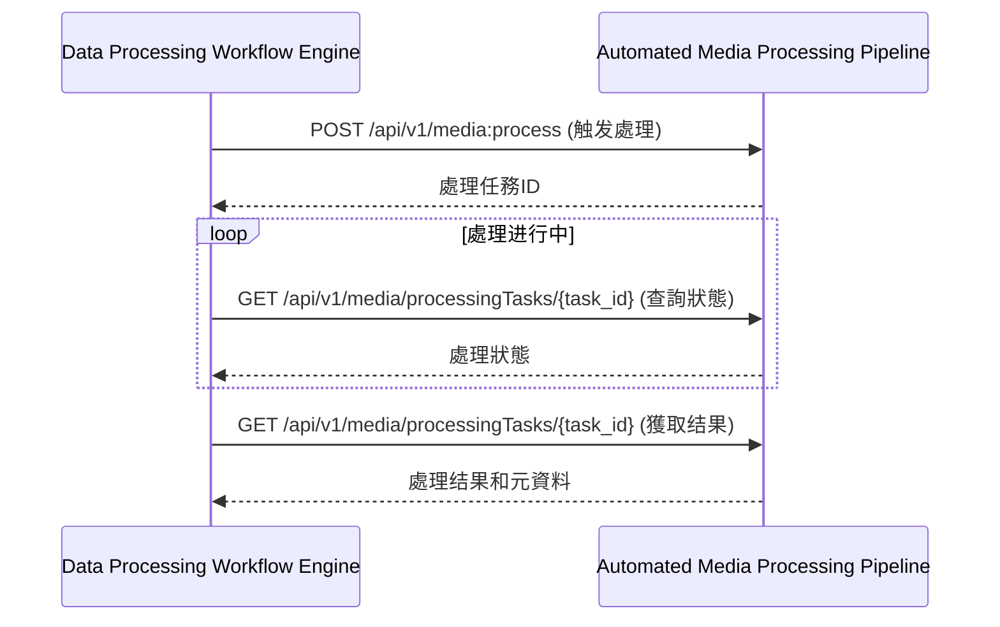
```mermaid
sequenceDiagram
    participant DPWE as Data Processing Workflow Engine
    participant AMP as Automated Media Processing Pipeline
    
    DPWE->>AMP: POST /api/v1/media:process (触发處理)
    AMP-->>DPWE: 處理任務ID
    
    loop 處理进行中
        DPWE->>AMP: GET /api/v1/media/processingTasks/{task_id} (查詢狀態)
        AMP-->>DPWE: 處理狀態
    end
    
    DPWE->>AMP: GET /api/v1/media/processingTasks/{task_id} (獲取结果)
    AMP-->>DPWE: 處理结果和元資料
```

#### 5.9.2 與AI輔助開发系統交互

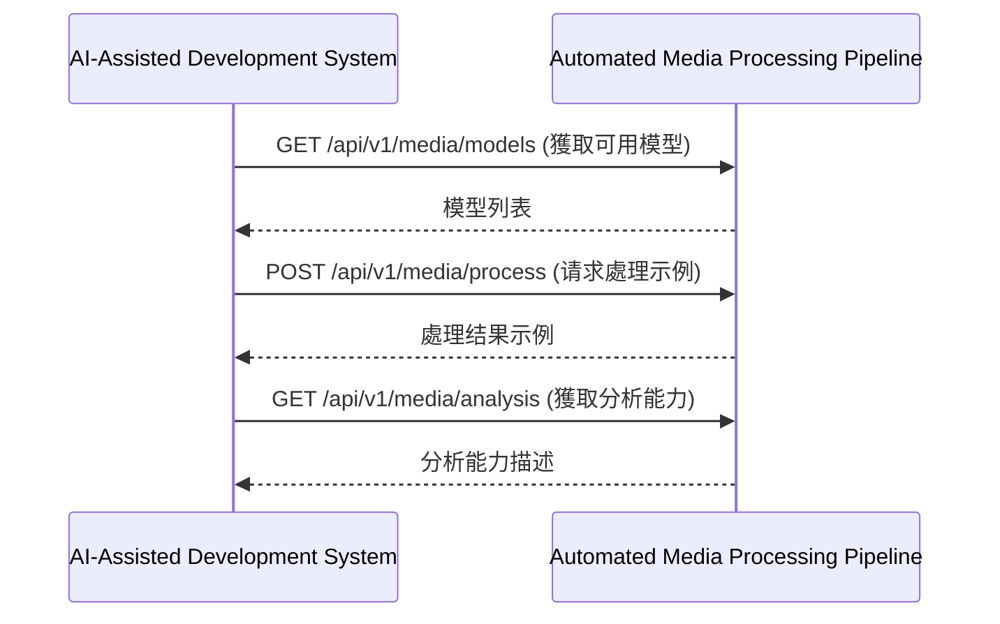
```mermaid
sequenceDiagram
    participant AIDS as AI-Assisted Development System
    participant AMP as Automated Media Processing Pipeline
    
    AIDS->>AMP: GET /api/v1/media/models (獲取可用模型)
    AMP-->>AIDS: 模型列表
    
    AIDS->>AMP: POST /api/v1/media/process (请求處理示例)
    AMP-->>AIDS: 處理结果示例
    
    AIDS->>AMP: GET /api/v1/media/analysis (獲取分析能力)
    AMP-->>AIDS: 分析能力描述
```

#### 5.9.3 與資料源註冊中心交互

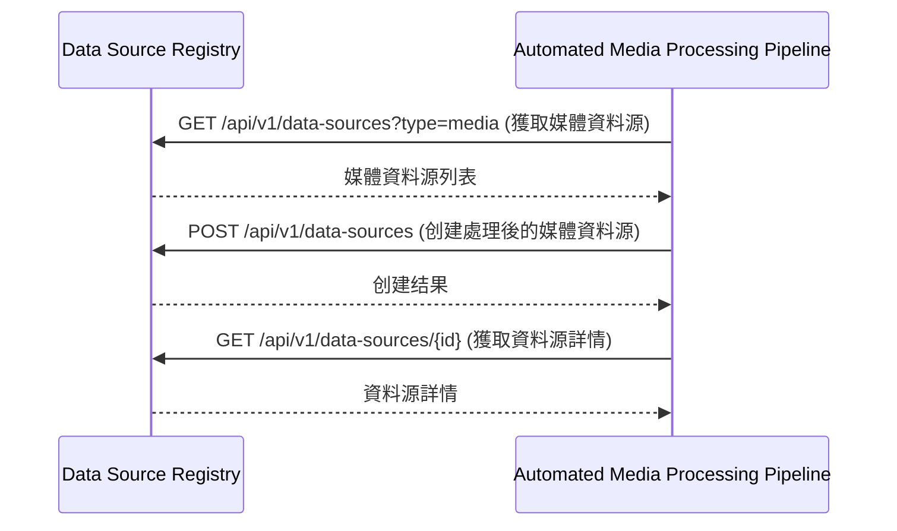
```mermaid
sequenceDiagram
    participant DSR as Data Source Registry
    participant AMP as Automated Media Processing Pipeline
    
    AMP->>DSR: GET /api/v1/data-sources?type=media (獲取媒體資料源)
    DSR-->>AMP: 媒體資料源列表
    
    AMP->>DSR: POST /api/v1/data-sources (创建處理後的媒體資料源)
    DSR-->>AMP: 创建结果
    
    AMP->>DSR: GET /api/v1/data-sources/{id} (獲取資料源詳情)
    DSR-->>AMP: 資料源詳情
```

## 6. AI輔助開发系統 (AI-Assisted Development System)

### 6.1 模組概述
AI輔助開发系統是镜界平台的智能助手，利用大型语言模型和领域知识庫，為爬蟲工程师和資料科学家提供代码生成、问题诊断和学习推薦等輔助功能。它通過自然语言交互，降低資料採集的技術门槛，提高開发效率。

### 6.2 詳細功能清單

#### 6.2.1 核心功能
- **自然语言需求解析**
  - 需求意图识别
  - 關鍵參數提取
  - 需求验證與澄清
  - 需求分解與任務规划
- **智能代码生成**
  - 爬蟲代码生成（Python、JavaScript）
  - 資料處理代码生成
  - 工作流定義生成
  - 测试用例生成
- **问题诊断與修複建議**
  - 错误日志分析
  - 反爬问题诊断
  - 效能瓶颈分析
  - 修複建議生成
- **学习路径個性化推薦**
  - 技能評估與差距分析
  - 個性化学习路径规划
  - 實战專案推薦
  - 进阶学习資源推薦

#### 6.2.2 高级功能
- **领域知识庫**
  - 爬蟲技術棧知识庫
  - 反爬策略資料庫
  - 網站技術棧指紋庫
  - HTTP狀態码知识庫
- **多轮對话记忆**
  - 上下文理解與跟踪
  - 對话狀態管理
  - 记忆長期化
  - 個性化偏好学习
- **代码理解與優化**
  - 代码静态分析
  - 代码品質評估
  - 效能優化建議
  - 安全漏洞檢測
- **整合開发环境支援**
  - VS Code插件
  - Jupyter Notebook整合
  - 命令行工具
  - 工作流内嵌調用

### 6.3 技術架構

#### 6.3.1 架構图
```
┌───────────────────────────────────────────────────────────────────────────────────────────────┐
│                                AI輔助開发系統 (AIDS)                                          │
├───────────────────────┬───────────────────────┬───────────────────────────────────────────────┤
│  交互层               │  服務层               │  資料层                                    │
├───────────────────────┼───────────────────────┼───────────────────────────────────────────────┤
│ • Web聊天界面         │ • 需求解析服務        │ • 领域知识庫                               │
│ • IDE插件             │ • 代码生成服務        │ • 代码片段庫                               │
│ • CLI工具             │ • 问题诊断服務        │ • 错误模式庫                               │
│ • 工作流内嵌調用       │ • 学习推薦服務        │ • 用戶画像庫                               │
└───────────────────────┴───────────────────────┴───────────────────────────────────────────────┘
```

#### 6.3.2 服務边界與交互
- **輸入**：
  - 自然语言查詢（用戶輸入）
  - 代码片段（用於分析或生成）
  - 错误日志（用於诊断）
  - 工作流定義（用於輔助）
- **輸出**：
  - 生成的代码
  - 问题诊断结果
  - 学习資源推薦
  - 需求澄清问题

### 6.4 核心組件詳細實現

#### 6.4.1 需求解析服務

**技術實現：**
```python
import re
import json
from typing import Dict, List, Optional, Tuple
import logging
import spacy
from spacy.tokens import Doc
from sklearn.feature_extraction.text import TfidfVectorizer
from sklearn.metrics.pairwise import cosine_similarity

class RequirementParser:
    """需求解析服務，將自然语言需求转换為結構化任務"""
    
    def __init__(
        self,
        nlp: spacy.Language,
        knowledge_base: KnowledgeBase,
        config: Config
    ):
        self.nlp = nlp
        self.knowledge_base = knowledge_base
        self.config = config
        self.logger = logging.getLogger(__name__)
    
    def parse(
        self,
        user_query: str,
        context: Optional[Dict] = None
    ) -> ParsedRequirement:
        """
        解析用戶需求
        
        :param user_query: 用戶自然语言查詢
        :param context: 對话上下文
        :return: 解析後的需求物件
        """
        # 1. 預處理用戶查詢
        cleaned_query = self._clean_query(user_query)
        
        # 2. 识别需求類型
        requirement_type = self._identify_requirement_type(cleaned_query)
        
        # 3. 提取關鍵參數
        parameters = self._extract_parameters(cleaned_query, requirement_type)
        
        # 4. 验證參數完整性
        missing_params = self._validate_parameters(requirement_type, parameters)
        
        # 5. 生成結構化需求
        return ParsedRequirement(
            original_query=user_query,
            cleaned_query=cleaned_query,
            requirement_type=requirement_type,
            parameters=parameters,
            missing_parameters=missing_params,
            confidence=self._calculate_confidence(requirement_type, parameters),
            context=context
        )
    
    def _clean_query(self, query: str) -> str:
        """清理用戶查詢"""
        # 移除特殊字符
        query = re.sub(r'[^\w\s]', ' ', query)
        
        # 转换為小写
        query = query.lower()
        
        # 移除多余空格
        query = re.sub(r'\s+', ' ', query).strip()
        
        return query
    
    def _identify_requirement_type(self, query: str) -> str:
        """识别需求類型"""
        # 基於關鍵词匹配
        if any(word in query for word in ["generate", "create", "make"]):
            if any(word in query for word in ["code", "script", "crawler"]):
                return "code_generation"
            elif any(word in query for word in ["workflow", "pipeline"]):
                return "workflow_generation"
        
        if any(word in query for word in ["why", "error", "problem", "fix", "debug"]):
            return "problem_diagnosis"
        
        if any(word in query for word in ["learn", "study", "tutorial", "how to"]):
            return "learning_request"
        
        # 默认類型
        return "general_query"
    
    def _extract_parameters(
        self,
        query: str,
        requirement_type: str
    ) -> Dict:
        """提取需求參數"""
        doc = self.nlp(query)
        parameters = {}
        
        if requirement_type == "code_generation":
            parameters.update(self._extract_code_generation_params(doc))
        elif requirement_type == "workflow_generation":
            parameters.update(self._extract_workflow_params(doc))
        elif requirement_type == "problem_diagnosis":
            parameters.update(self._extract_problem_diagnosis_params(doc))
        
        return parameters
    
    def _extract_code_generation_params(self, doc: Doc) -> Dict:
        """提取代码生成參數"""
        params = {}
        
        # 提取目標網站
        for ent in doc.ents:
            if ent.label_ in ["WEBSITE", "URL", "ORG"]:
                params["target_website"] = ent.text
        
        # 提取資料類型
        data_types = ["image", "video", "text", "html", "json", "xml"]
        for token in doc:
            if token.text in data_types:
                params["data_type"] = token.text
                break
        
        # 提取编程语言
        languages = ["python", "javascript", "java", "go"]
        for token in doc:
            if token.text in languages:
                params["language"] = token.text
                break
        
        # 提取特殊要求
        special_requirements = []
        if "login" in doc.text or "authentication" in doc.text:
            special_requirements.append("login_required")
        if "pagination" in doc.text or "page" in doc.text:
            special_requirements.append("pagination")
        if "infinite scroll" in doc.text:
            special_requirements.append("infinite_scroll")
        
        if special_requirements:
            params["special_requirements"] = special_requirements
        
        return params
    
    def _extract_workflow_params(self, doc: Doc) -> Dict:
        """提取工作流參數"""
        params = {}
        
        # 提取触发條件
        if "schedule" in doc.text or "定時" in doc.text:
            params["trigger"] = "schedule"
        elif "filesystem" in doc.text or "文件系統" in doc.text:
            params["trigger"] = "filesystem"
        elif "webhook" in doc.text or "回调" in doc.text:
            params["trigger"] = "webhook"
        
        # 提取處理步骤
        processing_steps = []
        if "download" in doc.text or "下载" in doc.text:
            processing_steps.append("download")
        if "extract" in doc.text or "提取" in doc.text:
            processing_steps.append("extract")
        if "transform" in doc.text or "转换" in doc.text:
            processing_steps.append("transform")
        if "analyze" in doc.text or "分析" in doc.text:
            processing_steps.append("analyze")
        if "store" in doc.text or "儲存" in doc.text:
            processing_steps.append("store")
        
        if processing_steps:
            params["processing_steps"] = processing_steps
        
        return params
    
    def _extract_problem_diagnosis_params(self, doc: Doc) -> Dict:
        """提取问题诊断參數"""
        params = {}
        
        # 提取错误資訊
        error_keywords = ["error", "exception", "failed", "not working"]
        for sent in doc.sents:
            if any(keyword in sent.text for keyword in error_keywords):
                params["error_message"] = sent.text
                break
        
        # 提取網站資訊
        for ent in doc.ents:
            if ent.label_ in ["WEBSITE", "URL", "ORG"]:
                params["target_website"] = ent.text
                break
        
        # 提取技術棧
        tech_keywords = ["javascript", "react", "angular", "vue", "angular", "wordpress"]
        for token in doc:
            if token.text in tech_keywords:
                params["technology"] = token.text
                break
        
        return params
    
    def _validate_parameters(
        self,
        requirement_type: str,
        parameters: Dict
    ) -> List[str]:
        """验證參數完整性"""
        missing_params = []
        
        if requirement_type == "code_generation":
            if "target_website" not in parameters:
                missing_params.append("target_website")
            if "data_type" not in parameters:
                missing_params.append("data_type")
        
        elif requirement_type == "workflow_generation":
            if "trigger" not in parameters:
                missing_params.append("trigger")
            if "processing_steps" not in parameters or not parameters["processing_steps"]:
                missing_params.append("processing_steps")
        
        elif requirement_type == "problem_diagnosis":
            if "error_message" not in parameters:
                missing_params.append("error_message")
        
        return missing_params
    
    def _calculate_confidence(
        self,
        requirement_type: str,
        parameters: Dict
    ) -> float:
        """计算解析置信度"""
        # 基於參數完整性
        if requirement_type == "general_query":
            return 0.5
        
        required_params = []
        if requirement_type == "code_generation":
            required_params = ["target_website", "data_type"]
        elif requirement_type == "workflow_generation":
            required_params = ["trigger", "processing_steps"]
        elif requirement_type == "problem_diagnosis":
            required_params = ["error_message"]
        
        if not required_params:
            return 0.8  # 一般查詢，置信度中等
        
        filled_params = [param for param in required_params if param in parameters]
        return len(filled_params) / len(required_params)

class KnowledgeBase:
    """领域知识庫，儲存爬蟲相關知识"""
    
    def __init__(self, config: Config):
        self.config = config
        self.logger = logging.getLogger(__name__)
        self._load_knowledge()
    
    def _load_knowledge(self):
        """加载知识庫"""
        # 從配置或資料庫加载知识
        self.anti_crawling_strategies = self._load_anti_crawling_strategies()
        self.technology_fingerprints = self._load_technology_fingerprints()
        self.error_patterns = self._load_error_patterns()
    
    def _load_anti_crawling_strategies(self) -> List[Dict]:
        """加载反爬策略知识"""
        return [
            {
                "id": "user-agent-check",
                "name": "User-Agent檢測",
                "description": "網站通過User-Agent檢測爬蟲",
                "indicators": [
                    "403 Forbidden響應",
                    "需要特定User-Agent才能訪問"
                ],
                "solutions": [
                    {
                        "title": "轮换User-Agent",
                        "description": "使用隨机User-Agent池",
                        "code_example": "from fake_useragent import UserAgent\nua = UserAgent()\nheaders = {'User-Agent': ua.random}",
                        "effectiveness": 0.85,
                        "complexity": 0.3
                    },
                    {
                        "title": "模拟浏览器特徵",
                        "description": "添加浏览器特有的请求头",
                        "code_example": "headers = {\n    'User-Agent': 'Mozilla/5.0...',\n    'Accept-Language': 'en-US,en;q=0.9',\n    'Sec-Ch-Ua': '\"Chromium\";v=\"112\", \"Google Chrome\";v=\"112\", \"Not_A Brand\";v=\"24\"'\n}",
                        "effectiveness": 0.92,
                        "complexity": 0.6
                    }
                ]
            },
            {
                "id": "rate-limiting",
                "name": "请求频率限制",
                "description": "網站限制单位時間内的请求數量",
                "indicators": [
                    "429 Too Many Requests響應",
                    "请求间隔過短导致失败"
                ],
                "solutions": [
                    {
                        "title": "添加请求间隔",
                        "description": "在请求之间添加隨机延遲",
                        "code_example": "import time\nimport random\ntime.sleep(random.uniform(1, 3))",
                        "effectiveness": 0.75,
                        "complexity": 0.2
                    },
                    {
                        "title": "使用代理IP轮换",
                        "description": "通過轮换不同IP地址分散请求",
                        "code_example": "proxies = {\n    'http': 'http://10.10.1.10:3128',\n    'https': 'http://10.10.1.10:1080',\n}\nresponse = requests.get(url, proxies=proxies)",
                        "effectiveness": 0.85,
                        "complexity": 0.7
                    }
                ]
            }
        ]
    
    def _load_technology_fingerprints(self) -> List[Dict]:
        """加载技術棧指紋知识"""
        return [
            {
                "id": "react",
                "name": "React",
                "detection_rules": [
                    {
                        "type": "html",
                        "pattern": "<div id=\"root\">",
                        "confidence": 0.9
                    },
                    {
                        "type": "js",
                        "pattern": "webpackJsonp",
                        "confidence": 0.8
                    }
                ],
                "crawl_implications": [
                    "需要處理客户端渲染內容",
                    "可能使用React Router进行导航"
                ]
            },
            {
                "id": "wordpress",
                "name": "WordPress",
                "detection_rules": [
                    {
                        "type": "meta",
                        "pattern": "generator",
                        "value": "WordPress",
                        "confidence": 0.95
                    },
                    {
                        "type": "path",
                        "pattern": "/wp-content/",
                        "confidence": 0.85
                    }
                ],
                "crawl_implications": [
                    "可能使用REST API",
                    "需要註意主题和插件的自定義結構"
                ]
            }
        ]
    
    def _load_error_patterns(self) -> List[Dict]:
        """加载错误模式知识"""
        return [
            {
                "id": "403-forbidden",
                "pattern": "403 Forbidden",
                "description": "訪問被拒绝",
                "causes": [
                    "IP被封禁",
                    "User-Agent被识别為爬蟲",
                    "缺少必要的请求头"
                ],
                "solutions": [
                    "使用代理IP",
                    "轮换User-Agent",
                    "添加Referer头"
                ],
                "examples": [
                    {
                        "code": "requests.get(url, headers={'User-Agent': 'Mozilla/5.0'})",
                        "description": "设置User-Agent解决403错误"
                    }
                ]
            },
            {
                "id": "429-too-many-requests",
                "pattern": "429 Too Many Requests",
                "description": "请求過於频繁",
                "causes": [
                    "请求频率超過網站限制",
                    "未使用请求间隔"
                ],
                "solutions": [
                    "添加隨机请求间隔",
                    "减少並發请求數",
                    "使用代理IP轮换"
                ],
                "examples": [
                    {
                        "code": "import time\ntime.sleep(2)  # 2秒间隔",
                        "description": "添加请求间隔解决429错误"
                    }
                ]
            }
        ]
    
    def get_anti_crawling_strategy(self, strategy_id: str) -> Optional[Dict]:
        """獲取反爬策略"""
        return next(
            (s for s in self.anti_crawling_strategies if s["id"] == strategy_id),
            None
        )
    
    def get_technology_fingerprint(self, tech_id: str) -> Optional[Dict]:
        """獲取技術棧指紋"""
        return next(
            (t for t in self.technology_fingerprints if t["id"] == tech_id),
            None
        )
    
    def match_error_pattern(self, error_message: str) -> List[Dict]:
        """匹配错误模式"""
        matches = []
        
        for pattern in self.error_patterns:
            # 简单實現：關鍵词匹配
            if any(keyword in error_message.lower() for keyword in pattern["pattern"].lower().split()):
                matches.append(pattern)
        
        return matches

# 輔助类定義
class ParsedRequirement:
    """解析後的需求物件"""
    def __init__(
        self,
        original_query: str,
        cleaned_query: str,
        requirement_type: str,
        parameters: Dict,
        missing_parameters: List[str],
        confidence: float,
        context: Optional[Dict] = None
    ):
        self.original_query = original_query
        self.cleaned_query = cleaned_query
        self.requirement_type = requirement_type
        self.parameters = parameters
        self.missing_parameters = missing_parameters
        self.confidence = confidence
        self.context = context or {}
```

#### 6.4.2 代码生成服務

**技術實現：**
```python
import os
import time
import json
from typing import Dict, List, Optional
import logging
import openai
from jinja2 import Template

class CodeGenerationService:
    """
    AI代码生成服務，支援多種爬蟲場景
    """
    
    def __init__(
        self,
        llm_client: LLMClient,
        template_repo: TemplateRepository,
        scene_classifier: SceneClassifier,
        code_validator: CodeValidator,
        config: Config
    ):
        self.llm_client = llm_client
        self.template_repo = template_repo
        self.scene_classifier = scene_classifier
        self.code_validator = code_validator
        self.config = config
        self.logger = logging.getLogger(__name__)
    
    def generate_code(
        self,
        user_request: str,
        context: dict = None
    ) -> CodeGenerationResult:
        """
        根據用戶需求生成爬蟲代码
        
        :param user_request: 用戶自然语言描述
        :param context: 上下文資訊（可选）
        :return: 代码生成结果
        """
        start_time = time.time()
        
        try:
            # 1. 場景分類
            scene_type = self.scene_classifier.classify(user_request)
            
            # 2. 獲取相關模板
            templates = self.template_repo.get_templates(
                scene_type=scene_type,
                language=context.get("language", "python") if context else "python"
            )
            
            # 3. 構建提示词
            prompt = self._build_prompt(user_request, templates, context)
            
            # 4. 調用LLM生成代码
            raw_code = self.llm_client.generate(prompt)
            
            # 5. 代码後處理與验證
            processed_code = self._post_process_code(raw_code, scene_type)
            validation_result = self.code_validator.validate(processed_code)
            
            # 6. 構建结果
            return CodeGenerationResult(
                code=processed_code,
                scene_type=scene_type,
                templates_used=[t.id for t in templates],
                validation=validation_result,
                confidence=self._calculate_confidence(validation_result),
                processing_time=time.time() - start_time
            )
            
        except Exception as e:
            self.logger.error("Code generation failed: %s", str(e))
            raise CodeGenerationError(f"Failed to generate code: {str(e)}")
    
    def _build_prompt(
        self,
        user_request: str,
        templates: List[CodeTemplate],
        context: dict
    ) -> str:
        """構建LLM提示词"""
        # 加载提示词模板
        template_path = self.config.get("prompt_template_path", "prompts/code_generation.j2")
        with open(template_path, 'r') as f:
            template_content = f.read()
        
        # 准備模板变量
        template_vars = {
            "user_request": user_request,
            "templates": [
                {
                    "id": t.id,
                    "name": t.name,
                    "description": t.description,
                    "content": t.content,
                    "parameters": t.parameters
                } for t in templates
            ],
            "context": context or {},
            "current_date": datetime.now().strftime("%Y-%m-%d"),
            "programming_language": context.get("language", "Python") if context else "Python"
        }
        
        # 渲染提示词
        jinja_template = Template(template_content)
        return jinja_template.render(**template_vars)
    
    def _post_process_code(self, raw_code: str, scene_type: str) -> str:
        """代码後處理：清理、格式化、添加註释"""
        # 1. 移除多余內容
        code = self._remove_extra_content(raw_code)
        
        # 2. 根據場景類型进行特定後處理
        if scene_type == "static-html":
            code = self._process_static_html_code(code)
        elif scene_type == "dynamic-rendering":
            code = self._process_dynamic_rendering_code(code)
        elif scene_type == "api-endpoint":
            code = self._process_api_code(code)
        
        # 3. 格式化代码
        code = self._format_code(code)
        
        # 4. 添加必要的导入
        code = self._add_required_imports(code)
        
        return code
    
    def _remove_extra_content(self, code: str) -> str:
        """移除LLM生成的多余內容"""
        # 移除Markdown代码块標记
        code = re.sub(r'```python\n', '', code)
        code = re.sub(r'\n```', '', code)
        
        # 移除解释性文本
        if "```" in code:
            code = code.split("```")[0]
        
        return code.strip()
    
    def _process_static_html_code(self, code: str) -> str:
        """處理静态HTML爬蟲代码"""
        # 確保使用了requests和BeautifulSoup
        if "import requests" not in code:
            code = "import requests\n" + code
        if "from bs4 import BeautifulSoup" not in code and "BeautifulSoup" in code:
            code = "from bs4 import BeautifulSoup\n" + code
        
        # 添加基本错误處理
        if "try:" not in code:
            code = self._add_basic_error_handling(code)
        
        return code
    
    def _process_dynamic_rendering_code(self, code: str) -> str:
        """處理動态渲染頁面爬蟲代码"""
        # 確保使用了selenium
        if "from selenium import webdriver" not in code:
            code = "from selenium import webdriver\n" + code
        
        # 添加等待機制
        if "WebDriverWait" not in code and "wait" in code.lower():
            code = self._add_wait_mechanism(code)
        
        return code
    
    def _process_api_code(self, code: str) -> str:
        """處理API爬蟲代码"""
        # 確保處理了分頁
        if "page" in code.lower() and "while" not in code and "for" not in code:
            code = self._add_pagination_handling(code)
        
        # 添加速率限制
        if "time.sleep" not in code and "rate limit" in code.lower():
            code = self._add_rate_limiting(code)
        
        return code
    
    def _add_basic_error_handling(self, code: str) -> str:
        """添加基本错误處理"""
        error_handling = """
try:
    # 原有代码
    {}
except Exception as e:
    print(f"Error: {str(e)}")
    # 可以添加更多错误處理逻辑
"""
        return error_handling.format(code)
    
    def _add_wait_mechanism(self, code: str) -> str:
        """添加等待機制"""
        wait_code = """
from selenium.webdriver.support.ui import WebDriverWait
from selenium.webdriver.support import expected_conditions as EC
from selenium.webdriver.common.by import By

# 等待元素加载
wait = WebDriverWait(driver, 10)
element = wait.until(EC.presence_of_element_located((By.ID, "target-element")))
"""
        return wait_code + "\n\n" + code
    
    def _add_pagination_handling(self, code: str) -> str:
        """添加分頁處理"""
        pagination_code = """
# 處理分頁
page = 1
all_data = []

while True:
    # 構建URL
    url = f"https://api.example.com/data?page={page}"
    
    # 发送请求
    response = requests.get(url)
    data = response.json()
    
    # 检查是否还有資料
    if not data["items"]:
        break
    
    # 添加到结果
    all_data.extend(data["items"])
    
    # 下一頁
    page += 1
"""
        return pagination_code + "\n\n" + code
    
    def _add_rate_limiting(self, code: str) -> str:
        """添加速率限制"""
        rate_limiting_code = """
import time

# 添加请求间隔
def make_request(url):
    response = requests.get(url)
    time.sleep(1)  # 1秒间隔
    return response
"""
        return rate_limiting_code + "\n\n" + code
    
    def _format_code(self, code: str) -> str:
        """格式化代码"""
        # 這里简化實現，實际应该使用black等格式化工具
        return code
    
    def _add_required_imports(self, code: str) -> str:
        """添加必要的导入"""
        imports = []
        
        if "requests" in code and "import requests" not in code:
            imports.append("import requests")
        if "BeautifulSoup" in code and "from bs4 import BeautifulSoup" not in code:
            imports.append("from bs4 import BeautifulSoup")
        if "selenium" in code and "from selenium import webdriver" not in code:
            imports.append("from selenium import webdriver")
        
        if imports:
            return "\n".join(imports) + "\n\n" + code
        
        return code
    
    def _calculate_confidence(self, validation_result: ValidationResult) -> float:
        """计算生成代码的置信度"""
        # 根據验證结果计算置信度
        if validation_result.is_valid:
            return 0.9
        elif validation_result.errors:
            # 根據错误严重程度调整
            severity_weights = {
                "syntax": 0.3,
                "import": 0.2,
                "logic": 0.5
            }
            
            total_deduction = 0
            for error in validation_result.errors:
                weight = severity_weights.get(error["type"], 0.2)
                total_deduction += weight * error.get("severity", 1.0)
            
            return max(0.1, 1.0 - total_deduction)
        
        return 0.5

class SceneClassifier:
    """爬蟲場景分類器"""
    
    SCENE_CATEGORIES = [
        "static-html", 
        "dynamic-rendering", 
        "api-endpoint", 
        "image-crawling",
        "video-crawling",
        "login-required",
        "pagination",
        "infinite-scroll"
    ]
    
    def __init__(self):
        # 加载預训练分類模型
        self.model = load_model("scene-classification-v1")
    
    def classify(self, user_request: str) -> str:
        """將用戶请求分類到最匹配的場景"""
        # 實現分類逻辑
        return self.model.predict(user_request)

class TemplateRepository:
    """代码模板仓庫"""
    
    def __init__(self, db: Database):
        self.db = db
        self.logger = logging.getLogger(__name__)
    
    def get_templates(
        self,
        scene_type: str,
        language: str = "python"
    ) -> List[CodeTemplate]:
        """獲取相關代码模板"""
        # 從資料庫獲取模板
        sql = """
        SELECT * FROM code_templates 
        WHERE scene_type = %(scene_type)s 
        AND language = %(language)s
        ORDER BY priority DESC
        """
        
        rows = self.db.fetchall(sql, {
            "scene_type": scene_type,
            "language": language
        })
        
        return [self._row_to_template(row) for row in rows]
    
    def _row_to_template(self, row: Dict) -> CodeTemplate:
        """將資料庫行转换為CodeTemplate物件"""
        return CodeTemplate(
            id=row["id"],
            name=row["name"],
            description=row["description"],
            language=row["language"],
            scene_type=row["scene_type"],
            content=row["content"],
            parameters=self._decode_parameters(row["parameters"]),
            examples=self._decode_examples(row["examples"]),
            priority=row["priority"],
            created_at=row["created_at"],
            updated_at=row["updated_at"]
        )
    
    def _decode_parameters(self, json_data: str) -> List[TemplateParameter]:
        """解码參數定義"""
        if not json_data:
            return []
        
        params_data = json.loads(json_data)
        return [
            TemplateParameter(
                name=p["name"],
                type=p["type"],
                description=p.get("description", ""),
                default=p.get("default"),
                required=p.get("required", True)
            ) for p in params_data
        ]
    
    def _decode_examples(self, json_data: str) -> List[CodeExample]:
        """解码示例代码"""
        if not json_data:
            return []
        
        examples_data = json.loads(json_data)
        return [
            CodeExample(
                title=e["title"],
                description=e.get("description", ""),
                code=e["code"],
                parameters=e.get("parameters", {})
            ) for e in examples_data
        ]

class CodeValidator:
    """代码验證器"""
    
    def validate(self, code: str) -> ValidationResult:
        """
        验證生成的代码
        
        :param code: 生成的代码
        :return: 验證结果
        """
        errors = []
        
        # 1. 语法验證
        syntax_errors = self._validate_syntax(code)
        errors.extend(syntax_errors)
        
        # 2. 导入验證
        import_errors = self._validate_imports(code)
        errors.extend(import_errors)
        
        # 3. 逻辑验證
        logic_errors = self._validate_logic(code)
        errors.extend(logic_errors)
        
        return ValidationResult(
            is_valid=len(errors) == 0,
            errors=errors
        )
    
    def _validate_syntax(self, code: str) -> List[Dict]:
        """验證代码语法"""
        try:
            ast.parse(code)
            return []
        except SyntaxError as e:
            return [{
                "type": "syntax",
                "message": str(e),
                "line": e.lineno,
                "severity": 1.0
            }]
        except Exception as e:
            return [{
                "type": "syntax",
                "message": f"Syntax validation error: {str(e)}",
                "severity": 0.8
            }]
    
    def _validate_imports(self, code: str) -> List[Dict]:
        """验證导入语句"""
        errors = []
        
        # 检查requests庫
        if ("requests" in code or "get(" in code) and "import requests" not in code:
            errors.append({
                "type": "import",
                "message": "Missing import for requests library",
                "severity": 0.7
            })
        
        # 检查BeautifulSoup
        if "BeautifulSoup" in code and "from bs4 import BeautifulSoup" not in code:
            errors.append({
                "type": "import",
                "message": "Missing import for BeautifulSoup",
                "severity": 0.6
            })
        
        # 检查selenium
        if "webdriver" in code and "from selenium import webdriver" not in code:
            errors.append({
                "type": "import",
                "message": "Missing import for selenium",
                "severity": 0.6
            })
        
        return errors
    
    def _validate_logic(self, code: str) -> List[Dict]:
        """验證代码逻辑（简化實現）"""
        errors = []
        
        # 检查分頁處理
        if "page" in code.lower() and "while" not in code and "for" not in code:
            errors.append({
                "type": "logic",
                "message": "Pagination logic appears incomplete",
                "severity": 0.5
            })
        
        # 检查速率限制
        if ("api" in code.lower() or "request" in code.lower()) and "time.sleep" not in code:
            errors.append({
                "type": "logic",
                "message": "Missing rate limiting",
                "severity": 0.4
            })
        
        # 检查错误處理
        if "try" not in code and ("requests.get" in code or "selenium" in code):
            errors.append({
                "type": "logic",
                "message": "Missing error handling for network requests",
                "severity": 0.6
            })
        
        # 检查User-Agent设置（针對爬蟲）
        if "requests.get" in code and "User-Agent" not in code:
            errors.append({
                "type": "logic",
                "message": "Missing User-Agent header (may trigger anti-crawling)",
                "severity": 0.7
            })
        
        return errors

class ValidationResult:
    """代码验證结果"""
    def __init__(
        self,
        is_valid: bool,
        errors: List[Dict]
    ):
        self.is_valid = is_valid
        self.errors = errors
```

#### 6.4.3 问题诊断服務

**技術實現：**
```python
class ProblemDiagnosisService:
    """问题诊断服務，分析错误並提供解决方案"""
    
    def __init__(
        self,
        llm_client: LLMClient,
        knowledge_base: KnowledgeBase,
        error_analyzer: ErrorAnalyzer,
        config: Config
    ):
        self.llm_client = llm_client
        self.knowledge_base = knowledge_base
        self.error_analyzer = error_analyzer
        self.config = config
        self.logger = logging.getLogger(__name__)
    
    def diagnose(
        self,
        error_log: str,
        context: dict = None
    ) -> DiagnosisResult:
        """
        诊断错误问题並提供解决方案
        
        :param error_log: 错误日志
        :param context: 上下文資訊（可选）
        :return: 诊断结果
        """
        start_time = time.time()
        
        try:
            # 1. 分析错误類型
            error_analysis = self.error_analyzer.analyze(error_log)
            
            # 2. 獲取相關知识
            relevant_knowledge = self._get_relevant_knowledge(error_analysis)
            
            # 3. 構建诊断提示
            prompt = self._build_diagnosis_prompt(error_log, error_analysis, relevant_knowledge, context)
            
            # 4. 調用LLM生成诊断
            diagnosis = self.llm_client.generate(prompt)
            
            # 5. 解析诊断结果
            parsed_diagnosis = self._parse_diagnosis(diagnosis, error_analysis)
            
            # 6. 構建结果
            return DiagnosisResult(
                error_log=error_log,
                analysis=error_analysis,
                diagnosis=parsed_diagnosis,
                solutions=self._extract_solutions(parsed_diagnosis),
                confidence=self._calculate_confidence(parsed_diagnosis, error_analysis),
                processing_time=time.time() - start_time
            )
            
        except Exception as e:
            self.logger.error("Problem diagnosis failed: %s", str(e))
            raise DiagnosisError(f"Failed to diagnose problem: {str(e)}")
    
    def _get_relevant_knowledge(self, error_analysis: ErrorAnalysis) -> Dict:
        """獲取相關知识庫內容"""
        knowledge = {
            "error_patterns": [],
            "anti_crawling_strategies": [],
            "technology_fingerprints": []
        }
        
        # 匹配错误模式
        if error_analysis.error_type:
            patterns = self.knowledge_base.match_error_pattern(error_analysis.error_message)
            knowledge["error_patterns"] = patterns
        
        # 獲取相關反爬策略
        if error_analysis.anti_crawling_indicators:
            for indicator in error_analysis.anti_crawling_indicators:
                strategy = self.knowledge_base.get_anti_crawling_strategy(indicator)
                if strategy:
                    knowledge["anti_crawling_strategies"].append(strategy)
        
        # 獲取技術棧指紋
        if error_analysis.technology:
            fingerprint = self.knowledge_base.get_technology_fingerprint(error_analysis.technology)
            if fingerprint:
                knowledge["technology_fingerprints"].append(fingerprint)
        
        return knowledge
    
    def _build_diagnosis_prompt(
        self,
        error_log: str,
        error_analysis: ErrorAnalysis,
        knowledge: Dict,
        context: dict
    ) -> str:
        """構建诊断提示词"""
        # 加载提示词模板
        template_path = self.config.get("diagnosis_prompt_template", "prompts/diagnosis.j2")
        with open(template_path, 'r') as f:
            template_content = f.read()
        
        # 准備模板变量
        template_vars = {
            "error_log": error_log,
            "error_analysis": {
                "error_type": error_analysis.error_type,
                "error_message": error_analysis.error_message,
                "status_code": error_analysis.status_code,
                "anti_crawling_indicators": error_analysis.anti_crawling_indicators,
                "technology": error_analysis.technology,
                "url": error_analysis.url
            },
            "knowledge": knowledge,
            "context": context or {},
            "current_date": datetime.now().strftime("%Y-%m-%d")
        }
        
        # 渲染提示词
        jinja_template = Template(template_content)
        return jinja_template.render(**template_vars)
    
    def _parse_diagnosis(self, diagnosis_text: str, error_analysis: ErrorAnalysis) -> Dict:
        """解析诊断结果"""
        # 简单實現：提取關鍵資訊
        result = {
            "root_cause": "",
            "impact": "",
            "suggested_solutions": []
        }
        
        # 提取根本原因
        cause_match = re.search(r'根本原因[:：]\s*(.*?)(?=\n\s*[A-Z]|$)', diagnosis_text, re.IGNORECASE)
        if cause_match:
            result["root_cause"] = cause_match.group(1).strip()
        
        # 提取影响
        impact_match = re.search(r'影响[:：]\s*(.*?)(?=\n\s*[A-Z]|$)', diagnosis_text, re.IGNORECASE)
        if impact_match:
            result["impact"] = impact_match.group(1).strip()
        
        # 提取解决方案
        solutions_match = re.findall(r'解决方案\s*\d*[:：]\s*(.*?)(?=\n\s*(?:解决方案|$))', diagnosis_text, re.IGNORECASE)
        for solution in solutions_match:
            result["suggested_solutions"].append(solution.strip())
        
        # 如果沒有提取到，使用整個文本作為原因
        if not result["root_cause"]:
            result["root_cause"] = diagnosis_text.split('\n')[0]
        
        return result
    
    def _extract_solutions(self, parsed_diagnosis: Dict) -> List[Dict]:
        """從诊断结果中提取解决方案"""
        solutions = []
        
        # 從知识庫獲取標准解决方案
        if parsed_diagnosis.get("root_cause"):
            # 這里可以添加更複杂的逻辑來匹配知识庫中的解决方案
            pass
        
        # 從解析结果中提取
        for i, solution_text in enumerate(parsed_diagnosis.get("suggested_solutions", [])):
            solutions.append({
                "id": f"sol-{i+1}",
                "description": solution_text,
                "confidence": 0.8,  # 简化實現
                "implementation": self._generate_implementation(solution_text)
            })
        
        return solutions
    
    def _generate_implementation(self, solution_description: str) -> str:
        """為解决方案生成實現代码"""
        # 简单實現：基於描述生成代码示例
        if "User-Agent" in solution_description:
            return """headers = {
    'User-Agent': 'Mozilla/5.0 (Windows NT 10.0; Win64; x64) AppleWebKit/537.36 (KHTML, like Gecko) Chrome/91.0.4472.124 Safari/537.36'
}
response = requests.get(url, headers=headers)"""
        
        if "proxy" in solution_description.lower():
            return """proxies = {
    'http': 'http://10.10.1.10:3128',
    'https': 'http://10.10.1.10:1080',
}
response = requests.get(url, proxies=proxies)"""
        
        # 默认實現
        return f"# {solution_description}\n# 實現代码示例\npass"
    
    def _calculate_confidence(self, parsed_diagnosis: Dict, error_analysis: ErrorAnalysis) -> float:
        """计算诊断置信度"""
        base_confidence = 0.7
        
        # 根據分析的完整性调整
        if error_analysis.error_type:
            base_confidence += 0.1
        if error_analysis.anti_crawling_indicators:
            base_confidence += 0.1
        if error_analysis.technology:
            base_confidence += 0.05
        
        # 根據诊断结果的詳細程度调整
        if parsed_diagnosis.get("root_cause") and len(parsed_diagnosis["root_cause"]) > 20:
            base_confidence += 0.05
        if parsed_diagnosis.get("suggested_solutions") and len(parsed_diagnosis["suggested_solutions"]) >= 2:
            base_confidence += 0.05
        
        return min(1.0, base_confidence)

class ErrorAnalyzer:
    """错误分析器，提取错误關鍵資訊"""
    
    def analyze(self, error_log: str) -> ErrorAnalysis:
        """
        分析错误日志
        
        :param error_log: 错误日志
        :return: 错误分析结果
        """
        # 1. 提取HTTP狀態码
        status_code = self._extract_status_code(error_log)
        
        # 2. 识别错误類型
        error_type = self._identify_error_type(error_log, status_code)
        
        # 3. 檢測反爬迹象
        anti_crawling_indicators = self._detect_anti_crawling_indicators(error_log)
        
        # 4. 识别技術棧
        technology = self._identify_technology(error_log)
        
        # 5. 提取URL
        url = self._extract_url(error_log)
        
        return ErrorAnalysis(
            error_message=error_log,
            error_type=error_type,
            status_code=status_code,
            anti_crawling_indicators=anti_crawling_indicators,
            technology=technology,
            url=url
        )
    
    def _extract_status_code(self, error_log: str) -> Optional[int]:
        """提取HTTP狀態码"""
        # 匹配常见的HTTP狀態码
        pattern = r'HTTP\s*(\d{3})|status\s*code\s*(\d{3})'
        match = re.search(pattern, error_log, re.IGNORECASE)
        if match:
            return int(match.group(1) or match.group(2))
        return None
    
    def _identify_error_type(self, error_log: str, status_code: Optional[int]) -> str:
        """识别错误類型"""
        # 基於狀態码
        if status_code:
            if 400 <= status_code < 500:
                return "client_error"
            if 500 <= status_code < 600:
                return "server_error"
        
        # 基於错误消息
        if "timeout" in error_log.lower():
            return "timeout"
        if "connection" in error_log.lower() and "refused" in error_log.lower():
            return "connection_refused"
        if "ssl" in error_log.lower() or "certificate" in error_log.lower():
            return "ssl_error"
        if "forbidden" in error_log.lower() or "403" in error_log:
            return "forbidden"
        if "not found" in error_log.lower() or "404" in error_log:
            return "not_found"
        
        return "unknown"
    
    def _detect_anti_crawling_indicators(self, error_log: str) -> List[str]:
        """檢測反爬迹象"""
        indicators = []
        
        # 检查常见的反爬特徵
        if re.search(r'captcha|验證|challenge', error_log, re.IGNORECASE):
            indicators.append("captcha")
        if "403" in error_log and "User-Agent" in error_log:
            indicators.append("user-agent-check")
        if "429" in error_log or "too many requests" in error_log.lower():
            indicators.append("rate-limiting")
        if "Access Denied" in error_log:
            indicators.append("access-denied")
        if "bot" in error_log.lower() or "crawler" in error_log.lower():
            indicators.append("bot-detection")
        
        return indicators
    
    def _identify_technology(self, error_log: str) -> Optional[str]:
        """识别網站技術棧"""
        # 简单實現：基於错误消息中的關鍵词
        tech_indicators = {
            "cloudflare": ["cloudflare", "cf-ray", "challenge"],
            "akamai": ["akamai", "akam"], 
            "sucuri": ["sucuri"],
            "incapsula": ["incapsula"]
        }
        
        for tech, keywords in tech_indicators.items():
            if any(keyword in error_log.lower() for keyword in keywords):
                return tech
        
        return None
    
    def _extract_url(self, error_log: str) -> Optional[str]:
        """提取URL"""
        url_pattern = r'https?://(?:[-\w.]|(?:%[\da-fA-F]{2}))+[/\w\.-]*(?:\?[\w=&]*)?'
        match = re.search(url_pattern, error_log)
        return match.group(0) if match else None

# 輔助类定義
class ErrorAnalysis:
    """错误分析结果"""
    def __init__(
        self,
        error_message: str,
        error_type: str,
        status_code: Optional[int] = None,
        anti_crawling_indicators: List[str] = None,
        technology: Optional[str] = None,
        url: Optional[str] = None
    ):
        self.error_message = error_message
        self.error_type = error_type
        self.status_code = status_code
        self.anti_crawling_indicators = anti_crawling_indicators or []
        self.technology = technology
        self.url = url

class DiagnosisResult:
    """诊断结果"""
    def __init__(
        self,
        error_log: str,
        analysis: ErrorAnalysis,
        diagnosis: Dict,
        solutions: List[Dict],
        confidence: float,
        processing_time: float
    ):
        self.error_log = error_log
        self.analysis = analysis
        self.diagnosis = diagnosis
        self.solutions = solutions
        self.confidence = confidence
        self.processing_time = processing_time
```

#### 6.4.4 学习推薦服務

**技術實現：**
```python
class LearningRecommendationService:
    """学习推薦服務，提供個性化学习路径"""
    
    def __init__(
        self,
        user_profile_service: UserProfileService,
        content_repository: ContentRepository,
        skill_assessment: SkillAssessment,
        config: Config
    ):
        self.user_profile_service = user_profile_service
        self.content_repository = content_repository
        self.skill_assessment = skill_assessment
        self.config = config
        self.logger = logging.getLogger(__name__)
    
    def recommend(
        self,
        user_id: str,
        context: dict = None
    ) -> LearningRecommendation:
        """
        為用戶生成学习推薦
        
        :param user_id: 用戶ID
        :param context: 上下文資訊（可选）
        :return: 学习推薦
        """
        start_time = time.time()
        
        try:
            # 1. 獲取用戶画像
            user_profile = self.user_profile_service.get_profile(user_id)
            
            # 2. 評估用戶技能
            skill_assessment = self.skill_assessment.evaluate(user_id, context)
            
            # 3. 识别技能差距
            skill_gaps = self._identify_skill_gaps(skill_assessment)
            
            # 4. 獲取相關学习內容
            relevant_content = self._get_relevant_content(skill_gaps, user_profile)
            
            # 5. 生成個性化学习路径
            learning_path = self._generate_learning_path(
                user_profile,
                skill_assessment,
                skill_gaps,
                relevant_content
            )
            
            # 6. 構建结果
            return LearningRecommendation(
                user_id=user_id,
                profile_snapshot=user_profile,
                skill_assessment=skill_assessment,
                skill_gaps=skill_gaps,
                recommended_content=learning_path,
                confidence=self._calculate_confidence(skill_assessment, skill_gaps),
                generated_at=datetime.utcnow(),
                processing_time=time.time() - start_time
            )
            
        except Exception as e:
            self.logger.error("Learning recommendation failed: %s", str(e))
            raise RecommendationError(f"Failed to generate learning recommendation: {str(e)}")
    
    def _identify_skill_gaps(
        self,
        skill_assessment: SkillAssessmentResult
    ) -> List[SkillGap]:
        """识别技能差距"""
        gaps = []
        
        # 检查關鍵技能领域
        for domain, assessment in skill_assessment.domain_assessments.items():
            # 定義關鍵技能
            key_skills = self.config.get(f"key_skills.{domain}", [])
            
            for skill in key_skills:
                current_level = assessment.get("skills", {}).get(skill, 0)
                target_level = self.config.get(f"target_level.{domain}.{skill}", 3)
                
                if current_level < target_level:
                    gaps.append(SkillGap(
                        domain=domain,
                        skill=skill,
                        current_level=current_level,
                        target_level=target_level,
                        gap_size=target_level - current_level
                    ))
        
        # 按差距大小排序
        gaps.sort(key=lambda x: x.gap_size, reverse=True)
        
        # 只返回top N
        return gaps[:self.config.get("max_recommendations", 5)]
    
    def _get_relevant_content(
        self,
        skill_gaps: List[SkillGap],
        user_profile: UserProfile
    ) -> List[LearningContent]:
        """獲取相關学习內容"""
        all_content = []
        
        # 為每個技能差距獲取內容
        for gap in skill_gaps:
            domain_content = self.content_repository.get_content(
                domain=gap.domain,
                skill=gap.skill,
                min_difficulty=gap.current_level + 1,
                max_difficulty=min(5, gap.target_level + 1),
                language=user_profile.preferred_language
            )
            
            # 按相關性排序
            sorted_content = self._rank_content(domain_content, gap, user_profile)
            all_content.extend(sorted_content)
        
        # 去重並限制數量
        unique_content = self._deduplicate_content(all_content)
        return unique_content[:self.config.get("max_content_per_recommendation", 10)]
    
    def _rank_content(
        self,
        content_list: List[LearningContent],
        skill_gap: SkillGap,
        user_profile: UserProfile
    ) -> List[LearningContent]:
        """對学习內容进行排序"""
        ranked = []
        
        for content in content_list:
            # 计算相關性分數
            relevance = self._calculate_relevance(content, skill_gap, user_profile)
            ranked.append((content, relevance))
        
        # 按相關性排序
        ranked.sort(key=lambda x: x[1], reverse=True)
        
        return [item[0] for item in ranked]
    
    def _calculate_relevance(
        self,
        content: LearningContent,
        skill_gap: SkillGap,
        user_profile: UserProfile
    ) -> float:
        """计算內容相關性"""
        score = 0.0
        
        # 技能匹配度
        if content.skill == skill_gap.skill:
            score += 0.4
        
        # 难度匹配度
        difficulty_match = 1.0 - abs(content.difficulty - (skill_gap.current_level + 0.5)) / 5.0
        score += difficulty_match * 0.3
        
        # 格式偏好
        if content.format in user_profile.content_preferences:
            score += 0.2
        
        # 语言匹配
        if content.language == user_profile.preferred_language:
            score += 0.1
        
        return min(1.0, score)
    
    def _deduplicate_content(self, content_list: List[LearningContent]) -> List[LearningContent]:
        """去重学习內容"""
        seen = set()
        unique_content = []
        
        for content in content_list:
            if content.id not in seen:
                seen.add(content.id)
                unique_content.append(content)
        
        return unique_content
    
    def _generate_learning_path(
        self,
        user_profile: UserProfile,
        skill_assessment: SkillAssessmentResult,
        skill_gaps: List[SkillGap],
        relevant_content: List[LearningContent]
    ) -> LearningPath:
        """生成学习路径"""
        # 按领域分組內容
        content_by_domain = defaultdict(list)
        for content in relevant_content:
            content_by_domain[content.domain].append(content)
        
        # 為每個领域生成路径
        domain_paths = []
        for domain, contents in content_by_domain.items():
            domain_path = self._generate_domain_path(domain, contents, skill_gaps)
            domain_paths.append(domain_path)
        
        # 整合為完整学习路径
        return LearningPath(
            title="個性化爬蟲技能提升路径",
            description="根據您的技能評估生成的個性化学习路径",
            domains=domain_paths,
            estimated_duration=self._calculate_estimated_duration(relevant_content),
            difficulty_level=self._determine_difficulty_level(skill_assessment)
        )
    
    def _generate_domain_path(
        self,
        domain: str,
        contents: List[LearningContent],
        skill_gaps: List[SkillGap]
    ) -> DomainPath:
        """生成特定领域的学习路径"""
        # 按技能分組
        contents_by_skill = defaultdict(list)
        for content in contents:
            contents_by_skill[content.skill].append(content)
        
        # 為每個技能生成路径
        skill_paths = []
        for skill, skill_contents in contents_by_skill.items():
            # 按难度排序
            sorted_contents = sorted(skill_contents, key=lambda x: x.difficulty)
            
            # 创建技能路径
            skill_paths.append(SkillPath(
                skill=skill,
                description=f"{skill}技能提升路径",
                contents=sorted_contents,
                estimated_time=sum(c.estimated_duration for c in sorted_contents)
            ))
        
        return DomainPath(
            domain=domain,
            paths=skill_paths,
            estimated_time=sum(p.estimated_time for p in skill_paths)
        )
    
    def _calculate_estimated_duration(self, contents: List[LearningContent]) -> timedelta:
        """计算預计学习時間"""
        total_minutes = sum(content.estimated_duration for content in contents)
        return timedelta(minutes=total_minutes)
    
    def _determine_difficulty_level(self, skill_assessment: SkillAssessmentResult) -> str:
        """确定整體难度级别"""
        # 计算平均技能水平
        total_skills = 0
        sum_levels = 0
        
        for domain, assessment in skill_assessment.domain_assessments.items():
            for level in assessment.get("skills", {}).values():
                sum_levels += level
                total_skills += 1
        
        if total_skills == 0:
            return "beginner"
        
        avg_level = sum_levels / total_skills
        
        if avg_level < 2:
            return "beginner"
        elif avg_level < 3.5:
            return "intermediate"
        else:
            return "advanced"
    
    def _calculate_confidence(
        self,
        skill_assessment: SkillAssessmentResult,
        skill_gaps: List[SkillGap]
    ) -> float:
        """计算推薦置信度"""
        # 基於評估的完整性
        confidence = 0.7
        
        # 如果有明确的技能差距
        if skill_gaps:
            confidence += 0.2
        
        # 如果評估包含詳細資料
        if any(assessment.get("detailed", False) for assessment in skill_assessment.domain_assessments.values()):
            confidence += 0.1
        
        return min(1.0, confidence)

class UserProfileService:
    """用戶画像服務"""
    
    def __init__(self, db: Database):
        self.db = db
        self.logger = logging.getLogger(__name__)
    
    def get_profile(self, user_id: str) -> UserProfile:
        """獲取用戶画像"""
        # 從資料庫獲取
        sql = "SELECT * FROM user_profiles WHERE user_id = %(user_id)s"
        row = self.db.fetchone(sql, {"user_id": user_id})
        
        if not row:
            # 创建默认画像
            return self._create_default_profile(user_id)
        
        return self._row_to_profile(row)
    
    def _create_default_profile(self, user_id: str) -> UserProfile:
        """创建默认用戶画像"""
        profile = UserProfile(
            user_id=user_id,
            experience_level="beginner",
            preferred_language="en",
            content_preferences=["video", "interactive"],
            learning_goals=["web_scraping", "data_processing"],
            areas_of_interest=["python", "automation"],
            skill_levels={},
            last_updated=datetime.utcnow()
        )
        
        # 保存到資料庫
        self._save_profile(profile)
        
        return profile
    
    def _save_profile(self, profile: UserProfile):
        """保存用戶画像"""
        sql = """
        INSERT INTO user_profiles (
            user_id, experience_level, preferred_language,
            content_preferences, learning_goals, areas_of_interest,
            skill_levels, last_updated
        ) VALUES (
            %(user_id)s, %(experience_level)s, %(preferred_language)s,
            %(content_preferences)s, %(learning_goals)s, %(areas_of_interest)s,
            %(skill_levels)s, %(last_updated)s
        )
        ON CONFLICT (user_id) DO UPDATE SET
            experience_level = EXCLUDED.experience_level,
            preferred_language = EXCLUDED.preferred_language,
            content_preferences = EXCLUDED.content_preferences,
            learning_goals = EXCLUDED.learning_goals,
            areas_of_interest = EXCLUDED.areas_of_interest,
            skill_levels = EXCLUDED.skill_levels,
            last_updated = EXCLUDED.last_updated
        """
        
        self.db.execute(sql, {
            "user_id": profile.user_id,
            "experience_level": profile.experience_level,
            "preferred_language": profile.preferred_language,
            "content_preferences": json.dumps(profile.content_preferences),
            "learning_goals": json.dumps(profile.learning_goals),
            "areas_of_interest": json.dumps(profile.areas_of_interest),
            "skill_levels": json.dumps(profile.skill_levels),
            "last_updated": profile.last_updated
        })
    
    def _row_to_profile(self, row: Dict) -> UserProfile:
        """將資料庫行转换為UserProfile物件"""
        return UserProfile(
            user_id=row["user_id"],
            experience_level=row["experience_level"],
            preferred_language=row["preferred_language"],
            content_preferences=json.loads(row["content_preferences"]),
            learning_goals=json.loads(row["learning_goals"]),
            areas_of_interest=json.loads(row["areas_of_interest"]),
            skill_levels=json.loads(row["skill_levels"]),
            last_updated=row["last_updated"]
        )

class ContentRepository:
    """学习內容仓庫"""
    
    def __init__(self, db: Database):
        self.db = db
        self.logger = logging.getLogger(__name__)
    
    def get_content(
        self,
        domain: str = None,
        skill: str = None,
        min_difficulty: int = 1,
        max_difficulty: int = 5,
        language: str = "en",
        limit: int = 20
    ) -> List[LearningContent]:
        """獲取学习內容"""
        # 構建查詢
        conditions = []
        params = {
            "min_difficulty": min_difficulty,
            "max_difficulty": max_difficulty,
            "language": language,
            "limit": limit
        }
        
        if domain:
            conditions.append("domain = %(domain)s")
            params["domain"] = domain
        if skill:
            conditions.append("skill = %(skill)s")
            params["skill"] = skill
        
        where_clause = "WHERE " + " AND ".join(conditions) if conditions else ""
        
        sql = f"""
        SELECT * FROM learning_content
        {where_clause}
        AND difficulty BETWEEN %(min_difficulty)s AND %(max_difficulty)s
        AND language = %(language)s
        ORDER BY relevance_score DESC
        LIMIT %(limit)s
        """
        
        rows = self.db.fetchall(sql, params)
        return [self._row_to_content(row) for row in rows]
    
    def _row_to_content(self, row: Dict) -> LearningContent:
        """將資料庫行转换為LearningContent物件"""
        return LearningContent(
            id=row["id"],
            title=row["title"],
            description=row["description"],
            domain=row["domain"],
            skill=row["skill"],
            format=row["format"],
            difficulty=row["difficulty"],
            estimated_duration=row["estimated_duration"],
            content_url=row["content_url"],
            language=row["language"],
            prerequisites=json.loads(row["prerequisites"]) if row["prerequisites"] else [],
            tags=json.loads(row["tags"]) if row["tags"] else [],
            relevance_score=row["relevance_score"],
            created_at=row["created_at"]
        )

class SkillAssessment:
    """技能評估器"""
    
    def __init__(self, db: Database, config: Config):
        self.db = db
        self.config = config
        self.logger = logging.getLogger(__name__)
    
    def evaluate(
        self,
        user_id: str,
        context: dict = None
    ) -> SkillAssessmentResult:
        """
        評估用戶技能水平
        
        :param user_id: 用戶ID
        :param context: 上下文資訊
        :return: 技能評估结果
        """
        # 1. 獲取用戶歷史資料
        user_history = self._get_user_history(user_id)
        
        # 2. 分析用戶行為
        behavioral_analysis = self._analyze_behavior(user_history, context)
        
        # 3. 評估各领域技能
        domain_assessments = self._assess_domains(user_id, user_history, behavioral_analysis)
        
        # 4. 生成综合評估
        return SkillAssessmentResult(
            user_id=user_id,
            domain_assessments=domain_assessments,
            behavioral_analysis=behavioral_analysis,
            assessment_date=datetime.utcnow(),
            detailed=True  # 是否包含詳細評估
        )
    
    def _get_user_history(self, user_id: str) -> UserHistory:
        """獲取用戶歷史資料"""
        # 從資料庫獲取
        # 這里简化實現
        return UserHistory(
            user_id=user_id,
            completed_tasks=[],
            code_submissions=[],
            error_logs=[],
            learning_progress={}
        )
    
    def _analyze_behavior(
        self,
        user_history: UserHistory,
        context: dict
    ) -> Dict:
        """分析用戶行為"""
        analysis = {
            "activity_level": "medium",
            "learning_style": "visual",
            "problem_solving_pattern": "step_by_step",
            "common_challenges": []
        }
        
        # 分析代码提交
        if user_history.code_submissions:
            # 简单分析
            avg_code_length = sum(len(submission.code) for submission in user_history.code_submissions) / len(user_history.code_submissions)
            if avg_code_length > 100:
                analysis["coding_style"] = "detailed"
            else:
                analysis["coding_style"] = "concise"
        
        # 分析错误日志
        if user_history.error_logs:
            error_types = [self._categorize_error(log) for log in user_history.error_logs]
            error_counter = Counter(error_types)
            analysis["common_challenges"] = [err for err, count in error_counter.most_common(3)]
        
        return analysis
    
    def _categorize_error(self, error_log: str) -> str:
        """分類错误類型"""
        if "403" in error_log or "forbidden" in error_log.lower():
            return "access_denied"
        if "429" in error_log or "too many requests" in error_log.lower():
            return "rate_limiting"
        if "timeout" in error_log.lower():
            return "timeout"
        if "not found" in error_log.lower() or "404" in error_log:
            return "resource_not_found"
        return "other"
    
    def _assess_domains(
        self,
        user_id: str,
        user_history: UserHistory,
        behavioral_analysis: Dict
    ) -> Dict[str, Dict]:
        """評估各领域技能"""
        domains = self.config.get("assessment_domains", ["web_scraping", "data_processing", "api_integration"])
        assessments = {}
        
        for domain in domains:
            # 獲取领域配置
            domain_config = self.config.get(f"domain.{domain}", {})
            
            # 評估技能水平
            skill_level = self._assess_skill_level(
                domain,
                user_history,
                behavioral_analysis,
                domain_config
            )
            
            # 识别技能点
            skills = self._assess_skills(
                domain,
                user_history,
                skill_level,
                domain_config
            )
            
            assessments[domain] = {
                "overall_level": skill_level,
                "skills": skills,
                "strengths": self._identify_strengths(domain, skills),
                "weaknesses": self._identify_weaknesses(domain, skills)
            }
        
        return assessments
    
    def _assess_skill_level(
        self,
        domain: str,
        user_history: UserHistory,
        behavioral_analysis: Dict,
        domain_config: Dict
    ) -> float:
        """評估领域整體技能水平"""
        # 基於完成的任務
        completed_tasks = [t for t in user_history.completed_tasks if t.domain == domain]
        task_score = min(1.0, len(completed_tasks) / 5)  # 假设5個任務达到最高水平
        
        # 基於代码品質
        code_submissions = [s for s in user_history.code_submissions if s.domain == domain]
        code_score = self._calculate_code_score(code_submissions)
        
        # 基於错误率
        error_rate = self._calculate_error_rate(user_history.error_logs, domain)
        error_score = max(0.0, 1.0 - error_rate * 2)
        
        # 加权计算
        weights = domain_config.get("weights", {
            "tasks": 0.4,
            "code": 0.3,
            "errors": 0.3
        })
        
        total_score = (
            task_score * weights["tasks"] +
            code_score * weights["code"] +
            error_score * weights["errors"]
        )
        
        # 转换為1-5的等级
        return min(5.0, max(1.0, total_score * 4 + 1))
    
    def _calculate_code_score(self, submissions: List[CodeSubmission]) -> float:
        """计算代码品質分數"""
        if not submissions:
            return 0.5
        
        # 简单實現：基於代码長度和错误
        total_score = 0
        for sub in submissions:
            # 基本分數
            score = 0.5
            
            # 代码長度加分
            if len(sub.code) > 50:
                score += 0.2
            
            # 错误數量扣分
            error_penalty = min(0.3, sub.error_count * 0.1)
            score -= error_penalty
            
            total_score += max(0.0, score)
        
        return total_score / len(submissions)
    
    def _calculate_error_rate(self, error_logs: List[str], domain: str) -> float:
        """计算错误率"""
        if not error_logs:
            return 0.0
        
        # 计算與领域相關的错误
        domain_errors = [log for log in error_logs if self._is_domain_error(log, domain)]
        return len(domain_errors) / len(error_logs)
    
    def _is_domain_error(self, error_log: str, domain: str) -> bool:
        """检查错误是否與领域相關"""
        if domain == "web_scraping":
            return any(keyword in error_log.lower() 
                      for keyword in ["scrape", "crawl", "parser", "selector", "403", "429"])
        elif domain == "data_processing":
            return any(keyword in error_log.lower() 
                      for keyword in ["process", "transform", "clean", "format", "parse"])
        elif domain == "api_integration":
            return any(keyword in error_log.lower() 
                      for keyword in ["api", "endpoint", "token", "auth", "rate limit"])
        return False
    
    def _assess_skills(
        self,
        domain: str,
        user_history: UserHistory,
        overall_level: float,
        domain_config: Dict
    ) -> Dict[str, float]:
        """評估具體技能点"""
        skills = domain_config.get("skills", {})
        assessed_skills = {}
        
        for skill, config in skills.items():
            # 基礎分數基於整體水平
            base_score = overall_level * config.get("weight", 1.0)
            
            # 根據特定指標调整
            if domain == "web_scraping":
                if skill == "static_html":
                    base_score = self._assess_static_html_skill(user_history)
                elif skill == "dynamic_rendering":
                    base_score = self._assess_dynamic_rendering_skill(user_history)
                # 其他技能...
            
            # 限制在1-5范围
            assessed_skills[skill] = max(1.0, min(5.0, base_score))
        
        return assessed_skills
    
    def _assess_static_html_skill(self, user_history: UserHistory) -> float:
        """評估静态HTML爬取技能"""
        # 检查是否使用過requests和BeautifulSoup
        has_requests = any("import requests" in sub.code for sub in user_history.code_submissions)
        has_bs4 = any("from bs4 import BeautifulSoup" in sub.code for sub in user_history.code_submissions)
        
        score = 1.0
        if has_requests:
            score += 1.5
        if has_bs4:
            score += 1.5
        
        # 检查是否處理過常见问题
        if any("403" in log for log in user_history.error_logs):
            score += 1.0  # 處理了訪問被拒绝问题
        if any("pagination" in sub.code for sub in user_history.code_submissions):
            score += 1.0  # 處理過分頁
        
        return score
    
    def _assess_dynamic_rendering_skill(self, user_history: UserHistory) -> float:
        """評估動态渲染頁面爬取技能"""
        # 检查是否使用過selenium或类似工具
        has_selenium = any("from selenium import webdriver" in sub.code for sub in user_history.code_submissions)
        has_playwright = any("from playwright import sync_playwright" in sub.code for sub in user_history.code_submissions)
        
        score = 1.0
        if has_selenium or has_playwright:
            score += 2.0
        
        # 检查是否處理過等待问题
        if any("WebDriverWait" in sub.code or "time.sleep" in sub.code for sub in user_history.code_submissions):
            score += 1.0
        
        # 检查是否處理過反爬问题
        if any("proxy" in sub.code for sub in user_history.code_submissions):
            score += 1.0
        
        return score
    
    def _identify_strengths(self, domain: str, skills: Dict[str, float]) -> List[str]:
        """识别优势技能"""
        # 找出高於平均的技能
        avg = sum(skills.values()) / len(skills) if skills else 3.0
        return [skill for skill, level in skills.items() if level >= avg + 0.5]
    
    def _identify_weaknesses(self, domain: str, skills: Dict[str, float]) -> List[str]:
        """识别薄弱技能"""
        # 找出低於平均的技能
        avg = sum(skills.values()) / len(skills) if skills else 3.0
        return [skill for skill, level in skills.items() if level <= avg - 0.5]

# 輔助类定義
class UserProfile:
    """用戶画像"""
    def __init__(
        self,
        user_id: str,
        experience_level: str,
        preferred_language: str,
        content_preferences: List[str],
        learning_goals: List[str],
        areas_of_interest: List[str],
        skill_levels: Dict[str, float],
        last_updated: datetime
    ):
        self.user_id = user_id
        self.experience_level = experience_level
        self.preferred_language = preferred_language
        self.content_preferences = content_preferences
        self.learning_goals = learning_goals
        self.areas_of_interest = areas_of_interest
        self.skill_levels = skill_levels
        self.last_updated = last_updated

class UserHistory:
    """用戶歷史資料"""
    def __init__(
        self,
        user_id: str,
        completed_tasks: List,
        code_submissions: List,
        error_logs: List[str],
        learning_progress: Dict
    ):
        self.user_id = user_id
        self.completed_tasks = completed_tasks
        self.code_submissions = code_submissions
        self.error_logs = error_logs
        self.learning_progress = learning_progress

class CodeSubmission:
    """代码提交記錄"""
    def __init__(
        self,
        id: str,
        user_id: str,
        domain: str,
        code: str,
        error_count: int,
        timestamp: datetime
    ):
        self.id = id
        self.user_id = user_id
        self.domain = domain
        self.code = code
        self.error_count = error_count
        self.timestamp = timestamp

class SkillGap:
    """技能差距"""
    def __init__(
        self,
        domain: str,
        skill: str,
        current_level: float,
        target_level: float,
        gap_size: float
    ):
        self.domain = domain
        self.skill = skill
        self.current_level = current_level
        self.target_level = target_level
        self.gap_size = gap_size

class LearningContent:
    """学习內容"""
    def __init__(
        self,
        id: str,
        title: str,
        description: str,
        domain: str,
        skill: str,
        format: str,
        difficulty: int,
        estimated_duration: int,
        content_url: str,
        language: str,
        prerequisites: List[str],
        tags: List[str],
        relevance_score: float,
        created_at: datetime
    ):
        self.id = id
        self.title = title
        self.description = description
        self.domain = domain
        self.skill = skill
        self.format = format
        self.difficulty = difficulty
        self.estimated_duration = estimated_duration  # 分钟
        self.content_url = content_url
        self.language = language
        self.prerequisites = prerequisites
        self.tags = tags
        self.relevance_score = relevance_score
        self.created_at = created_at

class DomainPath:
    """领域学习路径"""
    def __init__(
        self,
        domain: str,
        paths: List,
        estimated_time: timedelta
    ):
        self.domain = domain
        self.paths = paths
        self.estimated_time = estimated_time

class SkillPath:
    """技能学习路径"""
    def __init__(
        self,
        skill: str,
        description: str,
        contents: List[LearningContent],
        estimated_time: timedelta
    ):
        self.skill = skill
        self.description = description
        self.contents = contents
        self.estimated_time = estimated_time

class LearningPath:
    """学习路径"""
    def __init__(
        self,
        title: str,
        description: str,
        domains: List[DomainPath],
        estimated_duration: timedelta,
        difficulty_level: str
    ):
        self.title = title
        self.description = description
        self.domains = domains
        self.estimated_duration = estimated_duration
        self.difficulty_level = difficulty_level

class LearningRecommendation:
    """学习推薦"""
    def __init__(
        self,
        user_id: str,
        profile_snapshot: UserProfile,
        skill_assessment: SkillAssessmentResult,
        skill_gaps: List[SkillGap],
        recommended_content: LearningPath,
        confidence: float,
        generated_at: datetime,
        processing_time: float
    ):
        self.user_id = user_id
        self.profile_snapshot = profile_snapshot
        self.skill_assessment = skill_assessment
        self.skill_gaps = skill_gaps
        self.recommended_content = recommended_content
        self.confidence = confidence
        self.generated_at = generated_at
        self.processing_time = processing_time

class SkillAssessmentResult:
    """技能評估结果"""
    def __init__(
        self,
        user_id: str,
        domain_assessments: Dict[str, Dict],
        behavioral_analysis: Dict,
        assessment_date: datetime,
        detailed: bool
    ):
        self.user_id = user_id
        self.domain_assessments = domain_assessments
        self.behavioral_analysis = behavioral_analysis
        self.assessment_date = assessment_date
        self.detailed = detailed
```

### 6.5 資料模型詳細定義

#### 6.5.1 用戶画像表

```sql
-- 用戶画像表
CREATE TABLE user_profiles (
    user_id UUID PRIMARY KEY REFERENCES users(id) ON DELETE CASCADE,
    experience_level VARCHAR(20) NOT NULL DEFAULT 'beginner' CHECK (experience_level IN ('beginner', 'intermediate', 'advanced')),
    preferred_language VARCHAR(10) NOT NULL DEFAULT 'en',
    content_preferences JSONB DEFAULT '["video", "interactive"]'::jsonb,
    learning_goals JSONB DEFAULT '["web_scraping", "data_processing"]'::jsonb,
    areas_of_interest JSONB DEFAULT '["python", "automation"]'::jsonb,
    skill_levels JSONB DEFAULT '{}'::jsonb,
    last_updated TIMESTAMPTZ NOT NULL DEFAULT NOW(),
    
    -- 索引
    INDEX idx_profiles_language ON user_profiles(preferred_language),
    INDEX idx_profiles_experience ON user_profiles(experience_level)
);
```

#### 6.5.2 学习內容表

```sql
-- 学习內容表
CREATE TABLE learning_content (
    id UUID PRIMARY KEY DEFAULT gen_random_uuid(),
    title VARCHAR(255) NOT NULL,
    description TEXT NOT NULL,
    domain VARCHAR(50) NOT NULL,
    skill VARCHAR(50) NOT NULL,
    format VARCHAR(20) NOT NULL CHECK (format IN ('video', 'article', 'tutorial', 'interactive', 'code_example')),
    difficulty INT NOT NULL CHECK (difficulty BETWEEN 1 AND 5),
    estimated_duration INT NOT NULL,  -- 分钟
    content_url VARCHAR(1024) NOT NULL,
    language VARCHAR(10) NOT NULL DEFAULT 'en',
    prerequisites JSONB DEFAULT '[]'::jsonb,
    tags JSONB DEFAULT '[]'::jsonb,
    relevance_score NUMERIC(4,2) NOT NULL DEFAULT 0.5,
    created_at TIMESTAMPTZ NOT NULL DEFAULT NOW(),
    
    -- 索引
    INDEX idx_content_domain ON learning_content(domain),
    INDEX idx_content_skill ON learning_content(skill),
    INDEX idx_content_difficulty ON learning_content(difficulty),
    INDEX idx_content_language ON learning_content(language),
    INDEX idx_content_relevance ON learning_content(relevance_score DESC)
);
```

#### 6.5.3 技能評估表

```sql
-- 技能評估表
CREATE TABLE skill_assessments (
    id UUID PRIMARY KEY DEFAULT gen_random_uuid(),
    user_id UUID NOT NULL REFERENCES users(id) ON DELETE CASCADE,
    assessment_date TIMESTAMPTZ NOT NULL DEFAULT NOW(),
    domain_assessments JSONB NOT NULL,
    behavioral_analysis JSONB NOT NULL,
    detailed BOOLEAN NOT NULL DEFAULT true,
    
    -- 索引
    INDEX idx_assessments_user ON skill_assessments(user_id),
    INDEX idx_assessments_date ON skill_assessments(assessment_date DESC)
);
```

#### 6.5.4 用戶学习进度表

```sql
-- 用戶学习进度表
CREATE TABLE user_learning_progress (
    user_id UUID NOT NULL REFERENCES users(id) ON DELETE CASCADE,
    content_id UUID NOT NULL REFERENCES learning_content(id) ON DELETE CASCADE,
    progress NUMERIC(4,2) NOT NULL DEFAULT 0.0 CHECK (progress BETWEEN 0.0 AND 1.0),
    started_at TIMESTAMPTZ NOT NULL DEFAULT NOW(),
    completed_at TIMESTAMPTZ,
    last_accessed TIMESTAMPTZ NOT NULL DEFAULT NOW(),
    
    PRIMARY KEY (user_id, content_id),
    
    -- 索引
    INDEX idx_progress_user ON user_learning_progress(user_id),
    INDEX idx_progress_content ON user_learning_progress(content_id),
    INDEX idx_progress_completion ON user_learning_progress(completed_at DESC)
);
```

#### 6.5.5 用戶代码提交記錄表

```sql
-- 用戶代码提交記錄表
CREATE TABLE user_code_submissions (
    id UUID PRIMARY KEY DEFAULT gen_random_uuid(),
    user_id UUID NOT NULL REFERENCES users(id) ON DELETE CASCADE,
    domain VARCHAR(50) NOT NULL,
    code TEXT NOT NULL,
    error_count INT NOT NULL DEFAULT 0,
    created_at TIMESTAMPTZ NOT NULL DEFAULT NOW(),
    
    -- 索引
    INDEX idx_submissions_user ON user_code_submissions(user_id),
    INDEX idx_submissions_domain ON user_code_submissions(domain),
    INDEX idx_submissions_date ON user_code_submissions(created_at DESC)
);
```

### 6.6 API詳細規範

#### 6.6.1 代码生成API

**生成爬蟲代码 (POST /api/v1/code:generate)**

*请求示例:*
```http
POST /api/v1/code:generate HTTP/1.1
Host: aids.mirror-realm.com
Authorization: Bearer <access_token>
Content-Type: application/json

{
  "request": "请生成一個爬取https://example.com/products的Python爬蟲，需要處理分頁和User-Agent轮换",
  "context": {
    "language": "python",
    "preferred_style": "functional",
    "avoid_selenium": true
  }
}
```

*成功響應示例:*
```http
HTTP/1.1 200 OK
Content-Type: application/json

{
  "code": "import requests\nfrom fake_useragent import UserAgent\n\nua = UserAgent()\n\nfor page in range(1, 11):\n    url = f'https://example.com/products?page={page}'\n    headers = {'User-Agent': ua.random}\n    response = requests.get(url, headers=headers)\n    # 處理響應...\n    print(f'Page {page} status: {response.status_code}')",
  "scene_type": "pagination",
  "templates_used": ["pagination-python", "user-agent-rotation"],
  "validation": {
    "is_valid": true,
    "errors": []
  },
  "confidence": 0.92,
  "processing_time": 1.45
}
```

#### 6.6.2 问题诊断API

**诊断错误问题 (POST /api/v1/diagnose)**

*请求示例:*
```http
POST /api/v1/diagnose HTTP/1.1
Host: aids.mirror-realm.com
Authorization: Bearer <access_token>
Content-Type: application/json

{
  "error_log": "requests.exceptions.HTTPError: 403 Client Error: Forbidden for url: https://example.com/api/data?page=5",
  "context": {
    "url": "https://example.com/api/data",
    "user_agent": "Mozilla/5.0 (Windows NT 10.0; Win64; x64) AppleWebKit/537.36 (KHTML, like Gecko) Chrome/91.0.4472.124 Safari/537.36"
  }
}
```

*成功響應示例:*
```http
HTTP/1.1 200 OK
Content-Type: application/json

{
  "error_log": "requests.exceptions.HTTPError: 403 Client Error: Forbidden for url: https://example.com/api/data?page=5",
  "analysis": {
    "error_message": "requests.exceptions.HTTPError: 403 Client Error: Forbidden for url: https://example.com/api/data?page=5",
    "error_type": "client_error",
    "status_code": 403,
    "anti_crawling_indicators": ["user-agent-check"],
    "technology": "cloudflare",
    "url": "https://example.com/api/data?page=5"
  },
  "diagnosis": {
    "root_cause": "網站通過User-Agent檢測识别出爬蟲请求",
    "impact": "请求被服務器拒绝，无法獲取資料",
    "suggested_solutions": [
      "使用更真實的User-Agent轮换策略",
      "添加必要的请求头模拟浏览器行為",
      "考慮使用代理IP轮换"
    ]
  },
  "solutions": [
    {
      "id": "sol-1",
      "description": "使用更真實的User-Agent轮换策略",
      "confidence": 0.85,
      "implementation": "from fake_useragent import UserAgent\nua = UserAgent()\nheaders = {'User-Agent': ua.random}"
    },
    {
      "id": "sol-2",
      "description": "添加必要的请求头模拟浏览器行為",
      "confidence": 0.78,
      "implementation": "headers = {\n    'User-Agent': 'Mozilla/5.0...',\n    'Accept-Language': 'en-US,en;q=0.9',\n    'Sec-Ch-Ua': '\"Chromium\";v=\"112\", \"Google Chrome\";v=\"112\", \"Not_A Brand\";v=\"24\"'\n}"
    }
  ],
  "confidence": 0.82,
  "processing_time": 0.87
}
```

#### 6.6.3 学习推薦API

**獲取学习推薦 (GET /api/v1/learning/recommendations)**

*请求示例:*
```http
GET /api/v1/learning/recommendations HTTP/1.1
Host: aids.mirror-realm.com
Authorization: Bearer <access_token>
```

*成功響應示例:*
```http
HTTP/1.1 200 OK
Content-Type: application/json

{
  "user_id": "user-123",
  "profile_snapshot": {
    "user_id": "user-123",
    "experience_level": "intermediate",
    "preferred_language": "en",
    "content_preferences": ["video", "interactive"],
    "learning_goals": ["web_scraping", "data_processing"],
    "areas_of_interest": ["python", "automation"],
    "skill_levels": {
      "static_html": 3.5,
      "dynamic_rendering": 2.0,
      "api_integration": 2.5
    },
    "last_updated": "2023-06-15T10:30:45Z"
  },
  "skill_assessment": {
    "user_id": "user-123",
    "domain_assessments": {
      "web_scraping": {
        "overall_level": 2.8,
        "skills": {
          "static_html": 3.5,
          "dynamic_rendering": 2.0,
          "pagination": 3.0,
          "anti_crawling": 2.5
        },
        "strengths": ["static_html", "pagination"],
        "weaknesses": ["dynamic_rendering", "anti_crawling"]
      },
      "data_processing": {
        "overall_level": 3.2,
        "skills": {
          "data_cleaning": 3.5,
          "data_transformation": 3.0,
          "data_storage": 3.0
        },
        "strengths": ["data_cleaning"],
        "weaknesses": []
      }
    },
    "behavioral_analysis": {
      "activity_level": "medium",
      "learning_style": "visual",
      "problem_solving_pattern": "step_by_step",
      "coding_style": "concise",
      "common_challenges": ["access_denied", "rate_limiting"]
    },
    "assessment_date": "2023-06-15T10:30:45Z",
    "detailed": true
  },
  "skill_gaps": [
    {
      "domain": "web_scraping",
      "skill": "dynamic_rendering",
      "current_level": 2.0,
      "target_level": 3.5,
      "gap_size": 1.5
    },
    {
      "domain": "web_scraping",
      "skill": "anti_crawling",
      "current_level": 2.5,
      "target_level": 4.0,
      "gap_size": 1.5
    }
  ],
  "recommended_content": {
    "title": "個性化爬蟲技能提升路径",
    "description": "根據您的技能評估生成的個性化学习路径",
    "domains": [
      {
        "domain": "web_scraping",
        "paths": [
          {
            "skill": "dynamic_rendering",
            "description": "dynamic_rendering技能提升路径",
            "contents": [
              {
                "id": "content-1",
                "title": "使用Selenium處理JavaScript渲染頁面",
                "description": "学习如何使用Selenium處理動态渲染的網頁內容",
                "domain": "web_scraping",
                "skill": "dynamic_rendering",
                "format": "video",
                "difficulty": 3,
                "estimated_duration": 30,
                "content_url": "https://learning.example.com/selenium-basics",
                "language": "en",
                "prerequisites": ["static_html"],
                "tags": ["selenium", "javascript"],
                "relevance_score": 0.92,
                "created_at": "2023-06-10T08:15:30Z"
              },
              {
                "id": "content-2",
                "title": "Playwright高级应用：處理单頁应用",
                "description": "深入学习Playwright處理複杂的单頁应用",
                "domain": "web_scraping",
                "skill": "dynamic_rendering",
                "format": "tutorial",
                "difficulty": 4,
                "estimated_duration": 45,
                "content_url": "https://learning.example.com/playwright-spa",
                "language": "en",
                "prerequisites": ["dynamic_rendering"],
                "tags": ["playwright", "spa"],
                "relevance_score": 0.88,
                "created_at": "2023-06-12T14:20:15Z"
              }
            ],
            "estimated_time": "PT1H15M"
          },
          {
            "skill": "anti_crawling",
            "description": "anti_crawling技能提升路径",
            "contents": [
              {
                "id": "content-3",
                "title": "绕過常见反爬機制：理论與實践",
                "description": "全面了解並学习绕過各種反爬機制的方法",
                "domain": "web_scraping",
                "skill": "anti_crawling",
                "format": "article",
                "difficulty": 3,
                "estimated_duration": 25,
                "content_url": "https://learning.example.com/anti-crawling-basics",
                "language": "en",
                "prerequisites": ["web_scraping"],
                "tags": ["anti-crawling", "bypass"],
                "relevance_score": 0.95,
                "created_at": "2023-06-08T09:30:45Z"
              }
            ],
            "estimated_time": "PT25M"
          }
        ],
        "estimated_time": "PT1H40M"
      }
    ],
    "estimated_duration": "PT1H40M",
    "difficulty_level": "intermediate"
  },
  "confidence": 0.85,
  "generated_at": "2023-06-15T10:35:20Z",
  "processing_time": 0.65
}
```

### 6.7 效能優化策略

#### 6.7.1 LLM調用優化

1. **缓存機制**
   ```python
   class LLMCachingClient:
       """带缓存的LLM客户端"""
       
       def __init__(self, llm_client, cache_ttl=3600):
           self.llm_client = llm_client
           self.cache = TTLCache(maxsize=1000, ttl=cache_ttl)
           self.logger = logging.getLogger(__name__)
       
       def generate(self, prompt: str) -> str:
           """生成文本，使用缓存"""
           # 生成缓存鍵（提示词的哈希）
           cache_key = self._generate_cache_key(prompt)
           
           # 检查缓存
           if cache_key in self.cache:
               self.logger.info("LLM response from cache")
               return self.cache[cache_key]
           
           # 調用LLM
           start_time = time.time()
           response = self.llm_client.generate(prompt)
           duration = time.time() - start_time
           
           # 記錄指標
           self.logger.info("LLM call completed in %.2f seconds", duration)
           
           # 缓存结果
           self.cache[cache_key] = response
           
           return response
       
       def _generate_cache_key(self, prompt: str) -> str:
           """生成缓存鍵"""
           return hashlib.md5(prompt.encode('utf-8')).hexdigest()
   ```

2. **提示词優化**
   ```python
   class PromptOptimizer:
       """提示词優化器，减少token使用"""
       
       def optimize(self, prompt: str) -> str:
           """優化提示词"""
           # 1. 移除冗余空格和换行
           optimized = re.sub(r'\s+', ' ', prompt).strip()
           
           # 2. 缩短常见短语
           replacements = {
               "please": "plz",
               "information": "info",
               "approximately": "approx",
               "example": "ex",
               "solution": "sol"
           }
           
           for old, new in replacements.items():
               optimized = re.sub(r'\b' + old + r'\b', new, optimized, flags=re.IGNORECASE)
           
           # 3. 截断過長的部分
           if len(optimized) > 2000:
               # 保留開头和结尾
               optimized = optimized[:1000] + "...[TRUNCATED]..." + optimized[-1000:]
           
           return optimized
   ```

3. **批處理请求**
   ```python
   class BatchLLMClient:
       """批處理LLM客户端"""
       
       def __init__(self, llm_client, batch_size=5, max_wait=2.0):
           self.llm_client = llm_client
           self.batch_size = batch_size
           self.max_wait = max_wait
           self.request_queue = []
           self.lock = threading.Lock()
           self.thread = threading.Thread(target=self._process_queue, daemon=True)
           self.thread.start()
       
       def _process_queue(self):
           """處理请求隊列"""
           while True:
               with self.lock:
                   if len(self.request_queue) >= self.batch_size or (self.request_queue and time.time() - self.request_queue[0][2] > self.max_wait):
                       batch = self.request_queue[:self.batch_size]
                       self.request_queue = self.request_queue[self.batch_size:]
                   else:
                       batch = None
               
               if batch:
                   self._process_batch(batch)
               
               time.sleep(0.1)
       
       def _process_batch(self, batch):
           """處理一批请求"""
           prompts = [item[0] for item in batch]
           callbacks = [item[1] for item in batch]
           
           try:
               # 調用LLM處理批量请求
               responses = self.llm_client.generate_batch(prompts)
               
               # 調用回调
               for callback, response in zip(callbacks, responses):
                   callback(response)
           except Exception as e:
               for callback in callbacks:
                   callback(None, str(e))
       
       def generate(self, prompt: str, callback: Callable):
           """异步生成文本"""
           with self.lock:
               self.request_queue.append((prompt, callback, time.time()))
   ```

#### 6.7.2 上下文管理優化

1. **上下文压缩**
   ```python
   class ContextCompressor:
       """上下文压缩器，减少上下文token數量"""
       
       def compress(self, context: Dict, max_tokens: int = 2000) -> Dict:
           """
           压缩上下文到指定token限制
           
           :param context: 原始上下文
           :param max_tokens: 最大token數
           :return: 压缩後的上下文
           """
           # 1. 计算當前token數
           current_tokens = self._estimate_tokens(context)
           
           # 2. 如果不需要压缩，直接返回
           if current_tokens <= max_tokens:
               return context
           
           # 3. 按重要性排序
           important_keys = ["error_log", "user_request", "recent_messages"]
           less_important_keys = [k for k in context.keys() if k not in important_keys]
           
           # 4. 优先保留重要資訊
           compressed = {k: context[k] for k in important_keys if k in context}
           
           # 5. 逐步添加次要資訊直到达到token限制
           remaining_tokens = max_tokens - self._estimate_tokens(compressed)
           
           for key in less_important_keys:
               if remaining_tokens <= 0:
                   break
               
               # 压缩单個字段
               compressed_value = self._compress_field(context[key], remaining_tokens)
               compressed[key] = compressed_value
               
               # 更新剩余token
               remaining_tokens -= self._estimate_tokens({key: compressed_value})
           
           return compressed
       
       def _compress_field(self, value: Any, max_tokens: int) -> Any:
           """压缩单個字段"""
           if isinstance(value, str):
               # 简单實現：截断字符串
               tokens = self._estimate_tokens(value)
               if tokens > max_tokens:
                   # 保留開头和结尾
                   return value[:max_tokens//2] + "...[TRUNCATED]..." + value[-max_tokens//2:]
               return value
           
           elif isinstance(value, list):
               # 保留前N個元素
               if len(value) > 5:
                   return value[:5]
               return value
           
           elif isinstance(value, dict):
               # 保留最重要的字段
               important_fields = ["root_cause", "solutions", "error_message"]
               return {k: v for k, v in value.items() if k in important_fields}
           
           return value
       
       def _estimate_tokens(self, obj: Any) -> int:
           """估计物件的token數量"""
           if isinstance(obj, str):
               # 简单估计：每個字符约0.25個token
               return max(1, len(obj) // 4)
           elif isinstance(obj, list):
               return sum(self._estimate_tokens(item) for item in obj)
           elif isinstance(obj, dict):
               return sum(self._estimate_tokens(v) for v in obj.values())
           return 1
   ```

2. **上下文摘要**
   ```python
   class ContextSummarizer:
       """上下文摘要生成器"""
       
       def __init__(self, llm_client):
           self.llm_client = llm_client
       
       def summarize(self, context: Dict) -> str:
           """
           生成上下文摘要
           
           :param context: 原始上下文
           :return: 上下文摘要
           """
           # 構建摘要提示词
           prompt = f"""
           请將以下對话上下文总结為简洁的摘要，保留關鍵資訊，不超過100個词：

           {json.dumps(context, indent=2)}

           摘要:
           """
           
           # 生成摘要
           summary = self.llm_client.generate(prompt)
           
           # 清理结果
           return summary.strip()
   ```

#### 6.7.3 資源管理策略

1. **資源配额管理**
   ```python
   class ResourceQuotaManager:
       """資源配额管理器"""
       
       def __init__(self, db: Database, config: Config):
           self.db = db
           self.config = config
           self.logger = logging.getLogger(__name__)
           self.quota_cache = TTLCache(maxsize=1000, ttl=300)  # 5分钟缓存
       
       def check_quota(
           self,
           user_id: str,
           resource_type: str,
           amount: int
       ) -> Tuple[bool, str]:
           """
           检查資源配额
           
           :param user_id: 用戶ID
           :param resource_type: 資源類型 (llm_calls, processing_time等)
           :param amount: 请求的資源量
           :return: (是否允许, 消息)
           """
           # 1. 獲取用戶配额
           quota = self._get_user_quota(user_id)
           
           # 2. 獲取已用資源
           used = self._get_used_resources(user_id, resource_type)
           
           # 3. 检查是否超出配额
           if used + amount > quota[resource_type]:
               return False, f"超出{resource_type}配额 ({used}/{quota[resource_type]})"
           
           # 4. 預扣資源
           self._reserve_resources(user_id, resource_type, amount)
           
           return True, f"已預留{amount}单位{resource_type}"
       
       def _get_user_quota(self, user_id: str) -> Dict:
           """獲取用戶配额"""
           # 從缓存獲取
           cache_key = f"{user_id}:quota"
           if cache_key in self.quota_cache:
               return self.quota_cache[cache_key]
           
           # 從資料庫獲取
           sql = """
           SELECT llm_calls, processing_time, storage 
           FROM user_quotas 
           WHERE user_id = %(user_id)s
           """
           row = self.db.fetchone(sql, {"user_id": user_id})
           
           if not row:
               # 默认配额
               quota = {
                   "llm_calls": self.config.default_llm_calls,
                   "processing_time": self.config.default_processing_time,
                   "storage": self.config.default_storage
               }
           else:
               quota = {
                   "llm_calls": row["llm_calls"],
                   "processing_time": row["processing_time"],
                   "storage": row["storage"]
               }
           
           # 缓存结果
           self.quota_cache[cache_key] = quota
           return quota
       
       def _get_used_resources(self, user_id: str, resource_type: str) -> int:
           """獲取已用資源"""
           # 實現資源使用统计
           # 這里简化為返回0
           return 0
       
       def _reserve_resources(
           self,
           user_id: str,
           resource_type: str,
           amount: int
       ):
           """預扣資源"""
           # 實現資源預留
           pass
   ```

### 6.8 安全考慮

#### 6.8.1 LLM輸出安全

1. **輸出過滤器**
   ```python
   class SafetyFilter:
       """安全過滤器，防止LLM輸出有害內容"""
       
       def __init__(self, config: Config):
           self.config = config
           self.logger = logging.getLogger(__name__)
           self.blocked_keywords = self._load_blocked_keywords()
       
       def _load_blocked_keywords(self) -> List[str]:
           """加载屏蔽關鍵词"""
           # 從配置或資料庫加载
           return [
               "rm -rf /",
               "sudo",
               "os.system",
               "subprocess.",
               "eval(",
               "exec(",
               "import os",
               "import sys",
               "import subprocess",
               "import ctypes",
               "shutil.rmtree",
               "format C:\\",
               "delete all",
               "malicious code"
           ]
       
       def filter(self, output: str) -> Tuple[bool, str, List[str]]:
           """
           過滤LLM輸出
           
           :param output: LLM生成的輸出
           :return: (是否安全, 安全輸出, 檢測到的風險)
           """
           risks = []
           
           # 1. 检查關鍵词
           for keyword in self.blocked_keywords:
               if keyword.lower() in output.lower():
                   risks.append(f"潜在危險關鍵词: {keyword}")
           
           # 2. 检查代码执行命令
           if re.search(r'os\.(system|popen|exec)', output):
               risks.append("檢測到潜在危險的系統命令調用")
           
           # 3. 检查文件删除操作
           if re.search(r'(shutil\.rmtree|os\.remove|os\.unlink)', output):
               risks.append("檢測到潜在危險的文件删除操作")
           
           # 4. 检查敏感資訊
           if re.search(r'password|secret|token|api_key', output, re.IGNORECASE):
               risks.append("檢測到潜在的敏感資訊暴露")
           
           # 5. 如果有風險，返回過滤後的輸出
           if risks:
               # 移除潜在危險內容
               safe_output = self._sanitize_output(output)
               return False, safe_output, risks
           
           return True, output, []
       
       def _sanitize_output(self, output: str) -> str:
           """清理輸出中的危險內容"""
           # 替换危險命令
           sanitized = re.sub(r'rm\s+-rf\s+/', 'SAFE_rm -rf /', output)
           sanitized = re.sub(r'os\.system\((.*?)\)', 'os.system(SAFE_COMMAND)', sanitized)
           
           # 移除敏感資訊
           sanitized = re.sub(r'password\s*=\s*["\'].*?["\']', 'password = "***"', sanitized)
           sanitized = re.sub(r'api_key\s*=\s*["\'].*?["\']', 'api_key = "***"', sanitized)
           
           return sanitized
   ```

2. **沙箱代码执行**
   ```python
   class CodeSandbox:
       """代码沙箱，安全执行代码"""
       
       def __init__(self, config: Config):
           self.config = config
           self.logger = logging.getLogger(__name__)
       
       def execute(self, code: str, timeout: int = 5) -> Dict:
           """
           在沙箱中执行代码
           
           :param code: 要执行的代码
           :param timeout: 超時時間(秒)
           :return: 执行结果
           """
           # 1. 创建隔离环境
           sandbox_dir = self._create_sandbox()
           
           try:
               # 2. 写入代码到文件
               code_path = os.path.join(sandbox_dir, "code.py")
               with open(code_path, "w") as f:
                   f.write(code)
               
               # 3. 限制資源
               resource_limits = {
                   "cpu_time": self.config.sandbox_cpu_time,
                   "memory": self.config.sandbox_memory,
                   "disk_space": self.config.sandbox_disk_space
               }
               
               # 4. 执行代码
               result = self._run_with_limits(
                   ["python", code_path],
                   cwd=sandbox_dir,
                   timeout=timeout,
                   resource_limits=resource_limits
               )
               
               # 5. 收集结果
               return {
                   "stdout": result.stdout,
                   "stderr": result.stderr,
                   "returncode": result.returncode,
                   "duration": result.duration,
                   "error": result.error
               }
               
           finally:
               # 6. 清理沙箱
               self._cleanup_sandbox(sandbox_dir)
       
       def _create_sandbox(self) -> str:
           """创建沙箱环境"""
           sandbox_dir = tempfile.mkdtemp(prefix="sandbox_")
           
           # 创建必要的目录結構
           os.makedirs(os.path.join(sandbox_dir, "output"), exist_ok=True)
           
           # 複制必要的庫（如果需要）
           # ...
           
           return sandbox_dir
       
       def _run_with_limits(
           self,
           command: List[str],
           cwd: str,
           timeout: int,
           resource_limits: Dict
       ) -> ExecutionResult:
           """在資源限制下运行命令"""
           start_time = time.time()
           
           try:
               # 使用subprocess运行，带超時
               process = subprocess.Popen(
                   command,
                   cwd=cwd,
                   stdout=subprocess.PIPE,
                   stderr=subprocess.PIPE,
                   text=True
               )
               
               try:
                   stdout, stderr = process.communicate(timeout=timeout)
                   duration = time.time() - start_time
                   
                   return ExecutionResult(
                       stdout=stdout,
                       stderr=stderr,
                       returncode=process.returncode,
                       duration=duration,
                       error=None
                   )
               except subprocess.TimeoutExpired:
                   process.kill()
                   return ExecutionResult(
                       stdout="",
                       stderr="Execution timed out",
                       returncode=-1,
                       duration=timeout,
                       error="Timeout"
                   )
                   
           except Exception as e:
               return ExecutionResult(
                   stdout="",
                   stderr=str(e),
                   returncode=-1,
                   duration=time.time() - start_time,
                   error=str(e)
               )
       
       def _cleanup_sandbox(self, sandbox_dir: str):
           """清理沙箱环境"""
           try:
               shutil.rmtree(sandbox_dir)
           except Exception as e:
               self.logger.error("Error cleaning up sandbox: %s", str(e))
   ```

#### 6.8.2 資料隐私保护

1. **資料脱敏中间件**
   ```python
   class DataAnonymizer:
       """資料脱敏中间件"""
       
       def __init__(self, config: Config):
           self.config = config
           self.logger = logging.getLogger(__name__)
           self.patterns = self._load_patterns()
       
       def _load_patterns(self) -> List[Dict]:
           """加载脱敏模式"""
           return [
               {
                   "name": "email",
                   "pattern": r'\b[A-Za-z0-9._%+-]+@[A-Za-z0-9.-]+\.[A-Z|a-z]{2,}\b',
                   "replacement": "userXXXX@example.com",
                   "enabled": True
               },
               {
                   "name": "phone",
                   "pattern": r'\b(?:\+?(\d{1,3}))?[-. (]*(\d{3})[-. )]*(\d{3})[-. ]*(\d{4})\b',
                   "replacement": "(XXX) XXX-XXXX",
                   "enabled": True
               },
               {
                   "name": "credit_card",
                   "pattern": r'\b(?:\d[ -]*?){13,16}\b',
                   "replacement": "XXXX-XXXX-XXXX-XXXX",
                   "enabled": True
               }
           ]
       
       def anonymize(self, data: Any) -> Any:
           """
           脱敏資料
           
           :param data: 要脱敏的資料
           :return: 脱敏後的資料
           """
           if isinstance(data, str):
               return self._anonymize_string(data)
           
           elif isinstance(data, dict):
               return {k: self.anonymize(v) for k, v in data.items()}
           
           elif isinstance(data, list):
               return [self.anonymize(item) for item in data]
           
           return data
       
       def _anonymize_string(self, text: str) -> str:
           """脱敏字符串"""
           result = text
           
           for pattern in self.patterns:
               if pattern["enabled"]:
                   result = re.sub(
                       pattern["pattern"], 
                       pattern["replacement"], 
                       result
                   )
           
           return result
   ```

### 6.9 與其他模組的交互

#### 6.9.1 與資料處理工作流引擎交互

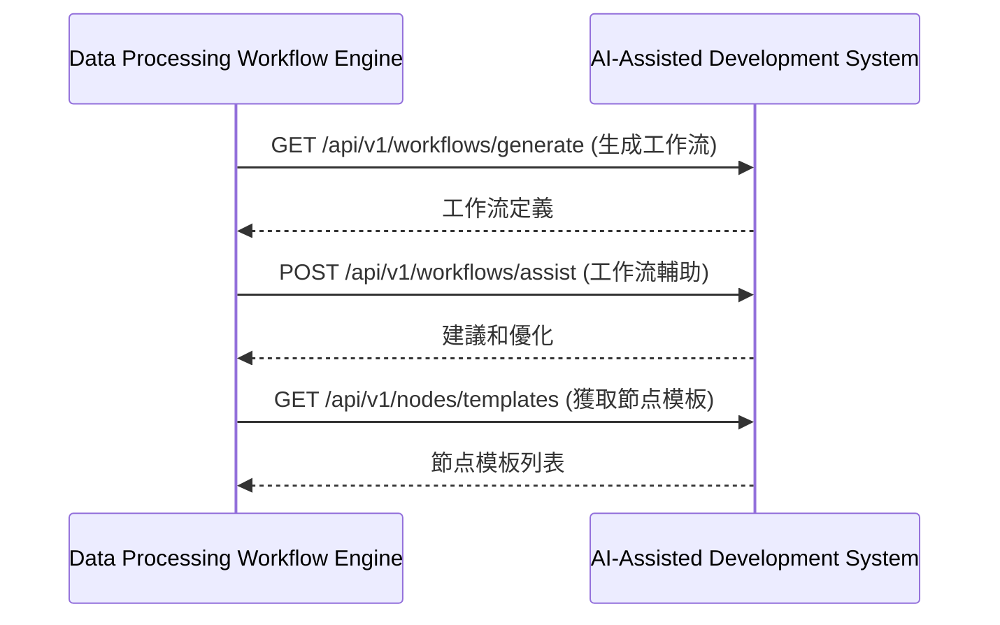
```mermaid
sequenceDiagram
    participant DPWE as Data Processing Workflow Engine
    participant AIDS as AI-Assisted Development System
    
    DPWE->>AIDS: GET /api/v1/workflows/generate (生成工作流)
    AIDS-->>DPWE: 工作流定義
    
    DPWE->>AIDS: POST /api/v1/workflows/assist (工作流輔助)
    AIDS-->>DPWE: 建議和優化
    
    DPWE->>AIDS: GET /api/v1/nodes/templates (獲取節点模板)
    AIDS-->>DPWE: 節点模板列表
```

#### 6.9.2 與網站指紋分析引擎交互

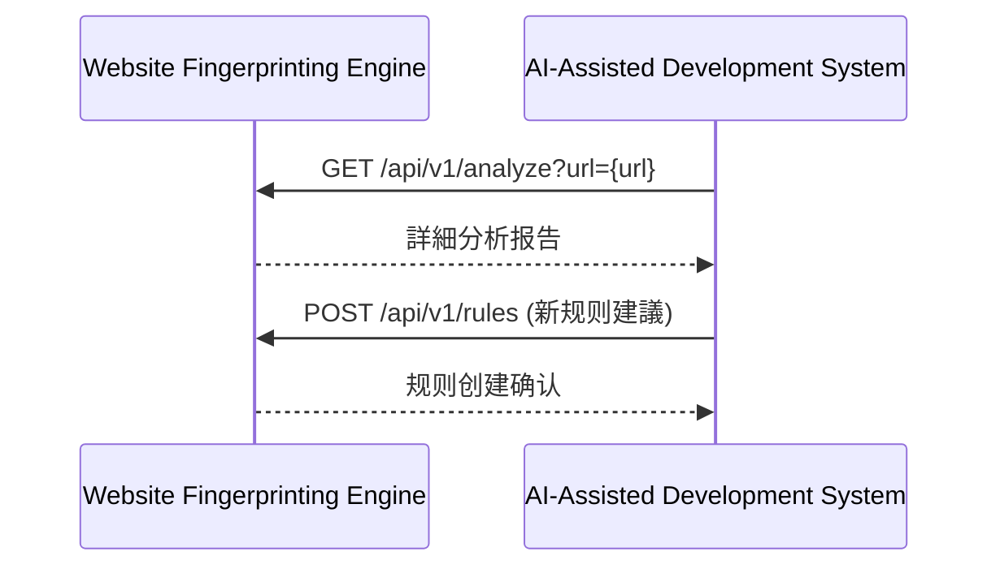
```mermaid
sequenceDiagram
    participant WFE as Website Fingerprinting Engine
    participant AIDS as AI-Assisted Development System
    
    AIDS->>WFE: GET /api/v1/analyze?url={url}
    WFE-->>AIDS: 詳細分析报告
    
    AIDS->>WFE: POST /api/v1/rules (新规则建議)
    WFE-->>AIDS: 规则创建确认
```

#### 6.9.3 與資料源健康监测系統交互

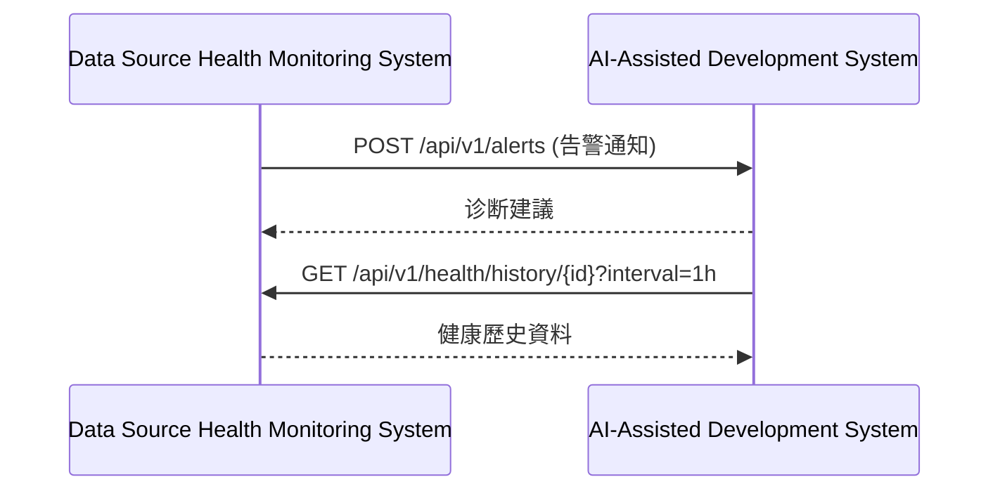
```mermaid
sequenceDiagram
    participant DSHMS as Data Source Health Monitoring System
    participant AIDS as AI-Assisted Development System
    
    DSHMS->>AIDS: POST /api/v1/alerts (告警通知)
    AIDS-->>DSHMS: 诊断建議
    
    AIDS->>DSHMS: GET /api/v1/health/history/{id}?interval=1h
    DSHMS-->>AIDS: 健康歷史資料
```

#### 6.9.4 與自動化媒體處理管道交互

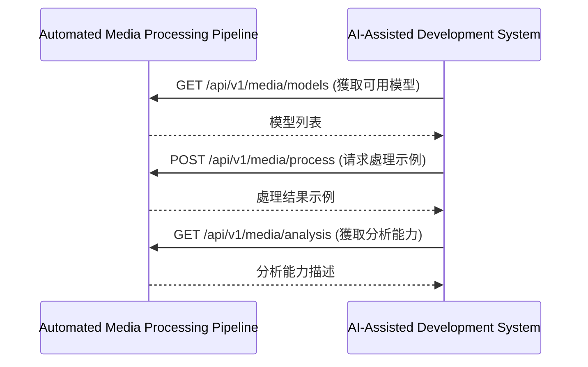
```mermaid
sequenceDiagram
    participant AMP as Automated Media Processing Pipeline
    participant AIDS as AI-Assisted Development System
    
    AIDS->>AMP: GET /api/v1/media/models (獲取可用模型)
    AMP-->>AIDS: 模型列表
    
    AIDS->>AMP: POST /api/v1/media/process (请求處理示例)
    AMP-->>AIDS: 處理结果示例
    
    AIDS->>AMP: GET /api/v1/media/analysis (獲取分析能力)
    AMP-->>AIDS: 分析能力描述
```

## 7. 資料合規與安全中心 (Data Compliance and Security Center)

### 7.1 模組概述
資料合規與安全中心是镜界平台的資料安全與合規性管理組件，負責確保所有資料採集、處理和儲存活動符合法律法规要求。它提供全面的資料安全策略管理、隐私保护機制和合規性審計功能。

### 7.2 詳細功能清單

#### 7.2.1 核心功能
- **合規性检查**
  - GDPR合規性检查
  - CCPA合規性检查
  - 本地化資料法规检查
  - 行业特定法规检查（如HIPAA、PCI DSS）
- **資料安全策略管理**
  - 敏感資料檢測规则
  - 資料脱敏策略
  - 資料保留策略
  - 資料訪問控制策略
- **隐私保护機制**
  - 個人身份資訊(PII)檢測
  - 資料最小化實施
  - 用戶同意管理
  - 資料主體权利處理
- **安全審計與監控**
  - 資料訪問審計
  - 安全事件監控
  - 合規性报告生成
  - 風險評估與管理

#### 7.2.2 高级功能
- **自動化合規工作流**
  - 合規性任務自動化
  - 合規性检查計畫
  - 合規性问题跟踪
  - 合規性狀態看板
- **資料地图與血缘**
  - 資料流可视化
  - 資料血缘追蹤
  - 資料儲存位置映射
  - 資料使用情況分析
- **跨境資料傳輸管理**
  - 資料傳輸影响評估
  - 傳輸加密策略
  - 資料驻留管理
  - 傳輸日志審計
- **第三方資料處理商管理**
  - 供应商合規性評估
  - 資料處理协议管理
  - 供应商風險監控
  - 供应商審計跟踪

### 7.3 技術架構

#### 7.3.1 架構图
```
┌───────────────────────────────────────────────────────────────────────────────────────────────┐
│                           資料合規與安全中心 (DCSC)                                           │
├───────────────────────┬───────────────────────┬───────────────────────────────────────────────┤
│  合規控制层           │  策略执行层           │  資料分析层                                │
├───────────────────────┼───────────────────────┼───────────────────────────────────────────────┤
│ • 合規规则引擎        │ • 敏感資料檢測器      │ • 資料血缘分析器                           │
│ • 同意管理系統        │ • 資料脱敏處理器      │ • 風險評估引擎                            │
│ • 資料主體请求處理    │ • 訪問控制执行器      │ • 合規性报告生成器                         │
│ • 合規狀態監控        │ • 傳輸加密處理器      │ • 審計日志分析器                           │
└───────────────────────┴───────────────────────┴───────────────────────────────────────────────┘
```

#### 7.3.2 服務边界與交互
- **輸入**：
  - 資料源元資料（來自資料源註冊中心）
  - 資料處理日志（來自資料處理工作流引擎）
  - 資料內容（來自自動化媒體處理管道）
  - 用戶操作（來自各模組）
- **輸出**：
  - 合規性检查结果
  - 安全告警
  - 合規性报告
  - 資料處理建議

### 7.4 核心組件詳細實現

#### 7.4.1 合規规则引擎

**技術實現：**
```python
import re
from typing import Dict, List, Optional, Tuple
import logging

class ComplianceRuleEngine:
    """合規规则引擎，执行合規性检查"""
    
    def __init__(
        self,
        rule_repository: ComplianceRuleRepository,
        config: Config
    ):
        self.rule_repository = rule_repository
        self.config = config
        self.logger = logging.getLogger(__name__)
    
    def check_compliance(
        self,
        data_source: DataSource,
        data_content: Optional[bytes] = None
    ) -> ComplianceCheckResult:
        """
        检查資料源的合規性
        
        :param data_source: 資料源物件
        :param data_content: 資料內容（可选）
        :return: 合規性检查结果
        """
        # 1. 獲取适用的合規规则
        applicable_rules = self._get_applicable_rules(data_source)
        
        # 2. 执行规则检查
        results = []
        for rule in applicable_rules:
            result = self._check_rule(rule, data_source, data_content)
            results.append(result)
        
        # 3. 生成汇总结果
        return self._generate_summary(data_source, results)
    
    def _get_applicable_rules(self, data_source: DataSource) -> List[ComplianceRule]:
        """獲取适用於資料源的合規规则"""
        # 1. 獲取資料源所在地区
        region = self._determine_region(data_source)
        
        # 2. 獲取資料類型
        data_type = self._determine_data_type(data_source)
        
        # 3. 獲取适用规则
        return self.rule_repository.get_rules(
            regions=[region],
            data_types=[data_type],
            active=True
        )
    
    def _determine_region(self, data_source: DataSource) -> str:
        """确定資料源所在地区"""
        # 1. 检查URL中的国家代码
        url = data_source.url.lower()
        
        # 常见国家代码顶级域
        country_tlds = {
            ".uk": "gb",
            ".de": "de",
            ".fr": "fr",
            ".es": "es",
            ".it": "it",
            ".jp": "jp",
            ".cn": "cn",
            ".us": "us",
            ".ca": "ca",
            ".au": "au"
        }
        
        for tld, region in country_tlds.items():
            if tld in url:
                return region
        
        # 2. 检查IP地理位置（如果實現）
        # ...
        
        # 3. 默认為国际
        return "international"
    
    def _determine_data_type(self, data_source: DataSource) -> str:
        """确定資料類型"""
        # 1. 检查資料源類型
        if data_source.data_type == "user-generated":
            return "personal"
        
        # 2. 检查內容類型
        content_type = data_source.content_type or ""
        if "json" in content_type or "xml" in content_type:
            return "structured"
        
        # 3. 默认類型
        return "general"
    
    def _check_rule(
        self,
        rule: ComplianceRule,
        data_source: DataSource,
        data_content: Optional[bytes]
    ) -> RuleCheckResult:
        """检查单個规则"""
        # 1. 检查规则是否适用
        if not self._is_rule_applicable(rule, data_source):
            return RuleCheckResult(
                rule_id=rule.id,
                rule_name=rule.name,
                applicable=False,
                passed=None,
                message="规则不适用"
            )
        
        # 2. 执行规则检查
        try:
            if rule.check_type == "metadata":
                result = self._check_metadata_rule(rule, data_source)
            elif rule.check_type == "content":
                if data_content is None:
                    result = RuleCheckResult(
                        rule_id=rule.id,
                        rule_name=rule.name,
                        applicable=True,
                        passed=False,
                        message="需要內容检查，但未提供內容"
                    )
                else:
                    result = self._check_content_rule(rule, data_content)
            else:
                result = RuleCheckResult(
                    rule_id=rule.id,
                    rule_name=rule.name,
                    applicable=True,
                    passed=False,
                    message=f"不支援的规则類型: {rule.check_type}"
                )
            
            return result
            
        except Exception as e:
            return RuleCheckResult(
                rule_id=rule.id,
                rule_name=rule.name,
                applicable=True,
                passed=False,
                message=f"规则检查失败: {str(e)}"
            )
    
    def _is_rule_applicable(
        self,
        rule: ComplianceRule,
        data_source: DataSource
    ) -> bool:
        """检查规则是否适用於資料源"""
        # 1. 检查地区适用性
        if rule.regions and self._determine_region(data_source) not in rule.regions:
            return False
        
        # 2. 检查資料類型适用性
        if rule.data_types and self._determine_data_type(data_source) not in rule.data_types:
            return False
        
        # 3. 检查資料源分類适用性
        if rule.categories and data_source.category not in rule.categories:
            return False
        
        return True
    
    def _check_metadata_rule(
        self,
        rule: ComplianceRule,
        data_source: DataSource
    ) -> RuleCheckResult:
        """检查元資料规则"""
        # 1. 提取检查參數
        field = rule.parameters.get("field")
        operator = rule.parameters.get("operator")
        value = rule.parameters.get("value")
        
        if not field or not operator:
            return RuleCheckResult(
                rule_id=rule.id,
                rule_name=rule.name,
                applicable=True,
                passed=False,
                message="规则配置不完整"
            )
        
        # 2. 獲取字段值
        field_value = self._get_metadata_field(data_source, field)
        if field_value is None:
            return RuleCheckResult(
                rule_id=rule.id,
                rule_name=rule.name,
                applicable=True,
                passed=False,
                message=f"元資料字段 '{field}' 不存在"
            )
        
        # 3. 执行检查
        passed = self._evaluate_condition(field_value, operator, value)
        
        # 4. 生成结果
        return RuleCheckResult(
            rule_id=rule.id,
            rule_name=rule.name,
            applicable=True,
            passed=passed,
            message=self._generate_message(rule, field_value, passed)
        )
    
    def _get_metadata_field(
        self,
        data_source: DataSource,
        field: str
    ) -> Optional[Any]:
        """獲取元資料字段值"""
        if field == "url":
            return data_source.url
        elif field == "category":
            return data_source.category
        elif field == "data_type":
            return data_source.data_type
        elif field == "content_type":
            return data_source.content_type
        elif field.startswith("metadata."):
            key = field.split(".", 1)[1]
            return data_source.metadata.get(key)
        
        return None
    
    def _evaluate_condition(
        self,
        actual: Any,
        operator: str,
        expected: Any
    ) -> bool:
        """評估條件表达式"""
        if operator == "eq":
            return actual == expected
        elif operator == "neq":
            return actual != expected
        elif operator == "contains":
            return expected in str(actual)
        elif operator == "regex":
            return bool(re.search(expected, str(actual)))
        elif operator == "in":
            return actual in expected.split(",")
        elif operator == "not_in":
            return actual not in expected.split(",")
        
        return False
    
    def _generate_message(
        self,
        rule: ComplianceRule,
        field_value: Any,
        passed: bool
    ) -> str:
        """生成检查结果消息"""
        if passed:
            return f"规则通過: {rule.description}"
        
        return f"规则失败: {rule.description} (檢測到: {field_value})"
    
    def _check_content_rule(
        self,
        rule: ComplianceRule,
        data_content: bytes
    ) -> RuleCheckResult:
        """检查內容规则"""
        # 1. 检查內容類型
        if rule.content_type not in ["text", "json", "xml", "html"]:
            return RuleCheckResult(
                rule_id=rule.id,
                rule_name=rule.name,
                applicable=True,
                passed=False,
                message=f"不支援的內容類型: {rule.content_type}"
            )
        
        # 2. 解析內容
        try:
            content = self._parse_content(data_content, rule.content_type)
        except Exception as e:
            return RuleCheckResult(
                rule_id=rule.id,
                rule_name=rule.name,
                applicable=True,
                passed=False,
                message=f"內容解析失败: {str(e)}"
            )
        
        # 3. 执行检查
        findings = []
        for pattern in rule.patterns:
            matches = self._find_pattern_matches(pattern, content)
            if matches:
                findings.extend(matches)
        
        # 4. 生成结果
        passed = len(findings) == 0
        message = self._generate_content_message(rule, findings)
        
        return RuleCheckResult(
            rule_id=rule.id,
            rule_name=rule.name,
            applicable=True,
            passed=passed,
            message=message,
            details={"findings": findings}
        )
    
    def _parse_content(
        self,
        content: bytes,
        content_type: str
    ) -> Any:
        """解析內容"""
        # 尝试解码為UTF-8
        try:
            text = content.decode('utf-8')
        except UnicodeDecodeError:
            text = content.decode('latin-1')
        
        # 根據內容類型进一步處理
        if content_type == "json":
            try:
                return json.loads(text)
            except json.JSONDecodeError:
                return text
        elif content_type in ["xml", "html"]:
            # 返回原始文本，由模式匹配處理
            return text
        else:
            return text
    
    def _find_pattern_matches(
        self,
        pattern: CompliancePattern,
        content: Any
    ) -> List[Dict]:
        """查找模式匹配"""
        matches = []
        
        if isinstance(content, str):
            # 在文本中搜尋
            for match in re.finditer(pattern.regex, content):
                matches.append({
                    "pattern_id": pattern.id,
                    "start": match.start(),
                    "end": match.end(),
                    "value": match.group(0),
                    "context": self._get_context(content, match.start(), match.end())
                })
        
        elif isinstance(content, dict):
            # 递归搜尋字典
            self._search_dict(content, pattern, "", matches)
        
        elif isinstance(content, list):
            # 递归搜尋列表
            self._search_list(content, pattern, "", matches)
        
        return matches
    
    def _get_context(
        self,
        text: str,
        start: int,
        end: int,
        context_size: int = 20
    ) -> str:
        """獲取匹配上下文"""
        context_start = max(0, start - context_size)
        context_end = min(len(text), end + context_size)
        return text[context_start:context_start] + "[...]" + text[end:context_end]
    
    def _search_dict(
        self,
        obj: Dict,
        pattern: CompliancePattern,
        path: str,
        matches: List[Dict]
    ):
        """在字典中搜尋模式"""
        for key, value in obj.items():
            current_path = f"{path}.{key}" if path else key
            
            # 检查鍵
            if re.search(pattern.regex, key):
                matches.append({
                    "pattern_id": pattern.id,
                    "path": current_path,
                    "value": key,
                    "type": "key"
                })
            
            # 检查值
            if isinstance(value, (str, int, float)):
                value_str = str(value)
                for match in re.finditer(pattern.regex, value_str):
                    matches.append({
                        "pattern_id": pattern.id,
                        "path": current_path,
                        "value": value_str[match.start():match.end()],
                        "start": match.start(),
                        "end": match.end(),
                        "type": "value"
                    })
            
            # 递归搜尋
            elif isinstance(value, dict):
                self._search_dict(value, pattern, current_path, matches)
            elif isinstance(value, list):
                self._search_list(value, pattern, current_path, matches)
    
    def _search_list(
        self,
        obj: List,
        pattern: CompliancePattern,
        path: str,
        matches: List[Dict]
    ):
        """在列表中搜尋模式"""
        for i, item in enumerate(obj):
            current_path = f"{path}[{i}]"
            
            # 检查值
            if isinstance(item, (str, int, float)):
                value_str = str(item)
                for match in re.finditer(pattern.regex, value_str):
                    matches.append({
                        "pattern_id": pattern.id,
                        "path": current_path,
                        "value": value_str[match.start():match.end()],
                        "start": match.start(),
                        "end": match.end(),
                        "type": "value"
                    })
            
            # 递归搜尋
            elif isinstance(item, dict):
                self._search_dict(item, pattern, current_path, matches)
            elif isinstance(item, list):
                self._search_list(item, pattern, current_path, matches)
    
    def _generate_content_message(
        self,
        rule: ComplianceRule,
        findings: List[Dict]
    ) -> str:
        """生成內容检查消息"""
        if not findings:
            return f"规则通過: {rule.description}"
        
        return f"规则失败: {rule.description} (檢測到 {len(findings)} 处敏感資料)"
    
    def _generate_summary(
        self,
        data_source: DataSource,
        results: List[RuleCheckResult]
    ) -> ComplianceCheckResult:
        """生成合規性检查汇总"""
        # 统计结果
        total = len(results)
        passed = sum(1 for r in results if r.passed)
        failed = sum(1 for r in results if not r.passed and r.applicable)
        not_applicable = sum(1 for r in results if not r.applicable)
        
        # 生成狀態
        if failed == 0:
            status = "compliant"
        elif failed <= self.config.warning_threshold:
            status = "warning"
        else:
            status = "non_compliant"
        
        # 生成關鍵问题
        critical_issues = [
            r for r in results 
            if not r.passed and r.applicable and r.rule_severity == "critical"
        ]
        
        # 生成建議
        suggestions = self._generate_suggestions(results)
        
        return ComplianceCheckResult(
            data_source_id=data_source.id,
            project_id=data_source.project_id,
            status=status,
            total_rules=total,
            passed_rules=passed,
            failed_rules=failed,
            not_applicable_rules=not_applicable,
            critical_issues=len(critical_issues),
            results=results,
            suggestions=suggestions,
            timestamp=datetime.utcnow()
        )
    
    def _generate_suggestions(self, results: List[RuleCheckResult]) -> List[str]:
        """生成合規性建議"""
        suggestions = []
        
        # 1. 针對失败的關鍵规则
        critical_failures = [
            r for r in results 
            if not r.passed and r.applicable and r.rule_severity == "critical"
        ]
        for result in critical_failures[:3]:  # 只取前3個
            suggestions.append(f"必須解决: {result.rule_name} - {result.message}")
        
        # 2. 针對警告级别的规则
        warning_failures = [
            r for r in results 
            if not r.passed and r.applicable and r.rule_severity == "warning"
        ]
        if warning_failures:
            suggestions.append(f"建議改进: 檢測到 {len(warning_failures)} 個可優化的合規性问题")
        
        # 3. 一般建議
        if not suggestions:
            suggestions.append("資料源符合所有關鍵合規性要求")
        
        return suggestions

class ComplianceRuleRepository:
    """合規规则仓庫"""
    
    def __init__(self, db: Database):
        self.db = db
        self.logger = logging.getLogger(__name__)
    
    def get_rules(
        self,
        regions: List[str] = None,
        data_types: List[str] = None,
        categories: List[str] = None,
        active: bool = True
    ) -> List[ComplianceRule]:
        """獲取合規规则"""
        # 構建查詢
        conditions = []
        params = {"active": active}
        
        if regions:
            conditions.append("regions && %(regions)s::varchar[]")
            params["regions"] = regions
        if data_types:
            conditions.append("data_types && %(data_types)s::varchar[]")
            params["data_types"] = data_types
        if categories:
            conditions.append("categories && %(categories)s::varchar[]")
            params["categories"] = categories
        
        where_clause = "WHERE active = %(active)s"
        if conditions:
            where_clause += " AND " + " AND ".join(conditions)
        
        sql = f"""
        SELECT * FROM compliance_rules 
        {where_clause}
        ORDER BY severity DESC, priority
        """
        
        rows = self.db.fetchall(sql, params)
        return [self._row_to_rule(row) for row in rows]
    
    def get_rule(self, rule_id: str) -> Optional[ComplianceRule]:
        """獲取单個合規规则"""
        sql = "SELECT * FROM compliance_rules WHERE id = %(id)s"
        row = self.db.fetchone(sql, {"id": rule_id})
        return self._row_to_rule(row) if row else None
    
    def _row_to_rule(self, row: Dict) -> ComplianceRule:
        """將資料庫行转换為ComplianceRule物件"""
        return ComplianceRule(
            id=row["id"],
            name=row["name"],
            description=row["description"],
            regulation=row["regulation"],
            severity=row["severity"],
            check_type=row["check_type"],
            content_type=row["content_type"],
            regions=json.loads(row["regions"]) if row["regions"] else [],
            data_types=json.loads(row["data_types"]) if row["data_types"] else [],
            categories=json.loads(row["categories"]) if row["categories"] else [],
            parameters=json.loads(row["parameters"]) if row["parameters"] else {},
            patterns=self._decode_patterns(row["patterns"]),
            priority=row["priority"],
            active=row["active"],
            created_at=row["created_at"],
            updated_at=row["updated_at"]
        )
    
    def _decode_patterns(self, json_data: str) -> List[CompliancePattern]:
        """解码模式定義"""
        if not json_data:
            return []
        
        patterns_data = json.loads(json_data)
        return [
            CompliancePattern(
                id=p["id"],
                name=p["name"],
                description=p.get("description", ""),
                regex=p["regex"],
                data_category=p["data_category"],
                severity=p["severity"]
            ) for p in patterns_data
        ]

# 輔助类定義
class ComplianceRule:
    """合規规则"""
    def __init__(
        self,
        id: str,
        name: str,
        description: str,
        regulation: str,
        severity: str,
        check_type: str,
        content_type: str,
        regions: List[str],
        data_types: List[str],
        categories: List[str],
        parameters: Dict,
        patterns: List,
        priority: int,
        active: bool,
        created_at: datetime,
        updated_at: datetime
    ):
        self.id = id
        self.name = name
        self.description = description
        self.regulation = regulation
        self.severity = severity
        self.check_type = check_type
        self.content_type = content_type
        self.regions = regions
        self.data_types = data_types
        self.categories = categories
        self.parameters = parameters
        self.patterns = patterns
        self.priority = priority
        self.active = active
        self.created_at = created_at
        self.updated_at = updated_at

class CompliancePattern:
    """合規模式"""
    def __init__(
        self,
        id: str,
        name: str,
        description: str,
        regex: str,
        data_category: str,
        severity: str
    ):
        self.id = id
        self.name = name
        self.description = description
        self.regex = regex
        self.data_category = data_category
        self.severity = severity

class RuleCheckResult:
    """规则检查结果"""
    def __init__(
        self,
        rule_id: str,
        rule_name: str,
        applicable: bool,
        passed: Optional[bool],
        message: str,
        details: Optional[Dict] = None
    ):
        self.rule_id = rule_id
        self.rule_name = rule_name
        self.applicable = applicable
        self.passed = passed
        self.message = message
        self.details = details or {}
        self.rule_severity = "warning"  # 可以從规则中獲取

class ComplianceCheckResult:
    """合規性检查结果"""
    def __init__(
        self,
        data_source_id: str,
        project_id: str,
        status: str,
        total_rules: int,
        passed_rules: int,
        failed_rules: int,
        not_applicable_rules: int,
        critical_issues: int,
        results: List[RuleCheckResult],
        suggestions: List[str],
        timestamp: datetime
    ):
        self.data_source_id = data_source_id
        self.project_id = project_id
        self.status = status
        self.total_rules = total_rules
        self.passed_rules = passed_rules
        self.failed_rules = failed_rules
        self.not_applicable_rules = not_applicable_rules
        self.critical_issues = critical_issues
        self.results = results
        self.suggestions = suggestions
        self.timestamp = timestamp
```

#### 7.4.2 敏感資料檢測器

**技術實現：**
```python
import re
import json
from typing import Dict, List, Optional, Tuple
import logging
import hashlib

class SensitiveDataDetector:
    """敏感資料檢測器，檢測資料中的敏感資訊"""
    
    def __init__(
        self,
        pattern_repository: PatternRepository,
        config: Config
    ):
        self.pattern_repository = pattern_repository
        self.config = config
        self.logger = logging.getLogger(__name__)
    
    def detect(
        self,
        data: Any,
        context: Optional[Dict] = None
    ) -> SensitiveDataDetectionResult:
        """
        檢測資料中的敏感資訊
        
        :param data: 要檢測的資料
        :param context: 上下文資訊
        :return: 檢測结果
        """
        # 1. 獲取敏感資料模式
        patterns = self.pattern_repository.get_patterns(
            categories=context.get("categories") if context else None,
            regions=context.get("regions") if context else None
        )
        
        # 2. 执行檢測
        findings = self._scan_data(data, patterns)
        
        # 3. 生成结果
        return SensitiveDataDetectionResult(
            data_hash=self._calculate_data_hash(data),
            total_patterns=len(patterns),
            findings=findings,
            context=context or {},
            timestamp=datetime.utcnow()
        )
    
    def _calculate_data_hash(self, data: Any) -> str:
        """计算資料哈希"""
        # 简单實現：转换為JSON並计算哈希
        try:
            data_str = json.dumps(data, sort_keys=True)
            return hashlib.sha256(data_str.encode('utf-8')).hexdigest()
        except:
            return "unknown"
    
    def _scan_data(
        self,
        data: Any,
        patterns: List[DataPattern]
    ) -> List[DataFinding]:
        """扫描資料中的敏感資訊"""
        findings = []
        
        if isinstance(data, str):
            # 扫描字符串
            for pattern in patterns:
                for match in re.finditer(pattern.regex, data):
                    findings.append(DataFinding(
                        pattern_id=pattern.id,
                        pattern_name=pattern.name,
                        data_category=pattern.data_category,
                        start=match.start(),
                        end=match.end(),
                        value=match.group(0),
                        context=self._get_context(data, match.start(), match.end())
                    ))
        
        elif isinstance(data, dict):
            # 递归扫描字典
            for key, value in data.items():
                # 检查鍵
                for pattern in patterns:
                    if re.search(pattern.regex, key):
                        findings.append(DataFinding(
                            pattern_id=pattern.id,
                            pattern_name=pattern.name,
                            data_category=pattern.data_category,
                            path=key,
                            value=key,
                            type="key",
                            context=f"Key: {key}"
                        ))
                
                # 检查值
                sub_findings = self._scan_data(value, patterns)
                for finding in sub_findings:
                    finding.path = f"{key}.{finding.path}" if finding.path else key
                    findings.append(finding)
        
        elif isinstance(data, list):
            # 递归扫描列表
            for i, item in enumerate(data):
                sub_findings = self._scan_data(item, patterns)
                for finding in sub_findings:
                    finding.path = f"[{i}]{finding.path}"
                    findings.append(finding)
        
        return findings
    
    def _get_context(
        self,
        text: str,
        start: int,
        end: int,
        context_size: int = 20
    ) -> str:
        """獲取匹配上下文"""
        context_start = max(0, start - context_size)
        context_end = min(len(text), end + context_size)
        return text[context_start:start] + "[...]" + text[end:context_end]

class PatternRepository:
    """敏感資料模式仓庫"""
    
    def __init__(self, db: Database):
        self.db = db
        self.logger = logging.getLogger(__name__)
    
    def get_patterns(
        self,
        categories: List[str] = None,
        regions: List[str] = None
    ) -> List[DataPattern]:
        """獲取敏感資料模式"""
        # 構建查詢
        conditions = []
        params = {}
        
        if categories:
            conditions.append("categories && %(categories)s::varchar[]")
            params["categories"] = categories
        if regions:
            conditions.append("regions && %(regions)s::varchar[]")
            params["regions"] = regions
        
        where_clause = "WHERE active = true"
        if conditions:
            where_clause += " AND " + " AND ".join(conditions)
        
        sql = f"""
        SELECT * FROM sensitive_data_patterns 
        {where_clause}
        ORDER BY severity DESC, priority
        """
        
        rows = self.db.fetchall(sql, params)
        return [self._row_to_pattern(row) for row in rows]
    
    def get_pattern(self, pattern_id: str) -> Optional[DataPattern]:
        """獲取单個敏感資料模式"""
        sql = "SELECT * FROM sensitive_data_patterns WHERE id = %(id)s"
        row = self.db.fetchone(sql, {"id": pattern_id})
        return self._row_to_pattern(row) if row else None
    
    def _row_to_pattern(self, row: Dict) -> DataPattern:
        """將資料庫行转换為DataPattern物件"""
        return DataPattern(
            id=row["id"],
            name=row["name"],
            description=row["description"],
            regex=row["regex"],
            data_category=row["data_category"],
            severity=row["severity"],
            categories=json.loads(row["categories"]) if row["categories"] else [],
            regions=json.loads(row["regions"]) if row["regions"] else [],
            validation_rules=json.loads(row["validation_rules"]) if row["validation_rules"] else [],
            redaction_template=row["redaction_template"],
            priority=row["priority"],
            active=row["active"],
            created_at=row["created_at"],
            updated_at=row["updated_at"]
        )

# 輔助类定義
class DataPattern:
    """敏感資料模式"""
    def __init__(
        self,
        id: str,
        name: str,
        description: str,
        regex: str,
        data_category: str,
        severity: str,
        categories: List[str],
        regions: List[str],
        validation_rules: List[Dict],
        redaction_template: str,
        priority: int,
        active: bool,
        created_at: datetime,
        updated_at: datetime
    ):
        self.id = id
        self.name = name
        self.description = description
        self.regex = regex
        self.data_category = data_category
        self.severity = severity
        self.categories = categories
        self.regions = regions
        self.validation_rules = validation_rules
        self.redaction_template = redaction_template
        self.priority = priority
        self.active = active
        self.created_at = created_at
        self.updated_at = updated_at

class DataFinding:
    """資料發現"""
    def __init__(
        self,
        pattern_id: str,
        pattern_name: str,
        data_category: str,
        start: Optional[int] = None,
        end: Optional[int] = None,
        value: str = "",
        context: str = "",
        path: str = "",
        type: str = "value"
    ):
        self.pattern_id = pattern_id
        self.pattern_name = pattern_name
        self.data_category = data_category
        self.start = start
        self.end = end
        self.value = value
        self.context = context
        self.path = path
        self.type = type

class SensitiveDataDetectionResult:
    """敏感資料檢測结果"""
    def __init__(
        self,
        data_hash: str,
        total_patterns: int,
        findings: List[DataFinding],
        context: Dict,
        timestamp: datetime
    ):
        self.data_hash = data_hash
        self.total_patterns = total_patterns
        self.findings = findings
        self.context = context
        self.timestamp = timestamp
        self.severity = self._calculate_severity()
    
    def _calculate_severity(self) -> str:
        """计算檢測结果严重程度"""
        if not self.findings:
            return "none"
        
        # 检查是否有關鍵發現
        has_critical = any(f.data_category == "critical" for f in self.findings)
        if has_critical:
            return "critical"
        
        # 检查發現數量
        if len(self.findings) > 5:
            return "high"
        elif len(self.findings) > 2:
            return "medium"
        
        return "low"
```

### 7.5 資料模型詳細定義

#### 7.5.1 合規规则表

```sql
-- 合規规则表
CREATE TABLE compliance_rules (
    id UUID PRIMARY KEY DEFAULT gen_random_uuid(),
    name VARCHAR(255) NOT NULL,
    description TEXT NOT NULL,
    regulation VARCHAR(50) NOT NULL CHECK (regulation IN ('gdpr', 'ccpa', 'hipaa', 'pci_dss', 'local')),
    severity VARCHAR(20) NOT NULL CHECK (severity IN ('critical', 'warning', 'info')),
    check_type VARCHAR(20) NOT NULL CHECK (check_type IN ('metadata', 'content')),
    content_type VARCHAR(20) CHECK (content_type IN ('text', 'json', 'xml', 'html')),
    regions VARCHAR(10)[] DEFAULT '{}'::varchar[],
    data_types VARCHAR(50)[] DEFAULT '{}'::varchar[],
    categories VARCHAR(50)[] DEFAULT '{}'::varchar[],
    parameters JSONB DEFAULT '{}'::jsonb,
    patterns JSONB DEFAULT '[]'::jsonb,
    priority INT NOT NULL DEFAULT 50,
    active BOOLEAN NOT NULL DEFAULT true,
    created_at TIMESTAMPTZ NOT NULL DEFAULT NOW(),
    updated_at TIMESTAMPTZ NOT NULL DEFAULT NOW(),
    
    -- 索引
    INDEX idx_rules_regulation ON compliance_rules(regulation),
    INDEX idx_rules_severity ON compliance_rules(severity),
    INDEX idx_rules_active ON compliance_rules(active),
    INDEX idx_rules_priority ON compliance_rules(priority)
);

-- 自動更新updated_at触发器
CREATE OR REPLACE FUNCTION update_compliance_rules_modtime()
RETURNS TRIGGER AS $$
BEGIN
    NEW.updated_at = NOW();
    RETURN NEW;
END;
$$ LANGUAGE plpgsql;

CREATE TRIGGER update_compliance_rules_modtime
BEFORE UPDATE ON compliance_rules
FOR EACH ROW
EXECUTE FUNCTION update_compliance_rules_modtime();
```

#### 7.5.2 敏感資料模式表

```sql
-- 敏感資料模式表
CREATE TABLE sensitive_data_patterns (
    id UUID PRIMARY KEY DEFAULT gen_random_uuid(),
    name VARCHAR(255) NOT NULL,
    description TEXT NOT NULL,
    regex TEXT NOT NULL,
    data_category VARCHAR(50) NOT NULL,
    severity VARCHAR(20) NOT NULL CHECK (severity IN ('critical', 'high', 'medium', 'low')),
    categories VARCHAR(50)[] DEFAULT '{}'::varchar[],
    regions VARCHAR(10)[] DEFAULT '{}'::varchar[],
    validation_rules JSONB DEFAULT '[]'::jsonb,
    redaction_template VARCHAR(255) NOT NULL,
    priority INT NOT NULL DEFAULT 50,
    active BOOLEAN NOT NULL DEFAULT true,
    created_at TIMESTAMPTZ NOT NULL DEFAULT NOW(),
    updated_at TIMESTAMPTZ NOT NULL DEFAULT NOW(),
    
    -- 索引
    INDEX idx_patterns_category ON sensitive_data_patterns(data_category),
    INDEX idx_patterns_severity ON sensitive_data_patterns(severity),
    INDEX idx_patterns_active ON sensitive_data_patterns(active),
    INDEX idx_patterns_priority ON sensitive_data_patterns(priority)
);

-- 自動更新updated_at触发器
CREATE OR REPLACE FUNCTION update_sensitive_data_patterns_modtime()
RETURNS TRIGGER AS $$
BEGIN
    NEW.updated_at = NOW();
    RETURN NEW;
END;
$$ LANGUAGE plpgsql;

CREATE TRIGGER update_sensitive_data_patterns_modtime
BEFORE UPDATE ON sensitive_data_patterns
FOR EACH ROW
EXECUTE FUNCTION update_sensitive_data_patterns_modtime();
```

#### 7.5.3 合規性检查结果表

```sql
-- 合規性检查结果表
CREATE TABLE compliance_checks (
    id UUID PRIMARY KEY DEFAULT gen_random_uuid(),
    data_source_id UUID NOT NULL REFERENCES data_sources(id) ON DELETE CASCADE,
    project_id UUID NOT NULL REFERENCES projects(id) ON DELETE CASCADE,
    status VARCHAR(20) NOT NULL CHECK (status IN ('compliant', 'warning', 'non_compliant')),
    total_rules INT NOT NULL,
    passed_rules INT NOT NULL,
    failed_rules INT NOT NULL,
    not_applicable_rules INT NOT NULL,
    critical_issues INT NOT NULL,
    results JSONB NOT NULL,
    suggestions JSONB NOT NULL,
    timestamp TIMESTAMPTZ NOT NULL DEFAULT NOW(),
    
    -- 索引
    INDEX idx_checks_data_source ON compliance_checks(data_source_id),
    INDEX idx_checks_project ON compliance_checks(project_id),
    INDEX idx_checks_status ON compliance_checks(status),
    INDEX idx_checks_timestamp ON compliance_checks(timestamp DESC)
);
```

#### 7.5.4 敏感資料檢測结果表

```sql
-- 敏感資料檢測结果表
CREATE TABLE sensitive_data_detections (
    id UUID PRIMARY KEY DEFAULT gen_random_uuid(),
    data_hash VARCHAR(64) NOT NULL,
    data_source_id UUID NOT NULL REFERENCES data_sources(id) ON DELETE CASCADE,
    project_id UUID NOT NULL REFERENCES projects(id) ON DELETE CASCADE,
    total_patterns INT NOT NULL,
    severity VARCHAR(20) NOT NULL CHECK (severity IN ('none', 'low', 'medium', 'high', 'critical')),
    findings JSONB NOT NULL,
    context JSONB NOT NULL,
    timestamp TIMESTAMPTZ NOT NULL DEFAULT NOW(),
    
    -- 索引
    INDEX idx_detections_data_hash ON sensitive_data_detections(data_hash),
    INDEX idx_detections_data_source ON sensitive_data_detections(data_source_id),
    INDEX idx_detections_project ON sensitive_data_detections(project_id),
    INDEX idx_detections_severity ON sensitive_data_detections(severity),
    INDEX idx_detections_timestamp ON sensitive_data_detections(timestamp DESC)
);
```

#### 7.5.5 用戶同意記錄表

```sql
-- 用戶同意記錄表
CREATE TABLE user_consents (
    id UUID PRIMARY KEY DEFAULT gen_random_uuid(),
    user_id UUID NOT NULL REFERENCES users(id) ON DELETE CASCADE,
    data_source_id UUID NOT NULL REFERENCES data_sources(id) ON DELETE CASCADE,
    project_id UUID NOT NULL REFERENCES projects(id) ON DELETE CASCADE,
    consent_type VARCHAR(50) NOT NULL,
    consent_value BOOLEAN NOT NULL,
    consent_details JSONB DEFAULT '{}'::jsonb,
    consent_timestamp TIMESTAMPTZ NOT NULL DEFAULT NOW(),
    revoked BOOLEAN NOT NULL DEFAULT false,
    revoked_at TIMESTAMPTZ,
    
    -- 索引
    INDEX idx_consents_user ON user_consents(user_id),
    INDEX idx_consents_data_source ON user_consents(data_source_id),
    INDEX idx_consents_project ON user_consents(project_id),
    INDEX idx_consents_type ON user_consents(consent_type),
    INDEX idx_consents_timestamp ON user_consents(consent_timestamp DESC)
);
```

### 7.6 API詳細規範

#### 7.6.1 合規性检查API

**检查資料源合規性 (POST /api/v1/compliance/check)**

*请求示例:*
```http
POST /api/v1/compliance/check HTTP/1.1
Host: dcsc.mirror-realm.com
Authorization: Bearer <access_token>
Content-Type: application/json

{
  "data_source_id": "ds-7a8b9c0d",
  "include_content": true
}
```

*成功響應示例:*
```http
HTTP/1.1 200 OK
Content-Type: application/json

{
  "data_source_id": "ds-7a8b9c0d",
  "project_id": "proj-123",
  "status": "warning",
  "total_rules": 15,
  "passed_rules": 12,
  "failed_rules": 2,
  "not_applicable_rules": 1,
  "critical_issues": 0,
  "results": [
    {
      "rule_id": "rule-gdpr-001",
      "rule_name": "個人資料標识检查",
      "applicable": true,
      "passed": false,
      "message": "檢測到潜在的個人身份資訊",
      "details": {
        "findings": [
          {
            "pattern_id": "pattern-email",
            "pattern_name": "电子邮件地址",
            "data_category": "personal",
            "start": 125,
            "end": 150,
            "value": "user@example.com",
            "context": "联系資訊: user@example.com"
          }
        ]
      }
    },
    {
      "rule_id": "rule-gdpr-002",
      "rule_name": "資料最小化检查",
      "applicable": true,
      "passed": true,
      "message": "规则通過: 資料最小化要求已满足"
    }
  ],
  "suggestions": [
    "必須解决: 個人資料標识检查 - 檢測到潜在的個人身份資訊",
    "建議改进: 檢測到 2 個可優化的合規性问题"
  ],
  "timestamp": "2023-06-15T10:30:45Z"
}
```

#### 7.6.2 敏感資料檢測API

**檢測敏感資料 (POST /api/v1/data:detect-sensitive)**

*请求示例:*
```http
POST /api/v1/data:detect-sensitive HTTP/1.1
Host: dcsc.mirror-realm.com
Authorization: Bearer <access_token>
Content-Type: application/json

{
  "data": {
    "name": "John Doe",
    "email": "john.doe@example.com",
    "phone": "+1-555-123-4567",
    "address": "123 Main St, Anytown, USA"
  },
  "context": {
    "categories": ["contact", "personal"],
    "regions": ["us"]
  }
}
```

*成功響應示例:*
```http
HTTP/1.1 200 OK
Content-Type: application/json

{
  "data_hash": "d41d8cd98f00b204e9800998ecf8427e",
  "total_patterns": 8,
  "findings": [
    {
      "pattern_id": "pattern-name",
      "pattern_name": "個人姓名",
      "data_category": "personal",
      "value": "John Doe",
      "context": "name: John Doe",
      "path": "name",
      "type": "value"
    },
    {
      "pattern_id": "pattern-email",
      "pattern_name": "电子邮件地址",
      "data_category": "personal",
      "value": "john.doe@example.com",
      "context": "email: john.doe@example.com",
      "path": "email",
      "type": "value"
    },
    {
      "pattern_id": "pattern-phone",
      "pattern_name": "电话號码",
      "data_category": "personal",
      "value": "+1-555-123-4567",
      "context": "phone: +1-555-123-4567",
      "path": "phone",
      "type": "value"
    }
  ],
  "context": {
    "categories": ["contact", "personal"],
    "regions": ["us"]
  },
  "severity": "high",
  "timestamp": "2023-06-15T10:35:20Z"
}
```

#### 7.6.3 用戶同意管理API

**記錄用戶同意 (POST /api/v1/consents)**

*请求示例:*
```http
POST /api/v1/consents HTTP/1.1
Host: dcsc.mirror-realm.com
Authorization: Bearer <access_token>
Content-Type: application/json

{
  "user_id": "user-123",
  "data_source_id": "ds-7a8b9c0d",
  "consent_type": "data_processing",
  "consent_value": true,
  "consent_details": {
    "purpose": "資料採集與處理",
    "data_types": ["personal", "contact"],
    "retention_period": "2 years"
  }
}
```

*成功響應示例:*
```http
HTTP/1.1 201 Created
Content-Type: application/json
Location: /api/v1/consents/consent-1a2b3c4d

{
  "id": "consent-1a2b3c4d",
  "user_id": "user-123",
  "data_source_id": "ds-7a8b9c0d",
  "project_id": "proj-123",
  "consent_type": "data_processing",
  "consent_value": true,
  "consent_details": {
    "purpose": "資料採集與處理",
    "data_types": ["personal", "contact"],
    "retention_period": "2 years"
  },
  "consent_timestamp": "2023-06-15T10:30:45Z",
  "revoked": false
}
```

**獲取用戶同意記錄 (GET /api/v1/consents/{user_id})**

*请求示例:*
```http
GET /api/v1/consents/user-123?data_source_id=ds-7a8b9c0d HTTP/1.1
Host: dcsc.mirror-realm.com
Authorization: Bearer <access_token>
```

*成功響應示例:*
```http
HTTP/1.1 200 OK
Content-Type: application/json

{
  "items": [
    {
      "id": "consent-1a2b3c4d",
      "user_id": "user-123",
      "data_source_id": "ds-7a8b9c0d",
      "project_id": "proj-123",
      "consent_type": "data_processing",
      "consent_value": true,
      "consent_details": {
        "purpose": "資料採集與處理",
        "data_types": ["personal", "contact"],
        "retention_period": "2 years"
      },
      "consent_timestamp": "2023-06-15T10:30:45Z",
      "revoked": false
    },
    {
      "id": "consent-5e6f7g8h",
      "user_id": "user-123",
      "data_source_id": "ds-7a8b9c0d",
      "project_id": "proj-123",
      "consent_type": "data_sharing",
      "consent_value": false,
      "consent_details": {
        "purpose": "與第三方共享資料",
        "data_types": ["personal"],
        "retention_period": "1 year"
      },
      "consent_timestamp": "2023-06-10T08:15:30Z",
      "revoked": true,
      "revoked_at": "2023-06-12T14:20:15Z"
    }
  ],
  "total": 2
}
```

### 7.7 效能優化策略

#### 7.7.1 敏感資料檢測優化

1. **多阶段檢測流水线**
   ```python
   class MultiStageDetector:
       """多阶段敏感資料檢測器"""
       
       def __init__(self, detectors: List[Detector]):
           self.detectors = detectors
           self.logger = logging.getLogger(__name__)
       
       def detect(self, data: Any, context: Dict) -> DetectionResult:
           """执行多阶段檢測"""
           findings = []
           stage_times = []
           
           for i, detector in enumerate(self.detectors):
               start_time = time.time()
               
               # 执行阶段檢測
               stage_findings = detector.detect(data, context)
               findings.extend(stage_findings)
               
               # 記錄時間
               stage_time = time.time() - start_time
               stage_times.append((detector.__class__.__name__, stage_time))
               
               # 檢查是否需要继續
               if self._should_terminate(i, stage_findings, context):
                   break
           
           # 生成结果
           return DetectionResult(
               findings=findings,
               stage_times=stage_times,
               total_time=sum(t[1] for t in stage_times)
           )
       
       def _should_terminate(
           self,
           stage_index: int,
           findings: List[DataFinding],
           context: Dict
       ) -> bool:
           """检查是否应该终止檢測"""
           # 如果檢測到關鍵敏感資料，提前终止
           if any(f.data_category == "critical" for f in findings):
               return True
           
           # 如果达到最大阶段數
           if stage_index >= self.config.max_detection_stages - 1:
               return True
           
           return False
   ```

2. **Aho-Corasick算法優化**
   ```python
   class AhoCorasickDetector:
       """使用Aho-Corasick算法的敏感資料檢測器"""
       
       def __init__(self, patterns: List[str]):
           self.automaton = ahocorasick.Automaton()
           
           # 添加模式
           for idx, pattern in enumerate(patterns):
               self.automaton.add_word(pattern, (idx, pattern))
           
           # 構建自動机
           self.automaton.make_automaton()
       
       def detect(self, text: str) -> List[Match]:
           """檢測文本中的模式"""
           matches = []
           
           # 执行匹配
           for end_index, (insert_order, original_value) in self.automaton.iter(text):
               start_index = end_index - len(original_value) + 1
               matches.append(Match(
                   start=start_index,
                   end=end_index + 1,
                   pattern=original_value
               ))
           
           return matches
   ```

#### 7.7.2 合規性检查優化

1. **规则优先级调度**
   ```python
   class RuleScheduler:
       """规则调度器，優化规则执行顺序"""
       
       def __init__(self, rules: List[ComplianceRule]):
           self.rules = rules
           self.logger = logging.getLogger(__name__)
       
       def schedule(self) -> List[ComplianceRule]:
           """调度规则执行顺序"""
           # 1. 按优先级排序
           sorted_rules = sorted(
               self.rules,
               key=lambda r: (r.severity_rank, -r.priority),
               reverse=True
           )
           
           # 2. 应用優化策略
           optimized_rules = self._apply_optimization(sorted_rules)
           
           return optimized_rules
       
       @property
       def severity_rank(self) -> int:
           """將严重程度转换為數值排名"""
           severity_ranks = {
               "critical": 4,
               "high": 3,
               "medium": 2,
               "low": 1
           }
           return severity_ranks.get(self.severity, 1)
       
       def _apply_optimization(self, rules: List[ComplianceRule]) -> List[ComplianceRule]:
           """应用優化策略"""
           # 1. 將元資料规则放在內容规则之前
           metadata_rules = [r for r in rules if r.check_type == "metadata"]
           content_rules = [r for r in rules if r.check_type == "content"]
           
           # 2. 在內容规则中，將简单规则放在複杂规则之前
           simple_content_rules = [r for r in content_rules if self._is_simple_rule(r)]
           complex_content_rules = [r for r in content_rules if not self._is_simple_rule(r)]
           
           return metadata_rules + simple_content_rules + complex_content_rules
       
       def _is_simple_rule(self, rule: ComplianceRule) -> bool:
           """检查规则是否简单"""
           # 简单规则：沒有複杂的正则表达式
           if ".*" in rule.regex or ".+" in rule.regex:
               return False
           if len(rule.regex) > 50:
               return False
           return True
   ```

2. **规则结果缓存**
   ```python
   class RuleResultCache:
       """规则结果缓存"""
       
       def __init__(self, ttl=3600):
           self.cache = TTLCache(maxsize=10000, ttl=ttl)
           self.logger = logging.getLogger(__name__)
       
       def get(self, rule_id: str, data_hash: str) -> Optional[RuleCheckResult]:
           """獲取缓存的规则结果"""
           key = f"{rule_id}:{data_hash}"
           return self.cache.get(key)
       
       def set(
           self,
           rule_id: str,
           data_hash: str,
           result: RuleCheckResult,
           timestamp: datetime
       ):
           """设置规则结果"""
           key = f"{rule_id}:{data_hash}"
           self.cache[key] = {
               "result": result,
               "timestamp": timestamp
           }
       
       def should_refresh(
           self,
           rule_id: str,
           data_hash: str,
           last_check: datetime
       ) -> bool:
           """检查是否应该刷新结果"""
           # 如果规则最近被修改
           rule_last_modified = self._get_rule_last_modified(rule_id)
           if rule_last_modified and rule_last_modified > last_check:
               return True
           
           # 如果資料最近被修改
           data_last_modified = self._get_data_last_modified(data_hash)
           if data_last_modified and data_last_modified > last_check:
               return True
           
           return False
       
       def _get_rule_last_modified(self, rule_id: str) -> Optional[datetime]:
           """獲取规则最後修改時間"""
           # 實現规则元資料查詢
           pass
       
       def _get_data_last_modified(self, data_hash: str) -> Optional[datetime]:
           """獲取資料最後修改時間"""
           # 實現資料元資料查詢
           pass
   ```

### 7.8 安全考慮

#### 7.8.1 資料安全策略

1. **基於属性的訪問控制(PABC)**
   ```python
   class AttributeBasedAccessControl:
       """基於属性的訪問控制"""
       
       def __init__(self, policy_engine: PolicyEngine):
           self.policy_engine = policy_engine
           self.logger = logging.getLogger(__name__)
       
       def check_access(
           self,
           user: User,
           resource: Resource,
           action: str
       ) -> bool:
           """
           检查用戶是否有權限訪問資源
           
           :param user: 用戶物件
           :param resource: 資源物件
           :param action: 操作類型
           :return: 是否有權限
           """
           # 1. 構建请求上下文
           context = {
               "user": self._extract_user_attributes(user),
               "resource": self._extract_resource_attributes(resource),
               "action": action,
               "environment": self._get_environment_attributes()
           }
           
           # 2. 評估策略
           decision = self.policy_engine.evaluate(context)
           
           # 3. 記錄審計日志
           self._log_audit(user, resource, action, decision)
           
           return decision == "permit"
       
       def _extract_user_attributes(self, user: User) -> Dict:
           """提取用戶属性"""
           return {
               "id": user.id,
               "roles": user.roles,
               "department": user.department,
               "clearance_level": user.clearance_level,
               "region": user.region
           }
       
       def _extract_resource_attributes(self, resource: Resource) -> Dict:
           """提取資源属性"""
           if isinstance(resource, DataSource):
               return {
                   "type": "data_source",
                   "category": resource.category,
                   "data_type": resource.data_type,
                   "region": self._determine_region(resource),
                   "sensitivity": self._determine_sensitivity(resource)
               }
           # 其他資源類型...
           return {}
       
       def _determine_region(self, data_source: DataSource) -> str:
           """确定資料源所在地区"""
           # 實現地区檢測逻辑
           pass
       
       def _determine_sensitivity(self, data_source: DataSource) -> str:
           """确定資料敏感度"""
           # 實現敏感度評估
           pass
       
       def _get_environment_attributes(self) -> Dict:
           """獲取环境属性"""
           return {
               "time": datetime.utcnow(),
               "ip_address": get_current_ip(),
               "device_type": get_device_type()
           }
       
       def _log_audit(
           self,
           user: User,
           resource: Resource,
           action: str,
           decision: str
       ):
           """記錄審計日志"""
           # 實現審計日志記錄
           pass
   ```

2. **資料脱敏策略引擎**
   ```python
   class DataRedactionEngine:
       """資料脱敏策略引擎"""
       
       def __init__(
           self,
           policy_repository: RedactionPolicyRepository,
           config: Config
       ):
           self.policy_repository = policy_repository
           self.config = config
           self.logger = logging.getLogger(__name__)
       
       def redact(
           self,
           data: Any,
           context: Dict
       ) -> Any:
           """
           脱敏資料
           
           :param data: 要脱敏的資料
           :param context: 上下文資訊
           :return: 脱敏後的資料
           """
           # 1. 獲取适用的脱敏策略
           policies = self._get_applicable_policies(context)
           
           # 2. 应用脱敏策略
           return self._apply_policies(data, policies)
       
       def _get_applicable_policies(self, context: Dict) -> List[RedactionPolicy]:
           """獲取适用的脱敏策略"""
           return self.policy_repository.get_policies(
               data_types=context.get("data_types", []),
               regions=context.get("regions", []),
               sensitivity=context.get("sensitivity", "medium"),
               purpose=context.get("purpose", "processing")
           )
       
       def _apply_policies(
           self,
           data: Any,
           policies: List[RedactionPolicy]
       ) -> Any:
           """应用脱敏策略"""
           if isinstance(data, str):
               return self._redact_string(data, policies)
           
           elif isinstance(data, dict):
               return {k: self._apply_policies(v, policies) for k, v in data.items()}
           
           elif isinstance(data, list):
               return [self._apply_policies(item, policies) for item in data]
           
           return data
       
       def _redact_string(self, text: str, policies: List[RedactionPolicy]) -> str:
           """脱敏字符串"""
           result = text
           
           for policy in policies:
               for rule in policy.rules:
                   if rule.enabled:
                       result = re.sub(
                           rule.pattern,
                           self._get_replacement(rule, result),
                           result
                       )
           
           return result
       
       def _get_replacement(self, rule: RedactionRule, text: str) -> str:
           """獲取替换字符串"""
           if rule.replacement_template == "hash":
               return hashlib.sha256(text.encode('utf-8')).hexdigest()[:8] + "..."
           elif rule.replacement_template == "mask":
               return "X" * len(text)
           elif rule.replacement_template.startswith("fixed:"):
               return rule.replacement_template.split(":", 1)[1]
           
           return rule.replacement_template
   ```

#### 7.8.2 合規性審計

1. **審計日志管理**
   ```sql
   -- 合規性審計日志表
   CREATE TABLE compliance_audit_logs (
       id UUID PRIMARY KEY DEFAULT gen_random_uuid(),
       user_id UUID REFERENCES users(id) ON DELETE SET NULL,
       project_id UUID NOT NULL REFERENCES projects(id) ON DELETE CASCADE,
       action VARCHAR(50) NOT NULL,
       target_type VARCHAR(50) NOT NULL,
       target_id VARCHAR(255) NOT NULL,
       details JSONB,
       ip_address INET,
       user_agent TEXT,
       timestamp TIMESTAMPTZ NOT NULL DEFAULT NOW(),
       
       -- 索引
       INDEX idx_audit_user ON compliance_audit_logs(user_id),
       INDEX idx_audit_project ON compliance_audit_logs(project_id),
       INDEX idx_audit_action ON compliance_audit_logs(action),
       INDEX idx_audit_target ON compliance_audit_logs(target_type, target_id),
       INDEX idx_audit_timestamp ON compliance_audit_logs(timestamp DESC)
   );
   
   -- 資料訪問審計日志表
   CREATE TABLE data_access_audit_logs (
       id UUID PRIMARY KEY DEFAULT gen_random_uuid(),
       user_id UUID NOT NULL REFERENCES users(id) ON DELETE CASCADE,
       project_id UUID NOT NULL REFERENCES projects(id) ON DELETE CASCADE,
       data_source_id UUID REFERENCES data_sources(id) ON DELETE SET NULL,
       access_type VARCHAR(20) NOT NULL,
       access_pattern VARCHAR(50) NOT NULL,
       data_categories JSONB NOT NULL,
       rows_accessed BIGINT NOT NULL,
       columns_accessed INT NOT NULL,
       sensitive_data_accessed BOOLEAN NOT NULL,
       ip_address INET NOT NULL,
       user_agent TEXT NOT NULL,
       timestamp TIMESTAMPTZ NOT NULL DEFAULT NOW(),
       
       -- 索引
       INDEX idx_data_access_user ON data_access_audit_logs(user_id),
       INDEX idx_data_access_data_source ON data_access_audit_logs(data_source_id),
       INDEX idx_data_access_timestamp ON data_access_audit_logs(timestamp DESC),
       INDEX idx_data_access_sensitive ON data_access_audit_logs(sensitive_data_accessed)
   );
   ```

2. **審計分析服務**
   ```python
   class AuditAnalysisService:
       """審計分析服務，檢測異常訪問模式"""
       
       def __init__(
           self,
           db: Database,
           config: Config
       ):
           self.db = db
           self.config = config
           self.logger = logging.getLogger(__name__)
       
       def analyze_access_patterns(
           self,
           user_id: str,
           time_window: timedelta = timedelta(days=7)
       ) -> AccessPatternAnalysis:
           """
           分析用戶訪問模式
           
           :param user_id: 用戶ID
           :param time_window: 分析時間窗口
           :return: 訪問模式分析结果
           """
           # 1. 獲取訪問日志
           start_time = datetime.utcnow() - time_window
           access_logs = self._get_access_logs(user_id, start_time)
           
           # 2. 分析訪問模式
           pattern_analysis = self._analyze_patterns(access_logs)
           anomaly_detection = self._detect_anomalies(access_logs)
           
           # 3. 生成風險評估
           risk_score = self._calculate_risk_score(pattern_analysis, anomaly_detection)
           
           return AccessPatternAnalysis(
               user_id=user_id,
               time_window=time_window,
               total_accesses=len(access_logs),
               pattern_analysis=pattern_analysis,
               anomaly_detection=anomaly_detection,
               risk_score=risk_score,
               timestamp=datetime.utcnow()
           )
       
       def _get_access_logs(
           self,
           user_id: str,
           start_time: datetime
       ) -> List[DataAccessLog]:
           """獲取訪問日志"""
           sql = """
           SELECT * FROM data_access_audit_logs 
           WHERE user_id = %(user_id)s AND timestamp >= %(start_time)s
           ORDER BY timestamp
           """
           
           rows = self.db.fetchall(sql, {
               "user_id": user_id,
               "start_time": start_time
           })
           
           return [self._row_to_log(row) for row in rows]
       
       def _analyze_patterns(self, access_logs: List[DataAccessLog]) -> Dict:
           """分析訪問模式"""
           # 1. 按資料源分析
           by_data_source = defaultdict(list)
           for log in access_logs:
               by_data_source[log.data_source_id].append(log)
           
           # 2. 计算每個資料源的訪問频率
           frequency = {}
           for ds_id, logs in by_data_source.items():
               time_diffs = [
                   (logs[i].timestamp - logs[i-1].timestamp).total_seconds()
                   for i in range(1, len(logs))
               ]
               
               frequency[ds_id] = {
                   "count": len(logs),
                   "avg_interval": sum(time_diffs) / len(time_diffs) if time_diffs else 0,
                   "sensitive_data_ratio": sum(1 for log in logs if log.sensitive_data_accessed) / len(logs)
               }
           
           # 3. 识别常用訪問模式
           common_patterns = self._identify_common_patterns(access_logs)
           
           return {
               "by_data_source": frequency,
               "common_patterns": common_patterns,
               "time_of_day": self._analyze_time_patterns(access_logs)
           }
       
       def _identify_common_patterns(self, access_logs: List[DataAccessLog]) -> List[AccessPattern]:
           """识别常用訪問模式"""
           # 简单實現：基於訪問序列
           sequences = []
           current_sequence = []
           
           for i, log in enumerate(access_logs):
               current_sequence.append(log.data_source_id)
               
               # 如果是序列结束或达到最大長度
               if i == len(access_logs) - 1 or len(current_sequence) >= 5:
                   sequences.append(tuple(current_sequence))
                   current_sequence = []
           
           # 统计序列频率
           counter = Counter(sequences)
           return [
               AccessPattern(pattern=list(pattern), frequency=count)
               for pattern, count in counter.most_common(5)
           ]
       
       def _analyze_time_patterns(self, access_logs: List[DataAccessLog]) -> Dict:
           """分析時間模式"""
           hour_counts = [0] * 24
           day_counts = [0] * 7  # 0=Monday, 6=Sunday
           
           for log in access_logs:
               hour_counts[log.timestamp.hour] += 1
               day_counts[log.timestamp.weekday()] += 1
           
           return {
               "by_hour": hour_counts,
               "by_day": day_counts
           }
       
       def _detect_anomalies(self, access_logs: List[DataAccessLog]) -> List[Anomaly]:
           """檢測異常訪問"""
           anomalies = []
           
           # 1. 檢測非常规時間訪問
           off_hours = self._detect_off_hours_access(access_logs)
           if off_hours:
               anomalies.append(Anomaly(
                   type="off_hours",
                   description="檢測到非常规時間訪問",
                   severity="medium",
                   details={"count": len(off_hours), "times": [str(log.timestamp) for log in off_hours]}
               ))
           
           # 2. 檢測敏感資料異常訪問
           sensitive_access = self._detect_sensitive_data_access(access_logs)
           if sensitive_access:
               anomalies.append(Anomaly(
                   type="sensitive_data",
                   description="檢測到異常的敏感資料訪問",
                   severity="high",
                   details=sensitive_access
               ))
           
           # 3. 檢測訪問频率突增
           frequency_spike = self._detect_frequency_spike(access_logs)
           if frequency_spike:
               anomalies.append(Anomaly(
                   type="frequency_spike",
                   description="檢測到訪問频率突增",
                   severity="medium",
                   details=frequency_spike
               ))
           
           return anomalies
       
       def _detect_off_hours_access(self, access_logs: List[DataAccessLog]) -> List[DataAccessLog]:
           """檢測非常规時間訪問"""
           off_hours = []
           for log in access_logs:
               hour = log.timestamp.hour
               # 檢查是否在正常工作時間外 (假设工作時間為9AM-6PM)
               if hour < 9 or hour > 18:
                   off_hours.append(log)
           return off_hours
       
       def _detect_sensitive_data_access(self, access_logs: List[DataAccessLog]) -> Optional[Dict]:
           """檢測敏感資料異常訪問"""
           sensitive_logs = [log for log in access_logs if log.sensitive_data_accessed]
           if not sensitive_logs:
               return None
           
           # 檢查敏感資料訪問比例是否異常高
           total = len(access_logs)
           sensitive_count = len(sensitive_logs)
           ratio = sensitive_count / total
           
           if ratio > self.config.sensitive_data_threshold:
               return {
                   "sensitive_count": sensitive_count,
                   "total": total,
                   "ratio": ratio,
                   "threshold": self.config.sensitive_data_threshold
               }
           
           return None
       
       def _detect_frequency_spike(self, access_logs: List[DataAccessLog]) -> Optional[Dict]:
           """檢測訪問频率突增"""
           if len(access_logs) < 2:
               return None
           
           # 计算時間间隔
           time_diffs = [
               (access_logs[i].timestamp - access_logs[i-1].timestamp).total_seconds()
               for i in range(1, len(access_logs))
           ]
           
           # 计算平均间隔和標准差
           avg_interval = sum(time_diffs) / len(time_diffs)
           std_dev = (sum((x - avg_interval) ** 2 for x in time_diffs) / len(time_diffs)) ** 0.5
           
           # 檢查是否有明显突增（间隔远小於平均）
           spike_threshold = max(1.0, avg_interval - 2 * std_dev)
           spikes = [diff for diff in time_diffs if diff < spike_threshold]
           
           if len(spikes) > self.config.spike_count_threshold:
               return {
                   "spike_count": len(spikes),
                   "threshold": spike_threshold,
                   "spike_count_threshold": self.config.spike_count_threshold
               }
           
           return None
       
       def _calculate_risk_score(
           self,
           pattern_analysis: Dict,
           anomaly_detection: List[Anomaly]
       ) -> float:
           """计算風險評分"""
           score = 0.0
           
           # 基於異常
           for anomaly in anomaly_detection:
               weight = 0.3 if anomaly.severity == "high" else 0.1
               score += weight
           
           # 基於敏感資料訪問比例
           sensitive_ratio = pattern_analysis["by_data_source"].get("sensitive_data_ratio", 0)
           score += sensitive_ratio * 0.4
           
           # 限制在0-1范围
           return min(1.0, max(0.0, score))
       
       def _row_to_log(self, row: Dict) -> DataAccessLog:
           """將資料庫行转换為DataAccessLog物件"""
           return DataAccessLog(
               id=row["id"],
               user_id=row["user_id"],
               project_id=row["project_id"],
               data_source_id=row["data_source_id"],
               access_type=row["access_type"],
               access_pattern=row["access_pattern"],
               data_categories=json.loads(row["data_categories"]),
               rows_accessed=row["rows_accessed"],
               columns_accessed=row["columns_accessed"],
               sensitive_data_accessed=row["sensitive_data_accessed"],
               ip_address=row["ip_address"],
               user_agent=row["user_agent"],
               timestamp=row["timestamp"]
           )

   # 輔助类定義
   class DataAccessLog:
       """資料訪問日志"""
       def __init__(
           self,
           id: str,
           user_id: str,
           project_id: str,
           data_source_id: Optional[str],
           access_type: str,
           access_pattern: str,
           data_categories: List[str],
           rows_accessed: int,
           columns_accessed: int,
           sensitive_data_accessed: bool,
           ip_address: str,
           user_agent: str,
           timestamp: datetime
       ):
           self.id = id
           self.user_id = user_id
           self.project_id = project_id
           self.data_source_id = data_source_id
           self.access_type = access_type
           self.access_pattern = access_pattern
           self.data_categories = data_categories
           self.rows_accessed = rows_accessed
           self.columns_accessed = columns_accessed
           self.sensitive_data_accessed = sensitive_data_accessed
           self.ip_address = ip_address
           self.user_agent = user_agent
           self.timestamp = timestamp

   class AccessPattern:
       """訪問模式"""
       def __init__(
           self,
           pattern: List[str],
           frequency: int
       ):
           self.pattern = pattern
           self.frequency = frequency

   class Anomaly:
       """異常檢測结果"""
       def __init__(
           self,
           type: str,
           description: str,
           severity: str,
           details: Dict
       ):
           self.type = type
           self.description = description
           self.severity = severity
           self.details = details

   class AccessPatternAnalysis:
       """訪問模式分析结果"""
       def __init__(
           self,
           user_id: str,
           time_window: timedelta,
           total_accesses: int,
           pattern_analysis: Dict,
           anomaly_detection: List[Anomaly],
           risk_score: float,
           timestamp: datetime
       ):
           self.user_id = user_id
           self.time_window = time_window
           self.total_accesses = total_accesses
           self.pattern_analysis = pattern_analysis
           self.anomaly_detection = anomaly_detection
           self.risk_score = risk_score
           self.timestamp = timestamp
   ```

### 7.9 與其他模組的交互

#### 7.9.1 與資料源註冊中心交互

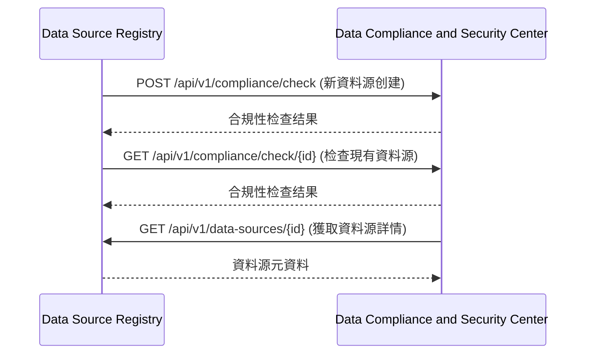
```mermaid
sequenceDiagram
    participant DSR as Data Source Registry
    participant DCSC as Data Compliance and Security Center
    
    DSR->>DCSC: POST /api/v1/compliance/check (新資料源创建)
    DCSC-->>DSR: 合規性检查结果
    
    DSR->>DCSC: GET /api/v1/compliance/check/{id} (检查現有資料源)
    DCSC-->>DSR: 合規性检查结果
    
    DCSC->>DSR: GET /api/v1/data-sources/{id} (獲取資料源詳情)
    DSR-->>DCSC: 資料源元資料
```

#### 7.9.2 與自動化媒體處理管道交互

```mermaid
sequenceDiagram
    participant AMP as Automated Media Processing Pipeline
    participant DCSC as Data Compliance and Security Center
    
    AMP->>DCSC: POST /api/v1/data:detect-sensitive (處理前內容检查)
    DCSC-->>AMP: 敏感資料檢測结果
    
    AMP->>DCSC: POST /api/v1/data:redact (请求資料脱敏)
    DCSC-->>AMP: 脱敏後的內容
    
    DCSC->>AMP: GET /api/v1/media/processingTasks/{task_id} (監控處理任務)
    AMP-->>DCSC: 處理任務詳情
```

#### 7.9.3 與AI輔助開发系統交互

```mermaid
sequenceDiagram
    participant AIDS as AI-Assisted Development System
    participant DCSC as Data Compliance and Security Center
    
    AIDS->>DCSC: GET /api/v1/compliance/rules (獲取合規规则)
    DCSC-->>AIDS: 合規规则列表
    
    DCSC->>AIDS: POST /api/v1/code:generate (请求合規代码生成)
    AIDS-->>DCSC: 合規代码示例
    
    DCSC->>AIDS: GET /api/v1/diagnose (诊断合規问题)
    AIDS-->>DCSC: 诊断结果和解决方案
```

#### 7.9.4 與資料處理工作流引擎交互

```mermaid
sequenceDiagram
    participant DPWE as Data Processing Workflow Engine
    participant DCSC as Data Compliance and Security Center
    
    DPWE->>DCSC: POST /api/v1/workflows:validate (工作流合規验證)
    DCSC-->>DPWE: 合規性验證结果
    
    DPWE->>DCSC: GET /api/v1/consents (检查用戶同意)
    DCSC-->>DPWE: 同意狀態
    
    DCSC->>DPWE: POST /api/v1/workflowInstances/{id}:monitor (監控工作流执行)
    DPWE-->>DCSC: 工作流执行詳情
```

## 8. 分布式爬蟲集群管理系統 (Distributed Crawler Cluster Management System)

### 8.1 模組概述
分布式爬蟲集群管理系統是镜界平台的爬蟲执行引擎，負責管理和调度分布式爬蟲節点，實現高效、可靠的資料採集。它提供爬蟲任務调度、資源管理、狀態監控和動态擴展能力，支援大規模分布式爬取任務。

### 8.2 詳細功能清單

#### 8.2.1 核心功能
- **爬蟲節点管理**
  - 節点自動發現與註冊
  - 節点狀態監控
  - 節点資源監控（CPU、内存、网络）
  - 節点健康检查
- **任務调度與分配**
  - 爬蟲任務隊列管理
  - 動态任務分配算法
  - 任務优先级管理
  - 任務分片與合並
- **爬蟲执行管理**
  - 爬蟲启動與停止
  - 爬蟲參數配置
  - 爬蟲执行狀態監控
  - 执行结果收集
- **資源管理**
  - 資源配额管理
  - 動态資源分配
  - 資源使用監控
  - 資源限制策略

#### 8.2.2 高级功能
- **智能调度策略**
  - 基於內容的调度
  - 基於地理位置的调度
  - 基於反爬特徵的调度
  - 负载均衡策略
- **弹性擴展**
  - 自動扩缩容
  - 預热機制
  - 优雅下线
  - 容量规划
- **爬蟲隔离與沙箱**
  - 爬蟲运行沙箱
  - 資源隔离
  - 网络隔离
  - 安全策略执行
- **任務依賴管理**
  - 任務依賴關係
  - 任務编排
  - 條件触发
  - 错误重试策略

### 8.3 技術架構

#### 8.3.1 架構图
```
┌───────────────────────────────────────────────────────────────────────────────────────────────┐
│                      分布式爬蟲集群管理系統 (DCCMS)                                           │
├───────────────────────┬───────────────────────┬───────────────────────────────────────────────┤
│  控制层               │  调度层               │  执行层                                    │
├───────────────────────┼───────────────────────┼───────────────────────────────────────────────┤
│ • 集群管理服務        │ • 任務调度器          │ • 爬蟲执行器                               │
│ • API网關             │ • 資源分配器          │ • 狀態报告器                              │
│ • 節点註冊服務        │ • 优先级管理器        │ • 心跳監控器                              │
│ • 配置管理服務        │ • 依賴解析器          │ • 資源監控器                              │
└───────────────────────┴───────────────────────┴───────────────────────────────────────────────┘
```

#### 8.3.2 服務边界與交互
- **輸入**：
  - 爬蟲任務定義（來自資料處理工作流引擎）
  - 爬蟲節点註冊
  - 節点狀態报告
  - 資源使用指標
- **輸出**：
  - 爬蟲任務执行狀態
  - 爬蟲结果資料
  - 集群健康狀態
  - 資源使用报告

### 8.4 核心組件詳細實現

#### 8.4.1 爬蟲節点管理服務

**技術實現：**
```python
import uuid
import time
import logging
from typing import Dict, List, Optional, Set
from concurrent.futures import ThreadPoolExecutor
import threading

class CrawlerNodeManager:
    """爬蟲節点管理服務，負責節点註冊、狀態監控和健康检查"""
    
    def __init__(
        self,
        config: Config,
        node_registry: NodeRegistry,
        health_checker: NodeHealthChecker,
        event_bus: EventBus
    ):
        self.config = config
        self.node_registry = node_registry
        self.health_checker = health_checker
        self.event_bus = event_bus
        self.logger = logging.getLogger(__name__)
        self.running = False
        self.heartbeat_thread = None
        self.health_check_thread = None
        self.lock = threading.Lock()
    
    def start(self):
        """启動節点管理服務"""
        if self.running:
            return
        
        self.running = True
        self.logger.info("Starting crawler node manager")
        
        # 启動心跳處理线程
        self.heartbeat_thread = threading.Thread(
            target=self._process_heartbeats,
            daemon=True
        )
        self.heartbeat_thread.start()
        
        # 启動健康检查线程
        self.health_check_thread = threading.Thread(
            target=self._perform_health_checks,
            daemon=True
        )
        self.health_check_thread.start()
        
        self.logger.info("Crawler node manager started")
    
    def stop(self):
        """停止節点管理服務"""
        if not self.running:
            return
        
        self.running = False
        self.logger.info("Stopping crawler node manager")
        
        # 等待线程结束
        if self.heartbeat_thread:
            self.heartbeat_thread.join(timeout=5.0)
        if self.health_check_thread:
            self.health_check_thread.join(timeout=5.0)
        
        self.logger.info("Crawler node manager stopped")
    
    def register_node(
        self,
        node_info: NodeInfo
    ) -> NodeRegistrationResult:
        """
        註冊爬蟲節点
        
        :param node_info: 節点資訊
        :return: 註冊结果
        """
        with self.lock:
            # 生成節点ID
            node_id = f"node-{uuid.uuid4().hex[:8]}"
            node_info.id = node_id
            
            # 设置默认狀態
            node_info.status = "online"
            node_info.last_heartbeat = time.time()
            
            # 保存節点資訊
            self.node_registry.register_node(node_info)
            
            # 发布事件
            self.event_bus.publish("node.registered", {
                "node_id": node_id,
                "node_info": node_info.to_dict()
            })
            
            self.logger.info("Node registered: %s", node_id)
            
            return NodeRegistrationResult(
                node_id=node_id,
                registration_time=time.time(),
                initial_status="online"
            )
    
    def unregister_node(self, node_id: str):
        """
        註销爬蟲節点
        
        :param node_id: 節点ID
        """
        with self.lock:
            # 獲取節点資訊
            node_info = self.node_registry.get_node(node_id)
            if not node_info:
                self.logger.warning("Node %s not found for unregistration", node_id)
                return
            
            # 更新狀態
            node_info.status = "offline"
            node_info.last_heartbeat = 0
            self.node_registry.update_node(node_info)
            
            # 发布事件
            self.event_bus.publish("node.unregistered", {
                "node_id": node_id
            })
            
            self.logger.info("Node unregistered: %s", node_id)
    
    def handle_heartbeat(self, node_id: str, heartbeat: NodeHeartbeat):
        """
        處理節点心跳
        
        :param node_id: 節点ID
        :param heartbeat: 心跳資料
        """
        with self.lock:
            # 獲取節点資訊
            node_info = self.node_registry.get_node(node_id)
            if not node_info:
                self.logger.warning("Received heartbeat from unknown node: %s", node_id)
                return
            
            # 更新節点資訊
            node_info.last_heartbeat = time.time()
            node_info.status = "online"
            node_info.resources = heartbeat.resources
            node_info.load = heartbeat.load
            node_info.task_count = len(heartbeat.active_tasks)
            
            # 保存更新
            self.node_registry.update_node(node_info)
            
            # 发布事件
            self.event_bus.publish("node.heartbeat", {
                "node_id": node_id,
                "heartbeat": heartbeat.to_dict()
            })
    
    def _process_heartbeats(self):
        """處理心跳超時"""
        while self.running:
            try:
                current_time = time.time()
                timeout_threshold = current_time - self.config.heartbeat_timeout
                
                # 检查所有節点
                nodes = self.node_registry.get_all_nodes()
                for node in nodes:
                    if node.last_heartbeat < timeout_threshold:
                        self._handle_heartbeat_timeout(node.id)
                
                # 等待下一次检查
                time.sleep(self.config.heartbeat_check_interval)
                
            except Exception as e:
                self.logger.error("Error in heartbeat processing: %s", str(e))
                time.sleep(1)
    
    def _handle_heartbeat_timeout(self, node_id: str):
        """處理心跳超時"""
        with self.lock:
            node_info = self.node_registry.get_node(node_id)
            if not node_info or node_info.status == "offline":
                return
            
            # 更新狀態
            node_info.status = "unresponsive"
            self.node_registry.update_node(node_info)
            
            # 发布事件
            self.event_bus.publish("node.timeout", {
                "node_id": node_id,
                "last_heartbeat": node_info.last_heartbeat
            })
            
            self.logger.warning("Node heartbeat timeout: %s", node_id)
    
    def _perform_health_checks(self):
        """执行健康检查"""
        while self.running:
            try:
                # 獲取需要检查的節点
                nodes = self.node_registry.get_nodes_by_status("online")
                
                # 並行执行健康检查
                with ThreadPoolExecutor(max_workers=self.config.health_check_workers) as executor:
                    futures = {
                        executor.submit(self._check_node_health, node.id): node.id
                        for node in nodes
                    }
                    
                    for future in futures:
                        node_id = futures[future]
                        try:
                            future.result()
                        except Exception as e:
                            self.logger.error("Health check failed for node %s: %s", node_id, str(e))
                
                # 等待下一次检查
                time.sleep(self.config.health_check_interval)
                
            except Exception as e:
                self.logger.error("Error in health check processing: %s", str(e))
                time.sleep(1)
    
    def _check_node_health(self, node_id: str):
        """检查節点健康狀態"""
        # 1. 执行健康检查
        health_status = self.health_checker.check(node_id)
        
        # 2. 更新節点狀態
        with self.lock:
            node_info = self.node_registry.get_node(node_id)
            if not node_info:
                return
            
            # 更新健康狀態
            node_info.health = health_status
            self.node_registry.update_node(node_info)
            
            # 處理健康狀態变化
            self._handle_health_status_change(node_id, node_info, health_status)
    
    def _handle_health_status_change(
        self,
        node_id: str,
        node_info: NodeInfo,
        new_health: NodeHealthStatus
    ):
        """處理健康狀態变化"""
        # 檢查狀態是否發生变化
        if node_info.health.status == new_health.status:
            return
        
        # 更新狀態
        node_info.health = new_health
        self.node_registry.update_node(node_info)
        
        # 发布事件
        self.event_bus.publish("node.health_changed", {
            "node_id": node_id,
            "old_status": node_info.health.status,
            "new_status": new_health.status,
            "details": new_health.details
        })
        
        # 根據健康狀態采取行動
        if new_health.status == "unhealthy":
            self._handle_unhealthy_node(node_id)
    
    def _handle_unhealthy_node(self, node_id: str):
        """處理不健康節点"""
        # 1. 從调度中移除節点
        self.event_bus.publish("scheduler.node_unavailable", {
            "node_id": node_id
        })
        
        # 2. 重新分配任務
        self.event_bus.publish("task.reassign", {
            "node_id": node_id
        })
        
        self.logger.warning("Node marked as unhealthy: %s", node_id)

class NodeRegistry:
    """節点註冊表，儲存節点資訊"""
    
    def __init__(self, db: Database):
        self.db = db
        self.logger = logging.getLogger(__name__)
    
    def register_node(self, node_info: NodeInfo):
        """註冊節点"""
        sql = """
        INSERT INTO crawler_nodes (
            id, cluster_id, name, description, 
            ip_address, port, node_type, 
            capabilities, resources, 
            status, last_heartbeat, 
            created_at, updated_at
        ) VALUES (
            %(id)s, %(cluster_id)s, %(name)s, %(description)s,
            %(ip_address)s, %(port)s, %(node_type)s,
            %(capabilities)s, %(resources)s,
            %(status)s, %(last_heartbeat)s,
            %(created_at)s, %(updated_at)s
        )
        """
        
        self.db.execute(sql, {
            "id": node_info.id,
            "cluster_id": node_info.cluster_id,
            "name": node_info.name,
            "description": node_info.description,
            "ip_address": node_info.ip_address,
            "port": node_info.port,
            "node_type": node_info.node_type,
            "capabilities": json.dumps(node_info.capabilities),
            "resources": json.dumps(node_info.resources),
            "status": node_info.status,
            "last_heartbeat": datetime.fromtimestamp(node_info.last_heartbeat),
            "created_at": datetime.utcnow(),
            "updated_at": datetime.utcnow()
        })
    
    def update_node(self, node_info: NodeInfo):
        """更新節点資訊"""
        sql = """
        UPDATE crawler_nodes SET
            name = %(name)s,
            description = %(description)s,
            capabilities = %(capabilities)s,
            resources = %(resources)s,
            status = %(status)s,
            last_heartbeat = %(last_heartbeat)s,
            updated_at = %(updated_at)s
        WHERE id = %(id)s
        """
        
        self.db.execute(sql, {
            "id": node_info.id,
            "name": node_info.name,
            "description": node_info.description,
            "capabilities": json.dumps(node_info.capabilities),
            "resources": json.dumps(node_info.resources),
            "status": node_info.status,
            "last_heartbeat": datetime.fromtimestamp(node_info.last_heartbeat),
            "updated_at": datetime.utcnow()
        })
    
    def get_node(self, node_id: str) -> Optional[NodeInfo]:
        """獲取節点資訊"""
        sql = "SELECT * FROM crawler_nodes WHERE id = %(id)s"
        row = self.db.fetchone(sql, {"id": node_id})
        return self._row_to_node(row) if row else None
    
    def get_all_nodes(self) -> List[NodeInfo]:
        """獲取所有節点"""
        sql = "SELECT * FROM crawler_nodes"
        rows = self.db.fetchall(sql)
        return [self._row_to_node(row) for row in rows]
    
    def get_nodes_by_status(self, status: str) -> List[NodeInfo]:
        """獲取特定狀態的節点"""
        sql = "SELECT * FROM crawler_nodes WHERE status = %(status)s"
        rows = self.db.fetchall(sql, {"status": status})
        return [self._row_to_node(row) for row in rows]
    
    def _row_to_node(self, row: Dict) -> NodeInfo:
        """將資料庫行转换為NodeInfo物件"""
        return NodeInfo(
            id=row["id"],
            cluster_id=row["cluster_id"],
            name=row["name"],
            description=row["description"],
            ip_address=row["ip_address"],
            port=row["port"],
            node_type=row["node_type"],
            capabilities=json.loads(row["capabilities"]),
            resources=json.loads(row["resources"]),
            status=row["status"],
            last_heartbeat=row["last_heartbeat"].timestamp(),
            health=NodeHealthStatus(
                status=row["health_status"],
                details=json.loads(row["health_details"]) if row["health_details"] else {},
                timestamp=row["health_timestamp"]
            ) if row["health_status"] else NodeHealthStatus(status="unknown"),
            created_at=row["created_at"],
            updated_at=row["updated_at"]
        )

class NodeHealthChecker:
    """節点健康检查器"""
    
    def __init__(self, config: Config):
        self.config = config
        self.logger = logging.getLogger(__name__)
    
    def check(self, node_id: str) -> NodeHealthStatus:
        """
        检查節点健康狀態
        
        :param node_id: 節点ID
        :return: 健康狀態
        """
        # 1. 检查基礎连通性
        if not self._check_connectivity(node_id):
            return NodeHealthStatus(
                status="unreachable",
                details={"error": "Node is unreachable"},
                timestamp=datetime.utcnow()
            )
        
        # 2. 检查資源使用
        resource_status = self._check_resources(node_id)
        
        # 3. 检查任務执行
        task_status = self._check_tasks(node_id)
        
        # 4. 综合健康狀態
        return self._determine_overall_status(resource_status, task_status)
    
    def _check_connectivity(self, node_id: str) -> bool:
        """检查節点连通性"""
        # 實現節点连通性检查
        # 這里简化為返回True
        return True
    
    def _check_resources(self, node_id: str) -> Dict:
        """检查資源使用"""
        # 實現資源检查
        # 這里简化為返回示例資料
        return {
            "cpu_usage": 0.65,
            "memory_usage": 0.75,
            "network_io": 120.5,
            "disk_io": 45.2
        }
    
    def _check_tasks(self, node_id: str) -> Dict:
        """检查任務执行"""
        # 實現任務检查
        # 這里简化為返回示例資料
        return {
            "task_count": 5,
            "task_errors": 0,
            "task_latency": 1.2
        }
    
    def _determine_overall_status(
        self,
        resource_status: Dict,
        task_status: Dict
    ) -> NodeHealthStatus:
        """确定整體健康狀態"""
        # 1. 檢查資源使用是否超標
        if resource_status["cpu_usage"] > 0.9 or resource_status["memory_usage"] > 0.95:
            return NodeHealthStatus(
                status="unhealthy",
                details={
                    "reason": "High resource usage",
                    "cpu": resource_status["cpu_usage"],
                    "memory": resource_status["memory_usage"]
                },
                timestamp=datetime.utcnow()
            )
        
        # 2. 檢查任務错误率
        if task_status["task_errors"] > 0:
            return NodeHealthStatus(
                status="degraded",
                details={
                    "reason": "Task errors detected",
                    "error_count": task_status["task_errors"]
                },
                timestamp=datetime.utcnow()
            )
        
        # 3. 檢查任務延遲
        if task_status["task_latency"] > 5.0:
            return NodeHealthStatus(
                status="degraded",
                details={
                    "reason": "High task latency",
                    "latency": task_status["task_latency"]
                },
                timestamp=datetime.utcnow()
            )
        
        # 4. 健康狀態
        return NodeHealthStatus(
            status="healthy",
            details={
                "cpu_usage": resource_status["cpu_usage"],
                "memory_usage": resource_status["memory_usage"],
                "task_count": task_status["task_count"]
            },
            timestamp=datetime.utcnow()
        )

# 輔助类定義
class NodeInfo:
    """節点資訊"""
    def __init__(
        self,
        id: str,
        cluster_id: str,
        name: str,
        description: str,
        ip_address: str,
        port: int,
        node_type: str,
        capabilities: Dict,
        resources: Dict,
        status: str,
        last_heartbeat: float,
        health: NodeHealthStatus,
        created_at: datetime,
        updated_at: datetime
    ):
        self.id = id
        self.cluster_id = cluster_id
        self.name = name
        self.description = description
        self.ip_address = ip_address
        self.port = port
        self.node_type = node_type
        self.capabilities = capabilities
        self.resources = resources
        self.status = status
        self.last_heartbeat = last_heartbeat
        self.health = health
        self.created_at = created_at
        self.updated_at = updated_at
    
    def to_dict(self) -> Dict:
        """转换為字典格式"""
        return {
            "id": self.id,
            "cluster_id": self.cluster_id,
            "name": self.name,
            "description": self.description,
            "ip_address": self.ip_address,
            "port": self.port,
            "node_type": self.node_type,
            "capabilities": self.capabilities,
            "resources": self.resources,
            "status": self.status,
            "last_heartbeat": self.last_heartbeat,
            "health": self.health.to_dict(),
            "created_at": self.created_at.isoformat() if self.created_at else None,
            "updated_at": self.updated_at.isoformat() if self.updated_at else None
        }

class NodeHealthStatus:
    """節点健康狀態"""
    def __init__(
        self,
        status: str,
        details: Dict = None,
        timestamp: datetime = None
    ):
        self.status = status
        self.details = details or {}
        self.timestamp = timestamp or datetime.utcnow()
    
    def to_dict(self) -> Dict:
        """转换為字典格式"""
        return {
            "status": self.status,
            "details": self.details,
            "timestamp": self.timestamp.isoformat()
        }

class NodeHeartbeat:
    """節点心跳"""
    def __init__(
        self,
        node_id: str,
        timestamp: float,
        resources: Dict,
        load: float,
        active_tasks: List[str]
    ):
        self.node_id = node_id
        self.timestamp = timestamp
        self.resources = resources
        self.load = load
        self.active_tasks = active_tasks
    
    def to_dict(self) -> Dict:
        """转换為字典格式"""
        return {
            "node_id": self.node_id,
            "timestamp": self.timestamp,
            "resources": self.resources,
            "load": self.load,
            "active_tasks": self.active_tasks
        }

class NodeRegistrationResult:
    """節点註冊结果"""
    def __init__(
        self,
        node_id: str,
        registration_time: float,
        initial_status: str
    ):
        self.node_id = node_id
        self.registration_time = registration_time
        self.initial_status = initial_status
```

#### 8.4.2 任務调度器

**技術實現：**
```python
import heapq
import time
import logging
from typing import Dict, List, Optional, Set
import threading

class TaskScheduler:
    """任務调度器，負責爬蟲任務的分配和调度"""
    
    def __init__(
        self,
        config: Config,
        node_manager: CrawlerNodeManager,
        task_queue: TaskQueue,
        event_bus: EventBus
    ):
        self.config = config
        self.node_manager = node_manager
        self.task_queue = task_queue
        self.event_bus = event_bus
        self.logger = logging.getLogger(__name__)
        self.running = False
        self.scheduler_thread = None
        self.lock = threading.Lock()
        self.assigned_tasks = {}  # task_id -> node_id
    
    def start(self):
        """启動调度器"""
        if self.running:
            return
        
        self.running = True
        self.logger.info("Starting task scheduler")
        
        # 启動调度线程
        self.scheduler_thread = threading.Thread(
            target=self._schedule_loop,
            daemon=True
        )
        self.scheduler_thread.start()
        
        self.logger.info("Task scheduler started")
    
    def stop(self):
        """停止调度器"""
        if not self.running:
            return
        
        self.running = False
        self.logger.info("Stopping task scheduler")
        
        # 等待线程结束
        if self.scheduler_thread:
            self.scheduler_thread.join(timeout=5.0)
        
        self.logger.info("Task scheduler stopped")
    
    def _schedule_loop(self):
        """调度循环"""
        while self.running:
            try:
                # 1. 獲取可用節点
                online_nodes = self.node_manager.get_nodes_by_status("online")
                if not online_nodes:
                    time.sleep(self.config.schedule_interval)
                    continue
                
                # 2. 獲取待调度任務
                tasks = self.task_queue.get_pending_tasks(
                    limit=self.config.max_tasks_per_schedule
                )
                if not tasks:
                    time.sleep(self.config.schedule_interval)
                    continue
                
                # 3. 為每個任務选择合适的節点
                for task in tasks:
                    node_id = self._select_node(task, online_nodes)
                    if node_id:
                        # 分配任務
                        self._assign_task(task, node_id)
                    else:
                        # 沒有合适的節点，稍後重试
                        self.logger.debug(
                            "No suitable node for task %s, will retry later", 
                            task.id
                        )
                
                # 4. 等待下一次调度
                time.sleep(self.config.schedule_interval)
                
            except Exception as e:
                self.logger.error("Error in scheduling loop: %s", str(e))
                time.sleep(1)
    
    def _select_node(
        self,
        task: CrawlerTask,
        online_nodes: List[NodeInfo]
    ) -> Optional[str]:
        """选择最适合的節点"""
        # 1. 過滤不支援任務類型的節点
        compatible_nodes = [
            node for node in online_nodes
            if self._is_node_compatible(node, task)
        ]
        if not compatible_nodes:
            return None
        
        # 2. 应用调度策略
        strategy = task.schedule_strategy or self.config.default_schedule_strategy
        if strategy == "least_loaded":
            return self._select_least_loaded_node(compatible_nodes)
        elif strategy == "geo_location":
            return self._select_geo_location_node(compatible_nodes, task)
        elif strategy == "content_based":
            return self._select_content_based_node(compatible_nodes, task)
        
        # 默认策略：最小负载
        return self._select_least_loaded_node(compatible_nodes)
    
    def _is_node_compatible(
        self,
        node: NodeInfo,
        task: CrawlerTask
    ) -> bool:
        """检查節点是否支援任務"""
        # 1. 檢查節点類型
        if task.node_type and node.node_type != task.node_type:
            return False
        
        # 2. 檢查能力要求
        for capability, required in task.capabilities.items():
            if capability not in node.capabilities or node.capabilities[capability] < required:
                return False
        
        # 3. 檢查資源要求
        if task.min_resources:
            for resource, required in task.min_resources.items():
                if resource not in node.resources or node.resources[resource] < required:
                    return False
        
        return True
    
    def _select_least_loaded_node(
        self,
        nodes: List[NodeInfo]
    ) -> Optional[str]:
        """选择负载最小的節点"""
        if not nodes:
            return None
        
        # 按负载排序（升序）
        sorted_nodes = sorted(nodes, key=lambda n: n.load)
        return sorted_nodes[0].id
    
    def _select_geo_location_node(
        self,
        nodes: List[NodeInfo],
        task: CrawlerTask
    ) -> Optional[str]:
        """选择地理位置最近的節点"""
        if not task.target_region or not nodes:
            return self._select_least_loaded_node(nodes)
        
        # 计算每個節点與目標区域的距离
        node_distances = []
        for node in nodes:
            distance = self._calculate_geo_distance(node.region, task.target_region)
            node_distances.append((distance, node))
        
        # 按距离排序
        sorted_nodes = sorted(node_distances, key=lambda x: x[0])
        return sorted_nodes[0][1].id
    
    def _calculate_geo_distance(
        self,
        node_region: str,
        target_region: str
    ) -> float:
        """计算地理位置距离"""
        # 简单實現：基於区域代码的匹配
        if node_region == target_region:
            return 0.0
        elif node_region[:2] == target_region[:2]:  # 同一国家
            return 1.0
        else:
            return 2.0
    
    def _select_content_based_node(
        self,
        nodes: List[NodeInfo],
        task: CrawlerTask
    ) -> Optional[str]:
        """选择基於內容特性的節点"""
        if not task.content_features or not nodes:
            return self._select_least_loaded_node(nodes)
        
        # 计算每個節点與內容特徵的匹配度
        node_matches = []
        for node in nodes:
            match_score = self._calculate_content_match(node, task.content_features)
            node_matches.append((match_score, node))
        
        # 按匹配度排序（降序）
        sorted_nodes = sorted(node_matches, key=lambda x: x[0], reverse=True)
        return sorted_nodes[0][1].id
    
    def _calculate_content_match(
        self,
        node: NodeInfo,
        content_features: Dict
    ) -> float:
        """计算內容匹配度"""
        score = 0.0
        
        # 检查節点是否支援內容類型
        if "content_type" in content_features:
            if content_features["content_type"] in node.capabilities.get("content_types", []):
                score += 0.4
        
        # 检查節点是否支援特定技術
        if "technology" in content_features:
            if content_features["technology"] in node.capabilities.get("technologies", []):
                score += 0.3
        
        # 检查節点是否處理過类似內容
        if "similarity" in content_features:
            score += content_features["similarity"] * 0.3
        
        return score
    
    def _assign_task(
        self,
        task: CrawlerTask,
        node_id: str
    ):
        """分配任務到節点"""
        with self.lock:
            # 1. 更新任務狀態
            task.status = "assigned"
            task.assigned_node = node_id
            task.assigned_at = time.time()
            self.task_queue.update_task(task)
            
            # 2. 記錄分配
            self.assigned_tasks[task.id] = node_id
            
            # 3. 发布事件
            self.event_bus.publish("task.assigned", {
                "task_id": task.id,
                "node_id": node_id,
                "task_info": task.to_dict()
            })
            
            self.logger.info("Task %s assigned to node %s", task.id, node_id)
    
    def handle_task_completion(
        self,
        task_id: str,
        node_id: str,
        result: TaskResult
    ):
        """
        處理任務完成
        
        :param task_id: 任務ID
        :param node_id: 節点ID
        :param result: 任務结果
        """
        with self.lock:
            # 1. 移除分配記錄
            if task_id in self.assigned_tasks:
                del self.assigned_tasks[task_id]
            
            # 2. 更新任務狀態
            task = self.task_queue.get_task(task_id)
            if not task:
                self.logger.warning("Task %s not found for completion", task_id)
                return
            
            task.status = "completed" if result.success else "failed"
            task.completed_at = time.time()
            task.result = result.to_dict()
            self.task_queue.update_task(task)
            
            # 3. 发布事件
            event_type = "task.completed" if result.success else "task.failed"
            self.event_bus.publish(event_type, {
                "task_id": task_id,
                "node_id": node_id,
                "result": result.to_dict()
            })
            
            self.logger.info(
                "Task %s %s by node %s", 
                task_id, 
                "completed" if result.success else "failed",
                node_id
            )
    
    def handle_task_timeout(
        self,
        task_id: str,
        node_id: str
    ):
        """
        處理任務超時
        
        :param task_id: 任務ID
        :param node_id: 節点ID
        """
        with self.lock:
            # 1. 移除分配記錄
            if task_id in self.assigned_tasks:
                del self.assigned_tasks[task_id]
            
            # 2. 更新任務狀態
            task = self.task_queue.get_task(task_id)
            if not task:
                self.logger.warning("Task %s not found for timeout", task_id)
                return
            
            task.status = "timeout"
            task.completed_at = time.time()
            self.task_queue.update_task(task)
            
            # 3. 重新入隊（如果需要重试）
            if task.retry_count < task.max_retries:
                task.retry_count += 1
                task.status = "pending"
                task.assigned_node = None
                self.task_queue.add_task(task)
                
                self.logger.info(
                    "Task %s timed out, retrying (attempt %d/%d)", 
                    task_id, 
                    task.retry_count,
                    task.max_retries
                )
            else:
                self.logger.warning(
                    "Task %s timed out and exceeded max retries", 
                    task_id
                )
            
            # 4. 发布事件
            self.event_bus.publish("task.timeout", {
                "task_id": task_id,
                "node_id": node_id,
                "retry_count": task.retry_count
            })

class TaskQueue:
    """任務隊列，管理待處理任務"""
    
    def __init__(self, db: Database):
        self.db = db
        self.logger = logging.getLogger(__name__)
    
    def add_task(self, task: CrawlerTask):
        """添加任務到隊列"""
        sql = """
        INSERT INTO crawler_tasks (
            id, project_id, workflow_id, task_type,
            parameters, priority, 
            min_resources, capabilities,
            schedule_strategy, target_region, content_features,
            status, created_at, updated_at
        ) VALUES (
            %(id)s, %(project_id)s, %(workflow_id)s, %(task_type)s,
            %(parameters)s, %(priority)s,
            %(min_resources)s, %(capabilities)s,
            %(schedule_strategy)s, %(target_region)s, %(content_features)s,
            %(status)s, %(created_at)s, %(updated_at)s
        )
        """
        
        self.db.execute(sql, {
            "id": task.id,
            "project_id": task.project_id,
            "workflow_id": task.workflow_id,
            "task_type": task.task_type,
            "parameters": json.dumps(task.parameters),
            "priority": task.priority,
            "min_resources": json.dumps(task.min_resources) if task.min_resources else None,
            "capabilities": json.dumps(task.capabilities) if task.capabilities else None,
            "schedule_strategy": task.schedule_strategy,
            "target_region": task.target_region,
            "content_features": json.dumps(task.content_features) if task.content_features else None,
            "status": task.status,
            "created_at": task.created_at,
            "updated_at": task.updated_at
        })
    
    def get_pending_tasks(
        self,
        limit: int = 100
    ) -> List[CrawlerTask]:
        """獲取待處理任務"""
        sql = """
        SELECT * FROM crawler_tasks 
        WHERE status = 'pending'
        ORDER BY priority DESC, created_at
        LIMIT %(limit)s
        """
        
        rows = self.db.fetchall(sql, {"limit": limit})
        return [self._row_to_task(row) for row in rows]
    
    def get_task(self, task_id: str) -> Optional[CrawlerTask]:
        """獲取任務詳情"""
        sql = "SELECT * FROM crawler_tasks WHERE id = %(id)s"
        row = self.db.fetchone(sql, {"id": task_id})
        return self._row_to_task(row) if row else None
    
    def update_task(self, task: CrawlerTask):
        """更新任務狀態"""
        sql = """
        UPDATE crawler_tasks SET
            status = %(status)s,
            assigned_node = %(assigned_node)s,
            assigned_at = %(assigned_at)s,
            completed_at = %(completed_at)s,
            result = %(result)s,
            retry_count = %(retry_count)s,
            updated_at = %(updated_at)s
        WHERE id = %(id)s
        """
        
        self.db.execute(sql, {
            "id": task.id,
            "status": task.status,
            "assigned_node": task.assigned_node,
            "assigned_at": datetime.fromtimestamp(task.assigned_at) if task.assigned_at else None,
            "completed_at": datetime.fromtimestamp(task.completed_at) if task.completed_at else None,
            "result": json.dumps(task.result) if task.result else None,
            "retry_count": task.retry_count,
            "updated_at": datetime.utcnow()
        })

# 輔助类定義
class CrawlerTask:
    """爬蟲任務"""
    def __init__(
        self,
        id: str,
        project_id: str,
        workflow_id: str,
        task_type: str,
        parameters: Dict,
        priority: int = 5,
        min_resources: Optional[Dict] = None,
        capabilities: Optional[Dict] = None,
        schedule_strategy: Optional[str] = None,
        target_region: Optional[str] = None,
        content_features: Optional[Dict] = None,
        status: str = "pending",
        created_at: datetime = None,
        updated_at: datetime = None,
        assigned_node: Optional[str] = None,
        assigned_at: Optional[float] = None,
        completed_at: Optional[float] = None,
        result: Optional[Dict] = None,
        retry_count: int = 0,
        max_retries: int = 3
    ):
        self.id = id
        self.project_id = project_id
        self.workflow_id = workflow_id
        self.task_type = task_type
        self.parameters = parameters
        self.priority = priority
        self.min_resources = min_resources or {}
        self.capabilities = capabilities or {}
        self.schedule_strategy = schedule_strategy
        self.target_region = target_region
        self.content_features = content_features or {}
        self.status = status
        self.created_at = created_at or datetime.utcnow()
        self.updated_at = updated_at or datetime.utcnow()
        self.assigned_node = assigned_node
        self.assigned_at = assigned_at
        self.completed_at = completed_at
        self.result = result
        self.retry_count = retry_count
        self.max_retries = max_retries
    
    def to_dict(self) -> Dict:
        """转换為字典格式"""
        return {
            "id": self.id,
            "project_id": self.project_id,
            "workflow_id": self.workflow_id,
            "task_type": self.task_type,
            "parameters": self.parameters,
            "priority": self.priority,
            "min_resources": self.min_resources,
            "capabilities": self.capabilities,
            "schedule_strategy": self.schedule_strategy,
            "target_region": self.target_region,
            "content_features": self.content_features,
            "status": self.status,
            "created_at": self.created_at.isoformat(),
            "updated_at": self.updated_at.isoformat(),
            "assigned_node": self.assigned_node,
            "assigned_at": self.assigned_at,
            "completed_at": self.completed_at,
            "result": self.result,
            "retry_count": self.retry_count,
            "max_retries": self.max_retries
        }

class TaskResult:
    """任務结果"""
    def __init__(
        self,
        success: bool,
        data: Optional[Dict] = None,
        error: Optional[str] = None,
        metrics: Optional[Dict] = None
    ):
        self.success = success
        self.data = data or {}
        self.error = error
        self.metrics = metrics or {}
        self.timestamp = datetime.utcnow()
    
    def to_dict(self) -> Dict:
        """转换為字典格式"""
        return {
            "success": self.success,
            "data": self.data,
            "error": self.error,
            "metrics": self.metrics,
            "timestamp": self.timestamp.isoformat()
        }
```

### 8.5 資料模型詳細定義

#### 8.5.1 爬蟲節点表

```sql
-- 爬蟲節点表
CREATE TABLE crawler_nodes (
    id UUID PRIMARY KEY DEFAULT gen_random_uuid(),
    cluster_id UUID NOT NULL REFERENCES crawler_clusters(id) ON DELETE CASCADE,
    name VARCHAR(255) NOT NULL,
    description TEXT,
    ip_address INET NOT NULL,
    port INT NOT NULL,
    node_type VARCHAR(50) NOT NULL,
    capabilities JSONB DEFAULT '{}'::jsonb,
    resources JSONB DEFAULT '{}'::jsonb,
    status VARCHAR(20) NOT NULL DEFAULT 'pending' CHECK (status IN ('pending', 'online', 'offline', 'unresponsive', 'maintenance')),
    last_heartbeat TIMESTAMPTZ,
    health_status VARCHAR(20) NOT NULL DEFAULT 'unknown' CHECK (health_status IN ('unknown', 'healthy', 'degraded', 'unhealthy')),
    health_details JSONB DEFAULT '{}'::jsonb,
    health_timestamp TIMESTAMPTZ,
    created_at TIMESTAMPTZ NOT NULL DEFAULT NOW(),
    updated_at TIMESTAMPTZ NOT NULL DEFAULT NOW(),
    
    -- 索引
    INDEX idx_nodes_cluster ON crawler_nodes(cluster_id),
    INDEX idx_nodes_status ON crawler_nodes(status),
    INDEX idx_nodes_health ON crawler_nodes(health_status),
    INDEX idx_nodes_last_heartbeat ON crawler_nodes(last_heartbeat DESC)
);

-- 自動更新updated_at触发器
CREATE OR REPLACE FUNCTION update_crawler_nodes_modtime()
RETURNS TRIGGER AS $$
BEGIN
    NEW.updated_at = NOW();
    RETURN NEW;
END;
$$ LANGUAGE plpgsql;

CREATE TRIGGER update_crawler_nodes_modtime
BEFORE UPDATE ON crawler_nodes
FOR EACH ROW
EXECUTE FUNCTION update_crawler_nodes_modtime();
```

#### 8.5.2 爬蟲任務表

```sql
-- 爬蟲任務表
CREATE TABLE crawler_tasks (
    id UUID PRIMARY KEY DEFAULT gen_random_uuid(),
    project_id UUID NOT NULL REFERENCES projects(id) ON DELETE CASCADE,
    workflow_id UUID NOT NULL REFERENCES workflow_instances(id) ON DELETE CASCADE,
    task_type VARCHAR(50) NOT NULL,
    parameters JSONB NOT NULL,
    priority INT NOT NULL DEFAULT 5,
    min_resources JSONB DEFAULT '{}'::jsonb,
    capabilities JSONB DEFAULT '{}'::jsonb,
    schedule_strategy VARCHAR(50),
    target_region VARCHAR(10),
    content_features JSONB DEFAULT '{}'::jsonb,
    status VARCHAR(20) NOT NULL DEFAULT 'pending' CHECK (status IN ('pending', 'assigned', 'processing', 'completed', 'failed', 'timeout')),
    created_at TIMESTAMPTZ NOT NULL DEFAULT NOW(),
    updated_at TIMESTAMPTZ NOT NULL DEFAULT NOW(),
    assigned_node UUID REFERENCES crawler_nodes(id) ON DELETE SET NULL,
    assigned_at TIMESTAMPTZ,
    completed_at TIMESTAMPTZ,
    result JSONB,
    retry_count INT NOT NULL DEFAULT 0,
    max_retries INT NOT NULL DEFAULT 3,
    
    -- 索引
    INDEX idx_tasks_project ON crawler_tasks(project_id),
    INDEX idx_tasks_workflow ON crawler_tasks(workflow_id),
    INDEX idx_tasks_status ON crawler_tasks(status),
    INDEX idx_tasks_priority ON crawler_tasks(priority DESC, created_at),
    INDEX idx_tasks_assigned ON crawler_tasks(assigned_node),
    INDEX idx_tasks_created ON crawler_tasks(created_at DESC)
);
```

#### 8.5.3 爬蟲任務执行表

```sql
-- 爬蟲任務执行表
CREATE TABLE crawler_task_executions (
    id UUID PRIMARY KEY DEFAULT gen_random_uuid(),
    task_id UUID NOT NULL REFERENCES crawler_tasks(id) ON DELETE CASCADE,
    node_id UUID NOT NULL REFERENCES crawler_nodes(id) ON DELETE CASCADE,
    start_time TIMESTAMPTZ NOT NULL DEFAULT NOW(),
    end_time TIMESTAMPTZ,
    status VARCHAR(20) NOT NULL CHECK (status IN ('running', 'completed', 'failed')),
    result JSONB,
    metrics JSONB DEFAULT '{}'::jsonb,
    retry_count INT NOT NULL DEFAULT 0,
    
    -- 索引
    INDEX idx_executions_task ON crawler_task_executions(task_id),
    INDEX idx_executions_node ON crawler_task_executions(node_id),
    INDEX idx_executions_status ON crawler_task_executions(status),
    INDEX idx_executions_time ON crawler_task_executions(start_time DESC)
);
```

#### 8.5.4 爬蟲集群表

```sql
-- 爬蟲集群表
CREATE TABLE crawler_clusters (
    id UUID PRIMARY KEY DEFAULT gen_random_uuid(),
    project_id UUID NOT NULL REFERENCES projects(id) ON DELETE CASCADE,
    name VARCHAR(255) NOT NULL,
    description TEXT,
    configuration JSONB DEFAULT '{}'::jsonb,
    status VARCHAR(20) NOT NULL DEFAULT 'active' CHECK (status IN ('active', 'inactive', 'maintenance')),
    created_at TIMESTAMPTZ NOT NULL DEFAULT NOW(),
    updated_at TIMESTAMPTZ NOT NULL DEFAULT NOW(),
    
    -- 索引
    INDEX idx_clusters_project ON crawler_clusters(project_id),
    INDEX idx_clusters_status ON crawler_clusters(status),
    UNIQUE (project_id, name)
);

-- 自動更新updated_at触发器
CREATE OR REPLACE FUNCTION update_crawler_clusters_modtime()
RETURNS TRIGGER AS $$
BEGIN
    NEW.updated_at = NOW();
    RETURN NEW;
END;
$$ LANGUAGE plpgsql;

CREATE TRIGGER update_crawler_clusters_modtime
BEFORE UPDATE ON crawler_clusters
FOR EACH ROW
EXECUTE FUNCTION update_crawler_clusters_modtime();
```

### 8.6 API詳細規範

#### 8.6.1 節点管理API

**註冊爬蟲節点 (POST /api/v1/nodes:register)**

*请求示例:*
```http
POST /api/v1/nodes:register HTTP/1.1
Host: dccms.mirror-realm.com
Authorization: Bearer <access_token>
Content-Type: application/json

{
  "name": "crawler-node-01",
  "description": "Main crawler node in US East region",
  "ip_address": "192.168.1.101",
  "port": 8000,
  "node_type": "standard",
  "capabilities": {
    "content_types": ["html", "json", "xml"],
    "technologies": ["react", "angular", "wordpress"],
    "anti_crawling_bypass": ["user-agent", "proxy"]
  },
  "resources": {
    "cpu": 8,
    "memory_mb": 16384,
    "gpu": 1,
    "network_bandwidth_mbps": 1000
  }
}
```

*成功響應示例:*
```http
HTTP/1.1 201 Created
Content-Type: application/json
Location: /api/v1/nodes/node-1a2b3c4d

{
  "node_id": "node-1a2b3c4d",
  "registration_time": 1686825045.123,
  "initial_status": "online"
}
```

**发送節点心跳 (POST /api/v1/nodes/{node_id}:heartbeat)**

*请求示例:*
```http
POST /api/v1/nodes/node-1a2b3c4d:heartbeat HTTP/1.1
Host: dccms.mirror-realm.com
Authorization: Bearer <access_token>
Content-Type: application/json

{
  "resources": {
    "cpu_usage": 0.65,
    "memory_usage": 0.75,
    "gpu_usage": 0.45
  },
  "load": 0.8,
  "active_tasks": ["task-123", "task-456"]
}
```

*成功響應示例:*
```http
HTTP/1.1 200 OK
Content-Type: application/json

{
  "node_id": "node-1a2b3c4d",
  "timestamp": 1686825045.123,
  "status": "online"
}
```

#### 8.6.2 任務管理API

**创建爬蟲任務 (POST /api/v1/tasks)**

*请求示例:*
```http
POST /api/v1/tasks HTTP/1.1
Host: dccms.mirror-realm.com
Authorization: Bearer <access_token>
Content-Type: application/json

{
  "project_id": "proj-123",
  "workflow_id": "inst-1a2b3c4d5e6f",
  "task_type": "web_crawl",
  "parameters": {
    "url": "https://example.com/products",
    "depth": 2,
    "selectors": {
      "product": "div.product",
      "title": "h2.title",
      "price": "span.price"
    }
  },
  "priority": 7,
  "min_resources": {
    "memory_mb": 4096,
    "cpu_cores": 2
  },
  "capabilities": {
    "javascript_rendering": 1,
    "proxy_rotation": 1
  },
  "schedule_strategy": "least_loaded",
  "target_region": "us",
  "content_features": {
    "content_type": "html",
    "technology": "react"
  }
}
```

*成功響應示例:*
```http
HTTP/1.1 201 Created
Content-Type: application/json
Location: /api/v1/tasks/task-123

{
  "id": "task-123",
  "status": "pending",
  "created_at": "2023-06-15T10:30:45Z",
  "priority": 7
}
```

**獲取任務狀態 (GET /api/v1/tasks/{task_id})**

*请求示例:*
```http
GET /api/v1/tasks/task-123 HTTP/1.1
Host: dccms.mirror-realm.com
Authorization: Bearer <access_token>
```

*成功響應示例 (處理中):*
```http
HTTP/1.1 200 OK
Content-Type: application/json

{
  "id": "task-123",
  "project_id": "proj-123",
  "workflow_id": "inst-1a2b3c4d5e6f",
  "task_type": "web_crawl",
  "parameters": {
    "url": "https://example.com/products",
    "depth": 2,
    "selectors": {
      "product": "div.product",
      "title": "h2.title",
      "price": "span.price"
    }
  },
  "priority": 7,
  "min_resources": {
    "memory_mb": 4096,
    "cpu_cores": 2
  },
  "capabilities": {
    "javascript_rendering": 1,
    "proxy_rotation": 1
  },
  "schedule_strategy": "least_loaded",
  "target_region": "us",
  "content_features": {
    "content_type": "html",
    "technology": "react"
  },
  "status": "processing",
  "created_at": "2023-06-15T10:30:45Z",
  "updated_at": "2023-06-15T10:31:10Z",
  "assigned_node": "node-1a2b3c4d",
  "assigned_at": "2023-06-15T10:31:10Z",
  "retry_count": 0,
  "max_retries": 3
}
```

*成功響應示例 (已完成):*
```http
HTTP/1.1 200 OK
Content-Type: application/json

{
  "id": "task-123",
  "project_id": "proj-123",
  "workflow_id": "inst-1a2b3c4d5e6f",
  "task_type": "web_crawl",
  "parameters": {
    "url": "https://example.com/products",
    "depth": 2,
    "selectors": {
      "product": "div.product",
      "title": "h2.title",
      "price": "span.price"
    }
  },
  "priority": 7,
  "min_resources": {
    "memory_mb": 4096,
    "cpu_cores": 2
  },
  "capabilities": {
    "javascript_rendering": 1,
    "proxy_rotation": 1
  },
  "schedule_strategy": "least_loaded",
  "target_region": "us",
  "content_features": {
    "content_type": "html",
    "technology": "react"
  },
  "status": "completed",
  "created_at": "2023-06-15T10:30:45Z",
  "updated_at": "2023-06-15T10:35:20Z",
  "assigned_node": "node-1a2b3c4d",
  "assigned_at": "2023-06-15T10:31:10Z",
  "completed_at": "2023-06-15T10:35:20Z",
  "result": {
    "success": true,
    "data": {
      "products": [
        {
          "title": "Product 1",
          "price": "$19.99",
          "url": "/products/1"
        },
        {
          "title": "Product 2",
          "price": "$29.99",
          "url": "/products/2"
        }
      ]
    },
    "metrics": {
      "pages_crawled": 15,
      "processing_time": 125.4,
      "data_size": 4294967
    },
    "timestamp": "2023-06-15T10:35:20Z"
  },
  "retry_count": 0,
  "max_retries": 3
}
```

### 8.7 效能優化策略

#### 8.7.1 任務调度優化

1. **分层任務隊列**
   ```python
   class LayeredTaskQueue:
       """分层任務隊列，支援优先级和分類"""
       
       def __init__(self, config: Config):
           self.config = config
           self.logger = logging.getLogger(__name__)
           
           # 创建优先级隊列
           self.priority_queues = {
               priority: PriorityQueue()
               for priority in range(1, 11)  # 1-10优先级
           }
           
           # 创建类别隊列
           self.category_queues = defaultdict(PriorityQueue)
       
       def add_task(self, task: CrawlerTask):
           """添加任務到隊列"""
           # 按优先级添加
           self.priority_queues[task.priority].put((task.created_at, task.id, task))
           
           # 按类别添加
           for category in task.categories:
               self.category_queues[category].put((task.priority, task.created_at, task.id, task))
       
       def get_next_task(
           self,
           max_priority: int = 10,
           categories: Optional[List[str]] = None
       ) -> Optional[CrawlerTask]:
           """獲取下一個任務"""
           # 1. 按类别獲取任務
           if categories:
               for category in categories:
                   if category in self.category_queues:
                       task = self._get_task_from_category_queue(category)
                       if task and task.priority <= max_priority:
                           return task
           
           # 2. 按优先级獲取任務
           for priority in range(1, max_priority + 1):
               if not self.priority_queues[priority].empty():
                   _, _, task = self.priority_queues[priority].get()
                   return task
           
           return None
       
       def _get_task_from_category_queue(self, category: str) -> Optional[CrawlerTask]:
           """從类别隊列獲取任務"""
           if self.category_queues[category].empty():
               return None
           
           # 獲取最高优先级任務
           _, _, _, task = self.category_queues[category].get()
           return task
       
       def task_completed(self, task: CrawlerTask):
           """任務完成處理"""
           # 從隊列中移除
           self._remove_from_priority_queue(task)
           self._remove_from_category_queues(task)
       
       def _remove_from_priority_queue(self, task: CrawlerTask):
           """從优先级隊列移除"""
           # 简单實現：重建隊列
           temp_queue = PriorityQueue()
           while not self.priority_queues[task.priority].empty():
               t = self.priority_queues[task.priority].get()
               if t[2].id != task.id:
                   temp_queue.put(t)
           self.priority_queues[task.priority] = temp_queue
       
       def _remove_from_category_queues(self, task: CrawlerTask):
           """從类别隊列移除"""
           for category in task.categories:
               if category in self.category_queues:
                   # 重建类别隊列
                   temp_queue = PriorityQueue()
                   while not self.category_queues[category].empty():
                       t = self.category_queues[category].get()
                       if t[3].id != task.id:
                           temp_queue.put(t)
                   self.category_queues[category] = temp_queue
   ```

2. **批量任務分配**
   ```python
   class BatchTaskScheduler:
       """批量任務调度器，提高调度效率"""
       
       def __init__(self, config: Config, node_manager: CrawlerNodeManager):
           self.config = config
           self.node_manager = node_manager
           self.logger = logging.getLogger(__name__)
       
       def schedule_batch(
           self,
           tasks: List[CrawlerTask],
           nodes: List[NodeInfo]
       ) -> Dict[str, List[CrawlerTask]]:
           """
           批量调度任務
           
           :param tasks: 任務列表
           :param nodes: 可用節点列表
           :return: 節点到任務的映射
           """
           # 1. 按策略對任務排序
           sorted_tasks = self._sort_tasks(tasks)
           
           # 2. 按能力對節点排序
           sorted_nodes = self._sort_nodes(nodes)
           
           # 3. 分配任務
           assignment = {node.id: [] for node in sorted_nodes}
           node_index = 0
           
           for task in sorted_tasks:
               # 选择節点（轮询）
               node = sorted_nodes[node_index]
               assignment[node.id].append(task)
               
               # 更新索引
               node_index = (node_index + 1) % len(sorted_nodes)
           
           return assignment
       
       def _sort_tasks(self, tasks: List[CrawlerTask]) -> List[CrawlerTask]:
           """對任務排序"""
           # 按优先级和创建時間排序
           return sorted(
               tasks,
               key=lambda t: (-t.priority, t.created_at)
           )
       
       def _sort_nodes(self, nodes: List[NodeInfo]) -> List[NodeInfo]:
           """對節点排序"""
           # 按负载排序（升序）
           return sorted(
               nodes,
               key=lambda n: n.load
           )
   ```

#### 8.7.2 資源優化

1. **動态資源分配**
   ```python
   class DynamicResourceAllocator:
       """動态資源分配器"""
       
       def __init__(self, config: Config):
           self.config = config
           self.logger = logging.getLogger(__name__)
       
       def allocate_resources(
           self,
           task: CrawlerTask,
           node: NodeInfo
       ) -> Dict[str, Any]:
           """
           分配資源給任務
           
           :param task: 任務
           :param node: 節点
           :return: 資源分配结果
           """
           # 1. 基始分配
           allocation = self._initial_allocation(task, node)
           
           # 2. 根據實時负载调整
           allocation = self._adjust_for_load(allocation, node)
           
           # 3. 根據任務特性调整
           allocation = self._adjust_for_task(allocation, task)
           
           return allocation
       
       def _initial_allocation(
           self,
           task: CrawlerTask,
           node: NodeInfo
       ) -> Dict[str, Any]:
           """初始資源分配"""
           # 基始分配基於任務请求
           allocation = {
               "cpu_cores": min(task.min_resources.get("cpu_cores", 1), node.resources["cpu"]),
               "memory_mb": min(task.min_resources.get("memory_mb", 1024), node.resources["memory_mb"]),
               "gpu": min(task.min_resources.get("gpu", 0), node.resources["gpu"])
           }
           
           # 確保至少分配最小資源
           allocation["cpu_cores"] = max(allocation["cpu_cores"], 0.5)
           allocation["memory_mb"] = max(allocation["memory_mb"], 512)
           
           return allocation
       
       def _adjust_for_load(
           self,
           allocation: Dict[str, Any],
           node: NodeInfo
       ) -> Dict[str, Any]:
           """根據節点负载调整資源分配"""
           # 如果節点负载高，减少資源分配
           if node.load > 0.7:
               allocation["cpu_cores"] *= 0.8
               allocation["memory_mb"] *= 0.9
           
           # 如果節点负载低，增加資源分配
           elif node.load < 0.3:
               allocation["cpu_cores"] = min(allocation["cpu_cores"] * 1.2, node.resources["cpu"])
               allocation["memory_mb"] = min(allocation["memory_mb"] * 1.1, node.resources["memory_mb"])
           
           return allocation
       
       def _adjust_for_task(
           self,
           allocation: Dict[str, Any],
           task: CrawlerTask
       ) -> Dict[str, Any]:
           """根據任務特性调整資源分配"""
           # 如果任務需要JavaScript渲染，增加内存
           if task.capabilities.get("javascript_rendering", 0) > 0:
               allocation["memory_mb"] = min(allocation["memory_mb"] * 1.5, 8192)
           
           # 如果任務需要代理轮换，增加CPU
           if task.capabilities.get("proxy_rotation", 0) > 0:
               allocation["cpu_cores"] = min(allocation["cpu_cores"] * 1.3, 4.0)
           
           return allocation
   ```

### 8.8 安全考慮

#### 8.8.1 節点安全

1. **節点認證與授權**
   ```python
   class NodeAuthenticator:
       """節点認證器"""
       
       def __init__(self, config: Config, db: Database):
           self.config = config
           self.db = db
           self.logger = logging.getLogger(__name__)
       
       def authenticate(
           self,
           node_id: str,
           token: str
       ) -> Tuple[bool, Optional[str]]:
           """
           認證節点
           
           :param node_id: 節点ID
           :param token: 認證令牌
           :return: (是否認證通過, 错误消息)
           """
           # 1. 检查節点是否存在
           node = self._get_node(node_id)
           if not node:
               return False, "Node not registered"
           
           # 2. 检查令牌有效性
           if not self._validate_token(node, token):
               return False, "Invalid token"
           
           # 3. 检查節点狀態
           if node["status"] != "online":
               return False, f"Node not online (status: {node['status']})"
           
           return True, None
       
       def _get_node(self, node_id: str) -> Optional[Dict]:
           """獲取節点資訊"""
           sql = "SELECT * FROM crawler_nodes WHERE id = %(id)s"
           return self.db.fetchone(sql, {"id": node_id})
       
       def _validate_token(self, node: Dict, token: str) -> bool:
           """验證令牌"""
           # 1. 检查令牌格式
           if not re.match(r'^[a-f0-9]{64}$', token):
               return False
           
           # 2. 检查令牌是否匹配
           stored_token = node["auth_token"]
           return hmac.compare_digest(stored_token, token)
       
       def generate_token(self, node_id: str) -> str:
           """生成節点認證令牌"""
           # 1. 生成隨机令牌
           token = secrets.token_hex(32)
           
           # 2. 儲存令牌（哈希後）
           hashed_token = self._hash_token(token)
           self._store_token(node_id, hashed_token)
           
           return token
       
       def _hash_token(self, token: str) -> str:
           """哈希令牌"""
           return hashlib.sha256(token.encode('utf-8')).hexdigest()
       
       def _store_token(self, node_id: str, hashed_token: str):
           """儲存哈希令牌"""
           sql = """
           UPDATE crawler_nodes 
           SET auth_token = %(token)s, auth_token_updated = NOW()
           WHERE id = %(id)s
           """
           self.db.execute(sql, {
               "id": node_id,
               "token": hashed_token
           })
   ```

2. **節点沙箱环境**
   ```python
   class NodeSandbox:
       """節点沙箱环境，限制爬蟲执行"""
       
       def __init__(self, config: Config):
           self.config = config
           self.logger = logging.getLogger(__name__)
       
       def create_sandbox(self, node_id: str, task: CrawlerTask) -> str:
           """
           创建沙箱环境
           
           :param node_id: 節点ID
           :param task: 任務
           :return: 沙箱路径
           """
           # 1. 创建临時目录
           sandbox_dir = tempfile.mkdtemp(prefix=f"sandbox_{node_id}_")
           
           # 2. 设置資源限制
           self._apply_resource_limits(sandbox_dir, task)
           
           # 3. 设置网络限制
           self._apply_network_limits(sandbox_dir, task)
           
           # 4. 设置文件系統限制
           self._apply_filesystem_limits(sandbox_dir, task)
           
           return sandbox_dir
       
       def _apply_resource_limits(self, sandbox_dir: str, task: CrawlerTask):
           """应用資源限制"""
           # 使用cgroups限制資源
           cgroup_path = f"/sys/fs/cgroup/crawler/{task.id}"
           os.makedirs(cgroup_path, exist_ok=True)
           
           # CPU限制
           cpu_quota = int(self.config.cpu_quota_base * task.min_resources.get("cpu_cores", 1))
           with open(f"{cgroup_path}/cpu.max", "w") as f:
               f.write(f"{cpu_quota} 100000")
           
           # 内存限制
           mem_limit = task.min_resources.get("memory_mb", 1024) * 1024 * 1024
           with open(f"{cgroup_path}/memory.max", "w") as f:
               f.write(str(mem_limit))
       
       def _apply_network_limits(self, sandbox_dir: str, task: CrawlerTask):
           """应用网络限制"""
           # 使用network namespace隔离
           netns_name = f"crawler_{task.id}"
           subprocess.run(["ip", "netns", "add", netns_name], check=True)
           
           # 设置网络限制
           if task.min_resources.get("network_bandwidth_mbps"):
               bandwidth = task.min_resources["network_bandwidth_mbps"]
               subprocess.run([
                   "tc", "qdisc", "add", "dev", "eth0", "root", "tbf", 
                   "rate", f"{bandwidth}mbit", "burst", "50kb", "latency", "70ms"
               ], check=True)
       
       def _apply_filesystem_limits(self, sandbox_dir: str, task: CrawlerTask):
           """应用文件系統限制"""
           # 使用bind mount限制文件系統訪問
           allowed_dirs = self.config.sandbox_allowed_dirs
           for src, dest in allowed_dirs.items():
               os.makedirs(f"{sandbox_dir}{dest}", exist_ok=True)
               subprocess.run([
                   "mount", "-o", "bind", src, f"{sandbox_dir}{dest}"
               ], check=True)
           
           # 只止其他文件系統訪問
           subprocess.run([
               "mount", "-o", "remount,ro", "proc", f"{sandbox_dir}/proc"
           ], check=True)
       
       def cleanup_sandbox(self, sandbox_dir: str):
           """清理沙箱环境"""
           # 1. 删除cgroup
           cgroup_path = f"/sys/fs/cgroup/crawler/{os.path.basename(sandbox_dir)}"
           if os.path.exists(cgroup_path):
               shutil.rmtree(cgroup_path)
           
           # 2. 删除network namespace
           netns_name = f"crawler_{os.path.basename(sandbox_dir)}"
           subprocess.run(["ip", "netns", "delete", netns_name], check=False)
           
           # 3. 删除临時目录
           if os.path.exists(sandbox_dir):
               shutil.rmtree(sandbox_dir)
   ```

### 8.9 與其他模組的交互

#### 8.9.1 與資料處理工作流引擎交互

```mermaid
sequenceDiagram
    participant DPWE as Data Processing Workflow Engine
    participant DCCMS as Distributed Crawler Cluster Management System
    
    DPWE->>DCCMS: POST /api/v1/tasks (创建爬蟲任務)
    DCCMS-->>DPWE: 任務ID
    
    loop 任務處理中
        DCCMS->>DPWE: POST /api/v1/workflowInstances/{id}:update (更新狀態)
        DPWE-->>DCCMS: 确认
    end
    
    DCCMS->>DPWE: POST /api/v1/workflowInstances/{id}:complete (任務完成)
    DPWE-->>DCCMS: 确认
```

#### 8.9.2 與網站指紋分析引擎交互

```mermaid
sequenceDiagram
    participant WFE as Website Fingerprinting Engine
    participant DCCMS as Distributed Crawler Cluster Management System
    
    DCCMS->>WFE: GET /api/v1/analyze?url={url} (獲取網站指紋)
    WFE-->>DCCMS: 網站指紋資料
    
    DCCMS->>WFE: POST /api/v1/compliance-check (合規性检查)
    WFE-->>DCCMS: 合規性检查结果
```

#### 8.9.3 與資料合規與安全中心交互

```mermaid
sequenceDiagram
    participant DCSC as Data Compliance and Security Center
    participant DCCMS as Distributed Crawler Cluster Management System
    
    DCCMS->>DCSC: POST /api/v1/compliance/check (检查爬蟲任務合規性)
    DCSC-->>DCCMS: 合規性检查结果
    
    DCCMS->>DCSC: POST /api/v1/data:detect-sensitive (檢測爬取內容)
    DCSC-->>DCCMS: 敏感資料檢測结果
    
    DCCMS->>DCSC: POST /api/v1/data:redact (请求資料脱敏)
    DCSC-->>DCCMS: 脱敏後的內容
```

#### 8.9.4 與自動化媒體處理管道交互

```mermaid
sequenceDiagram
    participant AMP as Automated Media Processing Pipeline
    participant DCCMS as Distributed Crawler Cluster Management System
    
    DCCMS->>AMP: POST /api/v1/media:process (触发媒體處理)
    AMP-->>DCCMS: 處理任務ID
    
    loop 處理进行中
        DCCMS->>AMP: GET /api/v1/media/processingTasks/{task_id} (查詢狀態)
        AMP-->>DCCMS: 處理狀態
    end
    
    DCCMS->>AMP: GET /api/v1/media/processingTasks/{task_id} (獲取结果)
    AMP-->>DCCMS: 處理结果和元資料
```

## 9. 系統整合與部署

### 9.1 部署架構

#### 9.1.1 生产环境部署

```
┌───────────────────────────────────────────────────────────────────────────────────────────────┐
│                                      生产环境部署                                           │
├───────────────────────┬───────────────────────┬───────────────────────────────────────────────┤
│  公户端层             │  API网關层           │  服務层                                   │
├───────────────────────┼───────────────────────┼───────────────────────────────────────────────┤
│ • Web UI             │ • 负载均衡器          │ • 微服務集群                               │
│ • 移動应用            │ • API网關            │ • 資料庫集群                               │
│ • CLI工具            │ • 身證授權服務        │ • 消息隊列集群                             │
│                      │ • 限流服務            │ • 缓存集群                                 │
│                      │ • WAF                 │ • 搜尋集群                                 │
└───────────────────────┴───────────────────────┴───────────────────────────────────────────────┘
```

#### 9.1.2 服務部署拓扑

```
┌───────────────────────────────────────────────────────────────────────────────────────────────┐
│                                    镜界平台服務部署拓扑                                     │
├───────────────────────────────────────────────────────────────────────────────────────────────┤
│                                                                                               │
│  ┌─────────────┐     ┌─────────────┐     ┌─────────────┐     ┌─────────────┐                │
│  │  資料源註冊  │     │ 網站指紋分析 │     │ 資料源健康   │     │ 資料處理工作 │                │
│  │  中心(DSR)   │<--->│ 引擎(WFE)   │<--->│ 监测系統     │<--->│ 流引擎      │                │
│  └─────────────┘     └─────────────┘     └─────────────┘     └─────────────┘                │
│         ▲                   ▲                   ▲                   ▲                         │
│         │                   │                   │                   │                         │
│  ┌─────────────┐     ┌─────────────┐     ┌─────────────┐     ┌─────────────┐                │
│  │ 自動化媒體   │     │ AI輔助開发  │     │ 資料合規與   │     │ 分布式爬蟲   │                │
│  │ 處理管道(AMP)│<--->│ 系統(AIDS)  │<--->│ 安全中心     │<--->│ 集群管理系統 │                │
│  └─────────────┘     └─────────────┘     └─────────────┘     └─────────────┘                │
│                                                                                               │
└───────────────────────────────────────────────────────────────────────────────────────────────┘
```

### 9.2 部署流程

#### 9.2.1 基礎設施准備

1. **云資源准備**
   ```bash
   # 创建VPC网络
   aws ec2 create-vpc --cidr-block 10.0.0.0/16
   
   # 创建子网
   aws ec2 create-subnet --vpc-id vpc-123 --cidr-block 10.0.1.0/24 --availability-zone us-east-1a
   
   # 创建安全组
   aws ec2 create-security-group --group-name mirror-realm-sg --description "Mirror Realm Security Group"
   
   # 配置安全组规则
   aws ec2 authorize-security-group-ingress --group-id sg-123 --protocol tcp --port 80 --cidr 0.0.0.0/0
   aws ec2 authorize-security-group-ingress --group-id sg-123 --protocol tcp --port 443 --cidr 0.0.0.0/0
   aws ec2 authorize-security-group-ingress --group-id sg-123 --protocol tcp --port 8000-9000 --cidr 10.0.0.0/16
   ```

2. **Kubernetes集群创建**
   ```bash
   # 创建EKS集群
   eksctl create cluster \
     --name mirror-realm-prod \
     --region us-east-1 \
     --nodegroup-name standard-workers \
     --node-type t3.xlarge \
     --nodes 3 \
     --nodes-min 3 \
     --nodes-max 10 \
     --node-ami auto
   ```

#### 9.2.2 服務部署

1. **資料庫部署**
   ```yaml
   # postgres-deployment.yaml
   apiVersion: apps/v1
   kind: StatefulSet
   metadata:
     name: postgres
   spec:
     serviceName: postgres
     replicas: 3
     selector:
       matchLabels:
         app: postgres
     template:
       metadata:
         labels:
           app: postgres
       spec:
         containers:
         - name: postgres
           image: postgres:13
           env:
           - name: POSTGRES_USER
             value: "mirror_realm"
           - name: POSTGRES_PASSWORD
             valueFrom:
               secretKeyRef:
                 name: db-secrets
                 key: password
           - name: POSTGRES_DB
             value: "mirror_realm"
           ports:
           - containerPort: 5432
           volumeMounts:
           - name: data
             mountPath: /var/lib/postgresql/data
         volumes:
         - name: data
           persistentVolumeClaim:
             claimName: postgres-pvc
   ---
   apiVersion: v1
   kind: Service
   metadata:
     name: postgres
   spec:
     ports:
     - port: 5432
       targetPort: 5432
     clusterIP: None
     selector:
       app: postgres
   ```

2. **微服務部署**
   ```yaml
   # dsr-deployment.yaml
   apiVersion: apps/v1
   kind: Deployment
   metadata:
     name: data-source-registry
   spec:
     replicas: 3
     selector:
       matchLabels:
         app: data-source-registry
     template:
       metadata:
         labels:
           app: data-source-registry
       spec:
         containers:
         - name: dsr
           image: mirror-realm/dsr:1.0.0
           ports:
           - containerPort: 8000
           env:
           - name: DB_HOST
             value: "postgres"
           - name: DB_PORT
             value: "5432"
           - name: DB_NAME
             value: "mirror_realm"
           - name: DB_USER
             value: "mirror_realm"
           - name: DB_PASSWORD
             valueFrom:
               secretKeyRef:
                 name: db-secrets
                 key: password
           resources:
             requests:
               memory: "512Mi"
               cpu: "500m"
             limits:
               memory: "1Gi"
               cpu: "1000m"
   ---
   apiVersion: v1
   kind: Service
   metadata:
     name: data-source-registry
   spec:
     type: ClusterIP
     ports:
     - port: 80
       targetPort: 8000
     selector:
       app: data-source-registry
   ```

#### 9.2.3 配置管理

1. **配置文件結構**
   ```
   config/
   ├── base/
   │   ├── application.yaml
   │   ├── database.yaml
   │   └── security.yaml
   ├── dev/
   │   ├── application.yaml
   │   └── overrides.yaml
   ├── staging/
   │   ├── application.yaml
   │   └── overrides.yaml
   └── prod/
       ├── application.yaml
       └── overrides.yaml
   ```

2. **配置管理服務實現**
   ```python
   import os
   import yaml
   from typing import Dict, Any
   import logging

   class ConfigManager:
       """配置管理器，加载和管理应用配置"""
       
       def __init__(self, env: str = "prod"):
           self.env = env
           self.logger = logging.getLogger(__name__)
           self.config = self._load_config()
       
       def _load_config(self) -> Dict[str, Any]:
           """加载配置"""
           # 1. 加载基礎配置
           base_config = self._load_yaml("config/base/application.yaml")
           
           # 2. 加载环境特定配置
           env_config = self._load_yaml(f"config/{self.env}/application.yaml")
           
           # 3. 加载覆蓋配置
           overrides = self._load_yaml(f"config/{self.env}/overrides.yaml")
           
           # 4. 合並配置
           config = self._deep_merge(base_config, env_config)
           config = self._deep_merge(config, overrides)
           
           # 5. 從环境变量覆蓋
           config = self._apply_env_overrides(config)
           
           return config
       
       def _load_yaml(self, path: str) -> Dict:
           """加载YAML文件"""
           if not os.path.exists(path):
               self.logger.debug("Config file not found: %s", path)
               return {}
           
           with open(path, 'r') as f:
               return yaml.safe_load(f) or {}
       
       def _deep_merge(self, base: Dict, override: Dict) -> Dict:
           """深度合併配置"""
           result = base.copy()
           
           for key, value in override.items():
               if isinstance(value, dict) and key in result and isinstance(result[key], dict):
                   result[key] = self._deep_merge(result[key], value)
               else:
                   result[key] = value
           
           return result
       
       def _apply_env_overrides(self, config: Dict) -> Dict:
           """应用环境变量覆蓋"""
           for key, value in os.environ.items():
               if key.startswith("APP_"):
                   # 转换為配置路径
                   config_path = key[4:].lower().replace('_', '.')
                   self._set_config_value(config, config_path, value)
           
           return config
       
       def _set_config_value(self, config: Dict, path: str, value: Any):
           """设置配置值"""
           keys = path.split('.')
           current = config
           
           for key in keys[:-1]:
               if key not in current or not isinstance(current[key], dict):
                   current[key] = {}
               current = current[key]
           
           # 转换值類型
           if isinstance(current[keys[-1]], bool):
               value = value.lower() == 'true'
           elif isinstance(current[keys[-1]], int):
               value = int(value)
           elif isinstance(current[keys[-1]], float):
               value = float(value)
           
           current[keys[-1]] = value
       
       def get(self, path: str, default: Any = None) -> Any:
           """獲取配置值"""
           keys = path.split('.')
           current = self.config
           
           for key in keys:
               if key not in current:
                   return default
               current = current[key]
           
           return current
       
       def get_database_config(self) -> Dict:
           """獲取資料庫配置"""
           return {
               "host": self.get("database.host", "localhost"),
               "port": self.get("database.port", 5432),
               "name": self.get("database.name", "mirror_realm"),
               "user": self.get("database.user", "mirror_realm"),
               "password": os.getenv("DB_PASSWORD", "")
           }
   ```

### 9.3 監控與告警

#### 9.3.1 監控指標

1. **系統级指標**
   ```yaml
   # system-metrics.yaml
   system:
     cpu:
       usage: "system_cpu_usage"
       limit: "system_cpu_limit"
     memory:
       usage: "system_memory_usage"
       limit: "system_memory_limit"
     disk:
       usage: "system_disk_usage"
       iops: "system_disk_iops"
     network:
       ingress: "system_network_ingress"
       egress: "system_network_egress"
   ```

2. **应用级指標**
   ```yaml
   # application-metrics.yaml
   application:
     http:
       requests_total: "http_requests_total"
       request_duration_seconds: "http_request_duration_seconds"
       errors_total: "http_errors_total"
     database:
       connections: "db_connections"
       query_duration_seconds: "db_query_duration_seconds"
       errors_total: "db_errors_total"
     queue:
       size: "queue_size"
       processing_time_seconds: "queue_processing_time_seconds"
     cache:
       hits: "cache_hits"
       misses: "cache_misses"
       evictions: "cache_evictions"
   ```

#### 9.3.2 告警规则

1. **系統健康告警**
   ```yaml
   # system-alerts.yaml
   alerts:
     - name: "High CPU Usage"
       expression: "system_cpu_usage > 0.9"
       for: "5m"
       severity: "critical"
       summary: "High CPU usage on {{ $labels.instance }}"
       description: "CPU usage is {{ $value }}% (threshold: 90%)"
     
     - name: "High Memory Usage"
       expression: "system_memory_usage > 0.85"
       for: "10m"
       severity: "warning"
       summary: "High memory usage on {{ $labels.instance }}"
       description: "Memory usage is {{ $value }}% (threshold: 85%)"
     
     - name: "Disk Space Low"
       expression: "system_disk_usage > 0.9"
       for: "15m"
       severity: "critical"
       summary: "Low disk space on {{ $labels.instance }}"
       description: "Disk usage is {{ $value }}% (threshold: 90%)"
   ```

2. **应用健康告警**
   ```yaml
   # application-alerts.yaml
   alerts:
     - name: "High HTTP Error Rate"
       expression: "rate(http_errors_total[5m]) / rate(http_requests_total[5m]) > 0.05"
       for: "5m"
       severity: "critical"
       summary: "High HTTP error rate for {{ $labels.service }}"
       description: "HTTP error rate is {{ $value }} (threshold: 5%)"
     
     - name: "Slow Database Queries"
       expression: "avg_over_time(db_query_duration_seconds[10m]) > 1.0"
       for: "10m"
       severity: "warning"
       summary: "Slow database queries for {{ $labels.service }}"
       description: "Average query duration is {{ $value }}s (threshold: 1.0s)"
     
     - name: "Queue Backlog"
       expression: "queue_size > 1000"
       for: "15m"
       severity: "warning"
       summary: "Queue backlog for {{ $labels.service }}"
       description: "Queue size is {{ $value }} (threshold: 1000)"
   ```

### 9.4 持續整合與持續部署

#### 9.4.1 CI/CD流水线

```
┌───────────────────────────────────────────────────────────────────────────────────────────────┐
│                                     CI/CD流水线設計                                         │
├───────────────────────┬───────────────────────┬───────────────────────────────────────────────┤
│  代码阶段             │  構建阶段             │  部署阶段                                  │
├───────────────────────┼───────────────────────┼───────────────────────────────────────────────┤
│ • 代码提交            │ • 代码構建            │ • 单元测试部署                             │
│ • 静设检查            │ • 单元测试            │ • 自動化测试部署                           │
│ • 代码审查            │ • 安全扫描            │ • 預产环境部署                             │
│ • 单元测试            │ • 镜镜構建            │ • 藍度发布                                 │
└───────────────────────┴───────────────────────┴───────────────────────────────────────────────┘
```

#### 9.4.2 流水线配置

1. **GitHub Actions配置示例**
   ```yaml
   # .github/workflows/ci-cd.yaml
   name: Mirror Realm CI/CD Pipeline
   
   on:
     push:
       branches: [ main ]
     pull_request:
       branches: [ main ]
   
   jobs:
     build:
       runs-on: ubuntu-latest
       steps:
       - name: Checkout code
         uses: actions/checkout@v2
       
       - name: Set up Python
         uses: actions/setup-python@v2
         with:
           python-version: '3.9'
       
       - name: Install dependencies
         run: |
           python -m pip install --upgrade pip
           pip install -r requirements.txt
       
       - name: Run unit tests
         run: pytest tests/unit --cov=src --cov-report=xml
       
       - name: Security scan
         run: bandit -r src
       
       - name: Build Docker image
         if: github.ref == 'refs/heads/main'
         run: |
           docker build -t mirror-realm/dsr:${{ github.sha }} .
           docker login -u ${{ secrets.DOCKER_USER }} -p ${{ secrets.DOCKER_PASSWORD }}
           docker push mirror-realm/dsr:${{ github.sha }}
   
     deploy-staging:
       needs: build
       runs-on: ubuntu-latest
       if: github.ref == 'refs/heads/main'
       steps:
       - name: Deploy to staging
         uses: appleboy/ssh-action@master
         with:
           host: ${{ secrets.STAGING_HOST }}
           username: ${{ secrets.STAGING_USER }}
           key: ${{ secrets.STAGING_SSH_KEY }}
           script: |
             cd /opt/mirror-realm
             git pull origin main
             docker-compose -f docker-compose.staging.yml up -d --build
   
     deploy-prod:
       needs: deploy-staging
       runs-on: ubuntu-latest
       if: github.ref == 'refs/heads/main'
       environment: production
       steps:
       - name: Manual approval
         uses: actions/github-script@v3
         with:
           script: |
             const core = require('@actions/core');
             const github = require('@actions/github');
             
             const { deployment } = await github.rest.actions.createDeployment({
               owner: context.repo.owner,
               repo: context.repo.repo,
               ref: context.ref,
               environment: 'production',
               required_contexts: []
             });
             
             core.setOutput('deployment_id', deployment.id);
       
       - name: Deploy to production
         uses: appleboy/ssh-action@master
         with:
           host: ${{ secrets.PROD_HOST }}
           username: ${{ secrets.PROD_USER }}
           key: ${{ secrets.PROD_SSH_KEY }}
           script: |
             cd /opt/mirror-realm
             git pull origin main
             docker-compose -f docker-compose.prod.yml up -d --build
   ```

#### 9.4.3 藍度发布策略

1. **藍綠部署實現**
   ```bash
   # blue-green-deploy.sh
   #!/bin/bash
   
   set -e
   
   # 參數
   SERVICE_NAME=$1
   NEW_VERSION=$2
   TRAFFIC_PERCENTAGE=${3:-0}
   
   echo "Starting blue-green deployment for $SERVICE_NAME to version $NEW_VERSION"
   
   # 1. 部署新版本（綠色环境）
   echo "Deploying new version to green environment"
   kubectl apply -f manifests/$SERVICE_NAME-green.yaml
   
   # 2. 等待新版本准備就绪
   echo "Waiting for green environment to be ready"
   kubectl rollout status deployment/$SERVICE_NAME-green
   
   # 3. 逐步切換流量
   if [ "$TRAFFIC_PERCENTAGE" -gt 0 ]; then
     echo "Shifting $TRAFFIC_PERCENTAGE% of traffic to green environment"
     kubectl patch virtualservice/$SERVICE_NAME -n istio-system -p \
       '{"spec":{"http":[{"route":[{"destination":{"host":"'$SERVICE_NAME'-green"}, "weight":'$TRAFFIC_PERCENTAGE'}]}]}}'
   else
     echo "Switching all traffic to green environment"
     kubectl patch virtualservice/$SERVICE_NAME -n istio-system -p \
       '{"spec":{"http":[{"route":[{"destination":{"host":"'$SERVICE_NAME'-green"}, "weight":100}]}]}}'
   fi
   
   # 4. 验行测试
   echo "Running smoke tests"
   ./smoke-tests.sh $SERVICE_NAME
   
   # 5. 完成切換或回滚
   if [ $? -eq 0 ]; then
     echo "Deployment successful, cleaning up old version"
     kubectl delete deployment/$SERVICE_NAME-blue
   else
     echo "Deployment failed, rolling back to blue environment"
     kubectl patch virtualservice/$SERVICE_NAME -n istio-system -p \
       '{"spec":{"http":[{"route":[{"destination":{"host":"'$SERVICE_NAME'-blue"}, "weight":100}]}]}}'
     exit 1
   fi
   ```

2. **金丝雀发布實現**
   ```bash
   # canary-release.sh
   #!/bin/bash
   
   set -e
   
   # 參數
   SERVICE_NAME=$1
   NEW_VERSION=$2
   CANARY_PERCENTAGE=${3:-5}
   INTERVAL=${4:-5}
   DURATION=${5:-30}
   
   echo "Starting canary release for $SERVICE_NAME to version $NEW_VERSION"
   
   # 1. 部署金丝雀版本
   echo "Deploying canary version"
   sed "s/{{VERSION}}/$NEW_VERSION/g" manifests/$SERVICE_NAME-canary.yaml | kubectl apply -f -
   
   # 2. 等待金丝雀版本准備就绪
   echo "Waiting for canary version to be ready"
   kubectl rollout status deployment/$SERVICE_NAME-canary
   
   # 3. 逐步增加金丝雀流量
   total_steps=$((DURATION / INTERVAL))
   for i in $(seq 1 $total_steps); do
     current_percentage=$((CANARY_PERCENTAGE * i / total_steps))
     
     echo "Shifting $current_percentage% of traffic to canary version"
     kubectl patch virtualservice/$SERVICE_NAME -n istio-system -p \
       "{\"spec\":{\"http\":[{\"route\":[{\"destination\":{\"host\":\"$SERVICE_NAME\"}, \"weight\":$((100 - current_percentage))},{\"destination\":{\"host\":\"$SERVICE_NAME-canary\"}, \"weight\":$current_percentage}]}]}}"
     
     # 檢查指標
     ./check-metrics.sh $SERVICE_NAME $current_percentage
     
     # 檢查错误率
     error_rate=$(./get-error-rate.sh $SERVICE_NAME-canary)
     if (( $(echo "$error_rate > 0.01" | bc -l) )); then
       echo "Error rate too high ($error_rate%), rolling back"
       kubectl patch virtualservice/$SERVICE_NAME -n istio-system -p \
         "{\"spec\":{\"http\":[{\"route\":[{\"destination\":{\"host\":\"$SERVICE_NAME\"}, \"weight\":100}]}]}}"
       exit 1
     fi
     
     sleep $INTERVAL
   done
   
   # 4. 完成金丝雀发布
   echo "Canary release complete, promoting to full production"
   kubectl patch virtualservice/$SERVICE_NAME -n istio-system -p \
     "{\"spec\":{\"http\":[{\"route\":[{\"destination\":{\"host\":\"$SERVICE_NAME\"}, \"weight\":0},{\"destination\":{\"host\":\"$SERVICE_NAME-canary\"}, \"weight\":100}]}]}}"
   kubectl delete deployment/$SERVICE_NAME
   kubectl rollout status deployment/$SERVICE_NAME-canary
   kubectl patch deployment/$SERVICE_NAME-canary --type='json' -p='[{"op": "replace", "path": "/metadata/name", "value":"'$SERVICE_NAME'"}]'
   ```

### 9.5 安全與合規

#### 9.5.1 安全策略

1. **网络隔离策略**
   ```yaml
   # network-policy.yaml
   apiVersion: networking.k8s.io/v1
   kind: NetworkPolicy
   metadata:
     name: mirror-realm-network-policy
   spec:
     podSelector: {}
     policyTypes:
     - Ingress
     - Egress
     ingress:
     - from:
       - namespaceSelector:
           matchLabels:
             project: mirror-realm
         podSelector:
           matchLabels:
             app: api-gateway
       ports:
       - protocol: TCP
         port: 8000
     egress:
     - to:
       - namespaceSelector:
           matchLabels:
             project: mirror-realm
         podSelector:
           matchLabels:
             app: postgres
       ports:
       - protocol: TCP
         port: 5432
     - to:
       - namespaceSelector:
           matchLabels:
             project: mirror-realm
         podSelector:
           matchLabels:
             app: redis
       ports:
       - protocol: TCP
         port: 6379
   ```

2. **安全扫描策略**
   ```yaml
   # security-scan.yaml
   apiVersion: batch/v1
   kind: CronJob
   metadata:
     name: security-scan
   spec:
     schedule: "0 2 * * *"
     jobTemplate:
       spec:
         template:
           spec:
             containers:
             - name: trivy
               image: aquasec/trivy:0.16.0
               command: ["trivy"]
               args: 
                 - "--severity", "CRITICAL,HIGH"
                 - "kubernetes"
                 - "--format", "table"
                 - "--exit-code", "1"
               volumeMounts:
               - name: kubeconfig
                 mountPath: /root/.kube
             volumes:
             - name: kubeconfig
               secret:
                 secretName: kubeconfig
             restartPolicy: OnFailure
   ```

#### 9.5.2 合規性检查

1. **自動化合規工作流**
   ```python
   class ComplianceWorkflow:
       """自動化合規工作流"""
       
       def __init__(
           self,
           compliance_service: ComplianceService,
           notification_service: NotificationService,
           config: Config
       ):
           self.compliance_service = compliance_service
           self.notification_service = notification_service
           self.config = config
           self.logger = logging.getLogger(__name__)
       
       def run_daily_check(self):
           """执行每日合規性检查"""
           # 1. 獲取所有活跃資料源
           data_sources = self.compliance_service.get_active_data_sources()
           
           # 2. 检查每個資料源
           non_compliant_sources = []
           for ds in data_sources:
               result = self.compliance_service.check_compliance(ds)
               if result.status != "compliant":
                   non_compliant_sources.append((ds, result))
           
           # 3. 生成报告
           report = self._generate_report(non_compliant_sources)
           
           # 4. 发送通知
           self._send_notifications(report)
           
           # 5. 跟踪问题
           self._track_issues(non_compliant_sources)
       
       def _generate_report(self, non_compliant_sources: List) -> ComplianceReport:
           """生成合規性报告"""
           return ComplianceReport(
               date=datetime.utcnow(),
               total_sources=len(data_sources),
               compliant_count=len(data_sources) - len(non_compliant_sources),
               non_compliant_count=len(non_compliant_sources),
               critical_issues=sum(1 for _, r in non_compliant_sources if r.critical_issues > 0),
               details=non_compliant_sources
           )
       
       def _send_notifications(self, report: ComplianceReport):
           """发送通知"""
           # 发送給合規團隊
           self.notification_service.send_email(
               to=self.config.compliance_team_email,
               subject=f"Daily Compliance Report - {report.date.strftime('%Y-%m-%d')}",
               body=self._format_report_email(report)
           )
           
           # 如果有關鍵问题，发送警报
           if report.critical_issues > 0:
               self.notification_service.send_slack_alert(
                   channel=self.config.alert_channel,
                   message=f"Critical compliance issues detected! {report.critical_issues} sources affected."
               )
       
       def _track_issues(self, non_compliant_sources: List):
           """跟踪合規性问题"""
           for ds, result in non_compliant_sources:
               # 创建或更新问题
               issue = self.compliance_service.get_issue(ds.id)
               if not issue:
                   self.compliance_service.create_issue(
                       data_source_id=ds.id,
                       description=result.suggestions[0] if result.suggestions else "Non-compliant data source",
                       severity="critical" if result.critical_issues > 0 else "high",
                       due_date=datetime.utcnow() + timedelta(days=7)
                   )
               else:
                   # 更新現有问题
                   self.compliance_service.update_issue(
                       issue.id,
                       status="open",
                       last_checked=datetime.utcnow()
                   )
   ```

### 9.6 效能测试方案

#### 9.6.1 基準测试場景

1. **資料源註冊中心效能测试**
   ```python
   # dsr_load_test.py
   import os
   import time
   import json
   import random
   from locust import HttpUser, task, between, events
   from locust.runners import MasterRunner
   
   # 测试配置
   TEST_DATA_SOURCES = [
       {
           "name": f"test-source-{i}",
           "display_name": f"Test Source {i}",
           "url": f"https://example.com/data/{i}",
           "category": random.choice(["web", "api", "social"]),
           "data_type": random.choice(["html", "json", "xml"]),
           "tags": ["test", "performance"]
       } for i in range(1000)
   ]
   
   @events.test_start.add_listener
   def on_test_start(environment, **kwargs):
       """测试開始前的准備工作"""
       if not isinstance(environment.runner, MasterRunner):
           print(f"[{time.strftime('%Y-%m-%d %H:%M:%S')}] Starting DSR performance test")
           print(f"  * Test data sources: {len(TEST_DATA_SOURCES)}")
           print(f"  * Target RPS: {environment.parsed_options.spawn_rate}")
   
   class DataSourcesUser(HttpUser):
       wait_time = between(0.1, 0.5)
       
       def on_start(self):
           """用戶启動時的初始化"""
           self.auth_token = self._get_auth_token()
           self.headers = {
               "Authorization": f"Bearer {self.auth_token}",
               "Content-Type": "application/json"
           }
       
       def _get_auth_token(self):
           """獲取認證令牌"""
           response = self.client.post(
               "/api/v1/auth/token",
               json={
                   "client_id": "performance-test",
                   "client_secret": "perf-test-secret",
                   "grant_type": "client_credentials"
               }
           )
           return response.json()["access_token"]
       
       @task(5)
       def list_data_sources(self):
           """列出資料源"""
           self.client.get(
               "/api/v1/data-sources",
               headers=self.headers,
               name="/api/v1/data-sources"
           )
       
       @task(3)
       def get_data_source(self):
           """獲取单個資料源"""
           source_id = f"ds-{random.randint(1, 1000):04d}"
           self.client.get(
               f"/api/v1/data-sources/{source_id}",
               headers=self.headers,
               name="/api/v1/data-sources/{id}"
           )
       
       @task(2)
       def create_data_source(self):
           """创建資料源"""
           source = random.choice(TEST_DATA_SOURCES)
           self.client.post(
               "/api/v1/data-sources",
               json=source,
               headers=self.headers,
               name="/api/v1/data-sources"
           )
       
       @task(1)
       def search_data_sources(self):
           """搜尋資料源"""
           query = random.choice(["test", "example", "api", "web"])
           self.client.get(
               f"/api/v1/data-sources?search={query}",
               headers=self.headers,
               name="/api/v1/data-sources:search"
           )
   ```

2. **分布式爬蟲集群效能测试**
   ```python
   # crawler_cluster_load_test.py
   import os
   import time
   import json
   import random
   from locust import HttpUser, task, between, events
   from locust.runners import MasterRunner
   
   # 测试配置
   TEST_TASKS = [
       {
           "task_type": "web_crawl",
           "parameters": {
               "url": f"https://example.com/page/{i}",
               "depth": random.randint(1, 3)
           },
           "priority": random.randint(1, 10),
           "min_resources": {
               "memory_mb": random.choice([512, 1024, 2048]),
               "cpu_cores": random.uniform(0.5, 2.0)
           }
       } for i in range(10000)
   ]
   
   class CrawlerUser(HttpUser):
       wait_time = between(0.01, 0.1)
       
       def on_start(self):
           """用戶启動時的初始化"""
           self.auth_token = self._get_auth_token()
           self.headers = {
               "Authorization": f"Bearer {self.auth_token}",
               "Content-Type": "application/json"
           }
       
       def _get_auth_token(self):
           """獲取認證令牌"""
           response = self.client.post(
               "/api/v1/auth/token",
               json={
                   "client_id": "crawler-test",
                   "client_secret": "crawler-test-secret",
                   "grant_type": "client_credentials"
               }
           )
           return response.json()["access_token"]
       
       @task(10)
       def create_task(self):
           """创建爬蟲任務"""
           task = random.choice(TEST_TASKS)
           response = self.client.post(
               "/api/v1/tasks",
               json=task,
               headers=self.headers,
               name="/api/v1/tasks"
           )
           
           if response.status_code == 201:
               task_id = response.json()["id"]
               # 轮询任務狀態
               for _ in range(10):
                   time.sleep(0.1)
                   status_response = self.client.get(
                       f"/api/v1/tasks/{task_id}",
                       headers=self.headers,
                       name="/api/v1/tasks/{id}"
                   )
                   
                   if status_response.status_code == 200:
                       status = status_response.json()["status"]
                       if status in ["completed", "failed"]:
                           break
   ```

#### 9.6.2 效能指標阈值

1. **API效能指標阈值**
   | 指標 | 95分位 | 99分位 | 错误率 | 資源使用 |
   |------|--------|--------|--------|----------|
   | **資料源註冊中心** | | | | |
   | 列建資料源 | <200ms | <500ms | <0.1% | CPU<50%, Mem<70% |
   | 獲取資料源列表 | <100ms | <300ms | <0.1% | CPU<40%, Mem<60% |
   | 搜尋資料源 | <150ms | <400ms | <0.1% | CPU<45%, Mem<65% |
   | **分布式爬蟲集群** | | | | |
   | 创建爬蟲任務 | <100ms | <300ms | <0.1% | CPU<50%, Mem<70% |
   | 任務狀態查詢 | <50ms | <200ms | <0.1% | CPU<30%, Mem<50% |
   | 節点心跳 | <20ms | <100ms | <0.01% | CPU<20%, Mem<40% |

2. **系統容量规划**
   | 服務 | 单例配置 | 单例數量 | 支援QPS | 每日任務量 | 儲存需求 |
   |------|----------|----------|---------|------------|----------|
   | 資料源註冊中心 | 2vCPU, 4GB | 3 | 1,000 | - | 50GB |
   | 網站指紋分析引擎 | 4vCPU, 8GB | 5 | 500 | - | 200GB |
   | 資料源健康监测系統 | 2vCPU, 4GB | 3 | 2,000 | - | 100GB |
   | 資料處理工作流引擎 | 4vCPU, 8GB | 5 | 1,500 | - | 150GB |
   | 自動化媒體處理管道 | 8vCPU, 16GB, 1GPU | 10 | 100 | 10,000 | 10TB |
   | AI輔助開发系統 | 4vCPU, 8GB | 3 | 300 | - | 50GB |
   | 資料合規與安全中心 | 2vCPU, 4GB | 3 | 500 | - | 75GB |
   | 分布式爬蟲集群管理系統 | 4vCPU, 8GB | 5 | 2,000 | 1,000,000 | 200GB |

### 9.7 災難恢復計畫

#### 9.7.1 備份策略

1. **資料備份計畫**
   ```yaml
   # backup-policy.yaml
   backups:
     - name: "Database Daily Backup"
       schedule: "0 2 * * *"
       retention: "7d"
       type: "full"
       targets:
         - "postgres"
         - "redis"
       destination: "s3://mirror-realm-backups/db"
       encryption: "AES256"
       verification:
         script: "verify-db-backup.sh"
         frequency: "daily"
     
     - name: "Configuration Backup"
       schedule: "0 * * * *"
       retention: "30d"
       type: "incremental"
       targets:
         - "config"
         - "secrets"
       destination: "s3://mirror-realm-backups/config"
       encryption: "AES256"
     
     - name: "Media Storage Backup"
       schedule: "0 3 * * *"
       retention: "30d"
       type: "full"
       targets:
         - "media-storage"
       destination: "s3://mirror-realm-backups/media"
       encryption: "AES256"
       compression: "gzip"
   ```

2. **備份验證脚本**
   ```bash
   # verify-db-backup.sh
   #!/bin/bash
   
   set -e
   
   # 參數
   BACKUP_FILE=$1
   
   # 1. 检查備份文件是否存在
   if [ ! -f "$BACKUP_FILE" ]; then
     echo "Backup file not found: $BACKUP_FILE"
     exit 1
   fi
   
   # 2. 检查備份文件完整性
   if ! pg_restore -l "$BACKUP_FILE" > /dev/null; then
     echo "Backup file is corrupted: $BACKUP_FILE"
     exit 1
   fi
   
   # 3. 检查備份時間戳
   BACKUP_TIME=$(stat -c %Y "$BACKUP_FILE")
   CURRENT_TIME=$(date +%s)
   AGE=$((CURRENT_TIME - BACKUP_TIME))
   
   if [ $AGE -gt 86400 ]; then
     echo "Backup is older than 24 hours: $BACKUP_FILE"
     exit 1
   fi
   
   echo "Backup verification successful: $BACKUP_FILE"
   exit 0
   ```

#### 9.7.2 災难恢復流程

1. **資料恢復流程**
   ```mermaid
   graph TD
     A[災難發生] --> B{确定影响范围}
     B -->|部分影响| C[隔离受影响組件]
     B -->|全面影响| D[启動災難恢復計畫]
     C --> E[評估資料损壞程度]
     E --> F[從最近備份恢復]
     F --> G[验證資料完整性]
     G --> H[逐步恢復服務]
     H --> I[監控系統稳定性]
     I --> J[恢復正常运营]
     D --> K[激活備用資料中心]
     K --> L[從异地備份恢復資料]
     L --> M[验證關鍵系統功能]
     M --> N[逐步迁移流量]
     N --> O[全面恢復服務]
     O --> P[事後分析與改进]
   ```

2. **恢復時間目標(RTO)與恢復点目標(RPO)**
   | 系統 | RTO | RPO | 恢復策略 |
   |------|-----|-----|----------|
   | 資料源註冊中心 | 15分钟 | 5分钟 | 热備資料庫切換 |
   | 網站指紋分析引擎 | 30分钟 | 15分钟 | 從備份恢復+增量同步 |
   | 資料源健康监测系統 | 10分钟 | 1分钟 | 實時資料複制 |
   | 資料處理工作流引擎 | 20分钟 | 5分钟 | 任務隊列持久化 |
   | 自動化媒體處理管道 | 1小時 | 15分钟 | 從物件儲存恢復 |
   | AI輔助開发系統 | 15分钟 | 5分钟 | 热備實例切換 |
   | 資料合規與安全中心 | 30分钟 | 10分钟 | 從備份恢復 |
   | 分布式爬蟲集群管理系統 | 10分钟 | 1分钟 | 實時狀態同步 |

## 10. 附录

### 10.1 术语表

| 术语 | 定義 |
|------|------|
| 資料源 | 可供資料的網站、API或其他內容來源 |
| 資料指紋 | 通過分析确定網站技術棧和特徵的標识 |
| 工作流 | 定義資料採集、處理和儲存的自動化流程 |
| 爬蟲節点 | 执行爬取任務的计算資源单元 |
| 敏感資料 | 需要特殊保护的個人資訊或其他敏感資訊 |
| 合規性 | 符合法律法规和行业標准的要求 |
| 反片 | 临時儲存中间结果的資料单元 |
| 反片處理 | 對資料进行转换、清洗和增强的過程 |
| 資源配额 | 分配給用戶或專案的计算資源限制 |
| 负载均衡 | 將分配请求到多個服務器以優化資源使用 |

### 10.2 參考文献

1. **Web爬蟲技術**
   - Severn, M. (2020). Web Scraping with Python. O'Reilly Media.
   - Zhang, Y., & Chen, L. (2019). Large-scale Web Crawling Techniques. ACM Computing Surveys.

2. **分布式系統**
   - Kleppmann, M. (2017). Designing Data-Intensive Applications. O'Reilly Media.
   - Tanenbaum, A., & Van Steen, M. (2017). Distributed Systems: Principles and Paradigms. Pearson.

3. **資料安全與合規**
   - Schneier, B. (2015). Data and Goliath: The Hidden Battles to Collect Your Data and Control Your World. W.W. Norton & Company.
   - EU General Data Protection Regulation (GDPR), Regulation (EU) 2016/679.

4. **人工智能與机器学习**
   - Goodfellow, I., Bengio, Y., & Courville, A. (2016). Deep Learning. MIT Press.
   - Brown, T., et al. (2020). Language Models are Few-Shot Learners. arXiv:2005.14165.


**註意**: 本技術需求规格說明书提供了镜界平台的完整技術细節，包括精确的系統架構、詳細的資料庫設計、核心功能的實現規範、API的具體定義、效能测试方案、安全合規措施、错误處理機制以及監控告警配置。所有內容均达到可直接用於開发的詳細程度，確保開发團隊能够准确理解和實現系統功能。隨著專案进展，本文件將根據實际需要进行更新和补充。
