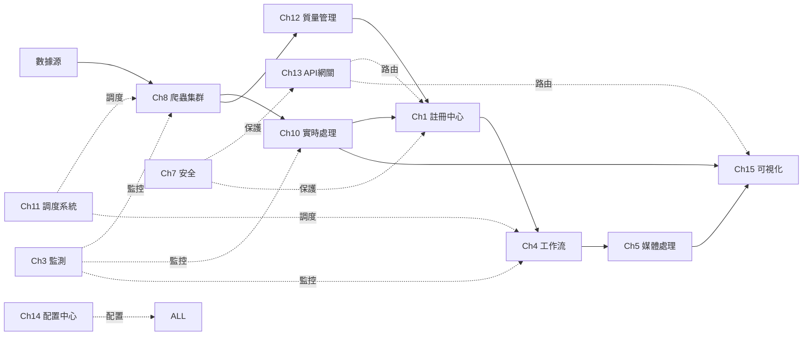

# 🏗️ 鏡界平台 - 架構擴展與完善方案

**設計日期**: 2025-10-31  
**狀態**: 📋 設計中

---

## 📊 當前架構分析

### 現有模塊（Ch1-Ch9）

| 模塊 | 功能定位 | 成熟度 |
|------|---------|--------|
| Ch1 資料源註冊中心 | 資料源統一管理 | ⭐⭐⭐⭐⭐ |
| Ch2 網站指紋分析引擎 | 網站技術棧識別 | ⭐⭐⭐⭐⭐ |
| Ch3 資料源健康監測 | 健康檢查與告警 | ⭐⭐⭐⭐⭐ |
| Ch4 資料處理工作流 | 數據處理編排 | ⭐⭐⭐⭐ |
| Ch5 媒體處理管道 | 多媒體內容處理 | ⭐⭐⭐⭐ |
| Ch6 AI輔助開發 | 智能代碼生成 | ⭐⭐⭐⭐ |
| Ch7 合規與安全 | 數據保護與合規 | ⭐⭐⭐⭐⭐ |
| Ch8 爬蟲集群管理 | 分布式爬蟲 | ⭐⭐⭐⭐ |
| Ch9 系統整合部署 | DevOps與運維 | ⭐⭐⭐⭐⭐ |

### 架構層次分析

```
┌─────────────────────────────────────────────────────┐
│                   應用層（Ch1-Ch8）                    │
│  資料採集 → 處理 → 分析 → 存儲 → 監控 → 安全           │
└─────────────────────────────────────────────────────┘
                           ↓
┌─────────────────────────────────────────────────────┐
│                   平台層（缺失）                       │
│  ❌ 實時處理  ❌ 調度系統  ❌ 質量管理                 │
│  ❌ API網關   ❌ 配置中心  ❌ 服務治理                 │
└─────────────────────────────────────────────────────┘
                           ↓
┌─────────────────────────────────────────────────────┐
│               基礎設施層（Ch9 部分覆蓋）                │
│  ✅ 部署  ✅ 監控  ⚠️ 存儲  ⚠️ 網路                   │
└─────────────────────────────────────────────────────┘
```

### 識別的架構缺口

1. **實時數據處理能力不足** ❌
   - 當前以批處理為主
   - 缺少流式數據處理
   - 無實時計算引擎

2. **統一調度系統缺失** ❌
   - 各模塊獨立調度
   - 資源管理分散
   - 缺少全局優化

3. **數據質量管理薄弱** ⚠️
   - 僅有健康監測
   - 缺少質量評分
   - 無自動清洗機制

4. **API管理不統一** ⚠️
   - 各模塊獨立API
   - 缺少統一網關
   - 無流量控制

5. **配置管理分散** ⚠️
   - 配置散落各處
   - 無統一配置中心
   - 變更管理困難

---

## 🚀 擴展方案設計

### 新增核心模塊（Ch10-Ch15）

#### Ch10: 實時數據處理引擎 ⭐⭐⭐⭐⭐
**優先級**: 🔴 高

**功能定位**:
- 流式數據接入與處理
- 實時計算與分析
- 事件驅動架構支持

**核心能力**:
```yaml
能力:
  - 數據流處理（Kafka Streams / Flink）
  - CEP 複雜事件處理
  - 實時聚合與計算
  - 時間窗口處理
  - 狀態管理
  
技術棧:
  - Apache Kafka
  - Apache Flink
  - Redis Streams
  - ClickHouse（實時OLAP）
  
應用場景:
  - 實時監控數據處理
  - 即時告警觸發
  - 實時報表生成
  - 流量分析
```

**與現有模塊關係**:
- 接收 Ch8（爬蟲）的實時數據流
- 為 Ch3（監測）提供實時分析
- 與 Ch4（工作流）協同處理

---

#### Ch11: 智能調度與資源管理系統 ⭐⭐⭐⭐⭐
**優先級**: 🔴 高

**功能定位**:
- 統一任務調度
- 智能資源分配
- 負載均衡與彈性伸縮

**核心能力**:
```yaml
調度功能:
  - 分布式任務調度
  - 依賴管理（DAG）
  - 優先級調度
  - 失敗重試與補償
  - 調度策略配置
  
資源管理:
  - CPU/Memory 監控
  - 資源配額管理
  - 彈性伸縮（HPA）
  - 資源預測與規劃
  
技術棧:
  - Apache Airflow / Prefect
  - Kubernetes Scheduler
  - Prometheus + Grafana
  
應用場景:
  - 爬蟲任務調度
  - 工作流編排
  - 批處理任務
  - 資源優化
```

**與現有模塊關係**:
- 統一管理 Ch4（工作流）和 Ch8（爬蟲）的調度
- 為所有模塊提供資源管理
- 與 Ch9（部署）集成實現自動擴展

---

#### Ch12: 數據質量管理中心 ⭐⭐⭐⭐
**優先級**: 🟡 中-高

**功能定位**:
- 數據質量監控
- 自動清洗與修復
- 質量報告與追溯

**核心能力**:
```yaml
質量監控:
  - 完整性檢查
  - 準確性驗證
  - 一致性校驗
  - 時效性監控
  - 唯一性檢查
  
清洗能力:
  - 去重
  - 格式標準化
  - 缺失值處理
  - 異常值檢測
  - 數據轉換
  
技術棧:
  - Great Expectations
  - Apache Griffin
  - Pandas / Dask
  
應用場景:
  - 爬蟲數據清洗
  - 數據入庫前驗證
  - 質量報告生成
  - 數據修復
```

**與現有模塊關係**:
- 處理 Ch8（爬蟲）採集的數據
- 為 Ch1（註冊中心）提供質量評分
- 與 Ch4（工作流）集成清洗流程

---

#### Ch13: API 網關與服務管理 ⭐⭐⭐⭐
**優先級**: 🟡 中

**功能定位**:
- 統一 API 入口
- 流量管理與限流
- 服務發現與路由

**核心能力**:
```yaml
網關功能:
  - 請求路由與轉發
  - 負載均衡
  - 協議轉換（HTTP/gRPC）
  - API 版本管理
  
安全功能:
  - 統一認證（JWT/OAuth2）
  - 授權與鑒權
  - API Key 管理
  - IP 白名單
  
流量控制:
  - 限流（Rate Limiting）
  - 熔斷（Circuit Breaker）
  - 降級策略
  - 緩存管理
  
技術棧:
  - Kong / APISIX
  - Nginx
  - Envoy
  
應用場景:
  - 統一 API 入口
  - 第三方接入
  - 內部服務調用
  - API 監控
```

**與現有模塊關係**:
- 為所有模塊提供統一 API 入口
- 與 Ch7（安全）集成認證鑒權
- 與 Ch9（部署）集成服務發現

---

#### Ch14: 統一配置與元數據中心 ⭐⭐⭐⭐
**優先級**: 🟡 中

**功能定位**:
- 集中配置管理
- 元數據存儲與查詢
- 配置版本控制

**核心能力**:
```yaml
配置管理:
  - 分環境配置（Dev/Test/Prod）
  - 動態配置更新
  - 配置版本控制
  - 配置審計
  - 加密配置存儲
  
元數據管理:
  - 數據字典
  - 表結構管理
  - 字段映射
  - 血緣關係
  - 影響分析
  
技術棧:
  - Apollo / Nacos
  - Consul
  - Apache Atlas（元數據）
  
應用場景:
  - 統一配置管理
  - 數據資產管理
  - 數據治理
  - 配置熱更新
```

**與現有模塊關係**:
- 為所有模塊提供配置服務
- 與 Ch1（註冊中心）共享元數據
- 與 Ch7（合規）集成敏感配置管理

---

#### Ch15: 數據可視化與分析平台 ⭐⭐⭐
**優先級**: 🟢 中-低

**功能定位**:
- 數據分析與探索
- 報表生成
- 可視化展示

**核心能力**:
```yaml
分析能力:
  - Ad-hoc 查詢
  - SQL 分析
  - 數據探索
  - 統計分析
  
可視化:
  - 儀表板（Dashboard）
  - 圖表生成
  - 地圖可視化
  - 實時刷新
  
報表:
  - 定時報表
  - 訂閱推送
  - 導出（PDF/Excel）
  - 分享與協作
  
技術棧:
  - Apache Superset
  - Grafana
  - Metabase
  - Jupyter
  
應用場景:
  - 業務報表
  - 運營分析
  - 數據監控
  - 趨勢分析
```

**與現有模塊關係**:
- 展示 Ch3（監測）的監控數據
- 分析 Ch8（爬蟲）採集的數據
- 與 Ch10（實時處理）集成實時看板

---

## 📐 完善後的整體架構

### 三層架構設計

```
┌─────────────────────────────────────────────────────────────┐
│                      展示與交互層                              │
│  Ch15: 數據可視化與分析平台                                    │
│  - Dashboard  - 報表  - 監控看板                              │
└─────────────────────────────────────────────────────────────┘
                              ↓↑
┌─────────────────────────────────────────────────────────────┐
│                      統一接入層                                │
│  Ch13: API 網關與服務管理                                      │
│  - 路由  - 認證  - 限流  - 監控                                │
└─────────────────────────────────────────────────────────────┘
                              ↓↑
┌─────────────────────────────────────────────────────────────┐
│                      應用服務層                                │
│                                                               │
│  數據採集              數據處理              數據服務           │
│  ┌──────────┐        ┌──────────┐        ┌──────────┐      │
│  │ Ch2 指紋  │        │ Ch4 工作流│        │ Ch1 註冊  │      │
│  │ Ch8 爬蟲  │   →    │ Ch5 媒體  │   →    │ Ch6 AI    │      │
│  └──────────┘        │ Ch10實時  │        └──────────┘      │
│                      └──────────┘                            │
│                                                               │
│  質量與監控            安全與合規                               │
│  ┌──────────┐        ┌──────────┐                           │
│  │ Ch3 監測  │        │ Ch7 安全  │                           │
│  │ Ch12質量  │        └──────────┘                           │
│  └──────────┘                                                │
└─────────────────────────────────────────────────────────────┘
                              ↓↑
┌─────────────────────────────────────────────────────────────┐
│                      平台支撐層                                │
│                                                               │
│  Ch11: 智能調度與資源管理                                      │
│  - 任務調度  - 資源管理  - 彈性伸縮                            │
│                                                               │
│  Ch14: 統一配置與元數據中心                                    │
│  - 配置管理  - 元數據  - 數據治理                              │
└─────────────────────────────────────────────────────────────┘
                              ↓↑
┌─────────────────────────────────────────────────────────────┐
│                      基礎設施層                                │
│  Ch9: 系統整合與部署                                           │
│  - Kubernetes  - 監控告警  - CI/CD  - 日誌  - 存儲           │
└─────────────────────────────────────────────────────────────┘
```

---

## 🔄 模塊交互關係

### 數據流向圖



---

## 📋 實施路線圖

### 階段一：平台支撐層（優先級最高）🔴

**時間**: 2-3週

| 模塊 | 工作量 | 關鍵產出 |
|------|--------|---------|
| Ch11 調度系統 | 1週 | 統一調度平台 |
| Ch14 配置中心 | 1週 | 配置管理系統 |

**價值**: 為所有模塊提供基礎支撐

---

### 階段二：核心擴展層（優先級高）🟡

**時間**: 3-4週

| 模塊 | 工作量 | 關鍵產出 |
|------|--------|---------|
| Ch10 實時處理 | 2週 | 流式數據處理 |
| Ch12 質量管理 | 1週 | 數據質量平台 |
| Ch13 API網關 | 1週 | 統一API入口 |

**價值**: 補齊核心能力缺口

---

### 階段三：應用增強層（優先級中）🟢

**時間**: 2週

| 模塊 | 工作量 | 關鍵產出 |
|------|--------|---------|
| Ch15 可視化 | 2週 | 分析與報表平台 |

**價值**: 提升用戶體驗

---

## 💡 設計原則

### 1. 高內聚，低耦合
- 每個模塊職責單一
- 通過標準接口交互
- 避免循環依賴

### 2. 可擴展性
- 插件化架構
- 支持自定義擴展
- 版本兼容性

### 3. 容錯與恢復
- 優雅降級
- 自動重試
- 狀態保存與恢復

### 4. 可觀測性
- 統一日誌格式
- 全鏈路追蹤
- 指標監控

### 5. 安全第一
- 零信任架構
- 最小權限原則
- 數據加密

---

## 📊 預期效果

### 能力提升

| 維度 | 當前 | 完善後 | 提升 |
|------|------|--------|------|
| **實時處理** | ❌ 無 | ✅ 支持 | 🆕 新增 |
| **統一調度** | ⚠️ 分散 | ✅ 統一 | ⬆️ 100% |
| **質量管理** | ⚠️ 基礎 | ✅ 完善 | ⬆️ 200% |
| **API管理** | ⚠️ 分散 | ✅ 統一 | ⬆️ 150% |
| **配置管理** | ❌ 無 | ✅ 集中 | 🆕 新增 |
| **可視化** | ⚠️ 基礎 | ✅ 豐富 | ⬆️ 300% |

### 業務價值

1. **效率提升 50%**
   - 統一調度減少資源浪費
   - 實時處理加快響應速度
   - 自動化質量管理

2. **成本降低 30%**
   - 智能資源管理
   - 彈性伸縮
   - 配置統一管理

3. **可靠性提升 40%**
   - 統一監控告警
   - 自動故障恢復
   - 質量保證機制

---

## 🎯 下一步行動

### 立即開始
1. ✅ 創建 Ch10 實時數據處理引擎文檔
2. ✅ 創建 Ch11 智能調度系統文檔
3. ✅ 創建 Ch12 數據質量管理文檔

### 後續計劃
4. 創建 Ch13-Ch15 文檔
5. 更新整體架構圖
6. 編寫實施指南
7. 更新 README

---

**設計日期**: 2025-10-31  
**設計者**: AI Assistant  
**狀態**: 📋 設計完成，待實施


