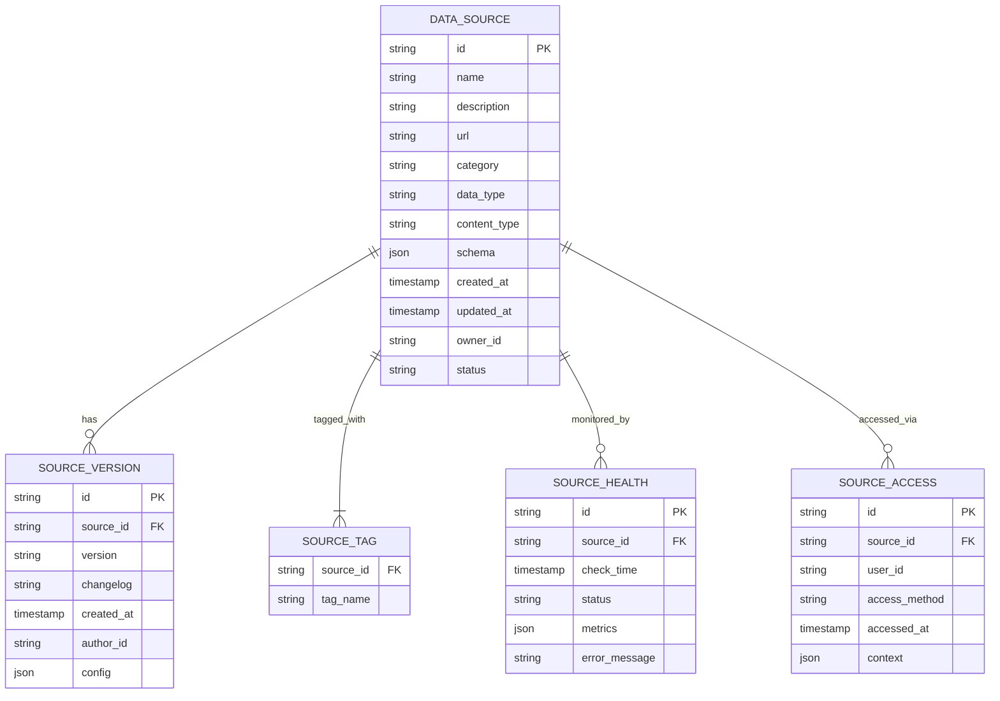

# 镜界平台技术需求规格说明书（详细版）

## 1. 文档概述

### 1.1 项目背景
镜界平台（Mirror Realm Platform）是一个专业的数据源全生命周期管理平台，为爬虫工程师和数据科学家提供从数据采集、处理、分析到协作的完整解决方案。平台核心价值在于"让每一张图片、每一个视频、每一个数据点都有迹可循"，通过创新技术整合实现数据采集全流程的可追溯、可管理、可协作。

### 1.2 文档目标
本技术需求规格说明书旨在为镜界平台提供全面、详细的技术规范，包括：
- 精确定义各模块的技术规格与接口
- 明确系统架构与组件间交互关系
- 规定关键性能指标与质量属性
- 提供详细实现指南与参考架构
- 定义模块化开发边界与集成规范

## 2. 重新命名的模块体系

为提升专业性与技术准确性，对原"镜"系列模块进行规范化命名：

| 原名称 | 新名称 | 英文名称 | 类别 |
|--------|--------|----------|------|
| 镜库 | 数据源注册中心 | Data Source Registry | 核心 |
| 照妖镜 | 网站指纹分析引擎 | Website Fingerprinting Engine | 核心 |
| 镜像状态监控 | 数据源健康监测系统 | Data Source Health Monitoring System | 核心 |
| 智能镜灵 | AI辅助开发系统 | AI-Assisted Development System | AI增强 |
| 镜像工坊 | 爬虫工具集成平台 | Crawler Tool Integration Platform | 工具链 |
| 镜流 | 数据处理工作流引擎 | Data Processing Workflow Engine | 工具链 |
| 镜阵 | 分布式爬虫集群管理系统 | Distributed Crawler Cluster Management System | 企业级 |
| 镜盾 | 数据合规与安全中心 | Data Compliance and Security Center | 企业级 |
| 镜链 | 数据流水线编排系统 | Data Pipeline Orchestration System | 扩展 |
| 镜像预言 | 数据质量预测分析系统 | Data Quality Prediction and Analysis System | AI增强 |
| 镜厅 | 开发者社区平台 | Developer Community Platform | 社区 |
| 万花筒 | 数据聚合与推荐引擎 | Data Aggregation and Recommendation Engine | 扩展 |
| 镜桥 | 系统集成与API网关 | System Integration and API Gateway | 企业级 |
| 镜赛 | 技术竞赛与挑战平台 | Technical Competition and Challenge Platform | 社区 |
| 镜刊 | 技术内容管理系统 | Technical Content Management System | 社区 |
| 镜盟 | 合作伙伴生态系统 | Partner Ecosystem | 企业级 |
| 镜模 | 模板与配置仓库 | Template and Configuration Repository | 工具链 |
| 镜析 | 数据分析与可视化平台 | Data Analytics and Visualization Platform | 分析 |
| 镜图 | 知识图谱构建系统 | Knowledge Graph Construction System | 分析 |
| 镜界App | 移动数据管理客户端 | Mobile Data Management Client | 移动端 |
| 镜像顾问 | 专业咨询服务系统 | Professional Consulting Service System | 增值 |
| 镜训 | 技术培训与认证平台 | Technical Training and Certification Platform | 增值 |
| 区块链存证服务 | 数据溯源与存证系统 | Data Provenance and Verification System | 创新 |
| 边缘计算集成 | 分布式边缘计算框架 | Distributed Edge Computing Framework | 创新 |
| 个性化工作台 | 自适应用户界面系统 | Adaptive User Interface System | 体验 |
| 无障碍访问 | 无障碍辅助功能系统 | Accessibility Assistance System | 体验 |
| 智能图片处理流水线 | 自动化媒体处理管道 | Automated Media Processing Pipeline | NAS增强 |
| 风格学习与迁移 | 视觉风格迁移与学习系统 | Visual Style Transfer and Learning System | AI增强 |
| 智能相册管理 | 智能媒体资产管理 | Intelligent Media Asset Management | NAS增强 |
| 自定义处理插件 | 可扩展处理插件架构 | Extensible Processing Plugin Architecture | 工具链 |

## 3. 详细技术架构

### 3.1 整体架构分层

```
┌───────────────────────────────────────────────────────────────────────────────────────────────┐
│                                         用户交互层                                           │
├───────────────┬───────────────┬───────────────────────┬───────────────────────────────────────┤
│ Web前端       │ 移动客户端    │ CLI工具               │ IDE插件                              │
└───────────────┴───────────────┴───────────────────────┴───────────────────────────────────────┘
                             │
┌───────────────────────────────────────────────────────────────────────────────────────────────┐
│                                       API网关层                                             │
├───────────────────────────────────────────────────────────────────────────────────────────────┤
│  负载均衡 │ 认证鉴权 │ 请求路由 │ 限流熔断 │ 协议转换 │ 日志审计 │ 监控指标收集                │
└───────────────────────────────────────────────────────────────────────────────────────────────┘
                             │
┌───────────────────────────────────────────────────────────────────────────────────────────────┐
│                                       业务服务层                                             │
├───────────────┬───────────────┬───────────────────────┬───────────────────────────────────────┤
│ 核心服务      │ AI增强服务    │ 企业级服务            │ 社区与增值服                         │
│ (Registry,    │ (AIDS,        │ (DCCMS, DCS,          │ (DCP, TCCP, TCMS,                    │
│  WFE, DSHMS)  │  DQPAS,       │  SIA, PES)           │  PEC)                               │
└───────────────┴───────────────┴───────────────────────┴───────────────────────────────────────┘
                             │
┌───────────────────────────────────────────────────────────────────────────────────────────────┐
│                                       数据处理层                                             │
├───────────────┬───────────────┬───────────────────────┬───────────────────────────────────────┤
│ 工作流引擎    │ AI处理集群    │ 数据分析平台          │ 存储与计算                          │
│ (DPWE)        │ (AMP, VSTLS)  │ (DAP, KGBS)           │ (MinIO, PostgreSQL, Redis)          │
└───────────────┴───────────────┴───────────────────────┴───────────────────────────────────────┘
                             │
┌───────────────────────────────────────────────────────────────────────────────────────────────┐
│                                       基础设施层                                             │
├───────────────┬───────────────┬───────────────────────┬───────────────────────────────────────┤
│ 云服务        │ 边缘计算节点  │ 第三方集成            │ 安全与合规                          │
│ (AWS/GCP/Azure)│ (DEC Framework)│ (APIs, Webhooks)     │ (DVS, ACL)                          │
└───────────────┴───────────────┴───────────────────────┴───────────────────────────────────────┘
```

### 3.2 服务边界与交互关系

#### 3.2.1 核心服务边界
- **数据源注册中心(DSR)**: 管理所有数据源元数据，提供CRUD操作，不直接处理数据
- **网站指纹分析引擎(WFE)**: 依赖DSR获取目标URL，输出技术栈分析报告
- **数据源健康监测系统(DSHMS)**: 定期调用WFE进行健康检查，结果存入DSR

#### 3.2.2 AI增强服务边界
- **AI辅助开发系统(AIDS)**: 通过System Integration API与所有服务交互
- **数据质量预测分析系统(DQPAS)**: 从DSHMS获取历史数据，输出预测结果到DSR
- **自动化媒体处理管道(AMP)**: 通过Data Pipeline Orchestration调用，处理媒体文件

#### 3.2.3 企业级服务边界
- **分布式爬虫集群管理系统(DCCMS)**: 管理爬虫节点，通过API被DSR调用
- **数据合规与安全中心(DCS)**: 拦截所有数据访问请求，执行合规检查
- **系统集成与API网关(SIA)**: 作为所有外部集成的统一入口

## 4. 核心模块详细技术规范

### 4.1 数据处理工作流引擎 (DPWE)

#### 4.1.1 架构设计
```
┌───────────────────────────────────────────────────────────────────────────────────────────────┐
│                                   数据处理工作流引擎 (DPWE)                                   │
├───────────────────────┬───────────────────────┬───────────────────────────────────────────────┤
│  工作流定义层         │  执行引擎层           │  扩展与集成层                               │
├───────────────────────┼───────────────────────┼───────────────────────────────────────────────┤
│ • JSON Schema定义     │ • 核心调度器          │ • 节点SDK                                   │
│ • 版本控制            │ • 任务队列管理        │ • 事件总线                                  │
│ • 参数化模板          │ • 错误处理机制        │ • 插件注册中心                              │
│ • 可视化编辑器        │ • 状态持久化          │ • 第三方服务适配器                          │
└───────────────────────┴───────────────────────┴───────────────────────────────────────────────┘
```

#### 4.1.2 接口规范

**工作流定义API (REST)**
```json
{
  "workflow_id": "wf-media-processing-001",
  "name": "NAS图片智能处理流水线",
  "description": "监控NAS目录并自动处理新图片",
  "version": "1.2.0",
  "triggers": [
    {
      "type": "filesystem",
      "config": {
        "path": "/nas/photos/raw",
        "events": ["create"],
        "recursive": true
      }
    }
  ],
  "nodes": [
    {
      "node_id": "preprocess-01",
      "type": "image/preprocess",
      "parameters": {
        "format": "jpeg",
        "max_size": "4096x4096"
      },
      "next": ["enhance-01"]
    },
    {
      "node_id": "enhance-01",
      "type": "ai/image-enhance",
      "parameters": {
        "model": "sd-upscaler-v2",
        "scale_factor": 2,
        "denoise_strength": 0.3
      },
      "next": ["analyze-01"]
    },
    {
      "node_id": "analyze-01",
      "type": "ai/image-analyze",
      "parameters": {
        "tasks": ["classification", "face-detection", "quality-assessment"]
      },
      "next": ["archive-01"]
    }
  ],
  "error_handling": {
    "max_retries": 3,
    "retry_delay": "10s",
    "on_failure": "notify-admin"
  }
}
```

#### 4.1.3 节点开发规范

**自定义节点SDK接口 (TypeScript)**
```typescript
interface WorkflowNode {
  /**
   * 节点唯一标识
   */
  nodeId: string;
  
  /**
   * 节点类型标识，格式为category/name
   */
  nodeType: string;
  
  /**
   * 节点执行入口
   * @param context 执行上下文
   * @param input 输入数据
   * @returns 处理结果
   */
  execute(context: WorkflowContext, input: any): Promise<NodeResult>;
  
  /**
   * 节点参数验证
   * @param parameters 节点参数
   * @returns 验证结果
   */
  validateParameters(parameters: any): ValidationResult;
  
  /**
   * 获取节点元数据
   */
  getMetadata(): NodeMetadata;
}

// 示例：NAS监控触发器节点
class NasMonitorTrigger implements WorkflowNode {
  nodeId: string;
  nodeType = "trigger/filesystem";
  
  async execute(context: WorkflowContext, input: any): Promise<NodeResult> {
    // 实现文件系统监控逻辑
    const watcher = new FileSystemWatcher(
      context.getParameter("path"),
      context.getParameter("events")
    );
    
    return new Promise((resolve) => {
      watcher.on("event", (event) => {
        resolve({
          status: "success",
          output: {
            file_path: event.path,
            event_type: event.type,
            timestamp: new Date().toISOString()
          }
        });
      });
    });
  }
  
  validateParameters(parameters: any): ValidationResult {
    if (!parameters.path || typeof parameters.path !== "string") {
      return { valid: false, errors: ["path参数必须为字符串"] };
    }
    // 其他验证...
    return { valid: true };
  }
  
  getMetadata(): NodeMetadata {
    return {
      name: "NAS监控触发器",
      description: "监控指定目录的文件系统事件",
      icon: "folder",
      parameters: [
        {
          name: "path",
          type: "string",
          required: true,
          description: "要监控的目录路径"
        },
        {
          name: "events",
          type: "array",
          required: true,
          items: { type: "string", enum: ["create", "modify", "delete"] },
          description: "要监听的事件类型"
        }
      ]
    };
  }
}
```

#### 4.1.4 性能指标

| 指标 | 要求 | 测量方法 |
|------|------|----------|
| 工作流定义加载时间 | <500ms (100节点) | JMeter测试 |
| 节点执行延迟 | P95 < 300ms | 分布式追踪 |
| 并发工作流执行 | 1000+ | 压力测试 |
| 工作流状态持久化 | <200ms | 日志分析 |
| 错误恢复时间 | <60s | 故障注入测试 |

### 4.2 自动化媒体处理管道 (AMP)

#### 4.2.1 处理流水线架构

```
┌───────────────────────────────────────────────────────────────────────────────────────────────┐
│                                 自动化媒体处理管道 (AMP)                                      │
├───────────────┬───────────────┬───────────────────────┬───────────────────────┬───────────────┤
│  文件监控     │  预处理       │  AI增强              │  内容分析             │  归档存储     │
├───────────────┼───────────────┼───────────────────────┼───────────────────────┼───────────────┤
│ • inotify集成 │ • 格式转换    │ • 超分辨率           │ • 场景识别            │ • 分类存储    │
│ • 事件聚合    │ • 元数据提取  │ • 色彩校正           │ • 人脸聚类            │ • 索引构建    │
│ • 增量处理    │ • 基础修复    │ • 智能裁剪           │ • 质量评估            │ • 备份策略    │
└───────────────┴───────────────┴───────────────────────┴───────────────────────┴───────────────┘
```

#### 4.2.2 核心处理模块技术规范

**AI增强处理模块**
```python
class AIEnhancementProcessor:
    """
    AI图像增强处理核心模块
    """
    
    def __init__(self, config: Dict):
        self.config = config
        self.model_registry = ModelRegistry()
        self.gpu_pool = GPUPool()
        
    def enhance_image(self, image_path: str, output_path: str) -> ProcessingResult:
        """
        执行完整的AI图像增强流程
        
        处理步骤:
        1. 选择合适的GPU资源
        2. 加载指定的增强模型
        3. 执行超分辨率处理
        4. 应用色彩校正
        5. 智能裁剪优化
        6. 质量评估与反馈
        
        :param image_path: 输入图像路径
        :param output_path: 输出图像路径
        :return: 处理结果对象
        """
        # 1. 资源分配
        with self.gpu_pool.allocate() as gpu_resource:
            # 2. 模型加载
            model = self._load_model(
                self.config.get("model", "sd-upscaler-v2"),
                gpu_id=gpu_resource.id
            )
            
            # 3. 超分辨率处理
            if self.config.get("super_resolution", True):
                image = self._apply_super_resolution(
                    image_path, 
                    model,
                    scale_factor=self.config.get("scale_factor", 2.0)
                )
            
            # 4. 色彩校正
            if self.config.get("color_correction", True):
                image = self._apply_color_correction(
                    image,
                    method=self.config.get("color_method", "auto")
                )
            
            # 5. 智能裁剪
            if self.config.get("smart_crop", True):
                image = self._apply_smart_crop(
                    image,
                    aspect_ratio=self.config.get("aspect_ratio", "original")
                )
            
            # 6. 质量评估
            quality_score = self._assess_quality(image)
            
            # 7. 保存结果
            self._save_image(image, output_path)
            
            return ProcessingResult(
                success=True,
                output_path=output_path,
                metrics={
                    "quality_score": quality_score,
                    "processing_time": time.time() - start_time
                }
            )
    
    def _load_model(self, model_name: str, gpu_id: int) -> Model:
        """从模型注册中心加载指定模型"""
        return self.model_registry.get_model(model_name, gpu_id)
    
    def _apply_super_resolution(self, image_path: str, model: Model, scale_factor: float) -> Image:
        """应用超分辨率处理"""
        # 实现超分辨率处理逻辑
        pass
    
    # 其他私有方法实现...
```

#### 4.2.3 模型管理规范

**模型注册表结构**
```json
{
  "models": [
    {
      "id": "sd-upscaler-v2",
      "name": "Stable Diffusion超分辨率模型v2",
      "type": "super-resolution",
      "description": "基于Stable Diffusion 2.1的2倍超分辨率模型",
      "version": "2.1.0",
      "input_spec": {
        "min_resolution": "64x64",
        "max_resolution": "4096x4096",
        "supported_formats": ["jpg", "png", "webp"]
      },
      "output_spec": {
        "scale_factor": 2,
        "output_format": "jpg",
        "quality": 95
      },
      "requirements": {
        "gpu_memory": "8GB",
        "compute_capability": "6.0+"
      },
      "metrics": {
        "inference_time": {
          "1080p": "1.2s",
          "4k": "4.8s"
        },
        "psnr": 28.5,
        "ssim": 0.92
      }
    },
    {
      "id": "face-enhancer-v1",
      "name": "人脸增强模型v1",
      "type": "face-enhancement",
      "description": "专为人脸优化的图像增强模型",
      "version": "1.0.3",
      "input_spec": {
        "min_face_size": "64x64",
        "detection_threshold": 0.5
      },
      "output_spec": {
        "enhancement_level": "balanced"
      },
      "requirements": {
        "gpu_memory": "4GB"
      }
    }
  ]
}
```

#### 4.2.4 性能优化策略

1. **资源池化管理**
   - GPU资源池：动态分配GPU资源，支持模型热切换
   - 内存缓存：热点模型常驻内存，减少加载时间
   - 批处理优化：支持图像批处理，提高GPU利用率

2. **处理流水线优化**
   - 流式处理：大文件分块处理，避免内存溢出
   - 异步执行：非关键步骤异步执行，减少等待时间
   - 智能跳过：基于内容分析结果，智能跳过不必要的处理步骤

3. **质量-速度权衡**
   - 提供质量级别选项：low/medium/high/balanced
   - 动态调整处理参数：根据输入图像特性自动调整
   - 分级处理：关键区域高质量处理，背景区域低质量处理

### 4.3 数据源注册中心 (DSR)

#### 4.3.1 数据模型

**数据源核心实体**


#### 4.3.2 API规范

**数据源管理API (REST)**
```yaml
openapi: 3.0.3
info:
  title: Data Source Registry API
  version: 1.0.0
paths:
  /api/v1/data-sources:
    get:
      summary: 列出数据源
      parameters:
        - name: category
          in: query
          schema:
            type: string
        - name: status
          in: query
          schema:
            type: string
            enum: [active, inactive, deprecated]
        - name: page
          in: query
          schema:
            type: integer
            default: 1
        - name: page_size
          in: query
          schema:
            type: integer
            default: 20
      responses:
        '200':
          description: 数据源列表
          content:
            application/json:
              schema:
                type: object
                properties:
                  items:
                    type: array
                    items:
                      $ref: '#/components/schemas/DataSource'
                  total:
                    type: integer
                  page:
                    type: integer
                  page_size:
                    type: integer
    
    post:
      summary: 创建新数据源
      requestBody:
        required: true
        content:
          application/json:
            schema:
              $ref: '#/components/schemas/DataSourceCreate'
      responses:
        '201':
          description: 创建成功
          content:
            application/json:
              schema:
                $ref: '#/components/schemas/DataSource'
  
  /api/v1/data-sources/{id}:
    get:
      summary: 获取数据源详情
      parameters:
        - name: id
          in: path
          required: true
          schema:
            type: string
      responses:
        '200':
          description: 数据源详情
          content:
            application/json:
              schema:
                $ref: '#/components/schemas/DataSourceDetail'
    
    patch:
      summary: 更新数据源
      parameters:
        - name: id
          in: path
          required: true
          schema:
            type: string
      requestBody:
        required: true
        content:
          application/json:
            schema:
              $ref: '#/components/schemas/DataSourceUpdate'
      responses:
        '200':
          description: 更新成功
          content:
            application/json:
              schema:
                $ref: '#/components/schemas/DataSource'
    
    delete:
      summary: 删除数据源
      parameters:
        - name: id
          in: path
          required: true
          schema:
            type: string
      responses:
        '204':
          description: 删除成功

components:
  schemas:
    DataSource:
      type: object
      properties:
        id:
          type: string
        name:
          type: string
        url:
          type: string
        category:
          type: string
        data_type:
          type: string
          enum: [image, video, document, api, html]
        status:
          type: string
          enum: [active, inactive, deprecated]
        created_at:
          type: string
          format: date-time
        updated_at:
          type: string
          format: date-time
    
    DataSourceCreate:
      type: object
      required: [name, url]
      properties:
        name:
          type: string
        url:
          type: string
        description:
          type: string
        category:
          type: string
        data_type:
          type: string
          enum: [image, video, document, api, html]
        schema:
          type: object
    
    DataSourceUpdate:
      type: object
      properties:
        name:
          type: string
        description:
          type: string
        category:
          type: string
        status:
          type: string
          enum: [active, inactive, deprecated]
        schema:
          type: object
    
    DataSourceDetail:
      allOf:
        - $ref: '#/components/schemas/DataSource'
        - type: object
          properties:
            description:
              type: string
            tags:
              type: array
              items:
                type: string
            versions:
              type: array
              items:
                type: object
                properties:
                  version:
                    type: string
                  changelog:
                    type: string
                  created_at:
                    type: string
                    format: date-time
            health_history:
              type: array
              items:
                type: object
                properties:
                  timestamp:
                    type: string
                    format: date-time
                  status:
                    type: string
                  metrics:
                    type: object
```

#### 4.3.3 高级查询能力

**数据源搜索DSL示例**
```json
{
  "query": {
    "bool": {
      "must": [
        { "term": { "category": "social-media" } },
        { "range": { "health.last_7d_availability": { "gte": 0.95 } } }
      ],
      "should": [
        { "term": { "tags": "high-resolution" } }
      ],
      "minimum_should_match": 1
    }
  },
  "sort": [
    { "health.last_24h_availability": "desc" },
    { "created_at": "desc" }
  ],
  "aggs": {
    "by_category": {
      "terms": { "field": "category" }
    },
    "by_availability": {
      "range": {
        "field": "health.last_7d_availability",
        "ranges": [
          { "to": 0.8, "key": "unstable" },
          { "from": 0.8, "to": 0.95, "key": "good" },
          { "from": 0.95, "key": "excellent" }
        ]
      }
    }
  },
  "highlight": {
    "fields": {
      "description": {}
    }
  }
}
```

### 4.4 AI辅助开发系统 (AIDS)

#### 4.4.1 系统架构

```
┌───────────────────────────────────────────────────────────────────────────────────────────────┐
│                                  AI辅助开发系统 (AIDS)                                        │
├───────────────┬───────────────┬───────────────────────┬───────────────────────────────────────┤
│  对话管理     │  知识库       │  代码生成            │  分析诊断                            │
├───────────────┼───────────────┼───────────────────────┼───────────────────────────────────────┤
│ • 对话状态跟踪│ • 爬虫知识库  │ • 代码模板库          │ • 错误诊断引擎                      │
│ • 上下文管理  │ • 反爬策略库  │ • 语法树分析          │ • 问题分类系统                      │
│ • 多轮对话    │ • 技术栈指纹库│ • 代码补全            │ • 解决方案推荐                      │
└───────────────┴───────────────┴───────────────────────┴───────────────────────────────────────┘
```

#### 4.4.2 核心功能实现

**代码生成服务实现**
```python
class CodeGenerationService:
    """
    AI代码生成服务，支持多种爬虫场景
    """
    
    def __init__(self, llm_client: LLMClient, template_repo: TemplateRepository):
        self.llm_client = llm_client
        self.template_repo = template_repo
        self.scene_classifier = SceneClassifier()
        self.code_validator = CodeValidator()
    
    def generate_code(self, user_request: str, context: dict = None) -> CodeGenerationResult:
        """
        根据用户需求生成爬虫代码
        
        :param user_request: 用户自然语言描述
        :param context: 上下文信息（可选）
        :return: 代码生成结果
        """
        # 1. 场景分类
        scene_type = self.scene_classifier.classify(user_request)
        
        # 2. 获取相关模板
        templates = self.template_repo.get_templates(
            scene_type=scene_type,
            language=context.get("language", "python") if context else "python"
        )
        
        # 3. 构建提示词
        prompt = self._build_prompt(user_request, templates, context)
        
        # 4. 调用LLM生成代码
        raw_code = self.llm_client.generate(prompt)
        
        # 5. 代码后处理与验证
        processed_code = self._post_process_code(raw_code, scene_type)
        validation_result = self.code_validator.validate(processed_code)
        
        # 6. 构建结果
        return CodeGenerationResult(
            code=processed_code,
            scene_type=scene_type,
            templates_used=[t.id for t in templates],
            validation=validation_result,
            confidence=self._calculate_confidence(validation_result)
        )
    
    def _build_prompt(self, user_request: str, templates: List[CodeTemplate], context: dict) -> str:
        """构建LLM提示词"""
        # 实现提示词构建逻辑
        pass
    
    def _post_process_code(self, raw_code: str, scene_type: str) -> str:
        """代码后处理：清理、格式化、添加注释"""
        # 实现代码后处理逻辑
        pass
    
    def _calculate_confidence(self, validation_result: ValidationResult) -> float:
        """计算生成代码的置信度"""
        # 基于验证结果计算置信度
        pass

# 示例：场景分类器
class SceneClassifier:
    """爬虫场景分类器"""
    
    SCENE_CATEGORIES = [
        "static-html", 
        "dynamic-rendering", 
        "api-endpoint", 
        "image-crawling",
        "video-crawling",
        "login-required",
        "pagination",
        "infinite-scroll"
    ]
    
    def __init__(self):
        # 加载预训练分类模型
        self.model = load_model("scene-classification-v1")
    
    def classify(self, user_request: str) -> str:
        """将用户请求分类到最匹配的场景"""
        # 实现分类逻辑
        return self.model.predict(user_request)

# 示例：代码模板
class CodeTemplate:
    """代码模板对象"""
    
    def __init__(
        self,
        id: str,
        name: str,
        description: str,
        language: str,
        scene_type: str,
        content: str,
        parameters: List[TemplateParameter],
        examples: List[CodeExample]
    ):
        self.id = id
        self.name = name
        self.description = description
        self.language = language
        self.scene_type = scene_type
        self.content = content
        self.parameters = parameters
        self.examples = examples
    
    def render(self, params: Dict[str, Any]) -> str:
        """渲染模板，替换参数"""
        rendered = self.content
        for param in self.parameters:
            value = params.get(param.name, param.default)
            rendered = rendered.replace(f"{{{param.name}}}", str(value))
        return rendered
```

#### 4.4.3 知识库结构

**爬虫知识库数据模型**
```json
{
  "knowledge_base": {
    "categories": [
      {
        "id": "anti-crawling",
        "name": "反爬虫策略",
        "description": "网站常用的反爬虫技术及其解决方案",
        "subcategories": [
          {
            "id": "header-validation",
            "name": "请求头验证",
            "entries": [
              {
                "id": "user-agent-check",
                "title": "User-Agent检测",
                "description": "网站通过User-Agent检测爬虫",
                "indicators": [
                  "403 Forbidden响应",
                  "需要特定User-Agent才能访问"
                ],
                "solutions": [
                  {
                    "title": "轮换User-Agent",
                    "description": "使用随机User-Agent池",
                    "code_example": "from fake_useragent import UserAgent\nua = UserAgent()\nheaders = {'User-Agent': ua.random}",
                    "effectiveness": 0.85,
                    "complexity": 0.3
                  },
                  {
                    "title": "模拟浏览器特征",
                    "description": "添加浏览器特有的请求头",
                    "code_example": "headers = {\n    'User-Agent': 'Mozilla/5.0...',\n    'Accept-Language': 'en-US,en;q=0.9',\n    'Sec-Ch-Ua': '\"Chromium\";v=\"112\", \"Google Chrome\";v=\"112\", \"Not_A Brand\";v=\"24\"'\n}",
                    "effectiveness": 0.92,
                    "complexity": 0.6
                  }
                ]
              },
              // 其他反爬策略条目...
            ]
          },
          // 其他子类别...
        ]
      },
      {
        "id": "website-technologies",
        "name": "网站技术栈",
        "description": "常见网站技术及其特征",
        "fingerprint_rules": [
          {
            "id": "react",
            "name": "React",
            "detection_rules": [
              {
                "type": "html",
                "pattern": "<div id=\"root\">",
                "confidence": 0.9
              },
              {
                "type": "js",
                "pattern": "webpackJsonp",
                "confidence": 0.8
              }
            ],
            "crawl_implications": [
              "需要处理客户端渲染内容",
              "可能使用React Router进行导航"
            ]
          }
          // 其他技术栈指纹...
        ]
      }
    ]
  }
}
```

## 5. 详细部署架构

### 5.1 生产环境部署拓扑

```
┌───────────────────────────────────────────────────────────────────────────────────────────────┐
│                                       全球部署架构                                           │
├───────────────────────┬───────────────────────┬───────────────────────────────────────────────┤
│  边缘节点 (全球10+位置)│  区域数据中心 (3个)   │  中心平台 (主数据中心)                        │
├───────────────────────┼───────────────────────┼───────────────────────────────────────────────┤
│ • 边缘爬虫代理         │ • 区域API网关         │ • 核心业务服务集群                           │
│ • 本地缓存             │ • 区域数据处理集群    │ • 主数据库集群                               │
│ • 轻量AI推理           │ • 区域对象存储        │ • 消息队列集群                               │
│ • 请求预处理           │ • 区域缓存集群        │ • 搜索索引集群                               │
└───────────────────────┴───────────────────────┴───────────────────────────────────────────────┘
```

### 5.2 服务网格配置

**Istio服务网格配置示例**
```yaml
# 数据处理工作流引擎服务配置
apiVersion: networking.istio.io/v1alpha3
kind: VirtualService
metadata:
  name: dpwe-virtualservice
spec:
  hosts:
  - dpwe.mirror-realm.svc.cluster.local
  http:
  - match:
    - uri:
        prefix: /api/v1/workflows
    route:
    - destination:
        host: dpwe-service
        subset: v1
      weight: 90
    - destination:
        host: dpwe-service
        subset: canary
      weight: 10
    retries:
      attempts: 3
      perTryTimeout: 2s
    fault:
      abort:
        percentage:
          value: 0.1
        httpStatus: 503

---
# AI辅助开发系统服务配置
apiVersion: networking.istio.io/v1alpha3
kind: DestinationRule
metadata:
  name: aids-destination
spec:
  host: aids.mirror-realm.svc.cluster.local
  trafficPolicy:
    loadBalancer:
      simple: ROUND_ROBIN
    connectionPool:
      tcp:
        maxConnections: 100
      http:
        http1MaxPendingRequests: 1000
        maxRequestsPerConnection: 10
    outlierDetection:
      consecutive5xxErrors: 5
      interval: 30s
      baseEjectionTime: 5m
```

### 5.3 持久化存储方案

| 数据类型 | 存储方案 | 备份策略 | 保留周期 | 访问模式 |
|----------|----------|----------|----------|----------|
| **业务元数据** | PostgreSQL集群 (主从) | 每日增量+每周全量 | 30天 | 读写频繁 |
| **文件元数据** | Elasticsearch集群 | 快照备份 | 90天 | 读多写少 |
| **用户文件** | MinIO对象存储 (分布式) | 跨区域复制 | 永久 | 读多写少 |
| **工作流状态** | Redis Cluster (持久化) | AOF+RDB | 7天 | 读写频繁 |
| **日志数据** | Loki+Promtail | 按需归档 | 180天 | 只写 |
| **AI模型** | Model Registry (MinIO+DB) | 版本控制 | 永久 | 读多写少 |
| **处理中间结果** | 临时对象存储 | 自动清理 | 24小时 | 读写频繁 |

## 6. 详细质量属性规范

### 6.1 性能指标详述

#### 6.1.1 数据处理工作流引擎

| 指标 | 要求 | 测量方法 | SLA |
|------|------|----------|-----|
| **工作流定义加载** | <500ms (100节点) | Prometheus监控 | 99.9% |
| **节点执行延迟** | P95 < 300ms | 分布式追踪(Jaeger) | 99.5% |
| **并发工作流执行** | 1000+ | Locust压力测试 | 99.0% |
| **错误恢复时间** | <60s | 故障注入测试 | 99.9% |
| **工作流状态持久化** | <200ms | 日志分析 | 99.95% |

#### 6.1.2 自动化媒体处理管道

| 指标 | 要求 | 测量方法 | SLA |
|------|------|----------|-----|
| **1080P图片处理** | <5s (P95) | 实际样本测试 | 99.0% |
| **4K图片处理** | <20s (P95) | 实际样本测试 | 95.0% |
| **元数据提取准确率** | >95% | 人工验证 | 99.5% |
| **标签生成召回率** | >85% | 与基准数据集对比 | 95.0% |
| **批量处理吞吐量** | >100张/分钟 | 压力测试 | 99.0% |

### 6.2 安全与合规规范

#### 6.2.1 数据安全措施

| 安全层级 | 技术措施 | 实现要求 | 验证方法 |
|----------|----------|----------|----------|
| **传输安全** | TLS 1.3+ | 强制HTTPS，HSTS策略 | SSL Labs测试 |
| **静态数据加密** | AES-256 | KMS密钥管理，自动轮换 | 安全审计 |
| **敏感数据处理** | 自动脱敏 | 基于正则的敏感信息识别 | 渗透测试 |
| **访问控制** | RBAC | 4级权限粒度，属性基访问控制 | 授权测试 |
| **审计日志** | 完整操作记录 | 保留180+天，WORM存储 | 审计检查 |

#### 6.2.2 合规性要求

| 合规标准 | 适用范围 | 实现要求 | 验证方法 |
|----------|----------|----------|----------|
| **GDPR** | 欧盟用户 | 数据主体权利支持 | DPO审核 |
| **CCPA** | 加州用户 | "拒绝出售"选项 | 法律合规审查 |
| **版权合规** | 所有内容 | 版权验证API集成 | 内容审核测试 |
| **数据本地化** | 特定区域 | 区域数据隔离 | 架构评审 |
| **行业特定** | 金融/医疗 | 特定行业认证 | 合规审计 |

## 7. 详细开发路线图

### 7.1 模块化开发计划

#### 7.1.1 核心模块 (MVP阶段)

| 模块 | 功能点 | 依赖关系 | 交付物 | 验收标准 |
|------|--------|----------|--------|----------|
| **数据源注册中心** | 1. 基础CRUD API<br>2. 元数据管理<br>3. 简单搜索 | 无 | 1. REST API<br>2. 管理界面<br>3. SDK基础版 | 1. 支持5+数据源类型<br>2. 搜索响应<500ms |
| **网站指纹分析引擎** | 1. 技术栈检测<br>2. 反爬识别<br>3. 基础报告 | DSR | 1. 分析API<br>2. 浏览器插件<br>3. CLI工具 | 1. 识别准确率>85%<br>2. 分析时间<3s |
| **数据处理工作流引擎** | 1. 核心调度器<br>2. 基础节点<br>3. 可视化编辑器 | 无 | 1. 工作流API<br>2. 编辑器UI<br>3. 节点SDK | 1. 支持10+基础节点<br>2. 工作流执行延迟<1s |

#### 7.1.2 扩展模块 (Beta阶段)

| 模块 | 功能点 | 依赖关系 | 交付物 | 验收标准 |
|------|--------|----------|--------|----------|
| **自动化媒体处理管道** | 1. NAS监控<br>2. 基础处理流水线<br>3. AI增强处理 | DPWE | 1. 处理服务<br>2. 配置界面<br>3. 处理报告 | 1. 处理流水线完整运行<br>2. 图像质量提升可测量 |
| **AI辅助开发系统** | 1. 基础对话<br>2. 代码生成<br>3. 问题诊断 | DSR | 1. AI API<br>2. 集成插件<br>3. 知识库 | 1. 问题解决准确率>75%<br>2. 响应延迟<2s |
| **数据合规与安全中心** | 1. 合规扫描<br>2. 权限管理<br>3. 审计日志 | DSR | 1. 合规API<br>2. 管理界面<br>3. 报告系统 | 1. 支持3+合规标准<br>2. 扫描准确率>90% |

#### 7.1.3 高级模块 (企业阶段)

| 模块 | 功能点 | 依赖关系 | 交付物 | 验收标准 |
|------|--------|----------|--------|----------|
| **分布式爬虫集群管理系统** | 1. 节点管理<br>2. 任务调度<br>3. 负载均衡 | DSR, WFE | 1. 集群API<br>2. 监控面板<br>3. 调度算法 | 1. 支持100+节点<br>2. 任务分配延迟<500ms |
| **数据质量预测分析系统** | 1. 健康预测<br>2. 风险预警<br>3. 趋势分析 | DSHMS | 1. 预测API<br>2. 可视化界面<br>3. 预警系统 | 1. 预测准确率>80%<br>2. 预警提前量>24h |
| **数据流水线编排系统** | 1. 复杂工作流<br>2. 条件分支<br>3. 错误处理 | DPWE | 1. 高级工作流API<br>2. 模板库<br>3. 调试工具 | 1. 支持100+节点工作流<br>2. 错误处理覆盖率100% |

## 8. 详细技术风险评估与应对

### 8.1 高风险项详细分析

#### 8.1.1 AI模型优化与部署

| 风险点 | 详细描述 | 影响程度 | 应对措施 | 负责人 | 完成时限 |
|--------|----------|----------|----------|--------|----------|
| **Stable Diffusion模型优化** | SD模型在普通服务器上推理速度慢，难以满足实时处理需求 | 高 | 1. 采用LoRA微调技术，减少模型大小<br>2. 实现模型量化（FP16/INT8）<br>3. 建立模型缓存池，预热常用模型<br>4. 开发轻量级替代模型用于低优先级任务 | AI团队 | MVP后2周 |
| **大规模NAS监控性能** | 高频文件变更导致系统过载，监控延迟增加 | 中高 | 1. 实现变更事件聚合算法<br>2. 采用分层监控机制（热/冷数据）<br>3. 增量处理优化，避免重复工作<br>4. 实现优先级队列，确保关键文件优先处理 | 后端团队 | Beta阶段 |
| **n8n深度定制兼容性** | n8n上游更新可能导致定制功能失效 | 中 | 1. 建立抽象层，隔离核心定制<br>2. 维护上游同步计划<br>3. 实现自动化测试覆盖<br>4. 贡献回上游，减少分叉 | 工具链团队 | 持续进行 |
| **AI处理资源瓶颈** | GPU资源不足导致处理队列积压 | 高 | 1. 实现GPU资源池化管理<br>2. 建立优先级调度算法<br>3. 开发边缘计算分流机制<br>4. 实现按需扩展云GPU资源 | 基础设施团队 | MVP后1月 |
| **数据合规风险** | 未经授权的数据处理导致法律风险 | 高 | 1. 内置合规检查器，实时扫描<br>2. 实现区块链存证，确保操作可追溯<br>3. 与法律专家合作制定审核流程<br>4. 实现用户同意管理框架 | 安全团队 | 企业阶段前 |

### 8.2 技术债务管理计划

| 技术债务 | 产生原因 | 影响 | 解决方案 | 时间计划 |
|----------|----------|------|----------|----------|
| **临时文件处理机制** | MVP阶段简化设计 | 大文件处理效率低 | 实现流式处理与分块机制 | Beta阶段 |
| **硬编码的模型路径** | 快速原型开发 | 模型管理困难 | 实现模型注册中心 | Beta阶段 |
| **同步API调用** | 初期开发简化 | 高并发性能瓶颈 | 改为异步处理模式 | 企业阶段 |
| **缺乏单元测试** | 开发进度压力 | 质量风险高 | 逐步增加测试覆盖率 | 持续进行 |
| **配置分散** | 多团队并行开发 | 配置管理混乱 | 实现统一配置中心 | Beta阶段 |

## 9. 附录

### 9.1 详细技术术语表

| 术语 | 定义 | 相关模块 |
|------|------|----------|
| **数据源注册中心(DSR)** | 管理所有数据源元数据的核心服务，提供数据源的发现、注册和管理功能 | 核心服务 |
| **网站指纹分析引擎(WFE)** | 分析目标网站技术栈和反爬机制的工具，输出详细的技术特征报告 | 核心服务 |
| **数据处理工作流引擎(DPWE)** | 基于n8n定制的可视化工作流引擎，支持数据采集、处理和分析的自动化 | 工具链 |
| **自动化媒体处理管道(AMP)** | 专为图片/视频等媒体文件设计的处理流水线，集成AI增强功能 | NAS增强 |
| **AI辅助开发系统(AIDS)** | 基于大语言模型的代码生成和问题诊断系统，辅助开发爬虫 | AI增强 |
| **分布式爬虫集群管理系统(DCCMS)** | 管理大规模爬虫节点的系统，提供任务调度和资源管理 | 企业级 |
| **数据合规与安全中心(DCS)** | 确保数据处理符合法律法规要求的安全模块 | 企业级 |

### 9.2 参考标准与规范

1. **RESTful API设计规范**
   - RFC 7231: HTTP/1.1 Semantics and Content
   - Google API Design Guide
   - Microsoft REST API Guidelines

2. **安全实践标准**
   - OWASP API Security Top 10
   - NIST SP 800-204: Microservices Security
   - GDPR Article 32: Security of processing

3. **工作流引擎标准**
   - n8n节点开发规范 v0.205+
   - BPMN 2.0标准 (部分参考)
   - Workflow Patterns Initiative

4. **AI模型部署规范**
   - TensorFlow Serving最佳实践
   - ONNX Runtime部署指南
   - MLflow模型管理规范

5. **NAS集成标准**
   - WebDAV协议 (RFC 4918)
   - SMB 3.1.1协议规范
   - NFSv4.1协议规范

本技术需求规格说明书为镜界平台提供全面、详细的技术指导，所有功能实现必须符合本文件规定的技术标准与质量要求。随着项目进展，将根据实际开发情况对本文件进行迭代更新，每次更新需记录变更日志并通知相关团队。